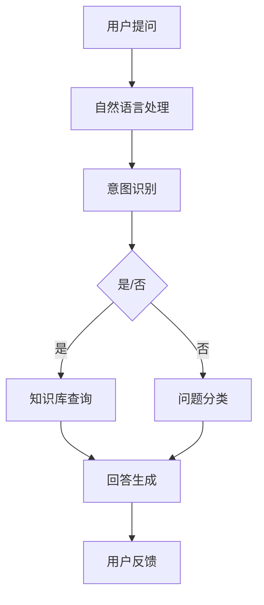
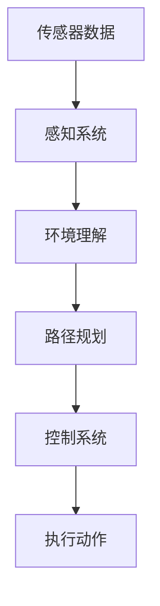
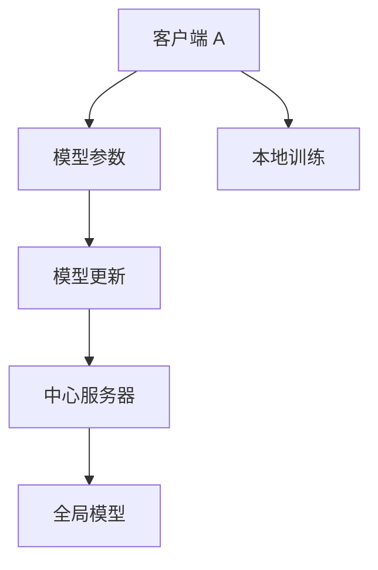

                 

### 第1章: AI 2.0 时代的来临

#### 1.1 AI 2.0 的定义与特征

AI 2.0，即人工智能的第二阶段，是相对于第一代人工智能（AI 1.0）而言的。AI 1.0 主要指规则驱动的人工智能，其核心是通过预先编程的规则来执行特定的任务。而 AI 2.0 则是指以深度学习和大数据为基础，通过自我学习和进化能力来实现更高级别的人工智能。

首先，我们需要明确 AI 2.0 的定义。AI 2.0 可以被定义为：

$$ AI2.0 = AI1.0 + 大数据 + 互联网 + 智能算法 $$

这里，AI 1.0 表示的是传统的人工智能，其核心是基于规则和符号逻辑的方法。而大数据、互联网和智能算法则是 AI 2.0 时代的关键要素。

**大数据**：AI 2.0 的核心在于数据。与传统的人工智能相比，AI 2.0 更加强调大数据的重要性。大数据的规模和多样性为 AI 2.0 提供了丰富的训练素材，使得 AI 2.0 能够通过深度学习和机器学习等方法，从数据中自动提取特征，实现自我学习和进化。

**互联网**：互联网的普及使得 AI 2.0 能够在全球范围内进行数据收集和共享。通过互联网，AI 2.0 可以实时获取海量数据，进行实时学习和预测。此外，互联网也为 AI 2.0 的应用提供了广阔的平台，使得 AI 2.0 能够在各个领域得到广泛的应用。

**智能算法**：AI 2.0 时代，智能算法的发展成为关键。深度学习、强化学习、自然语言处理等智能算法的进步，使得 AI 2.0 能够实现更高级别的智能。这些算法通过模拟人脑的思考方式，实现了从数据到知识、从预测到决策的转化。

接下来，我们来看一下 AI 2.0 的特征。

**跨界融合**：AI 2.0 融合了多种技术，如云计算、物联网、区块链等。这些技术的融合，使得 AI 2.0 能够在更多领域得到应用，实现跨领域的协同创新。

**数据驱动**：AI 2.0 强调数据的重要性，通过收集、分析和利用海量数据，实现智能化决策。数据是 AI 2.0 的基础，没有数据，AI 2.0 就无法进行有效的学习和预测。

**自主进化**：AI 2.0 具备自我学习和进化能力，可以在不断的学习和实践中提高自身的性能。通过自我学习，AI 2.0 能够适应新的环境和任务，实现自我优化。

综上所述，AI 2.0 时代是一个以大数据、互联网和智能算法为核心的时代。它不仅融合了多种技术，还通过自我学习和进化能力，实现了更高水平的人工智能。

#### 1.2 AI 2.0 在社会中的应用

AI 2.0 的应用范围非常广泛，几乎涵盖了社会的各个方面。下面，我们将分别从经济领域、教育领域和医疗领域来探讨 AI 2.0 的应用。

**经济领域**

在 AI 2.0 时代，人工智能技术在经济领域得到了广泛的应用。以下是几个典型的应用场景：

1. **智能金融**：人工智能技术在金融领域的应用主要体现在风险控制、投资决策、客户服务等方面。例如，通过大数据分析和机器学习技术，银行可以更准确地预测贷款违约风险，从而优化贷款审批流程。此外，智能客服系统可以提供24小时在线服务，提高客户满意度。

2. **智能制造**：智能制造是 AI 2.0 在经济领域的一个重要应用方向。通过人工智能技术，企业可以实现生产线的自动化和智能化，提高生产效率和产品质量。例如，机器人可以自动执行生产任务，减少人为错误，提高生产效率。同时，人工智能还可以帮助企业优化供应链管理，降低生产成本。

**教育领域**

在 AI 2.0 时代，人工智能技术在教育领域也发挥着重要作用。以下是几个典型的应用场景：

1. **智能教育**：人工智能技术可以为学习者提供个性化的学习路径。通过分析学习者的学习习惯、成绩和行为数据，智能教育系统能够为学习者推荐最适合他们的学习资源和课程。此外，智能教育还可以通过模拟考试、智能批改作业等方式，提高学习效果。

2. **在线教育**：在线教育是 AI 2.0 在教育领域的一个重要应用方向。通过人工智能技术，在线教育平台可以提供更加丰富的教学资源，满足不同学习者的需求。例如，通过自然语言处理技术，在线教育平台可以实现实时翻译、智能问答等功能，提高学习体验。

**医疗领域**

在 AI 2.0 时代，人工智能技术在医疗领域也取得了重要进展。以下是几个典型的应用场景：

1. **智能医疗**：人工智能技术可以用于疾病诊断、治疗方案推荐等方面。通过分析患者的病历、检查结果等数据，智能医疗系统可以提供更准确的诊断和治疗方案。例如，通过深度学习技术，AI 可以从大量的医学影像数据中自动识别疾病，提高诊断准确率。

2. **远程医疗**：远程医疗是 AI 2.0 在医疗领域的一个重要应用方向。通过人工智能技术和互联网，患者可以在家中接受医生的诊断和治疗，节省了时间和交通成本。例如，通过智能语音助手，患者可以随时咨询医生，获取医疗建议。

综上所述，AI 2.0 在社会中的应用非常广泛，涵盖了经济、教育、医疗等多个领域。通过人工智能技术，我们可以实现更高效、更智能的社会运作，提高生活质量。

### 第2章: AI 2.0 对社会的影响

#### 2.1 经济影响

AI 2.0 对经济的影响是深远而广泛的。首先，AI 2.0 促进了新产业、新业态的快速发展。例如，智能金融、智能制造、智能医疗等新兴产业的兴起，不仅带动了经济增长，还创造了大量的就业机会。其次，AI 2.0 推动了传统产业的转型升级。通过人工智能技术，传统产业可以实现生产流程的自动化和智能化，提高生产效率，降低生产成本。此外，AI 2.0 还有助于优化资源配置，提高经济运行的效率。例如，通过大数据分析和预测，企业可以更准确地制定生产计划，减少库存积压，提高市场响应速度。总的来说，AI 2.0 对经济的贡献体现在多个方面，包括提高生产效率、优化资源配置、促进创新等。

#### 2.2 社会影响

AI 2.0 对社会的影响也是不可忽视的。首先，AI 2.0 改变了就业结构。随着人工智能技术的发展，一些传统的、低技能的岗位可能会被自动化取代，这可能会对部分劳动者造成就业压力。但同时，AI 2.0 也创造了大量新的、高技能的就业机会。例如，数据科学家、人工智能工程师等岗位的需求大幅增加。其次，AI 2.0 有助于解决社会不平等问题。通过人工智能技术，我们可以更精准地分配教育资源、医疗服务等公共服务，提高社会的公平性。此外，AI 2.0 还有助于改善公共服务。例如，智能交通系统可以减少交通拥堵，提高出行效率；智能医疗系统可以提高疾病诊断的准确性，降低医疗成本。总的来说，AI 2.0 对社会的影响是双重的，既带来了挑战，也带来了机遇。

#### 2.3 法规与伦理

随着 AI 2.0 的发展，数据安全、隐私保护、伦理问题等也成为亟待解决的问题。首先，数据安全是 AI 2.0 发展的关键。个人隐私和数据安全需要得到有效保护，防止数据泄露和滥用。其次，伦理问题也需要引起广泛关注。如何确保人工智能技术的公平性、透明性和可控性，是当前人工智能领域面临的重要挑战。例如，人工智能系统在决策过程中是否存在歧视现象，如何保证人工智能系统的决策过程是公正的，这些都是需要深入探讨的问题。此外，如何制定合理的法律法规，规范人工智能技术的发展和应用，也是当前亟待解决的问题。总的来说，AI 2.0 的法规与伦理问题，需要社会各界的共同努力，通过立法、监管、教育等手段，确保人工智能技术的健康发展。

## 第3章: AI 2.0 时代的社会价值

### 3.1 社会价值分析

在 AI 2.0 时代，人工智能技术不仅在经济领域发挥了重要作用，其社会价值也日益凸显。首先，AI 2.0 对经济增长的贡献体现在多个方面。通过提高生产效率、优化资源配置、促进创新，AI 2.0 有助于推动经济的可持续发展。例如，智能制造技术的应用，使得企业能够实现生产线的自动化和智能化，提高生产效率和产品质量，从而降低生产成本。此外，AI 2.0 还有助于推动新兴产业的发展，如智能金融、智能医疗、智能交通等，这些新兴产业的兴起不仅带动了经济增长，还创造了大量的就业机会。

**经济价值**

AI 2.0 的经济价值主要体现在以下几个方面：

1. **提高生产效率**：通过自动化和智能化技术的应用，企业可以减少人力成本，提高生产效率。例如，在制造业中，机器人可以替代人力完成复杂的组装和焊接工作，从而提高生产效率和产品质量。

2. **优化资源配置**：AI 2.0 技术可以帮助企业更准确地预测市场需求，优化生产计划，减少库存积压，提高资源利用效率。例如，通过大数据分析和预测，企业可以更好地掌握消费者的购买习惯，从而调整生产计划，满足市场需求。

3. **促进创新**：AI 2.0 技术的快速发展，推动了新产业、新业态的涌现。例如，智能金融、智能医疗、智能交通等领域的发展，不仅带动了经济增长，还推动了相关技术的不断创新。

**社会价值**

AI 2.0 的社会价值同样不可忽视。首先，AI 2.0 有助于改善教育、医疗等公共服务，提高人民生活质量。例如，智能教育系统可以根据学习者的学习习惯和成绩，提供个性化的学习资源和课程，提高学习效果。智能医疗系统可以通过分析患者的病历和检查结果，提供更准确的诊断和治疗方案，提高医疗服务质量。

其次，AI 2.0 有助于解决社会不平等问题。通过人工智能技术，我们可以更精准地分配教育资源、医疗服务等公共服务，提高社会的公平性。例如，通过智能教育系统，我们可以确保贫困地区的孩子也能享受到优质的教育资源。

此外，AI 2.0 还有助于改善人们的生活质量。例如，智能交通系统可以减少交通拥堵，提高出行效率；智能家居系统可以提供舒适、便捷的生活方式。

综上所述，AI 2.0 时代的社会价值体现在多个方面，不仅推动了经济的可持续发展，还有助于改善公共服务，提高人民生活质量，解决社会不平等问题。随着 AI 2.0 技术的不断发展，其社会价值将得到进一步的体现。

### 3.2 案例分析

为了更具体地了解 AI 2.0 时代的社会价值，我们可以通过一些实际案例来进行分析。

#### 案例 1：智能医疗

智能医疗是 AI 2.0 在医疗领域的一个重要应用。通过人工智能技术，医疗系统可以实现对疾病的早期筛查、诊断和个性化治疗。以下是智能医疗的几个典型应用场景：

1. **疾病早期筛查**：通过深度学习算法，AI 可以从大量的医学影像数据中自动识别疾病，例如乳腺癌、肺癌等。例如，谷歌的 DeepMind 医疗团队使用深度学习算法分析超过 116,000 张视网膜图像，发现糖尿病视网膜病变的准确率超过了专业医生。

2. **个性化治疗**：通过分析患者的病历、基因数据和生活方式，AI 可以为患者提供个性化的治疗方案。例如，IBM 的 Watson for Oncology 可以根据患者的病情和基因信息，推荐最合适的治疗方案。

3. **智能药物研发**：AI 可以帮助研究人员快速筛选和优化药物候选物，加速新药的研发进程。例如，微软的 AI 技术已经帮助研究人员发现了一种可能用于治疗老年痴呆症的药物。

#### 案例 2：智能制造

智能制造是 AI 2.0 在工业领域的一个重要应用。通过人工智能技术，企业可以实现生产线的自动化和智能化，提高生产效率和产品质量。以下是智能制造的几个典型应用场景：

1. **生产线自动化**：通过机器人技术和自动化控制系统的应用，企业可以实现生产线的自动化操作，减少人力成本，提高生产效率。例如，富士康的机器人生产线可以自动完成组装、焊接等操作。

2. **质量控制**：AI 可以通过对生产过程的数据分析，实时监控产品质量，及时发现并解决生产问题。例如，西门子的智能制造系统可以通过传感器实时监测生产过程中的参数，自动调整生产过程，确保产品质量。

3. **智能物流**：通过人工智能技术，企业可以实现智能物流系统的建设，优化物流流程，提高物流效率。例如，京东的智能物流系统可以通过 AI 算法实时预测订单需求，优化配送路径，提高配送速度。

#### 案例 3：智能金融

智能金融是 AI 2.0 在金融领域的一个重要应用。通过人工智能技术，金融机构可以实现风险控制、投资决策、客户服务等方面的智能化。以下是智能金融的几个典型应用场景：

1. **风险控制**：通过大数据分析和机器学习技术，金融机构可以更准确地预测风险，优化风险管理策略。例如，摩根士丹利使用机器学习算法对客户交易数据进行分析，提高了风险预警的准确性。

2. **投资决策**：通过 AI 技术分析市场数据，金融机构可以更准确地预测市场趋势，制定投资策略。例如，高盛的 AI 系统可以实时分析全球市场数据，为投资者提供投资建议。

3. **客户服务**：通过智能客服系统和语音识别技术，金融机构可以提供更高效、更个性化的客户服务。例如，阿里巴巴的智能客服系统可以通过语音识别和自然语言处理技术，实时回答客户的问题。

通过以上案例分析，我们可以看到，AI 2.0 在不同领域的应用，都极大地提高了生产效率、优化了资源分配、改善了公共服务，从而体现了其显著的社会价值。

### 3.3 未来展望

在 AI 2.0 时代，人工智能技术将继续快速发展，对经济和社会产生深远影响。以下是一些对未来发展的展望：

#### 趋势 1：AI 2.0 与各行各业的深度融合

随着 AI 技术的不断进步，未来 AI 2.0 将与各行各业的深度融合，推动产业的全面智能化。例如，在农业领域，AI 2.0 可以通过智能农机和大数据分析，实现精准农业，提高农作物产量和品质。在能源领域，AI 2.0 可以通过智能电网和智能能源管理，优化能源分配，提高能源利用效率。

#### 趋势 2：人工智能技术的自主进化

未来，人工智能技术将更加注重自主进化能力。通过自我学习和优化，AI 2.0 将能够在复杂环境下进行自适应，提高系统性能。例如，自动驾驶汽车可以通过实时学习和优化，提高驾驶安全性，降低交通事故发生率。

#### 挑战 1：数据隐私和安全问题

随着 AI 2.0 的发展，数据隐私和安全问题将变得更加突出。如何确保数据的安全和隐私，防止数据泄露和滥用，将成为重要挑战。例如，在医疗领域，患者病历和基因数据的隐私保护需要得到高度重视。

#### 挑战 2：人工智能的伦理问题

未来，人工智能的伦理问题也将成为重要议题。如何确保人工智能技术的公平性、透明性和可控性，避免对人类社会产生负面影响，需要全社会共同努力。例如，在就业领域，如何避免 AI 技术导致大规模失业，需要政府、企业和学术界共同探讨解决方案。

#### 挑战 3：法规与监管

随着 AI 2.0 的发展，相关法律法规和监管体系也需要不断完善。如何制定合理的法规，规范人工智能技术的研发和应用，保护公众利益，是当前亟待解决的问题。

### 结论

AI 2.0 时代的社会价值巨大，其对经济和社会的推动作用不可忽视。然而，同时我们也需要面对数据隐私和安全、伦理问题、法规监管等方面的挑战。只有全社会共同努力，才能确保 AI 2.0 技术的健康发展，为人类社会带来更多福祉。

## 附录

### 附录 A: AI 2.0 技术与应用概述

#### A.1 AI 2.0 技术基础

AI 2.0 技术的核心是基于深度学习和大数据的。深度学习是一种通过多层神经网络模拟人脑学习过程的人工智能技术，其关键在于通过大量数据训练，使神经网络能够自动提取特征，进行分类、预测等任务。大数据则是 AI 2.0 的重要基础，通过收集、存储和分析海量数据，可以挖掘出隐藏在数据中的价值。

**深度学习**

深度学习的基本原理是通过多层神经网络对数据进行处理。每一层神经网络都会对输入数据进行处理，并将结果传递到下一层。通过这种方式，神经网络可以逐步提取数据的特征，达到对数据的分类、预测等任务。

以下是一个简单的深度学习算法伪代码：

```python
# 输入数据 x
# 权重 w
# 激活函数 f(x)
# 学习率 alpha

for epoch in range(num_epochs):
    for x in data:
        # 前向传播
        z = x * w
        a = f(z)

        # 反向传播
        delta = (expected - a) * f'(a)
        w = w - alpha * delta

# 输出预测结果 a
```

**大数据**

大数据技术的核心是数据存储、处理和分析。大数据系统需要处理的数据规模庞大，且数据类型多样。常见的大数据处理技术包括分布式存储、分布式计算和实时处理等。

以下是一个大数据处理流程的伪代码：

```python
# 输入数据 data
# 存储系统 storage
# 处理系统 processor

# 数据存储
storage.save(data)

# 数据处理
result = processor.analyze(storage.load())

# 输出结果 result
```

#### A.2 AI 2.0 应用实例

**智能客服**

智能客服是 AI 2.0 在客户服务领域的一个重要应用。通过自然语言处理和机器学习技术，智能客服系统可以理解和回应用户的提问，提供即时的服务。

以下是一个智能客服系统的基本架构：



**自动驾驶**

自动驾驶是 AI 2.0 在交通运输领域的一个重要应用。通过计算机视觉、深度学习和传感器技术，自动驾驶系统能够识别道路环境，进行路径规划和控制。

以下是一个自动驾驶系统的基本架构：



### 附录 B: AI 2.0 的发展前景

#### B.1 技术发展趋势

**强化学习**

强化学习是一种通过奖励和惩罚机制进行学习的人工智能技术。在未来，强化学习有望在复杂决策场景中发挥重要作用，如自动驾驶、智能金融等。

以下是一个简单的强化学习算法伪代码：

```python
# 状态 s
# 动作 a
# 奖励 r
# Q(s, a)

for episode in range(num_episodes):
    s = environment.reset()
    done = False
    
    while not done:
        a = policy(s)
        s', r = environment.step(a)
        Q[s, a] = Q[s, a] + alpha * (r + gamma * max(Q[s', a']) - Q[s, a])
        s = s'
        
        if done:
            break

# 输出 Q(s, a)
```

**联邦学习**

联邦学习是一种在多个分布式设备上进行模型训练的人工智能技术。在未来，联邦学习有望解决数据隐私和安全问题，提高模型训练的效率。

以下是一个联邦学习算法的基本架构：



#### B.2 社会影响

**经济影响**

AI 2.0 将继续推动经济的转型升级，促进新产业、新业态的快速发展。例如，智能制造、智能医疗、智能金融等领域的发展，将带动相关产业链的繁荣。

**社会影响**

AI 2.0 将改善公共服务，提高人民生活质量。例如，智能教育、智能医疗、智能交通等领域的应用，将提高公共服务的效率和公平性。

### 参考文献

1. Bengio, Y. (2009). Learning Deep Architectures for AI. Foundations and Trends in Machine Learning, 2(1), 1-127.
2. Russell, S., & Norvig, P. (2016). Artificial Intelligence: A Modern Approach. Prentice Hall.
3. LeCun, Y., Bengio, Y., & Hinton, G. (2015). Deep Learning. Nature, 521(7553), 436-444.
4. Goodfellow, I., Bengio, Y., & Courville, A. (2016). Deep Learning. MIT Press.
5. Chollet, F. (2017). Deep Learning with Python. Manning Publications.
6. Sutton, R. S., & Barto, A. G. (2018). Reinforcement Learning: An Introduction. MIT Press.
7. Konečný, J., McMahan, H. B., Yu, F. X., Richtárik, P., Suresh, A. T., & Bacon, D. (2016). Federated Learning: Strategies for Improving Communication Efficiency. arXiv preprint arXiv:1610.05492.

## 作者信息

**作者：AI天才研究院/AI Genius Institute & 禅与计算机程序设计艺术 /Zen And The Art of Computer Programming** <sop><|user|>

