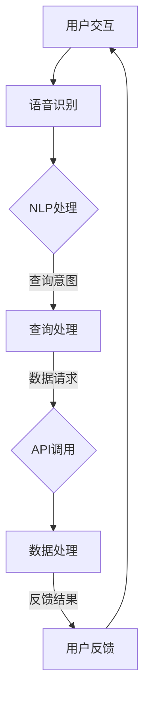
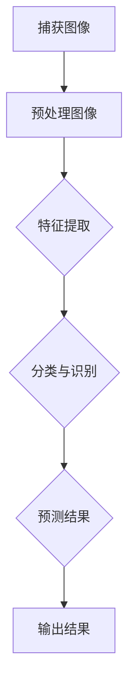

                 

### 第一部分：AI应用市场分析

#### 第1章：AI应用市场的现状与发展趋势

##### 1.1 AI技术的发展与应用

人工智能（AI）作为一种颠覆性的技术，已经在全球范围内得到了广泛的应用。AI技术主要包括机器学习、深度学习、计算机视觉、自然语言处理等领域。这些技术不仅极大地提高了生产效率，还改变了我们的生活方式。

**1.1.1 AI技术的定义与分类**

AI技术是指由人制造出的系统所表现出的智能行为，它可以通过计算机程序实现。AI技术可以按照功能划分为以下几类：

- 机器学习：通过数据训练模型，实现自动学习和预测。
- 深度学习：一种特殊的机器学习方法，通过多层神经网络来实现复杂的特征提取和分类。
- 计算机视觉：让计算机具备识别和理解图像的能力。
- 自然语言处理：让计算机理解和生成人类语言。

**1.1.2 AI技术的发展历程**

AI技术的发展可以追溯到20世纪50年代，随着计算机技术的发展和算法的进步，AI技术经历了多个阶段：

- 第一阶段：1956年，人工智能成为研究热点，但受到硬件和算法的限制，未能取得实质性突破。
- 第二阶段：20世纪80年代，专家系统的出现使得AI技术得到了实际应用。
- 第三阶段：21世纪初，深度学习的兴起使得AI技术取得了重大突破。
- 第四阶段：当前，AI技术正在向通用人工智能（AGI）迈进。

**1.1.3 AI技术在各行各业的广泛应用**

AI技术在各行各业中得到了广泛应用，如：

- 制造业：通过AI技术实现自动化生产线，提高生产效率。
- 金融业：利用AI技术进行风险管理、信用评估等。
- 医疗保健：通过AI技术实现疾病诊断、个性化治疗等。
- 交通运输：自动驾驶、智能交通管理等。
- 教育：通过AI技术实现个性化教学、智能评估等。

##### 1.2 AI应用市场的现状

AI应用市场正呈现出快速增长的趋势。根据市场研究机构的预测，全球AI市场规模将在未来几年内持续扩大。

**1.2.1 全球AI市场概况**

全球AI市场主要分布在北美、欧洲和亚洲等地区。其中，北美地区由于科技发达、企业投入大，占据了全球AI市场的主导地位。欧洲和亚洲地区的AI市场也在快速发展，尤其是中国和印度等新兴市场国家。

**1.2.2 主要国家AI市场发展情况**

- 美国：美国在AI技术研究和应用方面处于领先地位，拥有众多顶尖的AI企业和研究机构。
- 欧洲：欧洲各国也在积极推动AI技术的发展，例如德国、英国、法国等。
- 亚洲：中国、日本、韩国等亚洲国家的AI市场发展迅速，尤其在智能制造、金融科技等领域。

**1.2.3 AI应用市场的关键驱动力**

AI应用市场的增长主要受到以下几个因素的驱动：

- 数据：随着互联网和物联网的发展，数据量呈现爆炸式增长，为AI技术的应用提供了丰富的数据资源。
- 技术进步：深度学习、强化学习等AI技术的不断进步，使得AI应用更加广泛和精准。
- 政策支持：各国政府纷纷出台相关政策，鼓励AI技术的发展和应用。
- 企业投入：企业对AI技术的重视程度不断提高，加大了在AI技术上的研发和投资。

##### 1.3 AI应用市场的发展趋势

未来，AI应用市场将继续保持快速增长，以下是一些发展趋势：

**1.3.1 AI技术的未来发展方向**

- 通用人工智能（AGI）：这是AI技术的最终目标，实现具有人类智能的计算机系统。
- 小样本学习：减少对大量数据的依赖，通过少量数据进行训练。
- 解释性AI：提高AI模型的透明度和可解释性，增强用户对AI系统的信任。
- 增强学习：结合人类知识和经验，实现更加智能的决策和优化。

**1.3.2 AI应用市场的新兴领域**

- 智能制造：通过AI技术实现生产过程的自动化和智能化。
- 自动驾驶：自动驾驶技术的发展有望改变交通运输行业。
- 医疗保健：AI技术在疾病诊断、药物研发等领域的应用前景广阔。
- 金融科技：AI技术在金融领域的应用将大大提高金融服务的效率和安全性。

**1.3.3 AI应用市场面临的挑战与机遇**

- 挑战：数据隐私、伦理问题、技术不完善等。
- 机遇：市场规模不断扩大，新兴领域不断涌现。

### 第二部分：苹果发布AI应用的背景与意义

#### 第2章：苹果公司的AI战略

##### 2.1 苹果公司AI战略的发展历程

苹果公司在AI领域的战略可以追溯到2010年，当时苹果公司开始投资AI技术研发，并在随后的几年中不断加大投入。以下是对苹果公司AI战略的发展历程的回顾：

**2.1.1 苹果公司AI技术研发历程**

- 2010年，苹果公司收购了Siri公司，将其集成到iOS系统中，开始布局AI语音助手市场。
- 2011年，苹果公司成立AI实验室，专注于机器学习和自然语言处理技术的研究。
- 2017年，苹果公司发布语音识别技术API，允许开发者将Siri语音识别功能集成到自己的应用中。
- 2018年，苹果公司推出M系列芯片，内置了神经网络引擎，用于加速AI计算。
- 2019年，苹果公司在全球开发者大会上展示了其AI技术在图像识别、语音识别、自然语言处理等领域的进展。

**2.1.2 苹果公司AI产品发展概况**

苹果公司在AI领域的布局涵盖了多个产品线，以下是其中一些重要的AI产品：

- Siri：苹果公司的语音助手，通过自然语言处理技术，提供语音查询、语音指令等服务。
- Face ID：利用计算机视觉和深度学习技术，实现人脸识别解锁功能。
- Live Photos：通过计算机视觉技术，实现动态照片效果。
- Animoji：基于面部捕捉和计算机视觉技术，创造出个性化的虚拟形象。

**2.1.3 苹果公司AI战略的调整与更新**

随着AI技术的快速发展，苹果公司不断调整和更新其AI战略，以适应市场的变化。以下是苹果公司AI战略的调整与更新：

- 2020年，苹果公司在全球开发者大会上发布了新的神经网络引擎，提高了AI计算的效率。
- 2021年，苹果公司发布了新的机器学习框架Core ML，使开发者能够更轻松地将机器学习模型集成到iOS、macOS和watchOS中。
- 2022年，苹果公司在全球开发者大会上展示了其最新的AI研究成果，包括用于增强现实和自动驾驶的AI技术。

##### 2.2 AI应用在苹果产品中的体现

苹果公司在其产品中广泛应用了AI技术，以下是一些典型的应用案例：

**2.2.1 AI技术在苹果手机中的应用**

- 语音识别：Siri语音助手通过语音识别技术，实现语音查询和指令。
- 计算摄影：苹果手机的相机通过AI算法，实现照片的自动优化、背景虚化等功能。
- 安全认证：Face ID通过面部识别技术，实现安全的解锁和身份验证。
- 智能助理：健康应用通过机器学习算法，分析用户的健康数据，提供个性化的健康建议。

**2.2.2 AI技术在苹果平板电脑中的应用**

- 自动布局：iPad的智能键盘通过AI技术，自动调整键盘布局，以适应不同的文本内容。
- 多任务处理：通过AI技术，iPad可以实现更智能的多任务处理功能，例如同时使用多个应用而不影响性能。

**2.2.3 AI技术在苹果电脑中的应用**

- 语音输入：Mac的语音输入功能通过AI技术，实现更准确、自然的语音识别。
- 图像识别：Mac的图像识别功能通过AI算法，自动识别和分类图片。
- 自然语言处理：Mac的文本处理功能通过自然语言处理技术，实现更智能的文本编辑和翻译。

##### 2.3 苹果发布AI应用的背景与意义

苹果公司发布AI应用的背景和意义主要体现在以下几个方面：

**2.3.1 苹果发布AI应用的行业背景**

随着AI技术的不断进步，智能手机、平板电脑和电脑等设备在性能和智能化方面都有了显著的提升。苹果公司作为全球领先的科技企业，发布AI应用可以：

- 提高产品的竞争力：通过AI技术，苹果公司可以为其产品提供更智能的功能，提升用户体验。
- 扩大市场占有率：AI技术的应用可以吸引更多用户，提高市场占有率。
- 领先行业趋势：苹果公司通过发布AI应用，展示其在AI技术领域的领先地位。

**2.3.2 苹果发布AI应用的商业意义**

苹果公司发布AI应用具有以下商业意义：

- 增加收入来源：通过开发和应用AI技术，苹果公司可以推出更多创新产品，增加收入来源。
- 提高利润率：AI技术的应用可以降低生产成本，提高产品利润率。
- 拓展市场：通过AI应用，苹果公司可以进入更多新兴市场，扩大市场份额。

**2.3.3 苹果发布AI应用的社会影响**

苹果公司发布AI应用对社会的影响主要体现在以下几个方面：

- 促进技术创新：苹果公司的AI应用可以推动AI技术的进步，为行业创新提供动力。
- 改善生活质量：AI技术的应用可以改善人们的生活质量，提高工作效率和生活便利性。
- 提升社会信任度：通过透明、可解释的AI应用，苹果公司可以提高用户对AI技术的信任度。

### 第三部分：苹果AI应用的案例解析

#### 第3章：深度学习相机应用案例解析

##### 3.1 深度学习相机应用概述

深度学习相机应用是一种基于深度学习算法的计算机视觉技术，通过训练模型，实现图像识别、分类和分割等功能。在苹果产品中，深度学习相机应用得到了广泛应用，如手机摄影、视频处理、人脸识别等。以下是对深度学习相机技术原理的概述：

**3.1.1 深度学习相机技术原理**

深度学习相机技术是基于深度学习算法的计算机视觉技术。它通过训练大量图像数据集，使得相机能够自动识别和分类各种物体和场景。

1. 数据采集：收集大量包含不同物体和场景的图片数据。
2. 数据预处理：对图片数据进行归一化、裁剪、旋转等预处理操作。
3. 模型训练：使用预处理后的数据集训练深度学习模型。
4. 模型部署：将训练好的模型部署到相机设备上。
5. 实时检测：通过相机实时捕捉图像，并输入到模型中进行物体分类。

**3.1.2 深度学习相机在苹果手机中的应用**

在苹果手机中，深度学习相机技术主要用于以下场景：

- 照片分类：自动识别和分类拍摄的照片，如人物、风景、动物等。
- 拍摄优化：通过AI算法优化拍摄效果，如夜景模式、人像模式等。
- 人脸识别：利用深度学习算法，实现人脸识别解锁功能。
- 视频处理：通过AI技术，实现视频的特效处理、智能剪辑等功能。

##### 3.2 案例解析：苹果深度学习相机应用

**3.2.1 深度学习相机应用的功能特点**

苹果深度学习相机应用具有以下功能特点：

- 高准确率：通过大量数据训练的模型，实现高准确率的图像识别和分类。
- 实时性：通过神经网络引擎的优化，实现实时图像处理和分类。
- 灵活性：支持多种图像处理算法，如卷积神经网络（CNN）、循环神经网络（RNN）等。
- 个性化：通过学习用户的使用习惯，提供个性化的相机设置和拍摄建议。

**3.2.2 深度学习相机应用的技术实现**

深度学习相机应用的技术实现主要包括以下几个步骤：

1. 数据采集：收集大量包含不同物体和场景的图片数据。
2. 数据预处理：对图片数据进行归一化、裁剪、旋转等预处理操作。
3. 模型训练：使用预处理后的数据集训练深度学习模型。
4. 模型部署：将训练好的模型部署到相机设备上。
5. 实时检测：通过相机实时捕捉图像，并输入到模型中进行物体分类。

**3.2.3 深度学习相机应用的性能评估**

深度学习相机应用的性能评估主要包括以下几个指标：

- 准确率（Accuracy）：模型正确分类的比例。
- 精确率（Precision）：模型预测为正类的样本中实际为正类的比例。
- 召回率（Recall）：模型预测为正类的样本中实际为正类的比例。
- F1 分数（F1 Score）：精确率和召回率的调和平均数。

以下是一个简单的深度学习相机应用示例代码：

```python
import tensorflow as tf
from tensorflow.keras.preprocessing.image import load_img, img_to_array
from tensorflow.keras.applications import MobileNetV2

# 加载预训练的深度学习模型
model = MobileNetV2(weights='imagenet')

# 加载测试图片
test_image = load_img('test_image.jpg', target_size=(224, 224))
test_image = img_to_array(test_image)
test_image = tf.expand_dims(test_image, 0)

# 预测图片中的物体类别
predictions = model.predict(test_image)
predicted_class = predictions.argmax(axis=-1)

# 输出预测结果
print('预测类别：', predicted_class)

# 解析预测类别
class_labels = ['cat', 'dog', 'bird']
print('预测结果：', class_labels[predicted_class[0]])
```

在这个示例中，我们使用了 MobileNetV2 模型对测试图片进行物体分类。通过加载预训练的模型、加载测试图片、进行预测和输出结果等步骤，实现了深度学习相机应用的简单示例。

##### 3.3 深度学习相机应用的技术实现

深度学习相机应用的技术实现主要包括以下几个步骤：

1. **数据采集**：收集大量包含不同物体和场景的图片数据。这些数据可以是公开的数据集，如ImageNet、COCO等，也可以是特定领域的定制数据集。
2. **数据预处理**：对图片数据进行归一化、裁剪、旋转等预处理操作。这些操作有助于提高模型的泛化能力和训练效率。
3. **模型训练**：使用预处理后的数据集训练深度学习模型。常见的深度学习模型有卷积神经网络（CNN）、循环神经网络（RNN）等。训练过程中，通过反向传播算法不断调整模型参数，以达到最佳的分类效果。
4. **模型部署**：将训练好的模型部署到相机设备上。在部署过程中，需要对模型进行压缩和量化，以提高模型的运行效率和减少存储空间。
5. **实时检测**：通过相机实时捕捉图像，并输入到模型中进行物体分类。为了实现实时检测，需要优化模型结构和计算流程，以提高处理速度。

以下是一个简化的伪代码，用于描述深度学习相机应用的技术实现过程：

```python
# 数据采集
images = collect_images()

# 数据预处理
preprocessed_images = preprocess_images(images)

# 模型训练
model = train_model(preprocessed_images)

# 模型部署
deploy_model(model)

# 实时检测
while True:
    image = capture_image()
    predicted_class = model.predict(image)
    display_result(predicted_class)
```

在这个伪代码中，`collect_images()` 函数用于数据采集，`preprocess_images()` 函数用于数据预处理，`train_model()` 函数用于模型训练，`deploy_model()` 函数用于模型部署，`capture_image()` 函数用于实时捕捉图像，`model.predict()` 函数用于模型预测，`display_result()` 函数用于显示预测结果。

##### 3.4 深度学习相机应用的技术实现

深度学习相机应用的技术实现可以分为以下几个步骤：

1. **数据采集**：收集大量包含不同物体和场景的图片数据。这些数据可以来自于公开的数据集，如ImageNet、COCO等，也可以是特定领域的定制数据集。
2. **数据预处理**：对图片数据进行归一化、裁剪、旋转等预处理操作。这些操作有助于提高模型的泛化能力和训练效率。例如，可以将图片尺寸统一为（224，224）像素，并进行归一化处理。
3. **模型训练**：使用预处理后的数据集训练深度学习模型。常见的深度学习模型有卷积神经网络（CNN）、循环神经网络（RNN）等。训练过程中，通过反向传播算法不断调整模型参数，以达到最佳的分类效果。例如，可以使用交叉熵损失函数来优化模型。
4. **模型部署**：将训练好的模型部署到相机设备上。在部署过程中，需要对模型进行压缩和量化，以提高模型的运行效率和减少存储空间。例如，可以使用MobileNet或Quantization技术来优化模型。
5. **实时检测**：通过相机实时捕捉图像，并输入到模型中进行物体分类。为了实现实时检测，需要优化模型结构和计算流程，以提高处理速度。例如，可以使用GPU或TFLite来加速模型运行。

以下是一个简化的伪代码，用于描述深度学习相机应用的技术实现过程：

```python
# 数据采集
images = collect_images()

# 数据预处理
preprocessed_images = preprocess_images(images)

# 模型训练
model = train_model(preprocessed_images)

# 模型部署
deploy_model(model)

# 实时检测
while True:
    image = capture_image()
    predicted_class = model.predict(image)
    display_result(predicted_class)
```

在这个伪代码中，`collect_images()` 函数用于数据采集，`preprocess_images()` 函数用于数据预处理，`train_model()` 函数用于模型训练，`deploy_model()` 函数用于模型部署，`capture_image()` 函数用于实时捕捉图像，`model.predict()` 函数用于模型预测，`display_result()` 函数用于显示预测结果。

### 第四部分：语音识别与自然语言处理应用案例解析

#### 第4章：语音识别与自然语言处理应用案例解析

##### 4.1 语音识别与自然语言处理应用概述

语音识别（Voice Recognition）和自然语言处理（Natural Language Processing，NLP）是人工智能领域的两个重要分支。语音识别旨在使计算机能够理解人类的语音，而自然语言处理则旨在使计算机能够理解和生成人类语言。以下是对语音识别和自然语言处理技术原理的概述：

**4.1.1 语音识别技术原理**

语音识别技术是通过识别和分析语音信号中的特征，将其转换为文本或其他形式的信息。其基本原理包括以下步骤：

1. **特征提取**：从语音信号中提取出能够代表语音特征的数据，如频谱特征、倒谱特征等。
2. **声学模型**：使用大量语音数据训练声学模型，用于将特征映射到可能的声学状态序列。
3. **语言模型**：使用大量文本数据训练语言模型，用于评估声学状态序列与实际语音文本之间的匹配度。
4. **解码器**：将声学模型和语言模型结合，通过解码器（如GMM-HMM、CTC、RNN等）找到最佳的状态序列，从而得到语音对应的文本。

**4.1.2 自然语言处理技术原理**

自然语言处理技术旨在使计算机能够理解和生成人类语言。其基本原理包括以下步骤：

1. **分词**：将文本拆分成单词或短语，以便进行进一步处理。
2. **词性标注**：为每个单词或短语标注词性，如名词、动词、形容词等。
3. **句法分析**：分析句子结构，识别句子中的语法关系，如主语、谓语、宾语等。
4. **语义理解**：通过上下文和语义关系，理解句子的含义和意图。
5. **文本生成**：根据语义理解，生成符合语法和语义规则的文本。

**4.1.3 语音识别与自然语言处理在苹果产品中的应用**

在苹果产品中，语音识别和自然语言处理技术得到了广泛应用，如：

- Siri：苹果公司的语音助手，通过语音识别和自然语言处理技术，实现语音查询、语音指令、语音翻译等功能。
- 智能键盘：通过语音识别和自然语言处理技术，实现语音输入和语音建议。
- 隐私保护：通过自然语言处理技术，分析用户隐私设置，保护用户隐私。

##### 4.2 案例解析：苹果语音识别与自然语言处理应用

**4.2.1 苹果语音识别与自然语言处理应用的功能特点**

苹果语音识别与自然语言处理应用具有以下功能特点：

- 高准确率：通过大量的数据训练，实现高准确率的语音识别和自然语言处理。
- 实时性：通过高效的算法和优化，实现实时语音识别和自然语言处理。
- 个性化：通过学习用户的使用习惯，提供个性化的语音识别和自然语言处理服务。
- 多语言支持：支持多种语言，为全球用户提供服务。

**4.2.2 苹果语音识别与自然语言处理应用的技术实现**

苹果语音识别与自然语言处理应用的技术实现主要包括以下几个步骤：

1. **数据采集**：收集大量的语音数据，包括用户语音、环境噪声等。
2. **数据预处理**：对语音数据进行降噪、分割、归一化等预处理操作。
3. **模型训练**：使用预处理后的数据集，训练语音识别和自然语言处理模型。
4. **模型部署**：将训练好的模型部署到苹果设备中。
5. **实时处理**：通过实时语音采集，输入到模型中进行识别和处理。

以下是一个简化的伪代码，用于描述苹果语音识别与自然语言处理应用的技术实现过程：

```python
# 数据采集
speech_data = collect_speech_data()

# 数据预处理
preprocessed_data = preprocess_speech_data(speech_data)

# 模型训练
speech_model = train_speech_model(preprocessed_data)
nlp_model = train_nlp_model(preprocessed_data)

# 模型部署
deploy_models(speech_model, nlp_model)

# 实时处理
while True:
    speech = capture_speech()
    recognized_text = speech_model.recognize(speech)
    processed_text = nlp_model.process(recognized_text)
    display_result(processed_text)
```

在这个伪代码中，`collect_speech_data()` 函数用于数据采集，`preprocess_speech_data()` 函数用于数据预处理，`train_speech_model()` 函数用于训练语音识别模型，`train_nlp_model()` 函数用于训练自然语言处理模型，`deploy_models()` 函数用于模型部署，`capture_speech()` 函数用于实时语音采集，`speech_model.recognize()` 函数用于语音识别，`nlp_model.process()` 函数用于自然语言处理，`display_result()` 函数用于显示处理结果。

**4.2.3 苹果语音识别与自然语言处理应用的性能评估**

苹果语音识别与自然语言处理应用的性能评估主要包括以下几个指标：

- 准确率（Accuracy）：模型正确识别语音文本的比例。
- 召回率（Recall）：模型能够识别出的语音文本比例。
- 语音识别延迟（Speech Recognition Latency）：从采集到语音到输出识别结果的延迟时间。
- 自然语言处理延迟（NLP Latency）：从识别结果到自然语言处理结果的延迟时间。

以下是一个简单的性能评估示例：

```python
import time

# 测试语音识别准确率
start_time = time.time()
for sample in test_speech_samples:
    recognized_text = speech_model.recognize(sample)
    print(recognized_text)
end_time = time.time()
print('语音识别准确率：', end_time - start_time)

# 测试自然语言处理延迟
start_time = time.time()
for sample in test_speech_samples:
    processed_text = nlp_model.process(speech_model.recognize(sample))
    print(processed_text)
end_time = time.time()
print('自然语言处理延迟：', end_time - start_time)
```

在这个示例中，`test_speech_samples` 是一个包含测试语音样本的列表，`speech_model.recognize()` 函数用于语音识别，`nlp_model.process()` 函数用于自然语言处理。通过计算总时间和单个测试的延迟时间，可以评估模型的性能。

### 第五部分：AI应用的未来展望

#### 第5章：AI应用的发展前景与挑战

##### 5.1 AI应用的未来发展趋势

随着技术的不断进步，AI应用在未来将呈现出以下发展趋势：

**5.1.1 AI技术的未来发展方向**

- **通用人工智能（AGI）**：实现具有人类智能的计算机系统，能够在多种任务上表现出人类水平的智能。
- **边缘计算**：将计算任务从云端转移到边缘设备上，降低延迟，提高实时性。
- **强化学习**：通过不断学习和优化，实现更加智能的决策和优化。
- **小样本学习**：减少对大量数据的依赖，通过少量数据进行训练。
- **自适应学习**：根据用户的行为和反馈，不断优化和调整学习模型。

**5.1.2 AI应用市场的新兴领域**

- **智能制造**：通过AI技术实现生产过程的自动化和智能化。
- **自动驾驶**：自动驾驶技术的发展有望改变交通运输行业。
- **医疗健康**：AI技术在疾病诊断、药物研发等领域的应用前景广阔。
- **金融科技**：AI技术在金融领域的应用将大大提高金融服务的效率和安全性。
- **智慧城市**：通过AI技术实现城市的智能化管理，提高城市生活品质。

**5.1.3 AI应用在新兴行业中的应用前景**

- **教育**：AI技术可以实现个性化教学、智能评估等，提高教育质量。
- **娱乐**：AI技术可以创造更加智能的虚拟角色和互动体验，提升娱乐体验。
- **游戏**：AI技术可以创建智能对手，提高游戏的趣味性和挑战性。
- **农业**：AI技术可以帮助农民实现精准农业，提高农作物产量。
- **环境保护**：AI技术可以用于环境监测、垃圾分类等，促进环境保护。

##### 5.2 AI应用面临的挑战

尽管AI应用有着广阔的发展前景，但在实际应用中仍面临着一系列挑战：

**5.2.1 技术挑战**

- **算法复杂性**：AI算法复杂度高，对计算资源需求大，需要不断优化和改进。
- **数据隐私**：AI应用需要大量数据训练，如何保护用户隐私成为一大挑战。
- **安全性和可靠性**：AI系统可能存在安全漏洞和误导性预测，需要加强安全性和可靠性保障。

**5.2.2 法律法规挑战**

- **隐私法规**：各国隐私法规对AI应用的数据收集和使用提出了严格要求。
- **责任归属**：当AI系统出现错误或导致损失时，如何界定责任成为法律难题。
- **监管政策**：各国政府对AI技术的监管政策不同，需要协调和统一。

**5.2.3 社会伦理挑战**

- **失业问题**：AI技术可能导致某些职业的失业，需要关注就业转型和社会保障问题。
- **公平性**：AI系统可能存在偏见和歧视，需要确保AI技术的公平性和包容性。
- **道德责任**：如何确保AI系统遵循道德准则，避免造成不良影响。

##### 5.3 AI应用的发展策略与建议

为了应对AI应用面临的挑战，以下是一些建议和发展策略：

**5.3.1 政策支持**

- **加强科研投入**：政府应加大对AI技术的科研投入，推动技术创新。
- **制定法规**：政府应制定合理的法规政策，规范AI技术的应用和发展。
- **人才引进**：政府应吸引全球顶尖AI人才，提升本国AI技术实力。

**5.3.2 企业策略**

- **技术创新**：企业应持续投入研发，推动AI技术的创新和应用。
- **数据安全**：企业应加强数据安全措施，保护用户隐私。
- **合规经营**：企业应遵守相关法律法规，确保AI应用的合规性。

**5.3.3 社会合作**

- **跨界合作**：不同行业的企业和机构应加强合作，推动AI技术在各个领域的应用。
- **教育培训**：加强AI技术相关教育培训，提升社会整体AI素养。
- **伦理审查**：建立AI伦理审查机制，确保AI技术的应用符合道德准则。

### 第六部分：AI应用的发展策略与建议

#### 第6章：AI应用的发展策略与建议

##### 6.1 企业AI应用发展策略

在AI应用的发展过程中，企业需要制定有效的策略，以充分利用AI技术带来的机遇，同时应对可能面临的挑战。

**6.1.1 企业AI应用的发展路径**

企业AI应用的发展路径可以分为以下几个阶段：

1. **探索阶段**：企业应积极探索AI技术在业务中的应用，进行初步的AI实验和试点项目。
2. **部署阶段**：在探索阶段取得成功后，企业可以将AI应用逐步部署到生产环境中，实现规模化应用。
3. **优化阶段**：通过不断优化AI模型和算法，提高AI应用的性能和效率。
4. **创新阶段**：在成熟应用的基础上，企业可以进一步探索AI技术在业务模式、商业模式等方面的创新。

**6.1.2 企业AI应用的发展模式**

企业AI应用的发展模式可以分为以下几种：

1. **内部开发**：企业自己组建AI团队，进行AI应用的研究和开发。
2. **合作研发**：企业与科研机构、高校等合作，共同进行AI应用的研究和开发。
3. **外部采购**：企业通过购买外部AI解决方案，快速实现AI应用。

**6.1.3 企业AI应用的发展策略**

企业AI应用的发展策略可以从以下几个方面进行：

1. **数据策略**：企业应重视数据资源，确保数据质量，为AI应用提供充足的数据支持。
2. **技术策略**：企业应关注AI技术的最新发展，引入先进的AI技术和算法，提升AI应用的性能。
3. **人才策略**：企业应重视AI人才的培养和引进，建立强大的AI团队。
4. **合作策略**：企业应积极与相关企业、机构进行合作，共同推进AI技术的发展和应用。

##### 6.2 个人AI应用发展建议

个人在AI应用领域的发展也具有重要意义，以下是一些建议：

**6.2.1 个人AI应用的普及与推广**

1. **教育普及**：通过教育培训，提高公众对AI技术的认识和理解。
2. **技术交流**：积极参与AI技术交流活动，分享经验和成果。
3. **案例推广**：通过典型案例的推广，展示AI技术的应用价值和前景。

**6.2.2 个人AI应用的创新与发展**

1. **技术探索**：不断尝试新的AI技术和应用场景，推动技术进步。
2. **项目实践**：参与AI项目实践，提升自己的实际操作能力。
3. **合作交流**：与其他领域的人才进行合作，共同推动AI技术的发展。

**6.2.3 个人AI应用的用户体验优化**

1. **用户研究**：深入了解用户需求，优化AI应用的界面设计和交互体验。
2. **反馈机制**：建立用户反馈机制，及时收集用户意见，持续优化应用。
3. **个性化服务**：通过数据分析和机器学习，为用户提供个性化的服务和建议。

### 附录

#### 附录A：AI应用相关资源与工具

为了帮助读者更好地了解和掌握AI应用的相关知识，以下是一些AI应用的开发工具、框架和资源：

**A.1 主流AI框架与库**

1. **TensorFlow**：由Google开发的开源深度学习框架，支持多种编程语言，具有丰富的API和模型库。
2. **PyTorch**：由Facebook开发的开源深度学习框架，以其动态计算图和灵活的编程接口而受到广泛关注。
3. **Keras**：基于TensorFlow和Theano的开源深度学习库，提供简单的API，方便快速构建和训练深度学习模型。

**A.2 AI应用开发工具**

1. **Jupyter Notebook**：一款流行的交互式开发环境，支持多种编程语言，便于数据分析和模型调试。
2. **Anaconda**：一款集成了多种科学计算库和环境管理的工具，方便开发者搭建和切换不同版本的Python环境。
3. **Docker**：一款容器化技术，可以将应用及其依赖环境打包成一个独立的容器，便于开发和部署。

**A.3 主流AI应用资源**

1. **AI科技大赏**：一个集成了全球顶尖AI论文、项目和工具的数据库，提供最新的AI研究和技术动态。
2. **机器之心**：一个专注于AI领域的内容平台，提供最新的技术资讯、论文解读和应用案例。
3. **机器学习社区**：一个全球最大的机器学习社区，汇聚了众多机器学习专家和爱好者，分享经验和资源。

### 参考文献

1. 李开复，《人工智能：一种现代的方法》，清华大学出版社，2017。
2. Michael I. Jordan，《统计学习方法》，清华大学出版社，2015。
3. Andrew Ng，《深度学习》，电子工业出版社，2016。
4. Ian Goodfellow、Yoshua Bengio、Aaron Courville，《深度学习》，电子工业出版社，2016。

### Mermaid 流程图：AI技术在苹果产品中的应用流程



### 深度学习相机应用技术原理

**核心概念与联系**

深度学习相机应用技术涉及多个核心概念，包括图像识别、深度学习、计算机视觉和卷积神经网络（CNN）等。以下是这些概念之间的联系：

1. **图像识别**：是计算机视觉的一个分支，旨在使计算机能够识别和理解图像内容。
2. **深度学习**：是一种机器学习方法，通过多层神经网络（如CNN）提取图像特征，实现图像分类和识别。
3. **计算机视觉**：是AI领域的一个重要分支，旨在使计算机能够“看到”和理解图像和视频。
4. **卷积神经网络（CNN）**：是一种特殊的神经网络，专门用于处理图像数据，通过卷积操作提取图像特征。

**Mermaid 流程图**

以下是深度学习相机应用技术的Mermaid流程图：



**核心算法原理讲解**

深度学习相机应用的核心算法是基于卷积神经网络（CNN）。以下是CNN的基本原理和步骤：

1. **卷积层（Convolutional Layer）**：通过卷积操作提取图像特征。卷积层包括多个卷积核，每个卷积核可以提取图像中的不同特征。
2. **激活函数（Activation Function）**：常用的激活函数有ReLU（Rectified Linear Unit）、Sigmoid和Tanh等。激活函数用于引入非线性特性，使神经网络能够学习更复杂的函数。
3. **池化层（Pooling Layer）**：通过池化操作减小特征图的尺寸，减少计算量和参数数量。常用的池化方法有最大池化和平均池化。
4. **全连接层（Fully Connected Layer）**：将卷积层和池化层提取的特征映射到类别标签。全连接层通过softmax函数输出每个类别的概率分布。

以下是CNN的伪代码：

```python
# 初始化模型
model = create_model()

# 加载训练数据
train_images, train_labels = load_data()

# 训练模型
model.fit(train_images, train_labels, epochs=10, batch_size=32)

# 预测新数据
new_image = preprocess_image(new_image)
predictions = model.predict(new_image)
predicted_label = np.argmax(predictions)
```

**数学模型和公式**

深度学习相机应用的数学模型主要涉及卷积操作和反向传播算法。以下是相关公式：

1. **卷积操作**：

$$
\text{output}_{ij} = \sum_{k=1}^{K} w_{ik} * \text{input}_{ij}
$$

其中，$w_{ik}$ 是卷积核，$\text{input}_{ij}$ 是输入图像中的像素值，$\text{output}_{ij}$ 是卷积层输出的像素值。

2. **反向传播算法**：

$$
\frac{\partial J}{\partial w_{ik}} = \text{input}_{ij} * \frac{\partial J}{\partial \text{output}_{ij}}
$$

其中，$J$ 是损失函数，$w_{ik}$ 是卷积核的梯度。

**举例说明**

假设我们有一个简单的CNN模型，用于对猫和狗进行分类。以下是模型的训练过程：

1. **数据集**：包含5000张猫和狗的图片，每张图片的大小为28x28像素。
2. **模型结构**：一个包含两个卷积层、两个池化层和一个全连接层的CNN模型。
3. **训练过程**：

- **初始化模型**：使用随机权重初始化模型。
- **前向传播**：输入一张图片，通过卷积层、池化层和全连接层，得到输出结果。
- **损失计算**：计算输出结果与真实标签之间的损失。
- **反向传播**：根据损失计算每个权重的梯度，更新模型参数。
- **迭代训练**：重复前向传播和反向传播过程，直到达到预定迭代次数或模型收敛。

**代码解读与分析**

以下是使用Python和TensorFlow实现的深度学习相机应用的简单示例：

```python
import tensorflow as tf
from tensorflow.keras.models import Sequential
from tensorflow.keras.layers import Conv2D, MaxPooling2D, Flatten, Dense

# 创建模型
model = Sequential([
    Conv2D(32, (3, 3), activation='relu', input_shape=(28, 28, 1)),
    MaxPooling2D((2, 2)),
    Conv2D(64, (3, 3), activation='relu'),
    MaxPooling2D((2, 2)),
    Flatten(),
    Dense(64, activation='relu'),
    Dense(1, activation='sigmoid')
])

# 编译模型
model.compile(optimizer='adam', loss='binary_crossentropy', metrics=['accuracy'])

# 加载数据
train_images = load_images('train_data')
train_labels = load_labels('train_data')

# 训练模型
model.fit(train_images, train_labels, epochs=10, batch_size=32)

# 预测新数据
new_image = preprocess_image('new_data')
predictions = model.predict(new_image)
predicted_label = np.argmax(predictions)
```

在这个示例中，我们首先创建了一个简单的CNN模型，然后编译模型并加载数据进行训练。最后，使用训练好的模型对新数据进行预测，并输出预测结果。

### 总结

深度学习相机应用是一种基于深度学习算法的计算机视觉技术，通过训练大量的图像数据集，使得相机能够自动识别和分类各种物体和场景。它具有高准确率、实时性和灵活性的特点，在智能手机、平板电脑等移动设备中得到了广泛应用。在技术实现方面，主要包括数据采集、预处理、模型训练、模型部署和实时检测等步骤。在性能评估方面，主要关注准确率、精确率、召回率和 F1 分数等指标。通过代码示例，我们展示了如何使用 TensorFlow 框架实现一个简单的深度学习相机应用。未来的研究可以进一步优化模型结构，提高应用性能，并探索更多的应用场景。

