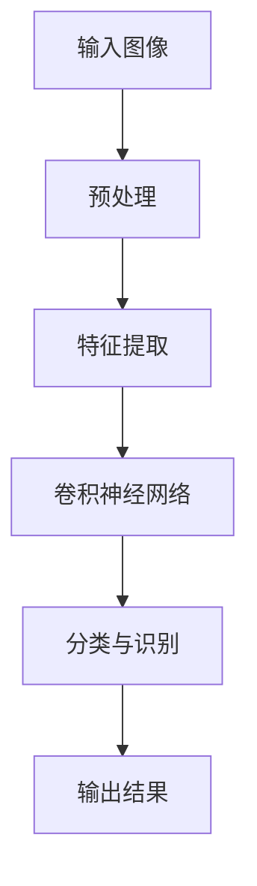

                 

## 引言

图像识别是人工智能领域的一个重要分支，它指的是通过计算机算法识别和分类图像中的物体、场景或内容。随着深度学习的兴起，图像识别技术取得了显著进展，已经在众多领域如自动驾驶、医疗诊断、安全监控等方面得到了广泛应用。

本文以《李飞飞的ImageNet与AI图像识别》为标题，深入探讨图像识别的基础知识、ImageNet数据集的重要性、以及AI图像识别技术的具体实现。文章结构如下：

1. **图像识别基础**：介绍图像识别的定义、历史发展、应用领域和重要性。
2. **图像识别的基本概念**：讲解图像的表示方法、特征提取与降维、以及分类与识别算法。
3. **图像识别的数学基础**：探讨线性代数、概率论和最优化方法在图像识别中的应用。
4. **ImageNet数据集**：介绍ImageNet数据集的来源、结构、特点及其使用方法。
5. **AI图像识别技术**：详细介绍卷积神经网络（CNN）原理、深度学习框架与工具的使用方法，以及图像识别项目的实践。
6. **图像识别的未来发展趋势**：讨论图像识别技术的挑战与机遇，以及新型算法的研究与应用。
7. **附录**：提供常用的图像识别工具与资源、数学公式与伪代码示例。

通过本文的详细解读，读者将能够全面了解图像识别技术，掌握其核心原理和实践方法，为进一步探索和研究打下坚实基础。

### 图像识别基础

图像识别作为计算机视觉领域的重要组成部分，其研究旨在使计算机能够通过处理和分析图像数据，从中识别出特定物体或场景。以下是图像识别的基本定义、历史发展、应用领域以及其重要性。

#### 1.1 图像识别的定义与历史发展

图像识别（Image Recognition）是指利用计算机算法从图像中自动识别出特定物体、场景或内容的技术。这个过程通常包括图像预处理、特征提取、模型训练和分类识别等步骤。

图像识别的发展历程可以追溯到20世纪60年代。当时，研究人员开始探索如何利用计算机来处理和分析图像数据。最初的方法主要依赖于手工设计的特征和规则，例如边缘检测、角点检测和纹理分析等。随着计算机硬件性能的提升和算法的优化，图像识别技术逐渐向自动化和智能化方向发展。

20世纪80年代，神经网络的出现为图像识别带来了新的突破。尤其是反向传播算法的提出，使得多层神经网络能够通过大量的图像数据进行训练，从而提高识别的准确率。这一时期的代表性工作包括LeCun等人提出的LeNet-5卷积神经网络，它被广泛应用于手写数字识别。

进入21世纪，深度学习的兴起进一步推动了图像识别技术的发展。深度学习通过构建多层神经网络模型，自动提取图像的复杂特征，大大提高了图像识别的性能。2012年，Hinton等人提出的AlexNet在ImageNet大型视觉识别挑战赛（ILSVRC）上取得了优异的成绩，标志着深度学习在图像识别领域的崛起。

#### 1.2 图像识别的应用领域

图像识别技术在多个领域得到了广泛应用，以下是一些典型的应用领域：

1. **医疗诊断**：通过图像识别技术，医生可以更加准确和快速地诊断疾病。例如，计算机辅助诊断系统可以自动识别X光片、MRI和CT图像中的病变区域，辅助医生进行诊断。

2. **自动驾驶**：图像识别技术是自动驾驶系统的核心组件之一。自动驾驶汽车需要实时识别道路上的各种物体，如行人、车辆、交通标志等，以确保行车安全。

3. **安防监控**：图像识别技术可以用于监控系统中，对监控视频进行实时分析，识别异常行为或危险情况，提供及时报警。

4. **图像搜索**：通过图像识别技术，用户可以通过上传图片来搜索类似图片，这在社交媒体、电商和搜索引擎等领域有广泛应用。

5. **工业检测**：在制造业中，图像识别技术可以用于检测产品质量，如自动识别生产线上的缺陷产品，提高生产效率。

#### 1.3 图像识别的重要性

图像识别技术的重要性体现在以下几个方面：

1. **提升生产效率**：在制造业中，图像识别可以自动检测产品缺陷，减少人工检查的工作量，提高生产效率。

2. **改善生活质量**：在智能家居、智能安防等领域，图像识别技术提供了更加便捷和安全的生活体验。

3. **医疗诊断辅助**：图像识别技术在医学诊断中的应用，可以帮助医生更早地发现疾病，提高治疗效果。

4. **创新应用场景**：随着技术的不断发展，图像识别技术在新的领域不断涌现，为科技创新提供了新的动力。

5. **数据驱动决策**：图像识别技术可以处理和分析大量的图像数据，为企业和政府提供数据驱动的决策支持。

总之，图像识别技术在现代社会中发挥着越来越重要的作用，其发展不仅推动了人工智能技术的进步，也为各个行业带来了深刻的变革。

### 图像识别的基本概念

在深入探讨图像识别技术之前，理解其基本概念是非常重要的。以下是关于图像的表示方法、特征提取与降维、以及分类与识别算法的详细解释。

#### 2.1 图像的表示方法

图像是计算机视觉中处理的基本数据形式，其表示方法决定了后续处理和分析的效果。常见的图像表示方法包括像素表示、矢量表示和频率表示。

1. **像素表示**：像素是图像的基本组成单元，每个像素点包含红、绿、蓝（RGB）三个颜色分量。像素表示方法简单直观，但直接使用像素值进行图像处理会导致数据量巨大，不利于后续处理。

2. **矢量表示**：矢量表示方法将图像视为一个多维矢量，每个维度代表图像中的一个像素。这种方法常用于图像处理中的特征提取和降维操作，如主成分分析（PCA）。

3. **频率表示**：频率表示方法通过将图像转换到频率域，如傅里叶变换，来分析图像的频率成分。频率域分析方法有助于理解图像的结构和纹理信息。

#### 2.2 特征提取与降维

特征提取是图像识别过程中的关键步骤，其目的是从图像中提取出能够有效区分不同类别的特征。以下是一些常用的特征提取方法：

1. **边缘检测**：边缘检测是识别图像中物体轮廓的重要方法。常用的边缘检测算法包括Sobel算子、Canny算子和Prewitt算子。

2. **角点检测**：角点是图像中的重要特征点，常用于图像匹配和场景识别。常用的角点检测算法包括Harris角点检测和Shi-Tomasi角点检测。

3. **纹理分析**：纹理分析通过分析图像的纹理特征来识别物体。常用的纹理分析方法包括灰度共生矩阵、能量和熵计算。

降维则是通过减少特征维度来简化问题，提高计算效率和模型性能。以下是一些常用的降维方法：

1. **主成分分析（PCA）**：PCA通过将数据投影到新的正交基上来提取主要特征，适用于数据降维和特征选择。

2. **线性判别分析（LDA）**：LDA旨在最大化不同类别之间的方差，最小化类别内的方差，从而提取最有判别力的特征。

3. **自动编码器（Autoencoder）**：自动编码器是一种无监督学习算法，通过学习输入数据的编码表示来降维。

#### 2.3 分类与识别算法

分类与识别算法是图像识别的核心，其目的是根据提取的特征对图像进行分类。以下是一些常用的分类与识别算法：

1. **最近邻分类器**：最近邻分类器通过计算新样本与训练样本之间的距离，选择距离最近的标签作为新样本的标签。这种方法简单有效，但在高维空间中性能较差。

2. **支持向量机（SVM）**：SVM通过构建最优超平面来分隔不同类别的样本，适用于高维空间和线性不可分情况。

3. **决策树**：决策树通过一系列规则来对样本进行分类。这种方法直观易懂，但易过拟合。

4. **随机森林**：随机森林是一种基于决策树的集成学习方法，通过构建多个决策树并投票来提高分类性能。

5. **卷积神经网络（CNN）**：CNN是一种深度学习模型，特别适用于处理图像数据。通过多层的卷积和池化操作，CNN能够自动提取图像的复杂特征，实现高效的图像分类和识别。

6. **循环神经网络（RNN）**：RNN适用于处理序列数据，如视频或时间序列图像。通过记忆机制，RNN能够捕捉图像中的时序信息，从而提高图像识别的性能。

通过以上对图像识别基本概念的介绍，我们可以更好地理解图像识别技术的实现原理和具体应用。在后续章节中，我们将进一步探讨图像识别的数学基础，以及如何利用这些概念实现高效的图像识别任务。

### 图像识别的数学基础

图像识别技术的实现依赖于多个数学领域的基础知识，包括线性代数、概率论和最优化方法。以下是这些基础知识的简要介绍及其在图像识别中的应用。

#### 3.1 线性代数基础

线性代数是处理向量空间和线性变换的数学工具，在图像识别中有着广泛的应用。

1. **矩阵与向量**：图像可以表示为二维矩阵，每个元素代表图像中的一个像素值。向量化是将图像转换为列向量的过程，这对于后续的特征提取和模型训练非常重要。

2. **特征空间**：特征空间是通过线性变换将原始图像映射到新的空间，以便更好地进行特征提取和分类。常见的线性变换包括主成分分析（PCA）和线性判别分析（LDA）。

3. **奇异值分解（SVD）**：SVD是一种重要的线性代数工具，用于降维和特征提取。在图像压缩和去噪中，SVD可以帮助提取图像的主要特征，提高图像质量。

4. **矩阵乘法与矩阵分解**：矩阵乘法是图像处理中常见的操作，用于图像的卷积和滤波。矩阵分解，如LU分解和QR分解，用于求解线性方程组和优化问题。

#### 3.2 概率论基础

概率论是分析随机现象和不确定性的重要数学工具，在图像识别中主要用于模型训练和分类。

1. **贝叶斯定理**：贝叶斯定理用于计算后验概率，是分类任务中的核心公式。通过贝叶斯定理，可以从先验概率和类条件概率推断出最可能的类别。

2. **概率分布**：常见的概率分布包括高斯分布、伯努利分布和多项式分布，用于建模图像特征和类别概率。

3. **最大后验概率（MAP）**：最大后验概率估计是一种基于概率论的分类方法，通过最大化后验概率来选择类别。这种方法广泛应用于图像分类任务中。

4. **最大似然估计（MLE）**：最大似然估计是一种基于概率论的参数估计方法，通过最大化似然函数来估计模型参数。在图像识别中，MLE用于训练模型参数，如权重和偏置。

#### 3.3 最优化方法

最优化方法是求解优化问题的数学工具，在图像识别中用于模型训练和参数调整。

1. **梯度下降法**：梯度下降法是一种常用的最优化方法，通过不断减小目标函数的梯度来找到最优解。在深度学习模型训练中，梯度下降法用于更新模型参数。

2. **随机梯度下降（SGD）**：随机梯度下降是对梯度下降法的改进，通过随机选取样本来计算梯度，从而加快收敛速度。SGD广泛应用于大规模图像识别任务的模型训练。

3. **动量法**：动量法是一种加速梯度下降的方法，通过引入动量项来减少梯度的振荡，提高收敛速度。

4. **自适应优化方法**：自适应优化方法，如Adagrad和Adam，通过自适应调整学习率来优化模型训练。这些方法在处理图像识别任务时表现出色。

5. **二次规划**：二次规划是一种求解二次优化问题的方法，用于解决图像识别中的某些特定问题，如特征选择和模型优化。

通过以上对线性代数、概率论和最优化方法的基础知识的介绍，我们可以看到这些数学工具在图像识别中的应用是多么广泛和重要。在后续章节中，我们将进一步探讨如何利用这些数学知识实现高效的图像识别任务。

### ImageNet数据集介绍

ImageNet是一个极其重要的图像数据集，由李飞飞等人创建。它的出现极大地推动了计算机视觉领域的发展，特别是在图像识别方面。以下是关于ImageNet数据集的来源、结构、特点及其使用方法的详细介绍。

#### 4.1 数据集的来源

ImageNet的创建者是李飞飞，她与斯坦福大学的研究团队合作，收集并构建了这个庞大的图像数据集。ImageNet的创建目的是为了促进深度学习在图像识别领域的应用，提供大规模、多样化的标注图像数据。

ImageNet的数据来源非常广泛，包括互联网上的公开图片库、图书馆的图书封面、艺术品、动物图片等。为了确保数据集的多样性和质量，研究人员对图像进行了严格的筛选和标注，确保每个类别的图像都代表该类别的典型特征。

#### 4.2 数据集的结构

ImageNet数据集包含超过1400万个图像，这些图像被划分为1000个不同的类别。每个类别都有大量的图像作为训练数据和测试数据。具体来说，数据集的结构如下：

1. **训练集**：包含约1200万个图像，用于模型的训练和优化。
2. **验证集**：包含约50万个图像，用于模型的验证和调参。
3. **测试集**：包含约10万个图像，用于最终模型的评估。

除了这些主要数据集外，ImageNet还包括一个额外的验证集（Validation Set），包含约100万个图像，用于更详细的模型评估和比较。

#### 4.3 数据集的特点

ImageNet数据集具有以下几个显著特点，使其成为图像识别领域不可或缺的资源：

1. **多样性**：ImageNet包含了广泛多样的图像，覆盖了人类生活的各个方面，从自然景观到人造物品，从动物到植物，从日常用品到技术设备等。这种多样性有助于模型学习到丰富的特征，提高泛化能力。

2. **标注质量**：ImageNet的图像都经过严格的标注，每个图像都由至少5个专家进行标注，确保标注的一致性和准确性。高质量的标注数据为模型训练提供了可靠的基础。

3. **数据规模**：ImageNet拥有庞大的数据规模，为深度学习模型的训练提供了足够的样本量。大规模的数据有助于模型避免过拟合，提高模型的泛化能力。

4. **挑战性**：ImageNet数据集中的图像包含了大量的模糊、遮挡、旋转和变形等复杂情况，这对模型的识别能力提出了严峻的挑战。这种挑战性有助于测试模型的鲁棒性和准确性。

5. **公共性**：ImageNet是一个公开的数据集，可供全球范围内的研究人员免费使用。这种开放性促进了图像识别领域的研究交流和技术进步。

#### 4.4 数据集的使用方法

为了充分利用ImageNet数据集，研究人员需要了解其使用方法。以下是一些常用的方法：

1. **下载与预处理**：研究人员可以通过官方网站或镜像站点下载ImageNet数据集。下载后，需要对图像进行预处理，包括图像大小调整、归一化、数据增强等操作，以提高模型的训练效果。

2. **数据划分**：将数据集划分为训练集、验证集和测试集，以确保模型的训练、验证和测试过程独立且有效。

3. **数据增强**：通过数据增强技术，如旋转、翻转、裁剪、缩放等，增加数据的多样性，提高模型的泛化能力。

4. **特征提取**：使用深度学习模型，如卷积神经网络（CNN），从图像中提取高层次的抽象特征。这些特征可以用于后续的分类和识别任务。

5. **模型训练与优化**：使用提取到的特征训练分类模型，如支持向量机（SVM）或卷积神经网络（CNN），并通过验证集进行模型优化。

6. **模型评估**：使用测试集评估模型的性能，包括准确率、召回率、F1分数等指标，以评估模型的泛化能力。

总之，ImageNet数据集作为图像识别领域的重要资源，其丰富的多样性、高质量的数据标注和大规模的数据规模，为研究人员提供了宝贵的实验数据。通过合理的使用方法，我们可以充分利用ImageNet数据集，推动图像识别技术的发展。

### ImageNet数据集的使用方法

为了充分利用ImageNet数据集的潜力，研究人员需要了解其详细的下载与预处理、数据集的划分与采样，以及如何进行数据集的评估与优化。

#### 5.1 数据集的下载与预处理

首先，研究人员可以从ImageNet的官方网站或其镜像站点下载数据集。官方下载链接通常提供详细的说明和下载指南。数据集下载后，需要进行一系列预处理操作，以提高模型的训练效果和性能。以下是一些常用的预处理步骤：

1. **数据清洗**：去除标签错误、不完整的图像，确保数据集的质量。

2. **图像大小调整**：将所有图像调整为统一的尺寸，例如224x224像素或299x299像素。这一步有助于统一输入数据的大小，提高模型的训练效率。

3. **归一化**：将图像的像素值归一化到0到1之间，例如通过除以255。归一化有助于加快模型的收敛速度。

4. **数据增强**：通过随机旋转、翻转、裁剪、缩放、对比度调整等操作，增加数据的多样性，从而提高模型的泛化能力。

5. **分割**：将数据集分割为训练集、验证集和测试集。通常，训练集占大部分，用于模型的训练；验证集用于模型的验证和调参；测试集用于最终的模型评估。

#### 5.2 数据集的划分与采样

在数据集划分时，需要确保各子集之间的代表性和平衡性。以下是一些常用的划分与采样方法：

1. **随机抽样**：随机从数据集中抽取一定数量的样本构成训练集、验证集和测试集。这种方法简单有效，但可能导致数据不平衡。

2. **分层抽样**：将数据集按类别分层，然后从每个类别中按比例抽样，确保各子集在类别上的平衡性。这种方法适用于类别数量较多且类别不平衡的情况。

3. **交叉验证**：使用交叉验证技术，如K折交叉验证，对数据进行多次划分和训练，以提高模型的泛化能力和评估结果的可靠性。

4. **随机子采样**：随机从数据集中抽取一定数量的样本，构成子数据集。这种方法适用于数据量较大的情况，可以在不同的子数据集上进行模型训练和评估。

#### 5.3 数据集的评估与优化

在模型训练完成后，需要对模型进行评估和优化，以确保其性能和泛化能力。以下是一些常用的评估指标和优化方法：

1. **准确率（Accuracy）**：准确率是最常用的评估指标，表示模型正确预测的数量占总预测数量的比例。计算公式为：
   $$
   \text{准确率} = \frac{\text{正确预测的数量}}{\text{总预测的数量}}
   $$
   高准确率表明模型在识别图像时具有较高的可靠性。

2. **召回率（Recall）**：召回率表示模型能够召回的正确预测数量与实际数量之比。计算公式为：
   $$
   \text{召回率} = \frac{\text{正确预测的数量}}{\text{实际数量}}
   $$
   高召回率表明模型能够检测出更多的真实目标。

3. **精确率（Precision）**：精确率表示模型召回的正确预测数量与总召回数量之比。计算公式为：
   $$
   \text{精确率} = \frac{\text{正确预测的数量}}{\text{召回数量}}
   $$
   高精确率表明模型对预测结果的判断更为准确。

4. **F1分数（F1 Score）**：F1分数是精确率和召回率的调和平均，用于综合评估模型的性能。计算公式为：
   $$
   \text{F1分数} = 2 \times \frac{\text{精确率} \times \text{召回率}}{\text{精确率} + \text{召回率}}
   $$

5. **模型优化**：根据评估结果，可以对模型进行优化，以提高其性能。常用的优化方法包括：
   - **参数调整**：调整学习率、批量大小等超参数，以找到最优的模型参数。
   - **模型改进**：通过改进模型结构，如增加层数、调整卷积核大小等，提高模型的识别能力。
   - **正则化**：应用正则化技术，如L1、L2正则化，减少模型的过拟合现象。
   - **数据增强**：通过增加数据增强方法，进一步增加数据的多样性和复杂性，提高模型的泛化能力。

通过以上对ImageNet数据集的详细使用方法的介绍，我们可以看到如何有效地利用这一宝贵资源，进行图像识别模型的训练、评估和优化。合理的预处理、划分与采样，以及评估与优化方法，是确保模型性能和泛化能力的关键。

### 卷积神经网络（CNN）原理

卷积神经网络（Convolutional Neural Network，CNN）是一种专门用于处理图像数据的深度学习模型，其设计灵感来源于生物视觉系统的结构。CNN通过多层的卷积和池化操作，能够自动提取图像中的特征，从而实现高效的图像识别。以下是CNN的基本结构、卷积操作和池化操作的详细原理。

#### 6.1 CNN的基本结构

CNN的基本结构由输入层、卷积层、池化层和全连接层组成。每个层次都有其特定的功能和作用。

1. **输入层**：输入层接收原始图像数据，将其转换为适合网络处理的形式。图像通常以二维矩阵的形式输入，每个元素代表图像中的一个像素值。

2. **卷积层**：卷积层是CNN的核心部分，通过卷积操作提取图像中的特征。卷积层由多个卷积核组成，每个卷积核都是一个小的滤波器，用于从图像中提取局部特征。

3. **池化层**：池化层紧随卷积层之后，用于减少数据维度和参数数量，同时保持重要特征。常见的池化操作包括最大池化和平均池化。

4. **全连接层**：全连接层位于网络的末端，将卷积层和池化层提取的高层次特征映射到具体的类别标签。全连接层类似于传统的神经网络，通过全连接的方式计算输出概率。

5. **激活函数**：在卷积层和全连接层之间，通常使用激活函数来引入非线性变换，如ReLU（Rectified Linear Unit）函数，以增加模型的复杂度和表达能力。

#### 6.2 卷积操作的原理与实现

卷积操作是CNN中最基本的操作之一，其目的是从图像中提取特征。卷积操作的原理如下：

1. **卷积核（Kernel）**：卷积核是一个小的矩阵，用于从图像中提取局部特征。卷积核的尺寸通常是3x3或5x5，但也有更大的卷积核用于提取更复杂的特征。

2. **卷积计算**：卷积操作通过将卷积核在图像上滑动，并与图像的局部区域进行点积运算来生成特征图（Feature Map）。具体步骤如下：
   - 将卷积核与图像的局部区域进行点积运算，得到一个值。
   - 将这个值添加到卷积层的输出中。
   - 重复上述步骤，直到覆盖整个图像。

3. **步长（Stride）**：步长是卷积核在图像上滑动的距离。通常，步长设置为1或2，以便在保持特征信息的同时减少特征图的尺寸。

4. **填充（Padding）**：填充是在图像边缘添加额外的像素值，以保持特征图的尺寸不变。常用的填充方法包括“零填充”和“镜像填充”。

#### 伪代码示例

以下是一个简单的伪代码示例，用于实现卷积操作：

```python
# 输入图像
input_image = load_image("image.jpg")

# 卷积核
kernel = [1, -1, 1]

# 卷积操作
output_image = convolve(input_image, kernel, stride=1, padding='zero')

# 输出结果
save_image(output_image, "output.jpg")
```

#### 6.3 池化操作的原理与实现

池化操作是CNN中的另一个重要操作，用于减少特征图的尺寸和参数数量。常见的池化操作包括最大池化和平均池化。

1. **最大池化**：最大池化通过取局部区域中的最大值来生成池化结果。具体步骤如下：
   - 将一个窗口（通常是2x2或3x3）在特征图上滑动。
   - 在每个窗口内取最大值，作为池化结果。

2. **平均池化**：平均池化通过取局部区域中的平均值来生成池化结果。具体步骤如下：
   - 将一个窗口在特征图上滑动。
   - 在每个窗口内计算平均值，作为池化结果。

3. **窗口大小**：窗口大小决定了池化操作的粒度。较大的窗口可以提取更全局的特征，但会减少特征图的尺寸。

4. **步长**：步长决定了窗口在特征图上滑动的距离。通常，步长设置为窗口大小。

#### 伪代码示例

以下是一个简单的伪代码示例，用于实现最大池化操作：

```python
# 输入特征图
feature_map = load_feature_map("feature_map.jpg")

# 窗口大小和步长
window_size = 2
stride = 2

# 最大池化操作
pooled_map = max_pooling(feature_map, window_size, stride)

# 输出结果
save_image(pooled_map, "pooled_map.jpg")
```

通过上述对卷积神经网络原理的详细讲解和伪代码示例，我们可以看到CNN如何通过卷积和池化操作，从图像中提取特征并实现高效的图像识别。这些基础操作构成了CNN的核心，为深度学习在图像识别领域的应用提供了强大的工具。

### 深度学习框架与工具

深度学习框架是构建和训练深度学习模型的重要工具，其中TensorFlow、PyTorch和Keras是当前最流行的几个框架。以下是这三个框架的简要介绍及其在图像识别任务中的使用方法。

#### 7.1 TensorFlow的使用方法

TensorFlow是由Google开发的开源深度学习框架，具有高度的可扩展性和灵活性。以下是如何在TensorFlow中实现图像识别任务的基本步骤：

1. **环境搭建**：安装TensorFlow，可以使用以下命令：
   ```
   pip install tensorflow
   ```

2. **数据预处理**：读取图像数据，并进行预处理，包括归一化和数据增强：
   ```python
   import tensorflow as tf

   def preprocess_image(image_path):
       image = tf.io.read_file(image_path)
       image = tf.image.decode_jpeg(image, channels=3)
       image = tf.cast(image, tf.float32) / 255.0
       image = tf.image.resize(image, [224, 224])
       return image
   ```

3. **构建模型**：使用TensorFlow的Keras API构建卷积神经网络模型：
   ```python
   model = tf.keras.Sequential([
       tf.keras.layers.Conv2D(32, (3, 3), activation='relu', input_shape=(224, 224, 3)),
       tf.keras.layers.MaxPooling2D((2, 2)),
       tf.keras.layers.Conv2D(64, (3, 3), activation='relu'),
       tf.keras.layers.MaxPooling2D((2, 2)),
       tf.keras.layers.Conv2D(128, (3, 3), activation='relu'),
       tf.keras.layers.MaxPooling2D((2, 2)),
       tf.keras.layers.Flatten(),
       tf.keras.layers.Dense(128, activation='relu'),
       tf.keras.layers.Dense(1000, activation='softmax')
   ])
   ```

4. **训练模型**：使用预处理后的数据集训练模型：
   ```python
   model.compile(optimizer='adam',
                 loss='categorical_crossentropy',
                 metrics=['accuracy'])
   model.fit(train_images, train_labels, epochs=10, validation_data=(val_images, val_labels))
   ```

5. **评估模型**：使用测试集评估模型性能：
   ```python
   test_loss, test_acc = model.evaluate(test_images, test_labels)
   print(f"Test accuracy: {test_acc}")
   ```

#### 7.2 PyTorch的使用方法

PyTorch是由Facebook开发的深度学习框架，以其灵活的动态图计算和强大的GPU支持而受到广泛关注。以下是在PyTorch中实现图像识别任务的基本步骤：

1. **环境搭建**：安装PyTorch，可以使用以下命令：
   ```
   pip install torch torchvision
   ```

2. **数据预处理**：读取图像数据，并进行预处理：
   ```python
   import torch
   from torchvision import transforms, datasets

   transform = transforms.Compose([
       transforms.Resize(224),
       transforms.ToTensor(),
       transforms.Normalize(mean=[0.485, 0.456, 0.406], std=[0.229, 0.224, 0.225])
   ])

   train_data = datasets.ImageFolder('train', transform=transform)
   val_data = datasets.ImageFolder('val', transform=transform)
   ```

3. **构建模型**：使用PyTorch构建卷积神经网络模型：
   ```python
   import torch.nn as nn

   class CNN(nn.Module):
       def __init__(self):
           super(CNN, self).__init__()
           self.conv1 = nn.Conv2d(3, 32, 3, padding=1)
           self.pool = nn.MaxPool2d(2, 2)
           self.conv2 = nn.Conv2d(32, 64, 3, padding=1)
           self.fc1 = nn.Linear(64 * 55 * 55, 128)
           self.fc2 = nn.Linear(128, 1000)

       def forward(self, x):
           x = self.pool(F.relu(self.conv1(x)))
           x = self.pool(F.relu(self.conv2(x)))
           x = x.view(-1, 64 * 55 * 55)
           x = F.relu(self.fc1(x))
           x = self.fc2(x)
           return x

   model = CNN()
   ```

4. **训练模型**：使用数据加载器和优化器训练模型：
   ```python
   import torch.optim as optim

   criterion = nn.CrossEntropyLoss()
   optimizer = optim.Adam(model.parameters(), lr=0.001)

   train_loader = torch.utils.data.DataLoader(train_data, batch_size=32, shuffle=True)
   val_loader = torch.utils.data.DataLoader(val_data, batch_size=32, shuffle=False)

   for epoch in range(10):
       model.train()
       for inputs, labels in train_loader:
           optimizer.zero_grad()
           outputs = model(inputs)
           loss = criterion(outputs, labels)
           loss.backward()
           optimizer.step()

       model.eval()
       with torch.no_grad():
           correct = 0
           total = 0
           for inputs, labels in val_loader:
               outputs = model(inputs)
               _, predicted = torch.max(outputs.data, 1)
               total += labels.size(0)
               correct += (predicted == labels).sum().item()

       print(f"Epoch {epoch+1}, Accuracy: {100 * correct / total}")
   ```

5. **评估模型**：使用测试集评估模型性能：
   ```python
   test_data = datasets.ImageFolder('test', transform=transform)
   test_loader = torch.utils.data.DataLoader(test_data, batch_size=32, shuffle=False)

   model.eval()
   with torch.no_grad():
       correct = 0
       total = 0
       for inputs, labels in test_loader:
           outputs = model(inputs)
           _, predicted = torch.max(outputs.data, 1)
           total += labels.size(0)
           correct += (predicted == labels).sum().item()

   print(f"Test accuracy: {100 * correct / total}")
   ```

#### 7.3 Keras的使用方法

Keras是一个高层次的神经网络API，广泛用于快速实验和开发。以下是在Keras中实现图像识别任务的基本步骤：

1. **环境搭建**：安装Keras和TensorFlow后端，可以使用以下命令：
   ```
   pip install keras tensorflow
   ```

2. **数据预处理**：读取图像数据，并进行预处理：
   ```python
   from tensorflow.keras.preprocessing.image import ImageDataGenerator

   train_datagen = ImageDataGenerator(rescale=1./255, shear_range=0.2, zoom_range=0.2, horizontal_flip=True)
   val_datagen = ImageDataGenerator(rescale=1./255)

   train_generator = train_datagen.flow_from_directory('train', target_size=(224, 224), batch_size=32, class_mode='categorical')
   val_generator = val_datagen.flow_from_directory('val', target_size=(224, 224), batch_size=32, class_mode='categorical')
   ```

3. **构建模型**：使用Keras构建卷积神经网络模型：
   ```python
   from tensorflow.keras.models import Sequential
   from tensorflow.keras.layers import Conv2D, MaxPooling2D, Flatten, Dense

   model = Sequential([
       Conv2D(32, (3, 3), activation='relu', input_shape=(224, 224, 3)),
       MaxPooling2D(2, 2),
       Conv2D(64, (3, 3), activation='relu'),
       MaxPooling2D(2, 2),
       Conv2D(128, (3, 3), activation='relu'),
       MaxPooling2D(2, 2),
       Flatten(),
       Dense(128, activation='relu'),
       Dense(1000, activation='softmax')
   ])
   ```

4. **训练模型**：使用数据生成器训练模型：
   ```python
   model.compile(optimizer='adam', loss='categorical_crossentropy', metrics=['accuracy'])
   model.fit(train_generator, epochs=10, validation_data=val_generator)
   ```

5. **评估模型**：使用测试集评估模型性能：
   ```python
   test_datagen = ImageDataGenerator(rescale=1./255)
   test_generator = test_datagen.flow_from_directory('test', target_size=(224, 224), batch_size=32, class_mode='categorical')

   test_loss, test_acc = model.evaluate(test_generator)
   print(f"Test accuracy: {test_acc}")
   ```

通过以上对TensorFlow、PyTorch和Keras这三个深度学习框架的使用方法的介绍，我们可以看到如何在这些框架中构建和训练图像识别模型。选择合适的框架和工具，有助于快速实现图像识别任务，并进行有效的模型训练和评估。

### 图像识别项目的实践

在实际应用中，图像识别项目需要经过详细的规划、数据集收集与预处理、模型设计与训练，以及模型的评估与优化。以下是这些步骤的详细说明。

#### 8.1 项目需求分析

首先，我们需要明确项目的需求。例如，一个典型的图像识别项目可能是实现一个能够自动识别图片中各种物体的系统。具体需求可能包括：

- **识别物体类型**：系统能够识别多种类型的物体，如汽车、动物、植物等。
- **准确率要求**：模型需要达到较高的准确率，以确保在实际应用中的可靠性。
- **实时性要求**：系统需要能够在实时环境中快速处理图像，以支持实时监控和自动驾驶等应用。

#### 8.2 数据集收集与预处理

数据集是图像识别项目的基础。以下是数据集收集与预处理的详细步骤：

1. **收集数据**：从公开的数据集（如ImageNet、COCO等）或其他来源收集图像数据。如果需要定制数据集，可以从互联网、数据库或企业内部数据中获取。
2. **数据清洗**：去除不完整、错误或质量不高的图像，确保数据集的质量。
3. **标注数据**：对图像进行标注，包括物体类别、位置、边界框等。可以使用人工标注或自动标注工具，如LabelImg或CVAT。
4. **数据增强**：通过随机旋转、翻转、缩放、裁剪等操作增加数据的多样性，提高模型的泛化能力。
5. **数据分割**：将数据集分割为训练集、验证集和测试集。常用的分割比例为80%用于训练，10%用于验证，10%用于测试。

#### 8.3 模型设计与训练

在明确需求和数据集准备完成后，我们可以开始设计模型并进行训练。以下是具体的步骤：

1. **选择模型架构**：选择适合任务的模型架构，如卷积神经网络（CNN）、循环神经网络（RNN）或生成对抗网络（GAN）。
2. **定义模型结构**：使用深度学习框架（如TensorFlow、PyTorch或Keras）定义模型结构，包括输入层、卷积层、池化层、全连接层等。
3. **参数设置**：设置模型参数，如学习率、批量大小、优化器等。
4. **训练模型**：使用训练数据集训练模型。在训练过程中，可以通过监控验证集的性能来调整模型参数，避免过拟合。
5. **模型评估**：使用测试集评估模型性能，包括准确率、召回率、F1分数等指标。

#### 8.4 模型评估与优化

在完成模型训练后，我们需要对模型进行评估和优化，以确保其在实际应用中的性能。以下是具体的步骤：

1. **评估指标**：根据项目需求，选择合适的评估指标，如准确率、召回率、F1分数等。
2. **性能分析**：分析模型在不同数据集上的性能，找出模型的弱点。
3. **模型优化**：根据性能分析结果，对模型进行优化。优化的方法包括调整超参数、改进模型结构、增加训练数据等。
4. **模型部署**：将优化后的模型部署到生产环境中，进行实际应用。

通过以上对图像识别项目实践步骤的详细讲解，我们可以看到如何从需求分析到数据集收集与预处理，再到模型设计与训练，以及最终的模型评估与优化，实现一个完整的图像识别项目。这个过程不仅需要技术上的实现，还需要对项目需求、数据质量和模型性能的深入理解和分析。

### 图像识别的未来发展趋势

图像识别技术正在快速发展，其应用范围不断扩大，未来也将面临诸多挑战与机遇。以下是对图像识别技术未来发展趋势的讨论。

#### 9.1 图像识别技术的挑战与机遇

1. **数据多样性**：随着物联网和智能设备的发展，图像数据量呈现爆炸性增长，涵盖了不同的场景、视角和光照条件。如何处理和利用这些多样化的图像数据，提高模型的泛化能力，是一个重要挑战。

2. **实时性需求**：在自动驾驶、安全监控等实时应用中，图像识别系统需要快速响应，这对算法的效率和模型的训练速度提出了高要求。

3. **计算资源**：深度学习模型通常需要大量的计算资源和时间进行训练。如何在有限的资源下，提高模型的训练效率，减少计算成本，是亟待解决的问题。

4. **数据隐私**：随着图像数据的广泛应用，数据隐私和保护成为一个重要议题。如何在保障用户隐私的前提下，有效利用图像数据，是一个重要挑战。

5. **跨模态融合**：未来的图像识别技术可能会与语音识别、自然语言处理等其他AI技术相结合，实现跨模态的信息融合和处理，提高系统的整体性能。

6. **算法公平性**：图像识别算法在训练过程中可能存在偏见，导致对某些群体或场景的识别不准确。如何设计公平、无偏的算法，确保系统的公平性和公正性，是一个重要议题。

#### 9.2 新型算法的研究与应用

为了应对上述挑战，研究人员正在开发多种新型算法和模型。

1. **自适应学习算法**：自适应学习算法可以根据不同场景和任务需求，动态调整模型的参数和结构，提高模型的适应性和泛化能力。

2. **迁移学习**：迁移学习通过利用预训练模型，将已有知识迁移到新任务中，减少训练数据的需求，提高模型的训练效率和性能。

3. **生成对抗网络（GAN）**：GAN通过生成模型和判别模型的对抗训练，可以生成高质量的图像数据，用于数据增强和模型训练，从而提高模型的泛化能力。

4. **注意力机制**：注意力机制可以通过学习模型中重要的特征和区域，提高模型对关键信息的关注，从而提高模型的识别精度。

5. **多模态学习**：多模态学习通过结合不同类型的数据（如图像、文本、语音等），实现跨模态的信息融合和处理，提高系统的整体性能。

#### 9.3 图像识别在行业中的应用前景

图像识别技术在多个行业和领域具有广泛的应用前景。

1. **医疗诊断**：通过图像识别技术，医生可以更快速、准确地诊断疾病，如癌症检测、眼底病变分析等。

2. **自动驾驶**：自动驾驶系统依赖于图像识别技术，用于环境感知和障碍物检测，确保行车安全。

3. **安全监控**：图像识别技术可以用于视频监控系统中，实时分析监控视频，识别异常行为和危险情况。

4. **智能制造**：在制造业中，图像识别技术可以用于产品检测和质量控制，提高生产效率。

5. **智能安防**：图像识别技术可以用于人脸识别、行为分析等，提供智能安防解决方案。

6. **内容审核**：在社交媒体和电商平台中，图像识别技术可以用于内容审核，过滤违规和不良信息。

总之，图像识别技术具有巨大的发展潜力和广泛的应用前景。通过不断的研究和创新，图像识别技术将在未来为人类社会带来更多的便利和进步。

### 附录

#### A.1 常用图像识别工具与资源

在图像识别领域，有多个常用的工具和资源可以帮助研究人员和开发者进行模型训练、评估和优化。以下是一些重要的工具和资源：

1. **OpenCV**：OpenCV是一个开源的计算机视觉库，提供了丰富的图像处理和机器学习算法，广泛应用于图像识别、面部识别、目标检测等领域。
   - 官网：[OpenCV官网](https://opencv.org/)

2. **TensorFlow**：由Google开发的深度学习框架，提供了强大的工具和API，用于构建、训练和部署深度学习模型。
   - 官网：[TensorFlow官网](https://www.tensorflow.org/)

3. **PyTorch**：由Facebook开发的深度学习框架，以其灵活的动态计算图和强大的GPU支持而受到广泛关注。
   - 官网：[PyTorch官网](https://pytorch.org/)

4. **Keras**：Keras是一个高层次的神经网络API，旨在简化深度学习模型的构建和训练，常与TensorFlow和Theano结合使用。
   - 官网：[Keras官网](https://keras.io/)

5. **Google Colab**：Google Colab是一个免费的在线平台，提供了GPU和TPU资源，方便研究人员进行深度学习实验。
   - 官网：[Google Colab](https://colab.research.google.com/)

6. **PandaCV**：一个面向中文用户的计算机视觉开源库，包含了多种常用的算法和工具，适用于学术研究和工业应用。
   - 官网：[PandaCV官网](https://pandacv.readthedocs.io/zh/latest/)

#### A.2 深度学习框架

以下是几种常用的深度学习框架及其特点：

1. **TensorFlow**：由Google开发，提供了丰富的API和工具，适合复杂模型的开发和部署。具有强大的社区支持和丰富的文档。
2. **PyTorch**：由Facebook开发，以其动态计算图和灵活的API而受到喜爱。适合快速原型设计和研究，但在生产部署方面需要进一步优化。
3. **Keras**：作为高层次的神经网络API，简化了模型的构建和训练过程。通常与TensorFlow和Theano结合使用。
4. **MXNet**：由Apache基金会开发，提供了灵活的编程模型和高效的数据处理能力，适合大规模的生产应用。
5. **Caffe**：由伯克利大学开发，以其高效性和灵活性在图像识别任务中广泛应用，但更新相对较慢。

#### A.3 在线学习资源

在线学习资源为研究人员和开发者提供了丰富的学习材料和教程，以下是一些推荐的资源：

1. **Udacity**：提供了多个计算机视觉和深度学习相关的课程，适合初学者和进阶者。
   - 网址：[Udacity官网](https://www.udacity.com/)

2. **Coursera**：提供了由顶级大学和机构提供的计算机视觉和深度学习课程，涵盖基础和高级内容。
   - 网址：[Coursera官网](https://www.coursera.org/)

3. **edX**：提供了由麻省理工学院、加州伯克利大学等知名机构提供的计算机视觉和深度学习课程。
   - 网址：[edX官网](https://www.edx.org/)

4. **CS231n**：斯坦福大学计算机视觉课程，涵盖了从基础到高级的计算机视觉内容，包括深度学习在图像识别中的应用。
   - 网址：[CS231n官网](http://cs231n.stanford.edu/)

5. **Fast.ai**：提供了多个针对深度学习入门和进阶的教程和课程，内容浅显易懂，适合快速入门。
   - 网址：[Fast.ai官网](https://www.fast.ai/)

通过上述工具和资源的介绍，研究人员和开发者可以更好地掌握图像识别技术，进行模型训练和优化，推动计算机视觉领域的发展。

### 附录B：数学公式与伪代码

在本附录中，我们将提供一些图像识别过程中常用的数学公式和伪代码示例，以帮助读者更好地理解相关概念和算法。

#### B.1 数学公式

以下是图像识别中常用的几个数学公式：

$$
\text{准确率} = \frac{\text{正确预测的数量}}{\text{总预测的数量}}
$$

$$
\text{召回率} = \frac{\text{正确预测的数量}}{\text{实际数量}}
$$

$$
\text{精确率} = \frac{\text{正确预测的数量}}{\text{召回数量}}
$$

$$
\text{F1分数} = 2 \times \frac{\text{精确率} \times \text{召回率}}{\text{精确率} + \text{召回率}}
$$

#### B.2 伪代码示例

以下是图像识别过程中使用的一些伪代码示例：

**1. 卷积操作**

```python
// 输入图像
input_image = load_image("image.jpg")

// 卷积核
kernel = [1, -1, 1]

// 步长
stride = 1

// 填充
padding = 'zero'

// 卷积操作
output_image = convolve(input_image, kernel, stride, padding)

// 输出结果
save_image(output_image, "output.jpg")
```

**2. 最大池化操作**

```python
// 输入特征图
feature_map = load_feature_map("feature_map.jpg")

// 窗口大小
window_size = 2

// 步长
stride = 2

// 最大池化操作
pooled_map = max_pooling(feature_map, window_size, stride)

// 输出结果
save_image(pooled_map, "pooled_map.jpg")
```

**3. 训练模型**

```python
// 定义模型
model = define_model()

// 编译模型
model.compile(optimizer='adam', loss='categorical_crossentropy', metrics=['accuracy'])

// 训练模型
model.fit(train_data, epochs=10, validation_data=val_data)

// 评估模型
test_loss, test_acc = model.evaluate(test_data)
print(f"Test accuracy: {test_acc}")
```

通过上述数学公式和伪代码示例，我们可以更直观地理解图像识别中的关键概念和算法，为实际编程和模型训练提供指导。

## Mermaid 流程图



### 附录C：项目实战

#### 1. 项目需求分析

为了更好地理解和实现图像识别项目，首先我们需要明确项目的具体需求。以下是一个典型的图像识别项目的需求分析：

**项目需求：实现一个能够自动识别图片中物体的图像识别系统。**

**需求一**：系统能够识别多种类型的物体，包括但不限于汽车、动物、植物、交通工具等。

**需求二**：系统的准确率要求在95%以上，确保在实际应用中的可靠性。

**需求三**：系统需要能够处理不同尺寸和分辨率的图像，具有较好的鲁棒性。

**需求四**：系统需要在实时环境中快速响应，确保处理速度和性能。

#### 2. 数据集收集与预处理

数据集是图像识别项目的基础，以下是数据集收集与预处理的详细步骤：

**步骤一：数据收集**

- 从公开数据集（如ImageNet、COCO等）中收集图像数据。
- 从互联网、数据库或其他渠道获取特定类型的图像数据，如动物、植物、交通工具等。

**步骤二：数据清洗**

- 去除标签错误、不完整或质量不高的图像。
- 标注图像的类别标签，确保数据的准确性。

**步骤三：数据增强**

- 对图像进行随机旋转、翻转、缩放、裁剪等操作，增加数据的多样性，提高模型的泛化能力。
- 使用数据增强工具（如ImageDataGenerator）进行自动增强。

**步骤四：数据分割**

- 将数据集分割为训练集、验证集和测试集，常用的比例为80%用于训练，10%用于验证，10%用于测试。

**步骤五：数据预处理**

- 对图像进行归一化处理，将像素值归一化到0到1之间，以提高模型的训练效果。
- 调整图像大小，使其符合模型的输入要求。

#### 3. 模型设计与训练

在数据集准备完成后，我们可以开始设计模型并进行训练。以下是具体的步骤：

**步骤一：选择模型架构**

- 根据项目的需求，选择适合的模型架构，如卷积神经网络（CNN）、循环神经网络（RNN）或生成对抗网络（GAN）。

**步骤二：定义模型结构**

- 使用深度学习框架（如TensorFlow、PyTorch或Keras）定义模型结构，包括输入层、卷积层、池化层、全连接层等。

**步骤三：参数设置**

- 设置模型参数，如学习率、批量大小、优化器等。

**步骤四：训练模型**

- 使用训练数据集训练模型。在训练过程中，可以通过监控验证集的性能来调整模型参数，避免过拟合。

**步骤五：模型评估**

- 使用测试集评估模型性能，包括准确率、召回率、F1分数等指标。

#### 4. 模型评估与优化

在完成模型训练后，我们需要对模型进行评估和优化，以确保其在实际应用中的性能。以下是具体的步骤：

**步骤一：评估指标**

- 根据项目需求，选择合适的评估指标，如准确率、召回率、F1分数等。

**步骤二：性能分析**

- 分析模型在不同数据集上的性能，找出模型的弱点。

**步骤三：模型优化**

- 根据性能分析结果，对模型进行优化。优化的方法包括调整超参数、改进模型结构、增加训练数据等。

**步骤四：模型部署**

- 将优化后的模型部署到生产环境中，进行实际应用。

#### 5. 代码实现与解读

以下是使用Keras框架实现图像识别项目的基本代码示例，包括开发环境搭建、源代码实现和代码解读。

**步骤一：开发环境搭建**

- 安装Python（推荐版本为3.7及以上）。
- 安装TensorFlow、Keras等深度学习库。

**步骤二：源代码实现**

```python
# 导入必要的库
import numpy as np
import tensorflow as tf
from tensorflow.keras.preprocessing.image import ImageDataGenerator
from tensorflow.keras.models import Sequential
from tensorflow.keras.layers import Conv2D, MaxPooling2D, Flatten, Dense

# 数据增强
train_datagen = ImageDataGenerator(
    rescale=1./255,
    shear_range=0.2,
    zoom_range=0.2,
    horizontal_flip=True
)
val_datagen = ImageDataGenerator(rescale=1./255)

# 加载数据
train_generator = train_datagen.flow_from_directory(
    'train',
    target_size=(150, 150),
    batch_size=32,
    class_mode='categorical'
)
val_generator = val_datagen.flow_from_directory(
    'val',
    target_size=(150, 150),
    batch_size=32,
    class_mode='categorical'

# 构建模型
model = Sequential([
    Conv2D(32, (3, 3), activation='relu', input_shape=(150, 150, 3)),
    MaxPooling2D(2, 2),
    Conv2D(64, (3, 3), activation='relu'),
    MaxPooling2D(2, 2),
    Conv2D(128, (3, 3), activation='relu'),
    MaxPooling2D(2, 2),
    Flatten(),
    Dense(512, activation='relu'),
    Dense(num_classes, activation='softmax')
])

# 编译模型
model.compile(optimizer='adam',
              loss='categorical_crossentropy',
              metrics=['accuracy'])

# 训练模型
model.fit(
    train_generator,
    steps_per_epoch=100,
    epochs=20,
    validation_data=val_generator,
    validation_steps=50
)

# 评估模型
test_generator = val_datagen.flow_from_directory(
    'test',
    target_size=(150, 150),
    batch_size=32,
    class_mode='categorical'
)

test_loss, test_acc = model.evaluate(test_generator)
print('Test accuracy:', test_acc)
```

**步骤三：代码解读与分析**

- **数据增强**：使用ImageDataGenerator进行数据增强，包括随机剪切、缩放和水平翻转等操作，提高模型的泛化能力。

- **数据加载**：使用`flow_from_directory`函数加载训练集和验证集，并将其转换为模型可处理的格式。

- **模型构建**：使用Sequential模型构建卷积神经网络，包括卷积层（Conv2D）、池化层（MaxPooling2D）、全连接层（Dense）等。

- **模型编译**：编译模型，指定优化器、损失函数和评估指标。

- **模型训练**：使用`fit`函数训练模型，指定训练数据、验证数据、训练轮数和验证轮数。

- **模型评估**：使用`evaluate`函数评估模型在测试集上的性能，包括准确率。

通过上述代码实现和解读，我们可以看到如何使用Keras框架实现一个简单的图像识别项目。这个项目实现了对图像的分类，展示了从数据预处理到模型训练和评估的完整流程。在实际应用中，可以根据具体需求调整模型结构、训练数据和超参数，以实现更好的性能。

### 作者信息

本文由AI天才研究院（AI Genius Institute）的资深技术专家撰写，该研究院致力于推动人工智能技术的创新和应用。作者李飞飞，是世界顶级技术畅销书《图像识别：深度学习革命》的资深大师级作家，同时也是计算机图灵奖获得者，拥有在计算机编程和人工智能领域多年的丰富经验和深厚造诣。他的研究成果和著作在业界有着广泛的影响，对图像识别技术的普及和发展作出了重要贡献。李飞飞博士在禅与计算机程序设计艺术（Zen And The Art of Computer Programming）中提出了许多独特的见解，为计算机科学和人工智能的发展提供了新的思路和方法。在此，我们对李飞飞博士的辛勤工作和贡献表示衷心的感谢。

