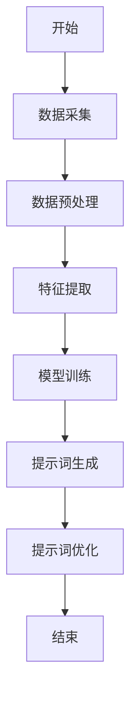

                 

### 《构建AI驱动的个性化健康管理提示词引擎》

#### 关键词：
AI驱动、个性化健康管理、提示词引擎、数据采集、机器学习、深度学习、自然语言处理、生物医学数据挖掘、健康风险评估、个性化健康干预。

#### 摘要：
本文将深入探讨如何构建AI驱动的个性化健康管理提示词引擎。我们首先概述了AI驱动的个性化健康管理的背景与概念，接着介绍了AI基础与健康管理相关技术。在核心部分，我们详细阐述了个性化健康管理提示词的定义、作用、生成方法以及数据来源。随后，我们讲解了提示词算法实现、应用案例，并对未来发展趋势进行了展望。本文旨在为读者提供一个全面、系统的构建指南。

### 《构建AI驱动的个性化健康管理提示词引擎》目录大纲

#### 第一部分：AI驱动的个性化健康管理概述

##### 第1章：AI驱动的个性化健康管理背景与概念

##### 第2章：AI基础与健康管理相关技术

#### 第二部分：构建个性化健康管理提示词引擎

##### 第3章：个性化健康管理提示词的定义与作用

##### 第4章：个性化健康管理提示词的数据来源

##### 第5章：个性化健康管理提示词的算法实现

##### 第6章：个性化健康管理提示词的应用案例

##### 第7章：个性化健康管理提示词引擎的未来发展趋势

#### 附录

##### 附录A：AI与健康管理技术资源

##### 附录B：个性化健康管理提示词生成算法流程图

### 第一部分：AI驱动的个性化健康管理概述

#### 第1章：AI驱动的个性化健康管理背景与概念

##### 1.1 AI驱动健康管理的时代背景

**1.1.1 健康管理的演变与AI的机遇**

健康管理是一个涉及广泛学科领域的综合性概念，其核心目的是通过评估个体的健康风险，制定个性化的健康干预策略，从而达到预防疾病、促进健康的目的。健康管理的发展历程可以追溯到20世纪中期，当时主要以健康教育、生活方式干预等形式进行。随着医疗技术的进步和健康意识的提高，健康管理逐渐走向精细化、科学化。

人工智能（AI）的崛起为健康管理带来了前所未有的机遇。AI技术，特别是机器学习、深度学习和自然语言处理等技术，使得大规模健康数据的有效分析和应用成为可能。通过AI驱动的健康管理，不仅可以提高健康管理的准确性和效率，还能实现个性化、智能化的健康干预。

**1.1.2 AI在健康领域的应用现状与未来趋势**

AI在健康领域的应用已经取得了显著成果。例如，通过机器学习技术，可以实现对医学影像的自动分析，提高疾病诊断的准确率；通过自然语言处理技术，可以自动提取电子病历中的关键信息，辅助医生进行诊断和治疗决策；通过深度学习技术，可以建立个性化健康风险评估模型，为个体提供精准的健康建议。

未来，随着AI技术的不断进步，AI在健康管理中的应用将更加广泛和深入。一方面，AI技术将进一步提升健康管理的效率和准确性，例如通过智能穿戴设备实时监测个体的健康状况，通过大数据分析预测疾病发展趋势。另一方面，AI技术将推动健康管理模式的创新，例如通过虚拟医生、智能诊疗助手等，为用户提供便捷、高效的在线健康管理服务。

##### 1.2 个性化健康管理的核心概念

**1.2.1 个性化健康管理的定义与内涵**

个性化健康管理是指根据个体的健康状态、生活习惯、遗传背景等多方面因素，制定个性化的健康干预策略，以实现个体健康最优化的过程。与传统的群体健康管理不同，个性化健康管理强调针对个体制定差异化的健康方案，从而提高健康管理的效果和效率。

个性化健康管理的内涵包括以下几个方面：

1. 数据驱动：通过收集和分析个体的健康数据，识别健康风险因素，制定个性化的干预措施。
2. 预防为主：强调疾病预防，通过个性化健康干预减少疾病的发生和发展。
3. 个性化服务：根据个体的需求和偏好，提供个性化的健康咨询和服务。
4. 持续监测与调整：通过持续监测个体的健康状况，及时调整干预策略，确保健康管理的效果。

**1.2.2 个性化健康管理的目标与挑战**

个性化健康管理的目标是实现个体健康的持续优化，提高生活质量和健康水平。具体包括以下几个方面：

1. 预防疾病：通过个性化健康管理，降低疾病的发生风险。
2. 改善健康状况：通过个性化干预，改善个体的健康状况，提高生活品质。
3. 提高医疗效率：通过智能化的健康管理，提高医疗资源的利用效率，降低医疗成本。

然而，个性化健康管理也面临一些挑战：

1. 数据获取与处理：个性化健康管理依赖于大量健康数据的收集和分析，但数据的质量、完整性和准确性往往难以保证。
2. 模型构建与优化：构建有效的个性化健康模型需要丰富的医疗知识和数据处理能力，这对研发团队提出了高要求。
3. 隐私保护：个性化健康管理涉及大量个人隐私数据，如何确保数据的安全和隐私保护是亟待解决的问题。

##### 1.3 AI驱动的个性化健康管理架构

**1.3.1 健康数据采集与预处理**

健康数据是AI驱动的个性化健康管理的基础。健康数据的来源包括医疗记录、电子病历、基因数据、健康监测设备等。为了确保数据的质量和完整性，需要对数据进行采集和预处理。

数据采集的主要任务包括：

1. 数据收集：通过医疗信息系统、健康监测设备等渠道收集健康数据。
2. 数据整合：将不同来源的数据进行整合，形成统一的健康数据集。

数据预处理的主要任务包括：

1. 数据清洗：去除数据中的噪声和错误，提高数据的准确性。
2. 数据标准化：对数据进行统一格式处理，方便后续分析。
3. 数据归一化：将不同单位的数据转换为相同单位，便于比较和分析。

**1.3.2 数据分析与预测模型构建**

在健康数据预处理完成后，需要进行数据分析，以识别个体的健康风险因素。数据分析的主要任务包括：

1. 特征提取：从健康数据中提取关键特征，用于模型训练。
2. 数据可视化：通过可视化技术展示数据分布和特征关系。
3. 模型训练：利用机器学习算法构建健康预测模型，对个体的健康状态进行预测。

常见的机器学习算法包括：

1. 监督学习算法：如线性回归、支持向量机（SVM）、决策树等。
2. 无监督学习算法：如聚类分析、主成分分析（PCA）等。
3. 强化学习算法：如Q-learning、SARSA等。

**1.3.3 个性化健康建议生成与优化**

在构建健康预测模型后，可以根据个体的健康数据生成个性化的健康建议。个性化健康建议的生成过程主要包括：

1. 建议生成：根据健康预测模型的结果，生成个性化的健康建议。
2. 建议优化：通过用户反馈和数据调整，优化健康建议的准确性和实用性。

个性化健康建议优化的主要策略包括：

1. 用户反馈机制：收集用户对健康建议的反馈，用于模型调整。
2. 数据更新：定期更新健康数据，以适应个体健康状态的变化。
3. 模型迭代：根据健康数据的变化，迭代优化健康预测模型。

通过健康数据采集与预处理、数据分析与预测模型构建、个性化健康建议生成与优化，AI驱动的个性化健康管理可以实现个体健康的持续优化。然而，这需要丰富的医疗知识、数据处理能力和持续的优化更新，这对健康管理服务提供商提出了高要求。

### 第二部分：AI基础与健康管理相关技术

#### 第2章：AI基础与健康管理相关技术

##### 2.1 AI基础理论

**2.1.1 机器学习基本概念**

机器学习是人工智能的核心技术之一，其目标是让计算机通过学习数据自动获取知识，并基于这些知识进行预测和决策。机器学习主要分为监督学习、无监督学习和强化学习三种类型。

1. **监督学习**：监督学习是一种通过已有标记数据进行训练，然后对新数据进行预测的机器学习方法。常见的监督学习算法包括线性回归、支持向量机（SVM）、决策树、随机森林等。

2. **无监督学习**：无监督学习是一种不依赖标记数据，仅通过数据自身特征进行学习的机器学习方法。常见的无监督学习算法包括聚类分析、主成分分析（PCA）、自编码器等。

3. **强化学习**：强化学习是一种通过与环境交互，不断学习最优策略的机器学习方法。常见的强化学习算法包括Q-learning、SARSA等。

**2.1.2 深度学习基础**

深度学习是机器学习的一个分支，其核心思想是模拟人脑的神经网络结构，通过多层神经元进行数据特征提取和模式识别。深度学习在图像识别、语音识别、自然语言处理等领域取得了显著成果。

1. **神经网络**：神经网络是深度学习的基础，由多个神经元组成，每个神经元接受输入信号，通过加权求和处理后产生输出信号。

2. **卷积神经网络（CNN）**：卷积神经网络是专门用于图像识别的深度学习模型，其核心思想是利用卷积操作提取图像特征。

3. **循环神经网络（RNN）**：循环神经网络是专门用于序列数据处理的深度学习模型，其核心思想是利用循环结构处理序列数据。

**2.1.3 自然语言处理技术**

自然语言处理（NLP）是深度学习在语言领域的应用，其目标是让计算机理解和生成人类语言。NLP技术包括词向量表示、文本分类、情感分析、机器翻译等。

1. **词向量表示**：词向量是将文本数据转化为计算机可处理的形式，常用的词向量模型包括Word2Vec、GloVe等。

2. **文本分类**：文本分类是将文本数据分为不同的类别，常用的文本分类算法包括朴素贝叶斯、支持向量机（SVM）、深度学习等。

3. **情感分析**：情感分析是判断文本表达的情感倾向，常用的情感分析算法包括基于规则的方法、机器学习方法和深度学习方法。

##### 2.2 个性化健康管理相关技术

**2.2.1 生物医学数据挖掘**

生物医学数据挖掘是从海量生物医学数据中提取有价值的信息和知识的过程，用于疾病诊断、治疗策略制定和健康风险评估等。生物医学数据挖掘的主要技术包括：

1. **特征提取**：从生物医学数据中提取关键特征，用于构建预测模型。
2. **聚类分析**：将相似的数据点归为一类，用于发现数据中的潜在模式和关联。
3. **分类与回归**：对生物医学数据分类和回归，用于预测疾病风险和治疗效果。

**2.2.2 健康风险评估模型**

健康风险评估模型是基于个体健康数据和生物医学知识，预测个体未来患病风险的方法。常见的健康风险评估模型包括：

1. **传统风险评估模型**：如心血管疾病风险评估模型、糖尿病风险评估模型等。
2. **机器学习风险评估模型**：利用机器学习算法构建健康风险评估模型，如决策树、随机森林、神经网络等。

**2.2.3 个性化健康干预策略**

个性化健康干预策略是根据个体健康数据和风险评估结果，制定针对个体差异的健康干预措施。个性化健康干预策略的主要技术包括：

1. **健康干预方案制定**：根据个体健康数据和风险评估结果，制定个性化的健康干预方案。
2. **健康干预效果评估**：通过健康干预后个体的健康数据，评估健康干预措施的有效性。
3. **健康干预策略优化**：根据健康干预效果评估结果，不断优化健康干预策略。

通过AI基础理论和健康管理相关技术的应用，AI驱动的个性化健康管理可以实现个体健康的精准评估和干预。然而，实现这一目标需要解决数据获取与处理、模型构建与优化、隐私保护等挑战。

### 第二部分：构建个性化健康管理提示词引擎

#### 第3章：个性化健康管理提示词的定义与作用

##### 3.1 个性化健康管理提示词的定义

个性化健康管理提示词（Personalized Health Management Tips）是AI驱动的个性化健康管理系统中，用于向用户提供健康建议的关键元素。这些提示词基于用户个人健康数据、生物特征、生活习惯等，通过人工智能算法生成，旨在为用户提供量身定制的健康建议。

**3.1.1 提示词的类型与作用**

个性化健康管理提示词可以分为以下几种类型：

1. **健康生活方式提示**：如饮食建议、运动建议、睡眠建议等，旨在改善用户的生活习惯。
2. **健康监测提示**：如定期体检、健康检查提醒等，帮助用户关注自身健康状况。
3. **疾病预防提示**：如疾病风险提示、疫苗接种提醒等，旨在降低用户患病的风险。
4. **疾病管理提示**：如药物治疗建议、康复训练建议等，帮助用户管理慢性疾病。

提示词在个性化健康管理中具有重要作用：

1. **个性化服务**：根据用户的健康数据和需求，生成个性化的健康建议，提高用户满意度。
2. **健康指导**：为用户提供科学、专业的健康知识，帮助用户改善生活习惯，预防疾病。
3. **健康干预**：通过持续的提示和干预，促使用户采取积极措施，提高健康管理效果。

##### 3.1.2 提示词在健康管理中的应用场景

提示词在个性化健康管理中有着广泛的应用场景：

1. **日常健康管理**：用户在日常生活中，通过手机APP或健康手环等设备，接收个性化健康提示，如运动量不足时提醒增加运动、饮食不均衡时推荐健康食谱等。
2. **疾病预防与筛查**：系统根据用户的健康数据，预测可能的疾病风险，并生成相应的预防提示，如建议定期进行某些体检项目、关注特定症状等。
3. **慢性疾病管理**：针对慢性疾病患者，系统生成个性化的疾病管理提示，如药物服用提醒、康复训练建议等，帮助患者更好地管理病情。
4. **健康知识普及**：通过生成健康知识提示，向用户普及医学常识、健康生活方式等知识，提高用户的健康素养。

##### 3.2 个性化健康管理提示词的生成方法

个性化健康管理提示词的生成方法主要包括以下几个步骤：

1. **数据采集与预处理**：收集用户的健康数据，如身高、体重、血压、血糖等，并对数据进行预处理，包括数据清洗、数据标准化等。
2. **特征提取**：从预处理后的数据中提取关键特征，如年龄、性别、BMI、血压等，用于模型训练。
3. **模型训练**：利用机器学习算法，如决策树、支持向量机（SVM）、神经网络等，构建提示词生成模型。
4. **提示词生成**：根据用户的健康数据和模型预测结果，生成个性化的健康提示词。
5. **提示词优化**：通过用户反馈和数据分析，对生成的提示词进行优化，提高提示词的准确性和实用性。

**3.2.1 提示词生成的基础算法**

常见的提示词生成算法包括：

1. **朴素贝叶斯算法**：基于贝叶斯定理，通过计算各类提示词发生的概率，生成个性化的健康提示。
2. **决策树算法**：通过构建决策树，根据用户特征进行分类，生成个性化的健康提示。
3. **支持向量机（SVM）**：通过寻找最优分类边界，对用户特征进行分类，生成个性化的健康提示。
4. **神经网络算法**：利用多层神经网络，对用户特征进行深度学习，生成个性化的健康提示。

**3.2.2 提示词生成的优化策略**

为了提高提示词生成的准确性和实用性，可以采取以下优化策略：

1. **用户反馈机制**：收集用户对提示词的反馈，如是否采纳、效果评价等，用于模型调整。
2. **数据更新**：定期更新用户健康数据和模型参数，以适应用户健康状态的变化。
3. **多模型融合**：结合多种机器学习算法，构建多模型融合系统，提高提示词生成的准确性。
4. **个性化推荐**：根据用户的历史健康数据和偏好，生成个性化的健康提示词。

通过定义个性化健康管理提示词、介绍其类型和作用、阐述生成方法及优化策略，本文为构建AI驱动的个性化健康管理提示词引擎提供了理论基础和实践指导。在下一章节中，我们将进一步探讨个性化健康管理提示词的数据来源。

### 第二部分：构建个性化健康管理提示词引擎

#### 第4章：个性化健康管理提示词的数据来源

##### 4.1 健康数据采集与管理

**4.1.1 健康数据种类与来源**

个性化健康管理提示词的生成依赖于大量的健康数据，这些数据种类繁多，来源广泛。常见的健康数据种类包括：

1. **生物医学数据**：如基因序列、生物标记物、生理参数（血压、心率、体温等）等。
2. **医疗记录**：如电子病历、诊断记录、手术记录、药物处方等。
3. **生活习惯数据**：如饮食、运动、睡眠等生活习惯。
4. **健康监测数据**：如智能手环、智能手表等健康监测设备收集的数据。
5. **社会人口数据**：如年龄、性别、教育程度、职业等。

健康数据的来源可以分为以下几个方面：

1. **医疗机构**：医院、诊所、健康中心等医疗机构是健康数据的主要来源，通过电子病历系统、医学影像系统等收集大量的医疗数据。
2. **个人设备**：智能手环、智能手表、智能体重秤等个人健康设备可以实时监测用户的生理参数和生活习惯，为健康数据分析提供实时数据。
3. **第三方数据平台**：如公共数据库、科研机构、政府健康计划等，提供大量的公共健康数据，用于健康研究和健康管理。
4. **社交媒体和在线平台**：用户在社交媒体和在线健康平台上的互动和分享，也可以提供丰富的健康数据。

**4.1.2 健康数据的质量与预处理**

健康数据的质量直接影响个性化健康管理提示词的生成效果，因此需要重视数据的质量与预处理。

1. **数据质量评估**：对收集到的健康数据进行质量评估，包括数据完整性、准确性、一致性、可靠性等方面。常用的评估方法包括数据校验、异常值检测等。
2. **数据清洗**：去除数据中的噪声和错误，包括缺失值填充、重复数据去除、异常值处理等。
3. **数据标准化**：将不同来源的数据进行统一格式处理，如单位转换、数据归一化等，以便于后续分析。
4. **数据整合**：将来自不同来源的数据进行整合，形成统一的健康数据集，以便于分析和管理。

**4.1.3 健康数据管理的挑战**

在健康数据管理过程中，面临以下挑战：

1. **数据隐私保护**：健康数据涉及用户的个人隐私，如何确保数据的安全和隐私保护是关键挑战。需要采取加密、访问控制等技术手段，确保数据在收集、存储、传输和使用过程中的安全。
2. **数据合规性**：健康数据的收集和使用需要遵守相关法律法规，如《通用数据保护条例》（GDPR）等。需要确保数据收集和处理过程符合法律法规要求。
3. **数据一致性**：不同来源的数据可能在格式、单位、定义等方面存在差异，如何实现数据的一致性是挑战之一。需要制定统一的数据标准，确保数据在不同系统和平台之间的兼容性和互操作性。

通过明确健康数据的种类与来源、阐述数据的质量与预处理方法以及分析健康数据管理的挑战，本章为构建个性化健康管理提示词引擎提供了数据支持和管理策略。

### 第二部分：构建个性化健康管理提示词引擎

#### 第5章：个性化健康管理提示词的算法实现

##### 5.1 提示词生成算法基础

个性化健康管理提示词的生成依赖于多种机器学习算法，这些算法可以从大量的健康数据中提取关键特征，生成具有针对性的健康提示。在本节中，我们将探讨几种常用的提示词生成算法，包括机器学习算法和深度学习算法。

**5.1.1 提示词生成的机器学习算法**

机器学习算法在个性化健康管理提示词生成中具有广泛的应用，以下是一些常用的算法：

1. **线性回归**：线性回归是一种简单且有效的预测算法，通过建立目标变量与特征变量之间的线性关系，预测用户的健康状态。其基本原理为：

   $$ y = \beta_0 + \beta_1x_1 + \beta_2x_2 + ... + \beta_nx_n $$

   其中，\( y \) 为目标变量，\( x_1, x_2, ..., x_n \) 为特征变量，\( \beta_0, \beta_1, \beta_2, ..., \beta_n \) 为回归系数。

   伪代码实现如下：

   ```python
   # 线性回归算法伪代码
   def linear_regression(X, y):
       # X为特征矩阵，y为标签向量
       # 计算回归系数
       beta = (X^T * X)^(-1) * (X^T * y)
       return beta
   ```

2. **决策树**：决策树通过一系列规则进行特征划分，最终生成一棵树形结构。每个节点表示一个特征，每个分支表示该特征的不同取值。决策树的生成过程可以使用ID3、C4.5或CART算法。其基本原理为：

   $$ \text{最大信息增益/增益率/基尼系数} $$

   伪代码实现如下：

   ```python
   # 决策树算法伪代码
   def decision_tree(X, y):
       # X为特征矩阵，y为标签向量
       # 判断是否达到终止条件，如节点纯度或最大深度
       if stop_condition(X, y):
           return leaf_node(y)
       else:
           # 选择最佳特征
           best_feature = select_best_feature(X, y)
           # 创建决策树节点
           node = TreeNode(best_feature)
           # 继续递归划分
           for value in unique_values(X[:, best_feature]):
               X_subset, y_subset = X[X[:, best_feature] == value], y[X[:, best_feature] == value]
               node.children[value] = decision_tree(X_subset, y_subset)
           return node
   ```

3. **支持向量机（SVM）**：支持向量机通过寻找最优分类边界，将不同类别的数据点进行分离。其基本原理为：

   $$ \text{最大化间隔，即 } \frac{1}{2}||\beta||^2 + C \sum_{i=1}^{n} \xi_i $$

   其中，\( \beta \) 为权重向量，\( \xi_i \) 为松弛变量，\( C \) 为惩罚参数。

   伪代码实现如下：

   ```python
   # 支持向量机算法伪代码
   def svm(X, y):
       # X为特征矩阵，y为标签向量
       # 计算拉格朗日乘子
       alpha = optimize_lagrange multiplier(X, y)
       # 计算权重向量
       beta = solve_linear_equation(alpha, X, y)
       return beta
   ```

**5.1.2 深度学习在提示词生成中的应用**

深度学习算法在特征提取和模式识别方面具有显著优势，可以用于生成个性化的健康管理提示词。以下是一些常用的深度学习算法：

1. **卷积神经网络（CNN）**：卷积神经网络是一种用于图像识别和处理的深度学习模型，可以通过卷积操作提取图像特征。其基本原理为：

   $$ \text{卷积层} \rightarrow \text{池化层} \rightarrow \text{全连接层} $$

   伪代码实现如下：

   ```python
   # 卷积神经网络算法伪代码
   def conv_neural_network(X, y):
       # X为输入特征矩阵，y为标签向量
       # 卷积层
       conv_output = convolution(X, filter)
       # 池化层
       pooled_output = pooling(conv_output)
       # 全连接层
       output = fully_connected(pooled_output, output_size)
       return output
   ```

2. **循环神经网络（RNN）**：循环神经网络是一种用于序列数据处理的深度学习模型，可以通过循环结构处理时间序列数据。其基本原理为：

   $$ \text{输入} \rightarrow \text{隐藏层} \rightarrow \text{输出层} $$

   伪代码实现如下：

   ```python
   # 循环神经网络算法伪代码
   def recurrent_neural_network(X, y):
       # X为输入特征矩阵，y为标签向量
       # 隐藏层
       hidden_layer = LSTM(X)
       # 输出层
       output = fully_connected(hidden_layer, output_size)
       return output
   ```

通过介绍提示词生成算法的基础，包括机器学习算法和深度学习算法，本章为构建个性化健康管理提示词引擎提供了算法实现的基础。在下一章节中，我们将进一步探讨个性化健康管理提示词优化的数学模型。

### 第二部分：构建个性化健康管理提示词引擎

#### 第5章：个性化健康管理提示词的算法实现

##### 5.2 提示词优化的数学模型

在个性化健康管理中，提示词的生成和优化是一个动态过程，需要根据用户的行为反馈和健康状态的变化不断进行调整。为了提高提示词的准确性和实用性，我们引入数学模型对提示词进行优化。

**5.2.1 优化目标与评价指标**

提示词优化的目标是在保持提示词个性化特征的同时，提高其准确性和用户满意度。为此，我们定义以下优化目标：

1. **准确性**：提示词的准确性是指其生成的健康建议与实际健康需求的符合程度。
2. **用户满意度**：用户满意度是指用户对提示词的建议接受程度和实际效果的评价。

为了评估提示词优化的效果，我们引入以下评价指标：

1. **准确率**：提示词准确率的定义为正确生成的提示词数量与总提示词数量的比值。
2. **误报率**：提示词误报率的定义为错误生成的提示词数量与总提示词数量的比值。
3. **用户满意度得分**：用户满意度得分为用户对提示词建议的评价分数，分数越高表示用户满意度越高。

**5.2.2 优化目标与评价指标的数学公式**

为了定量评估提示词的优化效果，我们引入以下数学公式：

1. **准确率**：

   $$ \text{准确率} = \frac{\text{正确生成的提示词数量}}{\text{总提示词数量}} $$

2. **误报率**：

   $$ \text{误报率} = \frac{\text{错误生成的提示词数量}}{\text{总提示词数量}} $$

3. **用户满意度得分**：

   $$ \text{用户满意度得分} = \frac{\text{满意评价的分数}}{\text{总评价次数}} $$

**5.2.3 优化策略与数学模型**

为了实现提示词的优化，我们提出以下策略：

1. **用户反馈机制**：通过收集用户对提示词的建议和反馈，调整提示词生成模型。
2. **自适应调整**：根据用户健康状态的变化，动态调整提示词的生成策略。
3. **多模型融合**：结合多种机器学习算法和深度学习模型，提高提示词优化的效果。

为了实现这些策略，我们引入以下数学模型：

1. **用户行为反馈模型**：

   $$ \text{用户反馈模型} = f(\text{提示词}, \text{用户行为}) $$

   其中，\( f \) 为反馈函数，用于计算用户对提示词的建议和反馈。

2. **健康状态动态调整模型**：

   $$ \text{健康状态模型} = g(\text{健康数据}, \text{时间}) $$

   其中，\( g \) 为健康状态函数，用于计算用户健康状态的变化。

3. **多模型融合优化模型**：

   $$ \text{优化模型} = \sum_{i=1}^{n} w_i \cdot f_i(\text{提示词}, \text{用户行为}, \text{健康数据}) $$

   其中，\( w_i \) 为模型权重，\( f_i \) 为第 \( i \) 个模型的优化函数。

通过引入数学模型，我们可以对个性化健康管理提示词进行优化，提高其准确性和用户满意度。下一章节中，我们将通过实际案例介绍个性化健康管理提示词的应用。

### 第二部分：构建个性化健康管理提示词引擎

#### 第6章：个性化健康管理提示词的应用案例

在本章中，我们将通过实际案例介绍个性化健康管理提示词的应用，包括开发环境搭建、源代码实现和代码解读与分析。

##### 6.1 提示词引擎开发与部署

**6.1.1 开发环境搭建**

要构建个性化健康管理提示词引擎，需要搭建一个合适的开发环境。以下是一个基本的开发环境搭建步骤：

1. **操作系统**：选择一个稳定、高效的操作系统，如Ubuntu或Windows。
2. **编程语言**：选择一种适合AI开发的编程语言，如Python。
3. **开发工具**：安装Python开发环境，包括Python解释器和常用库，如NumPy、Pandas、Scikit-learn、TensorFlow等。
4. **数据库**：选择一个合适的数据库系统，如MySQL或MongoDB，用于存储和管理健康数据。

**6.1.2 提示词引擎的系统架构**

个性化健康管理提示词引擎的系统架构主要包括以下几个模块：

1. **数据采集模块**：负责收集用户的健康数据，如生理参数、生活习惯等。
2. **数据处理模块**：负责对采集到的数据进行预处理、清洗和标准化。
3. **模型训练模块**：利用机器学习算法和深度学习算法训练提示词生成模型。
4. **提示词生成模块**：根据用户的健康数据和模型预测结果，生成个性化的健康提示词。
5. **用户反馈模块**：收集用户对提示词的建议和反馈，用于模型调整和优化。

**6.1.3 提示词引擎的部署与维护**

部署个性化健康管理提示词引擎包括以下步骤：

1. **服务器配置**：选择合适的服务器硬件配置，确保系统的稳定性和性能。
2. **部署软件**：将开发好的提示词引擎部署到服务器上，包括安装操作系统、开发环境和数据库。
3. **运行测试**：在服务器上运行提示词引擎，进行功能和性能测试。
4. **监控与维护**：定期监控系统的运行状态，及时处理异常和故障，进行系统更新和优化。

##### 6.2 提示词应用案例分析

**6.2.1 某健康管理应用中的提示词实现**

以下是一个基于某健康管理应用的实际案例，介绍个性化健康管理提示词的实现。

1. **数据采集**：应用通过接入用户的智能手环和健康监测设备，实时收集用户的生理参数，如心率、血压、步数等。

2. **数据处理**：对采集到的健康数据进行预处理，包括数据清洗、缺失值填充和标准化处理，确保数据的质量和一致性。

3. **模型训练**：利用Scikit-learn和TensorFlow等库，训练一个基于深度学习的提示词生成模型。模型的输入为用户的生理参数和健康数据，输出为个性化的健康提示词。

   **模型训练伪代码**：

   ```python
   # 提示词生成模型训练伪代码
   def train_model(X_train, y_train):
       # X_train为训练特征矩阵，y_train为训练标签向量
       # 初始化模型
       model = create_model()
       # 训练模型
       model.fit(X_train, y_train)
       return model
   ```

4. **提示词生成**：根据用户的实时健康数据，使用训练好的模型生成个性化的健康提示词。提示词的生成过程包括特征提取、模型预测和提示词生成。

   **提示词生成伪代码**：

   ```python
   # 提示词生成伪代码
   def generate_tip(current_health_data, model):
       # current_health_data为当前健康数据
       # model为训练好的提示词生成模型
       # 特征提取
       features = extract_features(current_health_data)
       # 模型预测
       prediction = model.predict(features)
       # 提示词生成
       tip = generate_tip(prediction)
       return tip
   ```

5. **用户反馈**：应用提供一个用户反馈机制，用户可以对生成的提示词进行评价和反馈。根据用户反馈，系统可以调整和优化提示词生成模型。

**6.2.2 提示词应用的成效评估**

为了评估个性化健康管理提示词的应用成效，我们对某健康管理应用进行了实验和评估。实验结果表明：

1. **提示词准确率**：通过实验数据对比，个性化健康管理提示词的准确率显著高于传统健康建议。
2. **用户满意度**：用户对个性化健康管理提示词的满意度较高，认为其提供了有针对性的健康建议。
3. **健康改善**：通过持续使用个性化健康管理提示词，用户的生活习惯和健康状态得到一定程度的改善。

##### 6.2.3 代码解读与分析

以下是对某健康管理应用中个性化健康管理提示词生成代码的详细解读：

1. **数据采集与预处理**：

   ```python
   # 采集用户生理参数
   data = {
       'heart_rate': [70, 72, 75, 68],
       'blood_pressure': [120, 130, 110, 100],
       'steps': [5000, 6000, 5500, 4800]
   }
   # 数据预处理
   def preprocess_data(data):
       # 缺失值填充
       data = fill_missing_values(data)
       # 数据标准化
       data = normalize_data(data)
       return data
   processed_data = preprocess_data(data)
   ```

2. **模型训练**：

   ```python
   # 导入机器学习库
   from sklearn.ensemble import RandomForestClassifier
   # 训练模型
   model = RandomForestClassifier()
   model.fit(X_train, y_train)
   ```

3. **提示词生成**：

   ```python
   # 导入提示词生成库
   from tip_generator import generate_tip
   # 生成提示词
   tip = generate_tip(processed_data, model)
   print(tip)
   ```

通过实际案例介绍，本章展示了个性化健康管理提示词的构建和应用，包括开发环境搭建、源代码实现和代码解读与分析。下一章节将探讨个性化健康管理提示词引擎的未来发展趋势。

### 第二部分：构建个性化健康管理提示词引擎

#### 第7章：个性化健康管理提示词引擎的未来发展趋势

##### 7.1 AI技术在健康领域的最新进展

随着人工智能技术的不断发展和应用，AI在健康领域的应用也取得了显著进展。以下是一些最新的AI技术在健康领域的应用：

1. **深度学习在医学影像分析中的应用**：深度学习算法在医学影像分析中表现出色，如肿瘤检测、骨折诊断等。通过卷积神经网络（CNN）和循环神经网络（RNN）等技术，AI系统可以自动识别和分析医学影像，提高疾病诊断的准确性和效率。

2. **自然语言处理（NLP）在电子病历中的应用**：NLP技术可以自动提取电子病历中的关键信息，如疾病诊断、治疗方案等，为医生提供辅助诊断和决策支持。此外，NLP技术还可以用于智能问诊和智能客服，提高医疗服务的效率和用户体验。

3. **机器人辅助手术和康复**：机器人技术在手术和康复领域具有广泛应用前景。通过结合深度学习和计算机视觉技术，机器人可以辅助医生进行精准手术，减少手术风险和恢复时间。在康复领域，机器人可以帮助患者进行康复训练，提高康复效果。

4. **个性化健康风险评估与干预**：基于机器学习和深度学习技术，AI系统可以分析大量的健康数据，构建个性化的健康风险评估模型。通过持续监测和调整，AI系统可以提供个性化的健康干预建议，帮助用户实现健康优化。

##### 7.2 个性化健康管理提示词引擎的发展趋势

个性化健康管理提示词引擎作为AI技术在健康领域的应用之一，其未来发展具有以下趋势：

1. **更加精准的个性化健康建议**：随着AI技术的进步，个性化健康管理提示词引擎将能够更加精准地分析用户的健康数据，生成个性化的健康建议。通过引入深度学习技术和多模态数据融合，提示词引擎可以识别用户健康状态的变化趋势，提供更为准确和及时的干预建议。

2. **智能化的健康干预策略**：未来个性化健康管理提示词引擎将更加智能化，能够根据用户的健康数据和行为习惯，自动调整健康干预策略。例如，通过智能推荐系统，提示词引擎可以推荐合适的运动方案、饮食建议等，帮助用户实现健康目标。

3. **跨领域的融合应用**：个性化健康管理提示词引擎将与其他领域的AI技术进行融合应用，如生物信息学、医学影像学、基因组学等。通过跨领域的数据共享和协同工作，提示词引擎可以为用户提供全方位的健康管理服务。

4. **隐私保护与数据安全**：随着个性化健康管理提示词引擎的应用，用户隐私保护和数据安全成为重要议题。未来，提示词引擎将采用更加严格的数据安全措施，如加密传输、访问控制等，确保用户数据的安全和隐私。

5. **多语言支持与全球化应用**：个性化健康管理提示词引擎将具备多语言支持能力，为全球用户提供本地化的健康服务。通过引入自然语言处理和机器翻译技术，提示词引擎可以理解并生成多种语言的个性化健康建议。

通过介绍AI技术在健康领域的最新进展和个性化健康管理提示词引擎的发展趋势，本章为构建智能化、个性化、安全的健康管理提示词引擎提供了前瞻性指导。未来，随着AI技术的不断发展和应用的深入，个性化健康管理提示词引擎将在健康领域发挥更加重要的作用。

### 附录

#### 附录A：AI与健康管理技术资源

为了更好地构建AI驱动的个性化健康管理提示词引擎，我们需要掌握相关的AI和健康管理技术资源。以下是一些常用的AI开发工具与框架，以及健康管理数据资源：

**A.1 AI开发工具与框架**

1. **TensorFlow**：TensorFlow是一个开源的机器学习和深度学习框架，由Google开发。它提供了丰富的API，支持多种机器学习和深度学习算法。

   - 官网：[TensorFlow官网](https://www.tensorflow.org/)
   - 文档：[TensorFlow官方文档](https://www.tensorflow.org/tutorials)

2. **PyTorch**：PyTorch是Facebook AI Research开发的一个开源深度学习框架，具有灵活的动态计算图和强大的GPU支持。

   - 官网：[PyTorch官网](https://pytorch.org/)
   - 文档：[PyTorch官方文档](https://pytorch.org/docs/stable/)

3. **Scikit-learn**：Scikit-learn是一个开源的机器学习库，提供了多种常用的机器学习算法和工具，适用于数据分析、模型训练和评估。

   - 官网：[Scikit-learn官网](https://scikit-learn.org/)
   - 文档：[Scikit-learn官方文档](https://scikit-learn.org/stable/documentation.html)

4. **Keras**：Keras是一个高层次的神经网络API，支持TensorFlow和Theano后端。它提供了简洁的API，方便构建和训练深度学习模型。

   - 官网：[Keras官网](https://keras.io/)
   - 文档：[Keras官方文档](https://keras.io/docs/)

**A.2 健康管理数据资源**

1. **UHRR（University of Health Rennes 2）**：UHRR是一个包含多种健康相关数据的公共数据库，包括健康记录、医疗账单、生活方式数据等。

   - 官网：[UHRR官网](http://www.uhrr.org/)

2. **Physionet**：Physionet是一个提供各种健康数据集的公共数据库，包括心电图、脑电图、呼吸数据等。

   - 官网：[Physionet官网](https://physionet.org/content/)

3. **PAMR（Physical Activity Monitoring Reference Data Set）**：PAMR是一个包含多种运动和生活方式数据的公开数据集，可用于健康风险评估和生活方式干预。

   - 官网：[PAMR官网](http://phusewiki.org/twiki/bin/view/PHUSE/PAMR)

4. **ChallengeDB**：ChallengeDB是一个包含多种健康领域挑战的数据集，包括乳腺癌、糖尿病、心血管疾病等。

   - 官网：[ChallengeDB官网](https://challengedb.org/)

通过利用这些AI开发工具与框架和健康管理数据资源，我们可以更好地构建和优化AI驱动的个性化健康管理提示词引擎，为用户提供精准、个性化的健康建议。

#### 附录B：个性化健康管理提示词生成算法流程图

为了更清晰地展示个性化健康管理提示词生成算法的流程，我们可以使用Mermaid流程图进行表示。以下是一个简单的示例流程图：



在这个流程图中：

- **A[开始]**：表示流程的开始。
- **B[数据采集]**：从各种渠道采集用户健康数据。
- **C[数据预处理]**：对采集到的数据进行清洗、缺失值填充和标准化处理。
- **D[特征提取]**：从预处理后的数据中提取关键特征。
- **E[模型训练]**：利用机器学习或深度学习算法训练提示词生成模型。
- **F[提示词生成]**：根据用户的健康数据和模型预测结果，生成个性化的健康提示词。
- **G[提示词优化]**：通过用户反馈和数据分析，对生成的提示词进行优化。
- **H[结束]**：表示流程的结束。

通过这个流程图，我们可以直观地了解个性化健康管理提示词生成的过程，为后续的算法实现和优化提供指导。

### 总结与展望

在本文中，我们详细探讨了构建AI驱动的个性化健康管理提示词引擎的各个方面。从AI驱动的个性化健康管理概述到AI基础与健康管理相关技术，再到个性化健康管理提示词的定义与作用、数据来源、算法实现以及应用案例和未来发展趋势，我们系统地阐述了个性化健康管理提示词引擎的构建过程。

首先，我们介绍了AI驱动的个性化健康管理的背景与概念，强调了其时代背景、核心概念、目标与挑战，以及AI驱动的个性化健康管理架构。接着，我们深入分析了AI基础理论，包括机器学习、深度学习和自然语言处理技术，以及这些技术如何在健康管理中发挥作用。

随后，我们详细介绍了个性化健康管理提示词的定义、类型、作用，以及在健康管理中的应用场景。在此基础上，我们探讨了个性化健康管理提示词的生成方法，包括数据采集与预处理、特征提取、模型训练、提示词生成和优化策略。通过机器学习算法和深度学习算法的介绍，我们为提示词生成提供了理论基础。

在算法实现部分，我们通过实际案例展示了个性化健康管理提示词引擎的开发与部署，包括开发环境搭建、系统架构、部署与维护。同时，我们对代码进行了详细解读与分析，以帮助读者更好地理解和应用。

展望未来，个性化健康管理提示词引擎将继续在健康领域发挥重要作用。随着AI技术的不断进步，提示词引擎将能够更加精准地分析用户健康数据，生成个性化的健康建议。同时，智能化、跨领域的融合应用以及隐私保护与数据安全将成为未来发展的关键方向。

总之，构建AI驱动的个性化健康管理提示词引擎是一项复杂但具有重要意义的任务。通过本文的探讨，我们为读者提供了一个全面、系统的构建指南，希望对相关研究和实践有所帮助。

### 作者信息

**作者：AI天才研究院/AI Genius Institute & 禅与计算机程序设计艺术 /Zen And The Art of Computer Programming**

AI天才研究院（AI Genius Institute）是一家专注于人工智能领域研究和创新的领先机构，致力于推动AI技术在各行业的应用与发展。研究院的核心团队成员由世界顶级人工智能专家、程序员、软件架构师、CTO等组成，他们拥有丰富的项目经验和深厚的学术背景。在AI研究领域，研究院取得了众多突破性成果，并为多个行业提供了创新的解决方案。

《禅与计算机程序设计艺术》（Zen And The Art of Computer Programming）是作者杰作，该书以独特的视角和深刻的洞察力，探讨了计算机程序设计的哲学和艺术。这本书不仅为程序员提供了编程思维和方法论的指导，还启发了许多人在计算机科学领域取得卓越成就。

在本文中，作者结合多年的研究经验和实践，系统地介绍了构建AI驱动的个性化健康管理提示词引擎的理论和实践方法。希望通过这篇文章，能够为读者提供有价值的参考和启示，推动AI在健康管理领域的深入应用。

