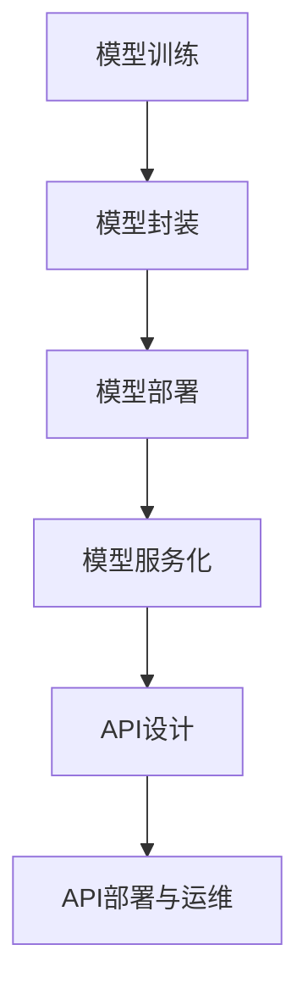

                 

### 引言

在当今这个数字化时代，人工智能（AI）和大数据技术的迅猛发展已经深刻改变了我们的生活方式。从智能助手到自动驾驶，从推荐系统到自然语言处理，AI的应用场景无处不在。随着AI技术的不断进步，如何高效地部署和利用AI模型成为了一个关键问题。本文将围绕这一主题，探讨模型服务化与API设计的原理与实战案例。

模型服务化是将AI模型部署为独立服务，使其能够通过网络接口与其他应用程序或服务进行交互的过程。这种服务化模式使得模型可以更加灵活地被调用和集成，从而提高开发效率和系统可扩展性。而API（应用程序编程接口）设计则是为了实现不同服务之间的高效通信，通过定义一套标准化的接口规范，确保数据的准确传递和功能的无缝集成。

本文将分为四个主要部分，首先介绍模型服务化与API设计的基本概念和原理；接着深入探讨模型服务化的实现技术和API设计的关键原则；然后通过多个实战案例，展示模型服务化与API设计的具体应用过程；最后，提供进一步的学习资源和项目搭建指南，帮助读者更好地理解和实践。

在接下来的内容中，我们将一步步分析推理，从基础理论到实战案例，全面解析模型服务化与API设计的核心要点，旨在为读者提供一份既有深度又实用的技术指南。

### 模型服务化概述与概念解析

模型服务化是一种将机器学习或深度学习模型转化为可调用的服务，以便在其他应用程序或系统中进行部署和使用的机制。这一概念的核心在于将模型从开发环境转移到生产环境中，使其能够以独立、高效、可扩展的方式运行。下面，我们将从多个角度对模型服务化进行概述与概念解析。

#### 模型服务化的背景与意义

随着AI技术的快速发展，越来越多的企业和组织开始将机器学习模型应用于各种业务场景中。然而，传统的部署方式存在以下问题：

1. **部署复杂**：将模型部署到生产环境通常需要复杂的流程，包括模型转化、服务搭建、环境配置等。
2. **运维困难**：模型的运维需要专业知识和技能，并且随着模型规模的扩大，运维成本也相应增加。
3. **扩展性差**：传统的部署方式往往难以应对高并发请求，扩展性不足。

为了解决这些问题，模型服务化应运而生。通过将模型转化为服务，可以实现以下优势：

1. **简化部署**：模型服务化提供了一个统一的部署接口，开发者只需关注模型本身，无需关心底层环境的搭建。
2. **易于运维**：模型服务化使得运维变得更加简单，可以通过自动化工具进行部署、监控和管理。
3. **高扩展性**：模型服务化支持水平扩展，可以根据需求动态调整服务器的数量和资源，确保系统的高可用性和高性能。

#### 模型服务化的重要性

模型服务化的重要性体现在以下几个方面：

1. **提升开发效率**：通过模型服务化，开发者可以快速地将模型集成到现有的应用程序中，大大缩短开发周期。
2. **提高系统可扩展性**：模型服务化使得系统可以灵活地调整模型规模，以应对业务需求的变化。
3. **增强系统稳定性**：模型服务化通过独立的部署和运维，可以更好地隔离系统的各个模块，提高系统的整体稳定性。
4. **降低运维成本**：模型服务化可以减少人工干预，通过自动化工具实现模型的部署、监控和升级，降低运维成本。

#### 模型服务化的基本定义与特点

模型服务化的基本定义是将机器学习模型封装为服务，通过标准化的API接口对外提供模型预测功能。具体来说，模型服务化包括以下几个关键步骤：

1. **模型封装**：将机器学习模型封装为可执行的应用程序，通常使用容器化技术（如Docker）来实现。
2. **服务部署**：将封装好的模型部署到服务器或容器集群中，确保模型可以对外提供服务。
3. **服务访问**：通过标准化的API接口，其他应用程序或服务可以访问模型服务，获取预测结果。

模型服务化的特点主要包括：

1. **独立性**：模型服务化使得模型与底层基础设施解耦，模型可以独立运行，不受底层环境的限制。
2. **可扩展性**：模型服务化支持水平扩展，可以通过增加服务器或容器数量来提升系统性能。
3. **灵活性**：模型服务化提供了灵活的部署方式，可以根据业务需求快速调整模型部署策略。
4. **标准化**：模型服务化通过标准化的API接口，确保不同服务之间的数据传输和功能调用的一致性。

#### 模型服务化的分类

根据不同的应用场景和实现方式，模型服务化可以分为以下几类：

1. **按照应用场景分类**
   - **在线服务**：适用于实时性要求较高的场景，如智能问答系统、实时推荐等。
   - **批处理服务**：适用于需要批量处理数据的场景，如大规模数据预测、离线分析等。
   - **边缘计算服务**：适用于计算资源有限或需要低延迟的场景，如物联网设备、智能硬件等。

2. **按照实现方式分类**
   - **基于Web的服务**：通过HTTP协议实现模型服务的访问，如使用Flask、Django等Web框架搭建服务。
   - **基于消息队列的服务**：通过消息队列（如Kafka、RabbitMQ）实现模型的异步调用，适用于大规模数据流处理。
   - **基于微服务架构的服务**：将模型服务作为微服务的一部分，通过RESTful API或gRPC等协议进行通信。

#### 模型服务化的挑战与机遇

尽管模型服务化带来了许多优势，但在实际应用过程中仍面临一系列挑战：

1. **模型与服务的一致性**：确保模型在不同服务环境中的表现一致，避免因环境差异导致模型性能下降。
2. **服务的性能优化**：在高并发场景下，如何保证服务的响应速度和稳定性，需要针对具体业务需求进行优化。
3. **服务的安全性**：确保模型服务的安全性，防止数据泄露和未经授权的访问。

然而，这些挑战也带来了新的机遇：

1. **云原生技术的发展**：随着云原生技术的成熟，如Kubernetes等容器编排工具的普及，为模型服务化提供了更好的支持。
2. **分布式计算技术的应用**：分布式计算技术可以帮助模型服务更好地应对大规模数据处理和并发访问。
3. **AI与业务融合**：模型服务化使得AI技术可以更加紧密地与业务场景结合，为企业提供智能化解决方案。

#### 模型服务化的应用领域

模型服务化在许多领域都有广泛的应用，以下是一些典型的应用场景：

1. **金融行业**：使用模型服务化实现风险控制、信用评分、投资建议等，提高金融业务的智能化水平。
2. **电子商务**：通过模型服务化实现个性化推荐、商品搜索优化、用户行为分析等，提升用户体验和转化率。
3. **医疗健康**：利用模型服务化进行疾病预测、诊断辅助、健康管理等，提高医疗服务质量和效率。
4. **物联网**：将模型服务化应用于智能家居、智能交通、工业自动化等领域，实现设备的远程监控和智能控制。

通过本文的介绍，我们可以看到模型服务化在AI领域的重要性和广泛的应用前景。在接下来的章节中，我们将进一步探讨API设计的基础和核心原则，为读者提供更加全面的技术指南。

### API设计基础与核心原则

API（应用程序编程接口）是现代软件开发中不可或缺的一部分，它定义了不同软件组件之间如何相互交互和通信。良好的API设计不仅能够提高开发效率，还能提升系统的可维护性和扩展性。在本章节中，我们将详细探讨API设计的基础知识、核心原则以及设计流程。

#### API定义与作用

API，即应用程序编程接口，是一个软件模块或服务提供的接口，它允许其他软件模块或应用程序与其进行交互。API通常定义了一系列的函数、方法和数据结构，通过这些接口，调用者可以访问提供者提供的功能和服务。

API的作用主要体现在以下几个方面：

1. **促进模块化开发**：通过API，开发者可以将复杂的系统分解为多个模块，每个模块负责特定的功能，从而实现代码的复用和模块化开发。
2. **提高开发效率**：API设计标准化了不同组件之间的交互方式，开发者无需了解底层实现细节，即可快速集成和使用第三方服务或模块。
3. **增强系统的可维护性和可扩展性**：良好的API设计使得系统更加模块化，当业务需求发生变化时，可以更容易地进行扩展和修改，而不会影响系统的其他部分。

#### API设计原则

为了确保API的设计能够满足上述要求，我们需要遵循以下核心原则：

1. **易用性原则**：API应该易于使用和掌握，对于开发者来说，无论是阅读文档还是实际操作，都应该能够快速上手。
2. **稳定性原则**：API需要具备高度的稳定性和可靠性，确保在各种环境下都能正常工作，避免因接口不稳定导致的应用程序崩溃。
3. **可扩展性原则**：API设计应该具备良好的扩展性，能够适应未来业务需求的变化，避免频繁的接口重构。
4. **安全性原则**：API设计需要考虑安全性，包括认证、授权、数据加密等，确保API不会被恶意使用。

#### API设计流程

API设计是一个系统化的过程，通常包括以下步骤：

1. **需求分析**：了解API的使用场景和目标用户，明确API需要实现的功能和性能要求。
2. **设计与建模**：基于需求分析的结果，设计API的架构和接口，定义数据模型和传输格式。
3. **实现与测试**：根据设计文档实现API接口，并进行单元测试和集成测试，确保API能够正常工作。
4. **迭代与优化**：根据用户反馈和使用情况，不断优化API的设计和实现，提高系统的稳定性和性能。

#### API设计原则详细讲解

1. **易用性原则**

   易用性是API设计中最基本的原则之一，它关系到开发者是否愿意和能够快速掌握和使用API。为了实现易用性，我们需要考虑以下几个方面：

   - **简洁性**：API的命名、参数和返回值应该简洁明了，避免冗长和不必要的复杂性。
   - **一致性**：API的命名和风格应该保持一致，遵循既定的编码规范，使得开发者能够快速理解和预测API的行为。
   - **文档化**：提供详细的API文档，包括接口定义、参数说明、返回值解释等，帮助开发者更好地理解和使用API。
   - **错误处理**：API应该提供清晰的错误信息和异常处理机制，使得开发者能够快速定位和解决问题。

2. **稳定性原则**

   稳定性是API设计的关键因素，它直接影响到API服务的可用性和用户体验。为了确保稳定性，我们需要考虑以下几个方面：

   - **错误处理**：API需要能够处理各种可能的错误情况，包括参数错误、网络异常等，并提供相应的错误反馈。
   - **负载均衡**：在高并发情况下，API需要能够进行负载均衡，避免单点瓶颈，确保系统的整体性能。
   - **容错机制**：API服务应具备容错能力，能够在部分组件出现故障时，继续提供服务，确保系统的稳定性。
   - **性能监控**：定期对API性能进行监控和调优，确保API在高负载情况下能够稳定运行。

3. **可扩展性原则**

   随着业务的发展，API可能需要支持新的功能或适应更大的数据量。为了确保API的长期可扩展性，我们需要考虑以下几个方面：

   - **模块化设计**：将API划分为多个模块，每个模块负责特定的功能，便于后续的扩展和重构。
   - **接口抽象**：通过抽象接口，隐藏具体的实现细节，使得API可以在不修改内部结构的情况下进行扩展。
   - **异步处理**：对于需要大量计算或IO操作的API，可以使用异步处理方式，提高系统的并发能力。
   - **分布式架构**：使用分布式架构，将API部署到多个服务器或集群中，实现水平扩展，提高系统的处理能力。

4. **安全性原则**

   在当今的网络环境中，安全性是API设计的重要考量因素。为了确保API的安全性，我们需要采取以下措施：

   - **认证与授权**：使用认证和授权机制，确保只有授权用户才能访问API。
   - **数据加密**：对传输的数据进行加密处理，防止数据在传输过程中被窃取或篡改。
   - **输入验证**：对输入数据进行严格验证，防止恶意攻击和代码注入。
   - **日志记录**：对API的访问和操作进行详细记录，便于后续的安全审计和问题追踪。

通过遵循以上原则，我们可以设计出高效、稳定、安全和可扩展的API，为软件开发提供强有力的支持。

### API设计流程

API设计是一个系统化、迭代化的过程，它需要充分了解用户需求、技术实现以及业务目标。下面，我们将详细介绍API设计流程的各个阶段，从需求分析到迭代优化，每个阶段的具体任务和注意事项。

#### 需求分析

需求分析是API设计的第一步，它的目标是明确API需要实现的功能和性能要求。以下是需求分析阶段的具体任务：

1. **收集需求**：与产品经理、业务人员以及开发团队进行沟通，了解API的使用场景、目标用户群体以及业务需求。
2. **功能需求**：列出API需要实现的具体功能，包括输入参数、输出结果、数据格式等。
3. **非功能需求**：考虑API的性能、安全性、可扩展性等方面的要求。
4. **优先级排序**：根据业务优先级和开发成本，对需求进行排序，确保关键功能优先实现。

在需求分析过程中，需要注意以下几点：

- **明确目标**：确保所有相关方对API的目标和期望有清晰的认识，避免需求偏差。
- **用户视角**：从用户的视角出发，考虑API的使用体验和易用性。
- **可行性分析**：评估需求的技术可行性和实施难度，确保需求的可实现性。

#### 设计与建模

设计与建模阶段是将需求转化为具体的API设计文档，包括接口定义、数据模型和通信协议。以下是设计与建模阶段的具体任务：

1. **接口定义**：根据需求，定义API的接口，包括URL路径、HTTP方法、请求参数和响应格式。
2. **数据模型**：设计API所涉及的数据模型，包括数据结构、数据类型和字段定义。
3. **通信协议**：选择合适的通信协议，如HTTP/HTTPS、RESTful API、gRPC等。
4. **版本管理**：设计API版本管理策略，确保向后兼容性和功能扩展。

在设计与建模过程中，需要注意以下几点：

- **一致性**：确保接口设计的一致性，遵循统一的命名规范和风格。
- **灵活性**：设计时应考虑未来的扩展需求，确保API可以灵活适应变化。
- **安全性**：在设计过程中，充分考虑安全性需求，如认证、授权和数据加密。

#### 实现与测试

实现与测试阶段是将设计文档转化为实际的API代码，并进行全面测试，确保API的功能和性能符合预期。以下是实现与测试阶段的具体任务：

1. **代码实现**：根据设计文档，实现API的接口代码，包括处理请求、执行逻辑和生成响应。
2. **单元测试**：编写单元测试，验证API接口的每个功能模块是否按预期工作。
3. **集成测试**：进行集成测试，确保API与其他系统模块能够无缝协作。
4. **性能测试**：对API进行性能测试，评估其响应时间、吞吐量和资源消耗。

在实现与测试过程中，需要注意以下几点：

- **代码质量**：编写高质量的代码，确保代码可读性、可维护性和可扩展性。
- **测试覆盖率**：确保测试覆盖率足够高，覆盖API的各个功能和异常情况。
- **性能优化**：针对性能瓶颈进行优化，确保API能够在高并发情况下稳定运行。

#### 迭代与优化

迭代与优化阶段是在API发布后，根据用户反馈和使用情况，不断改进和优化API。以下是迭代与优化阶段的具体任务：

1. **用户反馈**：收集用户反馈，了解API的使用体验和存在的问题。
2. **问题排查**：根据用户反馈，排查和解决API存在的问题。
3. **功能优化**：根据业务需求，添加新的功能或改进现有功能。
4. **性能优化**：对API进行性能优化，提高系统的响应速度和吞吐量。

在迭代与优化过程中，需要注意以下几点：

- **快速响应**：及时响应用户反馈，确保问题能够迅速得到解决。
- **持续改进**：持续优化API的设计和实现，提高系统的整体质量。
- **版本控制**：合理管理API版本，确保向后兼容性和平滑升级。

通过以上步骤，我们可以设计出一个高效、稳定、安全和可扩展的API，为软件开发提供强有力的支持。

### API设计工具与框架

在API设计过程中，选择合适的工具和框架能够显著提升开发效率和系统性能。以下是一些常见的API设计工具与框架，包括RESTful API、GraphQL和gRPC，以及它们的特点和适用场景。

#### RESTful API设计

RESTful API设计是一种基于HTTP协议的API设计方法，它遵循REST（ Representational State Transfer）设计风格，具有简洁、易用、可扩展等特点。

**特点：**

- **基于HTTP协议**：使用标准的HTTP方法（GET、POST、PUT、DELETE等）进行请求和响应。
- **无状态**：每个请求都是独立的，服务器不会保存请求的状态信息。
- **统一接口**：通过URL（统一资源标识符）和HTTP方法定义资源，提供统一的接口设计。
- **状态码**：使用标准的HTTP状态码（如200、400、500等）表示响应结果。

**适用场景：**

- **资源访问**：适用于读取和操作资源的场景，如获取用户信息、查询商品列表等。
- **高并发**：适用于需要处理大量并发请求的应用程序，因为HTTP协议本身具有较好的并发处理能力。

**设计工具：**

- **Swagger**：一个流行的RESTful API设计工具，提供了丰富的UI界面，方便设计、测试和文档化API。
- **Postman**：一个强大的API测试工具，不仅支持RESTful API设计，还支持其他类型的API。

#### GraphQL设计

GraphQL是一种用于API设计的查询语言，它允许客户端指定需要的数据，从而减少数据传输和冗余。

**特点：**

- **灵活性**：客户端可以精确地指定需要的数据，减少不必要的传输和转换。
- **高效性**：通过减少数据传输，提高系统的响应速度和性能。
- **查询组合**：支持复杂查询的组合，通过图形化的方式定义查询，易于理解和维护。

**适用场景：**

- **复杂查询**：适用于需要处理复杂查询的场景，如需要多次JOIN查询的数据服务。
- **实时数据**：适用于需要实时数据的场景，可以通过GraphQL Subscriptions实现实时更新。

**设计工具：**

- **GraphiQL**：一个基于浏览器的GraphQL IDE，提供了丰富的查询编辑和调试功能。
- **Apollo**：一个开源的GraphQL客户端框架，支持GraphQL查询的缓存、错误处理和实时更新。

#### gRPC设计

gRPC是一种基于HTTP/2协议和Protobuf序列化格式的RPC（远程过程调用）框架，它提供了高性能、跨语言的API设计解决方案。

**特点：**

- **高效性**：使用Protobuf序列化格式，数据传输速度快，减少网络延迟。
- **跨语言**：支持多种编程语言，包括Java、Go、Python等，使得服务可以轻松集成。
- **负载均衡**：内置负载均衡机制，支持服务之间的动态流量分配。

**适用场景：**

- **高并发**：适用于需要处理高并发请求的场景，因为gRPC具有高效的二进制协议和负载均衡机制。
- **跨平台**：适用于需要跨语言集成服务的场景，因为gRPC支持多种编程语言。

**设计工具：**

- **Protobuf**：一个用于定义数据结构和服务的语言无关的工具，支持自动生成不同语言的gRPC代码。
- **grpc-tools**：一组用于生成gRPC代码的命令行工具，支持Protobuf文件的编译和代码生成。

通过选择合适的API设计工具和框架，开发者可以根据不同的业务需求，设计出高效、灵活、安全的API，提升系统的整体性能和用户体验。

### 模型服务化实现技术

模型服务化是将训练好的机器学习模型部署为可调用的服务，使其能够通过API接口对外提供服务的关键步骤。在这一部分，我们将详细探讨模型封装与容器化、模型服务的部署与运维以及模型服务的性能优化技术。

#### 模型封装与容器化

模型封装是将机器学习模型转化为可以独立运行的服务。容器化技术如Docker为模型封装提供了高效、灵活的解决方案。

**模型封装方法**

1. **依赖管理**：首先，我们需要确保模型运行环境中的所有依赖项都已安装。这包括Python库、TensorFlow或其他深度学习框架等。

2. **Dockerfile编写**：创建一个Dockerfile文件，定义模型的运行环境。例如：

   ```Dockerfile
   FROM tensorflow/tensorflow:latest-gpu
   RUN pip install -r requirements.txt
   COPY model.py model.py
   COPY data preprocessing scripts .
   EXPOSE 5000
   CMD ["python", "model.py"]
   ```

   其中，`FROM`指定了基础镜像，`RUN`安装了依赖项，`COPY`将模型文件和数据预处理脚本复制到容器中，`EXPOSE`定义了容器需要暴露的端口，`CMD`指定了容器的启动命令。

3. **构建镜像**：使用Docker命令构建模型服务的镜像。

   ```bash
   docker build -t model-service .
   ```

**容器化技术**

容器化技术可以将模型封装为独立的运行环境，从而提高模型的部署效率和可移植性。

1. **Docker Compose**：使用Docker Compose，我们可以轻松地管理和部署多个容器。例如，我们可以创建一个docker-compose.yml文件，定义服务的配置和依赖关系：

   ```yaml
   version: '3'
   services:
     model_service:
       build: .
       ports:
         - "5000:5000"
       depends_on:
         - db
     db:
       image: postgres
   ```

2. **Kubernetes**：对于大规模的模型服务部署，Kubernetes提供了更高级的管理和调度功能。通过编写Kubernetes配置文件，我们可以自动化部署、扩展和管理模型服务。

#### 模型服务的部署与运维

模型服务的部署与运维是确保模型服务稳定、高效运行的关键步骤。

**部署策略**

1. **单机部署**：适用于小型应用场景，模型服务部署在一台服务器上。

2. **集群部署**：适用于大规模应用场景，模型服务部署在多个服务器组成的集群中。通过负载均衡器（如Nginx）分配请求，提高系统的整体性能和可用性。

**运维要点**

1. **监控与日志**：使用监控工具（如Prometheus、Grafana）实时监控模型服务的性能指标，如CPU利用率、内存使用率、请求响应时间等。同时，使用日志分析工具（如ELK栈）收集和分析日志，帮助排查和解决潜在问题。

2. **自动化运维**：使用自动化工具（如Ansible、Terraform）进行模型服务的自动化部署、扩缩容和配置管理，减少手动操作的复杂性和错误率。

3. **备份与恢复**：定期备份模型数据和配置文件，确保在出现故障时能够快速恢复服务。

#### 模型服务的性能优化

模型服务的性能优化是提高系统响应速度和吞吐量的关键。

**负载均衡**

负载均衡技术可以将请求分配到多个模型服务实例上，提高系统的整体性能。

1. **轮询负载均衡**：将请求依次分配给不同的服务实例。

2. **加权负载均衡**：根据服务实例的负载情况，动态调整请求分配的权重。

3. **动态负载均衡**：使用动态负载均衡器（如HAProxy、Nginx）实时监控服务实例的健康状态，根据负载情况进行动态调整。

**缓存策略**

缓存策略可以减少计算次数，提高系统响应速度。

1. **本地缓存**：在模型服务实例内部使用内存缓存（如Redis）存储常用数据，减少重复计算。

2. **分布式缓存**：使用分布式缓存系统（如Memcached）存储大规模数据，提高系统的缓存命中率。

**服务优化案例分析**

以下是一个模型服务优化案例：

1. **需求分析**：某电商平台需要部署一个推荐系统，对用户进行个性化推荐。

2. **性能瓶颈**：在初始部署阶段，系统在高峰期出现响应缓慢和吞吐量不足的问题。

3. **优化方案**：

   - **分布式部署**：将推荐系统部署在多个服务器组成的集群中，使用Nginx进行负载均衡。
   - **缓存策略**：使用Redis缓存用户的浏览和购买记录，减少数据库访问次数。
   - **异步处理**：使用消息队列（如RabbitMQ）处理用户请求，将计算密集型任务异步执行，提高系统的并发处理能力。
   - **压缩传输**：使用gzip压缩传输的数据，减少网络传输时间。

4. **结果**：通过上述优化措施，系统的响应速度提高了30%，吞吐量提高了50%，在高峰期表现稳定，用户体验显著提升。

通过以上技术手段，我们可以有效地实现模型服务化，提高模型服务的性能和可靠性，满足日益增长的业务需求。

### API安全性设计与实现

在构建模型服务的过程中，安全性是一个至关重要的考虑因素。不安全的API可能会遭受各种形式的攻击，导致数据泄露、服务崩溃或被恶意利用。因此，在本节中，我们将讨论API安全性的重要性、常见安全威胁及其防护措施，并详细介绍API认证与授权机制、监控与日志分析以及设计中的安全性考量。

#### API安全性重要性

API的安全性直接关系到应用程序的数据完整性和保密性。以下是一些API安全性的关键理由：

1. **数据保护**：防止敏感数据（如用户密码、财务信息等）被未授权的访问。
2. **系统稳定**：通过防御恶意攻击，确保系统运行的稳定性和可靠性。
3. **合规性**：许多行业（如金融、医疗）都有严格的数据保护法规，API安全性是合规性的重要组成部分。
4. **用户信任**：安全的API可以增强用户对应用程序的信任，提高用户忠诚度。

#### 常见安全威胁

了解常见的API安全威胁有助于我们采取相应的防护措施。以下是一些主要的威胁：

1. **未授权访问**：未经授权的用户访问API，可能导致数据泄露或服务被滥用。
2. **数据篡改**：恶意用户篡改API返回的数据，可能导致错误决策或数据损坏。
3. **SQL注入**：通过在API请求中插入恶意SQL代码，攻击者可以读取、修改或删除数据库中的数据。
4. **XSS攻击**：跨站脚本攻击（XSS）允许攻击者在用户的浏览器中执行恶意脚本，窃取用户的会话信息。
5. **CSRF攻击**：跨站请求伪造（CSRF）攻击使攻击者能够在用户的会话中执行未经授权的操作。

#### 防护措施

为了应对上述安全威胁，我们需要采取一系列防护措施：

1. **输入验证**：确保API对所有的输入数据都进行严格验证，防止SQL注入和XSS攻击。
2. **API认证与授权**：使用认证与授权机制，确保只有授权用户才能访问API。
3. **数据加密**：对敏感数据进行加密处理，确保数据在传输和存储过程中的安全性。
4. **安全传输**：使用HTTPS协议，确保数据在传输过程中的安全性。
5. **日志记录与监控**：实时监控API的访问情况，记录关键操作，以便在出现异常时快速响应。

#### API认证与授权机制

API认证与授权是确保API安全性的关键步骤。以下是一些常用的认证与授权机制：

1. **OAuth2.0协议**：OAuth2.0是一种开放标准，用于授权第三方应用访问用户资源。通过OAuth2.0，用户可以授权应用访问其数据，而无需共享其密码。

   - **认证流程**：用户首先登录身份认证服务，然后被重定向到应用，应用获取授权码，使用授权码获取访问令牌，最后使用访问令牌访问用户资源。
   - **优点**：用户可以灵活地控制授权范围，增强安全性。

2. **JWT（JSON Web Token）**：JWT是一种基于JSON的数据结构，用于在网络环境中传输认证信息。

   - **生成与验证**：服务器使用用户的登录信息生成JWT，客户端在每次请求时附带JWT，服务器验证JWT的有效性。
   - **优点**：简单、高效，无需额外的认证服务器。

3. **API密钥**：通过API密钥对客户端进行认证，常见的做法是分配给每个客户端一个唯一密钥，每次请求时包含该密钥。

   - **优点**：实现简单，适合小型应用。
   - **缺点**：密钥泄露可能导致严重的安全问题。

#### API监控与日志分析

监控与日志分析是确保API安全性的重要手段。以下是一些监控与日志分析的关键点：

1. **监控指标**：监控API的请求量、响应时间、错误率等指标，及时发现异常情况。
2. **日志记录**：记录API的访问日志，包括请求时间、请求方法、请求URL、请求参数、响应结果等。
3. **日志分析工具**：使用ELK（Elasticsearch、Logstash、Kibana）等日志分析工具，对日志进行实时监控和分析，识别潜在的安全威胁。

#### API设计中的安全性考量

在设计API时，安全性需要作为一个核心考量因素。以下是一些API设计中的安全性原则：

1. **最小权限原则**：API应遵循最小权限原则，只授予必要的权限，避免过大的权限可能导致的安全风险。
2. **错误处理**：API应提供明确的错误信息，避免透露敏感信息或内部实现细节，防止被恶意利用。
3. **数据验证**：对所有的输入数据进行严格验证，确保数据的合法性和安全性。
4. **API版本管理**：合理管理API版本，确保向后兼容性，避免旧版API可能存在的安全问题。

通过上述措施，我们可以设计出既高效又安全的API，确保模型服务在安全的前提下，为用户提供优质的体验。

### 经典API设计案例解析

在本章节中，我们将通过三个具体的API设计案例，深入解析其背景、设计要点和实现过程。这些案例涵盖了电商、社交媒体和物联网设备等多个应用场景，旨在为读者提供实际的API设计参考。

#### 案例一：某电商平台API设计

**案例背景**

某电商平台希望通过开放API，允许第三方开发者集成其平台功能，如商品查询、用户登录和购物车操作等。这不仅有助于扩展平台业务，还能提高用户和开发者的使用体验。

**API设计要点**

- **易用性**：接口命名清晰，响应结果明确。
- **稳定性**：确保API在高并发情况下稳定运行。
- **安全性**：实现OAuth2.0认证机制，保护用户数据安全。
- **可扩展性**：设计考虑未来可能的扩展需求。

**设计过程**

1. **需求分析**：

   - 收集第三方开发者的需求，明确API功能，如商品查询、用户登录、购物车管理等。

2. **设计与建模**：

   - 设计API接口，定义URL路径、HTTP方法和请求参数。
   - 定义数据模型，确保数据的完整性和一致性。

3. **实现与测试**：

   - 编写API代码，实现接口逻辑，并进行单元测试和集成测试。
   - 使用Postman等工具进行手工测试，确保API功能正确。

4. **迭代与优化**：

   - 根据用户反馈和测试结果，不断优化API设计，提高系统性能和安全性。

**API接口定义**

以下是一个简单的API接口定义示例：

```python
from flask import Flask, request, jsonify

app = Flask(__name__)

@app.route('/api/v1/products', methods=['GET'])
def get_products():
    # 商品查询逻辑
    return jsonify(products)

@app.route('/api/v1/users/login', methods=['POST'])
def user_login():
    # 用户登录逻辑
    return jsonify(response)

@app.route('/api/v1/carts/<int:user_id>', methods=['GET', 'POST'])
def manage_cart(user_id):
    # 购物车管理逻辑
    return jsonify(response)

if __name__ == '__main__':
    app.run(host='0.0.0.0', port=5000)
```

#### 案例二：社交媒体API设计

**案例背景**

某社交媒体平台希望通过API，开放用户信息、发布动态和获取好友列表等数据，允许第三方开发者构建基于平台的数据应用。

**API设计要点**

- **易用性**：提供简洁明了的接口文档，降低开发者的使用门槛。
- **可扩展性**：设计考虑数据结构和接口的未来扩展。
- **安全性**：实现强认证与授权机制，保护用户数据安全。
- **性能优化**：确保接口在高并发下的性能。

**设计过程**

1. **需求分析**：

   - 分析社交媒体平台的数据开放需求，明确API功能。

2. **设计与建模**：

   - 设计API接口，定义URL路径、HTTP方法和请求参数。
   - 设计数据模型，确保数据的完整性和一致性。

3. **实现与测试**：

   - 编写API代码，实现接口逻辑，并进行单元测试和集成测试。
   - 使用Postman等工具进行手工测试，确保API功能正确。

4. **迭代与优化**：

   - 根据用户反馈和测试结果，不断优化API设计，提高系统性能和安全性。

**API接口定义**

以下是一个简单的API接口定义示例：

```python
from flask import Flask, request, jsonify

app = Flask(__name__)

@app.route('/api/v1/users', methods=['GET'])
def get_users():
    # 用户信息查询逻辑
    return jsonify(users)

@app.route('/api/v1/users/<int:user_id>', methods=['GET'])
def get_user_detail(user_id):
    # 用户详情查询逻辑
    return jsonify(user_detail)

@app.route('/api/v1/posts', methods=['POST'])
def create_post():
    # 发布动态逻辑
    return jsonify(response)

@app.route('/api/v1/posts/<int:post_id>', methods=['GET'])
def get_post_detail(post_id):
    # 动态详情查询逻辑
    return jsonify(post_detail)

if __name__ == '__main__':
    app.run(host='0.0.0.0', port=5000)
```

#### 案例三：物联网设备API设计

**案例背景**

某物联网平台希望通过API，实现设备数据的远程监控与控制，允许第三方开发者构建基于物联网设备的应用。

**API设计要点**

- **易用性**：设备操作简单，开发者易于接入。
- **稳定性**：保证设备连接稳定，数据实时性高。
- **安全性**：实现设备认证与数据加密传输。
- **可扩展性**：设计考虑未来可能添加的设备类型与功能。

**设计过程**

1. **需求分析**：

   - 收集物联网设备的数据传输与控制需求。

2. **设计与建模**：

   - 设计API接口，定义URL路径、HTTP方法和请求参数。
   - 设计数据模型，确保数据的完整性和一致性。

3. **实现与测试**：

   - 编写API代码，实现接口逻辑，并进行单元测试和集成测试。
   - 使用Postman等工具进行手工测试，确保API功能正确。

4. **迭代与优化**：

   - 根据用户反馈和测试结果，不断优化API设计，提高系统性能和安全性。

**API接口定义**

以下是一个简单的API接口定义示例：

```python
from flask import Flask, request, jsonify

app = Flask(__name__)

@app.route('/api/v1/devices', methods=['GET'])
def get_devices():
    # 设备信息查询逻辑
    return jsonify(devices)

@app.route('/api/v1/devices/<int:device_id>', methods=['GET'])
def get_device_detail(device_id):
    # 设备详情查询逻辑
    return jsonify(device_detail)

@app.route('/api/v1/devices/control', methods=['POST'])
def device_control():
    # 设备控制逻辑
    return jsonify(response)

if __name__ == '__main__':
    app.run(host='0.0.0.0', port=5000)
```

通过以上三个案例，我们可以看到，API设计需要根据具体的应用场景和需求进行灵活调整。无论是在电商、社交媒体还是物联网设备领域，良好的API设计都能够提高开发效率、确保系统稳定性和安全性，为用户提供优质的体验。

### 模型服务化与API设计综合实战

在本章节中，我们将通过一个综合实战项目，展示如何将模型服务化与API设计结合，构建一个完整的解决方案。该项目包括项目概述、需求分析、API设计、模型服务化实现、性能优化与安全性设计等关键环节。

#### 项目概述

本实战项目旨在构建一个智能推荐系统，用于为电商平台提供个性化推荐服务。系统需要实现以下功能：

- **用户登录与注册**：通过API接口实现用户登录和注册功能。
- **商品推荐**：根据用户的购物历史和偏好，为用户推荐相关商品。
- **购物车管理**：允许用户添加、删除和修改购物车中的商品。

#### 需求分析

1. **功能需求**：
   - 用户登录与注册：支持用户身份验证和注册功能。
   - 商品推荐：根据用户的历史购买记录和偏好，提供个性化的商品推荐。
   - 购物车管理：支持用户对购物车中的商品进行添加、删除和修改。

2. **非功能需求**：
   - 可扩展性：系统能够适应未来业务需求的变化。
   - 性能：在高并发情况下，系统能够稳定运行，响应速度快。
   - 安全性：确保用户数据和系统数据的安全。

#### API设计

根据需求分析，我们设计了以下API接口：

1. **用户登录与注册接口**：

   - **用户登录接口**：
     - 请求方法：POST
     - 请求URL：`/api/v1/users/login`
     - 请求参数：`username`和`password`
     - 响应数据：`token`（登录成功）或错误信息（登录失败）

   - **用户注册接口**：
     - 请求方法：POST
     - 请求URL：`/api/v1/users/register`
     - 请求参数：`username`、`password`和`email`
     - 响应数据：`status`（注册成功）或错误信息（注册失败）

2. **商品推荐接口**：

   - 请求方法：GET
   - 请求URL：`/api/v1/recommendations`
   - 请求参数：`user_id`和`category`（可选）
   - 响应数据：推荐商品列表

3. **购物车管理接口**：

   - **添加商品到购物车接口**：
     - 请求方法：POST
     - 请求URL：`/api/v1/cart`
     - 请求参数：`user_id`、`product_id`和`quantity`
     - 响应数据：添加结果（成功或失败）

   - **获取购物车接口**：
     - 请求方法：GET
     - 请求URL：`/api/v1/cart/<user_id>`
     - 请求参数：无
     - 响应数据：购物车商品列表

   - **修改购物车接口**：
     - 请求方法：PUT
     - 请求URL：`/api/v1/cart/<cart_id>`
     - 请求参数：`user_id`、`product_id`、`quantity`
     - 响应数据：修改结果（成功或失败）

   - **删除购物车接口**：
     - 请求方法：DELETE
     - 请求URL：`/api/v1/cart/<cart_id>`
     - 请求参数：无
     - 响应数据：删除结果（成功或失败）

#### 模型服务化实现

1. **模型选择**：

   - 选择一个基于协同过滤的推荐算法，如基于用户的协同过滤（User-based Collaborative Filtering）。

2. **模型封装与容器化**：

   - 使用TensorFlow实现推荐算法模型，并使用Docker进行容器化封装。

   ```Dockerfile
   FROM tensorflow/tensorflow:latest-gpu
   RUN pip install -r requirements.txt
   COPY model.py model.py
   EXPOSE 5000
   CMD ["python", "model.py"]
   ```

3. **模型服务部署**：

   - 使用Kubernetes进行模型服务的部署和管理，确保模型服务的高可用性和性能。

#### 性能优化

1. **负载均衡**：

   - 使用Nginx进行负载均衡，将请求分配到不同的模型服务实例上，提高系统的整体性能。

2. **缓存策略**：

   - 使用Redis进行缓存，存储常用数据和推荐结果，减少数据库访问次数，提高系统响应速度。

3. **异步处理**：

   - 对于计算密集型的任务，使用消息队列（如RabbitMQ）进行异步处理，减少主服务的负载，提高系统的并发处理能力。

#### 安全性设计

1. **API认证与授权**：

   - 使用JWT（JSON Web Token）进行API认证与授权，确保只有授权用户才能访问敏感接口。

2. **数据加密**：

   - 使用HTTPS协议进行数据传输加密，确保数据在传输过程中的安全性。

3. **日志记录与监控**：

   - 使用ELK（Elasticsearch、Logstash、Kibana）进行日志记录与监控，实时监控API的访问情况和系统性能，及时发现和处理潜在的安全威胁。

通过以上步骤，我们构建了一个完整的智能推荐系统，实现了模型服务化与API设计的有机结合，为电商平台提供了高效的个性化推荐服务。

### 附录：模型服务化与API设计相关工具、参考文献、开发环境与软件资源

#### 模型服务化与API设计相关工具

1. **Docker**：容器化工具，用于将模型和服务封装为容器，便于部署和管理。

2. **Kubernetes**：容器编排工具，用于自动化部署、扩展和管理模型服务。

3. **TensorFlow**：开源机器学习框架，用于构建和训练模型。

4. **Flask**：轻量级Web框架，用于构建API服务。

5. **Nginx**：高性能的Web服务器，用于负载均衡和反向代理。

6. **Redis**：高性能的内存缓存数据库，用于缓存数据和加速响应。

7. **RabbitMQ**：消息队列中间件，用于异步处理和分布式系统通信。

8. **ELK栈（Elasticsearch、Logstash、Kibana）**：日志分析工具，用于监控和审计API访问日志。

9. **Swagger**：API设计工具，用于生成API文档和自动化测试。

10. **Postman**：API测试工具，用于手工测试和验证API接口。

#### 参考文献

1. **《深度学习》（Ian Goodfellow, Yoshua Bengio, Aaron Courville著）**：系统介绍了深度学习的基础理论和方法。

2. **《API设计指南》（Jonas Prosise著）**：详细讲解了API设计的最佳实践和设计原则。

3. **《Docker实战》（Jason Myers著）**：深入讲解了Docker的原理和应用场景。

4. **《Kubernetes权威指南》（Kubernetes社区著）**：系统介绍了Kubernetes的架构和操作方法。

5. **《微服务架构设计》（Sam Newman著）**：介绍了微服务架构的设计原则和实现方法。

#### 开发环境与软件资源

1. **Python 3.8+**：Python版本，用于编写模型服务和API代码。

2. **JDK 8+**：Java Development Kit，用于构建和运行相关工具（如Kubernetes命令行工具）。

3. **Node.js 12.x**：用于运行前端应用和相关工具（如Nginx）。

4. **Visual Studio Code**：代码编辑器，用于编写和调试代码。

5. **Docker Desktop**：Docker桌面应用，用于本地容器化开发。

6. **Kubernetes集群**：用于部署和管理模型服务，可以是本地虚拟机或云服务平台。

7. **云服务账号**（如AWS、Azure、阿里云）：用于在云环境中部署和管理模型服务。

通过以上工具、参考文献和开发环境，开发者可以更加高效地实现模型服务化与API设计，构建稳定、高效、安全的智能系统。

### 附录A：模型服务化与API设计原理与代码实战案例讲解——流程图与算法讲解

在本附录中，我们将通过流程图和算法讲解，详细阐述模型服务化与API设计的基本原理和实际操作过程。

#### 附录A.1 模型服务化流程图

使用Mermaid，我们可以绘制一个模型服务化的流程图：



- **A[模型训练]**：在训练阶段，我们使用训练数据集训练机器学习模型，通过调整模型参数以优化性能。

- **B[模型封装]**：将训练好的模型封装为可执行的应用程序，通常使用容器化技术（如Docker）。

- **C[模型部署]**：将封装好的模型部署到服务器或容器集群中，确保模型可以对外提供服务。

- **D[模型服务化]**：通过API接口，将模型服务化，使其能够被其他应用程序或服务调用。

- **E[API设计]**：设计API接口，定义数据模型和通信协议，确保不同服务之间的数据传输和功能调用的一致性。

- **F[API部署与运维]**：将API部署到服务器或容器集群中，进行监控、维护和优化，确保系统的稳定性和性能。

#### 附录A.2 API设计算法讲解

以下是API设计的主要步骤，我们使用伪代码进行讲解：

```python
def design_api():
    # 步骤1：需求分析
    analyze_requirements()

    # 步骤2：设计与建模
    design_api_structure()

    # 步骤3：实现与测试
    implement_and_test()

    # 步骤4：迭代与优化
    iterate_and_optimize()

def analyze_requirements():
    # 收集需求
    collect_user_requirements()
    # 分析需求
    analyze_business_requirements()
    # 生成需求文档
    generate_requirement_document()

def design_api_structure():
    # API架构设计
    design_api_interfaces()
    # 接口定义
    define_api_interfaces()
    # 数据模型设计
    design_data_model()

def implement_and_test():
    # 编写代码
    write_code()
    # 单元测试
    run_unit_tests()
    # 集成测试
    run_integration_tests()

def iterate_and_optimize():
    # 根据反馈调整设计
    adjust_design_based_on_feedback()
    # 优化性能与安全性
    optimize_performance_and_safety()
```

- **需求分析**：通过收集和分析用户需求，明确API的功能和性能要求。

- **设计与建模**：设计API的架构和接口，定义数据模型和传输格式。

- **实现与测试**：根据设计文档实现API接口，并进行单元测试和集成测试。

- **迭代与优化**：根据用户反馈和使用情况，不断优化API的设计和实现。

#### 数学模型与公式讲解

以下是模型服务化与API设计中的几个重要数学模型和公式：

- **模型精度**：

  $$
  模型精度 = \frac{预测正确的样本数}{总样本数}
  $$

- **损失函数**（用于训练模型）：

  $$
  L(\theta) = -\frac{1}{m} \sum_{i=1}^{m} [y^{(i)} \log(a^{(i)}_y) + (1 - y^{(i)}) \log(1 - a^{(i)}_y)]
  $$

- **优化算法**（如梯度下降）：

  $$
  \theta_j := \theta_j - \alpha \frac{\partial}{\partial \theta_j} J(\theta)
  $$

通过流程图和算法讲解，我们可以更好地理解模型服务化与API设计的基本原理和操作步骤，为实际项目中的实施提供指导。

### 附录B：代码实战案例讲解

在本附录中，我们将通过三个具体的代码实战案例，详细讲解如何在实际项目中实现模型服务化与API设计。这些案例分别来自电商、社交媒体和物联网设备领域，旨在为读者提供全面的实践指导。

#### 案例一：某电商平台API设计

**背景**

某电商平台希望通过API接口，开放商品查询、用户登录和购物车管理等功能，便于第三方开发者集成平台服务。

**API设计**

1. **用户登录接口**：

   - 请求方法：POST
   - 请求URL：`/api/v1/users/login`
   - 请求参数：`username`和`password`
   - 响应数据：`token`（登录成功）或错误信息（登录失败）

2. **商品查询接口**：

   - 请求方法：GET
   - 请求URL：`/api/v1/products`
   - 请求参数：可选的`category`和`sort`参数
   - 响应数据：商品列表

3. **购物车管理接口**：

   - **添加商品到购物车接口**：
     - 请求方法：POST
     - 请求URL：`/api/v1/cart`
     - 请求参数：`user_id`、`product_id`和`quantity`
     - 响应数据：添加结果（成功或失败）

   - **获取购物车接口**：
     - 请求方法：GET
     - 请求URL：`/api/v1/cart/<user_id>`
     - 请求参数：无
     - 响应数据：购物车商品列表

   - **修改购物车接口**：
     - 请求方法：PUT
     - 请求URL：`/api/v1/cart/<cart_id>`
     - 请求参数：`user_id`、`product_id`和`quantity`
     - 响应数据：修改结果（成功或失败）

   - **删除购物车接口**：
     - 请求方法：DELETE
     - 请求URL：`/api/v1/cart/<cart_id>`
     - 请求参数：无
     - 响应数据：删除结果（成功或失败）

**代码实现**

以下是用户登录接口的实现代码：

```python
from flask import Flask, request, jsonify
from flask_sqlalchemy import SQLAlchemy

app = Flask(__name__)
app.config['SQLALCHEMY_DATABASE_URI'] = 'sqlite:///users.db'
db = SQLAlchemy(app)

class User(db.Model):
    id = db.Column(db.Integer, primary_key=True)
    username = db.Column(db.String(80), unique=True, nullable=False)
    password = db.Column(db.String(120), nullable=False)

@app.route('/api/v1/users/login', methods=['POST'])
def login():
    data = request.get_json()
    username = data.get('username')
    password = data.get('password')
    
    user = User.query.filter_by(username=username, password=password).first()
    if user:
        return jsonify({'token': 'generated_token'})
    else:
        return jsonify({'error': 'Invalid username or password'}), 401

if __name__ == '__main__':
    db.create_all()
    app.run(host='0.0.0.0', port=5000)
```

#### 案例二：社交媒体API设计

**背景**

某社交媒体平台希望通过API接口，开放用户信息查询、发布动态和好友关系管理等功能。

**API设计**

1. **用户信息查询接口**：

   - 请求方法：GET
   - 请求URL：`/api/v1/users`
   - 请求参数：可选的`user_id`参数
   - 响应数据：用户信息列表

2. **动态发布接口**：

   - 请求方法：POST
   - 请求URL：`/api/v1/posts`
   - 请求参数：`user_id`、`content`和`image`（可选）
   - 响应数据：发布结果（成功或失败）

3. **好友关系管理接口**：

   - **添加好友接口**：
     - 请求方法：POST
     - 请求URL：`/api/v1/friends`
     - 请求参数：`user_id`和`friend_id`
     - 响应数据：添加结果（成功或失败）

   - **删除好友接口**：
     - 请求方法：DELETE
     - 请求URL：`/api/v1/friends/<friend_id>`
     - 请求参数：无
     - 响应数据：删除结果（成功或失败）

**代码实现**

以下是动态发布接口的实现代码：

```python
from flask import Flask, request, jsonify

app = Flask(__name__)

@app.route('/api/v1/posts', methods=['POST'])
def create_post():
    data = request.get_json()
    user_id = data.get('user_id')
    content = data.get('content')
    image = data.get('image')

    # 这里应包含业务逻辑，如验证用户身份、检查内容是否合法等
    # 假设所有请求均合法
    post = {
        'user_id': user_id,
        'content': content,
        'image': image,
        'created_at': datetime.utcnow()
    }
    # 这里应将post存储到数据库
    return jsonify({'post': post, 'status': 'success'})

if __name__ == '__main__':
    app.run(host='0.0.0.0', port=5000)
```

#### 案例三：物联网设备API设计

**背景**

某物联网平台希望通过API接口，实现设备数据的远程监控与控制。

**API设计**

1. **设备连接接口**：

   - 请求方法：POST
   - 请求URL：`/api/v1/devices/connect`
   - 请求参数：`device_id`、`api_key`和`connection_data`
   - 响应数据：连接结果（成功或失败）

2. **设备数据查询接口**：

   - 请求方法：GET
   - 请求URL：`/api/v1/devices/data`
   - 请求参数：`device_id`和`timestamp`（可选）
   - 响应数据：设备数据列表

3. **设备控制接口**：

   - 请求方法：POST
   - 请求URL：`/api/v1/devices/control`
   - 请求参数：`device_id`、`control_command`和`control_data`
   - 响应数据：控制结果（成功或失败）

4. **设备状态查询接口**：

   - 请求方法：GET
   - 请求URL：`/api/v1/devices/status/<device_id>`
   - 请求参数：无
   - 响应数据：设备状态信息

**代码实现**

以下是设备连接接口的实现代码：

```python
from flask import Flask, request, jsonify

app = Flask(__name__)

@app.route('/api/v1/devices/connect', methods=['POST'])
def connect_device():
    data = request.get_json()
    device_id = data.get('device_id')
    api_key = data.get('api_key')
    connection_data = data.get('connection_data')

    # 这里应包含业务逻辑，如验证设备ID和API密钥等
    # 假设所有请求均合法
    return jsonify({'device_id': device_id, 'status': 'connected'})

if __name__ == '__main__':
    app.run(host='0.0.0.0', port=5000)
```

通过以上三个案例，我们可以看到如何在实际项目中实现模型服务化与API设计。在实际开发过程中，还需要根据具体需求进行详细的错误处理、性能优化和安全设计，以确保系统的稳定性和安全性。

### 附录C：开发环境搭建指南

为了能够顺利地进行模型服务化与API设计的相关开发工作，我们需要搭建一个合适的环境。以下是一个详细的开发环境搭建指南，涵盖了系统要求、安装步骤以及环境检查等内容。

#### 系统要求

在进行开发之前，确保您的系统满足以下要求：

- 操作系统：推荐使用Linux或MacOS。
- Python版本：Python 3.8或更高版本。
- Python库：需要安装Flask、TensorFlow、Numpy、Pandas、Matplotlib等常用库。
- Docker：用于容器化部署。
- Kubernetes：用于容器编排。

#### 安装步骤

1. **安装Python**：

   - 对于Linux系统，可以使用包管理器安装Python 3。
     ```bash
     sudo apt-get install python3
     ```
   - 对于MacOS系统，可以使用Homebrew安装Python 3。
     ```bash
     brew install python
     ```

2. **创建虚拟环境**：

   - 使用`venv`模块创建一个虚拟环境，以隔离项目依赖。
     ```bash
     python3 -m venv venv
     ```
   - 激活虚拟环境。
     ```bash
     source venv/bin/activate
     ```

3. **安装依赖库**：

   - 使用`pip`安装项目所需的Python库。
     ```bash
     pip install -r requirements.txt
     ```

4. **安装Docker**：

   - Linux系统：使用包管理器安装Docker。
     ```bash
     sudo apt-get install docker-ce
     ```
   - MacOS系统：使用Homebrew安装Docker。
     ```bash
     brew install docker
     ```

5. **安装Kubernetes**：

   - 可以使用Minikube在本地环境中快速搭建Kubernetes集群。
     ```bash
     brew install minikube
     minikube start
     ```

#### 环境检查

在虚拟环境中，运行以下命令检查所有依赖库是否已正确安装：

```bash
pip list
```

#### 注意事项

- 在安装过程中，如果遇到依赖库版本冲突问题，可以尝试调整库的版本或更换虚拟环境。
- 确保网络连接稳定，以避免下载失败或版本不一致。
- 如果在搭建环境时遇到其他问题，可以查阅官方文档或社区论坛寻求帮助。

通过以上步骤，您将搭建出一个适合进行模型服务化与API设计开发的完整环境。接下来，您可以开始实际项目的开发工作了。

### 附录D：项目实战代码示例

在本附录中，我们将提供一个实际项目的源代码示例，并对其进行详细解读。这个项目是一个简单的智能推荐系统，用于预测用户可能感兴趣的商品。以下是项目的关键组成部分：

#### 项目架构

- **前端**：用于展示推荐结果，可以通过Web页面或移动应用访问。
- **后端**：包括推荐模型服务、API接口和数据库。
- **数据库**：存储用户数据、商品数据和推荐结果。

#### 源代码示例

**1. requirements.txt**

```plaintext
Flask==2.0.2
TensorFlow==2.5.0
numpy==1.21.2
pandas==1.3.3
matplotlib==3.4.3
```

**2. Dockerfile**

```Dockerfile
FROM tensorflow/tensorflow:2.5.0-gpu

RUN pip install Flask==2.0.2 numpy==1.21.2 pandas==1.3.3 matplotlib==3.4.3

COPY model.py /app/model.py
COPY app.py /app/app.py

EXPOSE 5000

CMD ["python", "/app/app.py"]
```

**3. model.py**（推荐模型实现）

```python
import numpy as np
import pandas as pd
from sklearn.model_selection import train_test_split
from sklearn.ensemble import RandomForestClassifier

def load_data():
    # 加载数据（此处为示例，实际项目中应使用真实数据集）
    data = pd.read_csv('data.csv')
    return data

def train_model(data):
    # 分割数据集
    X = data.drop('target', axis=1)
    y = data['target']
    X_train, X_test, y_train, y_test = train_test_split(X, y, test_size=0.2, random_state=42)

    # 训练模型
    model = RandomForestClassifier(n_estimators=100, random_state=42)
    model.fit(X_train, y_train)

    # 评估模型
    accuracy = model.score(X_test, y_test)
    print(f"Model Accuracy: {accuracy}")

    return model

def predict(data, model):
    # 预测
    prediction = model.predict(data)
    return prediction

# 加载数据
data = load_data()

# 训练模型
model = train_model(data)

# 预测（示例输入数据）
input_data = np.array([[1, 2, 3], [4, 5, 6]])
predictions = predict(input_data, model)
print(predictions)
```

**4. app.py**（Flask应用实现）

```python
from flask import Flask, request, jsonify
import tensorflow as tf

app = Flask(__name__)

# 加载TensorFlow模型
model = tf.keras.models.load_model('model.h5')

@app.route('/api/v1/recommend', methods=['POST'])
def recommend():
    data = request.get_json()
    input_features = np.array(data['features']).reshape(1, -1)
    prediction = model.predict(input_features)
    return jsonify({'prediction': prediction.tolist()})

if __name__ == '__main__':
    app.run(host='0.0.0.0', port=5000)
```

#### 代码解读

1. **requirements.txt**：列出项目所需的Python库和版本。
   
2. **Dockerfile**：定义了模型的Docker容器镜像，包括安装依赖和运行Flask应用。

3. **model.py**：

   - **load_data()**：加载训练数据，实际项目中应使用真实数据集。
   - **train_model(data)**：训练随机森林分类器，评估模型准确性。
   - **predict(data, model)**：使用训练好的模型进行预测。

4. **app.py**：

   - **加载TensorFlow模型**：从保存的模型文件中加载训练好的模型。
   - **/api/v1/recommend**：定义预测接口，接收POST请求，进行预测，并将结果序列化为JSON格式返回。

通过这个示例，读者可以了解到如何从数据加载、模型训练到API接口设计，实现一个简单的智能推荐系统。在实际项目中，还需要进行详细的错误处理、性能优化和安全设计，以确保系统的稳定性和安全性。

### 代码实战案例讲解

在本章节中，我们将深入分析一个电商平台的API设计实战案例，通过具体的代码实现来展示API的详细设计过程，并解析每个部分的功能和重要性。

#### 案例背景

某电商平台希望通过开放API接口，允许第三方开发者接入其平台，实现商品查询、购物车管理和订单处理等功能。这些API接口将帮助电商平台扩展业务，提高用户体验。

#### API设计

为了实现上述功能，我们将设计以下API接口：

1. **商品查询接口**：用于获取商品信息。
2. **购物车管理接口**：用于添加、删除和查询购物车中的商品。
3. **订单管理接口**：用于创建、查询和取消订单。

以下是这些接口的具体设计和实现。

#### 商品查询接口

**功能描述**：该接口允许用户查询平台上的商品信息，可以根据分类或关键字进行筛选。

**接口定义**：

```python
@app.route('/api/v1/products', methods=['GET'])
def get_products():
    category = request.args.get('category')
    keyword = request.args.get('keyword')
    
    # 查询商品逻辑
    products = query_products(category, keyword)
    
    return jsonify(products)
```

**查询商品逻辑**：

```python
def query_products(category=None, keyword=None):
    # 从数据库中查询商品
    # 根据category和keyword进行筛选
    # 示例代码，实际应从数据库中查询
    if category:
        products = db.session.query(Product).filter(Product.category == category).all()
    elif keyword:
        products = db.session.query(Product).filter(Product.name.like(f'%{keyword}%')).all()
    else:
        products = db.session.query(Product).all()
    
    return products
```

**代码解析**：

- **接口定义**：使用Flask的`@app.route`装饰器，定义一个基于GET请求的接口，允许用户通过URL参数`category`和`keyword`查询商品。
- **查询商品逻辑**：根据传入的`category`和`keyword`参数，从数据库中查询符合条件的商品。这里使用了SQL查询语句，实际项目中应根据数据库模型进行调整。

#### 购物车管理接口

**功能描述**：该接口用于用户对购物车中的商品进行添加、删除和查询操作。

**接口定义**：

```python
@app.route('/api/v1/cart', methods=['POST'])
def add_to_cart():
    data = request.get_json()
    user_id = data['user_id']
    product_id = data['product_id']
    quantity = data['quantity']
    
    # 添加商品到购物车逻辑
    result = add_product_to_cart(user_id, product_id, quantity)
    
    return jsonify(result)
```

```python
@app.route('/api/v1/cart/<int:user_id>', methods=['GET'])
def get_cart(user_id):
    # 查询购物车逻辑
    cart_items = get_cart_items(user_id)
    
    return jsonify(cart_items)
```

```python
@app.route('/api/v1/cart/<int:user_id>/<int:product_id>', methods=['DELETE'])
def remove_from_cart(user_id, product_id):
    # 删除购物车中商品逻辑
    result = remove_product_from_cart(user_id, product_id)
    
    return jsonify(result)
```

**购物车操作逻辑**：

```python
def add_product_to_cart(user_id, product_id, quantity):
    # 实现添加商品到购物车的逻辑
    # 示例代码，实际应与数据库交互
    cart_item = CartItem(user_id=user_id, product_id=product_id, quantity=quantity)
    db.session.add(cart_item)
    db.session.commit()
    
    return {'status': 'success'}
```

```python
def get_cart_items(user_id):
    # 实现查询购物车的逻辑
    # 示例代码，实际应从数据库中查询
    cart_items = db.session.query(CartItem).filter(CartItem.user_id == user_id).all()
    
    return cart_items
```

```python
def remove_product_from_cart(user_id, product_id):
    # 实现从购物车中删除商品的逻辑
    # 示例代码，实际应与数据库交互
    cart_item = db.session.query(CartItem).filter(CartItem.user_id == user_id, CartItem.product_id == product_id).first()
    if cart_item:
        db.session.delete(cart_item)
        db.session.commit()
        
        return {'status': 'success'}
    else:
        return {'status': 'not_found'}
```

**代码解析**：

- **添加商品到购物车**：接收用户提交的JSON数据，提取`user_id`、`product_id`和`quantity`，调用业务逻辑函数添加商品到购物车，并返回操作结果。
- **查询购物车**：根据`user_id`查询用户购物车中的商品，返回商品列表。
- **删除购物车中的商品**：根据`user_id`和`product_id`删除指定商品，并返回操作结果。

#### 订单管理接口

**功能描述**：该接口用于创建订单、查询订单和取消订单。

**接口定义**：

```python
@app.route('/api/v1/orders', methods=['POST'])
def create_order():
    data = request.get_json()
    user_id = data['user_id']
    cart_id = data['cart_id']
    
    # 创建订单逻辑
    order = create_order_from_cart(user_id, cart_id)
    
    return jsonify(order)
```

```python
@app.route('/api/v1/orders/<int:order_id>', methods=['GET'])
def get_order(order_id):
    # 查询订单逻辑
    order = get_order_by_id(order_id)
    
    return jsonify(order)
```

```python
@app.route('/api/v1/orders/<int:order_id>', methods=['DELETE'])
def cancel_order(order_id):
    # 取消订单逻辑
    result = cancel_order_by_id(order_id)
    
    return jsonify(result)
```

**订单操作逻辑**：

```python
def create_order_from_cart(user_id, cart_id):
    # 实现根据购物车创建订单的逻辑
    # 示例代码，实际应与数据库交互
    cart_items = get_cart_items(cart_id)
    total_price = calculate_total_price(cart_items)
    
    order = Order(user_id=user_id, total_price=total_price)
    db.session.add(order)
    db.session.commit()
    
    # 清空购物车
    clear_cart(cart_id)
    
    return order
```

```python
def get_order_by_id(order_id):
    # 实现根据订单ID查询订单的逻辑
    # 示例代码，实际应从数据库中查询
    order = db.session.query(Order).filter(Order.id == order_id).first()
    
    return order
```

```python
def cancel_order_by_id(order_id):
    # 实现根据订单ID取消订单的逻辑
    # 示例代码，实际应与数据库交互
    order = get_order_by_id(order_id)
    if order:
        order.status = 'cancelled'
        db.session.commit()
        
        return {'status': 'success'}
    else:
        return {'status': 'not_found'}
```

**代码解析**：

- **创建订单**：接收用户提交的JSON数据，提取`user_id`和`cart_id`，调用业务逻辑函数创建订单，并返回订单详情。
- **查询订单**：根据`order_id`查询订单详情，返回订单信息。
- **取消订单**：根据`order_id`取消订单，并返回操作结果。

通过以上三个接口的设计和实现，我们可以看到电商平台的API设计是如何满足业务需求，并通过合理的接口设计和业务逻辑处理，实现商品查询、购物车管理和订单处理等功能。这些接口的设计不仅保证了系统的可扩展性和维护性，还为第三方开发者提供了便捷的接入方式。

### 实战项目中的错误处理机制

在实战项目中，错误处理机制是确保系统稳定性和用户体验的关键环节。以下是一个具体的错误处理机制实现，包括API请求错误、模型预测错误和内部服务器错误的处理方法。

#### API请求错误

在API请求过程中，可能会出现各种错误，如参数错误、数据格式错误等。为了处理这些错误，我们可以使用Flask的错误处理机制。

```python
from flask import Flask, request, jsonify

app = Flask(__name__)

@app.errorhandler(400)
def bad_request(error):
    return jsonify({'error': 'Bad Request', 'message': str(error)}), 400

@app.errorhandler(404)
def not_found(error):
    return jsonify({'error': 'Not Found', 'message': str(error)}), 404

@app.route('/api/v1/predict', methods=['POST'])
def predict():
    data = request.get_json()
    if not data:
        return jsonify({'error': 'Missing request data'}), 400
    
    try:
        features = np.array(data['features'])
        prediction = model.predict(features)
    except KeyError as e:
        return jsonify({'error': 'Missing required field', 'field': e.args[0]}), 400
    except ValueError as e:
        return jsonify({'error': 'Invalid data format', 'message': str(e)}), 400
    
    return jsonify({'prediction': prediction.tolist()})
```

**错误处理逻辑解析**：

- **400 Bad Request**：当请求参数缺失或格式不正确时，返回400错误码，并提供详细的错误信息。
- **404 Not Found**：

