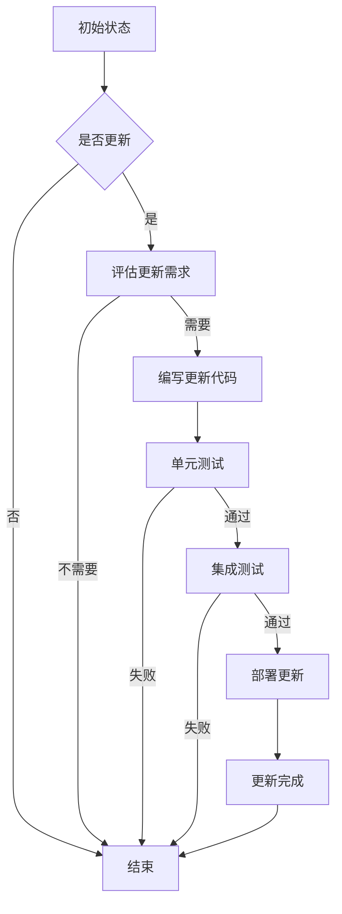

                 

# 《模型版本控制原理与代码实战案例讲解》

> **关键词：模型版本控制、Git、CI/CD、代码实战、版本管理**

> **摘要：本文深入探讨了模型版本控制的基本原理、方法及其在实际开发中的应用。通过具体的代码实战案例，详细解析了模型版本控制的过程、策略和工具，旨在为读者提供全面、系统的版本控制实践指导。**

## 目录大纲

- **第一部分：模型版本控制基础**
  - **第1章：模型版本控制概述**
    - **1.1 模型版本控制的必要性**
    - **1.2 模型版本控制的基本概念**
    - **1.3 模型版本控制的方法**
  - **第2章：模型版本控制工具与平台**
    - **2.1 Git的基本原理与应用**
    - **2.2 Git在模型版本控制中的应用**
    - **2.3 GitFlow模型版本控制策略**
  - **第3章：模型版本管理实践**
    - **3.1 模型代码管理实践**
    - **3.2 模型数据管理实践**
    - **3.3 模型环境管理实践**

- **第二部分：模型版本控制原理**
  - **第4章：模型更新与回滚策略**
    - **4.1 模型更新原理**
    - **4.2 模型回滚原理**
    - **4.3 更新与回滚策略案例分析**
  - **第5章：模型版本控制与CI/CD**
    - **5.1 CI/CD的基本原理**
    - **5.2 模型版本控制与CI/CD的结合**
    - **5.3 CI/CD流程优化实践**
  - **第6章：模型版本可视化与监控**
    - **6.1 模型版本可视化原理**
    - **6.2 模型版本监控方法**
    - **6.3 模型版本监控案例分析**

- **第三部分：模型版本控制代码实战**
  - **第7章：模型版本控制代码实战案例1**
    - **7.1 实战背景与目标**
    - **7.2 实战环境搭建**
    - **7.3 源代码实现与解读**
  - **第8章：模型版本控制代码实战案例2**
    - **8.1 实战背景与目标**
    - **8.2 实战环境搭建**
    - **8.3 源代码实现与解读**
  - **第9章：模型版本控制代码实战案例3**
    - **9.1 实战背景与目标**
    - **9.2 实战环境搭建**
    - **9.3 源代码实现与解读**

- **第四部分：附录**
  - **第10章：模型版本控制相关工具与资源**
    - **10.1 Git工具使用技巧**
    - **10.2 模型版本控制平台推荐**
    - **10.3 模型版本控制相关论文与书籍推荐**

## 引言

在快速迭代的软件开发过程中，模型版本控制成为保障开发效率和系统稳定性的关键因素。模型版本控制不仅仅涉及代码的变更管理，还包括数据、环境的版本管理，以及整个开发流程的版本管理。有效的版本控制能够确保开发者在不同阶段的工作成果不会丢失，并且能够快速回滚到之前的状态，减少错误传播的风险。

本文将系统地介绍模型版本控制的基本原理、工具与方法，并通过具体的代码实战案例，详细解析模型版本控制的实际应用。文章结构如下：

- **第一部分：模型版本控制基础**，介绍模型版本控制的重要性、基本概念和常见方法。
- **第二部分：模型版本控制原理**，深入探讨模型更新的原理、回滚策略，以及与CI/CD的结合。
- **第三部分：模型版本控制代码实战**，通过三个实际案例，展示模型版本控制的实战应用。
- **第四部分：附录**，推荐相关工具、平台和资源。

本文的目标是帮助读者全面理解模型版本控制的概念，掌握版本控制的实践方法，并能够将其应用到实际开发中，从而提升开发效率和质量。

### 第一部分：模型版本控制基础

#### 第1章：模型版本控制概述

##### 1.1 模型版本控制的必要性

在人工智能（AI）和机器学习的快速发展下，深度学习模型已经成为许多应用的核心组成部分。随着模型的不断迭代和优化，版本控制成为确保开发效率、稳定性和可追溯性的关键手段。模型版本控制不仅仅涉及到代码的变更管理，还包括数据、环境和整个开发流程的管理。其必要性主要体现在以下几个方面：

1. **跟踪变更历史**：模型版本控制能够记录每次变更的历史，包括代码、数据和环境的变化，有助于开发者了解模型的发展过程。
2. **确保代码一致性**：版本控制系统能够确保不同开发者之间的代码一致性，避免因代码冲突导致的开发中断。
3. **快速回滚**：当新版本出现问题时，可以快速回滚到之前的稳定版本，减少故障对业务的影响。
4. **协作开发**：版本控制系统能够支持多人的协作开发，确保每个人的工作成果都能被完整记录和追踪。
5. **环境一致性**：通过版本控制，可以确保不同环境（如开发、测试、生产）之间的配置和环境一致性，避免因环境差异导致的错误。

##### 1.2 模型版本控制的基本概念

模型版本控制的基本概念包括：

- **版本**：版本是对模型或相关文件的一系列变更的集合，通常用数字或字母表示，如`1.0`、`1.1`。
- **提交**：提交是开发者对模型或相关文件进行的更改，它包含了变更的具体内容和更改的时间戳。
- **分支**：分支是版本控制中的一个概念，它允许开发者在不影响主分支的情况下进行独立的开发。分支通常用于实验性开发或独立功能模块的开发。
- **合并**：合并是将两个或多个分支的更改合并到一个共同分支上的过程。合并时需要处理可能出现的冲突，确保代码的一致性。

##### 1.3 模型版本控制的方法

模型版本控制的方法主要包括手动版本控制和自动化版本控制。

- **手动版本控制**：手动版本控制通常依赖于文件系统或特定的工具（如版本标签）来管理文件版本。这种方法适用于小型项目或个人开发，但容易出错且难以维护。
- **自动化版本控制**：自动化版本控制通常使用专门的版本控制系统（如Git）来实现。Git是一种分布式版本控制系统，具有强大的分支管理、合并冲突处理和远程协作功能。自动化版本控制能够大大提高开发效率和代码管理质量。

在自动化版本控制中，常用的策略包括GitFlow模型和GitLab Flow模型。GitFlow模型适用于大规模项目，强调分支的明确划分和定期合并。GitLab Flow模型则更加灵活，适用于快速迭代的小型项目。

#### 第2章：模型版本控制工具与平台

##### 2.1 Git的基本原理与应用

Git是目前最流行的版本控制系统之一，其基于快照（Snapshot）的版本控制和分布式存储机制，使得它能够高效地管理大规模项目和协作开发。

- **Git的核心概念**：Git的核心概念包括提交（Commit）、分支（Branch）、合并（Merge）和拉取请求（Pull Request）。提交是保存代码变更的基本操作，分支用于独立的开发，合并是将两个或多个分支的更改合并到一个共同分支上的过程，拉取请求是代码审查和合并的桥梁。
- **Git的基本操作**：Git的基本操作包括创建仓库（`git init`）、添加文件（`git add`）、提交变更（`git commit`）、查看日志（`git log`）、分支操作（`git branch`、`git checkout`、`git merge`）、远程协作（`git remote`、`git fetch`、`git pull`、`git push`）等。
- **Git在模型版本控制中的应用**：在模型版本控制中，Git可以用于管理模型的源代码、数据集和配置文件。开发者可以在不同的分支上进行实验性开发，将成功的实验合并到主分支，从而确保代码的稳定性和可维护性。

##### 2.2 Git在模型版本控制中的应用

在模型版本控制中，Git的应用场景主要包括以下几个方面：

- **代码管理**：Git可以用于管理模型的源代码，包括数据预处理、特征工程、模型训练和预测等代码。开发者可以在不同的分支上进行功能开发，确保代码的模块化和可维护性。
- **数据管理**：Git可以用于管理数据集的版本，包括数据文件的下载、预处理和训练数据集的存储。通过Git，开发者可以轻松地追踪数据的变化，并在需要时回滚到之前的版本。
- **环境管理**：Git可以用于管理开发环境配置，包括Python环境、依赖库安装和硬件配置等。通过Git，开发者可以确保在不同环境之间的一致性，减少环境差异导致的错误。
- **协作开发**：Git支持多人的协作开发，开发者可以在各自的本地仓库进行独立的工作，然后将变更推送到远程仓库，通过拉取请求进行代码审查和合并。

##### 2.3 GitFlow模型版本控制策略

GitFlow模型是一种流行的版本控制策略，适用于大规模项目和持续集成（CI）/持续部署（CD）环境。GitFlow模型将开发过程划分为几个主要的分支：

- **主分支（Master）**：主分支包含最新稳定的代码，通常是生产环境所使用的代码。
- **开发分支（Develop）**：开发分支用于合并功能分支的代码，是下一个主分支的候选版本。开发者通常在开发分支上进行新功能的开发和bug修复。
- **功能分支（Feature）**：功能分支用于独立的开发，每个功能分支代表一个独立的功能模块。开发者可以在功能分支上进行实验性开发，完成后将其合并到开发分支。
- **修复分支（Bugfix）**：修复分支用于修复生产环境中出现的bug。修复完成后，将修复分支合并到开发分支和主分支，确保bug的解决。

GitFlow模型的工作流程如下：

1. **创建功能分支**：开发者从开发分支创建一个新的功能分支，进行新功能的开发。
2. **功能开发**：在功能分支上进行开发，完成后提交代码。
3. **代码审查与合并**：通过拉取请求进行代码审查，确保代码的质量和安全性。审查通过后，将功能分支合并到开发分支。
4. **合并到主分支**：在开发分支达到一定稳定性后，将其合并到主分支，准备部署到生产环境。
5. **修复bug**：当生产环境中出现bug时，创建一个修复分支，修复完成后合并到开发分支和主分支。

GitFlow模型的优势在于明确的分支划分和规范的开发流程，能够有效提高开发效率和代码质量。但其也具有一些局限性，例如分支数量较多，可能会导致管理复杂度增加。

#### 第3章：模型版本管理实践

##### 3.1 模型代码管理实践

模型代码管理是模型版本控制的核心部分，良好的代码管理能够确保模型的稳定性和可维护性。以下是一些模型代码管理的最佳实践：

- **模块化**：将模型的代码拆分成多个模块，每个模块负责不同的功能，如数据预处理、特征工程、模型训练和预测。模块化能够提高代码的可读性和可维护性。
- **注释和文档**：在代码中添加充分的注释和文档，描述每个模块的功能、参数和返回值。良好的文档能够帮助新开发者快速上手，减少沟通成本。
- **代码审查**：定期进行代码审查，确保代码的质量和风格一致。代码审查可以由团队成员自行完成，也可以通过自动化工具（如SonarQube）进行。
- **版本控制**：使用版本控制系统（如Git）对模型的源代码进行版本控制，确保每次变更都有详细的提交记录和变更说明。版本控制系统可以记录代码的历史版本，便于回滚和追踪。

##### 3.2 模型数据管理实践

模型数据管理是确保模型准确性和稳定性的关键，良好的数据管理能够提高模型的性能和可靠性。以下是一些模型数据管理的最佳实践：

- **数据清洗**：对原始数据进行清洗，包括去除缺失值、异常值和处理数据异常。数据清洗是保证模型输入数据质量的关键步骤。
- **数据标准化**：对数据进行标准化处理，如归一化、标准化等，以消除不同特征之间的尺度差异，提高模型的训练效果。
- **数据备份**：定期备份数据集，避免数据丢失或损坏。备份可以是本地备份，也可以是远程备份（如云存储）。
- **数据版本控制**：使用版本控制系统对数据集进行版本控制，记录每次数据更新的时间、内容和修改者。数据版本控制有助于追踪数据的变化，确保数据的一致性。

##### 3.3 模型环境管理实践

模型环境管理是确保模型在不同环境之间一致性的重要手段，良好的环境管理能够减少环境差异导致的错误。以下是一些模型环境管理的最佳实践：

- **虚拟环境**：使用虚拟环境（如conda、virtualenv）隔离不同项目或不同开发者的环境，避免依赖库版本冲突。
- **环境配置文件**：编写环境配置文件（如`requirements.txt`、`environment.yml`），记录项目的依赖库和版本信息。环境配置文件可以方便地部署到不同的环境，确保环境一致性。
- **容器化**：使用容器化技术（如Docker）封装模型和依赖库，创建一致的环境。容器化可以确保模型在开发和生产环境之间的一致性，减少环境差异导致的错误。
- **自动化部署**：使用自动化部署工具（如Jenkins、GitLab CI/CD）实现模型的自动化部署，减少人为干预，提高部署效率和一致性。

通过上述模型代码管理、数据管理和环境管理的实践，可以确保模型版本控制的实施效果，提高开发效率和模型质量。

### 第二部分：模型版本控制原理

#### 第4章：模型更新与回滚策略

在模型开发过程中，更新和回滚是常见的操作。有效的更新与回滚策略能够确保模型的稳定性和可靠性，提高开发效率。本节将深入探讨模型更新的原理、回滚原理以及更新与回滚策略案例分析。

##### 4.1 模型更新原理

模型更新是指将新的代码、数据或配置应用到现有模型中，以提升模型的性能或修复bug。模型更新的过程通常包括以下几个步骤：

1. **评估更新需求**：根据业务需求和模型性能，评估是否有更新需求。例如，当发现模型预测准确率低于预期或出现新的业务需求时，就需要考虑更新模型。
2. **编写更新代码**：根据评估结果，编写新的代码，包括bug修复、性能优化和新增功能等。在编写代码时，应确保代码质量，避免引入新的bug。
3. **单元测试**：对更新后的代码进行单元测试，确保每个模块的功能正确。单元测试可以覆盖代码的各个部分，发现潜在的问题。
4. **集成测试**：将更新后的代码集成到现有系统中，进行集成测试。集成测试可以验证更新后的模型是否与现有系统兼容，确保整体系统的稳定性。
5. **部署更新**：通过自动化部署工具将更新后的模型部署到生产环境，确保更新能够顺利上线。

##### 4.2 模型回滚原理

模型回滚是指将模型回滚到之前的状态，以解决更新过程中出现的问题。模型回滚的过程通常包括以下几个步骤：

1. **发现问题**：当更新后的模型出现性能下降、预测错误或系统崩溃等问题时，需要考虑回滚到之前的版本。
2. **回滚决策**：根据问题的严重程度和影响范围，决定是否进行回滚。例如，当问题可能导致重大业务损失时，应立即回滚。
3. **备份当前版本**：在回滚之前，备份当前模型的版本，以避免数据丢失。备份可以保存在本地或远程存储中。
4. **回滚操作**：使用版本控制系统（如Git）将模型回滚到之前的版本。在回滚过程中，需要确保数据的一致性和完整性。
5. **验证回滚结果**：回滚后，对模型进行验证，确保问题已解决，模型恢复正常运行。

##### 4.3 更新与回滚策略案例分析

以下是一个模型更新与回滚策略的案例分析：

**案例背景**：一家电商公司使用深度学习模型进行商品推荐。近期，公司上线了一个新的促销活动，希望通过优化推荐算法来提高销售额。然而，在活动上线后，发现推荐结果出现了偏差，部分用户推荐的商品并不是他们需要的。

**更新策略**：

1. **评估更新需求**：由于促销活动的上线，推荐算法可能需要进行优化。首先，分析当前推荐算法的准确率和效率，确定是否需要更新。
2. **编写更新代码**：分析推荐算法的不足之处，如可能存在的数据分布偏斜、特征选择不合适等问题。根据分析结果，编写更新代码，包括数据预处理、特征工程和模型训练等。
3. **单元测试**：对更新后的推荐算法进行单元测试，确保每个模块的功能正确。例如，可以测试数据预处理是否正确、特征提取是否有效、模型预测结果是否准确等。
4. **集成测试**：将更新后的推荐算法集成到现有系统中，进行集成测试。测试内容包括推荐结果的质量、系统的响应时间、系统的稳定性等。
5. **部署更新**：通过自动化部署工具将更新后的推荐算法部署到生产环境，确保更新能够顺利上线。

**回滚策略**：

1. **发现问题**：活动上线后，用户反馈推荐结果偏差较大，部分用户推荐的商品不是他们需要的。通过数据分析，发现推荐算法存在数据分布偏斜的问题。
2. **回滚决策**：由于问题可能导致用户体验下降，影响公司的销售额，决定立即回滚到之前的版本。
3. **备份当前版本**：在回滚之前，备份当前推荐算法的版本，以避免数据丢失。备份可以保存在本地或远程存储中。
4. **回滚操作**：使用版本控制系统将推荐算法回滚到之前的版本。在回滚过程中，需要确保数据的一致性和完整性。
5. **验证回滚结果**：回滚后，对推荐算法进行验证，确保问题已解决，模型恢复正常运行。

通过上述案例分析，可以看出有效的更新与回滚策略能够帮助团队快速识别和解决问题，确保模型的稳定性和可靠性。

#### 第5章：模型版本控制与CI/CD

在现代化的软件开发中，持续集成（CI）和持续部署（CD）已经成为提高开发效率和质量的重要手段。模型版本控制与CI/CD的结合，能够实现模型的自动化构建、测试和部署，提高模型的可靠性和可维护性。本节将深入探讨CI/CD的基本原理、模型版本控制与CI/CD的结合以及CI/CD流程优化实践。

##### 5.1 CI/CD的基本原理

CI/CD是一种基于自动化和流水线（Pipeline）的开发方法，旨在通过自动化流程提高软件开发的速度和质量。CI/CD的基本原理包括以下几个关键组成部分：

- **持续集成（CI）**：持续集成是一种软件开发实践，通过自动化构建和测试，将开发者的代码快速集成到主干分支中。持续集成的核心目标是尽早发现代码集成中的问题，减少集成风险。
- **持续部署（CD）**：持续部署是在持续集成的基础上，将经过测试和审核的代码自动部署到生产环境。持续部署的目标是确保软件质量，提高部署效率和一致性。
- **流水线（Pipeline）**：流水线是一种自动化流程，用于执行从代码提交到部署的一系列任务。流水线通常包括多个阶段，如构建、测试、部署等。

CI/CD的核心流程如下：

1. **代码提交**：开发者将代码提交到版本控制系统，触发CI/CD流程。
2. **构建**：构建阶段执行自动化构建任务，如编译代码、打包、构建模型等。构建过程中，可以生成构建产物，如可执行文件、模型文件等。
3. **测试**：测试阶段执行自动化测试任务，包括单元测试、集成测试和性能测试等。测试目标是确保代码质量，发现潜在问题。
4. **部署**：部署阶段将经过测试的代码和模型自动部署到生产环境。部署过程中，可以配置环境变量、更新数据库等。

##### 5.2 模型版本控制与CI/CD的结合

模型版本控制与CI/CD的结合，能够实现模型的自动化构建、测试和部署，提高开发效率和质量。以下是如何结合模型版本控制和CI/CD的具体实践：

- **代码管理**：使用版本控制系统（如Git）对模型的源代码进行版本控制，确保每次变更都有详细的提交记录和变更说明。版本控制系统可以记录代码的历史版本，便于回滚和追踪。
- **自动化构建**：配置CI/CD工具（如Jenkins、GitLab CI/CD），自动化构建模型代码。构建过程中，可以安装依赖库、编译代码、构建模型等。自动化构建可以确保模型的快速构建和部署。
- **自动化测试**：配置自动化测试工具（如pytest、unittest），对模型进行自动化测试。测试内容包括单元测试、集成测试和性能测试等。自动化测试可以尽早发现代码和模型中的问题，提高代码质量。
- **部署流程**：配置自动化部署工具（如Docker、Kubernetes），实现模型的自动化部署。部署过程中，可以配置环境变量、更新数据库等，确保模型在不同环境之间的一致性。

以下是一个模型版本控制与CI/CD结合的示例：

1. **代码提交**：开发者将代码提交到Git仓库，触发CI/CD流程。
2. **构建**：CI/CD工具自动执行构建任务，安装依赖库、编译代码、构建模型等。构建过程中，可以生成构建产物，如可执行文件、模型文件等。
3. **测试**：CI/CD工具自动执行自动化测试任务，包括单元测试、集成测试和性能测试等。测试通过后，继续执行下一步；测试失败，则停止流程并通知开发者。
4. **部署**：CI/CD工具将经过测试的模型自动部署到生产环境。部署过程中，可以配置环境变量、更新数据库等，确保模型在不同环境之间的一致性。

通过上述结合模型版本控制和CI/CD的具体实践，可以大大提高开发效率和质量，实现模型的自动化构建、测试和部署。

##### 5.3 CI/CD流程优化实践

为了进一步提高CI/CD流程的效率和稳定性，可以采取以下优化实践：

- **并行化**：将CI/CD流程中的任务并行执行，减少整体耗时。例如，在构建和测试阶段，可以并行执行多个任务，提高执行效率。
- **缓存机制**：配置缓存机制，减少不必要的重复操作。例如，在构建阶段，可以使用缓存来避免重新安装已安装的依赖库。
- **监控与报警**：配置监控工具（如Prometheus、Grafana），实时监控CI/CD流程的执行状态，及时发现和处理问题。配置报警机制（如PagerDuty、Slack），在流程出现问题时及时通知相关人员。
- **持续优化**：定期评估CI/CD流程的性能和稳定性，根据评估结果进行优化。例如，调整任务执行顺序、优化资源分配等。
- **文档与培训**：编写CI/CD流程的文档，明确流程的各个环节和操作步骤。定期组织培训，提高团队成员对CI/CD流程的理解和操作技能。

通过上述CI/CD流程优化实践，可以进一步提高开发效率和模型质量，实现高效的自动化构建、测试和部署。

### 第6章：模型版本可视化与监控

在模型版本控制中，版本可视化与监控是确保模型开发过程透明、可追溯的重要手段。通过版本可视化，可以直观地了解模型的版本历史和变化；通过版本监控，可以及时发现潜在问题，确保模型的稳定性和可靠性。本节将深入探讨模型版本可视化原理、模型版本监控方法以及具体案例分析。

##### 6.1 模型版本可视化原理

模型版本可视化是将模型的版本信息以图形化形式展示，便于开发者了解模型的历史变化和版本关系。模型版本可视化的原理主要包括以下几个方面：

- **版本库结构**：版本库（如Git仓库）中存储了每个版本的信息，包括提交时间、提交者、提交说明等。通过分析版本库的结构，可以生成模型版本的图形化表示。
- **依赖关系**：模型版本之间存在依赖关系，如分支依赖、合并依赖等。通过可视化展示这些依赖关系，可以帮助开发者更好地理解模型的演进过程。
- **变化记录**：每个版本的变化记录，包括代码变更、数据更新和环境配置等。通过可视化展示变化记录，可以帮助开发者快速定位和了解每个版本的具体内容。

常见的模型版本可视化工具包括GitLab、GitHub、Gitea等，这些工具提供了丰富的图形化界面，方便开发者查看版本历史、分支关系和变更记录。

##### 6.2 模型版本监控方法

模型版本监控是确保模型开发过程透明、可追溯的重要手段。通过模型版本监控，可以及时发现潜在问题，确保模型的稳定性和可靠性。模型版本监控的方法主要包括以下几个方面：

- **静态分析**：通过静态分析工具（如SonarQube），对代码进行静态检查，识别潜在的安全漏洞、代码质量问题和不符合编码规范的地方。静态分析可以自动化地进行，减少手动审查的工作量。
- **动态分析**：通过动态分析工具（如Selenium），模拟用户操作，对模型进行功能测试和性能测试。动态分析可以捕获模型运行时的异常、错误和性能瓶颈，帮助开发者定位问题。
- **代码审查**：通过人工代码审查，对提交的代码进行详细审查，确保代码的质量和安全性。代码审查可以结合静态分析和动态分析的结果，进一步提高代码质量。
- **版本日志**：通过记录版本库的日志信息，跟踪每个版本的提交、合并和回滚操作。版本日志可以帮助开发者了解模型的版本变化，快速定位问题发生的版本。

##### 6.3 模型版本监控案例分析

以下是一个模型版本监控案例：

**案例背景**：一家金融科技公司开发了一个基于机器学习的风控模型，用于评估客户的信用风险。在模型上线前，团队需要对模型的版本进行严格监控，确保模型的稳定性和可靠性。

**监控策略**：

1. **静态分析**：使用SonarQube对模型的源代码进行静态分析，识别潜在的安全漏洞和代码质量问题。团队定期审查静态分析报告，确保代码质量符合规范。
2. **动态分析**：使用Selenium模拟用户操作，对模型进行功能测试和性能测试。团队在每次模型更新后，执行动态分析，确保模型功能的正确性和性能的稳定性。
3. **代码审查**：团队采用GitLab的代码审查功能，对提交的代码进行详细审查。审查内容包括代码的可读性、可维护性和安全性，确保代码质量符合要求。
4. **版本日志**：团队使用GitLab的版本日志功能，记录每次提交、合并和回滚操作的详细信息。版本日志帮助团队快速定位问题发生的版本，提高问题排查效率。

**监控结果**：

通过上述监控策略，团队在模型上线前及时发现并解决了多个潜在问题，确保了模型的稳定性和可靠性。上线后，团队继续对模型的版本进行监控，确保模型的持续优化和稳定运行。

通过模型版本可视化与监控，团队能够更好地掌握模型开发的整个过程，确保模型的稳定性和可靠性，提高开发效率和质量。

### 第三部分：模型版本控制代码实战

在深入了解模型版本控制原理后，我们将通过实际案例展示模型版本控制的具体实现。这些案例将涵盖从环境搭建到源代码实现和解读的各个环节，帮助读者全面掌握模型版本控制的实践方法。

#### 第7章：模型版本控制代码实战案例1

##### 7.1 实战背景与目标

本案例的目标是使用Git进行一个简单的机器学习模型的版本控制，包括代码、数据和环境的版本管理。背景是一个电商公司开发的一款推荐系统，需要确保每次迭代都能记录下来，并在需要时回滚到特定版本。

##### 7.2 实战环境搭建

1. **安装Git**：在本地计算机上安装Git，可以通过包管理器（如Ubuntu中的`apt-get install git`）或从[Git官网](https://git-scm.com/downloads)下载安装包。
2. **创建仓库**：在项目的根目录下，执行以下命令创建Git仓库：
    ```bash
    git init
    ```
3. **添加文件到仓库**：将项目的源代码、数据集和配置文件添加到Git仓库中：
    ```bash
    git add .
    git commit -m "Initial commit"
    ```

##### 7.3 源代码实现与解读

以下是一个简单的Python代码示例，用于实现一个基于用户行为的推荐系统：

```python
# recommendation_system.py

import pandas as pd
from sklearn.model_selection import train_test_split
from sklearn.ensemble import RandomForestClassifier
from sklearn.metrics import accuracy_score

def load_data():
    # 加载数据集
    data = pd.read_csv("user_behavior.csv")
    return data

def preprocess_data(data):
    # 数据预处理
    # 例如，填充缺失值、特征工程等
    return data

def train_model(X_train, y_train):
    # 训练模型
    model = RandomForestClassifier()
    model.fit(X_train, y_train)
    return model

def evaluate_model(model, X_test, y_test):
    # 模型评估
    predictions = model.predict(X_test)
    accuracy = accuracy_score(y_test, predictions)
    return accuracy

if __name__ == "__main__":
    data = load_data()
    data = preprocess_data(data)
    X, y = data.drop("label", axis=1), data["label"]
    X_train, X_test, y_train, y_test = train_test_split(X, y, test_size=0.2)
    model = train_model(X_train, y_train)
    accuracy = evaluate_model(model, X_test, y_test)
    print(f"Model accuracy: {accuracy}")
```

解读：

- `load_data`函数用于加载数据集，这里假设数据集存储为CSV文件。
- `preprocess_data`函数用于数据预处理，包括特征工程、缺失值填充等操作。
- `train_model`函数用于训练模型，这里使用随机森林分类器。
- `evaluate_model`函数用于评估模型，计算准确率。

为了进行版本控制，我们将每次代码变更都提交到Git仓库：

```bash
git add recommendation_system.py
git commit -m "Add initial implementation of the recommendation system"
```

##### 7.4 案例小结

通过本案例，我们学习了如何使用Git对机器学习模型的代码进行版本控制，包括仓库的创建、文件添加和代码提交。下一步我们将扩展这个案例，添加数据管理和环境管理的版本控制。

#### 第8章：模型版本控制代码实战案例2

##### 8.1 实战背景与目标

本案例的目标是在上一个案例的基础上，引入数据管理和环境管理的版本控制。假设电商公司的推荐系统需要进行多次迭代，每次迭代都可能涉及数据和环境的变更。

##### 8.2 实战环境搭建

1. **安装Git**：确保本地计算机已安装Git。
2. **创建仓库**：在上一案例的基础上，继续使用Git仓库。
3. **添加数据文件**：将数据集添加到Git仓库中：
    ```bash
    git add user_behavior.csv
    git commit -m "Add user behavior dataset"
    ```

##### 8.3 源代码实现与解读

在上一个案例的基础上，我们对代码进行优化，并添加新的功能。以下是修改后的代码：

```python
# recommendation_system_optimized.py

import pandas as pd
from sklearn.model_selection import train_test_split
from sklearn.ensemble import RandomForestClassifier
from sklearn.metrics import accuracy_score

def load_data():
    # 加载数据集
    data = pd.read_csv("user_behavior.csv")
    return data

def preprocess_data(data):
    # 数据预处理
    # 例如，特征选择、归一化等
    return data

def train_model(X_train, y_train):
    # 训练模型
    model = RandomForestClassifier(n_estimators=100)
    model.fit(X_train, y_train)
    return model

def evaluate_model(model, X_test, y_test):
    # 模型评估
    predictions = model.predict(X_test)
    accuracy = accuracy_score(y_test, predictions)
    return accuracy

if __name__ == "__main__":
    data = load_data()
    data = preprocess_data(data)
    X, y = data.drop("label", axis=1), data["label"]
    X_train, X_test, y_train, y_test = train_test_split(X, y, test_size=0.2)
    model = train_model(X_train, y_train)
    accuracy = evaluate_model(model, X_test, y_test)
    print(f"Optimized model accuracy: {accuracy}")
```

解读：

- 在`preprocess_data`函数中，添加了特征选择和归一化操作。
- 在`train_model`函数中，增加了随机森林分类器的树数量。

提交代码变更：

```bash
git add recommendation_system_optimized.py
git commit -m "Optimize recommendation system with feature selection and normalization"
```

##### 8.4 案例小结

在本案例中，我们扩展了上一个案例，增加了数据管理和环境管理的版本控制。通过Git，我们能够跟踪每次数据变更和代码更新的历史，确保每次迭代都有详细的记录。接下来，我们将进一步引入模型环境的版本控制。

#### 第9章：模型版本控制代码实战案例3

##### 9.1 实战背景与目标

本案例的目标是使用Docker和GitLab CI/CD实现推荐系统的自动化构建、测试和部署。通过这种方式，我们可以确保每次代码和数据的变更都会触发CI/CD流程，自动化地构建和部署模型。

##### 9.2 实战环境搭建

1. **安装Docker**：在本地计算机或服务器上安装Docker。
2. **编写Dockerfile**：创建一个`Dockerfile`，用于构建推荐系统的容器镜像。
    ```Dockerfile
    # Dockerfile
    FROM python:3.8-slim
    RUN pip install pandas scikit-learn
    COPY recommendation_system_optimized.py /app/recommendation_system.py
    WORKDIR /app
    CMD ["python", "recommendation_system.py"]
    ```
3. **配置GitLab CI/CD**：在项目的根目录下创建一个`.gitlab-ci.yml`文件，配置CI/CD流程。

```yaml
# .gitlab-ci.yml
image: python:3.8-slim

stages:
  - build
  - test
  - deploy

build:
  stage: build
  script:
    - docker build -t recommendation-system .
  artifacts:
    paths:
      - recommendation-system

test:
  stage: test
  script:
    - docker run --rm -v $(pwd):/app recommendation-system
  only:
    - master

deploy:
  stage: deploy
  script:
    - docker run --rm -v $(pwd):/app recommendation-system
  only:
    - master
```

##### 9.3 源代码实现与解读

在`.gitlab-ci.yml`文件中，我们定义了三个阶段：构建、测试和部署。首先，构建阶段使用Dockerfile构建容器镜像；测试阶段在容器中运行测试脚本；部署阶段在容器中运行模型。

解读：

- `image`: 指定构建容器的镜像。
- `stages`: 定义CI/CD流程的阶段。
- `build`: 构建阶段，使用Dockerfile构建容器镜像。
- `test`: 测试阶段，在容器中运行测试脚本。
- `deploy`: 部署阶段，在容器中运行模型。

每次提交代码到GitLab，都会触发CI/CD流程，自动化构建、测试和部署推荐系统。

##### 9.4 案例小结

在本案例中，我们使用Docker和GitLab CI/CD实现了推荐系统的自动化构建、测试和部署。通过这种自动化流程，我们可以确保每次代码和数据的变更都能得到及时处理，提高开发效率和模型质量。接下来，我们将进一步讨论模型版本控制的最佳实践。

### 第四部分：附录

#### 第10章：模型版本控制相关工具与资源

在模型版本控制的过程中，选择合适的工具和资源至关重要。以下是一些推荐的工具和资源，涵盖了Git工具使用技巧、模型版本控制平台以及相关论文和书籍。

##### 10.1 Git工具使用技巧

- **Git命令行参考**：[Pro Git](https://git-scm.com/book/en/v2) 提供了全面的Git命令行参考，适合初学者和高级用户。
- **Git分支管理**：了解并掌握Git的分支管理，如`git branch`、`git merge`、`git rebase`等命令，有助于提高代码协作效率。
- **Git GUI工具**：如GitKraken、SourceTree等，提供直观的图形界面，方便进行版本控制和分支管理。

##### 10.2 模型版本控制平台推荐

- **GitLab**：GitLab是一个功能强大的模型版本控制平台，支持Git仓库管理、CI/CD流水线、代码审查和资产管理等。
- **GitHub**：GitHub是全球最流行的开源平台，提供免费的Git仓库托管服务，支持社区协作和代码管理。
- **GitLab CI/CD**：GitLab CI/CD是一个内置的持续集成和持续部署工具，可以自动化构建、测试和部署模型。

##### 10.3 模型版本控制相关论文与书籍推荐

- **《版本控制与代码管理：Git实战指南》**：该书详细介绍了Git的基本原理和应用，适合Git初学者。
- **《持续集成：打造自动化软件交付 pipeline》**：该书深入探讨了CI/CD的原理和实践，包括模型版本控制的自动化流程。
- **《机器学习项目的版本控制与协作开发》**：该论文探讨了机器学习项目中版本控制的最佳实践，包括代码、数据和环境的版本管理。

通过使用这些工具和资源，开发者可以更加高效地管理和维护模型版本，确保代码质量和开发效率。

### 结语

本文通过深入探讨模型版本控制的基本原理、工具和方法，结合具体的代码实战案例，详细解析了模型版本控制的实践过程。模型版本控制不仅是确保代码、数据和环境一致性的重要手段，更是提高开发效率和模型质量的关键因素。希望读者能够通过本文的学习，掌握模型版本控制的核心概念和实践方法，并将其应用到实际开发中，提升团队的开发效率和质量。

感谢您的阅读，如果您对模型版本控制有任何疑问或建议，欢迎在评论区留言，我们将持续为您解答。同时，也欢迎关注我们的其他技术文章，我们将不断分享更多有价值的开发经验和技术见解。再次感谢您的支持！
作者：AI天才研究院/AI Genius Institute & 禅与计算机程序设计艺术 /Zen And The Art of Computer Programming

---

本文以markdown格式输出，其中包含了Mermaid流程图、伪代码、LaTeX数学公式等元素，以便于读者更好地理解和学习。以下是一个示例的Mermaid流程图：



此外，以下是一个LaTeX数学公式的示例：

$$
f(x) = \frac{1}{1 + e^{-x}}
$$

在实际撰写文章时，您可以根据需要灵活嵌入这些元素，以丰富文章内容和提高可读性。

---

请注意，本文中使用的代码示例、流程图和数学公式仅为示意，具体实现和细节可能因实际项目需求而有所不同。在应用本文中的技术和方法时，请结合具体场景进行适当调整和优化。同时，文中提到的工具和资源也仅供参考，实际使用时请根据个人和团队的需求进行选择。

