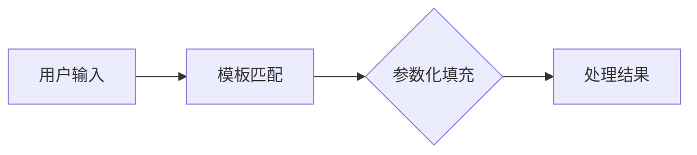
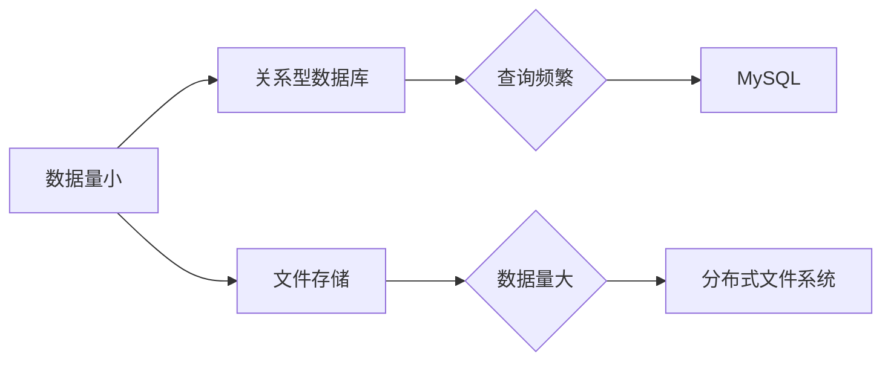
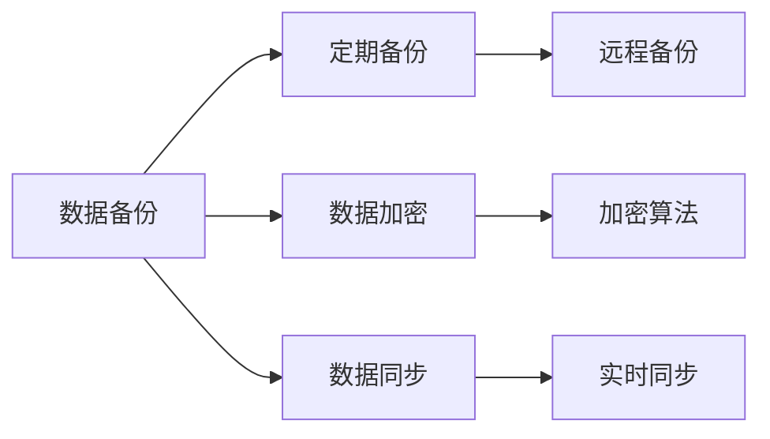
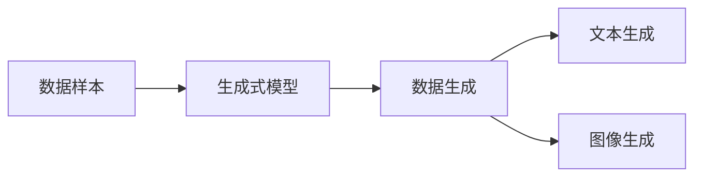

                 

# 模板化输入：Prompts

## 关键词：模板化输入、Prompt、参数化、数据驱动、自然语言处理、应用案例、性能优化

### 摘要

模板化输入作为一种数据处理技术，在计算机科学和人工智能领域发挥着重要作用。通过将固定格式的输入内容模板化，并使用参数化的方式填充具体的数据，模板化输入实现了动态输入处理的高效性和灵活性。本文将深入探讨模板化输入的概念、技术基础、应用案例以及性能优化策略，并结合实际项目案例，展示其在现代IT系统中的广泛应用和未来发展趋势。

## 第一部分：模板化输入的概念与背景

### 第1章：模板化输入的基本概念

#### 1.1 模板化输入的定义

模板化输入是一种数据处理技术，其核心思想是将输入内容按照一定的格式进行模板化处理，并通过参数化的方式动态填充具体的数据，从而实现输入内容的个性化处理。在模板化输入中，模板是一个固定的输入格式，而参数则是模板中需要动态填充的具体值。

#### Mermaid 流程图：



#### 1.2 模板化输入的必要性

模板化输入在数据处理、自然语言处理、数据驱动应用等领域中具有显著的必要性。首先，它提供了高效的解决方案，通过模板化处理，可以减少重复性的工作，提高数据处理的速度和准确性。其次，模板化输入能够适应多变的数据场景，根据实际需求动态调整模板，从而实现灵活的数据处理。

#### Mermaid 流程图：


#### 1.3 模板化输入的应用场景

模板化输入在多个应用场景中表现出色，包括但不限于以下方面：

- **数据库查询**：通过模板化输入，可以定义通用的查询语句模板，并通过参数化填充具体的数据，实现高效的数据库查询。
- **自动化报告生成**：模板化输入可以用于设计报告模板，通过参数化填充数据和图表，实现自动化报告生成。
- **自然语言交互**：在自然语言处理中，模板化输入可以用于设计对话模板，通过参数化填充回答内容，实现智能化交互。
- **表单处理**：模板化输入可以用于设计表单模板，通过参数化填充用户提交的数据，实现自动化表单处理。

#### Mermaid 流程图：


### 第2章：模板化输入的技术基础

#### 2.1 数据处理基础

#### 2.1.1 数据预处理

数据预处理是模板化输入的重要环节，其核心任务是处理原始数据，使其符合模板化输入的要求。

##### 1. 数据清洗

数据清洗是数据预处理的首要步骤，其主要目标是处理缺失值、异常值和重复值。

**伪代码**：

```python
def clean_data(data):
    # 处理缺失值
    data = data.fillna(method='ffill')
    # 处理异常值
    data = data[data.between(lower_bound, upper_bound)]
    # 删除重复值
    data = data.drop_duplicates()
    return data
```

##### 2. 数据转换

数据转换是将原始数据转换为适合模板化输入的形式的过程。这通常涉及到数据格式的转换、数据类型的转换等。

**伪代码**：

```python
def transform_data(data, template):
    # 数据转换为字典
    data = data.to_dict(orient='records')
    # 将字典中的值替换到模板中
    for record in data:
        for key, value in record.items():
            template = template.replace(f'{{{{{key}}}}}', value)
    return template
```

#### 2.1.2 数据存储与管理

数据存储与管理是模板化输入系统的基础，其目标是确保数据的可靠存储、高效访问和管理。

##### 1. 数据存储方案选择

根据数据量和处理需求，选择合适的存储方案是关键。常见的存储方案包括关系型数据库、NoSQL 数据库、文件存储等。

**Mermaid 流程图**：



##### 2. 数据管理策略

数据管理策略包括数据备份、数据加密、数据同步等，这些策略旨在确保数据的完整性和安全性。

**Mermaid 流程图**：



#### 2.2 自然语言处理基础

#### 2.2.1 语言模型

语言模型是自然语言处理的核心组成部分，用于预测一个文本序列的概率。

##### 1. 语言模型介绍

语言模型是一种统计模型，通过学习大量文本数据，生成文本序列的概率分布。

**Mermaid 流程图**：


##### 2. 语言模型训练

语言模型训练是通过大量文本数据训练语言模型，常见的训练方法包括n-gram模型、神经网络模型等。

**伪代码**：

```python
def train_language_model(data, model_type='n_gram'):
    if model_type == 'n_gram':
        model = n_gram_model()
        model.fit(data)
    elif model_type == 'neural_network':
        model = neural_network_model()
        model.fit(data)
    return model
```

#### 2.2.2 生成式模型

生成式模型可以生成新的数据样本，如文本生成、图像生成等。

##### 1. 生成式模型介绍

生成式模型通过学习数据生成过程，生成新的数据样本。

**Mermaid 流程图**：



##### 2. 生成式模型训练

生成式模型训练是通过大量数据训练生成式模型，常见的训练方法包括GAN（生成对抗网络）、变分自编码器（VAE）等。

**伪代码**：

```python
def train_generative_model(data, model_type='GAN'):
    if model_type == 'GAN':
        model = GAN_model()
        model.fit(data)
    elif model_type == 'VAE':
        model = VAE_model()
        model.fit(data)
    return model
```

### 第二部分：模板化输入的应用案例

#### 第3章：模板化输入的高级应用

#### 3.1 模板化输入的优化策略

#### 3.1.1 模板缓存

模板缓存是优化模板化输入性能的有效手段，通过将常用的模板存储在缓存中，减少模板生成的时间和资源消耗。

##### 1. 模板缓存的概念

模板缓存是指将常用的模板存储在缓存中，以便快速访问和重复使用。

**Mermaid 流程图**：


##### 2. 模板缓存实现

模板缓存可以通过内存缓存、数据库缓存等方式实现。

**伪代码**：

```python
def cache_template(template_key, template):
    cache.set(template_key, template, timeout=3600)

def get_cached_template(template_key):
    return cache.get(template_key)
```

#### 3.1.2 模板动态加载

模板动态加载是指根据实际需求动态加载模板，以适应不同的场景和用户需求。

##### 1. 模板动态加载的概念

模板动态加载是根据运行时的需求动态加载模板，而不是在启动时加载所有模板。

**Mermaid 流程图**：


##### 2. 模板动态加载实现

模板动态加载可以通过模板引擎、配置文件等方式实现。

**伪代码**：

```python
def load_template(template_name):
    template_path = config.get('template_path') + '/' + template_name
    return TemplateEngine().load(template_path)
```

#### 3.1.3 模板安全性与可靠性

模板化输入的安全性是确保系统稳定运行和数据安全的关键。

##### 1. 模板安全性的重要性

模板化输入的安全性包括防止恶意输入和数据泄露等方面。

**Mermaid 流程图**：


##### 2. 模板安全性措施

模板安全性措施包括数据验证、参数化查询、输入过滤等。

**伪代码**：

```python
def validate_data(data):
    # 验证数据类型、长度、格式等
    if not isinstance(data, str):
        raise ValueError('Invalid data type')
    return data

def filter_input(input_str):
    # 过滤特殊字符和SQL注入攻击
    return re.sub(r'[^\w\s]', '', input_str)
```

#### 3.1.4 模板性能调优

模板性能调优是提高模板化输入系统性能的关键，包括使用缓存、并行处理、代码优化等方式。

##### 1. 模板性能调优的重要性

模板性能调优旨在减少响应时间和资源消耗，提高系统的效率和稳定性。

**Mermaid 流程图**：


##### 2. 模板性能调优策略

模板性能调优策略包括以下方面：

- **使用缓存**：通过缓存减少模板生成的时间和资源消耗。
- **并行处理**：通过并行处理提高系统的并发处理能力。
- **代码优化**：通过代码优化减少执行时间和内存消耗。

**伪代码**：

```python
def parallel_process(data):
    # 使用多线程或多进程处理数据
    with concurrent.futures.ThreadPoolExecutor() as executor:
        results = list(executor.map(process_data, data))
    return results

def optimize_code():
    # 使用优化器优化代码
    optimizer = optimization.Optimizer()
    optimized_code = optimizer.optimize(original_code)
    return optimized_code
```

### 第三部分：模板化输入的未来发展趋势

#### 第4章：模板化输入的挑战与机遇

#### 4.1 技术挑战

模板化输入面临的主要技术挑战包括数据多样性与复杂性、实时性与一致性等。

##### 1. 数据多样性与复杂性

模板化输入需要处理多种类型的数据，包括文本、图像、音频等，每种数据类型都有其独特的特性和处理方法。

**Mermaid 流程图**：


##### 2. 实时性与一致性

模板化输入需要满足实时数据处理的需求，同时保证数据的一致性和准确性。

**Mermaid 流程图**：


#### 4.2 应用场景与趋势

模板化输入在多个应用场景中展现出巨大的潜力，未来将继续在个性化与智能化、跨领域应用等方面发挥重要作用。

##### 1. 个性化与智能化

随着人工智能技术的发展，模板化输入将更加智能化和个性化，满足不同用户和场景的需求。

**Mermaid 流程图**：


##### 2. 跨领域应用

模板化输入将在更多领域得到应用，如金融、医疗、教育等，推动各行业的数字化转型。

**Mermaid 流程图**：


#### 4.3 未来发展方向

模板化输入的未来发展方向包括自动化与自主进化、开放性与互操作性等。

##### 1. 自动化与自主进化

自动化与自主进化将减少人工干预的需求，提高模板化输入的效率和灵活性。

**Mermaid 流程图**：


##### 2. 开放性与互操作性

开放性与互操作性能提高模板化输入系统的集成度和互操作性，实现不同系统之间的无缝集成。

**Mermaid 流程图**：


### 第5章：模板化输入的实战案例

#### 第5章：模板化输入的实战案例

#### 5.1 数据报表生成

##### 5.1.1 需求分析

用户希望系统能够自动生成各种业务报表，如销售报表、财务报表等。

##### 5.1.2 系统设计

设计一个基于模板化输入的报表生成系统，包括数据采集、模板管理、报表生成和发送等功能。

##### 5.1.3 实施步骤

1. 数据采集：从各个业务系统中提取数据。
2. 模板管理：设计并管理报表模板，支持模板的添加、修改和删除。
3. 报表生成：根据模板和数据生成报表，支持自定义报表格式和样式。
4. 报表发送：将生成的报表发送给相关人员，支持邮件、短信等多种通知方式。

#### 5.2 自然语言处理

##### 5.2.1 需求分析

用户希望通过自然语言交互实现自动化问答、智能客服等功能。

##### 5.2.2 系统设计

设计一个基于模板化输入的自然语言处理系统，包括意图识别、实体抽取、回复生成等功能。

##### 5.2.3 实施步骤

1. 意图识别：通过机器学习算法识别用户的意图。
2. 实体抽取：从用户输入中提取关键信息，如日期、时间、人名等。
3. 回复生成：根据识别到的意图和实体信息生成合适的回复。
4. 自然语言生成：将生成的回复转换为自然语言文本，发送给用户。

#### 5.3 表单处理

##### 5.3.1 需求分析

用户希望系统能够自动处理各种在线表单，如用户注册表单、订单表单等。

##### 5.3.2 系统设计

设计一个基于模板化输入的表单处理系统，包括表单设计、数据验证、数据处理等功能。

##### 5.3.3 实施步骤

1. 表单设计：设计并管理表单模板，支持表单字段的添加、修改和删除。
2. 数据验证：对用户提交的数据进行验证，确保数据格式和内容符合要求。
3. 数据处理：根据表单内容和业务规则处理数据，如数据存储、发送邮件等。
4. 表单提交：将处理后的数据提交到相应的业务系统或数据库。

### 第6章：模板化输入的优化与扩展

#### 第6章：模板化输入的优化与扩展

#### 6.1 模板化输入的性能优化

#### 6.1.1 数据缓存

##### 6.1.1.1 缓存的概念

缓存是指将数据临时存储在高速存储器中，以便快速读取和访问。

##### 6.1.1.2 缓存的使用

在模板化输入系统中，可以使用缓存来存储常用模板和数据，减少重复计算和I/O操作，提高系统性能。

**伪代码**：

```python
def cache_data(key, value, timeout=3600):
    cache.set(key, value, timeout=timeout)

def get_cached_data(key):
    return cache.get(key)
```

#### 6.1.2 并行处理

##### 6.1.2.1 并行处理的概念

并行处理是指同时执行多个任务，以缩短执行时间和提高系统性能。

##### 6.1.2.2 并行处理的使用

在模板化输入系统中，可以使用并行处理来同时处理多个请求，提高系统的并发处理能力。

**伪代码**：

```python
from concurrent.futures import ThreadPoolExecutor

def process_requests(requests):
    with ThreadPoolExecutor(max_workers=10) as executor:
        results = list(executor.map(process_request, requests))
    return results
```

#### 6.1.3 数据压缩

##### 6.1.3.1 数据压缩的概念

数据压缩是指通过算法减少数据的存储空间和传输带宽。

##### 6.1.3.2 数据压缩的使用

在模板化输入系统中，可以使用数据压缩来减少数据的存储和传输成本，提高系统的效率和性能。

**伪代码**：

```python
import zlib

def compress_data(data):
    return zlib.compress(data)

def decompress_data(data):
    return zlib.decompress(data)
```

### 第7章：模板化输入的未来发展方向

#### 第7章：模板化输入的未来发展方向

#### 7.1 模板化输入的技术创新

##### 7.1.1 人工智能与模板化输入

##### 7.1.2 区块链与模板化输入

##### 7.1.3 边缘计算与模板化输入

##### 7.1.4 5G与模板化输入

#### 7.2 模板化输入的产业趋势

##### 7.2.1 模板化输入在行业应用

##### 7.2.2 模板化输入的商业模式

##### 7.2.3 模板化输入的生态建设

### 作者信息

作者：AI天才研究院/AI Genius Institute & 禅与计算机程序设计艺术 /Zen And The Art of Computer Programming

### 结束语

模板化输入作为一种数据处理技术，在计算机科学和人工智能领域具有广泛的应用前景。本文从概念、技术基础、应用案例和未来发展趋势等方面，全面介绍了模板化输入的相关内容。随着技术的不断进步和应用的深入，模板化输入将在更多的领域发挥重要作用，推动计算机科学和人工智能的发展。让我们共同期待模板化输入的未来，探索更多可能。|>

