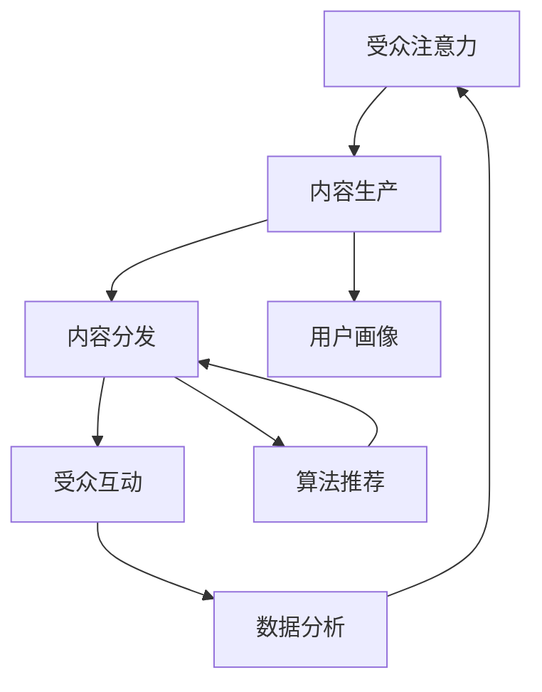
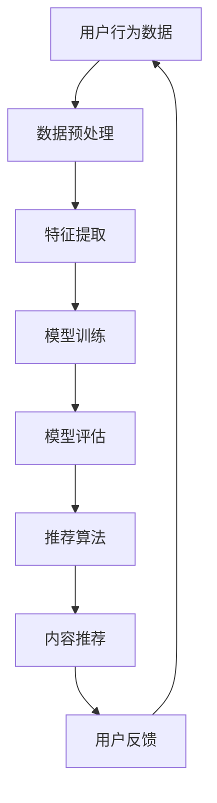

                 

### 注意力经济对新闻传播模式的改变

#### 关键词：注意力经济、新闻传播、算法策略、个性化内容、媒体品牌建设

#### 摘要：
在互联网和信息爆炸的时代，新闻传播正经历着前所未有的变革。注意力经济作为一种新兴的经济模式，正深刻地影响着新闻传播的模式。本文旨在探讨注意力经济如何改变传统的新闻传播方式，分析其背后的核心概念、算法原理及实际案例，为媒体从业者提供理论和实践上的指导。文章结构如下：

1. **注意力经济的背景与新闻传播的现状**
2. **注意力经济对新闻传播模式的改变**
3. **注意力经济下的新闻传播案例分析**
4. **注意力经济与新闻传播的未来**

通过逻辑清晰的分析和实际案例的剖析，本文将帮助读者理解注意力经济对新闻传播的深远影响，以及如何在新的传播环境中找到机遇和应对挑战。

### 第一部分：注意力经济的背景与新闻传播的现状

#### 第1章：注意力经济的起源与影响

##### 1.1 注意力经济的定义与特点

注意力经济是指利用人们注意力的稀缺性，通过吸引和保持受众的关注，实现经济价值的一种经济模式。这一概念起源于20世纪90年代的互联网泡沫时期，随着互联网的普及和媒体环境的多样化，注意力经济逐渐成为主流的经济形态。

注意力经济的核心特点包括：

- **稀缺性**：在信息爆炸的时代，人们的注意力是有限的，任何内容都需要竞争受众的注意力。
- **吸引力**：内容需要具有足够的吸引力，才能在竞争激烈的环境中脱颖而出。
- **持久性**：吸引注意力的内容需要具备持久性，能够持续地保持受众的关注。

##### 1.2 注意力经济的起源与发展

注意力经济的起源可以追溯到广告业。在传统媒体时代，广告主通过广告来吸引受众的注意力，从而实现商业价值。随着互联网的兴起，注意力经济逐渐从传统广告延伸到更广泛的领域。

在互联网时代，社交媒体、搜索引擎、内容平台等成为吸引注意力的主要渠道。例如，Facebook、Instagram等社交媒体平台通过算法推荐内容，使用户在平台上花费更多时间，从而提高广告效果。此外，搜索引擎如Google通过搜索广告和自然搜索结果，利用用户的搜索行为实现商业价值。

##### 1.3 注意力经济对新闻传播的影响

注意力经济对新闻传播的影响是深远的。首先，新闻传播的方式发生了变化。在传统媒体时代，新闻传播主要通过报纸、电视、广播等渠道，内容的生产和传播是单向的。而在互联网时代，新闻传播变得更加多样化，用户可以随时随地通过手机、电脑等终端获取新闻信息。

其次，新闻内容的生产和分发策略也发生了改变。在注意力经济下，新闻内容的生产更加注重吸引力和个性化。新闻媒体需要通过独特的视角、深入的报道和高质量的内容，吸引受众的注意力。同时，新闻媒体需要利用算法推荐、社交媒体等渠道，实现新闻内容的精准分发。

最后，注意力经济对新闻传播的商业模式也带来了挑战和机遇。在传统媒体时代，新闻媒体的主要收入来源是广告和订阅。而在注意力经济下，新闻媒体需要探索新的商业模式，如付费内容、会员制、数据服务等，以适应新的经济环境。

#### 第2章：新闻传播的现状与挑战

##### 2.1 传统新闻传播模式的局限性

传统新闻传播模式在注意力经济下存在一些局限性。首先，传统新闻传播模式主要依赖于大众传媒，内容的生产和传播是单向的，缺乏与受众的互动和反馈。这使得新闻内容难以满足不同受众的需求，也限制了新闻传播的覆盖面和影响力。

其次，传统新闻传播模式在内容生产上存在一定的滞后性。新闻事件发生后，传统媒体需要时间进行报道和传播，而互联网时代，信息的传播速度大大加快，新闻内容的生产和传播需要更加快速和灵活。

此外，传统新闻传播模式在内容分发上主要依赖于广告收入，这使得新闻媒体对广告主的依赖性较强，商业模式相对单一。在注意力经济下，新闻媒体需要探索多元化的商业模式，以应对经济环境的变化。

##### 2.2 媒介环境的变化与新闻传播新趋势

随着互联网和移动设备的普及，媒介环境发生了巨大变化，这对新闻传播产生了深远影响。首先，互联网的普及使得信息传播变得更加便捷和快速，新闻传播的渠道更加多样化。社交媒体、搜索引擎、内容平台等新兴媒体渠道成为新闻传播的重要渠道。

其次，移动设备的普及改变了受众获取新闻的方式。用户可以随时随地通过手机等移动设备获取新闻信息，这要求新闻传播在内容生产和分发上更加注重移动端体验。

此外，媒介环境的变化也带来了新闻传播的新趋势。一方面，新闻传播更加注重个性化，通过算法推荐等技术，实现新闻内容的精准分发。另一方面，新闻传播更加注重互动性和参与性，通过社交媒体等渠道，用户可以参与到新闻传播的过程中，提供反馈和评论。

##### 2.3 注意力经济下的新闻传播机遇与挑战

注意力经济为新闻传播带来了新的机遇。首先，新闻传播可以更加精准地满足受众的需求，提高用户体验和满意度。通过算法推荐等技术，新闻媒体可以实现个性化内容推荐，使用户在有限的注意力资源下，获取最有价值的新闻信息。

其次，注意力经济为新闻传播提供了多元化的商业模式。新闻媒体可以通过付费内容、会员制、广告等多种方式实现商业变现，降低对单一广告收入的依赖。

然而，注意力经济也带来了新的挑战。首先，新闻传播的内容质量和可信度受到了质疑。在注意力经济下，为了吸引受众的注意力，一些媒体可能会夸大事实或发布虚假信息，损害媒体的公信力。

其次，注意力经济下的新闻传播环境充满了竞争。新闻媒体需要在海量信息中脱颖而出，这要求新闻传播在内容创意、技术手段和商业模式上不断创新。

总之，注意力经济对新闻传播的影响是深远而复杂的。新闻传播需要适应这一新的经济模式，探索新的传播方式和商业模式，以实现可持续的发展。

### 第二部分：注意力经济对新闻传播模式的改变

#### 第3章：注意力导向的新闻生产

##### 3.1 注意力经济下的新闻选题与内容策略

在注意力经济下，新闻选题和内容策略至关重要。新闻媒体需要通过精准的选题和高质量的内容，吸引受众的注意力。以下是一些关键策略：

- **选题贴近受众需求**：新闻媒体需要关注受众的兴趣和需求，选择与受众生活和工作密切相关的选题。例如，关注社会热点事件、生活服务信息、科技发展动态等。

- **内容多样化**：为了吸引不同类型的受众，新闻内容需要多样化。除了传统的新闻报道，还可以包括专题报道、深度调查、图表可视化、短视频等多种形式。

- **故事化表达**：新闻内容可以通过故事化的方式呈现，增加趣味性和吸引力。例如，通过讲述人物故事、事件背后的故事，使新闻内容更具可读性和感染力。

- **实时更新**：在互联网时代，新闻传播的速度至关重要。新闻媒体需要实现实时更新，及时报道事件的发展和变化，以满足受众对时效性的需求。

##### 3.2 新闻内容的个性化与差异化

个性化与差异化是注意力经济下的重要策略。通过个性化内容，新闻媒体可以更好地满足受众的个性化需求，提高用户体验和满意度。

- **用户画像**：通过用户数据分析和行为分析，构建用户画像，了解受众的兴趣、行为和需求。这有助于新闻媒体提供更加个性化的内容推荐。

- **内容标签**：对新闻内容进行标签分类，使用户可以根据标签快速找到感兴趣的内容。例如，新闻内容可以按照主题、地区、类型等标签进行分类。

- **差异化定位**：新闻媒体需要明确自己的差异化定位，打造独特的品牌形象。例如，一些新闻媒体可能专注于深度报道，而另一些则可能专注于娱乐新闻或科技新闻。

##### 3.3 数据驱动的新闻生产

数据驱动的新闻生产是注意力经济下的重要趋势。通过数据分析和算法推荐，新闻媒体可以实现更加科学和高效的内容生产。

- **数据采集与处理**：新闻媒体需要建立完善的数据采集和处理系统，收集用户行为数据、新闻阅读数据、社交媒体数据等。通过对这些数据的分析，可以发现受众的兴趣和行为模式。

- **内容推荐系统**：基于数据分析和用户画像，新闻媒体可以构建内容推荐系统，实现个性化内容推荐。这有助于提高新闻内容的曝光率和点击率。

- **实时监控与分析**：新闻媒体需要实时监控新闻内容的表现，通过数据分析，了解受众对新闻内容的反应。这有助于新闻媒体及时调整内容策略，提高内容质量。

#### 第4章：新闻传播的算法策略

##### 4.1 基于算法的新闻推荐系统

算法推荐系统是注意力经济下新闻传播的重要工具。通过算法推荐，新闻媒体可以实现个性化内容推荐，提高用户满意度和粘性。

- **推荐算法选择**：新闻媒体可以选择多种推荐算法，如基于内容的推荐、协同过滤推荐、混合推荐等。不同的推荐算法适用于不同类型的新闻内容。

- **推荐策略优化**：新闻媒体需要不断优化推荐策略，通过数据分析和A/B测试，找到最佳推荐策略。这有助于提高推荐系统的准确性和用户体验。

- **推荐结果评估**：新闻媒体需要定期评估推荐结果，通过用户反馈和点击数据，了解推荐系统的效果。这有助于新闻媒体调整推荐策略，提高推荐系统的效果。

##### 4.2 注意力分配与新闻传播效果评估

在注意力经济下，新闻媒体需要合理分配注意力资源，提高新闻传播的效果。

- **注意力分配策略**：新闻媒体需要根据新闻的重要性和受众的兴趣，合理分配注意力资源。例如，对于重大新闻事件，可以集中资源进行报道和推广。

- **效果评估指标**：新闻媒体需要建立效果评估指标，如阅读量、点赞量、评论量、转发量等。通过这些指标，可以评估新闻传播的效果，了解受众的反馈和需求。

- **反馈机制**：新闻媒体需要建立反馈机制，及时收集用户反馈，调整内容策略和传播方式。这有助于提高新闻传播的效果和用户满意度。

##### 4.3 算法伦理与新闻传播的平衡

在注意力经济下，算法推荐和数据分析成为新闻传播的重要手段。然而，算法伦理和隐私保护问题也日益突出。

- **算法透明度**：新闻媒体需要提高算法的透明度，让用户了解推荐算法的原理和决策过程。这有助于提高用户对新闻传播的信任度。

- **用户隐私保护**：新闻媒体需要严格保护用户的隐私，避免滥用用户数据。例如，新闻媒体可以采用数据脱敏技术，保护用户的隐私信息。

- **算法公平性**：新闻媒体需要确保推荐算法的公平性，避免算法偏见和歧视。例如，新闻媒体可以采用多元数据来源和多种算法组合，提高推荐结果的公正性。

总之，注意力经济对新闻传播模式的改变是深远而复杂的。新闻媒体需要适应这一新的经济模式，通过个性化内容、算法推荐、数据驱动等策略，提高新闻传播的效果和用户满意度。同时，新闻媒体也需要关注算法伦理和隐私保护问题，确保新闻传播的公正性和可持续性。

### 第三部分：注意力经济对新闻传播的案例分析

#### 第6章：国内外注意力经济下的新闻传播案例分析

##### 6.1 国内案例分析

###### 6.1.1 案例一：微信公众号的崛起

微信公众号是微信平台上的一个重要功能，它为新闻媒体提供了一个新的传播渠道。微信公众号的崛起对传统新闻传播模式产生了深远的影响。

- **内容生产**：微信公众号提供了多样化的内容生产方式，包括图文、视频、音频等多种形式。这使新闻媒体可以更加灵活地满足受众的需求。

- **算法推荐**：微信公众号通过算法推荐，实现了内容的精准分发。通过分析用户的阅读行为和兴趣，微信公众号可以推荐用户可能感兴趣的内容。

- **用户互动**：微信公众号支持用户留言、评论和点赞等功能，增强了用户与新闻媒体之间的互动和参与度。

- **商业变现**：微信公众号为新闻媒体提供了多元化的商业变现方式，包括广告、付费内容、会员制等。这有助于提高新闻媒体的经济收益。

###### 6.1.2 案例二：抖音短视频的传播策略

抖音是一款流行的短视频平台，它的传播策略在注意力经济下取得了巨大的成功。

- **内容创意**：抖音短视频注重内容创意，通过独特的视角和表现形式，吸引了大量用户。例如，抖音上的挑战赛、搞笑视频、生活技巧等，都成为了用户喜爱的内容。

- **算法推荐**：抖音通过算法推荐，将用户感兴趣的内容推送到用户首页，提高了内容的曝光率和点击率。

- **用户互动**：抖音短视频支持用户点赞、评论和分享等功能，增强了用户与内容之间的互动和参与度。

- **商业合作**：抖音短视频与多个品牌和媒体合作，开展广告植入、品牌推广等活动，实现了商业变现。

##### 6.2 国际案例分析

###### 6.2.1 案例一：Facebook与新闻传播

Facebook是全球最大的社交媒体平台，它对新闻传播产生了深远的影响。

- **内容分发**：Facebook通过算法推荐，将新闻内容推送到用户的动态信息流中。这使新闻媒体可以更广泛地传播新闻内容。

- **广告投放**：Facebook为新闻媒体提供了丰富的广告投放选项，包括品牌广告、展示广告等。这有助于提高新闻媒体的经济收益。

- **用户互动**：Facebook支持用户留言、评论和点赞等功能，增强了用户与新闻媒体之间的互动和参与度。

- **数据分析**：Facebook通过数据分析，了解用户的兴趣和行为，为新闻媒体提供有针对性的内容推荐和广告投放策略。

###### 6.2.2 案例二：BBC如何适应注意力经济

BBC是英国的国家广播公司，它在全球范围内拥有广泛的受众。BBC在注意力经济下采取了一系列策略，以适应新的传播环境。

- **内容多样化**：BBC通过多种形式的内容，包括新闻报道、深度报道、纪录片、音频节目等，满足不同受众的需求。

- **算法推荐**：BBC利用算法推荐，将用户感兴趣的内容推送到用户首页，提高了内容的曝光率和点击率。

- **用户体验**：BBC注重用户体验，通过简洁的界面、快速的加载速度等，提高了用户的浏览体验。

- **国际合作**：BBC与多个国际新闻机构和媒体合作，开展联合报道和内容分享，扩大了影响力。

总之，国内外注意力经济下的新闻传播案例表明，新闻媒体需要通过多样化、个性化、互动性等策略，适应新的传播环境。同时，新闻媒体也需要关注商业变现和用户体验，以提高经济收益和用户满意度。

#### 第7章：注意力经济与新闻传播的未来

##### 7.1 注意力经济对新闻传播的长期影响

注意力经济对新闻传播的长期影响是深远而复杂的。首先，注意力经济将促进新闻传播的个性化和多样化。随着技术的发展和用户需求的多样化，新闻内容的生产和分发将更加注重个性化，以满足不同受众的需求。

其次，注意力经济将推动新闻传播的数字化转型。传统的新闻传播模式依赖于广告和订阅，而注意力经济下的新闻传播将更加依赖于数据驱动和算法推荐。新闻媒体需要利用大数据、人工智能等技术，实现精准的内容推荐和用户画像，以提高用户满意度和传播效果。

最后，注意力经济将改变新闻传播的商业模式。传统的新闻传播模式主要依赖于广告和订阅，而注意力经济下的新闻传播将更加多元化，包括付费内容、会员制、数据服务等多种商业模式。新闻媒体需要探索新的商业模式，以实现可持续发展。

##### 7.2 新兴技术与新闻传播的未来趋势

新兴技术的发展将对新闻传播产生深远的影响，以下是一些关键趋势：

- **人工智能与新闻生产**：人工智能技术将提高新闻生产的效率和准确性。通过自然语言处理、机器学习等技术，新闻媒体可以自动化生成新闻内容，实现更快速的新闻报道。

- **区块链与新闻传播**：区块链技术可以为新闻传播提供透明和可信的基础。通过区块链，新闻媒体可以记录和验证新闻事件的整个过程，提高新闻的公信力。

- **虚拟现实与新闻传播**：虚拟现实技术将带来全新的新闻体验。新闻媒体可以通过虚拟现实技术，让受众身临其境地体验新闻事件，提高新闻的吸引力和感染力。

- **社交媒体与新闻传播**：社交媒体将继续成为新闻传播的重要渠道。通过社交媒体，新闻媒体可以更广泛地传播新闻内容，与受众进行互动和反馈。

##### 7.3 新闻传播行业的数字化转型

新闻传播行业的数字化转型是应对注意力经济的重要举措。以下是一些关键步骤：

- **数据驱动的内容生产**：新闻媒体需要建立完善的数据采集和分析系统，通过数据分析，了解受众的需求和行为，实现数据驱动的新闻生产。

- **用户画像与个性化推荐**：通过用户画像，新闻媒体可以了解受众的兴趣和行为，实现个性化内容推荐，提高用户的满意度和粘性。

- **平台化运营**：新闻媒体需要建立自己的平台，通过平台化运营，实现内容的生产、分发和变现。例如，建设自己的网站、APP、微信公众号等。

- **多元化商业模式**：新闻媒体需要探索多元化的商业模式，包括广告、付费内容、会员制、数据服务等，以实现可持续发展。

总之，注意力经济对新闻传播模式产生了深远的影响，新闻媒体需要适应这一新的经济模式，通过个性化内容、算法推荐、数据驱动等策略，实现数字化转型，以应对未来的挑战和机遇。

### 附录

##### 附录A：注意力经济与新闻传播相关资源与工具

**A.1 相关研究论文与报告**

- **注意力经济**：[“Attention Economy: Understanding the Dynamics of Value Creation in the Age of Information Overload”](http://www.scribd.com/doc/159071728/Attention-Economy-Understanding-the-Dynamics-of-Value-Creation-in-the-Age-of-Information-Overload)
- **新闻传播算法**：[“Algorithmic Journalism: An Introduction to the Emerging Research Field”](http://algorithmicjournalism.com/)
- **数据驱动的新闻**：[“Data-Driven Journalism: A Practical Guide to Gathering, Managing and Analyzing Information”](http://www.simonandschuster.com/books/Data-Driven-Journalism/Greg-Martin/9781476754513)

**A.2 新闻传播与注意力经济的研究方法**

- **问卷调查**：通过设计问卷，收集受众对新闻传播和注意力经济的看法和需求。
- **案例分析**：选择典型的新闻传播案例，分析注意力经济对其产生的影响。
- **实验研究**：通过实验设计，验证注意力经济对新闻传播效果的具体影响。

**A.3 注意力经济下的新闻传播工具与平台**

- **内容管理系统（CMS）**：如WordPress、Drupal等，用于新闻内容的编辑、发布和管理。
- **数据分析工具**：如Google Analytics、Tableau等，用于分析受众行为和内容效果。
- **推荐系统框架**：如TensorFlow、Scikit-learn等，用于构建和优化新闻推荐算法。

### 附录B：Mermaid 流程图

**B.1 注意力经济下的新闻传播流程**



**B.2 基于算法的新闻推荐系统流程**



### 附录C：注意力经济与新闻传播的数学模型和数学公式

**C.1 用户兴趣模型**

$$
\text{User Interest Model} = \sigma(\text{User Profile} \cdot \text{Content Features} + \text{Bias})
$$

**C.2 推荐算法评分预测**

$$
\text{Rating Prediction} = \text{User Interest Model} \cdot \text{Item Features} + \text{Bias}
$$

### 附录D：注意力经济与新闻传播项目实战

**D.1 开发环境搭建**

- **操作系统**：Linux
- **编程语言**：Python
- **数据库**：MySQL
- **推荐算法框架**：Scikit-learn

**D.2 源代码详细实现**

```python
from sklearn.feature_extraction.text import TfidfVectorizer
from sklearn.metrics.pairwise import cosine_similarity

# 加载用户兴趣数据
user_interest_data = ...

# 加载新闻内容数据
content_data = ...

# 构建TF-IDF向量器
vectorizer = TfidfVectorizer()

# 转换为TF-IDF矩阵
tfidf_matrix = vectorizer.fit_transform(content_data)

# 计算余弦相似度
cosine_similarity_matrix = cosine_similarity(tfidf_matrix, tfidf_matrix)

# 推荐新闻内容
def recommend_news(user_profile, content_data, cosine_similarity_matrix):
    user_vector = vectorizer.transform([user_profile])
    similarity_scores = user_vector.dot(cosine_similarity_matrix.T)
    recommended_indices = similarity_scores.argsort()[::-1]
    return content_data[recommended_indices[1:11]]
```

**D.3 代码解读与分析**

- 代码首先加载用户兴趣数据和新闻内容数据。
- 使用TF-IDF向量器将新闻内容转换为向量表示。
- 计算新闻内容之间的余弦相似度。
- 根据用户的兴趣向量，推荐与之相似度较高的新闻内容。

### 结论

注意力经济作为一种新兴的经济模式，正在深刻地改变新闻传播的模式。通过本文的分析，我们了解了注意力经济的起源、影响以及新闻传播的现状和挑战。在注意力经济下，新闻传播需要更加注重个性化内容、算法推荐和用户互动。通过案例分析和未来趋势的探讨，我们看到了新闻传播在数字化转型中的机遇和挑战。

希望本文能够为新闻媒体从业者提供理论和实践上的指导，帮助他们在注意力经济时代找到新的发展路径，实现可持续的发展。同时，我们也期待未来的研究能够进一步探讨注意力经济对新闻传播的深远影响，为媒体行业的发展提供更多的理论支持和实践参考。

### 作者信息

**作者：AI天才研究院/AI Genius Institute & 禅与计算机程序设计艺术 /Zen And The Art of Computer Programming**

