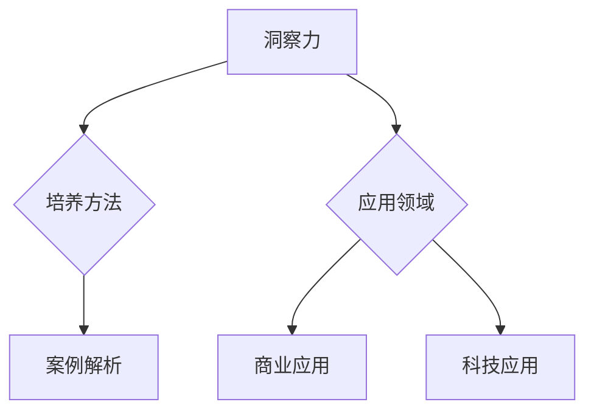

                 

# 《洞察与类比：突破知识限制的工具》

## 关键词：洞察力、类比思维、知识突破、创新思维、跨学科研究

> 摘要：本文旨在探讨洞察力和类比思维在知识突破和创新过程中的关键作用。通过剖析核心概念、案例分析、实战应用，文章揭示了如何通过培养洞察力和类比思维，突破知识限制，实现跨领域创新。

## 《洞察与类比：突破知识限制的工具》目录大纲

### 第一部分：引入与背景

#### 1. 引言

##### 1.1 书籍目的与价值

本文的目的是探讨洞察力和类比思维在现代社会中的重要性，并介绍如何利用这两种思维工具突破知识限制，实现创新。我们希望通过本文，能够激发读者对洞察力和类比思维的重视，并学会在实践中应用这些工具。

##### 1.2 知识限制与突破

知识限制是现代人在学习和创新过程中面临的普遍挑战。如何突破这些限制，实现知识创新，成为了一个重要议题。本文将探讨洞察力和类比思维如何成为突破知识限制的有力工具。

##### 1.3 本书结构安排

本文分为五大部分：第一部分引入与背景，第二部分洞察力的培养，第三部分类比思维，第四部分洞察与类比的结合，第五部分实战应用与案例分析。通过这些部分，我们将全面探讨洞察力和类比思维在知识突破和创新中的应用。

### 第二部分：洞察力的培养

#### 2. 洞察力概述

##### 2.1 洞察力的定义与重要性

洞察力是指对事物本质的深刻理解和把握能力。它是创新思维的基础，对于个人和组织的知识突破具有重要意义。

##### 2.2 洞察力的发展历史

洞察力的发展经历了从直觉到科学的过程。本文将回顾洞察力的发展历程，探讨不同时期的主要洞察力理论。

##### 2.3 洞察力的核心要素

洞察力的培养需要掌握以下几个核心要素：观察力、思维能力、经验积累。本文将详细讨论这些要素，并提供培养方法。

#### 3. 洞察力培养方法

##### 3.1 经典案例解析

通过分析爱因斯坦、达芬奇等大师的案例，我们可以了解如何培养洞察力。

###### 3.1.1 爱因斯坦与相对论

爱因斯坦通过深入思考，突破了经典物理学的限制，提出了相对论。他的洞察力培养过程具有借鉴意义。

###### 3.1.2 达芬奇与多才多艺

达芬奇的多才多艺背后，是他的洞察力。他的观察力、思维能力和经验积累，使他成为了文艺复兴时期的代表人物。

###### 3.1.3 洞察力的培养技巧

通过学习大师们的洞察力培养技巧，我们可以提升自己的洞察力。

##### 3.2 洞察力的应用领域

##### 4.1 商业领域的洞察力应用

在商业领域，洞察力可以帮助企业预测市场趋势，创新产品，制定有效的竞争策略。

##### 4.2 科技领域的洞察力应用

在科技领域，洞察力有助于探索新技术，推动科研创新，预见技术发展方向。

### 第三部分：类比思维

#### 5. 类比思维概述

##### 5.1 类比思维的定义与特点

类比思维是通过比较不同事物之间的相似性，发现新的解决方案的一种思维方式。它具有直观性、创造性等特点。

##### 5.2 类比思维在创新中的作用

类比思维在创新过程中发挥着重要作用。它可以帮助我们突破传统思维，发现新的创意。

##### 5.3 类比思维与相关概念的区别

类比思维与联想思维、迁移思维等概念有一定的联系，但又有区别。本文将详细讨论这些概念之间的关系。

#### 6. 类比思维培养

##### 6.1 类比思维培养的步骤

类比思维的培养需要掌握以下几个步骤：理解类比思维的本质、提高类比能力、学习经典案例。

###### 6.1.1 理解类比思维的本质

类比思维的本质在于发现事物之间的相似性，并通过这种相似性进行创新。

###### 6.1.2 提高类比能力的方法

提高类比能力的方法包括：广泛阅读、多学科交叉学习、实践锻炼。

###### 6.1.3 经典案例学习

通过学习经典案例，我们可以了解类比思维的具体应用。

##### 6.2 类比思维应用

##### 7.1 类比思维在艺术创作中的应用

在艺术创作中，类比思维可以帮助艺术家发现新的创作灵感，提高艺术水平。

##### 7.2 类比思维在教育中的应用

在教育领域，类比思维可以帮助教师更好地传授知识，提高学生的学习兴趣。

### 第四部分：洞察与类比的结合

#### 8. 洞察与类比的综合运用

##### 8.1 洞察与类比的相互作用

洞察力和类比思维之间存在相互作用。洞察力可以激发类比思维，类比思维可以深化洞察力。

##### 8.2 洞察与类比在复杂问题解决中的应用

在复杂问题解决中，洞察与类比的综合运用可以提供新的思路和方法。

###### 8.2.1 复杂系统分析

复杂系统分析需要运用洞察力和类比思维，以发现问题的本质。

###### 8.2.2 问题解决的洞察与类比策略

问题解决过程中，可以结合洞察与类比思维，制定有效的策略。

###### 8.2.3 实例解析

本文将结合实际案例，解析如何运用洞察与类比思维解决复杂问题。

#### 9. 洞察与类比在跨学科研究中的应用

##### 9.1 跨学科研究的挑战与机遇

跨学科研究面临着挑战与机遇。洞察与类比思维可以帮助研究者突破学科界限，实现创新。

##### 9.2 洞察与类比在跨学科研究中的作用

洞察与类比思维在跨学科研究中发挥着重要作用。它们可以帮助研究者发现新的研究思路，推动跨学科合作。

###### 9.2.1 医学与心理学

医学与心理学的跨学科研究可以通过洞察与类比思维，发现新的治疗方法。

###### 9.2.2 物理学与计算机科学

物理学与计算机科学的跨学科研究可以通过洞察与类比思维，推动技术创新。

###### 9.2.3 社会学与经济学

社会学与经济学的跨学科研究可以通过洞察与类比思维，提高社会政策制定的科学性。

### 第五部分：实战应用与案例分析

#### 10. 洞察与类比思维实战应用

##### 10.1 实战案例背景

本文将通过多个实战案例，展示洞察与类比思维的实战应用。

##### 10.2 洞察与类比思维在实战中的应用

本文将详细分析洞察与类比思维在商业、科技、艺术和教育等领域的应用案例。

###### 10.2.1 商业实战案例

商业实战案例将展示如何通过洞察与类比思维，实现商业创新和增长。

###### 10.2.2 科技创新案例

科技创新案例将展示如何通过洞察与类比思维，推动科技发展。

###### 10.2.3 艺术创作案例

艺术创作案例将展示如何通过洞察与类比思维，激发艺术灵感。

###### 10.2.4 教育实践案例

教育实践案例将展示如何通过洞察与类比思维，提高教育质量。

### 第六部分：结论与展望

#### 11. 总结

本文通过深入探讨洞察力和类比思维，揭示了它们在知识突破和创新过程中的关键作用。通过案例分析，我们看到了洞察与类比思维在各个领域的应用价值。未来，随着科技的不断进步，洞察与类比思维将继续发挥重要作用，推动人类社会的创新与发展。

##### 11.1 主要观点回顾

- 洞察力和类比思维是突破知识限制的重要工具。
- 洞察力的培养需要掌握观察力、思维能力和经验积累。
- 类比思维在创新中具有重要作用，可以帮助我们突破传统思维。
- 洞察与类比思维的综合运用，可以提供新的思路和方法，解决复杂问题。
- 洞察与类比思维在跨学科研究中发挥着重要作用。

##### 11.2 洞察与类比思维的未来发展趋势

- 随着人工智能的发展，洞察与类比思维将得到进一步应用。
- 跨学科研究将更加注重洞察与类比思维的融合。
- 教育将更加重视洞察与类比思维的培养。

##### 11.3 对读者的建议

- 培养洞察力和类比思维，提高自己的创新能力。
- 在实践中运用洞察与类比思维，解决实际问题。
- 不断学习新知识，拓宽视野，提升思维水平。

### 附录

#### 附录 A：参考文献

[参考文献列表]

#### 附录 B：进一步阅读材料

[进一步阅读材料列表]

#### 附录 C：相关工具与资源介绍

[相关工具与资源介绍]

### Mermaid 流程图示例



### 伪代码示例

```plaintext
// 伪代码：基于类比的系统分析
function SystemAnalysis(problem, referenceSystem) {
    // 初始化分析结果
    result = {}

    // 比较问题系统与参考系统的差异
    differences = CompareSystems(problem, referenceSystem)

    // 使用类比思维进行问题解决
    solution = Apply类比思维(differences)

    // 返回分析结果
    return result
}
```

### 数学公式示例

$$
E = mc^2
$$

$$
\frac{d^2}{dx^2} f(x) = f''(x)
$$

### 项目实战示例

#### 环境搭建：

- 安装Python 3.8及以上版本
- 安装必要的库，如numpy，pandas等

#### 代码实现：

```python
# 实现基于类比思维的智能推荐系统
import numpy as np

def recommend_items(user_profile, item_profiles, k=5):
    # 计算用户与物品的相似度
    similarities = ComputeSimilarities(user_profile, item_profiles)
    
    # 获取最相似的k个物品
    top_k_indices = np.argsort(similarities)[::-1][:k]
    
    # 返回推荐物品
    return [item_profiles[i] for i in top_k_indices]
```

#### 代码解读：

- `user_profile` 和 `item_profiles` 分别代表用户特征和物品特征。
- `ComputeSimilarities` 函数计算用户和物品之间的相似度。
- `np.argsort` 函数用于获取相似度排序的索引。
- 最终返回最相似的k个物品列表。

#### 分析与讨论

**代码分析：**

- 该推荐系统利用用户和物品的特征进行相似度计算，并通过排序获取最相似的物品。
- 这种方法在推荐系统中广泛应用，因为它能够根据用户兴趣进行个性化推荐。

**实战意义：**

- 在实际应用中，智能推荐系统能够提高用户体验，增加用户粘性，对商业运营有重要影响。
- 该系统可以应用于电商平台、社交媒体等场景，帮助企业更好地了解用户需求，提升服务质量。

### 结束语

本文通过深入探讨洞察力和类比思维，揭示了它们在知识突破和创新过程中的关键作用。我们希望本文能够帮助读者认识到洞察与类比思维的重要性，并在实际应用中运用这些思维工具，实现创新与发展。未来，随着科技的不断进步，洞察与类比思维将继续发挥重要作用，为人类社会带来更多创新成果。

[End of article]

