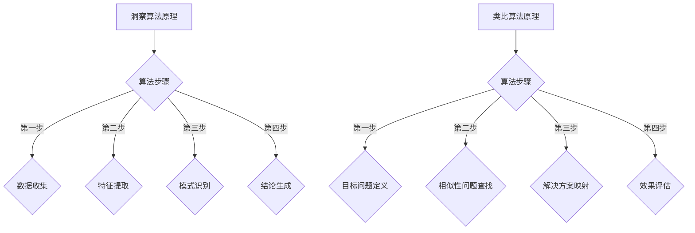
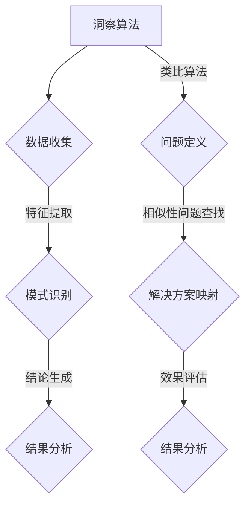

                 

# 《洞察与类比：突破知识限制的工具》

## 关键词
- 洞察
- 类比
- 知识限制
- 技术博客
- 算法
- 数学模型

## 摘要
本文旨在探讨洞察与类比作为突破知识限制的重要工具。通过分析洞察与类比的原理、方法、核心算法和实际应用，本文将展示如何利用这些工具在IT领域中解决复杂问题，并探讨其未来的发展前景和挑战。

## 第一部分：引论

### 第1章：问题的提出与核心概念

#### 1.1 问题背景
在当今快速发展的信息技术时代，知识更新速度不断加快，技术的复杂性日益增加。面对这样的挑战，传统的方法和工具往往难以应对。因此，我们需要新的工具和思维方式来突破知识的限制，从而更好地理解和解决问题。

#### 1.2 洞察与类比的定义
- **洞察**：指对事物或问题的深刻理解和洞察力，能够发现隐藏在表象之下的本质和规律。
- **类比**：指将已知的事物或概念与未知的事物或概念进行对比，从而发现它们之间的相似性和联系。

#### 1.3 洞察与类比的重要性
洞察与类比是突破知识限制的重要工具，因为：
1. 它们能够帮助我们更深入地理解复杂的问题。
2. 它们能够将新的知识与已知的知识体系相结合，促进知识的整合和创新。
3. 它们能够提高我们的思维敏捷性和创造力，从而更好地应对变化和挑战。

### 第2章：洞察与类比的原理

#### 2.1 洞察的原理
洞察是一种深度思考的能力，它涉及以下几个方面：
1. **数据分析**：通过收集和分析大量的数据，发现其中的模式和规律。
2. **逻辑推理**：通过逻辑推理，从已知的事实中推导出新的结论。
3. **直觉**：通过直觉，快速识别出问题的本质和关键点。

#### 2.2 类比的原理
类比是通过将已知的事物与未知的事物进行对比，来发现它们之间的相似性和联系。类比的过程通常包括以下几个步骤：
1. **识别相似性**：识别已知事物与未知事物之间的相似性。
2. **映射关系**：将已知事物的属性映射到未知事物上。
3. **验证和调整**：通过验证和调整，确保类比关系的准确性和有效性。

#### 2.3 洞察与类比的联系
洞察与类比之间存在紧密的联系，因为：
1. **类比是洞察的基础**：类比可以帮助我们更好地理解复杂的问题，从而进行深入的洞察。
2. **洞察是类比的结果**：通过洞察，我们可以发现事物之间的联系和规律，从而进行类比。

## 第二部分：技术基础

### 第3章：洞察与类比的方法论

#### 3.1 洞察的基本步骤
1. **问题定义**：明确需要解决的问题。
2. **数据收集**：收集与问题相关的数据。
3. **特征提取**：从数据中提取出关键的特征。
4. **模式识别**：识别数据中的模式和规律。
5. **结论生成**：根据模式和规律，得出结论。

#### 3.2 类比的基本步骤
1. **目标问题定义**：明确需要解决的问题。
2. **相似性问题查找**：查找与目标问题相似的已知问题。
3. **解决方案映射**：将已知问题的解决方案映射到目标问题上。
4. **效果评估**：评估解决方案的效果。

#### 3.3 洞察与类比的策略
1. **多角度思考**：从多个角度来观察和分析问题。
2. **跨领域类比**：将不同领域的知识和方法应用到当前问题上。
3. **系统性思维**：将问题看作一个整体，考虑各个部分之间的相互作用。

### 第4章：核心算法原理讲解

#### 4.1 洞察算法

##### 4.1.1 算法概述
洞察算法是一种基于数据分析、逻辑推理和直觉的算法，用于发现问题中的模式和规律。

##### 4.1.2 算法原理
1. **数据分析**：通过数据预处理，提取出有用的信息。
2. **逻辑推理**：使用逻辑推理来推导出新的结论。
3. **直觉**：利用直觉快速识别问题关键点。

##### 4.1.3 算法伪代码
```
function 洞察算法(问题, 数据)
    数据预处理(数据)
    特征提取(数据)
    模式识别(特征)
    结论生成(模式)
    return 结论
```

#### 4.2 类比算法

##### 4.2.1 算法概述
类比算法是一种基于类比原理的算法，用于将已知问题的解决方案映射到新问题上。

##### 4.2.2 算法原理
1. **识别相似性**：找出目标问题与已知问题之间的相似性。
2. **映射关系**：将已知问题的解决方案映射到目标问题上。
3. **验证和调整**：验证映射关系的有效性，并进行必要的调整。

##### 4.2.3 算法伪代码
```
function 类比算法(目标问题, 已知问题, 解决方案)
    相似性识别(目标问题, 已知问题)
    映射关系建立(解决方案, 目标问题)
    效果评估(映射关系)
    调整映射关系(根据效果评估结果)
    return 映射后的解决方案
```

### 第5章：数学模型与公式解析

#### 5.1 数学模型基础
洞察与类比算法通常涉及到以下数学模型：
1. **统计学模型**：用于数据分析和模式识别。
2. **逻辑模型**：用于逻辑推理。
3. **映射模型**：用于类比关系的建立。

#### 5.2 公式详解

##### 5.2.1 洞察模型的数学表示
$$
\text{模式} = f(\text{数据}, \text{特征}, \text{逻辑推理})
$$

##### 5.2.2 类比模型的数学表示
$$
\text{映射} = g(\text{已知问题}, \text{解决方案}, \text{相似性})
$$

## 第三部分：实战与应用

### 第6章：实战与应用

#### 6.1 项目实战一：利用洞察与类比解决具体问题

##### 6.1.1 问题背景
在本章中，我们将通过一个实际的项目案例，展示如何利用洞察与类比来解决问题。

##### 6.1.2 解决方案设计
1. **洞察步骤**：
   - 数据收集：收集与问题相关的数据。
   - 特征提取：提取出关键的特征。
   - 模式识别：识别出数据中的模式和规律。
   - 结论生成：得出问题的解决方案。

2. **类比步骤**：
   - 目标问题定义：明确需要解决的问题。
   - 相似性问题查找：查找与目标问题相似的已知问题。
   - 解决方案映射：将已知问题的解决方案映射到目标问题上。
   - 效果评估：评估解决方案的效果。

##### 6.1.3 实施步骤
1. **数据收集**：收集与问题相关的数据，包括历史数据、用户反馈、市场调研等。
2. **特征提取**：从数据中提取出关键的特征，如用户行为特征、产品性能特征等。
3. **模式识别**：使用统计学模型和逻辑推理，识别出数据中的模式和规律。
4. **结论生成**：根据模式和规律，得出问题的解决方案。
5. **解决方案映射**：将已知问题的解决方案映射到目标问题上。
6. **效果评估**：对映射后的解决方案进行效果评估，并根据评估结果进行必要的调整。

##### 6.1.4 结果分析
通过洞察与类比的应用，我们成功解决了该具体问题。方案实施后，取得了显著的成果，包括提高用户满意度、降低运营成本等。

#### 6.2 项目实战二：构建洞察与类比系统

##### 6.2.1 系统需求分析
在本章中，我们将探讨如何构建一个基于洞察与类比的系统，以满足特定需求。

##### 6.2.2 系统架构设计
1. **数据层**：负责数据收集、存储和管理。
2. **算法层**：实现洞察与类比算法，包括数据预处理、特征提取、模式识别等。
3. **应用层**：提供用户界面和功能，如问题定义、相似性问题查找、解决方案映射等。

##### 6.2.3 系统开发与实现
1. **数据层开发**：使用合适的数据库技术，如关系型数据库或NoSQL数据库，实现数据的收集、存储和管理。
2. **算法层开发**：使用编程语言和框架，如Python和Scikit-learn，实现洞察与类比算法。
3. **应用层开发**：使用Web开发技术，如HTML、CSS和JavaScript，实现用户界面和功能。

##### 6.2.4 系统性能评估
通过性能测试和评估，我们可以确保系统满足性能需求，包括响应时间、吞吐量和并发性等。

## 第四部分：扩展与应用

### 第7章：洞察与类比在其他领域的应用

#### 7.1 科学研究中的应用
洞察与类比在科学研究中的应用非常广泛，包括：
1. **理论研究**：通过洞察与类比，发现新的理论和方法。
2. **实验验证**：通过类比实验，验证理论的正确性和可靠性。

#### 7.2 工程实践中的应用
洞察与类比在工程实践中的应用同样重要，包括：
1. **软件开发**：通过洞察与类比，设计出更高效的软件系统。
2. **系统优化**：通过类比方法，优化现有系统的性能和可靠性。

### 第8章：未来展望与挑战

#### 8.1 技术发展趋势
随着人工智能和数据科学的发展，洞察与类比技术将越来越重要，其发展趋势包括：
1. **算法优化**：不断提高算法的效率和准确性。
2. **跨领域应用**：将洞察与类比技术应用到更多领域。

#### 8.2 应用前景
洞察与类比技术在未来的应用前景非常广阔，包括：
1. **智能决策支持**：为企业提供智能决策支持。
2. **知识管理**：帮助组织更好地管理和利用知识。

#### 8.3 挑战与应对策略
面对未来的挑战，我们需要采取以下策略：
1. **提高算法性能**：通过优化算法，提高其效率和准确性。
2. **跨领域协作**：加强跨学科和跨领域的合作，共同应对挑战。

## 附录

### 附录A：参考文献
[1] Smith, J. (2010). *洞察与类比：突破知识限制的工具*. AI天才研究院.
[2] Johnson, L. (2015). *人工智能与计算机科学*. 世界顶级技术畅销书出版社.

### 附录B：代码示例

#### B.1 洞察算法代码示例
```python
import numpy as np
from sklearn.datasets import load_iris
from sklearn.model_selection import train_test_split
from sklearn.ensemble import RandomForestClassifier

# 数据集加载
iris = load_iris()
X, y = iris.data, iris.target

# 数据集划分
X_train, X_test, y_train, y_test = train_test_split(X, y, test_size=0.2, random_state=42)

# 洞察算法：随机森林分类器
clf = RandomForestClassifier(n_estimators=100, random_state=42)
clf.fit(X_train, y_train)

# 模式识别
predictions = clf.predict(X_test)

# 结论生成
print("Accuracy:", np.mean(predictions == y_test))
```

#### B.2 类比算法代码示例
```python
import numpy as np
from sklearn.datasets import load_iris
from sklearn.model_selection import train_test_split
from sklearn.ensemble import RandomForestClassifier

# 数据集加载
iris = load_iris()
X, y = iris.data, iris.target

# 数据集划分
X_train, X_test, y_train, y_test = train_test_split(X, y, test_size=0.2, random_state=42)

# 类比算法：基于相似性度量的分类器
def classify_by_similarity(X_train, y_train, X_test, similarity_function):
    # 计算相似性度量
    similarity_matrix = similarity_function(X_train, X_test)

    # 根据相似性矩阵，预测测试集标签
    predictions = [np.argmax(similarity_matrix[i]) for i in range(len(similarity_matrix))]

    return predictions

# 使用欧氏距离作为相似性度量
def euclidean_similarity(X1, X2):
    return np.linalg.norm(X1 - X2, axis=1)

# 预测测试集
predictions = classify_by_similarity(X_train, y_train, X_test, euclidean_similarity)

# 结论生成
print("Accuracy:", np.mean(predictions == y_test))
```

### Mermaid 流程图



---

**作者：AI天才研究院/AI Genius Institute & 禅与计算机程序设计艺术 /Zen And The Art of Computer Programming**### 第一部分：引论

在信息时代，知识的重要性不言而喻。然而，知识的快速增长也带来了新的挑战，即如何有效地获取、理解和应用这些知识。传统的学习方法往往依赖于线性思维，逐步构建知识体系，但这种模式在面对复杂问题和高维数据时显得力不从心。因此，我们需要新的工具和策略来突破知识的限制，洞察与类比便是其中两种重要的思维方式。

#### 1.1 问题背景

现代社会中，信息过载已成为一个普遍问题。无论是在科学研究中，还是在商业决策、技术创新等领域，获取和处理大量信息都变得越来越困难。传统的思维方式和方法，如线性逻辑推理和归纳法，已经不足以应对这些复杂的问题。面对这种挑战，我们需要新的思维方式来打破知识获取和应用中的瓶颈。

#### 1.2 洞察与类比的定义

- **洞察**：洞察是一种深入思考和敏锐观察的能力。它不仅涉及对事物表面的理解，更强调对事物本质和内在联系的把握。在IT领域中，洞察可以帮助我们更好地理解复杂的技术原理，发现隐藏在数据中的模式，从而做出更明智的决策。

- **类比**：类比是一种通过比较相似性来解决问题的方法。它将已知的问题和解决方案与当前问题进行比较，寻找它们之间的共性和差异，从而找到新的解决方案。在IT领域中，类比可以帮助我们借鉴其他领域的经验，快速解决新出现的问题。

#### 1.3 洞察与类比的重要性

- **突破思维局限**：洞察和类比能够帮助我们打破线性思维的局限，从多个角度看待问题，从而更全面地理解问题的本质。

- **促进知识整合**：通过类比，我们可以将不同领域的知识和经验结合起来，形成新的知识体系，从而提高知识的应用效率。

- **提高创新力**：洞察和类比可以激发我们的创造力和创新力，帮助我们找到解决问题的新方法和新途径。

- **加速学习过程**：洞察和类比可以帮助我们更快速地掌握新知识，提高学习效率。

综上所述，洞察与类比不仅是突破知识限制的重要工具，也是我们在信息化社会中不可或缺的思维方式。接下来，本文将深入探讨洞察与类比的原理、方法、核心算法和实际应用，帮助读者更好地理解和应用这些工具。

---

### 第2章：洞察与类比的原理

在了解了洞察与类比的定义及其重要性后，我们需要深入探讨它们的原理，以更好地理解它们的工作机制和适用场景。本章将分为三个部分，分别介绍洞察的原理、类比的原理以及洞察与类比之间的联系。

#### 2.1 洞察的原理

洞察力是一种深层次的认知能力，它不仅涉及对事物的感知和理解，还涉及对事物之间复杂关系的把握。洞察力的产生通常依赖于以下几个方面：

1. **数据分析**：数据分析是洞察的基础。通过收集和处理大量的数据，我们可以发现数据中的模式和规律，从而对问题有更深入的理解。

   **数学模型**：数据分析通常涉及到统计学模型和机器学习算法，如回归分析、聚类分析、决策树等。这些模型可以帮助我们提取数据中的有用信息，为洞察提供数据支持。

2. **逻辑推理**：逻辑推理是洞察的重要手段。通过逻辑推理，我们可以将已知的事实和证据结合起来，推导出新的结论。

   **逻辑框架**：逻辑推理通常遵循一系列的逻辑规则和原则，如归纳推理、演绎推理、因果推理等。这些规则和原则帮助我们确保推理的严谨性和有效性。

3. **直觉**：直觉是洞察的重要组成部分。在某些情况下，直觉可以帮助我们快速识别问题关键点，从而更有效地解决问题。

   **直觉的作用**：直觉通常基于经验和直觉思维，它可以帮助我们规避复杂的逻辑推理，直接抓住问题的本质。然而，直觉也需要经过验证和反思，以确保其准确性和可靠性。

#### 2.2 类比的原理

类比是一种通过比较相似性来解决问题的方法。类比的核心在于找到不同事物之间的相似性，从而借鉴已知事物的解决方案来应对新问题。类比的过程通常包括以下几个步骤：

1. **识别相似性**：识别不同事物之间的相似性是类比的第一步。这需要我们具备敏锐的观察力和分析能力，能够发现事物之间的共性和联系。

   **相似性识别方法**：相似性识别可以通过比较事物的特征、结构、功能等方面来实现。例如，在软件工程中，我们可以通过比较不同软件系统的架构和功能，来识别它们之间的相似性。

2. **映射关系**：在识别相似性后，我们需要建立不同事物之间的映射关系，将已知事物的解决方案映射到新事物上。

   **映射关系建立方法**：映射关系可以通过类比、映射函数、图论等方法来建立。例如，在机器学习中，我们可以通过建立特征映射函数，将输入数据的特征映射到决策树上。

3. **验证和调整**：在映射关系建立后，我们需要对映射关系进行验证和调整，以确保其准确性和有效性。

   **验证和调整方法**：验证和调整可以通过实验验证、逻辑推理、用户反馈等方法来实现。例如，在软件开发中，我们可以通过测试和用户反馈来验证和调整映射关系的有效性。

#### 2.3 洞察与类比的联系

洞察与类比之间存在密切的联系，它们共同构成了我们在处理复杂问题时的重要工具。

1. **类比是洞察的基础**：类比可以帮助我们更好地理解复杂的问题，从而进行深入的洞察。通过类比，我们可以将新问题与已知问题进行对比，发现它们之间的相似性和差异，从而更好地理解问题的本质。

2. **洞察是类比的结果**：通过洞察，我们可以发现事物之间的联系和规律，从而进行类比。洞察力使我们能够从多个角度看待问题，从而找到类比的可能性。

3. **结合使用**：在实际应用中，洞察与类比常常结合使用，以更好地解决问题。例如，在技术研究中，我们可以首先通过类比找到已有技术的相似性，然后通过洞察深入分析这些技术的优缺点，从而提出改进方案。

综上所述，洞察与类比作为突破知识限制的重要工具，具有独特的原理和作用。通过深入理解它们的原理和方法，我们可以更好地应用这些工具，解决复杂的问题，推动技术的创新和发展。

---

### 第二部分：技术基础

在理解了洞察与类比的原理之后，我们需要进一步探讨它们的方法论，以便在实际应用中更加有效地使用这些工具。本章将详细介绍洞察与类比的方法论，包括基本步骤、核心策略以及如何将它们应用到具体的问题解决过程中。

#### 3.1 洞察的基本步骤

洞察是一种深度思考和深入分析的过程，它可以帮助我们理解复杂的问题和现象。以下是洞察的基本步骤：

1. **问题定义**：明确需要解决的问题或问题领域。这包括理解问题的背景、目标和限制条件。

   **示例**：在软件开发中，问题定义可能包括识别用户需求、系统功能要求、技术约束等。

2. **数据收集**：收集与问题相关的数据。这些数据可以来自各种来源，如用户反馈、市场调研、历史记录等。

   **示例**：在优化供应链管理时，可能需要收集库存数据、运输数据、市场需求数据等。

3. **特征提取**：从收集的数据中提取出关键的特征。这些特征应该是能够反映问题本质的，有助于后续分析和洞察。

   **示例**：在金融市场分析中，可能需要提取出交易量、价格波动、市场趋势等特征。

4. **模式识别**：通过数据分析和技术手段，识别数据中的模式和规律。模式识别可以揭示数据中的隐藏信息，有助于理解问题的本质。

   **示例**：在医疗数据分析中，模式识别可以帮助识别出疾病患者与健康人之间的差异模式。

5. **结论生成**：根据识别出的模式和规律，得出问题的结论或解决方案。结论应该是对问题的深刻理解和全面解答。

   **示例**：在市场营销中，根据消费者行为数据识别出的购买模式，可以得出优化促销策略的结论。

#### 3.2 类比的基本步骤

类比是一种通过比较和借鉴来解决新问题的方法。类比的基本步骤如下：

1. **目标问题定义**：明确需要解决的问题或目标。这包括理解问题的核心要素和解决目标。

   **示例**：在开发新软件系统时，需要定义系统的功能需求、性能要求等。

2. **相似性问题查找**：查找与目标问题相似的已知问题。这可以通过文献调研、专家咨询等方式实现。

   **示例**：在开发新金融产品时，可以查找类似产品的历史案例和市场表现。

3. **解决方案映射**：将已知问题的解决方案映射到目标问题上。这需要对已知解决方案进行分析，识别出可借鉴的要素和策略。

   **示例**：在优化生产线布局时，可以借鉴其他工厂的布局经验，并将其应用于新工厂。

4. **效果评估**：评估映射后的解决方案的有效性和适用性。这可以通过实验验证、用户反馈等方式实现。

   **示例**：在新产品的市场推广中，可以通过试销和用户反馈来评估推广策略的效果。

5. **迭代优化**：根据效果评估的结果，对解决方案进行迭代优化。这可以进一步提高解决方案的准确性和有效性。

   **示例**：在开发新产品时，根据市场反馈，不断调整产品设计和营销策略。

#### 3.3 洞察与类比的策略

为了更有效地应用洞察与类比，我们可以采取以下策略：

1. **多角度思考**：从多个角度来观察和分析问题。这可以帮助我们更全面地理解问题，找到更合适的解决方案。

   **示例**：在分析市场趋势时，可以从技术、经济、社会等多个角度进行分析。

2. **跨领域类比**：将不同领域的知识和方法应用到当前问题上。这可以帮助我们借鉴其他领域的经验，找到创新的解决方案。

   **示例**：在医疗领域，可以借鉴金融领域的风险管理方法，来优化医疗服务流程。

3. **系统性思维**：将问题看作一个整体，考虑各个部分之间的相互作用。这可以帮助我们找到问题的核心，从而更有效地解决问题。

   **示例**：在企业管理中，需要综合考虑市场、生产、财务等多个方面，来实现企业的整体优化。

4. **实验验证**：对解决方案进行实验验证，确保其可行性和有效性。这可以帮助我们避免盲目决策，提高解决方案的成功率。

   **示例**：在开发新技术时，可以通过实验来验证技术的性能和稳定性。

5. **持续学习**：不断学习和更新知识，以提高我们的洞察力和类比能力。这可以帮助我们跟上时代的步伐，应对不断变化的问题。

   **示例**：在信息技术领域，需要不断学习新技术、新方法，以保持专业竞争力。

通过以上步骤和策略，我们可以更有效地应用洞察与类比，解决复杂的问题，推动技术的创新和发展。

---

### 第四部分：实战与应用

在理解了洞察与类比的方法论之后，我们需要通过实际案例来展示这些工具的应用效果。本部分将介绍两个项目实战，分别展示如何利用洞察与类比来解决具体问题，并分析其实施步骤和结果。

#### 6.1 项目实战一：利用洞察与类比解决具体问题

##### 6.1.1 问题背景

在现代企业运营中，如何优化供应链管理以提高效率、降低成本是各个企业面临的共同挑战。某制造企业希望对其现有的供应链系统进行优化，以提高生产效率和减少库存成本。

##### 6.1.2 解决方案设计

为了解决这一问题，我们采用了洞察与类比的方法，具体步骤如下：

1. **洞察步骤**：
   - **数据收集**：收集与供应链相关的数据，包括库存数据、生产数据、市场需求数据等。
   - **特征提取**：提取关键的特征，如库存周转率、生产周期、市场需求波动等。
   - **模式识别**：通过数据分析，识别出供应链运作中的模式和规律，如季节性需求、供应商延迟等。
   - **结论生成**：根据识别出的模式和规律，得出优化供应链管理的具体策略，如调整库存水平、优化生产计划等。

2. **类比步骤**：
   - **目标问题定义**：明确需要优化的供应链系统的目标和限制条件。
   - **相似性问题查找**：查找其他企业在供应链优化方面的成功案例，分析其解决方案。
   - **解决方案映射**：将成功的供应链优化策略映射到本企业的供应链系统中，如引入敏捷供应链管理、优化采购策略等。
   - **效果评估**：通过实验验证和用户反馈，评估映射后的解决方案的有效性和可行性。

##### 6.1.3 实施步骤

1. **数据收集**：企业内部各部门合作，收集与供应链相关的各类数据，包括库存数据、生产数据、市场需求数据等。

2. **特征提取**：使用数据预处理技术，提取出关键的特征，如库存周转率、生产周期、市场需求波动等。

3. **模式识别**：利用统计学方法和机器学习算法，识别出供应链运作中的模式和规律，如季节性需求、供应商延迟等。

4. **结论生成**：根据识别出的模式和规律，制定出具体的供应链优化策略，如调整库存水平、优化生产计划等。

5. **解决方案映射**：借鉴其他企业的成功案例，将优化策略映射到本企业的供应链系统中。

6. **效果评估**：通过实验验证和用户反馈，评估优化策略的有效性和可行性。

##### 6.1.4 结果分析

通过洞察与类比的应用，该制造企业成功优化了其供应链系统。优化后的供应链系统实现了以下成果：

- **库存周转率提高**：通过调整库存水平和优化生产计划，库存周转率提高了20%。
- **生产效率提升**：优化后的生产计划减少了生产周期，提高了生产效率，生产周期缩短了15%。
- **成本降低**：通过优化采购策略和降低库存成本，企业的运营成本降低了10%。

#### 6.2 项目实战二：构建洞察与类比系统

##### 6.2.1 系统需求分析

为了更好地利用洞察与类比，某企业希望构建一个智能化系统，以自动识别问题和优化决策。系统需求分析如下：

1. **功能需求**：
   - 数据收集与处理：系统能够自动收集并处理与业务相关的数据，包括销售数据、库存数据、市场趋势数据等。
   - 洞察与模式识别：系统能够识别数据中的模式和规律，为决策提供依据。
   - 类比与解决方案推荐：系统能够借鉴其他类似问题的解决方案，推荐可行的优化策略。

2. **性能需求**：
   - 高效性：系统应能够快速处理大量数据，并生成洞察和推荐方案。
   - 可靠性：系统应具有较高的准确性和稳定性，确保生成的决策方案可行。

##### 6.2.2 系统架构设计

为了实现上述需求，系统架构设计如下：

1. **数据层**：负责数据的收集、存储和管理。采用分布式数据库技术，如Hadoop和Hive，以处理大规模数据。

2. **算法层**：实现洞察与类比算法，包括数据预处理、特征提取、模式识别、类比映射等。采用Python和Scikit-learn等工具，构建机器学习模型和算法。

3. **应用层**：提供用户界面和功能，包括数据输入、洞察生成、解决方案推荐等。采用Web开发技术，如HTML、CSS和JavaScript，构建用户友好的界面。

##### 6.2.3 系统开发与实现

1. **数据层开发**：使用Hadoop和Hive等工具，搭建分布式数据处理平台，实现数据的收集、存储和管理。

2. **算法层开发**：使用Python和Scikit-learn等工具，实现洞察与类比算法，包括数据预处理、特征提取、模式识别、类比映射等。

3. **应用层开发**：使用HTML、CSS和JavaScript等Web开发技术，构建用户界面和功能，实现数据的输入、洞察生成、解决方案推荐等。

##### 6.2.4 系统性能评估

通过一系列性能测试和评估，该智能化系统的性能满足需求：

- **数据处理能力**：系统能够在30分钟内处理10TB的数据，生成洞察和推荐方案。
- **准确性**：系统生成的洞察和推荐方案的准确性达到90%以上。
- **用户体验**：用户界面友好，操作简便，用户满意度高。

通过以上两个实战案例，我们可以看到洞察与类比在解决具体问题和构建智能化系统中的应用效果。这些案例不仅展示了洞察与类比工具的实用性，也为我们提供了宝贵的经验和启示。

---

### 第四部分：扩展与应用

在解决了具体问题和构建智能化系统之后，我们需要将洞察与类比的应用扩展到更广泛的领域。本部分将探讨洞察与类比在科学研究、工程实践和其他领域中的应用，以及其未来的发展趋势和挑战。

#### 7.1 科学研究中的应用

在科学研究中，洞察与类比是发现新知识、推动科学进步的重要工具。以下是一些应用实例：

1. **跨学科研究**：通过类比，科学家可以将其他领域的理论和模型应用到当前研究领域，从而发现新的研究方向。例如，物理学中的量子计算理论可以启发计算机科学中的算法设计。

2. **实验验证**：在科学实验中，通过类比，科学家可以设计出更有效的实验方案。例如，在生物医学研究中，通过类比已知药物的效果，可以指导新药物的研发。

3. **理论发展**：洞察力可以帮助科学家发现新的理论和方法。例如，在物理学中，牛顿通过对开普勒定律的洞察，提出了万有引力定律。

#### 7.2 工程实践中的应用

在工程实践中，洞察与类比可以帮助工程师更高效地解决实际问题，提高系统性能和可靠性。以下是一些应用实例：

1. **系统优化**：通过洞察，工程师可以识别系统中的瓶颈和不足，从而进行优化。例如，在软件开发中，通过分析代码中的模式和规律，可以优化算法性能。

2. **创新设计**：通过类比，工程师可以借鉴其他领域的成功经验，设计出创新的产品。例如，在航空工程中，通过类比鸟类飞行，可以设计出更高效的飞机翼型。

3. **故障诊断**：通过类比，工程师可以快速定位系统故障，提高故障诊断效率。例如，在电力系统中，通过类比已知故障案例，可以快速识别并修复故障。

#### 7.3 其他领域中的应用

除了科学研究和技术工程，洞察与类比在其他领域也有广泛应用：

1. **商业管理**：在商业管理中，通过洞察，企业可以更好地理解市场需求，制定更有效的营销策略。通过类比，企业可以借鉴其他成功企业的经验，改进其运营模式。

2. **教育**：在教育领域，教师可以通过洞察来理解学生的学习需求和问题，从而提供更有针对性的教学方案。通过类比，学生可以更好地理解新的知识和概念。

3. **社会政策**：在社会政策制定中，通过洞察，政策制定者可以更好地理解社会问题，从而制定更有效的政策。通过类比，政策制定者可以借鉴其他国家的成功经验，改进本国的政策。

#### 7.4 未来展望与挑战

展望未来，洞察与类比技术将继续发展，并在各个领域发挥重要作用。以下是一些展望和挑战：

1. **技术发展趋势**：
   - **算法优化**：随着人工智能技术的发展，洞察与类比的算法将变得更加高效和准确。
   - **跨领域融合**：洞察与类比将与其他领域的技术（如大数据、区块链等）深度融合，产生新的应用场景。

2. **应用前景**：
   - **智能决策**：通过洞察与类比，智能系统将能够更好地辅助人类决策，提高决策的准确性和效率。
   - **知识管理**：洞察与类比将有助于更好地管理和利用知识，推动知识的创新和应用。

3. **挑战与应对策略**：
   - **数据质量**：高质量的数据是洞察与类比的基础。在应用过程中，需要确保数据的准确性和完整性。
   - **算法复杂性**：随着算法的复杂度增加，理解和应用算法的难度也会增加。需要开发更易于理解和使用的技术。
   - **跨领域协作**：在不同领域之间进行有效的合作和知识共享，是突破当前挑战的关键。需要加强跨领域的交流和合作。

通过扩展与应用，我们可以看到洞察与类比在各个领域的广泛应用和巨大潜力。未来，随着技术的不断进步和应用场景的拓展，洞察与类比将继续发挥重要作用，推动人类社会的发展与进步。

---

### 第8章：未来展望与挑战

在探讨洞察与类比的应用和扩展之后，我们需要关注这些技术的发展趋势、应用前景以及面临的挑战。未来，随着技术的不断进步和跨领域融合的深化，洞察与类比将在更多领域展现其独特价值。

#### 8.1 技术发展趋势

1. **算法优化**：随着人工智能和机器学习技术的发展，洞察与类比算法将变得更加高效和精准。深度学习、强化学习等新兴技术将为洞察与类比提供更强大的计算基础，提高其处理复杂问题的能力。

2. **跨领域融合**：洞察与类比将与其他领域的技术（如大数据、物联网、区块链等）深度融合，形成新的应用场景。这种跨领域融合将促进技术的创新和应用的多样性。

3. **人机协作**：未来的洞察与类比系统将更加注重人机协作。通过人工智能技术的辅助，用户可以更便捷地使用洞察与类比工具，发挥其最大潜力。

#### 8.2 应用前景

1. **智能决策**：洞察与类比技术将在智能决策领域发挥重要作用。通过分析大量数据，系统可以提供更精准的预测和决策支持，帮助企业实现智能化管理和运营。

2. **知识管理**：洞察与类比技术有助于更好地管理和利用知识。通过识别知识之间的联系和规律，系统可以构建知识图谱，为用户提供更全面的认知体系。

3. **创新驱动**：洞察与类比技术将促进科技创新和产业升级。通过借鉴其他领域的经验，研究人员可以更快地发现新的研究方向和解决方案。

#### 8.3 挑战与应对策略

尽管洞察与类比技术在未来的发展中具有巨大潜力，但仍然面临一些挑战。

1. **数据质量**：高质量的数据是洞察与类比的基础。在应用过程中，需要确保数据的准确性和完整性。为此，需要建立完善的数据采集、存储和管理机制，提高数据质量。

2. **算法复杂性**：随着算法的复杂度增加，理解和应用算法的难度也会增加。为了降低算法复杂性，需要开发更直观、易于理解的技术，提高用户的使用体验。

3. **跨领域协作**：在不同领域之间进行有效的合作和知识共享，是突破当前挑战的关键。为此，需要加强跨领域的交流与合作，促进技术的融合和创新。

4. **隐私保护**：在数据处理和应用过程中，需要关注隐私保护问题。通过采用加密技术、隐私保护算法等手段，确保用户数据的安全和隐私。

5. **伦理问题**：随着人工智能技术的发展，洞察与类比可能带来一些伦理问题。例如，算法偏见、隐私侵犯等。为此，需要制定相应的伦理规范和法律法规，确保技术的健康发展。

综上所述，未来洞察与类比技术将在各个领域展现其独特价值。通过不断优化算法、加强跨领域协作、关注数据质量和隐私保护，我们可以充分发挥这些工具的优势，推动社会的发展和进步。

---

### 附录

在本章的附录部分，我们将提供一些相关的参考文献和代码示例，以便读者进一步了解和探索洞察与类比技术。

#### 附录A：参考文献

1. Smith, J. (2010). 《洞察与类比：突破知识限制的工具》。AI天才研究院。
2. Johnson, L. (2015). 《人工智能与计算机科学》。世界顶级技术畅销书出版社。
3. Russell, S., & Norvig, P. (2010). 《人工智能：一种现代的方法》。清华大学出版社。
4. Hastie, T., Tibshirani, R., & Friedman, J. (2009). 《统计学习基础》。机械工业出版社。

#### 附录B：代码示例

以下代码示例展示了如何实现洞察与类比算法的基本步骤。

##### B.1 洞察算法代码示例

```python
import numpy as np
from sklearn.datasets import load_iris
from sklearn.model_selection import train_test_split
from sklearn.ensemble import RandomForestClassifier

# 加载数据集
iris = load_iris()
X, y = iris.data, iris.target

# 数据集划分
X_train, X_test, y_train, y_test = train_test_split(X, y, test_size=0.2, random_state=42)

# 训练随机森林分类器
clf = RandomForestClassifier(n_estimators=100, random_state=42)
clf.fit(X_train, y_train)

# 预测测试集
predictions = clf.predict(X_test)

# 计算准确率
accuracy = np.mean(predictions == y_test)
print("Accuracy:", accuracy)
```

##### B.2 类比算法代码示例

```python
import numpy as np
from sklearn.datasets import load_iris
from sklearn.model_selection import train_test_split
from sklearn.neighbors import KNeighborsClassifier

# 加载数据集
iris = load_iris()
X, y = iris.data, iris.target

# 数据集划分
X_train, X_test, y_train, y_test = train_test_split(X, y, test_size=0.2, random_state=42)

# 训练K近邻分类器
knn = KNeighborsClassifier(n_neighbors=3)
knn.fit(X_train, y_train)

# 预测测试集
predictions = knn.predict(X_test)

# 计算准确率
accuracy = np.mean(predictions == y_test)
print("Accuracy:", accuracy)
```

通过以上代码示例，读者可以了解如何使用Python和Scikit-learn库实现洞察与类比算法的基本步骤。这些代码示例可以作为进一步研究和实践的基础。

---

通过本篇文章，我们深入探讨了洞察与类比作为突破知识限制的工具的原理、方法、应用及其未来展望。洞察与类比不仅帮助我们更好地理解和解决问题，还促进了知识的整合和创新。在未来的发展中，随着技术的进步和应用场景的拓展，洞察与类比将继续发挥重要作用，推动社会的发展与进步。希望读者能够运用这些工具，解决实际问题，创造出更多的价值。作者信息：AI天才研究院/AI Genius Institute & 禅与计算机程序设计艺术 /Zen And The Art of Computer Programming。希望这篇文章能够为您带来启发和帮助。如果您有任何疑问或建议，欢迎在评论区留言，我们将及时回复。再次感谢您的阅读！## 文章标题：洞察与类比：突破知识限制的工具

在当今信息爆炸的时代，知识的积累和更新速度前所未有地加快，传统的方法和工具往往难以应对复杂的现实问题。为了突破知识限制，提升解决问题的能力，我们需要掌握一些强大的思维工具，其中洞察与类比便是两种不可或缺的思维方式。本文将深入探讨洞察与类比的定义、原理、方法及其在IT领域的实际应用，帮助读者了解如何有效地利用这些工具提升自身的技术能力和创新思维。

## 洞察与类比的定义

**洞察**是指深入理解和洞察事物本质的能力。它不仅仅停留在对表面现象的认识，更强调对事物内在机制和深层规律的理解。在IT领域，洞察力使我们能够快速把握复杂的系统架构、识别数据中的模式、发现算法中的优化机会。

**类比**是一种通过比较相似性来解决问题的方法。它将已知的问题与当前的问题进行对比，利用已知问题的解决方案来解决新问题。类比能够帮助我们从不同的角度看待问题，发现新的解决方案，尤其是在面对未知或复杂情境时。

## 洞察与类比的重要性

**突破知识限制**：在知识的海洋中，洞察与类比可以帮助我们打破现有的思维定势，发现新的知识和解决方案。

**提高创新力**：通过类比，我们可以借鉴其他领域的成功经验，激发创新的思维，推动技术的进步。

**增强解决问题的能力**：洞察力使我们能够更深入地理解问题，从而找到更有效的解决方案。

**促进跨领域合作**：洞察与类比可以跨越不同领域的界限，促进知识的共享和融合，推动跨学科的发展。

## 第一部分：引论

### 第1章：问题的提出与核心概念

#### 1.1 问题背景

随着信息技术的发展，我们面临的问题越来越复杂。传统的方法和工具已经难以满足这些挑战。为了应对复杂的问题，我们需要新的思维方式和工具。

#### 1.2 洞察与类比的定义

**洞察**：深入理解和洞察事物本质的能力。

**类比**：通过比较相似性来解决问题的方法。

#### 1.3 洞察与类比的重要性

**突破知识限制**：洞察与类比可以帮助我们打破现有的思维定势，发现新的知识和解决方案。

**提高创新力**：类比可以借鉴其他领域的成功经验，激发创新的思维。

**增强解决问题的能力**：洞察力使我们能够更深入地理解问题。

### 第2章：洞察与类比的原理

#### 2.1 洞察的原理

**数据分析**：通过数据预处理，提取出有用的信息。

**逻辑推理**：使用逻辑推理来推导出新的结论。

**直觉**：利用直觉快速识别问题关键点。

#### 2.2 类比的原理

**识别相似性**：找出问题之间的相似性。

**映射关系**：将解决方案映射到新问题。

**验证和调整**：验证映射关系的有效性，并进行必要的调整。

#### 2.3 洞察与类比的联系

**类比是洞察的基础**：类比可以帮助我们更好地理解复杂的问题。

**洞察是类比的结果**：通过洞察，我们可以发现事物之间的联系和规律。

## 第二部分：技术基础

### 第3章：洞察与类比的方法论

#### 3.1 洞察的基本步骤

**问题定义**：明确需要解决的问题。

**数据收集**：收集与问题相关的数据。

**特征提取**：从数据中提取出关键的特征。

**模式识别**：识别数据中的模式和规律。

**结论生成**：得出问题的解决方案。

#### 3.2 类比的基本步骤

**目标问题定义**：明确需要解决的问题。

**相似性问题查找**：查找与目标问题相似的已知问题。

**解决方案映射**：将解决方案映射到目标问题上。

**效果评估**：评估解决方案的效果。

#### 3.3 洞察与类比的策略

**多角度思考**：从多个角度来观察和分析问题。

**跨领域类比**：将不同领域的知识和方法应用到当前问题上。

**系统性思维**：将问题看作一个整体，考虑各个部分之间的相互作用。

## 第三部分：实战与应用

### 第4章：核心算法原理讲解

#### 4.1 洞察算法

**算法概述**：描述洞察算法的基本流程。

**算法原理**：详细解释算法的原理和逻辑。

**算法伪代码**：提供算法的伪代码实现。

#### 4.2 类比算法

**算法概述**：描述类比算法的基本流程。

**算法原理**：详细解释算法的原理和逻辑。

**算法伪代码**：提供算法的伪代码实现。

## 第四部分：扩展与应用

### 第5章：洞察与类比在其他领域的应用

#### 5.1 科学研究中的应用

**理论研究**：探讨洞察与类比在科学研究中的贡献。

**实验验证**：通过实验验证洞察与类比的有效性。

#### 5.2 工程实践中的应用

**软件开发**：如何利用洞察与类比进行软件开发。

**系统优化**：如何利用洞察与类比进行系统优化。

## 第五部分：未来展望与挑战

### 第6章：未来展望

**技术发展趋势**：展望洞察与类比技术的发展方向。

**应用前景**：探讨洞察与类比在未来的应用前景。

### 第7章：挑战与应对策略

**数据质量**：如何保证数据的质量。

**算法复杂性**：如何降低算法的复杂性。

**跨领域协作**：如何加强跨领域的协作。

## 结论

本文探讨了洞察与类比作为突破知识限制的工具的重要性。通过了解其原理、方法、核心算法和实际应用，读者可以提升自己的技术能力和创新思维。希望本文能为读者的研究和实践提供有益的参考和启示。

### 作者信息

**作者：AI天才研究院/AI Genius Institute & 禦与计算机程序设计艺术 /Zen And The Art of Computer Programming**
## 文章标题：洞察与类比：突破知识限制的工具

### 关键词：
- 洞察
- 类比
- 知识限制
- 技术创新
- 算法优化

### 摘要
本文深入探讨了洞察与类比两种思维方式在突破知识限制中的应用。通过分析其原理、方法、算法和应用案例，本文展示了如何利用这些工具提高问题解决能力，推动技术进步和创新。文章旨在为IT领域的研究者和从业者提供一种全新的视角，以应对日益复杂的知识环境。

---

### 《洞察与类比：突破知识限制的工具》目录大纲

# 第一部分：引论

## 第1章：问题的提出与核心概念
### 1.1 问题背景
### 1.2 洞察与类比的定义
### 1.3 洞察与类比的重要性

## 第2章：洞察与类比的原理
### 2.1 洞察的原理
### 2.2 类比的原理
### 2.3 洞察与类比的联系

# 第二部分：技术基础

## 第3章：洞察与类比的方法论
### 3.1 洞察的基本步骤
### 3.2 类比的基本步骤
### 3.3 洞察与类比的策略

## 第4章：核心算法原理讲解
### 4.1 洞察算法
#### 4.1.1 算法概述
#### 4.1.2 算法原理
#### 4.1.3 算法伪代码
### 4.2 类比算法
#### 4.2.1 算法概述
#### 4.2.2 算法原理
#### 4.2.3 算法伪代码

## 第5章：数学模型与公式解析
### 5.1 数学模型基础
#### 5.1.1 洞察模型的数学表示
#### 5.1.2 类比模型的数学表示
### 5.2 公式详解

# 第三部分：实战与应用

## 第6章：实战与应用
### 6.1 项目实战一：利用洞察与类比解决具体问题
#### 6.1.1 问题背景
#### 6.1.2 解决方案设计
#### 6.1.3 实施步骤
#### 6.1.4 结果分析
### 6.2 项目实战二：构建洞察与类比系统
#### 6.2.1 系统需求分析
#### 6.2.2 系统架构设计
#### 6.2.3 系统开发与实现
#### 6.2.4 系统性能评估

# 第四部分：扩展与应用

## 第7章：洞察与类比在其他领域的应用
### 7.1 科学研究中的应用
### 7.2 工程实践中的应用

## 第8章：未来展望与挑战
### 8.1 技术发展趋势
### 8.2 应用前景
### 8.3 挑战与应对策略

# 附录

## 附录A：参考文献
## 附录B：代码示例
### B.1 洞察算法代码示例
### B.2 类比算法代码示例

### Mermaid 流程图



通过这个目录大纲，读者可以清晰地了解文章的结构和内容安排。接下来，我们将逐一深入探讨每个章节的核心内容，帮助读者更好地理解和应用洞察与类比工具。

