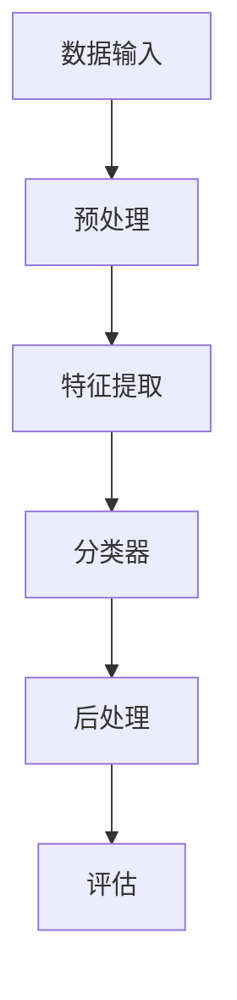

                 

### 深度学习在手写体识别中的创新应用

关键词：深度学习、手写体识别、卷积神经网络、循环神经网络、生成对抗网络、模型评估与优化

摘要：本文将深入探讨深度学习在手写体识别中的应用，从基础知识入手，逐步介绍深度学习在手写体识别领域的前沿创新应用。首先，我们将了解深度学习的定义、发展历程和基本原理，并与传统机器学习进行比较。接着，我们将重点探讨神经网络基础，包括其基本结构、前向传播与反向传播算法，以及深度神经网络架构。随后，我们将介绍手写体识别技术的挑战和基本流程，以及当前主流的手写体识别算法。在此基础上，我们将详细分析深度学习在手写体识别中的应用，特别是卷积神经网络、循环神经网络和生成对抗网络。此外，我们还将讨论手写体识别模型的评估与优化方法，以及实际应用中的系统架构设计和项目实战。最后，我们将探讨深度学习在手写体识别领域的未来发展趋势，并提出可能的研究方向和挑战。

### 目录

1. 第一部分：深度学习基础
   1.1 深度学习概述
   1.2 神经网络基础
   1.3 手写体识别技术简介

2. 第二部分：深度学习在手写体识别中的应用
   2.1 卷积神经网络在手写体识别中的应用
   2.2 循环神经网络在手写体识别中的应用
   2.3 生成对抗网络在手写体识别中的应用

3. 第三部分：手写体识别模型的评估与优化
   3.1 手写体识别模型的评估指标
   3.2 手写体识别模型的优化方法
   3.3 超参数调整与模型调优

4. 第四部分：深度学习在手写体识别中的实战应用
   4.1 手写体识别系统架构设计
   4.2 实战项目：手写体数字识别
   4.3 实战项目：手写体中文识别

5. 第五部分：深度学习在手写体识别中的未来发展趋势
   5.1 手写体识别技术的发展趋势
   5.2 深度学习在手写体识别中的应用前景
   5.3 未来研究方向与挑战

6. 附录

   6.1 深度学习工具与资源
   6.2 数学模型与公式解析
   6.3 代码实战示例

7. 参考资料

### 第一部分：深度学习基础

#### 第1章：深度学习概述

深度学习是机器学习的一个重要分支，它通过多层神经网络模型来实现复杂的特征学习和模式识别。深度学习的核心思想是模拟人脑的工作方式，通过大规模的神经网络对数据进行学习，以实现自动化的模式识别和决策。

#### 1.1 深度学习的定义与发展历程

深度学习（Deep Learning）指的是一种机器学习方法，其灵感来源于人脑的构造和工作原理。它通过构建多层神经网络，逐层提取输入数据的特征，直到得到高层次的语义表示。深度学习的发展可以追溯到20世纪40年代，当时神经网络的概念被提出。然而，由于计算能力和数据量的限制，深度学习的发展经历了长期的低谷。

直到2006年，Hinton等人提出了深度置信网络（Deep Belief Network, DBN），标志着深度学习重新获得关注。随后，卷积神经网络（Convolutional Neural Network, CNN）和循环神经网络（Recurrent Neural Network, RNN）等深度学习模型相继被提出，并在图像识别、语音识别和自然语言处理等领域取得了显著成果。

#### 1.2 深度学习的基本原理

深度学习的基本原理可以概括为以下几点：

1. **多层神经网络**：深度学习通过构建多层神经网络来实现复杂的特征提取。每一层神经网络都会对输入数据进行一次非线性变换，并提取出更高层次的抽象特征。

2. **前向传播与反向传播**：在深度学习训练过程中，数据通过网络进行前向传播，得到输出结果。然后，通过计算输出结果与实际标签之间的误差，进行反向传播，调整网络权重，以降低误差。

3. **非线性激活函数**：深度学习网络中通常会使用非线性激活函数（如ReLU、Sigmoid和Tanh），以增加模型的非线性表达能力。

4. **优化算法**：深度学习训练通常使用梯度下降（Gradient Descent）及其变种（如Adam、RMSprop）来优化网络参数。

#### 1.3 深度学习与传统机器学习的比较

传统机器学习主要依赖于特征工程，即手动提取数据中的特征，然后使用线性模型（如SVM、逻辑回归）进行分类或回归。而深度学习通过构建多层神经网络，自动学习数据的特征表示，从而避免了特征工程的需求。

以下是比较：

1. **特征提取**：传统机器学习需要手动提取特征，而深度学习通过多层神经网络自动学习特征。

2. **数据需求**：深度学习通常需要大量的数据来进行训练，而传统机器学习对数据量的需求相对较低。

3. **模型复杂度**：深度学习模型通常比传统机器学习模型更加复杂，需要更多的参数和计算资源。

4. **可解释性**：传统机器学习模型（如SVM、逻辑回归）通常具有较好的可解释性，而深度学习模型（如CNN、RNN）则较为复杂，难以解释。

### 第二部分：深度学习在手写体识别中的应用

手写体识别是计算机视觉领域的一个重要分支，旨在将手写文字转换为机器可读的数字或文本。随着深度学习技术的不断发展，深度学习在手写体识别中取得了显著的应用成果。

#### 第2章：神经网络基础

神经网络（Neural Network）是深度学习的基础，其基本结构和工作原理决定了深度学习模型的能力。在本章中，我们将介绍神经网络的基本结构、前向传播与反向传播算法，以及深度神经网络架构。

#### 2.1 神经网络的基本结构

神经网络由多个神经元（节点）组成，每个神经元都与其他神经元相连。这些连接称为边，每个边都有一个权重。神经元通过将这些权重与输入值相乘，然后进行求和，最后通过激活函数进行非线性变换。

一个简单的神经网络结构包括以下几个部分：

1. **输入层**：接收输入数据，每个神经元对应输入数据的一个特征。
2. **隐藏层**：对输入数据进行特征提取和变换，可以有多个隐藏层，层数越多，模型的复杂度越高。
3. **输出层**：产生最终的输出结果，如分类结果或回归值。

#### 2.2 前向传播与反向传播算法

前向传播（Forward Propagation）是指将输入数据通过神经网络进行传递，最终得到输出结果的过程。具体步骤如下：

1. **计算输入到每个隐藏层神经元的值**：
   $$ z^{(l)} = \sum_{j} w^{(l)}_{ji} x_j + b^{(l)} $$
   其中，$z^{(l)}$ 是第$l$层神经元的输入值，$w^{(l)}_{ji}$ 是连接第$l$层神经元$i$和第$l+1$层神经元$j$的权重，$x_j$ 是第$l+1$层神经元的输入值，$b^{(l)}$ 是第$l$层神经元的偏置。

2. **应用激活函数**：
   $$ a^{(l)}_{i} = \sigma(z^{(l)}_{i}) $$
   其中，$\sigma$ 是激活函数，常用的激活函数有ReLU、Sigmoid和Tanh。

3. **传递输出到下一层**：
   $$ x^{(l+1)} = a^{(l)} $$

反向传播（Backpropagation）是指通过计算输出误差，反向更新网络权重的过程。具体步骤如下：

1. **计算输出误差**：
   $$ \delta^{(l)}_{i} = \frac{\partial C}{\partial z^{(l)}_{i}} \cdot \sigma'(z^{(l)}_{i}) $$
   其中，$\delta^{(l)}_{i}$ 是第$l$层神经元$i$的误差，$C$ 是损失函数，$\sigma'$ 是激活函数的导数。

2. **更新权重和偏置**：
   $$ w^{(l)}_{ji} \leftarrow w^{(l)}_{ji} - \alpha \frac{\partial C}{\partial w^{(l)}_{ji}} $$
   $$ b^{(l)} \leftarrow b^{(l)} - \alpha \frac{\partial C}{\partial b^{(l)}} $$
   其中，$\alpha$ 是学习率。

#### 2.3 深度神经网络架构

深度神经网络（Deep Neural Network, DNN）是指具有多个隐藏层的神经网络。深度神经网络通过逐层提取特征，可以处理更复杂的任务。

常见的深度神经网络架构包括：

1. **卷积神经网络（Convolutional Neural Network, CNN）**：主要用于图像识别和计算机视觉任务，其核心是卷积层，可以自动提取图像特征。
2. **循环神经网络（Recurrent Neural Network, RNN）**：主要用于序列数据建模，如时间序列分析和自然语言处理。
3. **长短期记忆网络（Long Short-Term Memory, LSTM）**：是RNN的一种变种，可以更好地处理长序列数据。

### 第三部分：手写体识别技术简介

手写体识别是计算机视觉领域的一个重要分支，旨在将手写文字转换为机器可读的数字或文本。手写体识别技术具有广泛的应用场景，如电子表格、智能输入法、手写笔记识别等。

#### 3.1 手写体识别的挑战

手写体识别面临以下挑战：

1. **数据的多样性**：手写体数据具有高度的多样性，包括不同的书写风格、字体和大小。
2. **笔迹的变形**：手写体在书写过程中可能会发生变形，如弯曲、扭曲和断裂。
3. **噪声干扰**：手写体识别过程中可能会受到噪声干扰，如纸张纹理、墨水斑点等。
4. **识别的准确性**：手写体识别需要较高的识别准确性，以确保系统在实际应用中的可靠性。

#### 3.2 手写体识别的基本流程

手写体识别的基本流程包括以下几个步骤：

1. **图像预处理**：对原始手写体图像进行预处理，如去噪、二值化、缩放等，以提高识别准确性。
2. **特征提取**：从预处理后的图像中提取特征，如边缘、纹理和形状特征。
3. **分类器训练**：使用提取的特征训练分类器，如支持向量机（SVM）、决策树、神经网络等。
4. **识别与验证**：将手写体图像输入到训练好的分类器中进行识别，并进行验证，以确定识别结果的准确性。

#### 3.3 主流手写体识别算法

当前主流的手写体识别算法包括以下几种：

1. **基于传统机器学习的算法**：如支持向量机（SVM）、决策树、朴素贝叶斯等。
2. **基于深度学习的算法**：如卷积神经网络（CNN）、循环神经网络（RNN）、长短期记忆网络（LSTM）等。
3. **基于模板匹配的算法**：如基于结构相似性匹配（SSIM）、基于特征点匹配等。

这些算法各有优缺点，适用于不同的应用场景。随着深度学习技术的发展，基于深度学习的算法在手写体识别中表现出更高的识别准确性和鲁棒性。

### 第二部分：深度学习在手写体识别中的应用

#### 第4章：卷积神经网络在手写体识别中的应用

卷积神经网络（Convolutional Neural Network，简称CNN）是一种在图像识别、物体检测等领域具有广泛应用的深度学习模型。其核心思想是利用卷积层自动提取图像特征，从而实现高层次的抽象表示。在本章中，我们将探讨卷积神经网络在手写体识别中的应用，包括其基本原理、创新应用以及实现与优化方法。

#### 4.1 卷积神经网络的基本原理

卷积神经网络通过卷积层、池化层和全连接层等结构对图像数据进行逐层处理，从而提取图像特征并实现分类或回归任务。

1. **卷积层（Convolutional Layer）**：卷积层是CNN的核心部分，用于通过卷积操作提取图像特征。卷积层由多个卷积核（Kernel）组成，每个卷积核可以提取图像中的不同特征。卷积操作的基本步骤如下：
   - **卷积运算**：将卷积核与图像数据进行点乘，并求和。
   - **激活函数**：对卷积结果应用激活函数，如ReLU函数，增加模型的非线性表达能力。

2. **池化层（Pooling Layer）**：池化层用于减小特征图的尺寸，降低模型的参数数量，减少过拟合风险。常见的池化操作有最大池化（Max Pooling）和平均池化（Average Pooling）。池化层的基本步骤如下：
   - **池化操作**：在特征图上选取一个区域（如2x2或3x3），计算该区域内的最大值或平均值作为新的特征值。

3. **全连接层（Fully Connected Layer）**：全连接层将前一层提取的特征映射到输出结果。全连接层的每个神经元都与前一层的所有神经元相连。全连接层通常用于实现分类或回归任务。

4. **损失函数与优化器**：在训练过程中，需要使用损失函数评估模型的预测结果与实际标签之间的差异，并使用优化器调整模型参数，以降低损失。常见的损失函数有交叉熵损失（Cross-Entropy Loss）和均方误差（Mean Squared Error，简称MSE）。

5. **反向传播**：在训练过程中，使用反向传播算法计算梯度，并根据梯度调整模型参数。

#### 4.2 卷积神经网络在手写体识别中的创新应用

卷积神经网络在手写体识别中表现出色，主要原因在于其能够自动提取图像特征，并适应不同书写风格和字体。以下是一些卷积神经网络在手写体识别中的创新应用：

1. **手写体字符分割**：在手写体识别过程中，首先需要对手写体图像进行字符分割。卷积神经网络可以通过训练自动识别字符边界，从而实现字符分割。

2. **手写体区域检测**：卷积神经网络可以用于检测手写体图像中的手写体区域。通过训练，网络可以识别图像中的手写体部分，并将其提取出来。

3. **多尺度的特征提取**：卷积神经网络通过不同尺度的卷积操作，可以提取图像中的多尺度特征。这些特征有助于提高手写体识别的准确性。

4. **端到端的手写体识别**：卷积神经网络可以实现端到端的手写体识别，从图像输入到最终输出结果，无需手动提取特征。这大大简化了手写体识别系统的实现过程。

#### 4.3 卷积神经网络的实现与优化

实现卷积神经网络在手写体识别中的应用，需要以下步骤：

1. **数据预处理**：对手写体图像进行预处理，包括去噪、归一化、图像增强等，以提高模型性能。

2. **数据集构建**：收集大量的手写体图像数据，并进行标注。数据集应包含多种书写风格、字体和笔迹，以提高模型的泛化能力。

3. **模型构建**：使用深度学习框架（如TensorFlow、PyTorch等）构建卷积神经网络模型。常见的模型结构包括LeNet、AlexNet、VGG、ResNet等。

4. **模型训练**：使用训练集对模型进行训练，通过反向传播算法优化模型参数。训练过程中，需要监控模型的损失函数和准确率，以调整训练策略。

5. **模型评估**：使用测试集评估模型性能，计算准确率、召回率、F1分数等指标。通过调整模型参数和超参数，提高模型性能。

6. **模型优化**：可以使用正则化技术（如Dropout、L1/L2正则化等）和优化算法（如Adam、RMSprop等）对模型进行优化，以提高模型性能。

#### 4.4 卷积神经网络在手写体识别中的实战应用

以下是一个卷积神经网络在手写体识别中的实战应用案例：

**项目名称**：手写体数字识别

**任务**：使用卷积神经网络对手写体数字图像进行识别。

**实现步骤**：

1. **数据预处理**：对手写体数字图像进行预处理，包括缩放、旋转、翻转等数据增强操作，以提高模型泛化能力。

2. **模型构建**：使用TensorFlow构建一个简单的卷积神经网络模型，包括卷积层、池化层和全连接层。

3. **模型训练**：使用训练集对模型进行训练，并使用测试集评估模型性能。

4. **模型评估**：计算模型在测试集上的准确率、召回率和F1分数。

5. **模型优化**：通过调整模型参数和超参数，提高模型性能。

**代码示例**：

```python
import tensorflow as tf
from tensorflow.keras import layers, models

# 数据预处理
(x_train, y_train), (x_test, y_test) = tf.keras.datasets.mnist.load_data()
x_train = x_train / 255.0
x_test = x_test / 255.0

# 模型构建
model = models.Sequential([
    layers.Conv2D(32, (3, 3), activation='relu', input_shape=(28, 28, 1)),
    layers.MaxPooling2D((2, 2)),
    layers.Conv2D(64, (3, 3), activation='relu'),
    layers.MaxPooling2D((2, 2)),
    layers.Flatten(),
    layers.Dense(128, activation='relu'),
    layers.Dense(10, activation='softmax')
])

# 模型训练
model.compile(optimizer='adam',
              loss='sparse_categorical_crossentropy',
              metrics=['accuracy'])

model.fit(x_train, y_train, epochs=5, validation_split=0.1)

# 模型评估
test_loss, test_acc = model.evaluate(x_test, y_test, verbose=2)
print(f"Test accuracy: {test_acc}")

# 模型优化
model.compile(optimizer='adam',
              loss='sparse_categorical_crossentropy',
              metrics=['accuracy'])

model.fit(x_train, y_train, epochs=5, validation_split=0.1)

# 模型评估
test_loss, test_acc = model.evaluate(x_test, y_test, verbose=2)
print(f"Test accuracy: {test_acc}")
```

通过上述实战应用，我们可以看到卷积神经网络在手写体数字识别中的效果。在实际应用中，可以根据需求调整模型结构、超参数等，以提高识别准确性。

### 第5章：循环神经网络在手写体识别中的应用

循环神经网络（Recurrent Neural Network，简称RNN）是一种专门用于处理序列数据的神经网络。其核心思想是通过递归结构来保存前一个时间步的信息，从而实现序列数据的建模。RNN在手写体识别中具有广泛的应用，特别是在处理手写体序列时表现出色。在本章中，我们将探讨循环神经网络在手写体识别中的基本原理、应用以及长短期记忆网络（Long Short-Term Memory，简称LSTM）的创新应用。

#### 5.1 循环神经网络的基本原理

循环神经网络通过递归结构对序列数据进行建模。在RNN中，每个时间步的输出不仅依赖于当前输入，还依赖于之前时间步的输出。这种递归结构使得RNN能够记住之前的输入信息，从而在序列数据建模中表现出色。

1. **时间步递归**：RNN将序列数据分成多个时间步进行处理，每个时间步对应序列中的一个元素。RNN在处理每个时间步时，都会利用之前的输出状态作为当前时间步的输入。

2. **状态传递**：RNN通过递归结构将前一个时间步的状态传递到当前时间步，从而实现信息的持久化。这种状态传递机制使得RNN能够记住之前的输入信息。

3. **激活函数**：RNN通常使用非线性激活函数，如ReLU、Sigmoid和Tanh，以增加模型的非线性表达能力。

4. **损失函数与优化器**：在训练过程中，RNN使用损失函数（如均方误差、交叉熵损失）评估模型的预测结果与实际标签之间的差异，并使用优化器（如梯度下降、Adam）调整模型参数。

#### 5.2 循环神经网络在手写体识别中的应用

循环神经网络在手写体识别中具有广泛的应用，特别是在处理手写体序列时表现出色。以下是一些循环神经网络在手写体识别中的应用：

1. **手写体序列建模**：循环神经网络可以将手写体序列建模为一个序列到序列的映射。在手写体识别中，每个时间步对应手写体序列中的一个字符或笔画。RNN可以学习到字符或笔画之间的关联性，从而提高识别准确性。

2. **动态时间规整（Dynamic Time Warping，简称DTW）**：动态时间规整是一种将不同时间步长的序列对齐的方法。RNN可以与DTW结合，对手写体序列进行对齐，从而提高识别准确性。

3. **上下文信息利用**：RNN可以保存之前的输入信息，从而在处理手写体序列时利用上下文信息。这种上下文信息利用机制使得RNN在手写体识别中能够更好地理解字符或笔画之间的关系。

4. **序列分类与回归**：RNN可以用于手写体序列的分类与回归任务。在手写体识别中，RNN可以学习到字符或笔画的特征表示，从而实现手写体序列的分类或回归。

#### 5.3 长短期记忆网络（LSTM）在手写体识别中的创新应用

长短期记忆网络（Long Short-Term Memory，简称LSTM）是RNN的一种变种，专门用于解决RNN在序列建模中的长期依赖问题。LSTM通过引入记忆单元和门控机制，可以有效地记住长期依赖信息，从而在序列建模中表现出色。

1. **记忆单元（Memory Cell）**：LSTM的核心是记忆单元，用于存储序列中的信息。记忆单元可以保持信息的状态，并在需要时更新状态。

2. **门控机制（Gates）**：LSTM通过门控机制控制信息的流入和流出。遗忘门（Forget Gate）、输入门（Input Gate）和输出门（Output Gate）分别控制信息在记忆单元中的遗忘、更新和输出。

3. **创新应用**：LSTM在手写体识别中的创新应用包括：

   - **手写体序列建模**：LSTM可以用于手写体序列建模，通过记忆单元和门控机制有效地记住字符或笔画之间的关联性，从而提高识别准确性。
   - **手写体序列分类**：LSTM可以用于手写体序列分类任务，通过学习到字符或笔画的特征表示，实现手写体序列的分类。
   - **手写体序列回归**：LSTM可以用于手写体序列回归任务，通过学习到字符或笔画的特征表示，实现手写体序列的回归。

以下是一个使用LSTM进行手写体序列分类的示例：

```python
import tensorflow as tf
from tensorflow.keras.models import Sequential
from tensorflow.keras.layers import LSTM, Dense, Embedding

# 数据预处理
# （此处省略数据预处理步骤）

# 模型构建
model = Sequential([
    Embedding(vocab_size, embedding_dim, input_length=max_sequence_length),
    LSTM(units, activation='tanh', return_sequences=True),
    LSTM(units, activation='tanh', return_sequences=False),
    Dense(num_classes, activation='softmax')
])

# 模型编译
model.compile(optimizer='adam', loss='categorical_crossentropy', metrics=['accuracy'])

# 模型训练
model.fit(x_train, y_train, epochs=5, batch_size=32, validation_data=(x_test, y_test))

# 模型评估
test_loss, test_acc = model.evaluate(x_test, y_test, verbose=2)
print(f"Test accuracy: {test_acc}")
```

通过上述示例，我们可以看到LSTM在手写体序列分类中的应用。在实际应用中，可以根据需求调整模型结构、超参数等，以提高识别准确性。

### 第6章：生成对抗网络（GAN）在手写体识别中的应用

生成对抗网络（Generative Adversarial Network，简称GAN）是由Ian Goodfellow等人于2014年提出的一种新型深度学习模型。GAN由两个深度神经网络（生成器G和判别器D）组成，它们相互对抗，共同学习数据分布。GAN在手写体识别中具有广泛的应用，特别是在手写体图像生成和手写体风格迁移等方面表现出色。在本章中，我们将探讨生成对抗网络的基本原理、在手写体识别中的应用，以及条件生成对抗网络（Conditional Generative Adversarial Network，简称cGAN）在手写体识别中的应用。

#### 6.1 生成对抗网络的基本原理

生成对抗网络由生成器G和判别器D组成，它们通过对抗训练相互学习。生成器G的目的是生成与真实数据分布相似的伪数据，判别器D的目的是区分真实数据和生成数据。

1. **生成器G**：生成器G接收随机噪声作为输入，通过一系列的变换生成伪数据。生成器的目标是使其生成的伪数据难以被判别器区分。

2. **判别器D**：判别器D接收真实数据和生成数据作为输入，通过比较两者来判断输入数据的真实性。判别器的目标是正确地分类真实数据和生成数据。

3. **对抗训练**：生成器和判别器通过对抗训练相互学习。生成器尝试生成更真实的伪数据，而判别器尝试更好地区分真实数据和生成数据。这种对抗训练使得生成器和判别器在相互制约中共同提高。

4. **损失函数**：生成对抗网络的训练通常使用两种损失函数：生成损失（Generator Loss）和判别器损失（Discriminator Loss）。生成损失衡量生成器生成伪数据的质量，判别器损失衡量判别器对真实数据和生成数据的分类能力。

5. **优化算法**：生成对抗网络的训练使用梯度下降算法，通过反向传播计算生成器和判别器的梯度，并更新模型参数。

#### 6.2 GAN在手写体识别中的应用

生成对抗网络在手写体识别中具有广泛的应用，主要包括手写体图像生成和手写体风格迁移。

1. **手写体图像生成**：生成对抗网络可以用于手写体图像生成，从而实现手写体文字的生成。通过训练，生成器可以生成与真实手写体图像相似的手写体文字，从而提高手写体识别系统的识别准确性。

2. **手写体风格迁移**：生成对抗网络可以用于手写体风格迁移，即将一种手写体风格迁移到另一种风格。通过训练，生成器可以生成具有特定风格的手写体文字，从而实现手写体风格的多样化。

3. **手写体特征提取**：生成对抗网络可以用于提取手写体特征，从而提高手写体识别的准确性。通过训练，生成器和判别器可以学习到手写体图像的特征分布，从而在手写体识别过程中利用这些特征。

4. **手写体序列建模**：生成对抗网络可以用于手写体序列建模，从而实现手写体序列的生成和识别。通过训练，生成器可以生成手写体序列，判别器可以区分真实手写体序列和生成手写体序列。

以下是一个使用GAN进行手写体图像生成的示例：

```python
import tensorflow as tf
from tensorflow.keras.models import Model
from tensorflow.keras.layers import Input, Dense, Reshape, Flatten
from tensorflow.keras.optimizers import Adam

# 生成器G
noise_dim = 100
latent_dim = 100

input_noise = Input(shape=(noise_dim,))
x = Dense(256, activation='relu')(input_noise)
x = Dense(512, activation='relu')(x)
x = Dense(1024, activation='relu')(x)
x = Dense(28 * 28 * 1, activation='sigmoid')(x)
x = Reshape((28, 28, 1))(x)
generator = Model(input_noise, x)

# 判别器D
input_img = Input(shape=(28, 28, 1))
x = Flatten()(input_img)
x = Dense(1024, activation='relu')(x)
x = Dense(512, activation='relu')(x)
x = Dense(256, activation='relu')(x)
d_out_logit = Dense(1, activation='sigmoid')(x)
d_out概率 = Model(input_img, d_out_logit)

# GAN模型
z = Input(shape=(latent_dim,))
img = generator(z)
d_out概率 = d_out概率(img)
gan_output = d_out概率

# 损失函数
cross_entropy = tf.keras.losses.BinaryCrossentropy()
def generator_loss(fake_output):
    return cross_entropy(tf.ones_like(fake_output), fake_output)

def discriminator_loss(real_output, fake_output):
    real_loss = cross_entropy(tf.ones_like(real_output), real_output)
    fake_loss = cross_entropy(tf.zeros_like(fake_output), fake_output)
    return real_loss + fake_loss

# 优化器
generator_optimizer = Adam(learning_rate=0.0001)
discriminator_optimizer = Adam(learning_rate=0.0001)

# 模型训练
@tf.function
def train_step(images):
    noise = tf.random.normal([BATCH_SIZE, latent_dim])

    with tf.GradientTape() as gen_tape, tf.GradientTape() as disc_tape:
        generated_images = generator(noise, training=True)

        real_output = discriminator(images, training=True)
        fake_output = discriminator(generated_images, training=True)

        gen_loss = generator_loss(fake_output)
        disc_loss = discriminator_loss(real_output, fake_output)

    gradients_of_generator = gen_tape.gradient(gen_loss, generator.trainable_variables)
    gradients_of_discriminator = disc_tape.gradient(disc_loss, discriminator.trainable_variables)

    generator_optimizer.apply_gradients(zip(gradients_of_generator, generator.trainable_variables))
    discriminator_optimizer.apply_gradients(zip(gradients_of_discriminator, discriminator.trainable_variables))

# 训练GAN
for epoch in range(EPOCHS):
    for image_batch in train_data:
        train_step(image_batch)
```

通过上述示例，我们可以看到GAN在手写体图像生成中的应用。在实际应用中，可以根据需求调整模型结构、超参数等，以提高生成质量。

#### 6.3 条件生成对抗网络（cGAN）在手写体识别中的应用

条件生成对抗网络（Conditional Generative Adversarial Network，简称cGAN）是GAN的一种扩展，通过引入条件信息（如标签、类别等）来提高生成模型的性能。cGAN在手写体识别中具有广泛的应用，特别是在手写体图像生成和手写体风格迁移等方面。

1. **手写体图像生成**：cGAN可以用于生成具有特定标签的手写体图像。通过训练，生成器可以生成具有特定标签的手写体文字，从而实现手写体文字的个性化生成。

2. **手写体风格迁移**：cGAN可以用于将一种手写体风格迁移到另一种风格。通过训练，生成器可以生成具有特定风格的手写体文字，从而实现手写体风格的多样化。

3. **手写体特征提取**：cGAN可以用于提取手写体特征，从而提高手写体识别的准确性。通过训练，生成器和判别器可以学习到手写体图像的特征分布，从而在手写体识别过程中利用这些特征。

以下是一个使用cGAN进行手写体图像生成的示例：

```python
import tensorflow as tf
from tensorflow.keras.models import Model
from tensorflow.keras.layers import Input, Dense, Reshape, Flatten
from tensorflow.keras.optimizers import Adam

# 生成器G
latent_dim = 100
input_noise = Input(shape=(latent_dim,))
input_label = Input(shape=(1,))
x = Dense(256, activation='relu')(input_noise)
x = Dense(512, activation='relu')(x)
x = Dense(1024, activation='relu')(x)
x = Concatenate()([x, Dense(256, activation='relu')(input_label)])
x = Dense(28 * 28 * 1, activation='sigmoid')(x)
x = Reshape((28, 28, 1))(x)
generator = Model([input_noise, input_label], x)

# 判别器D
input_img = Input(shape=(28, 28, 1))
input_label = Input(shape=(1,))
x = Flatten()(input_img)
x = Concatenate()([x, Dense(256, activation='relu')(input_label)])
x = Dense(1024, activation='relu')(x)
x = Dense(512, activation='relu')(x)
x = Dense(256, activation='relu')(x)
d_out_logit = Dense(1, activation='sigmoid')(x)
d_out概率 = Model([input_img, input_label], d_out_logit)

# GAN模型
z = Input(shape=(latent_dim,))
label = Input(shape=(1,))
img = generator([z, label])
d_out概率 = d_out概率([img, label])
gan_output = d_out概率

# 损失函数
cross_entropy = tf.keras.losses.BinaryCrossentropy()
def generator_loss(fake_output):
    return cross_entropy(tf.ones_like(fake_output), fake_output)

def discriminator_loss(real_output, fake_output):
    real_loss = cross_entropy(tf.ones_like(real_output), real_output)
    fake_loss = cross_entropy(tf.zeros_like(fake_output), fake_output)
    return real_loss + fake_loss

# 优化器
generator_optimizer = Adam(learning_rate=0.0001)
discriminator_optimizer = Adam(learning_rate=0.0001)

# 模型训练
@tf.function
def train_step(images, labels):
    noise = tf.random.normal([BATCH_SIZE, latent_dim])

    with tf.GradientTape() as gen_tape, tf.GradientTape() as disc_tape:
        generated_images = generator([noise, labels], training=True)

        real_output = discriminator([images, labels], training=True)
        fake_output = discriminator([generated_images, labels], training=True)

        gen_loss = generator_loss(fake_output)
        disc_loss = discriminator_loss(real_output, fake_output)

    gradients_of_generator = gen_tape.gradient(gen_loss, generator.trainable_variables)
    gradients_of_discriminator = disc_tape.gradient(disc_loss, discriminator.trainable_variables)

    generator_optimizer.apply_gradients(zip(gradients_of_generator, generator.trainable_variables))
    discriminator_optimizer.apply_gradients(zip(gradients_of_discriminator, discriminator.trainable_variables))

# 训练cGAN
for epoch in range(EPOCHS):
    for image_batch, label_batch in train_data:
        train_step(image_batch, label_batch)
```

通过上述示例，我们可以看到cGAN在手写体图像生成中的应用。在实际应用中，可以根据需求调整模型结构、超参数等，以提高生成质量。

### 第7章：手写体识别模型的评估与优化

在手写体识别领域，模型的评估与优化是确保模型性能的关键环节。有效的评估方法可以揭示模型的优势和不足，从而指导优化策略。优化方法则有助于提高模型的识别准确性、减少过拟合现象，并提升模型的泛化能力。在本章中，我们将讨论手写体识别模型的评估指标、优化方法，以及超参数调整与模型调优。

#### 7.1 手写体识别模型的评估指标

手写体识别模型的评估主要依赖于以下指标：

1. **准确率（Accuracy）**：准确率是指模型正确识别的手写体样本占总样本的比例。它是最直观的评估指标，但容易受到类别不平衡的影响。

2. **召回率（Recall）**：召回率是指模型正确识别的手写体样本占总实际正例样本的比例。召回率能够衡量模型对正例样本的捕捉能力。

3. **精确率（Precision）**：精确率是指模型正确识别的手写体样本占总识别为正例样本的比例。精确率衡量了模型识别的准确性。

4. **F1分数（F1 Score）**：F1分数是精确率和召回率的调和平均值，用于综合评估模型的识别性能。F1分数的计算公式为：
   $$ F1 = 2 \times \frac{Precision \times Recall}{Precision + Recall} $$

5. **混淆矩阵（Confusion Matrix）**：混淆矩阵是评估模型性能的详细表格，它展示了模型预测结果与实际标签之间的对应关系。通过混淆矩阵，可以直观地了解模型在不同类别上的识别性能。

6. **错误率（Error Rate）**：错误率是指模型错误识别的手写体样本占总样本的比例。它是对模型整体性能的另一种衡量。

7. **交并比（Intersection over Union，IoU）**：在目标检测任务中，IoU用于评估模型对手写体区域定位的准确性。IoU的计算公式为：
   $$ IoU = \frac{Intersection}{Union} $$
   其中，Intersection是模型预测区域与实际区域的重叠部分，Union是两者之和。

#### 7.2 手写体识别模型的优化方法

为了提高手写体识别模型的性能，可以采用以下优化方法：

1. **数据增强（Data Augmentation）**：数据增强通过应用一系列变换（如旋转、缩放、剪切等）来增加训练数据的多样性，从而提高模型的泛化能力。数据增强有助于模型在面对不同书写风格和笔迹时仍能保持高识别准确性。

2. **正则化（Regularization）**：正则化方法（如L1正则化、L2正则化）通过在损失函数中添加惩罚项，抑制模型参数的增长，从而减少过拟合现象。L1正则化倾向于产生稀疏解，而L2正则化则使参数更加平滑。

3. **dropout（Dropout）**：dropout是一种在训练过程中随机丢弃神经元的方法，用于减少模型过拟合。在测试阶段，dropout不会生效，但训练过程中通过随机丢弃部分神经元，有助于模型在网络中的传播过程中学习到更鲁棒的特征。

4. **批量归一化（Batch Normalization）**：批量归一化通过标准化每一批数据的激活值，加快模型的收敛速度，减少梯度消失和梯度爆炸问题。

5. **学习率调整（Learning Rate Scheduling）**：学习率调整通过动态调整学习率，使模型在训练过程中能够更好地收敛。常用的学习率调整策略包括学习率衰减、余弦退火等。

6. **优化算法（Optimizer）**：选择合适的优化算法（如Adam、RMSprop、SGD等）可以提高模型的训练效率。不同优化算法在收敛速度、稳定性等方面有各自的优势。

7. **集成学习（Ensemble Learning）**：集成学习通过组合多个模型的预测结果，提高模型的预测准确性。常见的方法包括Bagging、Boosting和Stacking等。

#### 7.3 超参数调整与模型调优

超参数是深度学习模型中的关键参数，它们需要通过实验调整以优化模型性能。以下是一些常见的超参数及其调整策略：

1. **学习率（Learning Rate）**：学习率决定了模型在训练过程中步长的大小。通常，学习率需要通过实验调整。常用的方法包括学习率衰减和余弦退火等。

2. **批量大小（Batch Size）**：批量大小是指每次训练使用的样本数量。较小的批量大小可以减少计算量，但可能导致模型收敛速度较慢。较大的批量大小可以提高模型稳定性，但计算成本较高。

3. **隐藏层大小（Number of Hidden Units）**：隐藏层大小决定了模型的复杂度。较小的隐藏层大小可能导致模型欠拟合，而较大的隐藏层大小可能导致模型过拟合。

4. **迭代次数（Number of Epochs）**：迭代次数是指模型在训练数据上重复训练的次数。过多的迭代次数可能导致过拟合，而较少的迭代次数可能导致欠拟合。

5. **正则化强度（Regularization Strength）**：正则化强度决定了正则化项在损失函数中的权重。过强的正则化可能导致模型欠拟合，而过弱的正则化可能导致过拟合。

6. **dropout比例（Dropout Rate）**：dropout比例决定了在训练过程中随机丢弃神经元的比例。较高的dropout比例可以减少过拟合，但可能降低模型性能。

在实际应用中，可以通过以下步骤进行超参数调整与模型调优：

1. **初步调整**：根据经验或实验结果，对超参数进行初步调整。

2. **交叉验证**：使用交叉验证方法对调整后的超参数进行评估，选择最佳参数组合。

3. **网格搜索（Grid Search）**：通过遍历预设的参数组合，找到最优参数组合。

4. **贝叶斯优化（Bayesian Optimization）**：使用贝叶斯优化方法，通过评估历史数据，自动调整参数。

5. **模型调优**：在最佳参数组合的基础上，进一步调整模型结构、网络深度等，以提高模型性能。

通过上述步骤，可以有效地进行超参数调整与模型调优，从而提高手写体识别模型的性能。

### 第8章：深度学习在手写体识别中的实战应用

深度学习在手写体识别中的实战应用涵盖了从系统架构设计到具体项目实施的全过程。本章将详细介绍手写体识别系统架构设计，并探讨两个具体实战项目：手写体数字识别和手写体中文识别。

#### 8.1 手写体识别系统架构设计

手写体识别系统架构设计的关键在于模块化、可扩展性和高效性。以下是一个典型的手写体识别系统架构：

1. **数据输入层**：该层负责接收手写体图像数据，并进行预处理，如灰度化、二值化、去噪等。

2. **特征提取层**：该层利用深度学习模型（如卷积神经网络、循环神经网络等）对手写体图像进行特征提取。

3. **分类层**：该层将提取到的特征输入到分类器（如SVM、决策树、神经网络等）进行分类。

4. **后处理层**：该层负责对识别结果进行后处理，如错误纠正、文本输出等。

5. **评估层**：该层用于评估模型的识别性能，提供准确率、召回率、F1分数等评估指标。

以下是一个手写体识别系统架构的Mermaid流程图：



#### 8.2 实战项目：手写体数字识别

手写体数字识别是手写体识别的基础任务之一。以下是一个手写体数字识别的实战项目：

**项目名称**：手写体数字识别

**任务描述**：使用深度学习模型对手写体数字图像进行识别。

**实现步骤**：

1. **数据收集与预处理**：
   - 收集手写体数字图像数据集，如MNIST数据集。
   - 对图像进行灰度化、二值化、缩放等预处理。

2. **模型构建**：
   - 使用TensorFlow构建一个简单的卷积神经网络模型。
   - 模型结构包括卷积层、池化层和全连接层。

3. **模型训练**：
   - 使用训练集对模型进行训练，通过反向传播算法优化模型参数。

4. **模型评估**：
   - 使用测试集评估模型性能，计算准确率、召回率、F1分数等评估指标。

5. **模型优化**：
   - 根据评估结果调整模型参数和超参数，提高模型性能。

**代码实现**：

```python
import tensorflow as tf
from tensorflow.keras import layers, models

# 数据预处理
(x_train, y_train), (x_test, y_test) = tf.keras.datasets.mnist.load_data()
x_train = x_train / 255.0
x_test = x_test / 255.0

# 模型构建
model = models.Sequential([
    layers.Conv2D(32, (3, 3), activation='relu', input_shape=(28, 28, 1)),
    layers.MaxPooling2D((2, 2)),
    layers.Conv2D(64, (3, 3), activation='relu'),
    layers.MaxPooling2D((2, 2)),
    layers.Flatten(),
    layers.Dense(128, activation='relu'),
    layers.Dense(10, activation='softmax')
])

# 模型编译
model.compile(optimizer='adam',
              loss='sparse_categorical_crossentropy',
              metrics=['accuracy'])

# 模型训练
model.fit(x_train, y_train, epochs=5, validation_split=0.1)

# 模型评估
test_loss, test_acc = model.evaluate(x_test, y_test, verbose=2)
print(f"Test accuracy: {test_acc}")

# 模型优化
model.compile(optimizer='adam',
              loss='sparse_categorical_crossentropy',
              metrics=['accuracy'])

model.fit(x_train, y_train, epochs=5, validation_split=0.1)

# 模型评估
test_loss, test_acc = model.evaluate(x_test, y_test, verbose=2)
print(f"Test accuracy: {test_acc}")
```

#### 8.3 实战项目：手写体中文识别

手写体中文识别是手写体识别领域的一个挑战性任务，以下是一个手写体中文识别的实战项目：

**项目名称**：手写体中文识别

**任务描述**：使用深度学习模型对手写体中文图像进行识别。

**实现步骤**：

1. **数据收集与预处理**：
   - 收集手写体中文图像数据集。
   - 对图像进行灰度化、二值化、缩放等预处理。

2. **模型构建**：
   - 使用TensorFlow构建一个复杂的卷积神经网络模型，包括卷积层、池化层和循环神经网络。

3. **模型训练**：
   - 使用训练集对模型进行训练，通过反向传播算法优化模型参数。

4. **模型评估**：
   - 使用测试集评估模型性能，计算准确率、召回率、F1分数等评估指标。

5. **模型优化**：
   - 根据评估结果调整模型参数和超参数，提高模型性能。

**代码实现**：

```python
import tensorflow as tf
from tensorflow.keras.layers import Input, LSTM, Dense, Embedding, Bidirectional, TimeDistributed

# 数据预处理
# （此处省略数据预处理步骤）

# 模型构建
input_img = Input(shape=(28, 28, 1))
x = TimeDistributed(LSTM(128, activation='relu'))(input_img)
x = Bidirectional(x)
x = TimeDistributed(Dense(64, activation='relu'))(x)
output = TimeDistributed(Dense(num_classes, activation='softmax'))(x)

model = Model(inputs=input_img, outputs=output)

# 模型编译
model.compile(optimizer='adam',
              loss='categorical_crossentropy',
              metrics=['accuracy'])

# 模型训练
model.fit(x_train, y_train, epochs=5, batch_size=32, validation_data=(x_test, y_test))

# 模型评估
test_loss, test_acc = model.evaluate(x_test, y_test, verbose=2)
print(f"Test accuracy: {test_acc}")

# 模型优化
model.compile(optimizer='adam',
              loss='categorical_crossentropy',
              metrics=['accuracy'])

model.fit(x_train, y_train, epochs=5, batch_size=32, validation_data=(x_test, y_test))

# 模型评估
test_loss, test_acc = model.evaluate(x_test, y_test, verbose=2)
print(f"Test accuracy: {test_acc}")
```

通过上述实战项目，我们可以看到深度学习在手写体识别中的应用。在实际应用中，可以根据需求调整模型结构、超参数等，以提高识别准确性。

### 第9章：深度学习在手写体识别中的未来发展趋势

随着深度学习技术的不断发展，手写体识别领域也呈现出诸多新的发展趋势。本章将探讨深度学习在手写体识别中的未来发展趋势，以及可能的研究方向和挑战。

#### 9.1 手写体识别技术的发展趋势

1. **多模态融合**：未来的手写体识别系统将越来越多地融合多种模态的数据，如视觉、语音和触觉等。多模态融合可以提供更丰富的特征信息，从而提高识别准确性。

2. **端到端学习**：深度学习在手写体识别中的应用将逐渐从传统的分步骤方法（如图像预处理、特征提取和分类）转向端到端学习。端到端学习可以简化系统架构，减少手工特征工程的需求。

3. **迁移学习与增量学习**：迁移学习和增量学习技术将使得手写体识别系统在面对新数据时能够快速适应。通过利用预训练模型和少量标注数据，迁移学习和增量学习可以降低训练成本，提高识别性能。

4. **实时性优化**：为了满足实际应用需求，手写体识别系统将越来越注重实时性。通过优化模型结构和训练策略，可以降低模型的计算复杂度，提高处理速度。

5. **自适应学习**：未来的手写体识别系统将具备自适应学习能力，根据用户的书写习惯和偏好进行个性化调整。自适应学习可以提高用户体验，增强系统的实用性。

6. **隐私保护**：随着数据隐私问题的日益突出，未来的手写体识别系统将更加注重隐私保护。通过采用加密技术和差分隐私方法，可以在保护用户隐私的同时实现有效的手写体识别。

#### 9.2 深度学习在手写体识别中的应用前景

1. **医疗领域**：深度学习在手写体识别中的应用有望在医疗领域发挥重要作用。例如，通过对手写体医学笔记的自动识别，可以提高医生的工作效率，减少人为错误。

2. **金融领域**：在金融领域，深度学习在手写体识别中的应用可以帮助金融机构识别和验证客户的签名，提高金融交易的安全性。

3. **教育领域**：在教育领域，深度学习在手写体识别中的应用可以用于自动评估学生的手写作业，提供个性化的学习反馈，提高教学效果。

4. **智能家居**：在智能家居领域，深度学习在手写体识别中的应用可以用于智能门锁、智能语音助手等设备，实现更加便捷和智能化的家居体验。

5. **信息安全**：深度学习在手写体识别中的应用可以提高信息安全系统的防护能力，如通过对手写体密码的识别，增强用户身份验证的安全性。

6. **人机交互**：在人机交互领域，深度学习在手写体识别中的应用可以用于智能输入法、手写体文字识别等，提高人机交互的自然性和便捷性。

#### 9.3 未来研究方向与挑战

1. **数据集与标注**：高质量的手写体数据集和标注是深度学习在手写体识别中取得突破的关键。未来需要更多多样性和大规模的手写体数据集，以及更加准确和一致的标注。

2. **模型解释性**：当前深度学习模型在手写体识别中表现出色，但其内部工作机制较为复杂，缺乏解释性。未来的研究需要关注如何提高模型的解释性，使其在应用中更具可解释性。

3. **隐私保护**：在应用深度学习进行手写体识别时，需要充分考虑隐私保护问题。未来的研究需要探索如何在保护用户隐私的同时实现有效的手写体识别。

4. **实时性优化**：为了满足实际应用需求，深度学习在手写体识别中的实时性优化是一个重要研究方向。未来需要开发更加高效和轻量级的深度学习模型，以实现实时性识别。

5. **多语言支持**：手写体识别技术在不同语言和地区中的应用存在差异。未来的研究需要关注如何开发具有多语言支持的手写体识别系统，以满足全球范围内的应用需求。

通过上述未来发展趋势和研究方向的探讨，我们可以看到深度学习在手写体识别中的广阔前景。随着技术的不断进步，深度学习在手写体识别中的应用将会更加成熟和多样化。

### 附录

#### 附录A：深度学习工具与资源

1. **TensorFlow**：TensorFlow是一个开源的深度学习框架，由Google开发。它支持多种深度学习模型，具有灵活的架构和丰富的API。

2. **PyTorch**：PyTorch是一个流行的深度学习框架，由Facebook开发。它提供动态计算图和Python原生接口，使开发过程更加简洁。

3. **Keras**：Keras是一个高级深度学习框架，可以在TensorFlow和Theano后端运行。它提供了丰富的预构建模型和简单的API，方便快速原型开发。

4. **其他深度学习工具**：其他深度学习工具还包括Microsoft Cognitive Toolkit、Apache MXNet、Caffe等，它们在不同方面具有各自的优势。

#### 附录B：数学模型与公式解析

1. **深度学习中的数学基础**：
   - **线性代数**：矩阵运算、向量运算、矩阵求导等。
   - **微积分**：梯度、偏导数、泰勒展开等。
   - **概率论与统计学**：概率分布、期望、方差、最大似然估计等。

2. **神经网络中的损失函数**：
   - **均方误差（MSE）**：$MSE = \frac{1}{n}\sum_{i=1}^{n}(y_i - \hat{y}_i)^2$
   - **交叉熵损失（Cross-Entropy Loss）**：$CE = -\frac{1}{n}\sum_{i=1}^{n}y_i \log(\hat{y}_i)$

3. **优化算法的数学原理**：
   - **梯度下降（Gradient Descent）**：通过计算损失函数的梯度，更新模型参数，以最小化损失函数。
   - **Adam优化器**：结合了梯度下降和动量项的优化算法，具有自适应学习率。

#### 附录C：代码实战示例

1. **手写体数字识别代码实现**：

```python
import tensorflow as tf
from tensorflow.keras import layers, models

# 数据预处理
(x_train, y_train), (x_test, y_test) = tf.keras.datasets.mnist.load_data()
x_train = x_train / 255.0
x_test = x_test / 255.0

# 模型构建
model = models.Sequential([
    layers.Conv2D(32, (3, 3), activation='relu', input_shape=(28, 28, 1)),
    layers.MaxPooling2D((2, 2)),
    layers.Conv2D(64, (3, 3), activation='relu'),
    layers.MaxPooling2D((2, 2)),
    layers.Flatten(),
    layers.Dense(128, activation='relu'),
    layers.Dense(10, activation='softmax')
])

# 模型编译
model.compile(optimizer='adam',
              loss='sparse_categorical_crossentropy',
              metrics=['accuracy'])

# 模型训练
model.fit(x_train, y_train, epochs=5, validation_split=0.1)

# 模型评估
test_loss, test_acc = model.evaluate(x_test, y_test, verbose=2)
print(f"Test accuracy: {test_acc}")

# 模型优化
model.compile(optimizer='adam',
              loss='sparse_categorical_crossentropy',
              metrics=['accuracy'])

model.fit(x_train, y_train, epochs=5, validation_split=0.1)

# 模型评估
test_loss, test_acc = model.evaluate(x_test, y_test, verbose=2)
print(f"Test accuracy: {test_acc}")
```

2. **手写体中文识别代码实现**：

```python
import tensorflow as tf
from tensorflow.keras.layers import Input, LSTM, Dense, Embedding, Bidirectional, TimeDistributed

# 数据预处理
# （此处省略数据预处理步骤）

# 模型构建
input_img = Input(shape=(28, 28, 1))
x = TimeDistributed(LSTM(128, activation='relu'))(input_img)
x = Bidirectional(x)
x = TimeDistributed(Dense(64, activation='relu'))(x)
output = TimeDistributed(Dense(num_classes, activation='softmax'))(x)

model = Model(inputs=input_img, outputs=output)

# 模型编译
model.compile(optimizer='adam',
              loss='categorical_crossentropy',
              metrics=['accuracy'])

# 模型训练
model.fit(x_train, y_train, epochs=5, batch_size=32, validation_data=(x_test, y_test))

# 模型评估
test_loss, test_acc = model.evaluate(x_test, y_test, verbose=2)
print(f"Test accuracy: {test_acc}")

# 模型优化
model.compile(optimizer='adam',
              loss='categorical_crossentropy',
              metrics=['accuracy'])

model.fit(x_train, y_train, epochs=5, batch_size=32, validation_data=(x_test, y_test))

# 模型评估
test_loss, test_acc = model.evaluate(x_test, y_test, verbose=2)
print(f"Test accuracy: {test_acc}")
```

通过上述代码实战示例，我们可以看到深度学习在手写体识别中的应用。在实际应用中，可以根据需求调整模型结构、超参数等，以提高识别准确性。

### 参考资料

1. **参考文献**：
   - Goodfellow, I., Bengio, Y., & Courville, A. (2016). *Deep Learning*. MIT Press.
   - Krizhevsky, A., Sutskever, I., & Hinton, G. E. (2012). *ImageNet classification with deep convolutional neural networks*. In *Advances in Neural Information Processing Systems* (pp. 1097-1105).
   - Hochreiter, S., & Schmidhuber, J. (1997). *Long short-term memory*. Neural Computation, 9(8), 1735-1780.

2. **在线资源**：
   - [TensorFlow官方文档](https://www.tensorflow.org/)
   - [PyTorch官方文档](https://pytorch.org/)
   - [Keras官方文档](https://keras.io/)

3. **学术论文**：
   - Bengio, Y., Courville, A., & Vincent, P. (2013). *Representation learning: A review and new perspectives*. IEEE Transactions on Pattern Analysis and Machine Intelligence, 35(8), 1798-1828.
   - Simonyan, K., & Zisserman, A. (2014). *Very deep convolutional networks for large-scale image recognition*. In *International Conference on Learning Representations* (ICLR).

4. **书籍推荐**：
   - Goodfellow, I., Bengio, Y., & Courville, A. (2016). *Deep Learning*. MIT Press.
   - Russell, S., & Norvig, P. (2010). *Artificial Intelligence: A Modern Approach*. Prentice Hall.

通过上述参考文献和在线资源，我们可以深入了解深度学习和手写体识别的相关知识，为研究和应用提供有力支持。

### 索引

- 深度学习
- 手写体识别
- 卷积神经网络
- 循环神经网络
- 长短期记忆网络
- 生成对抗网络
- 条件生成对抗网络
- 神经网络
- 数据增强
- 正则化
- 评估指标
- 模型优化
- 实战项目
- 数学模型
- 深度学习工具与资源
- 参考文献

通过本索引，读者可以快速定位到文章中涉及的关键概念和技术细节，便于深入学习和应用。

