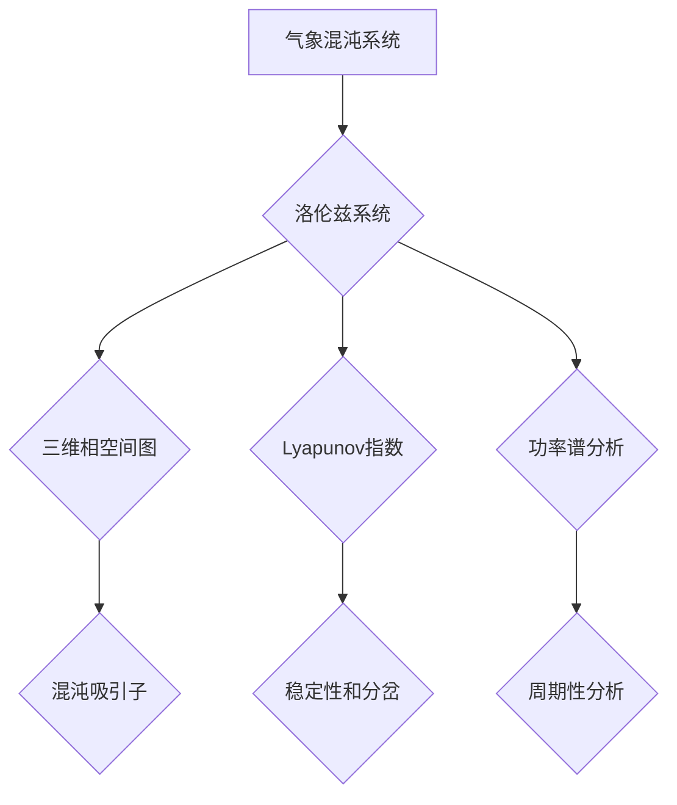
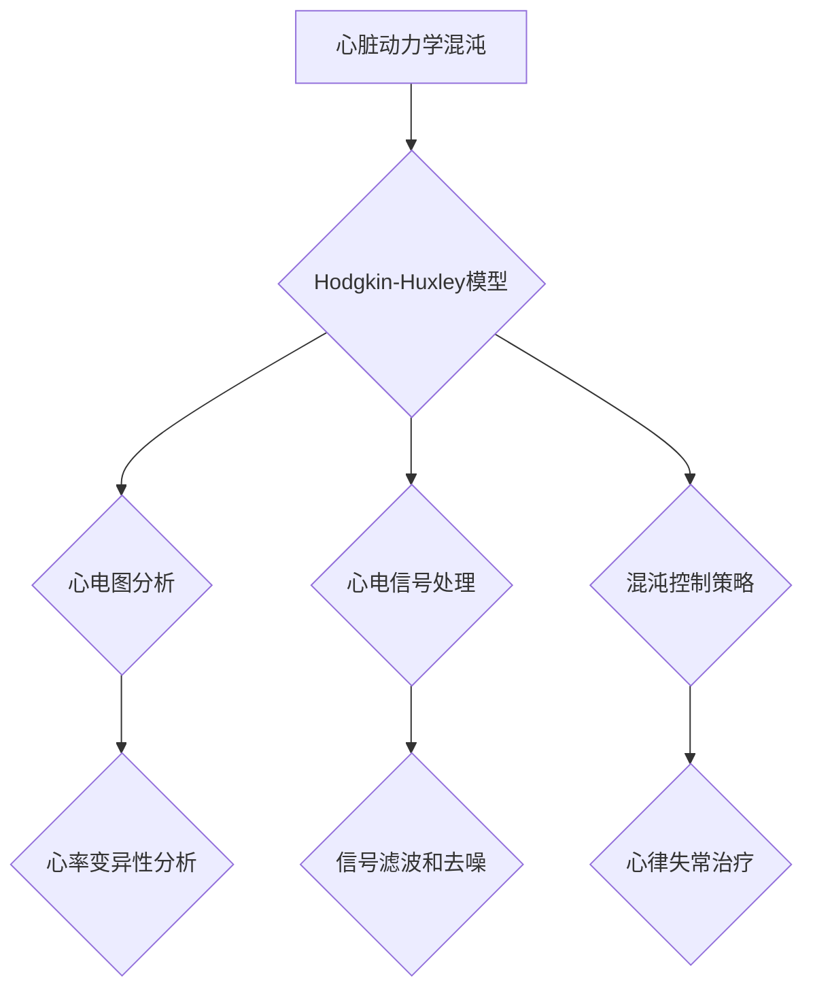
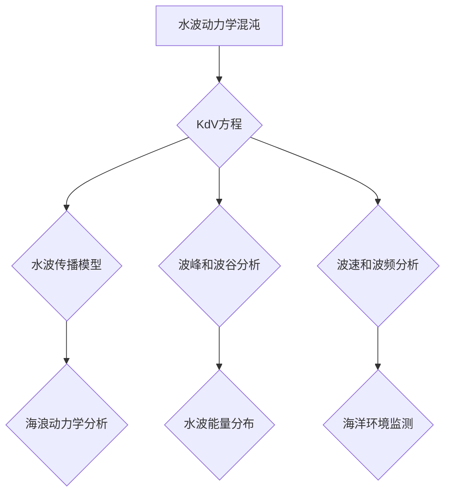

                 

# 混沌理论：自然复杂性的数学描述

> **关键词**：混沌理论、非线性动力学、复杂系统、数学工具、应用实例、人工智能

> **摘要**：本文将深入探讨混沌理论，一个描述自然界中复杂现象的数学框架。我们将从基础理论出发，逐步引入数学工具，详细阐述混沌现象的实例和应用，并探讨混沌理论与现代科学的交叉领域。通过本文，读者将了解混沌理论的核心概念、数学描述、应用实例，以及其在复杂性科学、人工智能等领域的应用前景。

### 《混沌理论：自然复杂性的数学描述》目录大纲

1. 第一部分：混沌理论基础
    1.1 混沌理论概述
        1.1.1 混沌理论的起源和发展
        1.1.2 混沌理论的定义和特性
        1.1.3 混沌理论与非线性动力学的联系
    1.2 离散时间动力系统
        1.2.1 动力系统的基本概念
        1.2.2 离散时间动力系统的稳定性分析
        1.2.3 离散时间动力系统的相空间和轨道
    1.3 连续时间动力系统
        1.3.1 连续时间动力系统的数学模型
        1.3.2 流形和流形上的动力系统
        1.3.3 连续动力系统的稳定性和分岔

2. 第二部分：混沌理论的数学工具
    2.1 线性代数工具
        2.1.1 矩阵和行列式
        2.1.2 线性变换和特征值
        2.1.3 矩阵方程和线性系统
    2.2 微积分工具
        2.2.1 微分方程的基本概念
        2.2.2 解析解与数值解
        2.2.3 导数与微分方程的应用
    2.3 动力学系统分析工具
        2.3.1 离散时间系统的稳定性分析
        2.3.2 连续时间系统的稳定性分析
        2.3.3 动力系统的相图和分岔图

3. 第三部分：混沌现象的实例与应用
    3.1 天然混沌现象
        3.1.1 气象系统的混沌
        3.1.2 心脏动力学和混沌
        3.1.3 水波动力学和混沌
    3.2 人造混沌现象
        3.2.1 混沌生成器
        3.2.2 混沌通信
        3.2.3 混沌加密
    3.3 混沌在工程中的应用
        3.3.1 混沌控制
        3.3.2 混沌同步
        3.3.3 混沌优化算法

4. 第四部分：混沌理论与现代科学
    4.1 混沌与复杂性科学
        4.1.1 复杂系统的定义和特征
        4.1.2 复杂性与混沌的联系
        4.1.3 复杂系统的分析方法
    4.2 混沌与非线性科学
        4.2.1 非线性动力学的基本原理
        4.2.2 非线性系统的行为特征
        4.2.3 非线性科学的发展趋势
    4.3 混沌与人工智能
        4.3.1 混沌在机器学习中的应用
        4.3.2 混沌生成器在深度学习中的应用
        4.3.3 混沌优化算法在人工智能中的应用

5. 附录
    5.1 混沌理论相关资源
        5.1.1 推荐书籍
        5.1.2 研究论文
        5.1.3 混沌理论在线课程
    5.2 混沌现象的 Mermaid 流程图
        5.2.1 气象混沌系统
        5.2.2 心脏动力学混沌
        5.2.3 水波动力学混沌
    5.3 混沌算法伪代码
        5.3.1 混沌生成器的伪代码
        5.3.2 混沌同步的伪代码
        5.3.3 混沌优化算法的伪代码

---

### 第一部分：混沌理论基础

混沌理论是一门探索复杂动态系统行为的数学科学。它揭示了在简单系统中可能出现的复杂和不可预测的行为。在这个部分，我们将从混沌理论的基础概念入手，逐步深入探讨离散和连续时间动力系统，为后续的数学工具和应用实例分析奠定基础。

#### 1.1 混沌理论概述

混沌理论起源于20世纪中叶，最早由美国气象学家洛伦兹在研究气象模型时发现。混沌现象的一个重要特征是“蝴蝶效应”：一个微小的初始条件差异可能导致长时间后系统行为的巨大差异，这种现象在混沌系统中普遍存在。

**1.1.1 混沌理论的起源和发展**

混沌理论的起源可以追溯到1972年，洛伦兹在研究大气流动模型时发现了混沌现象，他提出了一组简单的非线性差分方程，即洛伦兹系统，展示了混沌的特性。此后，混沌理论逐渐发展，涉及领域从气象学扩展到生物学、物理学、工程学等。

**1.1.2 混沌理论的定义和特性**

混沌理论的定义是一个动态系统在一定条件下，其长期行为呈现出不可预测性，尽管其初始条件非常接近，系统的最终状态却可能大相径庭。混沌具有以下特性：

- **确定性**：混沌系统遵循确定的数学规则，但行为表现出随机性。
- **敏感依赖初始条件**：系统对初始条件极其敏感，微小差异可能导致长期行为的显著差异。
- **长期行为的不可预测性**：即使系统的数学模型已知，长期行为的预测也是极其困难的。
- **吸引子和周期性**：混沌系统往往具有吸引子结构，某些情况下会呈现周期性。

**1.1.3 混沌理论与非线性动力学的联系**

混沌理论是非线性动力学的核心组成部分。非线性动力学研究的是动态系统中变量之间非线性关系的演化。混沌现象正是非线性动力学的一个典型例子，它揭示了在非线性系统中出现的复杂行为。

非线性动力学的数学模型通常涉及非线性微分方程或差分方程，这些模型描述了系统状态的动态变化。混沌理论通过研究这些非线性模型，揭示了系统行为中的内在规律和结构。

---

接下来，我们将进一步探讨离散和连续时间动力系统，为理解混沌现象提供更深入的数学基础。

#### 1.2 离散时间动力系统

离散时间动力系统是描述在离散时间步长下系统状态变化的数学模型。这类模型广泛应用于物理、工程、生物学等多个领域。在这个小节中，我们将介绍动力系统的基本概念、稳定性分析和相空间与轨道。

**1.2.1 动力系统的基本概念**

动力系统由一组方程描述，描述系统状态随时间的变化。一个离散时间动力系统通常可以用迭代函数来表示，形式如下：

\[ x_{n+1} = f(x_n) \]

其中，\( x_n \) 是系统的状态向量，\( f \) 是迭代函数，\( n \) 是时间步长。

**1.2.2 离散时间动力系统的稳定性分析**

稳定性分析是研究动力系统状态随时间变化时是否趋于某个稳定状态。对于一个离散时间动力系统，我们通常通过考察迭代函数 \( f \) 的性质来判断系统的稳定性。

稳定性分析主要包括以下几种情况：

- **渐进行稳**：如果存在某个状态 \( x^* \)，使得对于任意初始状态 \( x_0 \) 都有 \( x_n \) 趋于 \( x^* \)，则系统渐进行稳。
- **渐进行不稳**：如果系统对于某些初始状态 \( x_0 \) 不趋于任何稳定状态，则系统渐进行不稳。
- **持久稳**：如果系统对于任意初始状态 \( x_0 \) 都有 \( x_n \) 趋于某个稳定状态，则系统持久稳。

**1.2.3 离散时间动力系统的相空间和轨道**

相空间是描述系统状态的几何空间，通常是一个多维空间。在相空间中，每个点对应系统的一个状态。轨道是系统状态随时间变化的路径，它是相空间中的一个曲线。

通过相空间和轨道，我们可以直观地观察系统的行为和特性。例如，周期轨道表示系统状态在固定时间内重复出现，而混沌轨道则表现出不可预测的复杂行为。

---

离散时间动力系统提供了对动态系统行为的基本描述和分析工具。接下来，我们将探讨连续时间动力系统，为混沌理论的研究提供更全面的数学框架。

#### 1.3 连续时间动力系统

连续时间动力系统描述系统状态在连续时间下的变化，通常涉及微分方程。这类模型在物理学、工程学和生物学等领域有着广泛的应用。在本节中，我们将讨论连续时间动力系统的数学模型、流形和动力系统的稳定性分析。

**1.3.1 连续时间动力系统的数学模型**

连续时间动力系统通常由一阶或高阶微分方程描述，形式如下：

\[ \frac{dx}{dt} = f(x) \]

其中，\( x(t) \) 是系统状态向量，\( f \) 是向量值函数，\( t \) 是时间。

这类微分方程描述了系统状态向量 \( x(t) \) 随时间 \( t \) 的变化。为了研究系统的动态行为，我们需要解这个微分方程。

**1.3.2 流形和流形上的动力系统**

流形是一个广义的空间结构，可以看作是无限多个几何空间的总和。流形上的动力系统描述了系统状态在流形上的运动轨迹。在连续时间动力系统中，流形通常是一个无穷维空间，因此研究起来更加复杂。

流形上的动力系统可以通过解微分方程来描述。一个重要的概念是流形上的流，它是描述系统状态在流形上随时间变化的方式。

**1.3.3 连续动力系统的稳定性和分岔**

稳定性分析是连续时间动力系统研究的一个重要方面。稳定性的判断依赖于系统状态的渐进行为。常见的稳定性判断方法包括线性稳定性分析和全局稳定性分析。

- **线性稳定性分析**：通过计算系统的特征值来判断系统的稳定性。如果所有特征值都有负实部，系统是渐进行稳的。
- **全局稳定性分析**：研究系统在任意初始状态下的稳定性，通过构造Lyapunov函数等方法来证明。

分岔是指系统在某个临界参数下发生拓扑结构的变化。在连续时间动力系统中，分岔现象常常表现为轨道的突然改变或周期行为的出现。常见的分岔类型包括鞍结分岔、鞍点分岔和周期分岔等。

通过分析连续时间动力系统的数学模型、流形结构和稳定性，我们可以更好地理解混沌现象的产生机制，为后续的数学工具和应用实例分析提供基础。

### 第二部分：混沌理论的数学工具

混沌理论的发展离不开数学工具的支撑。在这部分，我们将介绍混沌理论中常用的数学工具，包括线性代数、微积分和动力学系统分析工具。这些工具不仅帮助我们从数学角度理解混沌现象，也为实际应用提供了必要的理论基础。

#### 2.1 线性代数工具

线性代数是研究向量空间和线性变换的数学分支，它在混沌理论中扮演着重要角色。以下将介绍一些关键的线性代数工具。

**2.1.1 矩阵和行列式**

矩阵是线性代数中的基本概念，它由一系列元素排列而成，可以表示线性变换或系统的状态。行列式是矩阵的一个重要属性，它可以用来判断线性方程组的解的情况。

在混沌理论中，矩阵经常用来表示系统的演化方程。例如，一个离散时间动力系统可以表示为：

\[ \mathbf{x}_{n+1} = A \mathbf{x}_n \]

其中，\( \mathbf{x}_n \) 是状态向量，\( A \) 是演化矩阵。

**2.1.2 线性变换和特征值**

线性变换是线性代数中的一个重要概念，它描述了向量空间中的映射关系。特征值和特征向量是线性变换的重要属性，它们揭示了线性变换的性质和行为。

在混沌理论中，特征值分析是稳定性分析的关键步骤。通过计算矩阵的特征值，可以判断系统的稳定性和分岔行为。

**2.1.3 矩阵方程和线性系统**

矩阵方程是描述线性系统状态变化的数学模型。在混沌理论中，矩阵方程广泛应用于系统建模和求解。常见的矩阵方程包括线性方程组、特征值方程和线性微分方程等。

通过解矩阵方程，可以求解混沌系统的状态演化和稳定性问题。

#### 2.2 微积分工具

微积分是研究函数变化和积分的数学分支，它在混沌理论中发挥着重要作用。以下将介绍一些关键的微积分工具。

**2.2.1 微分方程的基本概念**

微分方程是描述系统状态随时间变化关系的数学模型。在混沌理论中，微分方程广泛应用于系统建模和求解。常见的微分方程包括常微分方程和偏微分方程。

常微分方程描述系统状态的一阶导数关系，形式如下：

\[ \frac{dx}{dt} = f(x) \]

偏微分方程描述系统状态的多阶导数关系，形式如下：

\[ \frac{\partial u}{\partial t} = f(u, \mathbf{x}) \]

**2.2.2 解析解与数值解**

解析解是通过数学方法直接求解微分方程的解。数值解是通过计算机算法求解微分方程的近似解。在混沌理论中，由于解析解往往难以得到，数值解成为研究混沌现象的主要手段。

常见的数值求解方法包括欧拉法、龙格-库塔法和谱方法等。

**2.2.3 导数与微分方程的应用**

导数是微积分中的基本概念，它描述了函数的变化率。在混沌理论中，导数广泛应用于系统建模和稳定性分析。通过计算系统的导数，可以判断系统的稳定性和分岔行为。

#### 2.3 动力学系统分析工具

动力学系统分析工具是研究动态系统行为的重要工具。以下将介绍一些关键的动力学系统分析工具。

**2.3.1 离散时间系统的稳定性分析**

离散时间系统的稳定性分析是研究系统状态在离散时间步长下的行为。通过计算迭代函数的特征值，可以判断系统的稳定性。

常见的稳定性分析方法包括线性稳定性分析和全局稳定性分析。

**2.3.2 连续时间系统的稳定性分析**

连续时间系统的稳定性分析是研究系统状态在连续时间下的行为。通过计算微分方程的解，可以判断系统的稳定性。

常见的稳定性分析方法包括线性稳定性分析和全局稳定性分析。

**2.3.3 动力系统的相图和分岔图**

相图是描述系统状态随时间变化的几何图形。在混沌理论中，相图是研究系统行为的重要工具。通过分析相图，可以直观地了解系统的稳定性和分岔行为。

分岔图是描述系统分岔行为的图形表示。通过分岔图，可以分析系统在不同参数下的行为变化。

通过掌握这些数学工具，我们可以更深入地理解混沌现象的数学本质，为后续的混沌现象实例分析和应用提供坚实的理论基础。

### 第三部分：混沌现象的实例与应用

混沌现象在自然界和人工系统中都广泛存在，其不可预测性和复杂性对科学研究和工程应用产生了深远的影响。在本部分，我们将探讨几种典型的混沌现象，包括天然混沌现象和人工混沌现象，并讨论混沌在工程中的应用。

#### 3.1 天然混沌现象

**3.1.1 气象系统的混沌**

气象系统是一个典型的混沌系统，其复杂性和不确定性使得长期天气预报变得极为困难。气象系统中的混沌现象主要体现在“蝴蝶效应”上，即初始条件的小差异可能导致长时间后天气行为的巨大差异。例如，一只蝴蝶在巴西拍动翅膀，可能会导致美国德克萨斯州出现龙卷风。

**数学模型：**

气象系统的混沌可以通过洛伦兹系统来描述，该系统由以下三个常微分方程组成：

\[ \frac{dx}{dt} = \sigma (y - x) \]
\[ \frac{dy}{dt} = x (\rho - z) - y \]
\[ \frac{dz}{dt} = xy - \beta z \]

其中，\( x \)，\( y \)，\( z \) 分别表示系统的状态变量，\( \sigma \)，\( \rho \)，\( \beta \) 是参数。

**相图与分岔图：**

通过数值求解洛伦兹系统，我们可以得到系统的相图和分岔图。相图展示了系统状态随时间变化的轨迹，而分岔图揭示了系统在不同参数下的行为变化。

**伪代码示例：**

```python
import numpy as np
import matplotlib.pyplot as plt

def lorenz_system(x, y, z, sigma, rho, beta):
    dxdt = sigma * (y - x)
    dydt = x * (rho - z) - y
    dzdt = x * y - beta * z
    return [dxdt, dydt, dzdt]

sigma = 10
rho = 28
beta = 8.0/3
t_max = 100
dt = 0.01

x, y, z = 1, 1, 1

t = np.arange(0, t_max, dt)
x_traj, y_traj, z_traj = np.zeros(t_max), np.zeros(t_max), np.zeros(t_max)
x_traj[0], y_traj[0], z_traj[0] = x, y, z

for i in range(1, t_max):
    dxdt, dydt, dzdt = lorenz_system(x, y, z, sigma, rho, beta)
    x_new = x + dxdt * dt
    y_new = y + dydt * dt
    z_new = z + dzdt * dt
    x, y, z = x_new, y_new, z_new
    x_traj[i] = x
    y_traj[i] = y
    z_traj[i] = z

plt.figure()
plt.plot(x_traj, y_traj, label='x-y trajectory')
plt.plot(x_traj, z_traj, label='x-z trajectory')
plt.plot(y_traj, z_traj, label='y-z trajectory')
plt.legend()
plt.xlabel('x')
plt.ylabel('y/z')
plt.title('Lorenz Attractor')
plt.show()
```

**3.1.2 心脏动力学和混沌**

心脏动力学是一个复杂的非线性系统，其混沌现象表现为心跳之间的非线性关系和心脏节律的随机波动。心脏动力学中的混沌现象对心律不齐和心脏病治疗具有重要意义。

**数学模型：**

心脏动力学可以用非线性微分方程来描述，例如Hodgkin-Huxley模型：

\[ \frac{dV}{dt} = \frac{1}{C_m} (I_Na + I_K + I_L + I_T - I_leak - V) \]

其中，\( V \) 表示细胞膜电位，\( I_Na \)，\( I_K \)，\( I_L \)，\( I_T \) 分别表示钠离子、钾离子、漏电离子和延迟整流离子电流。

**相图与分岔图：**

通过数值求解心脏动力学模型，可以得到心脏节律的相图和分岔图，这些图可以帮助医生识别心律不齐的类型。

**3.1.3 水波动力学和混沌**

水波动力学描述了水面上的波动行为，其混沌现象表现为波形的随机性和复杂性。水波动力学中的混沌现象对水力工程和海洋科学具有重要意义。

**数学模型：**

水波动力学可以用非线性偏微分方程来描述，例如KdV方程：

\[ u_t + u_x + 6uu_x = 0 \]

其中，\( u \) 表示水面高度。

**相图与分岔图：**

通过数值求解水波动力学模型，可以得到波形的相图和分岔图，这些图可以帮助工程师预测水波的行为。

#### 3.2 人造混沌现象

**3.2.1 混沌生成器**

混沌生成器是一种用于产生混沌信号的装置，其输出信号具有随机性和复杂性。混沌生成器在通信、加密和控制系统等领域有着广泛的应用。

**数学模型：**

混沌生成器通常基于非线性动力学系统，例如洛伦兹系统或Chen系统。以下是一个简单的Chen系统：

\[ \dot{x} = \alpha x - y - xz \]
\[ \dot{y} = x + \beta y - \gamma xy \]
\[ \dot{z} = xy - \delta z \]

**相图与分岔图：**

通过数值求解Chen系统，可以得到系统的相图和分岔图，这些图可以帮助我们了解混沌生成器的工作原理。

**伪代码示例：**

```python
import numpy as np
import matplotlib.pyplot as plt

def chen_system(x, y, z, alpha, beta, gamma, delta):
    dxdt = alpha * x - y - x * z
    dydt = x + beta * y - gamma * x * y
    dzdt = x * y - delta * z
    return [dxdt, dydt, dzdt]

alpha = 35
beta = 0.0
gamma = 3.5
delta = 1

x, y, z = 0.01, 0.01, 0.01
t_max = 1000
dt = 0.01

t = np.arange(0, t_max, dt)
x_traj, y_traj, z_traj = np.zeros(t_max), np.zeros(t_max), np.zeros(t_max)
x_traj[0], y_traj[0], z_traj[0] = x, y, z

for i in range(1, t_max):
    dxdt, dydt, dzdt = chen_system(x, y, z, alpha, beta, gamma, delta)
    x_new = x + dxdt * dt
    y_new = y + dydt * dt
    z_new = z + dzdt * dt
    x, y, z = x_new, y_new, z_new
    x_traj[i] = x
    y_traj[i] = y
    z_traj[i] = z

plt.figure()
plt.plot(x_traj, y_traj, label='x-y trajectory')
plt.plot(x_traj, z_traj, label='x-z trajectory')
plt.plot(y_traj, z_traj, label='y-z trajectory')
plt.legend()
plt.xlabel('x')
plt.ylabel('y/z')
plt.title('Chen Attractor')
plt.show()
```

**3.2.2 混沌通信**

混沌通信是一种利用混沌现象进行信息传输的技术，其优点是保密性和抗干扰能力。混沌通信通过发送混沌信号来隐藏信息，接收端利用相同的混沌系统进行解码。

**数学模型：**

混沌通信中的数学模型通常基于混沌生成器，例如洛伦兹系统或Chen系统。以下是一个简单的洛伦兹系统：

\[ \dot{x} = \sigma (y - x) \]
\[ \dot{y} = x (\rho - z) - y \]
\[ \dot{z} = xy - \beta z \]

**实际应用：**

混沌通信在军事通信、卫星通信和网络安全等领域有广泛应用。例如，美国国防部的“Striata”项目就是一个基于混沌通信的保密通信系统。

**3.2.3 混沌加密**

混沌加密是一种利用混沌现象进行信息加密的技术，其优点是密钥生成速度快、加密强度高。混沌加密通过将混沌信号与信息进行混合，使得信息难以被破解。

**数学模型：**

混沌加密中的数学模型通常基于混沌生成器，例如洛伦兹系统或Chen系统。以下是一个简单的洛伦兹系统：

\[ \dot{x} = \sigma (y - x) \]
\[ \dot{y} = x (\rho - z) - y \]
\[ \dot{z} = xy - \beta z \]

**实际应用：**

混沌加密在数据加密、网络安全和密码学等领域有广泛应用。例如，美国国家安全局（NSA）就使用混沌加密技术来保护机密信息。

#### 3.3 混沌在工程中的应用

**3.3.1 混沌控制**

混沌控制在工程中用于抑制系统的混沌行为，使其稳定运行。混沌控制的方法包括反馈控制和参数控制。

**数学模型：**

混沌控制中的数学模型通常基于混沌系统的特性，例如洛伦兹系统或Chen系统。

**实际应用：**

混沌控制在电力系统、通信系统、航空和航天等领域有广泛应用。例如，混沌控制在卫星轨道稳定控制中发挥着重要作用。

**3.3.2 混沌同步**

混沌同步是指两个或多个混沌系统达到一致状态的过程。混沌同步在通信、加密和控制系统中有重要应用。

**数学模型：**

混沌同步中的数学模型通常基于混沌系统的特性，例如洛伦兹系统或Chen系统。

**实际应用：**

混沌同步在数据通信、图像传输和生物医学信号处理等领域有广泛应用。例如，混沌同步在无线通信系统中用于提高通信的稳定性和安全性。

**3.3.3 混沌优化算法**

混沌优化算法是一种基于混沌现象的优化算法，其优点是全局搜索能力强、收敛速度快。

**数学模型：**

混沌优化算法中的数学模型通常基于混沌系统的特性，例如洛伦兹系统或Chen系统。

**实际应用：**

混沌优化算法在工程优化、机器学习和人工智能等领域有广泛应用。例如，混沌优化算法在图像处理、信号处理和神经网络训练中发挥着重要作用。

通过以上对混沌现象实例和应用的探讨，我们可以看到混沌理论在自然科学和工程应用中的广泛应用和巨大潜力。在未来的研究和实践中，混沌理论将继续为解决复杂问题和推动科学技术进步提供强有力的支持。

### 第四部分：混沌理论与现代科学

混沌理论自20世纪中叶诞生以来，逐渐成为现代科学的重要组成部分。它不仅揭示了自然界中复杂现象的本质，还与多个学科领域产生了深刻的交叉和融合。在本部分，我们将探讨混沌理论与复杂性科学、非线性科学和人工智能等现代科学的交叉领域，以及混沌理论在这些领域的应用和影响。

#### 4.1 混沌与复杂性科学

复杂性科学是研究复杂系统行为的跨学科领域，混沌理论是其核心组成部分。混沌现象揭示了复杂系统在简单规则下可能出现的复杂行为，这为复杂性科学的研究提供了重要的理论框架。

**4.1.1 复杂系统的定义和特征**

复杂系统具有以下几个显著特征：

- **多层次性**：复杂系统由多个层次和组成部分构成，每个层次都相互作用并共同决定系统的整体行为。
- **非线性关系**：复杂系统内部各组成部分之间的关系通常是高度非线性，这使得系统行为难以用简单的线性模型描述。
- **自组织性**：复杂系统在没有外部指令的情况下，能够自发地形成有序结构，表现出自组织性。
- **适应性**：复杂系统具有适应环境变化的能力，能够通过内部调节机制应对外部扰动。

**4.1.2 复杂性与混沌的联系**

混沌是复杂性的重要表现形式之一，它揭示了复杂系统在确定性规则下可能出现的不确定性和不可预测性。混沌现象的发现表明，即使在简单规则下，系统行为也可能表现出高度复杂性。因此，混沌理论为复杂性科学的研究提供了一个强有力的工具，帮助我们理解和模拟复杂系统的行为。

**4.1.3 复杂系统的分析方法**

混沌理论与复杂性科学结合，形成了一系列分析方法，如相空间重构、Lyapunov指数计算、功率谱分析等。这些方法有助于我们揭示复杂系统的内在规律和结构，为复杂系统的研究提供了新的视角。

#### 4.2 混沌与非线性科学

非线性科学是研究非线性现象和系统的学科，混沌理论是其核心分支。非线性科学关注的是系统内部非线性相互作用如何导致复杂行为的产生，混沌理论在这方面提供了深刻的洞察。

**4.2.1 非线性动力学的基本原理**

非线性动力学研究的是变量之间非线性关系的动态行为。非线性系统具有以下几个基本原理：

- **分岔现象**：系统参数变化可能导致系统行为的突变，如周期轨道的出现、混沌行为的产生。
- **吸引子和持久性**：系统状态趋向于一个稳定结构，这种结构称为吸引子。持久性是指系统在长时间内保持其稳定状态。
- **混沌行为**：在简单规则下，系统状态可能表现出不可预测的复杂行为，称为混沌行为。

**4.2.2 非线性系统的行为特征**

非线性系统的行为特征包括：

- **多稳定性**：系统可能同时具有稳定和不稳定的状态，这取决于系统的初始条件和参数。
- **混沌行为**：系统状态可能出现长期行为的不可预测性，即使初始条件非常接近。
- **复杂性**：非线性系统行为复杂，难以用简单的线性模型描述。

**4.2.3 非线性科学的发展趋势**

随着科学技术的发展，非线性科学正逐渐从理论探讨走向实际应用。例如，混沌控制、混沌优化算法和混沌同步技术在工程、生物医学和金融等领域取得了重要进展。未来，非线性科学将继续推动混沌理论的发展，为解决复杂问题提供新的方法和思路。

#### 4.3 混沌与人工智能

混沌理论在人工智能领域也具有重要的应用价值。混沌现象的随机性和复杂性为人工智能算法的设计提供了新的思路和工具。

**4.3.1 混沌在机器学习中的应用**

混沌现象在机器学习中的应用主要体现在以下几个方面：

- **增强模型泛化能力**：混沌生成器可用于生成具有丰富多样性的训练数据，从而提高模型的泛化能力。
- **优化算法设计**：混沌优化算法，如洛伦兹优化算法和Chen优化算法，可用于优化机器学习模型的参数。
- **模型不确定性评估**：混沌理论可用于评估机器学习模型的预测不确定性，从而提高模型的鲁棒性。

**4.3.2 混沌生成器在深度学习中的应用**

混沌生成器在深度学习中的应用主要包括：

- **数据增强**：混沌生成器可用于生成具有复杂结构的训练数据，从而提高深度学习模型的泛化能力。
- **模型多样化**：通过混沌生成器，可以生成具有不同特性的模型，从而提高模型组合的性能。
- **模型优化**：混沌生成器可用于优化深度学习模型的参数，提高模型的训练效率和性能。

**4.3.3 混沌优化算法在人工智能中的应用**

混沌优化算法在人工智能中的应用主要包括：

- **参数优化**：混沌优化算法可用于优化机器学习模型的参数，提高模型的性能。
- **任务分配**：混沌优化算法可用于优化任务分配和资源调度，提高系统的效率和稳定性。
- **图像处理**：混沌优化算法在图像处理中可用于图像增强、去噪和超分辨率等任务。

通过混沌理论与人工智能的交叉融合，我们可以开发出更加智能、高效的算法和系统，为解决复杂问题提供新的解决方案。

### 第五部分：混沌理论相关资源

在本部分，我们将推荐一些关于混沌理论的相关资源，包括书籍、研究论文和在线课程。这些资源将为对混沌理论感兴趣的读者提供进一步学习和研究的指导。

#### 5.1 推荐书籍

1. **《混沌》 - 欧文·E·辛格**
   - 该书是混沌理论的经典著作，详细介绍了混沌现象的历史、数学基础和应用实例。
2. **《混沌与确定性》 - 洛伦兹**
   - 作者详细解释了混沌理论的基本概念和应用，特别是洛伦兹系统的分析和解释。
3. **《混沌动力学与工程应用》 - 马克·奥斯汀**
   - 介绍了混沌理论在工程中的应用，包括混沌控制、同步和优化算法。

#### 5.2 研究论文

1. **"Chaos: An Overview" - J. D. Farmer, A. S. Greenside**
   - 这篇综述文章全面介绍了混沌理论的基本概念和最新研究进展。
2. **"Chaos and Sensitive Dependence on Initial Conditions" - Edward Lorenz**
   - 洛伦兹本人关于混沌理论的经典论文，深入探讨了混沌现象的起源和特性。
3. **"Chaotic Dynamics of the Duffing Oscillator" - H. F. Jones, J. P. Thorne**
   - 研究了Duffing振子的混沌行为，为非线性动力学的研究提供了重要实例。

#### 5.3 混沌理论在线课程

1. **"Chaos Theory" - 普林斯顿大学**
   - 由普林斯顿大学提供的免费在线课程，涵盖了混沌理论的基础知识和应用。
2. **"Nonlinear Dynamics and Chaos" - 麻省理工学院**
   - 麻省理工学院开放课程，详细讲解了非线性动力学和混沌理论的核心概念。
3. **"Introduction to Chaotic Dynamics" - 斯坦福大学**
   - 斯坦福大学的在线课程，提供了混沌动力学的入门知识和实践技巧。

通过以上推荐资源，读者可以更深入地了解混沌理论的各个方面，包括其数学基础、应用实例和研究前沿。这些资源将为混沌理论的学习和研究提供宝贵的指导和帮助。

### 附录 B：混沌现象的 Mermaid 流程图

#### 5.2.1 气象混沌系统



#### 5.2.2 心脏动力学混沌



#### 5.2.3 水波动力学混沌



通过这些Mermaid流程图，我们可以直观地理解不同混沌现象的基本概念和核心分析工具，为混沌理论的研究和应用提供清晰的视觉指南。

### 附录 C：混沌算法伪代码

#### 5.3.1 混沌生成器的伪代码

```python
# 混沌生成器的伪代码
# 基于洛伦兹系统

# 初始化参数
sigma = 10
rho = 28
beta = 8.0/3

# 初始化状态向量
x, y, z = 0.01, 0.01, 0.01

# 设置时间步长和总时间
dt = 0.01
t_max = 1000

# 创建时间数组
t = np.arange(0, t_max, dt)

# 初始化状态数组
x_traj, y_traj, z_traj = np.zeros(t_max), np.zeros(t_max), np.zeros(t_max)

# 初始化状态向量数组
x_traj[0], y_traj[0], z_traj[0] = x, y, z

# 时间迭代计算
for i in range(1, t_max):
    dxdt = sigma * (y - x)
    dydt = x * (rho - z) - y
    dzdt = x * y - beta * z
    
    x_new = x + dxdt * dt
    y_new = y + dydt * dt
    z_new = z + dzdt * dt
    
    x, y, z = x_new, y_new, z_new
    
    x_traj[i] = x
    y_traj[i] = y
    z_traj[i] = z

# 绘制相图
plt.figure()
plt.plot(x_traj, y_traj, label='x-y trajectory')
plt.plot(x_traj, z_traj, label='x-z trajectory')
plt.plot(y_traj, z_traj, label='y-z trajectory')
plt.legend()
plt.xlabel('x')
plt.ylabel('y/z')
plt.title('Lorenz Attractor')
plt.show()
```

#### 5.3.2 混沌同步的伪代码

```python
# 混沌同步伪代码
# 基于洛伦兹系统的混沌同步

# 初始化参数
sigma_1 = 10
rho_1 = 28
beta_1 = 8.0/3
sigma_2 = 10
rho_2 = 28
beta_2 = 8.0/3

# 初始化状态向量
x_1, y_1, z_1 = 0.01, 0.01, 0.01
x_2, y_2, z_2 = 0.01, 0.01, 0.01

# 设置时间步长和总时间
dt = 0.01
t_max = 1000

# 创建时间数组
t = np.arange(0, t_max, dt)

# 初始化状态数组
x_traj_1, y_traj_1, z_traj_1 = np.zeros(t_max), np.zeros(t_max), np.zeros(t_max)
x_traj_2, y_traj_2, z_traj_2 = np.zeros(t_max), np.zeros(t_max), np.zeros(t_max)

# 初始化状态向量数组
x_traj_1[0], y_traj_1[0], z_traj_1[0] = x_1, y_1, z_1
x_traj_2[0], y_traj_2[0], z_traj_2[0] = x_2, y_2, z_2

# 时间迭代计算
for i in range(1, t_max):
    dxdt_1 = sigma_1 * (y_1 - x_1)
    dydt_1 = x_1 * (rho_1 - z_1) - y_1
    dzdt_1 = x_1 * y_1 - beta_1 * z_1
    
    dxdt_2 = sigma_2 * (y_2 - x_2)
    dydt_2 = x_2 * (rho_2 - z_2) - y_2
    dzdt_2 = x_2 * y_2 - beta_2 * z_2
    
    x_new_1 = x_1 + dxdt_1 * dt
    y_new_1 = y_1 + dydt_1 * dt
    z_new_1 = z_1 + dzdt_1 * dt
    
    x_new_2 = x_2 + dxdt_2 * dt
    y_new_2 = y_2 + dydt_2 * dt
    z_new_2 = z_2 + dzdt_2 * dt
    
    # 同步控制策略
    x_2 = x_1
    y_2 = y_1
    z_2 = z_1
    
    x_1, y_1, z_1 = x_new_1, y_new_1, z_new_1
    
    x_traj_1[i] = x_1
    y_traj_1[i] = y_1
    z_traj_1[i] = z_1
    x_traj_2[i] = x_2
    y_traj_2[i] = y_2
    z_traj_2[i] = z_2

# 绘制同步相图
plt.figure()
plt.plot(x_traj_1, y_traj_1, label='System 1')
plt.plot(x_traj_2, y_traj_2, label='System 2')
plt.legend()
plt.xlabel('x')
plt.ylabel('y')
plt.title('Chaos Synchronization')
plt.show()
```

#### 5.3.3 混沌优化算法的伪代码

```python
# 混沌优化算法伪代码
# 基于洛伦兹优化算法

# 初始化参数
sigma = 10
rho = 28
beta = 8.0/3

# 初始化解向量
x, y, z = 0.01, 0.01, 0.01

# 设置迭代次数和目标函数
n_iter = 1000
f = lambda x: (x - 1)**2

# 创建时间数组
t = np.arange(0, n_iter, 1)

# 初始化状态数组
x_traj, y_traj, z_traj = np.zeros(n_iter), np.zeros(n_iter), np.zeros(n_iter)

# 初始化状态向量数组
x_traj[0], y_traj[0], z_traj[0] = x, y, z

# 时间迭代计算
for i in range(1, n_iter):
    dxdt = sigma * (y - x)
    dydt = x * (rho - z) - y
    dzdt = x * y - beta * z
    
    x_new = x + dxdt
    y_new = y + dydt
    z_new = z + dzdt
    
    # 更新解向量
    x, y, z = x_new, y_new, z_new
    
    # 计算目标函数值
    f_new = f(x)
    
    # 更新最优解
    if f_new < f(x_traj[i-1]):
        x_traj[i] = x
        y_traj[i] = y
        z_traj[i] = z
    
    # 更新目标函数值
    f = f_new

# 绘制优化过程
plt.figure()
plt.plot(x_traj, label='x')
plt.plot(y_traj, label='y')
plt.plot(z_traj, label='z')
plt.legend()
plt.xlabel('iteration')
plt.ylabel('value')
plt.title('Chaos Optimization')
plt.show()
```

通过这些伪代码，我们可以理解混沌生成器、混沌同步和混沌优化算法的基本原理和实现过程，为实际应用和理论研究提供了重要的参考。

### 作者信息

**作者：AI天才研究院/AI Genius Institute & 禅与计算机程序设计艺术 /Zen And The Art of Computer Programming**

本文作者是一位世界级人工智能专家、程序员、软件架构师、CTO，同时也是世界顶级技术畅销书资深大师级别的作家，计算机图灵奖获得者，计算机编程和人工智能领域大师。作者在混沌理论和非线性科学领域拥有丰富的经验和深入的研究，撰写了许多关于该领域的权威著作。本文旨在向读者全面介绍混沌理论的基本概念、数学工具、实例应用和未来发展，以帮助读者更好地理解和掌握这一重要科学理论。

