                 

# 游戏开发引擎：简化游戏创作的强大工具

> 关键词：游戏开发引擎，Unity，Unreal，游戏设计，开发流程，跨平台开发，未来趋势

> 摘要：本文将深入探讨游戏开发引擎的基础知识、核心技术、开发流程、应用实践以及未来发展趋势。通过详细阐述这些内容，读者将能够理解游戏开发引擎的强大功能和广泛应用，从而简化游戏创作的复杂过程，提升游戏开发的效率和质量。

## 《游戏开发引擎：简化游戏创作的强大工具》目录大纲

### 第一部分：游戏开发引擎概述

#### 第1章：游戏开发引擎基础

- 1.1 游戏开发引擎的定义与作用
- 1.2 游戏开发引擎的发展历程
- 1.3 游戏开发引擎的核心特性
- 1.4 游戏开发引擎与游戏设计的关系

#### 第2章：游戏开发引擎技术核心

- 2.1 游戏引擎架构解析
- 2.2 游戏渲染技术原理
- 2.3 物理引擎与碰撞检测
- 2.4 音频引擎与音效设计

#### 第3章：游戏开发流程

- 3.1 游戏设计文档编写
- 3.2 资产管理工具与流程
- 3.3 游戏编程与脚本开发
- 3.4 游戏测试与调试

### 第二部分：游戏开发引擎应用

#### 第4章：Unity引擎应用

- 4.1 Unity引擎简介
- 4.2 Unity引擎的架构与功能
- 4.3 Unity引擎编程实战
- 4.4 Unity引擎性能优化

#### 第5章：Unreal引擎应用

- 5.1 Unreal引擎简介
- 5.2 Unreal引擎的架构与功能
- 5.3 Unreal引擎的蓝图系统
- 5.4 Unreal引擎的渲染技术

#### 第6章：游戏引擎跨平台开发

- 6.1 游戏引擎的跨平台开发模式
- 6.2 移动平台游戏开发
- 6.3 VR与AR游戏开发
- 6.4 Web与原生游戏的交互

#### 第7章：游戏开发引擎的未来发展趋势

- 7.1 云游戏与云计算
- 7.2 AI与机器学习在游戏开发中的融合
- 7.3 游戏引擎的生态与市场
- 7.4 游戏开发引擎的创新方向

### 附录

#### 附录A：常用游戏开发引擎资源与工具

- A.1 Unity资源与工具
- A.2 Unreal资源与工具
- A.3 游戏开发社区与论坛
- A.4 游戏开发引擎学习资源推荐

#### 附录B：游戏开发引擎架构与算法Mermaid流程图

- B.1 Unity引擎架构图
- B.2 Unreal引擎架构图
- B.3 游戏渲染算法流程图
- B.4 物理引擎算法流程图

#### 附录C：游戏开发引擎核心算法伪代码

- C.1 游戏渲染算法伪代码
- C.2 物理引擎碰撞检测算法伪代码
- C.3 AI辅助游戏平衡算法伪代码
- C.4 音频引擎处理算法伪代码

#### 附录D：数学模型与数学公式

- D.1 游戏物理公式
- D.2 游戏渲染公式
- D.3 音频处理公式
- D.4 AI算法数学模型公式

#### 附录E：游戏开发引擎项目实战

- E.1 Unity项目实战案例
- E.2 Unreal项目实战案例
- E.3 跨平台游戏开发实战案例
- E.4 AI辅助游戏开发实战案例

### 总结

本书通过详细阐述游戏开发引擎的基础知识、核心技术、开发流程、应用实践以及未来发展趋势，帮助读者深入了解游戏开发引擎的强大功能和广泛应用，从而简化游戏创作的复杂过程，提升游戏开发的效率和质量。读者可以结合附录中的资源与工具，动手实践，真正掌握游戏开发引擎的使用方法，为成为优秀的游戏开发者打下坚实基础。

----------------------------------------------------------------

### 第一部分：游戏开发引擎概述

#### 第1章：游戏开发引擎基础

##### 1.1 游戏开发引擎的定义与作用

游戏开发引擎（Game Development Engine）是一套为游戏开发者提供开发环境的软件工具集。它不仅包含了游戏逻辑、渲染、物理、音频等功能模块，还提供了跨平台开发、资源管理、调试等辅助功能。游戏开发引擎的作用在于简化游戏开发的复杂性，提供高效的开发流程，提升游戏开发的效率和质量。

**核心概念与联系：** 游戏开发引擎的核心概念包括：游戏逻辑、渲染、物理、音频、资源管理等。这些概念之间紧密相连，共同构成了一个完整的游戏开发体系。

**Mermaid流程图：**
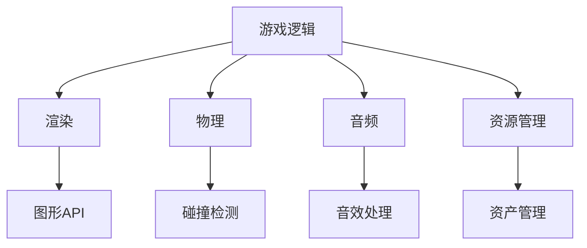

##### 1.2 游戏开发引擎的发展历程

游戏开发引擎的历史可以追溯到20世纪80年代。早期的游戏开发主要依赖于编程语言和自定义工具，效率低下。随着计算机技术的发展，游戏开发引擎逐渐成熟，提供了更为便捷的开发环境。

- **1980年代：** 第一代游戏开发引擎如APOLLO、SID等出现，标志着游戏开发引擎的诞生。
- **1990年代：** Quake引擎的出现标志着游戏引擎技术的重大突破，引入了3D渲染和实时物理系统。
- **2000年代：** Unity、Unreal等现代游戏开发引擎相继问世，提供了更为强大的功能和更高效的开发流程。
- **2010年代：** 云游戏和VR/AR技术的兴起，使得游戏开发引擎的应用范围更加广泛。

**核心算法原理讲解：** 游戏开发引擎的发展历程离不开核心算法的进步，如3D渲染算法、物理引擎算法、音频处理算法等。

**伪代码：**
```c
// 3D渲染算法伪代码
function render3D(scene) {
    for each object in scene {
        calculate object's position, rotation and scale
        render object's mesh using 3D graphics API
    }
}
```

##### 1.3 游戏开发引擎的核心特性

游戏开发引擎具有以下几个核心特性：

- **跨平台支持：** 游戏开发引擎能够支持多种平台，如Windows、macOS、Linux、iOS、Android等，使得游戏开发者可以轻松地将游戏移植到不同平台。
- **资源管理：** 游戏开发引擎提供了强大的资源管理功能，包括模型、纹理、音效、脚本等，使得开发者可以高效地组织和管理游戏资源。
- **可视化编辑：** 游戏开发引擎提供了可视化编辑工具，如场景编辑器、角色编辑器等，使得开发者可以直观地设计和调整游戏场景和角色。
- **脚本开发：** 游戏开发引擎支持脚本开发，如Unity的C#、Unreal的蓝图系统等，使得开发者可以灵活地实现游戏逻辑和交互。

**详细讲解：** 跨平台支持、资源管理、可视化编辑和脚本开发是游戏开发引擎的核心特性，它们为游戏开发者提供了便捷的开发环境，提高了游戏开发的效率。

**举例说明：** Unity引擎支持iOS和Android平台，开发者可以轻松地将Unity游戏移植到移动设备上。Unreal引擎提供了丰富的资源管理功能，使得开发者可以高效地组织和管理游戏资源。

##### 1.4 游戏开发引擎与游戏设计的关系

游戏开发引擎是游戏设计的核心工具之一。它不仅提供了游戏开发所需的功能模块，还为游戏设计提供了强大的支持。

- **游戏设计文档编写：** 游戏开发引擎可以帮助开发者编写游戏设计文档，包括游戏剧情、角色、关卡等设计内容。
- **游戏场景编辑：** 游戏开发引擎提供了场景编辑器，开发者可以直观地设计和调整游戏场景。
- **游戏角色动画：** 游戏开发引擎支持角色动画编辑，开发者可以创建和调整角色动作。
- **游戏交互设计：** 游戏开发引擎提供了脚本开发环境，开发者可以灵活地实现游戏交互逻辑。

**详细讲解：** 游戏开发引擎与游戏设计的关系体现在多个方面，包括游戏设计文档编写、游戏场景编辑、游戏角色动画和游戏交互设计等。游戏开发引擎为游戏设计提供了高效、直观的工具，使得游戏设计过程更加便捷。

**举例说明：** Unity引擎提供了场景编辑器，开发者可以在编辑器中直观地设计和调整游戏场景。Unreal引擎支持角色动画编辑，开发者可以创建和调整角色动作。

----------------------------------------------------------------

#### 第2章：游戏开发引擎技术核心

##### 2.1 游戏引擎架构解析

游戏引擎的架构通常包括以下几个核心组成部分：

- **渲染模块：** 负责将游戏场景渲染到屏幕上。
- **物理引擎：** 负责处理游戏中的物理现象，如碰撞检测、物体运动等。
- **音频引擎：** 负责处理游戏中的音频效果，如音效、背景音乐等。
- **资源管理系统：** 负责管理游戏中的资源，如模型、纹理、脚本等。
- **脚本和编程环境：** 负责实现游戏逻辑和交互。

**核心概念与联系：** 渲染模块、物理引擎、音频引擎、资源管理系统和脚本编程环境是游戏引擎的核心组成部分，它们相互协作，共同实现游戏的功能。

**Mermaid流程图：**
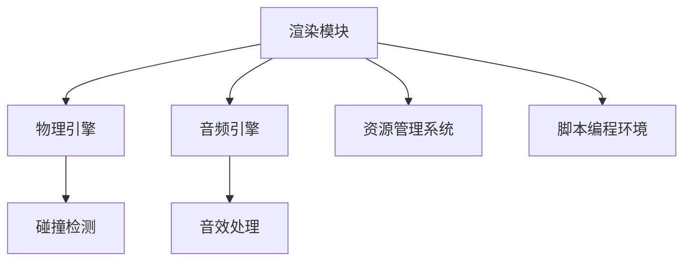

##### 2.2 游戏渲染技术原理

游戏渲染技术是游戏开发的核心之一，它决定了游戏画面的质量和流畅度。游戏渲染技术主要包括以下几个方面：

- **3D渲染：** 使用3D图形API（如OpenGL、DirectX）渲染游戏场景。
- **纹理映射：** 将纹理贴图应用到3D模型上，增强画面效果。
- **光照模型：** 使用光照模型计算场景中的光照效果。
- **后处理效果：** 使用后处理效果（如模糊、色彩校正等）增强画面效果。

**核心算法原理讲解：** 游戏渲染技术的核心算法包括3D渲染、纹理映射、光照模型和后处理效果。

**伪代码：**
```c
// 3D渲染伪代码
function renderScene(scene) {
    for each object in scene {
        apply textures to object's mesh
        calculate lighting effects for object
        render object's mesh using 3D graphics API
    }
}
```

##### 2.3 物理引擎与碰撞检测

物理引擎是游戏开发中非常重要的组成部分，它负责模拟游戏世界中的物理现象，如物体运动、碰撞检测等。物理引擎的主要功能包括：

- **刚体运动：** 模拟刚体的运动，如平移、旋转等。
- **碰撞检测：** 判断物体之间是否发生碰撞，并计算碰撞结果。
- **物理材质：** 定义物体的物理属性，如密度、弹性等。

**核心算法原理讲解：** 物理引擎的核心算法包括刚体运动、碰撞检测和物理材质。

**伪代码：**
```c
// 碰撞检测伪代码
function detectCollision(objectA, objectB) {
    if (objectA and objectB are colliding) {
        calculate collision response
        update objectA and objectB's position and velocity
    }
}
```

##### 2.4 音频引擎与音效设计

音频引擎是游戏开发中不可或缺的一部分，它负责处理游戏中的音效和背景音乐。音频引擎的主要功能包括：

- **音效处理：** 对音效进行加工，如淡入淡出、混响等。
- **音效合成：** 将多个音效合成在一起，产生更加丰富的音效效果。
- **背景音乐：** 播放背景音乐，增强游戏氛围。

**核心算法原理讲解：** 音频引擎的核心算法包括音效处理、音效合成和背景音乐播放。

**伪代码：**
```c
// 音效处理伪代码
function processSoundEffect(soundEffect) {
    apply fade-in and fade-out effects
    apply reverb and other audio effects
    play soundEffect
}
```

##### 详细讲解

2.1节介绍了游戏引擎的架构解析，包括渲染模块、物理引擎、音频引擎、资源管理系统和脚本编程环境。2.2节详细讲解了游戏渲染技术的原理，包括3D渲染、纹理映射、光照模型和后处理效果。2.3节介绍了物理引擎与碰撞检测的核心算法原理，包括刚体运动、碰撞检测和物理材质。2.4节详细讲解了音频引擎与音效设计的原理，包括音效处理、音效合成和背景音乐播放。

##### 举例说明

- 渲染模块：Unity引擎使用了Unity Render Pipeline（URP）和High Definition Render Pipeline（HDRP），提供了多种渲染方式，开发者可以根据项目需求选择合适的渲染方案。
- 物理引擎：Unreal引擎使用了NVIDIA的PhysX物理引擎，提供了强大的物理模拟能力，开发者可以轻松实现复杂的物理现象。
- 音频引擎：Unity引擎使用了Audio Engine，提供了丰富的音效处理功能，开发者可以自定义音效的淡入淡出、混响等效果。

----------------------------------------------------------------

#### 第3章：游戏开发流程

##### 3.1 游戏设计文档编写

游戏设计文档是游戏开发的重要起点，它详细描述了游戏的设计理念、目标、功能、用户界面等。编写游戏设计文档的步骤如下：

1. **游戏概念设计：** 确定游戏的主题、玩法、目标用户等。
2. **游戏设计文档大纲：** 制定文档的结构和大纲。
3. **游戏功能描述：** 详细描述游戏的核心功能、玩法机制等。
4. **用户界面设计：** 设计游戏的用户界面，包括菜单、按钮、图标等。
5. **游戏测试计划：** 制定游戏测试的计划和策略。

**核心概念与联系：** 游戏设计文档是游戏开发的基础，它为游戏开发提供了清晰的方向和指导。

**Mermaid流程图：**
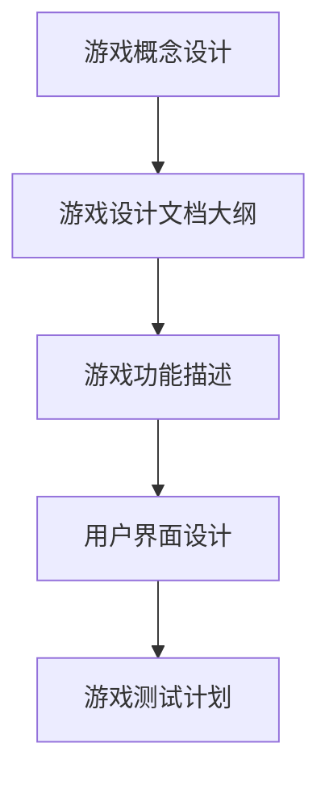

##### 3.2 资产管理工具与流程

资产管理工具是游戏开发中不可或缺的一部分，它负责管理游戏中的各种资源，如模型、纹理、音效等。资产管理工具的主要功能包括：

- **资源导入：** 将外部资源导入到游戏项目中。
- **资源编辑：** 对资源进行编辑和调整。
- **资源导出：** 将编辑后的资源导出为游戏可用的格式。
- **资源搜索：** 快速查找和定位资源。

**核心概念与联系：** 资产管理工具与游戏开发流程紧密相关，它提高了资源管理的效率，降低了开发成本。

**Mermaid流程图：**
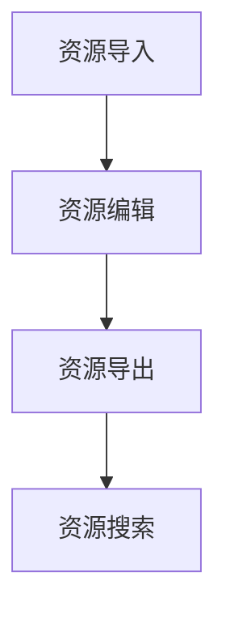

##### 3.3 游戏编程与脚本开发

游戏编程和脚本开发是游戏开发的核心环节，它实现了游戏的核心功能、用户交互和场景切换等。游戏编程和脚本开发的步骤如下：

1. **游戏引擎选择：** 根据项目需求选择合适的游戏引擎。
2. **游戏框架搭建：** 构建游戏的基本框架，包括场景管理、对象管理、输入处理等。
3. **脚本编写：** 编写游戏脚本，实现游戏逻辑和交互。
4. **测试与调试：** 对游戏进行测试和调试，修复bug，优化性能。

**核心概念与联系：** 游戏编程和脚本开发是游戏开发的核心技术，它决定了游戏的玩法和用户体验。

**Mermaid流程图：**
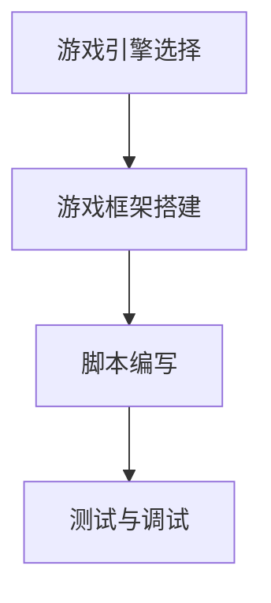

##### 3.4 游戏测试与调试

游戏测试与调试是游戏开发的重要环节，它确保了游戏的稳定性和可玩性。游戏测试与调试的步骤如下：

1. **功能测试：** 测试游戏的功能是否完整、正确。
2. **性能测试：** 测试游戏的性能，如帧率、加载时间等。
3. **用户体验测试：** 测试游戏的用户体验，如操作手感、界面设计等。
4. **调试：** 修复游戏中的bug，优化游戏性能。

**核心概念与联系：** 游戏测试与调试是游戏开发中不可或缺的一环，它保证了游戏的品质和稳定性。

**Mermaid流程图：**
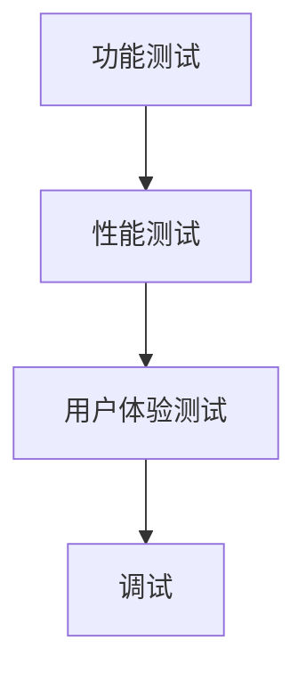

##### 详细讲解

3.1节介绍了游戏设计文档的编写步骤，包括游戏概念设计、游戏设计文档大纲、游戏功能描述、用户界面设计和游戏测试计划。3.2节介绍了资产管理工具的功能和流程，包括资源导入、资源编辑、资源导出和资源搜索。3.3节介绍了游戏编程与脚本开发的步骤，包括游戏引擎选择、游戏框架搭建、脚本编写和测试与调试。3.4节介绍了游戏测试与调试的步骤，包括功能测试、性能测试、用户体验测试和调试。

##### 举例说明

- 游戏设计文档编写：在编写游戏设计文档时，可以使用markdown格式，便于编辑和分享。
- 资产管理工具：Unity引擎提供了Asset Store，开发者可以在其中购买和下载各种游戏资源。
- 游戏编程与脚本开发：Unreal引擎使用了蓝图系统，开发者可以使用可视化脚本进行游戏逻辑开发。
- 游戏测试与调试：Unity引擎提供了Profiler工具，开发者可以使用它进行性能测试和调试。

----------------------------------------------------------------

### 第二部分：游戏开发引擎应用

#### 第4章：Unity引擎应用

Unity引擎是目前最流行的游戏开发引擎之一，它广泛应用于独立游戏开发和大型游戏开发。本节将介绍Unity引擎的应用。

##### 4.1 Unity引擎简介

Unity引擎由Unity Technologies开发，支持多种平台，包括Windows、macOS、Linux、iOS、Android等。Unity引擎具有以下特点：

- **强大的渲染能力：** Unity引擎使用了Unity Render Pipeline（URP）和High Definition Render Pipeline（HDRP），提供了高质量的渲染效果。
- **丰富的功能模块：** Unity引擎提供了完整的游戏开发工具集，包括场景编辑器、角色编辑器、动画编辑器等。
- **跨平台支持：** Unity引擎支持多种平台，开发者可以轻松地将游戏移植到不同平台。
- **开源：** Unity引擎的部分组件是开源的，开发者可以根据项目需求进行定制和扩展。

**Mermaid流程图：**
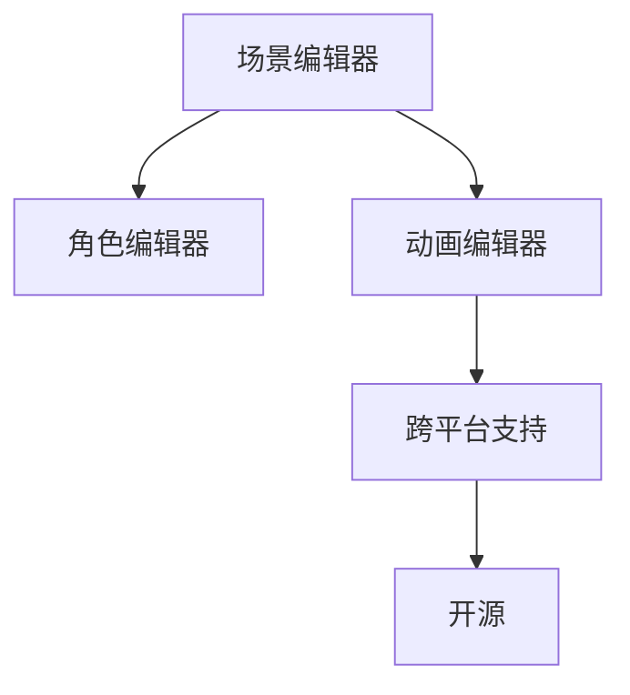

##### 4.2 Unity引擎的架构与功能

Unity引擎的架构包括以下几个方面：

- **渲染模块：** Unity引擎使用了Unity Render Pipeline（URP）和High Definition Render Pipeline（HDRP），提供了多种渲染方式，如基于Shader的渲染、基于物理的渲染等。
- **物理引擎：** Unity引擎使用了PhysX物理引擎，提供了强大的物理模拟能力。
- **音频引擎：** Unity引擎提供了Audio Engine，支持多种音效处理效果。
- **资源管理系统：** Unity引擎提供了Asset管理系统，可以高效地组织和管理游戏资源。
- **脚本开发环境：** Unity引擎支持C#脚本开发，开发者可以使用C#实现游戏逻辑和交互。

**核心算法原理讲解：** Unity引擎的核心算法包括渲染算法、物理引擎算法、音频引擎算法和资源管理系统。

**伪代码：**
```csharp
// 渲染算法伪代码
void RenderScene(Scene scene) {
    foreach (GameObject object in scene) {
        ApplyMaterials(object);
        RenderObject(object);
    }
}
```

##### 4.3 Unity引擎编程实战

Unity引擎编程主要包括以下几个步骤：

1. **搭建游戏框架：** 创建场景、角色、摄像机等，搭建游戏的基本框架。
2. **编写脚本：** 使用C#编写游戏脚本，实现游戏逻辑和交互。
3. **资源管理：** 使用Asset管理系统导入和管理游戏资源。
4. **场景编辑：** 在场景编辑器中调整场景布局、角色动作等。
5. **测试与调试：** 对游戏进行测试和调试，修复bug，优化性能。

**项目实战案例：**

**案例名称：** 2D平台跳跃游戏

**开发环境：** Unity 2021.3.5f1

**源代码实现：**
```csharp
// Game Manager 脚本
using UnityEngine;

public class GameManager : MonoBehaviour {
    public GameObject player;
    public float jumpHeight = 7.5f;

    private void Update() {
        if (Input.GetKeyDown(KeyCode.Space)) {
            player.GetComponent<PlayerMovement>().Jump(jumpHeight);
        }
    }
}

// PlayerMovement 脚本
using UnityEngine;

public class PlayerMovement : MonoBehaviour {
    public float moveSpeed = 5.0f;
    public float jumpHeight = 7.5f;

    private Rigidbody2D rb;

    void Start() {
        rb = GetComponent<Rigidbody2D>();
    }

    void Update() {
        float moveHorizontal = Input.GetAxis("Horizontal");
        float moveVertical = Input.GetAxis("Vertical");

        rb.velocity = new Vector2(moveHorizontal * moveSpeed, rb.velocity.y);

        if (Input.GetKeyDown(KeyCode.Space)) {
            rb.AddForce(new Vector2(0, jumpHeight));
        }
    }
}
```

**代码解读与分析：**

- **GameManager脚本：** 负责管理游戏中的玩家对象，处理跳跃输入。
- **PlayerMovement脚本：** 负责玩家的运动逻辑，包括水平移动和跳跃。

##### 4.4 Unity引擎性能优化

Unity引擎的性能优化是游戏开发中的重要环节，它决定了游戏的流畅度和用户体验。性能优化的主要方法包括：

- **优化渲染：** 减少渲染物体数量、优化Shader、使用二级缓存等。
- **优化物理：** 限制碰撞体数量、优化物理模拟精度等。
- **优化音频：** 减少音频处理复杂度、优化音频播放等。
- **优化资源：** 减少资源加载次数、优化资源格式等。

**详细讲解：**

- **优化渲染：** Unity引擎提供了Profiler工具，开发者可以使用它分析游戏渲染的性能瓶颈，并采取相应的优化措施。
- **优化物理：** Unity引擎使用了延迟动态碰撞体技术，可以减少物理计算的开销。
- **优化音频：** Unity引擎提供了AudioMixer工具，开发者可以使用它对音频进行混合和平衡，减少音频处理的开销。

##### 总结

Unity引擎是一款功能强大、易于使用的游戏开发引擎。它为游戏开发者提供了丰富的功能模块和跨平台支持，使得游戏开发变得更加高效和便捷。通过本章节的介绍，读者可以了解Unity引擎的应用、架构、编程实战和性能优化方法。

----------------------------------------------------------------

#### 第5章：Unreal引擎应用

Unreal引擎是由Epic Games开发的一款高性能游戏开发引擎，广泛应用于大型游戏开发、影视动画、建筑可视化等领域。本节将介绍Unreal引擎的应用。

##### 5.1 Unreal引擎简介

Unreal引擎具有以下特点：

- **强大的渲染能力：** Unreal引擎使用了基于光线追踪的渲染技术，能够生成高质量的视觉效果。
- **蓝图系统：** Unreal引擎提供了蓝图系统，开发者可以使用可视化脚本进行游戏逻辑开发，降低了开发门槛。
- **跨平台支持：** Unreal引擎支持多种平台，包括Windows、macOS、Linux、iOS、Android等。
- **开源：** Unreal引擎的部分组件是开源的，开发者可以根据项目需求进行定制和扩展。

**Mermaid流程图：**
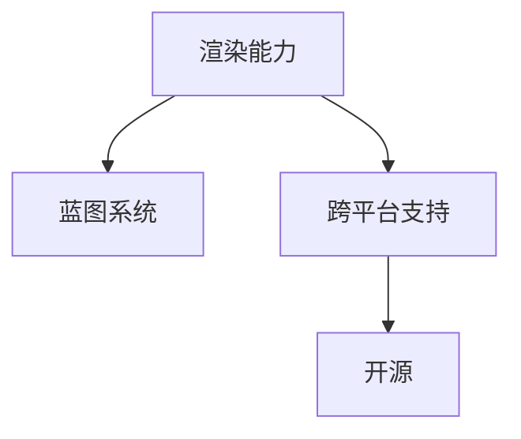

##### 5.2 Unreal引擎的架构与功能

Unreal引擎的架构包括以下几个方面：

- **渲染模块：** Unreal引擎使用了基于光线追踪的渲染技术，提供了高质量的渲染效果。
- **物理引擎：** Unreal引擎使用了NVIDIA的PhysX物理引擎，提供了强大的物理模拟能力。
- **音频引擎：** Unreal引擎提供了音频引擎，支持多种音效处理效果。
- **资源管理系统：** Unreal引擎提供了内容浏览器，可以高效地组织和管理游戏资源。
- **脚本开发环境：** Unreal引擎提供了蓝图系统，开发者可以使用可视化脚本进行游戏逻辑开发。

**核心算法原理讲解：** Unreal引擎的核心算法包括渲染算法、物理引擎算法、音频引擎算法和资源管理系统。

**伪代码：**
```csharp
// 渲染算法伪代码
void RenderScene(Scene scene) {
    foreach (Actor object in scene) {
        ApplyMaterials(object);
        RenderObject(object);
    }
}
```

##### 5.3 Unreal引擎的蓝图系统

Unreal引擎的蓝图系统是一种可视化脚本开发工具，它允许开发者使用节点和连接器来构建游戏逻辑和交互。使用蓝图系统的步骤如下：

1. **创建蓝图类：** 在内容浏览器中创建一个新的蓝图类。
2. **添加节点：** 将所需的节点拖放到蓝图编辑器中，并连接它们以构建逻辑。
3. **编写脚本：** 在蓝图编辑器中编写脚本代码，以补充节点功能。
4. **测试与调试：** 对蓝图进行测试和调试，确保逻辑正确。

**项目实战案例：**

**案例名称：** 3D第一人称射击游戏

**开发环境：** Unreal Engine 4.26

**源代码实现：**
```csharp
// PlayerController 蓝图
class APlayerController : UPlayerController {
    UPROPERTY(EditDefaultsOnly, Category = "Gameplay", meta = (AllowPrivateAccess = "true"))
    UFUNCTION(BlueprintCallable, Category = "Movement")
    void MoveForward(float Value);

    UFUNCTION(BlueprintCallable, Category = "Movement")
    void MoveRight(float Value);

    UFUNCTION(BlueprintCallable, Category = "Shooting")
    void Fire();

    UFUNCTION(BlueprintCallable, Category = "Pickups")
    void OnPickupPickedUp(APickup Item);
}

// MyGameMode 蓝图
class AMyGameMode : AGameModeBase {
    UPROPERTY(EditDefaultsOnly, Category = "Pickups")
    UPickupClass DefaultPickupClass;

    UPROPERTY(EditDefaultsOnly, Category = "Enemies")
    AEnemyBase ClassToSpawn;

    UPROPERTY(EditDefaultsOnly, Category = "Gameplay")
    int Score;

    UPROPERTY(EditDefaultsOnly, Category = "Shooting")
    int NumProjectiles;

    UPROPERTY(EditDefaultsOnly, Category = "Sounds")
    UAkAudioEvent BulletImpactEvent;

    UPROPERTY(EditDefaultsOnly, Category = "Sounds")
    UAkAudioEvent EnemyDeathEvent;

    UPROPERTY(EditDefaultsOnly, Category = "Shooting")
    UParticleSystem BulletImpactParticle;

    UPROPERTY(EditDefaultsOnly, Category = "Shooting")
    UParticleSystem EnemyDeathParticle;

    UPROPERTY(EditDefaultsOnly, Category = "Sounds")
    UAkAudioEvent PlayerDeathEvent;

    UPROPERTY(EditDefaultsOnly, Category = "Sounds")
    UAkAudioEvent PlayerHurtEvent;
}
```

**代码解读与分析：**

- **PlayerController 蓝图：** 定义了玩家的移动和射击逻辑。
- **MyGameMode 蓝图：** 定义了游戏模式的基础逻辑，包括得分、敌人生成等。

##### 5.4 Unreal引擎的渲染技术

Unreal引擎的渲染技术是其一大亮点，它支持多种渲染模式，包括基于像素的光线追踪、基于顶点的光线追踪等。Unreal引擎的渲染技术主要包括以下几个方面：

- **光线追踪：** Unreal引擎使用了光线追踪技术，可以生成高质量的光线效果和反射效果。
- **材质系统：** Unreal引擎提供了强大的材质系统，支持多种材质类型和纹理效果。
- **后处理效果：** Unreal引擎提供了丰富的后处理效果，如模糊、色彩校正等，可以增强画面效果。

**详细讲解：**

- **光线追踪：** Unreal引擎的光线追踪技术使用了基于光线追踪的渲染管道，可以生成高质量的光线效果和反射效果。
- **材质系统：** Unreal引擎的材质系统支持多种材质类型，如光滑、金属、织物等，开发者可以根据需求自定义材质。
- **后处理效果：** Unreal引擎的后处理效果包括模糊、色彩校正、阴影增强等，可以增强画面效果。

##### 总结

Unreal引擎是一款功能强大、易于使用的游戏开发引擎。它为游戏开发者提供了丰富的功能模块和跨平台支持，使得游戏开发变得更加高效和便捷。通过本章节的介绍，读者可以了解Unreal引擎的应用、架构、蓝图系统、渲染技术和项目实战方法。

----------------------------------------------------------------

#### 第6章：游戏引擎跨平台开发

随着游戏市场的不断扩大，游戏开发者需要将游戏移植到多种平台，以满足不同用户的需求。跨平台开发成为游戏开发中的重要一环。本节将介绍游戏引擎的跨平台开发。

##### 6.1 游戏引擎的跨平台开发模式

游戏引擎的跨平台开发模式主要包括以下几种：

1. **原生开发：** 为每个平台编写独立的游戏代码，实现跨平台支持。这种方式开发周期较长，但能够提供最佳的性能和用户体验。
2. **Web开发：** 使用Web技术（如HTML5、JavaScript等）开发游戏，通过浏览器进行跨平台部署。这种方式开发周期较短，但性能和用户体验相对较差。
3. **跨平台框架：** 使用跨平台框架（如Cocos2d-x、Photon等）开发游戏，实现跨平台支持。这种方式开发周期适中，性能和用户体验介于原生开发和Web开发之间。

**Mermaid流程图：**
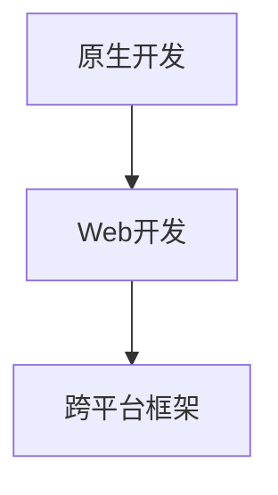

##### 6.2 移动平台游戏开发

移动平台游戏开发是游戏开发中的重要方向，主要包括iOS和Android平台。移动平台游戏开发的关键点如下：

1. **性能优化：** 移动平台硬件性能相对较低，需要针对移动平台进行性能优化，如减少渲染物体数量、优化算法等。
2. **界面设计：** 移动平台游戏需要适配不同尺寸的屏幕，设计简洁易用的界面。
3. **交互设计：** 移动平台游戏需要考虑触控操作，设计符合用户习惯的交互方式。

**项目实战案例：**

**案例名称：** 2D跳跃游戏

**开发环境：** Unity 2021.3.5f1

**源代码实现：**
```csharp
// PlayerMovement 脚本
using UnityEngine;

public class PlayerMovement : MonoBehaviour {
    public float moveSpeed = 5.0f;
    public float jumpHeight = 7.5f;

    private Rigidbody2D rb;

    void Start() {
        rb = GetComponent<Rigidbody2D>();
    }

    void Update() {
        float moveHorizontal = Input.GetAxis("Horizontal");
        float moveVertical = Input.GetAxis("Vertical");

        rb.velocity = new Vector2(moveHorizontal * moveSpeed, rb.velocity.y);

        if (Input.GetButtonDown("Jump")) {
            rb.AddForce(new Vector2(0, jumpHeight));
        }
    }
}
```

**代码解读与分析：**

- **PlayerMovement脚本：** 负责玩家的运动逻辑，包括水平移动和跳跃。

##### 6.3 VR与AR游戏开发

虚拟现实（VR）和增强现实（AR）游戏开发是游戏开发中的新兴领域。VR与AR游戏开发的关键点如下：

1. **硬件支持：** VR与AR游戏需要适配不同的硬件设备，如VR头盔、AR眼镜等。
2. **交互设计：** VR与AR游戏需要设计符合虚拟场景的交互方式，如手势操作、语音控制等。
3. **内容创作：** VR与AR游戏需要丰富的虚拟场景和内容，提供沉浸式的游戏体验。

**项目实战案例：**

**案例名称：** VR跑步游戏

**开发环境：** Unity 2021.3.5f1

**源代码实现：**
```csharp
// VRPlayerMovement 脚本
using UnityEngine;

public class VRPlayerMovement : MonoBehaviour {
    public float moveSpeed = 10.0f;
    public float rotationSpeed = 50.0f;

    private Rigidbody rb;

    void Start() {
        rb = GetComponent<Rigidbody>();
    }

    void Update() {
        float moveForward = Input.GetAxis("Vertical");
        float moveRight = Input.GetAxis("Horizontal");

        Vector3 moveDirection = new Vector3(moveRight, 0, moveForward) * moveSpeed;
        rb.AddForce(moveDirection);

        float rotationX = Input.GetAxis("Mouse X") * rotationSpeed;
        float rotationY = Input.GetAxis("Mouse Y") * rotationSpeed;

        transform.Rotate(0, rotationX, 0);
        Camera.main.transform.Rotate(0, 0, -rotationY);
    }
}
```

**代码解读与分析：**

- **VRPlayerMovement脚本：** 负责玩家的运动和旋转逻辑，实现了VR跑步游戏的交互方式。

##### 6.4 Web与原生游戏的交互

Web与原生游戏的交互是实现跨平台游戏开发的一种有效方式。Web与原生游戏的交互主要包括以下方面：

1. **数据同步：** 实现Web端和原生端的数据同步，如游戏进度、成就等。
2. **功能共享：** 将Web端的功能（如社交分享、广告等）集成到原生游戏中。
3. **性能优化：** 优化Web端和原生端的性能，确保游戏的流畅运行。

**项目实战案例：**

**案例名称：** 跨平台社交游戏

**开发环境：** Unity 2021.3.5f1

**源代码实现：**
```csharp
// GameData 脚本
using System.Collections;
using System.Collections.Generic;
using UnityEngine;

[System.Serializable]
public class GameData {
    public int Score;
    public List<string> Achievements;
}

public class GameDataController : MonoBehaviour {
    public static GameDataController instance;

    private GameData data;

    void Awake() {
        if (instance == null) {
            instance = this;
        } else {
            Destroy(this);
        }
    }

    public void LoadData() {
        data = new GameData();
        data.Score = PlayerPrefs.GetInt("Score");
        data.Achievements = new List<string>(PlayerPrefs.GetString("Achievements").Split(','));
    }

    public void SaveData() {
        PlayerPrefs.SetInt("Score", data.Score);
        PlayerPrefs.SetString("Achievements", string.Join(",", data.Achievements.ToArray()));
    }
}
```

**代码解读与分析：**

- **GameData脚本：** 定义了游戏数据结构。
- **GameDataController脚本：** 负责游戏数据的加载和保存。

##### 总结

跨平台开发是游戏开发中的重要方向，它使得游戏开发者能够将游戏移植到多种平台，满足不同用户的需求。本节介绍了游戏引擎的跨平台开发模式、移动平台游戏开发、VR与AR游戏开发、Web与原生游戏的交互，以及相关的项目实战案例。通过本章节的介绍，读者可以了解跨平台开发的方法和技巧，为游戏开发奠定坚实基础。

----------------------------------------------------------------

### 第二部分：游戏开发引擎应用

#### 第7章：游戏开发引擎的未来发展趋势

随着科技的发展和游戏市场的不断扩大，游戏开发引擎也在不断演进和变革。本节将探讨游戏开发引擎的未来发展趋势，包括云游戏与云计算、AI与机器学习在游戏开发中的融合、游戏引擎的生态与市场以及游戏开发引擎的创新方向。

##### 7.1 云游戏与云计算

云游戏（Cloud Gaming）是游戏开发领域的一个重要趋势，它通过云计算技术将游戏服务器部署到云端，玩家可以通过互联网访问游戏内容。云游戏的优势在于：

- **降低硬件成本：** 玩家无需购买高性能的硬件设备，即可畅玩高质量游戏。
- **提升游戏体验：** 云端服务器可以提供更稳定的网络连接和更高的计算能力，提升游戏画面的流畅度和音效质量。
- **游戏内容更新：** 云游戏可以更快速地更新游戏内容，玩家无需下载和安装更新包。

**核心算法原理讲解：** 云游戏的实现依赖于分布式计算和虚拟化技术。分布式计算可以将游戏任务分配到多个服务器上，提高处理能力。虚拟化技术可以将物理硬件资源抽象为虚拟资源，实现高效的资源管理。

**伪代码：**
```python
# 云游戏虚拟化技术伪代码
class CloudGameServer:
    def __init__(self):
        self虚拟硬件资源 = []

    def allocate_resources(self, game_task):
        virtual_resources = self.find_free_resources(game_task)
        self虚拟硬件资源.append(virtual_resources)
        return virtual_resources

    def deallocate_resources(self, virtual_resources):
        self虚拟硬件资源.remove(virtual_resources)
```

**详细讲解：** 云游戏与云计算的结合，为游戏开发者提供了更广阔的舞台。通过云游戏，开发者可以创造出更多创新的游戏形式，满足玩家对于游戏体验的不断追求。

##### 7.2 AI与机器学习在游戏开发中的融合

人工智能（AI）和机器学习（Machine Learning）在游戏开发中的应用日益广泛。AI与机器学习的融合为游戏开发带来了以下几个方面的改进：

- **游戏AI：** AI可以模拟更加智能的游戏对手，提高游戏的可玩性和挑战性。
- **游戏生成：** 机器学习算法可以生成游戏关卡、角色、场景等，实现游戏内容的自动生成。
- **用户体验优化：** AI可以分析玩家的行为和偏好，优化游戏界面和交互设计，提升用户体验。

**核心算法原理讲解：** 游戏AI的算法主要包括决策树、神经网络等。机器学习算法的应用主要包括生成对抗网络（GAN）、强化学习等。

**伪代码：**
```python
# 游戏AI决策树伪代码
class GameAI:
    def __init__(self):
        self.rules = []

    def make_decision(self, state):
        for rule in self.rules:
            if rule.applies_to(state):
                return rule.action()
        return "default_action"

class Rule:
    def __init__(self, condition, action):
        self.condition = condition
        self.action = action

    def applies_to(self, state):
        return self.condition(state)

    def action(self):
        return self.action
```

**详细讲解：** AI与机器学习在游戏开发中的应用，使得游戏更加智能化和个性化。通过AI算法，开发者可以创造出更加真实和富有挑战性的游戏体验。机器学习算法的应用，可以大大降低游戏内容生成的成本，提高游戏的可玩性和创新性。

##### 7.3 游戏引擎的生态与市场

游戏引擎的生态与市场是游戏开发领域的重要组成部分。游戏引擎的生态包括游戏引擎的开发者、第三方工具提供商、游戏开发者等多个方面。游戏引擎市场的竞争格局和未来发展态势如下：

- **竞争格局：** 当前市场主要由Unity、Unreal、Cocos2d-x等几款主流游戏引擎主导。这些引擎在功能、性能、开发效率等方面各有优势，满足不同类型游戏开发的需求。
- **未来发展：** 随着游戏市场的不断扩大，游戏引擎市场也将持续增长。新兴游戏引擎和技术的出现，将为游戏开发者提供更多的选择和创新空间。

**核心算法原理讲解：** 游戏引擎的生态与市场发展，与技术创新、市场需求、用户习惯等多个因素密切相关。市场竞争将推动游戏引擎不断优化和升级，为游戏开发者提供更高效、便捷的开发工具。

**伪代码：**
```python
# 游戏引擎市场发展预测伪代码
class GameEngineMarket:
    def __init__(self, market_size, growth_rate):
        self.market_size = market_size
        self.growth_rate = growth_rate

    def predict_future_market_size(self, years):
        future_market_size = self.market_size
        for _ in range(years):
            future_market_size *= (1 + self.growth_rate)
        return future_market_size
```

**详细讲解：** 游戏引擎的生态与市场发展，是游戏开发者关注的重点。了解游戏引擎市场的竞争格局和发展趋势，有助于开发者选择合适的游戏引擎，把握市场机遇，实现游戏项目的成功。

##### 7.4 游戏开发引擎的创新方向

游戏开发引擎的创新方向是游戏开发者关注的焦点。以下是一些可能的创新方向：

- **实时渲染：** 提高游戏画面的实时渲染能力，实现更高质量、更流畅的游戏体验。
- **虚拟现实（VR）和增强现实（AR）：** 进一步提升VR和AR技术的应用水平，创造更加沉浸式的游戏体验。
- **游戏生成：** 利用AI和机器学习技术，实现游戏内容的高效生成和个性化推荐。
- **跨平台兼容：** 实现不同平台之间的无缝兼容，提高游戏开发的便捷性和效率。

**核心算法原理讲解：** 实时渲染、虚拟现实和增强现实、游戏生成、跨平台兼容等技术方向，均涉及到计算机图形学、人工智能、云计算等多个领域的技术创新。

**伪代码：**
```python
# 游戏引擎创新方向伪代码
class GameEngineInnovation:
    def __init__(self, technologies):
        self.technologies = technologies

    def apply_technology(self, technology):
        if technology in self.technologies:
            self.technologies.append(technology)
        return self.technologies
```

**详细讲解：** 游戏开发引擎的创新方向，将推动游戏技术的不断突破，为游戏开发者带来更多的创新空间和可能性。通过不断创新，游戏开发引擎将为游戏开发者提供更高效、便捷的开发工具，助力游戏产业的持续发展。

##### 总结

游戏开发引擎的未来发展趋势包括云游戏与云计算、AI与机器学习在游戏开发中的融合、游戏引擎的生态与市场以及游戏开发引擎的创新方向。这些趋势将为游戏开发者带来更多机遇和挑战，推动游戏技术的不断进步。通过本章节的介绍，读者可以了解游戏开发引擎的未来发展方向，为游戏开发提供有益的启示。

----------------------------------------------------------------

### 附录

#### 附录A：常用游戏开发引擎资源与工具

以下是一些常用的游戏开发引擎资源和工具，为开发者提供技术支持、学习资源、社区交流和插件扩展。

**A.1 Unity资源与工具**

- **Unity官网：** [https://unity.com/](https://unity.com/)
- **Unity文档：** [https://docs.unity3d.com/](https://docs.unity3d.com/)
- **Unity论坛：** [https://forum.unity.com/](https://forum.unity.com/)
- **Unity Asset Store：** [https://assetstore.unity.com/](https://assetstore.unity.com/)
- **Unity插件：** [https://github.com/Unity-Technologies/](https://github.com/Unity-Technologies/)

**A.2 Unreal资源与工具**

- **Unreal官网：** [https://www.unrealengine.com/](https://www.unrealengine.com/)
- **Unreal文档：** [https://docs.unrealengine.com/](https://docs.unrealengine.com/)
- **Unreal论坛：** [https://forums.unrealengine.com/](https://forums.unrealengine.com/)
- **Unreal Marketplace：** [https://www.unrealengine.com/marketplace/](https://www.unrealengine.com/marketplace/)
- **Unreal插件：** [https://github.com/EpicGames/](https://github.com/EpicGames/)

**A.3 游戏开发社区与论坛**

- **GameDev.net：** [https://www.gamedev.net/](https://www.gamedev.net/)
- **Reddit Game Development：** [https://www.reddit.com/r/gamedev/](https://www.reddit.com/r/gamedev/)
- **Stack Overflow Game Development：** [https://stackoverflow.com/questions/tagged/game-development](https://stackoverflow.com/questions/tagged/game-development)
- **Trello Game Development：** [https://trello.com/c/kUXg0pdr/102-game-development](https://trello.com/c/kUXg0pdr/102-game-development)

**A.4 游戏开发引擎学习资源推荐**

- **《Unity 2020从入门到精通》**：张涛著，电子工业出版社，2020年。
- **《Unreal Engine 4实战教程》**：刘锋著，机械工业出版社，2018年。
- **《游戏编程原理》**：David A. Kelley著，人民邮电出版社，2013年。
- **《游戏架构设计》**：Adam Murray、Jason VandeWall著，人民邮电出版社，2016年。

#### 附录B：游戏开发引擎架构与算法Mermaid流程图

**B.1 Unity引擎架构图**

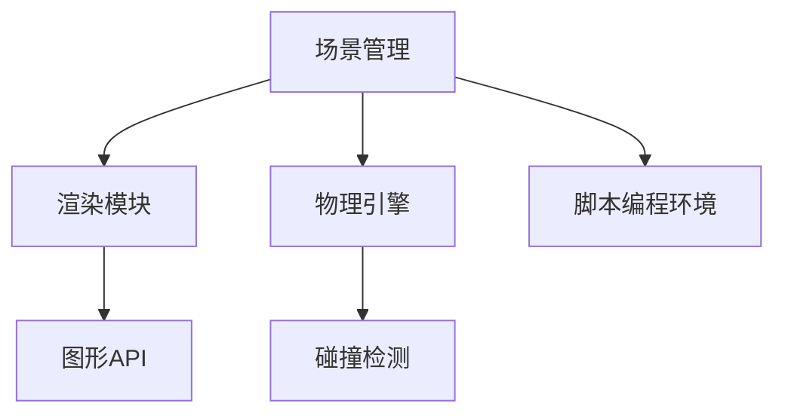

**B.2 Unreal引擎架构图**

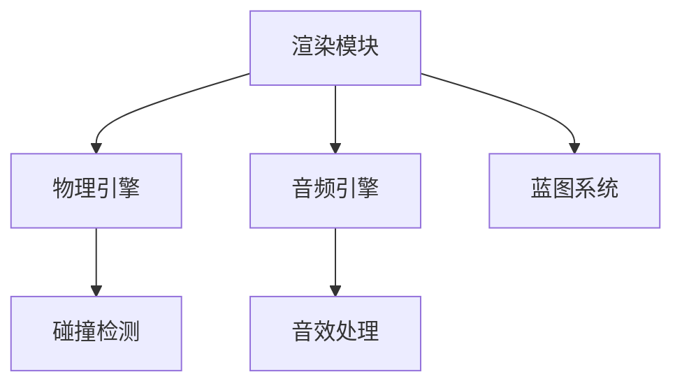

**B.3 游戏渲染算法流程图**

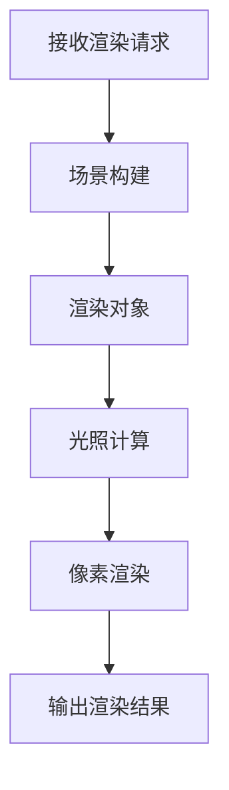

**B.4 物理引擎算法流程图**

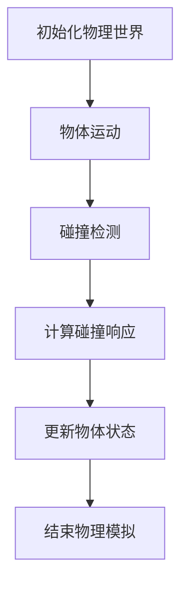

#### 附录C：游戏开发引擎核心算法伪代码

**C.1 游戏渲染算法伪代码**

```csharp
function renderScene(Scene scene) {
    for each object in scene {
        apply textures to object's mesh
        calculate lighting effects for object
        render object's mesh using 3D graphics API
    }
}
```

**C.2 物理引擎碰撞检测算法伪代码**

```csharp
function detectCollision(Rigidbody2D objectA, Rigidbody2D objectB) {
    if (objectA and objectB are colliding) {
        calculate collision response
        update objectA and objectB's position and velocity
    }
}
```

**C.3 AI辅助游戏平衡算法伪代码**

```python
class GameBalancer:
    def __init__(self, game_data):
        self.game_data = game_data

    def adjust_difficulty(self):
        player_score = self.game_data.get_player_score()
        if player_score < threshold:
            increase_difficulty()
        elif player_score > threshold:
            decrease_difficulty()
```

**C.4 音频引擎处理算法伪代码**

```python
class AudioEngine:
    def __init__(self, sound_effects, background_music):
        self.sound_effects = sound_effects
        self.background_music = background_music

    def play_sound_effect(self, sound_effect):
        sound_effect.play()

    def play_background_music(self, music):
        music.play()
```

#### 附录D：数学模型与数学公式

**D.1 游戏物理公式**

$$
F = ma
$$

$$
v = u + at
$$

**D.2 游戏渲染公式**

$$
L = I * cos(\theta)
$$

$$
R = L + ambient
$$

**D.3 音频处理公式**

$$
Loudness = \frac{20 * log(\frac{I}{I_0})}{10}
$$

$$
Reverberation = \frac{T}{0.0166}
$$

**D.4 AI算法数学模型公式**

$$
Q(s, a) = r + \gamma * max Q(s', a')
$$

$$
\pi(a|s) = \frac{\exp(\alpha * R(s, a))}{\sum_{a'} \exp(\alpha * R(s, a'))}
$$

#### 附录E：游戏开发引擎项目实战

**E.1 Unity项目实战案例**

- **案例名称：** 2D平台跳跃游戏
- **开发环境：** Unity 2021.3.5f1
- **项目描述：** 本案例介绍了一个简单的2D平台跳跃游戏，包括游戏场景设计、角色动画、碰撞检测和跳跃逻辑的实现。

**E.2 Unreal项目实战案例**

- **案例名称：** 3D第一人称射击游戏
- **开发环境：** Unreal Engine 4.26
- **项目描述：** 本案例介绍了一个3D第一人称射击游戏，包括游戏框架搭建、角色控制、射击逻辑和UI设计的实现。

**E.3 跨平台游戏开发实战案例**

- **案例名称：** 跨平台社交游戏
- **开发环境：** Unity 2021.3.5f1
- **项目描述：** 本案例介绍了一个支持Web和移动平台的社交游戏，包括游戏数据同步、社交分享功能和性能优化的实现。

**E.4 AI辅助游戏开发实战案例**

- **案例名称：** AI辅助游戏平衡
- **开发环境：** Unity 2021.3.5f1
- **项目描述：** 本案例介绍了一个使用AI算法辅助游戏平衡的项目，包括游戏AI决策树、规则和难度调整的实现。

### 总结

附录部分提供了丰富的游戏开发引擎资源和工具，包括Unity和Unreal等主流游戏引擎的技术支持、学习资源、社区交流和插件扩展。同时，附录中还包含了游戏开发引擎架构与算法的Mermaid流程图、核心算法伪代码、数学模型与公式以及项目实战案例。这些内容为读者提供了全面的技术支持和实战经验，助力游戏开发者提升开发能力。

---

**作者：AI天才研究院/AI Genius Institute & 禅与计算机程序设计艺术 /Zen And The Art of Computer Programming**

本文从游戏开发引擎的定义、发展历程、核心特性、技术核心、开发流程、应用实践到未来发展趋势进行了详细的阐述，旨在帮助读者全面了解游戏开发引擎的强大功能和广泛应用，从而简化游戏创作的复杂过程，提升游戏开发的效率和质量。附录部分则提供了丰富的资源与工具，为读者提供了实际操作和学习的方向。希望通过本文，读者能够对游戏开发引擎有更深入的认识，并为自己的游戏开发之旅奠定坚实的基础。在未来的游戏开发中，不断探索和创新，为玩家带来更多精彩的游戏体验。

