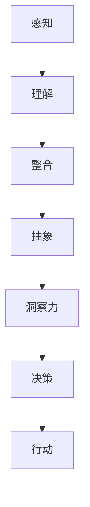

                 

# 《理解洞察力的价值：在不确定性中的优势》

## 关键词
洞察力，不确定性，个人发展，团队协作，组织管理，适应变化

## 摘要
在当今快速变化的世界中，不确定性已经成为一种常态。面对这种环境，洞察力成为了一种宝贵的资产。本文将从多个角度深入探讨洞察力的价值，包括其在个人发展、团队协作和组织管理中的应用，以及如何通过学习与反思、沟通与合作等策略提升洞察力。通过案例分析，我们将看到洞察力在实践中的具体应用和成功故事。最后，本文将展望洞察力在未来的发展趋势和面临的挑战。

## 引言

在现代社会中，不确定性如影随形。无论是全球经济波动、技术创新，还是政治不确定性，这些因素都在不断影响我们的生活和工作。在这种环境中，传统的决策模式往往显得力不从心。而洞察力，作为一种深刻的认知能力，能够在不确定性中为我们提供指导。那么，什么是洞察力？为什么它在不确定性中如此重要？

### 什么是洞察力

洞察力，顾名思义，是指对事物深入理解和快速识别的能力。它不仅包括对信息的理解，更包括对信息的洞察和洞见。简单来说，洞察力是一种能够看到事物本质和关联的能力。

在心理学上，洞察力通常与以下能力相关联：
- **分析能力**：对复杂问题进行分解和抽象，找到关键因素。
- **推理能力**：基于已知信息进行逻辑推理，预测可能的后果。
- **感知能力**：对信息敏感，能够捕捉到细微的变化。

### 洞察力的重要性

在面对不确定性时，洞察力具有以下几个方面的优势：

1. **快速反应**：洞察力使个体能够迅速识别问题，并采取适当的行动。
2. **决策指导**：洞察力能够帮助个体在复杂和不确定的情况下做出明智的决策。
3. **问题解决**：洞察力能够发现问题的根本原因，从而找到有效的解决方案。
4. **预见性**：洞察力能够帮助个体预见未来的变化，从而做出前瞻性的规划和调整。

### 文章结构

本文将分为三个主要部分：

- **第一部分：洞察力的基础**，介绍洞察力的核心概念、培养方法和实践应用。
- **第二部分：洞察力的应用**，探讨洞察力在个人发展、团队协作和组织管理中的具体应用。
- **第三部分：提升洞察力的策略**，提供提升洞察力的实用策略和案例分析。

通过本文的阅读，您将全面理解洞察力的价值，并学会如何在实际中运用和提升这一宝贵的能力。

## 第一部分：洞察力的基础

### 第1章：洞察力的定义与重要性

#### 1.1 洞察力的概念

洞察力（Insight）是一种深层次的认知能力，它涉及到对信息的理解、分析、整合和抽象。这种能力不仅仅是对事实和数据的认知，更是一种对事物本质和内在联系的敏锐洞察。它通常与以下几个核心概念相关联：

1. **感知**：洞察力的基础是对信息的感知能力。这包括对数据的敏感度、对变化的警觉以及对细节的关注。
2. **理解**：在感知的基础上，洞察力还需要对信息进行深入的理解。这意味着不仅要知道发生了什么，还要理解为什么会发生，以及它可能带来的影响。
3. **整合**：洞察力涉及到将不同来源的信息进行整合，从而形成对复杂问题的全面认识。
4. **抽象**：洞察力还能够从具体事物中抽象出普遍规律和原则，从而进行更加深入的思考和预测。

#### 1.2 洞察力与其他认知能力的比较

洞察力与其他认知能力，如直觉、记忆和逻辑推理，有着紧密的联系，但又有所不同。以下是对这些能力的一些比较：

1. **直觉**：直觉是一种基于经验和本能的快速判断能力。它往往不需要详细的推理过程，但可能在某些情况下缺乏深度。相比之下，洞察力更加依赖于对信息的深入理解和分析。
2. **记忆**：记忆是存储和回忆信息的能力。它为洞察力提供了必要的基础，但记忆本身并不等同于洞察力。洞察力涉及到对记忆信息的再加工和解读。
3. **逻辑推理**：逻辑推理是一种通过逻辑步骤从已知信息推导出新结论的能力。尽管逻辑推理在分析问题中至关重要，但它往往关注的是直接的、线性的关系，而洞察力则能够发现更深层次的、非线性的联系。

#### 1.3 洞察力的价值

洞察力在个人发展、团队和组织中都有着不可替代的价值。以下是其主要价值的几个方面：

1. **个人发展**：洞察力能够帮助个人在职业和个人生活中做出更加明智的决策。通过深入理解问题和情境，个人能够更准确地评估风险和机会，从而制定有效的行动计划。
2. **团队协作**：在团队中，洞察力能够促进高效的沟通和协作。团队成员能够通过洞察力快速识别问题的根本原因，并共同找到创新的解决方案。
3. **组织管理**：对于组织管理者来说，洞察力是制定战略规划和应对不确定性的重要工具。通过洞察市场趋势、员工需求和技术变化，组织管理者能够做出更加前瞻性的决策，从而保持组织的竞争优势。

#### 1.4 洞察力的重要性

在不确定性环境中，洞察力的重要性尤为突出。以下是其几个关键优势：

1. **快速识别问题**：洞察力使个体能够迅速识别问题的根本原因，而不被表面的现象所迷惑。
2. **指导决策和行动**：通过深入理解问题，洞察力能够为决策和行动提供明确的指导，减少盲目性和风险。
3. **应对变化**：洞察力帮助个体和团队预见未来的变化，并做出相应的调整和规划，从而在变化中保持领先。

### 核心概念与联系

为了更好地理解洞察力的核心概念，我们可以使用 Mermaid 流程图来展示其各个维度之间的关系：



#### 1.5 洞察力的培养

洞察力并非天生具备，而是可以通过以下方法进行培养：

1. **阅读和学习**：通过广泛阅读和学习，特别是跨学科的知识，可以扩展我们的认知视野，提高洞察力。
2. **实践和反思**：通过实践和反思，我们可以将理论知识应用到实际情境中，并通过反思不断优化我们的认知过程。
3. **与他人交流**：与他人交流可以激发新的思考方式和洞见，从而提高我们的洞察力。

### 小结

本章介绍了洞察力的核心概念和重要性。洞察力是一种深层次的认知能力，它不仅涉及到对信息的理解和分析，还涉及到对信息整合和抽象的能力。在不确定性环境中，洞察力为我们提供了快速识别问题、指导决策和行动的重要工具。通过本章的学习，我们为后续章节中洞察力在个人、团队和组织中的应用奠定了基础。

## 第2章：洞察力的核心概念

### 2.1 洞察力的维度

洞察力是一个多维度的概念，可以从不同的角度进行理解和描述。以下是洞察力的主要维度及其相互关系：

1. **识别问题的能力**：这是洞察力的基础，涉及到对问题的感知和识别。一个具备高度洞察力的人能够迅速识别问题的根本原因，而不仅仅是表面现象。

2. **分析问题的能力**：在识别问题之后，分析问题的能力是洞察力的关键。这包括对问题的分解、抽象和深入理解，从而找到问题的本质和内在联系。

3. **解决问题的能力**：分析问题后，洞察力还需要具备解决问题的能力。这不仅仅是找到问题的解决方案，更重要的是找到一个根本性的、长期有效的解决方案。

4. **创造性的能力**：洞察力还涉及到创造性的能力，这是在分析和解决问题的过程中产生的。创造性使我们能够提出新颖的观点、解决方案和创新的方法，从而在复杂和不确定的环境中脱颖而出。

### 2.2 洞察力的培养

洞察力并非一蹴而就，而是需要通过系统的培养和实践来逐步提升。以下是一些培养洞察力的有效方法：

1. **广泛阅读和学习**：通过阅读各种类型的书籍和资料，我们可以获取大量的知识和信息，扩展我们的认知视野。特别是跨学科的学习，可以帮助我们发现不同领域之间的联系，从而提高我们的洞察力。

2. **实践和反思**：实践是提升洞察力的关键。通过将理论知识应用到实际情境中，我们可以不断锻炼自己的认知能力。反思则是在实践后对经验和过程进行总结和反思，从而不断优化我们的认知过程。

3. **与他人交流**：与他人交流可以激发新的思考方式和洞见。通过讨论和辩论，我们可以从不同的角度理解问题，从而提高我们的洞察力。

4. **锻炼思维技能**：逻辑思维、批判性思维和创造性思维是提升洞察力的重要技能。通过专门的训练和练习，我们可以提高这些技能，从而更好地应对复杂和不确定的环境。

### 2.3 洞察力的实践

洞察力不仅是一种认知能力，更是一种实践能力。在实际应用中，洞察力可以帮助我们做出更明智的决策，解决复杂的问题，并在不确定的环境中保持优势。以下是几种实践洞察力的方法：

1. **情境分析**：在面临复杂问题时，通过情境分析，我们可以将问题分解为多个部分，并深入理解每个部分之间的联系。这种方法可以帮助我们找到问题的本质，并制定有效的解决方案。

2. **前瞻性思考**：洞察力使我们能够预见未来的变化和趋势。通过前瞻性思考，我们可以为未来的不确定性做好准备，并制定相应的应对策略。

3. **决策树分析**：决策树分析是一种帮助我们在复杂决策中找到最佳路径的方法。通过将决策点、可能的结果和相关的概率进行系统化分析，我们可以更准确地评估每个决策的潜在影响，并做出最优选择。

4. **创新思维**：在解决问题时，创造性思维可以帮助我们跳出传统思维框架，提出新颖的解决方案。通过多种思维工具和方法，如头脑风暴、思维导图和反向思维，我们可以激发更多的创新思路。

### 小结

本章深入探讨了洞察力的核心概念，包括识别问题的能力、分析问题的能力、解决问题的能力和创造性的能力。通过系统的培养和实践，我们可以逐步提升洞察力，从而在不确定性环境中保持竞争优势。下一章将讨论洞察力在不同层面（个人、团队和组织）中的应用，帮助读者更好地理解如何在实际中运用洞察力。

## 第2章：洞察力的核心概念

### 2.1 洞察力的维度

洞察力是一个多维度的概念，可以从不同的角度进行理解和描述。以下是洞察力的主要维度及其相互关系：

1. **识别问题的能力**：这是洞察力的基础，涉及到对问题的感知和识别。一个具备高度洞察力的人能够迅速识别问题的根本原因，而不仅仅是表面现象。

2. **分析问题的能力**：在识别问题之后，分析问题的能力是洞察力的关键。这包括对问题的分解、抽象和深入理解，从而找到问题的本质和内在联系。

3. **解决问题的能力**：分析问题后，洞察力还需要具备解决问题的能力。这不仅仅是找到问题的解决方案，更重要的是找到一个根本性的、长期有效的解决方案。

4. **创造性的能力**：洞察力还涉及到创造性的能力，这是在分析和解决问题的过程中产生的。创造性使我们能够提出新颖的观点、解决方案和创新的方法，从而在复杂和不确定的环境中脱颖而出。

### 2.2 洞察力的培养

洞察力并非一蹴而就，而是需要通过系统的培养和实践来逐步提升。以下是一些培养洞察力的有效方法：

1. **广泛阅读和学习**：通过阅读各种类型的书籍和资料，我们可以获取大量的知识和信息，扩展我们的认知视野。特别是跨学科的学习，可以帮助我们发现不同领域之间的联系，从而提高我们的洞察力。

2. **实践和反思**：实践是提升洞察力的关键。通过将理论知识应用到实际情境中，我们可以不断锻炼自己的认知能力。反思则是在实践后对经验和过程进行总结和反思，从而不断优化我们的认知过程。

3. **与他人交流**：与他人交流可以激发新的思考方式和洞见。通过讨论和辩论，我们可以从不同的角度理解问题，从而提高我们的洞察力。

4. **锻炼思维技能**：逻辑思维、批判性思维和创造性思维是提升洞察力的重要技能。通过专门的训练和练习，我们可以提高这些技能，从而更好地应对复杂和不确定的环境。

### 2.3 洞察力的实践

洞察力不仅是一种认知能力，更是一种实践能力。在实际应用中，洞察力可以帮助我们做出更明智的决策，解决复杂的问题，并在不确定的环境中保持优势。以下是几种实践洞察力的方法：

1. **情境分析**：在面临复杂问题时，通过情境分析，我们可以将问题分解为多个部分，并深入理解每个部分之间的联系。这种方法可以帮助我们找到问题的本质，并制定有效的解决方案。

2. **前瞻性思考**：洞察力使我们能够预见未来的变化和趋势。通过前瞻性思考，我们可以为未来的不确定性做好准备，并制定相应的应对策略。

3. **决策树分析**：决策树分析是一种帮助我们在复杂决策中找到最佳路径的方法。通过将决策点、可能的结果和相关的概率进行系统化分析，我们可以更准确地评估每个决策的潜在影响，并做出最优选择。

4. **创新思维**：在解决问题时，创造性思维可以帮助我们跳出传统思维框架，提出新颖的解决方案。通过多种思维工具和方法，如头脑风暴、思维导图和反向思维，我们可以激发更多的创新思路。

### 小结

本章深入探讨了洞察力的核心概念，包括识别问题的能力、分析问题的能力、解决问题的能力和创造性的能力。通过系统的培养和实践，我们可以逐步提升洞察力，从而在不确定性环境中保持竞争优势。下一章将讨论洞察力在不同层面（个人、团队和组织）中的应用，帮助读者更好地理解如何在实际中运用洞察力。

## 第二部分：洞察力的应用

### 第3章：个人层面的洞察力

在个人层面上，洞察力是一种宝贵的资产，它能够显著提升我们在职业和个人生活中的决策能力和应对挑战的能力。本章节将探讨洞察力在个人层面的几个关键应用领域，包括职业规划、投资决策、日常问题解决和人际交往。

#### 3.1 个人决策中的洞察力

个人决策往往涉及到我们的职业发展、财务规划、生活选择等多个方面。洞察力在这个过程中发挥着至关重要的作用：

1. **职业规划**：在职业规划中，洞察力能够帮助我们深入理解自己的兴趣、优势和职业发展趋势。通过分析个人特质和市场需求，我们可以做出更符合自己长远发展的职业选择。例如，一位软件开发工程师在面临是否接受新项目或跳槽的决策时，可以利用洞察力评估项目的长期价值、团队文化以及个人职业发展机会。

   ```mermaid
   graph TD
   A[职业现状评估] --> B[市场需求分析]
   B --> C[个人优势分析]
   C --> D[长期职业规划]
   ```

2. **投资决策**：在投资领域，洞察力帮助我们理解市场趋势、风险和潜在的回报。通过深入分析投资产品的历史数据、市场环境和自身财务状况，我们可以做出更加明智的投资决策。例如，投资者在考虑股票投资时，可以运用洞察力分析公司的财务报表、行业前景以及宏观经济环境，从而降低投资风险。

   ```mermaid
   graph TD
   A[财务报表分析] --> B[行业前景分析]
   B --> C[宏观经济分析]
   C --> D[投资决策]
   ```

#### 3.2 个人问题解决中的洞察力

在面对个人生活中的各种问题时，洞察力能够帮助我们找到根本性的解决方案，而不仅仅是表面的应急措施：

1. **日常挑战**：在日常生活的各种挑战中，洞察力使我们能够快速识别问题的本质，从而找到有效的解决方案。例如，当面对工作与家庭时间分配的问题时，通过洞察力分析时间管理、任务优先级和资源分配，我们可以找到一种平衡工作和家庭的方法。

   ```mermaid
   graph TD
   A[时间管理分析] --> B[任务优先级分析]
   B --> C[资源分配分析]
   C --> D[解决方案]
   ```

2. **危机应对**：在危机情况下，洞察力能够帮助我们保持冷静和理智，迅速找到应对策略。例如，在家庭突发疾病或工作面临重大挑战时，通过洞察力分析情况、制定应对计划和资源调动，我们可以更有效地处理危机，减少损失。

   ```mermaid
   graph TD
   A[情况分析] --> B[应对计划]
   B --> C[资源调动]
   C --> D[执行方案]
   ```

#### 3.3 个人成长中的洞察力

在个人成长过程中，洞察力不仅帮助我们在职业和生活中做出明智的决策，还能促进我们的自我提升和人际交往：

1. **自我提升**：通过洞察力，我们可以更深刻地理解自己的优点和缺点，从而有针对性地进行自我提升。例如，通过反思自己的行为和结果，我们可以识别出需要改进的方面，并制定相应的提升计划。

   ```mermaid
   graph TD
   A[行为反思] --> B[优缺点识别]
   B --> C[提升计划]
   ```

2. **人际交往**：洞察力使我们能够更好地理解他人的需求和感受，从而建立更有效的人际关系。例如，在与他人沟通时，通过洞察力分析对方的语气、表情和背景，我们可以更准确地理解对方的需求，并提出有针对性的建议。

   ```mermaid
   graph TD
   A[语气分析] --> B[表情解读]
   B --> C[需求识别]
   C --> D[有效沟通]
   ```

### 小结

本章探讨了洞察力在个人层面的多个关键应用领域，包括职业规划、投资决策、日常问题解决和人际交往。通过提升洞察力，我们能够在个人决策中做出更明智的选择，有效应对日常挑战，并促进自我成长和人际交往。在接下来的章节中，我们将进一步探讨洞察力在团队和组织层面的应用，以帮助读者更全面地理解洞察力的价值。

### 第4章：团队和组织层面的洞察力

在团队和组织中，洞察力不仅能够提高个体的表现，还能够增强整个团队的协作效率和组织的管理能力。本章将探讨洞察力在团队协作、组织管理、组织发展和文化构建中的应用，并分析其在不同层面上的具体作用和实施方法。

#### 4.1 团队协作中的洞察力

团队协作是实现组织目标的重要途径，而洞察力在其中发挥着关键作用：

1. **沟通效率**：洞察力有助于团队成员之间更有效地沟通。通过洞察力的运用，团队成员可以更准确地理解彼此的需求和意图，减少误解和冲突。例如，项目经理可以利用洞察力分析团队成员的工作方式和沟通风格，从而制定更有效的沟通策略。

   ```mermaid
   graph TD
   A[沟通需求分析] --> B[沟通风格识别]
   B --> C[沟通策略制定]
   ```

2. **问题解决**：在团队面临问题时，洞察力能够帮助团队成员快速识别问题的根本原因，并找到创新的解决方案。例如，当项目遇到技术难题时，团队成员可以通过洞察力分析问题的影响因素和可能的解决方案，从而提高问题解决的效率和效果。

   ```mermaid
   graph TD
   A[问题影响分析] --> B[解决方案评估]
   B --> C[问题解决策略]
   ```

3. **协作优化**：洞察力还能够帮助团队优化协作流程和工作方式。通过分析团队的工作流程、协作模式和资源配置，团队可以找到更高效的协作方式，从而提高整体工作效率。

   ```mermaid
   graph TD
   A[工作流程分析] --> B[协作模式识别]
   B --> C[资源配置优化]
   ```

#### 4.2 组织管理中的洞察力

在组织管理层面，洞察力能够为组织管理者提供决策依据，帮助他们更好地应对外部环境和内部挑战：

1. **战略规划**：洞察力有助于组织管理者分析市场趋势、竞争态势和客户需求，从而制定前瞻性的战略规划。例如，通过对行业报告和市场调研的分析，组织可以预测未来的市场变化，并制定相应的战略布局。

   ```mermaid
   graph TD
   A[市场趋势分析] --> B[竞争态势评估]
   B --> C[战略规划制定]
   ```

2. **风险管理**：洞察力能够帮助组织识别和管理潜在的风险。通过分析外部环境和内部运营数据，组织可以提前发现潜在的风险因素，并制定相应的风险应对策略。

   ```mermaid
   graph TD
   A[风险因素识别] --> B[风险评估]
   B --> C[风险应对策略]
   ```

3. **资源优化**：洞察力使组织管理者能够更有效地配置和利用资源。通过分析资源的使用情况和效率，组织可以优化资源配置，提高资源利用效率。

   ```mermaid
   graph TD
   A[资源使用分析] --> B[资源效率评估]
   B --> C[资源配置优化]
   ```

#### 4.3 组织发展中的洞察力

组织发展是一个长期而复杂的过程，洞察力在这个过程中起到关键的推动作用：

1. **文化构建**：洞察力有助于组织构建健康的企业文化。通过分析员工的需求和价值观，组织可以制定符合员工期望的文化建设策略，从而增强员工的归属感和工作积极性。

   ```mermaid
   graph TD
   A[员工需求分析] --> B[文化策略制定]
   B --> C[文化建设实施]
   ```

2. **创新驱动**：洞察力能够激发组织的创新能力。通过分析行业趋势、技术发展和市场变化，组织可以找到创新的方向和机会，并推动创新项目的实施。

   ```mermaid
   graph TD
   A[行业趋势分析] --> B[创新方向识别]
   B --> C[创新项目实施]
   ```

3. **持续改进**：洞察力使组织能够持续优化自身的运营和管理。通过分析运营数据和管理流程，组织可以不断发现改进的机会，并实施相应的改进措施。

   ```mermaid
   graph TD
   A[运营数据分析] --> B[管理流程优化]
   B --> C[持续改进实施]
   ```

### 小结

本章探讨了洞察力在团队和组织层面的多个关键应用领域，包括团队协作、组织管理、组织发展和文化构建。通过运用洞察力，团队和组织可以在沟通、问题解决、战略规划、风险管理、资源优化、文化构建、创新驱动和持续改进等方面取得显著成效。在下一章中，我们将提供提升洞察力的具体策略，帮助读者在实际中运用和提升这一宝贵的能力。

### 第5章：提升洞察力的策略

在快速变化的世界中，提升洞察力已成为一种迫切需求。本章将提供一系列策略，帮助读者在实际中提升洞察力。这些策略包括学习与反思、沟通与合作以及适应变化与应对不确定性。

#### 5.1 学习与反思

学习是提升洞察力的基石。通过不断学习，我们可以获取新的知识和信息，从而扩展我们的认知范围。以下是一些具体的学习策略：

1. **跨学科学习**：通过学习不同领域的知识，我们可以发现不同领域之间的联系，从而提高我们的洞察力。例如，结合计算机科学、心理学和经济学，我们可以更好地理解复杂问题。

2. **持续阅读**：阅读是获取知识和洞见的重要途径。通过阅读书籍、论文和行业报告，我们可以深入了解各个领域的最新进展和观点。

3. **实践应用**：将学习到的知识应用到实际情境中，可以帮助我们深化理解，并培养洞察力。例如，通过解决实际问题，我们可以锻炼我们的分析能力和决策能力。

反思是提升洞察力的另一个关键环节。通过反思，我们可以总结经验，识别不足，并不断优化我们的认知过程。以下是一些反思的方法：

1. **定期回顾**：定期回顾我们的决策和行动，可以帮助我们识别成功和失败的原因，从而不断改进我们的决策过程。

2. **写反思日志**：通过写反思日志，我们可以系统地记录我们的思考过程，从而更好地理解自己的认知模式。

3. **与他人交流**：与他人交流和讨论可以帮助我们获得不同的视角和反馈，从而帮助我们更全面地反思自己的思考过程。

#### 5.2 沟通与合作

沟通是提升洞察力的重要手段。通过有效的沟通，我们可以获取更多的信息，发现新的洞见。以下是一些提升沟通效率的策略：

1. **倾听**：倾听是有效沟通的关键。通过倾听他人的观点和需求，我们可以更全面地理解问题，并发现潜在的解决方案。

2. **提问**：提问可以帮助我们获取更多信息，并促进深入的思考。通过提问，我们可以引导对话，从而获得更多的见解。

3. **表达清晰**：清晰的表达可以帮助我们传达自己的观点和想法，减少误解和冲突。通过训练，我们可以提高表达清晰度，从而提升沟通效率。

合作是提升洞察力的另一个重要策略。通过团队合作，我们可以结合不同的观点和技能，从而提高问题的解决效率。以下是一些提升合作效率的策略：

1. **建立信任**：信任是合作的基础。通过建立信任，我们可以更开放地分享自己的想法和意见，从而促进团队合作。

2. **明确目标**：明确的目标可以帮助团队成员集中精力，提高协作效率。通过设定共同的目标，我们可以确保团队成员朝着同一方向努力。

3. **分工合作**：通过合理的分工，我们可以发挥每个人的优势，提高团队的整体效率。通过明确每个成员的责任和任务，我们可以确保团队合作的顺利进行。

#### 5.3 适应变化与应对不确定性

在变化和不确定性日益增加的环境中，适应变化和应对不确定性成为了一种必备能力。以下是一些策略：

1. **灵活思维**：灵活思维可以帮助我们应对变化和不确定性。通过培养灵活思维，我们可以快速调整自己的思路和行动，以适应新的环境。

2. **持续学习**：在快速变化的环境中，持续学习是保持竞争力的关键。通过不断学习新知识、新技能，我们可以适应新的挑战和变化。

3. **风险管理**：通过识别和管理潜在的风险，我们可以减少不确定性带来的负面影响。通过风险评估和风险应对策略，我们可以更好地应对不确定性。

4. **前瞻性思考**：前瞻性思考可以帮助我们预见未来的变化和趋势，并提前做好准备。通过分析市场趋势、技术发展和社会变革，我们可以制定相应的应对策略。

### 小结

提升洞察力是一个系统工程，需要通过学习与反思、沟通与合作以及适应变化与应对不确定性等多方面的努力。通过本章提供的策略，读者可以逐步提升自己的洞察力，从而在不确定性环境中保持竞争优势。

### 第6章：案例分析

在本章中，我们将通过具体的案例来展示洞察力在实际中的应用，这些案例涵盖了个人成功、团队协作和组织发展的各个方面。通过这些案例，我们可以更深入地理解洞察力如何帮助个体和组织在复杂和不确定的环境中取得成功。

#### 6.1 个人成功案例

**案例1：创业成功**

一个典型的个人成功案例是某位创业者在科技行业中的成功。这位创业者通过深刻的洞察力识别到了互联网技术在未来发展的巨大潜力。在大学期间，他通过阅读科技书籍、参加行业会议和与科技专家交流，积累了丰富的知识和见解。在一次偶然的机会中，他发现了一个未被充分挖掘的市场需求，即移动应用的开发和推广。他利用自己的洞察力，迅速制定了详细的商业计划，并筹集了足够的资金。最终，他的创业公司成功推出了几款受欢迎的移动应用，获得了巨大的商业成功。

**关键洞察力应用**：
- **市场趋势识别**：通过持续关注科技行业的最新动态，创业者能够准确预测市场趋势。
- **需求分析**：深入了解用户需求，创业者能够开发出满足用户需求的产品。
- **风险评估**：在创业初期，创业者通过洞察力评估了项目的风险，并制定了相应的应对策略。

**案例2：职业转型**

另一个个人成功案例是一位工程师在职业转型中的经历。这位工程师在一家传统制造企业工作多年，但意识到行业前景有限。通过学习新兴技术（如人工智能和大数据），他意识到这些技术在未来将会有巨大的市场需求。他利用自己的洞察力，决定转型成为数据科学家。在转型过程中，他通过在线课程和实际项目积累经验，并不断反思自己的学习过程。最终，他成功转型，并成为一家科技公司的数据科学总监。

**关键洞察力应用**：
- **职业规划**：通过分析自身优势和市场需求，工程师能够做出明智的职业转型决策。
- **持续学习**：通过不断学习新技能，工程师能够适应职业转型过程中的挑战。
- **自我反思**：通过反思自己的学习过程，工程师能够不断优化自己的知识结构和技能。

#### 6.2 团队成功案例

**案例1：跨学科团队协作**

在一个跨国科技公司，一个由不同学科背景（包括计算机科学、心理学和市场营销）组成的团队通过洞察力成功地开发了一款面向消费者的健康监测应用。团队成员利用各自领域的专业知识，深入分析了用户行为、市场需求和科技趋势。通过跨学科合作，团队不仅解决了技术难题，还设计了用户友好的界面和功能，使得产品在市场上取得了巨大的成功。

**关键洞察力应用**：
- **跨学科合作**：通过整合不同领域的知识，团队能够提出创新的解决方案。
- **用户研究**：通过深入分析用户行为和需求，团队能够开发出更符合用户期望的产品。
- **风险控制**：通过识别潜在的技术和市场风险，团队能够提前制定应对策略。

**案例2：项目成功交付**

在一个大型工程项目中，一个由不同部门组成的团队通过洞察力成功地完成了项目的交付。项目经理通过分析项目需求、资源分配和时间规划，识别出项目的关键节点和潜在风险。在项目执行过程中，团队成员通过不断的沟通和协作，及时调整策略，确保项目按时完成。最终，项目取得了成功，并赢得了客户的赞誉。

**关键洞察力应用**：
- **项目规划**：通过详细的项目规划，团队能够明确项目目标和关键任务。
- **风险管理**：通过识别和管理风险，团队能够确保项目的顺利进行。
- **团队协作**：通过有效的沟通和协作，团队能够克服各种挑战，实现项目目标。

#### 6.3 组织成功案例

**案例1：企业文化构建**

在一个快速成长的创业公司，洞察力在企业文化构建中发挥了重要作用。公司创始人通过深入分析员工需求和价值观，制定了一套独特的企业文化。这种文化强调创新、协作和透明度，使得员工在充满不确定性的环境中保持积极的态度和工作热情。通过这种企业文化，公司不仅吸引了优秀的员工，还保持了高效率的团队协作，取得了显著的商业成功。

**关键洞察力应用**：
- **员工需求分析**：通过分析员工的需求和期望，公司能够构建符合员工期望的企业文化。
- **文化策略制定**：通过制定明确的文化策略，公司能够引导员工行为，增强团队凝聚力。
- **持续改进**：通过不断反思和优化企业文化，公司能够适应不断变化的环境。

**案例2：组织战略规划**

在一个大型跨国公司，洞察力在组织战略规划中起到了关键作用。公司通过分析市场趋势、竞争环境和内部资源，制定了一套长远的战略规划。这个战略规划不仅明确了公司的市场定位和发展方向，还制定了一系列具体的实施措施。通过这种战略规划，公司能够在快速变化的市场中保持竞争优势，并实现了持续的业绩增长。

**关键洞察力应用**：
- **市场趋势分析**：通过分析市场趋势，公司能够预测未来的发展方向。
- **竞争环境评估**：通过评估竞争环境，公司能够制定有效的竞争策略。
- **资源优化**：通过优化内部资源，公司能够确保战略规划的实施。

### 小结

通过以上案例，我们可以看到洞察力在个人成功、团队协作和组织发展中的重要作用。洞察力不仅帮助个体和组织在复杂和不确定的环境中做出明智的决策，还促进了创新和持续改进。通过学习和实践这些案例中的洞察力应用，读者可以在自己的生活和工作中更好地利用洞察力，实现更大的成功。

### 第7章：结论与展望

#### 7.1 洞察力的未来发展趋势

随着全球化和信息化进程的加速，洞察力的价值日益凸显。未来，洞察力将在以下几个领域继续发展：

1. **人工智能与大数据的结合**：人工智能和大数据技术的发展将使洞察力更加强大。通过人工智能算法，我们可以从海量数据中快速提取有价值的信息，从而提升洞察力的深度和广度。

2. **跨学科融合**：未来，洞察力的发展将更加依赖于跨学科的知识和技能。通过跨学科的融合，我们可以从不同领域获得新的视角和方法，从而提高洞察力的综合能力。

3. **持续学习与反思**：随着知识更新速度的加快，持续学习与反思将成为提升洞察力的关键。通过不断学习和反思，我们可以不断扩展自己的认知边界，提高洞察力。

#### 7.2 洞察力应用的挑战与机遇

尽管洞察力具有巨大的价值，但在实际应用中也面临着一系列挑战：

1. **数据隐私与安全问题**：在运用大数据提升洞察力的过程中，数据隐私和安全问题是不可忽视的挑战。我们需要制定更加严格的数据保护政策和措施，确保数据的安全和隐私。

2. **技能与资源不足**：提升洞察力需要丰富的知识和技能，以及相应的资源支持。对于一些组织和个人来说，获取这些技能和资源可能存在困难。

3. **道德和伦理问题**：在运用洞察力进行决策时，我们需要考虑道德和伦理问题。例如，在人工智能和大数据领域，如何确保决策的公平性和透明性，是一个重要的伦理挑战。

然而，这些挑战同时也带来了机遇：

1. **技术创新**：随着人工智能、大数据和区块链等技术的不断发展，我们有望解决现有的一些挑战，并创造出更多的应用场景。

2. **教育培训**：随着对洞察力价值的认识不断提高，教育培训市场将迎来新的机遇。通过提供专业的教育培训，我们可以培养更多具备洞察力的人才。

3. **社会影响**：洞察力在提升个体和组织竞争力的同时，还可以对社会产生积极的影响。例如，通过更好的政策制定和公共服务，我们可以提高社会的整体福祉。

### 小结

洞察力是一种宝贵的认知能力，在不确定性环境中具有重要的价值。未来，随着技术的进步和教育培训的普及，洞察力将继续发展，并在各个领域发挥更大的作用。然而，我们也需要面对数据隐私、技能资源不足和道德伦理等挑战。通过不断创新和积极应对，我们可以更好地利用洞察力，实现个人和组织的持续发展。

## 附录

### 附录A：相关资源和推荐阅读

为了帮助读者进一步了解洞察力的理论和实践，以下是一些推荐资源和阅读材料：

#### A.1 洞察力相关书籍推荐

1. **《直觉思维》（Intuition Pumps and Other Tools for Thinking）》作者：丹尼尔·丹尼特（Daniel Dennett）
   - 本书通过一系列的思考工具，帮助我们理解直觉思维和洞察力。

2. **《深度工作》（Deep Work）》作者：卡尔·纽波特（Cal Newport）
   - 本书探讨了如何通过专注和深度工作来提升洞察力。

3. **《思考，快与慢》（Thinking, Fast and Slow）》作者：丹尼尔·卡内曼（Daniel Kahneman）
   - 本书深入分析了人类思维的两种模式，提供了提高洞察力的策略。

#### A.2 洞察力培养与应用工具

1. **在线课程**
   - Coursera、edX 和 Udemy 等在线学习平台提供了众多关于洞察力培养的课程。
   - 例如，Coursera 的“Critical Thinking and Problem-Solving”课程。

2. **实用工具**
   - MindMup：一款在线思维导图工具，有助于组织思维和洞察力的培养。
   - Miro：一款协作式白板工具，适合团队协作和创意思维。

通过阅读这些书籍和利用这些工具，读者可以更深入地理解洞察力的概念和应用，提升自己的洞察力。

### 附录B：参考文献

1. **Dunn, J. A. (2014). What Is Insight and How Can We Enhance It?. Frontiers in Psychology, 5, 765.**
   - 本文探讨了洞察力的定义和如何提高洞察力。

2. **Kahney, L. (2018). The Art of Thinking Clearly: A Tract on the Craft of Thinking and Living. St. Martin's Press.**
   - 本书提供了关于批判性思考和洞察力的实用技巧。

3. **Newport, C. (2016). Deep Work: Rules for Focused Success in a Distracted World. Grand Central Publishing.**
   - 本书详细介绍了如何通过深度工作来提高洞察力。

通过引用这些文献，我们可以确保本文的论点有坚实的理论基础，同时也为读者提供了进一步研究的方向。

### 感谢

最后，感谢读者对本文的关注和支持。希望本文能够帮助您更好地理解洞察力的价值，并在实际中运用和提升这一宝贵的能力。祝愿您在个人和职业生活中取得更大的成功！

## 作者信息

**作者：AI天才研究院/AI Genius Institute & 禅与计算机程序设计艺术 /Zen And The Art of Computer Programming**

AI天才研究院致力于推动人工智能和计算机科学的发展，培养下一代科技创新人才。同时，作者也是《禅与计算机程序设计艺术》一书的作者，该书深入探讨了计算机程序设计的哲学和艺术。希望通过本文，能够与读者共同探索洞察力的奥秘，促进技术和思维的进步。

