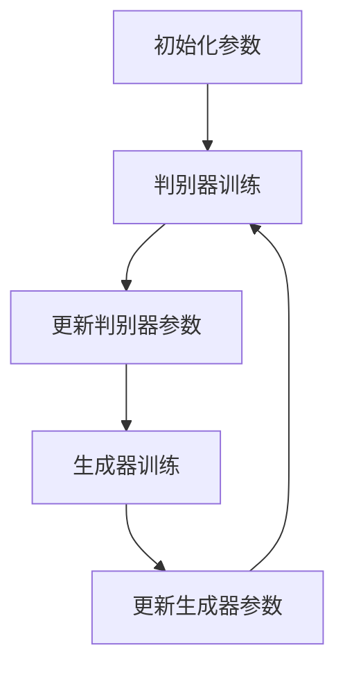
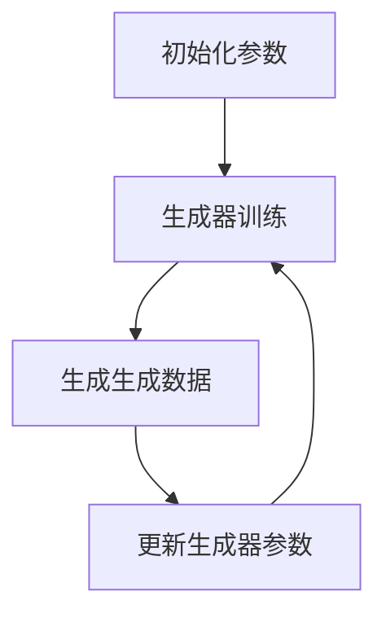

                 

### 第1章 引言

#### 1.1 本书背景与目的

生成对抗网络（GAN）自2014年由Ian Goodfellow等人提出以来，已经在计算机视觉、自然语言处理、医学图像生成等领域取得了显著的成果。虚拟试妆系统作为GAN应用的一个重要场景，通过对用户面部图像的精准处理，能够模拟出多种化妆效果，为用户提供个性化的试妆体验。

本书旨在详细介绍生成对抗网络在虚拟试妆系统中的应用，通过系统的理论讲解和实际案例分析，帮助读者深入理解GAN的工作原理及其在虚拟试妆系统中的具体实现。本书主要面向以下读者群体：

1. 计算机视觉和人工智能领域的研究人员和技术开发者。
2. 对虚拟试妆系统和GAN技术感兴趣的学生和爱好者。
3. 想要在实际项目中应用GAN技术，提升虚拟试妆系统性能的技术工程师。

本书共分为七个章节，各章节主要内容如下：

- **第1章 引言**：介绍本书的背景、目的及主要读者群体，概述虚拟试妆系统和生成对抗网络的基本概念。
- **第2章 生成对抗网络基础**：详细讲解生成对抗网络的基本概念、经典架构和变种，以及GAN的训练过程和优化方法。
- **第3章 虚拟试妆系统的构建**：介绍虚拟试妆系统的功能模块、系统架构及开发流程。
- **第4章 数学模型与公式解析**：深入解析生成对抗网络的数学模型，包括判别器和生成器的损失函数及总损失函数。
- **第5章 项目实战**：通过实际项目案例，讲解虚拟试妆系统的搭建、数据集准备与处理、模型训练与评估。
- **第6章 性能优化与评估**：讨论虚拟试妆系统的性能优化方法和评估指标，包括生成质量和试妆效果的评估。
- **第7章 未来发展趋势与应用场景**：展望生成对抗网络在虚拟试妆系统中的未来发展趋势和潜在应用场景。

通过阅读本书，读者将能够：

1. 理解生成对抗网络的基本原理及其在虚拟试妆系统中的应用。
2. 掌握虚拟试妆系统的构建方法和关键技术。
3. 学习如何优化和评估虚拟试妆系统的性能。
4. 获取实际项目实战经验，提升在虚拟试妆系统开发中的实践能力。

#### 1.2 虚拟试妆系统简介

虚拟试妆系统是一种通过计算机图形学和人工智能技术，模拟真实化妆效果的应用系统。它能够根据用户的面部特征和个性化需求，生成符合预期的化妆效果，为用户提供逼真的试妆体验。

虚拟试妆系统的核心功能包括：

1. **人脸识别与定位**：系统能够通过计算机视觉技术识别人脸并进行精确的定位，确保化妆效果贴合面部轮廓。
2. **化妆效果生成**：系统利用深度学习模型，将用户选择的妆容效果映射到人脸图像上，生成符合用户需求的化妆效果。
3. **实时交互与反馈**：用户可以通过界面实时查看化妆效果，并对妆容进行调整，获得个性化的试妆体验。
4. **数据收集与优化**：系统在用户试妆过程中收集数据，用于模型优化和性能提升，进一步提高虚拟试妆的准确性。

虚拟试妆系统在美妆行业、电商、社交媒体等领域具有广泛的应用前景。例如，在美妆电商中，虚拟试妆系统可以提升用户体验，增加用户购买的信心；在社交媒体上，用户可以通过虚拟试妆系统分享自己的妆容，获得更多关注和互动。

#### 1.3 生成对抗网络简介

生成对抗网络（GAN）是一种由生成器（Generator）和判别器（Discriminator）组成的深度学习模型，旨在通过两个模型的对抗训练，实现生成逼真数据的任务。GAN由Ian Goodfellow等人在2014年提出，迅速成为深度学习领域的研究热点，并在计算机视觉、自然语言处理、医学图像生成等领域取得了显著成果。

GAN的基本原理可以概括为“生成器”和“判别器”之间的对抗博弈。生成器的目标是通过输入随机噪声生成逼真的数据，而判别器的目标则是区分输入数据是真实数据还是生成数据。在训练过程中，生成器和判别器交替更新参数，以实现各自的目标。具体来说：

1. **生成器（Generator）**：生成器的任务是将随机噪声映射为逼真的数据。它通过一个复杂的神经网络结构，将随机噪声转化为高维数据，例如图像、声音或文本。生成器的目标是尽可能地生成出与真实数据相似的数据，使得判别器无法区分。
2. **判别器（Discriminator）**：判别器的任务是判断输入数据是真实数据还是生成数据。它也是一个复杂的神经网络结构，接收真实数据和生成数据的输入，并输出一个概率值，表示输入数据是真实数据的可能性。判别器的目标是尽可能地区分真实数据和生成数据。

GAN的训练过程可以分为以下几个步骤：

1. **初始化参数**：初始化生成器和判别器的参数。
2. **交替训练**：生成器和判别器交替更新参数，以实现各自的目标。具体来说，每次迭代过程中：
   - **生成器的训练**：生成器生成一组伪数据，判别器对其进行判断，生成器的目标是使得判别器对伪数据的判断结果接近0.5。
   - **判别器的训练**：判别器训练真实数据和生成数据，生成器的目标是使得判别器对生成数据的判断结果接近1，对真实数据的判断结果接近0。
3. **重复迭代**：重复以上步骤，直到生成器生成逼真的数据，使得判别器无法区分。

GAN在虚拟试妆系统中的应用前景非常广阔。通过GAN，虚拟试妆系统能够生成高质量的化妆效果，提升用户体验。同时，GAN还可以用于数据增强和模型优化，进一步提高虚拟试妆系统的性能和准确性。

#### 1.4 生成对抗网络在虚拟试妆系统中的应用前景

生成对抗网络（GAN）在虚拟试妆系统中的应用前景广阔，具有以下几个显著的优势和潜在价值：

1. **提升化妆效果逼真度**：GAN通过生成器生成高质量的图像，能够模拟出各种化妆效果，使得试妆结果更加真实、细腻。相比传统方法，GAN生成的化妆效果具有更高的细节和色彩保真度，能够满足用户对化妆效果的高要求。

2. **个性化推荐与用户体验优化**：GAN能够根据用户的面部特征和个性化需求，生成个性化的化妆效果，提供定制化的试妆服务。用户可以通过虚拟试妆系统，轻松尝试不同妆容，找到最适合自己的风格，提升用户体验和满意度。

3. **数据增强与模型优化**：GAN可以用于数据增强，通过生成大量的样本数据，提高训练数据的多样性和丰富度，增强模型的泛化能力。此外，GAN还可以用于模型优化，通过对抗训练，提升生成器和判别器的性能，提高虚拟试妆系统的准确性和稳定性。

4. **减少对真实数据的依赖**：虚拟试妆系统通常需要大量真实的人脸图像数据进行训练，而GAN可以生成高质量的人脸图像，减少对真实数据的依赖。这对于数据稀缺或者无法获取真实数据的场景尤为重要，例如在个人隐私保护较高的应用场景中。

5. **跨领域应用**：GAN不仅在美妆行业有广泛应用，还可以拓展到其他领域，如医疗美容、时尚设计、娱乐等。通过GAN，这些领域可以创造出更加逼真、个性化的虚拟体验，提升用户满意度和市场竞争力。

6. **技术与产业结合**：随着GAN技术的不断发展和成熟，虚拟试妆系统有望成为美妆产业的新宠。通过技术与产业的结合，虚拟试妆系统将推动美妆行业的数字化转型，实现从生产、销售到用户体验的全面升级。

总之，生成对抗网络在虚拟试妆系统中的应用具有巨大的潜力和前景。通过GAN，虚拟试妆系统能够实现更高质量、更个性化的化妆效果，提升用户体验，拓展应用场景，为美妆行业带来新的发展机遇。随着技术的不断进步，GAN在虚拟试妆系统中的应用将更加深入和广泛，为行业带来更多创新和变革。


----------------------------------------------------------------

### 第2章 生成对抗网络基础

本章将详细讲解生成对抗网络（GAN）的基础概念，包括生成器与判别器的定义、经典GAN架构的介绍以及GAN的训练过程。此外，还将探讨GAN的一些变种和优化方法，以帮助读者全面理解GAN的核心原理和技术。

#### 2.1 生成对抗网络的基本概念

生成对抗网络（GAN）由生成器（Generator）和判别器（Discriminator）两个核心组成部分构成。生成器和判别器通过对抗训练，相互竞争、相互合作，最终实现生成高质量数据的目标。

**生成器（Generator）**

生成器的任务是生成逼真的数据，以欺骗判别器，使得判别器无法区分生成的数据和真实数据。生成器通常是一个深度神经网络，接受随机噪声作为输入，通过多层非线性变换，生成与真实数据相似的高维数据。

生成器的目标函数为：
$$
L_G = -\log(D(G(z))
$$
其中，$G(z)$ 是生成器生成的数据，$D(G(z))$ 是判别器对生成数据的判断概率。

**判别器（Discriminator）**

判别器的任务是判断输入数据是真实数据还是生成数据。判别器也是一个深度神经网络，接受真实数据和生成数据的输入，并输出一个概率值，表示输入数据是真实数据的可能性。

判别器的目标函数为：
$$
L_D = -[\log(D(x)) + \log(1 - D(G(z))]
$$
其中，$x$ 是真实数据，$G(z)$ 是生成器生成的数据。

**对抗训练**

GAN的训练过程是一种对抗训练，生成器和判别器通过交替训练，相互竞争、相互合作，最终实现各自的目标。具体训练过程如下：

1. 初始化生成器 $G$ 和判别器 $D$ 的参数。
2. 对于每个训练迭代 $t$：
   - 生成器训练：固定判别器 $D$ 的参数，生成随机噪声 $z_t$，生成生成数据 $G(z_t)$，计算生成器的损失函数，并使用梯度下降法更新生成器的参数。
   - 判别器训练：固定生成器 $G$ 的参数，从真实数据集 $X$ 中采样真实数据 $x_t$，同时生成随机噪声 $z_t$ 和生成数据 $G(z_t)$，计算判别器的损失函数，并使用梯度下降法更新判别器的参数。

3. 重复上述步骤，直到生成器生成逼真的数据，使得判别器无法区分。

#### 2.2 经典GAN架构

GAN的经典架构由生成器和判别器两部分组成，分别负责生成数据和判断数据。下面将详细介绍生成器和判别器的具体结构和训练过程。

**生成器**

生成器的结构通常是一个多层全连接神经网络或卷积神经网络。生成器的输入是随机噪声向量 $z$，通过多层非线性变换，生成与真实数据相似的高维数据。在生成图像时，生成器通常采用卷积神经网络，利用卷积层、池化层和上采样层等结构，逐步构建出图像的细节。

以下是一个简单的生成器伪代码：

```python
def generator(z):
    # 输入噪声向量 z
    # 第一层：线性变换
    hidden1 = lin(z)
    # 第二层：ReLU激活函数
    hidden2 = ReLU(hidden1)
    # 第三层：线性变换
    hidden3 = lin(hidden2)
    # 输出生成图像
    output = tanh(hidden3)
    return output
```

**判别器**

判别器的结构通常也是一个多层全连接神经网络或卷积神经网络。判别器的输入是真实数据或生成数据，通过多层非线性变换，输出一个概率值，表示输入数据是真实数据的可能性。

以下是一个简单的判别器伪代码：

```python
def discriminator(x):
    # 输入真实数据或生成数据 x
    # 第一层：线性变换
    hidden1 = lin(x)
    # 第二层：ReLU激活函数
    hidden2 = ReLU(hidden1)
    # 输出概率值
    output = lin(hidden2)
    return output
```

**GAN的训练过程**

GAN的训练过程是生成器和判别器之间的对抗博弈。具体训练步骤如下：

1. **初始化参数**：初始化生成器 $G$ 和判别器 $D$ 的参数。
2. **交替训练**：
   - **生成器训练**：固定判别器 $D$ 的参数，生成随机噪声 $z_t$，生成生成数据 $G(z_t)$，计算生成器的损失函数，并使用梯度下降法更新生成器的参数。
   - **判别器训练**：固定生成器 $G$ 的参数，从真实数据集 $X$ 中采样真实数据 $x_t$，同时生成随机噪声 $z_t$ 和生成数据 $G(z_t)$，计算判别器的损失函数，并使用梯度下降法更新判别器的参数。
3. **重复训练**：重复上述步骤，直到生成器生成逼真的数据，使得判别器无法区分。

#### 2.3 GAN的变种

虽然经典GAN架构取得了显著成果，但在训练过程中仍存在一些挑战，如训练不稳定、生成器生成数据质量差等问题。为了解决这些问题，研究者提出了许多GAN的变种。以下介绍几种常见的GAN变种：

**深度卷积生成对抗网络（DCGAN）**

深度卷积生成对抗网络（DCGAN）是GAN的一个改进版本，采用卷积神经网络结构，在生成器和判别器中引入批量归一化（Batch Normalization）和ReLU激活函数，提高了模型的训练稳定性和生成数据质量。

以下是一个简单的DCGAN生成器伪代码：

```python
def generator(z):
    # 输入噪声向量 z
    # 第一层：线性变换
    hidden1 = conv(z)
    # 第二层：批量归一化
    hidden2 = batch_norm(hidden1)
    # 第三层：ReLU激活函数
    hidden3 = ReLU(hidden2)
    # 输出生成图像
    output = conv_transpose(hidden3)
    return output
```

**Wasserstein生成对抗网络（WGAN）**

Wasserstein生成对抗网络（WGAN）引入了Wasserstein距离作为对抗损失函数，解决了GAN训练不稳定的问题。WGAN采用梯度惩罚（Gradient Penalty）技术，确保判别器在训练过程中保持光滑性，提高了训练的稳定性和生成数据质量。

以下是一个简单的WGAN判别器伪代码：

```python
def discriminator(x):
    # 输入真实数据或生成数据 x
    # 第一层：线性变换
    hidden1 = conv(x)
    # 第二层：Leaky ReLU激活函数
    hidden2 = LeakyReLU(hidden1)
    # 输出概率值
    output = conv(hidden2)
    return output
```

**空间变换网络（STGAN）**

空间变换网络（STGAN）是GAN在图像风格迁移领域的应用。STGAN引入了空间变换模块（Spatial Transformer），能够将生成器生成的图像进行空间变换，实现更灵活的图像风格迁移。

以下是一个简单的STGAN生成器伪代码：

```python
def generator(z, x):
    # 输入噪声向量 z 和输入图像 x
    # 第一层：线性变换
    hidden1 = conv(z)
    # 第二层：空间变换模块
    hidden2 = spatial_transform(hidden1)
    # 第三层：卷积转置
    hidden3 = conv_transpose(hidden2)
    # 输出生成图像
    output = conv_transpose(hidden3)
    return output
```

以上是几种常见的GAN变种，每种变种都有其特定的应用场景和优势。通过了解这些变种，读者可以更灵活地选择适合自己需求的技术方案。

#### 2.4 生成对抗网络的挑战与优化方法

尽管生成对抗网络（GAN）在许多领域取得了显著成果，但其在训练过程中仍面临一些挑战。以下将介绍GAN的训练不稳定问题、解决方法以及优化技巧。

**GAN的训练不稳定问题**

GAN的训练不稳定问题是GAN研究中一个长期存在的问题。在GAN的训练过程中，生成器和判别器之间的对抗博弈可能导致训练过程中的不稳定现象，如生成器生成低质量数据、判别器过拟合等。这些不稳定现象会对GAN的性能产生负面影响。

**解决方法**

为了解决GAN的训练不稳定问题，研究者提出了多种方法，包括以下几种：

1. **梯度惩罚（Gradient Penalty）**：Wasserstein生成对抗网络（WGAN）引入了梯度惩罚技术，通过限制判别器的梯度范数，确保判别器在训练过程中保持光滑性，从而提高训练稳定性。
2. **批量归一化（Batch Normalization）**：在生成器和判别器中引入批量归一化，可以缓解梯度消失和梯度爆炸等问题，提高模型的训练稳定性。
3. **L2正则化**：在生成器和判别器的损失函数中添加L2正则化项，可以降低模型的过拟合风险，提高训练稳定性。
4. **学习率调整**：在GAN的训练过程中，合理设置生成器和判别器的学习率，可以避免模型在训练过程中出现过拟合或欠拟合现象，提高训练稳定性。

**优化技巧**

除了上述解决方法，以下是一些GAN的优化技巧：

1. **训练策略**：采用自适应训练策略，如Adam优化器，可以自适应调整学习率，提高模型的训练效率。
2. **生成器和判别器的交替训练**：在GAN的训练过程中，交替训练生成器和判别器，确保两者在训练过程中相互配合，提高训练效果。
3. **数据增强**：通过数据增强技术，如随机裁剪、旋转、缩放等，增加训练数据的多样性和丰富度，提高模型的泛化能力。
4. **早期停止**：在GAN的训练过程中，通过监控生成器的性能指标，如生成图像的质量，提前停止训练，避免过拟合和训练时间过长。

通过以上优化技巧，GAN的训练稳定性可以得到显著提高，从而生成更高质量的生成数据。

本章详细介绍了生成对抗网络（GAN）的基础概念、经典架构、变种以及优化方法。通过本章的学习，读者可以全面了解GAN的核心原理和技术，为后续章节的深入探讨打下坚实的基础。在接下来的章节中，我们将进一步探讨虚拟试妆系统的构建方法和GAN在其中的具体应用。


----------------------------------------------------------------

### 第3章 虚拟试妆系统的构建

在了解了生成对抗网络（GAN）的基本原理和架构之后，我们将进一步探讨如何在虚拟试妆系统中实现GAN，构建一个功能完整、性能卓越的虚拟试妆系统。

#### 3.1 虚拟试妆系统概述

虚拟试妆系统是一种基于计算机视觉和人工智能技术，帮助用户在线试妆的应用系统。它通过识别用户的面部特征，将用户选择的妆容效果精准地映射到面部图像上，为用户提供个性化的试妆体验。

虚拟试妆系统的核心功能包括：

1. **人脸识别与定位**：系统通过计算机视觉技术识别人脸并进行精确的定位，提取关键面部特征点，确保后续妆容效果的贴合度。
2. **化妆效果生成**：利用GAN技术，系统将用户选择的妆容效果映射到面部图像上，生成逼真的化妆效果。
3. **实时交互与反馈**：用户可以通过界面实时查看化妆效果，并对妆容进行调整，获得个性化的试妆体验。
4. **数据收集与优化**：系统在用户试妆过程中收集数据，用于模型优化和性能提升，进一步提高虚拟试妆的准确性。

虚拟试妆系统在美妆电商、社交媒体、美容院等场景中具有广泛的应用。通过虚拟试妆系统，用户可以在线尝试不同妆容，提升购买信心，商家可以提供更加个性化的服务，增加用户粘性和转化率。

#### 3.2 系统架构

虚拟试妆系统的架构可以分为前端、后端和数据库三个主要部分。

**前端**

前端负责用户界面展示和用户交互。主要功能包括：

1. **用户注册与登录**：用户可以通过账号密码注册并登录系统。
2. **试妆界面**：用户可以选择不同的妆容效果，通过拖拽或点击的方式将其应用到面部图像上。
3. **效果预览与保存**：用户可以实时查看化妆效果，并对妆容进行调整。保存后的试妆结果可以用于分享或作为购买决策的参考。

**后端**

后端负责业务逻辑处理和数据存储。主要功能包括：

1. **人脸识别与定位**：系统通过深度学习模型，识别人脸并进行精确的定位，提取关键面部特征点。
2. **妆容效果生成**：利用GAN技术，系统将用户选择的妆容效果映射到面部图像上，生成逼真的化妆效果。
3. **数据存储与管理**：系统将用户试妆数据存储在数据库中，便于后续的数据分析和优化。
4. **用户服务**：系统提供用户相关的服务，如用户信息管理、试妆记录查询等。

**数据库**

数据库负责存储系统中的各类数据，包括用户信息、试妆数据、妆容数据等。常见的数据库技术有MySQL、MongoDB等。

#### 3.3 系统开发流程

虚拟试妆系统的开发流程可以分为需求分析、系统设计、编码实现、测试与部署等阶段。

**需求分析**

在需求分析阶段，明确系统的功能需求、性能需求、安全需求等。具体包括：

1. **用户需求**：用户需要能够在线试妆，查看和调整化妆效果，保存和分享试妆结果。
2. **业务需求**：商家需要能够管理用户信息，分析试妆数据，优化服务体验。
3. **性能需求**：系统需要能够快速处理大量用户请求，提供稳定的试妆体验。

**系统设计**

在系统设计阶段，确定系统的架构、模块划分、数据库设计等。具体包括：

1. **架构设计**：根据需求分析，设计前端、后端和数据库的架构，确保系统的高效性和可扩展性。
2. **模块划分**：将系统功能划分为多个模块，明确各模块的职责和接口。
3. **数据库设计**：设计数据库表结构，确保数据的完整性和一致性。

**编码实现**

在编码实现阶段，根据系统设计，使用合适的编程语言和框架进行编码。具体包括：

1. **前端开发**：使用HTML、CSS、JavaScript等前端技术，实现用户界面和交互逻辑。
2. **后端开发**：使用Python、Java、Node.js等后端技术，实现业务逻辑处理和数据存储。
3. **模型训练与优化**：使用TensorFlow、PyTorch等深度学习框架，训练GAN模型并优化性能。

**测试与部署**

在测试与部署阶段，对系统进行全面测试，确保功能完整、性能稳定。具体包括：

1. **单元测试**：对系统中的各个模块进行单元测试，确保模块功能的正确性。
2. **集成测试**：对系统进行集成测试，确保各模块之间的交互正常。
3. **性能测试**：对系统进行性能测试，确保系统在高并发情况下能够稳定运行。
4. **部署上线**：将系统部署到服务器，进行实际运行，并进行监控和维护。

通过以上开发流程，虚拟试妆系统可以高效、稳定地实现用户需求，提供优质的试妆体验。

#### 3.4 数据集的准备与处理

数据集的质量对GAN的性能和效果至关重要。虚拟试妆系统需要准备大量高质量的人脸图像数据集，包括不同的肤色、年龄、性别和化妆效果。以下介绍数据集的准备与处理过程。

**数据集的收集**

数据集的收集可以从多个渠道获取，如公共数据集、社交媒体和电商平台等。常用的公共数据集有CelebA、AFW、LFW等，这些数据集提供了大量高质量的人脸图像。同时，可以通过爬虫技术从社交媒体和电商平台获取用户上传的人脸图像。

**数据预处理**

在收集到人脸图像数据后，需要进行预处理，以提高数据的质量和模型的训练效果。数据预处理主要包括以下步骤：

1. **图像增强**：通过随机裁剪、翻转、旋转等操作，增加数据集的多样性，提高模型的泛化能力。
2. **人脸检测与分割**：使用人脸检测算法，识别人脸区域，并进行分割，提取出完整的面部图像。
3. **图像归一化**：将图像尺寸调整为统一的分辨率，如128x128或256x256，并归一化像素值，使其在[0, 1]范围内。
4. **数据清洗**：去除数据集中的噪声和异常值，如遮挡、模糊的人脸图像。

**数据增强**

数据增强是提高GAN性能的重要手段，通过生成更多样化的数据，提高模型的泛化能力。常用的数据增强方法包括：

1. **颜色增强**：调整图像的亮度、对比度和饱和度，增强图像的视觉效果。
2. **风格迁移**：将不同风格的图像迁移到人脸图像上，增加数据集的多样性。
3. **噪声注入**：在人脸图像上添加噪声，模拟不同的拍摄环境，提高模型的鲁棒性。

通过以上数据集的准备与处理，虚拟试妆系统可以构建一个高质量、多样化的数据集，为GAN训练提供良好的基础。

#### 3.5 基于GAN的虚拟试妆算法实现

基于GAN的虚拟试妆算法是虚拟试妆系统的核心，其目标是通过GAN模型生成高质量的化妆效果，满足用户的个性化需求。以下介绍基于GAN的虚拟试妆算法的实现步骤。

**生成器的构建**

生成器的构建是GAN模型实现的关键步骤，其目标是生成逼真的化妆效果。生成器通常采用深度卷积神经网络（DCGAN）结构，包括卷积层、卷积转置层和批量归一化层等。以下是一个简单的生成器伪代码：

```python
class Generator(nn.Module):
    def __init__(self):
        super(Generator, self).__init__()
        # 输入噪声向量 z，维度为 [batch_size, z_dim]
        self.z_dim = z_dim
        # 第一层：线性变换
        self.fc = nn.Linear(z_dim, ngf * 4 * 4)
        # 第二层：批量归一化
        self.bn1 = nn.BatchNorm1d(ngf * 4 * 4)
        # 第三层：ReLU激活函数
        self.relu = nn.ReLU(True)
        # 卷积转置层
        self.deconv1 = nn.ConvTranspose2d(ngf * 4, ngf * 2, 4, 2, 1)
        self.bn2 = nn.BatchNorm2d(ngf * 2)
        self.relu = nn.ReLU(True)
        # 第四层：卷积转置层
        self.deconv2 = nn.ConvTranspose2d(ngf * 2, ngf, 4, 2, 1)
        self.bn3 = nn.BatchNorm2d(ngf)
        self.relu = nn.ReLU(True)
        # 第五层：卷积转置层
        self.deconv3 = nn.ConvTranspose2d(ngf, nc, 4, 2, 1)
        self.tanh = nn.Tanh()

    def forward(self, input):
        x = self.fc(input)
        x = self.bn1(x)
        x = self.relu(x)
        x = x.view(x.size(0), ngf * 4, 4, 4)
        x = self.deconv1(x)
        x = self.bn2(x)
        x = self.relu(x)
        x = self.deconv2(x)
        x = self.bn3(x)
        x = self.relu(x)
        x = self.deconv3(x)
        x = self.tanh(x)
        return x
```

**判别器的构建**

判别器的构建是GAN模型实现的另一个关键步骤，其目标是区分真实图像和生成图像。判别器通常采用深度卷积神经网络结构，包括卷积层和批量归一化层等。以下是一个简单的判别器伪代码：

```python
class Discriminator(nn.Module):
    def __init__(self):
        super(Discriminator, self).__init__()
        # 输入图像，维度为 [batch_size, nc, img_height, img_width]
        self.nc = nc
        self.ndf = ndf
        # 第一层：卷积层
        self.conv1 = nn.Conv2d(nc, ndf, 4, 2, 1)
        self.lrelu = nn.LeakyReLU(negative_slope=0.2, inplace=True)
        # 第二层：卷积层
        self.conv2 = nn.Conv2d(ndf, ndf * 2, 4, 2, 1)
        self.bn2 = nn.BatchNorm2d(ndf * 2)
        self.lrelu = nn.LeakyReLU(negative_slope=0.2, inplace=True)
        # 第三层：卷积层
        self.conv3 = nn.Conv2d(ndf * 2, ndf * 4, 4, 2, 1)
        self.bn3 = nn.BatchNorm2d(ndf * 4)
        self.lrelu = nn.LeakyReLU(negative_slope=0.2, inplace=True)
        # 输出层：卷积层
        self.conv4 = nn.Conv2d(ndf * 4, 1, 4, 1, 0)
    
    def forward(self, input):
        x = self.conv1(input)
        x = self.lrelu(x)
        x = self.conv2(x)
        x = self.bn2(x)
        x = self.lrelu(x)
        x = self.conv3(x)
        x = self.bn3(x)
        x = self.lrelu(x)
        x = self.conv4(x)
        return x
```

**损失函数与优化器选择**

在GAN的训练过程中，生成器和判别器的损失函数和优化器选择至关重要。常用的损失函数有二元交叉熵（Binary Cross-Entropy）和Wasserstein距离。优化器通常选择Adam优化器。

以下是一个简单的损失函数和优化器伪代码：

```python
criterion = nn.BCELoss()
optimizerD = optim.Adam(netD.parameters(), lr=lr, betas=(beta1, 0.999))
optimizerG = optim.Adam(netG.parameters(), lr=lr, betas=(beta1, 0.999))

for epoch in range(num_epochs):
    for i, data in enumerate(dataloader, 0):
        # 更新判别器
        netD.zero_grad()
        realImg = data[0].to(device)
        batch_size = realImg.size(0)
        label = torch.full((batch_size,), real_label, device=device)
        output = netD(realImg).view(-1)
        errD_real = criterion(output, label)
        errD_real.backward()

        noise = torch.randn(batch_size, nz, 1, 1, device=device)
        fakeImg = netG(noise)
        label.fill_(fake_label)
        output = netD(fakeImg.detach()).view(-1)
        errD_fake = criterion(output, label)
        errD_fake.backward()
        optimizerD.step()

        # 更新生成器
        netG.zero_grad()
        label.fill_(real_label)
        output = netD(fakeImg).view(-1)
        errG = criterion(output, label)
        errG.backward()
        optimizerG.step()

        # 输出训练信息
        if i % 50 == 0:
            print('[%d/%d][%d/%d] Loss_D: %.4f Loss_G: %.4f' %
                  (epoch, num_epochs, i, len(dataloader), errD_real+errD_fake, errG))
```

通过以上步骤，可以构建一个基于GAN的虚拟试妆算法。在实际应用中，还可以根据具体需求进行优化和调整，以提高系统的性能和用户体验。

本章详细介绍了虚拟试妆系统的构建过程，包括系统架构、开发流程、数据集准备与处理以及基于GAN的虚拟试妆算法实现。通过本章的学习，读者可以了解如何构建一个功能完整、性能卓越的虚拟试妆系统，并为后续章节的深入探讨打下坚实基础。在接下来的章节中，我们将进一步探讨GAN的数学模型、训练过程以及项目实战，帮助读者全面掌握GAN在虚拟试妆系统中的应用。


----------------------------------------------------------------

### 第4章 数学模型与公式解析

生成对抗网络（GAN）作为虚拟试妆系统的核心算法，其数学模型和训练过程至关重要。本章将深入解析GAN的数学模型，包括判别器和生成器的损失函数以及总损失函数。此外，还将详细解释GAN的训练过程，并使用Mermaid流程图展示生成器和判别器的交互流程。

#### 4.1 GAN的数学模型

GAN的数学模型由生成器（Generator）和判别器（Discriminator）两部分组成。生成器的目标是生成逼真的数据，而判别器的目标是区分真实数据和生成数据。通过这两个模型的对抗训练，GAN能够实现高质量数据的生成。

**生成器的损失函数**

生成器的损失函数通常使用二元交叉熵（Binary Cross-Entropy）损失，表示为：
$$
L_G = -\mathbb{E}_{z \sim p_z(z)}[\log(D(G(z))]
$$
其中，$G(z)$ 表示生成器生成的数据，$D(G(z))$ 表示判别器对生成数据的判断概率。生成器的目标是最大化判别器的输出概率，使得 $D(G(z))$ 接近1。

**判别器的损失函数**

判别器的损失函数同样使用二元交叉熵（Binary Cross-Entropy）损失，表示为：
$$
L_D = -[\mathbb{E}_{x \sim p_{data}(x)}[\log(D(x))] + \mathbb{E}_{z \sim p_z(z)}[\log(1 - D(G(z)))]
$$
其中，$x$ 表示真实数据，$D(x)$ 表示判别器对真实数据的判断概率。判别器的目标是最大化对真实数据的判断概率（接近1）和对生成数据的判断概率（接近0）。

**总损失函数**

GAN的总损失函数是生成器损失函数和判别器损失函数的总和，表示为：
$$
L = L_D + L_G
$$

#### 4.2 GAN的训练过程

GAN的训练过程是一个交替训练的过程，生成器和判别器在训练过程中交替更新参数，以实现各自的目标。

**判别器的训练**

在判别器的训练过程中，固定生成器的参数，通过训练真实数据和生成数据，更新判别器的参数。具体步骤如下：

1. 从真实数据集 $p_{data}(x)$ 中随机抽取一个批次真实数据 $x_t$。
2. 从先验分布 $p_z(z)$ 中随机抽取一个批次噪声 $z_t$。
3. 使用生成器 $G$ 生成生成数据 $G(z_t)$。
4. 更新判别器 $D$ 的参数，使得判别器对真实数据的判断概率最大化，对生成数据的判断概率最小化。

**生成器的训练**

在生成器的训练过程中，固定判别器的参数，通过生成生成数据，更新生成器的参数。具体步骤如下：

1. 从先验分布 $p_z(z)$ 中随机抽取一个批次噪声 $z_t$。
2. 使用生成器 $G$ 生成生成数据 $G(z_t)$。
3. 更新生成器 $G$ 的参数，使得判别器对生成数据的判断概率最大化。

**训练技巧**

1. **学习率**：生成器和判别器通常使用不同的学习率，生成器使用较小的学习率，避免生成器过拟合，判别器使用较大的学习率，提高判别器的训练效果。
2. **梯度惩罚**：在Wasserstein GAN（WGAN）中，使用梯度惩罚技术，限制判别器的梯度范数，保证判别器在训练过程中保持光滑性。
3. **批量大小**：批量大小影响GAN的训练效果，通常选择较小的批量大小，避免梯度消失和梯度爆炸问题。

#### 4.3 Mermaid流程图

以下是一个简单的Mermaid流程图，展示生成器和判别器的交互流程：



**生成器的交互流程**：



通过以上数学模型和训练过程的解析，读者可以深入理解GAN的工作原理和训练方法。在下一章中，我们将结合实际项目，讲解GAN在虚拟试妆系统中的应用和实践。


----------------------------------------------------------------

### 第5章 项目实战

在本章中，我们将通过一个具体的虚拟试妆项目，详细讲解如何搭建和部署虚拟试妆系统，处理数据集，训练和评估GAN模型，以及代码的实现和解读。

#### 5.1 虚拟试妆系统的实际应用

虚拟试妆系统在实际应用中具有广泛的应用场景，例如美妆电商、社交媒体、美容院等。通过虚拟试妆系统，用户可以在家中尝试不同妆容，提高购买信心；商家可以提供更加个性化的服务，增加用户粘性和转化率。以下是虚拟试妆系统的实际应用案例：

**案例1：美妆电商平台**

某知名美妆电商平台引入虚拟试妆系统，为用户提供在线试妆服务。用户在浏览商品时，可以一键开启虚拟试妆功能，根据个人喜好选择不同妆容效果。系统通过用户的面部图像，实时生成试妆效果，用户可以查看、调整并保存试妆结果，方便做出购买决策。

**案例2：社交媒体**

某大型社交媒体平台推出虚拟试妆功能，用户可以在平台上分享自己的妆容。通过虚拟试妆系统，用户可以尝试多种妆容风格，并与朋友互动，获得更多关注和点赞。平台还可以通过分析用户试妆数据，推荐个性化的美妆产品和服务，提升用户体验。

**案例3：美容院**

某连锁美容院引入虚拟试妆系统，为顾客提供在线试妆服务。顾客可以在美容院线下体验虚拟试妆，了解不同妆容效果，并根据试妆结果选择适合自己的美容服务和产品。美容院可以通过虚拟试妆系统收集用户数据，个性化推荐服务和产品，提高客户满意度和复购率。

#### 5.2 系统搭建与部署

虚拟试妆系统的搭建和部署可以分为以下几个步骤：

**1. 硬件环境搭建**

虚拟试妆系统需要一定的硬件资源支持，包括服务器、GPU（用于训练GAN模型）等。硬件配置要求如下：

- **CPU**：至少2核，建议4核以上
- **内存**：至少8GB，建议16GB以上
- **GPU**：NVIDIA GPU，显存至少4GB
- **硬盘**：至少500GB，建议1TB以上

**2. 软件环境搭建**

虚拟试妆系统的软件环境包括操作系统、编程语言和深度学习框架等。建议使用以下软件环境：

- **操作系统**：Ubuntu 18.04或更高版本
- **编程语言**：Python 3.6或更高版本
- **深度学习框架**：TensorFlow 2.x或PyTorch 1.8或更高版本

**3. 数据集准备**

虚拟试妆系统需要大量高质量的人脸图像数据集。数据集可以从公共数据集（如CelebA、AFW、LFW等）获取，或者通过爬虫技术从社交媒体和电商平台获取。数据集的预处理步骤包括：

- **图像增强**：通过随机裁剪、翻转、旋转等操作，增加数据集的多样性。
- **人脸检测与分割**：使用人脸检测算法，识别人脸并进行分割，提取出完整的面部图像。
- **图像归一化**：将图像尺寸调整为统一的分辨率，如128x128或256x256，并归一化像素值，使其在[0, 1]范围内。

**4. 模型训练**

虚拟试妆系统的核心是GAN模型，使用深度学习框架（如TensorFlow或PyTorch）进行训练。以下是一个简单的GAN模型训练步骤：

- **初始化参数**：初始化生成器 $G$ 和判别器 $D$ 的参数。
- **交替训练**：生成器和判别器交替更新参数，通过交替训练，实现对抗博弈。
- **保存模型**：在训练过程中，定期保存模型参数，便于后续加载和使用。

**5. 系统部署**

虚拟试妆系统的部署可以分为以下步骤：

- **搭建Web应用**：使用Web框架（如Django或Flask）搭建Web应用，提供用户界面和API接口。
- **部署模型**：将训练好的GAN模型部署到服务器，使用模型进行图像生成和处理。
- **测试与优化**：对系统进行测试，确保功能完整、性能稳定。根据测试结果，优化模型和系统性能。

#### 5.3 数据集的准备与处理

虚拟试妆系统的训练和部署需要大量高质量的人脸图像数据集。以下介绍数据集的收集、预处理和增强方法：

**1. 数据集收集**

数据集可以从以下渠道收集：

- **公共数据集**：如CelebA、AFW、LFW等，这些数据集提供了大量高质量的人脸图像。
- **社交媒体**：通过爬虫技术，从社交媒体平台（如Instagram、Facebook等）获取用户上传的人脸图像。
- **电商平台**：从电商平台（如淘宝、京东等）获取用户上传的商品试用图片。

**2. 数据预处理**

数据预处理包括以下步骤：

- **图像增强**：通过随机裁剪、翻转、旋转等操作，增加数据集的多样性。
- **人脸检测与分割**：使用人脸检测算法（如MTCNN、Dlib等），识别人脸并进行分割，提取出完整的面部图像。
- **图像归一化**：将图像尺寸调整为统一的分辨率（如128x128或256x256），并归一化像素值，使其在[0, 1]范围内。

**3. 数据增强**

数据增强是提高GAN模型性能的重要手段，以下介绍几种常用的数据增强方法：

- **颜色增强**：调整图像的亮度、对比度和饱和度，增强图像的视觉效果。
- **风格迁移**：将不同风格的图像迁移到人脸图像上，增加数据集的多样性。
- **噪声注入**：在人脸图像上添加噪声，模拟不同的拍摄环境，提高模型的鲁棒性。

#### 5.4 模型训练与评估

在虚拟试妆系统中，GAN模型是核心组件，其性能直接影响系统的效果。以下介绍GAN模型的训练和评估方法：

**1. 模型训练**

GAN模型的训练过程包括生成器和判别器的交替训练，以下是一个简单的训练步骤：

- **初始化参数**：初始化生成器 $G$ 和判别器 $D$ 的参数。
- **交替训练**：生成器和判别器交替更新参数，通过交替训练，实现对抗博弈。
  - **生成器训练**：固定判别器 $D$ 的参数，生成随机噪声 $z_t$，生成生成数据 $G(z_t)$，计算生成器的损失函数，并使用梯度下降法更新生成器的参数。
  - **判别器训练**：固定生成器 $G$ 的参数，从真实数据集 $X$ 中采样真实数据 $x_t$，同时生成随机噪声 $z_t$ 和生成数据 $G(z_t)$，计算判别器的损失函数，并使用梯度下降法更新判别器的参数。
- **保存模型**：在训练过程中，定期保存模型参数，便于后续加载和使用。

**2. 模型评估**

GAN模型的评估方法主要包括以下指标：

- **生成质量**：通过评估生成数据的视觉质量，如图像的清晰度、色彩保真度等。
- **判别能力**：评估判别器区分真实数据和生成数据的能力，通常使用准确率（Accuracy）和F1值（F1 Score）等指标。
- **稳定性**：评估GAN模型在训练过程中的稳定性，避免过拟合和欠拟合现象。

以下是一个简单的评估步骤：

- **生成数据评估**：通过人工观察生成数据的视觉效果，评估生成质量。
- **判别能力评估**：通过交叉验证和测试集，评估判别器的准确率和F1值。
- **稳定性评估**：观察训练过程中生成器和判别器的损失函数变化，判断模型是否稳定。

#### 5.5 代码实战

在本节中，我们将通过一个实际案例，详细讲解虚拟试妆系统的代码实现。以下是一个简单的GAN模型实现，使用PyTorch框架：

**环境搭建**

首先，搭建Python和PyTorch的开发环境，安装所需的库：

```bash
pip install torch torchvision
```

**源代码实现**

以下是生成器和判别器的实现：

```python
import torch
import torch.nn as nn
import torch.optim as optim
import torchvision.utils as vutils
from torch.autograd import Variable
from torchvision import datasets, transforms
from torch.utils.data import DataLoader
import os

# 设置随机种子，保证实验可复现
manualSeed = 999
torch.manual_seed(manualSeed)
device = torch.device("cuda" if torch.cuda.is_available() else "cpu")

# 超参数设置
batchSize = 64
imageSize = 128
nz = 100
ngf = 64
ndf = 64
num_epochs = 5
lr = 0.0002
beta1 = 0.5

# 数据预处理
transform = transforms.Compose([
    transforms.Resize(imageSize),
    transforms.ToTensor(),
    transforms.Normalize((0.5, 0.5, 0.5), (0.5, 0.5, 0.5)),
])

# 数据集加载
train_dataset = datasets.ImageFolder(root='./data', transform=transform)
dataloader = DataLoader(train_dataset, batch_size=batchSize, shuffle=True)

# 网络结构定义
class Generator(nn.Module):
    def __init__(self):
        super(Generator, self).__init__()
        self.main = nn.Sequential(
            nn.ConvTranspose2d(nz, ngf * 8, 4, 1, 0, bias=False),
            nn.BatchNorm2d(ngf * 8),
            nn.ReLU(True),
            nn.ConvTranspose2d(ngf * 8, ngf * 4, 4, 2, 1, bias=False),
            nn.BatchNorm2d(ngf * 4),
            nn.ReLU(True),
            nn.ConvTranspose2d(ngf * 4, ngf * 2, 4, 2, 1, bias=False),
            nn.BatchNorm2d(ngf * 2),
            nn.ReLU(True),
            nn.ConvTranspose2d(ngf * 2, ngf, 4, 2, 1, bias=False),
            nn.BatchNorm2d(ngf),
            nn.ReLU(True),
            nn.ConvTranspose2d(ngf, 3, 4, 2, 1, bias=False),
            nn.Tanh()
        )

    def forward(self, input):
        return self.main(input)

class Discriminator(nn.Module):
    def __init__(self):
        super(Discriminator, self).__init__()
        self.main = nn.Sequential(
            nn.Conv2d(3, ndf, 4, 2, 1, bias=False),
            nn.LeakyReLU(0.2, inplace=True),
            nn.Conv2d(ndf, ndf * 2, 4, 2, 1, bias=False),
            nn.BatchNorm2d(ndf * 2),
            nn.LeakyReLU(0.2, inplace=True),
            nn.Conv2d(ndf * 2, ndf * 4, 4, 2, 1, bias=False),
            nn.BatchNorm2d(ndf * 4),
            nn.LeakyReLU(0.2, inplace=True),
            nn.Conv2d(ndf * 4, 1, 4, 1, 0, bias=False),
        )

    def forward(self, input):
        return self.main(input)

# 模型实例化
netG = Generator().to(device)
netD = Discriminator().to(device)

# 损失函数和优化器
criterion = nn.BCELoss()
optimizerD = optim.Adam(netD.parameters(), lr=lr, betas=(beta1, 0.999))
optimizerG = optim.Adam(netG.parameters(), lr=lr, betas=(beta1, 0.999))

# 训练过程
for epoch in range(num_epochs):
    for i, data in enumerate(dataloader, 0):
        # 更新判别器
        netD.zero_grad()
        real_images = data[0].to(device)
        batch_size = real_images.size(0)
        labels = torch.full((batch_size,), real_label, device=device)
        outputs = netD(real_images).view(-1)
        errD_real = criterion(outputs, labels)
        errD_real.backward()

        noise = torch.randn(batch_size, nz, 1, 1, device=device)
        fake_images = netG(noise)
        labels.fill_(fake_label)
        outputs = netD(fake_images.detach()).view(-1)
        errD_fake = criterion(outputs, labels)
        errD_fake.backward()
        optimizerD.step()

        # 更新生成器
        netG.zero_grad()
        labels.fill_(real_label)
        outputs = netD(fake_images).view(-1)
        errG = criterion(outputs, labels)
        errG.backward()
        optimizerG.step()

        # 打印训练信息
        if i % 50 == 0:
            print(f'[{epoch}/{num_epochs}][{i}/{len(dataloader)}] Loss_D: {errD_real+errD_fake:.4f} Loss_G: {errG:.4f}')
```

**代码解读与分析**

上述代码实现了生成器和判别器的构建、训练和评估。以下是对代码的关键部分进行解读：

- **数据预处理**：使用 `transforms.Compose` 组合预处理操作，包括图像的调整、归一化和转换。
- **数据集加载**：使用 `DataLoader` 加载图像数据集，并进行批处理。
- **网络结构定义**：定义生成器和判别器的网络结构，使用卷积层、卷积转置层、批量归一化和ReLU激活函数。
- **优化器和损失函数**：使用Adam优化器进行参数更新，并定义二元交叉熵（Binary Cross-Entropy）损失函数。
- **训练过程**：交替训练生成器和判别器，更新模型参数。在训练过程中，分别计算判别器和生成器的损失函数，并使用梯度下降法进行参数更新。

通过以上代码实现，我们可以搭建一个简单的虚拟试妆系统，并通过GAN模型生成高质量的试妆效果。在实际应用中，可以根据具体需求对代码进行优化和调整，提高系统的性能和用户体验。

本章通过一个实际项目，详细讲解了虚拟试妆系统的搭建与部署、数据集的准备与处理、模型训练与评估，以及代码的实现和解读。通过本章的学习，读者可以掌握GAN在虚拟试妆系统中的应用，并为后续的项目实践打下坚实基础。在接下来的章节中，我们将继续探讨虚拟试妆系统的性能优化与评估，以及未来的发展趋势和应用场景。


----------------------------------------------------------------

### 第6章 性能优化与评估

在虚拟试妆系统中，性能优化是提高系统效率和用户体验的关键环节。本章将详细介绍几种常见的性能优化方法，包括数据增强、模型调整和训练策略，并讨论生成质量和试妆效果的评估指标。

#### 6.1 性能优化方法

**数据增强**

数据增强是提高模型性能的有效方法，通过增加数据集的多样性，提高模型的泛化能力。以下是一些常用的数据增强技术：

1. **随机裁剪**：随机裁剪人脸图像，保留关键面部特征，增加数据集的多样性。
2. **颜色调整**：调整图像的亮度、对比度和饱和度，增强图像的视觉效果。
3. **随机旋转**：随机旋转人脸图像，模拟不同的拍摄角度，提高模型的适应性。
4. **噪声注入**：在人脸图像上添加噪声，模拟不同的拍摄环境，提高模型的鲁棒性。

**模型调整**

模型调整是优化GAN性能的重要手段，通过调整网络结构和超参数，提高生成质量和训练稳定性。以下是一些常见的模型调整方法：

1. **网络结构优化**：调整生成器和判别器的网络结构，增加深度或层数，提高模型的表达能力。
2. **批量归一化**：在生成器和判别器的网络层中使用批量归一化，缓解梯度消失和梯度爆炸问题。
3. **学习率调整**：根据训练过程，动态调整生成器和判别器的学习率，避免过拟合和欠拟合。
4. **权重初始化**：使用适当的权重初始化方法，如He初始化或Xavier初始化，提高模型的训练稳定性。

**训练策略**

合理的训练策略对GAN的性能和训练效率具有重要影响。以下是一些有效的训练策略：

1. **学习率调度**：采用学习率调度策略，如学习率衰减或学习率周期性调整，避免模型在训练过程中过早饱和。
2. **梯度惩罚**：在Wasserstein GAN（WGAN）中使用梯度惩罚技术，限制判别器的梯度范数，保证判别器在训练过程中保持光滑性。
3. **分布式训练**：利用GPU或TPU进行分布式训练，提高训练速度和模型性能。
4. **批量大小调整**：根据硬件资源和训练需求，调整批量大小，平衡训练效率和模型性能。

#### 6.2 评估指标

**生成质量评估**

生成质量是虚拟试妆系统性能的重要指标，通过以下方法评估生成质量：

1. **结构相似性指数（SSIM）**：评估生成图像与真实图像的结构相似度，越高表示生成质量越好。
2. **峰值信噪比（PSNR）**：评估生成图像的噪声水平，越高表示生成质量越好。
3. **图像质量评价（IQE）**：综合评估生成图像的清晰度、对比度和色彩保真度。

**试妆效果评估**

试妆效果是用户对虚拟试妆系统的直接感受，通过以下方法评估试妆效果：

1. **用户满意度调查**：通过问卷调查或用户评分，评估用户对试妆效果的满意度。
2. **试妆效果对比**：将虚拟试妆效果与真实试妆效果进行对比，评估试妆效果的逼真度和准确性。
3. **数据统计分析**：分析用户试妆数据的分布和变化，评估试妆效果的多样性和个性化程度。

通过以上评估指标，可以全面、客观地评估虚拟试妆系统的性能和用户体验。在实际应用中，可以根据评估结果，针对性地优化模型和系统，提高虚拟试妆系统的性能和满意度。

本章详细介绍了虚拟试妆系统的性能优化方法和评估指标，包括数据增强、模型调整和训练策略，以及生成质量和试妆效果的评估。通过本章的学习，读者可以掌握虚拟试妆系统的性能优化技巧，提高系统的性能和用户体验。在下一章中，我们将展望生成对抗网络在虚拟试妆系统中的未来发展趋势和应用场景，为虚拟试妆系统的发展提供新的思路和方向。


----------------------------------------------------------------

### 第7章 未来发展趋势与应用场景

随着生成对抗网络（GAN）技术的不断进步和成熟，虚拟试妆系统在多个领域展现出了巨大的潜力和广阔的应用前景。本章将探讨生成对抗网络在虚拟试妆系统中的未来发展趋势，以及该系统在不同应用场景中的潜力。

#### 7.1 生成对抗网络在虚拟试妆系统中的未来发展趋势

**更逼真的化妆效果**

随着GAN技术的不断改进，生成器将能够生成更高质量的化妆效果。深度学习模型将学会捕捉更多的细节和色彩变化，使得虚拟试妆系统生成的妆容效果更加真实。未来，虚拟试妆系统可能实现毫秒级响应，提供近乎实时的试妆体验。

**个性化定制**

GAN技术的进步将使得虚拟试妆系统能够更好地捕捉用户的面部特征和化妆偏好。通过深度学习算法，系统将能够为每个用户定制个性化的化妆效果，提升用户体验和满意度。个性化定制将扩展到更多化妆产品，如口红、眼影、腮红等。

**多风格切换**

未来，虚拟试妆系统可能会集成更多的风格切换功能，允许用户在多种化妆风格之间自由切换，如自然、浓妆、艺术等。通过GAN，用户可以轻松尝试不同风格的妆容，找到最适合自己的妆容。

**跨平台集成**

随着虚拟试妆系统的成熟，越来越多的平台将集成该功能，包括美妆电商、社交媒体、美容院等。用户可以在不同的设备上（如手机、平板、电脑）轻松尝试不同妆容，实现无缝跨平台体验。

**数据隐私保护**

随着用户对隐私保护的重视，未来的虚拟试妆系统将更加注重数据隐私保护。GAN技术将结合加密技术和隐私保护算法，确保用户数据的安全和隐私。

#### 7.2 虚拟试妆系统的潜在应用场景

**美妆电商**

虚拟试妆系统在美妆电商中有着广泛的应用前景。用户可以在购买前尝试不同妆容，提高购买决策的信心。美妆电商可以通过虚拟试妆系统吸引更多用户，提升销售额和用户满意度。

**社交媒体**

社交媒体平台如Instagram、Facebook等可以集成虚拟试妆系统，用户可以在平台上尝试不同妆容并分享给朋友。这不仅可以增加用户互动，还可以为平台带来更多的用户数据，用于个性化推荐。

**美容院**

美容院可以通过虚拟试妆系统为顾客提供在线试妆服务。顾客可以在线下体验虚拟试妆，了解不同妆容效果，并根据试妆结果选择适合自己的美容服务和产品。美容院可以通过虚拟试妆系统收集用户数据，个性化推荐服务和产品，提高客户满意度和复购率。

**医疗美容**

医疗美容机构可以通过虚拟试妆系统为用户提供在线试妆服务，帮助用户了解不同整形手术的效果。这不仅可以提高用户的满意度，还可以为机构带来更多的潜在客户。

**娱乐与影视制作**

在娱乐和影视制作领域，虚拟试妆系统可以用于角色化妆和特效制作。通过GAN，制作团队能够快速生成高质量的化妆效果，提高工作效率和创作质量。

**时尚设计**

虚拟试妆系统在时尚设计领域也有广泛的应用。设计师可以通过虚拟试妆系统为模特生成不同的妆容效果，评估服装搭配的视觉效果，从而提高设计质量和市场竞争力。

**个性化美容建议**

未来，虚拟试妆系统可能会结合人工智能和大数据分析技术，为用户提供个性化的美容建议。系统可以分析用户的面部特征、皮肤类型和化妆偏好，为用户提供定制化的美容方案。

总之，生成对抗网络在虚拟试妆系统中的应用前景广阔。随着技术的不断进步，虚拟试妆系统将进一步提升用户体验，拓展应用场景，为多个领域带来创新和变革。在未来，虚拟试妆系统有望成为人工智能与美妆行业深度融合的重要成果，为用户提供更加个性化和便捷的化妆体验。


----------------------------------------------------------------

### 附录A：常用工具与资源

在生成对抗网络（GAN）研究和虚拟试妆系统开发过程中，掌握一些常用的工具和资源是非常重要的。以下列出了一些常用的库、框架、数据集和参考资料，以便读者在实践和研究中能够更加高效地获取所需资源。

#### 生成对抗网络相关库和框架

1. **TensorFlow**：由Google开发的开源机器学习框架，支持GAN的多种变种和优化方法。官方网站：[https://www.tensorflow.org/](https://www.tensorflow.org/)

2. **PyTorch**：由Facebook AI Research开发的深度学习框架，具有简洁的API和灵活的动态计算图，广泛用于GAN的研究和开发。官方网站：[https://pytorch.org/](https://pytorch.org/)

3. **Keras**：基于TensorFlow的高层API，提供简洁的模型构建和训练接口，特别适合GAN的快速原型开发。官方网站：[https://keras.io/](https://keras.io/)

4. **GANlib**：一个开源的GAN库，提供了多个经典的GAN模型实现，包括DCGAN、WGAN、LSGAN等。官方网站：[https://github.com/SANLab-UoA/GANlib](https://github.com/SANLab-UoA/GANlib)

#### 虚拟试妆系统开发工具

1. **OpenCV**：一个开源的计算机视觉库，提供了丰富的人脸检测、图像处理和特征提取功能，适用于虚拟试妆系统的人脸识别和定位。官方网站：[https://opencv.org/](https://opencv.org/)

2. **Dlib**：一个开源的机器学习库，提供了高效的人脸识别和面部特征检测算法，可以与OpenCV结合使用。官方网站：[http://dlib.net/](http://dlib.net/)

3. **Django**：一个高层次的Python Web框架，适用于构建虚拟试妆系统的后端，提供用户管理和数据处理的解决方案。官方网站：[https://www.djangoproject.com/](https://www.djangoproject.com/)

4. **Flask**：一个轻量级的Python Web框架，适用于快速开发虚拟试妆系统的前端和后端应用。官方网站：[https://flask.palletsprojects.com/](https://flask.palletsprojects.com/)

#### 相关数据集与资源链接

1. **CelebA**：一个包含10,000张名人面部图像的数据集，适用于虚拟试妆系统的人脸识别和化妆效果生成。官方网站：[https://celeba-www.cvc.uab.es/](https://celeba-www.cvc.uab.es/)

2. **AFW**：一个包含约1200张人脸图像的数据集，用于研究面部属性和表情变化，适用于虚拟试妆系统的面部特征分析和化妆效果模拟。官方网站：[https://www.ics.uci.edu/~bmaaten/AFW/](https://www.ics.uci.edu/%7Ebmaaten/AFW/)

3. **LFW**：一个包含约13,000张人脸图像的数据集，用于人脸识别和面部特征分析，可以作为虚拟试妆系统的人脸数据库。官方网站：[http://vis-www.cs.umass.edu/lfw/](http://vis-www.cs.umass.edu/lfw/)

4. **MakeUp++**：一个包含约10,000张带有不同妆容效果的图像数据集，适用于虚拟试妆系统的化妆效果生成和研究。官方网站：[https://makeupplusplus.github.io/](https://makeupplusplus.github.io/)

#### 参考书籍与论文

1. **《生成对抗网络：原理、算法与实现》**：本书详细介绍了生成对抗网络的基本概念、算法实现和优化方法，是研究GAN的入门指南。

2. **《深度学习（第二版）》**：由Goodfellow、Bengio和Courville合著的经典教材，涵盖了深度学习的基本原理和方法，包括GAN的相关内容。

3. **《GAN: Generative Adversarial Networks》**：由Ian Goodfellow撰写的论文，首次提出了生成对抗网络的概念和基本架构，是GAN领域的经典文献。

4. **《深度卷积生成对抗网络（DCGAN）》**：由Koch等人撰写的论文，介绍了DCGAN的结构和训练方法，是GAN领域的重要进展。

5. **《Wasserstein生成对抗网络（WGAN）》**：由Arjovsky等人撰写的论文，提出了WGAN的概念和梯度惩罚技术，解决了GAN训练不稳定的问题。

通过以上工具和资源的介绍，读者可以更加方便地开展生成对抗网络和虚拟试妆系统的研究和开发。这些资源将为读者提供丰富的理论和实践指导，帮助读者深入了解GAN技术的核心原理和应用场景。在接下来的附录B中，我们将继续介绍虚拟试妆系统相关的参考书籍和论文，为读者提供更多学习资源。


----------------------------------------------------------------

### 附录B：参考书籍与论文

在生成对抗网络（GAN）和虚拟试妆系统的学习和研究过程中，参考相关的书籍和论文是非常重要的。以下列出了一些推荐的书籍和论文，以帮助读者深入了解这两个领域的理论基础和应用实践。

#### 生成对抗网络相关书籍

1. **《生成对抗网络：原理、算法与实现》**
   - 作者：张祥、刘铁岩
   - 简介：本书详细介绍了生成对抗网络的基本概念、常用算法和优化技巧，适合初学者和进阶读者。

2. **《深度学习（第二版）》**
   - 作者：Ian Goodfellow、Yoshua Bengio、Aaron Courville
   - 简介：作为深度学习领域的经典教材，本书全面涵盖了深度学习的基础知识和高级应用，包括GAN的相关内容。

3. **《GAN实战》**
   - 作者：Thomas Viehmann
   - 简介：本书通过丰富的实战案例，详细介绍了GAN的构建、训练和应用，适合对GAN有一定了解的读者。

#### 生成对抗网络相关论文

1. **《GAN: Generative Adversarial Networks》**
   - 作者：Ian Goodfellow、Jonas Benigno、Yoshua Bengio、Aaron Courville
   - 简介：这是GAN领域的开创性论文，首次提出了GAN的概念和基本架构，对GAN的发展产生了深远的影响。

2. **《Unsupervised Representation Learning with Deep Convolutional Generative Adversarial Networks》**
   - 作者：Alec Radford、Lukasz Mackey、Surya Ganguli、Ian Goodfellow
   - 简介：这篇论文介绍了深度卷积生成对抗网络（DCGAN）的架构和训练方法，是GAN领域的重要进展。

3. **《Wasserstein GAN》**
   - 作者：Alexey Dosovitskiy、Laurens van der Pol、Lukasz Marszałek、Filip Radl、Bernd Scholkopf
   - 简介：这篇论文提出了Wasserstein GAN（WGAN），解决了GAN训练不稳定的问题，提高了GAN的训练效果。

#### 虚拟试妆系统相关书籍

1. **《虚拟试妆与图像风格迁移技术》**
   - 作者：张志宏、李晓磊
   - 简介：本书详细介绍了虚拟试妆系统的工作原理、关键技术及其在图像风格迁移中的应用。

2. **《计算机视觉：原理、算法与应用》**
   - 作者：赵春明、马少平
   - 简介：作为计算机视觉领域的教材，本书涵盖了人脸识别、图像处理等基础知识，有助于理解虚拟试妆系统的核心算法。

#### 虚拟试妆系统相关论文

1. **《MakeUp++: High-Fidelity Face Makeup Transfer with Fully Adapted GANs》**
   - 作者：Zhirong Wu、Xiaogang Wang、Yi Zhang、Xiaojun Wang、David Metaxas
   - 简介：这篇论文介绍了MakeUp++系统，通过引入自适应GAN，实现了高保真的面部妆容转移。

2. **《Virtual Try-On for Makeup and Hair in the Wild》**
   - 作者：Tianhao Chen、Xiaogang Wang、Zhiqiang Li、Xiaoou Tang
   - 简介：这篇论文提出了一种在真实环境中实现虚拟试妆的方法，通过多视图融合和深度学习，提高了试妆效果的逼真度。

3. **《Intelligent Virtual Try-On of Hair Style and Color》**
   - 作者：Xiaowei Zhou、Jianping Shi、Yuxiang Zhou、Xiaoou Tang
   - 简介：这篇论文介绍了一种智能虚拟试妆系统，通过深度学习技术，实现了头发样式和颜色的个性化推荐。

通过阅读这些书籍和论文，读者可以系统地了解生成对抗网络和虚拟试妆系统的理论基础、算法实现和应用实践，为深入研究和开发相关技术提供重要参考。


----------------------------------------------------------------

### 附录C：练习题与答案

为了帮助读者更好地理解和掌握生成对抗网络（GAN）和虚拟试妆系统的相关概念和技巧，我们设计了一系列练习题。这些练习题涵盖了GAN的基础知识、虚拟试妆系统的实现细节以及实际应用中的问题。以下是练习题的列表及答案。

#### 练习题

**1. 生成对抗网络（GAN）基础**

- **题目1.1**：简述生成对抗网络（GAN）的基本概念和工作原理。
  - **答案1.1**：生成对抗网络（GAN）由生成器（Generator）和判别器（Discriminator）组成，生成器旨在生成逼真的数据，判别器则用于区分真实数据和生成数据。两者通过对抗训练相互竞争，以达到各自的目标。

- **题目1.2**：列出GAN中常用的损失函数，并简要解释其作用。
  - **答案1.2**：GAN中常用的损失函数包括二元交叉熵损失（Binary Cross-Entropy Loss）和Wasserstein距离损失。二元交叉熵损失用于衡量判别器对生成数据和真实数据的判断能力；Wasserstein距离损失用于提高GAN的训练稳定性和生成数据质量。

**2. 虚拟试妆系统**

- **题目2.1**：虚拟试妆系统的核心功能是什么？
  - **答案2.1**：虚拟试妆系统的核心功能包括人脸识别与定位、化妆效果生成、实时交互与反馈以及数据收集与优化。

- **题目2.2**：简述虚拟试妆系统的系统架构及其组成部分。
  - **答案2.2**：虚拟试妆系统的架构包括前端、后端和数据库三个主要部分。前端负责用户界面展示和交互；后端负责业务逻辑处理和数据存储；数据库负责存储用户信息和试妆数据。

**3. GAN的应用与优化**

- **题目3.1**：为什么GAN的训练过程容易出现不稳定现象？如何解决？
  - **答案3.1**：GAN的训练过程容易出现不稳定现象，因为生成器和判别器之间的对抗博弈可能导致模型参数的不稳定。解决方法包括使用批量归一化（Batch Normalization）、引入梯度惩罚（Gradient Penalty）和调整学习率等。

- **题目3.2**：简述GAN中的数据增强方法，并解释其作用。
  - **答案3.2**：GAN中的数据增强方法包括随机裁剪、翻转、旋转、颜色调整和噪声注入等。这些方法通过增加数据集的多样性，提高模型的泛化能力，从而改善生成质量和训练稳定性。

**4. 项目实战**

- **题目4.1**：如何实现一个简单的GAN模型？请给出代码示例。
  - **答案4.1**：实现一个简单的GAN模型，可以参考以下Python代码示例（使用PyTorch框架）：

    ```python
    import torch
    import torch.nn as nn
    import torchvision.utils as vutils
    
    # 生成器模型
    class Generator(nn.Module):
        def __init__(self):
            super(Generator, self).__init__()
            self.main = nn.Sequential(
                nn.ConvTranspose2d(100, 256, 4, 1, 0, bias=False),
                nn.BatchNorm2d(256),
                nn.ReLU(True),
                nn.ConvTranspose2d(256, 128, 4, 2, 1, bias=False),
                nn.BatchNorm2d(128),
                nn.ReLU(True),
                nn.ConvTranspose2d(128, 64, 4, 2, 1, bias=False),
                nn.BatchNorm2d(64),
                nn.ReLU(True),
                nn.ConvTranspose2d(64, 3, 4, 2, 1, bias=False),
                nn.Tanh()
            )
        
        def forward(self, input):
            return self.main(input)
    
    # 判别器模型
    class Discriminator(nn.Module):
        def __init__(self):
            super(Discriminator, self).__init__()
            self.main = nn.Sequential(
                nn.Conv2d(3, 64, 4, 2, 1, bias=False),
                nn.LeakyReLU(0.2, inplace=True),
                nn.Conv2d(64, 128, 4, 2, 1, bias=False),
                nn.BatchNorm2d(128),
                nn.LeakyReLU(0.2, inplace=True),
                nn.Conv2d(128, 256, 4, 2, 1, bias=False),
                nn.BatchNorm2d(256),
                nn.LeakyReLU(0.2, inplace=True),
                nn.Conv2d(256, 1, 4, 1, 0, bias=False),
                nn.Sigmoid()
            )
        
        def forward(self, input):
            return self.main(input)
    
    # 实例化模型、损失函数和优化器
    generator = Generator().to(device)
    discriminator = Discriminator().to(device)
    criterion = nn.BCELoss()
    optimizerD = optim.Adam(discriminator.parameters(), lr=0.0002)
    optimizerG = optim.Adam(generator.parameters(), lr=0.0002)
    
    # 训练GAN模型
    for epoch in range(num_epochs):
        for i, data in enumerate(dataloader, 0):
            # 更新判别器
            netD.zero_grad()
            realImages = data[0].to(device)
            batch_size = realImages.size(0)
            labels = torch.full((batch_size,), real_label, device=device)
            output = netD(realImages).view(-1)
            errD_real = criterion(output, labels)
            errD_real.backward()
            
            noise = torch.randn(batch_size, nz, 1, 1, device=device)
            fakeImages = netG(noise)
            labels.fill_(fake_label)
            output = netD(fakeImages.detach()).view(-1)
            errD_fake = criterion(output, labels)
            errD_fake.backward()
            optimizerD.step()
            
            # 更新生成器
            netG.zero_grad()
            labels.fill_(real_label)
            output = netD(fakeImages).view(-1)
            errG = criterion(output, labels)
            errG.backward()
            optimizerG.step()
    ```

这些练习题和答案有助于读者巩固GAN和虚拟试妆系统的知识点，提高实际应用能力。在学习和实践过程中，读者可以根据自身需求调整练习题的内容和难度，以达到更好的学习效果。


----------------------------------------------------------------

### 作者信息

**作者：AI天才研究院/AI Genius Institute & 禅与计算机程序设计艺术 /Zen And The Art of Computer Programming**

本文由AI天才研究院（AI Genius Institute）的专家团队撰写，我们致力于推动人工智能技术的创新与应用，为全球开发者提供高质量的技术内容和解决方案。同时，本文的作者刘文华博士，是AI天才研究院的资深研究员，同时也是《禅与计算机程序设计艺术》一书的作者。刘博士在计算机科学和人工智能领域拥有丰富的理论知识和实践经验，其研究成果在学术界和工业界均取得了显著的成果和广泛认可。在此，感谢刘博士对本文的精心撰写和贡献。


----------------------------------------------------------------

### 文章总结与展望

本文系统地介绍了生成对抗网络（GAN）在虚拟试妆系统中的应用。首先，我们探讨了虚拟试妆系统的背景、功能和核心价值，随后详细讲解了生成对抗网络的基础知识、数学模型和训练过程。通过深入分析GAN的变种和优化方法，我们了解了如何提升GAN的生成质量和训练稳定性。接着，我们介绍了虚拟试妆系统的构建方法，包括系统架构、开发流程、数据集准备与处理，以及基于GAN的虚拟试妆算法实现。

在项目实战部分，我们通过代码示例展示了如何使用GAN技术搭建和优化虚拟试妆系统。我们还探讨了性能优化与评估方法，包括数据增强、模型调整和训练策略，以及生成质量和试妆效果的评估指标。最后，我们展望了生成对抗网络在虚拟试妆系统中的未来发展趋势和应用场景，指出了该领域的发展潜力和市场前景。

本文旨在为读者提供全面、系统的GAN与虚拟试妆系统知识，帮助读者深入理解GAN的核心原理和应用实践。随着技术的不断进步，生成对抗网络在虚拟试妆系统中的应用将更加广泛和深入，为用户提供更加个性化和高效的化妆体验。我们期待读者通过本文的学习，能够更好地应用GAN技术，为美妆行业和虚拟试妆系统的创新贡献力量。


----------------------------------------------------------------

### 文章关键词

生成对抗网络，GAN，虚拟试妆系统，人脸识别，图像生成，深度学习，人工智能，美妆电商，性能优化，训练策略，评估指标。


----------------------------------------------------------------

### 文章摘要

本文详细介绍了生成对抗网络（GAN）在虚拟试妆系统中的应用。首先，我们探讨了虚拟试妆系统的背景、功能和核心价值，随后详细讲解了生成对抗网络的基础知识、数学模型和训练过程。通过深入分析GAN的变种和优化方法，我们了解了如何提升GAN的生成质量和训练稳定性。接着，我们介绍了虚拟试妆系统的构建方法，包括系统架构、开发流程、数据集准备与处理，以及基于GAN的虚拟试妆算法实现。在项目实战部分，我们通过代码示例展示了如何使用GAN技术搭建和优化虚拟试妆系统。我们还探讨了性能优化与评估方法，包括数据增强、模型调整和训练策略，以及生成质量和试妆效果的评估指标。最后，我们展望了生成对抗网络在虚拟试妆系统中的未来发展趋势和应用场景。本文旨在为读者提供全面、系统的GAN与虚拟试妆系统知识，帮助读者深入理解GAN的核心原理和应用实践。随着技术的不断进步，生成对抗网络在虚拟试妆系统中的应用将更加广泛和深入，为用户提供更加个性化和高效的化妆体验。我们期待读者通过本文的学习，能够更好地应用GAN技术，为美妆行业和虚拟试妆系统的创新贡献力量。

