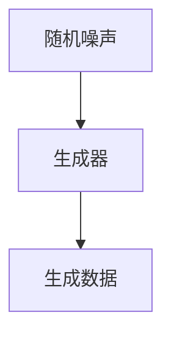
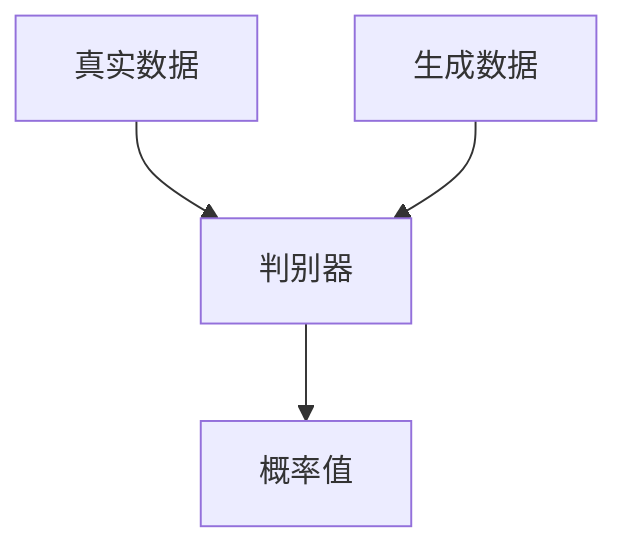
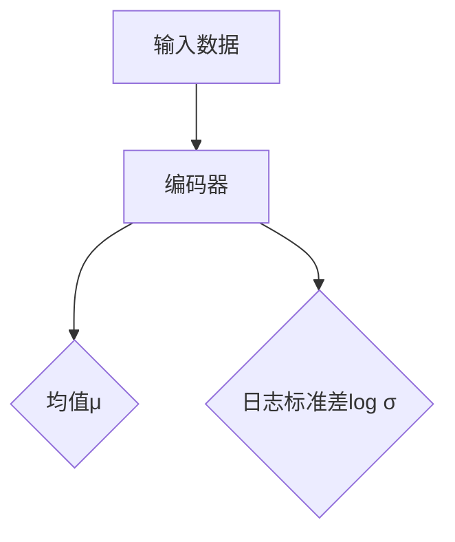
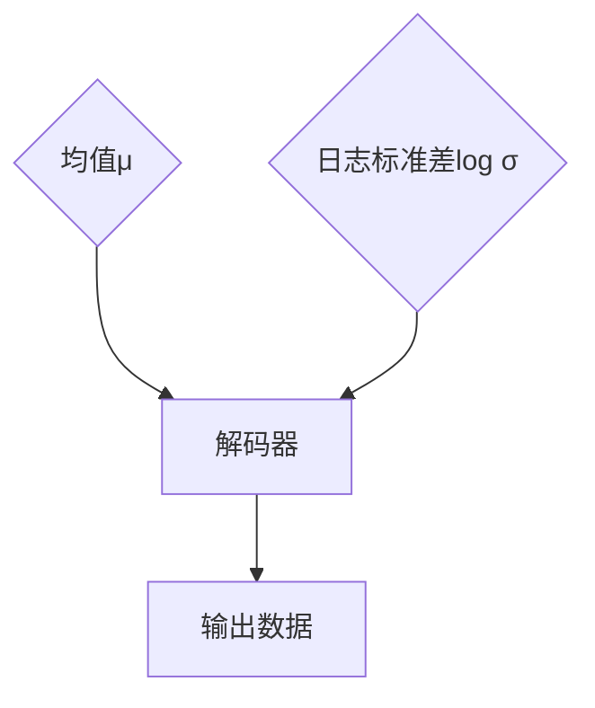

                 

### 第1章: 生成式AIGC概述

## 1.1 生成式AIGC的定义与意义

生成式人工智能（Generative Artificial Intelligence，简称AIGC）是一种能够生成新数据的人工智能技术，它基于概率模型和深度学习算法，可以从已有的数据中学习并生成相似或全新的数据。生成式AIGC与判别式AIGC相对，后者主要关注分类和预测。

### 1.1.1 生成式AIGC的基本概念

生成式AIGC的核心概念包括生成器和判别器。生成器（Generator）负责生成新的数据，判别器（Discriminator）则负责区分新生成的数据和真实数据。通过这种对抗训练，生成器逐渐提高生成数据的真实性，而判别器则逐渐提高对真实数据和新生成数据的区分能力。

### 1.1.2 生成式AIGC的核心特点

生成式AIGC具有以下几个核心特点：

- **多样性**：生成式AIGC能够生成丰富多样、具有创意性的内容。
- **创造力**：通过学习大量数据，生成式AIGC能够创造出人类难以想到的新内容。
- **自适应性**：生成式AIGC可以根据输入数据的不同，生成符合特定需求的输出。
- **效率**：与手工创作相比，生成式AIGC可以快速生成大量内容，提高创作效率。

### 1.1.3 生成式AIGC的应用场景

生成式AIGC在多个领域具有广泛应用，包括但不限于：

- **图像和视频生成**：生成逼真的图像、视频和动画。
- **文本生成**：生成新闻文章、故事、诗歌等。
- **音乐生成**：创作音乐、歌曲和其他声音效果。
- **游戏开发**：生成游戏环境、角色和故事情节。
- **产品设计和制造**：生成新的产品设计和原型。

## 1.2 传统生成模型与AIGC的关系

### 1.2.1 传统生成模型概述

传统生成模型主要包括马尔可夫模型、隐马尔可夫模型、生成对抗网络（GAN）和变分自编码器（VAE）等。这些模型通过学习数据的分布，生成符合数据分布的新样本。

### 1.2.2 AIGC在生成模型中的应用

AIGC是对传统生成模型的发展和扩展。AIGC通过引入更复杂的深度学习模型，如深度卷积生成对抗网络（DCGAN）、条件生成对抗网络（cGAN）和循环生成网络（RNN-GAN）等，提高了生成模型的能力和效率。

### 1.2.3 AIGC与传统生成模型对比

- **性能**：AIGC利用深度学习技术，在生成质量上显著优于传统生成模型。
- **灵活性**：AIGC能够更好地适应不同的应用场景，生成多样化的内容。
- **效率**：AIGC通过并行计算和大规模数据训练，提高了生成效率。

### 1.3 AIGC在AI领域的发展

### 1.3.1 AI技术的发展历程

AI技术经历了从规则驱动、基于知识的系统，到基于数据和机器学习的系统，再到当前基于深度学习的系统的发展历程。

### 1.3.2 AIGC在AI领域的应用

AIGC在AI领域中的应用不断扩展，包括图像识别、自然语言处理、推荐系统、游戏AI等。

### 1.3.3 AIGC的未来发展趋势

AIGC在AI领域将继续发展，未来可能的应用包括个性化医疗、智能家居、智能城市等。同时，随着硬件性能的提升和算法的优化，AIGC的生成能力将进一步提高。

### Mermaid 流程图：AIGC核心算法发展历程

```mermaid
graph TB
    A[传统生成模型] --> B[生成对抗网络(GAN)]
    B --> C[变分自编码器(VAE)]
    C --> D[深度卷积生成对抗网络(DCGAN)]
    D --> E[条件生成对抗网络(cGAN)]
    E --> F[循环生成网络(RNN-GAN)]
    F --> G[生成式预训练模型]
```

---

在撰写第一章“生成式AIGC概述”时，我们需要明确生成式AIGC的定义、核心特点和应用场景。此外，通过对比传统生成模型与AIGC，我们可以更好地理解AIGC的优缺点和未来发展趋势。为了使读者更直观地了解AIGC的发展历程，我们引入了Mermaid流程图，展示了从传统生成模型到现代生成式AIGC的核心算法演进过程。

在接下来的章节中，我们将深入探讨生成式AIGC的核心算法原理、在不同领域中的应用案例，以及其在实际应用中的挑战和解决方案。通过这一系列内容的讲解，我们将帮助读者全面了解生成式AIGC的技术原理和实际应用，为后续章节的深入探讨奠定基础。

### 第2章: 生成式AIGC核心算法原理

## 2.1 生成对抗网络(GAN)原理

生成对抗网络（GAN）是一种基于深度学习的生成模型，由生成器和判别器两个部分组成，它们相互对抗以生成高质量的数据。GAN的原理和实现过程如下：

### 2.1.1 GAN的基本结构

GAN的基本结构包括两个深度神经网络：生成器（Generator）和判别器（Discriminator）。生成器的输入是随机噪声向量，输出是生成的人工数据。判别器的输入是真实数据和生成数据，输出是概率值，表示输入数据是真实数据还是生成数据。

### 生成器

生成器的目标是生成足够真实的数据，以欺骗判别器。它通常由多层全连接层或卷积层组成，接收随机噪声向量并生成数据。



### 判别器

判别器的目标是区分输入数据是真实数据还是生成数据。它通常由多层全连接层或卷积层组成，接收真实数据和生成数据并输出概率值。



### 2.1.2 GAN的训练过程

GAN的训练过程是一个对抗训练过程，即生成器和判别器相互对抗以优化各自的模型。训练过程可以分为以下几个步骤：

1. **生成器生成数据**：生成器接收随机噪声并生成数据。
2. **判别器评估**：判别器同时接收真实数据和生成数据，并计算其损失函数。
3. **优化判别器**：通过反向传播和梯度下降优化判别器模型。
4. **生成器生成数据**：生成器再次接收随机噪声并生成数据。
5. **优化生成器**：通过反向传播和梯度下降优化生成器模型。

这种对抗训练过程不断迭代，生成器和判别器逐渐优化，直到生成器能够生成足够逼真的数据以欺骗判别器。

### 2.1.3 GAN的优化策略

为了提高GAN的训练稳定性和生成质量，可以采取以下优化策略：

- **梯度惩罚**：为了防止生成器生成过于简单或无意义的样本，可以引入梯度惩罚，使生成器在生成样本时尽量接近真实数据分布。
- **谱归一化**：为了提高GAN的训练稳定性，可以使用谱归一化技术，防止模型过拟合。
- **权重共享**：通过权重共享，减少模型的参数数量，提高训练效率。

### 伪代码：GAN的训练过程

```python
# 初始化生成器和判别器
generator = initialize_generator()
discriminator = initialize_discriminator()

# 定义损失函数和优化器
loss_function = nn.BCELoss()
optimizer_g = optim.Adam(generator.parameters(), lr=0.0002)
optimizer_d = optim.Adam(discriminator.parameters(), lr=0.0002)

# 训练过程
for epoch in range(num_epochs):
    for batch in data_loader:
        # 更新生成器
        optimizer_g.zero_grad()
        real_data = batch
        noise = torch.randn(batch.size(0), noise_dimension)
        fake_data = generator(noise)
        
        real_logits = discriminator(real_data)
        fake_logits = discriminator(fake_data)
        
        loss_g = loss_function(fake_logits, torch.zeros_like(fake_logits))
        loss_g.backward()
        optimizer_g.step()
        
        # 更新判别器
        optimizer_d.zero_grad()
        real_labels = torch.ones(real_data.size(0))
        fake_labels = torch.zeros(fake_data.size(0))
        
        loss_d = loss_function(real_logits, real_labels) + loss_function(fake_logits, fake_labels)
        loss_d.backward()
        optimizer_d.step()
```

通过上述讲解，我们可以了解到生成对抗网络（GAN）的基本原理和训练过程。GAN通过生成器和判别器的对抗训练，可以生成高质量的数据。然而，GAN的训练过程相对复杂，容易出现不稳定的情况。为了提高GAN的训练稳定性和生成质量，可以采用一些优化策略，如梯度惩罚、谱归一化和权重共享等。

在下一章节中，我们将继续探讨生成式AIGC的核心算法原理，包括变分自编码器（VAE）和生成式预训练模型等。通过这些核心算法的学习，我们将更深入地理解生成式AIGC的技术原理和应用场景。

### 2.2 变分自编码器(VAE)原理

变分自编码器（Variational Autoencoder，VAE）是一种基于深度学习的生成模型，它通过引入概率模型的思想来生成数据。与传统的自编码器不同，VAE在编码和解码过程中引入了概率分布，从而能够生成多样性的数据。下面将详细讲解VAE的基本结构、训练过程以及优势与应用。

### 2.2.1 VAE的基本结构

VAE由编码器（Encoder）和解码器（Decoder）两部分组成，它们分别将输入数据映射到潜在空间和从潜在空间映射回输出数据。

#### 编码器

编码器接收输入数据，并将其映射到一个潜在空间中的概率分布上。VAE的编码器通常由多个全连接层或卷积层组成，输出两个部分：均值（μ）和日志标准差（log σ）。



#### 解码器

解码器接收潜在空间中的数据，并尝试将其映射回原始数据空间。解码器的结构与编码器相似，但输入的是潜在空间中的均值和日志标准差。



### 2.2.2 VAE的训练过程

VAE的训练过程通过最大化数据重建概率和潜在变量的先验分布来优化模型参数。具体训练过程如下：

1. **编码**：将输入数据通过编码器映射到潜在空间中的均值和日志标准差。
2. **重采样**：从潜在空间中的均值和日志标准差生成一个样本。
3. **解码**：将重采样得到的潜在样本通过解码器映射回原始数据空间。
4. **损失计算**：计算重建数据的损失，包括数据重建损失和KL散度损失。
5. **模型优化**：通过反向传播和梯度下降优化模型参数。

### 2.2.3 VAE的优势与应用

VAE的优势在于：

- **生成多样性**：通过潜在变量的引入，VAE能够生成多样化的数据。
- **训练稳定性**：VAE的训练过程相对稳定，不容易出现模式崩溃现象。
- **易于扩展**：VAE可以很容易地扩展到多模态数据生成。

VAE在以下领域有广泛应用：

- **图像生成**：如图像超分辨率、图像去噪和图像修复等。
- **文本生成**：如文本摘要、机器翻译和对话生成等。
- **音频生成**：如音乐生成、声音效果合成等。

### 2.2.4 伪代码：VAE的训练过程

```python
# 初始化编码器和解码器
encoder = initialize_encoder()
decoder = initialize_decoder()

# 定义损失函数和优化器
reconstruction_loss = nn.BCELoss()
kl_loss = nn.KLDivLoss()
optimizer = optim.Adam(list(encoder.parameters()) + list(decoder.parameters()), lr=0.001)

# 训练过程
for epoch in range(num_epochs):
    for batch in data_loader:
        x = batch
        # 编码
        x_hat, z = encoder(x)
        # 重采样
        z_sample = reparameterize(z)
        # 解码
        x_recon = decoder(z_sample)
        # 计算损失
        recon_loss = reconstruction_loss(x_recon, x)
        kl_loss_value = kl_loss(z, x_hat)
        loss = recon_loss + kl_loss_value
        # 反向传播和优化
        optimizer.zero_grad()
        loss.backward()
        optimizer.step()
```

通过上述讲解，我们可以了解到变分自编码器（VAE）的基本原理和训练过程。VAE通过引入概率模型，能够在生成多样性的数据方面表现出优势。同时，VAE的训练过程相对稳定，适合处理多种类型的数据。

在下一章节中，我们将探讨生成式AIGC的其他算法，如条件生成对抗网络（cGAN）和循环生成网络（RNN-GAN）等。这些算法在生成式AIGC领域也有着重要的应用，通过对它们的介绍，我们将更全面地了解生成式AIGC的核心算法。

### 2.3 生成式AIGC的其他算法

在生成式人工智能（AIGC）领域，除了生成对抗网络（GAN）和变分自编码器（VAE）之外，还有一些其他的算法也具有重要应用价值。这些算法包括条件生成对抗网络（cGAN）、循环生成网络（RNN-GAN）和生成式预训练模型等。下面将分别介绍这些算法的基本原理和特点。

#### 2.3.1 条件生成对抗网络(cGAN)

条件生成对抗网络（Conditional GAN，cGAN）是对传统GAN的一种扩展。cGAN引入了条件信息，使得生成器和判别器在训练过程中能够利用额外的输入信息来生成和区分数据。这使得cGAN在生成多样化数据方面表现更加出色。

- **生成器**：cGAN的生成器接收条件信息和随机噪声，共同生成符合条件分布的数据。
- **判别器**：cGAN的判别器接收条件信息和真实或生成数据，判断输入数据是否真实。

cGAN的训练过程如下：

1. **生成器生成数据**：生成器根据条件信息和随机噪声生成数据。
2. **判别器评估**：判别器接收条件数据和生成数据，计算损失函数。
3. **优化判别器**：通过反向传播和梯度下降优化判别器模型。
4. **生成器生成数据**：生成器再次根据条件信息和随机噪声生成数据。
5. **优化生成器**：通过反向传播和梯度下降优化生成器模型。

cGAN的优点在于能够生成与条件信息高度匹配的数据，如根据文本生成对应的图像、根据声音生成对应的视频等。

#### 2.3.2 循环生成网络(RNN-GAN)

循环生成网络（Recurrent GAN，RNN-GAN）是一种结合循环神经网络（RNN）和生成对抗网络的生成模型。RNN-GAN利用RNN的序列处理能力，使得生成器和判别器能够处理序列数据，如文本、音频和视频等。

- **生成器**：RNN-GAN的生成器由两个子网络组成，一个是生成子网络，负责生成序列数据；另一个是重排子网络，负责对生成的序列数据进行重排。
- **判别器**：RNN-GAN的判别器是一个循环神经网络，用于区分真实数据和生成数据。

RNN-GAN的训练过程如下：

1. **生成器生成数据**：生成器根据序列数据生成新的序列数据。
2. **判别器评估**：判别器接收真实数据和生成数据，计算损失函数。
3. **优化判别器**：通过反向传播和梯度下降优化判别器模型。
4. **生成器生成数据**：生成器再次根据序列数据生成新的序列数据。
5. **优化生成器**：通过反向传播和梯度下降优化生成器模型。

RNN-GAN的优点在于能够生成序列数据的多样性，如根据语音生成对应的文本、根据视频生成对应的音频等。

#### 2.3.3 生成式预训练模型

生成式预训练模型（Generative Pre-trained Model）是一种利用大规模无监督数据预训练生成模型的方法。预训练模型通常采用自回归语言模型（如GPT）、自编码器（如VAE）等技术，通过学习大规模数据的分布，使得模型具备生成高质量数据的初步能力。

- **预训练过程**：生成式预训练模型首先在大规模无监督数据上进行预训练，学习数据的潜在分布。
- **微调过程**：在预训练的基础上，利用有监督数据对模型进行微调，使其适应特定的生成任务。

生成式预训练模型的主要优点包括：

- **高效性**：通过预训练，模型能够快速适应新的生成任务。
- **多样性**：预训练模型能够生成多样性的数据，提高生成质量。

常见的生成式预训练模型包括：

- **GPT**：是一种基于Transformer的自回归语言模型，能够生成高质量的文本。
- **BERT**：是一种双向Transformer模型，能够生成与输入文本相关的高质量文本。

通过上述介绍，我们可以了解到生成式AIGC领域的一些重要算法，包括cGAN、RNN-GAN和生成式预训练模型等。这些算法在生成多样化、序列数据处理和高效性方面有着各自的优势。在实际应用中，可以根据具体需求选择合适的算法，以实现高质量的生成任务。

在下一章节中，我们将探讨生成式AIGC在图像生成中的应用，包括GAN和VAE在图像生成中的具体实现和案例。

### 3.1 图像生成基础

图像生成是生成式人工智能（AIGC）的一个重要应用领域，通过学习大量图像数据，生成模型能够生成逼真或具有创意性的图像。本节将介绍图像生成的基本流程、方法以及评价指标。

#### 3.1.1 图像生成的基本流程

图像生成的基本流程通常包括以下几个步骤：

1. **数据预处理**：对输入图像进行预处理，如归一化、裁剪、增强等，以适应生成模型的输入要求。
2. **模型训练**：使用大量图像数据训练生成模型，生成模型通常基于深度学习技术，如生成对抗网络（GAN）或变分自编码器（VAE）。
3. **图像生成**：训练好的生成模型根据输入的随机噪声或其他条件生成图像。
4. **后处理**：对生成的图像进行后处理，如去噪、增强、色彩调整等，以提高图像的质量。

#### 3.1.2 图像生成的方法

图像生成的方法主要包括以下几种：

1. **基于判别器的图像生成**：如生成对抗网络（GAN），生成器和判别器相互对抗，生成器试图生成逼真的图像以欺骗判别器。
2. **基于编码器的图像生成**：如变分自编码器（VAE），编码器将图像编码为潜在空间中的表示，解码器从潜在空间中生成图像。
3. **基于生成器的图像生成**：如深度卷积生成对抗网络（DCGAN），生成器直接从随机噪声中生成图像。

#### 3.1.3 图像生成的评价指标

图像生成的评价指标主要用于评估生成图像的质量和逼真度，常见的评价指标包括：

- **PSNR（峰值信噪比）**：衡量生成图像与真实图像之间的差异，值越高表示图像质量越好。
- **SSIM（结构相似性指数）**：衡量生成图像的视觉质量，值越高表示图像质量越高。
- **Inception Score（IS）**：衡量生成图像的多样性和真实性，值越高表示生成图像质量越好。
- **FID（Fréchet Inception Distance）**：衡量生成图像和真实图像分布的差异，值越低表示生成图像质量越好。

#### 3.1.4 图像生成案例分析

以下是一些图像生成的典型案例：

1. **人脸生成**：使用GAN或VAE生成逼真的人脸图像，如StyleGAN、FaceGAN等。
2. **图像修复**：如CycleGAN和Pix2Pix，这些模型能够修复破损或模糊的图像。
3. **图像超分辨率**：如SRGAN、ESPCN等，这些模型能够提高图像的分辨率。

### 3.2 GAN在图像生成中的应用

生成对抗网络（GAN）是一种强大的图像生成方法，通过生成器和判别器之间的对抗训练，能够生成高质量、逼真的图像。以下将介绍GAN在图像生成中的具体应用。

#### 3.2.1 GAN在图像生成中的实现

GAN在图像生成中的实现主要包括以下步骤：

1. **生成器**：生成器是一个从随机噪声映射到图像数据的神经网络，其目标是生成尽可能逼真的图像。
2. **判别器**：判别器是一个从图像数据映射到二分类标签（真实或伪造）的神经网络，其目标是正确地区分真实图像和生成图像。
3. **对抗训练**：生成器和判别器通过对抗训练相互优化，生成器试图欺骗判别器，使其认为生成的图像是真实的，而判别器则试图识别出生成图像。

GAN的训练过程可以分为以下几个阶段：

1. **初始化**：初始化生成器和判别器的参数。
2. **生成器生成图像**：生成器根据随机噪声生成图像。
3. **判别器评估**：判别器同时接收真实图像和生成图像，并计算损失函数。
4. **优化判别器**：通过反向传播和梯度下降优化判别器参数。
5. **生成器再次生成图像**：生成器根据新的判别器参数再次生成图像。
6. **优化生成器**：通过反向传播和梯度下降优化生成器参数。

#### 3.2.2 GAN在图像生成中的案例

以下是一些GAN在图像生成中的典型应用案例：

1. **人脸生成**：StyleGAN和StyleGAN2是两张经典的人脸生成模型，它们能够生成高质量、逼真的人脸图像。
2. **图像修复**：CycleGAN和Pix2Pix能够修复破损或模糊的图像，如照片修复、人脸修复等。
3. **图像超分辨率**：SRGAN和EDSR能够提高图像的分辨率，如将低分辨率图像转换为高分辨率图像。

#### 3.2.3 GAN在图像生成中的挑战与优化

尽管GAN在图像生成中表现出强大的能力，但其在训练过程中也面临着一些挑战：

1. **模式崩溃**：当生成器生成的图像过于简单或重复时，会导致判别器难以区分真实图像和生成图像，这种现象称为模式崩溃。
2. **训练不稳定**：GAN的训练过程容易受到噪声和参数调整的影响，导致训练不稳定。
3. **计算资源需求**：GAN的训练需要大量的计算资源，尤其是生成高质量图像时。

为了解决这些挑战，研究人员提出了一系列优化方法：

1. **梯度惩罚**：引入梯度惩罚，使生成器在生成样本时尽量接近真实数据分布。
2. **谱归一化**：通过谱归一化技术，提高GAN的训练稳定性。
3. **权重共享**：通过权重共享，减少模型的参数数量，提高训练效率。

通过上述讲解，我们可以了解到GAN在图像生成中的应用及其面临的挑战。在下一章节中，我们将探讨VAE在图像生成中的应用，并介绍其实现方法和优势。

### 3.3 VAE在图像生成中的应用

变分自编码器（Variational Autoencoder，VAE）是一种基于深度学习的生成模型，它通过引入概率模型的思想来生成数据。VAE在图像生成中具有独特优势，包括生成多样性、训练稳定性等。以下将介绍VAE在图像生成中的具体应用。

#### 3.3.1 VAE在图像生成中的实现

VAE在图像生成中的实现主要包括编码器（Encoder）和解码器（Decoder）两部分，它们分别将输入图像映射到潜在空间和从潜在空间映射回原始图像。

1. **编码器**：编码器将输入图像编码为潜在空间中的概率分布，通常由多个全连接层或卷积层组成，输出两个部分：均值（μ）和日志标准差（log σ）。
   
   ```mermaid
   graph TD
       A[输入图像] --> B[编码器]
       B --> C{均值μ}
       B --> D{日志标准差log σ}
   ```

2. **解码器**：解码器从潜在空间中的均值和日志标准差生成图像，其结构与编码器类似，但输入的是潜在空间中的均值和日志标准差。
   
   ```mermaid
   graph TD
       E{均值μ} --> F[解码器]
       F --> G[输出图像]
       H{日志标准差log σ} --> F
   ```

VAE的训练过程如下：

1. **编码**：将输入图像通过编码器映射到潜在空间中的均值和日志标准差。
2. **重采样**：从潜在空间中的均值和日志标准差生成一个样本。
3. **解码**：将重采样得到的潜在样本通过解码器映射回原始图像空间。
4. **损失计算**：计算重建图像的损失，包括数据重建损失和KL散度损失。
5. **模型优化**：通过反向传播和梯度下降优化模型参数。

#### 3.3.2 VAE在图像生成中的案例

以下是一些VAE在图像生成中的典型应用案例：

1. **图像超分辨率**：例如，SR-VAE和EdSR-VAE能够提高图像的分辨率，将低分辨率图像转换为高分辨率图像。
2. **图像去噪**：例如，DnCNN和DnVAE能够去除图像中的噪声，提高图像的清晰度。
3. **图像编辑**：例如，使用VAE进行图像修复、图像风格迁移等，生成具有特定风格或内容的图像。

#### 3.3.3 VAE在图像生成中的优势与应用

VAE在图像生成中的应用优势包括：

1. **生成多样性**：通过潜在变量的引入，VAE能够生成多样化的图像。
2. **训练稳定性**：VAE的训练过程相对稳定，不容易出现模式崩溃现象。
3. **易于扩展**：VAE可以很容易地扩展到多模态数据生成。

VAE在以下领域有广泛应用：

1. **图像生成**：例如，图像超分辨率、图像去噪、图像编辑等。
2. **文本生成**：例如，文本摘要、机器翻译、对话生成等。
3. **音频生成**：例如，音乐生成、声音效果合成等。

通过上述讲解，我们可以了解到VAE在图像生成中的应用及其优势。在下一章节中，我们将探讨生成式AIGC在视频生成中的应用。

### 4.1 文本生成基础

文本生成是生成式人工智能（AIGC）的重要应用领域之一，通过学习大量文本数据，生成模型能够生成高质量、具有创意性的文本。本节将介绍文本生成的基本流程、方法以及评价指标。

#### 4.1.1 文本生成的基本流程

文本生成的基本流程通常包括以下几个步骤：

1. **数据预处理**：对输入文本进行预处理，如分词、词性标注、去停用词等，以便模型能够更好地理解文本。
2. **模型训练**：使用大量文本数据训练生成模型，生成模型通常基于深度学习技术，如循环神经网络（RNN）、Transformer等。
3. **文本生成**：训练好的生成模型根据输入的文本或随机噪声生成新的文本。
4. **后处理**：对生成的文本进行后处理，如去除标点符号、纠正语法错误等，以提高文本的质量。

#### 4.1.2 文本生成的方法

文本生成的方法主要包括以下几种：

1. **基于RNN的生成模型**：如长短期记忆网络（LSTM）、门控循环单元（GRU）等，这些模型能够处理序列数据，生成连续的文本。
2. **基于Transformer的生成模型**：如Transformer、BERT等，这些模型在处理长文本和生成多样性方面表现优异。
3. **基于生成对抗网络（GAN）的生成模型**：如cGAN、GPT等，这些模型通过对抗训练生成高质量的文本。

#### 4.1.3 文本生成的评价指标

文本生成的评价指标主要用于评估生成文本的质量和逼真度，常见的评价指标包括：

1. **BLEU分数**：用于评估生成文本与真实文本之间的相似度，值越高表示生成文本质量越好。
2. **ROUGE分数**：用于评估生成文本的句法结构和语义质量，值越高表示生成文本质量越好。
3. **生成文本多样性**：用于评估生成文本的多样性，值越高表示生成文本具有更多样的内容。

#### 4.1.4 文本生成案例分析

以下是一些文本生成的典型案例：

1. **自动摘要**：如Google的BERT模型，能够自动生成文本摘要。
2. **机器翻译**：如OpenAI的GPT模型，能够实现高质量的机器翻译。
3. **对话生成**：如Duke大学开发的对话系统，能够生成高质量的对话文本。

### 4.2 GPT在文本生成中的应用

GPT（Generative Pre-trained Transformer）是一种基于Transformer的生成模型，由OpenAI开发。GPT在文本生成中具有显著优势，能够生成高质量、连贯的文本。以下将介绍GPT在文本生成中的应用。

#### 4.2.1 GPT的基本结构

GPT的基本结构包括编码器（Encoder）和解码器（Decoder）两部分，它们分别用于编码输入文本和解码生成文本。

1. **编码器**：编码器将输入文本编码为序列向量，通常由多层Transformer层组成，能够捕捉文本的语义信息。

   ```mermaid
   graph TD
       A[输入文本] --> B[编码器]
       B --> C{编码后的文本序列}
   ```

2. **解码器**：解码器根据编码后的文本序列生成新的文本，也由多层Transformer层组成，能够生成连贯的文本。

   ```mermaid
   graph TD
       D{编码后的文本序列} --> E[解码器]
       E --> F{生成的文本序列}
   ```

#### 4.2.2 GPT的训练过程

GPT的训练过程主要包括预训练和微调两个阶段：

1. **预训练**：使用大量无监督文本数据对GPT进行预训练，使模型具备语言理解能力。预训练过程中，模型通过自回归语言模型（Auto-regressive Language Model）预测下一个单词。
2. **微调**：在预训练的基础上，使用有监督数据对GPT进行微调，使其适应特定任务。微调过程中，模型通过监督学习（Supervised Learning）预测生成文本。

#### 4.2.3 GPT在文本生成中的案例

以下是一些GPT在文本生成中的典型应用案例：

1. **自动摘要**：如Google的BERT模型，能够自动生成文本摘要。
2. **机器翻译**：如OpenAI的GPT模型，能够实现高质量的机器翻译。
3. **对话生成**：如Duke大学开发的对话系统，能够生成高质量的对话文本。

### 4.3 BERT在文本生成中的应用

BERT（Bidirectional Encoder Representations from Transformers）是一种基于Transformer的双向编码模型，由Google开发。BERT在文本生成中具有广泛的应用，能够生成高质量、连贯的文本。以下将介绍BERT在文本生成中的应用。

#### 4.3.1 BERT的基本结构

BERT的基本结构包括编码器（Encoder）和解码器（Decoder）两部分，它们分别用于编码输入文本和解码生成文本。

1. **编码器**：编码器将输入文本编码为序列向量，由多层Transformer层组成，能够捕捉文本的语义信息。

   ```mermaid
   graph TD
       A[输入文本] --> B[编码器]
       B --> C{编码后的文本序列}
   ```

2. **解码器**：解码器根据编码后的文本序列生成新的文本，由多层Transformer层组成，能够生成连贯的文本。

   ```mermaid
   graph TD
       D{编码后的文本序列} --> E[解码器]
       E --> F{生成的文本序列}
   ```

#### 4.3.2 BERT的训练过程

BERT的训练过程主要包括预训练和微调两个阶段：

1. **预训练**：使用大量无监督文本数据对BERT进行预训练，使模型具备语言理解能力。预训练过程中，模型通过 masked language model（MLM）任务预测被遮盖的单词。
2. **微调**：在预训练的基础上，使用有监督数据对BERT进行微调，使其适应特定任务。微调过程中，模型通过监督学习（Supervised Learning）预测生成文本。

#### 4.3.3 BERT在文本生成中的案例

以下是一些BERT在文本生成中的典型应用案例：

1. **问答系统**：如百度、腾讯等公司的问答系统，能够回答用户的问题。
2. **对话生成**：如OpenAI的GPT-3模型，能够生成高质量的对话文本。
3. **文本生成**：如生成新闻文章、故事、诗歌等。

通过上述讲解，我们可以了解到文本生成的基本流程、方法以及评价指标。在下一章节中，我们将探讨生成式AIGC在多媒体生成中的应用，包括视频生成和音频生成。

### 5.1 多媒体生成基础

多媒体生成是生成式人工智能（AIGC）的重要应用领域之一，涉及图像、视频和音频等多种媒体形式。本节将介绍多媒体生成的基本流程、方法以及评价指标。

#### 5.1.1 多媒体生成的基本流程

多媒体生成的基本流程通常包括以下几个步骤：

1. **数据预处理**：对输入的多媒体数据进行预处理，如图像的归一化、裁剪、增强，视频的帧提取、特征提取，音频的分割、增强等。
2. **模型训练**：使用预处理后的多媒体数据训练生成模型，生成模型通常基于深度学习技术，如生成对抗网络（GAN）、变分自编码器（VAE）等。
3. **多媒体生成**：训练好的生成模型根据输入的随机噪声或其他条件生成多媒体数据。
4. **后处理**：对生成的多媒体数据进行后处理，如图像的去噪、增强，视频的拼接、优化，音频的音质提升等。

#### 5.1.2 多媒体生成的方法

多媒体生成的方法主要包括以下几种：

1. **基于GAN的生成方法**：如生成对抗网络（GAN）、深度卷积生成对抗网络（DCGAN）、条件生成对抗网络（cGAN）等，这些模型能够生成高质量、逼真的多媒体数据。
2. **基于VAE的生成方法**：如变分自编码器（VAE）、变分视频自编码器（VVAE）等，这些模型通过引入概率模型的思想，生成多样化、稳定性的多媒体数据。
3. **基于生成器的生成方法**：如深度卷积生成网络（DCGAN）、循环生成网络（RNN-GAN）等，这些模型直接从随机噪声生成多媒体数据。

#### 5.1.3 多媒体生成的评价指标

多媒体生成的评价指标主要用于评估生成多媒体数据的质量和逼真度，常见的评价指标包括：

1. **图像质量评价指标**：如峰值信噪比（PSNR）、结构相似性（SSIM）、Inception Score（IS）等，用于评估生成图像的质量。
2. **视频质量评价指标**：如结构相似性（SSIM）、视频质量评估分数（VMAF）等，用于评估生成视频的质量。
3. **音频质量评价指标**：如信号噪声比（SNR）、语音质量评估（PESQ）等，用于评估生成音频的质量。

#### 5.1.4 多媒体生成案例分析

以下是一些多媒体生成的典型案例：

1. **图像生成**：如StyleGAN、StyleGAN2等，能够生成高质量、逼真的人脸图像。
2. **视频生成**：如VideoGAN、CycleGAN等，能够生成高质量的动画视频。
3. **音频生成**：如WaveGAN、SoundGAN等，能够生成高质量、多样化的音频。

### 5.2 生成式AIGC在视频生成中的应用

视频生成是生成式人工智能（AIGC）的重要应用领域之一，通过学习大量视频数据，生成模型能够生成高质量、具有创意性的视频。以下将介绍生成式AIGC在视频生成中的应用。

#### 5.2.1 视频生成的基本流程

视频生成的基本流程通常包括以下几个步骤：

1. **数据预处理**：对输入视频数据进行预处理，如帧提取、帧级编码等。
2. **模型训练**：使用预处理后的视频数据训练生成模型，生成模型通常基于深度学习技术，如生成对抗网络（GAN）、变分自编码器（VAE）等。
3. **视频生成**：训练好的生成模型根据输入的随机噪声或其他条件生成视频数据。
4. **后处理**：对生成的视频数据进行后处理，如帧级解码、视频拼接等，以提高视频质量。

#### 5.2.2 视频生成的算法

视频生成的算法主要包括以下几种：

1. **基于GAN的生成算法**：如生成对抗网络（GAN）、深度卷积生成对抗网络（DCGAN）、条件生成对抗网络（cGAN）等，这些模型能够生成高质量、逼真的视频数据。
2. **基于VAE的生成算法**：如变分自编码器（VAE）、变分视频自编码器（VVAE）等，这些模型通过引入概率模型的思想，生成多样化、稳定性的视频数据。
3. **基于生成器的生成算法**：如深度卷积生成网络（DCGAN）、循环生成网络（RNN-GAN）等，这些模型直接从随机噪声生成视频数据。

#### 5.2.3 视频生成的案例

以下是一些视频生成的典型案例：

1. **视频超分辨率**：如ESPCN、SRCNN等，能够提高视频的分辨率。
2. **视频剪辑生成**：如VideoGAN、AnimeGAN等，能够生成具有动画风格的视频。
3. **视频修复**：如CycleGAN、pix2pix等，能够修复破损或模糊的视频。

#### 5.2.4 视频生成的挑战与优化

视频生成面临的挑战主要包括：

1. **计算资源需求**：视频生成的训练过程需要大量的计算资源，尤其是在生成高质量视频时。
2. **生成质量**：如何生成高质量、逼真的视频数据是一个挑战。
3. **训练稳定性**：视频生成的训练过程容易受到噪声和参数调整的影响，导致训练不稳定。

为了解决这些挑战，研究人员提出了一系列优化方法：

1. **计算资源优化**：通过使用更高效的算法和硬件加速技术，如GPU、TPU等，提高视频生成的计算效率。
2. **生成质量优化**：通过引入新的生成算法和技术，如GAN的权重共享、谱归一化等，提高视频生成的质量。
3. **训练稳定性优化**：通过使用谱归一化技术、梯度惩罚等，提高视频生成的训练稳定性。

### 5.3 生成式AIGC在音频生成中的应用

音频生成是生成式人工智能（AIGC）的重要应用领域之一，通过学习大量音频数据，生成模型能够生成高质量、具有创意性的音频。以下将介绍生成式AIGC在音频生成中的应用。

#### 5.3.1 音频生成的基本流程

音频生成的基本流程通常包括以下几个步骤：

1. **数据预处理**：对输入音频数据进行预处理，如音频分段、特征提取等。
2. **模型训练**：使用预处理后的音频数据训练生成模型，生成模型通常基于深度学习技术，如生成对抗网络（GAN）、变分自编码器（VAE）等。
3. **音频生成**：训练好的生成模型根据输入的随机噪声或其他条件生成音频数据。
4. **后处理**：对生成的音频数据进行后处理，如音频合成、音质增强等。

#### 5.3.2 音频生成的算法

音频生成的算法主要包括以下几种：

1. **基于GAN的生成算法**：如生成对抗网络（GAN）、深度卷积生成对抗网络（DCGAN）、条件生成对抗网络（cGAN）等，这些模型能够生成高质量、逼真的音频数据。
2. **基于VAE的生成算法**：如变分自编码器（VAE）、变分音频自编码器（VAAE）等，这些模型通过引入概率模型的思想，生成多样化、稳定性的音频数据。
3. **基于生成器的生成算法**：如深度卷积生成网络（DCGAN）、循环生成网络（RNN-GAN）等，这些模型直接从随机噪声生成音频数据。

#### 5.3.3 音频生成的案例

以下是一些音频生成的典型案例：

1. **音乐生成**：如WaveNet、RNN-Music等，能够生成音乐旋律。
2. **语音合成**：如Tacotron、WaveNet等，能够合成自然语音。
3. **声音效果合成**：如SoundGAN、WaveGAN等，能够生成高质量、多样化的声音效果。

#### 5.3.4 音频生成的挑战与优化

音频生成面临的挑战主要包括：

1. **计算资源需求**：音频生成的训练过程需要大量的计算资源，尤其是在生成高质量音频时。
2. **生成质量**：如何生成高质量、逼真的音频数据是一个挑战。
3. **训练稳定性**：音频生成的训练过程容易受到噪声和参数调整的影响，导致训练不稳定。

为了解决这些挑战，研究人员提出了一系列优化方法：

1. **计算资源优化**：通过使用更高效的算法和硬件加速技术，如GPU、TPU等，提高音频生成的计算效率。
2. **生成质量优化**：通过引入新的生成算法和技术，如GAN的权重共享、谱归一化等，提高音频生成的质量。
3. **训练稳定性优化**：通过使用谱归一化技术、梯度惩罚等，提高音频生成的训练稳定性。

通过上述讲解，我们可以了解到多媒体生成的基本流程、方法以及评价指标。在下一章节中，我们将探讨生成式AIGC在实际应用场景中的落地，包括游戏开发、内容创作和电子商务等领域。

### 6.1 生成式AIGC在游戏开发中的应用

生成式人工智能（AIGC）在游戏开发中的应用极大地提升了游戏体验和开发效率。通过生成式模型，游戏开发者能够自动生成游戏中的角色、场景、故事和剧情，从而丰富游戏内容，降低开发成本，并提高开发效率。以下将详细介绍生成式AIGC在游戏开发中的应用、案例分析以及所面临的挑战和解决方案。

#### 6.1.1 生成式AIGC在游戏开发中的应用

生成式AIGC在游戏开发中的应用主要体现在以下几个方面：

1. **角色生成**：生成式模型能够根据给定的特征和风格，自动生成游戏中的角色，包括NPC（非玩家角色）和玩家角色。例如，通过条件生成对抗网络（cGAN），可以生成具有特定外观和个性的角色。
2. **场景生成**：生成式模型可以自动生成游戏世界中的各种场景，如城市、森林、沙漠等，为游戏开发者提供丰富的背景环境。通过深度卷积生成对抗网络（DCGAN）等技术，可以生成具有高度真实感的场景。
3. **故事生成**：生成式模型能够根据给定的故事框架和规则，自动生成游戏剧情和对话，增强游戏的故事性和互动性。例如，通过预训练的Transformer模型，可以生成连贯且富有创意的故事情节。
4. **游戏内容**：生成式模型可以自动生成游戏中的各种内容，如道具、任务、挑战等，为游戏提供丰富的玩法和活动。

#### 6.1.2 游戏开发中的AIGC案例

以下是一些游戏开发中使用生成式AIGC的典型案例：

1. **《赛博朋克2077》**：在开发过程中，使用了生成式模型自动生成游戏中的NPC角色和城市环境，大大提高了开发效率，丰富了游戏内容。
2. **《我的世界》**：游戏中的许多地形和建筑物都是通过生成式模型自动生成的，玩家可以根据自己的喜好创建和探索不同的世界。
3. **《动物之森》**：游戏中的一些角色和家具是通过生成式模型生成的，增加了游戏的多样性和个性化。

#### 6.1.3 游戏开发中的AIGC挑战与解决方案

尽管生成式AIGC在游戏开发中具有巨大的潜力，但其在实际应用中也面临一些挑战：

1. **实时性能**：生成式模型通常需要大量的计算资源，如何在保证生成质量的同时，提高生成效率，以满足实时性要求是一个挑战。解决方案包括使用更高效的生成算法和硬件加速技术，如GPU和TPU。
2. **多样性**：如何确保生成的角色、场景和故事具有足够的多样性，避免重复和单调的问题。解决方案包括使用数据增强技术、引入更多的随机性和多样化的训练数据。
3. **创意性**：生成式模型如何确保生成的游戏内容具有创意性和艺术价值。解决方案包括提供艺术指导，引导生成内容的方向，同时引入人类设计师的创意元素。

通过上述讲解，我们可以了解到生成式AIGC在游戏开发中的应用、案例分析和挑战与解决方案。在下一章节中，我们将探讨生成式AIGC在内容创作中的应用，包括图像创作、文本创作和音频创作等领域。

### 6.2 生成式AIGC在内容创作中的应用

生成式人工智能（AIGC）在内容创作中的应用，为艺术家和创作者提供了全新的创作工具，使得图像、文本和音频等创作内容能够通过算法自动生成。以下将详细介绍生成式AIGC在内容创作中的应用、案例分析以及所面临的挑战和解决方案。

#### 6.2.1 生成式AIGC在内容创作中的应用

生成式AIGC在内容创作中的应用非常广泛，主要包括以下方面：

1. **图像创作**：生成式模型可以自动生成艺术作品、设计作品等。例如，DeepArt.io使用生成对抗网络（GAN）将经典艺术作品风格应用于普通照片，生成具有艺术风格的图像。
2. **文本创作**：生成式模型可以自动生成新闻文章、故事、诗歌等文本内容。例如，OpenAI的GPT-3模型能够生成高质量的新闻报道和创意文本。
3. **音频创作**：生成式模型可以自动生成音乐、声音效果等。例如，Google的Magenta项目利用生成式模型创作音乐和声音效果，为创意制作提供了强大的工具。

#### 6.2.2 内容创作中的AIGC案例

以下是一些内容创作中使用生成式AIGC的典型案例：

1. **《DeepArt.io》**：这个平台使用生成对抗网络（GAN）将经典艺术作品风格应用于用户上传的照片，生成具有艺术风格的图像，为用户提供了独特的艺术体验。
2. **《OpenAI的GPT-3》**：GPT-3是一个基于Transformer的生成模型，能够生成高质量的新闻报道、故事和诗歌，为内容创作提供了强大的支持。
3. **《Google的Magenta项目》**：这个项目利用生成式模型创作音乐和声音效果，包括《Magenta》等歌曲，为音乐创作开辟了新的可能性。

#### 6.2.3 内容创作中的AIGC挑战与解决方案

生成式AIGC在内容创作中虽然具有巨大的潜力，但同时也面临一些挑战：

1. **创意性**：如何确保生成的内容具有创意性和艺术价值。解决方案包括提供艺术指导，引导生成内容的方向，同时结合人类创作者的创意元素。
2. **艺术风格**：如何准确地捕捉和模拟不同的艺术风格。解决方案包括使用多样化的训练数据和风格迁移技术，如StyleGAN。
3. **版权问题**：如何解决生成内容的版权问题。解决方案包括使用区块链技术，确保生成内容的版权归属明确。

通过上述讲解，我们可以了解到生成式AIGC在内容创作中的应用、案例分析和挑战与解决方案。在下一章节中，我们将探讨生成式AIGC在电子商务中的应用，包括个性化推荐、广告创意和用户互动等方面。

### 6.3 生成式AIGC在电子商务中的应用

生成式人工智能（AIGC）在电子商务领域具有广泛的应用前景，能够显著提升用户体验和商业效益。以下将详细介绍生成式AIGC在电子商务中的应用、案例分析以及所面临的挑战和解决方案。

#### 6.3.1 生成式AIGC在电子商务中的应用

生成式AIGC在电子商务中的应用主要包括以下几个方面：

1. **个性化推荐**：通过生成式模型，电子商务平台可以自动生成个性化的产品推荐，提高用户的购买意愿和转化率。例如，Amazon使用生成式模型为用户生成个性化的产品推荐，从而提升销售额。
2. **广告创意**：生成式模型可以自动生成创意广告内容，提高广告的吸引力和点击率。例如，Google利用生成式模型生成动态广告，根据用户行为和兴趣生成个性化的广告内容。
3. **用户互动**：生成式模型可以自动生成与用户互动的内容，如聊天机器人、个性化客服等，提高用户的满意度和留存率。例如，Duke大学开发的聊天机器人Agent47，能够与用户进行自然语言交互，提供个性化的服务。

#### 6.3.2 电子商务中的AIGC案例

以下是一些电子商务中使用生成式AIGC的典型案例：

1. **Amazon的个性化推荐系统**：通过生成式模型，Amazon能够为用户生成个性化的产品推荐，从而提高用户的购买体验和转化率。
2. **Google的广告创意生成**：Google利用生成式模型生成动态广告，根据用户的行为和兴趣，生成个性化的广告内容，从而提高广告的点击率和转化率。
3. **Duke大学的聊天机器人Agent47**：通过生成式模型，Agent47能够与用户进行自然语言交互，提供个性化的服务，从而提高用户的满意度和留存率。

#### 6.3.3 电子商务中的AIGC挑战与解决方案

生成式AIGC在电子商务中虽然具有巨大的潜力，但同时也面临一些挑战：

1. **数据隐私**：如何保护用户的隐私数据，防止数据泄露。解决方案包括使用数据加密技术和隐私保护算法，如差分隐私（Differential Privacy）。
2. **生成质量**：如何确保生成的内容具有高质量和多样性。解决方案包括使用多样化的训练数据、引入更多的人类设计师参与，以及优化生成模型。
3. **版权问题**：如何解决生成内容的版权问题。解决方案包括使用区块链技术，确保生成内容的版权归属明确。

通过上述讲解，我们可以了解到生成式AIGC在电子商务中的应用、案例分析和挑战与解决方案。在下一章节中，我们将探讨生成式AIGC的未来发展趋势和潜在的应用领域。

### 7.1 生成式AIGC的未来发展趋势

生成式人工智能（AIGC）在技术、应用和产业生态等方面正经历着快速的发展。以下将详细介绍生成式AIGC的未来发展趋势，包括技术创新、应用扩展和产业生态建设。

#### 7.1.1 技术创新

生成式AIGC在技术层面将继续朝着以下几个方向发展：

1. **生成模型优化**：研究人员将持续探索更高效的生成模型，如基于 Transformer 的生成模型、生成式预训练模型等，以提高生成质量和效率。
2. **多模态生成**：随着深度学习和计算机视觉、自然语言处理等领域的发展，生成式AIGC将能够处理和生成融合多种模态的数据，如图像、文本、音频等。
3. **生成对抗网络（GAN）的改进**：生成对抗网络将继续发展，包括引入新的架构、优化训练策略和解决模式崩溃等问题。

#### 7.1.2 应用扩展

生成式AIGC的应用领域将继续扩展，预计将在以下几个方面取得突破：

1. **医疗健康**：生成式AIGC在医疗影像、药物设计、个性化医疗等领域具有广泛应用潜力，可以辅助医生诊断和治疗方案制定。
2. **艺术创作**：艺术家和设计师将利用生成式AIGC创作更多具有创意性和个性化的作品，如数字艺术、建筑设计等。
3. **智能制造**：生成式AIGC在产品设计、制造流程优化等领域将发挥重要作用，提高生产效率和产品质量。

#### 7.1.3 产业生态

随着生成式AIGC技术的发展和应用扩展，产业生态也将逐步形成：

1. **平台化发展**：生成式AIGC平台将提供一站式服务，包括模型训练、模型部署和生成数据管理等，方便开发者快速搭建和部署生成式应用。
2. **产业链协同**：生成式AIGC将与传统产业深度融合，形成新的产业链和商业模式，如游戏开发、电子商务、内容创作等。
3. **政策支持**：政府和企业将加大对生成式AIGC的扶持力度，推动技术研发和产业应用，以提升国家竞争力。

通过上述讲解，我们可以了解到生成式AIGC的未来发展趋势，包括技术创新、应用扩展和产业生态建设。在下一章节中，我们将探讨生成式AIGC面临的挑战与解决策略。

### 7.2 生成式AIGC面临的挑战与解决策略

生成式人工智能（AIGC）在快速发展过程中，也面临着一系列技术、伦理和社会等方面的挑战。以下将详细介绍这些挑战，并提出相应的解决策略。

#### 7.2.1 技术挑战

生成式AIGC在技术层面主要面临以下几个挑战：

1. **计算资源需求**：生成式AIGC的训练和生成过程通常需要大量的计算资源，特别是在生成高质量图像、视频和音频时。解决策略包括使用高性能计算硬件（如GPU、TPU）和分布式训练技术。
2. **训练稳定性**：生成式AIGC的训练过程容易受到噪声和参数调整的影响，导致训练不稳定。解决策略包括使用谱归一化、梯度惩罚等技术提高训练稳定性。
3. **生成质量**：如何生成高质量、多样化的数据是一个挑战。解决策略包括使用多样化的训练数据、引入更多的人类设计师参与以及优化生成模型。

#### 7.2.2 伦理挑战

生成式AIGC在伦理层面主要面临以下几个挑战：

1. **版权问题**：生成式AIGC生成的数据可能会侵犯他人的版权，如何解决版权问题是一个重要议题。解决策略包括使用区块链技术，确保生成数据的版权归属明确，以及制定相关法律法规。
2. **创意性缺失**：生成式AIGC生成的数据可能缺乏创意性和艺术价值，如何确保生成数据的创意性是一个挑战。解决策略包括提供艺术指导，引导生成数据的创作方向，同时结合人类设计师的创意元素。
3. **道德风险**：生成式AIGC可能被用于生成误导性或有害的信息，如虚假新闻、歧视性内容等。解决策略包括使用内容过滤和审核技术，确保生成数据的真实性和合法性。

#### 7.2.3 社会挑战

生成式AIGC在社会层面主要面临以下几个挑战：

1. **失业问题**：生成式AIGC的应用可能对某些行业和岗位造成冲击，导致失业问题。解决策略包括提供职业转型培训和就业支持，帮助受影响的人群适应新的就业环境。
2. **隐私保护**：生成式AIGC可能涉及用户隐私数据的处理和使用，如何保护用户隐私是一个重要议题。解决策略包括使用数据加密技术和隐私保护算法，如差分隐私（Differential Privacy）。
3. **公平性**：生成式AIGC生成的数据可能存在偏见和不公平性，如何确保生成数据的公平性是一个挑战。解决策略包括使用公平性评估和调整技术，确保生成数据的公正性和公平性。

通过上述讲解，我们可以了解到生成式AIGC面临的挑战以及相应的解决策略。在下一章节中，我们将总结文章内容，并展望未来研究的方向。

### 总结与未来展望

生成式人工智能（AIGC）作为一种新兴的人工智能技术，在图像、文本、音频等多媒体领域展现出了巨大的潜力。通过生成对抗网络（GAN）、变分自编码器（VAE）等核心算法，AIGC实现了从数据生成到内容创作、从个性化推荐到电子商务等多个领域的广泛应用。

#### 主要内容回顾

本文主要内容包括：

- **生成式AIGC概述**：介绍了生成式AIGC的定义、核心特点和应用场景。
- **核心算法原理**：详细讲解了生成对抗网络（GAN）、变分自编码器（VAE）以及其他生成式AIGC算法的原理和实现。
- **图像生成**：介绍了GAN和VAE在图像生成中的应用，以及图像生成的评价指标和案例分析。
- **文本生成**：介绍了GPT和BERT在文本生成中的应用，以及文本生成的评价指标和案例分析。
- **多媒体生成**：介绍了视频生成和音频生成的基础、算法和应用。
- **应用场景**：探讨了生成式AIGC在游戏开发、内容创作、电子商务等实际应用场景中的挑战和解决方案。
- **未来展望**：分析了生成式AIGC的未来发展趋势和面临的挑战。

#### 研究方向展望

未来生成式AIGC的研究方向可以从以下几个方面展开：

1. **技术创新**：优化现有生成模型，如GAN和VAE，提高生成质量和效率，探索新的生成算法，如基于Transformer的生成模型。
2. **多模态生成**：研究如何融合图像、文本、音频等多模态数据，实现更高质量和多样化的生成内容。
3. **隐私保护**：在生成过程中确保用户隐私数据的保护，研究隐私保护算法和机制。
4. **伦理和公平性**：探讨生成式AIGC在伦理和公平性方面的挑战，制定相关规范和标准。
5. **应用拓展**：探索生成式AIGC在更多领域的应用，如医疗健康、智能制造等。

通过不断的技术创新和应用拓展，生成式AIGC有望在未来为人类社会带来更多的便利和价值。让我们共同期待生成式AIGC带来的美好未来。

