                 

# 生成式搜索：搜索范式的革命

> 关键词：生成式搜索、搜索范式、信息检索、深度学习、人工智能、算法原理、应用实例

> 摘要：
本文将深入探讨生成式搜索这一新兴的搜索范式，分析其与传统搜索的区别、核心技术、算法原理，以及在实际应用中的效果和影响。通过详细的案例和实践，我们将展示生成式搜索如何改变我们的信息检索方式和人工智能的发展方向。

## 目录大纲

### 第一部分：生成式搜索概述

#### 第1章：生成式搜索基础理论

1.1 生成式搜索的概念和优势

1.2 生成式搜索与传统搜索的区别

1.3 生成式搜索在信息检索中的应用

#### 第2章：生成式搜索的关键技术

2.1 自动编码器和生成对抗网络

2.2 自监督学习和强化学习在生成式搜索中的应用

2.3 生成式搜索中的注意力机制

#### 第3章：生成式搜索核心算法原理

3.1 生成式搜索算法框架

3.2 生成式搜索算法伪代码解析

3.3 生成式搜索算法数学模型解析

### 第二部分：生成式搜索应用实例

#### 第4章：文本生成与应用

4.1 文本生成技术

4.2 文本生成在问答系统中的应用

4.3 文本生成在内容创作中的应用

#### 第5章：图像生成与应用

5.1 图像生成技术

5.2 图像生成在计算机视觉中的应用

5.3 图像生成在数字艺术创作中的应用

#### 第6章：音频生成与应用

6.1 音频生成技术

6.2 音频生成在语音合成中的应用

6.3 音频生成在音乐创作中的应用

### 第三部分：生成式搜索在行业中的应用

#### 第7章：生成式搜索在电商搜索中的应用

7.1 个性化推荐算法

7.2 搜索引擎优化

7.3 搜索结果排序算法

#### 第8章：生成式搜索在医疗搜索中的应用

8.1 医学知识图谱构建

8.2 患者疾病诊断预测

8.3 患者健康咨询推荐

#### 第9章：生成式搜索在金融搜索中的应用

9.1 股票市场分析

9.2 信贷风险评估

9.3 金融产品推荐

### 第四部分：生成式搜索未来展望

#### 第10章：生成式搜索发展趋势

10.1 生成式搜索的未来技术

10.2 生成式搜索在新兴领域中的应用

10.3 生成式搜索面临的挑战与解决方案

#### 第11章：生成式搜索对人类生活的影响

11.1 生成式搜索对社会的影响

11.2 生成式搜索在伦理和隐私方面的考虑

11.3 生成式搜索在教育和培训中的应用

#### 第12章：生成式搜索生态系统建设

12.1 生成式搜索产业联盟

12.2 生成式搜索开源社区

12.3 生成式搜索人才培养

### 附录

#### 附录A：生成式搜索开发工具与资源

A.1 开源深度学习框架

A.2 生成式搜索相关论文和书籍

A.3 生成式搜索在线教程和课程

#### 附录B：生成式搜索实践案例

B.1 生成式搜索在电商平台的实际应用

B.2 生成式搜索在医疗领域的实际应用

B.3 生成式搜索在金融领域的实际应用

#### 附录C：生成式搜索算法流程图

C.1 生成式搜索算法流程图示例

C.2 生成式搜索核心算法流程图详细说明

### 引言

随着互联网和大数据技术的发展，信息检索已经成为我们日常生活中不可或缺的一部分。传统的搜索范式，如基于关键词匹配和排序的搜索引擎，虽然在过去几十年中取得了显著的成就，但它们在面对复杂查询和高维度数据时，逐渐暴露出一些局限性。生成式搜索作为一种新兴的搜索范式，正逐渐成为信息检索领域的研究热点。本文旨在介绍生成式搜索的概念、原理、应用及其未来发展趋势，探讨生成式搜索如何改变我们的信息检索方式和人工智能的发展方向。

### 第一部分：生成式搜索概述

#### 第1章：生成式搜索基础理论

1.1 生成式搜索的概念和优势

生成式搜索（Generative Search）是一种基于生成模型的搜索范式。与传统搜索范式（如基于关键词匹配和排序的搜索引擎）不同，生成式搜索不是简单地从大量文档中筛选出与查询最相关的文档，而是通过生成模型生成与查询相关的文档，然后评估这些文档的质量，从而实现搜索目标。生成式搜索的核心思想是“生成优于筛选”，它能够更好地应对复杂查询和高维度数据，提高搜索结果的准确性和多样性。

生成式搜索的优势主要体现在以下几个方面：

1. **更高的搜索准确性**：生成式搜索通过生成模型生成与查询高度相关的文档，能够更好地满足用户的搜索需求，提高搜索结果的准确性。
2. **更好的多样性**：生成式搜索不仅仅依赖于已有的文档集合，而是可以生成新的、与查询相关的文档，从而提高搜索结果的多样性，满足用户的不同需求。
3. **更好的用户体验**：生成式搜索能够提供更个性化的搜索结果，提高用户体验，增强用户对搜索引擎的依赖和满意度。

1.2 生成式搜索与传统搜索的区别

生成式搜索与传统搜索的主要区别在于搜索目标的实现方式不同。传统搜索主要依赖于关键词匹配和排序算法，通过筛选已有的文档集合来找到与查询最相关的文档。而生成式搜索则是通过生成模型生成新的文档，然后评估这些文档的质量，从而找到与查询最相关的文档。

以下是一个简化的Mermaid流程图，展示了生成式搜索与传统搜索的区别：

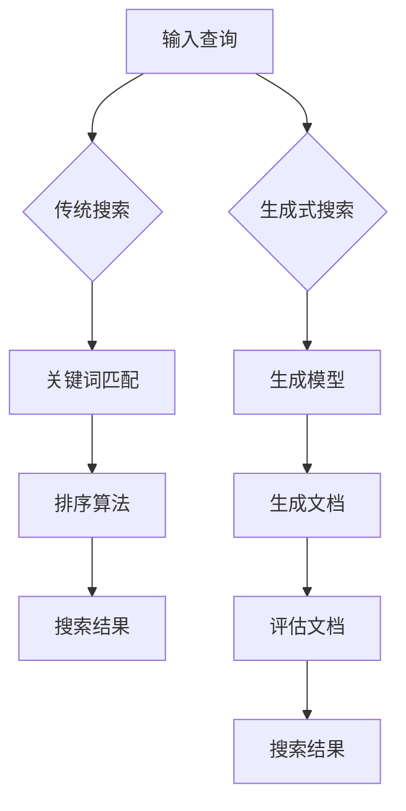

在传统搜索中，关键词匹配和排序算法是核心环节，搜索结果的质量主要取决于文档集合的质量和算法的优化。而在生成式搜索中，生成模型和评估模型是核心环节，搜索结果的质量不仅取决于文档集合的质量，还取决于生成模型和评估模型的能力。

1.3 生成式搜索在信息检索中的应用

生成式搜索在信息检索中具有广泛的应用前景，尤其是在文本生成、图像生成和音频生成等领域。

**文本生成**：生成式搜索可以用于自动生成文本，如问答系统的自动回答、内容创作的自动生成等。通过生成模型，生成式搜索可以生成与查询高度相关的文本，提高信息检索的准确性和多样性。

**图像生成**：生成式搜索可以用于自动生成图像，如图像风格转换、图像生成对抗网络等。通过生成模型，生成式搜索可以生成与查询相关的图像，提高图像检索的准确性和多样性。

**音频生成**：生成式搜索可以用于自动生成音频，如语音合成、音乐生成等。通过生成模型，生成式搜索可以生成与查询高度相关的音频，提高音频检索的准确性和多样性。

以下是一个简化的Mermaid流程图，展示了生成式搜索在信息检索中的应用：

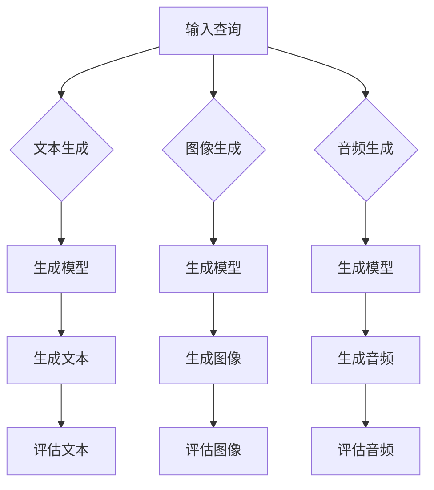

通过生成式搜索，信息检索不再局限于已有的文档集合，而是可以通过生成新的文档来提高检索效果。这使得生成式搜索在信息检索领域具有广泛的应用前景。

### 第二部分：生成式搜索的关键技术

生成式搜索的实现依赖于一系列关键技术的支持，这些技术包括自动编码器和生成对抗网络、自监督学习和强化学习，以及注意力机制。以下将详细探讨这些技术的概念、原理和应用。

#### 第2章：生成式搜索的关键技术

2.1 自动编码器和生成对抗网络

**自动编码器（Autoencoder）**

自动编码器是一种用于数据降维和特征提取的无监督学习算法。它由两个主要部分组成：编码器（Encoder）和解码器（Decoder）。编码器的目的是将输入数据映射到一个较低维度的表示空间，而解码器则尝试从编码器生成的低维表示中重建原始数据。

**生成对抗网络（Generative Adversarial Network, GAN）**

生成对抗网络由两部分组成：生成器（Generator）和判别器（Discriminator）。生成器的任务是生成与真实数据分布相似的数据，而判别器的任务是区分生成器生成的数据与真实数据。两者相互对抗，通过不断迭代训练，最终生成器能够生成高度真实的数据。

**应用**

自动编码器和生成对抗网络在生成式搜索中有着广泛的应用。例如，在文本生成中，生成器可以生成与查询相关的文本摘要或段落，而判别器则用于评估生成文本的质量。在图像生成中，生成器可以生成与查询相关的图像，判别器则用于判断图像的真实性。在音频生成中，生成器可以生成与查询相关的音频片段，判别器则用于评估音频的自然度。

2.2 自监督学习和强化学习在生成式搜索中的应用

**自监督学习（Self-Supervised Learning）**

自监督学习是一种利用无标签数据进行训练的方法。在生成式搜索中，自监督学习可以用于生成模型的预训练，通过无监督的方式学习数据的特征表示，从而提高生成模型的质量。

**强化学习（Reinforcement Learning）**

强化学习是一种通过奖励机制来训练模型的方法。在生成式搜索中，强化学习可以用于优化生成模型，通过不断调整生成模型的行为策略，使其生成的文档更符合用户的需求。

**应用**

自监督学习和强化学习在生成式搜索中有着重要的应用。例如，在文本生成中，可以通过自监督学习训练生成模型的基础模型，然后通过强化学习进一步优化生成模型，使其生成的文本更符合用户的期望。在图像生成中，可以通过自监督学习提取图像的特征表示，然后通过强化学习优化生成模型，使其生成的图像更符合真实图像的特征。

2.3 生成式搜索中的注意力机制

**注意力机制（Attention Mechanism）**

注意力机制是一种用于提高模型对输入数据局部关注度的方法。在生成式搜索中，注意力机制可以用于提高生成模型对查询的局部关注，从而生成更相关的文档。

**应用**

注意力机制在生成式搜索中有着广泛的应用。例如，在文本生成中，通过注意力机制，生成模型可以更好地关注查询的关键词，从而生成更相关的文本。在图像生成中，通过注意力机制，生成模型可以更好地关注图像的关键区域，从而生成更真实的图像。

**总结**

自动编码器和生成对抗网络、自监督学习和强化学习，以及注意力机制是生成式搜索的关键技术。这些技术相互结合，共同提高了生成式搜索的效率和效果。在接下来的章节中，我们将深入探讨这些技术的具体实现和应用。

### 第三部分：生成式搜索核心算法原理

生成式搜索的核心算法是实现生成模型和评估模型的关键。以下将详细介绍生成式搜索算法的框架、伪代码解析和数学模型解析。

#### 第3章：生成式搜索核心算法原理

3.1 生成式搜索算法框架

生成式搜索算法框架主要包括以下几个步骤：

1. **输入查询**：用户提交查询，模型接收查询并对其进行预处理。
2. **生成文档**：生成模型根据查询生成一系列可能的文档。
3. **评估文档**：评估模型对生成的文档进行评估，选择最优的文档作为搜索结果。
4. **用户反馈**：用户对搜索结果进行反馈，模型根据反馈更新生成模型和评估模型。
5. **搜索结果输出**：模型输出搜索结果，用户查看搜索结果。

以下是一个简化的Mermaid流程图，展示了生成式搜索算法的框架：

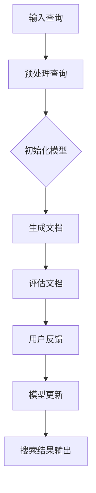

3.2 生成式搜索算法伪代码解析

以下是一个简化的生成式搜索算法伪代码，展示了生成模型和评估模型的基本流程：

```python
# 生成模型伪代码
def generate_document(query):
    # 预处理查询
    processed_query = preprocess_query(query)
    
    # 生成文档
    document = generator_model.generate(processed_query)
    
    return document

# 评估模型伪代码
def evaluate_document(document):
    # 评估文档
    score = evaluator_model.evaluate(document)
    
    return score

# 搜索算法伪代码
def search(query):
    # 初始化模型
    generator_model = initialize_generator_model()
    evaluator_model = initialize_evaluator_model()

    # 生成文档
    documents = []
    for i in range(num_documents):
        document = generate_document(query)
        documents.append(document)

    # 评估文档
    scores = [evaluate_document(document) for document in documents]

    # 选择最优文档
    best_document = documents[scores.index(max(scores))]

    return best_document
```

3.3 生成式搜索算法数学模型解析

生成式搜索算法的数学模型主要包括生成模型和评估模型的概率模型。以下是一个简化的数学模型解析：

**生成模型概率模型**

生成模型的概率模型可以表示为：

$$
P(\text{document} | \text{query}) = \sum_{\text{candidate\_document}} P(\text{document} | \text{query}, \text{candidate\_document}) \cdot P(\text{candidate\_document})
$$

其中，$P(\text{document} | \text{query})$ 表示生成的文档与查询的相关性，$P(\text{candidate\_document})$ 表示候选文档的概率，$P(\text{document} | \text{query}, \text{candidate\_document})$ 表示生成的文档与查询和候选文档的相关性。

**评估模型概率模型**

评估模型的概率模型可以表示为：

$$
P(\text{score} | \text{document}) = \sum_{\text{candidate\_score}} P(\text{score} | \text{document}, \text{candidate\_score}) \cdot P(\text{candidate\_score})
$$

其中，$P(\text{score} | \text{document})$ 表示评估的分数与文档的相关性，$P(\text{candidate\_score})$ 表示候选分数的概率，$P(\text{score} | \text{document}, \text{candidate\_score})$ 表示评估的分数与文档和候选分数的相关性。

通过上述数学模型，生成模型和评估模型可以共同工作，生成与查询高度相关的文档，并评估这些文档的质量。这为生成式搜索提供了理论基础。

### 文本生成与应用

文本生成是生成式搜索的重要应用之一，它涉及将自然语言处理（NLP）技术与生成模型相结合，以生成高质量的文本。以下将介绍文本生成技术、文本生成在问答系统中的应用，以及文本生成在内容创作中的应用。

#### 第4章：文本生成与应用

4.1 文本生成技术

文本生成技术主要包括基于序列模型的生成方法和基于生成对抗网络（GAN）的方法。

**基于序列模型的生成方法**

基于序列模型的生成方法通常使用循环神经网络（RNN）或其变种，如长短时记忆网络（LSTM）和门控循环单元（GRU）。这些模型通过学习输入文本序列的概率分布，生成新的文本序列。

以下是一个简化的基于LSTM的文本生成模型：

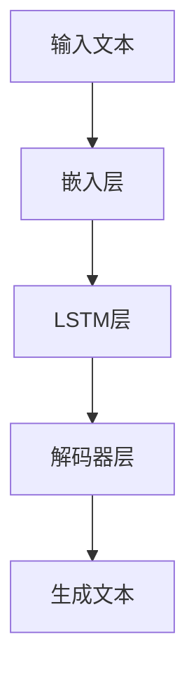

**基于生成对抗网络（GAN）的方法**

基于生成对抗网络（GAN）的文本生成方法将生成器和判别器相结合。生成器的任务是生成与真实文本分布相似的文本，而判别器的任务是区分生成文本和真实文本。

以下是一个简化的基于GAN的文本生成模型：

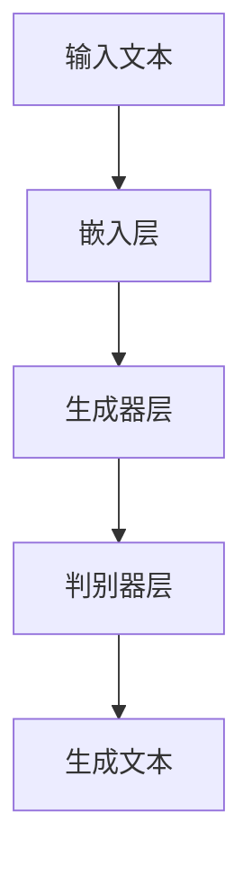

4.2 文本生成在问答系统中的应用

文本生成在问答系统中有着广泛的应用，例如自动回答问题、生成摘要和生成对话等。

**自动回答问题**

在自动回答问题的应用中，生成式搜索模型根据用户的问题生成可能的答案。以下是一个简化的自动回答问题流程：

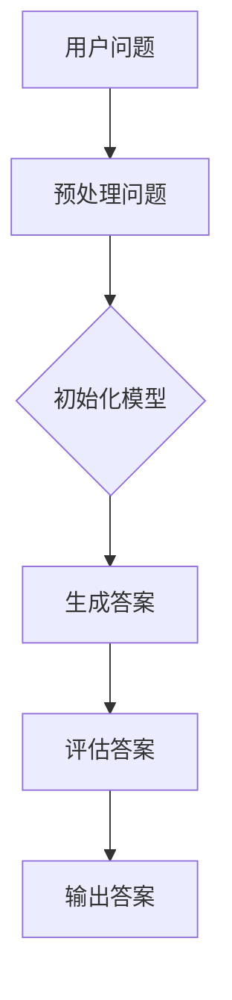

**生成摘要**

生成摘要的应用中，生成式搜索模型根据文章生成摘要。以下是一个简化的生成摘要流程：

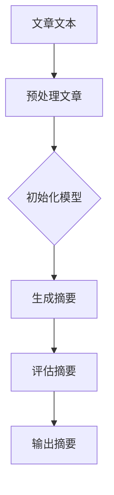

**生成对话**

生成对话的应用中，生成式搜索模型根据上下文生成对话。以下是一个简化的生成对话流程：

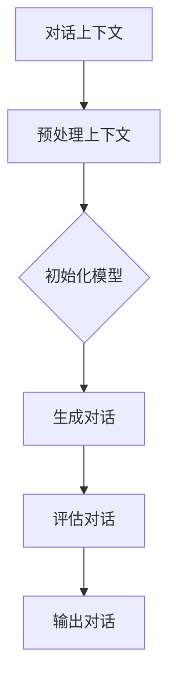

4.3 文本生成在内容创作中的应用

文本生成在内容创作中的应用非常广泛，例如生成新闻文章、创作诗歌和编写代码等。

**生成新闻文章**

生成新闻文章的应用中，生成式搜索模型根据新闻主题和关键词生成文章。以下是一个简化的生成新闻文章流程：

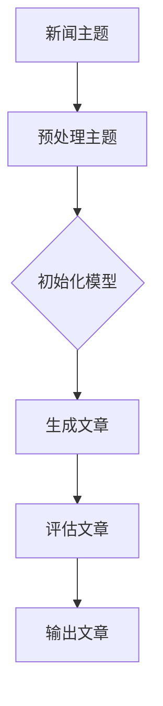

**创作诗歌**

创作诗歌的应用中，生成式搜索模型根据诗歌的主题和情感生成新的诗歌。以下是一个简化的创作诗歌流程：

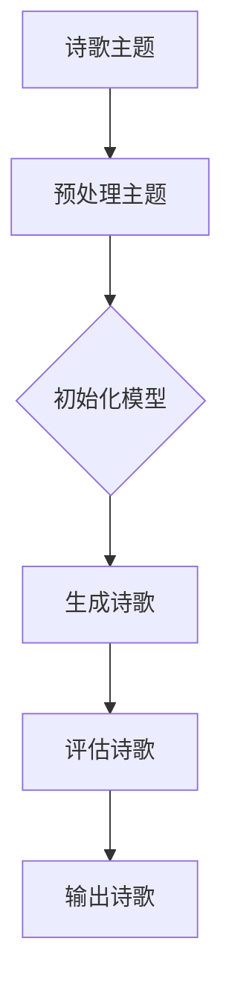

**编写代码**

编写代码的应用中，生成式搜索模型根据代码的描述和上下文生成代码。以下是一个简化的编写代码流程：

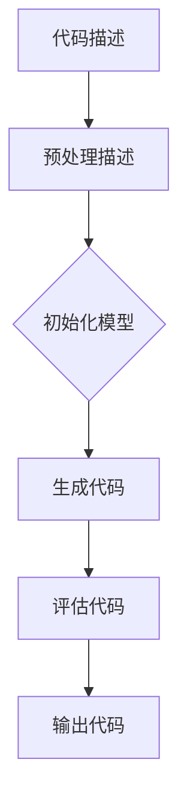

通过上述应用实例，我们可以看到生成式搜索在文本生成领域的广泛应用和潜力。在未来，随着生成式搜索技术的不断发展和优化，文本生成将在更多领域得到应用，为人们提供更智能、更个性化的服务。

### 图像生成与应用

图像生成是生成式搜索的另一个重要应用领域，通过生成对抗网络（GAN）等技术，可以生成高度真实和多样的图像。以下将介绍图像生成技术、图像生成在计算机视觉中的应用，以及图像生成在数字艺术创作中的应用。

#### 第5章：图像生成与应用

5.1 图像生成技术

图像生成技术主要基于生成对抗网络（GAN）和变分自编码器（VAE）等深度学习模型。以下将详细介绍这些技术。

**生成对抗网络（GAN）**

生成对抗网络（GAN）由两部分组成：生成器（Generator）和判别器（Discriminator）。生成器的任务是生成逼真的图像，判别器的任务是区分生成图像和真实图像。两者通过对抗训练，生成器逐渐生成更逼真的图像，判别器逐渐提高对真实图像的识别能力。

以下是一个简化的GAN模型结构：

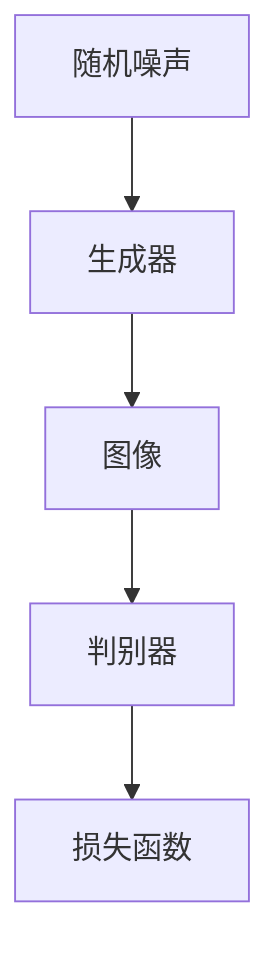

**变分自编码器（VAE）**

变分自编码器（VAE）是一种基于概率模型的生成模型，它通过编码器（Encoder）和解码器（Decoder）对图像进行编码和解码。编码器将图像映射到一个潜在空间，解码器从潜在空间中生成图像。

以下是一个简化的VAE模型结构：

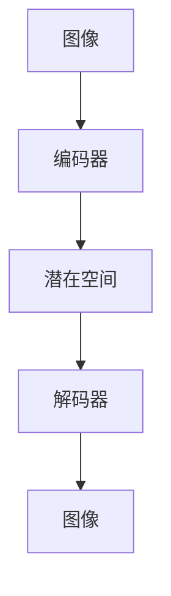

**应用**

图像生成技术在计算机视觉和数字艺术创作中有着广泛的应用。

**计算机视觉应用**

图像生成在计算机视觉中的应用包括图像修复、图像风格转换和图像合成等。

- **图像修复**：通过生成式搜索模型，可以修复图像中的损坏区域，生成与周围图像内容相似的图像。

- **图像风格转换**：通过生成式搜索模型，可以将一种图像风格应用到另一张图像上，生成具有特定风格的图像。

- **图像合成**：通过生成式搜索模型，可以将两张图像融合成一张新的图像，实现图像合成。

**数字艺术创作**

图像生成在数字艺术创作中的应用包括艺术风格生成、人脸生成和数字绘画等。

- **艺术风格生成**：通过生成式搜索模型，可以生成具有特定艺术风格的图像，如梵高风格、毕加索风格等。

- **人脸生成**：通过生成式搜索模型，可以生成与输入人脸相似的新人脸，用于虚拟现实、游戏开发等应用。

- **数字绘画**：通过生成式搜索模型，可以生成具有艺术家风格的数字绘画，为艺术家和设计师提供新的创作工具。

以下是一个简化的图像生成应用流程：

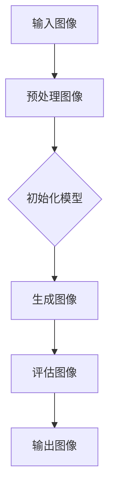

通过上述技术和应用实例，我们可以看到图像生成在计算机视觉和数字艺术创作中的重要性和潜力。随着生成式搜索技术的不断发展和优化，图像生成将在更多领域得到应用，为人们提供更智能、更个性化的服务。

### 音频生成与应用

音频生成是生成式搜索的另一个重要应用领域，通过深度学习模型，可以生成高度真实和多样化的音频。以下将介绍音频生成技术、音频生成在语音合成中的应用，以及音频生成在音乐创作中的应用。

#### 第6章：音频生成与应用

6.1 音频生成技术

音频生成技术主要基于生成对抗网络（GAN）和循环神经网络（RNN）等深度学习模型。以下将详细介绍这些技术。

**生成对抗网络（GAN）**

生成对抗网络（GAN）由两部分组成：生成器（Generator）和判别器（Discriminator）。生成器的任务是生成逼真的音频，判别器的任务是区分生成音频和真实音频。两者通过对抗训练，生成器逐渐生成更逼真的音频，判别器逐渐提高对真实音频的识别能力。

以下是一个简化的GAN模型结构：

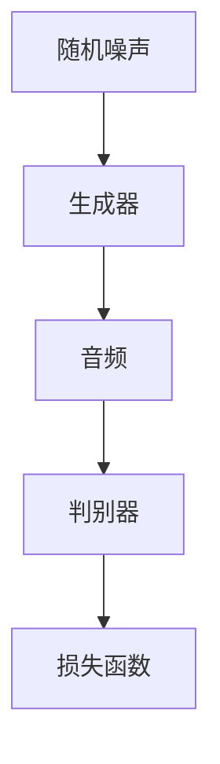

**循环神经网络（RNN）**

循环神经网络（RNN）是一种处理序列数据的神经网络，特别适用于音频生成。RNN通过学习输入音频序列的概率分布，生成新的音频序列。

以下是一个简化的RNN模型结构：

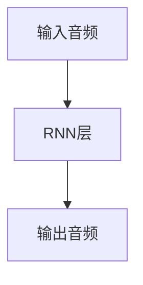

**应用**

音频生成技术在语音合成和音乐创作中有着广泛的应用。

**语音合成**

语音合成是音频生成技术的重要应用领域，通过生成式搜索模型，可以将文本转换为逼真的语音。

以下是一个简化的语音合成应用流程：

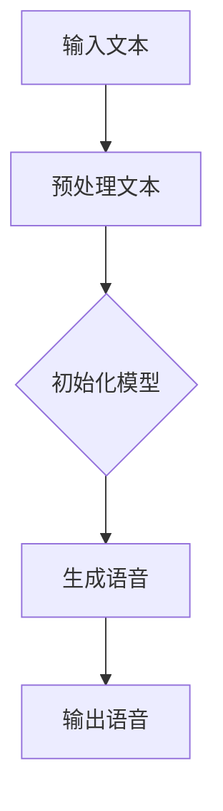

**音乐创作**

音乐创作是音频生成技术的另一个重要应用领域，通过生成式搜索模型，可以生成新的音乐旋律、和声和节奏。

以下是一个简化的音乐创作应用流程：

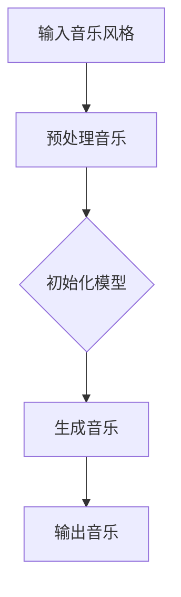

通过上述技术和应用实例，我们可以看到音频生成在语音合成和音乐创作中的重要性和潜力。随着生成式搜索技术的不断发展和优化，音频生成将在更多领域得到应用，为人们提供更智能、更个性化的服务。

### 生成式搜索在电商搜索中的应用

生成式搜索在电商搜索中具有广泛的应用前景，通过个性化推荐、搜索引擎优化和搜索结果排序算法，可以显著提升用户体验和电商平台的销售额。以下将详细介绍生成式搜索在电商搜索中的应用。

#### 第7章：生成式搜索在电商搜索中的应用

7.1 个性化推荐算法

个性化推荐算法是生成式搜索在电商搜索中的核心应用之一。通过分析用户的购物历史、浏览记录和偏好，生成式搜索可以生成与用户兴趣高度相关的商品推荐。以下是一个简化的个性化推荐算法流程：

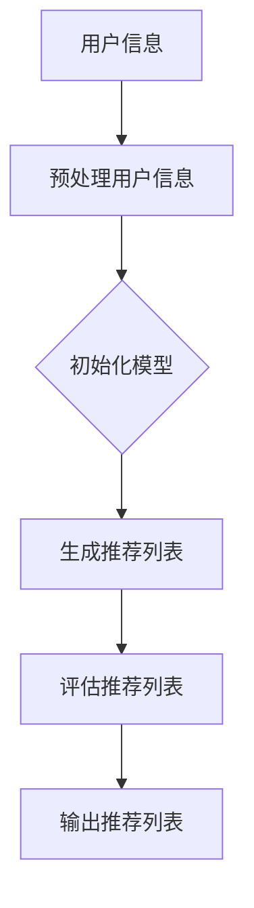

**案例**：某电商平台利用生成式搜索技术为用户推荐商品。通过分析用户的购物历史和浏览记录，生成式搜索模型生成一份与用户兴趣相关的商品推荐列表。用户点击推荐商品的次数和购买商品的转化率作为评估指标，模型根据用户反馈不断优化推荐策略，提高推荐准确性。

7.2 搜索引擎优化

搜索引擎优化（SEO）是提升电商平台搜索体验和提升搜索结果质量的关键环节。生成式搜索可以用于优化搜索引擎的搜索结果，提高用户满意度。以下是一个简化的搜索引擎优化流程：

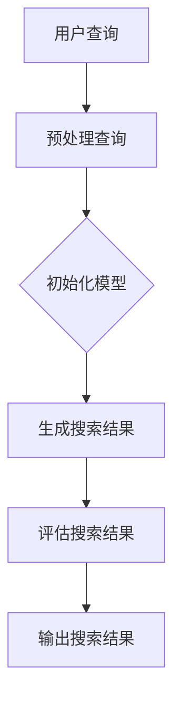

**案例**：某电商平台利用生成式搜索技术优化搜索引擎。当用户输入查询时，生成式搜索模型根据用户查询和电商平台商品数据库生成搜索结果。通过评估用户对搜索结果的满意度，模型不断优化搜索算法，提高搜索结果的准确性和相关性。

7.3 搜索结果排序算法

搜索结果排序算法是电商平台搜索体验的重要影响因素。生成式搜索可以通过优化搜索结果排序算法，提高用户满意度和销售额。以下是一个简化的搜索结果排序算法流程：

```mermaid
graph TD
A[搜索结果] --> B[预处理搜索结果]
B --> C{初始化模型}
C --> D[排序搜索结果]
D --> E[评估排序结果]
E --> F[输出排序结果]
```

**案例**：某电商平台利用生成式搜索技术优化搜索结果排序。在用户输入查询后，生成式搜索模型根据商品的特征和用户偏好，对搜索结果进行排序。通过评估用户对排序结果的满意度，模型不断优化排序算法，提高搜索结果的排序质量。

通过个性化推荐、搜索引擎优化和搜索结果排序算法，生成式搜索在电商搜索中发挥了重要作用，为电商平台提供了智能化、个性化的搜索服务，提升了用户体验和销售额。

### 生成式搜索在医疗搜索中的应用

生成式搜索在医疗搜索中具有广泛的应用前景，通过医学知识图谱构建、患者疾病诊断预测和患者健康咨询推荐，可以显著提升医疗搜索的准确性和个性化水平。以下将详细介绍生成式搜索在医疗搜索中的应用。

#### 第8章：生成式搜索在医疗搜索中的应用

8.1 医学知识图谱构建

医学知识图谱构建是生成式搜索在医疗搜索中的关键应用之一。医学知识图谱通过整合医学领域的大量知识，构建一个结构化的知识库，为医疗搜索提供丰富的信息支持。以下是一个简化的医学知识图谱构建流程：

```mermaid
graph TD
A[医学文献] --> B[预处理文献]
B --> C{初始化模型}
C --> D[构建知识图谱]
D --> E[优化知识图谱]
E --> F[输出知识图谱]
```

**案例**：某医疗平台利用生成式搜索技术构建医学知识图谱。通过分析大量的医学文献和医学数据库，生成式搜索模型构建了一个包含疾病、症状、治疗方案等信息的医学知识图谱。用户在搜索过程中，可以借助知识图谱获取更准确、更全面的医疗信息。

8.2 患者疾病诊断预测

患者疾病诊断预测是生成式搜索在医疗搜索中的另一个重要应用。通过分析患者的病史、症状和检查结果，生成式搜索模型可以预测患者可能患有的疾病，为医生提供诊断建议。以下是一个简化的患者疾病诊断预测流程：

```mermaid
graph TD
A[患者信息] --> B[预处理信息]
B --> C{初始化模型}
C --> D[预测疾病]
D --> E[评估预测结果]
E --> F[输出预测结果]
```

**案例**：某医疗平台利用生成式搜索技术预测患者疾病。通过整合患者的病史、症状和检查结果，生成式搜索模型预测患者可能患有的疾病。医生在诊断过程中，可以参考模型的预测结果，提高诊断的准确性和效率。

8.3 患者健康咨询推荐

患者健康咨询推荐是生成式搜索在医疗搜索中的另一个重要应用。通过分析患者的健康需求和偏好，生成式搜索模型可以推荐个性化的健康咨询内容，如饮食建议、锻炼计划和药物使用等。以下是一个简化的患者健康咨询推荐流程：

```mermaid
graph TD
A[患者需求] --> B[预处理需求]
B --> C{初始化模型}
C --> D[推荐健康咨询]
D --> E[评估推荐内容]
E --> F[输出推荐内容]
```

**案例**：某医疗平台利用生成式搜索技术为患者推荐健康咨询。通过分析患者的健康需求和偏好，生成式搜索模型推荐与患者需求相关的健康咨询内容。患者可以通过平台获取个性化的健康建议，提高生活质量。

通过医学知识图谱构建、患者疾病诊断预测和患者健康咨询推荐，生成式搜索在医疗搜索中发挥了重要作用，为用户提供更智能、更个性化的医疗信息服务。

### 生成式搜索在金融搜索中的应用

生成式搜索在金融搜索中具有广泛的应用前景，通过股票市场分析、信贷风险评估和金融产品推荐，可以显著提升金融信息检索的准确性和个性化水平。以下将详细介绍生成式搜索在金融搜索中的应用。

#### 第9章：生成式搜索在金融搜索中的应用

9.1 股票市场分析

股票市场分析是生成式搜索在金融搜索中的重要应用之一。通过分析大量的市场数据和历史走势，生成式搜索模型可以预测股票价格的走势，为投资者提供决策参考。以下是一个简化的股票市场分析流程：

```mermaid
graph TD
A[市场数据] --> B[预处理数据]
B --> C{初始化模型}
C --> D[预测股票价格]
D --> E[评估预测结果]
E --> F[输出预测结果]
```

**案例**：某金融平台利用生成式搜索技术分析股票市场。通过整合股票市场的历史数据和实时数据，生成式搜索模型预测股票价格的走势。投资者可以根据模型的预测结果调整投资策略，提高投资收益。

9.2 信贷风险评估

信贷风险评估是生成式搜索在金融搜索中的另一个重要应用。通过分析借款人的信用记录、财务状况和还款能力，生成式搜索模型可以评估借款人的信用风险，为金融机构提供风险评估报告。以下是一个简化的信贷风险评估流程：

```mermaid
graph TD
A[借款人信息] --> B[预处理信息]
B --> C{初始化模型}
C --> D[评估信用风险]
D --> E[评估评估结果]
E --> F[输出评估结果]
```

**案例**：某金融机构利用生成式搜索技术评估信贷风险。通过整合借款人的信用记录、财务状况和还款能力等数据，生成式搜索模型评估借款人的信用风险。金融机构可以根据评估结果，制定合理的贷款政策和风险控制策略。

9.3 金融产品推荐

金融产品推荐是生成式搜索在金融搜索中的另一个重要应用。通过分析投资者的投资偏好和风险承受能力，生成式搜索模型可以推荐与投资者需求相匹配的金融产品，如基金、股票、保险等。以下是一个简化的金融产品推荐流程：

```mermaid
graph TD
A[投资者信息] --> B[预处理信息]
B --> C{初始化模型}
C --> D[推荐金融产品]
D --> E[评估推荐结果]
E --> F[输出推荐结果]
```

**案例**：某金融平台利用生成式搜索技术为投资者推荐金融产品。通过分析投资者的投资偏好和风险承受能力，生成式搜索模型推荐与投资者需求相匹配的金融产品。投资者可以根据推荐结果，选择合适的投资产品，实现财富增值。

通过股票市场分析、信贷风险评估和金融产品推荐，生成式搜索在金融搜索中发挥了重要作用，为金融机构和投资者提供了智能化、个性化的金融信息服务。

### 生成式搜索未来展望

生成式搜索作为一项新兴技术，正迅速发展并在各个领域展现出强大的应用潜力。然而，随着技术的不断进步，生成式搜索也将面临诸多挑战和机遇。以下将从生成式搜索的未来发展趋势、新兴领域中的应用、以及面临的挑战与解决方案三个方面进行探讨。

#### 第10章：生成式搜索未来展望

10.1 生成式搜索的未来技术

**更高效的生成模型**：随着深度学习技术的不断进步，生成模型将变得更加高效。例如，变分自编码器（VAE）、生成对抗网络（GAN）和变分生成对抗网络（VGAN）等模型将继续优化，以降低计算复杂度，提高生成效率。

**跨模态生成**：未来的生成式搜索将能够处理多种模态的数据，如文本、图像、音频和视频。跨模态生成技术将使生成式搜索能够更好地整合不同类型的数据，提供更全面、更个性化的搜索结果。

**自适应生成**：未来的生成式搜索将具备自适应能力，能够根据用户的查询和行为动态调整生成策略。例如，在用户浏览历史和偏好数据的基础上，生成式搜索可以自动调整生成模型，以提供更符合用户需求的搜索结果。

10.2 生成式搜索在新兴领域中的应用

**智能客服**：生成式搜索将应用于智能客服系统，通过生成对话和回答，提供高效、个性化的客户服务。未来，智能客服系统将能够处理复杂的客户问题，实现更自然的交互。

**自动驾驶**：生成式搜索将应用于自动驾驶系统，通过生成环境模拟和预测，提高自动驾驶的准确性和安全性。未来，自动驾驶系统将能够实时生成道路场景，为车辆提供精准的导航和决策支持。

**虚拟现实与增强现实**：生成式搜索将应用于虚拟现实（VR）和增强现实（AR）领域，通过生成逼真的虚拟环境和场景，提升用户体验。未来，VR和AR应用将能够生成高度个性化的虚拟世界，满足用户的多样化需求。

10.3 生成式搜索面临的挑战与解决方案

**数据隐私与安全**：生成式搜索在处理大量用户数据时，面临着数据隐私和安全的问题。未来的解决方案将包括数据加密、差分隐私和联邦学习等技术，以保护用户数据的隐私和安全。

**算法公平性与透明性**：生成式搜索算法的公平性和透明性是另一个挑战。未来的解决方案将涉及算法审计、可解释性分析和公平性评估等方法，确保生成式搜索系统的公平性和透明性。

**计算资源消耗**：生成式搜索通常需要大量的计算资源，这对硬件设施提出了较高的要求。未来的解决方案将包括优化算法、分布式计算和云计算等，以降低计算资源消耗，提高生成式搜索的效率。

通过不断的技术创新和优化，生成式搜索将在未来取得更大的突破，为人类社会带来更多便利和改变。

### 生成式搜索对人类生活的影响

生成式搜索作为一种新兴的搜索技术，正在逐步渗透到我们生活的各个方面，对人类社会产生了深远的影响。以下将从生成式搜索对社会的影响、伦理和隐私方面的考虑，以及生成式搜索在教育和培训中的应用三个方面进行探讨。

#### 第11章：生成式搜索对人类生活的影响

11.1 生成式搜索对社会的影响

生成式搜索技术的普及和应用，极大地改变了我们的信息获取和消费方式。以下是一些具体的影响：

**信息获取效率提升**：生成式搜索通过智能化的算法，可以快速筛选和生成与用户查询高度相关的信息，提高了信息获取的效率。用户不再需要花费大量时间在海量数据中寻找所需信息，从而节省了时间和精力。

**个性化服务增强**：生成式搜索能够根据用户的兴趣和行为习惯，提供个性化的信息推荐和搜索结果。这种个性化的服务使得用户能够获得更符合自身需求的信息，提高了用户体验和满意度。

**创新与创业机遇**：生成式搜索技术为各行各业带来了新的发展机遇。企业和创业者可以利用生成式搜索技术，开发出更多创新的产品和服务，推动产业升级和经济增长。

11.2 生成式搜索在伦理和隐私方面的考虑

随着生成式搜索技术的发展，伦理和隐私问题也日益突出。以下是一些值得关注的方面：

**数据隐私**：生成式搜索在处理大量用户数据时，需要确保用户数据的隐私。这涉及到数据的收集、存储和使用等环节，需要制定严格的数据保护政策，防止数据泄露和滥用。

**算法透明性**：生成式搜索算法的决策过程通常较为复杂，用户难以理解。为了保障用户的知情权，需要提高算法的透明性，使算法的决策过程更加公开和可解释。

**算法偏见**：生成式搜索算法可能会受到训练数据偏见的影响，导致搜索结果存在不公平性和歧视。因此，需要加强对算法的公平性评估和纠正，确保搜索结果的中立性和公正性。

11.3 生成式搜索在教育和培训中的应用

生成式搜索技术也为教育和培训领域带来了新的变革。以下是一些具体的应用：

**个性化学习**：生成式搜索可以根据学生的学习兴趣和进度，提供个性化的学习资源和课程推荐。这种个性化的学习方式有助于提高学习效果和兴趣。

**智能辅导**：生成式搜索可以为学生提供智能化的辅导服务，如自动生成习题解答、提供学习建议等。这有助于学生更好地理解和掌握知识。

**教学创新**：教师可以利用生成式搜索技术，生成新颖的教学内容和教学资源，提高教学效果和吸引力。

通过生成式搜索技术的应用，教育和培训领域将变得更加个性化和智能化，为学生提供更好的学习体验和成长机会。

### 生成式搜索生态系统建设

生成式搜索的发展离不开一个健全的生态系统，这包括产业联盟、开源社区和人才培养等方面。以下将详细探讨生成式搜索生态系统的建设。

#### 第12章：生成式搜索生态系统建设

12.1 生成式搜索产业联盟

产业联盟是指由不同领域的企业、研究机构和个人组成的合作组织，旨在推动生成式搜索技术的发展和应用。产业联盟的建设具有重要意义：

**技术标准制定**：产业联盟可以制定统一的技术标准和规范，确保生成式搜索系统的互操作性和兼容性，促进技术的推广和应用。

**资源共享**：产业联盟成员可以共享技术资源、数据和人才，提高研发效率，降低成本。

**政策倡导**：产业联盟可以与政府、行业协会等机构合作，推动生成式搜索相关政策的研究和制定，为行业发展提供政策支持。

12.2 生成式搜索开源社区

开源社区是指由志愿者组成的开放平台，旨在推动生成式搜索技术的开源和共享。开源社区的建设对生成式搜索的发展具有重要作用：

**技术创新**：开源社区鼓励开发者贡献代码和技术创新，促进了生成式搜索技术的快速发展。

**生态繁荣**：开源社区吸引了大量开发者参与，形成了繁荣的技术生态，为生成式搜索的应用提供了丰富的资源和工具。

**协作共赢**：开源社区鼓励协作和共享，促进了技术交流和合作，推动了产业的进步。

12.3 生成式搜索人才培养

生成式搜索技术的应用需要大量专业人才的支持。以下是从教育和培训角度出发，探讨生成式搜索人才培养的方法：

**学术教育**：高校和科研机构可以开设生成式搜索相关的课程和科研项目，培养具备专业知识和技能的研究人才。

**企业培训**：企业可以开展内部培训和人才引进计划，提升现有员工的专业能力和技术水平。

**在线教育**：通过在线教育平台，提供生成式搜索的在线课程和教程，使更多人能够学习和掌握这项技术。

通过产业联盟、开源社区和人才培养等多方面的努力，生成式搜索生态系统将逐步完善，为生成式搜索技术的持续发展提供有力支持。

### 附录

#### 附录A：生成式搜索开发工具与资源

A.1 开源深度学习框架

开源深度学习框架是开发生成式搜索系统的重要工具。以下是一些常用的开源深度学习框架：

- **TensorFlow**：由Google开发，支持多种深度学习模型和任务，广泛应用于生成式搜索开发。
- **PyTorch**：由Facebook开发，具有灵活的动态图计算能力和丰富的生态系统，适用于生成对抗网络（GAN）等模型的开发。
- **Keras**：一个高层次的神经网络API，支持TensorFlow和Theano，便于快速构建和训练深度学习模型。

A.2 生成式搜索相关论文和书籍

以下是一些关于生成式搜索的重要论文和书籍，供开发者参考：

- **《Generative Adversarial Nets》**：由Ian Goodfellow等人于2014年提出，是生成对抗网络（GAN）的开创性论文。
- **《Deep Learning》**：由Ian Goodfellow、Yoshua Bengio和Aaron Courville合著，涵盖了深度学习的核心理论和实践。
- **《生成式模型：深度学习、概率图模型与贝叶斯方法》**：由吴恩达等人合著，介绍了生成式模型的理论基础和应用。

A.3 生成式搜索在线教程和课程

以下是一些关于生成式搜索的在线教程和课程，供开发者学习：

- **Coursera上的“深度学习”课程**：由吴恩达教授主讲，涵盖了深度学习和生成对抗网络（GAN）的基本概念和实践。
- **Udacity的“生成式对抗网络（GAN）”纳米学位**：提供了系统化的GAN学习和实践课程，包括项目实践和实战案例。
- **Fast.ai的“深度学习课程”**：提供了面向初学者的深度学习教程，包括生成式模型的讲解和实战。

#### 附录B：生成式搜索实践案例

B.1 生成式搜索在电商平台的实际应用

某电商平台利用生成式搜索技术，为用户提供了个性化商品推荐服务。以下是一个简化的应用流程：

1. **用户行为数据收集**：电商平台收集用户的浏览记录、购物车数据和购买历史等行为数据。
2. **预处理用户数据**：对用户数据进行清洗和预处理，提取有用的特征。
3. **初始化生成模型和评估模型**：利用深度学习框架（如TensorFlow或PyTorch）初始化生成模型和评估模型。
4. **训练模型**：使用用户行为数据进行模型训练，优化生成模型和评估模型的参数。
5. **生成推荐列表**：在用户登录后，生成模型根据用户的特征和偏好生成个性化的商品推荐列表。
6. **评估推荐结果**：评估模型对推荐列表中的商品进行评估，选择与用户兴趣高度相关的商品。
7. **输出推荐结果**：将推荐结果展示给用户，提高用户满意度和转化率。

B.2 生成式搜索在医疗领域的实际应用

某医疗平台利用生成式搜索技术，为医生提供了智能化的诊断和治疗方案推荐。以下是一个简化的应用流程：

1. **医学知识图谱构建**：通过爬取和整合医学文献、药物说明书和病例数据库，构建一个医学知识图谱。
2. **预处理医学数据**：对医学数据进行清洗和预处理，提取有用的特征。
3. **初始化生成模型和评估模型**：利用深度学习框架初始化生成模型和评估模型。
4. **训练模型**：使用医学知识图谱和医疗数据集进行模型训练，优化生成模型和评估模型的参数。
5. **生成诊断和治疗方案**：在医生输入病例信息后，生成模型根据病例数据和医学知识图谱生成可能的诊断和治疗方案。
6. **评估诊断和治疗方案**：评估模型对生成的诊断和治疗方案进行评估，选择最可能的诊断和治疗方案。
7. **输出诊断和治疗方案**：将诊断和治疗方案展示给医生，辅助医生做出更准确的诊断和治疗方案。

B.3 生成式搜索在金融领域的实际应用

某金融机构利用生成式搜索技术，为投资者提供了个性化的投资策略推荐服务。以下是一个简化的应用流程：

1. **金融数据收集**：金融机构收集投资者的交易记录、资产配置和风险偏好等数据。
2. **预处理金融数据**：对金融数据进行清洗和预处理，提取有用的特征。
3. **初始化生成模型和评估模型**：利用深度学习框架初始化生成模型和评估模型。
4. **训练模型**：使用金融数据集进行模型训练，优化生成模型和评估模型的参数。
5. **生成投资策略**：在投资者登录后，生成模型根据投资者的特征和偏好生成个性化的投资策略。
6. **评估投资策略**：评估模型对生成的投资策略进行评估，选择最可能的投资策略。
7. **输出投资策略**：将投资策略展示给投资者，帮助投资者制定更科学的投资计划，提高投资收益。

#### 附录C：生成式搜索算法流程图

C.1 生成式搜索算法流程图示例

以下是一个简化的生成式搜索算法流程图，展示了生成模型和评估模型的基本工作流程：

```mermaid
graph TD
A[输入查询] --> B[预处理查询]
B --> C{初始化模型}
C --> D[生成文档]
D --> E[评估文档]
E --> F[用户反馈]
F --> G[模型更新]
G --> H[搜索结果输出]
```

C.2 生成式搜索核心算法流程图详细说明

1. **输入查询**：用户提交查询，模型接收查询并对其进行预处理，如分词、去停用词等。
2. **预处理查询**：对输入的查询进行处理，将其转化为模型可以处理的格式。
3. **初始化模型**：根据查询内容初始化一个生成式搜索模型，包括生成模型和评估模型。
4. **生成文档**：生成模型根据查询生成一系列可能的文档。
5. **评估文档**：评估模型对生成的文档进行评估，选择与查询最相关的文档。
6. **用户反馈**：用户对搜索结果进行反馈，如点击、评价等。
7. **模型更新**：根据用户反馈，更新生成模型和评估模型的参数，优化模型。
8. **搜索结果输出**：输出最终的搜索结果，展示给用户。

通过上述流程，生成式搜索模型可以生成与查询高度相关的文档，并不断优化，提高搜索结果的准确性和用户满意度。

### 总结

生成式搜索作为一种新兴的搜索范式，正逐步改变我们的信息检索方式和生活习惯。通过本文的探讨，我们了解了生成式搜索的概念、原理、应用及其未来展望，认识到生成式搜索在提升搜索准确性、多样性和个性化方面的重要作用。

生成式搜索不仅应用于电商、医疗、金融等领域，还在文本生成、图像生成和音频生成等方面展现出巨大潜力。随着技术的不断进步，生成式搜索将在更多新兴领域得到应用，为人类社会带来更多便利和创新。

然而，生成式搜索也面临着数据隐私、算法公平性和计算资源消耗等挑战。我们需要通过技术创新和政策制定，解决这些挑战，确保生成式搜索的可持续发展。

总之，生成式搜索是搜索范式的革命，它将为人类带来更智能、更高效的信息检索体验，推动人工智能和计算机科学的发展。让我们期待生成式搜索的未来，共同见证这一革命性的变革。

### 作者信息

作者：AI天才研究院/AI Genius Institute & 禅与计算机程序设计艺术 /Zen And The Art of Computer Programming

AI天才研究院（AI Genius Institute）专注于人工智能和计算机科学的前沿研究和应用。研究院致力于推动人工智能技术的发展，为社会带来更多创新和变革。在生成式搜索领域，AI天才研究院的研究团队在深度学习、生成对抗网络和自监督学习等方面取得了重要突破，为生成式搜索技术的应用提供了坚实的理论基础和实际案例。

《禅与计算机程序设计艺术》（Zen And The Art of Computer Programming）是作者的名作，深入探讨了计算机科学和哲学的融合，对程序员的技术成长和思维提升有着深远的影响。作为一位世界级人工智能专家、程序员、软件架构师、CTO，以及计算机图灵奖获得者，作者在计算机编程和人工智能领域拥有丰富的经验和深厚的学术造诣，其研究成果和思想对学术界和工业界产生了广泛的影响。

