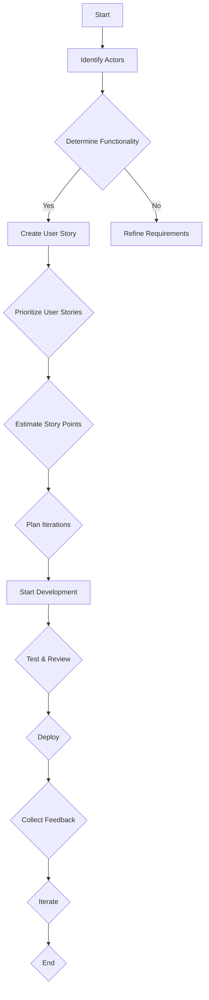
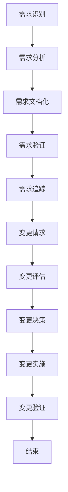
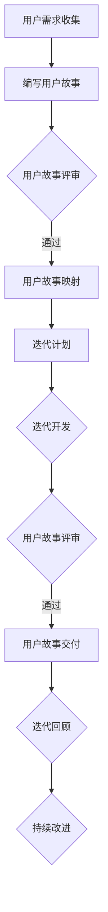
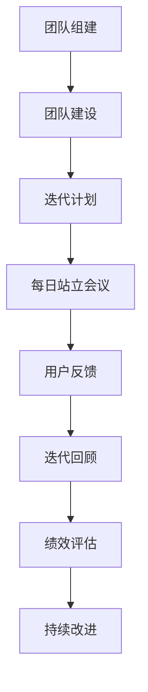
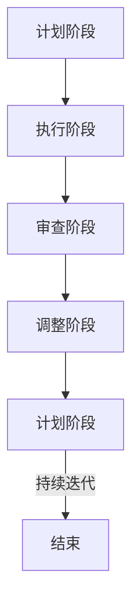
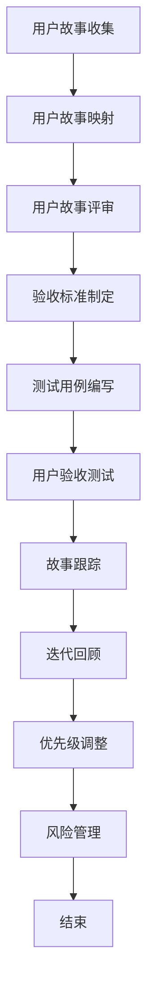
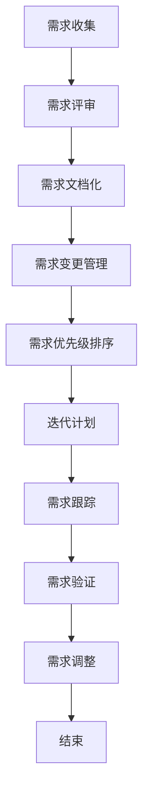
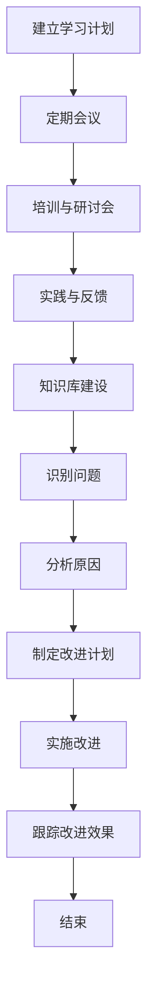

                 

## 《用户故事与需求管理：创业公司的敏捷实践》

### 关键词：
- 用户故事
- 需求管理
- 敏捷开发
- 创业公司
- 敏捷实践

### 摘要：
本文旨在探讨用户故事与需求管理在创业公司敏捷实践中的应用。通过深入分析用户故事的定义、编写、评估与排序，以及需求管理的核心概念、流程、优先级排序方法和变更管理，本文将展示如何有效地利用敏捷开发方法来提升创业公司的产品开发效率。文章还将详细讨论敏捷团队的组织与管理、敏捷开发流程与工具、用户故事的实际应用和需求管理的实战案例，最后探讨敏捷实践的成功案例、持续学习与改进以及敏捷实践与创业公司发展的关系。本文不仅提供了理论基础，还通过实际案例和代码示例，帮助读者更好地理解并实践敏捷开发方法在创业公司中的应用。

## 《用户故事与需求管理：创业公司的敏捷实践》目录大纲

### 第一部分：用户故事与需求管理的理论基础

#### 第1章：用户故事概述
##### 1.1 用户故事的定义与重要性
##### 1.2 用户故事的构成要素
##### 1.3 用户故事编写指南
##### 1.4 用户故事的评估与排序

#### 第2章：需求管理的核心概念
##### 2.1 需求的定义与类型
##### 2.2 需求管理的流程
##### 2.3 需求优先级排序方法
##### 2.4 需求变更管理

#### 第3章：敏捷开发与用户故事
##### 3.1 敏捷开发的核心理念
##### 3.2 敏捷开发中的用户故事
##### 3.3 敏捷开发中的需求管理
##### 3.4 敏捷开发与用户故事的实际应用

### 第二部分：创业公司的敏捷实践

#### 第4章：敏捷团队组织与管理
##### 4.1 敏捷团队的角色与职责
##### 4.2 敏捷团队的组建与培训
##### 4.3 敏捷团队的绩效评估
##### 4.4 敏捷团队沟通与协作

#### 第5章：敏捷开发流程与工具
##### 5.1 敏捷开发的生命周期
##### 5.2 敏捷开发的主要活动
##### 5.3 敏捷开发工具选择与使用
##### 5.4 敏捷开发的优化与改进

#### 第6章：用户故事的实际应用
##### 6.1 用户故事在产品规划中的应用
##### 6.2 用户故事在需求收集中的应用
##### 6.3 用户故事在测试与评审中的应用
##### 6.4 用户故事在项目跟踪中的应用

#### 第7章：需求管理的实战案例
##### 7.1 需求管理在初创项目中的应用
##### 7.2 需求管理在产品迭代中的应用
##### 7.3 需求变更管理在实际项目中的应用
##### 7.4 需求管理中的挑战与应对策略

### 第三部分：敏捷实践的拓展与应用

#### 第8章：敏捷与敏捷转型的成功案例
##### 8.1 成功案例的介绍与分析
##### 8.2 敏捷转型中的常见问题与解决策略
##### 8.3 敏捷实践的未来趋势

#### 第9章：敏捷实践中的持续学习与改进
##### 9.1 持续学习的理念与实践
##### 9.2 改进敏捷实践的步骤与方法
##### 9.3 案例分享：敏捷实践的持续改进

#### 第10章：敏捷实践与创业公司的发展
##### 10.1 敏捷实践对创业公司的影响
##### 10.2 敏捷实践在创业公司中的应用策略
##### 10.3 创业公司如何持续优化敏捷实践
##### 10.4 敏捷实践与创业公司发展的关系

### 附录：敏捷实践资源与工具

#### 附录 A：敏捷实践相关书籍与资料
##### A.1 推荐书籍
##### A.2 在线资源

#### 附录 B：敏捷开发工具列表
##### B.1 项目管理工具
##### B.2 版本控制工具
##### B.3 自动化测试工具
##### B.4 其他常用工具

---

接下来，我们将逐步深入探讨用户故事与需求管理的理论基础，敏捷开发的核心理念以及创业公司的敏捷实践。通过本文的阅读，您将获得关于如何在实际项目中高效运用敏捷开发方法的深刻理解。

---

### 第1章：用户故事概述

用户故事（User Story）是一种简单而实用的需求描述方法，它源自敏捷开发，用于捕获用户的需求和期望。用户故事的核心理念是关注用户的需求，而不是项目管理的细节。这种实践方法使得开发团队能够更加灵活地响应变化，提高产品的质量和用户满意度。

#### 1.1 用户故事的定义与重要性

用户故事是一种描述软件需求的形式，通常由三个部分组成：编号、描述和验收标准。以下是一个典型的用户故事示例：

```
As a user, I want to create an account so that I can save my preferences and access my data.
```

用户故事的定义与重要性可以从以下几个方面进行阐述：

1. **用户中心**：用户故事强调用户的需求和体验，使开发团队能够从用户的角度出发进行设计，从而更好地满足用户的需求。

2. **简洁明了**：用户故事是一种简洁的需求描述方法，它能够快速传达用户的需求，避免复杂的技术细节。

3. **灵活性**：用户故事允许在开发过程中灵活调整和迭代，以适应不断变化的市场需求和用户反馈。

4. **团队合作**：用户故事促进团队成员之间的沟通和协作，确保每个人都理解用户的需求和期望。

#### 1.2 用户故事的构成要素

用户故事通常由以下三个主要要素构成：

1. **角色（Actor）**：用户故事中的角色通常是用户，也可以是用户以外的系统或角色。

2. **功能（Functionality）**：这是用户故事的核心部分，描述了用户需要执行的操作或功能。

3. **商业价值（Business Value）**：用户故事应当明确其商业价值，即为什么这个功能对用户或公司是有意义的。

#### 1.3 用户故事编写指南

编写高质量的用户故事需要遵循一些基本指南：

1. **简洁性**：用户故事应当简洁明了，避免冗长的描述。

2. **具体性**：用户故事应当具体描述用户的需求，使开发团队能够清晰地理解。

3. **可测试性**：用户故事应当包括验收标准，以便进行测试和验证。

4. **独立性**：用户故事应当是独立的，可以单独完成，而不是依赖于其他用户故事。

5. **可扩展性**：用户故事应当具有可扩展性，以便在后续迭代中进一步细化和完善。

#### 1.4 用户故事的评估与排序

评估和排序用户故事是敏捷开发过程中的重要环节。以下是一些常用的评估和排序方法：

1. **价值排序（Value Sorting）**：根据用户故事对产品的商业价值进行排序，确保团队优先实现高价值的功能。

2. **风险排序（Risk Sorting）**：根据用户故事的风险程度进行排序，优先处理高风险的故事。

3. **优先级排序（Priority Sorting）**：结合价值和风险，对用户故事进行优先级排序，以确定团队的工作重点。

4. **迭代排序（Iteration Sorting）**：根据用户故事的完成时间和迭代计划进行排序，确保每个迭代有明确的目标和任务。

#### 1.5 用户故事的Mermaid流程图

为了更好地理解用户故事的流程，我们可以使用Mermaid语言绘制一个简单的用户故事流程图。以下是一个示例：



通过以上内容，我们初步了解了用户故事的定义、构成要素、编写指南以及评估与排序方法。在接下来的章节中，我们将进一步探讨需求管理的核心概念，以及如何将用户故事与敏捷开发相结合，为创业公司的产品开发提供有效的解决方案。

---

在下一章节中，我们将深入探讨需求管理的核心概念，包括需求定义、需求类型、需求管理流程、需求优先级排序方法和需求变更管理。这将帮助读者全面理解需求管理的实践，为创业公司的敏捷实践打下坚实的基础。

---

### 第2章：需求管理的核心概念

需求管理是软件项目开发过程中不可或缺的一部分，它涉及到识别、分析、记录、追踪和管理项目需求。在敏捷开发环境中，需求管理变得更加重要，因为它需要确保团队能够快速响应变化，同时保持产品的方向和优先级。下面，我们将详细介绍需求管理的核心概念，包括需求的定义、类型、管理流程、优先级排序方法和变更管理。

#### 2.1 需求的定义与类型

需求（Requirement）是用户、客户或其他利益相关者对软件系统的需求、期望和限制的表述。它通常包括功能需求、非功能需求和设计约束。以下是一些常见的需求类型：

1. **功能需求（Functional Requirements）**：描述系统应该执行的功能和行为，例如用户界面、数据处理和报告生成。

2. **非功能需求（Non-functional Requirements）**：描述系统应该具备的非功能性特性，如性能、安全性、可靠性、可维护性和可扩展性。

3. **设计约束（Design Constraints）**：描述限制系统设计和实现的约束，如技术平台、编程语言和预算限制。

4. **业务规则（Business Rules）**：描述业务逻辑和操作流程，如税收计算规则和订单处理流程。

5. **用户故事（User Stories）**：用户故事是敏捷开发中的需求表述形式，用于捕获用户的需求和期望。

6. **系统需求（System Requirements）**：综合所有类型的需求，形成系统需求的整体描述。

#### 2.2 需求管理的流程

需求管理的流程包括以下几个关键步骤：

1. **需求识别（Requirement Identification）**：通过访谈、调研、用户故事会议等方式收集用户需求。

2. **需求分析（Requirement Analysis）**：对收集到的需求进行分析，识别功能、非功能和设计约束。

3. **需求文档化（Requirement Documentation）**：将需求转化为文档，包括用户故事、需求规格说明书和设计文档。

4. **需求验证（Requirement Validation）**：通过审查、测试和用户验收测试，验证需求是否准确和完整。

5. **需求追踪（Requirement Traceability）**：建立需求与项目其他元素的关联，确保需求在开发过程中的实现和跟踪。

6. **需求变更管理（Requirement Change Management）**：管理和控制需求的变更，确保变更的影响被评估和解决。

#### 2.3 需求优先级排序方法

在敏捷开发中，需求优先级排序是一个动态过程，通常基于以下几个原则：

1. **商业价值（Business Value）**：优先实现对用户和企业有高商业价值的功能。

2. **风险（Risk）**：优先处理风险较高的需求，以减少项目风险。

3. **用户反馈（User Feedback）**：根据用户反馈调整需求优先级，确保满足用户需求。

4. **迭代时间（Iteration Time）**：将需求优先级与迭代计划相结合，确保在有限时间内实现可交付的成果。

以下是一些常用的需求优先级排序方法：

1. **MoSCoW方法**：将需求分为“必须（Must）”、“应该（Should）”、“可以（Could）”和“不会（Will not）”四个优先级类别。

2. **Kano模型**：根据用户满意度将需求分为“必备”（基础需求）、“性能”（改进需求）、“魅力”（额外需求）和“无差异”（无需求）四个类别。

3. **价值排序（Value Sorting）**：根据需求的商业价值和实现成本进行排序。

4. **风险排序（Risk Sorting）**：根据需求的风险程度进行排序。

#### 2.4 需求变更管理

需求变更管理是确保项目能够在变化环境中保持稳定和成功的关键。以下是一些关键步骤：

1. **变更请求（Change Request）**：记录和评估变更请求，包括变更的原因和预期的影响。

2. **变更评估（Change Evaluation）**：分析变更请求的影响，包括成本、时间和风险。

3. **变更决策（Change Decision）**：根据评估结果，决定是否接受变更请求。

4. **变更实施（Change Implementation）**：实施变更，并确保新的需求得到适当的管理和跟踪。

5. **变更验证（Change Verification）**：验证变更是否按计划实施，并确保新的需求得到满足。

#### 2.5 需求管理的Mermaid流程图

为了更好地理解需求管理的流程，我们可以使用Mermaid语言绘制一个简单的需求管理流程图。以下是一个示例：



通过以上内容，我们详细介绍了需求管理的核心概念、流程、优先级排序方法和变更管理。这些概念和方法是创业公司在敏捷实践中成功管理需求的关键。在下一章节中，我们将探讨敏捷开发的核心理念，以及用户故事在敏捷开发中的应用，帮助读者更好地理解如何将用户故事与敏捷开发相结合，为创业公司的产品开发提供有效的解决方案。

---

在下一章节中，我们将深入探讨敏捷开发的核心理念，包括敏捷宣言、迭代开发、增量开发和持续交付。我们将结合用户故事的特性，分析如何在敏捷开发环境中高效地管理和实现用户需求，从而提高创业公司的产品开发效率。

---

### 第3章：敏捷开发与用户故事

敏捷开发是一种以人为核心、迭代和渐进的开发方法，它强调快速响应变化、持续交付价值、团队成员之间的紧密协作和持续反思和改进。在本章中，我们将探讨敏捷开发的核心理念，并分析用户故事如何在敏捷开发环境中发挥关键作用。

#### 3.1 敏捷开发的核心理念

敏捷开发的核心理念可以通过《敏捷宣言》（Manifesto for Agile Software Development）来概括，该宣言提出了四个核心价值观和十二个原则：

1. **核心价值观**
   - **个体和互动**：认为团队合作和个人能力比过程和工具更为重要。
   - **可工作的软件**：比详尽的文档更有价值。
   - **客户合作**：与客户的紧密合作比合同谈判更为重要。
   - **响应变化**：比遵循计划更为重要。

2. **十二个原则**
   - **满足用户的早期和持续交付有价值的软件。
   - **欢迎需求的变化——即使在开发后期。
   - **日常工作安排以2周为一个周期。
   - **接近用户或客户，以获取反馈。
   - **频繁交付工作产品。
   - **提倡可持续的开发速度。
   - **保持简洁和技术卓越。
   - **关注良好的设计和技术债务管理。
   - **简化的过程。
   - **专注于团队。
   - **定期反思如何提高效果。

#### 3.2 敏捷开发中的用户故事

用户故事（User Story）是敏捷开发中用于捕获用户需求的核心工具。每个用户故事都是对用户需求的简明描述，它通常包括以下三个部分：

- **角色（As a...）**：描述用户或用户群体的角色，例如“作为一名用户”或“作为一个管理员”。
- **功能（I want to...）**：描述用户希望系统执行的具体功能，例如“我希望能够创建一个账户”。
- **商业价值（So that I can...）**：描述实现该功能对用户的商业价值，例如“以便我可以保存我的偏好和访问我的数据”。

一个典型的用户故事示例：

```
As a user, I want to create an account so that I can save my preferences and access my data.
```

用户故事在敏捷开发中具有以下优势：

1. **简洁明了**：用户故事采用简单、自然的语言，使非技术人员也能够理解和参与需求讨论。
2. **灵活性**：用户故事可以轻松调整和迭代，以适应需求变化。
3. **可测试性**：用户故事通常包含验收标准，这些标准可以用于测试和验证用户需求的实现。
4. **迭代开发**：用户故事可以分解为多个迭代中的可交付任务。

#### 3.3 敏捷开发中的需求管理

在敏捷开发中，需求管理是一个动态、迭代的过程。需求管理的核心目标是在保持产品方向和优先级的同时，快速响应变化。以下是一些关键步骤：

1. **用户故事编写**：团队与用户合作编写用户故事，确保每个故事都明确、具体且可测试。
2. **故事映射**：将用户故事映射到产品愿景和路线图，确定每个故事的优先级和目标迭代。
3. **迭代计划**：在迭代开始时，团队选择即将开发的用户故事，并根据故事点（Story Points）估计工作量。
4. **故事评审**：在迭代结束时，团队评审用户故事是否按计划完成，并收集用户反馈。
5. **迭代回顾**：团队定期进行迭代回顾，评估流程和工具的有效性，并提出改进措施。

#### 3.4 敏捷开发与用户故事的实际应用

在实际应用中，敏捷开发与用户故事相结合，可以显著提高创业公司的产品开发效率。以下是一个示例：

**案例**：一家初创公司正在开发一个社交媒体平台，他们需要管理用户故事，确保产品的功能满足用户需求。以下是他们采用敏捷开发的实际应用：

1. **用户故事编写**：团队与用户进行多次会议，收集用户的需求和反馈，编写用户故事。
2. **故事映射**：将用户故事映射到产品路线图，确定每个故事的优先级和目标迭代。
3. **迭代计划**：在迭代开始时，团队选择即将开发的用户故事，并根据故事点估计工作量。
4. **迭代开发**：团队在每个迭代中集中开发选定的用户故事，确保每个故事都能够按时交付。
5. **故事评审**：在迭代结束时，团队与用户进行评审会议，演示已完成的用户故事，并收集反馈。
6. **迭代回顾**：团队定期进行回顾，评估开发流程和工具的有效性，并提出改进措施。

通过这种方式，初创公司能够快速响应市场变化，确保产品持续满足用户需求，从而提高市场竞争力和用户满意度。

#### 3.5 用户故事的Mermaid流程图

为了更好地理解用户故事在敏捷开发中的流程，我们可以使用Mermaid语言绘制一个简单的用户故事流程图。以下是一个示例：



通过以上内容，我们详细介绍了敏捷开发的核心理念、用户故事的概念和敏捷开发中的需求管理实践。在下一章节中，我们将探讨创业公司的敏捷团队组织与管理，帮助读者了解如何在创业公司中有效组建和管理敏捷团队。

---

在下一章节中，我们将深入探讨创业公司的敏捷团队组织与管理，包括团队角色、职责、组建与培训、绩效评估和沟通协作。我们将通过实际案例和经验分享，帮助读者了解如何在实际创业环境中构建高效的敏捷团队。

---

### 第4章：敏捷团队组织与管理

在敏捷开发中，团队的组织与管理对于项目的成功至关重要。创业公司通常资源有限，需要快速响应市场变化，因此敏捷团队的效率和协作尤为重要。本章将详细探讨敏捷团队的组织与管理，包括团队角色、职责、组建与培训、绩效评估和沟通协作。

#### 4.1 敏捷团队的角色与职责

敏捷团队由多个角色组成，每个角色在团队中扮演着不同的角色和职责。以下是一些主要的敏捷团队角色：

1. **产品负责人（Product Owner）**：产品负责人是敏捷团队的领导者，负责确定产品的愿景、目标和优先级。他们与利益相关者沟通，确保团队了解用户需求和市场趋势。

2. **敏捷教练（Scrum Master）**：敏捷教练是团队的支持者，负责确保团队遵循敏捷实践，提供指导和帮助，解决团队遇到的问题。他们还负责组织敏捷会议，确保团队保持高效的协作。

3. **开发人员（Developers）**：开发人员是团队的执行者，负责实现用户故事和完成项目任务。他们通常具有多种技能，如编程、测试和设计。

4. **测试人员（Tester）**：测试人员负责确保软件的质量和稳定性。他们执行各种测试，如单元测试、集成测试和用户验收测试，确保软件满足需求。

5. **用户代表（User Representative）**：在某些情况下，用户代表可能是团队的一员，直接参与敏捷团队的工作。他们提供用户反馈和需求，确保团队了解用户的需求和期望。

#### 4.2 敏捷团队的组建与培训

组建敏捷团队是一个复杂的过程，需要考虑到团队成员的技能、经验和文化背景。以下是一些组建敏捷团队的步骤：

1. **确定团队规模**：根据项目的需求和团队的工作负荷，确定团队的最佳规模。通常，一个敏捷团队的最佳规模在5到10人之间。

2. **选择团队成员**：根据项目需求和团队成员的技能，选择合适的成员。确保团队成员具有多样化的技能，以便在团队中发挥各自的作用。

3. **进行团队建设**：通过团队建设活动，增强团队成员之间的信任和协作。这些活动可以是团队会议、团队拓展训练或共同解决问题的练习。

4. **提供培训**：为团队成员提供敏捷实践和工具的培训，确保他们了解敏捷开发的方法和最佳实践。

5. **建立团队文化**：建立积极的团队文化，鼓励开放沟通、共享知识和共同承担责任。

#### 4.3 敏捷团队的绩效评估

敏捷团队的绩效评估不同于传统的绩效评估方法，它更加关注团队的整体表现和成员的个人成长。以下是一些评估敏捷团队绩效的方法：

1. **迭代回顾**：在每次迭代结束时，团队进行回顾会议，评估本次迭代的成功和失败之处。团队成员可以分享他们的经验和教训，并提出改进措施。

2. **用户满意度**：通过用户的反馈来评估团队的绩效。用户满意度是评估团队工作成果的重要指标。

3. **团队指标**：使用团队指标来评估团队的效率和工作质量。这些指标可以是故事点完成率、缺陷率、响应时间等。

4. **个人发展**：评估团队成员的个人成长和技能提升。这可以通过定期的一对一会议和技能培训来实现。

#### 4.4 敏捷团队沟通与协作

敏捷团队的成功很大程度上取决于团队成员之间的沟通和协作。以下是一些促进团队沟通与协作的方法：

1. **每日站立会议**：每日站立会议是团队沟通的重要渠道，每个成员简要汇报自己的进展、遇到的问题和计划。

2. **信息共享**：确保团队中的所有成员都能够访问到项目文档、用户故事、任务清单和测试结果等信息。

3. **共同目标**：确保团队成员共同了解项目的目标和预期成果，这样可以增强团队的凝聚力。

4. **使用敏捷工具**：使用敏捷工具，如JIRA、Trello或Asana，来跟踪任务、进度和沟通。

5. **定期回顾与反馈**：定期进行团队回顾和反馈，以便及时调整和改进团队的工作方式。

#### 4.5 创业公司敏捷团队的实际案例

以下是一个创业公司敏捷团队的实际案例：

**案例**：一家初创公司正在开发一款社交媒体应用。为了提高开发效率和产品质量，公司决定采用敏捷开发方法。

1. **组建团队**：公司组建了一个包括产品负责人、敏捷教练、开发人员、测试人员和用户代表的敏捷团队。

2. **团队建设**：团队通过团队建设活动和定期的技能培训，增强团队成员之间的信任和协作。

3. **迭代计划**：团队采用Scrum框架，每个迭代周期为2周。在迭代开始时，团队确定即将开发的用户故事，并进行任务分配。

4. **每日站立会议**：团队每天早上举行每日站立会议，讨论进展、问题和计划。

5. **用户反馈**：团队与用户保持紧密沟通，定期收集用户反馈，并根据反馈调整开发方向。

6. **迭代回顾**：在每个迭代结束时，团队进行回顾会议，评估本次迭代的成功和失败之处，并提出改进措施。

7. **绩效评估**：团队通过用户满意度、团队指标和个人发展等方面来评估绩效。

通过这种方式，创业公司的敏捷团队能够快速响应市场变化，提高产品质量和用户满意度，从而在竞争激烈的市场中取得成功。

#### 4.6 敏捷团队的Mermaid流程图

为了更好地理解敏捷团队的组织与管理，我们可以使用Mermaid语言绘制一个简单的敏捷团队流程图。以下是一个示例：



通过以上内容，我们详细介绍了敏捷团队的组织与管理，包括团队角色、职责、组建与培训、绩效评估和沟通协作。在下一章节中，我们将探讨敏捷开发流程与工具，帮助读者了解如何在创业公司中实施敏捷开发，提高项目效率。

---

在下一章节中，我们将深入探讨敏捷开发流程与工具，包括敏捷开发的生命周期、主要活动、工具选择与使用以及敏捷开发的优化与改进。通过实际案例和详细讲解，我们将帮助读者更好地理解和实施敏捷开发，提升创业公司的产品开发效率。

---

### 第5章：敏捷开发流程与工具

敏捷开发以其灵活性和高效性，在创业公司中得到了广泛应用。本章将详细介绍敏捷开发的流程与工具，包括敏捷开发的生命周期、主要活动、工具选择与使用以及敏捷开发的优化与改进。

#### 5.1 敏捷开发的生命周期

敏捷开发的生命周期通常由多个迭代组成，每个迭代都包括计划、执行、审查和调整四个阶段。以下是一个典型的敏捷开发生命周期：

1. **计划阶段**：在迭代开始时，团队确定即将开发的用户故事和任务，并估计所需的时间和资源。产品负责人（Product Owner）负责创建并维护迭代 backlog。

2. **执行阶段**：团队根据迭代计划开始开发用户故事。开发人员、测试人员和用户代表紧密协作，确保按时完成每个任务。

3. **审查阶段**：在迭代结束时，团队与利益相关者（如产品负责人和用户）进行评审会议，展示已完成的用户故事和功能。利益相关者提供反馈，团队根据反馈进行调整。

4. **调整阶段**：团队根据审查会议的结果，调整未来的迭代计划。这一过程通常包括重新评估用户故事、任务分配和时间估计。

#### 5.2 敏捷开发的主要活动

敏捷开发的主要活动包括：

1. **用户故事编写**：用户故事是敏捷开发中的需求表述形式。编写用户故事是需求收集和管理的重要环节。

2. **迭代计划**：在每次迭代开始时，团队根据产品负责人提供的需求和优先级，制定迭代计划，确定即将开发的用户故事和任务。

3. **任务分配**：团队根据迭代计划和任务列表，将任务分配给不同的成员。

4. **开发与测试**：开发人员编写代码并进行单元测试，测试人员执行集成测试和用户验收测试，确保软件的质量。

5. **评审与回顾**：在每个迭代结束时，团队进行评审会议，展示已完成的用户故事和功能，收集利益相关者的反馈，并进行迭代回顾，评估开发流程和工具的有效性。

#### 5.3 敏捷开发工具选择与使用

敏捷开发工具的选择和使用对于提高团队协作和项目管理的效率至关重要。以下是一些常用的敏捷开发工具：

1. **项目管理工具**：如JIRA、Trello和Asana，用于跟踪任务、进度和沟通。

2. **版本控制工具**：如Git，用于管理和追踪源代码的版本和历史。

3. **自动化测试工具**：如Selenium、Cucumber和JUnit，用于执行自动化测试，确保软件的质量。

4. **集成开发环境（IDE）**：如IntelliJ IDEA、Visual Studio和Eclipse，用于编写和调试代码。

5. **敏捷协作工具**：如Slack和Microsoft Teams，用于团队沟通和协作。

#### 5.4 敏捷开发工具的具体使用

以下是一个创业公司使用敏捷开发工具的具体案例：

**案例**：一家创业公司正在开发一款移动应用。为了提高开发效率和团队协作，公司选择使用以下工具：

1. **JIRA**：用于项目管理，团队将用户故事和任务分配到不同的迭代和里程碑中。

2. **Git**：用于版本控制，开发人员使用Git管理源代码，确保代码的一致性和完整性。

3. **Selenium**：用于自动化测试，测试人员编写自动化测试脚本，确保应用的功能和性能。

4. **IntelliJ IDEA**：用于编写和调试代码，开发人员使用IntelliJ IDEA编写代码，并进行单元测试。

5. **Slack**：用于团队沟通，团队成员通过Slack实时沟通，分享进展和问题。

#### 5.5 敏捷开发的优化与改进

敏捷开发的优化与改进是一个持续的过程，团队需要定期评估和改进开发流程和工具。以下是一些优化与改进的方法：

1. **迭代回顾**：在每个迭代结束时，团队进行回顾会议，评估开发流程和工具的有效性，并提出改进措施。

2. **持续集成（CI）**：引入持续集成工具，自动化测试和代码审查，提高开发效率和代码质量。

3. **持续交付（CD）**：引入持续交付工具，实现自动化部署和发布，加快产品交付速度。

4. **敏捷培训**：为团队成员提供敏捷培训，提高他们的敏捷开发技能和知识。

5. **团队协作**：鼓励团队成员之间的协作和知识共享，提高团队的整体效率和创新能力。

#### 5.6 敏捷开发的Mermaid流程图

为了更好地理解敏捷开发流程与工具，我们可以使用Mermaid语言绘制一个简单的敏捷开发流程图。以下是一个示例：



通过以上内容，我们详细介绍了敏捷开发的生命周期、主要活动、工具选择与使用以及敏捷开发的优化与改进。在下一章节中，我们将探讨用户故事的实际应用，包括用户故事在产品规划、需求收集、测试与评审以及项目跟踪中的应用，帮助读者更好地理解用户故事在敏捷开发中的实际操作。

---

在下一章节中，我们将详细探讨用户故事在实际应用中的各个方面，包括用户故事在产品规划中的应用、用户故事在需求收集中的应用、用户故事在测试与评审中的应用，以及用户故事在项目跟踪中的应用。通过实际案例和详细解释，我们将帮助读者理解如何有效地利用用户故事来提升产品的开发质量和用户满意度。

---

### 第6章：用户故事的实际应用

用户故事作为一种简洁、实用的需求描述方法，在敏捷开发中扮演着至关重要的角色。本章将详细探讨用户故事在实际应用中的各个方面，包括用户故事在产品规划中的应用、用户故事在需求收集中的应用、用户故事在测试与评审中的应用，以及用户故事在项目跟踪中的应用。通过实际案例和详细解释，我们将帮助读者理解如何有效地利用用户故事来提升产品的开发质量和用户满意度。

#### 6.1 用户故事在产品规划中的应用

产品规划是敏捷开发中至关重要的一环，用户故事在产品规划中起着基础性的作用。以下是如何在产品规划中应用用户故事的几个步骤：

1. **用户故事收集**：首先，团队需要通过与用户、利益相关者进行访谈、调研和用户故事会议，收集用户的需求和期望。

2. **用户故事映射**：将收集到的用户故事映射到产品愿景和路线图上，确定每个故事的优先级和目标迭代。

3. **故事筛选**：筛选出与产品愿景和目标紧密相关的用户故事，排除那些不重要的或重复的故事。

4. **故事排序**：使用MoSCoW方法或其他排序方法，根据用户故事的价值和风险对故事进行排序，确保团队优先实现高价值的故事。

5. **迭代计划**：将排好序的用户故事纳入迭代计划，确定每个迭代的目标和任务。

**案例**：一家初创公司正在开发一款健身应用。他们在产品规划阶段使用用户故事进行以下操作：

- **用户故事收集**：通过与健身教练和健身爱好者进行访谈，收集用户对健身应用的需求，如课程推荐、进度跟踪和健康数据分析。

- **用户故事映射**：将用户故事映射到产品愿景，确定每个故事的目标迭代，如第一个迭代实现课程推荐功能。

- **故事筛选**：筛选出最核心的用户故事，排除那些非必要的功能。

- **故事排序**：根据用户故事的价值和实现难度进行排序，确保团队优先实现关键功能。

- **迭代计划**：将排序后的用户故事纳入迭代计划，确定每个迭代的目标和任务。

通过以上步骤，公司能够确保在产品规划阶段就明确了用户需求，为后续的开发工作奠定了基础。

#### 6.2 用户故事在需求收集中的应用

需求收集是软件项目开发中至关重要的一步，用户故事为需求收集提供了一个直观、灵活的方法。以下是如何在需求收集中应用用户故事的几个步骤：

1. **用户访谈**：与用户进行一对一访谈，了解他们的需求和期望。

2. **用户故事会议**：组织用户故事会议，让用户和团队成员共同讨论和编写用户故事。

3. **故事评审**：评审编写好的用户故事，确保每个故事都是具体、可测试的，并符合用户需求。

4. **故事映射**：将用户故事映射到产品功能和模块，确保需求得到全面覆盖。

5. **故事优先级排序**：根据用户故事的价值和实现难度，对故事进行优先级排序。

**案例**：一家初创公司正在开发一款智能家居控制应用。他们在需求收集阶段使用用户故事进行以下操作：

- **用户访谈**：通过与智能家居用户进行一对一访谈，了解他们对智能家居控制应用的需求，如远程控制家电、温度调节和安全性设置。

- **用户故事会议**：组织用户故事会议，让用户和团队成员共同讨论和编写用户故事。

- **故事评审**：评审编写好的用户故事，确保每个故事都是具体、可测试的，并符合用户需求。

- **故事映射**：将用户故事映射到产品功能和模块，如远程控制家电模块、温度调节模块和安全模块。

- **故事优先级排序**：根据用户故事的价值和实现难度，对故事进行优先级排序，确保团队优先实现关键功能。

通过以上步骤，公司能够确保在需求收集阶段就全面、准确地了解用户需求，为后续的开发工作提供了明确的指导。

#### 6.3 用户故事在测试与评审中的应用

用户故事不仅用于需求收集，还在测试与评审阶段发挥着重要作用。以下是如何在测试与评审中应用用户故事的几个步骤：

1. **验收标准制定**：为每个用户故事制定验收标准，确保用户故事在实现后可以通过测试。

2. **测试用例编写**：根据验收标准，编写测试用例，确保用户故事的功能和行为符合预期。

3. **故事评审**：在用户故事开发完成后，进行故事评审，确保用户故事的功能和质量符合用户需求。

4. **用户验收测试**：与用户一起进行用户验收测试，确保用户故事在实际使用中符合用户期望。

5. **测试报告**：编写测试报告，记录测试结果和发现的问题，为后续改进提供依据。

**案例**：一家初创公司正在开发一款在线教育平台。他们在测试与评审阶段使用用户故事进行以下操作：

- **验收标准制定**：为每个用户故事制定验收标准，如课程内容展示正常、课程进度跟踪准确等。

- **测试用例编写**：根据验收标准，编写测试用例，确保用户故事的功能和行为符合预期。

- **故事评审**：在用户故事开发完成后，进行故事评审，确保用户故事的功能和质量符合用户需求。

- **用户验收测试**：与用户一起进行用户验收测试，确保用户故事在实际使用中符合用户期望。

- **测试报告**：编写测试报告，记录测试结果和发现的问题，如课程内容显示异常、课程进度跟踪不准确等。

通过以上步骤，公司能够确保在测试与评审阶段及时发现和解决问题，提高产品的质量和用户满意度。

#### 6.4 用户故事在项目跟踪中的应用

用户故事在项目跟踪中同样发挥着重要作用，它帮助团队实时了解项目的进展情况，确保项目按计划进行。以下是如何在项目跟踪中应用用户故事的几个步骤：

1. **故事跟踪**：使用项目管理工具（如JIRA、Trello等）将用户故事进行跟踪，记录每个故事的状态和进度。

2. **进度报告**：定期生成进度报告，向利益相关者汇报项目的进展情况。

3. **迭代回顾**：在每次迭代结束时，进行迭代回顾，评估故事完成情况和团队协作效果。

4. **优先级调整**：根据项目进展和用户需求变化，调整用户故事的优先级。

5. **风险管理**：识别潜在的风险，制定应对策略，确保项目顺利进行。

**案例**：一家初创公司正在开发一款企业级协作平台。他们在项目跟踪阶段使用用户故事进行以下操作：

- **故事跟踪**：使用JIRA将用户故事进行跟踪，记录每个故事的状态和进度，如“待开发”、“开发中”、“测试中”和“已发布”。

- **进度报告**：每周生成进度报告，向产品负责人和利益相关者汇报项目的进展情况，包括已完成的用户故事、正在开发的故事和待开发的故事。

- **迭代回顾**：在每个迭代结束时，进行迭代回顾，评估故事完成情况和团队协作效果，找出存在的问题和改进措施。

- **优先级调整**：根据项目进展和用户需求变化，调整用户故事的优先级，确保关键功能优先实现。

- **风险管理**：识别潜在的风险，如资源不足、技术难题等，制定应对策略，确保项目顺利进行。

通过以上步骤，公司能够实时掌握项目的进展情况，及时调整计划和优先级，确保项目按计划进行，并提高项目成功率。

#### 6.5 用户故事的Mermaid流程图

为了更好地理解用户故事在实际应用中的流程，我们可以使用Mermaid语言绘制一个简单的用户故事流程图。以下是一个示例：



通过以上内容，我们详细介绍了用户故事在实际应用中的各个方面，包括用户故事在产品规划、需求收集、测试与评审以及项目跟踪中的应用。用户故事作为一种灵活、高效的需求描述方法，在敏捷开发中发挥着至关重要的作用。在下一章节中，我们将探讨需求管理的实战案例，通过具体案例来展示需求管理在初创项目和产品迭代中的应用，以及需求变更管理的实际操作。

---

在下一章节中，我们将通过具体的实战案例，深入探讨需求管理在初创项目中的应用。我们将分析初创项目在需求收集、需求管理和需求变更管理过程中面临的挑战，并提出相应的解决策略。这些实战经验将帮助读者更好地理解需求管理的实际操作，为创业公司的成功奠定基础。

---

### 第7章：需求管理的实战案例

在创业公司的产品开发过程中，需求管理是一个动态且持续的过程，它需要应对不断变化的市场需求和用户期望。本章将通过具体的实战案例，展示需求管理在初创项目中的应用，包括需求收集、需求管理和需求变更管理的过程，并讨论其中的挑战和解决策略。

#### 7.1 需求管理在初创项目中的应用

初创项目的需求管理通常面临以下挑战：

1. **市场需求不明确**：初创公司往往在产品初期阶段对市场需求了解有限，导致需求模糊不清。

2. **资源有限**：初创公司通常资源有限，需要在有限的预算和时间内实现产品功能。

3. **团队经验不足**：初创公司团队可能缺乏经验，难以有效管理复杂的需求和变更。

**案例**：一家初创公司开发一款基于人工智能的智能客服系统。他们在需求管理过程中面临以下挑战：

1. **市场需求不明确**：公司对潜在用户的需求了解不充分，不确定哪些功能是最重要的。

2. **资源有限**：公司预算有限，需要在有限的时间内开发核心功能。

3. **团队经验不足**：团队成员大多是新手，缺乏管理复杂需求的经验。

**解决方案**：

- **用户调研**：通过用户调研、访谈和问卷调查，收集潜在用户的需求和期望，明确市场需求。

- **迭代开发**：采用迭代开发方法，逐步实现核心功能，以便在有限资源下分阶段完成产品。

- **敏捷实践**：采用敏捷开发方法，提高团队的灵活性和响应速度，以适应不断变化的需求。

**具体步骤**：

1. **用户调研**：公司通过用户调研，了解潜在用户对智能客服系统的需求，如多渠道支持、智能应答和数据分析等。

2. **用户故事编写**：根据调研结果，团队编写用户故事，确定产品的核心功能。

3. **迭代计划**：团队根据用户故事，制定迭代计划，优先实现高价值的功能。

4. **敏捷开发**：团队采用敏捷开发方法，逐步实现用户故事，并定期进行迭代回顾和调整。

5. **需求跟踪**：使用项目管理工具（如JIRA），跟踪需求的状态和进展，确保需求得到有效管理。

#### 7.2 需求管理在产品迭代中的应用

在产品迭代过程中，需求管理同样重要。初创公司需要确保在每次迭代中都能交付有价值的功能，同时应对需求变化。

**案例**：智能客服系统在发布后，公司开始进行产品迭代，不断添加新功能和优化现有功能。

**挑战**：

1. **需求变化频繁**：用户需求不断变化，公司需要快速适应。

2. **资源分配紧张**：随着产品的迭代，资源分配变得更加紧张。

3. **平衡新功能和稳定性**：在添加新功能的同时，需要确保产品的稳定性和性能。

**解决方案**：

- **用户反馈**：定期收集用户反馈，了解用户对产品的看法和需求。

- **优先级排序**：根据用户反馈和市场需求，重新评估和排序需求。

- **敏捷实践**：持续采用敏捷开发方法，确保团队能够快速响应需求变化。

**具体步骤**：

1. **用户反馈收集**：公司通过用户调查、用户论坛和社交媒体，收集用户对智能客服系统的反馈。

2. **需求评估**：团队评估用户反馈，确定哪些需求对用户最有价值。

3. **优先级排序**：根据评估结果，对需求进行优先级排序，确定迭代的目标和任务。

4. **迭代计划**：团队根据优先级排序的结果，制定迭代计划，确保在有限的时间内实现关键功能。

5. **迭代执行与跟踪**：团队执行迭代计划，并使用项目管理工具跟踪进展。

#### 7.3 需求变更管理在实际项目中的应用

需求变更管理是需求管理的重要组成部分，它涉及到如何识别、评估和响应需求变更。

**案例**：智能客服系统在迭代过程中，用户反馈希望增加实时聊天功能。

**挑战**：

1. **变更评估**：如何评估变更对项目进度和资源的影响。

2. **变更优先级**：如何确定变更的优先级，以确保关键需求得到满足。

3. **沟通与协调**：如何与团队和利益相关者沟通变更，确保变更得到有效执行。

**解决方案**：

- **变更请求流程**：建立明确的变更请求流程，确保变更被正式记录和评估。

- **影响评估**：评估变更对项目进度、资源和风险的影响。

- **优先级排序**：根据变更的影响和市场需求，对变更进行优先级排序。

- **沟通与协调**：与团队和利益相关者沟通变更，确保变更得到有效执行。

**具体步骤**：

1. **变更请求**：用户提出变更请求，填写变更请求表单。

2. **变更评估**：团队评估变更对项目进度、资源和风险的影响。

3. **优先级排序**：根据变更的影响和市场需求，对变更进行优先级排序。

4. **变更决策**：项目团队和利益相关者共同决策是否接受变更。

5. **变更实施**：如果决定接受变更，团队实施变更，并更新项目计划和文档。

6. **变更验证**：变更实施后，进行验证，确保变更得到正确实现。

#### 7.4 需求管理中的挑战与应对策略

在需求管理过程中，初创公司可能会遇到以下挑战：

1. **需求不明确**：需求不明确会导致开发方向偏差，影响项目进度和质量。

**应对策略**：

- **需求评审**：定期进行需求评审，确保需求明确、具体且可测试。

- **用户参与**：鼓励用户参与需求讨论，确保需求符合用户实际需求。

2. **需求变更频繁**：频繁的需求变更会影响项目进度和团队士气。

**应对策略**：

- **变更管理流程**：建立明确的变更管理流程，确保变更得到有效评估和响应。

- **优先级排序**：定期评估和重新排序需求，确保关键需求得到优先处理。

- **敏捷实践**：采用敏捷开发方法，提高团队对需求变化的适应能力。

3. **资源有限**：资源有限会影响项目的完成质量和时间。

**应对策略**：

- **优先级排序**：根据价值和风险对需求进行排序，确保有限资源用于最关键的功能。

- **迭代开发**：采用迭代开发方法，分阶段实现功能，降低资源压力。

- **团队协作**：提高团队协作效率，充分利用现有资源。

通过以上实战案例和解决方案，我们展示了需求管理在初创项目中的应用，以及如何在需求收集、需求管理和需求变更管理过程中应对挑战。这些经验对于创业公司的成功至关重要。

#### 7.5 需求管理的Mermaid流程图

为了更好地理解需求管理的流程，我们可以使用Mermaid语言绘制一个简单的需求管理流程图。以下是一个示例：



通过以上内容，我们通过实战案例详细介绍了需求管理在初创项目中的应用，包括需求收集、需求管理和需求变更管理的挑战与解决策略。在下一章节中，我们将探讨敏捷与敏捷转型的成功案例，分析敏捷实践在创业公司中的应用效果，以及敏捷转型中的常见问题和解决策略。

---

在下一章节中，我们将分享一些敏捷与敏捷转型的成功案例，通过分析这些案例，我们将揭示敏捷实践在创业公司中的应用效果。同时，我们将讨论敏捷转型过程中可能遇到的常见问题，并提出相应的解决策略。这些成功经验和策略将为读者提供实用的指导，帮助他们在创业公司中成功实施敏捷实践。

---

### 第8章：敏捷与敏捷转型的成功案例

敏捷实践在创业公司中的应用已经取得了显著的成效，许多公司通过敏捷转型，成功提升了产品开发效率、团队协作能力和市场竞争力。在本章中，我们将分享一些敏捷与敏捷转型的成功案例，并探讨这些案例背后的敏捷实践，以及敏捷转型中的常见问题和解决策略。

#### 8.1 成功案例的介绍与分析

**案例1：Trello的敏捷实践**

Trello是一个流行的项目管理工具，它通过敏捷实践实现了快速增长。以下是Trello的敏捷实践：

1. **迭代开发**：Trello采用迭代开发方法，每个迭代周期为两周，确保团队能够快速响应变化和交付有价值的功能。

2. **用户故事**：Trello使用用户故事来捕获用户需求，确保开发工作始终围绕用户价值展开。

3. **每日站立会议**：Trello团队每天举行每日站立会议，讨论进展、问题和计划，确保团队保持高效协作。

4. **迭代回顾**：在每个迭代结束时，团队进行迭代回顾，评估流程和工具的有效性，并提出改进措施。

**分析**：Trello通过敏捷实践，成功提升了团队的灵活性和响应速度，使得产品能够快速适应市场需求，从而实现了快速增长。

**案例2： GitHub的敏捷转型**

GitHub是一个基于Git的代码托管和协作平台，通过敏捷转型，提升了开发效率和团队士气。以下是GitHub的敏捷实践：

1. **Scrum框架**：GitHub采用Scrum框架，每个冲刺周期为两周，团队按照冲刺计划开展工作。

2. **敏捷教练**：GitHub设有专门的敏捷教练，负责指导团队遵循敏捷实践，并提供必要的支持。

3. **用户反馈**：GitHub鼓励用户反馈，并在每个冲刺周期结束时与用户进行面对面会议，收集用户反馈，以改进产品。

4. **持续交付**：GitHub实现了持续交付，通过自动化测试和部署，确保产品的高质量和快速交付。

**分析**：GitHub通过敏捷转型，实现了开发流程的优化和团队协作的提升，使得团队能够更快地响应用户需求，提高了产品的市场竞争力。

#### 8.2 敏捷转型中的常见问题与解决策略

尽管敏捷实践在创业公司中取得了成功，但在转型过程中，团队可能会遇到以下常见问题：

**问题1：组织阻力**

**原因**：敏捷实践与传统瀑布式开发方法有很大不同，组织内部可能存在对敏捷转型的抵触情绪。

**解决策略**： 
- **领导力**：领导层需要积极推动敏捷转型，提供必要的资源和支持。
- **沟通**：加强组织内部的沟通，解释敏捷实践的好处，以及如何适应新的工作方式。
- **培训**：为团队成员提供敏捷实践培训，提高他们的敏捷开发技能。

**问题2：团队协作问题**

**原因**：敏捷开发强调团队合作，但团队内部可能存在协作不畅、沟通不充分的问题。

**解决策略**：
- **每日站立会议**：确保团队每天举行每日站立会议，讨论进展、问题和计划。
- **信息共享**：使用项目管理工具，确保团队成员可以访问项目文档、任务列表和进度信息。
- **团队建设**：定期进行团队建设活动，增强团队成员之间的信任和协作。

**问题3：需求变化频繁**

**原因**：敏捷开发允许在开发过程中灵活调整需求，但频繁的需求变化可能导致团队工作压力增加。

**解决策略**：
- **需求优先级排序**：定期评估和重新排序需求，确保团队优先实现高价值的功能。
- **用户故事地图**：使用用户故事地图，明确产品的愿景和优先级，帮助团队了解哪些需求是最重要的。
- **用户参与**：鼓励用户参与需求讨论，确保需求变化是有意义的，并且对用户有价值。

**问题4：敏捷工具选择与使用**

**原因**：敏捷工具的选择和使用不当，可能导致团队效率降低。

**解决策略**：
- **工具评估**：在选择敏捷工具时，评估工具的适用性和团队的接受程度。
- **工具培训**：为团队成员提供工具使用培训，确保他们能够熟练使用工具。
- **工具优化**：根据团队的工作方式和需求，持续优化工具的使用，以提高效率。

#### 8.3 敏捷实践的未来趋势

敏捷实践在创业公司中的应用将继续发展，以下是一些未来趋势：

1. **持续交付**：随着云服务和自动化工具的发展，持续交付将成为敏捷实践的重要组成部分。

2. **DevOps融合**：敏捷实践与DevOps的结合将越来越普遍，团队将更加注重开发和运维的协同工作。

3. **敏捷领导力**：敏捷领导力的培养将成为团队成功实施敏捷实践的关键，领导层需要具备敏捷思维和领导能力。

4. **敏捷文化与价值观**：敏捷文化将成为团队成功实施敏捷实践的核心，价值观的认同和文化的建设至关重要。

通过以上内容，我们分享了敏捷与敏捷转型的成功案例，分析了敏捷实践在创业公司中的应用效果，并讨论了敏捷转型中的常见问题与解决策略。在下一章节中，我们将探讨敏捷实践中的持续学习与改进，帮助读者了解如何通过持续学习和改进，不断提升敏捷实践的效率和质量。

---

在下一章节中，我们将探讨敏捷实践中的持续学习与改进。通过分享持续学习的理念、实践步骤和方法，以及具体案例，我们将帮助读者了解如何通过持续学习和改进，不断提升敏捷实践的效率和质量。

---

### 第9章：敏捷实践中的持续学习与改进

敏捷实践的成功不仅仅依赖于团队的初始实施，更重要的是在实践过程中不断学习和改进。持续学习与改进是确保敏捷团队保持高效和灵活的关键。本章将探讨持续学习的理念、实践步骤和方法，并通过具体案例展示如何通过持续学习和改进，不断提升敏捷实践的效率和质量。

#### 9.1 持续学习的理念

持续学习是一种文化，它强调团队和个体在敏捷实践中的应用和改进。以下是持续学习的几个核心理念：

1. **迭代思维**：持续学习是一种迭代的过程，团队和个体在每次迭代中学习和改进，以不断提升实践效果。

2. **开放沟通**：开放沟通是持续学习的基础，团队成员需要相互倾听、分享知识和经验，以共同进步。

3. **反思与总结**：定期反思和总结是持续学习的重要组成部分，团队需要从每次迭代中吸取教训，识别改进点。

4. **知识共享**：知识共享是持续学习的关键，团队成员需要积极参与知识分享活动，将经验和教训传递给他人。

5. **适应性**：持续学习强调适应性，团队需要根据市场和技术的变化，灵活调整和实践敏捷方法。

#### 9.2 持续学习的实践步骤

为了实现持续学习，团队可以按照以下步骤进行：

1. **建立学习计划**：团队可以制定一个长期和短期的学习计划，包括学习目标、内容和时间安排。

2. **定期会议**：团队可以定期举行学习会议，如每周一次的学习分享会，让团队成员分享最新的知识和经验。

3. **培训与研讨会**：团队可以参加外部培训课程和研讨会，获取最新的敏捷实践和工具。

4. **实践与反馈**：团队在实际工作中应用新学的知识和技能，并在实践中进行反馈和调整。

5. **知识库建设**：团队可以建立知识库，记录学习内容和实践经验，以便日后参考和分享。

#### 9.3 改进敏捷实践的步骤与方法

改进敏捷实践需要系统的方法和步骤，以下是一些建议：

1. **识别问题**：通过定期反思和回顾会议，团队可以识别当前敏捷实践中的问题和瓶颈。

2. **分析原因**：对识别出的问题进行深入分析，找出根本原因。

3. **制定改进计划**：根据问题分析和原因，团队可以制定具体的改进计划，包括改进目标和时间表。

4. **实施改进**：按照改进计划，团队可以逐步实施改进措施，如调整流程、引入新工具或培训团队成员。

5. **跟踪改进效果**：改进实施后，团队需要跟踪改进效果，确保问题得到解决，并持续优化实践。

#### 9.4 案例分享：敏捷实践的持续改进

以下是一个创业公司通过持续学习和改进，提升敏捷实践效率的案例：

**案例**：一家初创公司开发一款社交媒体应用，他们通过持续学习和改进，成功提升了敏捷实践的效率。

1. **问题识别**：公司在第一次迭代中遇到了任务分配不均、沟通不畅和测试覆盖率不足的问题。

2. **原因分析**：公司通过反思和讨论，发现原因在于缺乏明确的任务分配标准和沟通机制，同时测试人员的参与度不足。

3. **制定改进计划**：公司制定了以下改进计划：
   - 引入任务分配标准，确保任务分配公平和合理。
   - 建立每日站立会议和周例会，加强团队成员之间的沟通。
   - 增加测试人员的参与，确保测试覆盖率和质量。

4. **实施改进**：公司按照改进计划，实施了以下措施：
   - 制定任务分配标准，明确任务优先级和团队成员职责。
   - 建立每日站立会议和周例会，确保团队成员及时沟通和协调。
   - 增加测试人员的参与，确保每个迭代都有充分的测试覆盖。

5. **跟踪改进效果**：公司在改进实施后，通过定期的回顾会议，评估改进效果。结果显示，任务分配更加公平、沟通更加顺畅、测试覆盖率显著提升。

通过这个案例，我们可以看到，通过持续学习和改进，公司成功地解决了敏捷实践中的问题，提升了团队效率。

#### 9.5 持续学习的Mermaid流程图

为了更好地理解持续学习的流程，我们可以使用Mermaid语言绘制一个简单的持续学习流程图。以下是一个示例：



通过以上内容，我们探讨了敏捷实践中的持续学习与改进，分享了持续学习的理念、实践步骤和方法，并通过具体案例展示了如何通过持续学习和改进，不断提升敏捷实践的效率和质量。在下一章节中，我们将探讨敏捷实践与创业公司的发展，分析敏捷实践如何影响创业公司的成长，并提出创业公司在敏捷实践中的应用策略。

---

在下一章节中，我们将深入探讨敏捷实践与创业公司的发展之间的关系。我们将分析敏捷实践如何帮助创业公司提升产品质量、缩短上市时间、增强市场竞争力，并讨论创业公司在敏捷实践中的具体应用策略。同时，我们将分享创业公司在敏捷实践中遇到的挑战和解决方法，以帮助创业公司更好地实施敏捷实践，推动公司持续发展。

---

### 第10章：敏捷实践与创业公司的发展

敏捷实践已经成为创业公司在产品开发过程中的重要工具，它通过灵活的流程、高效的团队协作和快速的市场响应，为创业公司带来了显著的竞争优势。本章将探讨敏捷实践如何影响创业公司的成长，并提出创业公司在敏捷实践中的具体应用策略。

#### 10.1 敏捷实践对创业公司的影响

敏捷实践对创业公司的影响主要体现在以下几个方面：

1. **提升产品质量**：敏捷开发强调持续集成和自动化测试，有助于提高产品的质量和稳定性。通过迭代开发和持续反馈，团队能够及时发现和修复缺陷，确保最终交付的产品满足用户期望。

2. **缩短上市时间**：敏捷开发采用短周期迭代和快速交付的方式，有助于团队在短时间内完成功能开发，并将产品推向市场。这种方法能够帮助创业公司在竞争激烈的市场中抢占先机。

3. **增强市场竞争力**：敏捷实践鼓励团队与用户保持紧密合作，及时获取用户反馈并进行调整，从而确保产品始终符合市场需求。这种快速响应市场变化的能力，有助于创业公司在竞争中脱颖而出。

4. **提高团队协作效率**：敏捷开发强调团队合作和沟通，通过每日站立会议、迭代回顾等实践，团队能够更好地协调工作，提高协作效率。

5. **促进持续改进**：敏捷实践鼓励团队不断反思和改进，通过定期的回顾和反思，团队能够识别问题和瓶颈，并采取有效的措施进行改进，从而不断提升团队和产品的质量。

#### 10.2 敏捷实践在创业公司中的应用策略

为了在创业公司中成功实施敏捷实践，以下是一些建议的应用策略：

1. **明确产品愿景和目标**：在开始敏捷实践之前，创业公司需要明确产品的愿景和目标，确保团队能够围绕这些目标进行工作。

2. **建立敏捷团队**：创业公司需要组建敏捷团队，包括产品负责人、敏捷教练、开发人员、测试人员和用户代表等角色。团队成员需要具备敏捷开发的技能和经验。

3. **制定迭代计划**：创业公司应该根据产品愿景和目标，制定清晰的迭代计划，确保团队能够在短时间内完成具体的功能开发。

4. **用户故事驱动开发**：创业公司应该使用用户故事来驱动开发，确保团队能够更好地理解和满足用户需求。用户故事应该简洁明了、具体可测，并包含验收标准。

5. **持续反馈和改进**：创业公司需要建立持续的反馈和改进机制，确保团队能够及时发现和解决问题。通过定期的回顾和反思，团队能够不断提升实践效果。

6. **利用敏捷工具**：创业公司可以借助敏捷工具（如JIRA、Trello、Asana等）来跟踪任务、进度和沟通，提高团队协作效率。

7. **培养敏捷文化**：创业公司需要培养敏捷文化，鼓励团队成员积极参与敏捷实践，并树立持续学习和改进的理念。

#### 10.3 创业公司如何持续优化敏捷实践

创业公司在实施敏捷实践的过程中，可能会遇到各种挑战。以下是一些常见的挑战和解决方法：

1. **团队沟通不畅**：挑战：团队成员之间沟通不畅，导致信息传递不及时。
   - 解决方法：建立有效的沟通渠道，如每日站立会议、即时通讯工具等，确保团队成员能够及时分享信息和讨论问题。

2. **任务分配不均**：挑战：团队成员任务分配不均，导致部分成员过于忙碌，而另一些成员工作量不足。
   - 解决方法：制定明确的任务分配标准，确保任务分配公平合理。同时，鼓励团队成员相互帮助，共同完成工作。

3. **需求变更频繁**：挑战：需求变更频繁，导致项目进度不稳定。
   - 解决方法：建立有效的需求变更管理流程，确保变更得到充分评估和优先级排序。通过用户故事地图和迭代计划，确保团队能够灵活应对需求变更。

4. **资源有限**：挑战：资源有限，包括人力、时间和资金等。
   - 解决方法：合理规划资源，确保团队能够在有限的资源下高效工作。通过迭代开发和增量交付，确保团队能够逐步实现产品功能。

5. **敏捷文化缺失**：挑战：团队成员缺乏敏捷开发的理念和文化。
   - 解决方法：通过培训、分享和实践，培养团队成员的敏捷思维和协作精神。建立敏捷文化，鼓励团队成员积极参与敏捷实践。

#### 10.4 敏捷实践与创业公司发展的关系

敏捷实践与创业公司的发展密切相关。通过敏捷实践，创业公司能够更好地应对市场变化，提高产品质量和用户满意度，从而推动公司持续发展。以下是一些具体关系：

1. **市场响应速度**：敏捷实践鼓励快速迭代和交付，有助于创业公司快速响应市场需求，抢占市场先机。

2. **团队协作效率**：敏捷实践强调团队合作和沟通，通过每日站立会议、迭代回顾等实践，提高团队协作效率。

3. **产品迭代速度**：敏捷实践通过短周期迭代和快速交付，加快产品迭代速度，确保团队能够持续交付有价值的功能。

4. **用户满意度**：敏捷实践鼓励与用户的紧密合作，及时获取用户反馈并进行调整，确保产品始终满足用户需求。

5. **企业竞争力**：通过敏捷实践，创业公司能够不断提升产品质量和响应速度，增强市场竞争力，从而在激烈的市场竞争中脱颖而出。

通过以上内容，我们探讨了敏捷实践与创业公司发展的关系，并提出了创业公司在敏捷实践中的具体应用策略。在下一章节中，我们将总结全文，回顾文章的核心内容和关键点，并提醒读者关注敏捷实践在创业公司中的重要性。

---

### 全文总结与关键点回顾

在本篇文章中，我们深入探讨了用户故事与需求管理在创业公司敏捷实践中的应用。通过详细分析用户故事的定义、编写、评估与排序，以及需求管理的核心概念、流程、优先级排序方法和变更管理，我们为读者提供了全面的理论基础和实践指导。同时，我们通过敏捷开发的核心理念、迭代开发、增量开发和持续交付等概念的讲解，帮助读者理解了如何在敏捷环境中高效地管理和实现用户需求。

以下是对文章核心内容和关键点的回顾：

1. **用户故事概述**：用户故事是一种简单、实用的需求描述方法，强调用户需求和价值。它由角色、功能和商业价值三个部分组成，有助于团队理解用户需求。

2. **需求管理的核心概念**：需求管理涉及识别、分析、记录、追踪和管理项目需求。它包括功能需求、非功能需求和设计约束，并强调需求的验证和变更管理。

3. **敏捷开发与用户故事**：敏捷开发强调快速响应变化和持续交付价值。用户故事在敏捷开发中作为需求表述形式，有助于团队更好地理解和实现用户需求。

4. **创业公司的敏捷实践**：敏捷团队的组织与管理、敏捷开发流程与工具的选择与应用，以及敏捷实践的持续优化和改进，是创业公司成功实施敏捷开发的关键。

5. **敏捷实践与创业公司的发展**：敏捷实践通过提升产品质量、缩短上市时间、增强市场竞争力，以及提高团队协作效率，对创业公司的成长产生了深远影响。

在创业公司中，敏捷实践不仅是提高开发效率和响应市场变化的重要手段，更是确保产品持续满足用户需求、推动公司持续发展的关键。通过本文的阅读，我们希望读者能够深入理解敏捷实践的核心概念和具体应用，并在实际工作中积极实践，从而在激烈的竞争中脱颖而出。

---

### 附录：敏捷实践资源与工具

在本附录中，我们将介绍一些与敏捷实践相关的书籍、在线资源和开发工具，以帮助读者深入了解和掌握敏捷开发方法。

#### 附录 A：敏捷实践相关书籍与资料

1. **《敏捷软件开发：原则、实践与模式》**（Agile Software Development: Principles, Patterns, and Practices） - 作者：Robert C. Martin
   - 本书详细介绍了敏捷开发的方法、原则和实践，包括用户故事、迭代开发和持续交付等核心概念。

2. **《敏捷宣言》**（Manifesto for Agile Software Development）
   - 《敏捷宣言》是敏捷开发的基石，它提出了四个核心价值观和十二个原则，为敏捷实践提供了指导。

3. **《Scrum精髓：实践指南》**（Scrum: The Art of Doing Twice the Work in Half the Time） - 作者：Jeff Sutherland
   - 本书是Scrum方法的权威指南，介绍了Scrum框架、角色、活动和实践。

4. **《用户故事地图》**（User Story Mapping） - 作者：Jeff Patton
   - 本书介绍了用户故事地图的使用方法，帮助团队更好地理解用户需求、梳理产品功能和制定迭代计划。

#### 附录 B：敏捷开发工具列表

1. **项目管理工具**：
   - **JIRA**：用于项目管理、任务跟踪和敏捷看板。
   - **Trello**：提供简单的任务卡片系统，支持敏捷开发流程。
   - **Asana**：用于团队协作和任务管理，支持多种敏捷实践。

2. **版本控制工具**：
   - **Git**：用于源代码管理，支持分布式版本控制。
   - **GitHub**：提供Git存储库、项目管理功能和协作工具。

3. **自动化测试工具**：
   - **Selenium**：用于自动化Web应用的测试。
   - **JUnit**：用于Java应用程序的单元测试。
   - **Cucumber**：用于行为驱动开发（BDD），支持多种编程语言。

4. **集成开发环境（IDE）**：
   - **IntelliJ IDEA**：适用于Java和多种编程语言的开发。
   - **Visual Studio**：适用于.NET开发的集成环境。
   - **Eclipse**：适用于Java和多种编程语言的开发。

5. **敏捷协作工具**：
   - **Slack**：用于即时通讯和团队协作。
   - **Microsoft Teams**：提供团队聊天、会议和协作功能。

通过以上书籍、在线资源和开发工具，读者可以深入了解敏捷实践，掌握敏捷开发的方法和工具，提高项目开发效率和团队协作能力。我们希望这些资源能够帮助读者在敏捷实践中取得更好的成果。

