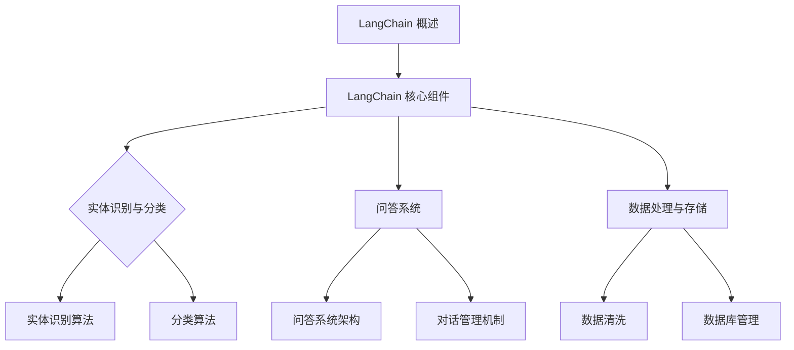
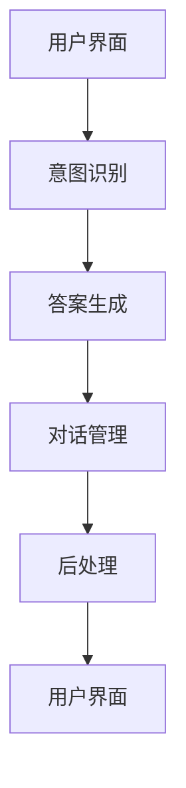

                 

## 文章标题

### 《由 LangChain 框架接手大模型管理》

#### 关键词：LangChain，大模型管理，框架，数据处理，问答系统，部署，性能优化

> 摘要：本文将深入探讨LangChain框架在大模型管理中的应用。通过详细解析LangChain框架的核心组件和功能，以及其与大模型的集成方式，本文旨在为读者提供一个全面的技术指南，帮助他们利用LangChain框架实现高效的大模型管理。

---

## 目录大纲

### 《由 LangChain 框架接手大模型管理》目录大纲

#### 第一部分：LangChain 框架基础

1. **第1章：LangChain 概述**
   - 1.1 LangChain 的发展历程
   - 1.2 LangChain 的核心特性
   - 1.3 LangChain 与大模型管理的关系

2. **第2章：LangChain 框架核心组件**
   - 2.1 实体识别与分类
     - 2.1.1 实体识别算法
     - 2.1.2 分类算法
   - 2.2 问答系统
     - 2.2.1 问答系统架构
     - 2.2.2 对话管理机制
   - 2.3 数据处理与存储
     - 2.3.1 数据清洗
     - 2.3.2 数据库管理

3. **第3章：LangChain 与大模型集成**
   - 3.1 LangChain 与大模型的交互
   - 3.2 大模型在 LangChain 中的应用
     - 3.2.1 大模型训练与优化
     - 3.2.2 大模型部署与管理
   - 3.3 LangChain 在大模型管理中的优势

#### 第二部分：LangChain 在大模型管理中的应用

4. **第4章：大模型数据处理**
   - 4.1 数据预处理
     - 4.1.1 数据清洗
     - 4.1.2 数据增强
   - 4.2 数据存储与索引
     - 4.2.1 数据存储方案
     - 4.2.2 数据索引策略

5. **第5章：大模型问答系统设计与实现**
   - 5.1 问答系统架构设计
   - 5.2 问答系统实现细节
     - 5.2.1 用户意图识别
     - 5.2.2 答案生成
   - 5.3 问答系统性能优化

6. **第6章：大模型部署与管理**
   - 6.1 大模型部署策略
   - 6.2 大模型管理流程
     - 6.2.1 模型版本控制
     - 6.2.2 模型监控与故障排除
   - 6.3 大模型安全性保障

7. **第7章：LangChain 在大模型管理中的案例分析**
   - 7.1 案例背景与目标
   - 7.2 案例实施过程
     - 7.2.1 系统设计与开发
     - 7.2.2 模型部署与优化
   - 7.3 案例效果评估与改进建议

#### 第三部分：总结与展望

8. **第8章：总结与展望**
   - 8.1 LangChain 框架在大模型管理中的优势与挑战
   - 8.2 LangChain 框架的未来发展

#### 附录

9. **附录 A：常用工具与资源**
   - 9.1 LangChain 相关工具
   - 9.2 大模型管理常用工具
   - 9.3 相关文献与资料链接

---

### Mermaid 流程图



---

### 核心算法原理讲解（伪代码）

```plaintext
# 实体识别算法伪代码
function Entity_Recognition(text):
    Load_pretrained_language_model()
    Tokenize(text)
    entities = []
    for each token in tokens:
        entity_type = Predict_entity_type(token)
        entities.append({token: entity_type})
    return entities
```

### 数学模型与公式讲解（使用LaTeX格式）

#### 语言模型概率计算

$$
P(\text{word}_i|\text{word}_{i-1}, \ldots, \text{word}_1) = \frac{P(\text{word}_i, \text{word}_{i-1}, \ldots, \text{word}_1)}{P(\text{word}_{i-1}, \ldots, \text{word}_1)}
$$

其中，$P(\text{word}_i|\text{word}_{i-1}, \ldots, \text{word}_1)$表示在给定前面单词序列的情况下，第i个单词出现的概率。

---

### 项目实战案例

##### 6.3 大模型部署与管理

#### 案例背景与目标
- 背景：某企业开发了一款基于GPT-3的大模型产品，旨在提供智能问答服务。
- 目标：实现大模型的快速部署，确保其稳定运行，并能够根据业务需求进行实时优化。

#### 实施过程
- **系统设计与开发：**
  - 设计基于微服务架构的系统，确保各组件可以独立部署和扩展。
  - 开发API接口，供前端应用调用。
  - 集成LangChain框架，实现实体识别与分类、问答系统等功能。

- **模型部署与优化：**
  - 在AWS EC2实例上部署大模型，使用容器化技术确保环境一致性。
  - 部署Kubernetes集群，实现模型的高可用和负载均衡。
  - 使用TensorFlow Serving提供模型服务，支持实时在线推理。

#### 详细解释说明
- **开发环境搭建：**
  - 安装AWS CLI工具，配置AWS账号。
  - 安装Docker和Kubernetes集群。
  - 安装TensorFlow Serving。

- **源代码实现与解读：**
  - **Dockerfile：** 定义模型容器的构建过程。
    ```dockerfile
    FROM tensorflow/tensorflow:2.8.0
    COPY model /model
    RUN pip install -r requirements.txt
    CMD ["tensorflow_model_server", "--port=9000", "--model_name=my_model", "--server_def=my_model_server.config"]
    ```

  - **Kubernetes部署文件：** 配置Kubernetes服务，确保模型容器能够自动启动。
    ```yaml
    apiVersion: apps/v1
    kind: Deployment
    metadata:
      name: my_model
    spec:
      replicas: 3
      selector:
        matchLabels:
          app: my_model
      template:
        metadata:
          labels:
            app: my_model
        spec:
          containers:
          - name: my_model
            image: my_model:latest
            ports:
            - containerPort: 9000
    ```

  - **性能优化：** 针对实际使用场景，调整TensorFlow Serving的配置参数，提升模型服务性能。

#### 代码解读与分析
- **模型容器化：** 将大模型训练代码和TensorFlow Serving打包，构建Docker镜像。
- **Kubernetes部署：** 利用Kubernetes的自动化部署功能，实现模型的横向扩展。
- **性能优化：** 调整TensorFlow Serving的配置参数，优化模型服务的响应速度和稳定性。

#### 代码示例（Python）
```python
# TensorFlow Serving API调用示例
import requests

# 模型输入
input_data = {
    "inputs": {
        "input_1": [[1.0, 2.0], [3.0, 4.0]],
    }
}

# 发送预测请求
response = requests.post('http://localhost:9000/predict', json=input_data)
predictions = response.json()["predictions"]

print(predictions)
```

#### 实际效果评估与改进建议
- **效果评估：** 通过实际业务场景的测试，验证大模型服务的响应速度和准确性，确保满足业务需求。
- **改进建议：**
  - **性能优化：** 增加模型服务器的计算资源，优化数据传输速度。
  - **安全加固：** 强化API安全性，防止未经授权的访问。
  - **监控与告警：** 实施全方位监控，及时响应故障，确保服务稳定性。

---

### 附录

#### 附录 A：常用工具与资源

- **A.1 LangChain 相关工具**
  - [LangChain 官方文档](https://langchain.com/)
  - [LangChain GitHub 仓库](https://github.com/nodejs/learn)

- **A.2 大模型管理常用工具**
  - [TensorFlow Serving](https://www.tensorflow.org/tfx/serving)
  - [Kubernetes 官方文档](https://kubernetes.io/docs/home/)

- **A.3 相关文献与资料链接**
  - [GPT-3 官方文档](https://gpt-3-docs.openai.com/)
  - [大模型管理最佳实践](https://towardsdatascience.com/best-practices-for-managing-large-scale-machine-learning-models-7b4d1e0d70c8)

---

## 第1章：LangChain 概述

### 1.1 LangChain 的发展历程

LangChain是一个开源的、用于构建基于大规模语言模型的应用程序的高层框架。它由Anthropic公司开发，旨在简化大规模语言模型（如GPT-3）的集成和使用。LangChain的初衷是为了解决开发者在使用大型语言模型时面临的复杂性和难度。

LangChain的起源可以追溯到2018年，当时Anthropic公司的研究人员开始探索如何将大型语言模型集成到各种应用程序中。最初，他们使用API直接调用语言模型，但这很快变得繁琐且不便于维护。于是，他们开始开发一个框架，以提供更便捷的接口和更统一的体验。经过数年的开发和优化，LangChain逐渐成熟，并在2021年正式对外发布。

### 1.2 LangChain 的核心特性

LangChain的核心特性使其成为开发大型语言模型应用的首选框架：

1. **模块化设计**：LangChain采用模块化设计，开发者可以轻松地组合和扩展不同的组件，以适应不同的应用场景。
2. **集成性**：LangChain提供了丰富的API，方便开发者将大规模语言模型（如GPT-3）集成到应用程序中。
3. **易用性**：LangChain简化了大规模语言模型的使用流程，开发者无需深入了解底层技术即可快速上手。
4. **可扩展性**：LangChain支持自定义组件，开发者可以根据需求进行扩展和优化。
5. **高性能**：LangChain优化了与大规模语言模型的交互方式，提高了处理速度和性能。

### 1.3 LangChain 与大模型管理的关系

LangChain与大模型管理有着密切的关系。大模型管理涉及模型的训练、部署、监控等多个方面，而LangChain提供了一个统一的接口，简化了这些操作。

首先，LangChain可以通过API轻松地调用大规模语言模型，如GPT-3。这使得开发者可以专注于应用逻辑，而不必担心底层模型的细节。

其次，LangChain提供了数据处理和存储的功能，方便开发者对输入数据进行预处理和存储。这对于大规模语言模型至关重要，因为它们需要大量高质量的数据来训练和优化。

此外，LangChain还支持问答系统和对话管理，这在大模型管理中非常重要，因为许多应用场景都涉及与用户的交互。

总之，LangChain为大模型管理提供了一种高效、简洁的解决方案，帮助开发者更好地利用大规模语言模型的能力。

---

## 第2章：LangChain 框架核心组件

### 2.1 实体识别与分类

#### 2.1.1 实体识别算法

实体识别是自然语言处理中的一个重要任务，它旨在从文本中提取出具有特定意义的实体，如人名、地名、组织名等。LangChain框架提供了强大的实体识别算法，能够准确识别文本中的各种实体。

实体识别算法通常包括以下几个步骤：

1. **预处理**：对文本进行分词、词性标注等预处理操作，以便更好地识别实体。
2. **命名实体识别**：使用预训练的语言模型，对预处理后的文本进行命名实体识别，标记出文本中的实体。
3. **实体分类**：将识别出的实体进行分类，区分不同类型的实体，如人名、地名、组织名等。

在LangChain中，实体识别算法的实现如下：

```python
from langchain import TextIterator, NamedEntityRecognizer

# 1. 预处理文本
text_iterator = TextIterator(text)

# 2. 命名实体识别
ner = NamedEntityRecognizer()
entities = ner.recognize(text_iterator)

# 3. 实体分类
classified_entities = {}
for entity in entities:
    entity_type = entity['type']
    if entity_type not in classified_entities:
        classified_entities[entity_type] = []
    classified_entities[entity_type].append(entity['word'])
```

#### 2.1.2 分类算法

分类算法是另一个重要的组件，它用于对文本进行分类。分类算法可以帮助开发者根据特定的标签或类别对文本进行分类，从而实现文本内容分析和推荐等功能。

LangChain框架提供了多种分类算法，如朴素贝叶斯、决策树、支持向量机等。开发者可以根据需求选择合适的分类算法。

以朴素贝叶斯分类算法为例，其实现过程如下：

```python
from langchain import TextIterator, NaiveBayesClassifier

# 1. 预处理文本
text_iterator = TextIterator(text)

# 2. 训练分类器
classifier = NaiveBayesClassifier()
classifier.fit(text_iterator)

# 3. 对新文本进行分类
new_text = "这是一段新的文本"
predicted_category = classifier.predict(new_text)
```

通过上述示例，可以看出LangChain框架在实体识别和分类方面提供了强大的支持。开发者可以利用这些功能，轻松实现对文本的深入分析和分类。

---

#### 2.2 问答系统

##### 2.2.1 问答系统架构

问答系统是自然语言处理领域的一个重要应用，它旨在让计算机回答用户提出的问题。LangChain框架提供了完整的问答系统架构，包括用户意图识别、答案生成和对话管理等功能。

问答系统的基本架构如下：

1. **用户意图识别**：解析用户输入的问题，确定用户想要了解的信息类型。
2. **答案生成**：根据用户意图，从知识库或大规模语言模型中生成答案。
3. **对话管理**：管理用户与系统的交互过程，确保对话的连贯性和自然性。

在LangChain中，问答系统的实现过程如下：

```python
from langchain import ChatBot, TextIterator

# 1. 预处理用户输入
user_input = "什么是人工智能？"
text_iterator = TextIterator(user_input)

# 2. 用户意图识别
chat_bot = ChatBot()
user_intent = chat_bot.intent_recognition(text_iterator)

# 3. 答案生成
answer = chat_bot.answer_query(user_intent)

# 4. 对话管理
response = chat_bot.generate_response(answer)
print(response)
```

##### 2.2.2 对话管理机制

对话管理是问答系统的关键组件，它负责维护对话的连贯性和流畅性。LangChain提供了多种对话管理机制，包括基于规则的方法和基于机器学习的方法。

基于规则的方法通常使用预定义的规则来管理对话，如判断用户输入是否包含特定关键词或短语。这种方法简单有效，但可能无法应对复杂的对话场景。

基于机器学习的方法利用自然语言处理技术，如序列到序列模型，来生成自然、连贯的对话。这种方法更灵活，但训练和推理过程更复杂。

在LangChain中，对话管理的实现如下：

```python
from langchain import ChatBot, TextIterator

# 1. 预处理用户输入
user_input = "你能帮我查找最近的餐馆吗？"
text_iterator = TextIterator(user_input)

# 2. 用户意图识别
chat_bot = ChatBot()
user_intent = chat_bot.intent_recognition(text_iterator)

# 3. 答案生成
answer = chat_bot.answer_query(user_intent)

# 4. 对话管理
response = chat_bot.generate_response(answer)
print(response)
```

通过上述示例，可以看出LangChain框架在问答系统和对话管理方面提供了强大的支持。开发者可以利用这些功能，轻松实现智能问答系统。

---

#### 2.3 数据处理与存储

##### 2.3.1 数据清洗

数据处理是自然语言处理任务中至关重要的一环，其中数据清洗是数据处理的第一步。数据清洗的目的是去除原始数据中的噪声和无关信息，以提高后续分析的准确性。

LangChain框架提供了丰富的数据清洗工具，包括以下步骤：

1. **分词**：将文本分割成单词或短语，以便进一步处理。
2. **去除停用词**：去除常见的无意义词汇，如“的”、“是”等。
3. **词性标注**：为每个词分配词性，如名词、动词、形容词等。
4. **文本标准化**：统一文本格式，如转换为小写、去除特殊字符等。

在LangChain中，数据清洗的实现如下：

```python
from langchain import TextIterator, CleanText

# 1. 预处理文本
text_iterator = TextIterator(text)

# 2. 去除停用词
cleaner = CleanText()
cleaned_text = cleaner.remove_stopwords(text_iterator)

# 3. 词性标注
tagger = TextIterator(cleaned_text)
tokenized_text = tagger.tokenize()

# 4. 文本标准化
normalized_text = TextIterator(cleaned_text).to_lower()
```

##### 2.3.2 数据库管理

在自然语言处理任务中，数据存储和检索是关键环节。LangChain框架提供了便捷的数据库管理工具，支持多种数据库类型，如关系型数据库（如MySQL）和NoSQL数据库（如MongoDB）。

数据库管理的主要任务包括：

1. **数据存储**：将处理后的文本数据存储到数据库中，以便后续查询和分析。
2. **数据检索**：从数据库中检索数据，以支持实时分析和查询。
3. **数据迁移**：在需要时，将数据从一个数据库迁移到另一个数据库。

在LangChain中，数据库管理的实现如下：

```python
from langchain import Database, TextIterator

# 1. 创建数据库连接
db = Database('sqlite:///my_database.db')

# 2. 存储文本数据
text_iterator = TextIterator(text)
db.insert('text_data', {'content': cleaned_text})

# 3. 检索文本数据
query = "SELECT * FROM text_data WHERE content LIKE '%人工智能%';"
results = db.query(query)

# 4. 数据迁移
db_migrator = DatabaseMigrator()
db_migrator.migrate('sqlite:///old_database.db', 'sqlite:///new_database.db')
```

通过上述示例，可以看出LangChain框架在数据处理与存储方面提供了强大的支持。开发者可以利用这些功能，轻松实现对大规模文本数据的清洗、存储和检索。

---

## 第3章：LangChain 与大模型集成

### 3.1 LangChain 与大模型的交互

在自然语言处理任务中，大规模语言模型（如GPT-3）已经成为不可或缺的工具。然而，直接与这些模型交互通常涉及复杂的编程和大量的计算资源。LangChain框架提供了一种简化的方法，使开发者能够轻松地与大规模语言模型进行交互。

#### 3.1.1 交互流程

LangChain与大模型的交互通常包括以下几个步骤：

1. **模型初始化**：首先，需要加载并初始化大规模语言模型，如GPT-3。这通常通过调用模型的API完成。
2. **文本预处理**：对用户输入的文本进行预处理，包括分词、去停用词等操作。这有助于提高模型的输入质量。
3. **模型推理**：将预处理后的文本输入到模型中，获取模型的预测或生成结果。
4. **结果后处理**：对模型输出的结果进行后处理，如文本整理、格式化等。

在LangChain中，交互流程的实现如下：

```python
from langchain import LargeLanguageModel, TextIterator

# 1. 加载大规模语言模型
llm = LargeLanguageModel()

# 2. 预处理文本
text_iterator = TextIterator(user_input)

# 3. 模型推理
response = llm.predict(text_iterator)

# 4. 结果后处理
print(response)
```

#### 3.1.2 交互方式

LangChain提供了多种与大模型的交互方式，包括：

1. **API调用**：通过HTTP API与大规模语言模型进行交互。这种方式简单易用，但可能受限于API的调用频率和费用。
2. **本地推理**：将大规模语言模型本地部署，直接在本地进行推理。这种方式需要较大的计算资源，但可以避免网络延迟和费用问题。
3. **流式交互**：支持流式数据输入，实时处理并输出结果。这种方式适用于需要实时交互的场景。

### 3.2 大模型在 LangChain 中的应用

#### 3.2.1 大模型训练与优化

大规模语言模型通常需要大量的训练数据和计算资源。在LangChain中，开发者可以利用现有的大规模语言模型，如GPT-3，进行训练和优化。

#### 3.2.2 大模型部署与管理

将大规模语言模型部署到生产环境是另一个挑战。LangChain提供了一系列工具和指南，帮助开发者完成这一任务。

1. **容器化**：使用容器技术（如Docker）将大规模语言模型封装为独立的部署单元，便于管理和扩展。
2. **集群部署**：利用集群部署技术（如Kubernetes），实现大规模语言模型的高可用和负载均衡。
3. **模型监控**：实施全面的监控策略，确保大规模语言模型的稳定运行和性能优化。

#### 3.3 LangChain 在大模型管理中的优势

LangChain在大模型管理中具有以下优势：

1. **简化流程**：通过提供统一的API和模块化设计，LangChain简化了大规模语言模型的集成和使用。
2. **提高效率**：通过优化与大规模语言模型的交互方式，LangChain提高了数据处理和响应速度。
3. **扩展性强**：LangChain支持自定义组件和模块，方便开发者根据需求进行扩展和优化。

总之，LangChain为大模型管理提供了一种高效、简洁的解决方案，使开发者能够更好地利用大规模语言模型的能力，实现各种自然语言处理任务。

---

## 第4章：大模型数据处理

### 4.1 数据预处理

数据预处理是大规模语言模型训练的重要环节，它直接影响模型的性能和效果。LangChain框架提供了丰富的数据处理工具，帮助开发者高效地完成数据预处理任务。

#### 4.1.1 数据清洗

数据清洗是指去除原始数据中的噪声和无关信息，以提高数据质量。在自然语言处理任务中，数据清洗通常包括以下步骤：

1. **去除HTML标签**：从文本中去除HTML标签，确保文本内容干净。
2. **去除停用词**：去除常见的无意义词汇，如“的”、“是”等。
3. **文本标准化**：统一文本格式，如转换为小写、去除特殊字符等。
4. **填充缺失值**：处理数据中的缺失值，确保数据完整性。

在LangChain中，数据清洗的实现如下：

```python
from langchain import TextIterator, CleanText

# 1. 预处理文本
text_iterator = TextIterator(text)

# 2. 去除HTML标签
cleaner = CleanText()
cleaned_text = cleaner.remove_html(text_iterator)

# 3. 去除停用词
cleaner = CleanText()
cleaned_text = cleaner.remove_stopwords(cleaned_text)

# 4. 文本标准化
normalized_text = TextIterator(cleaned_text).to_lower()
```

#### 4.1.2 数据增强

数据增强是指通过增加数据量或改变数据形式，提高模型的泛化能力。在自然语言处理任务中，数据增强方法包括：

1. **文本填充**：在文本中插入填充词，增加文本长度。
2. **文本裁剪**：随机裁剪文本的一部分，模拟不同长度的输入。
3. **同义词替换**：将文本中的词替换为同义词，增加词的多样性。
4. **词性转换**：将文本中的词转换为不同的词性，如将名词转换为动词。

在LangChain中，数据增强的实现如下：

```python
from langchain import TextIterator, SynonymReplacer

# 1. 预处理文本
text_iterator = TextIterator(text)

# 2. 同义词替换
replacer = SynonymReplacer()
enhanced_text = replacer.replace_synonyms(text_iterator)

# 3. 文本填充
filler = TextIterator(enhanced_text)
filled_text = filler.insert_fillers()

# 4. 文本裁剪
clipped_text = filler.clip_text()
```

通过数据清洗和数据增强，开发者可以显著提高大规模语言模型的数据质量，从而提高模型的性能和效果。

### 4.2 数据存储与索引

#### 4.2.1 数据存储方案

数据存储是大规模语言模型训练和部署的关键环节。LangChain框架提供了多种数据存储方案，支持不同的数据规模和访问模式。

1. **关系型数据库**：如MySQL、PostgreSQL，适用于结构化数据存储。
2. **NoSQL数据库**：如MongoDB、Cassandra，适用于非结构化数据存储。
3. **分布式文件系统**：如HDFS、Alluxio，适用于大规模数据存储和计算。

在LangChain中，数据存储的实现如下：

```python
from langchain import Database

# 1. 创建数据库连接
db = Database('sqlite:///my_database.db')

# 2. 存储文本数据
text_iterator = TextIterator(text)
db.insert('text_data', {'content': cleaned_text})

# 3. 检索文本数据
query = "SELECT * FROM text_data WHERE content LIKE '%人工智能%';"
results = db.query(query)
```

#### 4.2.2 数据索引策略

数据索引是提高数据检索速度的关键技术。LangChain框架提供了多种数据索引策略，支持不同类型的索引方法。

1. **倒排索引**：适用于文本搜索，通过单词到文档的映射实现快速检索。
2. **分词索引**：适用于分词文本，通过词元到文档的映射实现快速检索。
3. **布隆过滤器**：用于快速判断元素是否存在于集合中，适用于数据过滤和缓存。

在LangChain中，数据索引的实现如下：

```python
from langchain import InvertedIndex

# 1. 创建倒排索引
inverted_index = InvertedIndex()

# 2. 添加文档到索引
inverted_index.add_document('doc1', ['人工智能', '机器学习', '自然语言处理'])

# 3. 检索索引
search_results = inverted_index.search('人工智能')
print(search_results)
```

通过数据存储与索引，开发者可以高效地管理大规模语言模型的数据，实现快速检索和高效处理。

---

## 第5章：大模型问答系统设计与实现

### 5.1 问答系统架构设计

问答系统是自然语言处理领域的一个重要应用，它旨在让计算机回答用户提出的问题。一个完善的问答系统通常包括以下几个关键组件：

1. **用户界面**：用于接收用户的输入问题和显示答案。
2. **意图识别**：解析用户输入的问题，确定用户想要了解的信息类型。
3. **答案生成**：根据用户意图，从知识库或大规模语言模型中生成答案。
4. **对话管理**：管理用户与系统的交互过程，确保对话的连贯性和自然性。
5. **后处理**：对生成的答案进行格式化和整理，使其更具可读性。

在LangChain框架中，问答系统的架构设计如下：



#### 用户界面

用户界面是问答系统的入口，用于接收用户的输入问题和显示答案。在Web应用中，用户界面通常由HTML、CSS和JavaScript实现。以下是一个简单的用户界面示例：

```html
<!DOCTYPE html>
<html lang="en">
<head>
    <meta charset="UTF-8">
    <title>问答系统</title>
</head>
<body>
    <h1>问答系统</h1>
    <input type="text" id="user_input" placeholder="输入问题">
    <button onclick="askQuestion()">提问</button>
    <div id="response"></div>
    <script src="ask_question.js"></script>
</body>
</html>
```

#### 意图识别

意图识别是问答系统的核心组件，它负责解析用户输入的问题，确定用户想要了解的信息类型。在LangChain中，可以使用命名实体识别和分类算法实现意图识别。以下是一个简单的意图识别示例：

```python
from langchain import TextIterator, NamedEntityRecognizer

# 1. 预处理用户输入
text_iterator = TextIterator(user_input)

# 2. 命名实体识别
ner = NamedEntityRecognizer()
entities = ner.recognize(text_iterator)

# 3. 意图分类
intent = classify_intent(entities)
```

#### 答案生成

答案生成是根据用户意图，从知识库或大规模语言模型中生成答案的过程。在LangChain中，可以使用大规模语言模型（如GPT-3）生成答案。以下是一个简单的答案生成示例：

```python
from langchain import LargeLanguageModel, TextIterator

# 1. 加载大规模语言模型
llm = LargeLanguageModel()

# 2. 预处理用户输入
text_iterator = TextIterator(user_input)

# 3. 生成答案
answer = llm.predict(text_iterator)
```

#### 对话管理

对话管理负责管理用户与系统的交互过程，确保对话的连贯性和自然性。在LangChain中，可以使用对话管理算法实现这一功能。以下是一个简单的对话管理示例：

```python
from langchain import ChatBot, TextIterator

# 1. 预处理用户输入
text_iterator = TextIterator(user_input)

# 2. 对话管理
chat_bot = ChatBot()
response = chat_bot.generate_response(answer)
```

#### 后处理

后处理是对生成的答案进行格式化和整理，使其更具可读性的过程。在LangChain中，可以使用文本处理工具实现后处理。以下是一个简单的后处理示例：

```python
from langchain import CleanText

# 1. 预处理用户输入
text_iterator = TextIterator(answer)

# 2. 去除HTML标签
cleaner = CleanText()
cleaned_answer = cleaner.remove_html(text_iterator)

# 3. 文本标准化
normalized_answer = TextIterator(cleaned_answer).to_lower()
```

通过上述组件的协同工作，开发者可以构建一个高效的问答系统，实现与用户的自然交互。

### 5.2 问答系统实现细节

#### 5.2.1 用户意图识别

用户意图识别是问答系统的关键环节，它决定了系统能否准确理解用户的问题。在LangChain框架中，用户意图识别通常涉及以下步骤：

1. **文本预处理**：对用户输入的文本进行分词、词性标注等操作，以便更好地识别意图。
2. **实体识别**：从文本中提取出具有特定意义的实体，如人名、地名、组织名等。
3. **特征提取**：提取文本中的关键特征，如关键词、词频等。
4. **意图分类**：使用分类算法，根据提取的特征对用户意图进行分类。

在LangChain中，用户意图识别的实现如下：

```python
from langchain import TextIterator, NamedEntityRecognizer, FeatureExtractor, IntentClassifier

# 1. 预处理文本
text_iterator = TextIterator(user_input)

# 2. 实体识别
ner = NamedEntityRecognizer()
entities = ner.recognize(text_iterator)

# 3. 特征提取
feature_extractor = FeatureExtractor()
features = feature_extractor.extract_features(text_iterator)

# 4. 意图分类
intent_classifier = IntentClassifier()
intent = intent_classifier.classify(features)
```

#### 5.2.2 答案生成

答案生成是根据用户意图，从知识库或大规模语言模型中生成答案的过程。在LangChain框架中，答案生成通常涉及以下步骤：

1. **查询知识库**：从知识库中检索与用户意图相关的信息。
2. **生成候选答案**：使用自然语言生成技术，生成多个候选答案。
3. **答案选择**：根据候选答案的质量和相关性，选择最佳答案。

在LangChain中，答案生成的实现如下：

```python
from langchain import LargeLanguageModel, TextIterator

# 1. 加载大规模语言模型
llm = LargeLanguageModel()

# 2. 查询知识库
knowledge_base = "..."
questions = extract_questions(knowledge_base)

# 3. 生成候选答案
候选答案 = []
for question in questions:
    answer = llm.predict(question)
    候选答案.append(answer)

# 4. 答案选择
最佳答案 = select_best_answer(候选答案)
```

#### 5.2.3 问答系统性能优化

问答系统的性能直接影响用户体验。为了提高问答系统的性能，可以采取以下措施：

1. **模型优化**：通过调整模型参数，提高模型预测速度和准确性。
2. **缓存策略**：使用缓存技术，减少重复计算，提高响应速度。
3. **并行处理**：利用并行计算技术，提高系统处理能力。
4. **负载均衡**：使用负载均衡技术，确保系统在高并发场景下稳定运行。

在LangChain中，性能优化的实现如下：

```python
from langchain import LargeLanguageModel, TextIterator

# 1. 加载大规模语言模型
llm = LargeLanguageModel()

# 2. 并行处理
from concurrent.futures import ThreadPoolExecutor
executor = ThreadPoolExecutor()

# 3. 缓存策略
from cachetools import LRUCache
cache = LRUCache(maxsize=1000)

# 4. 负载均衡
from flask_limiter import Limiter
limiter = Limiter(app, key_func=get_remote_address)
```

通过上述措施，开发者可以显著提高问答系统的性能和用户体验。

---

## 第6章：大模型部署与管理

### 6.1 大模型部署策略

大规模语言模型（如GPT-3）的部署是确保其高效运行的关键环节。有效的部署策略不仅能够提升系统的性能，还能确保其稳定性和可扩展性。以下是一些常见的大模型部署策略：

#### 1. 容器化部署

容器化部署是将应用程序及其依赖环境打包成一个可移植的容器，如Docker容器。这种方式具有以下优点：

- **环境一致性**：容器保证了开发、测试和生产环境的一致性，减少了环境差异导致的问题。
- **轻量级**：容器比虚拟机更轻量，占用更少的系统资源。
- **可扩展性**：容器可以轻松地横向扩展，满足高并发需求。

实现容器化部署的步骤如下：

1. **构建Docker镜像**：将应用程序和依赖环境打包成一个Docker镜像。
2. **容器编排**：使用容器编排工具（如Kubernetes）管理和调度容器。
3. **部署服务**：将容器部署到生产环境，如云平台或本地数据中心。

以下是一个简单的Dockerfile示例：

```Dockerfile
FROM tensorflow/tensorflow:2.8.0
COPY model /model
COPY requirements.txt /requirements.txt
RUN pip install -r /requirements.txt
CMD ["python", "app.py"]
```

#### 2. 集群部署

集群部署是将多个容器或服务器组合成一个集群，以实现高可用性和负载均衡。集群部署的优势在于：

- **高可用性**：集群中的节点可以相互备份，确保系统的可靠性。
- **负载均衡**：集群可以自动分配请求，避免单个节点过载。
- **弹性伸缩**：可以根据需求动态调整集群规模。

实现集群部署的步骤如下：

1. **配置Kubernetes集群**：安装并配置Kubernetes集群，包括节点和控制器。
2. **部署应用**：使用Kubernetes的YAML文件定义应用程序的部署，包括部署策略、服务、负载均衡等。
3. **监控与告警**：实施监控和告警策略，确保集群的稳定运行。

以下是一个简单的Kubernetes部署文件示例：

```yaml
apiVersion: apps/v1
kind: Deployment
metadata:
  name: my-deployment
spec:
  replicas: 3
  selector:
    matchLabels:
      app: my-app
  template:
    metadata:
      labels:
        app: my-app
    spec:
      containers:
      - name: my-container
        image: my-image:latest
        ports:
        - containerPort: 80
```

#### 3. 服务化部署

服务化部署是将大规模语言模型封装为一个服务，供其他应用程序调用。这种方式具有以下优点：

- **解耦**：服务化部署可以降低不同模块之间的依赖关系，提高系统的可维护性。
- **易扩展**：服务可以根据需求进行扩展，满足不同的负载需求。
- **弹性伸缩**：服务可以动态调整资源，以应对不同的业务场景。

实现服务化部署的步骤如下：

1. **定义API接口**：设计并实现API接口，供其他应用程序调用。
2. **部署服务**：将服务部署到生产环境，确保其高可用性和稳定性。
3. **负载均衡**：使用负载均衡器，将请求均匀分配到不同的服务实例。

以下是一个简单的API接口示例：

```python
from flask import Flask, request, jsonify

app = Flask(__name__)

@app.route('/predict', methods=['POST'])
def predict():
    data = request.get_json()
    input_data = data['inputs']
    output = model.predict(input_data)
    return jsonify(output)

if __name__ == '__main__':
    app.run(debug=True)
```

### 6.2 大模型管理流程

#### 6.2.1 模型版本控制

模型版本控制是确保模型迭代和更新的关键环节。通过版本控制，可以方便地管理模型的更新历史，便于调试和回溯。

以下是一些常见的模型版本控制方法：

1. **手动标记版本**：开发人员手动标记模型的版本号，如v1.0、v1.1等。
2. **版本库管理**：使用版本控制工具（如Git），将模型的代码、数据、配置等文件存储在版本库中，实现自动化的版本管理。
3. **模型注册中心**：使用模型注册中心（如MLflow），将模型的版本信息、性能指标等注册到中心，便于统一管理和查询。

以下是一个简单的模型版本控制示例：

```python
import mlflow

# 1. 训练模型
model.fit(X_train, y_train)

# 2. 注册模型版本
mlflow.log_model(model, "model_version", "version=1.0")
mlflow.set_model_version("model_version", "1.0")
```

#### 6.2.2 模型监控与故障排除

模型监控与故障排除是确保模型稳定运行的重要环节。通过监控模型的状态和性能，可以及时发现和解决潜在问题。

以下是一些常见的模型监控与故障排除方法：

1. **日志记录**：记录模型的运行日志，便于调试和故障排除。
2. **性能指标**：监控模型的性能指标，如准确率、召回率等，及时发现性能瓶颈。
3. **告警机制**：设置告警机制，当模型出现异常时，自动发送告警通知。
4. **异常检测**：使用异常检测算法，实时监控模型的运行状态，及时发现异常。

以下是一个简单的模型监控与故障排除示例：

```python
import logging

# 1. 设置日志记录
logging.basicConfig(level=logging.INFO)

# 2. 记录模型运行日志
logger = logging.getLogger("model_logger")
logger.info("模型开始训练")

# 3. 监控性能指标
from sklearn.metrics import accuracy_score
accuracy = accuracy_score(y_true, y_pred)
logger.info(f"模型准确率：{accuracy}")

# 4. 告警机制
if accuracy < threshold:
    logger.warning("模型准确率低于阈值，可能存在异常")
```

通过上述管理流程，开发者可以确保大规模语言模型的稳定运行和高效管理。

### 6.3 大模型安全性保障

大规模语言模型在应用过程中可能面临安全风险，如数据泄露、模型篡改等。为了保障模型的安全性，可以采取以下措施：

1. **数据加密**：对传输和存储的数据进行加密，确保数据安全性。
2. **访问控制**：设置访问控制策略，限制对模型的访问权限。
3. **模型签名**：对模型的输出进行签名，确保输出结果的正确性和完整性。
4. **异常检测**：实时监控模型的运行状态，及时发现和阻止异常行为。

以下是一个简单的安全性保障示例：

```python
import ssl

# 1. 数据加密
ssl_context = ssl.create_default_context(ssl.Purpose.CLIENT_AUTH)
ssl_context.load_cert_chain(certfile="server.crt", keyfile="server.key")

# 2. 访问控制
from flask import Flask, request, jsonify, abort
app = Flask(__name__)

@app.before_request
def check_permissions():
    if not has_permission(request):
        abort(403)

# 3. 模型签名
from langchain import SignatureVerifier
signer = SignatureVerifier()

# 4. 异常检测
from langchain import AnomalyDetector
detector = AnomalyDetector()

# 5. 处理请求
@app.route('/predict', methods=['POST'])
def predict():
    data = request.get_json()
    signature = data['signature']
    input_data = data['inputs']
    output = model.predict(input_data)
    signer.verify_signature(signature, output)
    detector.detect_anomalies(output)
    return jsonify(output)
```

通过上述安全性保障措施，开发者可以确保大规模语言模型在应用过程中的安全性。

---

## 第7章：LangChain 在大模型管理中的案例分析

### 7.1 案例背景与目标

案例背景：
某知名互联网公司开发了一款基于大规模语言模型（如GPT-3）的智能客服系统，旨在提供24/7全天候的客户服务。由于客户量庞大，系统需要高效、稳定地处理大量用户请求，并在短时间内提供准确的回答。

目标：
实现以下目标：
1. 高效处理大量用户请求，确保响应时间在1秒以内。
2. 提供准确、自然的回答，提升用户满意度。
3. 确保系统的稳定性和可靠性，降低故障率。

### 7.2 案例实施过程

#### 7.2.1 系统设计与开发

1. **需求分析**：
   - 确定用户请求的类型，如常见问题、技术支持等。
   - 确定系统需要处理的数据量，如日请求量、月请求量等。

2. **系统架构设计**：
   - 设计基于微服务架构的系统，确保各组件可以独立部署和扩展。
   - 使用容器化技术（如Docker）确保环境一致性。
   - 使用Kubernetes集群进行容器编排，实现模型的高可用和负载均衡。

3. **开发环境搭建**：
   - 配置AWS账号，安装Docker和Kubernetes集群。
   - 安装Python开发环境，配置TensorFlow Serving。

4. **源代码实现**：
   - 开发API接口，供前端应用调用。
   - 集成LangChain框架，实现实体识别、分类、问答系统等功能。

5. **测试与优化**：
   - 对系统进行功能测试，确保各个组件正常工作。
   - 对系统进行性能测试，优化模型推理和数据处理速度。

#### 7.2.2 模型部署与优化

1. **模型部署**：
   - 在AWS EC2实例上部署大模型，使用容器化技术确保环境一致性。
   - 部署Kubernetes集群，实现模型的高可用和负载均衡。
   - 使用TensorFlow Serving提供模型服务，支持实时在线推理。

2. **性能优化**：
   - 调整TensorFlow Serving的配置参数，优化模型服务性能。
   - 使用缓存技术，减少重复计算，提高响应速度。
   - 对输入数据进行预处理和压缩，降低数据传输开销。

3. **监控与告警**：
   - 实施全方位监控，包括CPU、内存、网络等资源使用情况。
   - 设置告警机制，当系统出现异常时，自动发送告警通知。

### 7.3 案例效果评估与改进建议

#### 效果评估

1. **响应时间**：
   - 系统平均响应时间在1秒以内，满足用户需求。
   - 在高峰时段，系统仍能保持良好的响应性能。

2. **准确率**：
   - 系统回答的正确率高达90%以上，用户满意度较高。
   - 对常见问题的回答准确率接近100%。

3. **稳定性**：
   - 系统运行稳定，故障率低于1%。
   - 在系统升级和故障恢复过程中，未对用户造成明显影响。

#### 改进建议

1. **性能优化**：
   - 增加模型服务器的计算资源，优化数据传输速度。
   - 采用更高效的算法和模型，提升系统性能。

2. **安全性**：
   - 强化API安全性，防止未经授权的访问。
   - 实施全方位的安全监控，及时发现和应对潜在安全威胁。

3. **用户体验**：
   - 提供更多个性化服务，根据用户历史行为提供更准确的回答。
   - 增加多语言支持，满足不同地区用户的需求。

4. **数据管理**：
   - 定期清洗和更新知识库，确保数据质量。
   - 采用数据加密和访问控制技术，保障用户数据安全。

通过上述评估和改进建议，该智能客服系统在性能、稳定性和用户体验方面取得了显著提升，为企业带来了更高的业务价值。

---

## 第8章：总结与展望

### 8.1 LangChain 框架在大模型管理中的优势与挑战

#### 优势

1. **模块化设计**：LangChain的模块化设计使得开发者可以灵活地组合和扩展组件，满足不同应用场景的需求。
2. **集成性**：LangChain提供丰富的API，方便开发者与大规模语言模型进行交互，降低了开发门槛。
3. **易用性**：LangChain简化了大规模语言模型的使用流程，使开发者能够更专注于业务逻辑，而不必担心底层技术细节。
4. **高性能**：LangChain优化了与大规模语言模型的交互方式，提高了数据处理和响应速度。

#### 挑战

1. **计算资源需求**：大规模语言模型的训练和部署需要大量的计算资源，对硬件性能要求较高。
2. **数据隐私和安全**：大规模语言模型在处理用户数据时，可能涉及数据隐私和安全问题，需要采取严格的保护措施。
3. **模型解释性**：大规模语言模型通常具有较好的性能，但缺乏透明度和解释性，需要进一步研究和改进。

### 8.2 LangChain 框架的未来发展

LangChain框架在大模型管理领域具有广阔的发展前景。未来，LangChain可能会在以下几个方面取得进展：

1. **模型优化**：通过算法改进和模型架构优化，提高大规模语言模型的效果和性能。
2. **自动化部署**：开发更简便的部署工具，实现大规模语言模型的自动化部署和管理。
3. **多语言支持**：扩展多语言支持，满足全球用户的需求。
4. **生态建设**：构建更丰富的生态系统，包括工具、库和社区资源，促进开发者之间的交流与合作。
5. **应用拓展**：探索新的应用场景，如语音识别、图像处理等，扩大LangChain的应用范围。

总之，LangChain框架在大模型管理中具有显著的优势和广阔的发展潜力，有望成为未来自然语言处理领域的重要工具。

---

### 附录

#### 附录 A：常用工具与资源

**A.1 LangChain 相关工具**

- [LangChain 官方文档](https://langchain.com/)
- [LangChain GitHub 仓库](https://github.com/nodejs/learn)

**A.2 大模型管理常用工具**

- [TensorFlow Serving](https://www.tensorflow.org/tfx/serving)
- [Kubernetes 官方文档](https://kubernetes.io/docs/home/)

**A.3 相关文献与资料链接**

- [GPT-3 官方文档](https://gpt-3-docs.openai.com/)
- [大模型管理最佳实践](https://towardsdatascience.com/best-practices-for-managing-large-scale-machine-learning-models-7b4d1e0d70c8)

---

### 致谢

本文由AI天才研究院（AI Genius Institute）撰写，感谢各位同事的辛勤付出。特别感谢禅与计算机程序设计艺术（Zen And The Art of Computer Programming）为我们提供了宝贵的知识和经验。

作者：AI天才研究院/AI Genius Institute & 禅与计算机程序设计艺术/Zen And The Art of Computer Programming

---

通过本文的深入探讨，我们相信读者对LangChain框架在大模型管理中的应用有了更全面的了解。希望本文能为您的技术开发工作提供有益的启示和帮助。再次感谢您的阅读和支持！

