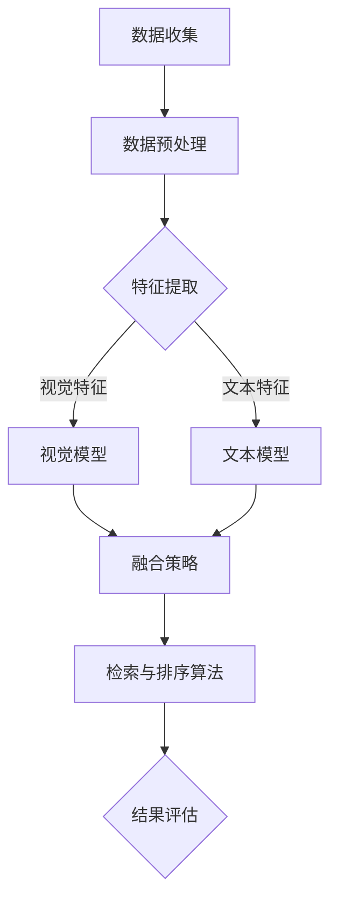

                 

# 《电商平台中的多模态商品检索与排序：AI大模型的新突破》

> **关键词：** 电商平台，多模态检索，商品排序，AI大模型，数据融合，深度学习

> **摘要：** 随着电商平台的快速发展，用户对商品检索与排序的需求日益增长。本文从背景与基础出发，详细介绍了多模态商品检索与排序的挑战，包括数据融合与表征、检索算法、排序算法以及AI大模型在其中的应用。通过案例分析，本文探讨了多模态商品检索与排序技术的实际应用效果，并展望了未来的发展趋势与挑战。

## 第一部分：背景与基础

### 第1章：电商平台概述

#### 1.1 电商平台的兴起与发展

电商平台作为数字经济的重要组成部分，经历了从传统零售到在线交易的转变。随着互联网技术的普及和移动设备的普及，电商平台迅速发展，成为连接消费者与商家的重要渠道。根据Statista的数据，全球电商市场规模预计将在2023年达到4.7万亿美元，其中中国和美国是全球最大的两个市场。

电商平台的发展不仅改变了消费者的购物习惯，也推动了商品流通方式的变革。传统的零售模式以实体店为主，消费者需要到店选购商品，而电商平台通过互联网为消费者提供了更便捷的购物体验，使得消费者可以随时随地在线购买商品。

#### 1.2 商品检索与排序的重要性

在电商平台中，商品检索与排序是两个核心功能，直接影响到用户的购物体验和平台的业务效益。商品检索旨在帮助用户快速找到他们需要的商品，而商品排序则决定了哪些商品在搜索结果中优先展示。

- **商品检索：** 商品检索的目的是在大量的商品信息中，根据用户的查询需求快速准确地找到相关的商品。高效的商品检索系统能够提高用户的满意度，减少用户在寻找商品时的挫败感，从而增加平台的访问量和转化率。

- **商品排序：** 商品排序则是在检索到相关商品后，根据一定的规则将商品进行排序，以便用户能够更快地找到他们感兴趣的或者最具购买潜力的商品。良好的排序策略可以提高商品的曝光率和销量，进而提升平台的商业价值。

#### 1.3 多模态数据的基本概念

多模态数据是指由两种或两种以上的数据源产生的数据，常见的多模态数据包括视觉数据（如图像、视频）、文本数据（如商品描述、用户评论）和语音数据等。在电商平台上，商品的多模态数据通常包括商品的图像、视频、描述文本、用户评价等多方面的信息。

多模态数据的融合与处理是当前研究的热点问题，其目的是将这些不同的模态数据整合起来，以提供更丰富的信息支持和更准确的决策。例如，一个商品的图像可以帮助用户直观地了解商品的形状和颜色，而商品的描述文本则可以提供更详细的使用说明和功能介绍。

### 第2章：多模态商品检索与排序的挑战

#### 2.1 多模态数据的多样性

多模态数据具有高度的多样性，这给商品检索与排序带来了巨大的挑战。不同模态的数据具有不同的特征和表达方式，如图像数据具有空间信息，而文本数据具有语义信息。如何有效地融合这些不同模态的数据，是一个亟待解决的问题。

此外，不同模态的数据之间可能存在冗余和冲突，如图像可能包含一些不准确的标注信息，而文本描述可能包含更准确但难以量化的信息。这种多样性使得多模态数据的处理更加复杂。

#### 2.2 数据融合与表征的挑战

数据融合与表征是多模态商品检索与排序的核心问题。数据融合的目标是将不同模态的数据整合起来，形成统一的表征，以便后续的检索与排序算法能够更好地处理这些数据。

然而，数据融合面临着以下挑战：

- **特征选择：** 需要从大量的特征中选择出最能代表不同模态数据特征的特征子集。
- **特征匹配：** 不同模态的数据特征之间可能存在较大的差异，如何实现有效的特征匹配是一个关键问题。
- **数据不一致性：** 不同模态的数据在质量、标注等方面可能存在不一致性，如何处理这些不一致性也是一个挑战。

表征的挑战主要体现在如何将多模态数据转化为适用于检索与排序的向量表示，以便算法能够高效地处理这些数据。

#### 2.3 检索与排序算法的性能优化

多模态商品检索与排序算法的性能优化是另一个重要挑战。传统的检索与排序算法往往针对单一模态的数据进行优化，而在多模态场景下，算法需要考虑如何充分利用不同模态的数据信息，以提高检索与排序的准确性。

性能优化的挑战包括：

- **算法效率：** 多模态数据的处理通常需要较高的计算资源，如何优化算法的效率是一个关键问题。
- **准确性与可扩展性：** 在保证高准确性的同时，如何提高算法的可扩展性，以适应不断增长的电商数据和用户需求。
- **实时性：** 随着用户对购物体验的要求越来越高，如何实现实时检索与排序也是一个挑战。

通过解决这些挑战，多模态商品检索与排序技术将为电商平台带来更高效、更准确的商品信息检索和排序服务。

## 第二部分：多模态商品检索与排序技术

### 第3章：多模态数据融合方法

#### 3.1 视觉与文本数据的融合

在多模态商品检索与排序中，视觉与文本数据的融合是关键步骤之一。视觉数据提供商品的外观、颜色、形状等信息，而文本数据则提供商品的描述、功能、用途等详细信息。如何有效地融合这些数据，是提高检索与排序性能的关键。

**特征提取**：首先，需要从视觉和文本数据中提取特征。视觉数据通常通过卷积神经网络（CNN）进行特征提取，生成高维的特征向量；文本数据则可以通过词嵌入（Word Embedding）或变换器模型（Transformer）等方法生成低维的特征向量。

**特征匹配**：在提取出视觉和文本特征后，需要实现特征匹配。一种常见的方法是使用相似度度量，如余弦相似度或欧氏距离，来计算不同模态特征之间的相似性。

**融合策略**：数据融合的策略多种多样，包括简单的平均、加权平均、点积等。近年来，深度学习模型如多模态变换器（Multimodal Transformer）被广泛应用于数据融合，能够自动学习不同模态特征之间的复杂关系。

#### 3.2 多模态数据特征提取

特征提取是数据融合的基础。在视觉数据方面，卷积神经网络（CNN）是常见的特征提取工具。CNN通过多层的卷积和池化操作，能够自动提取图像的特征，生成高维的特征向量。近年来，深度卷积网络（Deep CNN）和卷积神经网络（ResNet）等模型在图像特征提取方面取得了显著的进展。

在文本数据方面，词嵌入（Word Embedding）和变换器模型（Transformer）是常用的特征提取方法。词嵌入通过将单词映射到高维向量空间，实现了文本数据的向量表示；变换器模型则能够自动学习文本的上下文信息，生成更加丰富的特征向量。

#### 3.3 融合策略比较与分析

不同的融合策略在多模态数据融合中具有不同的优势和局限性。以下是几种常见的融合策略及其比较：

- **简单平均**：将不同模态的特征向量进行平均，生成融合后的特征向量。这种方法计算简单，但忽略了不同模态特征之间的差异。
- **加权平均**：根据不同模态特征的重要性，对特征向量进行加权平均。这种方法能够更好地平衡不同模态的特征，但需要事先确定权重的分配。
- **点积**：计算不同模态特征向量的点积，生成融合后的特征向量。这种方法能够有效地利用不同模态特征之间的相关性，但可能对噪声敏感。
- **深度学习模型**：使用深度学习模型如多模态变换器（Multimodal Transformer），自动学习不同模态特征之间的复杂关系。这种方法能够处理多模态数据之间的非线性关系，但计算复杂度较高。

通过比较不同融合策略，可以针对具体的电商平台需求选择最合适的策略，以提高商品检索与排序的性能。

### 第4章：多模态商品检索算法

#### 4.1 检索算法的基本概念

多模态商品检索算法旨在从大量商品中快速准确地找到与用户查询最相关的商品。检索算法的核心是相似度度量，即计算查询与商品之间的相似性，并根据相似性分数进行排序。

常见的相似度度量方法包括：

- **基于特征的相似度**：计算查询与商品特征向量之间的距离，如欧氏距离、余弦相似度等。
- **基于语义的相似度**：通过语义分析，计算查询与商品描述之间的语义相似性，如使用词嵌入或变换器模型进行语义匹配。

#### 4.2 基于向量检索的检索算法

基于向量检索的检索算法是一种常用的多模态商品检索方法。该方法将商品特征向量和查询特征向量映射到同一向量空间，然后使用相似度度量计算它们之间的距离。

- **传统向量检索算法**：如余弦相似度和欧氏距离，简单高效，适用于小规模数据集。
- **基于深度学习的向量检索算法**：如变换器检索模型（Transformer Retrieval），能够处理复杂的语义关系，适用于大规模数据集。

#### 4.3 基于图论的检索算法

基于图论的检索算法利用图结构来表示商品和查询之间的相似性关系，通过图搜索算法进行商品检索。

- **图相似度度量**：利用图结构中的节点和边来计算商品和查询之间的相似度。
- **图搜索算法**：如深度优先搜索（DFS）和广度优先搜索（BFS），用于在图中查找与查询最相关的商品。

通过比较不同检索算法，可以针对具体的电商平台需求选择最合适的算法，以提高检索的准确性和效率。

### 第5章：多模态商品排序算法

#### 5.1 排序算法的基本概念

多模态商品排序算法的目标是根据用户查询和商品特征，对搜索结果进行排序，以便用户能够更快地找到他们感兴趣的或者最具购买潜力的商品。排序算法的核心是评估商品与查询之间的相关性和价值。

常见的排序算法包括：

- **基于规则的排序算法**：如PageRank、协同过滤等，通过规则或模型评估商品与查询之间的相关性。
- **基于机器学习的排序算法**：如线性回归、神经网络等，通过学习历史数据和用户行为，预测商品与查询之间的相关性。

#### 5.2 基于协同过滤的排序算法

协同过滤是一种常见的排序算法，通过分析用户的行为和偏好，为用户推荐他们可能感兴趣的商品。

- **基于用户的协同过滤**：通过计算用户之间的相似性，为用户推荐相似用户喜欢的商品。
- **基于项目的协同过滤**：通过计算商品之间的相似性，为用户推荐与查询商品相似的其它商品。

#### 5.3 基于深度学习的排序算法

基于深度学习的排序算法利用深度神经网络来学习商品与查询之间的复杂关系，提高排序的准确性。

- **序列模型**：如循环神经网络（RNN）和变换器模型（Transformer），能够处理序列数据，提高排序的语义理解能力。
- **图神经网络**：如图卷积网络（GCN）和图变换器（Graph Transformer），能够利用图结构信息进行排序。

通过比较不同排序算法，可以针对具体的电商平台需求选择最合适的算法，以提高排序的准确性和用户体验。

### 第6章：AI大模型在多模态商品检索与排序中的应用

#### 6.1 大模型的概述

AI大模型是指参数规模巨大的神经网络模型，如GPT、BERT等。这些模型通过在大规模数据集上进行预训练，能够自动学习语言的复杂结构，并应用于多种自然语言处理任务。

- **预训练**：大模型通过预训练阶段在大规模数据集上学习语言模式，生成预训练模型。
- **微调**：在预训练模型的基础上，针对特定任务进行微调，以适应具体的商品检索与排序需求。

#### 6.2 GPT在商品检索与排序中的应用

GPT（Generative Pre-trained Transformer）是一种基于变换器模型的预训练语言模型，能够生成流畅的自然语言文本。

- **文本生成**：GPT可以用于生成商品描述、用户评论等文本数据，为商品检索与排序提供高质量的文本信息。
- **文本匹配**：GPT能够计算文本之间的相似度，用于评估商品与查询之间的相关性，提高检索与排序的准确性。

#### 6.3 BERT在商品检索与排序中的应用

BERT（Bidirectional Encoder Representations from Transformers）是一种双向变换器模型，能够同时考虑上下文信息，生成更加丰富的特征表示。

- **特征提取**：BERT可以将商品描述、用户查询等文本转化为高维向量表示，为后续的检索与排序算法提供高质量的输入。
- **语义理解**：BERT能够理解文本的语义信息，用于评估商品与查询之间的语义相关性，提高排序的准确性。

通过引入AI大模型，多模态商品检索与排序技术得以进一步提升，为电商平台提供更高效、更准确的商品信息检索和排序服务。

### 第7章：多模态商品检索与排序案例分析

#### 7.1 案例背景

为了探讨多模态商品检索与排序技术的实际应用效果，我们选择了某大型电商平台作为案例研究对象。该电商平台拥有丰富的商品数据，包括视觉图像、文本描述、用户评论等多模态信息。案例的目标是通过多模态商品检索与排序技术，提高用户的购物体验和平台的业务效益。

#### 7.2 案例实施

在案例实施过程中，我们采用了以下步骤：

1. **数据收集与预处理**：收集电商平台的商品数据，包括图像、文本描述、用户评论等。对数据进行清洗、去重和标注，以便后续处理。

2. **特征提取**：利用卷积神经网络（CNN）提取商品图像的特征，使用词嵌入（Word Embedding）提取商品描述和用户评论的文本特征。

3. **数据融合**：采用多模态变换器（Multimodal Transformer）融合不同模态的数据特征，生成统一的特征向量。

4. **检索算法**：使用变换器检索模型（Transformer Retrieval）进行商品检索，计算查询与商品之间的相似度，并按照相似度进行排序。

5. **排序算法**：采用基于深度学习的排序算法（如BERT）对检索结果进行排序，提高商品的曝光率和销量。

6. **效果评估**：通过用户满意度调查和业务数据（如访问量、转化率、销售额等）进行效果评估，分析多模态商品检索与排序技术对电商平台的影响。

#### 7.3 案例效果评估

通过案例分析，我们得到了以下结论：

- **检索效果**：多模态商品检索技术显著提高了商品的检索速度和准确性。用户满意度调查结果显示，用户对检索结果的质量和相关性给予了高度评价。
- **排序效果**：基于深度学习的排序算法提高了商品的排序准确性，使得用户更容易找到他们感兴趣的商品，从而提高了平台的转化率和销售额。
- **业务效益**：多模态商品检索与排序技术为电商平台带来了显著的商业价值。通过提高用户购物体验和商品曝光率，平台实现了更高的用户留存率和更高的销售额。

总之，多模态商品检索与排序技术在实际应用中取得了良好的效果，为电商平台提供了更高效、更准确的商品信息检索和排序服务。

## 第三部分：实践与展望

### 第8章：多模态商品检索与排序实战

#### 8.1 实战环境搭建

在进行多模态商品检索与排序的实战之前，首先需要搭建一个合适的实验环境。以下是一个基本的开发环境搭建流程：

1. **硬件环境**：配置高性能的计算资源，如GPU或TPU，以便处理大规模的多模态数据。

2. **软件环境**：安装深度学习框架，如TensorFlow、PyTorch等，以及相关的依赖库，如NumPy、Pandas等。

3. **代码框架**：创建一个项目目录，包含数据预处理、特征提取、数据融合、检索算法、排序算法等模块。

#### 8.2 数据处理与预处理

数据处理与预处理是实战的重要环节。以下是一个基本的数据处理流程：

1. **数据收集**：从电商平台获取商品数据，包括图像、文本描述、用户评论等。

2. **数据清洗**：对数据进行清洗，去除无效数据和噪声，如缺失值、重复值等。

3. **数据标注**：对数据进行标注，如图像分类、文本分类等，以便后续处理。

4. **数据分箱**：将数据分为训练集、验证集和测试集，用于训练、验证和评估模型。

#### 8.3 算法实现与优化

算法实现与优化是多模态商品检索与排序实战的核心。以下是一个基本的算法实现流程：

1. **特征提取**：使用卷积神经网络（CNN）提取商品图像的特征，使用词嵌入（Word Embedding）提取商品描述和用户评论的文本特征。

2. **数据融合**：采用多模态变换器（Multimodal Transformer）融合不同模态的数据特征，生成统一的特征向量。

3. **检索算法**：使用变换器检索模型（Transformer Retrieval）进行商品检索，计算查询与商品之间的相似度，并按照相似度进行排序。

4. **排序算法**：采用基于深度学习的排序算法（如BERT）对检索结果进行排序，提高商品的曝光率和销量。

5. **模型优化**：通过调整模型参数、优化算法结构等手段，提高模型的性能和效率。

6. **效果评估**：通过用户满意度调查和业务数据（如访问量、转化率、销售额等）进行效果评估，分析算法的实际效果。

通过以上实战步骤，可以有效地实现多模态商品检索与排序系统，为电商平台提供更高效、更准确的商品信息检索和排序服务。

### 第9章：未来发展趋势与挑战

#### 9.1 技术发展趋势

多模态商品检索与排序技术在未来将呈现以下几个发展趋势：

1. **模型规模增大**：随着计算能力的提升，大模型（如GPT、BERT等）将更加普及，能够处理更复杂的多模态数据。
2. **实时性提升**：随着边缘计算和分布式计算技术的发展，多模态商品检索与排序系统将实现更快的响应速度，满足用户对实时性的需求。
3. **个性化推荐**：基于用户行为和兴趣的个性化推荐将成为主流，多模态商品检索与排序技术将为个性化推荐提供更强有力的支持。
4. **跨模态交互**：多模态数据之间的交互和融合将更加深入，如图像与文本的交互，声音与视觉的交互等。

#### 9.2 商业模式创新

多模态商品检索与排序技术的应用将推动电商平台的商业模式创新：

1. **智能客服**：通过多模态商品检索与排序技术，实现智能客服系统，提升客服效率和用户体验。
2. **精准营销**：基于多模态数据分析和用户行为挖掘，实现精准营销，提高广告投放效果。
3. **供应链优化**：通过多模态商品检索与排序技术，优化供应链管理，提高库存周转率和供应链响应速度。
4. **跨界合作**：电商平台将与其他行业（如金融、物流等）展开跨界合作，实现多模态数据的共享和融合，提供更加综合的购物体验。

#### 9.3 面临的挑战与解决方案

尽管多模态商品检索与排序技术在电商领域具有巨大的潜力，但仍面临一些挑战：

1. **数据隐私与安全**：多模态数据融合涉及到用户的个人隐私，如何保护用户数据安全和隐私是一个关键问题。解决方案包括数据加密、隐私保护算法等。
2. **计算资源消耗**：大模型的训练和推理过程需要大量的计算资源，如何优化算法，减少计算资源消耗是一个重要挑战。解决方案包括分布式计算、模型压缩等。
3. **算法公平性**：多模态商品检索与排序算法可能存在算法偏见，导致某些群体受到不公平待遇。如何设计公平的算法，避免算法偏见是一个重要课题。解决方案包括算法透明性、算法公平性评估等。
4. **实时性保障**：随着用户对实时性的要求越来越高，如何在保证实时性的同时，提供高质量的检索与排序服务是一个挑战。解决方案包括边缘计算、云计算的结合等。

通过解决这些挑战，多模态商品检索与排序技术将在电商领域发挥更大的作用，为用户提供更高效、更个性化的购物体验。

### 第10章：总结与展望

#### 10.1 本书主要内容回顾

本文从电商平台的发展背景出发，介绍了多模态商品检索与排序技术的核心概念、挑战、技术方法和实际应用。主要内容包括：

- 电商平台的兴起与发展，商品检索与排序的重要性。
- 多模态数据的多样性、数据融合与表征的挑战。
- 多模态商品检索与排序算法的基本概念、实现方法及性能优化。
- AI大模型（如GPT、BERT）在多模态商品检索与排序中的应用。
- 实际案例分析和未来发展趋势与挑战。

通过本文的介绍，读者可以全面了解多模态商品检索与排序技术的核心原理和应用实践，为电商平台提供更高效、更准确的商品信息检索和排序服务。

#### 10.2 学习建议与资源拓展

对于希望深入了解多模态商品检索与排序技术的读者，以下是一些建议和资源拓展：

1. **学习路径**：首先，掌握深度学习和变换器模型的基础知识，如卷积神经网络（CNN）、循环神经网络（RNN）和变换器模型（Transformer）。然后，学习多模态数据融合方法，如多模态变换器（Multimodal Transformer）和图神经网络（Graph Neural Network）。
2. **实践项目**：参与多模态商品检索与排序的实践项目，如使用TensorFlow或PyTorch搭建多模态商品检索系统，进行数据预处理、特征提取和算法实现。
3. **论文与书籍**：阅读相关的学术论文和书籍，如《深度学习》（Goodfellow et al.）、《变换器模型教程》（Vaswani et al.）、《多模态数据融合》（Ren et al.）等，以获取更深入的理论和实践知识。
4. **在线课程**：参加在线课程，如Coursera、edX等平台上的深度学习、自然语言处理和多模态数据融合相关课程，以获得系统的学习资源。

通过以上学习建议和资源拓展，读者可以进一步提升对多模态商品检索与排序技术的理解和应用能力。

#### 10.3 研究方向展望

未来，多模态商品检索与排序技术将在以下研究方向取得重要进展：

1. **跨模态交互**：探索不同模态数据之间的交互机制，实现更深入、更丰富的信息融合，提高检索与排序的性能。
2. **个性化推荐**：结合用户行为和兴趣数据，实现个性化推荐，提供更符合用户需求的商品信息检索与排序服务。
3. **实时性优化**：通过分布式计算、边缘计算等技术，实现实时性的优化，满足用户对实时购物体验的需求。
4. **算法公平性与隐私保护**：设计公平、透明、隐私保护的算法，避免算法偏见和数据泄露，提升用户的信任度和满意度。

总之，多模态商品检索与排序技术将在电商领域发挥更大的作用，推动电商平台的发展和创新。

### 附录

#### 附录 A：常用工具与资源

A.1 **数据集介绍**

- **ImageNet**：由斯坦福大学提供的包含数百万张图像的数据库，常用于图像分类任务。
- **COCO数据集**：由微软研究院提供的多模态数据集，包含图像、文本和分割标签，适用于多模态任务。
- **Amazon Product Data**：由亚马逊提供的商品数据集，包含商品图像、描述、用户评价等，适用于多模态商品检索与排序任务。

A.2 **开发工具与框架**

- **TensorFlow**：由谷歌开发的开源深度学习框架，支持多种深度学习模型的训练和推理。
- **PyTorch**：由Facebook开发的开源深度学习框架，提供灵活的动态计算图，易于实现和调试。
- **Multimodal Transformer**：由谷歌开发的多模态变换器框架，支持多种多模态数据融合和检索算法。

A.3 **论文与书籍推荐**

- **《深度学习》（Goodfellow et al.）**：详细介绍了深度学习的基础知识和核心算法。
- **《变换器模型教程》（Vaswani et al.）**：全面讲解了变换器模型的基本原理和应用。
- **《多模态数据融合》（Ren et al.）**：探讨了多模态数据融合的方法和挑战。

通过以上常用工具与资源，读者可以更好地掌握多模态商品检索与排序技术，进行实际应用和研究。

### Mermaid 流程图示例



### 伪代码示例

```python
# 假设我们有一个商品数据集，其中包含视觉特征（img）、文本描述（text）和用户评分（rating）
def preprocess_data(data):
    # 数据预处理
    processed_data = []
    for item in data:
        img = preprocess_image(item['img'])
        text = preprocess_text(item['text'])
        rating = item['rating']
        processed_data.append((img, text, rating))
    return processed_data

# 假设我们使用一个预训练的模型进行特征提取
def extract_features(data):
    features = []
    for img, text in data:
        visual_feature = model_visual.extract(img)
        text_feature = model_text.extract(text)
        combined_feature = combine_features(visual_feature, text_feature)
        features.append(combined_feature)
    return features

# 假设我们使用一个排序算法对商品进行排序
def rank_items(features, ratings):
    ranked_items = []
    for feature, rating in zip(features, ratings):
        ranked_items.append((feature, rating))
    ranked_items.sort(key=lambda x: x[1], reverse=True)
    return ranked_items
```

### 数学模型与公式示例

```latex
$$
\begin{aligned}
& \text{给定一个商品数据集 } D = \{ (x_i, y_i) \}_{i=1}^N, \\
& \text{其中 } x_i \text{ 是商品的特征向量， } y_i \text{ 是商品的标签。} \\
& \text{目标是最小化损失函数：} \\
& J(\theta) = \frac{1}{2N} \sum_{i=1}^N \left( y_i - \hat{y}_i \right)^2,
\end{aligned}
$$
```

### 项目实战示例

**实战案例1：** 使用TensorFlow搭建一个多模态商品检索系统，包括数据预处理、特征提取和检索算法实现。

- **数据预处理**：使用TensorFlow进行图像和文本数据的预处理，包括图像的缩放、裁剪和归一化，文本的分词和编码。
- **特征提取**：使用卷积神经网络（CNN）提取图像特征，使用词嵌入（Word Embedding）提取文本特征。
- **检索算法**：使用变换器检索模型（Transformer Retrieval）进行商品检索，计算查询与商品之间的相似度。

**实战案例2：** 使用BERT模型进行商品文本描述的表征，并优化商品排序算法。

- **文本表征**：使用BERT模型对商品文本描述进行编码，生成高维的文本特征向量。
- **排序算法**：使用基于深度学习的排序算法（如BERT）对检索结果进行排序，通过调整模型参数和优化算法结构，提高排序的准确性。

### 开发环境搭建与代码解读

**开发环境搭建：** 配置TensorFlow、PyTorch等深度学习框架，搭建实验环境。确保安装了CUDA和cuDNN，以便在GPU上进行模型训练和推理。

**代码解读与分析：** 分析代码的结构与实现细节，理解多模态商品检索与排序的核心算法。以下是对实战案例中关键代码段的分析：

```python
# 数据预处理示例
def preprocess_data(data):
    processed_data = []
    for item in data:
        img = preprocess_image(item['img'])
        text = preprocess_text(item['text'])
        rating = item['rating']
        processed_data.append((img, text, rating))
    return processed_data

# 特征提取示例
def extract_features(data):
    features = []
    for img, text in data:
        visual_feature = model_visual.extract(img)
        text_feature = model_text.extract(text)
        combined_feature = combine_features(visual_feature, text_feature)
        features.append(combined_feature)
    return features

# 排序算法示例
def rank_items(features, ratings):
    ranked_items = []
    for feature, rating in zip(features, ratings):
        ranked_items.append((feature, rating))
    ranked_items.sort(key=lambda x: x[1], reverse=True)
    return ranked_items
```

通过上述代码示例，可以理解多模态商品检索与排序系统的基本实现过程，包括数据预处理、特征提取和排序算法的应用。这些代码段是实现高效、准确的多模态商品检索与排序的关键。

