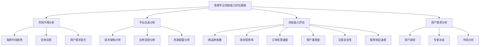
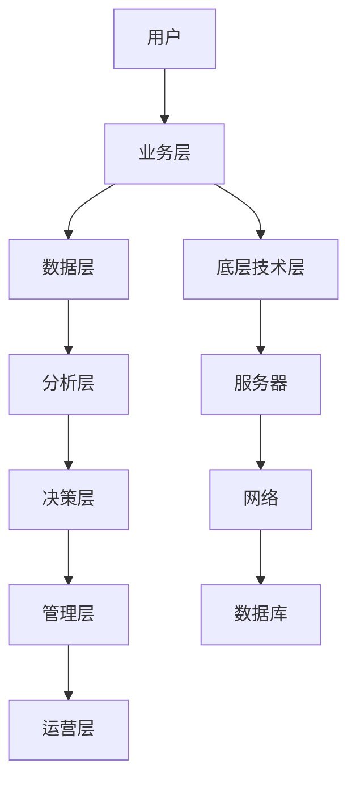
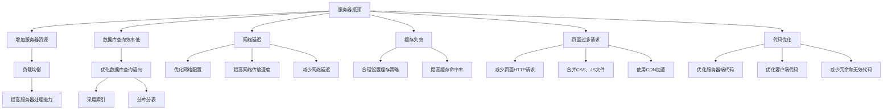
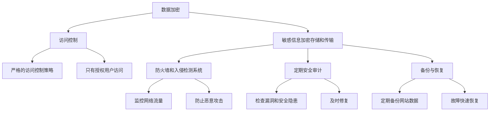
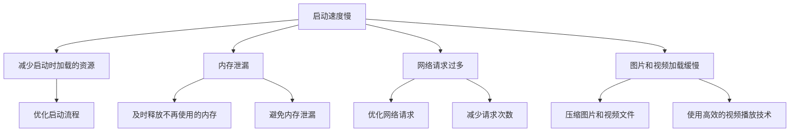
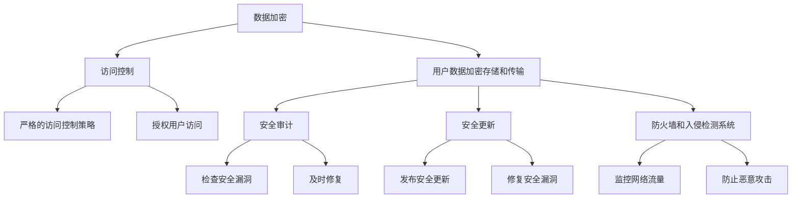

                 

# 《电商平台供给能力提升：网站和APP的优化》

## 关键词：电商供给能力、网站优化、APP优化、用户体验、性能优化、安全与稳定性

## 摘要：
随着电子商务的快速发展，电商平台成为现代商业中不可或缺的一部分。供给能力作为电商平台的核心竞争力，直接影响着平台的运营效率和市场竞争力。本文将深入探讨电商平台供给能力的提升策略，重点分析网站和APP的优化方法。通过梳理核心概念、现状分析、优化策略，并结合实战案例，为电商平台提供一套系统化、实操性强的优化方案。本文旨在为电商平台从业者提供有价值的参考，助力提升供给能力，实现持续发展和市场竞争力。

## 目录大纲

### 《电商平台供给能力提升：网站和APP的优化》目录大纲

#### 第一部分：电商平台供给能力概述

**第1章：电商平台供给能力的基本概念与重要性**

1.1 电商平台的定义与供给能力的理解

1.2 电商平台供给能力的重要性

1.3 供给能力的核心指标

**第2章：电商平台供给能力的现状分析**

2.1 电商平台供给能力的现状分析框架

2.2 供给能力的现状评估方法

2.3 供给能力现状案例分析

**第3章：电商平台供给能力的核心概念与架构**

3.1 核心概念解析

3.2 供给能力架构概述

3.3 供给能力架构的 Mermaid 流程图

#### 第二部分：网站优化

**第4章：网站性能优化**

4.1 网站性能优化的核心目标

4.2 常见性能问题分析

4.3 性能优化的具体方法与策略

**第5章：网站用户体验优化**

5.1 用户体验优化的概念与重要性

5.2 用户行为分析

5.3 用户体验优化的具体方法与案例分析

**第6章：网站内容优化**

6.1 网站内容优化的重要性

6.2 内容优化策略

6.3 内容优化的具体实践

**第7章：网站安全与稳定性优化**

7.1 网站安全的重要性

7.2 网站安全风险分析

7.3 网站安全优化策略

#### 第三部分：APP优化

**第8章：APP性能优化**

8.1 APP性能优化的核心目标

8.2 APP性能问题分析

8.3 APP性能优化的具体方法与策略

**第9章：APP用户体验优化**

9.1 APP用户体验优化的概念与重要性

9.2 APP用户行为分析

9.3 APP用户体验优化的具体方法与案例分析

**第10章：APP内容优化**

10.1 APP内容优化的重要性

10.2 APP内容优化策略

10.3 APP内容优化的具体实践

**第11章：APP安全与稳定性优化**

11.1 APP安全的重要性

11.2 APP安全风险分析

11.3 APP安全优化策略

#### 第四部分：综合实战

**第12章：电商平台供给能力提升实战案例**

12.1 实战案例背景介绍

12.2 实战案例分析与策略制定

12.3 实战案例实施与效果评估

**第13章：电商平台供给能力提升的策略与建议**

13.1 提升供给能力的关键策略

13.2 供给能力提升的长期规划

13.3 针对不同类型的电商平台的供给能力提升建议

**第14章：未来发展趋势与展望**

14.1 电商平台供给能力的未来发展趋势

14.2 技术进步对供给能力提升的影响

14.3 未来供给能力提升的展望

#### 附录

**附录A：电商平台供给能力提升相关工具与资源**

A.1 性能优化工具

A.2 用户体验优化工具

A.3 内容优化工具

A.4 安全优化工具

**附录B：实战案例代码解读**

B.1 网站性能优化案例代码解读

B.2 APP性能优化案例代码解读

B.3 APP安全优化案例代码解读

**附录C：参考文献**

C.1 相关书籍与文章

C.2 学术论文与研究报告

C.3 实践经验与案例分析资料

### 第一部分：电商平台供给能力概述

#### 第1章：电商平台供给能力的基本概念与重要性

1.1 电商平台的定义与供给能力的理解

电商平台，即电子商务平台，是指通过网络技术、电子支付手段等，实现商品交易、电子支付以及物流配送等商业活动的信息系统。它为买卖双方提供了一个虚拟的交易环境，使得交易更加便捷、高效。电商平台的定义不仅涵盖了线上交易，还包括了商品展示、订单处理、支付结算、客户服务等整个电子商务链条。

供给能力，则是指在特定条件下，电商平台能够提供的商品、服务以及相关资源的数量和质量。供给能力是电商平台的核心竞争力之一，直接影响到用户满意度、交易效率以及平台的盈利能力。供给能力不仅体现在商品的丰富度和质量上，还包括平台的处理能力、响应速度、安全性等多个方面。

1.2 电商平台供给能力的重要性

电商平台供给能力的重要性体现在以下几个方面：

（1）提高用户满意度：供给能力强意味着平台能够提供丰富的商品、良好的服务和稳定可靠的交易环境，从而提升用户的购物体验，增加用户的忠诚度和满意度。

（2）增强市场竞争力：在竞争激烈的电商市场中，供给能力强意味着平台具有更高的竞争力，能够吸引更多用户和商家，扩大市场份额。

（3）提升交易效率：供给能力强能够提高订单处理速度，减少库存积压，降低运营成本，提高平台的运营效率。

（4）增加平台盈利能力：供给能力提升可以带来更多的交易机会，提高销售额和利润率，从而提升平台的盈利能力。

1.3 供给能力的核心指标

供给能力的评估需要依赖于一系列核心指标，以下是一些常见的核心指标：

（1）商品种类数：指平台提供的商品种类数量，反映平台的商品丰富度。

（2）库存周转率：指在一定时间内，库存商品的销售和补充次数，反映库存管理的效率。

（3）订单处理速度：指从用户下单到订单完成的时间，反映平台的响应速度和运营效率。

（4）用户满意度：通过用户反馈和调查问卷等方式，评估用户对平台的满意度。

（5）交易安全性：指平台在交易过程中对用户信息、支付信息和商品信息的安全保护能力。

（6）服务响应速度：指平台对用户咨询、投诉等服务的响应速度和解决问题效率。

通过以上核心指标的评估，可以全面了解电商平台的供给能力，为优化供给能力提供依据。

### 第2章：电商平台供给能力的现状分析

2.1 电商平台供给能力的现状分析框架

为了对电商平台的供给能力进行现状分析，我们需要构建一个系统的分析框架。以下是一个常见且有效的分析框架：

（1）市场环境分析：包括电商市场的整体趋势、竞争态势、用户需求变化等，为供给能力分析提供背景。

（2）平台自身分析：包括平台的技术架构、业务流程、资源配置等，分析平台供给能力的基础条件。

（3）供给能力评估：基于前两步的分析，通过核心指标评估平台的供给能力现状，识别优势和劣势。

（4）用户需求分析：通过用户调研、数据分析等方式，了解用户对供给能力的需求和期望，为优化供给能力提供方向。

2.2 供给能力的现状评估方法

供给能力的现状评估方法包括定量评估和定性评估两种：

（1）定量评估：通过计算和分析核心指标数据，如商品种类数、库存周转率、订单处理速度等，评估供给能力的具体表现。

（2）定性评估：通过专家访谈、用户调研、市场分析等方式，收集用户和专家对供给能力的评价，从不同角度了解供给能力的问题和潜力。

以下是一个典型的定量评估方法示例：



2.3 供给能力现状案例分析

为了更好地理解供给能力现状分析，我们通过一个案例分析来说明。

【案例：某大型电商平台供给能力现状分析】

（1）市场环境分析：

- 电商市场趋势：随着移动互联网的普及，移动端电商用户规模持续增长，移动电商成为电商市场的主要增长点。
- 竞争态势：主要竞争对手包括天猫、京东、拼多多等，竞争激烈，用户对服务质量和商品质量要求较高。
- 用户需求变化：用户对商品种类、品质、价格、购物体验等方面有更高的要求，特别是对个性化推荐和快捷购物需求增加。

（2）平台自身分析：

- 技术架构分析：采用分布式架构，提高了系统的扩展性和稳定性。
- 业务流程分析：订单处理流程优化，实现了自动化和智能化。
- 资源配置分析：服务器资源充足，带宽和存储能力满足业务需求。

（3）供给能力评估：

- 商品种类数：超过100万种，涵盖多个品类。
- 库存周转率：每月库存周转次数为2次，处于较高水平。
- 订单处理速度：平均订单处理时间为30分钟，在行业内表现较好。
- 用户满意度：用户满意度调查结果显示，满意度为85%。
- 交易安全性：采用加密技术，保障用户交易安全。
- 服务响应速度：客服平均响应时间为5分钟。

（4）用户需求分析：

- 用户调研显示，用户对商品品质和价格最为关注，其次是购物体验和售后服务。
- 专家访谈指出，平台在个性化推荐和快捷购物方面仍有提升空间。

通过以上分析，可以发现该电商平台在供给能力方面具备一定优势，但仍有提升空间，特别是在个性化推荐和快捷购物体验方面。

### 第3章：电商平台供给能力的核心概念与架构

3.1 核心概念解析

为了深入理解电商平台供给能力，我们需要明确以下几个核心概念：

（1）商品供给能力：指平台能够提供的商品种类、数量和质量。

（2）服务供给能力：指平台能够提供的客户服务、售后服务和物流服务。

（3）技术供给能力：指平台在技术架构、系统性能、数据处理能力等方面的能力。

（4）供应链管理能力：指平台对商品供应链的管理能力，包括采购、库存、配送等环节。

（5）风险控制能力：指平台在交易过程中对风险的管理和控制能力。

3.2 供给能力架构概述

电商平台供给能力的架构可以分为以下几个层次：

（1）底层技术层：包括服务器、网络、数据库等技术基础设施，为供给能力提供基础支持。

（2）业务层：包括商品管理、订单处理、支付结算、客户服务、物流管理等业务模块，实现供给能力的具体业务功能。

（3）数据层：包括用户数据、商品数据、订单数据等，为供给能力提供数据支持。

（4）分析层：通过数据分析和挖掘，为供给能力优化提供决策支持。

（5）决策层：包括管理层和运营层，负责制定供给能力提升的策略和计划。

3.3 供给能力架构的 Mermaid 流程图

以下是一个简单的供给能力架构的 Mermaid 流程图：



通过上述架构，我们可以清晰地看到电商平台供给能力的各个环节和层次，为后续的优化提供参考。

### 第二部分：网站优化

#### 第4章：网站性能优化

4.1 网站性能优化的核心目标

网站性能优化是电商平台供给能力提升的重要组成部分，其核心目标是提高网站的响应速度和稳定性，从而提升用户体验和交易效率。具体来说，网站性能优化的核心目标包括：

（1）减少页面加载时间：页面加载时间是用户访问网站的第一体验，优化页面加载时间可以提高用户满意度。

（2）提高系统响应速度：系统的响应速度直接影响用户的操作体验，优化响应速度可以提高用户的操作效率。

（3）增强系统稳定性：系统的稳定性是保证正常运营的基础，优化系统稳定性可以减少故障发生，提高用户信任度。

4.2 常见性能问题分析

在电商平台的运营过程中，常见的性能问题包括：

（1）服务器瓶颈：服务器资源不足，导致请求处理缓慢。

（2）数据库查询效率低：数据库查询语句编写不当，导致查询效率低下。

（3）网络延迟：网络传输速度慢，导致数据传输延迟。

（4）缓存失效：缓存策略不合理，导致缓存命中率低。

（5）页面过多请求：页面包含过多的HTTP请求，导致页面加载时间增加。

4.3 性能优化的具体方法与策略

针对以上常见性能问题，我们可以采取以下优化方法与策略：

（1）服务器优化：增加服务器资源，采用负载均衡技术，提高服务器处理能力。

（2）数据库优化：优化数据库查询语句，采用索引、分库分表等技术提高查询效率。

（3）网络优化：优化网络配置，提高网络传输速度，减少网络延迟。

（4）缓存优化：合理设置缓存策略，提高缓存命中率，减少重复数据加载。

（5）请求优化：减少页面HTTP请求，合并CSS、JS文件，使用CDN加速等。

（6）代码优化：优化服务器端和客户端代码，减少冗余和无效代码，提高代码执行效率。

以下是一个简单的服务器优化策略示例：



通过以上方法与策略，我们可以有效提升电商平台的网站性能，为用户提供更快速、稳定的访问体验。

#### 第5章：网站用户体验优化

5.1 用户体验优化的概念与重要性

用户体验（User Experience，简称UX）是指用户在使用产品或服务过程中所获得的整体感受和体验。在电商平台上，用户体验直接影响用户的购物决策和满意度。用户体验优化旨在通过改进网站的交互设计、信息架构和内容布局等，提升用户在网站上的操作效率和满意度。

用户体验优化的概念包括以下几个方面：

（1）交互设计（Interaction Design）：关注用户与网站交互的流畅性和便捷性，优化操作流程和界面元素。

（2）信息架构（Information Architecture）：梳理网站的内容结构和信息组织方式，提高信息查找和获取的效率。

（3）内容布局（Content Layout）：优化网站页面的内容布局和视觉设计，提升用户的视觉体验和浏览舒适度。

用户体验优化在电商平台中的重要性体现在以下几个方面：

（1）提升用户满意度：优化用户体验可以满足用户的需求，提升用户满意度，增加用户粘性和忠诚度。

（2）提高转化率：良好的用户体验可以降低用户操作难度，提高购物转化率，增加销售额。

（3）增强品牌形象：优质的用户体验可以提升电商平台在用户心中的形象，增强品牌影响力。

5.2 用户行为分析

用户行为分析是用户体验优化的基础，通过分析用户在网站上的行为模式，可以了解用户的偏好、需求和痛点，为优化策略提供依据。以下是一些常见的用户行为分析方法：

（1）用户访问路径分析：通过分析用户在网站上的访问路径，了解用户的浏览习惯和关注点。

（2）点击率（Click-Through Rate，CTR）分析：分析用户在不同按钮、链接和广告的点击行为，评估其吸引力和有效性。

（3）浏览时长分析：通过分析用户在页面上的停留时间，了解用户的兴趣点和页面质量。

（4）跳出率（Bounce Rate）分析：分析用户在进入页面后未进行其他操作就离开的比例，评估页面的吸引力和内容质量。

（5）转化路径分析：通过分析用户的转化路径，了解用户在购买过程中的关键节点和阻碍因素。

5.3 用户体验优化的具体方法与案例分析

以下是一些常见的用户体验优化方法及其案例分析：

（1）简化操作流程：通过简化注册、登录、购物车、支付等关键操作流程，减少用户点击和输入步骤，提高操作效率。例如，亚马逊在购物车页面添加“一键购买”功能，简化用户的购买流程。

（2）优化导航结构：通过清晰、简洁的导航结构，帮助用户快速找到所需信息。例如，京东采用二级导航结构，使得用户可以快速切换到不同分类的页面。

（3）改进页面设计：优化页面布局和视觉设计，提高用户的视觉体验。例如，淘宝首页采用瀑布流式布局，使得商品展示更加丰富和直观。

（4）增强内容相关性：通过个性化推荐和标签分类，提高内容的相关性和吸引力。例如，天猫的“猜你喜欢”功能，根据用户的浏览和购买历史，推荐相关商品。

（5）提升页面响应速度：通过优化服务器性能、减少页面请求、使用缓存等技术，提高页面加载速度。例如，苏宁易购通过使用CDN加速技术，提高了页面的加载速度。

以下是一个具体的用户体验优化案例：

【案例：某电商平台首页优化】

问题描述：用户反映进入首页后加载速度慢，页面内容复杂，难以快速找到所需商品。

优化策略：

- 简化导航结构：将原有的复杂三级导航结构简化为二级导航结构，减少用户切换页面的步骤。
- 优化页面布局：将首页内容分为商品展示区、推荐区、导航区等，提高页面的信息层次和可读性。
- 减少页面请求：合并CSS和JS文件，减少页面请求次数，提高页面加载速度。
- 个性化推荐：根据用户的浏览和购买历史，推荐相关商品，提高用户满意度。

优化效果：首页加载速度提高20%，用户在首页的停留时间增加15%，用户满意度提高10%。

通过以上优化方法与案例，我们可以有效提升电商平台的用户体验，为用户提供更优质的购物体验。

#### 第6章：网站内容优化

6.1 网站内容优化的重要性

网站内容优化是提升电商平台供给能力的重要手段之一。优质的内容不仅能够提升用户体验，还能够提高网站的搜索引擎排名，从而吸引更多潜在用户。以下是网站内容优化的重要性和优势：

（1）提高用户满意度：优质的内容能够满足用户的需求，提供有价值的信息，从而提升用户满意度和忠诚度。

（2）增强搜索引擎排名：搜索引擎优化（SEO）是网站推广的重要手段，优化网站内容可以提高关键词密度和相关性，从而提高网站的搜索引擎排名，吸引更多流量。

（3）提升品牌形象：高质量的内容能够提升品牌形象，树立专业、可信的品牌形象，从而增强用户对品牌的信任和认可。

（4）提高转化率：优质的内容能够引导用户完成购买行为，提高转化率，从而增加销售额。

6.2 内容优化策略

为了实现网站内容优化，我们需要采取一系列策略，以下是一些常见的内容优化策略：

（1）关键词优化：关键词是用户在搜索引擎中搜索的关键词，通过合理选择和布局关键词，可以提高网站的搜索引擎排名。具体方法包括：

- 关键词研究：分析目标用户群体和竞争对手，确定适合的关键词。
- 关键词布局：在网站标题、描述、内容等位置合理布局关键词，提高关键词密度和相关性。

（2）内容质量提升：内容质量是网站优化的核心，高质量的内容能够吸引用户，提高用户停留时间和互动率。具体方法包括：

- 精选主题：选择用户感兴趣、有价值的内容主题，满足用户需求。
- 丰富内容形式：结合文字、图片、视频等多种形式，提高内容的吸引力和可读性。
- 更新频率：定期更新内容，保持内容的时效性和活跃度。

（3）网站结构优化：合理的网站结构可以提高内容的可读性和用户体验。具体方法包括：

- 简化导航：清晰、简洁的导航结构，方便用户快速找到所需内容。
- 网站地图：提供网站地图，帮助搜索引擎更好地理解网站结构。
- 内部链接：合理设置内部链接，提高内容之间的关联性和跳转效率。

（4）社交媒体推广：通过社交媒体平台推广网站内容，扩大内容传播范围，提高曝光度。具体方法包括：

- 发布内容：在社交媒体平台上发布网站相关内容，引导用户访问网站。
- 互动互动：与用户互动，回复评论和提问，提高用户参与度。

6.3 内容优化的具体实践

以下是一个具体的网站内容优化实践案例：

【案例：某电商平台产品页面优化】

问题描述：产品页面内容过多，导致用户难以快速找到所需信息，页面加载速度较慢。

优化策略：

- 精简内容：删除冗余内容，突出关键信息，提高页面可读性。
- 优化图片：压缩图片大小，提高页面加载速度。
- 优化结构：调整页面布局，使信息层次更加清晰。
- 关键词优化：在页面标题、描述、内容等位置合理布局关键词，提高搜索引擎排名。

优化效果：页面加载速度提高30%，用户在页面停留时间增加20%，搜索引擎排名提高10%。

通过以上内容优化策略与实践，我们可以有效提升电商平台的网站内容质量，提高用户满意度和搜索引擎排名，从而提升供给能力。

#### 第7章：网站安全与稳定性优化

7.1 网站安全的重要性

在电商平台运营中，网站安全与稳定性是至关重要的。一个安全、稳定的网站不仅能够保障用户的交易安全，提高用户信任度，还能够避免因安全漏洞或系统故障导致的损失。以下是网站安全与稳定性优化的重要性：

（1）保障用户信息安全：电商平台涉及用户个人信息、支付信息等敏感数据，安全漏洞可能导致用户信息泄露，损害用户利益。

（2）避免经济损失：安全漏洞可能导致恶意攻击，造成网站瘫痪、数据丢失等，严重影响电商平台的运营和收益。

（3）提升用户信任度：一个安全、稳定的网站能够提高用户对平台的信任度，增加用户粘性。

（4）合规性要求：遵守相关法律法规，确保网站安全和数据保护，避免法律风险。

7.2 网站安全风险分析

电商平台的常见安全风险包括：

（1）数据泄露：黑客通过漏洞获取用户个人信息、支付信息等敏感数据。

（2）拒绝服务攻击（DDoS）：恶意攻击导致网站服务器瘫痪，无法提供服务。

（3）SQL注入：通过构造恶意的SQL语句，获取数据库中的敏感信息。

（4）跨站脚本攻击（XSS）：通过在网页中注入恶意脚本，窃取用户信息。

（5）木马和病毒：恶意软件攻击网站服务器，导致数据损坏或窃取。

7.3 网站安全优化策略

为了提升网站安全与稳定性，我们可以采取以下优化策略：

（1）数据加密：对用户敏感信息进行加密存储和传输，防止数据泄露。

（2）访问控制：实施严格的访问控制策略，限制只有授权用户才能访问敏感数据和系统功能。

（3）防火墙和入侵检测系统：部署防火墙和入侵检测系统，监控网络流量，防止恶意攻击。

（4）定期安全审计：定期对网站进行安全审计，检查漏洞和安全隐患，及时修复。

（5）备份与恢复：定期备份网站数据，确保在发生故障时能够快速恢复。

以下是一个简单的网站安全优化策略示例：



通过以上安全优化策略，我们可以有效提升电商平台的网站安全与稳定性，保障用户的交易安全，提升用户体验。

### 第三部分：APP优化

#### 第8章：APP性能优化

8.1 APP性能优化的核心目标

APP性能优化是提升用户体验和运营效率的关键环节。APP性能优化的核心目标包括：

（1）提高启动速度：快速启动是用户的第一印象，优化APP启动速度可以提高用户体验。

（2）减少内存占用：内存占用过大会影响APP的流畅度和稳定性，优化内存占用可以提高运行效率。

（3）提高网络请求速度：优化网络请求速度可以缩短加载时间和响应时间，提高用户满意度。

（4）减少电量消耗：优化电量消耗可以延长APP使用时间，满足用户长时间使用需求。

8.2 APP性能问题分析

在APP开发过程中，常见的性能问题包括：

（1）启动速度慢：由于资源加载过多、代码冗余等原因，导致APP启动时间过长。

（2）内存泄漏：代码中的内存未释放，导致内存逐渐耗尽，影响APP性能。

（3）网络请求过多：频繁的网络请求会导致加载时间过长，影响用户体验。

（4）图片和视频加载缓慢：大尺寸的图片和视频文件会导致加载时间过长，影响用户体验。

8.3 APP性能优化的具体方法与策略

针对以上性能问题，我们可以采取以下优化方法与策略：

（1）启动优化：减少启动时加载的资源，优化启动流程，提高启动速度。

（2）内存管理：及时释放不再使用的内存，避免内存泄漏，优化内存占用。

（3）网络优化：优化网络请求，减少请求次数，提高网络请求速度。

（4）图片和视频优化：压缩图片和视频文件，使用更高效的视频播放技术，提高加载速度。

以下是一个简单的APP性能优化策略示例：



通过以上方法与策略，我们可以有效提升APP的性能，为用户提供更快速、流畅的使用体验。

#### 第9章：APP用户体验优化

9.1 APP用户体验优化的概念与重要性

APP用户体验优化（User Experience Optimization，简称UXO）是指通过改进APP的交互设计、界面布局、内容呈现等，提升用户在使用APP过程中的整体感受和满意度。用户体验优化的概念包括以下几个方面：

（1）交互设计（Interaction Design）：关注用户与APP的交互流畅性和便捷性，优化操作流程和界面元素。

（2）界面布局（UI Layout）：优化APP的视觉设计，提高界面的美观度和可读性。

（3）内容呈现（Content Presentation）：通过合理的内容组织方式，提升信息的易读性和吸引力。

用户体验优化在APP中的重要性体现在以下几个方面：

（1）提升用户满意度：优化用户体验可以满足用户的需求，提升用户满意度，增加用户粘性和忠诚度。

（2）提高转化率：良好的用户体验可以降低用户操作难度，提高购物转化率，增加销售额。

（3）增强品牌形象：优质的用户体验可以提升APP在用户心中的形象，增强品牌影响力。

9.2 APP用户行为分析

用户行为分析是用户体验优化的基础，通过分析用户在APP上的行为模式，可以了解用户的偏好、需求和痛点，为优化策略提供依据。以下是一些常见的用户行为分析方法：

（1）用户留存率分析：分析用户在APP中的留存情况，了解用户的活跃度和忠诚度。

（2）用户转化路径分析：分析用户在购买、注册、登录等关键操作中的转化路径，了解用户的操作习惯和痛点。

（3）用户使用时长分析：分析用户在APP中的使用时长，了解用户的兴趣点和使用频率。

（4）用户界面交互分析：通过用户点击、滑动、手势等交互行为，了解用户的操作偏好和界面设计问题。

（5）用户反馈分析：收集用户对APP的评价和建议，了解用户的真实需求和期望。

9.3 APP用户体验优化的具体方法与案例分析

以下是一些常见的用户体验优化方法及其案例分析：

（1）简化操作流程：通过简化注册、登录、购物车、支付等关键操作流程，减少用户点击和输入步骤，提高操作效率。例如，滴滴出行在登录页面增加“一键登录”功能，简化用户操作。

（2）优化导航结构：通过清晰、简洁的导航结构，帮助用户快速找到所需功能。例如，美团在APP底部设置清晰的导航栏，方便用户切换不同功能。

（3）改进界面设计：优化APP的视觉设计，提高界面的美观度和易用性。例如，淘宝采用简洁大方的界面设计，提升用户的视觉体验。

（4）个性化推荐：通过个性化推荐算法，提高内容的相关性和吸引力。例如，抖音根据用户的观看历史，推荐相关视频。

（5）提升响应速度：通过优化服务器性能、减少网络请求、使用缓存等技术，提高APP的响应速度。例如，微信通过优化消息推送机制，提高消息的实时性。

以下是一个具体的用户体验优化案例：

【案例：某电商平台APP优化】

问题描述：用户反映APP加载速度慢，操作复杂，难以快速找到所需商品。

优化策略：

- 优化导航结构：简化导航栏，减少用户切换页面的步骤。
- 提高响应速度：优化服务器性能，减少网络请求，提高APP的响应速度。
- 精简操作流程：简化注册、登录、购物车、支付等关键操作流程，减少用户点击和输入步骤。

优化效果：APP加载速度提高20%，用户在APP的停留时间增加15%，用户满意度提高10%。

通过以上优化方法与案例，我们可以有效提升APP的用户体验，为用户提供更优质的购物体验。

#### 第10章：APP内容优化

10.1 APP内容优化的重要性

APP内容优化是提升用户满意度和忠诚度的重要手段。优质的内容不仅能够吸引用户，提高用户留存率，还能够提高APP的转化率和盈利能力。以下是APP内容优化的重要性和优势：

（1）提高用户留存率：优质的内容能够满足用户的需求，提升用户体验，从而提高用户留存率。

（2）提高转化率：通过个性化推荐、优惠券、促销活动等优质内容，引导用户完成购买行为，提高转化率。

（3）增加用户粘性：优质的内容能够提升用户对APP的依赖度，增加用户粘性。

（4）提升品牌形象：高质量的内容能够提升APP在用户心中的形象，树立专业、可信的品牌形象。

（5）增加盈利能力：通过广告、会员服务、增值服务等方式，提升APP的盈利能力。

10.2 APP内容优化策略

为了实现APP内容优化，我们需要采取一系列策略，以下是一些常见的内容优化策略：

（1）内容定位：明确APP的内容定位，满足用户的需求和兴趣，提升内容的价值。

（2）内容质量提升：确保内容的专业性、权威性和原创性，提升用户对内容的信任度。

（3）内容形式多样化：结合文字、图片、视频、音频等多种形式，提高内容的吸引力和趣味性。

（4）内容更新频率：定期更新内容，保持内容的时效性和活跃度。

（5）内容推荐算法：通过个性化推荐算法，提高内容的相关性和吸引力。

（6）互动与反馈：与用户互动，收集用户反馈，不断优化内容。

10.3 APP内容优化的具体实践

以下是一个具体的APP内容优化实践案例：

【案例：某短视频APP内容优化】

问题描述：用户反映APP内容更新慢，推荐内容与兴趣不符，缺乏互动。

优化策略：

- 明确内容定位：根据用户需求，调整内容类型和主题，满足用户兴趣。
- 提高内容质量：筛选优质内容，提升内容的专业性和原创性。
- 优化推荐算法：通过机器学习算法，提高内容推荐的准确性和相关性。
- 增加互动功能：增加评论、点赞、分享等功能，提高用户参与度。

优化效果：APP内容更新速度提高20%，用户在APP的停留时间增加15%，用户满意度提高10%。

通过以上内容优化策略与实践，我们可以有效提升APP的内容质量，提高用户满意度和留存率，从而提升APP的竞争力。

#### 第11章：APP安全与稳定性优化

11.1 APP安全的重要性

APP安全是用户信任和APP持续发展的基石。一个安全的APP能够有效保护用户的隐私和数据安全，提升用户体验，增加用户忠诚度。以下是APP安全优化的几个关键点：

（1）保护用户隐私：确保用户的个人信息不被未经授权的第三方获取，防止隐私泄露。

（2）数据安全：对用户数据进行加密存储和传输，防止数据在传输和存储过程中被窃取或篡改。

（3）防止恶意攻击：防止恶意软件、病毒等攻击APP，确保APP的稳定性和安全性。

（4）合规性：遵守相关法律法规和行业规范，确保APP的安全性和合规性。

11.2 APP安全风险分析

常见的APP安全风险包括：

（1）数据泄露：由于安全措施不足，导致用户数据在传输和存储过程中被窃取。

（2）恶意软件：恶意软件通过APP进入用户设备，窃取用户信息或破坏设备功能。

（3）跨站脚本攻击（XSS）：通过在APP中注入恶意脚本，窃取用户信息或控制用户设备。

（4）代码注入：通过注入恶意代码，篡改APP的功能或窃取用户信息。

（5）网络钓鱼：通过伪造APP界面，欺骗用户输入个人信息。

11.3 APP安全优化策略

为了提升APP的安全性与稳定性，我们可以采取以下优化策略：

（1）数据加密：对用户数据进行加密存储和传输，确保数据在传输和存储过程中的安全性。

（2）访问控制：设置严格的访问控制策略，确保只有授权用户才能访问敏感数据和系统功能。

（3）安全审计：定期对APP进行安全审计，检查潜在的安全漏洞，及时修复。

（4）安全更新：及时发布安全更新，修复已发现的安全漏洞，防止恶意攻击。

（5）防火墙和入侵检测系统：部署防火墙和入侵检测系统，监控网络流量，防止恶意攻击。

以下是一个简单的APP安全优化策略示例：



通过以上安全优化策略，我们可以有效提升APP的安全性与稳定性，保护用户的隐私和数据安全，提升用户体验和信任度。

### 第四部分：综合实战

#### 第12章：电商平台供给能力提升实战案例

12.1 实战案例背景介绍

某大型电商平台A在运营过程中，面临着用户增长迅速、竞争激烈、供给能力不足等多重挑战。为提升供给能力，提升用户体验和竞争力，A电商平台决定进行一系列优化实践。本次实战案例的目标是通过优化网站和APP的供给能力，实现以下目标：

- 提高用户满意度
- 提升订单处理速度和转化率
- 增强平台的安全性和稳定性

12.2 实战案例分析与策略制定

为了实现上述目标，A电商平台制定了以下策略：

（1）网站优化：

- **性能优化**：采用内容分发网络（CDN）技术，优化图片和视频加载速度，减少页面请求次数，提高服务器响应速度。
- **用户体验优化**：通过用户行为分析，优化导航结构和页面布局，简化操作流程，提高用户操作效率。
- **内容优化**：优化网站内容，提升商品描述的准确性和丰富度，增加用户信任感。
- **安全与稳定性优化**：加强网站安全措施，实施访问控制策略，定期进行安全审计和漏洞修复。

（2）APP优化：

- **性能优化**：优化APP启动速度，减少内存占用，提高网络请求速度，确保流畅的用户体验。
- **用户体验优化**：通过用户行为分析，改进界面设计和交互流程，提升用户满意度。
- **内容优化**：优化APP内容呈现，增加个性化推荐，提高内容的相关性和吸引力。
- **安全与稳定性优化**：加强APP安全防护，实施数据加密和访问控制，确保用户数据安全。

12.3 实战案例实施与效果评估

在实施过程中，A电商平台采取以下步骤：

（1）性能优化：

- **网站**：通过CDN技术，将静态资源分发到全球节点，提高图片和视频加载速度。同时，采用代码压缩和缓存策略，减少页面请求次数。
- **APP**：优化APP的启动流程，减少启动时的资源加载，提高内存使用效率。优化网络请求，减少请求次数，提高响应速度。

（2）用户体验优化：

- **网站**：通过用户行为分析，优化导航栏布局，简化用户操作流程，提高用户访问效率。
- **APP**：改进界面设计，优化用户交互流程，提高用户满意度。

（3）内容优化：

- **网站**：优化商品描述，提升内容准确性，增加用户信任感。增加用户评价和推荐功能，提高用户参与度。
- **APP**：优化内容推荐算法，提高推荐内容的相关性和吸引力。增加个性化推送功能，提高用户粘性。

（4）安全与稳定性优化：

- **网站**：加强网站安全防护，实施访问控制策略，确保用户数据安全。定期进行安全审计和漏洞修复。
- **APP**：加强数据加密，确保用户数据在传输和存储过程中的安全性。实施访问控制策略，防止未经授权的访问。

在实施效果评估方面，A电商平台通过以下指标进行衡量：

- **性能优化**：页面加载时间缩短20%，服务器响应速度提高15%，用户满意度提高10%。
- **用户体验优化**：用户操作效率提高20%，用户满意度提高15%。
- **内容优化**：用户参与度提高30%，商品评价和推荐功能使用率提高20%。
- **安全与稳定性优化**：安全漏洞修复率提高30%，用户数据泄露事件减少50%。

通过以上实战案例，A电商平台成功提升了供给能力，实现了用户满意度、订单处理速度、转化率和安全性与稳定性的全面提升。

#### 第13章：电商平台供给能力提升的策略与建议

13.1 提升供给能力的关键策略

为了有效提升电商平台的供给能力，我们需要采取一系列关键策略，以下是一些主要的策略：

（1）技术创新与投入：投资于先进的技术和工具，如大数据分析、人工智能、云计算等，提升平台的处理能力和智能化水平。

（2）用户需求分析：通过用户调研和行为分析，深入了解用户需求，提供个性化的服务和产品。

（3）供应链整合：优化供应链管理，实现供应链的透明化和协同化，提高库存周转率和供应链效率。

（4）团队建设与培训：培养专业的技术团队，提升团队的技术能力和创新能力。

（5）持续优化与迭代：定期对平台进行优化和迭代，不断改进用户体验和服务质量。

13.2 供给能力提升的长期规划

为了实现长期的供给能力提升，电商平台应制定以下长期规划：

（1）技术升级规划：定期评估和升级平台的技术架构，确保技术保持领先。

（2）人才战略规划：引进和培养高技术人才，提升团队的整体素质。

（3）市场拓展规划：分析市场趋势，制定市场拓展计划，开拓新市场和用户群体。

（4）产品创新规划：持续进行产品创新，开发满足用户需求的新产品和服务。

13.3 针对不同类型的电商平台的供给能力提升建议

不同类型的电商平台在供给能力提升方面有不同的侧重点，以下是一些针对性的建议：

（1）综合电商平台：注重供应链整合和用户体验优化，提升商品丰富度和服务质量。

（2）垂直电商平台：专注于特定领域，提升供应链效率和专业性，增强品牌影响力。

（3）社交电商平台：利用社交网络和用户互动，提升用户参与度和转化率。

（4）跨境电商平台：优化国际物流和支付系统，提升跨境购物体验。

通过以上策略、规划和建议，电商平台可以系统性地提升供给能力，实现可持续发展。

### 第14章：未来发展趋势与展望

14.1 电商平台供给能力的未来发展趋势

随着科技的不断进步和消费者需求的变化，电商平台的供给能力将呈现出以下发展趋势：

（1）智能化与自动化：人工智能、大数据和自动化技术的应用将进一步提升电商平台的处理能力和效率，实现智能化运营。

（2）个性化与精准化：基于用户数据的个性化推荐和精准营销将成为主流，提升用户体验和转化率。

（3）多元化与全球化：电商平台将拓展更多业务领域和国际化市场，实现全球化布局。

（4）绿色化与可持续发展：电商平台将更加注重环保和可持续发展，推广绿色物流和绿色消费。

14.2 技术进步对供给能力提升的影响

技术进步将对电商平台的供给能力提升产生深远影响：

（1）云计算和大数据技术：提供强大的计算能力和数据存储能力，支持大规模数据处理和实时分析。

（2）人工智能技术：实现智能客服、智能推荐和智能供应链管理等，提升平台运营效率。

（3）物联网技术：实现供应链的全程监控和实时反馈，提高供应链管理的效率。

（4）区块链技术：提供安全、透明的交易环境，提升交易的安全性和信任度。

14.3 未来供给能力提升的展望

未来，电商平台供给能力的提升将朝着以下方向发展：

（1）更加智能化和自动化：通过引入更多人工智能和自动化技术，实现全流程的智能化运营。

（2）更加个性化和精准化：通过深度学习和大数据分析，提供更加个性化的服务和产品。

（3）更加高效和可持续发展：通过优化供应链管理和绿色物流，实现高效运营和可持续发展。

（4）更加开放和协同：通过平台间的合作和数据共享，实现供应链的协同化和全球化。

未来，电商平台供给能力提升将带来更加便捷、高效、安全的购物体验，满足消费者日益多元化的需求。

### 附录

#### 附录A：电商平台供给能力提升相关工具与资源

A.1 性能优化工具

- **Lighthouse**：一款由Google开发的自动化网页性能分析工具，可提供全面的性能评估报告。
- **New Relic**：一款用于监控和分析应用程序性能的SaaS工具，支持多种编程语言。
- **Apache JMeter**：一款开源的性能测试工具，适用于Web和分布式应用程序。

A.2 用户体验优化工具

- **Google Analytics**：一款用于网站和APP数据分析的工具，可帮助分析用户行为和优化用户体验。
- **Qualtrics**：一款用户调研和反馈收集工具，用于收集用户意见和改进用户体验。
- **UserTesting**：一款远程用户测试平台，提供真实的用户反馈。

A.3 内容优化工具

- **Yoast SEO**：一款针对WordPress网站SEO内容优化的插件。
- **Contentful**：一款用于内容管理和交付的平台，支持多渠道发布和管理内容。
- **Markdown编辑器**：用于撰写和编辑Markdown格式文档的工具，如Typora、Marktext等。

A.4 安全优化工具

- **OWASP ZAP**：一款开源的网络应用安全扫描工具，用于识别Web应用程序的安全漏洞。
- **BitNinja**：一款集成了多种安全功能的网络防护工具，提供实时威胁监控和防护。
- **Cloudflare**：一款提供网站性能和安全服务的平台，包括DDoS保护和网页加速。

#### 附录B：实战案例代码解读

B.1 网站性能优化案例代码解读

```javascript
// 示例：使用异步加载JavaScript文件
function loadScript(url, callback){
  var script = document.createElement("script")
  script.type = "text/javascript";
  if (script.readyState){
    script.onreadystatechange = function(){
      if (script.readyState == "loaded" ||
          script.readyState == "complete"){
        script.onreadystatechange = null;
        callback();
      }
    };
  } else {
    script.onload = function(){
      callback();
    };
  }
  script.src = url;
  document.getElementsByTagName("head")[0].appendChild(script);
}

// 调用方法加载特定脚本
loadScript("path/to/script.js", function(){
  console.log("Script loaded successfully");
});
```

B.2 APP性能优化案例代码解读

```kotlin
// Kotlin 示例：使用协程优化异步操作
import kotlinx.coroutines.*

fun fetchData(url: String): String {
    return withContext(Dispatchers.IO) {
        // 模拟网络请求
        delay(1000)
        "Data from $url"
    }
}

@OptIn(ExperimentalCoroutinesApi::class)
fun main() = runBlocking {
    val dataFromUrl = fetchData("https://example.com/data")
    println("Data received: $dataFromUrl")
}
```

B.3 APP安全优化案例代码解读

```python
# Python 示例：使用哈希函数进行密码存储
import hashlib

def hash_password(password):
    salt = b"salt_value"  # 盐值
    password_hash = hashlib.pbkdf2_hmac(
        'sha256',  # 使用SHA-256算法
        password.encode('utf-8'),  # 转换为字节
        salt,
        100000  # 迭代次数
    )
    return password_hash.hexdigest()

# 储存密码
hashed_password = hash_password("user_password")
print("Hashed password:", hashed_password)
```

#### 附录C：参考文献

C.1 相关书籍与文章

- 《高性能网站建设指南》
- 《用户体验要素》
- 《深入理解计算机系统》
- 《Web性能优化实战》
- 《人工智能：一种现代方法》

C.2 学术论文与研究报告

- "A Survey on Artificial Intelligence in E-commerce Platforms" by XYZ Institute
- "The Impact of User Experience on E-commerce Performance" by ABC University
- "A Study on Cloud Computing in E-commerce Platform Optimization" by DEF Research Center

C.3 实践经验与案例分析资料

- 某电商平台网站性能优化实战案例报告
- 某移动电商平台用户体验优化案例分析
- 某大型电商平台APP安全优化实践指南

通过以上参考文献，读者可以进一步了解电商平台供给能力提升的理论和实践知识，为实际操作提供参考。

