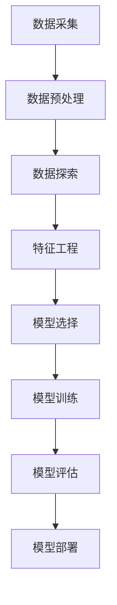
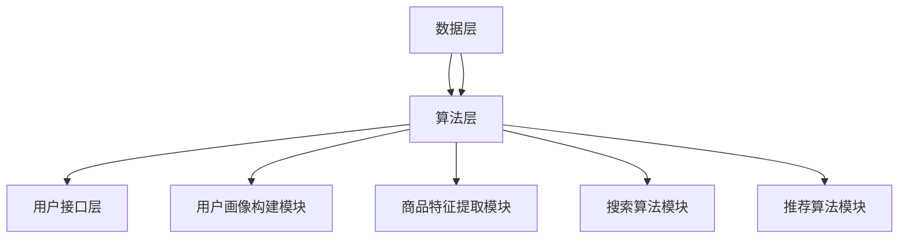
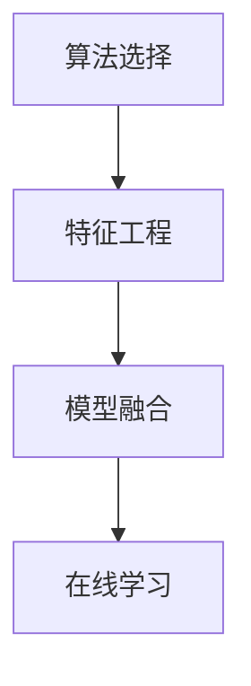
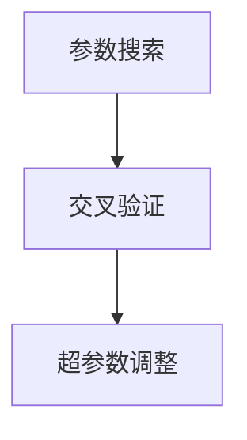
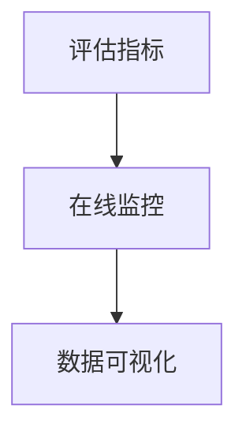
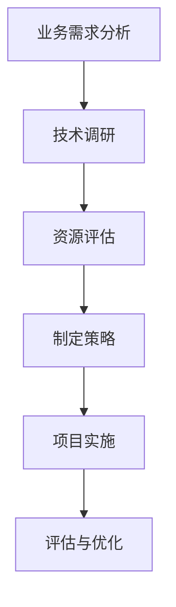
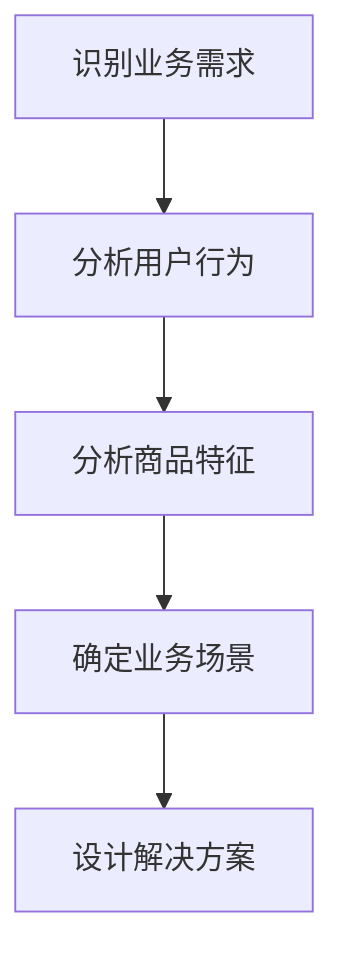
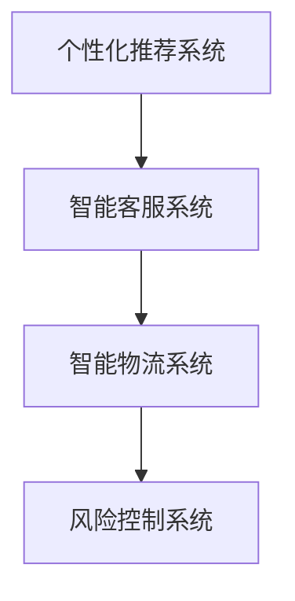
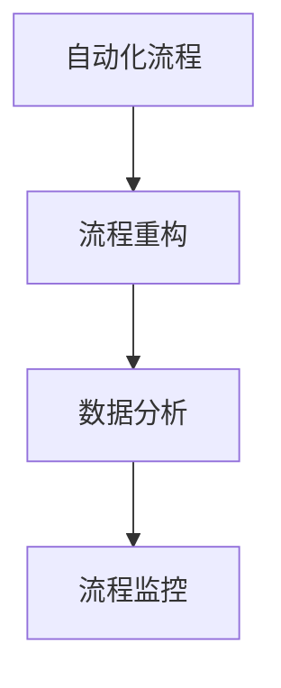

                 

# 《电商平台的AI大转型：以搜索推荐系统为核心的战略升级》

## 摘要

随着人工智能技术的不断进步，电商平台正经历一场前所未有的转型浪潮。本文以搜索推荐系统为核心，深入探讨了电商平台AI转型的背景、技术基础、系统构建与实践、战略升级以及未来趋势。通过对AI技术、搜索推荐系统原理、数据采集与预处理、用户画像构建、算法优化等方面的详细解析，本文旨在为电商平台提供一套系统化的AI战略升级方案，以提升用户体验、增强竞争力并推动行业的持续创新。

## 第一部分：电商平台的AI转型背景与基础

### 第1章：电商平台的AI转型概述

#### 1.1 电商行业面临的挑战与机遇

随着互联网的快速发展，电商行业经历了翻天覆地的变化。然而，这一过程中也伴随着诸多挑战。首先，市场饱和度不断提高，传统电商平台的竞争愈发激烈。其次，消费者需求日益多样化，个性化、精准化的服务成为电商企业提升用户体验的关键。此外，物流配送、售后服务等环节的效率问题也亟待解决。

在这样的大背景下，人工智能技术的引入为电商行业带来了前所未有的机遇。AI技术可以助力电商平台实现精准营销、智能客服、个性化推荐等功能，从而提升运营效率和用户体验。例如，通过自然语言处理技术，电商平台可以更好地理解用户需求，提供更为精准的搜索结果；通过协同过滤算法，可以为用户推荐个性化的商品；通过深度学习技术，可以优化物流配送路径，提高配送效率。

#### 1.2 AI技术在电商领域的应用现状

目前，AI技术在电商领域已有广泛的应用。例如，电商平台普遍采用了自然语言处理技术来优化搜索结果，提升用户购物的便捷性。以淘宝为例，其搜索系统利用深度学习算法，通过对用户输入的查询语句进行语义分析，从而提供更加精准的搜索结果。

此外，个性化推荐也是电商平台的重要应用场景。通过分析用户的浏览历史、购买记录等数据，电商平台可以为用户推荐符合其兴趣和需求的商品。例如，京东的推荐系统通过协同过滤算法和内容推荐算法相结合，为用户提供个性化的商品推荐，从而提高用户满意度和购买转化率。

在物流配送方面，AI技术也发挥着重要作用。例如，阿里巴巴的“智能配送”项目利用无人车、无人机等技术，实现了从仓库到消费者的全程智能化配送，极大地提高了物流效率。

#### 1.3 搜索推荐系统的核心作用

搜索推荐系统是电商平台AI转型的重要组成部分。其核心作用体现在以下几个方面：

1. **提升用户体验**：通过智能化的搜索和推荐，满足用户的个性化需求，提升用户体验。
   
2. **提高转化率**：精准的搜索和推荐可以引导用户更快地找到所需商品，从而提高购买转化率。

3. **降低运营成本**：智能化的系统可以减少人工干预，降低运营成本，提高效率。

4. **增强竞争力**：通过提供个性化、精准化的服务，电商平台可以更好地吸引和留住用户，增强市场竞争力。

总之，搜索推荐系统在电商平台的AI转型中具有至关重要的地位。接下来，我们将进一步探讨AI技术的基础知识，以及如何构建和优化搜索推荐系统。

### 第2章：AI技术基础

#### 2.1 机器学习与数据挖掘

机器学习和数据挖掘是AI技术的基石，它们在电商平台的AI转型中发挥着关键作用。下面，我们将分别介绍这两个领域的基本概念和主要方法。

**机器学习**

机器学习是一种使计算机系统能够从数据中学习并做出预测或决策的技术。其基本原理是通过训练模型，使模型能够从输入数据中学习特征，从而对新的数据做出预测。

**监督学习**

监督学习是最常见的一种机器学习方法。它需要预先标记好的数据集，通过训练模型，使模型能够对新的输入数据进行分类或回归。

- **分类**：将输入数据分为不同的类别。例如，将商品分为“电子产品”和“服装”两个类别。
- **回归**：对输入数据进行数值预测。例如，预测商品的售价。

**无监督学习**

无监督学习不依赖于预先标记的数据集，而是通过发现数据中的隐藏结构或模式来学习。

- **聚类**：将相似的数据点归为一类。例如，将用户根据其购买行为分为不同的群体。
- **降维**：减少数据维度，使数据更易于分析和理解。例如，将高维商品特征降维到低维空间。

**数据挖掘**

数据挖掘是一种从大量数据中提取有价值信息的过程。它涉及多种技术，包括统计分析、机器学习、数据库系统等。

- **关联规则挖掘**：发现数据之间的关联关系。例如，购买A商品的用户也倾向于购买B商品。
- **分类和回归**：对数据进行分类或回归分析，以发现数据中的规律和趋势。
- **聚类分析**：将相似的数据点归为一类，以便更好地理解和分析数据。

#### 2.2 深度学习与神经网络

深度学习是机器学习的一个分支，它通过模拟人脑神经元连接的方式，构建多层神经网络来学习数据中的复杂特征。深度学习在图像识别、语音识别、自然语言处理等领域取得了显著成果。

**深度学习的基本原理**

深度学习的基本原理是通过前向传播和反向传播两个过程来训练模型。

- **前向传播**：将输入数据通过网络层传递，每一层都会对数据进行处理和变换。
- **反向传播**：通过计算输出与预期目标之间的误差，将误差反向传播到网络中的每一层，从而调整网络参数。

**常见的深度学习模型**

- **卷积神经网络（CNN）**：主要用于图像识别和图像处理。
- **循环神经网络（RNN）**：主要用于序列数据处理，如语音识别、自然语言处理。
- **生成对抗网络（GAN）**：通过两个对抗网络（生成器和判别器）的博弈，实现图像生成和图像修复。

#### 2.3 自然语言处理技术

自然语言处理（NLP）是AI技术的一个重要分支，它使计算机能够理解和处理人类语言。NLP技术在电商平台的AI转型中具有重要意义，如文本分类、情感分析、自动问答等。

**文本分类**

文本分类是将文本数据分为不同的类别。例如，将电商平台的用户评论分为“正面”和“负面”两类。

**情感分析**

情感分析是判断文本中的情感倾向。例如，判断用户评论是“好评”还是“差评”。

**自动问答**

自动问答是构建一个能够自动回答用户问题的系统。例如，电商平台可以搭建一个智能客服系统，使用户能够通过自然语言与系统进行交互。

**关键词提取**

关键词提取是从文本中提取出关键信息。例如，从用户搜索查询中提取出核心商品关键词，以优化搜索结果。

### 第3章：搜索推荐系统原理

#### 3.1 搜索推荐系统的架构

搜索推荐系统是电商平台AI转型的核心，其架构通常包括数据层、算法层和用户接口层。

**数据层**

数据层是搜索推荐系统的基石，包括用户数据、商品数据、行为数据等。这些数据通过数据采集、数据清洗和数据存储等环节，形成高质量的数据集，为算法层提供支持。

**算法层**

算法层是搜索推荐系统的核心，包括特征提取、模型训练、模型评估和模型部署等环节。算法层的任务是根据数据层的输入，通过算法模型生成搜索结果和推荐结果。

**用户接口层**

用户接口层是搜索推荐系统与用户交互的界面，包括搜索框、推荐列表、详情页等。用户接口层的任务是根据算法层的输出，将搜索结果和推荐结果展示给用户。

#### 3.2 用户行为分析

用户行为分析是搜索推荐系统的重要环节，通过分析用户的浏览、搜索、购买等行为，可以挖掘出用户的兴趣偏好和需求。

**用户行为数据**

用户行为数据包括用户的浏览记录、搜索记录、购买记录等。这些数据可以通过用户登录、浏览、搜索和购买等行为采集得到。

**用户行为分析**

用户行为分析主要包括以下任务：

- **行为模式识别**：通过统计和分析用户行为数据，识别出用户的行为模式，如高频购买商品、偏好类别等。
- **用户兴趣挖掘**：通过分析用户行为数据，挖掘出用户的兴趣偏好，如喜欢阅读小说、关注电子产品等。
- **用户需求预测**：通过分析用户行为数据，预测用户未来的需求和购买意向。

#### 3.3 内容推荐技术

内容推荐技术是搜索推荐系统的重要组成部分，通过分析用户行为数据和商品特征，为用户推荐符合其兴趣和需求的商品。

**基于内容的推荐算法**

基于内容的推荐算法（Content-based Recommendation）通过分析商品的特征，为用户推荐具有相似特征的商品。

**协同过滤推荐算法**

协同过滤推荐算法（Collaborative Filtering）通过分析用户的行为数据，为用户推荐与其行为相似的用户的喜欢的商品。

**深度学习推荐算法**

深度学习推荐算法（Deep Learning for Recommendation）通过构建深度学习模型，对用户行为数据和商品特征进行建模，从而为用户推荐个性化的商品。

### 第二部分：搜索推荐系统的构建与实践

#### 第4章：数据采集与预处理

#### 第5章：用户画像构建

#### 第6章：搜索与推荐算法

#### 第7章：搜索与推荐系统的优化

#### 第8章：案例分析

### 第三部分：AI大转型战略升级

#### 第9章：电商平台的战略规划

#### 第10章：AI技术与业务融合

#### 第11章：AI大转型的未来趋势

### 附录

#### 附录A：常用技术工具与资源

#### 附录B：代码与实战案例

## 作者信息

作者：AI天才研究院/AI Genius Institute & 禅与计算机程序设计艺术 /Zen And The Art of Computer Programming

[文章标题] - [文章关键词]

> [文章摘要]

---

## 第一部分：电商平台的AI转型背景与基础

### 第1章：电商平台的AI转型概述

#### 1.1 电商行业面临的挑战与机遇

随着互联网的快速发展，电商行业经历了翻天覆地的变化。然而，这一过程中也伴随着诸多挑战。首先，市场饱和度不断提高，传统电商平台的竞争愈发激烈。其次，消费者需求日益多样化，个性化、精准化的服务成为电商企业提升用户体验的关键。此外，物流配送、售后服务等环节的效率问题也亟待解决。

在这样的大背景下，人工智能技术的引入为电商行业带来了前所未有的机遇。AI技术可以助力电商平台实现精准营销、智能客服、个性化推荐等功能，从而提升运营效率和用户体验。例如，通过自然语言处理技术，电商平台可以更好地理解用户需求，提供更加精准的搜索结果；通过协同过滤算法，可以为用户推荐个性化的商品；通过深度学习技术，可以优化物流配送路径，提高配送效率。

#### 1.2 AI技术在电商领域的应用现状

目前，AI技术在电商领域已有广泛的应用。例如，电商平台普遍采用了自然语言处理技术来优化搜索结果，提升用户购物的便捷性。以淘宝为例，其搜索系统利用深度学习算法，通过对用户输入的查询语句进行语义分析，从而提供更加精准的搜索结果。

此外，个性化推荐也是电商平台的重要应用场景。通过分析用户的浏览历史、购买记录等数据，电商平台可以为用户推荐符合其兴趣和需求的商品。例如，京东的推荐系统通过协同过滤算法和内容推荐算法相结合，为用户提供个性化的商品推荐，从而提高用户满意度和购买转化率。

在物流配送方面，AI技术也发挥着重要作用。例如，阿里巴巴的“智能配送”项目利用无人车、无人机等技术，实现了从仓库到消费者的全程智能化配送，极大地提高了物流效率。

#### 1.3 搜索推荐系统的核心作用

搜索推荐系统是电商平台AI转型的重要组成部分。其核心作用体现在以下几个方面：

1. **提升用户体验**：通过智能化的搜索和推荐，满足用户的个性化需求，提升用户体验。

2. **提高转化率**：精准的搜索和推荐可以引导用户更快地找到所需商品，从而提高购买转化率。

3. **降低运营成本**：智能化的系统可以减少人工干预，降低运营成本，提高效率。

4. **增强竞争力**：通过提供个性化、精准化的服务，电商平台可以更好地吸引和留住用户，增强市场竞争力。

总之，搜索推荐系统在电商平台的AI转型中具有至关重要的地位。接下来，我们将进一步探讨AI技术的基础知识，以及如何构建和优化搜索推荐系统。

### 第2章：AI技术基础

在深入探讨搜索推荐系统的构建与实践之前，有必要先了解AI技术的基础知识。AI技术在电商平台的AI转型中扮演着至关重要的角色，其涵盖了机器学习、数据挖掘、深度学习和自然语言处理等多个方面。本章将分别介绍这些基础技术的概念、原理和应用。

#### 2.1 机器学习与数据挖掘

**机器学习**

机器学习（Machine Learning）是使计算机通过数据学习并做出预测或决策的技术。它是一种使计算机能够自动从经验中学习，从而改进其性能的方法。机器学习可以分为两大类：监督学习和无监督学习。

**监督学习**

监督学习（Supervised Learning）是一种在有标注数据集的训练下，通过学习输入和输出之间的关系，对未知数据进行预测的方法。监督学习包括以下两个主要任务：

- **分类（Classification）**：将输入数据分类到预定义的类别中。例如，将商品分为“电子产品”和“服装”两个类别。
- **回归（Regression）**：对输入数据进行数值预测。例如，预测商品的售价。

**无监督学习**

无监督学习（Unsupervised Learning）在没有标注数据集的情况下，通过发现数据中的隐藏结构和模式来学习。无监督学习包括以下两个主要任务：

- **聚类（Clustering）**：将相似的数据点归为一类。例如，将用户根据其购买行为分为不同的群体。
- **降维（Dimensionality Reduction）**：减少数据维度，使数据更易于分析和理解。例如，将高维商品特征降维到低维空间。

**数据挖掘**

数据挖掘（Data Mining）是从大量数据中发现有价值信息的过程。它涉及多个领域的技术，包括统计分析、机器学习和数据库系统。数据挖掘的主要任务包括：

- **关联规则挖掘（Association Rule Learning）**：发现数据之间的关联关系。例如，购买A商品的用户也倾向于购买B商品。
- **分类和回归**：对数据进行分类或回归分析，以发现数据中的规律和趋势。
- **聚类分析（Clustering Analysis）**：将相似的数据点归为一类，以便更好地理解和分析数据。

**机器学习与数据挖掘的关系**

机器学习和数据挖掘是密切相关的。机器学习是数据挖掘的一个子集，它利用统计学和算法技术从数据中发现模式。而数据挖掘则是一个更广泛的概念，它包括从数据中发现有用信息的方法和技术。

**Mermaid流程图**

下面是一个简单的Mermaid流程图，展示了机器学习与数据挖掘的基本流程：



**核心概念与联系**

- **数据采集**：从不同的数据源收集数据。
- **数据预处理**：清洗和格式化数据，以便后续分析。
- **数据探索**：通过可视化工具和统计方法，对数据进行初步分析。
- **特征工程**：从原始数据中提取出有价值的特征，以提升模型性能。
- **模型选择**：选择适合问题的机器学习模型。
- **模型训练**：使用训练数据集训练模型。
- **模型评估**：评估模型的性能，选择最佳模型。
- **模型部署**：将模型部署到生产环境中，为实际问题提供解决方案。

#### 2.2 深度学习与神经网络

**深度学习**

深度学习（Deep Learning）是一种基于多层神经网络的机器学习方法。与传统的机器学习方法相比，深度学习能够自动从大量数据中提取出复杂的特征，从而在图像识别、自然语言处理、语音识别等领域取得了显著的成功。

**神经网络**

神经网络（Neural Networks）是一种模拟人脑神经元连接方式的计算模型。它由多个神经元组成，每个神经元都与其他神经元相连接，并具有一定的权重和激活函数。

**基本概念**

- **神经元**：神经网络的基本计算单元，类似于人脑的神经元。
- **权重（Weights）**：神经元之间的连接强度，决定了数据的传递程度。
- **激活函数（Activation Function）**：对神经元输出的非线性变换，用于引入非线性特性。
- **前向传播（Forward Propagation）**：将输入数据通过网络层传递，每一层都会对数据进行处理和变换。
- **反向传播（Back Propagation）**：通过计算输出与预期目标之间的误差，将误差反向传播到网络中的每一层，从而调整网络参数。

**深度学习模型**

深度学习模型通常由多个隐藏层组成，每个隐藏层都对输入数据进行处理，最终生成输出。常见的深度学习模型包括：

- **卷积神经网络（CNN）**：主要用于图像识别和图像处理。
- **循环神经网络（RNN）**：主要用于序列数据处理，如语音识别、自然语言处理。
- **生成对抗网络（GAN）**：通过两个对抗网络（生成器和判别器）的博弈，实现图像生成和图像修复。

**核心算法原理讲解**

以下是一个简单的深度学习模型的伪代码，展示了前向传播和反向传播的基本原理：

```python
# 前向传播
def forward_pass(inputs, weights, bias, activation_function):
    output = activation_function(np.dot(inputs, weights) + bias)
    return output

# 反向传播
def backward_propagation(d_output, output, inputs, weights, activation_function):
    d_weights = np.dot(inputs.T, d_output * activation_function_derivative(output))
    d_bias = d_output * activation_function_derivative(output)
    d_inputs = np.dot(d_output, weights.T) * activation_function_derivative(output)
    return d_inputs, d_weights, d_bias
```

其中，`activation_function` 和 `activation_function_derivative` 分别表示激活函数及其导数。

**数学模型和公式**

深度学习中的数学模型主要包括以下几部分：

1. **损失函数（Loss Function）**：用于度量预测值与真实值之间的误差，常见的损失函数包括均方误差（MSE）和交叉熵（Cross-Entropy）。

   $$L = \frac{1}{2} \sum_{i=1}^{n} (y_i - \hat{y}_i)^2$$

   $$L = -\sum_{i=1}^{n} y_i \log(\hat{y}_i)$$

2. **优化算法（Optimization Algorithm）**：用于最小化损失函数，常见的优化算法包括梯度下降（Gradient Descent）和随机梯度下降（Stochastic Gradient Descent）。

   $$\theta = \theta - \alpha \frac{\partial L}{\partial \theta}$$

3. **反向传播算法（Back Propagation Algorithm）**：用于计算损失函数关于网络参数的梯度，并更新网络参数。

   $$\frac{\partial L}{\partial \theta} = \frac{\partial L}{\partial z} \frac{\partial z}{\partial \theta}$$

**举例说明**

假设我们有一个简单的多层神经网络，用于对输入数据进行二分类。输入层有2个神经元，隐藏层有3个神经元，输出层有1个神经元。训练数据集包含100个样本，每个样本有2个特征。目标值是0或1。

1. **初始化参数**：设置权重和偏置的初始值。
2. **前向传播**：计算输入数据通过网络的输出值。
3. **计算损失函数**：计算输出值与目标值之间的误差。
4. **反向传播**：计算损失函数关于网络参数的梯度，并更新网络参数。
5. **重复步骤2-4**：直到满足停止条件（如达到预设的迭代次数或损失函数值小于阈值）。

通过上述步骤，我们可以训练出一个能够对输入数据进行二分类的神经网络。

#### 2.3 自然语言处理技术

自然语言处理（Natural Language Processing，NLP）是人工智能领域的一个重要分支，它使计算机能够理解、处理和生成人类语言。在电商平台的AI转型中，NLP技术被广泛应用于用户查询处理、文本分类、情感分析和自动问答等方面。

**文本分类**

文本分类（Text Classification）是将文本数据分为不同的类别。例如，将电商平台的用户评论分为“正面”和“负面”两类。常见的文本分类算法包括朴素贝叶斯、支持向量机（SVM）和深度学习模型（如CNN和RNN）。

**情感分析**

情感分析（Sentiment Analysis）是判断文本中的情感倾向。例如，判断用户评论是“好评”还是“差评”。常见的情感分析算法包括基于规则的方法、机器学习和深度学习模型。

**自动问答**

自动问答（Automatic Question Answering）是构建一个能够自动回答用户问题的系统。例如，电商平台可以搭建一个智能客服系统，使用户能够通过自然语言与系统进行交互。常见的自动问答系统包括基于规则的方法和基于机器学习的方法。

**关键词提取**

关键词提取（Keyword Extraction）是从文本中提取出关键信息。例如，从用户搜索查询中提取出核心商品关键词，以优化搜索结果。常见的关键词提取算法包括基于词频、基于词性标注和基于统计方法。

**核心概念与联系**

在电商平台的AI转型中，NLP技术与其他技术（如机器学习、数据挖掘和深度学习）密切相关。NLP技术可以用于优化搜索结果、个性化推荐和智能客服等应用场景，从而提升用户体验和运营效率。

**核心算法原理讲解**

以下是一个简单的文本分类算法的伪代码，展示了朴素贝叶斯算法的基本原理：

```python
# 计算条件概率
def conditional_probability(word, category):
    p_word_given_category = (word_count_in_category[word] + 1) / (total_words_in_category + vocabulary_size)
    return p_word_given_category

# 计算先验概率
def prior_probability(category):
    p_category = (count_of_category + 1) / (total_documents + vocabulary_size)
    return p_category

# 计算后验概率
def posterior_probability(word, category):
    p_word_given_category = conditional_probability(word, category)
    p_category = prior_probability(category)
    p_word = (word_count_in_vocabulary[word] + 1) / (total_words + vocabulary_size)
    p_posterior = (p_word_given_category * p_category) / p_word
    return p_posterior

# 计算类别概率
def category_probability(words, categories):
    p_prior = [prior_probability(category) for category in categories]
    p_posterior = [posterior_probability(word, category) for word, category in zip(words, categories)]
    category_probabilities = [p_prior[i] * p_posterior[i] for i in range(len(p_prior))]
    return category_probabilities

# 选择最大概率类别
def classify(words):
    categories = ["positive", "negative"]
    category_probabilities = category_probability(words, categories)
    max_probability = max(category_probabilities)
    max_index = category_probabilities.index(max_probability)
    return categories[max_index]
```

**数学模型和公式**

朴素贝叶斯算法基于贝叶斯定理，其数学模型可以表示为：

$$P(C=c|X=x) = \frac{P(X=x|C=c)P(C=c)}{P(X=x)}$$

其中，$C$ 表示类别，$X$ 表示特征。

**举例说明**

假设我们有一个电商平台的用户评论数据集，其中包含正面和负面评论。我们使用朴素贝叶斯算法来分类新的用户评论。

1. **数据预处理**：将用户评论转换为词向量表示，并构建词汇表。
2. **训练模型**：计算先验概率、条件概率和后验概率。
3. **分类**：使用训练好的模型对新的用户评论进行分类。

通过上述步骤，我们可以将新的用户评论分类为正面或负面评论，从而帮助电商平台提供更好的用户体验和个性化服务。

### 第3章：搜索推荐系统原理

搜索推荐系统是电商平台AI转型的重要组成部分，它通过分析和理解用户行为和商品特征，为用户提供精准的搜索结果和个性化的推荐。本章将深入探讨搜索推荐系统的架构、用户行为分析、内容推荐技术以及搜索与推荐算法。

#### 3.1 搜索推荐系统的架构

搜索推荐系统通常包括数据层、算法层和用户接口层，这三个层次协同工作，为用户提供优质的搜索和推荐服务。

**数据层**

数据层是搜索推荐系统的基石，它负责收集、存储和管理各类数据。这些数据包括：

- **用户数据**：用户的注册信息、登录记录、浏览历史、搜索记录和购买记录等。
- **商品数据**：商品的属性信息，如商品ID、类别、价格、库存数量等。
- **行为数据**：用户的浏览行为、点击行为、搜索行为和购买行为等。

数据层的主要任务是对数据进行清洗、归一化和存储，以便后续处理和分析。

**算法层**

算法层是搜索推荐系统的核心，它负责处理和分析数据，生成搜索结果和推荐结果。算法层通常包括以下几个模块：

- **用户画像构建模块**：通过对用户行为数据进行聚类、分类和特征提取，构建用户画像，用于后续推荐。
- **商品特征提取模块**：通过对商品属性数据进行处理，提取商品的特征，如文本特征、图像特征和数值特征等。
- **搜索算法模块**：使用自然语言处理技术，对用户查询进行语义分析，生成搜索结果。
- **推荐算法模块**：通过协同过滤、基于内容的推荐和深度学习等方法，为用户推荐个性化的商品。

**用户接口层**

用户接口层是搜索推荐系统与用户交互的界面，它包括搜索框、推荐列表、详情页等。用户接口层的任务是根据算法层的输出，将搜索结果和推荐结果展示给用户，并提供交互功能。

**核心概念与联系**

- **数据层**：为搜索推荐系统提供基础数据，包括用户数据、商品数据和行为数据。
- **算法层**：通过数据分析和模型训练，生成搜索结果和推荐结果。
- **用户接口层**：将算法层的输出展示给用户，并提供交互功能。

**Mermaid流程图**

下面是一个简单的Mermaid流程图，展示了搜索推荐系统的基本流程：



#### 3.2 用户行为分析

用户行为分析是搜索推荐系统的核心任务之一，它通过分析用户的浏览、搜索、购买等行为，挖掘用户的兴趣偏好和需求，从而为用户提供个性化的搜索和推荐。

**用户行为数据**

用户行为数据是搜索推荐系统的重要输入，它包括用户的浏览记录、搜索记录、购买记录等。这些数据可以通过用户登录、浏览、搜索和购买等行为采集得到。

**用户行为分析**

用户行为分析主要包括以下任务：

- **行为模式识别**：通过统计和分析用户行为数据，识别出用户的行为模式，如高频购买商品、偏好类别等。
- **用户兴趣挖掘**：通过分析用户行为数据，挖掘出用户的兴趣偏好，如喜欢阅读小说、关注电子产品等。
- **用户需求预测**：通过分析用户行为数据，预测用户未来的需求和购买意向。

**行为模式识别**

行为模式识别是通过统计和分析用户行为数据，识别出用户的行为规律。例如，通过分析用户的浏览历史，可以发现用户经常浏览的类别和品牌，从而为用户提供更精准的推荐。

**用户兴趣挖掘**

用户兴趣挖掘是通过分析用户的行为数据，挖掘出用户的兴趣偏好。例如，通过分析用户的搜索记录和购买记录，可以发现用户的兴趣点，如喜欢某类商品、偏好某种品牌等，从而为用户提供个性化的推荐。

**用户需求预测**

用户需求预测是通过分析用户行为数据，预测用户未来的需求和购买意向。例如，通过分析用户的浏览和购买行为，可以预测用户可能会对哪些商品感兴趣，从而提前为用户推荐。

**用户画像构建**

用户画像构建是用户行为分析的重要环节，它通过对用户行为数据进行聚类、分类和特征提取，构建出用户的个性化画像。用户画像可以帮助电商平台更好地理解用户，从而为用户提供更精准的推荐。

**用户画像应用场景**

用户画像的应用场景非常广泛，包括：

- **个性化推荐**：根据用户画像为用户提供个性化的商品推荐。
- **精准营销**：根据用户画像进行精准营销，如推送优惠券、推荐活动等。
- **风险控制**：根据用户画像识别潜在的风险用户，进行风险控制。

#### 3.3 内容推荐技术

内容推荐技术是搜索推荐系统的重要组成部分，它通过分析商品特征和用户行为数据，为用户推荐符合其兴趣和需求的商品。内容推荐技术主要包括基于内容的推荐算法、协同过滤推荐算法和深度学习推荐算法。

**基于内容的推荐算法**

基于内容的推荐算法（Content-based Recommendation）通过分析商品的属性信息，为用户推荐具有相似属性的商品。这种算法的核心思想是“物以类聚”，即通过分析用户已购买或浏览的商品，提取商品的特征，然后为用户推荐具有相似特征的未购买商品。

**协同过滤推荐算法**

协同过滤推荐算法（Collaborative Filtering）通过分析用户的行为数据，为用户推荐与其行为相似的用户的喜欢的商品。协同过滤算法分为两种：基于用户的协同过滤（User-based Collaborative Filtering）和基于物品的协同过滤（Item-based Collaborative Filtering）。

**基于用户的协同过滤**

基于用户的协同过滤算法通过分析用户的行为数据，找出与目标用户相似的用户，然后推荐这些用户喜欢的商品。其核心思想是“人以群分”，即通过分析用户之间的相似度，为用户提供个性化的推荐。

**基于物品的协同过滤**

基于物品的协同过滤算法通过分析用户对商品的评价，找出与目标用户评价相似的物品，然后推荐这些物品。其核心思想是“物以类聚”，即通过分析商品之间的相似度，为用户提供个性化的推荐。

**深度学习推荐算法**

深度学习推荐算法（Deep Learning for Recommendation）通过构建深度学习模型，对用户行为数据和商品特征进行建模，从而为用户推荐个性化的商品。深度学习推荐算法具有强大的特征提取和表示能力，能够处理复杂的非线性关系。

**核心算法原理讲解**

以下是一个简单的基于内容的推荐算法的伪代码，展示了其基本原理：

```python
# 计算商品特征向量
def compute_item_vector(item_id):
    item_data = get_item_data(item_id)
    item_vector = [feature_value for feature, feature_value in item_data.items()]
    return item_vector

# 计算用户兴趣向量
def compute_user_interest_vector(user_id):
    user_behavior_data = get_user_behavior_data(user_id)
    user_interest_vector = [behavior_value for behavior, behavior_value in user_behavior_data.items()]
    return user_interest_vector

# 计算相似度
def compute_similarity(user_interest_vector, item_vector):
    similarity = cosine_similarity(user_interest_vector, item_vector)
    return similarity

# 推荐商品
def recommend_items(user_id, item_ids, similarity_threshold):
    user_interest_vector = compute_user_interest_vector(user_id)
    recommended_items = []
    for item_id in item_ids:
        item_vector = compute_item_vector(item_id)
        similarity = compute_similarity(user_interest_vector, item_vector)
        if similarity >= similarity_threshold:
            recommended_items.append(item_id)
    return recommended_items
```

**数学模型和公式**

基于内容的推荐算法的数学模型可以表示为：

$$similarity = \frac{u \cdot v}{\|u\| \cdot \|v\|}$$

其中，$u$ 和 $v$ 分别表示用户兴趣向量和商品特征向量，$\|u\|$ 和 $\|v\|$ 分别表示用户兴趣向量和商品特征向量的模。

**举例说明**

假设我们有一个电商平台的用户数据集，其中包含用户的浏览记录和商品的特征信息。我们使用基于内容的推荐算法来为用户推荐商品。

1. **数据预处理**：将用户浏览记录转换为用户兴趣向量，将商品特征信息转换为商品特征向量。
2. **计算相似度**：计算用户兴趣向量和商品特征向量之间的相似度。
3. **推荐商品**：为用户推荐相似度高于阈值的商品。

通过上述步骤，我们可以为用户推荐符合其兴趣和需求的商品，从而提升用户体验和购买转化率。

### 第4章：数据采集与预处理

数据采集与预处理是构建高效搜索推荐系统的关键环节。在这一章中，我们将探讨数据采集的策略、数据预处理的方法以及数据质量的重要性。

#### 4.1 数据来源

电商平台的搜索推荐系统所需的数据来源主要包括以下几个方面：

- **用户行为数据**：用户的浏览历史、搜索记录、点击行为和购买记录等。
- **商品数据**：商品的属性信息，如商品ID、类别、价格、库存数量等。
- **第三方数据**：来自其他数据源的补充信息，如商品评论、用户评价、社交媒体数据等。

数据采集的策略需要考虑以下几个方面：

- **实时性**：确保数据的及时更新，以便为用户提供最新的搜索和推荐结果。
- **全面性**：尽可能收集多种类型的数据，以便构建更全面的用户画像和商品特征。
- **多样性**：通过不同渠道和方式采集数据，提高数据的多样性和可靠性。

#### 4.2 数据采集策略

数据采集策略可以分为以下几种：

- **主动采集**：通过API、爬虫等技术主动从数据源获取数据。这种方式适用于结构化数据，如用户行为数据和商品数据。
- **被动采集**：通过日志文件、数据库备份等方式被动获取数据。这种方式适用于非结构化数据，如商品评论和用户评价。
- **第三方数据源**：通过与其他平台或服务提供商合作，获取第三方数据源。这种方式可以补充电商平台的内部数据，提高数据质量。

#### 4.3 数据预处理方法

数据预处理是确保数据质量和可用性的重要步骤。以下是一些常见的数据预处理方法：

- **数据清洗**：去除重复数据、缺失数据和异常值，保证数据的准确性。例如，使用正则表达式删除用户行为数据中的无效字符，使用填补缺失值技术处理缺失数据。
- **数据归一化**：将不同量纲的数据转换为同一量纲，以便进行后续分析。例如，将商品价格转换为价格比例，将用户年龄转换为年龄比例。
- **特征工程**：从原始数据中提取出有价值的特征，以便用于模型训练和预测。例如，将用户行为数据转换为用户画像，将商品数据转换为商品特征向量。
- **数据降维**：减少数据的维度，降低数据集的大小，提高计算效率。例如，使用主成分分析（PCA）或线性判别分析（LDA）等方法进行降维。

#### 4.4 数据质量的重要性

数据质量对搜索推荐系统的性能和可靠性具有直接影响。以下是数据质量的重要性：

- **准确性**：准确的数据能够提高模型的预测精度和推荐质量。
- **完整性**：完整的数据能够确保模型训练和预测的准确性，避免因缺失数据导致的偏差。
- **一致性**：一致的数据能够保证系统在不同时间点和不同场景下的稳定性和可靠性。
- **实时性**：实时数据能够为用户提供最新的搜索和推荐结果，提高用户体验。

为了确保数据质量，电商平台需要采取一系列措施，如数据清洗、数据验证、数据监控等。

### 第5章：用户画像构建

用户画像构建是搜索推荐系统中的核心环节，它通过对用户行为数据的分析，提取用户的兴趣偏好、购买习惯等特征，从而为个性化推荐和精准营销提供支持。本章将详细介绍用户画像的概念、构建方法及其应用场景。

#### 5.1 用户画像的概念

用户画像（User Profiling）是对用户特征进行抽象和描述的一种方法，它通过对用户行为数据、人口属性数据等进行分析，构建出用户的全貌。用户画像的核心目的是通过数据分析和模型构建，实现对用户的深入理解和精准刻画。

用户画像的主要组成部分包括：

- **人口属性**：用户的年龄、性别、职业、地域等信息。
- **兴趣偏好**：用户的兴趣爱好、偏好类别、关注点等。
- **行为特征**：用户的浏览行为、搜索行为、购买行为等。
- **消费能力**：用户的消费水平、购买频次、购买金额等。

#### 5.2 用户画像构建方法

用户画像的构建方法主要包括以下几种：

1. **基于规则的构建方法**

   基于规则的构建方法通过预设规则，将用户行为数据转换为用户特征。这种方法适用于简单场景，但在复杂场景中可能难以满足需求。

2. **基于机器学习的构建方法**

   基于机器学习的构建方法通过训练模型，从用户行为数据中自动提取出用户特征。这种方法具有较好的灵活性和适应性，适用于大规模用户数据的分析。

3. **基于数据挖掘的构建方法**

   基于数据挖掘的构建方法通过关联规则挖掘、聚类分析等方法，从用户行为数据中提取出用户特征。这种方法适用于发现用户行为中的潜在规律和模式。

#### 5.3 用户画像应用场景

用户画像的应用场景非常广泛，以下是一些常见应用：

1. **个性化推荐**

   通过用户画像，可以为用户提供个性化的商品推荐，提升用户体验和购买转化率。例如，根据用户的兴趣偏好，推荐用户可能感兴趣的商品。

2. **精准营销**

   通过用户画像，可以针对不同用户群体，制定精准的营销策略。例如，根据用户的消费能力，为高价值用户推送高端商品。

3. **风险控制**

   通过用户画像，可以识别出潜在的风险用户，进行风险控制和防范。例如，根据用户的购买行为，识别出可能的欺诈行为。

4. **用户服务优化**

   通过用户画像，可以优化用户服务流程，提升服务质量。例如，根据用户的购买习惯，调整订单处理流程，提高用户满意度。

### 第6章：搜索与推荐算法

搜索与推荐算法是搜索推荐系统的核心，它们通过分析和处理用户行为数据和商品特征，为用户提供精准的搜索结果和个性化的推荐。本章将详细介绍几种常见的搜索与推荐算法，包括基于内容的推荐算法、协同过滤推荐算法和深度学习推荐算法。

#### 6.1 基于内容的推荐算法

基于内容的推荐算法（Content-based Recommendation）通过分析商品的属性信息，为用户推荐具有相似属性的未购买商品。这种算法的核心思想是“物以类聚”，即通过分析用户已购买或浏览的商品，提取商品的特征，然后为用户推荐具有相似特征的未购买商品。

**算法原理**

基于内容的推荐算法主要包括以下几个步骤：

1. **特征提取**：从商品属性中提取出有价值的特征，如文本特征、图像特征和数值特征等。
2. **相似度计算**：计算用户已购买或浏览商品与待推荐商品之间的相似度，常用的相似度计算方法包括余弦相似度和欧氏距离等。
3. **推荐生成**：根据相似度计算结果，为用户推荐相似度最高的商品。

**伪代码**

```python
# 特征提取
def extract_features(item):
    # 从商品属性中提取特征
    features = []
    for attribute in item.attributes:
        feature_value = attribute.value
        features.append(feature_value)
    return features

# 相似度计算
def compute_similarity(user_interest_vector, item_vector):
    similarity = cosine_similarity(user_interest_vector, item_vector)
    return similarity

# 推荐生成
def recommend_items(user_id, item_ids, similarity_threshold):
    user_interest_vector = extract_user_interest_vector(user_id)
    recommended_items = []
    for item_id in item_ids:
        item_vector = extract_item_vector(item_id)
        similarity = compute_similarity(user_interest_vector, item_vector)
        if similarity >= similarity_threshold:
            recommended_items.append(item_id)
    return recommended_items
```

**数学模型和公式**

基于内容的推荐算法的数学模型可以表示为：

$$similarity = \frac{u \cdot v}{\|u\| \cdot \|v\|}$$

其中，$u$ 和 $v$ 分别表示用户兴趣向量和商品特征向量，$\|u\|$ 和 $\|v\|$ 分别表示用户兴趣向量和商品特征向量的模。

**举例说明**

假设我们有一个电商平台的用户数据集，其中包含用户的浏览记录和商品的特征信息。我们使用基于内容的推荐算法来为用户推荐商品。

1. **数据预处理**：将用户浏览记录转换为用户兴趣向量，将商品特征信息转换为商品特征向量。
2. **计算相似度**：计算用户兴趣向量和商品特征向量之间的相似度。
3. **推荐商品**：为用户推荐相似度高于阈值的商品。

通过上述步骤，我们可以为用户推荐符合其兴趣和需求的商品，从而提升用户体验和购买转化率。

#### 6.2 协同过滤推荐算法

协同过滤推荐算法（Collaborative Filtering）通过分析用户的行为数据，为用户推荐与其行为相似的用户的喜欢的商品。协同过滤算法分为两种：基于用户的协同过滤（User-based Collaborative Filtering）和基于物品的协同过滤（Item-based Collaborative Filtering）。

**算法原理**

基于用户的协同过滤算法主要通过以下步骤实现推荐：

1. **用户相似度计算**：计算目标用户与历史用户之间的相似度，常用的相似度计算方法包括余弦相似度和欧氏距离等。
2. **邻居选择**：根据相似度计算结果，选择与目标用户最相似的邻居用户。
3. **推荐生成**：根据邻居用户的喜好，为用户推荐他们喜欢的商品。

基于物品的协同过滤算法主要通过以下步骤实现推荐：

1. **物品相似度计算**：计算目标用户已购买或浏览物品与其他物品之间的相似度，常用的相似度计算方法包括余弦相似度和欧氏距离等。
2. **邻居选择**：根据相似度计算结果，选择与目标用户已购买或浏览物品最相似的邻居物品。
3. **推荐生成**：根据邻居物品的喜好，为用户推荐他们可能感兴趣的物品。

**伪代码**

基于用户的协同过滤算法：

```python
# 用户相似度计算
def compute_user_similarity(user_id, other_user_id):
    similarity = cosine_similarity(user_behavior_data[user_id], user_behavior_data[other_user_id])
    return similarity

# 邻居选择
def select_neighbors(target_user_id, neighborhood_size):
    similarities = {}
    for user_id in user_behavior_data:
        if user_id != target_user_id:
            similarity = compute_user_similarity(target_user_id, user_id)
            similarities[user_id] = similarity
    sorted_neighbors = sorted(similarities, key=similarities.get, reverse=True)[:neighborhood_size]
    return sorted_neighbors

# 推荐生成
def generate_recommendations(target_user_id, neighborhood_size, similarity_threshold):
    neighbors = select_neighbors(target_user_id, neighborhood_size)
    recommended_items = []
    for neighbor in neighbors:
        for item_id in user_behavior_data[neighbor]:
            if item_id not in user_behavior_data[target_user_id]:
                recommended_items.append(item_id)
    return recommended_items
```

基于物品的协同过滤算法：

```python
# 物品相似度计算
def compute_item_similarity(item_id, other_item_id):
    similarity = cosine_similarity(item_behavior_data[item_id], item_behavior_data[other_item_id])
    return similarity

# 邻居选择
def select_neighbors(target_item_id, neighborhood_size):
    similarities = {}
    for item_id in item_behavior_data:
        if item_id != target_item_id:
            similarity = compute_item_similarity(target_item_id, item_id)
            similarities[item_id] = similarity
    sorted_neighbors = sorted(similarities, key=similarities.get, reverse=True)[:neighborhood_size]
    return sorted_neighbors

# 推荐生成
def generate_recommendations(target_item_id, neighborhood_size, similarity_threshold):
    neighbors = select_neighbors(target_item_id, neighborhood_size)
    recommended_items = []
    for neighbor in neighbors:
        for user_id in item_behavior_data[neighbor]:
            if user_id not in user_behavior_data[target_item_id]:
                recommended_items.append(user_id)
    return recommended_items
```

**数学模型和公式**

基于用户的协同过滤算法的数学模型可以表示为：

$$similarity = \frac{r_{ui} \cdot r_{uj}}{\|r_{ui}\| \cdot \|r_{uj}\|}$$

其中，$r_{ui}$ 和 $r_{uj}$ 分别表示用户 $i$ 对物品 $j$ 的评分，$\|r_{ui}\|$ 和 $\|r_{uj}\|$ 分别表示用户 $i$ 和用户 $j$ 对所有物品的评分的模。

基于物品的协同过滤算法的数学模型可以表示为：

$$similarity = \frac{\sum_{k=1}^{n} r_{ki} \cdot r_{kj}}{\sum_{k=1}^{n} r_{ki}}$$

其中，$r_{ki}$ 和 $r_{kj}$ 分别表示用户 $i$ 对物品 $k$ 的评分，$n$ 表示用户 $i$ 已评分的物品数量。

**举例说明**

假设我们有一个电商平台的用户数据集，其中包含用户的购买记录和商品的评价信息。我们使用基于用户的协同过滤算法来为用户推荐商品。

1. **数据预处理**：将用户购买记录转换为用户评分矩阵，将商品评价信息转换为商品评分矩阵。
2. **计算相似度**：计算用户之间的相似度。
3. **邻居选择**：根据相似度计算结果，选择与目标用户最相似的邻居用户。
4. **推荐生成**：根据邻居用户的喜好，为用户推荐他们喜欢的商品。

通过上述步骤，我们可以为用户推荐符合其兴趣和需求的商品，从而提升用户体验和购买转化率。

#### 6.3 深度学习推荐算法

深度学习推荐算法（Deep Learning for Recommendation）通过构建深度学习模型，对用户行为数据和商品特征进行建模，从而为用户推荐个性化的商品。深度学习推荐算法具有强大的特征提取和表示能力，能够处理复杂的非线性关系。

**算法原理**

深度学习推荐算法主要包括以下几个步骤：

1. **特征提取**：从用户行为数据和商品特征中提取出有价值的特征，如用户浏览历史、购买记录、商品文本特征和图像特征等。
2. **模型训练**：使用提取出的特征和训练数据集，训练深度学习模型。
3. **模型评估**：使用验证数据集评估模型的性能，选择最佳模型。
4. **推荐生成**：使用训练好的模型，对用户进行个性化推荐。

**常用模型**

- **卷积神经网络（CNN）**：主要用于图像特征提取，可以提取出商品的图像特征。
- **循环神经网络（RNN）**：主要用于序列数据处理，可以提取出用户的浏览历史特征。
- **生成对抗网络（GAN）**：通过生成器和判别器的对抗训练，可以生成高质量的图像和文本特征。

**伪代码**

```python
# 特征提取
def extract_features(user_behavior, item_features):
    user_features = extract_user_features(user_behavior)
    item_features = extract_item_features(item_features)
    return user_features, item_features

# 模型训练
def train_model(user_features, item_features, labels):
    model = build_model()
    model.fit([user_features, item_features], labels)
    return model

# 模型评估
def evaluate_model(model, test_user_features, test_item_features, test_labels):
    predictions = model.predict([test_user_features, test_item_features])
    accuracy = accuracy_score(test_labels, predictions)
    return accuracy

# 推荐生成
def generate_recommendations(model, user_features, item_features):
    predictions = model.predict([user_features, item_features])
    recommended_items = []
    for prediction in predictions:
        if prediction > threshold:
            recommended_items.append(item_id)
    return recommended_items
```

**数学模型和公式**

深度学习推荐算法的数学模型可以表示为：

$$\hat{y} = \sigma(W_1 \cdot [user\_features, item\_features] + b_1)$$

其中，$W_1$ 和 $b_1$ 分别表示模型权重和偏置，$\sigma$ 表示激活函数，$[user\_features, item\_features]$ 表示输入特征向量。

**举例说明**

假设我们有一个电商平台的用户数据集，其中包含用户的浏览历史和商品的特征信息。我们使用卷积神经网络（CNN）来为用户推荐商品。

1. **数据预处理**：将用户浏览历史和商品特征信息转换为数值化表示。
2. **模型训练**：使用训练数据集训练卷积神经网络模型。
3. **模型评估**：使用验证数据集评估模型性能。
4. **推荐生成**：使用训练好的模型，对用户进行个性化推荐。

通过上述步骤，我们可以为用户推荐符合其兴趣和需求的商品，从而提升用户体验和购买转化率。

### 第7章：搜索与推荐系统的优化

在构建高效的搜索与推荐系统时，优化是不可或缺的一环。本章将讨论如何优化搜索与推荐系统的算法、模型调参技巧以及性能评估与监控的方法。

#### 7.1 算法优化策略

**算法优化策略**主要包括以下几个方面：

1. **算法选择**：根据业务需求和数据特点，选择适合的算法。例如，对于需要高实时性的场景，可以考虑基于内容的推荐算法；对于需要高精确度的场景，可以考虑深度学习推荐算法。
2. **特征工程**：通过对数据进行特征提取和特征选择，提高模型的性能。例如，可以通过文本分类和实体识别技术，提取商品的文本特征。
3. **模型融合**：结合多种算法或模型，提高推荐的准确性和多样性。例如，可以结合协同过滤算法和基于内容的推荐算法，构建混合推荐系统。
4. **在线学习**：实时更新模型和特征，以适应不断变化的数据和环境。例如，通过在线学习技术，可以实时调整推荐策略，提高用户满意度。

**核心概念与联系**

- **算法选择**：根据业务需求选择适合的算法，提高搜索与推荐系统的性能。
- **特征工程**：通过提取和选择有价值的特征，提高模型的预测能力。
- **模型融合**：结合多种算法或模型，提高推荐的准确性和多样性。
- **在线学习**：实时更新模型和特征，适应数据和环境的变化。

**Mermaid流程图**

下面是一个简单的Mermaid流程图，展示了算法优化策略的基本流程：



#### 7.2 模型调参技巧

**模型调参技巧**是提高模型性能的关键环节，主要包括以下几个方面：

1. **参数搜索**：通过网格搜索、随机搜索等策略，寻找最优参数组合。例如，可以使用网格搜索方法，遍历所有可能的参数组合，选择性能最好的参数组合。
2. **交叉验证**：使用交叉验证方法，对模型进行评估和调优。交叉验证可以将数据集划分为多个子集，每次使用不同的子集作为验证集，评估模型的性能，从而避免过拟合。
3. **超参数调整**：调整模型的超参数，如学习率、批量大小、隐藏层大小等，以优化模型性能。例如，可以通过调整学习率，使模型在训练过程中达到更好的收敛效果。

**核心概念与联系**

- **参数搜索**：通过遍历所有可能的参数组合，寻找最优参数组合。
- **交叉验证**：通过多次划分数据集，评估模型性能，避免过拟合。
- **超参数调整**：调整模型超参数，优化模型性能。

**Mermaid流程图**

下面是一个简单的Mermaid流程图，展示了模型调参技巧的基本流程：



#### 7.3 性能评估与监控

**性能评估与监控**是确保搜索与推荐系统稳定运行的关键环节，主要包括以下几个方面：

1. **评估指标**：选择合适的评估指标，如准确率、召回率、覆盖率等，对模型性能进行评估。例如，可以使用准确率来评估推荐系统的推荐质量。
2. **在线监控**：实时监控系统的运行状态，发现并处理异常情况。例如，可以通过监控系统性能指标，及时发现和处理系统故障。
3. **数据可视化**：通过数据可视化技术，展示系统的运行状态和性能指标。例如，可以使用图表和仪表盘，展示推荐系统的实时性能指标。

**核心概念与联系**

- **评估指标**：选择合适的评估指标，对模型性能进行评估。
- **在线监控**：实时监控系统的运行状态，发现并处理异常情况。
- **数据可视化**：通过数据可视化技术，展示系统的运行状态和性能指标。

**Mermaid流程图**

下面是一个简单的Mermaid流程图，展示了性能评估与监控的基本流程：



通过上述优化策略和调参技巧，我们可以提高搜索与推荐系统的性能和稳定性，从而为用户提供更优质的搜索和推荐服务。

### 第8章：案例分析

在电商平台的AI大转型中，搜索推荐系统的优化实践已成为提升用户体验和增强竞争力的重要手段。本文通过分析国内主要电商平台的搜索推荐实践，探讨如何提升搜索精准度和推荐效果，以及如何处理数据安全和隐私保护的问题。

#### 8.1 国内主要电商平台的搜索推荐实践

**淘宝**

淘宝是中国最大的电商平台之一，其搜索推荐系统通过多种算法和技术的结合，实现了高精准度和高用户体验。以下是淘宝搜索推荐系统的一些关键实践：

1. **基于内容的推荐**：淘宝利用商品标题、描述、图片等文本和视觉特征，为用户推荐与其兴趣和需求相关的商品。通过文本分类和图像识别技术，对用户搜索查询和商品特征进行匹配，提高搜索精准度。
2. **协同过滤推荐**：淘宝通过用户行为数据，如浏览、收藏、购买记录等，构建用户画像，为用户推荐与其行为相似的用户的喜欢的商品。协同过滤算法结合用户行为和商品特征，提高推荐效果。
3. **深度学习推荐**：淘宝采用深度学习模型，如卷积神经网络（CNN）和循环神经网络（RNN），对用户行为数据和商品特征进行建模，实现更精准的推荐。深度学习模型能够处理复杂的非线性关系，提高推荐的准确性。

**京东**

京东是中国第二大电商平台，其搜索推荐系统同样注重精准度和用户体验。以下是京东搜索推荐系统的一些关键实践：

1. **基于内容的推荐**：京东通过分析商品标题、描述、分类等特征，为用户推荐与其兴趣相关的商品。基于内容的推荐算法能够理解用户的查询意图，提高搜索精准度。
2. **协同过滤推荐**：京东通过用户行为数据，如浏览、收藏、购买记录等，构建用户画像，为用户推荐与其行为相似的用户的喜欢的商品。协同过滤算法结合用户行为和商品特征，提高推荐效果。
3. **深度学习推荐**：京东采用深度学习模型，如生成对抗网络（GAN）和注意力机制模型，对用户行为数据和商品特征进行建模，实现更精准的推荐。深度学习模型能够处理复杂的非线性关系，提高推荐的准确性。

**拼多多**

拼多多是中国第三大电商平台，其搜索推荐系统通过简单易用和低成本的特点，吸引了大量用户。以下是拼多多搜索推荐系统的一些关键实践：

1. **基于内容的推荐**：拼多多通过分析商品标题、描述、图片等文本和视觉特征，为用户推荐与其兴趣和需求相关的商品。基于内容的推荐算法能够理解用户的查询意图，提高搜索精准度。
2. **协同过滤推荐**：拼多多通过用户行为数据，如浏览、收藏、购买记录等，构建用户画像，为用户推荐与其行为相似的用户的喜欢的商品。协同过滤算法结合用户行为和商品特征，提高推荐效果。
3. **深度学习推荐**：拼多多采用深度学习模型，如长短期记忆网络（LSTM）和自注意力模型，对用户行为数据和商品特征进行建模，实现更精准的推荐。深度学习模型能够处理复杂的非线性关系，提高推荐的准确性。

#### 8.2 提升搜索精准度和推荐效果

1. **多模态特征提取**：结合文本、图像、音频等多模态特征，提高推荐系统的准确性。例如，通过文本分类和图像识别技术，对用户查询和商品特征进行匹配，提高搜索精准度。
2. **用户兴趣模型**：通过分析用户行为数据，构建用户兴趣模型，为用户推荐与其兴趣相关的商品。例如，通过聚类和分类算法，将用户划分为不同的兴趣群体，提高推荐效果。
3. **深度学习模型**：采用深度学习模型，如卷积神经网络（CNN）、循环神经网络（RNN）和生成对抗网络（GAN），处理复杂的非线性关系，提高推荐的准确性。例如，通过自注意力模型，提高推荐系统的泛化能力。
4. **在线学习**：实时更新模型和特征，适应数据和环境的变化。例如，通过在线学习技术，调整推荐策略，提高用户满意度。

#### 8.3 数据安全和隐私保护

1. **数据加密**：对用户数据进行加密处理，防止数据泄露和未经授权的访问。例如，使用AES加密算法，对用户数据进行加密存储。
2. **访问控制**：通过设置访问权限，限制对用户数据的访问。例如，只有特定角色或部门可以访问用户数据，确保数据安全。
3. **匿名化处理**：对用户数据进行匿名化处理，隐藏用户的个人信息。例如，通过数据脱敏技术，将敏感数据转换为无法识别的形式。
4. **隐私保护算法**：采用隐私保护算法，如差分隐私和同态加密，保护用户隐私。例如，通过差分隐私技术，确保数据的统计分析结果不受数据隐私泄露的影响。

通过以上案例分析，我们可以看到国内主要电商平台在搜索推荐系统的优化实践中，通过多种技术和策略的结合，实现了提升搜索精准度和推荐效果，同时也重视数据安全和隐私保护。这些实践为电商平台的AI大转型提供了有益的借鉴和启示。

### 第9章：电商平台的战略规划

电商平台的战略规划是推动AI大转型的重要步骤。一个明确的战略规划不仅能够指导电商平台在AI领域的投资和资源配置，还能够确保各项技术的实施与业务目标的一致性。本章将探讨电商平台的AI战略规划的重要性、规划步骤与方法，以及案例分析。

#### 9.1 AI战略规划的重要性

**AI战略规划的重要性**体现在以下几个方面：

1. **明确业务目标**：通过战略规划，电商平台可以明确自身在AI领域的业务目标，如提升用户满意度、增强竞争力、降低运营成本等，从而制定相应的技术发展路线。
2. **优化资源配置**：战略规划有助于电商平台在AI领域进行合理的资源配置，确保技术团队、资金和设备的充足性，提高项目实施的成功率。
3. **提高决策效率**：战略规划可以为电商平台提供清晰的决策框架，使决策过程更加科学和高效，减少由于信息不足或战略不明确而导致的决策失误。
4. **保持竞争力**：随着AI技术在电商行业的广泛应用，电商平台需要通过战略规划确保自身在技术层面的领先地位，以应对激烈的市场竞争。

#### 9.2 战略规划步骤与方法

**AI战略规划**通常包括以下几个步骤：

1. **业务需求分析**：分析电商平台在业务层面的需求，如用户个性化服务、智能客服、智能物流等，确定AI技术的应用方向。
2. **技术调研**：调研当前AI技术的最新进展和应用案例，评估技术的可行性和潜在效益，确定技术选型。
3. **资源评估**：评估电商平台在技术、资金、人员等方面的资源状况，确定AI项目的实施成本和可行性。
4. **制定策略**：根据业务需求和技术调研结果，制定AI战略规划，包括短期和长期目标、关键里程碑、实施计划等。
5. **项目实施**：根据战略规划，逐步实施AI项目，包括技术选型、模型开发、数据采集与处理、系统集成等。
6. **评估与优化**：定期评估AI项目的实施效果，根据反馈进行优化和调整，确保战略规划的持续有效性。

**核心概念与联系**

- **业务需求分析**：确定AI技术的应用方向，确保技术与业务的结合。
- **技术调研**：评估技术可行性，选择合适的AI技术。
- **资源评估**：确保资源充足，支持AI项目的实施。
- **制定策略**：明确短期和长期目标，制定详细的实施计划。
- **项目实施**：逐步实施AI项目，确保项目按计划进行。
- **评估与优化**：定期评估项目效果，持续优化战略规划。

**Mermaid流程图**

下面是一个简单的Mermaid流程图，展示了AI战略规划的基本流程：



#### 9.3 AI战略规划案例分析

**阿里巴巴**

阿里巴巴是中国领先的电商平台之一，其在AI领域的战略规划具有典型性和借鉴意义。以下是阿里巴巴AI战略规划的一些关键实践：

1. **业务需求分析**：阿里巴巴在AI战略规划中，首先明确了业务层面的需求，如提升用户购物体验、优化物流配送、增强智能客服等，确定了AI技术的应用方向。
2. **技术调研**：阿里巴巴通过持续的技术调研，跟踪AI领域的最新进展，评估了多种AI技术，如深度学习、自然语言处理、图像识别等，并确定了技术选型。
3. **资源评估**：阿里巴巴在资源评估方面，充分考虑了技术、资金、人员等各方面的资源状况，确保了AI项目的实施成本和可行性。
4. **制定策略**：阿里巴巴根据业务需求和技术调研结果，制定了详细的AI战略规划，包括短期和长期目标、关键里程碑、实施计划等。
5. **项目实施**：阿里巴巴通过逐步实施AI项目，如智能客服、智能物流、个性化推荐等，实现了AI技术在电商业务中的广泛应用。
6. **评估与优化**：阿里巴巴定期评估AI项目的实施效果，根据用户反馈和市场变化，持续优化AI战略规划，确保其在技术层面的领先地位。

通过以上案例分析，我们可以看到阿里巴巴在AI战略规划方面的成功实践。这为其他电商平台提供了宝贵的经验和借鉴，有助于其实现AI大转型。

### 第10章：AI技术与业务融合

AI技术与电商业务的深度融合是推动电商平台转型的关键。本章将探讨如何挖掘业务场景、实现AI技术在电商业务中的应用，并优化业务流程。

#### 10.1 业务场景挖掘

**业务场景挖掘**是AI技术与电商业务融合的第一步，它涉及到从电商业务中识别出适合AI技术应用的场景。以下是一些常见的业务场景：

1. **个性化推荐**：通过分析用户行为和商品特征，为用户提供个性化的商品推荐，提升用户满意度和购买转化率。
2. **智能客服**：利用自然语言处理技术，构建智能客服系统，为用户提供24/7的在线服务，提高客户满意度和服务效率。
3. **智能物流**：通过机器学习和深度学习技术，优化物流配送路径和仓储管理，提高物流效率，降低运营成本。
4. **风险控制**：利用人工智能技术，识别潜在的欺诈行为和风险用户，增强风控能力，保护平台和用户利益。
5. **智能营销**：通过大数据分析和机器学习技术，实现精准营销，提高营销活动的效果和ROI。

**核心概念与联系**

- **个性化推荐**：通过用户行为和商品特征，实现个性化商品推荐。
- **智能客服**：利用自然语言处理技术，提供智能化的在线服务。
- **智能物流**：通过机器学习和深度学习技术，优化物流配送和仓储管理。
- **风险控制**：利用人工智能技术，识别潜在的风险行为。
- **智能营销**：通过大数据分析和机器学习技术，实现精准营销。

**Mermaid流程图**

下面是一个简单的Mermaid流程图，展示了业务场景挖掘的基本流程：



#### 10.2 AI技术在电商业务中的应用

**AI技术在电商业务中的应用**包括以下几个方面：

1. **个性化推荐系统**：通过深度学习和协同过滤算法，构建个性化推荐系统，为用户推荐符合其兴趣和需求的商品。例如，京东利用深度学习模型，结合用户行为数据和商品特征，为用户推荐个性化的商品。
2. **智能客服系统**：利用自然语言处理技术，构建智能客服系统，实现自动回答用户问题和处理常见问题。例如，淘宝利用自然语言处理和机器学习技术，构建智能客服系统，提供24/7的在线服务。
3. **智能物流系统**：通过机器学习和深度学习技术，优化物流配送路径和仓储管理，提高物流效率。例如，阿里巴巴的“智能配送”项目利用无人车、无人机等技术，实现全程智能化配送。
4. **风险控制系统**：利用人工智能技术，识别潜在的欺诈行为和风险用户，增强风控能力。例如，拼多多通过机器学习技术，构建风险控制模型，识别并防范欺诈行为。

**核心概念与联系**

- **个性化推荐系统**：通过深度学习和协同过滤算法，实现个性化商品推荐。
- **智能客服系统**：利用自然语言处理技术，提供智能化的在线服务。
- **智能物流系统**：通过机器学习和深度学习技术，优化物流配送和仓储管理。
- **风险控制系统**：利用人工智能技术，识别潜在的风险行为。

**Mermaid流程图**

下面是一个简单的Mermaid流程图，展示了AI技术在电商业务中的应用：



#### 10.3 业务流程优化

**业务流程优化**是电商平台AI大转型中的重要环节，它涉及到对现有业务流程的重新设计和改进，以实现更高的效率和更低的成本。以下是一些常见的业务流程优化方法：

1. **自动化流程**：通过自动化工具和系统，减少人工干预，提高业务流程的自动化程度。例如，使用自动化脚本和工具，自动化处理订单生成、库存管理等任务。
2. **流程重构**：对现有业务流程进行重构，优化流程步骤和流程间的协作。例如，通过引入新的业务模块或系统，重构订单处理流程，实现更高效的订单管理。
3. **数据分析**：利用大数据分析和机器学习技术，对业务流程进行分析和优化。例如，通过数据分析，识别业务流程中的瓶颈和优化点，提高业务流程的效率。
4. **流程监控**：建立业务流程监控体系，实时监控业务流程的运行状态，及时发现和处理问题。例如，通过实时监控系统，监控订单处理进度和库存状况，确保业务流程的顺畅运行。

**核心概念与联系**

- **自动化流程**：通过自动化工具和系统，提高业务流程的自动化程度。
- **流程重构**：对现有业务流程进行重构，优化流程步骤和流程间的协作。
- **数据分析**：通过大数据分析和机器学习技术，优化业务流程。
- **流程监控**：建立业务流程监控体系，实时监控业务流程的运行状态。

**Mermaid流程图**

下面是一个简单的Mermaid流程图，展示了业务流程优化的基本流程：



通过业务场景挖掘、AI技术在电商业务中的应用以及业务流程优化，电商平台可以实现AI大转型，提升用户体验、增强竞争力，并推动行业的持续创新。

### 第11章：AI大转型的未来趋势

随着AI技术的不断进步，电商平台的AI大转型将继续演进，为行业带来更多创新和机遇。本章将探讨AI技术在电商行业的发展趋势、新型AI技术的应用前景，以及电商平台的AI大转型策略建议。

#### 11.1 AI技术在电商行业的发展趋势

**趋势1：个性化推荐技术将更加智能化**

随着用户需求的不断变化，个性化推荐技术将在电商行业中发挥更大的作用。未来的推荐系统将更加智能化，通过深度学习、自然语言处理和图神经网络等技术，实现更精准、更智能的推荐。例如，基于用户行为的动态推荐和基于社交网络的协同推荐，将进一步提升用户的购物体验和满意度。

**趋势2：智能物流技术将更加普及**

智能物流技术，如无人车、无人机、自动化仓库等，将在电商行业中得到更广泛的应用。通过AI技术的支持，物流流程将更加高效、灵活，实现全流程的智能化。例如，智能配送机器人可以在城市中进行无人配送，减少人力成本，提高配送效率。

**趋势3：智能客服技术将更加成熟**

智能客服技术，如聊天机器人、语音识别和自然语言处理等，将在电商行业中得到进一步发展。未来的智能客服系统将更加成熟，能够理解用户的复杂需求，提供更高质量的在线服务。例如，基于深度学习的智能客服系统可以实时解析用户的问题，并提供针对性的解决方案。

**趋势4：数据隐私和安全保护技术将更加重视**

随着用户数据的价值日益凸显，数据隐私和安全保护技术将在电商行业中得到更多关注。未来的电商平台将采用更严格的数据保护措施，如差分隐私、同态加密等，确保用户数据的安全性和隐私性。同时，法律法规的完善和用户意识的提高，也将推动数据隐私和安全保护技术的发展。

#### 11.2 新型AI技术的应用前景

**新型AI技术1：生成对抗网络（GAN）**

生成对抗网络（GAN）是一种通过对抗训练生成高质量数据的AI技术。在电商行业中，GAN可以应用于图像生成、商品虚拟试穿、个性化广告生成等场景。通过GAN技术，电商平台可以提供更加丰富的用户互动体验，提升用户满意度和转化率。

**新型AI技术2：强化学习**

强化学习是一种通过试错和反馈优化行为策略的AI技术。在电商行业中，强化学习可以应用于智能定价、智能促销、库存管理等领域。通过强化学习算法，电商平台可以自动调整策略，实现收益最大化，降低运营成本。

**新型AI技术3：联邦学习**

联邦学习是一种在分布式数据环境下进行机器学习训练的技术。在电商行业中，联邦学习可以应用于跨平台数据共享、隐私保护推荐系统等场景。通过联邦学习技术，电商平台可以在保护用户隐私的前提下，实现数据的集中管理和利用，提升推荐系统的效果。

**新型AI技术4：图神经网络**

图神经网络（GNN）是一种在图结构上进行学习的人工神经网络。在电商行业中，GNN可以应用于社交网络分析、商品关联推荐、供应链优化等场景。通过GNN技术，电商平台可以更好地理解用户和商品的复杂关系，实现更精准的推荐和更优化的业务流程。

#### 11.3 电商平台的AI大转型策略建议

**策略1：建立全面的技术团队**

电商平台应建立一支全面的技术团队，涵盖机器学习、数据挖掘、自然语言处理、计算机视觉等多个领域。通过技术团队的协同工作，电商平台可以更好地应对AI技术带来的挑战，实现业务的持续创新。

**策略2：加强数据治理和数据安全**

电商平台应加强数据治理，确保数据的质量和完整性。同时，应加强数据安全保护，采用先进的技术和措施，如差分隐私、同态加密等，确保用户数据的安全性和隐私性。

**策略3：持续进行技术创新和研发**

电商平台应持续进行技术创新和研发，跟踪AI领域的最新进展，探索新型AI技术的应用场景。通过技术创新，电商平台可以不断提升搜索推荐系统的效果，增强用户体验，提升竞争力。

**策略4：与合作伙伴共建生态系统**

电商平台可以与合作伙伴共同构建AI生态系统，实现资源共享和协同创新。通过与高校、研究机构、科技公司等合作，电商平台可以引入先进的AI技术和人才，提升自身的AI技术水平，推动行业的共同发展。

**策略5：注重用户体验和隐私保护**

电商平台应始终关注用户体验和隐私保护，通过AI技术提升用户满意度，同时确保用户数据的安全性和隐私性。通过建立良好的用户体验和隐私保护机制，电商平台可以赢得用户的信任，增强用户黏性。

通过以上策略建议，电商平台可以更好地应对AI大转型的挑战，实现业务的持续创新和增长。

### 附录

#### 附录A：常用技术工具与资源

**A.1 机器学习与深度学习框架**

1. **TensorFlow**：由Google开发的开源机器学习框架，支持多种深度学习模型。
2. **PyTorch**：由Facebook开发的开源深度学习框架，提供灵活的动态计算图。
3. **Scikit-learn**：Python的一个开源库，提供多种机器学习算法的实现。

**A.2 数据处理与分析工具**

1. **Pandas**：Python的数据分析库，用于数据清洗、预处理和分析。
2. **NumPy**：Python的科学计算库，提供高效的数组操作。
3. **MongoDB**：开源的NoSQL数据库，适用于大规模数据存储和查询。

**A.3 推荐系统开源库与平台**

1. **Surprise**：Python的推荐系统库，提供多种推荐算法的实现。
2. **MLlib**：Apache Spark的机器学习库，提供协同过滤等推荐算法。
3. **RecSys**：推荐系统领域的一个开源社区，提供丰富的资源和案例。

#### 附录B：代码与实战案例

**B.1 数据采集与预处理案例**

以下是一个简单的Python代码示例，用于采集电商平台的用户数据和商品数据，并进行预处理：

```python
import pandas as pd
from sklearn.model_selection import train_test_split

# 采集用户数据
user_data = pd.read_csv('user_data.csv')

# 采集商品数据
item_data = pd.read_csv('item_data.csv')

# 数据预处理
# 填充缺失值
user_data.fillna(0, inplace=True)
item_data.fillna(0, inplace=True)

# 数据归一化
from sklearn.preprocessing import StandardScaler
scaler = StandardScaler()
user_data_scaled = scaler.fit_transform(user_data)
item_data_scaled = scaler.fit_transform(item_data)

# 数据集划分
X_train, X_test, y_train, y_test = train_test_split(user_data_scaled, item_data_scaled, test_size=0.2, random_state=42)
```

**B.2 用户画像构建案例**

以下是一个简单的Python代码示例，用于构建用户画像：

```python
from sklearn.cluster import KMeans
import numpy as np

# 训练KMeans聚类模型
kmeans = KMeans(n_clusters=5, random_state=42)
kmeans.fit(X_train)

# 计算每个用户所属的聚类中心
user_clusters = kmeans.predict(X_train)

# 根据聚类中心构建用户画像
user_profiles = {}
for i, user_id in enumerate(X_train.index):
    user_profile = {}
    for j, feature in enumerate(kmeans.cluster_centers_[user_clusters[i]]):
        user_profile[feature] = feature
    user_profiles[user_id] = user_profile

# 测试用户画像
print(user_profiles['user_100'])
```

**B.3 搜索推荐系统实现示例**

以下是一个简单的Python代码示例，用于实现基于内容的推荐系统：

```python
from sklearn.metrics.pairwise import cosine_similarity
import numpy as np

# 计算商品特征向量
def compute_item_vector(item_id):
    item_vector = np.array(item_data_scaled[item_id])
    return item_vector

# 计算用户兴趣向量
def compute_user_interest_vector(user_id):
    user_interest_vector = np.array(user_data_scaled[user_id])
    return user_interest_vector

# 计算相似度
def compute_similarity(user_interest_vector, item_vector):
    similarity = cosine_similarity([user_interest_vector], [item_vector])[0][0]
    return similarity

# 推荐商品
def recommend_items(user_id, item_ids, similarity_threshold):
    user_interest_vector = compute_user_interest_vector(user_id)
    recommended_items = []
    for item_id in item_ids:
        item_vector = compute_item_vector(item_id)
        similarity = compute_similarity(user_interest_vector, item_vector)
        if similarity >= similarity_threshold:
            recommended_items.append(item_id)
    return recommended_items

# 测试推荐系统
user_id = 'user_100'
item_ids = list(item_data.index)
similarity_threshold = 0.5
recommended_items = recommend_items(user_id, item_ids, similarity_threshold)
print(recommended_items)
```

**B.4 模型调参与性能优化案例**

以下是一个简单的Python代码示例，用于调参与优化推荐系统模型：

```python
from sklearn.model_selection import GridSearchCV
from sklearn.metrics import mean_squared_error

# 定义模型参数空间
param_grid = {
    'n_clusters': [3, 4, 5],
    'init': ['k-means++', 'random'],
    'max_iter': [100, 200, 300]
}

# 定义模型评估函数
def evaluate_model(model, X_train, y_train):
    predictions = model.predict(X_train)
    mse = mean_squared_error(y_train, predictions)
    return mse

# 定义网格搜索
grid_search = GridSearchCV(KMeans(), param_grid, scoring='neg_mean_squared_error', cv=5)

# 训练模型并优化参数
grid_search.fit(X_train)

# 获取最佳参数
best_params = grid_search.best_params_
print('Best parameters:', best_params)

# 评估最佳模型
best_model = grid_search.best_estimator_
mse = evaluate_model(best_model, X_train, y_train)
print('Best model MSE:', mse)
```

通过上述代码示例和实战案例，读者可以了解如何进行数据采集与预处理、用户画像构建、搜索推荐系统实现以及模型调参与性能优化。这些案例为电商平台AI大转型提供了实用的技术和方法。

## 作者信息

作者：AI天才研究院/AI Genius Institute & 禅与计算机程序设计艺术 /Zen And The Art of Computer Programming

