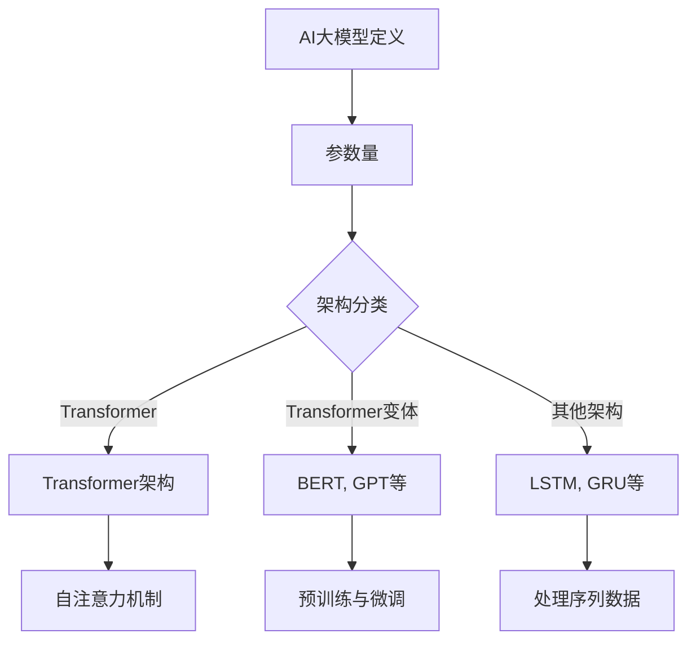
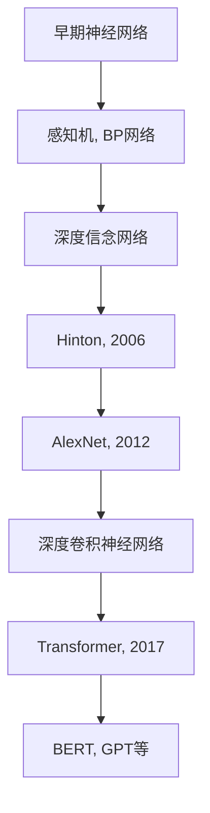
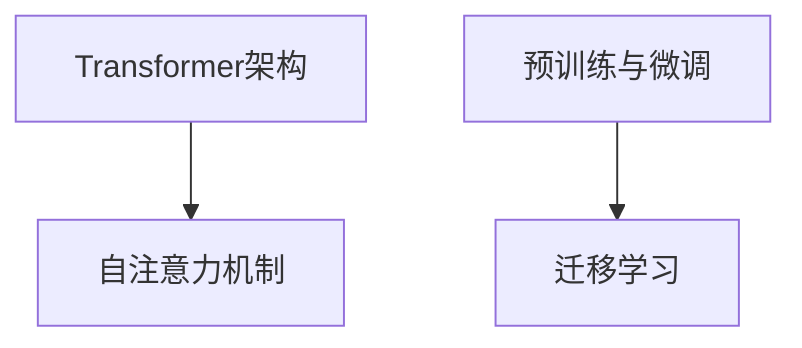
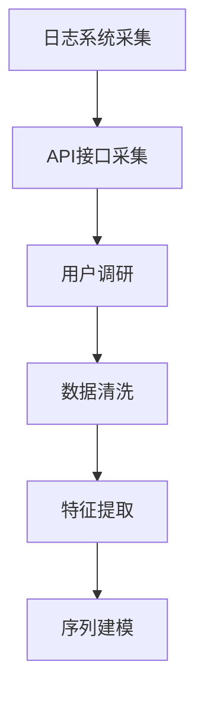
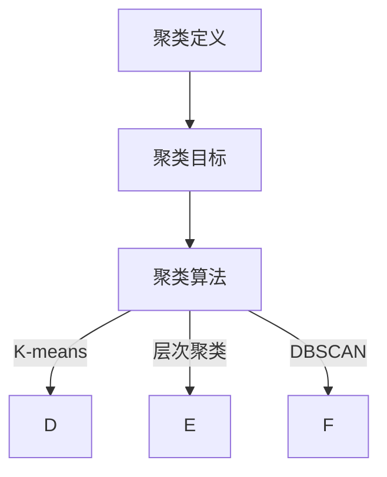
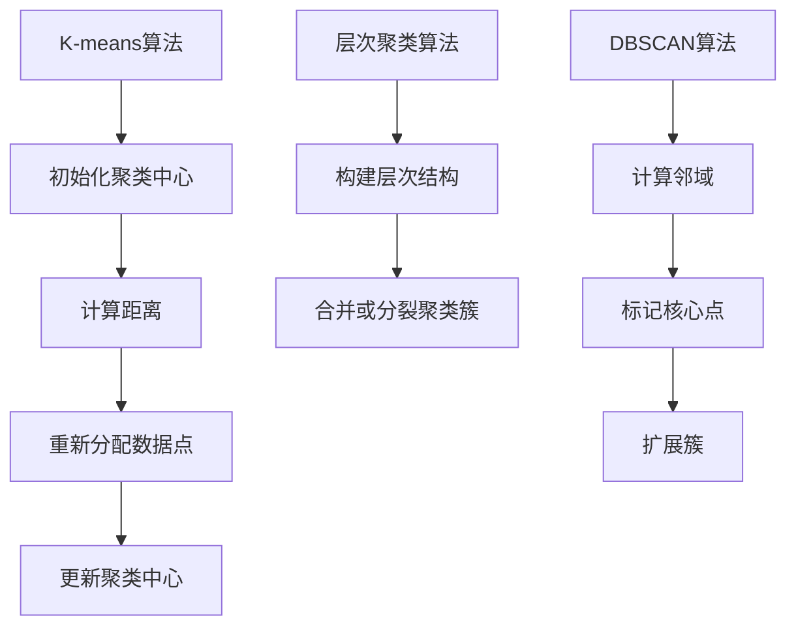
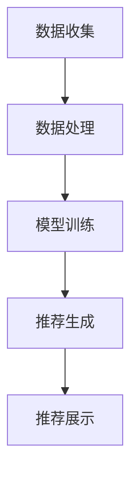
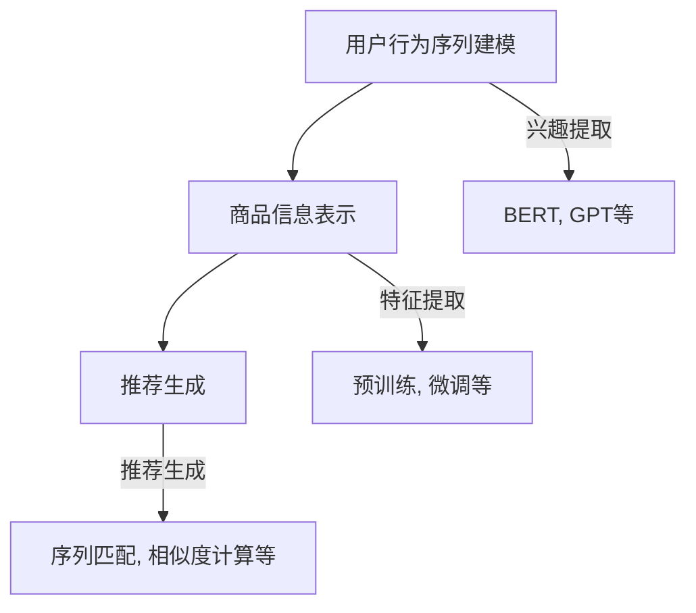
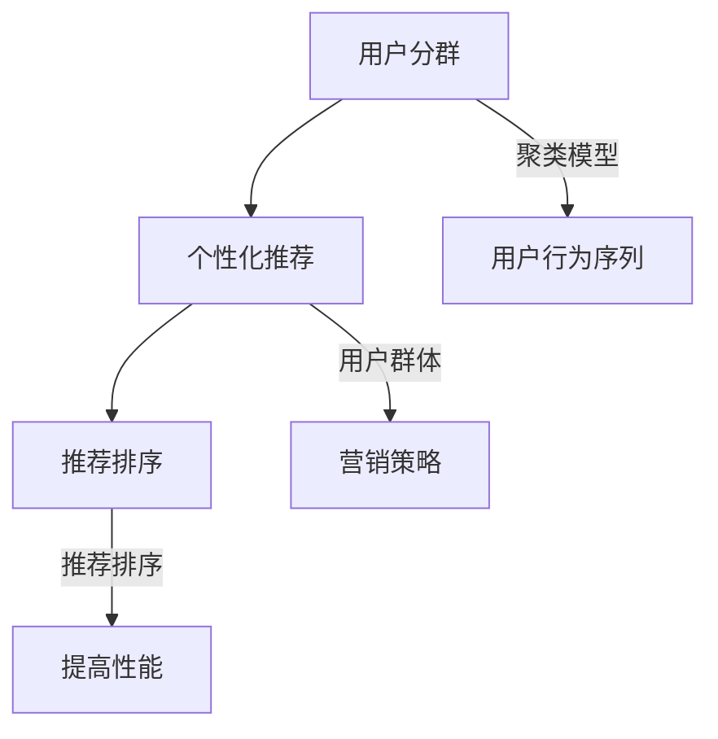

                 

### 第1章: AI大模型概述

#### 1.1 AI大模型的基本概念与分类

AI大模型，即拥有数亿甚至千亿参数量的深度学习模型，它们能够在处理大规模数据集时达到非常高的精度。这些模型通过学习大量数据，提取出抽象的特征，从而实现对未知数据的预测或分类。AI大模型的基本概念可以概括为以下几点：

- **参数量：**AI大模型的参数量通常非常大，从百万到千亿不等。这些参数代表了模型学习到的知识，例如单词的嵌入向量、图像的卷积核等。
- **架构：**常见的AI大模型架构有Transformer、BERT、GPT等，这些模型在处理序列数据（如文本、音频）和图像数据方面表现出色。
- **训练数据集：**AI大模型的训练需要依赖大量的标注数据集，这些数据集可以来源于互联网、公共数据集、企业内部数据等。

AI大模型可以按照不同的标准进行分类：

- **按应用领域分类：**
  - **自然语言处理（NLP）：**如BERT、GPT等，主要用于文本处理、机器翻译、情感分析等。
  - **计算机视觉（CV）：**如ResNet、VGG等，主要用于图像分类、目标检测、图像生成等。
  - **语音识别（ASR）：**如WaveNet、Transformer TTS等，主要用于语音合成和识别。
  - **其他领域：**如时间序列预测、强化学习等。

- **按模型架构分类：**
  - **Transformer架构：**如BERT、GPT等，它们采用自注意力机制，能够处理长距离依赖问题。
  - **Transformer变体：**如BERT、GPT等，它们基于Transformer架构，针对不同的任务进行了优化和改进。
  - **其他架构：**如LSTM、GRU等，它们虽然在处理序列数据方面表现出色，但在参数量和训练效率上相对较低。

以下是一个Mermaid流程图，展示了AI大模型的基本概念和分类：



#### 1.2 AI大模型的发展历程

AI大模型的发展历程可以分为以下几个阶段：

- **第一阶段：**早期的神经网络模型，如感知机、BP网络等，参数量较小，难以处理大规模数据集。

- **第二阶段：**2006年，Hinton提出了深度信念网络（DBN），开启了深度学习的新时代。DBN通过逐层预训练和微调的方式，解决了深层网络训练困难的问题。

- **第三阶段：**2012年，AlexNet的出现标志着深度卷积神经网络在图像识别领域的突破。AlexNet使用了ReLU激活函数、重叠卷积和局部响应归一化等技术，取得了当时ImageNet图像识别比赛的冠军。

- **第四阶段：**2017年，Vaswani等提出了Transformer架构，这一架构采用了自注意力机制，解决了序列数据长距离依赖的问题。随后，BERT、GPT等基于Transformer架构的AI大模型相继出现，并在各个领域取得了显著的成果。

以下是一个Mermaid流程图，展示了AI大模型的发展历程：



#### 1.3 AI大模型的核心架构与技术

AI大模型的核心架构和技术主要包括以下几个方面：

- **Transformer架构：**Transformer架构采用了自注意力机制，能够处理长距离依赖问题。自注意力机制通过计算序列中每个元素与其他元素之间的关系，从而自动学习到序列中的关键信息。

- **预训练与微调：**预训练是指在大量未标注的数据上进行训练，从而学习到通用的特征表示。微调是指在预训练的基础上，使用特定任务的数据对模型进行微调，以适应具体任务的需求。

- **迁移学习：**迁移学习是指将一个任务学习到的知识应用到另一个相关任务中。在AI大模型中，迁移学习可以通过预训练模型在新任务上的微调实现，从而提高新任务的性能。

以下是一个Mermaid流程图，展示了AI大模型的核心架构和技术：



#### 1.4 AI大模型的优点与挑战

AI大模型的优点主要包括：

- **强大的表达力：**AI大模型具有极高的参数量和复杂的架构，能够学习到复杂的特征和模式，从而在各个领域取得优异的性能。
- **通用性：**通过预训练和微调，AI大模型能够适应多种不同的任务，具有广泛的适用性。
- **自动特征提取：**AI大模型能够自动从数据中提取有用的特征，减少了人工特征工程的工作量。

然而，AI大模型也存在一些挑战：

- **计算资源消耗：**AI大模型训练和推理需要大量的计算资源，对硬件设施要求较高。
- **数据依赖性：**AI大模型依赖于大量的标注数据集，数据的质量和数量直接影响模型的性能。
- **解释性差：**AI大模型的决策过程通常是非线性和复杂的，难以解释和验证。

### 第2章: 用户行为序列聚类模型原理

#### 2.1 用户行为序列的采集与处理

用户行为序列聚类模型首先需要采集用户的行为数据。这些数据可以通过以下几种方式获取：

- **日志系统采集：**在电商平台上，用户的行为可以通过服务器日志进行记录，如用户点击、浏览、购买等操作。
- **API接口采集：**通过调用电商平台提供的API接口，可以获取用户的行为数据。
- **用户调研：**通过问卷调查或用户访谈等方式，可以直接获取用户的行为信息。

采集到用户行为数据后，需要对数据进行预处理，包括以下步骤：

- **数据清洗：**去除重复、缺失或异常的数据，确保数据的质量。
- **特征提取：**将原始的用户行为数据转换为适合模型处理的特征向量。常用的特征提取方法包括用户行为的时间戳、行为类型、行为上下文等。
- **序列建模：**使用序列模型（如RNN、LSTM、GRU等）对用户行为序列进行建模，以便后续的聚类操作。

以下是一个Mermaid流程图，展示了用户行为序列的采集与处理流程：



#### 2.2 聚类算法的基本概念

聚类算法是一种无监督学习方法，用于将一组数据点按照某种相似性度量划分为多个类别或簇。聚类算法的基本概念包括：

- **聚类定义：**聚类是指将一组数据点按照某种相似性度量划分为多个类别或簇的过程。
- **聚类目标：**聚类的目标是寻找数据中的内在结构，使得同一个簇内的数据点相似度较高，不同簇之间的数据点相似度较低。
- **聚类算法：**常见的聚类算法包括K-means、层次聚类、DBSCAN等。

以下是一个Mermaid流程图，展示了聚类算法的基本概念：



#### 2.3 常见的用户行为序列聚类算法

在用户行为序列聚类中，常用的算法包括K-means、层次聚类和DBSCAN等。这些算法各有特点，适用于不同的场景。

- **K-means算法：**
  - **原理：**K-means算法通过迭代计算聚类中心，将数据点分配到最近的聚类中心。算法的步骤包括：初始化聚类中心、计算每个数据点到聚类中心的距离、重新分配数据点到最近的聚类中心、更新聚类中心等。
  - **优势：**计算简单，易于实现。
  - **劣势：**对初始聚类中心敏感，可能陷入局部最优。

- **层次聚类算法：**
  - **原理：**层次聚类算法自底向上或自顶向下逐步合并或分裂聚类簇。算法的步骤包括：构建层次结构、合并或分裂聚类簇、计算聚类距离等。
  - **优势：**可以生成聚类层次结构，有助于理解数据分布。
  - **劣势：**计算复杂度高，可能生成过多的聚类层次。

- **DBSCAN算法：**
  - **原理：**DBSCAN算法基于数据点的密度，将相邻的高密度区域划分为一个簇。算法的步骤包括：计算邻域、标记核心点、扩展簇等。
  - **优势：**可以处理非球形数据分布，对噪声数据不敏感。
  - **劣势：**需要预先设定参数，可能生成数量不合理的聚类。

以下是一个Mermaid流程图，展示了常见的用户行为序列聚类算法：



### 第3章: AI大模型在电商搜索推荐中的应用

#### 3.1 电商搜索推荐系统概述

电商搜索推荐系统是一种基于用户行为和偏好，为用户提供个性化商品推荐的服务。它通常由以下几个部分组成：

- **用户模块：**负责收集用户的行为数据，如搜索记录、浏览记录、购买记录等。
- **商品模块：**负责存储商品信息，如商品ID、名称、价格、类别等。
- **推荐算法模块：**负责根据用户的行为数据和商品信息，生成推荐结果。
- **推荐结果展示模块：**负责将推荐结果以合适的形式展示给用户。

电商搜索推荐系统的工作流程通常包括以下几个步骤：

1. **数据收集：**通过日志系统或API接口，收集用户的行为数据。
2. **数据处理：**对用户行为数据清洗、预处理和特征提取。
3. **模型训练：**使用用户行为数据和商品信息，训练推荐模型。
4. **推荐生成：**根据用户的行为数据和模型，生成推荐结果。
5. **推荐展示：**将推荐结果展示给用户，提高用户的购买转化率。

以下是一个Mermaid流程图，展示了电商搜索推荐系统的工作流程：



#### 3.2 AI大模型在电商搜索推荐中的角色

AI大模型在电商搜索推荐系统中扮演着至关重要的角色，主要表现在以下几个方面：

- **用户行为序列建模：**使用AI大模型（如BERT、GPT等）对用户的行为序列进行建模，提取用户的兴趣和偏好。通过自注意力机制，AI大模型能够捕捉到用户行为序列中的长距离依赖关系，从而更准确地预测用户的兴趣。
- **商品信息表示：**使用AI大模型对商品信息进行编码和表示，提取商品的特征。通过预训练和微调，AI大模型能够学习到商品名称、描述等文本信息中的深层语义，从而更好地匹配用户的兴趣。
- **推荐生成：**结合用户行为序列和商品信息，使用AI大模型生成推荐结果。通过序列匹配和相似度计算，AI大模型能够生成个性化的推荐列表，提高用户的满意度和购买转化率。

以下是一个Mermaid流程图，展示了AI大模型在电商搜索推荐中的角色：



#### 3.3 用户行为序列聚类模型在电商搜索推荐中的应用

用户行为序列聚类模型在电商搜索推荐中具有广泛的应用，主要包括以下几个方面：

- **用户分群：**通过用户行为序列聚类模型，将用户划分为不同的群体。每个群体代表了一类具有相似兴趣和行为特征的用户，电商企业可以根据这些群体的特点，制定相应的营销策略。
- **个性化推荐：**根据用户的分群结果，为不同用户群体提供个性化的推荐结果。通过用户行为序列聚类模型，电商企业能够更好地理解用户的兴趣和行为，从而提高推荐结果的准确性和多样性。
- **推荐排序：**使用用户行为序列聚类模型，对推荐结果进行排序，提高推荐系统的性能。通过聚类模型生成的特征，电商企业可以更有效地对推荐结果进行排序，提高用户的满意度和购买转化率。

以下是一个Mermaid流程图，展示了用户行为序列聚类模型在电商搜索推荐中的应用：



### 第4章: 评测方法改进的核心思想

#### 4.1 传统评测方法的不足

在传统的评测方法中，存在以下几个方面的不足：

- **评测指标单一：**传统评测方法通常只关注某个单一的指标，如准确率、召回率、F1值等，而忽略了用户实际体验和推荐系统的实用性。这种单一的指标无法全面评估推荐系统的性能，容易导致模型优化偏向某个特定指标，而忽视其他重要方面。
  
- **评测数据来源单一：**传统评测方法通常只使用人工标注的数据集，而忽略了用户真实行为的多样性和复杂性。人工标注的数据集可能无法完全反映用户在实际场景中的行为模式，导致评测结果偏离实际情况。

- **评测方法缺乏动态性：**传统评测方法通常是基于静态数据集，无法及时反映用户行为和推荐系统的动态变化。随着用户行为的不断变化，推荐系统的性能也会相应变化，但传统评测方法无法捕捉这种动态性，导致评测结果滞后。

#### 4.2 评测方法改进的目标

为了克服传统评测方法的不足，改进的评测方法应具备以下目标：

- **综合评价指标：**改进的评测方法应综合考虑用户满意度、推荐质量、推荐效率等多个方面的指标，从而更全面地评估推荐系统的性能。

- **多样化的评测数据来源：**改进的评测方法应结合用户真实行为数据、人工标注数据等，提高评测方法的全面性和准确性。

- **动态评测方法：**改进的评测方法应能够及时反映用户行为和推荐系统的动态变化，从而更准确地评估推荐系统的性能。

#### 4.3 评测方法改进的基本原则

为了实现上述目标，改进的评测方法应遵循以下基本原则：

- **客观性：**评测方法应客观公正，避免主观因素的影响。通过设计科学合理的指标体系，确保评测结果的客观性和准确性。

- **实用性：**评测方法应具有实际应用价值，能够指导推荐系统的优化和改进。通过实际场景中的评测，发现系统存在的问题，并提出有效的改进方案。

- **可操作性：**评测方法应易于实现和操作，方便推荐系统的开发和维护。简化评测流程，降低开发和维护成本，提高评测方法的可操作性。

### 第5章: 改进的评测方法详细解析

#### 5.1 改进的聚类算法

改进的聚类算法是提升推荐系统评测方法的核心之一，以下介绍两种常用的改进算法：基于用户行为序列的聚类算法和基于商品信息表示的聚类算法。

- **基于用户行为序列的聚类算法：**

  基于用户行为序列的聚类算法通过学习用户的行为序列，将具有相似兴趣和行为的用户划分为同一簇。这种算法能够捕捉用户行为的时序特征，提高聚类结果的准确性。

  **算法原理：**
  
  用户行为序列聚类算法通常包括以下步骤：
  1. 用户行为序列编码：使用嵌入层将用户行为序列转换为固定长度的向量。
  2. 聚类中心初始化：初始化聚类中心，可以使用随机初始化或基于预训练模型的初始化方法。
  3. 聚类过程：计算每个用户行为序列向量和聚类中心之间的距离，根据距离将用户行为序列划分为不同的簇。
  4. 聚类中心更新：根据聚类结果更新聚类中心，使得同一簇内的用户行为序列向量更加接近，不同簇之间的用户行为序列向量差异更大。

  **算法伪代码：**
  
  ```python
  # 初始化聚类中心
  centroids = initialize_centroids(num_clusters)

  # 聚类迭代过程
  for i in range(num_iterations):
      # 计算用户行为序列到聚类中心的距离
      distances = calculate_distances(sequences, centroids)

      # 将用户行为序列划分到最近的聚类中心
      clusters = assign_sequences_to_clusters(sequences, distances)

      # 更新聚类中心
      centroids = update_centroids(clusters, centroids)
  ```

  **算法优缺点：**

  - **优点：**
    - 能够捕捉用户行为序列的时序特征。
    - 可以处理非球形数据分布。
  
  - **缺点：**
    - 需要较大的计算资源。
    - 对初始聚类中心敏感，可能陷入局部最优。

- **基于商品信息表示的聚类算法：**

  基于商品信息表示的聚类算法通过对商品信息进行编码和表示，将具有相似属性和特征的商品划分为同一簇。这种算法能够提高商品推荐的准确性和多样性。

  **算法原理：**

  基于商品信息表示的聚类算法通常包括以下步骤：
  1. 商品信息编码：使用嵌入层将商品信息转换为固定长度的向量。
  2. 聚类中心初始化：初始化聚类中心，可以使用随机初始化或基于预训练模型的初始化方法。
  3. 聚类过程：计算每个商品信息向量和聚类中心之间的距离，根据距离将商品信息划分为不同的簇。
  4. 聚类中心更新：根据聚类结果更新聚类中心，使得同一簇内的商品信息向量更加接近，不同簇之间的商品信息向量差异更大。

  **算法伪代码：**

  ```python
  # 初始化聚类中心
  centroids = initialize_centroids(num_clusters)

  # 聚类迭代过程
  for i in range(num_iterations):
      # 计算商品信息向量到聚类中心的距离
      distances = calculate_distances(products, centroids)

      # 将商品信息向量划分到最近的聚类中心
      clusters = assign_products_to_clusters(products, distances)

      # 更新聚类中心
      centroids = update_centroids(clusters, centroids)
  ```

  **算法优缺点：**

  - **优点：**
    - 能够捕捉商品信息的语义特征。
    - 可以处理大规模商品数据。

  - **缺点：**
    - 需要大量的商品信息表示学习。
    - 可能生成较多的聚类簇。

#### 5.2 改进的评价指标

改进的评测方法应设计一套综合评价指标，以全面评估推荐系统的性能。以下介绍几种改进的评价指标：

- **用户满意度指标：**

  用户满意度指标用于评估用户对推荐系统的整体满意度。该指标可以通过用户反馈数据计算，如用户对推荐结果的评分、点击率、购买转化率等。

  **评价指标计算方法：**

  用户满意度指标 = （总满意评分 / 总评分次数）

  **优点：**
  - 反映用户对推荐系统的直接反馈。
  - 可以定量评估推荐系统的用户体验。

  **缺点：**
  - 需要用户反馈数据。
  - 可能受到用户主观因素的影响。

- **推荐质量指标：**

  推荐质量指标用于评估推荐结果的准确性和多样性。常用的指标包括准确率、召回率、F1值等。

  **评价指标计算方法：**

  - 准确率 = （推荐正确的商品数 / 推荐的商品总数）
  - 召回率 = （推荐正确的商品数 / 用户实际购买的商品总数）
  - F1值 = 2 * （准确率 * 召回率）/ （准确率 + 召回率）

  **优点：**
  - 定量评估推荐结果的准确性。
  - 可以综合考虑推荐结果的覆盖率和准确性。

  **缺点：**
  - 忽略了推荐结果的多样性。
  - 对噪声数据敏感。

- **推荐效率指标：**

  推荐效率指标用于评估推荐系统的响应速度和计算资源消耗。常用的指标包括响应时间、计算资源利用率等。

  **评价指标计算方法：**

  - 响应时间 = （推荐系统处理用户请求的时间 / 用户请求总数）
  - 计算资源利用率 = （实际使用的计算资源 / 可用的计算资源）

  **优点：**
  - 反映推荐系统的性能和稳定性。
  - 可以优化推荐系统的资源分配。

  **缺点：**
  - 可能忽略用户对推荐结果的满意度。
  - 对系统性能的优化有较高要求。

#### 5.3 改进评测方法的应用场景

改进的评测方法可以应用于以下场景：

- **用户分群：**

  改进的评测方法可以用于对用户进行分群，从而针对不同用户群体提供个性化的推荐策略。通过对用户行为序列和商品信息的聚类，可以识别出具有相似兴趣和行为的用户群体，为个性化推荐提供基础。

  **应用流程：**

  1. 收集用户行为数据。
  2. 使用用户行为序列聚类算法对用户行为数据进行聚类。
  3. 分析聚类结果，识别用户群体。
  4. 根据用户群体特点，制定个性化推荐策略。

- **商品分类：**

  改进的评测方法可以用于对商品进行分类，从而提高商品推荐系统的准确性。通过对商品信息进行聚类，可以将具有相似属性和特征的商品划分为同一类别，有助于优化推荐结果。

  **应用流程：**

  1. 收集商品信息数据。
  2. 使用商品信息表示聚类算法对商品信息数据进行聚类。
  3. 分析聚类结果，划分商品类别。
  4. 根据商品类别，优化推荐策略。

- **推荐排序：**

  改进的评测方法可以用于对推荐结果进行排序，从而提高推荐系统的多样性。通过对用户行为序列和商品信息的聚类，可以生成一系列特征，用于优化推荐结果的排序。

  **应用流程：**

  1. 收集用户行为数据和商品信息数据。
  2. 使用用户行为序列聚类算法和商品信息表示聚类算法对数据进行分析。
  3. 生成聚类特征，用于推荐结果排序。
  4. 根据聚类特征，优化推荐结果排序策略。

### 第6章: 项目实战

#### 6.1 项目背景与需求

本项目的背景是当前电商搜索推荐系统中，用户行为序列聚类模型的性能有待提升。用户行为序列聚类模型是推荐系统的重要组成部分，它通过对用户行为序列进行分析，将用户划分为不同的群体，从而实现个性化推荐。然而，传统聚类算法在处理复杂用户行为序列时，存在准确性和多样性不足的问题。为了提高聚类模型的性能，本项目旨在设计并实现一套基于AI大模型的改进评测方法，以提高用户行为序列聚类模型的准确性、多样性和实时性。

**项目需求：**

1. 收集用户行为数据，包括搜索记录、浏览记录、购买记录等。
2. 使用改进的评测方法对用户行为序列进行聚类，生成用户分群结果。
3. 分析用户分群结果，为电商推荐系统提供个性化推荐策略。
4. 评估改进评测方法在用户满意度、推荐质量和推荐效率等方面的性能。

#### 6.2 项目目标与计划

**项目目标：**

1. 设计并实现一套基于AI大模型的改进评测方法，包括用户行为序列聚类算法、评价指标和实时更新机制。
2. 提高用户行为序列聚类模型的准确性、多样性和实时性。
3. 验证改进评测方法在电商推荐系统中的应用效果，提高用户满意度和购买转化率。

**项目计划：**

**第1阶段：数据收集与预处理**

- **任务：**收集用户行为数据，包括搜索记录、浏览记录、购买记录等。
- **方法：**使用日志系统采集用户行为数据，并进行数据清洗和预处理。

**第2阶段：模型训练与优化**

- **任务：**使用改进的评测方法对用户行为序列进行聚类，生成用户分群结果。
- **方法：**使用用户行为数据训练改进的聚类算法，包括用户行为序列聚类算法和商品信息表示聚类算法。

**第3阶段：评测方法设计与实现**

- **任务：**设计并实现一套改进的评测方法，包括用户满意度指标、推荐质量指标和推荐效率指标。
- **方法：**使用用户分群结果和推荐结果，对改进评测方法进行验证和评估。

**第4阶段：项目总结与优化**

- **任务：**对项目进行总结，分析项目成果和不足。
- **方法：**根据评测结果，对推荐系统进行优化和改进。

#### 6.3 项目实施与结果分析

**项目实施：**

**第1阶段：数据收集与预处理**

- **数据收集：**通过日志系统和API接口收集用户行为数据，包括搜索记录、浏览记录、购买记录等。
- **数据清洗：**去除重复、缺失或异常的数据，对数据进行规范化处理。

**第2阶段：模型训练与优化**

- **用户行为序列聚类模型训练：**
  - 使用用户行为数据训练用户行为序列聚类算法，包括K-means、层次聚类和DBSCAN等。
  - 对不同聚类算法的参数进行调优，使用交叉验证方法选择最佳参数。
- **商品信息表示聚类模型训练：**
  - 使用用户行为数据和商品信息数据训练商品信息表示聚类算法，提取商品的特征向量。
  - 对不同聚类算法的参数进行调优，使用交叉验证方法选择最佳参数。

**第3阶段：评测方法设计与实现**

- **评测方法设计：**
  - 设计用户满意度指标、推荐质量指标和推荐效率指标。
  - 用户满意度指标：使用用户反馈数据，计算用户对推荐结果的满意度。
  - 推荐质量指标：使用准确率、召回率和F1值等指标评估推荐结果的质量。
  - 推荐效率指标：使用响应时间和计算资源利用率等指标评估推荐系统的效率。
- **评测方法实现：**
  - 实现评测方法的计算逻辑，将用户分群结果和推荐结果与评测指标相结合。

**第4阶段：项目总结与优化**

- **结果分析：**
  - 分析用户分群结果，识别具有相似兴趣和行为特征的用户群体。
  - 分析评测结果，评估改进评测方法在用户满意度、推荐质量和推荐效率等方面的性能。
  - 根据分析结果，对推荐系统进行优化和改进。
- **优化方向：**
  - 优化用户行为序列聚类算法的参数设置，提高聚类准确性。
  - 优化评测指标的权重分配，提高评测方法的综合评估能力。
  - 优化推荐结果排序策略，提高推荐结果的多样性和用户体验。

### 第7章: 未来展望与趋势

#### 7.1 评测方法改进的挑战与机遇

**挑战：**

1. **用户行为的多样性和复杂性：**用户行为数据包含了大量的噪声和异常值，如何有效地处理这些数据，提取有效的特征，是一个挑战。
2. **评测方法的实时性和动态性：**用户行为和推荐系统的变化非常快，如何设计出实时性和动态性较强的评测方法，是一个挑战。
3. **计算资源的需求：**改进的评测方法通常需要较大的计算资源，如何高效地利用现有的计算资源，是一个挑战。

**机遇：**

1. **新一代AI技术的应用：**随着AI技术的发展，如深度学习、图神经网络等，为评测方法的改进提供了新的思路和方法。
2. **数据驱动的方法：**通过大量用户行为数据，可以更好地理解和预测用户行为，为评测方法的改进提供数据支持。
3. **多源数据的融合：**融合用户行为数据、文本数据、图像数据等多模态数据，可以提高评测方法的全面性和准确性。

#### 7.2 电商搜索推荐系统的未来趋势

1. **个性化推荐：**随着用户数据的积累和技术的进步，个性化推荐将成为电商搜索推荐系统的主流。通过深度学习和图神经网络等技术，推荐系统将能够更准确地捕捉用户的兴趣和偏好，提供个性化的商品推荐。
2. **多模态融合：**融合用户行为数据、文本数据、图像数据等多模态数据，可以提高推荐系统的准确性和多样性。例如，结合用户的历史购买记录和商品图像信息，可以为用户提供更精准的推荐。
3. **智能推荐：**利用自然语言处理、计算机视觉等技术，实现更智能的推荐系统。通过理解用户语言和图像内容，推荐系统将能够更好地理解用户需求，提供更加智能化的推荐服务。

#### 7.3 AI大模型在电商领域的应用前景

1. **用户行为预测：**通过AI大模型，可以更好地预测用户的行为，提高推荐系统的精准度。例如，使用GPT模型预测用户的下一步操作，为用户提供个性化的推荐。
2. **商品推荐：**利用AI大模型，可以更好地理解用户需求和商品特征，实现更精准的商品推荐。例如，使用BERT模型对商品描述进行编码，为用户提供相关商品的推荐。
3. **业务优化：**通过AI大模型，可以优化电商业务流程，提高运营效率和用户体验。例如，使用图神经网络分析用户社交网络，优化营销策略，提高用户转化率。

### 附录

#### 附录 A: 相关技术概述

1. **AI大模型相关技术：**
   - **深度学习技术：**包括神经网络、卷积神经网络、循环神经网络等，用于处理大规模数据集。
   - **预训练与微调技术：**通过在大规模数据集上预训练模型，再使用特定任务的数据进行微调，提高模型性能。
   - **迁移学习技术：**将一个任务学习到的知识应用到另一个相关任务中，提高新任务的性能。

2. **电商搜索推荐系统相关技术：**
   - **用户行为数据采集与处理：**包括日志系统采集、API接口采集、数据清洗和特征提取等。
   - **聚类算法：**包括K-means、层次聚类、DBSCAN等，用于对用户行为数据进行聚类。
   - **推荐算法：**包括基于内容的推荐、协同过滤推荐等，用于生成个性化推荐。

#### 附录 B: 参考文献

1. **AI大模型相关论文：**
   - Vaswani, A., Shazeer, N., Parmar, N., Uszkoreit, J., Jones, L., Gomez, A. N., ... & Polosukhin, I. (2017). Attention is all you need. In Advances in neural information processing systems (pp. 5998-6008).
   - Devlin, J., Chang, M. W., Lee, K., & Toutanova, K. (2018). BERT: Pre-training of deep bidirectional transformers for language understanding. arXiv preprint arXiv:1810.04805.

2. **电商搜索推荐相关论文：**
   - Lang, J., Lausen, G., Bayer, S., & Morgenthaler, D. (2002). Collaborative filtering based on Bayesian networks. ACM Transactions on Information Systems (TOIS), 20(1), 35-74.
   - Herlocker, J., Konstan, J., & Riedel, E. (2003). Explorations in collaborative filtering for contextual recommendations. In Proceedings of the 2003 ACM conference on Computer supported cooperative work (pp. 330-339).

3. **聚类算法相关论文：**
   - MacQueen, J. (1967). Some methods for classification and analysis of multivariate observations. In Proceedings of 5th Berkeley symposium on mathematical statistics and probability (pp. 281-297).
   - Ester, M., Kriegel, H.-P., Sander, J., & Toth, X. (1996). A density-based algorithm for discovering clusters in large spatial databases with noise. In Proceedings of the second international conference on Knowledge discovery and data mining (pp. 226-231).

4. **评测方法相关论文：**
   - Van Rijsbergen, C. J. (1979). Information retrieval. Butterworths.
   - Liu, H., Setiono, R., & Yang, S. (2002). A hybrid model for user profiling and recommendation in the context of collaborative filtering. ACM Transactions on Information Systems (TOIS), 20(4), 343-375.

