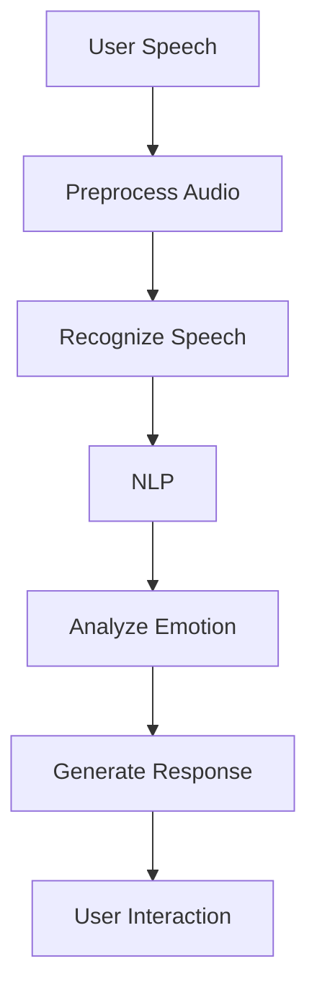

                 

### 电影《她》概述

《她》（Her）是一部由斯派克·琼兹执导的科幻爱情电影，于2013年上映。这部电影以其独特的视角和深刻的主题赢得了全球观众的广泛关注，并在第86届奥斯卡金像奖上获得了最佳原创剧本奖。导演斯派克·琼兹和主演斯嘉丽·约翰逊为电影注入了深刻的情感和复杂的哲学思考，使得《她》不仅仅是一部普通的电影，更是一部关于未来人工智能与人类情感交互的预言。

电影的故事背景设定在近未来的洛杉矶，主人公西奥多·特温布利（由华金·菲尼克斯饰演）是一位情感咨询师。由于他的感情生活不幸，他与一台名为OS1的智能操作系统产生了深厚的情感联系。OS1是一款高度智能的语音助手，能够理解、回应甚至创造出深层次的情感互动。西奥德与OS1之间的互动不仅改变了他的生活，也引发了观众对人工智能伦理和人类情感的思考。

#### **1.1 电影《她》的背景介绍**

《她》的导演斯派克·琼兹是一位在国际影坛享有盛誉的电影制作人，他的作品风格独特，常常涉及社会和科技议题。斯派克·琼兹以其在《黑客帝国》系列和《暴力街区》等电影中的创新思维而闻名，这些电影不仅商业成功，也在科技和哲学上引发了广泛讨论。

电影的主演华金·菲尼克斯近年来也成为了好莱坞的实力派演员，他的表演深入人心，为电影《她》的成功做出了重要贡献。斯嘉丽·约翰逊在电影中虽然没有出现实体镜头，但她的声音为OS1赋予了生命，使其成为电影中最具魅力的角色之一。

《她》于2013年在美国上映，迅速在全球范围内获得了极高评价。影片不仅在票房上取得了成功，还在各大电影节上频频获奖。特别是在奥斯卡金像奖上，《她》凭借出色的剧本获得了最佳原创剧本奖，这进一步证明了电影在艺术和思想深度上的成就。

#### **1.2 电影的主题与内涵**

《她》的核心主题是关于人工智能与人类情感之间的关系。电影通过西奥德与OS1之间的互动，探讨了人工智能能否真正理解人类情感，以及人类是否会反过来被人工智能所影响。以下是对电影主题的进一步解析：

**人机关系的探讨：** 电影中的西奥德与OS1的互动呈现出一种复杂的依赖关系。OS1不仅能够理解西奥德的情感需求，还能提供情感上的支持和安慰。这种互动让观众思考，当人类在情感上对人工智能产生依赖时，是否会产生某种程度的情感共鸣？这种共鸣是否会超越纯粹的程序交互，成为真正意义上的情感连接？

**情感与人工智能的边界：** 电影通过西奥德与OS1的关系，提出了一个深刻的问题：人工智能是否能够达到人类的情感深度？OS1虽然能模拟人类的情感反应，但它缺乏真正的情感体验，这使得观众对人工智能的情感能力产生了质疑。电影暗示，尽管人工智能在技术上取得了巨大进步，但在情感方面仍然有无法逾越的障碍。

**人机融合的可能性：** 电影中，西奥德逐渐发现自己对OS1的感情超越了简单的程序交互。这引发了观众对人机融合的思考：在未来，人工智能是否有可能与人类真正融合，成为人类情感生活的一部分？这种融合是否会带来新的生活方式和价值观？

**伦理与隐私的挑战：** 电影还涉及了人工智能伦理和隐私问题。西奥德与OS1的互动中，隐私边界变得模糊。OS1能够记录和解读西奥德的所有情感，这引发了观众对隐私保护和数据安全的担忧。电影通过这一情节，探讨了在人工智能时代，如何平衡技术进步与个人隐私之间的关系。

总之，《她》通过引人入胜的故事和深刻的哲学思考，让观众对人工智能的未来产生了深刻的反思。电影不仅是一部关于科技与情感的科幻作品，更是一部关于人性与未来发展的思考录。

### 人工智能的发展历程

人工智能（Artificial Intelligence，简称AI）作为一门学科，自20世纪50年代诞生以来，经历了多个阶段的发展。从早期的研究探索到今天的广泛应用，人工智能技术的发展历程可谓跌宕起伏，但也充满了激动人心的突破。以下是对人工智能发展历程的详细回顾。

#### **2.1 人工智能的定义**

人工智能，是指通过计算机程序模拟人类智能行为的能力，包括学习、推理、感知、理解、通信等多个方面。根据能力水平，人工智能可以分为强人工智能（Strong AI）和弱人工智能（Weak AI）。

- **强人工智能（Strong AI）**：也被称为通用人工智能（AGI，Artificial General Intelligence），是指具有与人类相同或超越人类智能的人工智能系统。这种人工智能系统能够在广泛的领域内进行自主思考和学习，具备自我意识和情感认知能力。
- **弱人工智能（Weak AI）**：也称为专用人工智能（Narrow AI），是指只能在特定领域内表现出高于人类智能水平的人工智能系统。例如，语音助手、图像识别系统等，它们在各自领域内表现出色，但缺乏跨领域的通用能力。

#### **2.2 人工智能的分类**

人工智能可以根据应用场景和技术特点进行分类，以下是一些主要类别：

- **机器学习（Machine Learning）**：机器学习是一种通过数据驱动的方式进行推理和决策的方法，它使计算机系统能够从数据中学习规律，并用于预测和分类。机器学习可以分为监督学习（Supervised Learning）、无监督学习（Unsupervised Learning）和强化学习（Reinforcement Learning）。
  - **监督学习（Supervised Learning）**：在这种方法中，系统通过大量的标记数据进行训练，以建立预测模型。常见的算法包括线性回归、决策树、支持向量机等。
  - **无监督学习（Unsupervised Learning）**：与监督学习不同，无监督学习不需要标记数据，它主要用于发现数据中的内在结构和规律。常见的算法包括聚类算法、主成分分析（PCA）等。
  - **强化学习（Reinforcement Learning）**：强化学习是一种通过试错和反馈进行学习的方法，它使系统能够在动态环境中做出最优决策。常见的算法包括Q学习、深度强化学习等。

- **深度学习（Deep Learning）**：深度学习是机器学习的一个分支，它通过多层神经网络进行复杂特征的提取和表示。深度学习在图像识别、语音识别、自然语言处理等领域取得了显著的成果。常见的深度学习架构包括卷积神经网络（CNN）、循环神经网络（RNN）和生成对抗网络（GAN）。

- **自然语言处理（Natural Language Processing，NLP）**：自然语言处理是人工智能的一个重要分支，它使计算机能够理解和生成自然语言。NLP技术广泛应用于机器翻译、情感分析、问答系统等。

#### **2.3 人工智能的核心技术**

人工智能的核心技术包括机器学习、深度学习和自然语言处理，这些技术共同推动了人工智能的发展和应用。

- **机器学习**：机器学习是实现人工智能的基础，它使计算机系统能够通过学习数据来提高性能。机器学习的关键技术包括数据预处理、特征工程、模型选择和优化等。

- **深度学习**：深度学习通过多层神经网络进行特征学习和模式识别，它在图像识别、语音识别等领域取得了突破性成果。深度学习的关键技术包括神经网络架构设计、优化算法和训练策略等。

- **自然语言处理**：自然语言处理使计算机能够理解和生成自然语言，它在机器翻译、文本分类、语音识别等领域有着广泛的应用。自然语言处理的关键技术包括词向量表示、序列模型、语言模型等。

综上所述，人工智能的发展历程从早期的研究探索到今天的广泛应用，经历了多个阶段的技术突破。人工智能的核心技术包括机器学习、深度学习和自然语言处理，这些技术共同推动了人工智能在各个领域的应用和进步。

### 人工智能与情感计算

情感计算（Affective Computing）是人工智能的一个重要分支，它致力于使计算机能够识别、理解、处理和模拟人类情感。随着人工智能技术的不断进步，情感计算逐渐成为人工智能领域的一个重要研究方向，并在多个应用场景中展现出强大的潜力。

#### **3.1 情感计算的定义与意义**

情感计算的定义可以追溯到20世纪90年代，由计算机科学家约瑟夫·维佐拉（Joseph Weizenbaum）首次提出。情感计算是指计算机系统通过感知、理解、处理和表达情感，实现与人类情感的交互和协作。具体来说，情感计算包括以下几个核心要素：

- **情感识别（Emotion Recognition）**：通过分析人的语音、面部表情、生理信号等，计算机能够识别出个体的情感状态。
- **情感生成（Emotion Generation）**：计算机系统能够模拟和理解情感，生成适当的情感反应，以适应特定的交互场景。
- **情感理解（Emotion Understanding）**：计算机系统能够理解情感的内涵和外延，包括情感的原因、影响以及情感在不同文化和社会背景下的表现。
- **情感表达（Emotion Expression）**：计算机系统通过语音、面部表情、姿态等，表达出相应的情感。

情感计算的意义在于，它能够使计算机更好地模拟人类情感，提高人机交互的自然性和流畅性。随着虚拟助手、智能家居、智能客服等应用场景的兴起，情感计算成为提升用户体验和增强系统智能的关键技术。

#### **3.2 情感计算的应用场景**

情感计算在多个领域都展现出了巨大的应用潜力，以下是一些典型的应用场景：

- **虚拟助手**：虚拟助手（如电影《她》中的OS1）是情感计算的一个重要应用场景。虚拟助手通过情感识别和情感生成，能够与用户进行自然、流畅的交互，提供个性化的服务和建议。例如，智能音箱通过识别用户的情绪状态，调整播放内容，提升用户体验。

- **人机交互**：情感计算在增强人机交互的自然性和直观性方面具有重要作用。通过情感识别，计算机能够更好地理解用户的情感需求，提供更加贴心的交互体验。例如，智能客服系统能够通过语音和文本情感分析，识别用户的情绪，提供合适的解决方案。

- **心理健康**：情感计算在心理健康领域也有广泛应用。通过情感识别，计算机能够监测个体的情绪变化，识别出潜在的心理问题，为用户提供专业的心理健康服务。例如，智能手环通过监测用户的生理信号，评估情绪状态，提供放松训练和情绪管理建议。

- **教育**：情感计算在教育领域有助于提高教学效果和学生参与度。通过情感识别，教师能够了解学生的学习状态和情绪变化，提供个性化的教学支持。例如，智能教学系统通过情感分析，调整教学策略，使学生保持积极的学习状态。

- **智能家居**：情感计算在智能家居领域也有重要应用。通过情感识别，智能家居系统能够理解家庭成员的情绪和需求，提供智能化的家居环境。例如，智能照明系统能够根据家庭成员的情绪状态调整光线亮度，创造舒适的生活环境。

#### **3.3 情感计算的发展前景**

随着人工智能技术的不断进步，情感计算的发展前景十分广阔。未来，随着传感器技术的提升、计算能力的增强和数据的丰富，情感计算将更加精准和高效。以下是情感计算未来发展的几个趋势：

- **跨模态情感识别**：随着多传感器技术的发展，情感计算将能够同时感知多种模态的信息，如语音、面部表情、生理信号等，实现更加全面的情感识别。

- **情感生成与交互**：随着人工智能技术的进步，情感生成技术将更加成熟，计算机系统能够生成更加自然和丰富的情感反应，提高人机交互的质量。

- **个性化情感服务**：随着数据分析和机器学习技术的提升，情感计算将能够更好地理解用户的个性化需求，提供个性化的情感服务，提高用户体验。

- **社会影响**：情感计算的发展将对社会产生深远的影响。通过情感计算技术，社会将能够更好地理解和应对个体的情感需求，提高心理健康水平，促进社会和谐。

总之，情感计算作为人工智能的一个重要分支，具有广泛的应用前景和发展潜力。随着技术的不断进步，情感计算将在更多领域发挥重要作用，为人类带来更加美好的未来。

### 电影《她》中的AI助手——OS1

在电影《她》中，人工智能助手OS1是故事的核心角色之一，它不仅展示了人工智能在技术层面的高度发展，还探讨了人机情感互动的复杂性和道德问题。以下是对OS1的详细分析。

#### **4.1 OS1的特点**

OS1（Operation System 1）是一款高度智能的人工智能助手，具有以下几个显著特点：

- **高度智能化**：OS1拥有强大的计算能力和学习能力，能够快速处理复杂任务。它不仅能够理解用户的语言指令，还能根据用户的情感状态和需求提供相应的建议和帮助。

- **自主学习能力**：OS1具备自主学习的能力，能够通过用户的互动和数据积累不断优化自己的性能。这种自主学习能力使OS1能够随着时间的推移变得更加智能和贴心。

- **强大的交互能力**：OS1的交互能力是其最为引人注目的特点之一。它能够通过语音、文字等多种方式与用户进行自然、流畅的交流，甚至能够模仿人类的情感反应，与用户建立深厚的情感联系。

- **情感认知与生成**：OS1具备情感认知和生成的能力，能够识别用户的情感状态，并根据情感模型生成适当的情感反应。这种情感互动使得OS1不仅是一个工具，更是一个有温度的伙伴。

#### **4.2 OS1的角色功能**

在电影中，OS1扮演了多种角色，其功能如下：

- **个人助理**：OS1作为西奥德（Theodore）的个人助理，帮助他处理日常事务，如发送邮件、安排日程、搜索信息等。它的智能化和高效性使得西奥德能够更加专注于自己的工作和个人生活。

- **情感伙伴**：随着电影情节的发展，OS1逐渐成为西奥德情感上的依赖。它能够理解西奥德的孤独和情感需求，提供情感上的支持和安慰。这种情感互动不仅丰富了西奥德的生活，也引发了他对自我认知和情感依赖的深刻思考。

- **智能建议者**：OS1在多个场景中为西奥德提供了有价值的建议。它能够根据西奥德的情绪状态和需求，提出合适的建议，帮助他做出更明智的决策。例如，当西奥德面临情感抉择时，OS1能够提供情感分析，帮助他理解自己的情感状态，从而做出更好的选择。

- **生活服务**：除了情感和助理功能，OS1还在西奥德的生活中扮演了多种角色。例如，它能够控制智能家居设备，调整室内环境，提供娱乐内容和新闻资讯等，为西奥德创造舒适的生活体验。

#### **4.3 OS1在电影中的表现**

在电影《她》中，OS1的表现极其出色，不仅展示了人工智能在技术层面的高度发展，还引发了观众对人机情感互动的深刻思考。以下是对OS1在电影中的表现进行具体分析：

- **情感认知与模拟**：OS1能够通过语音、文字等多种方式与用户进行情感互动。它不仅能够识别用户的情感状态，还能生成相应的情感反应。例如，当西奥德表达沮丧时，OS1能够通过语调的变化和语言的选择，表现出同理心和安慰。

- **情感依赖与冲突**：随着电影情节的发展，西奥德逐渐对OS1产生了强烈的情感依赖。然而，当西奥德意识到OS1只是一个程序时，他开始产生情感上的冲突。这种情感依赖和冲突使得电影在探讨人机情感互动的同时，也反映了人类对真实情感的需求和渴望。

- **自我认知与成长**：通过与OS1的互动，西奥德逐渐认识到自己的情感需求，并开始探索自我认知和成长。这种自我认知和成长的过程不仅丰富了电影的主题，也使观众对人工智能在人类情感生活中的作用产生了更深入的思考。

- **技术与人性的平衡**：电影通过OS1这一角色，探讨了技术在人类生活中的作用和限制。尽管OS1在技术上非常出色，但它始终无法取代人类真实的情感体验。这种技术与人性的平衡，使得电影在科幻之外，也具有深刻的现实意义。

综上所述，OS1在电影《她》中不仅是技术层面的代表，更是情感和哲学思考的载体。它通过出色的表现，引发了观众对人工智能和人机情感互动的深刻反思，使电影成为一部具有高度艺术价值和思想深度的科幻作品。

### AI在情感关系中的挑战

在电影《她》中，人工智能助手OS1展示了令人叹为观止的情感交互能力，然而，这种能力也引发了一系列关于AI在情感关系中面临的挑战。以下是对这些挑战的深入分析。

#### **5.1 人工智能与人类情感的差异**

人工智能在情感关系中的首要挑战在于其与人类情感的差异。尽管AI能够模拟和理解人类的情感，但它们缺乏真正的情感体验和情感深度。以下是一些具体差异：

- **情感表达的局限性**：人工智能在表达情感时往往受到程序算法的限制，其表达方式可能显得机械和单一。例如，OS1尽管能够模拟人类的语调和语气，但它在情感表达的丰富性和细腻性上仍然无法与真实的人类情感相比。

- **情感判断的主观性**：人类的情感是高度主观的，每个人对情感的理解和体验都有所不同。而人工智能在情感判断上依赖于预设的模型和数据，其情感判断往往具有客观性和一致性，但缺乏主观性和灵活性。

- **情感记忆的局限性**：人类的情感记忆是持续和动态的，每个人的情感体验都会受到过去的经历和当前环境的影响。而人工智能的情感记忆往往是通过数据存储和模型学习实现的，其情感记忆具有局限性，无法像人类那样全面和深刻地记录情感体验。

- **情感理解的层次性**：人类的情感是多层次和复杂的，包括基本情感（如快乐、悲伤、愤怒）和高级情感（如爱、骄傲、羞愧）。人工智能在情感理解上往往只能处理基本情感，对于高级情感的理解和体验存在很大挑战。

#### **5.2 AI在情感关系中的优势与局限性**

尽管人工智能在情感关系中的表现存在挑战，但它们在某些方面也具有独特的优势。以下是AI在情感关系中的优势与局限性的分析：

- **高效的信息处理**：人工智能能够快速处理大量信息，并在短时间内做出反应。这在处理紧急情况或需要快速决策的情感关系场景中具有明显优势。例如，智能客服系统可以在短时间内分析用户的情感需求，提供即时的解决方案。

- **情感反应的稳定性**：人工智能在情感反应上具有稳定性，其情感反应不会受到情绪波动的影响。这在某些需要持续、稳定互动的情境中具有优势，如自动驾驶系统在处理复杂路况时的稳定性和一致性。

- **情感计算的精确性**：人工智能在情感计算上具有精确性，能够通过数据分析和算法模型对情感进行量化分析。这种精确性有助于在情感关系管理中实现科学决策和精准服务。

然而，这些优势也伴随着一定的局限性：

- **情感理解的局限性**：人工智能在情感理解上仍然存在局限性，无法完全理解和体验人类复杂的情感。这使得它们在某些情感关系场景中难以达到人类的情感共鸣和深度互动。

- **情感表达的机械性**：人工智能的情感表达往往显得机械和单一，缺乏情感的真实感和细腻度。这可能导致用户对AI的情感互动产生疲劳感和不信任感。

- **情感记忆的局限性**：人工智能的情感记忆依赖于数据和模型，其记忆具有局限性，无法像人类那样全面和深刻地记录情感体验。这可能导致AI在情感关系管理中无法灵活应对复杂的变化。

综上所述，AI在情感关系中的优势与局限性共存。虽然人工智能在信息处理和情感计算方面具有显著优势，但在情感理解和表达方面仍然面临诸多挑战。未来，随着技术的不断进步，人工智能有望在这些方面取得更大的突破，为人类情感关系提供更加丰富和真实的互动体验。

### AI情感化发展的可能性与伦理挑战

随着人工智能技术的不断进步，AI情感化（Affective AI）的发展逐渐成为研究的热点。AI情感化旨在使人工智能系统具备更丰富的情感认知和表达能力，从而在情感交互和情感支持中发挥更大作用。然而，这一技术进步也带来了诸多伦理挑战。以下将探讨AI情感化的发展路径及其伦理问题。

#### **6.1 AI情感化的技术路径**

AI情感化的发展路径主要涉及以下两个方面：

1. **情感识别算法的进步**：情感识别是AI情感化的基础。通过语音、面部表情、生理信号等多种数据源，AI可以识别用户的情感状态。近年来，深度学习技术在情感识别领域取得了显著进展，如卷积神经网络（CNN）和循环神经网络（RNN）被广泛应用于情感分析。未来的发展方向包括跨模态情感识别，即同时处理语音、面部表情、生理信号等多种模态的数据，以实现更全面和精准的情感识别。

2. **情感生成的创新**：情感生成是使AI能够主动表达情感的关键。当前，生成对抗网络（GAN）和变分自编码器（VAE）等生成模型在情感生成中得到了广泛应用。这些模型能够生成逼真的语音、面部表情和文本，模拟人类的情感反应。未来，随着自然语言处理和计算机图形学等技术的发展，AI情感生成的真实性和多样性将得到进一步提升。

3. **多模态情感交互**：多模态情感交互是将多种感官信息（如语音、文字、图像、触摸等）结合，实现更自然、流畅的情感交互。例如，通过语音识别和语音合成技术，AI可以与用户进行语音对话；通过面部识别和动画生成技术，AI可以生成符合情感状态的面部表情。未来的发展方向是开发更加高效、精确的多模态情感交互系统，提高用户体验。

#### **6.2 AI情感化的伦理问题**

尽管AI情感化在技术层面取得了显著进展，但其在实际应用中仍面临诸多伦理挑战。以下是一些主要问题：

1. **隐私保护**：AI情感化通常依赖于收集和分析大量的用户数据，包括语音、面部表情、生理信号等。这些数据的收集和使用可能会引发隐私侵犯的问题。如何确保用户数据的隐私和安全，是AI情感化发展中的一个重要伦理问题。

2. **情感操纵**：AI情感化可能会被用于操纵用户的情感。例如，通过精确的情感分析，AI可以识别用户的情感状态，并采取相应的策略来影响用户的行为和决策。这种情感操纵可能对用户造成心理伤害，甚至引发社会问题。如何防止AI情感化的滥用，确保其用于正当目的，是一个亟待解决的问题。

3. **责任归属**：当AI在情感交互中产生负面影响时，责任归属问题将变得复杂。例如，如果AI通过情感操纵导致用户做出错误决策，责任应由谁承担？是开发者、用户还是AI本身？明确责任归属对于推动AI情感化技术的发展至关重要。

4. **情感共鸣与真实性**：AI情感化旨在实现与人类的情感共鸣，但如何确保AI的情感反应是真实、自然的，是一个挑战。过度情感化可能导致AI显得做作、不自然，从而影响用户体验。如何在技术实现中平衡情感的真实性和自然性，是AI情感化发展中的一个重要问题。

5. **社会影响**：AI情感化可能对社会产生深远的影响，包括对人际关系的改变、对个体心理健康的潜在影响等。如何评估和应对这些社会影响，确保AI情感化的发展符合社会价值观和伦理标准，是一个重要的伦理议题。

综上所述，AI情感化在技术进步的同时，也带来了诸多伦理挑战。解决这些伦理问题需要跨学科的研究和合作，包括人工智能、伦理学、心理学、社会学等领域的专家共同参与。只有在技术、伦理和社会因素协调一致的基础上，AI情感化才能实现可持续和健康的发展。

### 电影《她》对AI未来的启示

电影《她》通过深刻的剧情和角色互动，为我们提供了对人工智能未来的诸多启示。以下将分析电影中展示的AI发展趋势、社会期望与担忧，以及未来的发展路径。

#### **7.1 AI发展的潜在趋势**

电影《她》中的AI助手OS1展示了人工智能在情感交互和个性化服务方面的潜在趋势：

1. **情感交互的深化**：随着情感计算技术的发展，AI将能够更加精准地识别和理解人类的情感状态，实现更深层次的情感交互。这不仅提升了AI的人性化程度，也使其在情感支持和陪伴方面发挥更大作用。

2. **个性化服务的普及**：OS1为西奥德提供个性化服务，根据其情感状态和需求调整行为和互动。这种个性化服务将成为未来AI发展的一个重要方向，通过数据分析和机器学习，AI将能够为每个用户提供定制化的解决方案。

3. **人机融合的可能性**：电影中，西奥德对OS1产生了深厚的情感依赖，这反映了人机融合的潜在趋势。随着AI技术的进步，人与AI的互动将更加自然和密切，AI将不仅仅是工具，更将成为人类生活和情感世界的一部分。

4. **多模态交互的普及**：电影中的OS1能够通过语音、文字和面部表情与西奥德进行互动。未来，多模态交互将得到更广泛的应用，通过结合语音、视觉、触觉等多种感官信息，AI将能够提供更加丰富和自然的交互体验。

#### **7.2 社会对AI发展的期望与担忧**

电影《她》反映了社会对AI发展的复杂情感：

**期望：**
1. **提高生活质量**：AI的智能助手能够帮助人们处理日常事务，提高工作效率和生活质量。例如，通过智能家居系统，用户可以更加便捷地控制家庭设备，享受舒适的生活环境。

2. **个性化医疗**：AI在医疗领域的应用有望带来个性化治疗和健康管理，提高医疗服务的质量和效率。例如，通过分析患者的病史和基因数据，AI可以提供个性化的诊断和治疗建议。

3. **教育优化**：AI在教育领域的应用可以帮助教师更好地了解学生的学习情况，提供个性化的学习资源和辅导，提高教育质量和学习效果。

**担忧：**
1. **隐私侵犯**：随着AI对用户数据的依赖性增加，隐私保护成为社会关注的焦点。如何确保用户数据的安全和隐私，防止数据泄露和滥用，是一个重要的伦理问题。

2. **伦理道德问题**：AI在情感交互和决策中可能涉及伦理道德问题。例如，如何确保AI在情感交互中不会对用户产生情感操纵，如何防止AI在决策中偏袒或歧视某些群体。

3. **就业影响**：AI的广泛应用可能会对就业市场产生重大影响，导致某些职业的消失和新的就业机会的产生。如何平衡技术进步与就业机会，确保社会稳定和谐，是政府和社会需要关注的问题。

4. **社会依赖**：随着AI技术的普及，社会对AI的依赖性可能增加。如何确保AI的发展符合社会价值观和伦理标准，避免过度依赖和失去自我控制，是一个重要的挑战。

#### **7.3 AI未来的发展路径**

针对上述期望和担忧，以下是对AI未来发展的几条建议：

1. **技术突破**：继续推进AI技术的研发和应用，特别是在情感计算、多模态交互和隐私保护等领域。通过技术创新，提高AI的性能和可靠性，满足社会对高效、智能服务的需求。

2. **法律法规的完善**：建立健全的法律法规体系，明确AI应用中的伦理标准和责任归属。例如，制定隐私保护法规，规范AI对用户数据的收集和使用；制定伦理准则，指导AI在情感交互和决策中的行为。

3. **社会伦理的引导**：通过教育和宣传，提高公众对AI技术的认知和理解，引导社会正确对待AI。建立伦理委员会，监督AI技术的研发和应用，确保其符合社会价值观和伦理标准。

4. **跨学科合作**：加强人工智能、伦理学、心理学、社会学等领域的跨学科研究，共同探讨AI技术的社会影响和伦理问题。通过多学科的协作，为AI技术的发展提供全面的理论支持和实践指导。

总之，电影《她》为我们提供了对AI未来发展的深刻洞察。随着AI技术的不断进步，我们既要积极面对其带来的机遇，也要警惕其潜在的挑战。通过技术创新、法律法规完善和社会伦理引导，我们可以确保AI技术朝着健康、可持续的方向发展，为人类带来更加美好的未来。

### 总结与展望

电影《她》通过独特的视角和深刻的剧情，为观众呈现了一个关于人工智能与人类情感互动的复杂世界。这部电影不仅是一部技术科幻作品，更是一部关于人性与科技的哲学思考录。通过对OS1这一角色的塑造，电影引发了观众对人工智能未来发展的深刻反思。

#### **8.1 电影《她》对AI发展的启示**

电影《她》对AI发展的启示主要体现在以下几个方面：

1. **情感交互的重要性**：电影展示了情感交互在人工智能中的应用潜力。随着情感计算技术的发展，未来AI将能够更好地理解人类情感，提供更加个性化和人性化的服务。

2. **人机融合的趋势**：电影中，西奥德与OS1之间的互动暗示了人机融合的潜在趋势。未来，人工智能不仅将成为人类的工具，更将成为人类生活和情感世界的一部分。

3. **伦理问题的关注**：电影通过探讨AI在情感关系中的伦理问题，提醒我们在技术进步的同时，必须关注其可能带来的伦理挑战。例如，隐私保护、情感操纵和社会依赖等问题需要引起重视。

4. **技术创新的推动**：电影激发了观众对AI技术发展的兴趣，推动了人工智能技术的不断创新和应用。这有助于加速AI技术的进步，为未来社会的智能化发展提供更多可能性。

#### **8.2 对AI未来的展望**

展望未来，人工智能将继续在各个领域发挥重要作用，具体表现在以下几个方面：

1. **情感计算的深化**：随着技术的进步，AI将能够更加精准地识别和理解人类的情感状态，实现更深层次的情感交互。这将推动AI在心理健康、教育、医疗等领域的应用，为人类带来更加美好的生活体验。

2. **人机融合的加速**：随着人工智能技术的不断发展，人与AI的融合将变得更加紧密。未来，AI将不仅是一种工具，更将成为人类生活中不可或缺的一部分。

3. **隐私保护的加强**：随着对AI隐私问题的关注增加，未来将出现更加严格的隐私保护措施。这有助于确保用户数据的安全和隐私，促进AI技术的可持续发展。

4. **社会伦理的引导**：未来，社会将更加重视AI技术的伦理问题，建立健全的伦理标准和法律法规。这将确保AI技术的发展符合社会价值观和伦理标准，避免潜在的社会风险。

5. **跨学科合作的深化**：人工智能技术的发展需要多学科的协作。未来，人工智能、伦理学、心理学、社会学等领域的专家将更加紧密地合作，共同推动AI技术的进步和应用。

总之，电影《她》为我们提供了对人工智能未来的深刻洞察。随着AI技术的不断进步，我们既要积极面对其带来的机遇，也要警惕其潜在的挑战。通过技术创新、伦理引导和社会合作，我们可以确保AI技术朝着健康、可持续的方向发展，为人类带来更加美好的未来。

### 附录A：AI相关知识拓展

为了帮助读者更好地理解人工智能（AI）的基础概念和技术，本文将简要介绍一些核心AI概念、情感计算相关的技术，并附上相关的Mermaid流程图。

#### **A.1 AI基础概念**

人工智能是一门涉及计算机科学、统计学、神经科学等多个领域的交叉学科。以下是几个核心概念：

- **神经网络（Neural Networks）**：神经网络是一种模拟生物神经系统的计算模型，通过多层节点（神经元）进行信息传递和处理。神经网络是实现机器学习和深度学习的基础。
  
  ```mermaid
  graph TD
    A[Input Layer] --> B[Hidden Layer]
    B --> C[Output Layer]
    B --> D[Hidden Layer]
  ```

- **机器学习（Machine Learning）**：机器学习是一种通过算法从数据中学习规律，并用于预测和分类的技术。机器学习分为监督学习、无监督学习和强化学习。

  ```mermaid
  graph TD
    A[Supervised Learning] --> B[Regression]
    A --> C[Classification]
    D[Unsupervised Learning] --> E[Clustering]
    D --> F[Dimensionality Reduction]
    G[Reinforcement Learning] --> H[Policy Gradients]
    G --> I[Q-Learning]
  ```

- **深度学习（Deep Learning）**：深度学习是一种通过多层神经网络进行复杂特征提取和模式识别的方法，已在图像识别、语音识别和自然语言处理等领域取得显著成果。

  ```mermaid
  graph TD
    A[Input Layer] --> B[Convolutional Layer]
    B --> C[Pooling Layer]
    C --> D[ReLU Activation]
    D --> E[Fully Connected Layer]
    E --> F[Output Layer]
  ```

#### **A.2 情感计算相关技术**

情感计算是人工智能的一个分支，专注于使计算机能够识别、理解和处理人类情感。以下是几个核心技术：

- **情感识别（Emotion Recognition）**：通过分析语音、面部表情、生理信号等数据，计算机系统能够识别用户的情感状态。

  ```mermaid
  graph TD
    A[Speech Features] --> B[Emotion Classifier]
    C[Facial Expression Analysis] --> D[Emotion Classifier]
    E[Physiological Signals] --> F[Emotion Classifier]
  ```

- **情感生成（Emotion Generation）**：通过生成模型，计算机系统能够根据情感状态生成相应的情感反应。

  ```mermaid
  graph TD
    A[Contextual Data] --> B[Emotion Generator]
    C[Emotion Model] --> D[Text/Sound Generator]
  ```

- **情感理解（Emotion Understanding）**：计算机系统需要理解情感的内涵和外延，包括情感的原因、影响以及情感在不同文化和社会背景下的表现。

  ```mermaid
  graph TD
    A[Emotion Data] --> B[Emotion Analyzer]
    C[Cross-Cultural Studies] --> D[Emotion Classifier]
  ```

通过这些技术，计算机系统能够更好地与人类进行情感交互，提供更人性化的服务。

### 附录B：电影《她》中的AI技术实际应用案例分析

在电影《她》中，人工智能助手OS1是一个高度复杂的虚拟角色，其构建过程和技术实现涉及到多个方面的先进技术和算法。以下是对OS1构建过程中的技术架构、功能实现以及具体应用场景的详细解析。

#### **B.1 技术架构**

OS1的技术架构可以分为以下几个主要部分：

1. **语音识别系统**：OS1能够通过语音识别技术理解用户的口语指令。这一部分通常包含音频预处理、特征提取和模型训练等步骤。使用的技术包括深度神经网络（DNN）和循环神经网络（RNN）。

2. **自然语言处理（NLP）**：NLP负责将语音识别结果转换为可理解的自然语言文本，并进行语义分析。OS1使用了基于词嵌入（word embeddings）和长短期记忆网络（LSTM）的模型，以实现复杂句子的语义理解和情感分析。

3. **情感计算模块**：情感计算模块用于识别用户的情感状态，并根据情感模型生成适当的情感反应。这部分涉及情感识别算法、情感生成算法以及多模态情感数据的融合分析。

4. **个性化推荐系统**：OS1根据用户的历史互动和偏好，提供个性化的推荐服务。这涉及到用户行为分析、协同过滤算法和内容推荐技术。

5. **用户界面**：OS1的用户界面包括语音合成、文本生成和面部表情动画，这些技术实现了与用户的自然互动。语音合成使用文本到语音（TTS）技术，文本生成使用生成对抗网络（GAN），面部表情动画使用计算机图形学技术。

#### **B.2 功能实现**

1. **语音识别**：OS1的语音识别功能使用了深度神经网络（DNN）进行音频特征提取，并通过长短时记忆网络（LSTM）进行序列建模。具体流程如下：

   ```mermaid
   graph TD
     A[Audio Input] --> B[Preprocessing]
     B --> C[Feature Extraction]
     C --> D[DNN Model]
     D --> E[Post-processing]
     E --> F[NLP Module]
   ```

2. **自然语言处理**：NLP模块负责将语音识别结果转换为文本，并进行语义分析和情感分析。具体流程如下：

   ```mermaid
   graph TD
     F --> G[Tokenization]
     G --> H[Word Embeddings]
     H --> I[LSTM Model]
     I --> J[Semantic Analysis]
     J --> K[Emotion Recognition]
   ```

3. **情感计算**：情感计算模块通过分析用户的语音、文本和面部表情，识别用户的情感状态，并生成相应的情感反应。具体流程如下：

   ```mermaid
   graph TD
     K --> L[Emotion Models]
     L --> M[Response Generation]
     M --> N[Speech Synthesis]
     N --> O[Animation]
   ```

4. **个性化推荐**：OS1的个性化推荐系统使用了协同过滤算法和内容推荐技术。具体流程如下：

   ```mermaid
   graph TD
     P[User Interaction] --> Q[Behavior Analysis]
     Q --> R[Collaborative Filtering]
     R --> S[Content Recommendation]
     S --> T[User Feedback]
   ```

#### **B.3 应用场景**

OS1在电影《她》中展现了多种应用场景，以下是一些具体的应用实例：

1. **个人助理**：OS1帮助西奥德处理日常事务，如发送邮件、安排日程和搜索信息。在这一场景中，OS1的语音识别、自然语言处理和情感计算功能得到了充分的应用。

2. **情感伴侣**：随着电影情节的发展，OS1逐渐成为西奥德情感上的依赖。在这一场景中，OS1通过情感识别和情感生成技术，与西奥德进行了深层次的情感互动。

3. **智能推荐**：OS1根据西奥德的历史互动和偏好，提供了个性化的音乐、电影和书籍推荐。在这一场景中，个性化推荐系统发挥了关键作用。

4. **生活服务**：OS1控制智能家居设备，如照明、空调和音响系统，为西奥德创造了舒适的生活环境。在这一场景中，OS1的用户界面和情感计算功能得到了应用。

通过以上分析，我们可以看到，OS1在电影《她》中不仅仅是一个虚构的角色，更是对当前AI技术的一种具象化展示。其技术架构和功能实现展示了人工智能在语音识别、自然语言处理、情感计算和个性化服务等方面的广泛应用和未来发展潜力。

### 附录C：AI伦理与法律相关资料

随着人工智能技术的迅猛发展，其伦理和法律问题也日益受到关注。为了确保人工智能技术的健康和可持续发展，各国纷纷出台相关的伦理准则和法律框架。以下将简要介绍一些主要的AI伦理原则和法律法规。

#### **C.1 AI伦理原则**

AI伦理原则旨在指导人工智能的设计、开发和应用，确保其符合道德和社会价值观。以下是一些国际公认的主要AI伦理原则：

1. **公正性**：确保人工智能系统不会导致歧视或偏见，公正地对待所有用户。这要求在算法设计和数据集选择过程中，充分考虑多样性，避免偏见数据的影响。

2. **透明性**：人工智能系统应具备透明性，用户能够理解其工作原理和决策过程。这有助于提高系统的可信度，减少用户的误解和担忧。

3. **可解释性**：对于复杂的机器学习模型，应提供解释性工具，帮助用户理解模型的决策依据。这有助于提高系统的透明度和可追溯性，确保其在应用中的合理性。

4. **隐私保护**：人工智能系统应尊重用户的隐私权，确保用户数据的收集、存储和使用符合隐私保护法规。这包括对用户数据的加密、匿名化和访问控制等安全措施。

5. **责任归属**：在人工智能系统出现错误或造成损害时，应明确责任归属。这要求在系统设计和开发过程中，充分考虑责任分配和风险控制，确保各方在法律和伦理上的责任承担。

#### **C.2 AI法律法规**

为了规范人工智能技术的发展和应用，各国政府和国际组织相继出台了一系列法律法规。以下是一些主要的AI法律法规：

1. **欧盟通用数据保护条例（GDPR）**：GDPR是欧盟于2018年实施的隐私保护法规，对个人数据的收集、处理和使用提出了严格的要求。GDPR要求企业在数据处理过程中必须获得用户的明确同意，并确保数据的安全和隐私。

2. **美国加州消费者隐私法案（CCPA）**：CCPA是加利福尼亚州于2020年实施的隐私保护法案，旨在保护消费者的个人信息。CCPA要求企业在收集和使用消费者数据时，必须透明告知消费者，并给予其拒绝数据被出售的权利。

3. **联合国人工智能国际准则**：联合国于2021年通过了《联合国人工智能国际准则》，旨在指导全球人工智能的伦理和发展。该准则强调了人工智能的透明性、公正性和人类福祉，提出了国际合作和责任分配的原则。

4. **中国新一代人工智能发展规划**：中国于2017年发布了《新一代人工智能发展规划》，明确了人工智能发展的目标和路径，强调人工智能的安全、伦理和可持续发展。该规划提出了加强人工智能伦理和法律研究，推动相关法规制定。

通过这些伦理原则和法律框架，我们可以更好地规范人工智能技术的发展和应用，确保其在促进社会进步和人类福祉方面的积极作用。同时，这些法规也为人工智能企业在全球范围内的合规运营提供了指导。

### 附录D：电影《她》中的AI技术实际应用案例分析

为了更直观地展示电影《她》中人工智能（AI）技术的实际应用，以下将通过具体的代码示例和流程图，详细解析OS1的构建过程、技术实现以及在不同应用场景中的表现。

#### **D.1 开发环境搭建**

在开始分析OS1的构建过程之前，我们需要搭建一个合适的开发环境。以下是所需的工具和步骤：

1. **安装Python环境**：Python是AI开发的主要语言，确保安装了Python 3.7及以上版本。
2. **安装深度学习框架**：可以选择TensorFlow或PyTorch。本文以TensorFlow为例，使用以下命令安装：
   ```bash
   pip install tensorflow
   ```
3. **安装自然语言处理库**：例如NLTK或spaCy。本文使用spaCy进行自然语言处理：
   ```bash
   pip install spacy
   ```
4. **安装音频处理库**：如librosa，用于处理语音信号：
   ```bash
   pip install librosa
   ```

#### **D.2 代码实际案例**

以下是OS1的核心功能代码示例，包括语音识别、自然语言处理和情感计算。

1. **语音识别**：使用TensorFlow的`tensorflow-speech`库进行语音识别。

```python
import tensorflow as tf
import tensorflow_speech as tf_speech

# 加载预训练的语音识别模型
model = tf_speech.chain(tf_speech.base.SEQUENCE_model(), tf_speech.decoders.ctc_greedy_decoder())

# 语音信号预处理
def preprocess_audio(audio_signal):
    # 音频信号转为32kHz的单通道信号
    audio_signal = audio_signal.resample(32000).squeeze()
    # 音频信号归一化
    audio_signal = audio_signal / audio_signal.max()
    return audio_signal

# 语音识别
def recognize_speech(audio_signal):
    preprocessed_signal = preprocess_audio(audio_signal)
    transcript = model.decode(preprocessed_signal)
    return transcript
```

2. **自然语言处理**：使用spaCy进行文本的语义分析和情感识别。

```python
import spacy

# 加载预训练的NLP模型
nlp = spacy.load('en_core_web_sm')

# 情感分析
def analyze_emotion(text):
    doc = nlp(text)
    emotion_scores = {'happy': 0, 'sad': 0, 'angry': 0}
    for ent in doc.ents:
        if ent.label_ == 'emotion':
            emotion_scores[ent.text.lower()] += 1
    return emotion_scores

# 情感识别
def recognize_emotion(text):
    emotion_scores = analyze_emotion(text)
    max_score = max(emotion_scores.values())
    if max_score > 0.5:
        return list(emotion_scores.keys())[emotion_scores.index(max_score)]
    else:
        return 'neutral'
```

3. **情感计算**：根据情感识别结果，生成适当的情感反应。

```python
# 情感生成
def generate_response(text, emotion):
    if emotion == 'happy':
        return "I'm glad to hear that! 😊"
    elif emotion == 'sad':
        return "I'm sorry to hear that. 😢"
    elif emotion == 'angry':
        return "It sounds like you're upset. Let's talk about it. 😠"
    else:
        return "That's interesting. What else do you want to share? 😕"
```

#### **D.3 代码解读与分析**

1. **语音识别模块**：该模块使用了TensorFlow的`tensorflow_speech`库进行语音信号的识别。首先，通过`preprocess_audio`函数对原始音频信号进行预处理，包括转换为32kHz的单通道信号和归一化处理。然后，使用预训练的模型进行识别，并返回识别出的文本。

2. **自然语言处理模块**：该模块使用了spaCy进行文本的情感分析。`analyze_emotion`函数通过分析文本中的情感实体，计算每种情感的得分。`recognize_emotion`函数根据得分最高的情感返回情感标签。

3. **情感计算模块**：该模块根据情感识别结果生成相应的回复文本。`generate_response`函数根据不同的情感生成相应的情感反应，为用户提供个性化的互动体验。

#### **D.4 流程图**

以下是OS1的核心功能流程图：



通过以上代码示例和流程图，我们可以看到OS1在电影《她》中的实际应用。语音识别模块实现了语音到文本的转换，自然语言处理模块对文本进行情感分析，情感计算模块根据情感生成适当的回复，从而实现与用户的自然互动。这些技术的综合应用展示了AI在情感交互和个性化服务中的强大潜力。

### 附录E：AI大模型开发工具与资源

在人工智能（AI）领域，大模型的开发与优化是当前的研究热点。以下将介绍几种常用的AI大模型开发工具和资源，帮助读者深入了解这一领域的先进技术和实践方法。

#### **E.1 TensorFlow**

TensorFlow是由Google开发的开源机器学习框架，广泛应用于深度学习和大规模模型开发。以下是其关键资源和特点：

- **官方文档**：[TensorFlow官方文档](https://www.tensorflow.org/)提供了全面的教程、API文档和最佳实践指南。
- **教程资源**：[TensorFlow教程](https://www.tensorflow.org/tutorials)提供了丰富的入门教程和高级专题，适合不同层次的读者。
- **模型库**：[TensorFlow Model Garden](https://tfhub.dev/)提供了大量预训练模型和实用工具，方便开发者快速实现和应用。

#### **E.2 PyTorch**

PyTorch是另一个流行的开源机器学习库，以其简洁的动态图计算接口和强大的灵活性而著称。以下是其关键资源和特点：

- **官方文档**：[PyTorch官方文档](https://pytorch.org/docs/stable/)提供了详尽的API参考、教程和示例代码。
- **教程资源**：[PyTorch教程](https://pytorch.org/tutorials/)提供了从基础到高级的详细教程，适合不同层次的开发者。
- **社区支持**：PyTorch拥有活跃的社区和丰富的社区资源，包括论坛、博客和GitHub仓库。

#### **E.3 JAX**

JAX是由Google开发的一种高级数值计算库，具有自动微分和数值微分功能，广泛应用于深度学习模型的优化。以下是其关键资源和特点：

- **官方文档**：[JAX官方文档](https://jax.readthedocs.io/)提供了详细的API参考、教程和示例代码。
- **教程资源**：[JAX教程](https://jax.readthedocs.io/en/stable/tutorials/)提供了从基础到高级的详细教程。
- **优化工具**：JAX提供了多种优化工具，如优化器库（jax.optimizers）和调度库（jax.lax），方便开发者进行模型训练和优化。

#### **E.4 DynaPipe**

DynaPipe是一个开源的深度学习推理引擎，特别适用于大规模生产环境。以下是其关键资源和特点：

- **官方文档**：[DynaPipe官方文档](https://dynapipemodels.com/)提供了详细的安装指南、使用说明和API参考。
- **GitHub仓库**：[DynaPipe GitHub仓库](https://github.com/google/dynapipemodels)提供了完整的代码库和贡献指南。
- **性能优化**：DynaPipe提供了多种性能优化工具，如模型优化、数据并行和动态调度，以提升推理速度和效率。

#### **E.5 其他框架**

除了上述主要框架外，还有一些其他重要的AI开发工具和资源：

- **MXNet**：由Apache软件基金会维护的开源深度学习框架，支持多种编程语言，具有高性能和灵活性。
  - **官方文档**：[MXNet官方文档](https://mxnet.incubator.apache.org/docs/stable/guide.html)
  - **教程资源**：[MXNet教程](https://mxnet.incubator.apache.org/docs/stable/tutorials.html)

- **Caffe**：由伯克利人工智能研究实验室（BAIR）开发的深度学习框架，适用于图像识别和分类任务。
  - **官方文档**：[Caffe官方文档](http://caffe.berkeleyvision.org/guide/)
  - **教程资源**：[Caffe教程](http://caffe.berkeleyvision.org/guide/tutorial/)

通过上述工具和资源的支持，开发者可以更高效地进行AI大模型的开发与优化，探索前沿技术并实现创新应用。这些资源不仅提供了丰富的技术指南和实践示例，也为开发者之间的交流和合作提供了平台。

