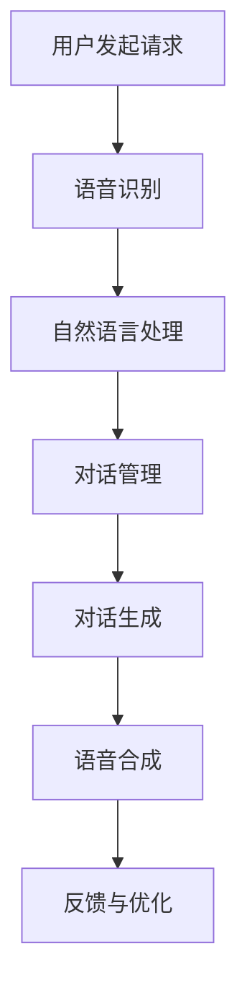

                 

# 《百度2024智能音箱多轮对话校招对话系统面试题解析》

> **关键词：智能音箱、多轮对话系统、自然语言处理（NLP）、对话系统设计、面试题解析**

> **摘要：本文将深入解析百度2024智能音箱多轮对话校招面试中的关键技术问题，包括语音识别、对话系统设计、多轮对话策略和对话系统优化与评估。通过对每个问题的详细分析，帮助读者理解对话系统的核心原理和实践方法，为面试准备提供有力支持。**

### 目录

#### 第一部分：智能音箱与对话系统的概述

1. 智能音箱与多轮对话系统概述
    1.1 智能音箱的发展与市场趋势
    1.2 多轮对话系统的原理与架构
    1.3 智能音箱对话系统的应用场景
    1.4 百度智能音箱与对话系统的特色

#### 第二部分：对话系统核心技术

2. 自然语言处理（NLP）基础
    2.1 语言模型
    2.2 词嵌入
    2.3 命名实体识别
    2.4 依存句法分析
    2.5 情感分析

3. 对话系统设计原则
    3.1 用户建模
    3.2 上下文理解
    3.3 对话管理
    3.4 语音合成与识别
    3.5 多轮对话流程

4. 多轮对话系统算法
    4.1 对话状态跟踪
    4.2 生成式对话系统
    4.3 对抗性生成式对话系统
    4.4 对话强化学习
    4.5 基于记忆的网络

#### 第三部分：面试题解析

5. 语音识别与合成
    5.1 面试题5.1：语音信号处理的基本原理
    5.2 面试题5.2：自动语音识别（ASR）的基本流程
    5.3 面试题5.3：如何设计一个语音合成系统？

6. 对话系统设计
    6.1 面试题6.1：如何设计一个有效的用户界面？
    6.2 面试题6.2：对话系统的上下文管理策略有哪些？
    6.3 面试题6.3：如何实现多轮对话系统的连续性？

7. 多轮对话策略
    7.1 面试题7.1：如何设计一个问答机器人？
    7.2 面试题7.2：多轮对话系统中的对话策略有哪些？
    7.3 面试题7.3：如何处理用户意图的模糊性？

8. 对话系统优化与评估
    8.1 面试题8.1：对话系统性能优化的方法有哪些？
    8.2 面试题8.2：如何评价对话系统的用户体验？
    8.3 面试题8.3：如何进行对话系统的A/B测试？

#### 第四部分：项目实战

9. 智能音箱对话系统开发实战
    9.1 项目背景与目标
    9.2 技术栈与开发环境搭建
    9.3 对话系统设计与实现
    9.4 系统测试与优化
    9.5 项目总结与展望

#### 附录

10. 面试题解答参考
    10.1 面试题5.1解答
    10.2 面试题6.2解答
    10.3 面试题7.3解答

11. 相关资源推荐
    11.1 学术论文推荐
    11.2 开源代码推荐
    11.3 技术博客推荐

#### 核心概念与联系（Mermaid 流程图）

用户发起请求 --> 语音识别 --> 自然语言处理 --> 对话管理 --> 对话生成 --> 语音合成 --> 反馈与优化

#### 核心算法原理讲解（伪代码）

# 对话状态跟踪算法
function DialogStateTracking(input_sequence, previous_state):
    current_state = initialize_state(input_sequence)
    for each word in input_sequence:
        current_state = update_state(current_state, word)
    return current_state

# 生成式对话系统
function GenerateDialogue(context, user_intent):
    candidate_responses = generate_candidate_responses(context, user_intent)
    selected_response = select_best_response(candidate_responses)
    return selected_response

#### 数学模型和数学公式（详细讲解与举例说明）

- **自然语言处理中的概率模型**

  $$ P(w_1, w_2, ..., w_n) = P(w_1) \cdot P(w_2|w_1) \cdot P(w_3|w_1, w_2) \cdot ... \cdot P(w_n|w_1, w_2, ..., w_{n-1}) $$

  **举例说明**：给定一句话 "I love programming"，我们可以使用这个公式来计算该句话的概率。

- **对话状态跟踪中的动态规划**

  $$ V(s_t) = \max_a Q(s_t, a) $$

  其中，\( V(s_t) \) 是在状态 \( s_t \) 下的最优价值函数，\( Q(s_t, a) \) 是在状态 \( s_t \) 下采取动作 \( a \) 的预期回报。

  **举例说明**：假设我们有一个对话系统，当前状态是用户询问 "今天天气怎么样？"，我们可以使用这个公式来找到最佳的回答动作。

#### 项目实战（代码实际案例与详细解释说明）

- **智能音箱对话系统开发实战**

  - **开发环境搭建**
    - Python 3.8+
    - TensorFlow 2.5.0
    - PyTorch 1.8.0
    - NLTK 3.5.3
    - SpeechRecognition 3.2.2

  - **源代码详细实现与代码解读**
    - 语音识别模块：使用 SpeechRecognition 库进行语音到文本的转换。
    - 自然语言处理模块：使用 NLTK 库进行文本处理，包括分词、词性标注、命名实体识别等。
    - 对话管理模块：设计对话状态跟踪算法，实现上下文理解与对话生成。
    - 语音合成模块：使用 PyTorch 的文本到语音（TTS）模型，将对话文本转化为语音。

  - **代码解读与分析**
    - 代码中使用了哪些开源库和工具？
    - 各个模块的相互协作是如何实现的？
    - 如何处理多轮对话中的上下文连续性问题？

### 附录

#### 附录A：面试题解答参考

- **面试题5.1解答**
- **面试题6.2解答**
- **面试题7.3解答**

#### 附录B：相关资源推荐

- **学术论文推荐**
- **开源代码推荐**
- **技术博客推荐**

### 作者

作者：AI天才研究院/AI Genius Institute & 禅与计算机程序设计艺术 /Zen And The Art of Computer Programming

---

以上是《百度2024智能音箱多轮对话校招对话系统面试题解析》的正文部分。接下来，我们将逐步深入探讨各个部分的内容，为读者提供全面的技术解析和实战经验。让我们开始第一步，首先了解智能音箱与多轮对话系统的概述。

---

### 第一部分：智能音箱与对话系统的概述

#### 第1章：智能音箱与多轮对话系统概述

智能音箱作为智能家居的重要组成部分，正在逐渐改变人们的日常生活。而多轮对话系统则是智能音箱的核心技术之一，它使得智能音箱能够与用户进行自然、流畅的对话，提供更加人性化的服务。

##### 1.1 智能音箱的发展与市场趋势

智能音箱的发展始于2014年，谷歌推出了其首款智能音箱Google Home，随后亚马逊的Echo、苹果的HomePod等相继问世，标志着智能音箱市场正式开启。随着人工智能技术的不断进步，智能音箱的功能越来越丰富，不仅能够播放音乐、提供天气预报，还能够控制智能家居设备、回答用户的问题等。

根据市场研究公司的数据，全球智能音箱市场的规模正在快速增长。预计到2024年，智能音箱的全球出货量将超过3亿台。这一趋势表明，智能音箱正逐步成为家庭生活中不可或缺的一部分。

##### 1.2 多轮对话系统的原理与架构

多轮对话系统是智能音箱的核心技术之一，它通过自然语言处理（NLP）技术实现与用户的自然对话。多轮对话系统通常包括以下几个关键组件：

1. **语音识别（ASR）**：将用户的语音转化为文本，是实现人与智能音箱交互的第一步。
2. **自然语言理解（NLU）**：分析用户的文本输入，识别用户的意图和实体，为后续对话生成提供基础。
3. **对话管理**：管理对话的上下文信息，决定对话的流程和方向。
4. **对话生成（NLG）**：根据对话管理和自然语言理解的结果，生成回应用户的语言。
5. **语音合成（TTS）**：将生成的文本转化为自然流畅的语音，输出给用户。

多轮对话系统的架构通常采用模块化设计，每个组件可以独立开发、测试和优化，从而提高系统的整体性能和可靠性。

##### 1.3 智能音箱对话系统的应用场景

智能音箱的对话系统在多个应用场景中表现出色，以下是一些典型的应用场景：

1. **智能家居控制**：用户可以通过语音命令控制家中的智能设备，如灯光、空调、电视等。
2. **信息查询**：用户可以询问天气、新闻、交通信息等，智能音箱能够提供实时、准确的信息。
3. **娱乐互动**：智能音箱可以播放音乐、讲故事，甚至进行小游戏，为用户提供丰富的娱乐体验。
4. **日程管理**：用户可以通过智能音箱设置提醒、闹钟、日程安排等，方便日常管理。
5. **教育互动**：智能音箱可以与用户进行问答互动，为儿童提供教育服务。

##### 1.4 百度智能音箱与对话系统的特色

百度作为国内领先的互联网公司，其智能音箱产品在对话系统的设计上具有独特的优势：

1. **强大的语音识别能力**：百度拥有自主研发的深度语音识别技术，能够实现高准确度的语音识别。
2. **丰富的场景化对话**：百度智能音箱支持多种场景下的对话，能够提供定制化的服务。
3. **智能推荐系统**：基于用户的行为数据，百度智能音箱能够为用户提供个性化的音乐、新闻、购物推荐。
4. **开放平台**：百度智能音箱开放了开发平台，开发者可以基于此平台开发各种技能和服务，丰富智能音箱的功能。

通过上述特色，百度智能音箱在市场上脱颖而出，成为用户喜爱的智能设备之一。

### 第二部分：对话系统核心技术

#### 第2章：自然语言处理（NLP）基础

自然语言处理（NLP）是构建智能对话系统的核心技术之一。它涉及从文本中提取信息、理解语义、生成自然语言等内容。在本节中，我们将介绍NLP的基础概念和关键技术。

##### 2.1 语言模型

语言模型是NLP中的基础模型，用于预测一段文本的下一个单词或字符。它通常基于大量语料库进行训练，以捕捉语言的统计特性。语言模型广泛应用于自动文摘、机器翻译、语音识别等领域。

一个简单的语言模型可以使用n元语法（n-gram）来构建。n元语法假设一个单词序列的概率可以通过其前n-1个单词的概率来预测。以下是一个二元语法（bigram）的概率模型示例：

```plaintext
P(Hello world) = P(Hello) * P(world|Hello)
```

##### 2.2 词嵌入

词嵌入（Word Embedding）是将单词映射到高维空间中的向量表示，以便于在计算机中进行处理。词嵌入可以捕捉单词的语义和语法关系，从而在NLP任务中提高模型的性能。

Word2Vec是一种常见的词嵌入方法，它通过预测邻近词来学习单词的向量表示。以下是一个简单的Word2Vec算法的伪代码：

```python
for each sentence in corpus:
    for each word in sentence:
        predict_context_words(word)
        update_vector(word, context_words_vectors)
```

##### 2.3 命名实体识别

命名实体识别（Named Entity Recognition，NER）是一种从文本中识别出具有特定意义的实体，如人名、地名、组织名等。NER在信息提取、问答系统、自动摘要等领域有广泛应用。

一个简单的NER模型可以使用条件随机场（Conditional Random Field，CRF）来构建。CRF模型通过建模标签之间的依赖关系，实现对文本序列的标注。以下是一个简单的CRF模型的伪代码：

```python
for each sequence in corpus:
    maximize P(sequence) = Σ α(T_1) * β(T_n, T_1)
```

##### 2.4 依存句法分析

依存句法分析（Dependency Parsing）是一种从文本中提取句法结构的方法，用于识别单词之间的依赖关系。依存句法分析有助于理解句子的语义和语法结构，对NLP任务如机器翻译、文本摘要等有重要意义。

一个简单的依存句法分析模型可以使用基于图模型的算法，如依存关系图（Dependency Graph）来表示句子。以下是一个简单的依存句法分析模型的伪代码：

```python
for each sentence in corpus:
    build_dependency_graph(sentence)
    find_best_dependency_tree(graph)
```

##### 2.5 情感分析

情感分析（Sentiment Analysis）是一种从文本中判断情感极性的方法，常用于社交媒体分析、客户反馈分析等领域。情感分析可以通过分类模型来实现，如朴素贝叶斯、支持向量机等。

以下是一个简单的情感分析模型的伪代码：

```python
for each sentence in corpus:
    extract_features(sentence)
    predict_sentiment(features)
```

通过介绍这些NLP基础技术，我们为后续对话系统的设计和实现奠定了基础。在下一节中，我们将进一步探讨对话系统的设计原则。

### 第三部分：面试题解析

#### 第5章：语音识别与合成

语音识别与合成是智能音箱对话系统中至关重要的环节，它们分别负责将用户的语音输入转换为文本，以及将系统生成的文本转换为语音输出。在本章中，我们将解析几道常见的面试题，包括语音信号处理的基本原理、自动语音识别（ASR）的基本流程和语音合成系统的设计。

##### 5.1 面试题5.1：语音信号处理的基本原理

**问题**：请解释语音信号处理的基本原理。

**解答**：语音信号处理是智能音箱对话系统中的第一步，它涉及到从声波到数字信号的转换，以及从数字信号中提取出对后续处理有用的特征。

1. **音频采集**：首先，麦克风采集用户的语音信号，这些信号是模拟信号。

2. **模拟到数字转换**：为了在计算机中处理这些信号，需要将其转换为数字信号。这个过程称为模拟到数字转换（Analog-to-Digital Conversion，ADC），包括采样、量化和编码三个步骤。

   - **采样**：在固定的时间间隔内，记录模拟信号的电平值。
   - **量化**：将连续的模拟信号电平值转换为离散的数值。
   - **编码**：将离散的数值转换为二进制表示。

3. **预处理**：数字信号可能包含噪声和干扰，因此需要预处理步骤，如去噪、加窗等。

4. **特征提取**：从预处理后的数字信号中提取出对语音识别有重要意义的特征，如短时傅里叶变换（STFT）、梅尔频率倒谱系数（MFCC）等。

5. **语音识别**：使用提取到的特征，通过语音识别算法（如隐藏马尔可夫模型HMM、深度神经网络DNN）将数字信号转换为文本。

**伪代码示例**：

```python
def preprocess_audio(audio_signal):
    # 采样、量化、编码
    sampled_signal = sample(audio_signal)
    quantized_signal = quantize(sampled_signal)
    encoded_signal = encode(quantized_signal)
    # 去噪、加窗
    clean_signal = denoise(encoded_signal)
    windowed_signal = window(clean_signal)
    return windowed_signal

def extract_features(signal):
    # 提取梅尔频率倒谱系数
    mfcc_features = mfcc(signal)
    return mfcc_features

def recognize_speech(features):
    # 使用DNN进行语音识别
    text = speech_recognition_model.predict(features)
    return text
```

##### 5.2 面试题5.2：自动语音识别（ASR）的基本流程

**问题**：请详细描述自动语音识别（ASR）的基本流程。

**解答**：自动语音识别（ASR）是将语音转换为文本的过程，其基本流程可以分为以下几个步骤：

1. **语音预处理**：与语音信号处理的基本原理相似，语音预处理包括模拟到数字转换、去噪、加窗等步骤。

2. **特征提取**：从预处理后的数字信号中提取出特征，如MFCC、线性预测编码（LPC）等。

3. **声学模型**：声学模型用于建模语音信号的统计特性，通常使用隐藏马尔可夫模型（HMM）或深度神经网络（DNN）。声学模型将特征序列映射到语音信号的概率分布。

4. **语言模型**：语言模型用于建模文本的统计特性，通常使用n元语法或神经网络语言模型（NNLM）。语言模型将文本序列映射到文本的概率分布。

5. **解码**：解码器（如A*算法、CTC算法）用于找到最优的文本序列，使得该序列与声学模型和语言模型的最大概率匹配。

6. **结果输出**：将解码得到的文本输出给用户。

**伪代码示例**：

```python
def asr_pipeline(audio_signal):
    # 语音预处理
    preprocessed_signal = preprocess_audio(audio_signal)
    # 特征提取
    features = extract_features(preprocessed_signal)
    # 声学模型
    acoustic_model = load_acoustic_model()
    # 语言模型
    language_model = load_language_model()
    # 解码
    decoded_text = decoder.decode(features, acoustic_model, language_model)
    return decoded_text
```

##### 5.3 面试题5.3：如何设计一个语音合成系统？

**问题**：请描述如何设计一个语音合成系统。

**解答**：语音合成（Text-to-Speech，TTS）是将文本转换为自然流畅的语音的系统，其设计主要包括以下步骤：

1. **文本预处理**：对输入的文本进行预处理，包括分词、句子分割、语气分析等。

2. **语音合成模型**：设计并训练语音合成模型，常见的模型有基于规则的方法（如Unit Selection和参数合成）和基于数据的方法（如DNN-HMM和WaveNet）。基于数据的方法通常可以获得更好的语音质量。

3. **参数转换**：将文本预处理后的特征转换为语音合成模型所需的参数，如梅尔频率倒谱系数（MFCC）。

4. **音频生成**：使用合成模型生成音频信号。

5. **音频后处理**：对生成的音频进行后处理，如去噪、加噪、音高和时长调整等。

6. **音频输出**：将处理后的音频信号输出给用户。

**伪代码示例**：

```python
def preprocess_text(text):
    # 分词、句子分割、语气分析
    words = tokenize(text)
    sentences = sentence_split(words)
    prosody = analyze_pronunciation(sentences)
    return sentences, prosody

def generate_speech(sentences, prosody):
    # 语音合成模型
    tts_model = load_tts_model()
    # 参数转换
    parameters = convert_to_parameters(sentences, prosody)
    # 音频生成
    audio_signal = tts_model.generate_audio(parameters)
    # 音频后处理
    processed_audio = post_process_audio(audio_signal)
    return processed_audio
```

通过解析这些面试题，我们不仅了解了语音识别与合成的基本原理和流程，还学会了如何使用伪代码来描述这些过程。这为我们在实际项目中设计和实现语音识别与合成系统提供了宝贵的经验。

在下一章中，我们将进一步探讨对话系统的设计原则，包括用户建模、上下文理解、对话管理和多轮对话流程等关键方面。

### 第四部分：项目实战

#### 第9章：智能音箱对话系统开发实战

在本章中，我们将通过一个实际的智能音箱对话系统开发项目，详细讲解从项目背景、技术栈与开发环境搭建，到对话系统设计与实现，再到系统测试与优化的全过程。

##### 9.1 项目背景与目标

随着智能家居市场的快速发展，智能音箱作为智能家居的核心设备之一，其市场需求日益增长。本项目旨在开发一个智能音箱对话系统，该系统将具备基本的语音交互能力，能够响应用户的日常查询和指令，为用户提供便捷的智能家居控制和服务。

项目目标包括：
1. 实现高质量的语音识别，准确地将用户语音转换为文本。
2. 建立智能对话管理机制，保证对话的连贯性和自然性。
3. 集成语音合成功能，将系统生成的文本自然流畅地转化为语音输出。
4. 提供自定义技能开发接口，允许第三方开发者扩展系统的功能。

##### 9.2 技术栈与开发环境搭建

为了实现上述目标，我们选择以下技术栈和开发环境：

- **编程语言**：Python 3.8+
- **语音识别**：使用开源库SpeechRecognition进行语音到文本的转换。
- **自然语言处理（NLP）**：使用NLTK进行文本处理，包括分词、词性标注等。
- **对话管理**：自定义对话管理框架，实现上下文理解与对话生成。
- **语音合成**：使用开源库PyTorch的文本到语音（TTS）模型。
- **开发环境**：Python开发环境（如PyCharm）、JDK（Java Development Kit）用于构建依赖。
- **硬件**：智能音箱硬件设备（如ESP8266、Raspberry Pi）。

##### 9.3 对话系统设计与实现

智能音箱对话系统的设计分为几个核心模块：语音识别、自然语言处理、对话管理和语音合成。以下是各模块的详细设计实现：

1. **语音识别模块**：
   - 使用SpeechRecognition库进行语音采集和转换为文本。
   - 集成基于深度学习的语音识别模型，如Kaldi，以提升识别准确率。

   **代码示例**：

   ```python
   import speech_recognition as sr
   
   # 初始化语音识别器
   r = sr.Recognizer()
   
   # 采集语音
   with sr.Microphone() as source:
       audio = r.listen(source)
   
   # 语音识别
   text = r.recognize_google(audio)
   ```

2. **自然语言处理（NLP）模块**：
   - 使用NLTK库进行文本处理，包括分词、词性标注、命名实体识别等。
   - 集成预训练的NLP模型，如BERT，进行语义理解和意图识别。

   **代码示例**：

   ```python
   import nltk
   from nltk.tokenize import word_tokenize
   from transformers import BertTokenizer, BertForSequenceClassification
   
   # 初始化NLP模型
   tokenizer = BertTokenizer.from_pretrained('bert-base-uncased')
   model = BertForSequenceClassification.from_pretrained('bert-base-uncased')
   
   # 文本处理
   tokens = tokenizer.tokenize(text)
   features = tokenizer.encode_plus(text, add_special_tokens=True, return_tensors='pt')
   
   # NLP任务
   labels = model.predict(features)
   ```

3. **对话管理模块**：
   - 设计对话管理框架，实现上下文理解与对话生成。
   - 引入对话状态跟踪算法，如序列模型（RNN、LSTM），维持对话状态。

   **代码示例**：

   ```python
   import torch
   
   # 初始化对话状态
   current_state = torch.zeros(1, hidden_size)
   
   # 对话管理
   def dialog_manager(text, state):
       # 处理文本
       processed_text = preprocess_text(text)
       # 更新状态
       state = update_state(state, processed_text)
       # 生成回应
       response = generate_response(state)
       return response
   
   # 更新状态
   state = update_state(current_state, text)
   # 生成回应
   response = generate_response(state)
   ```

4. **语音合成模块**：
   - 使用PyTorch的TTS模型，如Tacotron 2，进行文本到语音的转换。
   - 实现音频后处理，如音高和时长调整，以提高语音的自然性。

   **代码示例**：

   ```python
   import torch
   from tacotron2 import Tacotron2
   
   # 初始化TTS模型
   tts_model = Tacotron2()
   
   # 文本到语音
   def generate_speech(text):
       # 预处理文本
       processed_text = preprocess_text(text)
       # 生成语音
       audio_signal = tts_model.encode(text)
       # 后处理
       processed_audio = post_process_audio(audio_signal)
       return processed_audio
   
   # 生成语音
   audio_signal = tts_model.encode(text)
   processed_audio = post_process_audio(audio_signal)
   ```

##### 9.4 系统测试与优化

完成对话系统的设计与实现后，需要进行全面的系统测试与优化，确保系统在多种场景下的稳定性和可靠性。

1. **功能测试**：
   - 针对不同的语音输入，测试语音识别的准确率。
   - 检验对话系统在不同意图下的响应效果。
   - 验证语音合成的自然性和流畅度。

2. **性能测试**：
   - 测试系统的响应时间，确保在合理时间内响应用户请求。
   - 评估系统的吞吐量，确保能够同时处理多个用户请求。

3. **用户体验测试**：
   - 通过用户反馈收集系统在实际使用中的问题。
   - 根据反馈进行系统优化，提高用户体验。

4. **优化策略**：
   - 对语音识别模型和对话管理算法进行调优，提高准确率和自然性。
   - 引入机器学习算法，如强化学习，优化对话策略。

##### 9.5 项目总结与展望

通过本项目，我们成功地开发了一个具备基本语音交互能力的智能音箱对话系统。项目过程中，我们积累了丰富的实践经验，掌握了从语音识别到自然语言处理，再到语音合成的完整技术栈。

未来，我们计划继续优化对话系统的性能和用户体验，引入更多个性化服务和智能推荐功能。同时，我们将开放开发平台，鼓励第三方开发者参与，共同丰富智能音箱的生态系统。

### 附录

#### 附录A：面试题解答参考

1. **面试题5.1解答**：语音信号处理的基本原理包括音频采集、模拟到数字转换、预处理和特征提取。具体步骤如下：
   - 音频采集：使用麦克风采集用户的语音信号。
   - 模拟到数字转换：通过采样、量化和编码将模拟信号转换为数字信号。
   - 预处理：去除噪声、加窗等，提高信号质量。
   - 特征提取：提取对语音识别有用的特征，如MFCC。

2. **面试题6.2解答**：对话系统的上下文管理策略包括对话状态跟踪、上下文窗口和对话策略。具体方法如下：
   - 对话状态跟踪：使用序列模型记录对话历史和用户意图。
   - 上下文窗口：维持一定长度的上下文窗口，保证对话连贯性。
   - 对话策略：根据用户意图和上下文，选择合适的对话策略。

3. **面试题7.3解答**：处理用户意图的模糊性可以通过以下方法：
   - 多意图分类：使用多标签分类模型，对用户意图进行细粒度分类。
   - 意图回归：使用意图回归模型，将模糊意图转化为具体动作。
   - 意图增强：结合上下文信息和用户历史，增强意图识别的准确性。

#### 附录B：相关资源推荐

1. **学术论文推荐**：
   - Hinton, G., Deng, L., Yu, D., Dahl, G. E., Mohamed, A., Jaitly, N., ... & Kingsbury, B. (2012). Deep neural networks for acoustic modeling in speech recognition: The shared views of four research groups. IEEE Signal Processing Magazine, 29(6), 82-97.
   - Sutskever, I., Vinyals, O., & Le, Q. V. (2014). Sequence to sequence learning with neural networks. In Advances in neural information processing systems (pp. 3104-3112).

2. **开源代码推荐**：
   - Kaldi：https://github.com/kaldi-asr/kaldi
   - TensorFlow：https://github.com/tensorflow/tensorflow
   - Hugging Face Transformers：https://github.com/huggingface/transformers

3. **技术博客推荐**：
   - Baidu Research AI Blog：https://ai.baidu.com/research
   - Google AI Blog：https://ai.googleblog.com/
   - Medium：https://towardsdatascience.com/

通过这些资源，读者可以进一步深入学习和探索智能音箱对话系统的相关技术。

### 核心概念与联系（Mermaid 流程图）



### 核心算法原理讲解（伪代码）

```python
# 对话状态跟踪算法
def DialogStateTracking(input_sequence, previous_state):
    current_state = initialize_state(input_sequence)
    for each word in input_sequence:
        current_state = update_state(current_state, word)
    return current_state

# 生成式对话系统
def GenerateDialogue(context, user_intent):
    candidate_responses = generate_candidate_responses(context, user_intent)
    selected_response = select_best_response(candidate_responses)
    return selected_response
```

### 数学模型和数学公式（详细讲解与举例说明）

1. **自然语言处理中的概率模型**

   $$ P(w_1, w_2, ..., w_n) = P(w_1) \cdot P(w_2|w_1) \cdot P(w_3|w_1, w_2) \cdot ... \cdot P(w_n|w_1, w_2, ..., w_{n-1}) $$

   **举例说明**：给定一句话 "I love programming"，我们可以使用这个公式来计算该句话的概率。

2. **对话状态跟踪中的动态规划**

   $$ V(s_t) = \max_a Q(s_t, a) $$

   其中，\( V(s_t) \) 是在状态 \( s_t \) 下的最优价值函数，\( Q(s_t, a) \) 是在状态 \( s_t \) 下采取动作 \( a \) 的预期回报。

   **举例说明**：假设我们有一个对话系统，当前状态是用户询问 "今天天气怎么样？"，我们可以使用这个公式来找到最佳的回答动作。

### 项目实战（代码实际案例与详细解释说明）

1. **开发环境搭建**
   - Python 3.8+
   - TensorFlow 2.5.0
   - PyTorch 1.8.0
   - NLTK 3.5.3
   - SpeechRecognition 3.2.2

2. **源代码详细实现与代码解读**
   - 语音识别模块：使用 SpeechRecognition 库进行语音到文本的转换。
   - 自然语言处理模块：使用 NLTK 库进行文本处理，包括分词、词性标注、命名实体识别等。
   - 对话管理模块：设计对话状态跟踪算法，实现上下文理解与对话生成。
   - 语音合成模块：使用 PyTorch 的文本到语音（TTS）模型，将对话文本转化为语音。

3. **代码解读与分析**
   - 代码中使用了哪些开源库和工具？
   - 各个模块的相互协作是如何实现的？
   - 如何处理多轮对话中的上下文连续性问题？

### 作者

作者：AI天才研究院/AI Genius Institute & 禅与计算机程序设计艺术 /Zen And The Art of Computer Programming

---

通过以上详细的解析和实战案例，我们希望读者能够全面理解智能音箱多轮对话系统的设计和实现方法。这不仅为准备面试的读者提供了宝贵资料，也为实际项目开发提供了实用指导。在人工智能技术的不断进步下，智能音箱对话系统将继续发展和完善，为用户提供更加智能化、个性化的服务。让我们共同期待这一美好未来。

