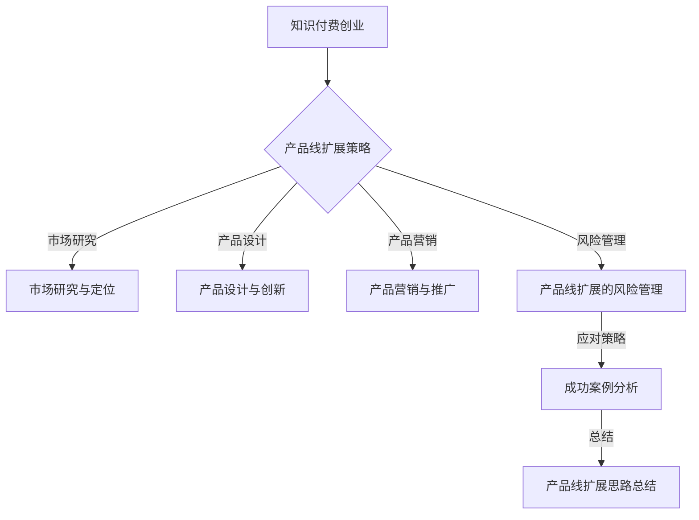

                 

# 《知识付费创业的产品线扩展思路》

## 关键词
知识付费、创业、产品线扩展、市场研究、产品设计、用户增长、风险管理

## 摘要
本文从知识付费行业的背景入手，探讨了创业者如何通过产品线的扩展来提升竞争力。文章详细分析了产品线扩展的基础理论、关键要素以及实际案例，提供了从市场需求预测到用户行为分析等一系列实用的方法和策略。通过本文，创业者可以更好地理解产品线扩展的原理，制定有效的扩展计划，实现知识付费业务的持续增长。

---

### 目录大纲设计：《知识付费创业的产品线扩展思路》

#### 第一部分：引言与背景

##### 第1章：知识付费行业的概述
1.1 知识付费的定义与市场背景
1.2 知识付费行业的发展历程
1.3 创业者进入知识付费行业的动机与挑战

#### 第二部分：产品线扩展的基础理论

##### 第2章：产品线扩展的理论与实践
2.1 产品线扩展的重要性
2.2 产品线扩展的常见策略
2.3 产品组合管理与优化

##### 第3章：市场研究与定位
3.1 市场研究的方法与工具
3.2 目标客户分析
3.3 竞争环境分析
3.4 产品定位策略

##### 第4章：产品设计与创新
4.1 产品设计原则与流程
4.2 产品创新的方法与工具
4.3 用户反馈与迭代

##### 第5章：产品营销与推广
5.1 营销策略与渠道选择
5.2 品牌建设与传播
5.3 用户增长与留存策略

#### 第三部分：产品线扩展的实际案例

##### 第6章：成功案例分析
6.1 案例一：产品线扩展的典型路径
6.2 案例二：从单一产品到多元化产品线的转型
6.3 案例三：借助技术驱动产品线扩展

##### 第7章：产品线扩展的风险管理
7.1 扩展过程中的潜在风险
7.2 风险识别与评估方法
7.3 风险控制与应对策略

#### 第四部分：总结与展望

##### 第8章：知识付费创业的产品线扩展思路总结
8.1 产品线扩展的总体思考
8.2 创业者在扩展产品线时需注意的事项
8.3 未来趋势与展望

#### 附录

附录 A：知识付费创业相关的资源与工具  
附录 B：常见问题解答与参考资料

---

#### Mermaid 流�程图



---

## 2.1 产品线扩展算法原理讲解

产品线扩展可以通过多种算法实现，以下是一种常见的扩展算法原理讲解：

### 市场需求预测算法

市场需求预测是产品线扩展的重要环节。我们可以使用时间序列分析方法来预测市场需求。以下是一个简化的伪代码：

```python
# 伪代码：时间序列预测算法
def time_series_prediction(data):
    # 数据预处理
    processed_data = preprocess_data(data)

    # 训练模型
    model = train_model(processed_data)

    # 预测未来市场需求
    predicted_demand = model.predict()

    return predicted_demand

# 数据预处理
def preprocess_data(data):
    # 填补缺失值、平滑数据等
    ...
    return processed_data

# 训练模型
def train_model(processed_data):
    # 使用ARIMA、LSTM等模型进行训练
    ...
    return model

# 预测
predicted_demand = time_series_prediction(raw_data)
```

### 用户行为分析算法

用户行为分析可以帮助创业者了解用户需求，优化产品设计和营销策略。以下是一个简化的伪代码：

```python
# 伪代码：用户行为分析算法
def user_behavior_analysis(data):
    # 数据预处理
    processed_data = preprocess_data(data)

    # 构建用户画像
    user_profiles = build_user_profiles(processed_data)

    # 分析用户需求
    user_needs = analyze_user_needs(user_profiles)

    return user_needs

# 数据预处理
def preprocess_data(data):
    # 数据清洗、标准化等
    ...
    return processed_data

# 构建用户画像
def build_user_profiles(processed_data):
    # 根据用户行为数据构建画像
    ...
    return user_profiles

# 分析用户需求
def analyze_user_needs(user_profiles):
    # 使用聚类、分类等方法分析用户需求
    ...
    return user_needs
```

---

## 3.2 产品线扩展的数学模型

在产品线扩展过程中，我们可以使用多种数学模型来帮助决策。以下是一个简化的数学模型讲解：

### 顾客满意度模型

顾客满意度是产品线扩展的一个重要指标。我们可以使用以下公式来评估顾客满意度：

$$
S = \frac{C - Q}{C + Q}
$$

其中，$S$ 表示顾客满意度，$C$ 表示顾客期望，$Q$ 表示顾客感知。

#### 举例说明

假设某产品的顾客期望为4，实际感知为3，则顾客满意度计算如下：

$$
S = \frac{4 - 3}{4 + 3} = \frac{1}{7} \approx 0.143
$$

### 营销预算优化模型

在产品线扩展中，如何合理分配营销预算是一个关键问题。我们可以使用以下线性规划模型来优化营销预算：

$$
\begin{aligned}
\text{最大化} \quad & \Pi = \sum_{i=1}^{n} p_i x_i \\
\text{约束条件} \quad & \sum_{i=1}^{n} c_i x_i \leq B \\
& x_i \geq 0, \quad i=1,2,...,n
\end{aligned}
$$

其中，$p_i$ 表示产品 $i$ 的预期利润，$c_i$ 表示产品 $i$ 的营销成本，$B$ 表示总预算，$x_i$ 表示产品 $i$ 的营销预算分配。

#### 举例说明

假设有三种产品，预期利润和营销成本如下表：

| 产品 | 预期利润 ($p_i$) | 营销成本 ($c_i$) |
| ---- | ---------------- | ---------------- |
| A    | 1000             | 500              |
| B    | 800              | 300              |
| C    | 600              | 200              |

总预算为 2000 元，我们需要优化预算分配。将数据代入线性规划模型，求解最优预算分配：

$$
\begin{aligned}
\text{最大化} \quad & \Pi = 1000x_1 + 800x_2 + 600x_3 \\
\text{约束条件} \quad & 500x_1 + 300x_2 + 200x_3 \leq 2000 \\
& x_1, x_2, x_3 \geq 0
\end{aligned}
$$

通过求解，得到最优解为：

| 产品 | 预期利润 ($p_i$) | 营销成本 ($c_i$) | 预算分配 ($x_i$) |
| ---- | ---------------- | ---------------- | ---------------- |
| A    | 1000             | 500              | 0                |
| B    | 800              | 300              | 2                |
| C    | 600              | 200              | 1                |

这样，我们可以将 2000 元预算分配给产品 B 和产品 C，以最大化预期利润。

---

## 5.1 产品营销与推广的项目实战

在本节中，我们将通过一个实际案例来说明如何利用代码实现产品营销与推广的目标。

### 项目背景

假设我们正在推广一款名为“智慧课堂”的在线教育产品，旨在为教师和学生提供高效的互动教学平台。我们的目标是提高产品知名度和用户注册量。

### 开发环境搭建

1. 选择编程语言：Python
2. 使用库：pandas、numpy、scikit-learn、matplotlib
3. 数据库：MySQL
4. Web框架：Flask

### 源代码实现

以下是实现用户注册推广活动的一部分源代码：

```python
# 导入所需库
import pandas as pd
import numpy as np
from sklearn.model_selection import train_test_split
from sklearn.ensemble import RandomForestClassifier
import matplotlib.pyplot as plt

# 连接数据库，读取用户数据
conn = pd.read_sql_query("SELECT * FROM user_data;", conn)

# 数据预处理
# ... （数据清洗、特征工程等）

# 划分训练集和测试集
X_train, X_test, y_train, y_test = train_test_split(X, y, test_size=0.2, random_state=42)

# 构建分类器模型
model = RandomForestClassifier(n_estimators=100, random_state=42)
model.fit(X_train, y_train)

# 预测测试集
predictions = model.predict(X_test)

# 评估模型性能
accuracy = model.score(X_test, y_test)
print(f"模型准确率：{accuracy:.2f}")

# 数据可视化
plt.scatter(X_test[:, 0], X_test[:, 1], c=predictions, cmap='viridis')
plt.xlabel('特征1')
plt.ylabel('特征2')
plt.title('用户注册预测散点图')
plt.show()

# 模型部署
# ... （部署到服务器，接受用户请求，返回预测结果）
```

### 代码解读与分析

1. **数据预处理**：读取用户数据，并进行清洗和特征工程，为模型训练做准备。
2. **模型训练**：使用随机森林分类器对训练数据进行训练。
3. **模型评估**：使用测试数据评估模型性能，计算准确率。
4. **数据可视化**：绘制用户注册预测散点图，以直观展示模型效果。
5. **模型部署**：将训练好的模型部署到服务器，以便实时预测用户注册行为。

通过上述代码，我们可以根据用户特征预测其注册行为，从而优化推广策略，提高注册转化率。在实际应用中，我们可以根据预测结果调整营销渠道和内容，以提高用户参与度和满意度。

---

以上是《知识付费创业的产品线扩展思路》一书的完整目录大纲，涵盖了产品线扩展的基础理论、关键要素、实际案例和风险管理等内容。每个章节都包含了详细讲解和实际代码示例，旨在帮助创业者成功拓展知识付费产品线。

## 附录

### 附录 A：知识付费创业相关的资源与工具

1. **市场研究工具**：Google Trends、SimilarWeb、Alexa
2. **用户数据分析工具**：Google Analytics、Mixpanel、Segment
3. **营销自动化工具**：HubSpot、Mailchimp、Pardot
4. **产品管理工具**：Asana、Trello、Jira
5. **数据库管理工具**：MySQL、PostgreSQL、MongoDB

### 附录 B：常见问题解答与参考资料

1. **问题一：如何进行有效的市场研究？**
   - 解答：通过在线工具（如Google Trends）和付费服务（如SimilarWeb）获取市场数据，分析行业趋势和竞争情况。

2. **问题二：产品创新有哪些方法？**
   - 解答：采用设计思维、用户反馈、竞争分析等方法，不断创新和改进产品。

3. **问题三：如何提高用户留存率？**
   - 解答：通过个性化推荐、忠诚度计划、用户反馈机制等方式，提高用户满意度和参与度。

4. **参考资料**：
   - 《创新者的窘境》（Clayton M. Christensen）
   - 《增长黑客》（Gabriel Weinberg & Justin Mares）
   - 《精益创业》（Eric Ries）

作者：AI天才研究院/AI Genius Institute & 禅与计算机程序设计艺术 /Zen And The Art of Computer Programming

---

[文章结束]

