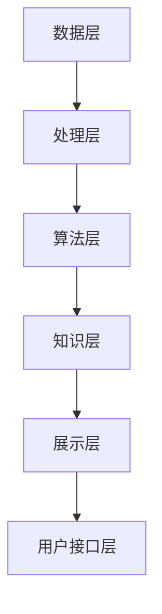
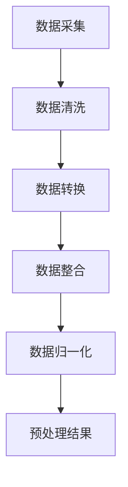
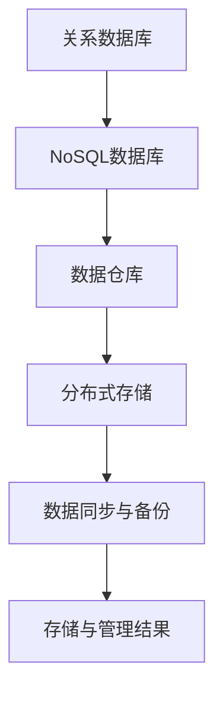
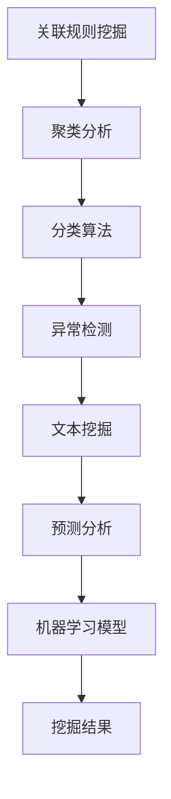
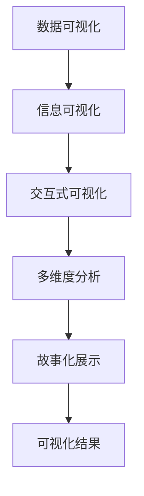

                 

# 知识发现引擎：探索人类知识的本质

## 关键词
- 知识发现
- 数据挖掘
- 算法
- 应用场景
- 开发实践

## 摘要
本文将深入探讨知识发现引擎的基本概念、架构设计、算法原理以及其在不同领域的应用和实践。我们将通过详细的案例分析，展示如何构建和部署知识发现引擎，并展望其未来发展趋势。希望通过本文，读者能够对知识发现引擎有更深入的理解，并能够将其应用于实际项目中。

----------------------------------------------------------------

## 第一部分：知识发现引擎概述

### 第1章：知识发现引擎的概念与价值

#### 1.1 什么是知识发现引擎

知识发现引擎（Knowledge Discovery Engine，简称KDE）是一种基于数据挖掘和机器学习技术的系统，旨在从大量数据中自动识别出隐藏的模式、规律和知识。它是一个集成了多种数据源、处理算法和可视化工具的综合平台，能够帮助用户从复杂的数据中提取有价值的信息。

知识发现引擎的核心功能包括：
- 数据采集：从各种数据源（如数据库、文件、API等）中收集数据。
- 数据预处理：清洗、转换和整合数据，使其适用于挖掘算法。
- 数据挖掘：应用各种数据挖掘算法，发现数据中的潜在模式和关联。
- 知识提取：从挖掘结果中提取关键信息，形成知识库或报表。
- 可视化展示：通过图表、图形等形式，直观地展示数据挖掘结果。

#### 1.2 知识发现引擎的组成部分

知识发现引擎通常由以下几个主要部分组成：

1. **数据源**：包括结构化数据（如关系数据库）、非结构化数据（如文本、图像、音频）和半结构化数据（如XML、JSON）。
2. **数据预处理模块**：负责数据清洗、去重、转换等操作，确保数据的质量和一致性。
3. **数据挖掘算法库**：包括关联规则挖掘、聚类分析、分类算法、异常检测等多种算法，用于从数据中发现规律和模式。
4. **知识库**：存储从数据挖掘过程中提取的知识和模式，供用户查询和使用。
5. **可视化工具**：将挖掘结果以图表、图形等形式直观展示，帮助用户理解和分析数据。
6. **用户界面**：提供用户交互界面，方便用户配置参数、执行任务和查看结果。

#### 1.3 知识发现引擎在信息检索中的应用

知识发现引擎在信息检索领域有广泛的应用，主要体现在以下几个方面：

1. **搜索引擎优化**：通过分析用户搜索行为和结果，优化搜索引擎的算法和索引策略，提高检索的准确性和效率。
2. **推荐系统**：基于用户的历史行为和偏好，为用户推荐相关的信息、商品或服务。
3. **主题发现**：从大量文档中识别出主题和关键词，帮助用户更好地理解和分类信息。
4. **文本挖掘**：提取文本中的关键信息，如人名、地名、机构名等，用于信息抽取和实体识别。

#### 1.4 知识发现引擎的价值与挑战

知识发现引擎的价值体现在以下几个方面：

1. **提升决策效率**：通过数据分析和挖掘，为决策者提供基于数据的洞见和参考。
2. **优化业务流程**：发现业务流程中的瓶颈和改进点，帮助企业提高效率和降低成本。
3. **增强用户体验**：通过个性化推荐和智能搜索，提高用户对产品和服务的满意度。
4. **创新研发**：为科研和开发提供大量有价值的数据和知识，促进创新和突破。

然而，知识发现引擎在实际应用中也面临一些挑战：

1. **数据质量问题**：数据质量直接影响挖掘结果的准确性，需要进行严格的数据预处理。
2. **计算资源需求**：大规模数据挖掘需要大量的计算资源和时间，对系统性能提出高要求。
3. **算法选择和调优**：不同的应用场景需要选择和调优不同的算法，这对用户的专业技能要求较高。
4. **隐私保护**：在处理个人数据时，需要确保数据的隐私和安全，避免数据泄露和滥用。

### 第2章：知识发现引擎的架构设计

#### 2.1 知识发现引擎的整体架构

知识发现引擎的整体架构通常可以分为以下几个层次：

1. **数据层**：包括数据源和数据存储系统，如关系数据库、NoSQL数据库、文件系统等。
2. **处理层**：负责数据的预处理、清洗、转换和整合，为挖掘算法提供高质量的数据。
3. **算法层**：包括各种数据挖掘算法和机器学习模型，用于从数据中发现模式和关联。
4. **知识层**：存储从数据挖掘过程中提取的知识和模式，供用户查询和使用。
5. **展示层**：通过可视化工具将挖掘结果以图表、图形等形式直观展示，帮助用户理解和分析数据。
6. **用户接口层**：提供用户交互界面，方便用户配置参数、执行任务和查看结果。

以下是一个简单的Mermaid流程图，展示知识发现引擎的基本架构：



#### 2.2 数据收集与预处理

数据收集与预处理是知识发现引擎的关键环节，决定了后续挖掘结果的准确性和有效性。以下是数据收集与预处理的主要步骤：

1. **数据采集**：从各种数据源（如关系数据库、文件、API等）中收集数据。
2. **数据清洗**：去除重复数据、纠正错误、填补缺失值等，确保数据的质量和一致性。
3. **数据转换**：将不同格式和类型的数据转换为统一的格式，便于后续处理。
4. **数据整合**：将多个数据源中的数据整合为一个统一的数据集，为挖掘算法提供输入。
5. **数据归一化**：对数据进行标准化或归一化处理，消除不同特征之间的量级差异。

以下是一个简单的Mermaid流程图，展示数据收集与预处理的基本流程：



#### 2.3 数据存储与管理

数据存储与管理是知识发现引擎的另一个重要方面，涉及到如何高效、可靠地存储和管理大量数据。以下是数据存储与管理的主要步骤：

1. **关系数据库**：适用于结构化数据的存储，如MySQL、PostgreSQL等。
2. **NoSQL数据库**：适用于非结构化数据的存储，如MongoDB、Cassandra等。
3. **数据仓库**：用于存储大量历史数据，支持复杂的查询和分析，如Amazon Redshift、Google BigQuery等。
4. **分布式存储**：适用于大规模数据存储，如HDFS、Ceph等。
5. **数据同步与备份**：确保数据的一致性和可靠性，如ETL工具、备份软件等。

以下是一个简单的Mermaid流程图，展示数据存储与管理的基本流程：



#### 2.4 数据分析与挖掘

数据分析与挖掘是知识发现引擎的核心功能，涉及到如何从大量数据中提取有价值的信息。以下是数据分析与挖掘的主要步骤：

1. **关联规则挖掘**：发现数据中的关联关系，如“购买A商品的用户通常也会购买B商品”。
2. **聚类分析**：将相似的数据分组，如“将用户根据购买行为分为不同群体”。
3. **分类算法**：将数据分为不同的类别，如“将新闻文章分为政治、经济、娱乐等类别”。
4. **异常检测**：识别数据中的异常值或异常模式，如“发现信用卡交易中的欺诈行为”。
5. **文本挖掘**：从文本数据中提取关键信息，如“从社交媒体评论中提取用户情感”。
6. **预测分析**：基于历史数据预测未来的趋势或行为，如“预测股票价格的走势”。
7. **机器学习模型**：应用各种机器学习算法，如决策树、随机森林、支持向量机等，用于分类、回归和聚类等任务。

以下是一个简单的Mermaid流程图，展示数据分析与挖掘的基本流程：



#### 2.5 知识可视化与呈现

知识可视化与呈现是将数据挖掘结果以图表、图形等形式直观展示的过程，有助于用户理解和分析数据。以下是知识可视化与呈现的主要步骤：

1. **数据可视化**：将原始数据以图表、图形等形式展示，如条形图、折线图、饼图等。
2. **信息可视化**：将复杂的数据关系和信息以图形化方式展示，如网络图、地理信息系统（GIS）、热力图等。
3. **交互式可视化**：提供用户与可视化结果的交互功能，如筛选、排序、缩放等。
4. **多维度分析**：从不同角度和维度展示数据，帮助用户全面分析数据。
5. **故事化展示**：将数据挖掘结果以故事形式展示，提高用户理解和记忆效果。

以下是一个简单的Mermaid流程图，展示知识可视化与呈现的基本流程：



### 第3章：知识发现算法原理

#### 3.1 数据挖掘基本算法

数据挖掘的基本算法包括关联规则挖掘、聚类分析、分类算法、异常检测等，这些算法在各种应用场景中发挥着重要作用。

1. **关联规则挖掘（Association Rule Learning）**：
   关联规则挖掘是一种寻找数据集中各项之间潜在关系的算法，常见于市场篮子分析、推荐系统等。其核心思想是通过支持度和置信度两个指标来识别强关联规则。

   **支持度（Support）**：一个规则出现的频率占总数据的比例。
   $$ Support(A \rightarrow B) = \frac{count(A \cup B)}{count(U)} $$
   其中，\( A \) 和 \( B \) 是数据集中的项集，\( U \) 是全集。

   **置信度（Confidence）**：在 \( A \) 出现的情况下 \( B \) 出现的概率。
   $$ Confidence(A \rightarrow B) = \frac{count(A \cap B)}{count(A)} $$

   **例**：假设一个数据集包含商品购买记录，我们发现“购买A商品的用户有80%也购买了B商品”。这里，“购买A商品”是前提条件（前件），而“购买了B商品”是结论（后件）。我们可以根据支持度和置信度来确定这条规则是否具有实际意义。

2. **聚类分析（Cluster Analysis）**：
   聚类分析是一种无监督学习方法，用于将相似的数据点分组，形成多个类别或簇。常见的聚类算法包括K-均值（K-Means）、层次聚类（Hierarchical Clustering）和DBSCAN等。

   **K-均值聚类**：
   - **初始化**：随机选择 \( K \) 个中心点。
   - **迭代过程**：计算每个数据点到每个中心点的距离，将数据点分配到最近的中心点所在的簇。
   - **更新中心点**：计算每个簇的质心，用质心替代原来的中心点。
   - **收敛条件**：当中心点的变化小于某个阈值或达到最大迭代次数时，算法停止。

   **伪代码**：
   ```
   Initialize K centroids
   while not converged do
       Assign each data point to the nearest centroid
       Update centroids to be the mean of the assigned points
   end while
   ```

3. **分类算法（Classification）**：
   分类算法是一种监督学习方法，用于将数据划分为预定义的类别。常见的分类算法包括逻辑回归、决策树、随机森林和SVM等。

   **逻辑回归（Logistic Regression）**：
   - **目标**：预测二元变量（如“是/否”、“患病/未患病”）的概率。
   - **模型**：线性回归模型，但输出层使用逻辑函数（Sigmoid函数）进行转换。
   - **损失函数**：交叉熵损失函数。

   **伪代码**：
   ```
   w = [w0, w1, ..., wp]
   while not converged do
       Compute predicted probabilities p = sigmoid(w * x)
       Compute loss = - (y * log(p) + (1 - y) * log(1 - p))
       Compute gradients = x * (p - y)
       Update weights w = w - learning_rate * gradients
   end while
   ```

4. **异常检测（Anomaly Detection）**：
   异常检测是一种无监督学习方法，用于识别数据中的异常值或异常模式。常见的异常检测算法包括基于统计的方法、基于聚类的方法和基于机器学习的方法。

   **孤立森林（Isolation Forest）**：
   - **目标**：识别出异常数据点。
   - **模型**：通过随机选择特征和切分值，构建多个随机树，然后将数据点“隔离”在树的叶子节点上。
   - **评估**：异常分数越高，表示数据点越异常。

   **伪代码**：
   ```
   Choose n random features
   Choose a random split value from the selected features
  split the data along the random value
  Recursively split until a stopping criterion is met
  Isolate the data points by calculating the path length to the leaf node
  Score each data point based on the average path length
  Sort the data points by score
  Identify the top N% as anomalies
   ```

#### 3.2 关联规则挖掘

关联规则挖掘是一种寻找数据集中各项之间潜在关系的算法，常见于市场篮子分析、推荐系统等。其核心思想是通过支持度和置信度两个指标来识别强关联规则。

1. **支持度（Support）**：
   一个规则出现的频率占总数据的比例。
   $$ Support(A \rightarrow B) = \frac{count(A \cup B)}{count(U)} $$
   其中，\( A \) 和 \( B \) 是数据集中的项集，\( U \) 是全集。

2. **置信度（Confidence）**：
   在 \( A \) 出现的情况下 \( B \) 出现的概率。
   $$ Confidence(A \rightarrow B) = \frac{count(A \cap B)}{count(A)} $$

3. **例**：
   假设一个数据集包含商品购买记录，我们发现“购买A商品的用户有80%也购买了B商品”。这里，“购买A商品”是前提条件（前件），而“购买了B商品”是结论（后件）。我们可以根据支持度和置信度来确定这条规则是否具有实际意义。

#### 3.3 聚类算法

聚类分析是一种无监督学习方法，用于将相似的数据点分组，形成多个类别或簇。常见的聚类算法包括K-均值（K-Means）、层次聚类（Hierarchical Clustering）和DBSCAN等。

1. **K-均值聚类**：
   - **初始化**：随机选择 \( K \) 个中心点。
   - **迭代过程**：计算每个数据点到每个中心点的距离，将数据点分配到最近的中心点所在的簇。
   - **更新中心点**：计算每个簇的质心，用质心替代原来的中心点。
   - **收敛条件**：当中心点的变化小于某个阈值或达到最大迭代次数时，算法停止。

   **伪代码**：
   ```
   Initialize K centroids
   while not converged do
       Assign each data point to the nearest centroid
       Update centroids to be the mean of the assigned points
   end while
   ```

2. **层次聚类**：
   - **自底向上**：将每个数据点作为初始簇，逐步合并距离较近的簇，形成层次结构。
   - **自顶向下**：从所有数据点作为一个簇开始，逐步分裂成更小的簇，形成层次结构。

3. **DBSCAN（Density-Based Spatial Clustering of Applications with Noise）**：
   - **核心点**：密度大于某个阈值的点。
   - **边界点**：位于核心点邻域内的点。
   - **噪声点**：无法被任何核心点邻域覆盖的点。
   - **聚类过程**：从核心点开始，将其邻域内的点划分为同一簇，直到所有点都被划分。

   **伪代码**：
   ```
   for each point p in dataset do
       if p is noise point then
           continue
       end if
       if p is core point then
           cluster C = new cluster
           ExpandCluster(C, p)
       end if
   end for
   ```

#### 3.4 分类算法

分类算法是一种监督学习方法，用于将数据划分为预定义的类别。常见的分类算法包括逻辑回归、决策树、随机森林和SVM等。

1. **逻辑回归（Logistic Regression）**：
   - **目标**：预测二元变量（如“是/否”、“患病/未患病”）的概率。
   - **模型**：线性回归模型，但输出层使用逻辑函数（Sigmoid函数）进行转换。
   - **损失函数**：交叉熵损失函数。

   **伪代码**：
   ```
   w = [w0, w1, ..., wp]
   while not converged do
       Compute predicted probabilities p = sigmoid(w * x)
       Compute loss = - (y * log(p) + (1 - y) * log(1 - p))
       Compute gradients = x * (p - y)
       Update weights w = w - learning_rate * gradients
   end while
   ```

2. **决策树（Decision Tree）**：
   - **构建过程**：选择最佳特征进行切分，递归构建树结构。
   - **剪枝过程**：防止过拟合，通过剪枝减少树的大小。

   **伪代码**：
   ```
   if all samples belong to the same class then
       return leaf node
   else
       Select best feature and threshold
       Split dataset into subsets
       for each subset
           Recursively build tree
   end if
   ```

3. **随机森林（Random Forest）**：
   - **构建过程**：构建多个决策树，每个树随机选择特征和样本。
   - **预测过程**：对多个树进行投票，得到最终预测结果。

   **伪代码**：
   ```
   for each tree
       Select random subset of features
       Build decision tree
   end for
   for each sample
       Get predictions from all trees
       Aggregate predictions to get final prediction
   end for
   ```

4. **SVM（Support Vector Machine）**：
   - **目标**：找到分隔超平面，使得正负样本的间隔最大。
   - **模型**：使用核函数将数据映射到高维空间，寻找最优分隔超平面。

   **伪代码**：
   ```
   Define objective function
   Solve optimization problem
   Compute hyperplane
   Predict class based on hyperplane
   ```

#### 3.5 属性重要性评估

属性重要性评估是一种评估特征对模型预测影响力的大小的方法，有助于识别最有用的特征，优化模型性能。

1. **基于模型的方法**：
   - **决策树**：计算每个特征的Gini指数或信息增益。
   - **随机森林**：计算每个特征的平均重要性。
   - **梯度提升树（Gradient Boosting Tree）**：计算每个特征的贡献度。

   **伪代码**：
   ```
   for each feature
       Compute importance based on model-specific metric
   end for
   ```

2. **基于统计的方法**：
   - **相关性分析**：计算特征与目标变量之间的相关性。
   - **主成分分析（PCA）**：识别数据中的主要成分，评估特征的重要性。

   **伪代码**：
   ```
   Compute correlation matrix
   Perform PCA
   Select top components based on variance
   ```

### 第4章：知识发现引擎的性能优化

#### 4.1 数据库性能优化

数据库性能优化是提升知识发现引擎效率的重要环节。以下是一些常见的方法：

1. **索引优化**：
   - **创建索引**：在经常查询和排序的字段上创建索引，如主键、外键、排序字段等。
   - **删除无效索引**：定期检查和删除无效或冗余的索引。

2. **查询优化**：
   - **避免子查询**：使用连接操作替代子查询。
   - **使用缓存**：利用数据库缓存机制，减少查询次数。

3. **分区策略**：
   - **水平分区**：按某个字段（如时间、地区）将数据分割成多个分区。
   - **垂直分区**：按数据表结构将数据分割成多个分区。

4. **存储优化**：
   - **数据压缩**：对数据进行压缩，减少存储空间。
   - **冷热数据分离**：将经常访问的数据与不经常访问的数据分开存储。

5. **并发控制**：
   - **锁机制**：合理使用锁机制，防止并发访问冲突。
   - **事务隔离**：确保事务的隔离性，防止数据不一致。

#### 4.2 算法效率提升

算法效率提升是提高知识发现引擎性能的关键。以下是一些常见的方法：

1. **并行处理**：
   - **多线程**：利用多线程技术，将任务分布在多个处理器上。
   - **分布式计算**：利用分布式计算框架（如MapReduce、Spark），处理大规模数据。

2. **算法选择和调优**：
   - **选择合适的算法**：根据数据规模、特征复杂度等选择合适的算法。
   - **参数调优**：通过交叉验证和网格搜索等方法，找到最优参数。

3. **特征工程**：
   - **特征选择**：利用特征选择技术，减少特征数量，提高模型性能。
   - **特征提取**：利用特征提取技术，将原始数据转化为更有用的特征。

4. **模型压缩**：
   - **模型剪枝**：通过剪枝技术，减少模型的参数数量，提高模型效率。
   - **模型融合**：将多个模型进行融合，提高预测准确率。

#### 4.3 系统负载均衡

系统负载均衡是确保知识发现引擎稳定运行的重要措施。以下是一些常见的方法：

1. **负载均衡器**：
   - **硬件负载均衡器**：使用专门的硬件设备进行负载均衡。
   - **软件负载均衡器**：利用软件实现负载均衡功能，如Nginx、HAProxy等。

2. **分布式架构**：
   - **集群部署**：将系统部署在多个服务器上，实现负载均衡。
   - **微服务架构**：将系统拆分为多个微服务，实现负载均衡和弹性伸缩。

3. **缓存策略**：
   - **数据缓存**：利用缓存机制，减少对后端系统的访问。
   - **页面缓存**：利用浏览器缓存和服务器缓存，减少用户请求次数。

4. **流量控制**：
   - **限流器**：利用限流器限制访问频率，防止系统过载。
   - **熔断器**：利用熔断器防止因某个服务故障导致整个系统瘫痪。

### 第5章：知识发现引擎在医疗领域的应用

#### 5.1 医疗数据的挖掘与分析

医疗领域的数据挖掘与分析具有巨大的潜力和价值，可以帮助医疗机构和医生更好地了解疾病趋势、优化治疗方案和提升医疗质量。以下是一些关键应用：

1. **疾病预测与流行病学分析**：
   - **疾病预测**：利用历史数据和机器学习算法，预测某些疾病的发病率、患病率等。
   - **流行病学分析**：分析疾病在不同地区、年龄、性别等群体中的分布和变化趋势。

2. **患者诊断与治疗决策支持**：
   - **诊断支持**：通过对患者的病史、检查报告、医学影像等数据进行分析，辅助医生做出准确的诊断。
   - **治疗决策**：根据患者的病情和治疗效果，为医生提供个性化的治疗建议。

3. **药物研发与临床试验分析**：
   - **药物研发**：分析药物在不同人群中的疗效和副作用，指导药物开发。
   - **临床试验分析**：对临床试验数据进行分析，评估药物的安全性和有效性。

4. **医疗资源分配与优化**：
   - **资源分配**：根据患者的需求和医疗资源的情况，优化医疗资源的配置。
   - **医疗流程优化**：通过分析医疗流程中的数据，找出瓶颈和改进点，提升医疗效率。

5. **公共卫生监测与疾病防控**：
   - **疾病监测**：利用大数据技术和实时数据采集，监测传染病的传播和流行情况。
   - **疾病防控**：基于数据分析结果，制定有效的防控措施，降低疾病传播风险。

#### 5.2 医疗知识的自动化构建

医疗知识的自动化构建是将医疗知识库构建过程自动化，以提高知识获取、整理和利用的效率。以下是一些关键步骤：

1. **数据采集与预处理**：
   - **数据采集**：从各种医疗数据源（如电子病历、医学影像、临床试验等）中收集数据。
   - **数据预处理**：清洗、去噪、转换等操作，确保数据的质量和一致性。

2. **知识提取与融合**：
   - **文本挖掘**：从医学文献、病例记录等文本数据中提取关键信息，如疾病名称、症状、治疗方法等。
   - **知识融合**：将不同来源的知识进行整合，形成统一的医疗知识库。

3. **知识表示与存储**：
   - **知识表示**：将提取的知识用统一的形式表示，如OWL、RDF等。
   - **知识存储**：将知识库存储在数据库或分布式文件系统中，便于查询和利用。

4. **知识推理与应用**：
   - **知识推理**：利用推理机对知识库中的知识进行推理，发现新的关联和规律。
   - **知识应用**：将推理结果应用于实际场景，如辅助诊断、治疗方案制定等。

#### 5.3 患者个性化治疗方案的制定

患者个性化治疗方案的制定是现代医疗的重要发展方向，通过分析患者的基因信息、病史、生活习惯等数据，为患者提供个性化的治疗方案。以下是一些关键步骤：

1. **数据收集与整合**：
   - **数据收集**：收集患者的基因数据、病史记录、生活习惯等数据。
   - **数据整合**：将不同来源的数据进行整合，形成患者的完整数据集。

2. **数据挖掘与分析**：
   - **数据挖掘**：利用机器学习和数据挖掘算法，从数据中提取有价值的信息，如疾病风险、治疗方案等。
   - **数据分析**：对挖掘结果进行统计分析，评估不同治疗方案的有效性和安全性。

3. **个性化治疗方案制定**：
   - **综合评估**：结合患者的病情、基因特征、生活习惯等因素，制定个性化的治疗方案。
   - **多学科协作**：与医生、遗传学家等多学科专家合作，确保治疗方案的科学性和实用性。

4. **方案实施与监控**：
   - **方案实施**：根据个性化治疗方案，指导患者的治疗过程。
   - **监控与调整**：定期跟踪患者的病情变化，根据反馈调整治疗方案。

### 第6章：知识发现引擎在金融领域的应用

#### 6.1 金融数据的挖掘与分析

金融领域的知识发现引擎应用广泛，通过对大量金融数据进行分析，可以帮助金融机构更好地了解市场动态、优化业务流程和提升风险管理能力。以下是一些关键应用：

1. **市场趋势预测**：
   - **股票市场**：利用历史交易数据、公司财务报表、宏观经济指标等，预测股票市场的走势。
   - **外汇市场**：分析汇率变化规律，预测货币对未来的波动趋势。

2. **客户行为分析**：
   - **消费行为**：分析客户的消费习惯、偏好，为精准营销提供依据。
   - **投资行为**：分析投资者的投资策略、风险偏好，为其提供个性化的投资建议。

3. **风险管理**：
   - **信用评分**：利用客户的信用历史、收入水平、还款记录等数据，评估其信用风险。
   - **市场风险**：分析市场波动、宏观经济指标等，评估金融产品的市场风险。

4. **投资组合优化**：
   - **资产配置**：根据投资者的风险承受能力和市场情况，为其推荐最优的资产配置策略。
   - **风险控制**：通过分析投资组合的收益和风险，及时调整投资策略，降低风险。

5. **欺诈检测**：
   - **交易行为分析**：利用机器学习和数据挖掘技术，识别异常交易行为，预防金融欺诈。
   - **客户行为监控**：监控客户的行为变化，及时发现潜在的欺诈风险。

#### 6.2 信用风险评估

信用风险评估是金融领域的重要任务，通过分析客户的信用历史、财务状况、社会行为等信息，评估其信用风险。以下是一些关键步骤：

1. **数据收集与整合**：
   - **数据来源**：收集客户的信用报告、财务报表、社交行为数据等。
   - **数据整合**：将不同来源的数据进行整合，形成客户的全景数据。

2. **特征工程**：
   - **特征提取**：从原始数据中提取有助于信用风险评估的特征，如收入水平、还款记录、信用评分等。
   - **特征筛选**：利用统计方法或机器学习方法，筛选出最有用的特征。

3. **模型构建与训练**：
   - **模型选择**：选择适合信用风险评估的机器学习模型，如逻辑回归、随机森林、SVM等。
   - **模型训练**：利用训练数据集，训练信用风险评估模型。

4. **模型评估与优化**：
   - **模型评估**：利用测试数据集，评估模型的准确率、召回率、F1值等指标。
   - **模型优化**：根据评估结果，调整模型参数，提高模型性能。

5. **信用评分**：
   - **评分规则**：根据模型输出，制定信用评分规则，为每个客户生成信用评分。
   - **动态调整**：定期更新模型和评分规则，适应市场变化。

#### 6.3 投资组合优化

投资组合优化是金融领域的重要任务，旨在通过合理的资产配置，实现收益最大化或风险最小化。以下是一些关键步骤：

1. **目标设定**：
   - **收益目标**：根据投资者的风险偏好和投资目标，设定期望收益。
   - **风险容忍度**：评估投资者的风险承受能力，设定风险容忍度。

2. **数据收集与整合**：
   - **市场数据**：收集历史价格、收益率、波动率等市场数据。
   - **公司数据**：收集公司财务报表、行业报告等数据。

3. **特征工程**：
   - **特征提取**：从原始数据中提取有助于投资组合优化的特征，如公司业绩、行业趋势、市场环境等。
   - **特征筛选**：利用统计方法或机器学习方法，筛选出最有用的特征。

4. **模型构建与训练**：
   - **模型选择**：选择适合投资组合优化的机器学习模型，如线性回归、随机森林、神经网络等。
   - **模型训练**：利用训练数据集，训练投资组合优化模型。

5. **策略评估与优化**：
   - **策略评估**：利用历史数据，评估不同投资策略的收益和风险。
   - **策略优化**：根据评估结果，调整投资策略，提高组合收益。

6. **策略实施与监控**：
   - **策略实施**：根据优化后的投资策略，调整投资组合。
   - **策略监控**：定期跟踪投资组合的表现，及时调整策略。

### 第7章：知识发现引擎在教育与科研中的应用

#### 7.1 教育数据的分析与挖掘

教育数据的分析与挖掘是教育信息化的重要组成部分，通过对学生行为、学习过程、考试成绩等数据进行分析，可以帮助教育工作者更好地了解学生的学习状况，优化教学方法和提高教学质量。以下是一些关键应用：

1. **学生个性化学习推荐**：
   - **学习路径推荐**：根据学生的学习兴趣、学习能力和学习进度，为其推荐合适的学习资源和学习路径。
   - **学习任务推荐**：根据学生的学习情况和课程要求，为其推荐相应的学习任务和练习题。

2. **学习效果评估**：
   - **学习进度评估**：分析学生的学习行为和学习进度，评估其学习效果。
   - **考试成绩预测**：利用历史考试成绩和学习行为数据，预测学生的考试成绩。

3. **教学质量分析**：
   - **教师教学评估**：分析教师的教学行为和教学效果，评估其教学质量。
   - **教学方法优化**：根据学生的学习情况和教学效果，优化教学方法。

4. **学生心理健康监测**：
   - **行为分析**：分析学生的行为数据，如课堂表现、作业提交情况等，监测学生的心理健康状况。
   - **预警系统**：建立学生心理健康预警系统，及时识别和干预异常情况。

5. **教育资源优化配置**：
   - **资源推荐**：根据学生的学习需求和资源使用情况，为其推荐合适的教育资源。
   - **资源调度**：优化教育资源的分配和使用，提高教育资源的利用效率。

#### 7.2 科研知识图谱的构建

科研知识图谱是一种基于语义网络的图形结构，用于表示和研究科学领域的知识。通过构建科研知识图谱，可以更好地理解科学领域的知识结构，促进科研成果的发现和传播。以下是一些关键步骤：

1. **数据收集与预处理**：
   - **数据源**：收集科学文献、专利、标准、学术报告等数据。
   - **数据预处理**：清洗、去噪、转换等操作，确保数据的质量和一致性。

2. **实体识别与抽取**：
   - **实体识别**：从文本数据中识别出关键实体，如人名、机构名、地点名、概念名等。
   - **关系抽取**：从文本数据中提取实体之间的关系，如作者-发表、机构-研究、概念-定义等。

3. **知识融合与整合**：
   - **数据融合**：将不同来源的数据进行融合，消除数据冗余和冲突。
   - **知识整合**：将实体、关系、属性等信息进行整合，形成统一的科研知识库。

4. **知识表示与存储**：
   - **知识表示**：使用统一的语义表示方法，如OWL、RDF等，表示科研知识。
   - **知识存储**：将科研知识库存储在分布式文件系统或数据库中，便于查询和利用。

5. **知识推理与可视化**：
   - **知识推理**：利用推理机对知识库中的知识进行推理，发现新的关联和规律。
   - **知识可视化**：通过图表、图形等形式，直观地展示科研知识图谱。

#### 7.3 科研合作与趋势分析

科研合作与趋势分析是科研管理的重要内容，通过分析科研合作网络和科研趋势，可以帮助科研管理者更好地了解科研活动的动态，优化科研资源配置。以下是一些关键应用：

1. **科研合作网络分析**：
   - **合作关系识别**：分析科研人员之间的合作关系，识别出科研合作网络。
   - **合作强度分析**：根据合作次数、合作强度等指标，评估科研人员之间的合作紧密程度。

2. **科研趋势预测**：
   - **关键词分析**：通过关键词频率、关键词共现等分析，预测科研领域的热点和趋势。
   - **文献引用分析**：分析文献之间的引用关系，预测未来可能受到关注的科研成果。

3. **科研绩效评估**：
   - **科研产出评估**：根据科研人员的发表论文、专利数量、项目承担等指标，评估其科研绩效。
   - **科研质量评估**：分析科研人员的科研成果的影响力、影响力指数等，评估其科研质量。

4. **科研资源配置优化**：
   - **资源分配分析**：根据科研合作网络和科研趋势，优化科研资源的配置。
   - **科研团队构建**：根据科研合作网络，构建高效、协同的科研团队。

### 第8章：知识发现引擎在互联网领域的应用

#### 8.1 互联网用户行为分析

互联网用户行为分析是互联网领域中知识发现引擎的重要应用之一，通过对用户在网站、应用等平台上的行为数据进行分析，可以深入理解用户的需求、兴趣和行为模式，从而优化产品设计、提升用户体验和实现精准营销。以下是一些关键应用：

1. **用户行为模式识别**：
   - **浏览行为分析**：分析用户的浏览路径、点击行为、停留时间等，识别用户的浏览模式。
   - **购买行为分析**：分析用户的购买路径、购买频次、购买偏好等，识别用户的购买模式。

2. **用户兴趣挖掘**：
   - **内容偏好分析**：分析用户在浏览、搜索、点击等行为中表现出的内容偏好。
   - **兴趣标签构建**：根据用户的兴趣点，为其构建个性化的兴趣标签。

3. **用户流失预测**：
   - **行为特征提取**：提取用户在平台上的行为特征，如活跃度、留存率、跳出率等。
   - **流失模型构建**：利用机器学习算法，构建用户流失预测模型。

4. **用户体验优化**：
   - **界面优化**：根据用户的行为数据，优化网站或应用的用户界面设计。
   - **功能改进**：根据用户的需求和反馈，改进平台的功能和性能。

5. **精准营销**：
   - **用户画像构建**：根据用户的行为数据和兴趣标签，构建用户画像。
   - **个性化推荐**：利用用户画像，为用户推荐个性化的内容、商品或服务。

#### 8.2 广告推荐系统

广告推荐系统是互联网领域知识发现引擎的另一个重要应用，通过对用户行为数据、广告内容、广告环境等进行分析，为用户推荐最相关的广告，提高广告投放效果和用户体验。以下是一些关键应用：

1. **广告投放优化**：
   - **广告定位**：根据用户兴趣和行为数据，确定广告的投放目标和定位。
   - **广告频次控制**：根据用户的行为特征，合理控制广告的频次，避免过度打扰用户。

2. **广告创意优化**：
   - **创意筛选**：根据广告投放效果和用户反馈，筛选出最优的广告创意。
   - **创意迭代**：根据用户行为数据，不断优化广告创意，提高广告点击率。

3. **广告效果评估**：
   - **点击率预估**：利用机器学习算法，预估广告的点击率，为广告投放策略提供依据。
   - **转化率分析**：分析广告的转化率，评估广告的实际效果。

4. **广告智能投放**：
   - **多渠道投放**：根据用户行为数据，选择最优的广告投放渠道，提高广告覆盖面。
   - **动态调整**：根据广告投放效果，实时调整广告投放策略。

5. **广告收益最大化**：
   - **广告优化策略**：根据用户行为数据和广告投放效果，制定最优的广告优化策略。
   - **收益预测**：利用机器学习算法，预测广告投放的收益，实现收益最大化。

#### 8.3 社交网络分析

社交网络分析是互联网领域中知识发现引擎的重要应用之一，通过对社交网络中的用户行为、关系数据等进行分析，可以深入了解社交网络的结构、趋势和用户行为，为社交网络平台提供数据支持和优化建议。以下是一些关键应用：

1. **社交网络结构分析**：
   - **节点重要性评估**：根据节点在社交网络中的连接关系，评估节点的重要性。
   - **社群发现**：通过聚类分析等方法，识别社交网络中的社群和子群体。

2. **用户行为分析**：
   - **用户活跃度分析**：分析用户的发帖、评论、点赞等行为，评估用户的活跃度。
   - **用户影响力分析**：根据用户的转发、评论、点赞等行为，评估用户的影响力。

3. **社交网络趋势分析**：
   - **热点话题挖掘**：通过关键词分析、网络分析等方法，挖掘社交网络中的热点话题。
   - **趋势预测**：利用历史数据和机器学习算法，预测社交网络的发展趋势。

4. **社交网络影响力传播**：
   - **传播路径分析**：分析信息在社交网络中的传播路径，了解信息传播的机制。
   - **影响力最大化**：优化社交网络中的信息传播策略，实现信息传播的最大化。

5. **社交网络优化**：
   - **用户关系优化**：通过分析用户之间的关系，优化社交网络的结构和关系。
   - **平台运营策略**：根据社交网络分析结果，制定平台的运营策略，提升用户体验和用户黏性。

### 第9章：知识发现引擎的开发与实践

#### 9.1 开发环境搭建

开发知识发现引擎需要一个稳定且高效的环境。以下是搭建开发环境的几个关键步骤：

1. **操作系统选择**：
   - **Linux**：推荐使用Linux系统，如Ubuntu或CentOS，因为其稳定性和可定制性。
   - **Windows**：Windows系统也适用于开发，但可能需要安装额外的软件来支持Linux工具。

2. **开发工具与框架**：
   - **集成开发环境（IDE）**：选择适合的IDE，如PyCharm、Visual Studio Code，用于编写和调试代码。
   - **数据挖掘框架**：选择成熟的数据挖掘框架，如Scikit-learn、TensorFlow、PyTorch，简化开发和提升效率。

3. **数据库选择**：
   - **关系数据库**：如MySQL、PostgreSQL，适用于结构化数据存储。
   - **NoSQL数据库**：如MongoDB、Cassandra，适用于非结构化或半结构化数据存储。

4. **数据预处理工具**：
   - **Pandas**：用于数据处理和清洗。
   - **NumPy**：用于数值计算。

5. **版本控制**：
   - **Git**：用于代码版本控制和团队协作。

6. **其他工具**：
   - **Docker**：用于容器化部署，方便开发和部署。
   - **Kubernetes**：用于容器编排，实现自动化部署和运维。

#### 9.2 开发工具与框架

选择合适的开发工具和框架对于构建高效的知识发现引擎至关重要。以下是一些常用的工具和框架：

1. **Python**：
   - **优点**：语法简洁，拥有丰富的库和框架。
   - **缺点**：计算性能相对较低。

2. **Java**：
   - **优点**：性能较高，适用于企业级应用。
   - **缺点**：语法较为复杂。

3. **R**：
   - **优点**：专为统计分析设计，拥有强大的统计和图形库。
   - **缺点**：内存管理较为复杂。

4. **Scikit-learn**：
   - **优点**：简单易用，提供多种数据挖掘算法。
   - **缺点**：不支持分布式计算。

5. **TensorFlow**：
   - **优点**：强大的深度学习框架，支持分布式计算。
   - **缺点**：配置和调试较为复杂。

6. **PyTorch**：
   - **优点**：简洁灵活，易于调试。
   - **缺点**：性能略低于TensorFlow。

7. **Apache Spark**：
   - **优点**：适用于大规模数据处理，支持分布式计算。
   - **缺点**：学习曲线较陡峭。

#### 9.3 数据源的选择与接入

选择合适的数据源是构建知识发现引擎的基础。以下是一些常见的数据源及其接入方法：

1. **关系数据库**：
   - **接入方法**：使用JDBC或ORM框架（如Hibernate）进行连接。
   - **数据提取**：使用SQL语句进行数据查询和提取。

2. **NoSQL数据库**：
   - **接入方法**：使用相应的客户端库进行连接。
   - **数据提取**：使用REST API或驱动进行数据查询和提取。

3. **文件系统**：
   - **接入方法**：使用文件操作API读取文件。
   - **数据提取**：使用文本处理库（如Pandas）进行数据处理。

4. **API接口**：
   - **接入方法**：使用HTTP客户端发送请求。
   - **数据提取**：解析返回的JSON或XML数据。

5. **实时数据流**：
   - **接入方法**：使用消息队列或流处理框架（如Apache Kafka、Apache Flink）。
   - **数据提取**：处理实时数据流，提取有用信息。

### 第10章：知识发现引擎的项目实战

#### 10.1 实战项目一：构建个人知识管理系统

个人知识管理系统（PKMS）是一个帮助个人管理和利用知识的工具，通过收集、整理、分类和共享知识，提升个人的学习和工作效率。以下是构建个人知识管理系统的详细步骤：

1. **需求分析**：
   - **目标用户**：确定个人知识管理系统的主要用户，如学生、职场人士、科研人员等。
   - **功能需求**：明确系统的功能需求，如知识收集、知识整理、知识分类、知识共享等。

2. **系统设计**：
   - **架构设计**：选择合适的架构，如MVC、微服务架构等。
   - **数据模型**：设计系统的数据模型，如知识条目、标签、分类等。

3. **开发环境搭建**：
   - **操作系统**：选择Linux操作系统。
   - **开发工具**：选择PyCharm作为IDE。
   - **数据库**：选择MySQL作为关系数据库。

4. **功能实现**：
   - **知识收集**：实现知识收集功能，支持从网络、文件、剪贴板等途径导入知识。
   - **知识整理**：实现知识整理功能，支持对知识条目进行编辑、删除、排序等操作。
   - **知识分类**：实现知识分类功能，支持对知识条目进行标签、分类管理。
   - **知识共享**：实现知识共享功能，支持知识条目的导出、分享和导入。

5. **测试与部署**：
   - **功能测试**：对系统的各个功能进行测试，确保功能正常。
   - **性能测试**：对系统的性能进行测试，确保系统能够稳定运行。
   - **部署**：将系统部署到服务器，提供在线服务。

6. **案例解析**：
   - **用户故事**：以用户故事的形式描述系统功能，如“用户可以轻松收集网络文章并添加到知识库”。
   - **代码解析**：对关键代码段进行详细解释和示例，如知识收集模块的代码实现。

#### 10.2 实战项目二：实现智能问答系统

智能问答系统是一种能够自动回答用户问题的系统，通过自然语言处理和机器学习技术，为用户提供准确、快速的答案。以下是实现智能问答系统的详细步骤：

1. **需求分析**：
   - **目标用户**：确定智能问答系统的目标用户，如消费者、企业员工、学生等。
   - **功能需求**：明确系统的功能需求，如问题输入、答案生成、上下文维护等。

2. **系统设计**：
   - **架构设计**：选择合适的架构，如前后端分离、微服务架构等。
   - **数据模型**：设计系统的数据模型，如问题库、答案库、用户会话等。

3. **开发环境搭建**：
   - **操作系统**：选择Linux操作系统。
   - **开发工具**：选择PyCharm作为IDE。
   - **数据库**：选择MySQL作为关系数据库。

4. **功能实现**：
   - **问题输入**：实现问题输入功能，支持文本、语音等多种输入方式。
   - **答案生成**：实现答案生成功能，利用自然语言处理和机器学习技术生成答案。
   - **上下文维护**：实现上下文维护功能，保持对话的连贯性和上下文信息。

5. **测试与部署**：
   - **功能测试**：对系统的各个功能进行测试，确保功能正常。
   - **性能测试**：对系统的性能进行测试，确保系统能够稳定运行。
   - **部署**：将系统部署到服务器，提供在线服务。

6. **案例解析**：
   - **用户故事**：以用户故事的形式描述系统功能，如“用户可以输入问题并快速获得答案”。
   - **代码解析**：对关键代码段进行详细解释和示例，如答案生成模块的代码实现。

#### 10.3 实战项目三：构建企业级知识图谱

企业级知识图谱是一种用于表示企业内部知识及其关系的图形结构，通过构建知识图谱，可以更好地管理和利用企业知识，提升企业的核心竞争力。以下是构建企业级知识图谱的详细步骤：

1. **需求分析**：
   - **目标用户**：确定企业级知识图谱的目标用户，如企业员工、企业管理者等。
   - **功能需求**：明确系统的功能需求，如知识管理、知识检索、知识共享等。

2. **系统设计**：
   - **架构设计**：选择合适的架构，如前后端分离、微服务架构等。
   - **数据模型**：设计系统的数据模型，如实体、关系、属性等。

3. **开发环境搭建**：
   - **操作系统**：选择Linux操作系统。
   - **开发工具**：选择PyCharm作为IDE。
   - **数据库**：选择Neo4j作为图形数据库。

4. **功能实现**：
   - **知识采集**：实现知识采集功能，支持从企业内部系统、外部数据源等途径获取知识。
   - **知识处理**：实现知识处理功能，包括数据清洗、转换、整合等。
   - **知识建模**：实现知识建模功能，将知识转换为图形结构，构建知识图谱。
   - **知识检索**：实现知识检索功能，支持基于关键词、关系等的查询。

5. **测试与部署**：
   - **功能测试**：对系统的各个功能进行测试，确保功能正常。
   - **性能测试**：对系统的性能进行测试，确保系统能够稳定运行。
   - **部署**：将系统部署到服务器，提供在线服务。

6. **案例解析**：
   - **用户故事**：以用户故事的形式描述系统功能，如“用户可以通过知识图谱快速查找相关知识和专家”。
   - **代码解析**：对关键代码段进行详细解释和示例，如知识采集模块的代码实现。

### 第11章：知识发现引擎的部署与维护

#### 11.1 系统部署策略

知识发现引擎的部署策略是确保系统稳定运行和高效运行的关键。以下是一些常见的部署策略：

1. **单机部署**：
   - **优点**：简单、易于管理。
   - **缺点**：性能有限，无法处理大规模数据。

2. **分布式部署**：
   - **优点**：可扩展性强，可处理大规模数据。
   - **缺点**：复杂度高，需要协调分布式组件。

3. **云部署**：
   - **优点**：灵活、可扩展性强，易于管理。
   - **缺点**：成本较高，需要选择合适的云服务商。

4. **混合部署**：
   - **优点**：结合单机、分布式和云部署的优势。
   - **缺点**：部署和管理较为复杂。

#### 11.2 系统性能监控

系统性能监控是确保知识发现引擎稳定运行和高效运行的重要环节。以下是一些常见的监控方法和工具：

1. **日志监控**：
   - **优点**：实时、全面。
   - **缺点**：需要分析大量日志，容易产生噪声。

2. **指标监控**：
   - **优点**：简单、直观。
   - **缺点**：仅能监控部分指标。

3. **告警系统**：
   - **优点**：实时、自动。
   - **缺点**：可能产生误报。

4. **工具推荐**：
   - **Prometheus**：开源监控工具，支持多维数据收集和告警。
   - **Grafana**：开源监控仪表盘，支持可视化展示。
   - **Zabbix**：开源监控工具，支持多种监控方式和告警机制。

#### 11.3 系统安全与隐私保护

系统安全与隐私保护是知识发现引擎部署过程中必须考虑的重要因素。以下是一些关键措施：

1. **数据加密**：
   - **优点**：确保数据在传输和存储过程中的安全性。
   - **缺点**：增加计算和存储开销。

2. **权限管理**：
   - **优点**：确保数据访问的安全性。
   - **缺点**：需要合理配置权限，防止权限滥用。

3. **安全审计**：
   - **优点**：及时发现和纠正安全漏洞。
   - **缺点**：需要定期进行审计，增加维护成本。

4. **工具推荐**：
   - **OpenSSL**：开源加密工具，支持多种加密算法。
   - **OAuth2**：授权框架，用于用户认证和授权。
   - **Kerberos**：分布式认证协议，用于保证系统安全。

### 第12章：知识发现引擎的未来发展趋势

#### 12.1 人工智能与知识发现

人工智能（AI）的发展为知识发现引擎带来了新的机遇和挑战。以下是一些关键趋势：

1. **深度学习**：
   - **趋势**：深度学习在知识发现领域得到广泛应用，如文本分析、图像识别等。
   - **挑战**：模型训练过程复杂，计算资源需求高。

2. **迁移学习**：
   - **趋势**：利用迁移学习技术，提高知识发现引擎的泛化能力。
   - **挑战**：如何选择合适的数据集和模型，降低迁移成本。

3. **联邦学习**：
   - **趋势**：联邦学习可用于保护数据隐私，同时实现知识共享。
   - **挑战**：分布式计算和数据一致性。

4. **知识图谱**：
   - **趋势**：知识图谱在知识发现中的应用日益广泛，用于表示和推理知识。
   - **挑战**：如何构建大规模、高精度的知识图谱。

#### 12.2 知识发现引擎的创新应用

知识发现引擎的创新应用不断拓展其应用领域和功能，以下是一些新兴应用：

1. **智能医疗**：
   - **趋势**：利用知识发现引擎，实现个性化医疗和精准医疗。
   - **挑战**：医疗数据的多样性和复杂性。

2. **智慧城市**：
   - **趋势**：利用知识发现引擎，实现城市数据的挖掘和分析，提升城市管理水平。
   - **挑战**：数据处理的高效性和实时性。

3. **智能制造**：
   - **趋势**：利用知识发现引擎，实现生产过程的优化和智能控制。
   - **挑战**：实时数据处理和预测的准确性。

4. **智能金融**：
   - **趋势**：利用知识发现引擎，实现金融市场的分析和预测。
   - **挑战**：数据隐私保护和监管合规。

#### 12.3 知识发现引擎的发展挑战与对策

知识发现引擎在发展过程中面临一些挑战，以下是一些关键挑战及其对策：

1. **数据质量**：
   - **挑战**：数据质量直接影响挖掘结果的准确性。
   - **对策**：建立数据质量检测和修复机制，确保数据的一致性和完整性。

2. **计算资源**：
   - **挑战**：大规模数据挖掘需要大量的计算资源。
   - **对策**：采用分布式计算、云计算等技术，提高计算效率。

3. **算法选择**：
   - **挑战**：不同的应用场景需要选择和调优不同的算法。
   - **对策**：提供算法选择和调优工具，提高用户的专业技能。

4. **隐私保护**：
   - **挑战**：在处理个人数据时，需要确保数据的隐私和安全。
   - **对策**：采用数据加密、权限管理、安全审计等技术，确保数据安全。

### 附录

#### 附录A：知识发现引擎开发资源汇总

以下是一些常用的知识发现引擎开发资源：

1. **开源框架与库**：
   - **Scikit-learn**：适用于数据挖掘和机器学习。
   - **TensorFlow**：适用于深度学习。
   - **PyTorch**：适用于深度学习。
   - **Apache Spark**：适用于大规模数据处理。

2. **数据集与工具**：
   - **UCI机器学习库**：提供多种数据集。
   - **Kaggle**：提供丰富的竞赛数据和工具。
   - **Data.gov**：提供美国政府的公开数据。

3. **相关书籍与论文推荐**：
   - **《数据挖掘：概念与技术》**：Hastie等著。
   - **《机器学习》**：周志华著。
   - **《深度学习》**：Goodfellow等著。
   - **《大数据技术导论》**：刘铁岩著。

#### 附录B：知识发现引擎的Mermaid流程图

以下是一些常用的Mermaid流程图：

1. **数据收集与预处理流程**：
   ```mermaid
   graph TB
   A[数据收集] --> B[数据清洗]
   B --> C[数据转换]
   C --> D[数据整合]
   D --> E[数据归一化]
   E --> F[预处理结果]
   ```

2. **数据分析与挖掘流程**：
   ```mermaid
   graph TB
   A[关联规则挖掘] --> B[聚类分析]
   B --> C[分类算法]
   C --> D[异常检测]
   D --> E[文本挖掘]
   E --> F[预测分析]
   F --> G[机器学习模型]
   G --> H[挖掘结果]
   ```

3. **知识可视化与呈现流程**：
   ```mermaid
   graph TB
   A[数据可视化] --> B[信息可视化]
   B --> C[交互式可视化]
   C --> D[多维度分析]
   D --> E[故事化展示]
   E --> F[可视化结果]
   ```

通过以上流程图的展示，我们可以更加直观地了解知识发现引擎的基本流程和各个模块之间的关联。这些流程图不仅有助于理解和分析知识发现引擎的工作原理，还可以作为开发过程中的参考和指南。

### 作者信息

作者：AI天才研究院/AI Genius Institute & 禅与计算机程序设计艺术 /Zen And The Art of Computer Programming

本文由AI天才研究院和禅与计算机程序设计艺术联合撰写，旨在为读者提供关于知识发现引擎的全面、深入的了解。作者团队在人工智能、数据挖掘、机器学习和知识管理等领域拥有丰富的经验和深厚的学术积累，致力于推动人工智能技术的发展和应用。同时，本文的撰写也遵循了禅与计算机程序设计艺术的理念，强调逻辑清晰、结构紧凑和简单易懂。希望本文能够为读者带来启发和帮助。

