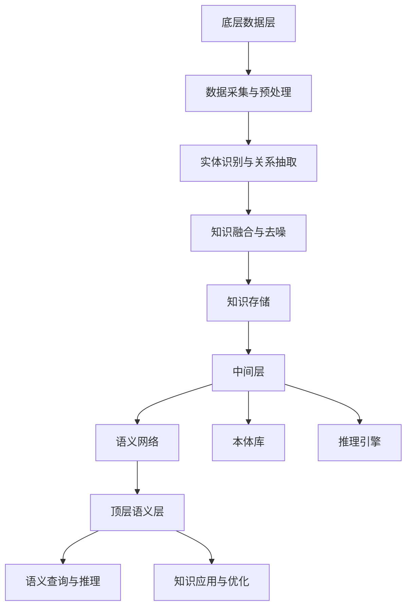

                 

# 知识图谱在智能教育知识推荐与学习路径规划中的应用场景

## 摘要

本文旨在探讨知识图谱在智能教育中的具体应用，重点关注知识推荐与学习路径规划两个关键领域。知识图谱作为一种能够表达实体及其关系的语义网络，为智能教育提供了强大的语义支持。在知识推荐方面，本文将分析基于知识图谱的推荐算法，并结合实际案例展示其在教育平台中的应用。在学习路径规划方面，本文将详细阐述基于知识图谱的路径规划方法，并通过案例说明其在个性化学习路径规划中的作用。此外，本文还将讨论知识图谱在教育资源共享、虚拟教育助理和在线教育平台等场景中的应用，并探讨知识图谱技术在智能教育中面临的挑战与未来发展趋势。通过本文的阐述，读者可以全面了解知识图谱在智能教育领域的应用现状与前景。

## 目录大纲

### 第1章：引言
- 1.1 智能教育的发展背景
- 1.2 知识图谱的重要性
- 1.3 本书的目标与结构

### 第2章：知识图谱基础
- 2.1 知识图谱的基本概念
- 2.2 知识图谱的构建方法
- 2.3 知识图谱的表示与存储

### 第3章：智能教育知识推荐
- 3.1 教育领域的知识推荐概述
- 3.2 基于知识图谱的推荐算法
- 3.3 案例分析：某教育平台的推荐系统设计

### 第4章：学习路径规划
- 4.1 学习路径规划的概念
- 4.2 基于知识图谱的学习路径规划方法
- 4.3 案例分析：个性化学习路径规划系统设计

### 第5章：知识图谱在智能教育中的应用场景
- 5.1 知识图谱在教育资源共享中的应用
- 5.2 知识图谱在虚拟教育助理中的应用
- 5.3 知识图谱在在线教育平台中的应用

### 第6章：挑战与未来趋势
- 6.1 知识图谱在智能教育中的挑战
- 6.2 技术发展趋势
- 6.3 未来展望

### 第7章：项目实战
- 7.1 实战项目概述
- 7.2 项目需求分析
- 7.3 知识图谱设计与实现
- 7.4 知识推荐系统实现
- 7.5 学习路径规划实现
- 7.6 项目总结与反思

### 第8章：知识图谱工具与应用
- 8.1 常用知识图谱工具
- 8.2 知识图谱在智能教育中的实际应用案例
- 8.3 知识图谱技术发展趋势与应用前景

### 附录：资源与扩展阅读
- 8.1 知识图谱相关资源
- 8.2 智能教育领域的最新研究进展
- 8.3 拓展阅读推荐

## 第1章：引言

### 1.1 智能教育的发展背景

随着信息技术的迅猛发展，教育领域也在经历着深刻的变革。传统的教育模式已经无法满足现代社会对个性化、智能化教育的需求。智能教育作为一种新兴的教育模式，旨在通过整合现代信息技术，为学习者提供更加灵活、高效、个性化的学习体验。

智能教育的发展背景可以追溯到20世纪90年代，当时计算机技术、互联网技术和人工智能技术开始逐渐成熟，为教育领域的创新提供了强大的技术支持。随着互联网的普及，在线教育逐渐兴起，为学习者提供了丰富的学习资源和便捷的学习方式。然而，传统的在线教育往往缺乏对学习者的个性化需求和学习效果的跟踪，无法真正实现教育的智能化。

进入21世纪，大数据、云计算、物联网和人工智能等新兴技术不断发展，为智能教育提供了更加丰富的技术手段。智能教育开始强调个性化学习、智能推荐、自适应学习、虚拟现实和增强现实等技术手段的应用，以实现教育的智能化和个性化。

智能教育的目标是通过整合多种技术手段，为学生提供个性化的学习方案，提高学习效果和兴趣。具体来说，智能教育包括以下几个方面的目标：

1. **个性化学习**：根据学习者的兴趣、能力和学习进度，提供个性化的学习内容和教学方式，使学习者能够更好地掌握知识。

2. **智能推荐**：通过分析学习者的学习行为和知识需求，为学习者推荐合适的学习资源，提高学习效率和兴趣。

3. **自适应学习**：根据学习者的学习进度和效果，动态调整学习内容和教学方法，使学习过程更加灵活和高效。

4. **虚拟现实与增强现实**：通过虚拟现实和增强现实技术，为学习者提供更加真实、互动的学习环境，提高学习体验。

5. **数据驱动的决策**：通过收集和分析学习者的学习数据，为教育管理者提供科学的教育决策依据，优化教育资源配置。

智能教育的发展历程可以分为以下几个阶段：

1. **在线教育阶段**：在线教育作为智能教育的初步形态，提供了远程学习和资源共享的方式。

2. **数据驱动的教育阶段**：通过收集和分析学习者的学习数据，教育系统开始实现个性化推荐和自适应学习。

3. **智能教育阶段**：新兴技术的应用使教育系统更加智能化，能够实现虚拟现实、增强现实等先进的教学手段。

目前，智能教育已经取得了一定的进展，但在实际应用中仍然面临一些挑战，如技术实现难度、数据隐私保护、教育资源不均衡等问题。未来，随着技术的不断进步和政策的支持，智能教育将在教育领域中发挥更加重要的作用。

### 1.2 知识图谱的重要性

知识图谱（Knowledge Graph）是一种用于表示实体及其之间关系的语义网络，通过将知识以结构化的形式组织起来，为人工智能系统提供了强大的语义支持。在智能教育领域，知识图谱的重要性体现在以下几个方面：

1. **知识组织与管理**：知识图谱能够将海量的教育知识以结构化的形式进行组织和管理，使得知识检索、知识共享和知识应用变得更加高效。知识图谱通过实体、属性和关系的表达，将零散的教育知识整合为一个有机的整体。

2. **语义理解与推理**：知识图谱能够对教育知识进行语义理解与推理，从而支持智能推荐、学习路径规划等功能。通过知识图谱，系统可以自动理解学习者的需求和知识背景，提供更加精准的学习资源和学习方案。

3. **个性化学习**：知识图谱能够根据学习者的兴趣、能力和学习进度，为学习者推荐合适的学习资源和路径，实现个性化学习。知识图谱通过对学习者学习行为的分析，可以动态调整学习推荐策略，提高学习效果和兴趣。

4. **知识共享与协作**：知识图谱能够促进教育资源的共享和协作。通过知识图谱，不同用户可以共享和利用相同的知识实体和关系，从而实现知识沉淀和传播，提高整体教育水平。

5. **教育智能化**：知识图谱是智能教育的基础设施之一，为智能教育提供了核心的技术支持。知识图谱能够支持智能推荐、自适应学习、虚拟现实和增强现实等智能教育功能，使教育系统更加智能化和高效。

### 1.3 本书的目标与结构

本书旨在探讨知识图谱在智能教育中的应用，重点关注知识推荐与学习路径规划两个关键领域。通过详细阐述知识图谱的基本概念、构建方法、表示与存储，以及其在智能教育中的具体应用，本书旨在为读者提供一套完整的应用解决方案。

本书的结构如下：

1. **第1章：引言**：介绍智能教育的发展背景和知识图谱的重要性，阐述本书的目标与结构。

2. **第2章：知识图谱基础**：详细讲解知识图谱的基本概念、构建方法、表示与存储，为后续章节的应用提供理论基础。

3. **第3章：智能教育知识推荐**：探讨基于知识图谱的推荐算法，结合实际案例展示其在教育平台中的应用。

4. **第4章：学习路径规划**：阐述基于知识图谱的学习路径规划方法，并通过案例说明其在个性化学习路径规划中的作用。

5. **第5章：知识图谱在智能教育中的应用场景**：分析知识图谱在教育资源共享、虚拟教育助理和在线教育平台等场景中的应用。

6. **第6章：挑战与未来趋势**：讨论知识图谱在智能教育中面临的挑战、技术发展趋势以及未来展望。

7. **第7章：项目实战**：通过一个实际项目，详细讲解知识图谱、推荐系统和学习路径规划的实施过程。

8. **第8章：知识图谱工具与应用**：介绍常用知识图谱工具，结合实际应用案例，探讨知识图谱技术的发展趋势与应用前景。

通过本书的阅读，读者可以全面了解知识图谱在智能教育中的应用，掌握知识图谱的基础知识和应用方法，为实际项目开发提供参考。

## 第2章：知识图谱基础

### 2.1 知识图谱的基本概念

知识图谱（Knowledge Graph）是一种用于表示实体及其之间关系的语义网络。它通过将实体、属性和关系以结构化的形式组织起来，为人工智能系统提供了强大的语义支持。知识图谱的基本概念包括实体、属性和关系。

**实体（Entity）**：实体是知识图谱中的基本元素，表示现实世界中具体的事物或概念。例如，人、地点、组织、课程等都可以作为实体。实体可以具有多种类型，例如，一个人可以是学生、教师、学生等。

**属性（Attribute）**：属性是实体的特征或描述，用于表示实体的一些具体信息。例如，一个人的姓名、年龄、国籍等都可以作为属性。属性通常由属性名和属性值组成。

**关系（Relationship）**：关系是实体之间的关联或交互，表示实体之间的语义联系。例如，一个人可以是某个班级的学生，或者两个人可以是朋友关系。关系通常由关系名和关系值组成。

知识图谱通过实体、属性和关系的组合，形成了一个复杂的语义网络。这个网络能够以结构化的形式表达现实世界的知识，使得知识检索、推理和应用变得更加高效和智能。

**知识图谱的层次结构**：知识图谱通常具有三个层次的结构，分别是底层数据层、中间层和顶层语义层。

1. **底层数据层**：底层数据层是知识图谱的基础，它包括原始数据源，如关系数据库、文本、图像、语音等。这些数据源通过数据采集和预处理技术，转化为结构化的知识数据。

2. **中间层**：中间层是知识图谱的核心，它负责对底层数据进行实体识别、关系抽取、知识融合等处理，构建出一个结构化的知识库。中间层通常包括实体识别、关系抽取、知识融合和知识存储等组件。

3. **顶层语义层**：顶层语义层是知识图谱的抽象层，它通过语义网络表示知识，提供语义查询和推理功能。顶层语义层通常包括语义网络、本体库、推理引擎等组件。

知识图谱的基本概念和层次结构如图2-1所示。



### 2.2 知识图谱的构建方法

知识图谱的构建是一个复杂的过程，涉及到数据采集、预处理、实体识别、关系抽取、知识融合和知识存储等多个环节。下面将详细讲解知识图谱的构建方法。

#### 数据采集与预处理

数据采集是知识图谱构建的第一步，它涉及到从各种数据源（如关系数据库、文本、图像、语音等）中获取原始数据。数据采集的方法包括网络爬虫、API接口调用、数据库查询等。

在数据采集后，需要对数据进行预处理。预处理步骤包括数据清洗、数据格式转换、数据去重等。数据清洗的目的是去除数据中的噪声和错误，确保数据的质量。数据格式转换是将不同数据源的数据统一转换为知识图谱所需的格式。数据去重是为了避免重复数据的存储，提高知识图谱的效率。

#### 实体识别与关系抽取

实体识别是知识图谱构建的关键步骤，它涉及到从原始数据中识别出实体。实体识别的方法包括基于规则的方法、基于机器学习的方法和基于深度学习的方法。

关系抽取是在实体识别的基础上，从原始数据中识别出实体之间的关系。关系抽取的方法包括基于规则的方法、基于统计的方法和基于机器学习的方法。

#### 知识融合与去噪

知识融合是将不同来源、不同格式的知识进行整合，形成一个统一的知识库。知识融合的方法包括数据合并、实体合并、关系合并等。

去噪是在知识融合过程中，去除噪声数据和错误数据，提高知识图谱的准确性。去噪的方法包括基于统计的方法、基于机器学习的方法和基于深度学习的方法。

#### 知识存储

知识存储是将构建好的知识图谱存储到数据库或图数据库中，以便进行后续的查询和推理。知识存储的方法包括关系数据库存储、图数据库存储和分布式存储等。

#### 知识图谱构建流程

知识图谱的构建流程可以概括为以下几个步骤：

1. 数据采集：从各种数据源获取原始数据。
2. 数据预处理：清洗、格式转换、去重等。
3. 实体识别：识别出数据中的实体。
4. 关系抽取：识别出实体之间的关系。
5. 知识融合：整合不同来源的知识，形成统一的知识库。
6. 去噪：去除噪声数据和错误数据。
7. 知识存储：将知识图谱存储到数据库或图数据库中。

#### 知识图谱构建工具

知识图谱构建涉及到多个技术和工具，下面介绍一些常用的知识图谱构建工具。

1. **OpenKG**：OpenKG是一个开源的知识图谱平台，提供了数据采集、预处理、实体识别、关系抽取、知识融合和知识存储等组件，支持多种数据源和存储方案。
2. **OpenIE**：OpenIE是一个基于自然语言处理和知识图谱技术的工具，能够从文本中提取出实体和关系，构建知识图谱。
3. **Neo4j**：Neo4j是一个高性能的图数据库，支持复杂的图查询和图分析，适合存储和管理大规模的知识图谱。
4. **Apache Jena**：Apache Jena是一个Java框架，提供了RDF数据模型、存储、查询和推理等功能，适合开发基于RDF的知识图谱应用。

### 2.3 知识图谱的表示与存储

知识图谱的表示与存储是知识图谱构建中的重要环节。知识图谱的表示方法包括图形表示、文本表示和图数据库表示等。下面将分别介绍这些表示方法。

#### 图形表示

图形表示是最直观的知识图谱表示方法，它通过图形化的方式展示实体、属性和关系。常见的图形表示工具包括Mermaid、D3.js和Graphviz等。

1. **Mermaid**：Mermaid是一种基于Markdown的图形表示工具，支持流程图、序列图、时序图、状态图等多种图形表示。
2. **D3.js**：D3.js是一个基于JavaScript的图形库，可以创建高度交互和动态的图形，适合用于Web应用中的知识图谱可视化。
3. **Graphviz**：Graphviz是一个开源的图形可视化工具，支持多种图形表示，包括有向图、无向图、网络图等。

#### 文本表示

文本表示是将知识图谱以文本形式表示，通常使用RDF（Resource Description Framework）数据模型进行表示。RDF使用三元组的形式表示实体、属性和关系，例如（主体，谓语，客体）。

1. **RDF**：RDF是一种基于XML的数据模型，用于表示知识图谱中的实体、属性和关系。RDF数据模型可以方便地进行数据交换和共享。
2. **OWL**：OWL（Web Ontology Language）是RDF的一种扩展，用于表示复杂的知识图谱和本体。OWL支持类、属性、个体等概念，能够表示更为复杂的语义。

#### 图数据库表示

图数据库是一种专门用于存储和管理大规模图数据的数据管理系统，它通过图的结构存储和管理实体、属性和关系。常见的图数据库包括Neo4j、Neo4j OrientDB和ArangoDB等。

1. **Neo4j**：Neo4j是一个高性能的图数据库，支持ACID事务和图查询。Neo4j使用Cypher查询语言进行图数据的查询和分析。
2. **Neo4j OrientDB**：Neo4j OrienDB是Neo4j的分支版本，支持多种数据模型，包括文档、键值和图数据。
3. **ArangoDB**：ArangoDB是一个多模型数据库，支持文档、键值和图数据。ArangoDB使用AQL（ArangoDB Query Language）进行数据查询和分析。

### 2.3.1 知识图谱的查询优化

知识图谱的查询优化是提高知识图谱查询性能的重要手段。常见的查询优化方法包括索引优化、缓存优化和查询优化等。

1. **索引优化**：索引优化是通过创建索引来提高查询性能。在图数据库中，可以通过创建索引来加速实体、属性和关系的查询。
2. **缓存优化**：缓存优化是通过缓存查询结果来提高查询性能。在图数据库中，可以通过缓存常见查询结果来减少重复计算。
3. **查询优化**：查询优化是通过优化查询语句来提高查询性能。在图数据库中，可以通过简化查询语句、合并查询操作等方式来优化查询。

### 2.3.2 知识图谱的可视化

知识图谱的可视化是将知识图谱以图形化的形式展示，帮助用户理解和分析知识图谱。常见的知识图谱可视化工具包括D3.js、Mermaid和GraphXR等。

1. **D3.js**：D3.js是一个基于JavaScript的图形库，可以创建高度交互和动态的图形，适合用于Web应用中的知识图谱可视化。
2. **Mermaid**：Mermaid是一种基于Markdown的图形表示工具，支持流程图、序列图、时序图、状态图等多种图形表示。
3. **GraphXR**：GraphXR是一个基于Web的图形可视化工具，支持大规模知识图谱的交互式可视化。

### 总结

知识图谱作为一种重要的语义网络，在智能教育领域具有广泛的应用。本章详细介绍了知识图谱的基本概念、构建方法和表示与存储。通过本章的学习，读者可以掌握知识图谱的基础知识和构建方法，为后续章节中的应用提供理论基础。

## 第3章：智能教育知识推荐

### 3.1 教育领域的知识推荐概述

知识推荐系统在教育领域具有重要意义，它通过分析学习者的兴趣、学习行为和历史数据，为学习者推荐合适的学习资源和学习路径。知识推荐系统不仅能够提高学习者的学习效率，还能激发学习者的学习兴趣，促进个性化学习。

在教育领域，知识推荐主要包括以下类型：

1. **基于内容的推荐**：这种推荐方法根据学习资源的内容特征进行推荐，通常基于学习资源的标签、分类或者关键词。例如，当学习者浏览了一篇关于数学的博客后，系统可以推荐其他相关的数学文章。

2. **协同过滤推荐**：协同过滤推荐是一种基于用户行为的推荐方法，通过分析学习者的行为模式，找出相似用户或学习资源，从而为学习者推荐新的学习资源。协同过滤推荐可以分为两种类型：基于用户的协同过滤和基于项目的协同过滤。

3. **混合推荐**：混合推荐是将多种推荐方法结合起来，以提高推荐系统的准确性和多样性。例如，可以将基于内容的推荐和协同过滤推荐结合，通过综合分析学习资源和用户行为，提供更加精准的推荐。

### 3.2 基于知识图谱的推荐算法

知识图谱作为一种语义网络，能够表达实体及其之间的关系，为推荐算法提供了强大的语义支持。基于知识图谱的推荐算法主要包括以下几种：

1. **基于知识图谱的协同过滤推荐算法**：

   这种算法结合了知识图谱和协同过滤推荐的方法，通过知识图谱中的实体关系来增强协同过滤推荐的准确性。具体实现步骤如下：

   1. **实体识别与关系抽取**：从用户行为数据中提取用户和资源实体，并建立实体之间的关系。

   2. **用户相似度计算**：基于知识图谱，计算用户之间的相似度，使用节点相似度（如Jaccard相似度）或边相似度（如路径长度）。

   3. **资源相似度计算**：计算资源之间的相似度，例如，基于资源共现关系或属性相似度。

   4. **推荐列表生成**：根据用户相似度和资源相似度，生成推荐列表。

   伪代码实现如下：

   ```python
   def recommend_resources(user, knowledge_graph, resource_similarity, user_similarity):
       user相似的users = find_similar_users(user, knowledge_graph, user_similarity)
       user喜欢但未浏览的资源 = find_未浏览的资源(user相似的users, user)
       user推荐的资源 = find_similar_resources(user喜欢但未浏览的资源, resource_similarity)
       return user推荐的资源
   ```

2. **基于知识图谱的内容推荐算法**：

   这种算法利用知识图谱中的实体和属性关系，通过语义分析为学习者推荐学习资源。具体实现步骤如下：

   1. **实体识别与关系抽取**：从学习资源中提取实体和属性，并建立实体之间的关系。

   2. **属性扩展**：基于实体和关系，扩展资源的属性，例如，通过属性传递或属性合并。

   3. **语义匹配**：计算学习资源与用户兴趣的语义匹配度，使用词向量、文本相似度等指标。

   4. **推荐列表生成**：根据语义匹配度，生成推荐列表。

   伪代码实现如下：

   ```python
   def recommend_resources_by_content(user_interest, knowledge_graph, resource_attributes):
       potential_resources = find_resources_with_similar_attributes(user_interest, resource_attributes)
       semantic_similarity = calculate_semantic_similarity(potential_resources, user_interest)
       recommended_resources = sort_resources_by_similarity(semantic_similarity)
       return recommended_resources
   ```

3. **基于知识图谱的混合推荐算法**：

   这种算法结合了基于知识图谱的协同过滤推荐和内容推荐，通过综合分析用户行为和资源内容，提供更加精准的推荐。具体实现步骤如下：

   1. **用户行为与内容分析**：结合用户的行为数据和资源内容数据，为用户提供个性化的推荐。

   2. **推荐算法融合**：使用加权或融合策略，将协同过滤推荐和内容推荐的结果进行整合。

   3. **推荐列表生成**：根据融合的推荐结果，生成推荐列表。

   伪代码实现如下：

   ```python
   def recommend_resources_combined(user, knowledge_graph, user_behavior, resource_content):
       collaborative_recommended_resources = recommend_resources(user, knowledge_graph)
       content_recommended_resources = recommend_resources_by_content(user_interest, knowledge_graph, resource_content)
       combined_recommended_resources = combine_recommendations(collaborative_recommended_resources, content_recommended_resources)
       return combined_recommended_resources
   ```

### 3.3 案例分析：某教育平台的推荐系统设计

为了更好地理解基于知识图谱的推荐算法在教育领域的应用，下面以一个实际案例——某教育平台的推荐系统设计为例，详细讲解推荐系统的设计过程。

#### 案例背景与目标

某在线教育平台提供了丰富的学习资源，包括课程、文章、视频等。为了提高学习者的学习效率和兴趣，平台希望通过推荐系统为学习者推荐合适的学习资源。推荐系统的目标是：

1. **个性化推荐**：根据学习者的兴趣和学习行为，为学习者推荐个性化的学习资源。
2. **多样性推荐**：提供多样化的学习资源，满足不同学习者的需求。
3. **实时推荐**：根据学习者的实时行为和需求，动态调整推荐策略。

#### 知识图谱构建

在构建推荐系统之前，需要构建一个知识图谱，用于表示学习资源、学习者和其他相关实体。知识图谱的构建过程如下：

1. **实体识别与关系抽取**：

   从学习资源、学习者和其他相关数据中提取实体，如课程、文章、用户等，并建立实体之间的关系。例如，课程与用户之间的关系可以是“学习”、“评分”、“评论”等。

2. **知识融合**：

   通过知识融合技术，将不同来源的知识进行整合，形成一个统一的知识库。知识融合可以基于实体相似性、关系传递等原则，提高知识图谱的完整性和准确性。

3. **知识存储**：

   将知识图谱存储到图数据库中，以便进行后续的查询和推理。常用的图数据库包括Neo4j、OrientDB等。

#### 推荐算法实现

在构建知识图谱的基础上，实现推荐算法。以下是基于知识图谱的协同过滤推荐算法的实现步骤：

1. **用户相似度计算**：

   基于知识图谱，计算用户之间的相似度。具体方法可以采用节点相似度（如Jaccard相似度）或边相似度（如路径长度）。计算公式如下：

   ```python
   similarity(u, v) = 1 - Jaccard Distance(u, v)
   ```

2. **资源相似度计算**：

   计算资源之间的相似度，例如，基于资源共现关系或属性相似度。计算公式如下：

   ```python
   similarity(r, s) = 1 - Euclidean Distance(r, s)
   ```

3. **推荐列表生成**：

   根据用户相似度和资源相似度，生成推荐列表。推荐列表可以通过加权平均或融合策略进行排序，以提高推荐的准确性。

   ```python
   recommended_resources = {resource: similarity * score for resource, similarity, score in resources.items()}
   sorted_recommendations = sorted(recommended_resources.items(), key=lambda item: item[1], reverse=True)
   ```

#### 实施效果评估

为了评估推荐系统的效果，需要对推荐结果进行评估。以下是一些常用的评估指标：

1. **准确率（Accuracy）**：准确率表示推荐结果中正确推荐的比例。计算公式如下：

   ```python
   Accuracy = (正确推荐数 / 总推荐数) * 100%
   ```

2. **召回率（Recall）**：召回率表示推荐结果中包含用户未浏览但感兴趣的资源的比例。计算公式如下：

   ```python
   Recall = (正确推荐数 / 用户未浏览但感兴趣的资源数) * 100%
   ```

3. **覆盖率（Coverage）**：覆盖率表示推荐结果中包含的不同资源数量的比例。计算公式如下：

   ```python
   Coverage = (推荐结果中不同资源数量 / 总资源数量) * 100%
   ```

4. **多样性（Diversity）**：多样性表示推荐结果中不同资源的多样性。可以使用Jaccard指数、覆盖率等指标进行评估。

通过上述评估指标，可以全面评估推荐系统的效果，并针对性地优化推荐算法。

#### 案例总结

通过上述案例分析，我们可以看到基于知识图谱的推荐算法在教育领域的应用前景。知识图谱为推荐算法提供了丰富的语义支持，通过结合用户行为和资源内容，可以生成个性化、多样化和准确的推荐结果。未来，随着知识图谱技术的不断发展，基于知识图谱的推荐系统将在教育领域发挥越来越重要的作用。

## 第4章：学习路径规划

### 4.1 学习路径规划的概念

学习路径规划（Learning Path Planning）是指根据学习者的兴趣、能力和学习目标，设计出一系列的学习资源和步骤，以帮助学习者高效、系统地掌握所需的知识和技能。学习路径规划的核心在于对学习资源的合理组织和时间安排，从而实现个性化学习。

**学习路径规划的目标**：

1. **个性化**：根据学习者的兴趣、能力和学习进度，提供个性化的学习资源和学习方案。
2. **高效性**：通过优化学习路径，提高学习效率，减少学习时间和成本。
3. **系统性**：确保学习者在学习过程中能够系统性地掌握知识和技能，形成完整的知识体系。
4. **适应性**：能够根据学习者的反馈和学习进度，动态调整学习路径和资源。

### 4.2 基于知识图谱的学习路径规划方法

基于知识图谱的学习路径规划方法利用知识图谱中的实体、属性和关系，为学习者提供个性化的学习路径。这种方法主要包括以下几个步骤：

**1. 实体识别与关系抽取**：

首先，从学习资源和学习者的数据中提取实体，如课程、教材、学习者等，并建立实体之间的关系。例如，课程与课程之间可能存在前置课程关系，学习者与课程之间可能存在学习状态关系。

**2. 用户兴趣建模**：

通过分析学习者的学习行为和历史数据，建立学习者的兴趣模型。兴趣模型可以包括学习者喜欢的课程、知识点、教学方式等。常用的方法有基于内容的推荐、协同过滤和基于关键词的文本分析。

**3. 知识层次结构**：

知识图谱中的实体和关系可以表示出知识的层次结构。通过分析知识图谱，可以识别出不同知识点之间的依赖关系和层次结构，从而设计出合理的课程和学习路径。

**4. 路径生成算法**：

基于学习者的兴趣模型和知识层次结构，可以使用各种路径生成算法设计出个性化的学习路径。常见的算法有最短路径算法、遗传算法、A*搜索算法等。

**5. 路径优化与调整**：

学习路径生成后，根据学习者的反馈和学习进度，动态调整学习路径。路径优化可以包括时间优化、资源优化和难度优化等。

### 4.3 案例分析：个性化学习路径规划系统设计

以下是一个基于知识图谱的个性化学习路径规划系统的设计案例。

#### 案例背景与目标

某在线教育平台希望为学习者提供个性化的学习路径规划服务，以满足不同学习者的需求。系统的主要目标是：

1. **个性化推荐**：根据学习者的兴趣、能力和学习目标，为学习者推荐合适的学习资源和学习路径。
2. **自适应调整**：根据学习者的学习进度和反馈，动态调整学习路径，提高学习效果。
3. **知识整合**：整合平台内的各类学习资源，形成系统化的知识体系。

#### 知识图谱构建

在构建个性化学习路径规划系统之前，需要构建一个知识图谱，用于表示学习资源、学习者和其他相关实体。知识图谱的构建过程如下：

1. **实体识别与关系抽取**：

   从学习资源、学习者和其他相关数据中提取实体，如课程、教材、学习者等，并建立实体之间的关系。例如，课程与课程之间存在前置课程关系，学习者与课程之间存在学习状态关系。

2. **知识层次结构**：

   通过分析知识图谱，识别出不同知识点之间的依赖关系和层次结构。例如，计算机编程中的基础知识（如数据结构、算法）与高级知识（如操作系统、计算机网络）之间存在层次关系。

3. **属性扩展**：

   对学习资源和学习者进行属性扩展，例如，学习资源可以包括课程难度、课程时长、课程评价等属性，学习者可以包括学习进度、学习偏好等属性。

#### 路径规划算法

基于知识图谱，使用最短路径算法设计个性化学习路径。具体算法如下：

1. **用户兴趣建模**：

   通过分析学习者的历史数据，建立学习者的兴趣模型。兴趣模型可以包括学习者喜欢的课程、知识点、教学方式等。

2. **知识层次分析**：

   根据知识图谱中的知识层次结构，识别出学习者所需的知识点序列。

3. **路径生成**：

   使用最短路径算法（如Dijkstra算法），从知识点的起点到终点，生成一条最短的学习路径。

4. **路径优化**：

   根据学习者的兴趣模型和学习进度，动态调整学习路径。例如，如果学习者对某个知识点有较高的兴趣，可以优先安排学习该知识点。

#### 系统实现

1. **用户界面**：

   设计用户界面，允许学习者输入学习目标、兴趣等信息，并查看生成的个性化学习路径。

2. **后端服务**：

   开发后端服务，包括知识图谱构建、路径规划算法实现、路径优化等。

3. **数据存储**：

   使用图数据库存储知识图谱，以便进行高效的查询和推理。

#### 实施效果评估

1. **准确率**：

   评估个性化学习路径的准确率，即实际学习路径与目标路径的匹配程度。

2. **效率**：

   评估学习路径规划系统的响应时间，确保系统能够实时为学习者提供个性化学习路径。

3. **用户满意度**：

   通过调查和反馈，评估学习者对个性化学习路径的满意度。

#### 案例总结

通过上述案例分析，我们可以看到基于知识图谱的个性化学习路径规划系统在教育领域的应用前景。知识图谱为路径规划提供了强大的语义支持，通过结合学习者的兴趣、能力和学习目标，可以生成个性化、高效和系统化的学习路径。未来，随着知识图谱技术的不断发展，个性化学习路径规划系统将在教育领域发挥越来越重要的作用。

## 第5章：知识图谱在智能教育中的应用场景

### 5.1 知识图谱在教育资源共享中的应用

知识图谱在教育资源共享中的应用主要体现在知识整合、搜索优化和资源推荐等方面。

**知识整合**：知识图谱能够将分散的教育资源进行有效的整合，形成一个统一的知识体系。通过知识图谱，可以识别出不同课程、教材、论文之间的关联，形成完整的知识网络。这样，学习者可以更加便捷地获取相关资源，实现跨学科、跨领域的知识学习。

**搜索优化**：知识图谱提供了强大的语义搜索功能，能够对教育资源的语义内容进行深度分析。通过语义搜索，学习者可以更快速地找到所需的学习资源，而不仅仅是根据关键词进行简单的匹配。这种搜索方式能够提高资源检索的准确性和效率。

**资源推荐**：基于知识图谱的推荐算法可以分析学习者的学习行为和兴趣，为学习者推荐合适的学习资源。通过知识图谱中的实体关系，推荐系统可以识别出学习者可能感兴趣的其他资源，从而提高推荐的相关性和准确性。

### 5.2 知识图谱在虚拟教育助理中的应用

虚拟教育助理（Virtual Education Assistant，VEA）是一种利用人工智能技术为学习者提供个性化学习支持和指导的系统。知识图谱在虚拟教育助理中的应用主要体现在知识管理、智能问答和个性化辅导等方面。

**知识管理**：知识图谱可以用于管理和组织虚拟教育助理的知识库。通过知识图谱，虚拟教育助理可以更好地理解和存储教育知识，实现知识的结构化和语义化。这样，虚拟教育助理能够更加准确地回答学习者的问题，提供个性化的学习建议。

**智能问答**：知识图谱提供了强大的语义理解能力，使得虚拟教育助理可以理解学习者的自然语言问题，并提供准确的答案。通过知识图谱中的实体和关系，虚拟教育助理可以动态地搜索和组合知识，提供多层次的问答服务。

**个性化辅导**：基于知识图谱的个性化辅导系统能够根据学习者的学习进度、兴趣和能力，为学习者提供定制化的学习路径和辅导方案。通过知识图谱中的知识点层次结构，系统能够识别出学习者需要重点掌握的知识点，并提供相应的学习资源和辅导材料。

### 5.3 知识图谱在在线教育平台中的应用

知识图谱在在线教育平台中的应用主要体现在课程推荐、学习路径规划、用户行为分析等方面。

**课程推荐**：在线教育平台可以通过知识图谱分析学习者的兴趣和学习历史，为学习者推荐相关的课程。知识图谱中的实体和关系可以提供丰富的语义信息，帮助平台更准确地预测学习者的学习需求。

**学习路径规划**：知识图谱可以用于设计个性化的学习路径，帮助学习者系统地掌握知识和技能。通过分析知识图谱中的知识点层次结构，平台可以为学习者生成个性化的学习计划，确保学习者能够有序地学习。

**用户行为分析**：知识图谱能够记录和分析学习者的学习行为，为教育平台提供用户行为分析的基础。通过分析学习者的浏览、学习、评价等行为，平台可以识别出学习者的学习兴趣和习惯，从而提供更加个性化的学习服务。

### 案例分析：在线教育平台的设计与实现

以下是一个在线教育平台的设计与实现案例，展示了知识图谱在课程推荐、学习路径规划和用户行为分析等方面的应用。

#### 案例背景

某在线教育平台旨在为学习者提供丰富、个性化的学习资源和服务。平台的主要功能包括课程推荐、学习路径规划、用户行为分析等。

#### 知识图谱构建

1. **课程知识图谱**：

   构建一个课程知识图谱，用于表示课程、知识点和知识点之间的关系。课程知识图谱可以包括以下实体和关系：

   - **实体**：课程、知识点、学习者等。
   - **关系**：知识点之间的依赖关系、课程与知识点之间的包含关系等。

2. **用户兴趣图谱**：

   构建一个用户兴趣图谱，用于记录学习者的学习兴趣和偏好。用户兴趣图谱可以包括以下实体和关系：

   - **实体**：学习者、兴趣点、学习资源等。
   - **关系**：学习者与兴趣点之间的偏好关系、学习资源与兴趣点之间的关联关系等。

3. **知识层次图谱**：

   构建一个知识层次图谱，用于表示知识点之间的层次结构和依赖关系。知识层次图谱可以包括以下实体和关系：

   - **实体**：知识点、课程等。
   - **关系**：知识点之间的依赖关系、课程与知识点之间的包含关系等。

#### 课程推荐

基于知识图谱的课程推荐算法可以分为以下步骤：

1. **用户兴趣分析**：

   分析学习者的学习历史和偏好，识别出学习者的兴趣点。

2. **知识点关联分析**：

   根据知识图谱，找出与学习者兴趣点相关的知识点和课程。

3. **推荐算法实现**：

   使用协同过滤、基于内容的推荐等算法，为学习者推荐相关的课程。

#### 学习路径规划

基于知识图谱的学习路径规划算法可以分为以下步骤：

1. **知识层次分析**：

   根据知识图谱，识别出学习者的知识层次和依赖关系。

2. **路径生成**：

   使用最短路径算法或遗传算法，为学习者生成一条最短且合理的知识学习路径。

3. **路径优化**：

   根据学习者的反馈和学习进度，动态调整学习路径，确保学习者的学习效果。

#### 用户行为分析

基于知识图谱的用户行为分析算法可以分为以下步骤：

1. **行为记录**：

   记录学习者的学习行为，如浏览、学习、评价等。

2. **行为分析**：

   分析学习者的行为模式，识别出学习者的学习兴趣和习惯。

3. **行为推荐**：

   根据学习者的行为分析结果，为学习者推荐相关的学习资源和服务。

#### 系统实现

1. **前端界面**：

   设计用户友好的前端界面，包括课程推荐、学习路径规划、用户行为分析等模块。

2. **后端服务**：

   开发后端服务，包括知识图谱构建、推荐算法实现、路径规划算法实现等。

3. **数据存储**：

   使用图数据库存储知识图谱，确保数据的高效查询和存储。

#### 实施效果评估

1. **推荐准确性**：

   评估课程推荐的准确性，即推荐课程与学习者兴趣的匹配程度。

2. **学习路径合理性**：

   评估学习路径的合理性，即学习路径是否符合学习者的知识层次和需求。

3. **用户满意度**：

   通过调查和反馈，评估学习者对课程推荐、学习路径规划和用户行为分析等功能的满意度。

#### 案例总结

通过上述案例分析，我们可以看到知识图谱在在线教育平台中的应用价值。知识图谱能够有效地整合教育资源、优化课程推荐、规划学习路径和分析用户行为，从而提高在线教育平台的个性化和服务水平。未来，随着知识图谱技术的不断发展，知识图谱将在在线教育领域发挥更加重要的作用。

## 第6章：挑战与未来趋势

### 6.1 知识图谱在智能教育中的挑战

尽管知识图谱在智能教育中展现出巨大的潜力，但在实际应用中仍面临诸多挑战。

#### 技术挑战

1. **数据质量和完整性**：知识图谱的构建依赖于高质量的数据源。然而，教育领域的数据往往存在不完整、不一致和噪声等问题，这会影响知识图谱的准确性和完整性。

2. **实时性与扩展性**：随着教育资源的不断增加和学习者需求的多样化，知识图谱需要具备良好的实时性和扩展性，以快速适应变化。

3. **跨领域知识整合**：教育领域涉及多个学科和领域，如何有效地整合跨领域知识，构建统一的知识图谱是一个技术难题。

#### 应用挑战

1. **用户隐私保护**：知识图谱在智能教育中的应用涉及大量用户数据，如何保护用户的隐私是一个关键问题。

2. **学习路径规划的有效性**：虽然知识图谱能够为学习者提供个性化的学习路径，但如何确保路径规划的有效性和适应性仍是一个挑战。

3. **教师与技术融合**：教师需要具备相应的技术能力，以有效利用知识图谱进行教学和辅导，但这可能需要额外的培训和支持。

#### 法律与伦理挑战

1. **数据安全和合规性**：知识图谱的构建和应用需要遵守相关的数据保护法规，如GDPR等。

2. **知识公平性问题**：知识图谱中的知识是否能够公平地代表所有学习者，尤其是在教育资源分配不均的情况下，是一个伦理问题。

### 6.2 技术发展趋势

为了克服上述挑战，知识图谱在智能教育中的技术发展趋势主要集中在以下几个方面：

1. **数据驱动的方法**：利用大数据技术和机器学习方法，提高知识图谱的数据质量和完整性。

2. **知识图谱的实时构建与更新**：通过实时数据流处理技术和分布式计算框架，实现知识图谱的实时构建和更新。

3. **跨领域知识整合**：利用本体论和知识融合技术，构建跨领域的统一知识图谱。

4. **隐私保护技术**：采用差分隐私、同态加密等技术，保护用户隐私。

5. **自适应学习与个性化推荐**：结合认知科学和人工智能技术，实现更有效的学习路径规划和个性化推荐。

### 6.3 未来展望

展望未来，知识图谱在智能教育中的应用前景广阔：

1. **智能化教育生态系统**：知识图谱将形成一个智能化的教育生态系统，涵盖知识推荐、学习路径规划、用户行为分析等多个方面。

2. **个性化学习**：知识图谱将推动个性化学习的普及，学习者可以根据自己的需求和兴趣，自主构建学习路径。

3. **智慧教育**：知识图谱将为教育管理者提供智能化的决策支持，优化教育资源的配置和教学策略。

4. **教育公平**：知识图谱可以帮助解决教育公平问题，通过跨领域知识和资源的共享，提高教育资源的可及性和公平性。

总之，知识图谱在智能教育中的应用将带来深刻的变革，为教育领域注入新的活力。未来，随着技术的不断进步和政策的支持，知识图谱将在智能教育中发挥更加重要的作用。

## 第7章：项目实战

### 7.1 实战项目概述

在本章中，我们将通过一个实际项目来展示知识图谱在智能教育中的应用。该项目旨在构建一个智能教育平台，该平台能够提供知识推荐、学习路径规划、用户行为分析等功能。通过这个项目，我们将详细介绍项目的背景与目标、项目团队与分工，以及项目需求分析。

#### 项目背景与目标

随着互联网和人工智能技术的不断发展，在线教育平台越来越普及。然而，现有的在线教育平台往往存在推荐不准确、学习路径规划不合理等问题。为了解决这些问题，本项目旨在构建一个智能教育平台，通过知识图谱技术，提供个性化的知识推荐、学习路径规划和用户行为分析。

项目的主要目标包括：

1. **知识推荐**：利用知识图谱，为学习者推荐与其兴趣和学习需求相关的学习资源。
2. **学习路径规划**：根据学习者的兴趣、能力和学习目标，为学习者设计个性化的学习路径。
3. **用户行为分析**：分析学习者的学习行为，为教育平台提供决策支持，优化用户服务。

#### 项目团队与分工

为了确保项目的顺利实施，我们组建了一个跨学科的项目团队。团队成员包括以下角色：

- **项目经理**：负责项目的整体规划、进度控制和团队协作。
- **数据科学家**：负责知识图谱的构建、数据分析和推荐算法的设计与实现。
- **前端工程师**：负责用户界面的设计与开发，确保用户友好性。
- **后端工程师**：负责后台服务的开发，包括知识图谱存储、查询和推荐系统的实现。
- **测试工程师**：负责项目测试，确保系统的稳定性和可靠性。

### 7.2 项目需求分析

在项目实施前，我们进行了详细的需求分析，以确保项目能够满足用户的需求和期望。需求分析主要包括以下几个方面：

#### 用户需求分析

1. **知识推荐**：用户希望能够根据自己的兴趣和学习需求，快速找到相关学习资源。
2. **学习路径规划**：用户希望能够根据自己的学习目标，设计一个合理的、个性化的学习计划。
3. **用户行为分析**：用户希望能够了解自己的学习习惯和效果，以便进行自我优化。

#### 功能需求分析

1. **知识推荐**：

   - **推荐算法**：利用知识图谱，实现基于内容、协同过滤和混合推荐等多种推荐算法。
   - **推荐结果展示**：为用户提供个性化的推荐结果，包括课程、文章、视频等。
   - **推荐反馈**：允许用户对推荐结果进行评价和反馈，优化推荐系统。

2. **学习路径规划**：

   - **路径生成**：根据用户的学习目标，生成一个合理的、个性化的学习路径。
   - **路径调整**：允许用户根据学习进度和需求，动态调整学习路径。
   - **路径评估**：对学习路径的效果进行评估，提供改进建议。

3. **用户行为分析**：

   - **行为记录**：记录用户的学习行为，包括浏览、学习、评价等。
   - **行为分析**：分析用户的行为数据，识别出用户的学习习惯和偏好。
   - **行为报告**：为用户提供详细的行为分析报告，帮助用户了解自己的学习状况。

#### 非功能需求分析

1. **系统性能**：系统需要具备良好的性能，能够快速响应用户请求，支持大规模数据存储和查询。
2. **用户友好性**：系统界面需要简洁、直观，方便用户使用。
3. **数据安全**：确保用户数据的安全和隐私，遵守相关的数据保护法规。

通过详细的需求分析，我们明确了项目的目标和功能需求，为后续的项目开发提供了清晰的指导。

## 第8章：知识图谱工具与应用

### 8.1 常用知识图谱工具

在构建知识图谱的过程中，选择合适的工具至关重要。以下是一些常用的知识图谱工具，包括开源工具和商业工具，以及它们的优缺点和适用场景。

#### 开源知识图谱工具

1. **OpenKG**：

   - **优点**：功能全面，支持多种数据源和存储方案，易于扩展。
   - **缺点**：学习曲线较陡峭，性能优化需要一定技术背景。
   - **适用场景**：适用于中小规模的知识图谱项目，特别是需要自定义扩展功能的项目。

2. **OpenIE**：

   - **优点**：基于自然语言处理技术，能够从文本中提取出实体和关系。
   - **缺点**：对文本质量要求较高，提取效果受限于自然语言处理技术。
   - **适用场景**：适用于从大量文本数据中构建知识图谱的项目。

3. **Apache Jena**：

   - **优点**：支持RDF数据模型，功能强大，开源免费。
   - **缺点**：学习曲线较陡，对开发者要求较高。
   - **适用场景**：适用于需要处理RDF数据的复杂应用，如语义查询和推理。

4. **Neo4j**：

   - **优点**：图数据库，支持高效的图查询和分析，易于使用。
   - **缺点**：开源版功能有限，性能优化需要专业版支持。
   - **适用场景**：适用于需要高效处理大规模图数据的场景，如社交网络分析。

#### 商业知识图谱工具

1. **OrientDB**：

   - **优点**：支持多种数据模型，包括图、文档和键值，性能优异。
   - **缺点**：价格较高，需要商业支持。
   - **适用场景**：适用于需要高性能和多模型数据存储的场景。

2. **ArangoDB**：

   - **优点**：多模型数据库，支持文档、键值和图数据，易于扩展。
   - **缺点**：开源版功能有限，性能优化需要专业版支持。
   - **适用场景**：适用于需要灵活扩展和多模型数据存储的应用。

3. **GraphDB**：

   - **优点**：基于OWL的本体库，支持复杂的语义查询和推理。
   - **缺点**：价格较高，需要专业支持。
   - **适用场景**：适用于需要复杂语义处理和推理的场景，如知识库构建。

### 8.2 知识图谱在智能教育中的实际应用案例

以下是一些知识图谱在智能教育中的实际应用案例，展示了知识图谱在不同教育场景中的具体应用。

#### 案例一：在线教育平台的推荐系统

某知名在线教育平台利用知识图谱构建了推荐系统，通过分析学习者的学习行为和知识需求，为学习者推荐相关课程。该平台的知识图谱包括课程、知识点、学习者等实体，以及课程与知识点、学习者与知识点等关系。通过基于知识图谱的推荐算法，平台能够为学习者提供个性化的课程推荐，提高了学习者的学习体验。

#### 案例二：个性化学习路径规划系统

某个性化学习平台利用知识图谱为学习者设计个性化的学习路径。该平台的知识图谱包括课程、知识点、学习者等实体，以及课程与知识点、知识点与知识点等关系。通过分析知识图谱中的知识点层次结构，平台能够为学习者生成个性化的学习路径，确保学习者能够系统性地掌握知识和技能。

#### 案例三：教育资源共享平台

某教育资源共享平台利用知识图谱实现教育资源的有效组织和共享。该平台的知识图谱包括课程、教材、论文等实体，以及课程与教材、教材与论文等关系。通过知识图谱，平台能够帮助学习者快速找到相关的学习资源，实现教育资源的跨学科、跨领域的共享。

### 8.3 知识图谱技术发展趋势与应用前景

知识图谱技术在智能教育领域具有广阔的应用前景，随着技术的不断发展，知识图谱在智能教育中的应用将更加深入和广泛。

#### 发展趋势

1. **知识图谱技术的不断优化**：随着人工智能和自然语言处理技术的进步，知识图谱的构建、存储和查询技术将不断优化，提高知识图谱的性能和可靠性。

2. **多模态数据融合**：知识图谱将能够融合多种数据源，如文本、图像、语音等，构建更加丰富和全面的语义网络。

3. **个性化推荐与学习路径规划**：基于知识图谱的个性化推荐和学习路径规划技术将得到进一步发展，提供更加精准和高效的学习服务。

4. **智慧教育生态系统的构建**：知识图谱将在智慧教育生态系统中发挥核心作用，推动教育资源的共享、优化和教育决策的科学化。

#### 应用前景

1. **教育资源共享与传播**：知识图谱将促进教育资源的有效组织和共享，提高教育资源的利用率和可及性。

2. **个性化学习与教育公平**：知识图谱将推动个性化学习的发展，使教育更加公平和高效。

3. **教育管理与决策**：知识图谱将为教育管理者提供丰富的数据支持和智能化的决策支持，优化教育资源的配置和教学策略。

4. **智慧校园与在线教育**：知识图谱将在智慧校园和在线教育平台中发挥关键作用，提升教育服务的质量和体验。

总之，知识图谱技术在智能教育中的应用前景广阔，将为教育领域带来深刻的变革和广阔的发展空间。

## 附录：资源与扩展阅读

### 8.1 知识图谱相关资源

#### 8.1.1 开源知识图谱库

- **DBpedia**：一个基于Web的数据仓库，提供了丰富的实体和关系数据，用于构建知识图谱。
- **Freebase**：一个大规模的开放知识库，包含了实体、属性和关系，适合用于知识图谱的构建和查询。

#### 8.1.2 知识图谱研究论文

- **"Knowledge Graph: A Graphical Structure for Representing Knowledge on the Web"**：介绍了知识图谱的基本概念和结构，是知识图谱领域的重要文献。
- **"Knowledge Graph Embedding: A Survey"**：对知识图谱嵌入技术进行了全面的综述，包括图嵌入、神经网络嵌入等。

#### 8.1.3 知识图谱在线课程

- **Coursera - "Knowledge Graph and Semantic Search"**：由斯坦福大学提供的知识图谱和语义搜索在线课程，涵盖了知识图谱的基础理论和应用。
- **Udacity - "Knowledge Graph Engineer Nanodegree"**：提供了知识图谱工程师的完整学习路径，包括数据预处理、知识图谱构建和查询优化等。

### 8.2 智能教育领域的最新研究进展

#### 8.2.1 智能教育技术的研究趋势

- **"Trends in Intelligent Education: Technologies and Applications"**：概述了智能教育技术的最新研究趋势，包括人工智能、大数据、虚拟现实等。

#### 8.2.2 智能教育领域的重要研究成果

- **"Intelligent Tutoring Systems: A Review of Recent Advances"**：回顾了智能辅导系统的最新研究成果，包括个性化推荐、自适应学习、智能问答等。

#### 8.2.3 国际学术会议与期刊

- **ACM Conference on Intelligent Tutoring Systems (ITS)**：智能辅导系统的国际顶级学术会议，每年都会发布最新的研究成果。
- **Journal of Educational Technology & Society**：一本专注于教育技术与社会发展的国际学术期刊，涵盖了智能教育、在线学习等多个领域。

### 8.3 拓展阅读推荐

#### 8.3.1 经典教材与书籍

- **"Knowledge Graph: A Graphical Structure for Representing Knowledge on the Web"**：由Google的两位工程师撰写，详细介绍了知识图谱的基本概念和应用。
- **"Semantic Web: Integrating HTML and XML with the Resource Description Framework (RDF)"**：一本经典的语义网络教材，介绍了RDF和OWL等知识图谱技术。

#### 8.3.2 知识图谱与智能教育领域的经典论文

- **"Knowledge Graph Embedding: A Survey"**：对知识图谱嵌入技术进行了全面的综述，是知识图谱领域的重要文献。
- **"A Large-scale Knowledge Graph for a General Question Answering System"**：介绍了如何构建大规模的知识图谱，用于通用问答系统。

#### 8.3.3 相关领域的最新研究动态

- **"Knowledge Graph Applications in Natural Language Processing: A Survey"**：概述了知识图谱在自然语言处理领域的最新应用，包括文本生成、问答系统等。
- **"Intelligent Education Systems: A Review of Current Trends and Future Directions"**：回顾了智能教育系统的最新研究进展和未来发展方向。

通过以上资源，读者可以深入了解知识图谱在智能教育中的应用，掌握相关领域的最新研究动态，为未来的学习和研究提供参考。

