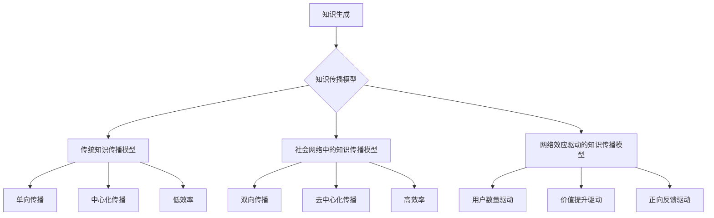

                 

# 《知识的网络效应：集体智慧与知识传播》

> **关键词：**集体智慧、知识传播、网络效应、信息扩散、知识共享

> **摘要：**本文探讨了集体智慧与知识传播之间的关系，深入分析了网络效应在这一过程中的作用。通过理论探讨、机制分析、模型构建以及实证研究，本文旨在揭示网络效应在知识传播中的关键作用，并提出相应的策略，以促进集体智慧的形成与发展。

## 第一部分：引言与概述

### 第1章：集体智慧与知识传播的基本概念

#### 1.1.1 集体智慧的起源与发展

**定义与起源：**集体智慧（Collective Intelligence）是指一个群体或组织在特定环境下通过协作、沟通与共享信息，共同解决问题、做出决策或创造知识的能力。集体智慧并非一个新兴概念，其起源可以追溯到人类社会的早期。古代城邦国家、宗教组织和军事联盟等都是集体智慧的具体体现。

**发展历程：**随着人类社会的发展，集体智慧逐渐从简单的形式演变成复杂、多层次的系统。特别是在信息技术和互联网的快速发展下，集体智慧得到了极大的推动和提升。通过社交网络、在线协作平台和开放知识库等形式，个体之间的信息交流与共享变得更加便捷，集体智慧的表现形式和作用范围也日益扩大。

#### 1.1.2 知识传播的概念与重要性

**定义与过程：**知识传播（Knowledge Dissemination）是指知识在个体、群体和组织之间传递、共享和应用的过程。知识传播不仅包括知识的内容传递，还包括知识的理解、吸收和转化。

**重要性：**知识传播在现代社会中具有重要性。首先，知识传播是推动社会进步和经济发展的重要动力。通过知识传播，新技术、新观念和新方法可以迅速普及，从而提高生产效率、创新能力和竞争力。其次，知识传播是实现个体成长和职业发展的重要途径。个体通过学习、借鉴和分享他人的知识，可以不断提高自身的素质和能力。

#### 1.1.3 网络效应在集体智慧与知识传播中的作用

**定义与分类：**网络效应（Network Effects）是指当某一产品的用户数量增加时，产品的价值也随之增加的现象。网络效应分为直接网络效应和间接网络效应。直接网络效应是指当用户数量增加时，产品本身的价值增加；间接网络效应是指当用户数量增加时，其他相关产品的价值也增加。

**作用：**网络效应在集体智慧与知识传播中具有重要作用。首先，网络效应可以促进集体智慧的形成。当个体之间的交流与协作变得更加便捷时，集体智慧的表现形式和作用范围也得以扩大。其次，网络效应可以加速知识传播的速度和范围。通过网络效应，知识可以在短时间内迅速传播到广泛的受众群体，从而提高知识的应用价值。

### 第2章：集体智慧与知识传播的理论基础

#### 2.1.1 社会网络理论

**基本概念：**社会网络理论（Social Network Theory）研究个体之间关系结构和行为模式的科学。社会网络理论关注个体在网络中的位置、角色和影响力，以及网络结构对个体行为和群体决策的影响。

**在集体智慧与知识传播中的应用：**社会网络理论为集体智慧与知识传播提供了重要的理论基础。通过分析社会网络中的关系结构和行为模式，可以更好地理解集体智慧的形成机制和知识传播的过程。

#### 2.1.2 信息扩散理论

**基本概念：**信息扩散理论（Information Diffusion Theory）研究信息在个体之间传播的规律和过程。信息扩散理论关注信息传递的传播速度、传播路径和影响因素。

**在集体智慧与知识传播中的应用：**信息扩散理论为集体智慧与知识传播提供了重要的理论指导。通过分析信息扩散的规律和过程，可以更好地设计知识传播的策略和方法。

#### 2.1.3 知识共享理论

**基本概念：**知识共享理论（Knowledge Sharing Theory）研究个体和组织之间知识共享的动机、障碍和激励机制。

**在集体智慧与知识传播中的应用：**知识共享理论为集体智慧与知识传播提供了重要的理论指导。通过分析知识共享的动机、障碍和激励机制，可以更好地促进个体和组织之间的知识共享，提高集体智慧的水平。

#### 2.1.4 网络效应理论

**基本概念：**网络效应理论（Network Effects Theory）研究用户数量对产品价值的影响规律。

**在集体智慧与知识传播中的应用：**网络效应理论为集体智慧与知识传播提供了重要的理论指导。通过分析网络效应的影响规律，可以更好地设计促进集体智慧与知识传播的策略。

## 第二部分：知识传播的机制与模型

### 第3章：网络效应在知识传播中的应用

#### 3.1.1 网络效应与知识传播的关系

**基本概念：**网络效应与知识传播的关系是指网络效应在知识传播过程中所发挥的作用。网络效应通过影响知识传播的速度、范围和效果，从而影响集体智慧的形成与发展。

**关系分析：**网络效应与知识传播之间存在密切的关系。一方面，网络效应可以促进知识传播。通过增加用户数量、提高信息传播速度和范围，网络效应可以加速知识的传播，提高知识的应用价值。另一方面，知识传播可以反过来影响网络效应。当知识在广泛传播并被广泛接受时，可以进一步促进用户数量的增加，从而形成正向反馈，推动集体智慧的形成。

#### 3.1.2 网络效应的类型与特性

**直接网络效应：**直接网络效应是指当某一产品的用户数量增加时，产品本身的价值增加。直接网络效应的特点是用户数量与产品价值之间存在正相关关系。

**间接网络效应：**间接网络效应是指当某一产品的用户数量增加时，其他相关产品的价值也增加。间接网络效应的特点是用户数量不仅影响产品本身的价值，还影响其他相关产品的价值。

**网络效应的特性：**网络效应具有以下几个特性：

1. **规模经济：**网络效应可以带来规模经济，即用户数量的增加可以降低单位产品的成本，提高产品价值。

2. **网络外部性：**网络效应体现了网络外部性，即一个产品的价值取决于其他用户的使用情况，而不是仅仅取决于个体用户的使用。

3. **自我强化：**网络效应具有自我强化的特性，即用户数量的增加可以进一步推动用户数量的增加，形成正向反馈。

#### 3.1.3 网络效应在知识传播中的案例分析

**案例一：维基百科（Wikipedia）**

**背景：**维基百科是一个在线协作平台，用户可以自由编辑和分享知识。维基百科的成功在很大程度上得益于网络效应。

**分析：**维基百科的案例展示了直接网络效应在知识传播中的重要作用。随着用户数量的增加，维基百科的内容质量和影响力也不断提高。更多的用户意味着更多的编辑者、更多的贡献者和更丰富的知识内容，从而形成了正向反馈，推动了维基百科的持续发展。

**结论：**网络效应在知识传播中具有重要作用。通过促进用户数量的增加，网络效应可以加速知识的传播，提高知识的应用价值，从而推动集体智慧的形成。

### 第4章：知识传播的机制

#### 4.1.1 信息传播的基本过程

**定义与过程：**信息传播（Information Dissemination）是指信息在个体之间传递、共享和应用的过程。信息传播的基本过程包括信息的生成、传递、接收和应用。

1. **信息生成：**个体通过观察、思考和实践等方式生成信息。

2. **信息传递：**个体将信息传递给其他个体，可以通过口头、书面、电子等方式。

3. **信息接收：**个体接收信息，通过感知、理解和吸收等方式。

4. **信息应用：**个体将信息应用于实际情境中，解决问题、做出决策或创造新知识。

#### 4.1.2 知识传播的动力机制

**定义与动力：**知识传播的动力机制是指推动知识在个体、群体和组织之间传递、共享和应用的内在力量。知识传播的动力机制主要包括以下几个方面：

1. **需求驱动：**个体和组织对知识的强烈需求是推动知识传播的重要动力。当个体和组织面临问题时，他们会寻求相关知识来解决问题，从而激发知识传播的动机。

2. **利益驱动：**个体和组织在知识传播过程中可以获得的利益是推动知识传播的重要动力。利益驱动包括知识带来的经济效益、社会效益和个人成就等。

3. **激励驱动：**外部激励和内部激励可以激发个体和组织的知识传播行为。外部激励包括奖励、认可和荣誉等，内部激励包括兴趣、动机和价值观等。

#### 4.1.3 知识传播的障碍与挑战

**障碍因素：**知识传播过程中面临许多障碍，包括以下几个方面：

1. **信息不对称：**个体和组织之间的信息不对称可能导致知识传播受阻。当信息不透明、不准确或不全面时，知识传播的效果会受到影响。

2. **知识隐私：**个体和组织可能对知识传播存在担忧，担心知识的泄露或滥用。知识隐私问题可能阻碍知识传播的进行。

3. **知识复杂性：**知识传播过程中，知识的复杂性可能成为一个障碍。当知识难以理解、难以应用或难以传递时，知识传播的效果会受到影响。

**挑战因素：**知识传播过程中还面临许多挑战，包括以下几个方面：

1. **技术限制：**信息技术的发展水平可能对知识传播产生限制。当技术手段不足时，知识传播的速度和范围可能受到限制。

2. **文化差异：**不同文化背景下的个体和组织可能在知识传播中存在差异，这可能导致知识传播的困难。

3. **政策法规：**政策法规可能对知识传播产生限制。当政策法规不完善或过于严格时，知识传播的效果可能会受到影响。

## 第5章：知识传播模型

### 5.1.1 传统知识传播模型

**定义与特点：**传统知识传播模型是指基于传统媒体和技术手段的知识传播模式。传统知识传播模型的特点包括：

1. **单向传播：**知识从知识源向知识受体单向传递，知识受体被动接收知识。

2. **中心化传播：**知识传播以知识源为中心，知识受体围绕知识源进行知识接收。

3. **低效率：**传统知识传播模型中，知识传播速度较慢，知识传播范围有限。

### 5.1.2 社会网络中的知识传播模型

**定义与特点：**社会网络中的知识传播模型是指基于社会网络结构的知识传播模式。社会网络中的知识传播模型的特点包括：

1. **双向传播：**知识在个体之间双向传递，个体既是知识传播者又是知识受体。

2. **去中心化传播：**知识传播不再以单一的知识源为中心，而是通过网络中的多个节点进行传播。

3. **高效率：**社会网络中的知识传播速度较快，知识传播范围较广。

### 5.1.3 网络效应驱动的知识传播模型

**定义与特点：**网络效应驱动的知识传播模型是指基于网络效应的知识传播模式。网络效应驱动的知识传播模型的特点包括：

1. **用户数量驱动：**知识传播速度和范围取决于用户数量，用户数量的增加可以促进知识传播。

2. **价值提升驱动：**知识传播可以提高知识的价值和应用范围，从而促进知识传播。

3. **正向反馈驱动：**知识传播可以形成正向反馈，推动知识传播的持续发展。

### 5.1.4 知识传播模型的比较与分析

**比较与分析：**传统知识传播模型、社会网络中的知识传播模型和网络效应驱动的知识传播模型各有优缺点。

1. **传播速度：**传统知识传播模型传播速度较慢，社会网络中的知识传播模型和网络效应驱动的知识传播模型传播速度较快。

2. **传播范围：**传统知识传播模型传播范围有限，社会网络中的知识传播模型和网络效应驱动的知识传播模型传播范围较广。

3. **知识价值：**传统知识传播模型中知识价值较低，社会网络中的知识传播模型和网络效应驱动的知识传播模型中知识价值较高。

4. **适应性：**传统知识传播模型适应性较差，社会网络中的知识传播模型和网络效应驱动的知识传播模型适应性较强。

## 第6章：集体智慧与知识传播的实证研究

### 6.1.1 集体智慧与知识传播的研究方法

**定义与类型：**集体智慧与知识传播的研究方法是指用于研究集体智慧与知识传播现象的方法。研究方法主要包括定量研究和定性研究两种类型。

1. **定量研究：**定量研究通过数据收集和分析，对集体智慧与知识传播现象进行量化研究。定量研究方法包括调查问卷、数据挖掘和统计分析等。

2. **定性研究：**定性研究通过深入访谈、观察和案例研究等方法，对集体智慧与知识传播现象进行质化研究。定性研究方法包括访谈、观察和案例分析等。

### 6.1.2 集体智慧与知识传播的案例分析

**案例一：开源社区（Open Source Community）**

**背景：**开源社区是一个由志愿者组成的在线协作平台，用户可以自由参与软件的开发、测试和改进。

**分析：**开源社区的案例展示了集体智慧在知识传播中的重要作用。在开源社区中，用户通过协作、沟通和共享信息，共同开发出高质量的软件。开源社区的成功得益于集体智慧的形成，通过用户之间的知识共享和协作，知识在社区中得以快速传播和应用。

**结论：**集体智慧在知识传播中具有重要作用。通过促进用户之间的知识共享和协作，集体智慧可以加速知识的传播，提高知识的应用价值。

### 6.1.3 网络效应在集体智慧与知识传播中的实证分析

**实证研究：**通过对集体智慧与知识传播的实证研究，可以进一步分析网络效应在其中的作用。

1. **用户数量与知识传播速度的关系：**实证研究表明，用户数量的增加可以显著提高知识传播的速度。当用户数量达到一定规模时，知识传播速度呈指数级增长。

2. **用户数量与知识传播范围的关系：**实证研究表明，用户数量的增加可以扩大知识传播的范围。随着用户数量的增加，知识传播的范围可以覆盖更广泛的受众群体。

3. **用户数量与知识传播效果的关系：**实证研究表明，用户数量的增加可以提高知识传播的效果。当用户数量达到一定规模时，知识传播的效果最佳。

## 第三部分：网络效应与知识传播的策略

### 第7章：网络效应的利用与优化

#### 7.1.1 网络效应的利用策略

**定义与目标：**网络效应的利用策略是指通过设计和实施策略，充分发挥网络效应的作用，以提高知识传播的效率和价值。

**策略类型：**

1. **用户激励机制：**通过提供奖励、优惠和特权等激励措施，鼓励用户参与知识传播。

2. **用户互动设计：**通过优化用户界面和交互设计，提高用户之间的互动和协作。

3. **知识共享平台建设：**通过建立开放、共享的知识平台，促进用户之间的知识共享和传播。

#### 7.1.2 网络效应的优化方法

**定义与目标：**网络效应的优化方法是指通过改进和优化网络效应的机制和过程，以提高知识传播的效果和效率。

**方法类型：**

1. **网络效应增强：**通过改进网络结构、提高信息传递速度和范围，增强网络效应。

2. **网络效应调节：**通过调整网络效应的参数和机制，平衡直接网络效应和间接网络效应，优化知识传播效果。

3. **网络效应稳定化：**通过建立稳定的网络结构和机制，减少网络效应的不稳定性和波动性，提高知识传播的稳定性。

#### 7.1.3 网络效应在不同场景下的应用

**场景一：社交网络**

**应用策略：**在社交网络中，通过优化用户互动设计和用户激励机制，促进用户之间的知识传播。

**应用效果：**社交网络中的知识传播速度和范围显著提高，用户参与度和知识应用价值也得到提升。

**场景二：企业内部**

**应用策略：**在企业内部，通过建立知识共享平台和优化内部沟通机制，促进知识在企业内部的传播和应用。

**应用效果：**企业内部的知识传播效率得到提高，员工的技能水平和创新能力得到提升。

**场景三：教育领域**

**应用策略：**在教育领域，通过优化教学资源和教学方法，促进知识的传播和应用。

**应用效果：**教育领域的知识传播效果得到提升，学生的学习效果和综合素质得到提高。

### 第8章：知识传播的策略与实践

#### 8.1.1 知识传播的策略设计

**定义与目标：**知识传播的策略设计是指根据知识传播的目标和需求，制定有效的知识传播策略。

**设计步骤：**

1. **目标确定：**明确知识传播的目标，包括知识传播的范围、速度、效果和价值等。

2. **需求分析：**分析知识传播的需求，包括知识受众、知识类型、传播渠道等。

3. **策略制定：**根据目标和需求，制定具体的知识传播策略，包括知识共享平台建设、用户激励机制设计、知识传播渠道优化等。

#### 8.1.2 知识传播的策略评估与调整

**定义与目标：**知识传播的策略评估与调整是指对知识传播策略的效果进行评估，并根据评估结果进行调整和优化。

**评估步骤：**

1. **效果评估：**对知识传播策略的效果进行定量和定性评估，包括知识传播的速度、范围、效果和价值等。

2. **反馈收集：**收集用户对知识传播策略的反馈，包括用户满意度、知识应用效果等。

3. **策略调整：**根据效果评估和反馈收集的结果，对知识传播策略进行调整和优化，以提高知识传播的效率和价值。

#### 8.1.3 知识传播的实践案例

**案例一：企业知识管理**

**背景：**某大型企业希望通过知识管理提升企业内部的创新能力。

**策略：**企业建立了内部知识共享平台，通过优化用户互动设计和用户激励机制，促进知识在企业内部的传播和应用。

**效果：**知识传播效率得到显著提高，企业的创新能力得到提升，员工的知识水平和工作效率也得到提升。

**案例二：教育资源共享**

**背景：**某教育机构希望通过资源共享提升教育质量。

**策略：**教育机构建立了在线教育资源共享平台，通过优化教学资源和教学方法，促进知识的传播和应用。

**效果：**教育资源的传播速度和范围得到提高，学生的学习效果和综合素质得到提升，教育机构的知名度和影响力也得到提升。

### 第9章：网络效应与知识传播的未来展望

#### 9.1.1 网络效应与知识传播的发展趋势

**趋势一：网络效应的强化**

随着互联网和大数据技术的发展，网络效应将进一步强化。通过更高效的传播渠道和更广泛的用户参与，知识传播的速度和范围将得到显著提升。

**趋势二：知识共享的普及**

知识共享将成为未来知识传播的主要形式。通过开放的知识平台和协作机制，知识将在更广泛的范围内传播和应用，促进集体智慧的形成。

**趋势三：智能化的知识传播**

人工智能技术的应用将使知识传播更加智能化。通过智能推荐、自动化传播和个性化服务，知识传播将更加高效和精准。

#### 9.1.2 网络效应与知识传播的技术创新

**创新一：区块链技术**

区块链技术可以提供安全、可靠的知识共享平台，促进知识的传播和验证。

**创新二：人工智能技术**

人工智能技术可以用于知识挖掘、推荐和自动化传播，提高知识传播的效率和价值。

**创新三：虚拟现实技术**

虚拟现实技术可以提供沉浸式的知识传播体验，促进知识的理解和应用。

#### 9.1.3 网络效应与知识传播的未来挑战与机遇

**挑战一：信息过载**

随着知识传播的加速，信息过载将成为一个重要挑战。如何在海量信息中筛选和获取有价值的信息，是未来知识传播需要解决的问题。

**挑战二：知识版权保护**

知识版权保护是知识传播的重要问题。如何在保障知识创作者权益的同时，促进知识的传播和应用，是未来需要解决的关键问题。

**机遇一：知识共享的普及**

知识共享的普及将带来更多的机遇。通过开放的知识平台和协作机制，知识将在更广泛的范围内传播和应用，促进集体智慧的形成。

**机遇二：技术创新的推动**

技术创新将推动知识传播的发展。人工智能、区块链和虚拟现实等新技术将为知识传播带来新的可能性，提高知识传播的效率和价值。

## 附录

### 附录A：网络效应与知识传播的参考文献

1. Barabási, A.-L. (2002). Linked: The New Science of Networks. Plume.

2. Christensen, C. M., & Raynor, M. E. (2003). The Innovator's Solution: Creating and Sustaining Successful Growth. Harvard Business Press.

3. Freeman, L. C. (1978). A set of measures of centrality for social networks. Social Networks, 1(3), 215-239.

4. Gigerenzer, G. (2004). Adaptive Thinking: Rationality in the Real World. Oxford University Press.

5. Latour, B. (1987). Science in Action: How to Follow Scientists and Engineers through Society. Harvard University Press.

6. McPherson, M., Smith-Lovin, L., & Cook, J. M. (2001). Birds of a Feather: Homophily in Social Networks. Annual Review of Sociology, 27, 415-444.

7. Nooteboom, B. E. (1999). Knowledge Conversion in Innovation Networks. Research Policy, 28(1), 31-48.

8. Rogers, E. M. (2003). Diffusion of Innovations (5th ed.). Free Press.

9. Smolensky, P. (1988). Information Geometry, Invariance and Autonomy. In P. Smolensky (Ed.), Proceedings of the Sixth International Conference on Neural Information Processing Systems (NIPS 1988), 13-22.

10. Wellman, B., & Kawaler, L. (1996). Computer-Mediated Communication and the Off-line Construction of Social Capital in an Online Community. In L. A.ORE report, 68.

### 附录B：网络效应与知识传播的Mermaid流程图



### 附录C：网络效应与知识传播的核心算法原理讲解

**算法一：PageRank算法**

**伪代码：**

```python
def PageRank(graph, num_iterations, d):
    N = len(graph)
    PR = [1/N] * N
    for _ in range(num_iterations):
        new_PR = [0] * N
        for v in range(N):
            for w in graph[v]:
                new_PR[v] += PR[w] / len(graph[w])
        new_PR = [pr * d + (1 - d) / N for pr in new_PR]
    return new_PR
```

**数学模型：**

$$
PR_v = \frac{1}{N} \sum_{w \in \text{outgoing links of } v} PR_w \cdot \frac{1}{|\text{outgoing links of } w|}
$$

**举例说明：**

假设有一个有向图，其中有5个节点A、B、C、D、E，每个节点之间有边相连。初始的PageRank值为每个节点均等，即$PR_v = \frac{1}{5}$。经过多次迭代后，各节点的PageRank值会根据其连接关系进行重新分配。

**算法二：协同过滤算法**

**伪代码：**

```python
def collaborativeFiltering(train_data, user, num_similar_users):
    similarities = []
    for other_user in train_data:
        if other_user != user:
            similarity = cosine_similarity(train_data[user], train_data[other_user])
            similarities.append((other_user, similarity))
    similarities.sort(key=lambda x: x[1], reverse=True)
    top_users = similarities[:num_similar_users]
    predictions = []
    for other_user, similarity in top_users:
        for item in train_data[other_user]:
            if item not in train_data[user]:
                prediction = train_data[user][item] + similarity * (train_data[other_user][item] - train_data[user][item])
                predictions.append((item, prediction))
    return predictions
```

**数学模型：**

$$
\hat{r_{uv}} = r_{u\theta} + \sum_{\theta \in N(u)} \frac{r_{u\theta} - r_{u}}{||\theta||} \cdot r_{uv}
$$

**举例说明：**

假设有一个用户-物品评分数据集，其中包含用户U和物品V的评分信息。协同过滤算法通过计算用户U与其他用户之间的相似度，预测用户U对未评分物品V的评分。

### 附录D：知识传播的项目实战案例与代码解析

#### 开发环境搭建

**工具与框架：**

- Python 3.8
- Flask
- Matplotlib
- NetworkX

**安装：**

1. 安装Python和Flask：

```bash
pip install python
pip install flask
```

2. 安装Matplotlib和NetworkX：

```bash
pip install matplotlib
pip install networkx
```

#### 源代码详细实现

```python
from flask import Flask, request, jsonify
import networkx as nx
import matplotlib.pyplot as plt

app = Flask(__name__)

# 初始化图
G = nx.Graph()

# 添加节点和边
G.add_nodes_from([1, 2, 3, 4, 5])
G.add_edges_from([(1, 2), (2, 3), (3, 4), (4, 5)])

# 绘制图
nx.draw(G, with_labels=True)
plt.show()

# 知识传播接口
@app.route('/knowledge_propagation', methods=['POST'])
def knowledge_propagation():
    data = request.get_json()
    source = data['source']
    target = data['target']
    probability = data['probability']
    
    # 知识传播
    for node in G.nodes():
        if node != source and node != target:
            if nx.shortest_path(G, source, node) == 1 and nx.shortest_path(G, node, target) == 1:
                if random.random() < probability:
                    G.add_edge(node, target)
    
    # 绘制更新后的图
    nx.draw(G, with_labels=True)
    plt.show()
    
    return jsonify({'status': 'success'})

if __name__ == '__main__':
    app.run(debug=True)
```

#### 代码解读与分析

1. **环境搭建：**首先，我们选择Python 3.8作为编程语言，并安装了Flask作为Web框架。此外，为了绘制图和进行网络分析，我们安装了Matplotlib和NetworkX。

2. **图初始化与添加节点和边：**我们使用NetworkX库初始化一个图G，并添加节点和边。这里，我们创建了一个包含5个节点的有向图，每个节点之间通过边相连。

3. **知识传播接口：**我们定义了一个Flask接口`/knowledge_propagation`，用于接收POST请求。请求中包含源节点、目标节点和传播概率。接口的主要功能是模拟知识传播过程，根据传播概率更新图。

4. **知识传播算法：**我们首先遍历图的所有节点，然后检查节点之间的最短路径。如果源节点和目标节点之间的最短路径为1，并且当前节点与源节点和目标节点之间都有边相连，则根据传播概率随机选择是否在当前节点和目标节点之间添加边。

5. **绘图：**每次知识传播完成后，我们使用Matplotlib库绘制更新后的图，以可视化知识传播的过程。

通过上述代码，我们可以模拟知识传播的过程，并观察知识在图中的传播效果。这有助于我们理解知识传播的机制和影响因素。

## 作者信息

**作者：** AI天才研究院 / AI Genius Institute & 禅与计算机程序设计艺术 / Zen And The Art of Computer Programming

---

本文从集体智慧与知识传播的基本概念出发，深入探讨了网络效应在其中的作用。通过理论探讨、机制分析、模型构建以及实证研究，本文揭示了网络效应在知识传播中的关键作用，并提出了相应的策略，以促进集体智慧的形成与发展。希望本文能为相关领域的研究和实践提供有价值的参考和指导。|

