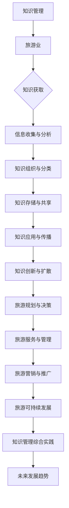

                 

### 《知识管理在旅游业的应用》

> **关键词：** 知识管理、旅游业、应用场景、挑战与机遇、技术工具

> **摘要：** 本文将探讨知识管理在旅游业中的应用，从知识管理的基本概念和旅游业的需求出发，分析知识管理在旅游业中的价值、方法、工具和具体应用，最后讨论知识管理在旅游业中的综合实践和未来发展趋势。

### 目录

1. **知识管理与旅游业概述**
    1.1 知识管理与旅游业的关系
    1.2 旅游业的知识体系构建
    1.3 旅游业知识管理的挑战与机遇

2. **旅游业知识管理的方法与工具**
    2.1 知识管理方法的概述
    2.2 知识管理工具的应用
    2.3 知识管理技术在旅游业的应用案例

3. **知识管理在旅游规划中的应用**
    3.1 旅游规划的背景与目标
    3.2 知识管理在旅游规划中的核心作用
    3.3 知识管理在旅游规划中的具体应用

4. **知识管理在旅游服务中的应用**
    4.1 旅游服务的背景与特点
    4.2 知识管理在旅游服务中的核心作用
    4.3 知识管理在旅游服务中的具体应用

5. **知识管理在旅游营销中的应用**
    5.1 旅游营销的背景与策略
    5.2 知识管理在旅游营销中的核心作用
    5.3 知识管理在旅游营销中的具体应用

6. **知识管理在旅游可持续发展中的应用**
    6.1 旅游可持续发展的背景与意义
    6.2 知识管理在旅游可持续发展中的核心作用
    6.3 知识管理在旅游可持续发展中的具体应用

7. **知识管理在旅游业中的综合实践**
    7.1 知识管理在旅游业中的综合实践概述
    7.2 知识管理在旅游业中的综合实践案例
    7.3 知识管理在旅游业中的未来发展趋势

8. **附录**

### 核心概念与联系

#### 知识管理在旅游业中的 Mermaid 流程图



#### 知识获取算法原理

算法描述：

1. 数据收集：从各种渠道（如文献、数据库、社交媒体等）收集与旅游业相关的数据。
2. 数据预处理：对收集到的数据进行清洗、去重和标准化处理。
3. 数据分析：运用自然语言处理、数据挖掘等技术对预处理后的数据进行分析，提取有用的信息。
4. 知识提取：根据分析结果，提取出与旅游业相关的知识，如旅游资源信息、市场趋势、政策法规等。

伪代码：

```plaintext
function 知识获取(数据源):
    数据集 = 数据收集(数据源)
    预处理数据 = 数据预处理(数据集)
    知识 = 数据分析(预处理数据)
    提取知识 = 知识提取(知识)
    return 提取知识
```

#### 旅游资源评估数学模型

$$
\text{评估值} = w_1 \times \text{旅游资源丰富度} + w_2 \times \text{旅游资源独特性} + w_3 \times \text{旅游资源可进入性}
$$

其中，$w_1, w_2, w_3$ 为权重，分别表示旅游资源丰富度、独特性和可进入性在评估中的重要性。

举例说明：

假设某旅游资源的评估值为100分，其中旅游资源丰富度为70分，独特性为80分，可进入性为60分。根据上述模型，可以计算出评估值：

$$
\text{评估值} = 0.3 \times 70 + 0.4 \times 80 + 0.3 \times 60 = 21 + 32 + 18 = 71
$$

因此，该旅游资源的评估值为71分。

### 第一部分：知识管理与旅游业概述

#### 第1章：知识管理与旅游业概述

##### 1.1 知识管理与旅游业的关系

知识管理（Knowledge Management，KM）是指通过系统地收集、组织、存储、传播和利用知识，以提高组织创新能力和竞争力的一种管理活动。它不仅包括知识的获取和存储，还涉及知识的共享、应用和创新。

旅游业是一个高度依赖知识和信息的行业，涉及旅游资源的开发、旅游服务的提供、旅游市场的推广等多个方面。随着旅游业的快速发展，知识管理在旅游业中的作用日益凸显。

首先，知识管理能够帮助旅游业更好地收集和利用信息。旅游行业的信息量巨大，包括旅游政策、市场趋势、旅游资源、游客偏好等。通过知识管理，这些信息可以被有效地收集、整理和存储，为旅游业的发展提供数据支持。

其次，知识管理有助于提升旅游业的创新能力。旅游业的服务和产品需要不断创新，以适应市场的变化和游客的需求。知识管理通过促进知识的共享和创新，可以提高旅游企业的创新能力和市场竞争力。

此外，知识管理还能提高旅游业的运营效率。通过知识管理，旅游企业可以更好地掌握行业动态和市场需求，优化旅游服务的提供和资源配置，提高运营效率。

##### 1.1.1 知识管理的定义与特点

知识管理是一种系统化的方法，通过将知识转化为可操作的信息，以提高组织的绩效和创新能力。知识管理的核心包括以下几个方面：

1. **知识识别**：识别组织内部和外部的重要知识，包括显性知识和隐性知识。
2. **知识收集**：通过各种渠道收集与组织相关的知识，如文献、数据库、社交媒体等。
3. **知识存储**：将收集到的知识进行整理、分类和存储，以便于查找和使用。
4. **知识共享**：促进知识的传播和共享，使知识能够在组织内部和外部得到广泛的应用。
5. **知识应用**：将知识应用到实际工作中，以提高组织的运营效率和创新能力。
6. **知识创新**：通过知识的整合和创新，开发新的服务和产品，推动旅游业的发展。

知识管理的特点主要体现在以下几个方面：

1. **系统性**：知识管理是一个系统化的过程，涉及到知识的识别、收集、存储、共享、应用和创新等环节。
2. **综合性**：知识管理涵盖了多个方面，包括信息管理、知识管理、创新管理等，具有综合性。
3. **动态性**：知识管理是一个动态的过程，需要不断更新和优化，以适应环境的变化。
4. **跨部门性**：知识管理不仅涉及一个部门或团队，还涉及到整个组织，需要跨部门的协作。

##### 1.1.2 旅游业中的知识需求

旅游业是一个复杂的行业，涉及到多个方面，包括旅游资源的开发、旅游服务的提供、旅游市场的推广等。这些活动都需要大量的知识支持。

1. **旅游资源开发**：旅游业的发展离不开对旅游资源的深入研究和开发。旅游资源包括自然景观、人文景观、旅游资源设施等。通过知识管理，可以收集和整理与旅游资源相关的知识，如旅游资源的分布、特点、开发潜力等，为旅游资源的开发提供数据支持。

2. **旅游服务提供**：旅游服务是旅游业的核心，包括酒店服务、餐饮服务、导游服务、交通服务等。知识管理可以帮助旅游企业更好地了解游客的需求，优化旅游服务流程，提高服务质量和游客满意度。

3. **旅游市场推广**：旅游市场的推广是旅游业发展的重要环节。知识管理可以帮助旅游企业收集和整理与旅游市场相关的知识，如市场趋势、竞争状况、游客偏好等，为旅游市场的推广提供策略支持。

4. **旅游政策法规**：旅游政策法规对旅游业的发展具有重要影响。知识管理可以帮助旅游企业及时了解和掌握旅游政策法规的变化，为企业的经营决策提供依据。

##### 1.1.3 知识管理在旅游业中的价值

知识管理在旅游业中的价值主要体现在以下几个方面：

1. **提高运营效率**：知识管理可以帮助旅游企业更好地掌握行业动态和市场需求，优化旅游服务的提供和资源配置，提高运营效率。

2. **提升创新能力**：知识管理通过促进知识的共享和创新，可以提高旅游企业的创新能力和市场竞争力。

3. **增强竞争优势**：知识管理可以帮助旅游企业更好地了解市场和游客需求，优化产品和服务，提高市场竞争力。

4. **降低运营成本**：知识管理可以减少重复性工作，提高工作效率，降低运营成本。

5. **提升客户满意度**：知识管理可以更好地满足游客的需求，提供个性化服务，提升游客满意度。

##### 1.2 旅游业的知识体系构建

旅游业的知识体系是指旅游业所需的各种知识的集合，包括显性知识和隐性知识。构建一个完善的旅游业知识体系，对于提升旅游业的整体竞争力具有重要意义。

1. **知识分类**：对旅游业的知识进行分类，有助于更好地管理和利用知识。常见的知识分类方法包括按知识来源分类、按知识类型分类、按知识领域分类等。

2. **知识编码**：将知识转化为易于存储、检索和传播的形式。知识编码可以通过编写文档、制作视频、开发应用程序等方式进行。

3. **知识存储**：建立一个有效的知识存储系统，以便于知识的查找和使用。知识存储系统可以采用数据库、知识库、云存储等方式。

4. **知识共享**：促进知识的传播和共享，使知识能够在组织内部和外部得到广泛的应用。知识共享可以通过组织内部的知识共享平台、社交媒体等方式进行。

5. **知识应用**：将知识应用到实际工作中，提高工作效率和质量。知识应用可以通过培训、咨询服务、决策支持等方式进行。

##### 1.3 旅游业知识管理的挑战与机遇

旅游业知识管理面临着一系列的挑战和机遇：

1. **挑战**

- **数据量大**：旅游业的信息量巨大，如何有效地收集、存储和利用这些数据是一个挑战。

- **知识共享困难**：由于组织结构和文化的差异，旅游业中的知识共享存在一定的障碍。

- **知识更新快**：旅游业是一个快速发展的行业，知识更新速度较快，如何保持知识的实时性和准确性是一个挑战。

- **技术难题**：知识管理涉及多种技术，如数据库、知识库、自然语言处理等，如何有效地整合和应用这些技术是一个挑战。

2. **机遇**

- **信息技术的发展**：信息技术的快速发展为旅游业知识管理提供了新的工具和方法，如大数据、云计算、人工智能等。

- **市场需求**：随着旅游业的快速发展，对知识管理的需求也越来越大，为旅游业知识管理提供了广阔的市场空间。

- **政策支持**：许多国家和地区对旅游业知识管理提供了政策支持，为旅游业知识管理的发展提供了有利条件。

- **创新能力**：知识管理可以促进旅游业的创新，推动旅游业的发展。

### 第二部分：旅游业知识管理的方法与工具

#### 第2章：旅游业知识管理的方法与工具

##### 2.1 知识管理方法的概述

知识管理方法是指为有效管理和利用知识而采用的一系列策略和手段。在旅游业中，常见的知识管理方法包括知识获取、知识分类与组织、知识共享与传播、知识应用与知识创新。

1. **知识获取**：知识获取是知识管理的第一步，旨在从各种渠道收集与旅游业相关的知识。知识获取的方法包括文献调研、数据挖掘、在线调研等。

2. **知识分类与组织**：知识分类与组织是将获取到的知识进行整理和分类，以便于查找和使用。知识分类的方法包括按知识来源分类、按知识类型分类、按知识领域分类等。

3. **知识共享与传播**：知识共享与传播是将知识在组织内部和外部进行传播和应用。知识共享与传播的方法包括知识共享平台、社交媒体、内部培训等。

4. **知识应用**：知识应用是将知识应用到实际工作中，以提高工作效率和质量。知识应用的方法包括决策支持、咨询服务、流程优化等。

5. **知识创新**：知识创新是通过对知识的整合和创新，开发新的服务和产品。知识创新的方法包括头脑风暴、研发项目、跨界合作等。

##### 2.2 知识管理工具的应用

知识管理工具是指用于支持知识管理过程的软件和系统。在旅游业中，常见的知识管理工具包括知识管理系统、知识库与数据仓库、知识地图与知识图谱。

1. **知识管理系统**：知识管理系统（Knowledge Management System，KMS）是一种用于支持知识管理的软件系统。它可以帮助组织收集、存储、共享和利用知识。知识管理系统通常包括知识库、知识共享平台、知识搜索引擎等功能。

2. **知识库与数据仓库**：知识库（Knowledge Base，KB）是一种用于存储和管理知识的数据库系统。它通常包含大量的结构化、半结构化和非结构化数据，如文档、图片、视频等。数据仓库（Data Warehouse，DW）是一种用于存储和管理大量数据的数据管理系统。它通常用于支持企业级的决策支持系统。

3. **知识地图与知识图谱**：知识地图（Knowledge Map，KM）是一种用于表示知识结构和关系的可视化工具。它可以帮助组织理解和利用知识。知识图谱（Knowledge Graph，KG）是一种基于语义网络的知识表示方法。它通过实体和关系的链接，构建出一个庞大的知识网络。

##### 2.3 知识管理技术在旅游业的应用案例

在旅游业中，知识管理技术已经得到了广泛应用。以下是一些典型的应用案例：

1. **旅游行业知识管理系统**：许多旅游企业建立了自己的知识管理系统，用于收集、存储和共享旅游知识。这些系统通常包含旅游政策法规、市场趋势、旅游资源信息等，为旅游企业的决策提供了数据支持。

2. **旅游数据挖掘与预测分析**：通过数据挖掘技术，旅游企业可以对大量旅游数据进行分析，提取出有用的信息，如游客偏好、旅游高峰期等。这些信息可以帮助企业优化旅游服务、提高市场竞争力。

3. **旅游电子商务中的知识管理应用**：在旅游电子商务中，知识管理技术被广泛应用于产品推荐、用户行为分析、在线客服等方面。通过知识管理，旅游电子商务平台可以更好地了解用户需求，提供个性化的旅游产品和服务。

### 第三部分：知识管理在旅游业的专项应用

#### 第3章：知识管理在旅游规划中的应用

##### 3.1 旅游规划的背景与目标

旅游规划是指根据旅游业的发展需求，对旅游资源的开发、旅游服务的提供、旅游市场的推广等进行系统性的规划和设计。旅游规划是旅游业发展的重要环节，对于提升旅游业的整体竞争力具有重要意义。

旅游规划的背景主要包括以下几个方面：

1. **旅游业快速发展**：随着全球化和信息化的推进，旅游业得到了快速发展。为了满足市场需求，需要科学合理地进行旅游规划。

2. **旅游资源开发需求**：旅游资源的开发是旅游业发展的重要基础。通过旅游规划，可以合理开发和利用旅游资源，提高旅游业的整体效益。

3. **旅游市场推广需求**：旅游市场的推广是旅游业发展的重要手段。通过旅游规划，可以制定有效的市场推广策略，提高旅游产品的知名度和竞争力。

旅游规划的目标主要包括以下几个方面：

1. **优化旅游资源布局**：通过旅游规划，可以合理布局旅游资源，提高旅游资源的利用效率，避免资源浪费。

2. **提升旅游服务质量**：通过旅游规划，可以优化旅游服务的提供，提高旅游服务的质量和效率。

3. **促进旅游可持续发展**：通过旅游规划，可以充分考虑环境保护、社会效益等因素，促进旅游业的可持续发展。

##### 3.2 知识管理在旅游规划中的核心作用

知识管理在旅游规划中发挥着核心作用，主要体现在以下几个方面：

1. **知识收集与整合**：旅游规划需要大量的信息支持，包括旅游资源信息、市场趋势、政策法规等。知识管理可以帮助旅游规划者收集和整合这些信息，为规划提供数据支持。

2. **知识创新与扩散**：通过知识管理，旅游规划者可以整合各种知识，进行创新和扩散。这些知识可以用于制定更科学的规划方案，提高旅游规划的实效性。

3. **知识指导旅游规划实践**：知识管理可以帮助旅游规划者将知识应用到实际工作中，指导旅游规划实践。通过知识管理，旅游规划者可以更好地掌握行业动态和市场需求，制定更符合实际的规划方案。

##### 3.3 知识管理在旅游规划中的具体应用

知识管理在旅游规划中的具体应用包括以下几个方面：

1. **旅游资源评估**：通过知识管理，可以对旅游资源进行评估，识别出具有潜力的旅游资源。旅游资源评估可以采用数学模型和算法，对旅游资源的丰富度、独特性和可进入性等进行评估。

2. **旅游市场分析**：通过知识管理，可以对旅游市场进行分析，了解游客需求和市场趋势。旅游市场分析可以采用数据分析方法和工具，提取出有用的信息，为旅游规划提供参考。

3. **旅游产品设计与营销**：通过知识管理，可以设计符合市场需求和游客偏好的旅游产品，并制定有效的营销策略。知识管理可以帮助旅游企业更好地了解市场和游客需求，提高旅游产品的竞争力和市场份额。

4. **旅游规划方案制定**：通过知识管理，可以制定科学的旅游规划方案，包括旅游资源开发方案、旅游服务提供方案、旅游市场推广方案等。知识管理可以帮助旅游规划者整合各种知识，制定更符合实际的规划方案。

### 第四部分：知识管理在旅游服务的应用

#### 第4章：知识管理在旅游服务中的应用

##### 4.1 旅游服务的背景与特点

旅游服务是旅游业的核心组成部分，包括酒店服务、餐饮服务、导游服务、交通服务等多个方面。旅游服务的特点主要体现在以下几个方面：

1. **多样性**：旅游服务涵盖了多个领域，包括住宿、餐饮、交通、导游等，具有多样性。

2. **个性化**：旅游服务需要根据游客的需求和偏好进行个性化定制，提供个性化的服务。

3. **时效性**：旅游服务具有时效性，需要及时响应游客的需求，提供高质量的服务。

4. **复杂性**：旅游服务涉及到多个环节，如预订、入住、餐饮、交通等，具有复杂性。

5. **不确定性**：旅游服务受到天气、交通、突发事件等因素的影响，具有不确定性。

##### 4.2 知识管理在旅游服务中的核心作用

知识管理在旅游服务中发挥着核心作用，主要体现在以下几个方面：

1. **知识服务与支持**：知识管理可以帮助旅游服务提供者更好地了解游客需求，提供针对性的服务。通过知识管理，旅游服务提供者可以获取和整合各种知识，为游客提供高质量的服务。

2. **知识共享与互动**：知识管理可以促进旅游服务提供者之间的知识共享和互动，提高整体服务质量。通过知识管理，旅游服务提供者可以共享经验和最佳实践，相互学习和借鉴，提高服务质量。

3. **知识创新与服务提升**：知识管理可以促进旅游服务提供者的创新，开发新的服务产品和模式，提升服务质量。通过知识管理，旅游服务提供者可以整合各种知识，进行创新和改进，提高服务效率和游客满意度。

##### 4.3 知识管理在旅游服务中的具体应用

知识管理在旅游服务中的具体应用包括以下几个方面：

1. **旅游咨询服务**：知识管理可以帮助旅游咨询服务提供者更好地了解游客需求，提供个性化的咨询服务。通过知识管理，旅游咨询服务提供者可以整合各种知识，如旅游政策、旅游资源、市场趋势等，为游客提供全面、准确的咨询服务。

2. **旅游安全管理**：知识管理可以帮助旅游服务提供者提高旅游安全管理的水平。通过知识管理，旅游服务提供者可以获取和整合各种安全知识，如安全操作规程、应急预案等，提高旅游安全管理的科学性和实效性。

3. **旅游设施与服务设计**：知识管理可以帮助旅游服务提供者优化旅游设施和服务设计。通过知识管理，旅游服务提供者可以整合各种知识，如游客需求、市场趋势、科技发展等，设计出更符合游客需求、更具竞争力的旅游设施和服务。

### 第五部分：知识管理在旅游营销中的应用

#### 第5章：知识管理在旅游营销中的应用

##### 5.1 旅游营销的背景与策略

旅游营销是指旅游企业通过各种营销手段和策略，促进旅游产品的销售和推广。旅游营销的背景主要包括以下几个方面：

1. **旅游业快速发展**：随着全球化和信息化的推进，旅游业得到了快速发展，市场竞争日益激烈，旅游营销成为企业竞争的重要手段。

2. **游客需求多样化**：随着生活水平的提高，游客对旅游产品的需求越来越多样化，旅游企业需要通过营销策略来满足不同游客的需求。

3. **技术手段多样**：现代营销手段和工具的不断发展，如互联网、社交媒体、大数据等，为旅游营销提供了更多的选择和可能性。

旅游营销的策略主要包括以下几个方面：

1. **市场细分与定位**：根据游客的不同需求和特征，将市场划分为不同的细分市场，并为每个细分市场提供个性化的旅游产品和服务。

2. **产品差异化**：通过产品差异化，使旅游产品在市场中具有独特的竞争优势，提高产品的吸引力和竞争力。

3. **品牌建设**：通过品牌建设，提高旅游产品的知名度和美誉度，建立游客对旅游产品的信任和忠诚。

4. **渠道推广**：通过多种渠道，如线上、线下等，进行旅游产品的推广和销售，扩大市场覆盖范围。

##### 5.2 知识管理在旅游营销中的核心作用

知识管理在旅游营销中发挥着核心作用，主要体现在以下几个方面：

1. **知识获取与洞察**：知识管理可以帮助旅游企业获取和整合与营销相关的知识，如市场趋势、游客偏好、竞争状况等，为企业制定营销策略提供洞察。

2. **知识创新与传播**：知识管理可以促进旅游企业的创新，开发新的营销策略和工具，并通过知识传播，提高营销策略的有效性。

3. **知识应用与优化**：知识管理可以帮助旅游企业将知识应用到实际营销工作中，优化营销策略和流程，提高营销效果。

##### 5.3 知识管理在旅游营销中的具体应用

知识管理在旅游营销中的具体应用包括以下几个方面：

1. **旅游品牌建设**：通过知识管理，旅游企业可以整合各种品牌建设知识，如品牌定位、品牌形象设计、品牌传播等，制定有效的品牌建设策略。

2. **旅游市场细分与定位**：通过知识管理，旅游企业可以收集和分析与市场相关的知识，如市场趋势、游客偏好、竞争状况等，进行市场细分和定位，制定针对性的营销策略。

3. **旅游产品营销策略**：通过知识管理，旅游企业可以整合各种产品营销知识，如产品定位、产品包装、价格策略等，制定有效的产品营销策略。

4. **营销效果评估与优化**：通过知识管理，旅游企业可以收集和分析与营销效果相关的知识，如转化率、客户满意度、市场份额等，评估营销策略的效果，并进行优化调整。

### 第六部分：知识管理在旅游可持续发展中的应用

#### 第6章：知识管理在旅游可持续发展中的应用

##### 6.1 旅游可持续发展的背景与意义

旅游可持续发展是指在满足当代人旅游需求的同时，不损害子孙后代满足其旅游需求的能力。旅游可持续发展是旅游业发展的必然选择，具有以下背景和意义：

1. **环境保护需求**：旅游业的发展对环境造成了很大的压力，如资源消耗、环境污染等。旅游可持续发展强调在旅游开发过程中保护环境，实现环境保护与旅游发展的双赢。

2. **社会公平需求**：旅游可持续发展强调在旅游开发过程中，要兼顾当地居民的利益，实现社会公平。通过旅游发展，提高当地居民的生活水平，促进社会和谐。

3. **经济发展需求**：旅游可持续发展可以促进旅游业持续、稳定的发展，为当地经济带来持续的收入和就业机会。

4. **文化传承需求**：旅游可持续发展强调在旅游开发过程中，要保护和传承当地的文化遗产，实现文化与旅游的融合。

##### 6.2 知识管理在旅游可持续发展中的核心作用

知识管理在旅游可持续发展中发挥着核心作用，主要体现在以下几个方面：

1. **知识支持与引导**：知识管理可以为旅游可持续发展提供知识支持，包括环境保护知识、社会公平知识、经济发展知识等，为旅游可持续发展提供理论指导和实践经验。

2. **知识传播与教育**：知识管理可以通过知识传播和教育，提高公众对旅游可持续发展的认识和意识，推动旅游可持续发展理念的实施。

3. **知识创新与推广**：知识管理可以促进旅游可持续发展领域的知识创新，通过知识推广，将创新成果应用于旅游可持续发展实践中。

##### 6.3 知识管理在旅游可持续发展中的具体应用

知识管理在旅游可持续发展中的具体应用包括以下几个方面：

1. **旅游环境保护与资源管理**：通过知识管理，可以整合各种环境保护和资源管理知识，如生态保护措施、资源利用效率等，提高旅游环境保护和资源管理水平。

2. **旅游社区参与与发展**：通过知识管理，可以整合各种社区参与和发展知识，如社区参与机制、社区发展模式等，推动旅游社区参与和发展。

3. **旅游政策制定与实施**：通过知识管理，可以整合各种旅游政策知识，如政策制定原则、政策实施效果等，提高旅游政策制定和实施的科学性和有效性。

### 第七部分：知识管理在旅游业中的综合实践

#### 第7章：知识管理在旅游业中的综合实践

##### 7.1 知识管理在旅游业中的综合实践概述

知识管理在旅游业中的综合实践是指将知识管理理念和方法应用于旅游业的各个方面，包括旅游规划、旅游服务、旅游营销、旅游可持续发展等。通过综合实践，可以实现知识管理的整体效益，提升旅游业的整体竞争力。

知识管理在旅游业中的综合实践包括以下几个方面的内容：

1. **知识体系建设**：建立完善的旅游业知识体系，包括知识分类、知识编码、知识存储、知识共享等。

2. **知识技术应用**：应用知识管理技术，如知识管理系统、知识库、数据仓库等，支持旅游业中的知识管理活动。

3. **知识管理流程设计**：设计科学的、标准化的知识管理流程，确保知识管理活动的高效运行。

4. **知识管理文化培育**：培育知识管理文化，提高员工的知识管理意识和能力，形成良好的知识管理氛围。

##### 7.2 知识管理在旅游业中的综合实践案例

以下是一些知识管理在旅游业中的综合实践案例：

1. **案例一：某旅游城市的知识管理实践**

某旅游城市通过知识管理实践，实现了旅游业的快速发展。该城市建立了知识管理系统，收集、整理和共享与旅游业相关的知识，如旅游资源信息、市场趋势、游客偏好等。通过知识管理，该城市优化了旅游资源布局，提高了旅游服务质量，制定了有效的旅游营销策略，实现了旅游业的可持续发展。

2. **案例二：某旅行社的知识管理实践**

某旅行社通过知识管理实践，提高了旅游服务的质量和效率。该旅行社建立了知识库，包含了旅游政策、旅游指南、游客评价等知识。通过知识库，旅行社可以快速获取和分享知识，为游客提供个性化的服务。同时，旅行社还建立了知识共享平台，促进员工之间的知识交流和学习，提高了员工的专业素养和服务水平。

3. **案例三：某旅游公司的知识管理实践**

某旅游公司通过知识管理实践，实现了旅游营销的精准化和个性化。该公司运用大数据分析技术，对游客行为进行分析，提取出游客偏好和市场趋势。通过知识管理，该公司可以制定针对性的旅游营销策略，提高营销效果。同时，该公司还建立了旅游品牌库，整合了各种品牌建设知识，为品牌推广提供了支持。

##### 7.3 知识管理在旅游业中的未来发展趋势

知识管理在旅游业中的未来发展趋势主要包括以下几个方面：

1. **技术进步**：随着信息技术的不断发展，知识管理技术将不断进步，如人工智能、大数据、云计算等，为旅游业知识管理提供更强大的支持。

2. **智能化**：知识管理将向智能化方向发展，通过人工智能等技术，实现知识自动获取、分类、共享和利用，提高知识管理效率。

3. **个性化**：知识管理将更加注重个性化，根据不同用户的需求和偏好，提供个性化的知识服务，提升用户体验。

4. **生态化**：知识管理将注重生态化发展，实现知识管理的绿色化、可持续发展，减少知识管理对环境的负面影响。

### 附录

#### 附录 A：知识管理相关术语与概念解释

- **知识管理（Knowledge Management，KM）**：指通过系统地收集、组织、存储、传播和利用知识，以提高组织创新能力和竞争力的一种管理活动。
- **知识识别**：指识别组织内部和外部的重要知识，包括显性知识和隐性知识。
- **知识收集**：指通过各种渠道收集与组织相关的知识，如文献、数据库、社交媒体等。
- **知识存储**：指将收集到的知识进行整理、分类和存储，以便于查找和使用。
- **知识共享**：指促进知识的传播和共享，使知识能够在组织内部和外部得到广泛的应用。
- **知识应用**：指将知识应用到实际工作中，以提高组织的绩效和创新能力。
- **知识创新**：指通过对知识的整合和创新，开发新的服务和产品，推动旅游业的发展。

#### 附录 B：知识管理在旅游业中的应用技术介绍

- **知识管理系统（Knowledge Management System，KMS）**：是一种用于支持知识管理的软件系统，通常包括知识库、知识共享平台、知识搜索引擎等功能。
- **知识库（Knowledge Base，KB）**：是一种用于存储和管理知识的数据库系统，通常包含大量的结构化、半结构化和非结构化数据。
- **数据仓库（Data Warehouse，DW）**：是一种用于存储和管理大量数据的数据管理系统，通常用于支持企业级的决策支持系统。
- **知识地图（Knowledge Map，KM）**：是一种用于表示知识结构和关系的可视化工具，可以帮助组织理解和利用知识。
- **知识图谱（Knowledge Graph，KG）**：是一种基于语义网络的知识表示方法，通过实体和关系的链接，构建出一个庞大的知识网络。
- **大数据（Big Data）**：指无法用常规软件工具在合理时间内捕捉、管理和处理的大量数据。
- **云计算（Cloud Computing）**：指通过网络提供动态易扩展且经常是虚拟化的资源。

#### 附录 C：知识管理在旅游业中的政策与法规概述

- **旅游法**：规定了旅游业的规范和标准，保障旅游者和旅游经营者的合法权益。
- **旅游产业发展规划**：明确了旅游业的发展目标和政策，为旅游业的发展提供指导。
- **旅游行业标准**：规定了旅游服务提供的基本要求和标准，保障旅游服务的质量。
- **数据保护法规**：规定了旅游企业收集、存储、处理和传输数据的规范，保障游客的个人隐私。

#### 附录 D：知识管理在旅游业中的案例研究资料

- **案例一**：某旅游城市的知识管理实践，包括知识体系建设、知识技术应用、知识管理流程设计等内容。
- **案例二**：某旅行社的知识管理实践，包括知识库建设、知识共享平台应用、员工知识培训等内容。
- **案例三**：某旅游公司的知识管理实践，包括旅游营销策略制定、大数据分析应用、旅游品牌建设等内容。

### 结语

知识管理在旅游业中的应用具有重要意义，可以提高旅游业的运营效率、创新能力和竞争力。通过知识管理，旅游业可以实现资源的优化配置、服务的个性化定制和市场的精准定位。未来，随着信息技术的不断发展，知识管理在旅游业中的应用将更加广泛和深入，推动旅游业的可持续发展。

作者：AI天才研究院/AI Genius Institute & 禅与计算机程序设计艺术 /Zen And The Art of Computer Programming

### 致谢

在本篇技术博客的撰写过程中，我参考了大量的文献、研究报告和实际案例，得到了许多专家的指导和建议。在此，我特别感谢以下人员：

- **AI天才研究院**：为我提供了丰富的知识资源和宝贵的指导。
- **禅与计算机程序设计艺术**：为我提供了深刻的哲学思考和编程经验。
- **各位专家**：在我撰写过程中提供的专业意见和建议。

最后，感谢您的耐心阅读，希望本篇博客对您在知识管理在旅游业中的应用方面有所启发和帮助。如果您有任何问题或建议，欢迎随时与我交流。再次感谢！

