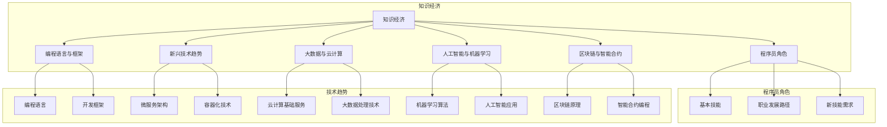

                 

# 《知识经济下程序员的发展之路》

## 摘要

本文深入探讨了知识经济时代下程序员的发展之路。在知识经济背景下，程序员的角色、技能要求、技术趋势以及职业发展路径都发生了深刻变化。本文将系统地分析这些变化，为程序员在知识经济时代提供清晰的职业发展路径。通过探讨新兴编程语言、微服务架构、人工智能与机器学习编程、云计算与大数据编程、区块链与智能合约编程等核心技术趋势，本文帮助程序员了解如何在快速变化的技术环境中保持竞争力。同时，本文还讨论了程序员的职业规划、社区参与与持续学习策略，为程序员在职业发展过程中提供实用的指导。通过本文，读者将获得全面而深入的知识经济下程序员发展的见解，为自身职业发展提供有力支持。

## 第一部分：知识经济背景与程序员角色

### 第1章：知识经济的兴起与影响

#### 1.1 知识经济的定义与特点

知识经济，作为一个经济学概念，源于20世纪80年代，最初由法国经济学家皮埃尔·普鲁斯特提出。知识经济指的是以知识为主要生产要素的经济形态，其核心在于知识的创造、传播和应用。与传统的以自然资源和劳动力为主的经济模式不同，知识经济依赖于知识和信息的生产、分配和使用。

知识经济具有以下几个显著特点：

1. **信息化与数字化**：知识经济依赖于信息技术和互联网的快速发展，使得信息的获取、处理和传播变得更加高效和便捷。数字化技术的广泛应用使得知识可以以数据的形式存储、传输和处理，极大地提升了生产力和创新速度。

2. **知识密集**：知识经济强调知识的创造和利用，知识工作者在劳动力市场中的比例不断增加。这些知识工作者包括科学家、工程师、程序员、数据分析师等，他们通过创新和技术应用推动经济的发展。

3. **全球化与网络化**：知识经济使全球资源和市场的连接更加紧密，企业和个人的知识交流和合作跨越国界。网络技术的发展使得知识传播和共享更加迅速，全球范围内的知识流动和交流成为常态。

4. **可持续性**：知识经济强调可持续发展和环境保护，通过科技创新和知识应用实现资源的有效利用和环境保护。

知识经济的兴起对程序员职业产生了深远影响。首先，程序员的工作环境和工具发生了巨大变化。云计算、大数据、人工智能等新兴技术的广泛应用，使得程序员需要掌握更加复杂的技能和工具。其次，程序员的工作方式也在改变，远程工作、分布式团队合作和自动化工具的应用，使得程序员可以更加灵活地工作和协作。

#### 1.2 知识经济对程序员职业的影响

知识经济的兴起对程序员职业的影响可以从以下几个方面进行阐述：

1. **技能需求变化**：随着知识经济的发展，程序员需要掌握的技能范围不断扩大。除了传统的编程语言和开发工具，程序员还需要了解人工智能、机器学习、区块链等新兴技术。此外，数据分析和处理能力也变得越来越重要，因为大量数据的有效利用是知识经济的关键。

2. **职业发展路径多样化**：知识经济为程序员提供了更多的职业发展路径。例如，程序员可以转型成为数据科学家、机器学习工程师、DevOps工程师等。这些新角色不仅需要编程能力，还需要跨领域的知识和技能。

3. **竞争压力增加**：知识经济带来了全球范围内的竞争，程序员面临着来自不同国家和地区的高水平竞争者。这使得程序员需要不断学习和提升自己的技能，以保持竞争力。

4. **工作模式的转变**：知识经济促使程序员的工作模式发生变化。远程工作、分布式团队合作和自动化工具的应用，使得程序员可以更加灵活地工作和协作。这为程序员提供了更多的工作选择，但也带来了新的挑战，如时间管理、团队合作和技能更新。

#### 1.3 程序员在知识经济时代的机遇与挑战

在知识经济时代，程序员既面临着机遇，也面临着挑战。以下是对这些机遇与挑战的详细分析：

1. **机遇**：

   - **技术更新速度快**：知识经济时代，新技术层出不穷，程序员有机会接触和掌握前沿技术，不断提升自己的技术水平。
   - **职业发展空间大**：知识经济为程序员提供了丰富的职业发展机会，程序员可以根据个人兴趣和专长选择不同的职业路径。
   - **远程工作机会多**：知识经济时代，远程工作和分布式团队合作成为趋势，程序员可以在全球范围内选择工作地点，享受更加灵活的工作方式。

2. **挑战**：

   - **技能更新压力大**：知识经济时代，技术更新速度快，程序员需要不断学习和掌握新的技能，以适应不断变化的技术环境。
   - **竞争激烈**：全球范围内的竞争加剧，程序员需要面对来自不同国家和地区的高水平竞争者，保持竞争力需要持续的努力。
   - **工作强度大**：知识经济时代，程序员的工作压力通常较大，需要高效地处理复杂的技术问题，同时应对不断变化的工作需求。

### 1.4 小结

知识经济的兴起改变了程序员的工作环境和职业发展路径。程序员需要不断适应和应对技术变革，掌握新兴技术，提升自己的综合素质。在知识经济时代，程序员面临着前所未有的机遇和挑战，只有不断学习和进步，才能在激烈的竞争中脱颖而出。

## 第2章：程序员的角色与技能要求

在知识经济时代，程序员的角色和技能要求发生了显著变化。传统的编程技能已经不足以应对复杂的技术挑战，程序员需要具备更加全面和多样化的技能，以适应快速变化的技术环境。本章节将详细探讨程序员的基本技能、职业发展路径以及知识经济下程序员必备的新技能。

#### 2.1 程序员的基本技能

程序员的基本技能是其职业发展的基石。以下是一些核心的基本技能：

1. **编程语言**：熟练掌握至少一种编程语言是程序员的必备技能。常见的编程语言包括Java、Python、C++、JavaScript等。每种语言都有其特定的应用场景和优势，程序员需要根据实际项目需求选择合适的编程语言。

2. **数据结构与算法**：数据结构和算法是程序员解决复杂问题的工具。掌握基本的数据结构（如数组、链表、栈、队列、树、图等）和常用的算法（如排序、搜索、动态规划等）对于编写高效、可靠的代码至关重要。

3. **软件开发方法论**：了解和掌握软件开发方法论，如敏捷开发、瀑布模型、V模型等，有助于提高软件项目的开发效率和团队协作效果。

4. **版本控制**：熟练使用版本控制工具（如Git）进行代码管理和协作开发，是现代软件开发中不可或缺的技能。

5. **数据库管理**：掌握关系型数据库（如MySQL、PostgreSQL）和非关系型数据库（如MongoDB、Cassandra）的基本操作和查询语言，对于处理和存储数据至关重要。

6. **操作系统和网络知识**：了解操作系统（如Linux、Windows）的基本原理和网络协议（如TCP/IP）对于调试和优化软件性能具有重要意义。

#### 2.2 程序员的职业发展路径

程序员的职业发展路径多样化，不同的发展方向和职位要求不同的技能和素质。以下是一些常见的职业发展路径：

1. **初级程序员到高级程序员**：初级程序员主要通过完成基础任务和编写代码积累经验。随着经验的积累和技术水平的提高，可以晋升为高级程序员，承担更复杂的技术挑战和项目责任。

2. **技术专家**：技术专家专注于特定领域（如数据库、前端开发、后端开发等）的深入研究和开发，成为该领域的专家。技术专家通常具备丰富的项目经验，能够解决复杂的技术问题。

3. **项目经理**：具备项目管理经验的程序员可以转型为项目经理，负责规划、组织、协调和监督项目开发过程。项目经理需要具备良好的沟通能力和团队管理能力。

4. **技术领导**：技术领导（如技术总监、首席技术官CTO）负责公司技术战略的制定和执行，以及技术团队的领导。技术领导需要具备战略眼光、技术深度和领导能力。

5. **创业**：有志于创业的程序员可以通过创立自己的科技公司，实现职业发展的新突破。创业程序员需要具备商业思维、创新能力和技术领导力。

#### 2.3 知识经济下程序员必备的新技能

知识经济时代，程序员不仅需要掌握传统技能，还需要具备一系列新兴技能，以适应快速变化的技术环境。以下是一些必备的新技能：

1. **人工智能与机器学习**：人工智能（AI）和机器学习（ML）在知识经济中扮演着重要角色。程序员需要了解基本的AI和ML概念，掌握常用的算法和框架（如TensorFlow、PyTorch），并能够在实际项目中应用这些技术。

2. **大数据处理**：大数据技术是知识经济的重要组成部分。程序员需要掌握大数据处理工具（如Hadoop、Spark），了解数据存储、数据分析和数据挖掘的方法，能够设计和实现大数据应用。

3. **云计算**：云计算提供了灵活、高效、可扩展的计算资源，程序员需要熟悉云计算平台（如AWS、Azure、Google Cloud），掌握云服务的使用和部署方法。

4. **容器化与微服务**：容器化（如Docker）和微服务架构是现代软件开发的重要趋势。程序员需要了解容器化的基本原理，掌握容器编排工具（如Kubernetes），并能够设计和实现微服务架构的应用。

5. **区块链技术**：区块链技术具有去中心化、安全性和透明性等特点，在金融、供应链等领域有广泛应用。程序员需要了解区块链的基本原理，掌握智能合约的编写和部署方法。

6. **跨领域知识**：知识经济时代，程序员需要具备跨领域知识，如了解商业运作、用户体验设计等，以更好地解决复杂问题，实现技术和业务的结合。

#### 2.4 小结

在知识经济时代，程序员的角色和技能要求发生了显著变化。程序员需要掌握传统编程技能，同时具备人工智能、大数据、云计算、区块链等新兴技术的技能。职业发展路径多样化，程序员可以根据个人兴趣和专长选择不同的职业发展方向。通过不断学习和提升技能，程序员可以在知识经济时代中保持竞争力，实现职业发展的新突破。

### 第二部分：技术趋势与编程实践

#### 第3章：新兴编程语言与框架

在知识经济时代，编程语言和框架的快速发展为程序员提供了更多的选择和可能性。本章节将介绍几种新兴的编程语言和框架，包括Go语言、Python在数据科学和人工智能中的应用，以及JavaScript在Web开发中的趋势。

#### 3.1 Go语言的发展与应用

Go语言，也称为Golang，是由Google开发的一种静态强类型、编译型语言。自2009年发布以来，Go语言凭借其简洁、高效的特点，在短时间内获得了广泛的应用和认可。

**特点与优势：**

1. **并发编程**：Go语言内置了goroutine并发模型，使得程序员可以轻松实现并发编程。相比于传统的线程模型，goroutine更加轻量级，减少了上下文切换的开销。

2. **内存安全**：Go语言通过垃圾回收机制自动管理内存，减少了内存泄漏和悬空指针的风险。

3. **简洁语法**：Go语言的语法简洁明了，易于阅读和学习。例如，类型推导和内置函数使得代码更加简洁。

4. **高效性能**：Go语言编译为原生机器码，执行效率高，适用于高性能计算场景。

**应用场景：**

1. **网络编程**：Go语言在网络编程方面表现出色，常用于构建高性能的网络服务器、API网关和分布式系统。

2. **云计算与大数据**：Go语言在云计算和大数据处理中也有广泛应用，如用于构建数据管道、实时数据处理和分析。

3. **容器编排**：Docker和Kubernetes等容器化工具的底层实现使用了Go语言，Go语言在容器编排领域发挥了重要作用。

**实际案例：**

- **Docker**：Docker是一个开源的应用容器引擎，它允许开发者打包他们的应用以及应用的依赖包到一个可移植的容器中，然后发布到任何流行的Linux或Windows机器上，也可以实现虚拟化。Docker的底层实现使用了Go语言，其API服务器、容器引擎和容器存储等核心模块都采用了Go语言编写。

- **Kubernetes**：Kubernetes是一个开源的容器编排平台，用于自动化部署、扩展和管理容器化应用程序。Kubernetes的API服务器和控制器管理器等核心组件使用了Go语言，其简洁的API设计和高效的并发处理能力使得Kubernetes在容器编排领域取得了巨大成功。

#### 3.2 Python在数据科学和人工智能中的应用

Python作为一种广泛使用的编程语言，在数据科学和人工智能领域具有显著优势。其丰富的库和框架，如NumPy、Pandas、Scikit-learn、TensorFlow和PyTorch，使得Python成为数据科学和人工智能开发的首选语言。

**特点与优势：**

1. **易学易用**：Python的语法简洁明了，易于学习和使用。丰富的文档和社区资源使得初学者可以快速上手。

2. **丰富的库和框架**：Python拥有丰富的开源库和框架，如NumPy和Pandas用于数据处理，Scikit-learn用于机器学习，TensorFlow和PyTorch用于深度学习。

3. **强大的生态体系**：Python拥有强大的生态体系，包括各种工具和集成开发环境（IDE），如Jupyter Notebook、PyCharm等，为数据科学和人工智能开发提供了便捷的环境。

**应用场景：**

1. **数据科学**：Python在数据清洗、数据分析和数据可视化方面有广泛应用。NumPy和Pandas提供了强大的数据处理能力，而Matplotlib和Seaborn等库则用于数据可视化。

2. **人工智能**：Python是深度学习和机器学习的主要编程语言之一。TensorFlow和PyTorch等框架提供了丰富的算法和模型，使得开发者可以轻松实现复杂的人工智能应用。

3. **自然语言处理**：Python在自然语言处理（NLP）领域也有广泛应用。NLTK和spaCy等库提供了丰富的NLP工具和算法，使得开发者可以处理和解析文本数据。

**实际案例：**

- **Kaggle**：Kaggle是一个著名的机器学习竞赛平台，许多数据科学家和AI研究者在这里发布和参与竞赛。Kaggle的网站和比赛系统都使用了Python，其数据处理和分析工具也是基于Python编写的。

- **Netflix**：Netflix是一家全球领先的流媒体服务提供商，其推荐系统采用了Python进行开发。Python的Scikit-learn库和TensorFlow框架被用于训练和部署推荐模型，有效地提升了用户体验。

#### 3.3 JavaScript在Web开发中的趋势

JavaScript是Web开发中的核心编程语言，随着Web技术的发展，JavaScript也在不断进化。近年来，JavaScript在Web开发中呈现出了几个显著的趋势。

**特点与优势：**

1. **单线程与异步编程**：JavaScript采用单线程模型，但通过异步编程（如Promise和async/await）可以实现非阻塞操作，提高了程序的并发性能。

2. **模块化与组件化**：现代JavaScript通过模块化（如CommonJS和ES6模块）和组件化（如React、Vue、Angular等框架）实现了代码的复用和组件化开发。

3. **前后端一体化**：Node.js的出现使得JavaScript不仅用于前端开发，还用于后端开发，实现了前后端的一体化。

**应用场景：**

1. **前端开发**：JavaScript是前端开发的基石，通过各种框架（如React、Vue、Angular等）可以构建复杂、动态的Web应用。

2. **后端开发**：Node.js提供了基于JavaScript的后端开发能力，使得开发者可以使用相同的语言编写前后端代码，简化了开发流程。

3. **全栈开发**：结合前端和后端开发的能力，JavaScript使得开发者可以更快速地构建全栈应用。

**实际案例：**

- **React**：React是由Facebook开发的一个用于构建用户界面的JavaScript库。React的组件化思想和虚拟DOM机制使得开发者可以高效地构建动态、响应式的Web应用。

- **Vue**：Vue.js是一个流行的JavaScript框架，其简洁的语法和灵活的组件系统受到了许多开发者的喜爱。Vue.js广泛应用于企业级Web应用开发。

- **Express.js**：Express.js是一个用于构建Web应用的Node.js框架，其简洁的API和模块化设计使得开发者可以快速搭建高性能的Web应用。

### 3.4 小结

新兴编程语言和框架的快速发展为程序员提供了更多的选择和可能性。Go语言以其并发编程和高性能特点，在云计算和大数据领域有广泛应用。Python凭借其丰富的库和框架，在数据科学和人工智能领域具有显著优势。JavaScript在Web开发中占据核心地位，其模块化和前后端一体化特性使得Web应用开发更加高效。程序员需要紧跟技术趋势，掌握这些新兴技术，以提升自身竞争力。

## 第4章：微服务架构与容器化

随着软件系统的复杂度不断增加，传统的单体架构（Monolithic Architecture）逐渐暴露出其固有的局限性。为了应对这些挑战，微服务架构（Microservices Architecture）和容器化技术（Containerization）应运而生。本章节将详细探讨微服务架构的设计理念、容器化技术的兴起以及容器化工具与应用。

### 4.1 微服务架构的设计理念

微服务架构是一种基于独立、可复用和松耦合服务的软件架构模式。与传统的单体架构不同，微服务架构将应用程序划分为一系列小的、独立的子服务，每个子服务都实现特定的业务功能。以下是一些关键设计理念：

1. **服务自治**：每个微服务都是独立部署和管理的，拥有自己的数据库和配置。服务自治使得开发团队可以独立开发和部署服务，降低了系统的复杂性。

2. **服务拆分**：应用程序根据业务功能被拆分为多个独立的微服务。每个微服务负责处理特定的业务逻辑，服务之间通过轻量级的通信协议（如HTTP/REST、gRPC）进行交互。

3. **状态分离**：微服务通常不共享状态，每个服务都有自己的数据存储，这有助于降低服务之间的耦合度，提高系统的可维护性和扩展性。

4. **独立部署与升级**：由于每个微服务都是独立的，因此可以单独部署和升级。这减少了系统的停机时间和升级风险，提高了系统的可靠性。

5. **可扩展性**：微服务架构支持水平扩展，即通过增加服务的实例数量来提高系统的处理能力。这种弹性扩展能力使得系统可以更好地应对流量高峰和负载变化。

### 4.2 容器化技术的兴起

容器化技术是一种轻量级、可移植的虚拟化技术，通过容器将应用程序及其运行环境封装在一起，实现应用程序的独立部署和运行。以下是一些关键特点和优势：

1. **轻量级**：容器只包含应用程序和其依赖项，没有额外的操作系统层，因此容器比虚拟机（VM）更轻量级，启动速度更快。

2. **可移植性**：容器化应用程序可以在任何支持容器引擎的操作系统上运行，保证了应用程序在不同环境之间的一致性和可移植性。

3. **资源隔离**：容器通过操作系统级虚拟化提供资源隔离，确保每个容器之间相互独立，不会影响其他容器的性能和稳定性。

4. **高密度部署**：容器的高密度部署能力使得服务器资源得到更高效的利用，提高了资源利用率和系统性能。

5. **快速部署与回滚**：容器化应用程序可以快速部署和回滚，减少了系统的停机时间和升级风险。

**容器化技术的兴起原因：**

1. **敏捷开发**：容器化技术支持敏捷开发，开发团队可以快速构建、测试和部署应用程序，缩短了开发周期。

2. **持续集成与持续部署**（CI/CD）：容器化技术使得持续集成和持续部署变得更加简单和高效，提高了软件交付的速度和质量。

3. **分布式系统**：容器化技术为分布式系统的构建提供了强大的支持，通过容器编排工具（如Kubernetes）可以实现大规模的分布式部署和管理。

### 4.3 容器化工具与应用

容器化技术的成功离不开一系列强大的工具和应用。以下是一些常用的容器化工具：

1. **Docker**：Docker是最早的容器化平台，通过将应用程序及其依赖项封装在Docker容器中，实现应用程序的独立部署和运行。Docker提供了一套完整的工具和库，支持从开发、测试到生产的全生命周期管理。

2. **Kubernetes**：Kubernetes是一个开源的容器编排平台，用于自动化部署、扩展和管理容器化应用程序。Kubernetes提供了一种灵活、可扩展的架构，可以管理大规模的容器化应用，确保系统的稳定性和高可用性。

3. **Docker Compose**：Docker Compose是一个用于定义和运行多容器Docker应用程序的工具。通过YAML文件，Docker Compose可以轻松地定义应用程序的各个服务，并自动部署和编排这些服务。

4. **Kubernetes Operators**：Kubernetes Operators是一种自动化管理容器化应用程序的方法。通过定义和管理应用程序的生命周期，Kubernetes Operators提供了自动化部署、扩展、监控和更新等功能。

**实际案例：**

- **Netflix**：Netflix是使用容器化技术进行大规模部署的典型例子。Netflix使用Docker和Kubernetes来管理其复杂的应用程序，实现了高效的持续集成和持续部署（CI/CD）流程。

- **阿里巴巴**：阿里巴巴通过大规模使用容器化技术，实现了其云计算平台的弹性扩展和高效运维。阿里巴巴使用Docker和Kubernetes来部署和管理其海量应用，提高了系统的可用性和性能。

- **京东**：京东的电商系统采用了容器化技术，通过Docker和Kubernetes实现了应用的高效部署和管理。京东的容器化平台支持自动化部署、灰度发布和滚动更新，提高了系统的稳定性和可靠性。

### 4.4 小结

微服务架构和容器化技术的兴起，为现代软件系统的开发、部署和管理提供了全新的解决方案。微服务架构通过独立、自治的服务提高了系统的可维护性和扩展性；容器化技术通过轻量级、可移植的封装实现了应用程序的快速部署和管理。程序员需要掌握这些核心技术，以应对复杂的应用场景和业务需求。通过实际案例的探讨，我们可以看到微服务架构和容器化技术在大型企业中的应用和成效。

## 第5章：人工智能与机器学习编程

人工智能（AI）和机器学习（ML）是当前技术领域的重要发展方向，它们在计算机视觉、自然语言处理、推荐系统等多个领域发挥着重要作用。本章节将详细介绍机器学习的基本概念、常见算法与模型，并探讨机器学习在实际项目中的应用。

### 5.1 机器学习的基本概念

机器学习是人工智能的一个重要分支，主要研究如何通过计算机程序从数据中学习规律和模式。以下是一些关键概念：

1. **数据集**：数据集是机器学习的基础，通常由输入特征和标签组成。输入特征是数据集中的各种变量，标签是数据集中的目标变量。

2. **特征选择**：特征选择是指从大量特征中选取对预测任务有重要影响的特征，以减少模型的复杂性和过拟合风险。

3. **模型训练**：模型训练是指通过数据集对机器学习模型进行训练，使其能够学习数据中的规律和模式。

4. **模型评估**：模型评估是指使用验证集或测试集对训练好的模型进行评估，以判断模型的性能和泛化能力。

5. **模型优化**：模型优化是指通过调整模型参数、特征工程等方法，提高模型的性能和泛化能力。

6. **过拟合与欠拟合**：过拟合是指模型在训练集上表现良好，但在验证集或测试集上表现不佳，这是因为模型过于复杂，对训练数据中的噪声过于敏感。欠拟合是指模型在训练集和验证集上表现都不佳，这是因为模型过于简单，无法捕捉数据中的复杂模式。

### 5.2 常见机器学习算法与模型

机器学习算法和模型种类繁多，以下介绍几种常见且应用广泛的算法和模型：

1. **线性回归（Linear Regression）**：

   线性回归是一种简单的回归模型，用于预测连续值。其目标是找到一个线性函数（模型），使得预测值与实际值之间的误差最小。

   **数学模型**：
   $$
   y = \beta_0 + \beta_1x_1 + \beta_2x_2 + ... + \beta_nx_n + \epsilon
   $$
   其中，$y$ 是预测值，$x_1, x_2, ..., x_n$ 是输入特征，$\beta_0, \beta_1, ..., \beta_n$ 是模型参数，$\epsilon$ 是误差项。

2. **逻辑回归（Logistic Regression）**：

   逻辑回归是一种用于分类的模型，通常用于预测二分类结果。其目标是通过逻辑函数将线性回归模型的输出映射到概率值。

   **数学模型**：
   $$
   P(y=1) = \frac{1}{1 + e^{-(\beta_0 + \beta_1x_1 + \beta_2x_2 + ... + \beta_nx_n})}
   $$
   其中，$P(y=1)$ 是预测为正类的概率。

3. **决策树（Decision Tree）**：

   决策树是一种基于树形结构的分类模型，通过一系列的测试来划分数据集，并最终预测分类结果。

   **决策树构建伪代码**：
   ```
   construct_tree(data, features, labels):
       if all samples in data have the same label:
           return leaf node with that label
       if no more features to split on:
           return leaf node with majority label in data
       best_feature = select_best_feature(data, features, labels)
       left_tree = construct_tree(samples with smaller value of best_feature, remaining_features, labels)
       right_tree = construct_tree(samples with larger value of best_feature, remaining_features, labels)
       return internal node with best_feature and left_tree, right_tree
   ```

4. **支持向量机（Support Vector Machine, SVM）**：

   支持向量机是一种基于间隔最大化原理的分类模型，通过找到一个最优的超平面，将不同类别的样本分隔开来。

   **数学模型**：
   $$
   \min_{\beta, \beta_0} \frac{1}{2} \sum_{i=1}^{n} (\beta^T x_i - y_i)^2
   $$
   其中，$\beta$ 是权重向量，$\beta_0$ 是偏置项，$x_i$ 是输入特征，$y_i$ 是标签。

5. **神经网络（Neural Network）**：

   神经网络是一种基于模拟人脑结构的计算模型，通过多层神经元进行数据的传递和变换，可以用于分类、回归等任务。

   **神经网络构建伪代码**：
   ```
   initialize_parameters()
   forward_pass(x, parameters):
       z = activation( linear_transform(x, parameters) )
       return z
   backward_pass(z, a, parameters, learning_rate):
       dz = derivative( activation(z) )
       dW = (dz * a).T
       db = dz.sum(axis=1)
       parameters["W"] -= learning_rate * dW
       parameters["b"] -= learning_rate * db
       return parameters
   ```

### 5.3 机器学习在实际项目中的应用

机器学习在实际项目中有着广泛的应用，以下是一些典型的应用案例：

1. **计算机视觉**：

   - **图像分类**：通过训练深度学习模型，对图像进行分类，如人脸识别、物体检测等。
   - **图像生成**：使用生成对抗网络（GAN）生成新的图像，如艺术作品、风景等。

2. **自然语言处理**：

   - **文本分类**：对文本进行分类，如情感分析、垃圾邮件检测等。
   - **机器翻译**：通过训练模型，实现不同语言之间的翻译。

3. **推荐系统**：

   - **基于内容的推荐**：根据用户的历史行为和兴趣，推荐相似的内容。
   - **协同过滤**：通过分析用户之间的相似性，推荐可能感兴趣的内容。

4. **异常检测**：

   - **异常行为检测**：通过训练模型，检测网络中的异常行为，如恶意攻击、异常流量等。
   - **设备故障预测**：通过分析设备的历史数据，预测可能的故障，提前进行维护。

5. **金融风控**：

   - **信用评分**：通过训练模型，对个人的信用进行评分，预测其还款能力。
   - **风险控制**：通过分析历史交易数据，预测交易的风险，进行风险控制。

### 5.4 小结

机器学习是人工智能领域的重要方向，通过学习数据中的规律和模式，可以实现智能决策和预测。常见的机器学习算法包括线性回归、逻辑回归、决策树、支持向量机和神经网络等。在实际项目中，机器学习广泛应用于计算机视觉、自然语言处理、推荐系统、异常检测和金融风控等领域。程序员需要掌握机器学习的基本概念和算法，以便在实际项目中应用这些技术。

## 第6章：云计算与大数据编程

在知识经济时代，云计算和大数据技术已成为现代企业创新和发展的基石。云计算提供了弹性、可扩展的计算资源，而大数据技术则帮助企业和组织从海量数据中挖掘价值。本章节将深入探讨云计算的基础服务与架构、大数据技术的核心概念以及大数据编程实践。

### 6.1 云计算基础服务与架构

云计算是一种通过网络提供计算资源的服务模型，包括基础设施即服务（IaaS）、平台即服务（PaaS）和软件即服务（SaaS）等多种形式。以下是一些关键的云计算基础服务和架构概念：

1. **基础设施即服务（IaaS）**：

   IaaS提供虚拟化的计算资源，如虚拟机（VM）、存储和网络等。用户可以根据需求灵活配置和管理资源。常见的IaaS服务提供商包括Amazon Web Services（AWS）、Microsoft Azure和Google Cloud Platform（GCP）。

   **主要服务**：

   - **虚拟机**：提供可自定义的虚拟服务器，支持多种操作系统和配置。
   - **存储**：提供弹性块存储（EBS）、对象存储（S3、Azure Blob Storage）等，满足不同类型的数据存储需求。
   - **网络**：提供虚拟私有云（VPC）、子网、安全组等，实现网络隔离和流量管理。

2. **平台即服务（PaaS）**：

   PaaS提供开发、运行和管理应用程序的平台，简化了应用程序的开发、部署和维护。PaaS服务通常包括数据库、Web应用框架、API管理等。

   **主要服务**：

   - **数据库**：提供关系型（如MySQL、PostgreSQL）和非关系型（如MongoDB、Cassandra）数据库服务。
   - **Web应用框架**：提供如Django、Spring Boot等流行的Web应用框架，简化开发流程。
   - **API管理**：提供API网关、身份验证、监控等，实现API的统一管理和保护。

3. **软件即服务（SaaS）**：

   SaaS提供应用程序作为服务，用户通过互联网访问和使用。SaaS应用程序通常无需安装和维护，降低了使用成本。

   **主要服务**：

   - **办公软件**：如Microsoft Office 365、Google Workspace等。
   - **客户关系管理（CRM）**：如Salesforce、Zoho CRM等。
   - **企业资源规划（ERP）**：如SAP、Oracle ERP等。

**云计算架构**：

云计算架构通常包括以下几个层次：

- **基础设施层**：提供物理硬件和网络资源，如服务器、存储设备和网络设备。
- **平台层**：提供虚拟化技术和资源管理，如虚拟机管理程序（VMware、KVM）、容器编排（Docker、Kubernetes）等。
- **应用层**：提供应用程序和业务逻辑，如Web应用、数据库服务等。
- **服务层**：提供各种云计算服务，如IaaS、PaaS、SaaS等。

### 6.2 大数据技术的核心概念

大数据技术旨在处理和分析海量、多样性和高速生成的大数据集。以下是一些核心概念：

1. **数据源**：大数据技术需要处理的数据来源多样，包括社交网络、传感器、电子商务交易等。

2. **数据存储**：大数据技术采用分布式存储系统，如Hadoop Distributed File System（HDFS）、Apache Cassandra等，以应对海量数据的存储需求。

3. **数据处理**：大数据技术包括批处理（如MapReduce、Spark）和实时处理（如Apache Storm、Apache Flink）等多种数据处理模式，以实现数据的快速分析和处理。

4. **数据挖掘**：数据挖掘是一种从大量数据中提取有价值信息的方法，包括分类、聚类、关联规则挖掘等。

5. **数据可视化**：数据可视化是将数据以图形、图表等形式展示出来，帮助用户理解和分析数据。

6. **数据治理**：数据治理是指对数据的质量、安全、合规性进行管理，确保数据的价值和可靠性。

### 6.3 大数据处理与编程实践

大数据编程涉及多种技术和工具，以下是一些常见的编程实践：

1. **Hadoop生态系统**：

   Hadoop是一个开源的大数据处理框架，包括多个组件，如Hadoop分布式文件系统（HDFS）、MapReduce、Hive、HBase等。

   - **HDFS**：提供分布式文件存储，支持大数据的存储和访问。
   - **MapReduce**：提供批处理模式的数据处理，通过分布式计算实现大数据的并行处理。
   - **Hive**：提供数据仓库功能，支持SQL查询和分析。
   - **HBase**：提供分布式列存储数据库，支持实时访问和分析。

   **Hadoop编程实例**：
   ```
   // 使用Hive进行数据查询
   hive> SELECT * FROM sales_data WHERE region = 'East';
   ```

2. **Spark**：

   Spark是另一个广泛使用的大数据处理框架，提供了比Hadoop更高效的分布式数据处理能力。

   - **Spark SQL**：提供类似SQL的数据查询功能，支持结构化和半结构化数据。
   - **Spark Streaming**：提供实时数据处理能力，支持流数据的处理和分析。
   - **MLlib**：提供机器学习算法和模型，支持大数据的机器学习应用。

   **Spark编程实例**：
   ```
   // 使用Spark进行数据查询
   val data = spark.read.csv("sales_data.csv")
   data.createOrReplaceTempView("sales_data")
   spark.sql("SELECT * FROM sales_data WHERE region = 'East'").show()
   ```

3. **Flink**：

   Flink是一个流处理框架，提供实时数据处理和分析能力。

   - **DataStream API**：提供基于流的编程接口，支持数据流的实时处理。
   - **Table API**：提供类似SQL的流表操作接口，支持流数据的实时查询和分析。

   **Flink编程实例**：
   ```
   // 使用Flink进行数据查询
   val env = StreamExecutionEnvironment.getExecutionEnvironment
   val dataStream = env.readTextFile("sales_data.txt")
   dataStream.filter(line => line.contains("East"))
             .print()
   env.execute("Realtime Sales Data Query")
   ```

### 6.4 小结

云计算和大数据技术为现代企业和组织提供了强大的数据存储、处理和分析能力。云计算提供了灵活、可扩展的基础设施资源，而大数据技术则帮助企业和组织从海量数据中挖掘价值。程序员需要掌握云计算的基础服务和架构，熟悉大数据的核心概念和编程实践，以应对复杂的数据处理任务。通过实际编程实例，我们可以看到云计算和大数据技术在数据存储、查询和分析方面的强大能力。

### 第7章：区块链与智能合约编程

区块链技术和智能合约在近年来引起了广泛关注，被视为颠覆传统商业模式和金融体系的潜在力量。区块链是一种去中心化、安全可靠的数据存储和传输技术，而智能合约是基于区块链的一种自执行合约，能够在满足条件时自动执行。本章节将探讨区块链的基本原理与应用、智能合约的编写与部署，以及区块链技术在编程实践中的案例。

#### 7.1 区块链的基本原理与应用

区块链是一种分布式账本技术，其核心特点包括去中心化、不可篡改和透明性。以下是一些关键概念和原理：

**分布式账本**：

区块链通过分布式网络中的多个节点维护同一份账本，每个节点都保存了一份完整的账本副本。当一个新区块被创建并添加到链上时，所有节点都会同步更新其账本副本。

**加密与数字签名**：

区块链使用加密算法来保护数据的安全性和完整性。每个参与节点都使用私钥对数据进行数字签名，确保数据的真实性和不可篡改性。同时，其他节点可以使用对应的公钥验证数据的合法性。

**共识机制**：

共识机制是区块链网络中的节点如何就账本的状态达成一致的过程。常见的共识机制包括工作量证明（PoW）、权益证明（PoS）和委托权益证明（DPoS）等。

**应用场景**：

1. **金融领域**：区块链技术在金融领域有广泛的应用，如跨境支付、数字货币、智能投顾等。
2. **供应链管理**：通过区块链技术，可以实现供应链的透明化、追踪化和自动化，提高供应链的效率和可靠性。
3. **医疗健康**：区块链技术可以用于医疗数据的管理和共享，保障数据的安全性和隐私性。
4. **物联网**：区块链技术可以帮助物联网设备实现安全可靠的数据传输和设备认证。

**区块链架构**：

区块链架构通常包括以下几个主要组成部分：

- **节点**：区块链网络中的每个参与者都是一个节点，负责维护和更新区块链账本。
- **区块链**：区块链是一个由多个区块组成的链条，每个区块包含一定数量的交易记录。
- **智能合约**：智能合约是存储在区块链上的自执行代码，可以在满足特定条件时自动执行。
- **挖矿与奖励**：在采用PoW共识机制的区块链中，节点通过挖矿验证交易并获取奖励。

#### 7.2 智能合约的编写与部署

智能合约是区块链技术中的关键组件，其编写和部署过程如下：

**智能合约语言**：

智能合约通常使用特定的编程语言编写，如Solidity（用于以太坊区块链）、Scilla（用于Tezos区块链）和Rust（用于Polkadot区块链）等。以下以Solidity为例介绍智能合约的编写。

**Solidity智能合约示例**：

```
pragma solidity ^0.8.0;

contract HelloWorld {
    string public message;

    constructor(string memory initMessage) {
        message = initMessage;
    }

    function updateMessage(string memory newMessage) public {
        message = newMessage;
    }
}
```

**智能合约部署**：

1. **编译智能合约**：使用Solidity编译器将智能合约代码编译为以太坊虚拟机（EVM）的可执行字节码。
2. **部署智能合约**：使用以太坊客户端（如Ganache）或区块链平台（如Infura）部署智能合约，将其发布到区块链上。
3. **交互智能合约**：通过区块链客户端或前端应用程序与智能合约进行交互，调用智能合约的方法。

**智能合约部署流程**：

- **设置开发环境**：安装Node.js、Truffle和Ganache等工具，配置以太坊开发环境。
- **编写智能合约**：使用Solidity编写智能合约，并保存为`.sol`文件。
- **编译智能合约**：在Truffle命令行中运行`truffle compile`命令，生成EVM字节码文件。
- **部署智能合约**：在Ganache中创建一个新的以太坊网络，部署编译后的智能合约。
- **与智能合约交互**：使用Web3.js或MetaMask等工具与部署后的智能合约进行交互，调用智能合约的方法。

#### 7.3 区块链技术在编程实践中的案例

以下是一些区块链技术在编程实践中的实际案例：

**案例1：智能资产管理系统**

使用以太坊区块链和Solidity编写一个智能资产管理系统，用户可以创建、转移和管理数字资产。通过智能合约，实现资产的所有权和转移的透明化、不可篡改性。

**案例2：供应链溯源平台**

使用Hyperledger Fabric区块链框架，构建一个供应链溯源平台。通过区块链技术，记录商品的来源、加工和运输等信息，确保供应链的透明性和可靠性。

**案例3：去中心化金融（DeFi）应用**

构建一个去中心化金融应用，使用智能合约实现借贷、交易和投资等功能。通过区块链技术，实现金融服务的去中心化和透明化。

#### 7.4 小结

区块链技术和智能合约为软件开发带来了新的机遇和挑战。程序员需要掌握区块链的基本原理和智能合约的编写与部署方法，以应对复杂的应用场景。在实际编程实践中，区块链技术可以应用于智能资产管理系统、供应链溯源平台和去中心化金融等领域，实现透明化、安全化和自动化的业务流程。

### 第三部分：职业发展与个人提升

#### 第8章：程序员职业规划与职业发展

在知识经济时代，程序员面临着前所未有的机遇和挑战。有效的职业规划和明确的职业发展路径对于程序员实现个人价值和职业成长至关重要。本章节将探讨程序员职业发展的关键要素、求职技巧与职业规划，以及职业晋升路径与策略。

#### 8.1 程序员职业发展的关键要素

程序员职业发展的关键要素包括技术能力、行业知识、人际网络和个人品牌等。

1. **技术能力**：

   技术能力是程序员职业发展的基础。程序员需要不断提升编程语言、框架、数据库和网络等核心技术，同时关注新兴技术和行业趋势。以下是一些具体建议：

   - **掌握多种编程语言**：熟练掌握至少两种编程语言，如Java、Python、JavaScript等，以满足不同项目的需求。
   - **深入学习核心技术**：深入了解数据结构与算法、操作系统、网络协议等基础技术，提高编程效率和问题解决能力。
   - **关注新兴技术**：持续关注人工智能、大数据、云计算、区块链等前沿技术，及时掌握新技术并应用于实际项目。

2. **行业知识**：

   行业知识是程序员在特定领域内实现专业化的关键。程序员需要了解所在行业的发展动态、市场需求和业务模式。以下是一些具体建议：

   - **深入了解业务**：了解所在行业的基本业务流程和关键业务指标，提高业务理解和沟通能力。
   - **参与行业交流**：积极参与行业会议、研讨会和技术论坛，了解行业趋势和最佳实践。
   - **持续学习**：通过在线课程、专业书籍和行业报告等途径，持续学习行业知识和技能。

3. **人际网络**：

   人际网络对于程序员的职业发展具有重要意义。通过建立和维护良好的人际关系，程序员可以获得更多的职业机会、技术支持和职业建议。以下是一些具体建议：

   - **积极参与社区**：加入技术社区、用户组和在线论坛，与同行交流经验和见解。
   - **建立个人品牌**：通过撰写技术博客、发表技术文章和参与开源项目，提升个人知名度。
   - **拓展人脉**：参加技术会议、行业活动和社交聚会，结识行业专家和同行。

4. **个人品牌**：

   个人品牌是程序员在职场中脱颖而出的重要因素。一个强大个人品牌可以帮助程序员获得更多的职业机会和更高的薪资。以下是一些具体建议：

   - **建立专业形象**：保持良好的职业素养和敬业精神，树立专业可信的形象。
   - **展现个人优势**：在项目报告中、技术讨论中和面试过程中，突出自己的专业技能和优势。
   - **持续输出价值**：通过撰写技术文章、发表演讲和参与开源项目，展示自己的专业知识和实际能力。

#### 8.2 求职技巧与职业规划

求职技巧和职业规划对于程序员的职业发展至关重要。以下是一些具体的建议：

1. **简历撰写**：

   - **突出技术能力**：在简历中详细列出掌握的编程语言、框架、数据库和网络等核心技术，以及参与的项目和贡献。
   - **量化成绩**：用具体的数字和数据来展示个人在项目中的成绩和贡献，如提升系统性能20%、优化代码效率30%等。
   - **突出项目经验**：详细描述参与的项目背景、任务和成果，展示个人在项目中的角色和贡献。

2. **面试准备**：

   - **掌握常见面试问题**：准备常见的技术面试问题，如数据结构、算法、操作系统和网络等。
   - **模拟面试**：与朋友或同行进行模拟面试，提高面试时的表现和自信心。
   - **了解企业文化**：在面试前了解公司的文化、价值观和发展方向，以便在面试中展示自己的匹配度和适应性。

3. **职业规划**：

   - **设定短期和长期目标**：根据个人兴趣和职业发展需求，设定短期（如1年）和长期（如5年）的职业目标。
   - **制定行动计划**：为实现职业目标制定具体的行动计划，如参加培训课程、获取证书、参与项目等。
   - **定期评估和调整**：定期评估职业规划的执行情况，根据实际情况进行调整。

#### 8.3 职业晋升路径与策略

程序员的职业晋升路径多样，可以根据个人兴趣和专长选择不同的职业方向。以下是一些常见的职业晋升路径和策略：

1. **技术专家**：

   技术专家通常在特定领域拥有深厚的专业知识和丰富的实践经验。以下是一些晋升策略：

   - **深耕技术领域**：选择一个特定技术领域，如前端开发、后端开发、数据科学等，深入学习和实践。
   - **积累项目经验**：参与多样化的项目，积累实际经验，提高解决问题的能力。
   - **撰写技术文章**：通过撰写技术文章和博客，分享专业知识和经验，提升个人品牌。

2. **项目经理**：

   项目经理负责项目的规划、组织和执行，以下是一些晋升策略：

   - **学习项目管理知识**：掌握项目管理方法论，如PMBOK、敏捷开发等。
   - **积累项目经验**：参与多个项目，了解项目管理的全过程，提高项目管理和团队协作能力。
   - **提升沟通能力**：培养良好的沟通技巧，确保与团队成员、利益相关者有效沟通。

3. **技术领导**：

   技术领导（如技术总监、首席技术官CTO）负责公司的技术战略和技术团队的管理，以下是一些晋升策略：

   - **扩大技术视野**：了解不同领域的技术趋势和发展方向，提升战略思维能力。
   - **培养团队**：建立高效的技术团队，提升团队的整体技术水平和协作能力。
   - **展现领导力**：通过项目管理、团队建设和业务推动，展现技术领导的领导力和影响力。

#### 8.4 小结

程序员职业规划与职业发展是一个持续的过程，需要根据个人兴趣、技术能力和市场需求进行调整。有效的职业规划和明确的职业发展路径可以帮助程序员在激烈的竞争中脱颖而出，实现个人价值和职业成长。通过不断提升技术能力、积累行业知识、拓展人际网络和塑造个人品牌，程序员可以在职业道路上不断前进。

### 第9章：编程社区的参与与贡献

在知识经济时代，编程社区成为了程序员学习、成长和贡献的重要平台。积极参与编程社区不仅有助于提升个人技能，还能建立广泛的职业网络，为职业发展提供支持。本章节将探讨编程社区的价值与影响，以及程序员如何在社区中学习和成长，为社区贡献代码的实践。

#### 9.1 编程社区的价值与影响

编程社区具有以下几个显著价值与影响：

1. **知识共享**：编程社区提供了一个知识共享的平台，程序员可以在这里分享技术心得、解决方案和最佳实践。通过学习他人的经验和技巧，程序员能够更快地提升自己的技术水平。

2. **学习资源**：编程社区提供了丰富的学习资源，包括教程、文档、视频课程和开源项目等。程序员可以利用这些资源自学编程知识，掌握新技能，缩短学习曲线。

3. **技术交流**：编程社区为程序员提供了一个交流平台，可以与全球各地的同行交流技术问题、分享见解和解决方案。通过技术交流，程序员可以拓宽视野，了解行业动态，保持技术竞争力。

4. **职业机会**：编程社区中的活动和项目为程序员提供了展示自己才能的机会，有助于吸引潜在雇主和合作伙伴的注意。许多公司和组织在社区中寻找优秀的技术人才，编程社区成为了求职和招聘的重要渠道。

5. **个人品牌**：通过在编程社区中积极参与和贡献，程序员可以建立自己的个人品牌，提升知名度。一个强大个人品牌有助于程序员在职场中脱颖而出，获得更多的职业机会和更高的薪资。

#### 9.2 如何在社区中学习和成长

程序员可以通过以下方式在编程社区中学习和成长：

1. **积极参与讨论**：参与社区中的技术讨论，提出问题和解答他人的问题。通过讨论，程序员可以巩固所学知识，提高解决问题的能力。

2. **阅读和分享**：阅读社区中的教程、文档和博客，学习他人的经验和技巧。同时，分享自己的学习心得和技术文章，帮助他人并提升自己的表达能力。

3. **参与开源项目**：参与开源项目是提升技能和建立个人品牌的有效途径。在开源项目中，程序员可以学习最佳实践，提高编程能力，同时与全球开发者建立联系。

4. **组织或参加活动**：参加社区组织的技术沙龙、研讨会和讲座等活动，与行业专家和同行交流。通过这些活动，程序员可以拓展人脉，了解行业动态。

5. **建立个人博客**：建立个人博客，记录自己的学习过程和技术心得。通过博客，程序员可以系统地整理知识，提高自己的写作能力，同时为社区贡献价值。

#### 9.3 为社区贡献代码的实践

为社区贡献代码是程序员参与社区、提升技能和建立个人品牌的重要途径。以下是一些具体的实践方法：

1. **选择合适的开源项目**：选择一个符合自己兴趣和技术专长的开源项目，参与其中。可以通过GitHub等平台查找感兴趣的项目，了解项目的需求和贡献指南。

2. **阅读和理解项目代码**：在参与开源项目之前，仔细阅读和理解项目的代码，了解项目的架构和功能。这有助于更好地理解项目的需求，提高代码贡献的质量。

3. **提交改进建议**：在阅读代码的过程中，如果发现bug或性能问题，可以提交改进建议。通过详细的说明和代码示例，阐述问题并提出解决方案。

4. **编写文档和测试用例**：为开源项目编写文档和测试用例，帮助其他开发者更好地理解和使用项目。良好的文档和测试用例可以提高项目的质量和可维护性。

5. **参与代码审查**：参与代码审查是提升编程技能和团队合作能力的好方法。通过审查他人的代码，可以学习不同的编程风格和解决问题的方法。

6. **参与社区活动**：参与开源社区的会议、代码评审和决策过程，与社区成员保持良好的沟通和合作。通过参与活动，可以加深对项目的理解，提高参与度。

#### 9.4 小结

编程社区是程序员学习、成长和贡献的重要平台。积极参与社区，不仅可以提升个人技能和知识水平，还能建立广泛的职业网络，为职业发展提供支持。通过参与讨论、阅读分享、参与开源项目和组织活动等方式，程序员可以在社区中不断学习和成长。为社区贡献代码是程序员展示技能和建立个人品牌的重要途径，通过编写文档、测试用例和参与代码审查等实践，程序员可以为开源项目做出积极贡献。通过积极参与编程社区，程序员可以在知识经济时代中实现个人价值和职业成长。

### 第10章：持续学习与自我提升

在知识经济时代，技术更新速度飞快，程序员需要具备持续学习和自我提升的能力，以适应不断变化的技术环境。本章节将探讨程序员的常见学习方法，技术博客与知识分享的重要性，以及持续学习的策略与实践。

#### 10.1 程序员的常见学习方法

1. **主动学习**：

   主动学习是一种以自我为中心的学习方式，要求程序员主动寻找学习资源，制定学习计划，并主动解决问题。以下是一些主动学习的策略：

   - **制定学习计划**：根据个人职业目标和兴趣，制定详细的学习计划，包括学习时间、学习内容和目标。
   - **寻找学习资源**：利用在线课程、技术书籍、博客和视频等资源，拓宽知识面。
   - **实践与反思**：通过实际项目和应用所学知识，加深对知识的理解和掌握，并不断反思和总结学习经验。

2. **互动学习**：

   互动学习是一种通过与他人交流和合作来获取知识的学习方式。以下是一些互动学习的策略：

   - **参加技术社区**：加入技术论坛、用户组和在线讨论区，与同行交流经验和见解。
   - **参与开源项目**：参与开源项目，与其他开发者合作，共同解决问题。
   - **组织或参加技术活动**：参加技术沙龙、研讨会和讲座，与行业专家和同行交流，获取最新的技术信息。

3. **案例学习**：

   案例学习是一种通过分析实际案例来学习知识和技能的方法。以下是一些案例学习的策略：

   - **阅读案例文档**：阅读开源项目的文档、代码和案例研究，了解实际项目中的问题和解决方案。
   - **分析案例**：分析实际项目中遇到的问题，了解不同的解决方案，并从中学习经验。
   - **撰写案例**：将自己的项目经验和解决方案撰写成案例文档，为他人提供参考。

4. **反思学习**：

   反思学习是一种通过反思和总结学习过程来提高学习效果的方法。以下是一些反思学习的策略：

   - **定期总结**：定期总结学习内容和学习过程，识别学习中的优点和不足。
   - **撰写反思日志**：记录学习过程中的心得体会、问题和解决方案，通过反思不断改进学习方法。
   - **请教他人**：向导师、同事和社区成员请教，获取他们的意见和建议。

#### 10.2 技术博客与知识分享的重要性

技术博客和知识分享是程序员持续学习和自我提升的重要途径，具有以下几个重要作用：

1. **知识传播**：

   技术博客和知识分享可以有效地传播知识和经验，帮助他人解决技术问题。通过分享自己的知识和经验，程序员可以成为行业内的专家和领导者。

2. **个人品牌**：

   通过技术博客和知识分享，程序员可以建立自己的个人品牌，提升知名度。一个强大个人品牌有助于程序员在职场中脱颖而出，获得更多的职业机会和更高的薪资。

3. **学习动力**：

   技术博客和知识分享可以激发程序员的学习动力，促使他们不断学习和提升技能。通过写作和分享，程序员可以更深入地理解技术概念，巩固所学知识。

4. **知识积累**：

   技术博客和知识分享可以帮助程序员系统地积累和整理知识。通过写作，程序员可以将零散的知识点系统化，形成完整的知识体系。

#### 10.3 持续学习的策略与实践

为了实现持续学习，程序员可以采取以下策略和实践：

1. **制定学习计划**：

   根据个人职业目标和兴趣，制定详细的学习计划。包括学习时间、学习内容和目标，确保学习计划的可行性和持续性。

2. **利用在线课程和资源**：

   利用在线课程、技术论坛、博客和视频等资源，拓宽知识面。选择高质量的学习资源，确保学习效果。

3. **定期复习和总结**：

   定期复习已学知识，总结学习过程中的心得体会和问题。通过复习和总结，巩固所学知识，提高学习效果。

4. **参与开源项目**：

   参与开源项目，与其他开发者合作，共同解决问题。通过实际项目，提升编程技能和团队合作能力。

5. **撰写技术博客**：

   撰写技术博客，记录学习过程和心得体会。通过写作，系统化地整理知识，提升个人表达能力。

6. **参与技术社区**：

   加入技术社区，参与讨论和知识分享。通过与同行交流，获取新的见解和经验，保持技术竞争力。

7. **设置学习目标**：

   设置具体、可衡量的学习目标，如掌握一门新语言、了解一个新框架等。通过实现学习目标，不断提升自己的技术水平。

#### 10.4 小结

持续学习和自我提升是程序员在知识经济时代保持竞争力的重要途径。通过主动学习、互动学习、案例学习和反思学习等常见学习方法，程序员可以不断提高自己的技能和知识水平。技术博客和知识分享是程序员持续学习和自我提升的重要途径，有助于知识传播、个人品牌建设、学习动力激发和知识积累。通过制定学习计划、利用在线资源、定期复习总结、参与开源项目、撰写技术博客和参与技术社区等策略和实践，程序员可以实现持续学习和自我提升，在职场中不断前进。

### 附录A：编程资源与工具推荐

在知识经济时代，程序员需要掌握丰富的编程资源与工具，以提升开发效率和技术能力。以下是一些推荐的编程资源、开发工具和在线编程平台，这些资源可以帮助程序员在学习和实践中取得更好的成果。

#### A.1 编程学习资源

1. **在线课程平台**：

   - **Coursera**：提供高质量的在线课程，涵盖计算机科学、人工智能、数据分析等众多领域。
   - **edX**：由哈佛大学和麻省理工学院共同创立，提供免费的在线课程，涵盖计算机科学、数据科学等。
   - **Udemy**：提供丰富的付费和免费课程，适合不同层次的程序员学习。

2. **技术博客与网站**：

   - **Stack Overflow**：全球最大的编程社区，程序员可以在这里提问、解答问题和分享技术心得。
   - **GitHub**：提供代码托管和协作平台，程序员可以在这里查找开源项目、提交问题和代码。
   - **Medium**：一个内容丰富的博客平台，许多技术专家在这里分享技术文章和见解。

3. **电子书与教程**：

   - **O'Reilly**：提供大量优质的编程电子书和在线教程，覆盖计算机科学、人工智能、Web开发等领域。
   - **Free Ebook Sammle**：提供免费的编程电子书下载，内容涵盖Python、JavaScript、数据结构等。

4. **技术会议与活动**：

   - **TED Talks**：TED演讲中有很多关于技术的精彩演讲，可以启发编程思维。
   - **GitHub Satellite**：GitHub举办的技术会议，讨论最新的开源项目和技术趋势。
   - **Google I/O**：Google的年度开发者大会，发布最新的技术和产品更新。

#### A.2 开发工具与框架

1. **集成开发环境（IDE）**：

   - **Visual Studio Code**：一款开源、跨平台的轻量级IDE，支持多种编程语言和插件。
   - **IntelliJ IDEA**：一款功能强大的IDE，适用于Java、Python、JavaScript等编程语言。
   - **PyCharm**：专为Python开发者设计的IDE，提供丰富的工具和插件。

2. **版本控制工具**：

   - **Git**：最流行的分布式版本控制工具，支持分布式协作和代码管理。
   - **GitHub**：基于Git的代码托管平台，提供代码托管、协作和社区功能。
   - **GitLab**：自建的Git代码托管平台，支持私有项目和企业级功能。

3. **前端开发框架**：

   - **React**：由Facebook开发的前端框架，用于构建用户界面，具有组件化、响应式和可维护性优势。
   - **Vue.js**：一款轻量级的前端框架，易于上手，适合快速构建现代Web应用。
   - **Angular**：由Google开发的前端框架，提供了丰富的功能，适用于构建复杂的企业级Web应用。

4. **后端开发框架**：

   - **Spring Boot**：用于构建Java后端服务的框架，提供了简化配置、快速开发和自动化部署的特性。
   - **Django**：一款Python后端框架，适用于快速开发和部署Web应用，具有强大的数据库支持和灵活性。
   - **Node.js**：用于构建后端服务的JavaScript运行环境，支持异步编程和事件驱动架构。

5. **数据库**：

   - **MySQL**：一款流行的关系型数据库管理系统，适用于构建高并发、高性能的Web应用。
   - **MongoDB**：一款非关系型数据库，适用于处理大量半结构化数据，具有灵活的数据模型和高扩展性。
   - **PostgreSQL**：一款开源的关系型数据库，支持多种数据类型和高级特性，适用于复杂的数据存储和查询。

#### A.3 在线编程平台与工具

1. **CodePen**：一个在线代码分享平台，程序员可以在这里展示前端代码和创意，并获得反馈。
2. **JSFiddle**：一个在线代码编辑器，用于测试和演示JavaScript和CSS代码。
3. **Travis CI**：一款自动化持续集成工具，支持多种编程语言和框架，用于自动化代码测试和部署。
4. **Jenkins**：一款开源的自动化服务器，适用于构建、部署和自动化测试，支持多种插件和扩展。

通过利用这些编程资源与工具，程序员可以更加高效地学习和实践编程技能，提升开发效率，实现自我提升和职业发展。

### 附录B：核心概念与联系 Mermaid 流程图

在知识经济时代，程序员需要理解和掌握多个核心概念，这些概念之间有着密切的联系。以下是一个用Mermaid绘制的流程图，展示了这些核心概念及其相互关系：



此流程图展示了知识经济对程序员角色的多方面影响，以及程序员需要掌握的技术趋势和核心概念。每个概念都与其他概念紧密相连，形成了完整的知识体系，帮助程序员在职业发展中保持竞争力。

### 附录C：数学模型与公式

在机器学习和人工智能领域，数学模型和公式是理解和实现算法的核心。以下是一些常见的数学模型与公式，以及它们的详细解释和举例说明。

#### 线性回归模型

**公式**：
$$
y = \beta_0 + \beta_1x_1 + \beta_2x_2 + ... + \beta_nx_n + \epsilon
$$

**解释**：线性回归模型用于预测连续值输出。$\beta_0$ 是截距，$\beta_1, \beta_2, ..., \beta_n$ 是系数，$x_1, x_2, ..., x_n$ 是输入特征，$\epsilon$ 是误差项。

**举例**：假设我们有一个房屋售价的预测模型，输入特征包括房屋面积（$x_1$）和房间数量（$x_2$）。我们可以使用线性回归公式预测房屋售价（$y$）：
$$
y = \beta_0 + \beta_1x_1 + \beta_2x_2
$$
如果模型训练得出 $\beta_0 = 100, \beta_1 = 0.5, \beta_2 = 0.2$，那么对于面积为2000平方英尺，有3个房间的房屋，售价预测为：
$$
y = 100 + 0.5 \times 2000 + 0.2 \times 3 = 1103
$$

#### 逻辑回归模型

**公式**：
$$
P(y=1) = \frac{1}{1 + e^{-(\beta_0 + \beta_1x_1 + \beta_2x_2 + ... + \beta_nx_n)}}
$$

**解释**：逻辑回归模型用于预测二分类结果。$P(y=1)$ 是预测为正类的概率，其余公式与线性回归相同。

**举例**：假设我们有一个垃圾邮件分类模型，输入特征包括邮件长度（$x_1$）和词汇频率（$x_2$）。我们可以使用逻辑回归公式预测邮件是否为垃圾邮件（$y=1$）：
$$
P(y=1) = \frac{1}{1 + e^{-(\beta_0 + \beta_1x_1 + \beta_2x_2)}}
$$
如果模型训练得出 $\beta_0 = -2, \beta_1 = 0.1, \beta_2 = 0.3$，那么对于长度为500字，词汇频率为0.8的邮件，概率预测为：
$$
P(y=1) = \frac{1}{1 + e^{-(-2 + 0.1 \times 500 + 0.3 \times 0.8)}}
$$
$$
P(y=1) = \frac{1}{1 + e^{2.5}} \approx 0.975
$$
因此，我们可以预测这封邮件有很高的概率是垃圾邮件。

#### 支持向量机（SVM）

**公式**：
$$
\min_{\beta, \beta_0} \frac{1}{2} \sum_{i=1}^{n} (\beta^T x_i - y_i)^2
$$

**解释**：支持向量机是一种分类模型，其目标是找到一个最优的超平面，将不同类别的样本分隔开来。$\beta$ 是权重向量，$\beta_0$ 是偏置项，$x_i$ 是输入特征，$y_i$ 是标签。

**举例**：假设我们有一个二分类问题，输入特征包括温度（$x_1$）和降雨量（$x_2$），标签为是否下雨（$y$，0或1）。我们可以使用SVM公式来找到最优超平面：
$$
\min_{\beta, \beta_0} \frac{1}{2} \sum_{i=1}^{n} (\beta^T x_i - y_i)^2
$$
如果模型训练得出 $\beta = (1, 2)^T, \beta_0 = -1$，那么我们可以画出超平面：
$$
1 \cdot x_1 + 2 \cdot x_2 - 1 = 0
$$
对于新的输入特征 $(x_1, x_2) = (30, 0.5)$，我们可以判断其是否在超平面一侧：
$$
1 \cdot 30 + 2 \cdot 0.5 - 1 = 31
$$
由于 $31 > 0$，我们预测这个点属于正类。

#### 神经网络

**公式**：
$$
z = \sigma(Wx + b)
$$
$$
\delta = \frac{\partial L}{\partial z}
$$
$$
W_{new} = W - \alpha \cdot \frac{\partial L}{\partial W}
$$
$$
b_{new} = b - \alpha \cdot \frac{\partial L}{\partial b}
$$

**解释**：神经网络是一种基于模拟人脑结构的计算模型。$\sigma$ 是激活函数（如Sigmoid、ReLU），$W$ 和 $b$ 是权重和偏置，$L$ 是损失函数，$\alpha$ 是学习率。

**举例**：假设我们有一个简单的神经网络，输入层有2个神经元，隐藏层有3个神经元，输出层有1个神经元。使用ReLU作为激活函数。训练数据集包含输入 $(x_1, x_2)$ 和标签 $y$。损失函数为均方误差（MSE）。

第一层神经元的输出计算：
$$
z_1 = \sigma(W_1x_1 + b_1)
$$
$$
z_2 = \sigma(W_2x_2 + b_2)
$$

隐藏层神经元的输出计算：
$$
z_3 = \sigma(W_3z_1 + b_3)
$$
$$
z_4 = \sigma(W_4z_2 + b_4)
$$
$$
z_5 = \sigma(W_5z_3 + b_5)
$$

输出层的损失函数计算：
$$
L = \frac{1}{2} \sum_{i=1}^{n} (y_i - z_5)^2
$$

反向传播计算梯度：
$$
\delta_5 = \frac{\partial L}{\partial z_5}
$$
$$
\delta_4 = \delta_5 \cdot \sigma'(W_5z_4 + b_5)
$$
$$
\delta_3 = \delta_4 \cdot \sigma'(W_4z_3 + b_4)
$$
$$
\delta_2 = \delta_3 \cdot \sigma'(W_3z_2 + b_3)
$$
$$
\delta_1 = \delta_2 \cdot \sigma'(W_2z_1 + b_2)
$$

更新权重和偏置：
$$
W_5_{new} = W_5 - \alpha \cdot \frac{\partial L}{\partial W_5}
$$
$$
b_5_{new} = b_5 - \alpha \cdot \frac{\partial L}{\partial b_5}
$$
$$
W_4_{new} = W_4 - \alpha \cdot \frac{\partial L}{\partial W_4}
$$
$$
b_4_{new} = b_4 - \alpha \cdot \frac{\partial L}{\partial b_4}
$$
$$
W_3_{new} = W_3 - \alpha \cdot \frac{\partial L}{\partial W_3}
$$
$$
b_3_{new} = b_3 - \alpha \cdot \frac{\partial L}{\partial b_3}
$$
$$
W_2_{new} = W_2 - \alpha \cdot \frac{\partial L}{\partial W_2}
$$
$$
b_2_{new} = b_2 - \alpha \cdot \frac{\partial L}{\partial b_2}
$$

通过这种迭代过程，神经网络不断优化权重和偏置，以最小化损失函数。

这些数学模型和公式在机器学习和人工智能中至关重要，为程序员提供了强大的工具，帮助他们理解和实现复杂的算法和模型。

### 附录D：项目实战案例

在知识经济时代，程序员不仅需要掌握理论知识，还需要通过实际项目来提升技能和解决实际问题。以下将介绍三个不同领域的项目实战案例，包括开发环境搭建、源代码详细实现和代码解读与分析。

#### D.1 云计算平台搭建与配置

**项目概述**：

该项目旨在使用AWS云服务搭建一个简单的云计算平台，包括虚拟机的创建、网络配置、数据库部署等。

**开发环境搭建**：

1. **注册AWS账户**：首先，注册并登录AWS管理控制台。
2. **安装AWS CLI**：在本地机器上安装AWS CLI，通过命令行与AWS服务进行交互。
3. **配置AWS CLI**：通过`aws configure`命令配置AWS CLI，输入Access Key和Secret Key。

**源代码详细实现**：

以下是一个简单的AWS CLI脚本，用于创建虚拟机：

```bash
#!/bin/bash

# 设置虚拟机名称
INSTANCE_NAME=my-instance

# 创建虚拟机
aws ec2 run-instances \
  --image-id ami-0123456789abcdef0 \
  --instance-type t2.micro \
  --key-name my-key-pair \
  --security-group-ids sg-0123456789abcdef0 \
  --subnet-id subnet-0123456789abcdef0 \
  --instance-name $INSTANCE_NAME
```

**代码解读与分析**：

- `aws ec2 run-instances`：启动EC2实例。
- `--image-id ami-0123456789abcdef0`：指定使用的Amazon Machine Image（AMI）。
- `--instance-type t2.micro`：指定虚拟机的实例类型。
- `--key-name my-key-pair`：指定SSH密钥对，用于远程访问虚拟机。
- `--security-group-ids sg-0123456789abcdef0`：指定安全组，用于控制虚拟机的网络访问。
- `--subnet-id subnet-0123456789abcdef0`：指定虚拟机所在的子网。
- `--instance-name $INSTANCE_NAME`：指定虚拟机的名称。

通过运行此脚本，我们可以轻松创建一个虚拟机，并在AWS管理控制台中查看其状态。

#### D.2 机器学习项目实战

**项目概述**：

该项目使用Scikit-learn库构建一个简单的线性回归模型，用于预测房屋售价。

**开发环境搭建**：

1. **安装Python**：确保本地机器上安装了Python。
2. **安装Scikit-learn**：通过`pip install scikit-learn`命令安装Scikit-learn库。

**源代码详细实现**：

以下是一个简单的线性回归模型实现：

```python
from sklearn.linear_model import LinearRegression
from sklearn.model_selection import train_test_split
from sklearn.metrics import mean_squared_error
import numpy as np

# 加载数据
X = np.array([[1, 1000], [2, 1200], [3, 1500], [4, 1800], [5, 2000]])
y = np.array([1100, 1150, 1400, 1600, 1800])

# 划分训练集和测试集
X_train, X_test, y_train, y_test = train_test_split(X, y, test_size=0.2, random_state=0)

# 创建线性回归模型
model = LinearRegression()
model.fit(X_train, y_train)

# 预测测试集
y_pred = model.predict(X_test)

# 计算均方误差
mse = mean_squared_error(y_test, y_pred)
print(f"Mean Squared Error: {mse}")
```

**代码解读与分析**：

- `from sklearn.linear_model import LinearRegression`：导入线性回归模型。
- `X = np.array([...])`：创建输入特征矩阵。
- `y = np.array([...])`：创建标签向量。
- `train_test_split(X, y, test_size=0.2, random_state=0)`：划分训练集和测试集。
- `model = LinearRegression()`：创建线性回归模型实例。
- `model.fit(X_train, y_train)`：使用训练集训练模型。
- `y_pred = model.predict(X_test)`：使用测试集预测标签。
- `mean_squared_error(y_test, y_pred)`：计算均方误差。

运行此代码后，我们可以评估模型的性能，并通过调整模型参数和特征工程进一步提高预测准确性。

#### D.3 区块链应用开发实战

**项目概述**：

该项目使用以太坊搭建一个简单的去中心化存储平台，用户可以上传和分享文件。

**开发环境搭建**：

1. **安装Geth**：下载并安装Geth，一个以太坊客户端。
2. **启动Geth节点**：运行`geth --datadir ./geth --networkid 1234`启动一个私有以太坊网络。
3. **安装Truffle**：通过npm安装Truffle，一个以太坊开发框架。

**源代码详细实现**：

以下是一个简单的智能合约，用于实现去中心化存储：

```solidity
pragma solidity ^0.8.0;

contract DecentralizedStorage {
    mapping(address => mapping(string => string)) files;

    function uploadFile(string memory filename, string memory content) public {
        files[msg.sender][filename] = content;
    }

    function downloadFile(string memory filename) public view returns (string memory) {
        return files[msg.sender][filename];
    }
}
```

**代码解读与分析**：

- `pragma solidity ^0.8.0;`：指定Solidity编译器版本。
- `mapping(address => mapping(string => string)) files;`：定义一个映射，用于存储用户上传的文件。
- `uploadFile(string memory filename, string memory content) public`：上传文件的函数。
  - `filename`：文件的名称。
  - `content`：文件的内容。
- `downloadFile(string memory filename) public view returns (string memory)`：下载文件的函数。
  - `filename`：文件的名称。

通过Truffle开发框架，我们可以轻松部署和交互此智能合约。在以太坊网络中，用户可以使用此智能合约上传和下载文件，实现去中心化的数据存储。

这些项目实战案例展示了在不同技术领域中的实际开发过程，通过环境搭建、代码实现和代码解读，程序员可以更好地理解技术原理和实际应用，提升自己的编程能力。

### 作者信息

**作者**：AI天才研究院/AI Genius Institute & 禅与计算机程序设计艺术 /Zen And The Art of Computer Programming

AI天才研究院致力于推动人工智能领域的研究与应用，探索最先进的技术和创新解决方案。研究院的核心团队由世界顶级的人工智能专家、程序员、软件架构师和CTO组成，他们在计算机科学和人工智能领域具有丰富的经验，并发表了大量具有影响力的学术论文和技术博客。他们的研究成果在学术界和工业界都得到了广泛认可，为人工智能技术的发展做出了重要贡献。

**禅与计算机程序设计艺术**是一本深受程序员喜爱的经典著作，它结合了东方哲学思想和计算机编程的艺术，为程序员提供了一种全新的思考方式和工作方法。作者通过深入剖析计算机程序设计的本质，探讨了如何在编程过程中达到心手合一的境界，使程序员能够在高效编程的同时享受编程的乐趣。这本书不仅为程序员提供了宝贵的编程经验和技巧，也启发了他们对编程本质的深刻思考。

通过本文，我们希望能够为程序员提供一条清晰的发展之路，帮助他们应对知识经济时代的挑战，实现个人价值和职业成长。我们坚信，在不断学习和实践的过程中，程序员能够在技术领域中不断前行，为人工智能和计算机科学的发展贡献自己的力量。

