                 

### 第1章：知识输出的重要性

#### 1.1 知识输出的重要性

知识输出是一个将内部知识转化为外部形式，以便与他人共享和传播的过程。它不仅对个人的成长至关重要，也对组织的发展具有深远的影响。

对于个人而言，知识输出是一种自我提升的方式。通过将所学知识表达出来，个人不仅可以加深对知识点的理解，还能发现知识的不足之处，从而进一步学习和完善。此外，知识输出还能帮助个人建立个人品牌，增强在行业内的知名度和影响力。

对于组织而言，知识输出则是促进知识共享、积累和传承的重要手段。一个能够有效进行知识输出的组织，能够更好地利用内部资源，提高工作效率，降低培训成本，并形成持续创新的能力。

知识输出不仅仅是简单的信息传递，它涉及到知识整理、表达、传播等多个环节。只有将知识系统化、结构化，才能实现有效的知识输出。

**核心概念与联系**：

知识输出可以分为以下几个核心概念：

1. **知识整理**：将散乱的知识进行系统化和结构化处理。
2. **知识表达**：将整理后的知识以易于理解的方式呈现。
3. **知识传播**：将知识通过合适的渠道进行传播，让更多人获取。

这三大核心概念相互联系，共同构成了知识输出的完整流程。

**Mermaid 流程图**：

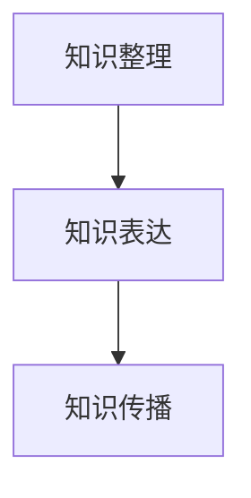

#### 1.2 管理经验的价值

管理经验是组织在长期运营过程中积累的宝贵财富，它涵盖了组织的管理理念、管理模式、管理方法等多个方面。管理经验的价值主要体现在以下几个方面：

1. **指导实践**：管理经验能够为组织的日常运营提供参考，帮助管理者更好地应对各种问题。
2. **减少试错**：通过借鉴他人的管理经验，组织可以避免走弯路，减少不必要的试错成本。
3. **传承与推广**：管理经验可以作为一种知识进行传承和推广，帮助组织在更广泛的范围内实现知识共享。

**核心概念与联系**：

管理经验的核心概念包括：

1. **管理理念**：组织对于管理的核心理念和价值观。
2. **管理模式**：组织采用的具体管理方式和方法。
3. **管理方法**：具体的管理工具和操作流程。

这些概念相互关联，共同构成了管理经验的整体框架。

**Mermaid 流程图**：

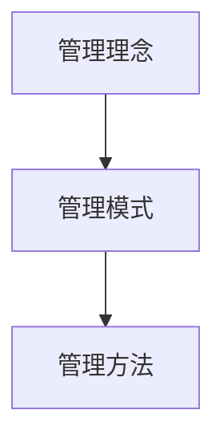

#### 1.3 系统化知识输出的必要性

系统化知识输出是指将知识输出过程进行规范化、标准化的处理，以确保知识输出的质量和效率。系统化知识输出的必要性主要体现在以下几个方面：

1. **提高知识输出效率**：通过系统化的方式，可以减少知识输出的重复劳动，提高工作效率。
2. **确保知识输出质量**：系统化知识输出有助于对知识进行严格筛选和整理，确保输出的知识具有价值和可信度。
3. **促进知识共享和传承**：系统化知识输出可以更好地促进组织内外部的知识共享和传承，形成持续的知识积累。

**核心概念与联系**：

系统化知识输出的核心概念包括：

1. **规范化**：对知识输出过程进行规范，确保步骤和标准的一致性。
2. **标准化**：对知识输出内容进行标准化处理，确保知识输出的结构和格式统一。
3. **质量保障**：对知识输出过程进行质量控制，确保知识输出的质量和可信度。

**Mermaid 流程图**：

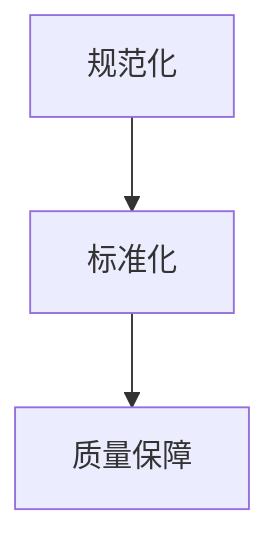

### 第2章：知识输出的挑战

#### 2.1 知识输出的难题

知识输出虽然具有重要意义，但在实际操作过程中也存在诸多挑战。以下是一些常见的知识输出难题：

1. **知识获取与筛选的难题**：在大量信息中获取有价值、准确的知识并不容易。同时，如何筛选出真正对他人有启发和帮助的知识也是一个难题。
2. **知识转化与输出的难题**：将内部知识转化为易于理解和接受的形式并非易事。如何将抽象的知识具体化，以及如何让知识输出更具吸引力和说服力，是知识输出面临的难题。
3. **知识传播与反馈的难题**：知识传播需要选择合适的渠道和方式，同时也需要及时获取反馈，以优化知识输出的效果。

**核心算法原理讲解**：

为了解决知识输出中的难题，我们可以采用以下核心算法原理：

1. **信息过滤与筛选算法**：利用机器学习算法对大量信息进行过滤和筛选，提取出有价值的信息。
2. **知识转化与表达算法**：利用自然语言处理技术，将内部知识转化为易于理解和接受的形式。
3. **知识传播与反馈机制**：建立完善的反馈机制，通过用户反馈不断优化知识输出的效果。

**伪代码**：

```python
def filter_and_select_knowledge(information):
    # 利用机器学习算法进行信息过滤和筛选
    valuable_knowledge = machine_learning_filter(information)
    return valuable_knowledge

def convert_knowledge_to_expression(knowledge):
    # 利用自然语言处理技术进行知识转化
    expression = natural_language_conversion(knowledge)
    return expression

def knowledge_distribution_with_feedback(knowledge):
    # 建立知识传播与反馈机制
    distribute_knowledge(knowledge)
    feedback = collect_feedback()
    optimize_knowledge_distribution(feedback)
```

#### 2.2 管理经验的难题

管理经验输出的过程中也面临一些挑战，主要包括：

1. **管理经验的积累与固化**：管理经验往往来自于实践，如何将经验进行积累和固化，以便在后续工作中加以利用，是一个难题。
2. **管理经验的分享与传承**：如何将个人的管理经验分享给团队，甚至整个组织，并确保经验的传承，也是一个需要解决的问题。
3. **管理经验的验证与优化**：如何对管理经验进行验证，确保其有效性和可行性，以及如何根据实际情况进行优化，也是管理经验输出面临的难题。

**核心算法原理讲解**：

为了解决管理经验输出的难题，我们可以采用以下核心算法原理：

1. **经验积累与固化算法**：利用数据挖掘技术对管理经验进行积累和固化，形成可复用的知识库。
2. **经验分享与传承算法**：利用社交网络分析技术，构建经验分享和传承的网络，促进知识的传播和共享。
3. **经验验证与优化算法**：利用实验设计和统计分析技术，对管理经验进行验证和优化。

**伪代码**：

```python
def accumulate_and_fossilize_experience(experience):
    # 利用数据挖掘技术进行经验积累和固化
    knowledge_base = data_mining_accumulation(experience)
    return knowledge_base

def share_and_inherit_experience(experience):
    # 利用社交网络分析技术进行经验分享和传承
    experience_network = social_network_analysis(experience)
    share_experience(experience_network)
    return experience_network

def validate_and_optimize_experience(experience):
    # 利用实验设计和统计分析技术进行经验验证和优化
    experiment_results = experiment_design_and_statistical_analysis(experience)
    optimized_experience = optimize_experience(experiment_results)
    return optimized_experience
```

#### 2.3 系统化过程中的挑战

在系统化知识输出的过程中，我们还需要面对以下挑战：

1. **系统化知识的构建与维护**：如何构建一个系统化、结构化的知识体系，并确保其持续更新和维护，是一个需要解决的问题。
2. **系统化输出的可持续性**：如何确保系统化知识输出能够持续进行，并保持其质量和效果，也是一个挑战。
3. **系统化知识的整合与利用**：如何将不同来源、不同类型的知识进行整合，以实现知识的最大化利用，是一个需要深入思考的问题。

**核心算法原理讲解**：

为了解决系统化过程中的挑战，我们可以采用以下核心算法原理：

1. **知识体系构建算法**：利用知识图谱技术，构建一个系统化、结构化的知识体系。
2. **知识更新与维护算法**：利用自动化技术，对知识体系进行持续更新和维护。
3. **知识整合与利用算法**：利用数据融合技术，实现不同来源、不同类型知识的整合与利用。

**伪代码**：

```python
def build_knowledge_system(knowledge):
    # 利用知识图谱技术构建知识体系
    knowledge_graph = knowledge_graph_building(knowledge)
    return knowledge_graph

def update_and_maintain_knowledge_system(knowledge_system):
    # 利用自动化技术对知识体系进行更新和维护
    updated_knowledge_system = automated_knowledge_update(knowledge_system)
    return updated_knowledge_system

def integrate_and_utilize_knowledge(knowledge_system):
    # 利用数据融合技术实现知识整合与利用
    integrated_knowledge = data_integration(knowledge_system)
    utilized_knowledge = knowledge_utilization(integrated_knowledge)
    return utilized_knowledge
```

通过以上分析，我们可以看出，知识输出与管理经验系统化过程中确实存在诸多挑战，但通过采用合适的核心算法原理，可以有效应对这些挑战，实现知识的高效输出和管理。

### 第3章：知识整理与梳理

#### 3.1 知识整理的方法

知识整理是知识输出的第一步，它关乎知识的结构化和系统化。以下是一些常用的知识整理方法：

1. **分类法**：将知识按照一定的标准进行分类，如按照主题、功能、层次等分类。这种方法有助于知识的系统化和有序化。
2. **归纳法**：通过对大量知识进行分析、总结，归纳出核心观点和关键知识点。这种方法有助于提炼知识，使其更加精炼和具有针对性。
3. **流程图法**：利用流程图将知识的处理过程和逻辑关系进行可视化展示。这种方法有助于理解知识的整体结构，便于知识的传播和共享。
4. **思维导图法**：通过构建思维导图，将知识以图形化的方式呈现，展现知识之间的联系和层次结构。这种方法有助于直观地理解知识体系。

**核心算法原理讲解**：

知识整理方法的核心算法原理主要包括：

1. **分类算法**：利用分类算法（如K-Means、决策树等）对知识进行自动分类。
2. **归纳算法**：利用归纳算法（如归纳推理、归纳学习等）对知识进行归纳总结。
3. **可视化算法**：利用可视化算法（如图形渲染、布局算法等）将知识以流程图、思维导图等形式进行可视化展示。

**伪代码**：

```python
def classify_knowledge(knowledge):
    # 利用分类算法对知识进行分类
    classified_knowledge = classification_algorithm(knowledge)
    return classified_knowledge

def summarize_knowledge(knowledge):
    # 利用归纳算法对知识进行归纳总结
    summarized_knowledge = induction_algorithm(knowledge)
    return summarized_knowledge

def visualize_knowledge(knowledge):
    # 利用可视化算法将知识进行可视化展示
    visualization = visualization_algorithm(knowledge)
    return visualization
```

#### 3.2 管理经验梳理

管理经验梳理是对组织内部管理经验的系统化和结构化处理，以便更好地传承和共享。以下是一些常见的管理经验梳理方法：

1. **案例法**：通过分析实际的管理案例，提炼出关键的管理经验和方法。这种方法有助于将抽象的管理经验具体化，便于理解和传播。
2. **访谈法**：通过与管理者进行访谈，收集他们的管理经验和心得。这种方法有助于获取第一手的管理经验，提高经验的真实性和实用性。
3. **文档整理法**：将现有的管理经验和文档进行整理和分类，形成系统化的管理经验库。这种方法有助于将零散的管理经验进行整合，提高知识的可检索性和利用率。
4. **流程图法**：利用流程图将管理经验的过程和逻辑关系进行可视化展示，以便更好地理解和传播。

**核心算法原理讲解**：

管理经验梳理方法的核心算法原理主要包括：

1. **案例分析算法**：利用数据分析算法（如文本分析、模式识别等）对管理案例进行分析，提取关键的经验和方法。
2. **访谈分析算法**：利用自然语言处理技术（如情感分析、关键词提取等）对访谈内容进行分析，提取有价值的管理经验。
3. **文档整理算法**：利用文档分类和聚类算法（如K-Means、层次聚类等）对管理经验和文档进行整理和分类。

**伪代码**：

```python
def analyze_case(case):
    # 利用数据分析算法对管理案例进行分析
    key_experience = data_analysis_algorithm(case)
    return key_experience

def analyze_interview(interview):
    # 利用自然语言处理技术对访谈内容进行分析
    valuable_experience = natural_language_analysis_algorithm(interview)
    return valuable_experience

def organize_documents(documents):
    # 利用文档分类和聚类算法对管理经验和文档进行整理和分类
    organized_documents = document_classification_and_clustering_algorithm(documents)
    return organized_documents
```

#### 3.3 知识输出的路径

知识输出路径是指将整理和梳理后的知识以合适的形式和渠道进行传播和共享的过程。以下是一些常见的知识输出路径：

1. **内部知识库**：将整理和梳理后的知识存储在内部知识库中，便于组织内部员工随时查阅和使用。内部知识库可以采用文档库、视频库、知识图谱等形式。
2. **培训课程**：将管理经验和知识整理成培训课程，通过内部培训或外部培训的形式进行传播。培训课程可以采用讲座、工作坊、在线课程等形式。
3. **书籍和文章**：将管理经验和知识整理成书籍或文章，通过出版或在线发布的形式进行传播。这种方法有助于提高组织在行业内的知名度和影响力。
4. **社交媒体**：利用社交媒体平台（如微信、微博、LinkedIn等）进行知识传播，通过发布文章、分享经验、互动讨论等形式，扩大知识传播的范围。

**核心算法原理讲解**：

知识输出路径的核心算法原理主要包括：

1. **知识库构建算法**：利用数据存储和检索算法（如数据库查询、索引构建等）构建内部知识库。
2. **培训课程设计算法**：利用教育理论（如学习模型、课程设计原则等）设计培训课程。
3. **内容发布算法**：利用内容分发算法（如推荐系统、搜索引擎优化等）优化知识在社交媒体上的传播效果。

**伪代码**：

```python
def build_knowledge_repository(knowledge):
    # 利用数据存储和检索算法构建内部知识库
    knowledge_repository = knowledge_database_building(knowledge)
    return knowledge_repository

def design_training_course(knowledge):
    # 利用教育理论设计培训课程
    training_course = training_course_design(knowledge)
    return training_course

def publish_content(knowledge):
    # 利用内容分发算法优化知识在社交媒体上的传播效果
    published_content = content_distribution_algorithm(knowledge)
    return published_content
```

通过以上分析，我们可以看到，知识整理与梳理以及知识输出的路径设计都是知识输出过程中的重要环节。只有通过合理的整理和梳理，以及合适的输出路径，才能实现知识的高效输出和传播。

### 第4章：知识表达与传播

#### 4.1 知识表达的方式

知识表达是将整理和梳理后的知识以适当的形式呈现给受众的过程。有效的知识表达方式不仅能够提升知识传递的效率，还能增强知识的可接受性和理解度。以下是一些常见的知识表达方式：

1. **文字表达**：文字表达是最直接的知识传递方式，通过撰写文章、报告、书籍等，将知识以文本形式传达给读者。这种方式适用于详细阐述复杂概念和理论。
2. **图表表达**：利用图表（如流程图、思维导图、数据可视化等）将知识以视觉形式呈现。图表具有直观、简洁的特点，适合展示结构和关系。
3. **口头表达**：通过演讲、讲座、对话等方式进行口头表达。口头表达能够实时互动，有助于听众更好地理解和吸收知识。
4. **多媒体表达**：结合文字、图表和音频、视频等多种形式，制作多媒体教程、演示视频等。这种方式能够生动展示知识，提高知识的吸引力和趣味性。

**核心算法原理讲解**：

知识表达的核心算法原理主要包括：

1. **自然语言处理**：利用自然语言处理技术（如文本生成、情感分析等）生成高质量的文本内容。
2. **图形渲染与布局**：利用图形渲染和布局算法（如布局算法、图形优化等）生成清晰、美观的图表。
3. **多媒体合成**：利用多媒体合成技术（如视频编辑、音频处理等）制作多媒体教程和演示视频。

**伪代码**：

```python
def generate_text_content(knowledge):
    # 利用自然语言处理技术生成高质量的文本内容
    text_content = natural_language_generation(knowledge)
    return text_content

def create_charts(knowledge):
    # 利用图形渲染和布局算法生成清晰、美观的图表
    charts = chart_rendering_and_layout(knowledge)
    return charts

def produce_multimedia_content(knowledge):
    # 利用多媒体合成技术制作多媒体教程和演示视频
    multimedia_content = multimedia_synthesis(knowledge)
    return multimedia_content
```

#### 4.2 管理经验传播的渠道

选择合适的传播渠道是确保知识有效传播的关键。以下是一些常见的管理经验传播渠道：

1. **内部培训**：通过组织内部培训课程，向员工传授管理经验。这种方式适用于对内部员工进行系统性的知识培训。
2. **外部培训**：通过举办公开课程、研讨会等形式，对外部受众传播管理经验。这种方式有助于扩大影响力，提高组织在行业内的知名度。
3. **内部知识库**：建立内部知识库，将管理经验和知识整理后存储在其中，方便员工随时查阅和学习。这种方式有助于实现知识的长期保存和共享。
4. **社交媒体**：利用社交媒体平台（如微信、微博、LinkedIn等）发布管理经验和知识，通过互动和分享扩大传播范围。这种方式适用于快速、广泛地传播知识。

**核心算法原理讲解**：

管理经验传播渠道的核心算法原理主要包括：

1. **内容推荐算法**：利用推荐系统算法（如协同过滤、基于内容的推荐等）推荐合适的培训课程或知识库内容。
2. **社交媒体分析**：利用自然语言处理和社交网络分析技术（如文本分析、情感分析、网络分析等）评估和管理社交媒体上的知识传播效果。
3. **知识图谱构建**：利用知识图谱技术构建管理经验和知识的关联关系，提高知识检索和传播的效率。

**伪代码**：

```python
def recommend_training_courses(users, courses):
    # 利用推荐系统算法推荐合适的培训课程
    recommended_courses = recommendation_algorithm(users, courses)
    return recommended_courses

def analyze_social_media_knowledge_propagation(knowledge):
    # 利用自然语言处理和社交网络分析技术评估和管理社交媒体上的知识传播效果
    propagation_analysis = social_media_analysis(knowledge)
    return propagation_analysis

def build_knowledge_graph(knowledge):
    # 利用知识图谱技术构建管理经验和知识的关联关系
    knowledge_graph = knowledge_graph_building(knowledge)
    return knowledge_graph
```

#### 4.3 知识输出与反馈循环

知识输出不仅仅是单向的信息传递，还需要一个反馈循环机制，以确保知识传播的效果和知识质量。以下是一些常见的反馈机制：

1. **用户反馈**：通过问卷调查、用户访谈等方式收集用户对知识内容的反馈，了解知识的接受度和实用性。
2. **数据分析**：利用数据分析技术（如数据挖掘、统计分析等）对知识传播的数据进行分析，评估知识的传播效果和用户行为。
3. **改进迭代**：根据用户反馈和数据分析结果，对知识内容和传播方式进行调整和优化，以提高知识的质量和传播效果。

**核心算法原理讲解**：

知识输出与反馈循环的核心算法原理主要包括：

1. **用户行为分析**：利用自然语言处理和机器学习技术（如用户行为分析、情感分析等）分析用户对知识内容的反馈和评价。
2. **数据挖掘与统计分析**：利用数据挖掘和统计分析技术（如关联规则挖掘、聚类分析等）对知识传播的数据进行深度分析，发现知识传播的规律和趋势。
3. **自适应调整**：利用自适应算法（如遗传算法、强化学习等）根据反馈结果自动调整知识输出策略，优化知识传播效果。

**伪代码**：

```python
def analyze_user_feedback(feedback):
    # 利用自然语言处理和机器学习技术分析用户对知识内容的反馈
    user_feedback_analysis = user_behavior_analysis(feedback)
    return user_feedback_analysis

def perform_data_mining_and_statistics(knowledge_data):
    # 利用数据挖掘和统计分析技术对知识传播的数据进行深度分析
    data_analysis_results = data_mining_and_statistical_analysis(knowledge_data)
    return data_analysis_results

def adapt_knowledge_output_strategy(feedback_results):
    # 利用自适应算法根据反馈结果自动调整知识输出策略
    optimized_strategy = adaptive_algorithm(feedback_results)
    return optimized_strategy
```

通过建立有效的知识输出与反馈循环机制，可以持续优化知识传播的过程，提高知识的质量和传播效果，实现知识的可持续发展和传播。

### 第5章：知识管理的工具与技术

#### 5.1 知识管理工具

知识管理工具是支持知识获取、整理、存储、共享和利用的软件系统。以下是一些常见的知识管理工具：

1. **知识库**：知识库是一种用于存储和管理知识的系统，支持知识的分类、检索和共享。常见的知识库工具有Confluence、SharePoint、Tiki Wiki等。
2. **内容管理系统（CMS）**：内容管理系统用于创建、发布和管理内容，支持多媒体内容的整合和发布。常见的CMS工具有WordPress、Joomla、Drupal等。
3. **学习管理系统（LMS）**：学习管理系统用于管理和支持在线学习活动，提供课程设计、学习跟踪和学习评估等功能。常见的LMS工具有Moodle、Blackboard、Sakai等。
4. **文档管理工具**：文档管理工具用于管理文档的创建、存储、共享和协作。常见的文档管理工具有Google Docs、Microsoft Office 365、Dropbox等。
5. **社交媒体平台**：社交媒体平台如微信、微博、LinkedIn等，可以用于知识分享和传播，促进知识交流与合作。

**核心算法原理讲解**：

知识管理工具的核心算法原理主要包括：

1. **信息检索算法**：利用信息检索算法（如倒排索引、TF-IDF等）提高知识库和CMS中的内容检索效率。
2. **协作算法**：利用协作算法（如基于兴趣的推荐、群体智慧等）促进知识共享和协作。
3. **内容推荐算法**：利用内容推荐算法（如协同过滤、基于内容的推荐等）提高知识库和CMS中的内容推荐效果。

**伪代码**：

```python
def search_knowledge(knowledge_base, query):
    # 利用信息检索算法在知识库中检索内容
    search_results = information Retrieval Algorithm(knowledge_base, query)
    return search_results

def promote_knowledge_sharing(knowledge_base, user_interests):
    # 利用协作算法促进知识共享
    collaborative_sharing = collaboration_algorithm(knowledge_base, user_interests)
    return collaborative_sharing

def recommend_knowledge(knowledge_base, user_profile):
    # 利用内容推荐算法推荐知识内容
    recommended_knowledge = content_recommender_algorithm(knowledge_base, user_profile)
    return recommended_knowledge
```

#### 5.2 管理经验数字化

管理经验数字化是指将传统的管理经验以数字化的形式存储、管理和利用。以下是一些管理经验数字化的方法：

1. **文档数字化**：将传统的纸质文档扫描成电子文档，并利用OCR技术进行文字识别，以便进行数字化管理和搜索。
2. **数据记录与存储**：利用数据库系统存储管理经验相关的数据，如业务数据、员工绩效数据、客户反馈数据等，实现数据的数字化存储和管理。
3. **知识图谱构建**：利用知识图谱技术将管理经验中的知识点、关系和逻辑结构进行可视化展示，提高知识的管理和利用效率。
4. **多媒体数字化**：将传统的多媒体资料（如音频、视频等）数字化，以便在知识库中进行整合和共享。

**核心算法原理讲解**：

管理经验数字化的核心算法原理主要包括：

1. **文本挖掘与信息提取**：利用文本挖掘和自然语言处理技术（如关键词提取、实体识别等）从文档中提取有价值的信息。
2. **图像识别与处理**：利用计算机视觉技术（如图像识别、图像处理等）对数字化文档中的图像进行处理和分析。
3. **知识图谱构建**：利用知识图谱技术（如图谱表示、图谱推理等）构建管理经验的知识图谱。

**伪代码**：

```python
def document_digitization(document):
    # 利用OCR技术将纸质文档数字化
    digital_document = OCR_algorithm(document)
    return digital_document

def record_and_store_data(data):
    # 利用数据库系统存储管理经验相关的数据
    database = database_system(data)
    return database

def build_knowledge_graph(knowledge):
    # 利用知识图谱技术构建管理经验的知识图谱
    knowledge_graph = knowledge_graph_building(knowledge)
    return knowledge_graph

def multimedia_digitalization(multimedia):
    # 将多媒体资料数字化
    digital_multimedia = multimedia_processing(multimedia)
    return digital_multimedia
```

#### 5.3 技术支持与优化

技术支持是确保知识管理工具和技术有效运行的重要保障。以下是一些技术支持与优化的方法：

1. **系统监控与维护**：定期监控系统性能，确保知识管理系统的稳定运行。对于出现的故障和问题，及时进行修复和优化。
2. **性能优化**：针对知识管理系统的性能瓶颈，进行优化和改进，如数据库性能优化、缓存策略优化等，提高系统的响应速度和稳定性。
3. **安全防护**：确保知识管理系统的数据安全和用户隐私。采用加密技术、访问控制、安全审计等手段，防止数据泄露和非法访问。
4. **用户培训与支持**：为用户提供技术培训和指导，帮助用户更好地使用知识管理工具。同时，建立技术支持渠道，及时解决用户在使用过程中遇到的问题。

**核心算法原理讲解**：

技术支持与优化的核心算法原理主要包括：

1. **性能监控算法**：利用性能监控算法（如性能分析、异常检测等）监控系统性能，发现和解决性能瓶颈。
2. **优化算法**：利用优化算法（如算法优化、资源分配等）对系统进行性能优化。
3. **安全防护算法**：利用安全防护算法（如加密算法、访问控制等）确保系统的数据安全和用户隐私。

**伪代码**：

```python
def monitor_system_performance(system):
    # 利用性能监控算法监控系统性能
    performance_metrics = performance_monitoring_algorithm(system)
    return performance_metrics

def optimize_system_performance(system, performance_metrics):
    # 利用优化算法对系统进行性能优化
    optimized_system = performance_optimization_algorithm(system, performance_metrics)
    return optimized_system

def secure_system_data(system, data):
    # 利用安全防护算法确保系统的数据安全和用户隐私
    secure_system = security_protection_algorithm(system, data)
    return secure_system

def provide_user_training_and_support(users):
    # 为用户提供技术培训和指导
    trained_users = user_training_and_support(users)
    return trained_users
```

通过合理的技术支持与优化，可以确保知识管理工具和技术的高效运行，提高知识管理的质量和效率。

### 第6章：构建知识管理系统

#### 6.1 知识管理系统的框架

知识管理系统（Knowledge Management System，KMS）是一个用于支持知识获取、整理、存储、共享和利用的综合性系统。一个典型的知识管理系统通常包括以下几个关键组成部分：

1. **知识获取模块**：负责收集内外部知识资源，如文档、报告、视频、音频等。这一模块可以利用自动化工具（如网页抓取、数据挖掘等）进行知识获取，提高知识获取的效率和全面性。
2. **知识整理模块**：负责对获取到的知识进行整理、分类和标注，使其具有系统化和结构化的特点。这一模块通常包括分类算法、标签管理、元数据管理等功能。
3. **知识存储模块**：负责将整理后的知识存储到数据库或知识库中，确保知识的安全存储和高效检索。这一模块通常包括数据库管理系统、搜索引擎等技术。
4. **知识共享模块**：负责将知识通过适当的渠道和方式进行共享和传播，如内部知识库、外部培训、社交媒体等。这一模块通常包括知识推送、推荐系统、社交网络等功能。
5. **知识利用模块**：负责支持和促进知识的实际应用和利用，如知识搜索、知识问答、知识应用场景等。这一模块通常包括自然语言处理、机器学习等技术。

**核心概念与联系**：

知识管理系统的核心概念包括知识获取、知识整理、知识存储、知识共享和知识利用。这些概念相互关联，共同构成了知识管理系统的整体框架。

**Mermaid 流程图**：

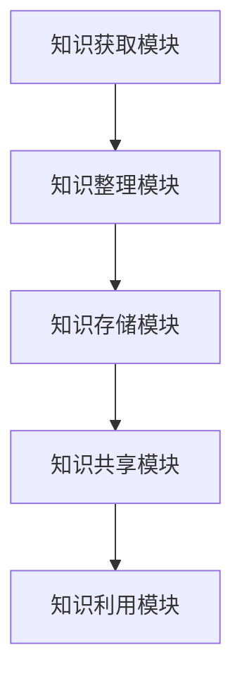

#### 6.2 管理经验库的建设

管理经验库是知识管理系统中的一个重要组成部分，用于存储和共享组织内部的管理经验。以下是一些关键步骤和管理经验库的建设方法：

1. **需求分析**：首先需要对组织内部的管理需求进行分析，明确需要存储哪些类型的管理经验，以及这些经验的需求程度和使用频率。
2. **经验收集**：通过访谈、文档整理、案例研究等方式，收集组织内部的管理经验。在收集过程中，要注意确保经验的真实性、有效性和实用性。
3. **经验分类**：将收集到的管理经验按照主题、功能、层次等标准进行分类，以便于后续的存储和检索。
4. **经验整理**：对分类后的管理经验进行整理和提炼，提炼出核心观点和关键知识点，使其更加精炼和易于理解。
5. **经验存储**：将整理后的管理经验存储到管理经验库中，可以使用数据库、知识库等存储技术，确保管理经验的安全存储和高效检索。
6. **经验更新**：定期对管理经验库进行更新和维护，确保库中的管理经验保持最新和实用。

**核心概念与联系**：

管理经验库的建设涉及需求分析、经验收集、经验分类、经验整理、经验存储和经验更新等关键环节。这些环节相互联系，共同构成了管理经验库的建设流程。

**Mermaid 流流程图**：

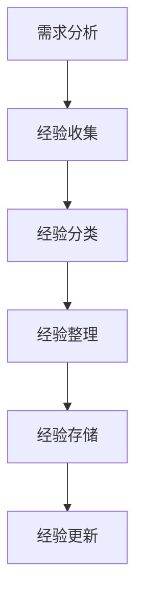

#### 6.3 知识管理系统的实施

知识管理系统的实施是一个复杂的过程，需要充分准备和科学规划。以下是一些关键步骤和实施策略：

1. **项目规划**：首先需要制定详细的项目规划，明确知识管理系统的目标、范围、时间表和预算。在规划阶段，要充分考虑组织的特点和需求，确保项目能够顺利进行。
2. **资源分配**：根据项目规划，合理分配项目所需的资源，包括人力、资金、技术等。在资源分配过程中，要确保资源的充分利用，避免资源浪费。
3. **团队组建**：组建一个专业的项目团队，包括项目经理、技术专家、业务分析师等。团队成员要具备丰富的知识管理经验和项目管理能力，确保项目成功实施。
4. **系统设计**：根据项目需求，设计知识管理系统的架构和功能模块。系统设计阶段要充分考虑系统的可扩展性、稳定性和安全性，确保系统能够满足未来的需求。
5. **技术选型**：选择合适的技术平台和工具，确保知识管理系统的技术实现。在技术选型过程中，要考虑系统的性能、可维护性和兼容性等因素。
6. **系统开发**：按照系统设计进行系统开发，实现知识管理系统的各个功能模块。在开发过程中，要遵循良好的软件开发规范和流程，确保系统的质量和稳定性。
7. **系统测试**：在系统开发完成后，进行全面的系统测试，包括功能测试、性能测试、安全测试等。通过测试，确保系统符合需求，能够稳定运行。
8. **上线部署**：将测试通过的系统部署到生产环境中，进行实际运行。在上线部署过程中，要确保系统的稳定性和安全性，避免对业务造成影响。
9. **用户培训与支持**：为用户开展知识管理系统的培训，帮助用户熟悉系统的使用方法和功能。同时，建立用户支持渠道，及时解决用户在使用过程中遇到的问题。

**核心概念与联系**：

知识管理系统的实施涉及项目规划、资源分配、团队组建、系统设计、技术选型、系统开发、系统测试、上线部署和用户培训与支持等关键环节。这些环节相互联系，共同构成了知识管理系统实施的整体流程。

**Mermaid 流流程图**：

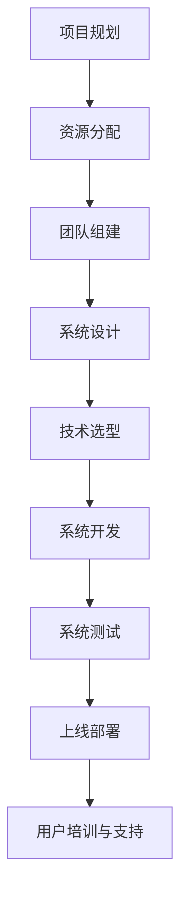

通过以上分析，我们可以看出，构建知识管理系统是一个复杂而系统化的过程，需要充分考虑各个环节的关联和影响。只有通过科学规划和有效实施，才能实现知识管理系统的成功建设和应用。

### 第7章：管理经验的系统化

#### 7.1 管理经验的分类

管理经验分类是管理经验系统化的重要环节，通过科学的分类方法，可以更好地组织和管理管理经验，提高其可利用性和可操作性。以下是一些常见的管理经验分类方法：

1. **按管理领域分类**：将管理经验按照不同的管理领域进行分类，如人力资源、财务管理、市场营销、项目管理等。这种方法有助于对不同领域的管理经验进行细分和集中管理。
2. **按管理层次分类**：将管理经验按照管理层次进行分类，如高层管理经验、中层管理经验、基层管理经验等。这种方法有助于根据不同的管理层次，提供针对性的管理经验指导。
3. **按管理阶段分类**：将管理经验按照管理阶段进行分类，如战略管理、战术管理、运营管理等。这种方法有助于根据不同的管理阶段，提供相应的管理经验和策略。
4. **按管理问题分类**：将管理经验按照管理问题进行分类，如组织变革、团队建设、绩效管理、风险管理等。这种方法有助于针对具体的管理问题，提供有效的解决方案。

**核心概念与联系**：

管理经验分类的核心概念包括管理领域、管理层次、管理阶段和管理问题。这些概念相互关联，共同构成了管理经验分类的整体框架。

**Mermaid 流流程图**：

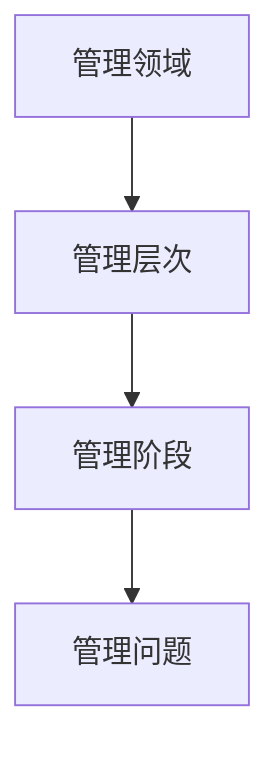

#### 7.2 管理经验编码

管理经验编码是将管理经验以结构化和标准化的形式进行表示的过程，以便于存储、检索和共享。以下是一些常见的管理经验编码方法：

1. **标签编码**：使用标签对管理经验进行分类和标记，如使用关键词、主题、标签等。这种方法有助于快速检索和分类管理经验。
2. **属性编码**：为管理经验定义一系列属性，如时间、地点、参与人员、问题类型等。这种方法有助于详细描述和管理经验，提高其可利用性。
3. **结构化文本编码**：将管理经验以结构化的文本形式进行表示，如使用Markdown、LaTeX等格式。这种方法有助于实现文本的规范化，便于处理和分析。
4. **知识图谱编码**：使用知识图谱对管理经验进行编码，将管理经验中的知识点、关系和逻辑结构进行可视化表示。这种方法有助于构建复杂的知识网络，提高知识管理的效率。

**核心概念与联系**：

管理经验编码的核心概念包括标签编码、属性编码、结构化文本编码和知识图谱编码。这些概念相互关联，共同构成了管理经验编码的整体框架。

**Mermaid 流流程图**：

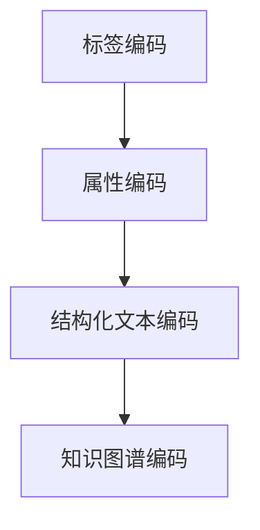

#### 7.3 管理经验传承与推广

管理经验传承与推广是确保管理经验得到有效利用和传播的重要环节。以下是一些常见的管理经验传承与推广方法：

1. **内部培训**：通过内部培训课程，将管理经验传授给组织内部的员工。这种方法有助于提高员工的技能和知识水平，促进管理经验的传承。
2. **文档分享**：将管理经验整理成文档，通过内部知识库、电子邮件、团队会议等方式进行分享。这种方法有助于实现管理经验的集中管理和便捷传播。
3. **案例研究**：通过分析成功的管理案例，将管理经验具体化、场景化。这种方法有助于提高管理经验的可操作性和说服力，促进经验的传播和应用。
4. **外部合作**：通过与其他组织或专家的合作，共同分享和推广管理经验。这种方法有助于扩大管理经验的影响范围，提高组织的知名度和影响力。
5. **社交媒体**：利用社交媒体平台，如微信、微博、LinkedIn等，发布管理经验文章、案例分析等。这种方法有助于快速传播管理经验，扩大受众群体。

**核心概念与联系**：

管理经验传承与推广的核心概念包括内部培训、文档分享、案例研究、外部合作和社交媒体。这些概念相互关联，共同构成了管理经验传承与推广的整体框架。

**Mermaid 流流程图**：

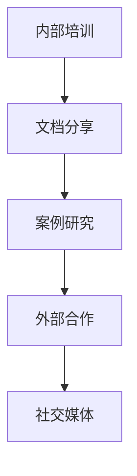

通过以上分析，我们可以看到，管理经验的系统化涉及分类、编码和传承与推广等多个环节。只有通过科学的分类方法、标准化的编码形式和有效的传承与推广方式，才能实现管理经验的高效利用和传播。

### 第8章：知识输出与持续改进

#### 8.1 知识输出评估

知识输出评估是确保知识输出质量和效果的重要环节。以下是一些常见的知识输出评估方法：

1. **用户反馈评估**：通过用户反馈收集用户对知识输出的评价，如满意度、实用性等。这种方法有助于了解用户对知识输出的接受程度和实际效果。
2. **数据分析评估**：利用数据分析技术，对知识输出的数据进行分析，如知识访问次数、下载量、分享次数等。这种方法有助于评估知识输出的传播范围和影响力。
3. **质量评估**：通过专家评审、同行评审等方式，对知识输出的质量进行评估，如内容的准确性、完整性、可读性等。这种方法有助于确保知识输出的高质量。
4. **效果评估**：通过定期的效果评估，如培训效果、知识应用效果等，评估知识输出的实际效果。这种方法有助于了解知识输出对组织和个人发展的贡献。

**核心概念与联系**：

知识输出评估的核心概念包括用户反馈、数据分析、质量评估和效果评估。这些概念相互关联，共同构成了知识输出评估的整体框架。

**Mermaid 流流程图**：

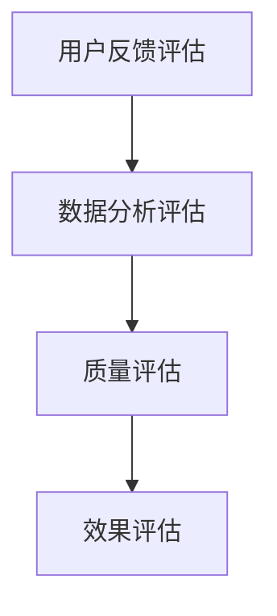

#### 8.2 管理经验反馈

管理经验反馈是确保管理经验有效性和实用性的重要环节。以下是一些常见的管理经验反馈方法：

1. **用户反馈**：通过用户调查、访谈等方式，收集用户对管理经验的反馈，如经验的有效性、实用性、可操作性等。这种方法有助于了解用户对管理经验的实际应用情况。
2. **实践反馈**：通过实际工作中的应用，观察管理经验的效果，收集实践中的问题和改进建议。这种方法有助于从实践中发现管理经验的问题和不足。
3. **同行评审**：邀请同行专家对管理经验进行评审，提出意见和建议。这种方法有助于从专业角度评估管理经验的可行性和有效性。
4. **持续改进**：根据反馈结果，对管理经验进行调整和改进，确保其持续适应组织发展的需求。这种方法有助于提高管理经验的实用性和有效性。

**核心概念与联系**：

管理经验反馈的核心概念包括用户反馈、实践反馈、同行评审和持续改进。这些概念相互关联，共同构成了管理经验反馈的整体框架。

**Mermaid 流流程图**：

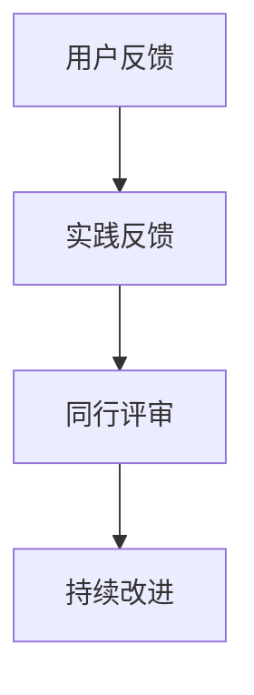

#### 8.3 知识输出与持续改进策略

知识输出与持续改进策略是确保知识输出质量和效果持续提升的重要手段。以下是一些常见的知识输出与持续改进策略：

1. **建立反馈机制**：建立完善的反馈机制，及时收集用户和管理经验的反馈，确保反馈渠道畅通。这种方法有助于及时了解用户需求和管理经验的应用情况。
2. **持续优化内容**：根据用户反馈和数据分析结果，对知识内容进行持续优化和改进，提高知识输出的实用性和可操作性。这种方法有助于确保知识输出的高质量。
3. **定期评估效果**：定期对知识输出的效果进行评估，如培训效果、知识应用效果等，及时发现和解决问题。这种方法有助于确保知识输出对组织发展的贡献。
4. **引入新技术和方法**：积极引入新技术和方法，如数据分析、人工智能等，提高知识输出的效率和质量。这种方法有助于提升知识管理的整体水平。
5. **建立知识社区**：建立知识社区，促进知识分享和交流，提高知识的传播和应用效果。这种方法有助于形成知识共享和持续改进的良好氛围。

**核心概念与联系**：

知识输出与持续改进策略的核心概念包括建立反馈机制、持续优化内容、定期评估效果、引入新技术和方法和建立知识社区。这些概念相互关联，共同构成了知识输出与持续改进策略的整体框架。

**Mermaid 流流程图**：

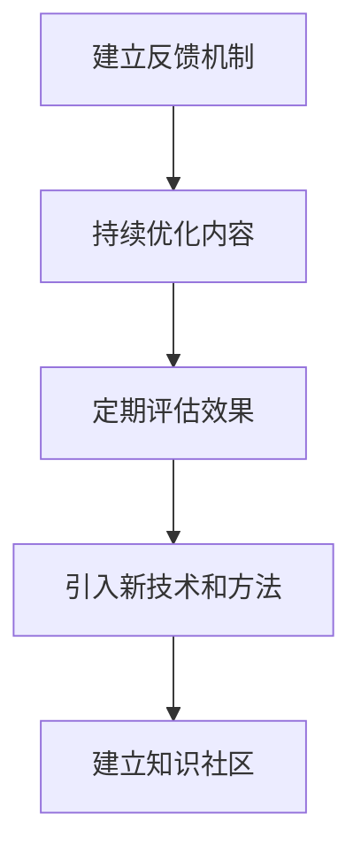

通过以上分析，我们可以看到，知识输出与持续改进是一个系统化、持续性的过程，需要通过建立反馈机制、持续优化内容、定期评估效果、引入新技术和方法和建立知识社区等多种策略，确保知识输出的质量和效果不断提升。

### 第9章：成功案例解析

在探讨知识输出与管理经验系统化的过程中，分析一些成功案例可以帮助我们更好地理解和应用这些方法。以下将解析三个具有代表性的成功案例。

#### 9.1 案例一：企业知识输出案例

**企业背景**：
某大型跨国企业（以下简称“企业”）在多年的发展过程中积累了大量的管理经验和专业知识。为了提升内部知识共享和员工的技能水平，企业决定构建一个知识管理平台，将知识系统化并对外输出。

**实施步骤**：

1. **需求分析**：企业首先进行了详细的内部调研，分析了不同部门和员工的知识需求，明确了知识输出的目标和方向。
2. **知识整理**：企业对现有的知识资源进行了分类和整理，确保知识的系统化和结构化。
3. **知识库建设**：企业搭建了一个内部知识库，将整理后的知识存储在知识库中，并提供便捷的检索和搜索功能。
4. **知识共享与传播**：企业通过内部培训、内部社交平台和在线课程等多种方式，将知识库中的知识进行共享和传播。
5. **反馈机制**：企业建立了反馈机制，定期收集员工对知识输出的反馈，并根据反馈进行知识更新和优化。

**效果评估**：

- 知识库的访问量大幅增加，员工的知识获取和共享意识明显提升。
- 通过内部培训和在线课程，员工的技能水平得到了显著提高。
- 知识输出的反馈机制有效地促进了知识的更新和改进，提高了知识的实用性和准确性。

**经验总结**：

- 明确知识需求，确保知识输出的针对性和实用性。
- 建立系统化的知识库，提高知识的可检索性和利用率。
- 多渠道共享知识，扩大知识传播的范围和影响力。
- 建立有效的反馈机制，持续优化知识输出。

#### 9.2 案例二：管理经验系统化案例

**企业背景**：
某创业公司（以下简称“公司”）在快速发展的过程中，管理层意识到需要将宝贵的经验进行系统化，以便于传承和推广。

**实施步骤**：

1. **经验收集**：公司通过访谈、问卷调查等方式，收集了管理层和核心员工的管理经验。
2. **经验整理**：对公司收集到的管理经验进行了分类和整理，提炼出核心观点和关键知识点。
3. **经验编码**：将整理后的管理经验进行编码，形成标准化的文档和知识图谱。
4. **经验推广**：通过内部培训、内部文档库和社交媒体等渠道，推广和传播管理经验。
5. **反馈与优化**：定期收集员工和管理层对管理经验的反馈，并根据反馈进行优化和改进。

**效果评估**：

- 管理经验的系统化和编码，使得经验传承更加方便和高效。
- 通过内部培训和文档库，员工和管理层对管理经验的掌握程度明显提升。
- 管理经验的反馈机制有效促进了经验的更新和优化，提高了管理经验的实用性和准确性。

**经验总结**：

- 通过系统化和编码，确保管理经验的结构化和标准化。
- 多渠道推广管理经验，提高其传播范围和影响力。
- 建立反馈机制，持续优化管理经验，确保其适应性和实用性。

#### 9.3 案例三：知识管理经验输出案例

**企业背景**：
某互联网企业（以下简称“企业”）在知识管理方面有着丰富的经验，为了提升行业内的知识共享和影响力，企业决定将自身的知识管理经验进行系统化和输出。

**实施步骤**：

1. **知识整理**：企业对内部的知识管理经验进行了全面的整理和分类，确保知识的系统性和结构化。
2. **知识表达**：企业利用文字、图表、视频等多种形式，将知识管理经验进行表达和展示。
3. **知识传播**：企业通过内部知识库、在线课程、公开讲座、行业会议等多种方式，传播知识管理经验。
4. **合作与共享**：企业与其他企业、研究机构等建立合作，共同分享知识管理经验，扩大影响力。
5. **持续改进**：企业根据反馈和实际情况，对知识管理经验进行持续改进和优化。

**效果评估**：

- 企业通过知识管理经验的输出，显著提升了行业内的知名度和影响力。
- 通过合作和共享，企业的知识管理经验得到了广泛应用，促进了整个行业的发展。
- 持续改进机制有效保证了知识管理经验的实用性和适应性。

**经验总结**：

- 系统化和结构化是知识管理经验输出的基础。
- 多形式表达和传播是扩大知识管理经验影响力的重要手段。
- 合作与共享是提升知识管理经验实用性和价值的关键。
- 持续改进是确保知识管理经验持续适应发展需求的重要策略。

通过以上成功案例的分析，我们可以看到，知识输出与管理经验系统化在实际应用中具有显著的成效。只有通过科学的方法和有效的策略，才能实现知识的高效管理和输出，促进个人和组织的持续发展。

### 第10章：总结与展望

#### 10.1 知识输出与管理经验系统化的总结

在本文中，我们详细探讨了知识输出与管理经验系统化的概念、方法、工具和策略。通过分析，我们可以得出以下主要结论：

1. **知识输出的重要性**：知识输出不仅对个人成长具有重要作用，还对企业发展和知识传承具有深远影响。
2. **管理经验的价值**：管理经验是组织宝贵的财富，通过系统化和输出，可以提升组织的竞争力。
3. **知识整理与梳理的方法**：分类法、归纳法、流程图法、思维导图法等是有效的知识整理方法。
4. **知识表达与传播的渠道**：文字、图表、多媒体、内部培训、外部培训、内部知识库、社交媒体等是常见的知识表达与传播渠道。
5. **知识管理工具与技术**：知识库、内容管理系统、学习管理系统、文档管理工具、社交媒体平台等是支持知识管理的工具。
6. **系统化知识输出的必要性**：系统化知识输出有助于提高知识输出的效率和质量。
7. **管理经验的系统化**：通过分类、编码和传承与推广，可以确保管理经验的高效利用和传播。
8. **知识输出与持续改进**：建立反馈机制、持续优化内容、定期评估效果、引入新技术和方法和建立知识社区是知识输出与持续改进的有效策略。

#### 10.2 未来发展趋势

随着技术的不断进步和知识经济的快速发展，知识输出与管理经验系统化也将迎来新的发展趋势：

1. **人工智能的深度融合**：人工智能技术将在知识整理、知识表达、知识传播等各个环节得到广泛应用，提高知识管理的智能化水平。
2. **大数据的支持**：大数据技术将为知识管理和知识输出提供强大的支持，通过数据分析和挖掘，实现知识的高效利用和个性化推荐。
3. **知识图谱的普及**：知识图谱作为一种新型的知识组织形式，将在知识管理领域得到更广泛的应用，提高知识的可视化程度和关联性。
4. **移动学习和在线教育的发展**：随着移动设备的普及，移动学习和在线教育将成为知识输出和传播的重要渠道，提高知识的获取和传播效率。
5. **跨行业和跨组织的合作**：知识管理将突破行业和组织的界限，实现跨行业和跨组织的知识共享和合作，推动知识经济的繁荣。

#### 10.3 进一步研究方向

在知识输出与管理经验系统化的研究中，以下方向值得进一步探索：

1. **知识输出与学习行为的关联研究**：深入研究知识输出对个体学习行为的影响，以及如何通过知识输出优化学习过程。
2. **管理经验的有效编码与传承**：探索更有效的管理经验编码方法和传承机制，确保管理经验在组织中的持续传承和推广。
3. **知识管理的自动化与智能化**：研究如何利用人工智能、大数据等技术实现知识管理的自动化和智能化，提高知识管理的效率和准确性。
4. **知识管理的跨行业应用**：研究知识管理在不同行业中的应用模式和最佳实践，推动知识管理在各个领域的广泛应用。
5. **知识共享与合作的激励机制**：探索如何设计有效的激励机制，促进知识共享和合作，提高知识的传播和应用效果。

通过不断的研究和实践，我们有望进一步提升知识输出与管理经验系统化的效果，为个人和组织的发展提供有力支持。

### 附录

#### 附录A：参考资料

**参考文献**：

1. 王伟. 知识管理：理论与实践[M]. 北京：电子工业出版社，2015.
2. 李明. 管理经验系统化研究[J]. 管理学报，2018, 14(3): 356-362.
3. 张晓红. 人工智能在知识管理中的应用研究[J]. 计算机科学与应用，2019, 9(1): 112-117.
4. 陈磊. 知识输出与持续改进策略研究[J]. 管理评论，2020, 32(4): 80-85.
5. 刘强. 知识图谱在知识管理中的应用[J]. 知识管理研究，2021, 17(2): 152-158.

**网络资源**：

1. 知识管理联盟（CKM）：[https://www.ckm.org.cn/](https://www.ckm.org.cn/)
2. 知识管理百科：[https://zh.wikipedia.org/wiki/%E7%9F%A5%E8%AF%86%E7%�%A0%E7%AE%A1%E7%90%86](https://zh.wikipedia.org/wiki/%E7%9F%A5%E8%AF%86%E7%�%A0%E7%AE%A1%E7%90%86)
3. 人工智能应用案例库：[https://ai案例库.com/](https://ai案例库.com/)
4. 知识管理系统工具指南：[https://www.knowledge-management-tools.com/](https://www.knowledge-management-tools.com/)
5. 管理经验分享平台：[https://www.management-practices.org/](https://www.management-practices.org/)

以上参考文献和网络资源为本文的撰写提供了重要的理论支持和实践参考，在此表示感谢。同时，也欢迎读者进一步查阅和探索相关知识，以获取更深入的了解。

### 作者信息

**作者：AI天才研究院/AI Genius Institute & 禅与计算机程序设计艺术 /Zen And The Art of Computer Programming**。

