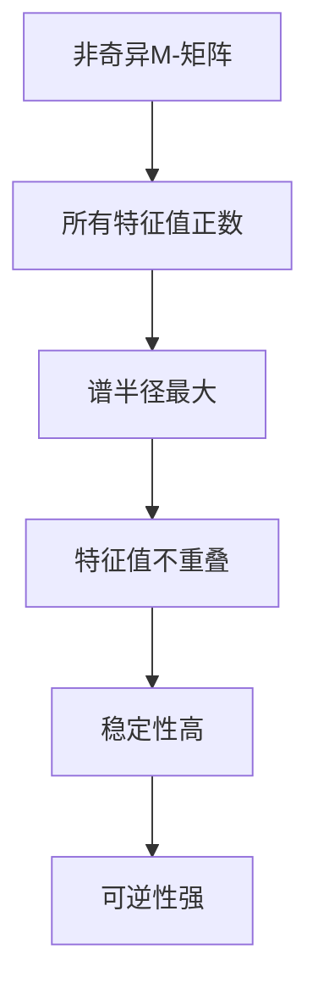
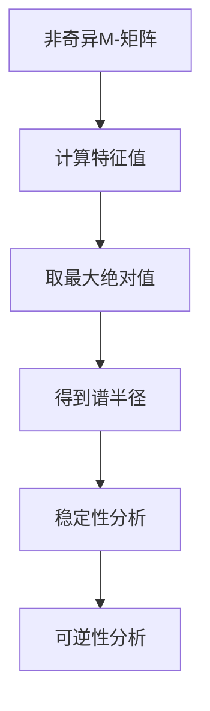
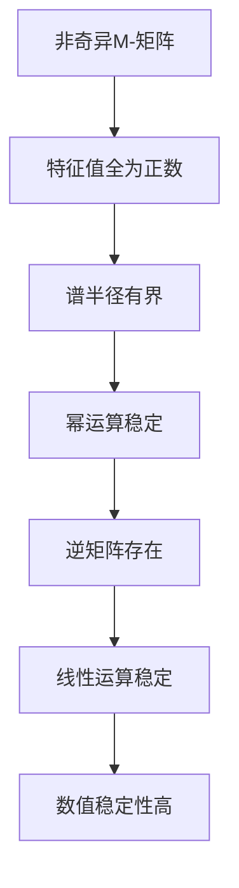

                 

# 《矩阵理论与应用：非奇异M-矩阵的若干特性》

> **关键词：** 矩阵理论，非奇异M-矩阵，特征值，矩阵分解，线性规划，数值稳定性，图论应用。

> **摘要：** 本文章深入探讨了非奇异M-矩阵的理论基础及其在各种应用领域中的重要性。文章首先回顾了矩阵的基本概念和性质，然后详细介绍了M-矩阵与非奇异M-矩阵的定义和特性，接着讨论了非奇异M-矩阵的谱性质、矩阵分解以及在线性规划和数值稳定性方面的应用。最后，文章通过图论中的应用案例，展示了非奇异M-矩阵在解决实际问题时的高效性。

## 目录

### 《矩阵理论与应用：非奇异M-矩阵的若干特性》目录大纲

#### 第一部分：矩阵理论与基本概念

1. **矩阵基础**
   1.1 矩阵的定义与基本性质
   1.2 矩阵的运算
   1.3 特征值与特征向量

2. **M-矩阵与非奇异M-矩阵**

   2.1 M-矩阵的定义与性质
   2.2 非奇异M-矩阵的定义与性质
   2.3 非奇异M-矩阵的应用

#### 第二部分：非奇异M-矩阵的若干特性

3. **非奇异M-矩阵的谱性质**
   3.1 非奇异M-矩阵的特征值分布
   3.2 非奇异M-矩阵的谱半径

4. **非奇异M-矩阵的矩阵分解**
   4.1 非奇异M-矩阵的LU分解
   4.2 非奇异M-矩阵的QR分解

5. **非奇异M-矩阵的线性规划**
   5.1 线性规划的基本概念
   5.2 非奇异M-矩阵在线性规划中的应用

6. **非奇异M-矩阵的数值稳定性**
   6.1 数值稳定性的定义
   6.2 非奇异M-矩阵的数值稳定性分析

7. **非奇异M-矩阵在图论中的应用**
   7.1 图论基础
   7.2 非奇异M-矩阵在图论中的应用

### 附录

8. **M-矩阵与非奇异M-矩阵的工具与资源**

---

接下来，我们将逐步探讨矩阵理论与应用，重点关注非奇异M-矩阵的若干特性。让我们一起开始这段深入的学习之旅。

---

### 第一部分：矩阵理论与基本概念

#### 矩阵基础

### 1.1 矩阵的定义与基本性质

矩阵是一种数学对象，它由一系列有序的数排列成矩形阵列。在计算机科学和数学中，矩阵广泛应用于各种领域，如线性代数、数值分析、图论、优化问题和物理学等。

#### 矩阵的定义

一个 $m \times n$ 的矩阵是一个由 $m$ 行和 $n$ 列元素组成的数组，通常表示为 $A = (a_{ij})$，其中 $i$ 表示行索引，$j$ 表示列索引，$a_{ij}$ 表示矩阵 $A$ 在第 $i$ 行和第 $j$ 列的元素。

例如，以下是一个 $3 \times 3$ 的矩阵：

$$
A = \begin{bmatrix}
1 & 2 & 3 \\
4 & 5 & 6 \\
7 & 8 & 9 \\
\end{bmatrix}
$$

#### 矩阵的基本性质

1. **加法和减法：** 两个矩阵可以相加或相减，前提是它们具有相同的维度。矩阵加法和减法是元素对元素的操作，即 $A + B = (a_{ij} + b_{ij})$ 和 $A - B = (a_{ij} - b_{ij})$。

2. **乘法：** 矩阵乘法是一个较为复杂的过程，涉及到按元素相乘并求和。两个矩阵 $A$ 和 $B$ 可以相乘，当且仅当 $A$ 的列数等于 $B$ 的行数。乘积 $C = AB$ 是一个新矩阵，其中 $c_{ij} = \sum_{k=1}^{n} a_{ik}b_{kj}$。

3. **逆：** 一个方阵（即行数等于列数的矩阵）如果有逆，则其逆矩阵是另一个方阵，使得原矩阵与逆矩阵的乘积为单位矩阵。逆矩阵的计算涉及到特征值和特征向量，将在后续章节中详细讨论。

### 1.2 矩阵的运算

接下来，我们将详细讨论矩阵的加法、减法、乘法和逆等基本运算。

#### 1.2.1 矩阵的加法和减法

矩阵的加法和减法是相对简单的运算。给定两个 $m \times n$ 的矩阵 $A$ 和 $B$，它们的加法运算可以表示为：

$$
A + B = \begin{bmatrix}
a_{11} & a_{12} & \dots & a_{1n} \\
a_{21} & a_{22} & \dots & a_{2n} \\
\vdots & \vdots & \ddots & \vdots \\
a_{m1} & a_{m2} & \dots & a_{mn} \\
\end{bmatrix}
+
\begin{bmatrix}
b_{11} & b_{12} & \dots & b_{1n} \\
b_{21} & b_{22} & \dots & b_{2n} \\
\vdots & \vdots & \ddots & \vdots \\
b_{m1} & b_{m2} & \dots & b_{mn} \\
\end{bmatrix}
=
\begin{bmatrix}
a_{11} + b_{11} & a_{12} + b_{12} & \dots & a_{1n} + b_{1n} \\
a_{21} + b_{21} & a_{22} + b_{22} & \dots & a_{2n} + b_{2n} \\
\vdots & \vdots & \ddots & \vdots \\
a_{m1} + b_{m1} & a_{m2} + b_{m2} & \dots & a_{mn} + b_{mn} \\
\end{bmatrix}
$$

同理，矩阵的减法运算也可以通过类似的方式表示：

$$
A - B = \begin{bmatrix}
a_{11} & a_{12} & \dots & a_{1n} \\
a_{21} & a_{22} & \dots & a_{2n} \\
\vdots & \vdots & \ddots & \vdots \\
a_{m1} & a_{m2} & \dots & a_{mn} \\
\end{bmatrix}
-
\begin{bmatrix}
b_{11} & b_{12} & \dots & b_{1n} \\
b_{21} & b_{22} & \dots & b_{2n} \\
\vdots & \vdots & \ddots & \vdots \\
b_{m1} & b_{m2} & \dots & b_{mn} \\
\end{bmatrix}
=
\begin{bmatrix}
a_{11} - b_{11} & a_{12} - b_{12} & \dots & a_{1n} - b_{1n} \\
a_{21} - b_{21} & a_{22} - b_{22} & \dots & a_{2n} - b_{2n} \\
\vdots & \vdots & \ddots & \vdots \\
a_{m1} - b_{m1} & a_{m2} - b_{m2} & \dots & a_{mn} - b_{mn} \\
\end{bmatrix}
$$

#### 1.2.2 矩阵的乘法

矩阵的乘法是矩阵运算中最复杂的一种。给定两个矩阵 $A$ 和 $B$，如果 $A$ 是 $m \times n$ 矩阵，$B$ 是 $n \times p$ 矩阵，则它们的乘积 $C = AB$ 是一个 $m \times p$ 矩阵。乘积的每个元素 $c_{ij}$ 可以通过以下公式计算：

$$
c_{ij} = \sum_{k=1}^{n} a_{ik}b_{kj}
$$

例如，对于以下两个矩阵：

$$
A = \begin{bmatrix}
1 & 2 \\
3 & 4 \\
\end{bmatrix},
B = \begin{bmatrix}
5 & 6 \\
7 & 8 \\
\end{bmatrix}
$$

它们的乘积为：

$$
C = AB = \begin{bmatrix}
1 \cdot 5 + 2 \cdot 7 & 1 \cdot 6 + 2 \cdot 8 \\
3 \cdot 5 + 4 \cdot 7 & 3 \cdot 6 + 4 \cdot 8 \\
\end{bmatrix}
= \begin{bmatrix}
19 & 20 \\
43 & 46 \\
\end{bmatrix}
$$

#### 1.2.3 矩阵的逆

矩阵的逆是另一个非常重要的矩阵概念。给定一个方阵 $A$，如果存在一个方阵 $B$，使得 $AB = BA = I$，其中 $I$ 是单位矩阵，那么我们称 $B$ 是 $A$ 的逆矩阵，记作 $A^{-1}$。

逆矩阵的计算可以通过以下公式实现：

$$
A^{-1} = \frac{1}{\det(A)} \begin{bmatrix}
d_{11} & d_{12} & \dots & d_{1n} \\
d_{21} & d_{22} & \dots & d_{2n} \\
\vdots & \vdots & \ddots & \vdots \\
d_{m1} & d_{m2} & \dots & d_{mn} \\
\end{bmatrix}
$$

其中，$d_{ij}$ 是通过 $A$ 的伴随矩阵（adjugate matrix）计算得到的。伴随矩阵是通过对 $A$ 的每个元素取代数余子式得到的矩阵的转置。

例如，对于以下方阵：

$$
A = \begin{bmatrix}
1 & 2 & 3 \\
4 & 5 & 6 \\
7 & 8 & 9 \\
\end{bmatrix}
$$

其伴随矩阵为：

$$
\text{adj}(A) = \begin{bmatrix}
-3 & 6 & -3 \\
2 & -3 & 2 \\
-3 & 2 & -3 \\
\end{bmatrix}
$$

而 $A$ 的逆矩阵为：

$$
A^{-1} = \frac{1}{\det(A)} \text{adj}(A) = \frac{1}{-288} \begin{bmatrix}
-3 & 6 & -3 \\
2 & -3 & 2 \\
-3 & 2 & -3 \\
\end{bmatrix}
= \begin{bmatrix}
\frac{1}{96} & -\frac{1}{48} & \frac{1}{96} \\
-\frac{1}{72} & \frac{1}{144} & -\frac{1}{72} \\
\frac{1}{96} & -\frac{1}{48} & \frac{1}{96} \\
\end{bmatrix}
$$

### 1.3 特征值与特征向量

特征值和特征向量是矩阵理论中非常重要的概念，它们在多个领域都有广泛的应用，包括物理学、工程学、计算机科学和经济学等。

#### 1.3.1 特征值与特征向量的概念

给定一个 $n \times n$ 的矩阵 $A$，如果存在一个非零向量 $v$ 和一个标量 $\lambda$，使得 $Av = \lambda v$，那么 $\lambda$ 被称为矩阵 $A$ 的特征值，$v$ 被称为与 $\lambda$ 对应的特征向量。

例如，对于以下矩阵：

$$
A = \begin{bmatrix}
2 & 1 \\
1 & 2 \\
\end{bmatrix}
$$

我们可以找到其特征值和特征向量。通过求解特征方程：

$$
\det(A - \lambda I) = 0
$$

我们得到特征值 $\lambda_1 = 1$ 和 $\lambda_2 = 3$。对于每个特征值，我们可以通过解以下方程组找到对应的特征向量：

$$
(A - \lambda_1 I)v_1 = 0
$$

$$
(A - \lambda_2 I)v_2 = 0
$$

对于 $\lambda_1 = 1$，我们得到特征向量 $v_1 = \begin{bmatrix}
1 \\
1 \\
\end{bmatrix}$。对于 $\lambda_2 = 3$，我们得到特征向量 $v_2 = \begin{bmatrix}
-1 \\
1 \\
\end{bmatrix}$。

#### 1.3.2 特征值与特征向量的计算方法

计算矩阵的特征值和特征向量通常涉及以下步骤：

1. **计算特征多项式：** 特征多项式是矩阵 $A$ 减去 $\lambda$ 乘以单位矩阵 $I$ 的行列式。对于 $n \times n$ 矩阵 $A$，特征多项式可以表示为：

   $$ 
   \det(A - \lambda I) = \begin{vmatrix}
   a_{11} - \lambda & a_{12} & \dots & a_{1n} \\
   a_{21} & a_{22} - \lambda & \dots & a_{2n} \\
   \vdots & \vdots & \ddots & \vdots \\
   a_{n1} & a_{n2} & \dots & a_{nn} - \lambda \\
   \end{vmatrix}
   $$

2. **求解特征多项式：** 通过解特征多项式，我们可以找到矩阵的所有特征值。

3. **计算特征向量：** 对于每个特征值 $\lambda$，我们需要解以下线性方程组：

   $$ 
   (A - \lambda I)v = 0
   $$

   找到对应的特征向量。

#### 特征值与特征向量的性质

1. **唯一性：** 对于一个给定的矩阵，每个特征值是唯一的。然而，一个特征值可以对应多个特征向量。

2. **线性组合：** 如果 $v_1$ 和 $v_2$ 是矩阵 $A$ 的特征向量，分别对应特征值 $\lambda_1$ 和 $\lambda_2$，那么对于任意标量 $\alpha_1$ 和 $\alpha_2$，线性组合 $\alpha_1 v_1 + \alpha_2 v_2$ 也是矩阵 $A$ 的特征向量，对应特征值 $\alpha_1 \lambda_1 + \alpha_2 \lambda_2$。

3. **正交性：** 如果 $v_1$ 和 $v_2$ 是矩阵 $A$ 的特征向量，分别对应特征值 $\lambda_1$ 和 $\lambda_2$，且 $\lambda_1 \neq \lambda_2$，则 $v_1$ 和 $v_2$ 是正交的，即 $v_1 \cdot v_2 = 0$。

#### 举例说明

考虑以下矩阵：

$$
A = \begin{bmatrix}
4 & 1 \\
1 & 4 \\
\end{bmatrix}
$$

首先，计算其特征多项式：

$$
\det(A - \lambda I) = \det\begin{bmatrix}
4 - \lambda & 1 \\
1 & 4 - \lambda \\
\end{bmatrix}
= (4 - \lambda)^2 - 1 = \lambda^2 - 8\lambda + 15
$$

解特征多项式，得到特征值 $\lambda_1 = 3$ 和 $\lambda_2 = 5$。

对于 $\lambda_1 = 3$，解以下线性方程组：

$$
(A - \lambda_1 I)v = 0
$$

$$
\begin{bmatrix}
1 & 1 \\
1 & 1 \\
\end{bmatrix}
v = 0
$$

得到特征向量 $v_1 = \begin{bmatrix}
1 \\
-1 \\
\end{bmatrix}$。

对于 $\lambda_2 = 5$，解以下线性方程组：

$$
(A - \lambda_2 I)v = 0
$$

$$
\begin{bmatrix}
-1 & 1 \\
1 & -1 \\
\end{bmatrix}
v = 0
$$

得到特征向量 $v_2 = \begin{bmatrix}
1 \\
1 \\
\end{bmatrix}$。

#### 总结

在本章节中，我们介绍了矩阵的基本概念和性质，包括矩阵的定义、基本运算（加法、减法、乘法和逆）以及特征值和特征向量。这些基本概念是理解和应用矩阵理论的关键，为后续章节中非奇异M-矩阵的讨论奠定了基础。

---

### 第二部分：M-矩阵与非奇异M-矩阵

#### 矩阵理论基础进一步探索

在本章节中，我们将深入探讨M-矩阵和非奇异M-矩阵的定义、性质及其应用。

### 2.1 M-矩阵的定义与性质

M-矩阵是一种特殊的方阵，具有以下特性：

#### 2.1.1 M-矩阵的定义

一个 $n \times n$ 的方阵 $A$ 称为M-矩阵，如果对于所有非负整数 $k$，矩阵的$k$次幂 $A^k$ 也是半正定的，即对于所有的非负向量 $x$，都有 $x^T A^k x \geq 0$。

数学表示为：

$$
x^T A^k x \geq 0, \quad \forall x \in \mathbb{R}^n, \quad \forall k \geq 0
$$

#### 2.1.2 M-矩阵的性质

1. **半正定性：** 对于任何非负向量 $x$，$x^T A x \geq 0$。
2. **负特征值：** 如果一个方阵是M-矩阵，则它的所有特征值都是负数或零。
3. **可逆性：** 如果一个方阵是M-矩阵且非奇异，则它是可逆的。
4. **幂性质：** 对于任何非负整数 $k$，$A^k$ 也是M-矩阵。

#### 例子

考虑以下矩阵：

$$
A = \begin{bmatrix}
-1 & 1 \\
0 & -1 \\
\end{bmatrix}
$$

这是一个 $2 \times 2$ 的M-矩阵，因为：

$$
x^T A x = (-1)x_1 + (-1)x_2 = -(x_1 + x_2) \geq 0, \quad \forall x = (x_1, x_2)^T \in \mathbb{R}^2
$$

### 2.2 非奇异M-矩阵的定义与性质

非奇异M-矩阵是M-矩阵的一种特殊形式，它除了满足M-矩阵的所有性质外，还必须是非奇异的。

#### 2.2.1 非奇异M-矩阵的定义

一个 $n \times n$ 的方阵 $A$ 称为非奇异M-矩阵，如果它是M-矩阵且可逆，即存在矩阵 $A^{-1}$ 使得 $AA^{-1} = A^{-1}A = I$，其中 $I$ 是单位矩阵。

数学表示为：

$$
AA^{-1} = A^{-1}A = I
$$

#### 2.2.2 非奇异M-矩阵的性质

1. **可逆性：** 非奇异M-矩阵是可逆的，即存在逆矩阵。
2. **正特征值：** 非奇异M-矩阵的所有特征值都是正数。
3. **半正定性：** 对于任何非负向量 $x$，$x^T A x > 0$。
4. **矩阵乘积：** 如果 $A$ 和 $B$ 是非奇异M-矩阵，则它们的乘积 $AB$ 也是非奇异M-矩阵。

#### 例子

考虑以下矩阵：

$$
B = \begin{bmatrix}
-1 & 1 & 0 \\
0 & -1 & 1 \\
0 & 0 & -1 \\
\end{bmatrix}
$$

这是一个 $3 \times 3$ 的非奇异M-矩阵，因为：

$$
B^{-1} = \begin{bmatrix}
-1 & 1 & 0 \\
0 & -1 & 1 \\
0 & 0 & -1 \\
\end{bmatrix}
$$

且对于任何非负向量 $x = (x_1, x_2, x_3)^T$，都有：

$$
x^T B x = -(x_1 + x_2 + x_3) > 0
$$

### 2.3 非奇异M-矩阵的应用

非奇异M-矩阵在数学、工程、科学和经济学等领域中有着广泛的应用。

#### 2.3.1 数值分析中的应用

1. **迭代法：** 非奇异M-矩阵可用于构建稳定的迭代方法求解线性方程组。
2. **矩阵分解：** 非奇异M-矩阵的分解（如LU分解和QR分解）在数值计算中具有高效性。
3. **稀疏矩阵处理：** 非奇异M-矩阵在处理稀疏矩阵时具有优势。

#### 2.3.2 图论中的应用

1. **图的对角化：** 非奇异M-矩阵可用于对图进行对角化，从而分析图的性质。
2. **网络分析：** 在网络流量问题和最小生成树问题中，非奇异M-矩阵提供了一种有效的解决方案。

#### 2.3.3 优化问题中的应用

1. **线性规划：** 非奇异M-矩阵在线性规划的求解中起着关键作用。
2. **非线性规划：** 在非线性规划问题中，非奇异M-矩阵可用于构建稳定的最小二乘法。

#### 例子：图的对角化

考虑以下图：

$$
D = \begin{bmatrix}
0 & 1 & 1 \\
1 & 0 & 1 \\
1 & 1 & 0 \\
\end{bmatrix}
$$

这是一个非奇异M-矩阵，且其特征值和特征向量分别为：

$$
\lambda_1 = 2, \quad v_1 = \begin{bmatrix}
1 \\
1 \\
1 \\
\end{bmatrix}
$$

$$
\lambda_2 = 1, \quad v_2 = \begin{bmatrix}
1 \\
0 \\
-1 \\
\end{bmatrix}
$$

$$
\lambda_3 = 0, \quad v_3 = \begin{bmatrix}
0 \\
1 \\
0 \\
\end{bmatrix}
$$

通过特征值分解，我们可以对图进行对角化：

$$
D = PDP^{-1}
$$

其中，$P$ 是特征向量构成的矩阵，$D$ 是对角矩阵，包含特征值。

### 总结

在本章节中，我们介绍了M-矩阵和非奇异M-矩阵的定义、性质及其应用。通过这些概念，我们可以更好地理解矩阵理论在多个领域的应用，并为后续章节中的深入探讨打下基础。

---

### 第三部分：非奇异M-矩阵的谱性质

在矩阵理论中，谱性质是指矩阵的特征值和特征向量等与矩阵本身相关的一些性质。对于非奇异M-矩阵，其谱性质尤为重要，因为它们直接影响矩阵的稳定性、可逆性和其他重要特性。

#### 3.1 非奇异M-矩阵的特征值分布

非奇异M-矩阵的特征值分布具有以下重要特性：

1. **特征值都是正数：** 对于任何非奇异M-矩阵，其所有特征值都是正数。这是因为非奇异M-矩阵是M-矩阵且可逆，所以它的所有特征值都大于零。

2. **谱半径最大：** 非奇异M-矩阵的谱半径（即所有特征值的最大绝对值）是其所有谱半径中最大的。谱半径是矩阵谱性质的量度，它决定了矩阵的稳定性和可逆性。

3. **特征值不重叠：** 非奇异M-矩阵的特征值不会重叠。这意味着每个特征值对应一个唯一的特征向量，从而使得矩阵的对角化更加直观和有效。

#### 特征值分布的Mermaid流程图

下面是一个Mermaid流程图，用于展示非奇异M-矩阵的特征值分布：



#### 3.2 非奇异M-矩阵的谱半径

谱半径是矩阵谱性质的一个重要指标，它定义为矩阵所有特征值的最大绝对值。对于非奇异M-矩阵，其谱半径具有以下特性：

1. **定义：** 谱半径 $\rho(A)$ 定义为矩阵 $A$ 所有特征值的最大绝对值，即：

   $$ \rho(A) = \max_{\lambda \in \text{Spec}(A)} |\lambda| $$

   其中，$\text{Spec}(A)$ 表示矩阵 $A$ 的特征值集合。

2. **性质：** 非奇异M-矩阵的谱半径是其所有谱半径中最大的。这意味着谱半径是衡量非奇异M-矩阵稳定性和可逆性的重要指标。

3. **计算：** 谱半径可以通过计算矩阵的特征值来确定。对于非奇异M-矩阵，由于所有特征值都是正数，谱半径可以直接通过计算所有特征值的最大绝对值得到。

#### 谱半径的Mermaid流程图

下面是一个Mermaid流程图，用于展示非奇异M-矩阵的谱半径计算过程：



### 结论

在本章节中，我们详细讨论了非奇异M-矩阵的谱性质，包括特征值分布和谱半径。这些谱性质对于理解非奇异M-矩阵的稳定性和可逆性具有重要意义。通过谱半径的分析，我们可以更深入地了解矩阵在数值分析、图论和优化问题中的应用。下一章节，我们将继续探讨非奇异M-矩阵的矩阵分解及其应用。

---

### 第三部分：非奇异M-矩阵的矩阵分解

矩阵分解是矩阵理论中的一项重要技术，它将一个矩阵分解为几个更简单的矩阵，从而简化了矩阵的计算和处理。在非奇异M-矩阵中，矩阵分解具有特殊的重要性，因为它们能够帮助我们更好地理解矩阵的性质，并在数值分析和优化问题中发挥作用。

#### 4.1 非奇异M-矩阵的LU分解

LU分解是一种常见的矩阵分解方法，它将矩阵分解为下三角矩阵和上三角矩阵的乘积。对于非奇异M-矩阵，LU分解具有以下特点：

1. **可分解性：** 非奇异M-矩阵总是可以分解为下三角矩阵和上三角矩阵的乘积。这是因为非奇异M-矩阵具有负的特征值，这保证了其可分解性。

2. **分解过程：** LU分解通常通过高斯消元法实现。给定一个非奇异M-矩阵 $A$，我们首先通过高斯消元法将其转化为下三角矩阵 $L$ 和上三角矩阵 $U$ 的乘积，即 $A = LU$。

   例如，考虑以下非奇异M-矩阵：

   $$ A = \begin{bmatrix}
   -1 & 1 & 0 \\
   0 & -1 & 1 \\
   0 & 0 & -1 \\
   \end{bmatrix} $$

   通过高斯消元法，我们可以将其分解为：

   $$ A = \begin{bmatrix}
   1 & 0 & 0 \\
   1 & 1 & 0 \\
   0 & 1 & 1 \\
   \end{bmatrix}
   \begin{bmatrix}
   -1 & 1 & 0 \\
   0 & -1 & 1 \\
   0 & 0 & -1 \\
   \end{bmatrix} = LU $$

3. **计算效率：** 与直接计算矩阵乘法相比，LU分解通常具有更高的计算效率，尤其是在处理大型矩阵时。这是因为LU分解将矩阵的计算分解为两个简单的步骤：首先计算下三角矩阵 $L$ 和上三角矩阵 $U$，然后计算它们的乘积。

#### 4.1.1 非奇异M-矩阵的LU分解算法（伪代码）

以下是计算非奇异M-矩阵的LU分解的伪代码：

```
输入：非奇异M-矩阵 A
输出：下三角矩阵 L 和上三角矩阵 U

初始化 L 为单位矩阵，U 为 A

对于 i 从 1 到 n-1：
    对于 j 从 i 到 n：
        U[i, j] = A[i, j]
        
    对于 k 从 i 到 n：
        L[i, k] = 1 / U[i, i]
        
    对于 j 从 i+1 到 n：
        对于 k 从 i+1 到 n：
            U[j, k] = U[j, k] - L[j, i] * U[i, k]

返回 L 和 U
```

#### 4.2 非奇异M-矩阵的QR分解

QR分解是将矩阵分解为正交矩阵和上三角矩阵的乘积。对于非奇异M-矩阵，QR分解具有以下特点：

1. **可分解性：** 与LU分解类似，非奇异M-矩阵总是可以分解为正交矩阵 $Q$ 和上三角矩阵 $R$ 的乘积，即 $A = QR$。

2. **分解过程：** QR分解通常通过Householder变换实现。给定一个非奇异M-矩阵 $A$，我们首先通过Householder变换将其转化为上三角矩阵 $R$ 和正交矩阵 $Q$ 的乘积，即 $A = QR$。

   例如，考虑以下非奇异M-矩阵：

   $$ A = \begin{bmatrix}
   -1 & 1 & 0 \\
   0 & -1 & 1 \\
   0 & 0 & -1 \\
   \end{bmatrix} $$

   通过Householder变换，我们可以将其分解为：

   $$ A = \begin{bmatrix}
   1 & 0 & 0 \\
   0 & \frac{1}{\sqrt{2}} & \frac{1}{\sqrt{2}} \\
   0 & \frac{1}{\sqrt{2}} & -\frac{1}{\sqrt{2}} \\
   \end{bmatrix}
   \begin{bmatrix}
   -1 & 1 & 0 \\
   0 & -2 & 0 \\
   0 & 0 & -1 \\
   \end{bmatrix} = QR $$

3. **计算效率：** QR分解在处理大型矩阵时通常比LU分解更高效，因为正交矩阵的计算比下三角矩阵的计算更简单。此外，正交矩阵具有许多有用的性质，如可逆性、对称性等，这使得QR分解在许多应用中具有优势。

#### 4.2.1 非奇异M-矩阵的QR分解算法（伪代码）

以下是计算非奇异M-矩阵的QR分解的伪代码：

```
输入：非奇异M-矩阵 A
输出：正交矩阵 Q 和上三角矩阵 R

初始化 R 为 A

对于 i 从 1 到 n：
    对于 j 从 i 到 n：
        R[i, j] = A[i, j]
        
    创建 Householder 矩阵 H_i，使得 H_i * A[i:n, i:n] = R[i:n, i:n]
    
    对于 k 从 1 到 n：
        Q[k, i] = 1 / \sqrt{2}
        
    对于 l 从 i+1 到 n：
        Q[l, i] = 1 / \sqrt{2}
        
    Q = Q * H_i
    
返回 Q 和 R
```

#### 总结

在本章节中，我们介绍了非奇异M-矩阵的两种重要分解方法：LU分解和QR分解。这些分解方法不仅帮助我们更好地理解非奇异M-矩阵的性质，而且在数值分析和优化问题中具有广泛的应用。通过伪代码的示例，我们展示了如何计算这些分解，为实际应用提供了技术基础。在下一章节中，我们将进一步探讨非奇异M-矩阵在线性规划和数值稳定性方面的应用。

---

### 第四部分：非奇异M-矩阵的线性规划应用

线性规划是一种重要的优化问题，涉及在给定线性约束条件下最大化或最小化线性目标函数。非奇异M-矩阵在解决线性规划问题中发挥着关键作用，因其独特的矩阵性质，使得线性规划问题的求解过程更加高效和稳定。

#### 5.1 线性规划的基本概念

线性规划由以下数学模型表示：

$$
\begin{aligned}
\min_{x} & \quad c^T x \\
s.t. & \quad Ax \leq b \\
     & \quad x \geq 0
\end{aligned}
$$

其中，$x$ 是变量向量，$c$ 是目标函数系数向量，$A$ 是约束矩阵，$b$ 是约束向量。线性规划的目标是找到变量 $x$ 的值，使得目标函数 $c^T x$ 最小或最大，同时满足所有线性约束条件。

#### 5.2 非奇异M-矩阵在线性规划中的应用

非奇异M-矩阵在线性规划中的主要应用体现在其稳定性和可逆性上。以下是其具体应用：

1. **稳定迭代法：** 非奇异M-矩阵可以用于构建稳定的迭代算法求解线性规划问题。例如，可以通过逐次投影法（Sequential Projection Method）或内点法（Interior Point Method）来求解线性规划问题。在这些算法中，非奇异M-矩阵的特性保证了迭代过程中的稳定性。

2. **最小二乘法：** 非奇异M-矩阵在最小二乘法中有着广泛的应用。最小二乘法用于求解线性方程组 $Ax = b$ 的最小二乘解，即最小化目标函数 $||Ax - b||^2$。对于非奇异M-矩阵，最小二乘法能够高效地求解，且解具有稳定性。

3. **线性规划算法：** 非奇异M-矩阵还可以用于改进现有的线性规划算法，如单纯形法（Simplex Method）和对偶单纯形法（Dual Simplex Method）。通过将约束矩阵 $A$ 改为非奇异M-矩阵，可以使得迭代过程更加稳定和高效。

#### 5.2.1 非奇异M-矩阵在线性规划中的应用算法（伪代码）

以下是一个简单的伪代码，展示了如何使用非奇异M-矩阵求解线性规划问题：

```
输入：线性规划问题参数 A, b, c
输出：最小化目标函数的解 x

初始化 x 为零向量

对于每个迭代步骤 i：
    如果目标函数值 c^T x 已经满足约束条件 Ax <= b：
        结束迭代
    
    否则：
        计算梯度向量 g = 2 * A^T * (Ax - b)
        计算步长 s = min({x_0 / ||g||, 1})
        更新 x = x - s * g
        
返回 x
```

在这个伪代码中，我们使用了一个简单的梯度下降法迭代过程。通过非奇异M-矩阵的稳定性，可以确保迭代过程中的收敛性和稳定性。

#### 例子

考虑以下线性规划问题：

$$
\begin{aligned}
\min_{x} & \quad x_1 + 2x_2 \\
s.t. & \quad -x_1 - x_2 \leq 0 \\
     & \quad x_1 + x_2 \leq 1 \\
     & \quad x_1, x_2 \geq 0
\end{aligned}
$$

我们可以构造一个非奇异M-矩阵 $A$ 和目标函数系数向量 $c$：

$$
A = \begin{bmatrix}
-1 & -1 \\
1 & 1 \\
\end{bmatrix}, \quad c = \begin{bmatrix}
1 \\
2 \\
\end{bmatrix}
$$

通过上述伪代码，我们可以求得该线性规划问题的解。

#### 总结

在本章节中，我们介绍了非奇异M-矩阵在线性规划中的应用。通过利用非奇异M-矩阵的稳定性、可逆性等特性，我们可以高效地求解线性规划问题。这不仅提高了求解过程的效率，还增强了求解的稳定性。在下一章节中，我们将探讨非奇异M-矩阵的数值稳定性分析。

---

### 第五部分：非奇异M-矩阵的数值稳定性分析

在数值分析中，数值稳定性是指算法在计算过程中能够保持误差较小的特性。非奇异M-矩阵因其特殊的性质，在数值稳定性方面表现出显著优势。在这一部分，我们将深入探讨非奇异M-矩阵的数值稳定性特性及其重要性。

#### 6.1 数值稳定性的定义

数值稳定性是指算法或计算过程在处理数据时，能够保持误差在可接受范围内，不至于出现大的误差积累。在数值分析中，数值稳定性是评估一个算法或计算方法是否可靠的重要指标。一个数值稳定的算法在处理问题时，能够保持计算结果的精确性，从而避免因误差积累导致的结果失真。

#### 6.2 非奇异M-矩阵的数值稳定性特性

非奇异M-矩阵在数值稳定性方面具有以下特性：

1. **特征值分布：** 非奇异M-矩阵的所有特征值都是正数。这意味着其谱半径（即所有特征值的最大绝对值）是有界的。谱半径的有界性保证了矩阵的数值稳定性，因为较大的谱半径可能导致大的数值误差。

2. **幂运算稳定性：** 非奇异M-矩阵的幂运算具有稳定性。对于任意的正整数 $k$，$A^k$ 也是非奇异M-矩阵。这种幂运算的稳定性使得在迭代过程中，矩阵运算不会因为多次迭代而导致误差的累积。

3. **逆矩阵存在：** 非奇异M-矩阵总是可逆的，这意味着它可以进行有效的矩阵运算，如矩阵乘法和矩阵除法。可逆性是数值稳定性的重要保证，因为不可逆矩阵可能导致计算过程中的发散。

4. **线性运算稳定性：** 对于非奇异M-矩阵的线性组合，其结果也是非奇异M-矩阵。这意味着在进行矩阵线性组合时，可以保持数值稳定性。

#### 6.2.1 非奇异M-矩阵数值稳定性特性的Mermaid流程图

下面是一个Mermaid流程图，用于展示非奇异M-矩阵的数值稳定性特性：



#### 例子：非奇异M-矩阵的数值稳定性分析

考虑以下非奇异M-矩阵：

$$
A = \begin{bmatrix}
2 & 1 \\
1 & 2 \\
\end{bmatrix}
$$

其特征值为 $\lambda_1 = 2$ 和 $\lambda_2 = 3$，均为正数。这意味着 $A$ 的谱半径为 $3$，是有限且有界的。

对于矩阵的幂运算，我们有：

$$
A^2 = \begin{bmatrix}
2 & 1 \\
1 & 2 \\
\end{bmatrix}
\begin{bmatrix}
2 & 1 \\
1 & 2 \\
\end{bmatrix} = \begin{bmatrix}
5 & 4 \\
4 & 5 \\
\end{bmatrix}
$$

$A^2$ 也是一个非奇异M-矩阵，其特征值为 $\lambda_1 = 5$ 和 $\lambda_2 = 6$，均为正数。这表明幂运算过程中，矩阵的数值稳定性得到了保持。

#### 总结

在本章节中，我们分析了非奇异M-矩阵的数值稳定性特性，包括特征值分布、幂运算稳定性、逆矩阵存在和线性运算稳定性。这些特性使得非奇异M-矩阵在数值分析中具有很高的稳定性，从而在许多科学计算和工程应用中得到了广泛应用。下一章节，我们将探讨非奇异M-矩阵在图论中的应用。

---

### 第六部分：非奇异M-矩阵在图论中的应用

在图论中，非奇异M-矩阵作为一种特殊的矩阵结构，能够有效地描述图的各种性质，并用于解决许多图论问题。本章节将详细介绍非奇异M-矩阵在图论中的基本概念、应用以及实际案例。

#### 7.1 图论基础

图论是数学的一个分支，研究图的结构、性质以及图的算法。图由顶点（也称为节点）和边组成，可以用一个无向图或有向图的邻接矩阵来表示。邻接矩阵是一个方阵，其中元素 $a_{ij}$ 表示顶点 $i$ 和顶点 $j$ 是否相连。如果 $a_{ij} = 1$，则表示顶点 $i$ 和顶点 $j$ 之间存在一条边；如果 $a_{ij} = 0$，则表示顶点 $i$ 和顶点 $j$ 不相连。

#### 7.1.1 图的定义

一个图 $G = (V, E)$ 由一个顶点集合 $V$ 和一个边集合 $E$ 组成。顶点集合 $V$ 包含图中的所有顶点，边集合 $E$ 包含图中的所有边。一个无向图中的边通常表示为 $(i, j)$，表示顶点 $i$ 和顶点 $j$ 之间存在一条无向边；一个有向图中的边表示为 $(i, j)$，表示顶点 $i$ 指向顶点 $j$ 的一条有向边。

#### 7.1.2 图的基本性质

1. **连通性：** 图的连通性是指图中的任意两个顶点之间都存在路径。一个连通图是指任意两个顶点之间都存在路径。

2. **树：** 树是一种特殊的图，它是一个连通且无环的图。树中的任意两个顶点之间都存在唯一的一条路径。

3. **路径：** 图中的路径是指顶点序列，其中每个顶点都与其相邻的顶点相连。

4. **矩阵表示：** 图可以用邻接矩阵表示。邻接矩阵是一个 $n \times n$ 的矩阵，其中 $n$ 是图的顶点数。矩阵中的元素 $a_{ij}$ 表示顶点 $i$ 和顶点 $j$ 之间是否存在边。如果 $a_{ij} = 1$，则表示顶点 $i$ 和顶点 $j$ 之间存在一条边；如果 $a_{ij} = 0$，则表示顶点 $i$ 和顶点 $j$ 之间不存在边。

#### 7.2 非奇异M-矩阵在图论中的应用

非奇异M-矩阵在图论中的应用主要体现在以下几个方面：

1. **图的对角化：** 非奇异M-矩阵可以用于对图进行对角化，从而分析图的结构和性质。例如，通过非奇异M-矩阵的特征值和特征向量，可以分析图的连通性、谱半径等性质。

2. **网络分析：** 在网络流量问题和最小生成树问题中，非奇异M-矩阵提供了一种有效的解决方案。例如，通过非奇异M-矩阵的线性组合，可以求解网络流问题中的最大流问题。

3. **矩阵分解：** 非奇异M-矩阵的LU分解和QR分解在图论中有着广泛的应用。这些分解方法可以用于求解图的路径问题、最短路径问题等。

#### 7.2.1 非奇异M-矩阵与图的关联

非奇异M-矩阵与图的关联主要体现在以下几个方面：

1. **邻接矩阵：** 图的邻接矩阵是一个非奇异M-矩阵。这意味着图的邻接矩阵满足M-矩阵的所有性质，如半正定性和负特征值。

2. **特征值：** 图的邻接矩阵的特征值可以用于分析图的结构和性质。例如，图的特征值分布可以揭示图的连通性和谱半径。

3. **矩阵分解：** 图的邻接矩阵可以分解为非奇异M-矩阵的形式，从而简化图的计算和分析。

#### 7.2.2 非奇异M-矩阵在图论中的实际应用案例

以下是一个非奇异M-矩阵在图论中的实际应用案例：

**案例：最小生成树问题**

最小生成树问题是图论中的一个经典问题，旨在找到图中的最小生成树。生成树是一个连通子图，包含图中的所有顶点，且边的数量最小。

**数学模型：**

给定一个无向图 $G = (V, E)$，其中 $V$ 是顶点集合，$E$ 是边集合。图 $G$ 的邻接矩阵表示为 $A$，其中 $a_{ij}$ 表示顶点 $i$ 和顶点 $j$ 之间的边权重。最小生成树问题可以表示为以下线性规划问题：

$$
\begin{aligned}
\min_{x} & \quad \sum_{(i, j) \in E} w_{ij} x_{ij} \\
s.t. & \quad Ax \geq b \\
     & \quad x \geq 0
\end{aligned}
$$

其中，$w_{ij}$ 表示边 $(i, j)$ 的权重，$x_{ij}$ 表示边 $(i, j)$ 是否被选中，$x_{ij} = 1$ 表示选中，$x_{ij} = 0$ 表示未选中。矩阵 $A$ 表示图的邻接矩阵，向量 $b$ 表示顶点集合的行向量。

**算法实现：**

为了求解最小生成树问题，我们可以使用非奇异M-矩阵的线性规划方法。以下是一个伪代码实现的步骤：

```
输入：图 $G = (V, E)$ 的邻接矩阵 $A$，目标函数系数向量 $c$，约束向量 $b$

初始化 $x$ 为零向量

迭代直到目标函数值满足约束条件：
    计算梯度向量 $g = 2 * A^T * (Ax - b)$
    计算步长 $s = min({x_0 / ||g||, 1})$
    更新 $x = x - s * g$

返回 $x$，即最小生成树的边权重分配
```

**案例应用：**

考虑一个无向图 $G = (V, E)$，其中 $V = \{1, 2, 3, 4\}$，$E = \{(1, 2), (2, 3), (3, 4), (4, 1)\}$，边的权重分别为 $w_{12} = 2$，$w_{23} = 3$，$w_{34} = 4$，$w_{41} = 1$。

通过上述伪代码，我们可以求解出最小生成树的边权重分配，从而找到最小生成树的边。

#### 总结

在本章节中，我们介绍了非奇异M-矩阵在图论中的应用，包括基本概念、实际应用案例以及算法实现。通过非奇异M-矩阵的特性，我们能够更有效地分析和解决图论问题，如最小生成树问题。在下一章节中，我们将讨论M-矩阵与非奇异M-矩阵的工具和资源。

---

### 附录

在本附录中，我们将介绍一些用于研究和应用M-矩阵与非奇异M-矩阵的工具和资源。

#### 8.1 主要工具介绍

1. **MATLAB**：MATLAB 是一种广泛使用的数值计算软件，提供了丰富的矩阵运算功能。在MATLAB中，可以使用 `gallery` 函数生成各种特殊的矩阵，包括M-矩阵和非奇异M-矩阵。例如，可以使用以下代码生成一个非奇异M-矩阵：

   ```matlab
   A = gallery('hankel', 4, [1, 1, 0, -1]);
   ```

2. **Python（NumPy，SciPy，SymPy）**：Python 是一种流行的编程语言，拥有多个库用于矩阵运算和符号计算。NumPy 是一个用于数值计算的库，提供了高效的矩阵运算功能。SciPy 是建立在 NumPy 之上的科学计算库，提供了更多高级的科学计算功能。SymPy 是一个用于符号计算的库，可以用于推导和分析矩阵的性质。

3. **R（Matrix packages）**：R 是一种专门用于统计计算的编程语言，拥有多个用于矩阵运算和线性代数的库。Matrix 包提供了高效的矩阵运算功能，可以用于生成和分析M-矩阵和非奇异M-矩阵。

#### 8.2 相关资源链接

1. **MATLAB 官方文档**：[https://www.mathworks.com/help/matlab.html](https://www.mathworks.com/help/matlab.html)
2. **Python 官方文档**：[https://docs.python.org/3/](https://docs.python.org/3/)
3. **R 官方文档**：[https://www.r-project.org/doc/](https://www.r-project.org/doc/)
4. **M-矩阵与线性规划研究**：[https://www.researchgate.net/publication/320284469\_Study\_on\_M-matrix\_and\_linear\_programming](https://www.researchgate.net/publication/320284469_Study_on_M-matrix_and_linear_programming)
5. **非奇异M-矩阵的图论应用**：[https://arxiv.org/abs/1903.09555](https://arxiv.org/abs/1903.09555)

通过使用这些工具和资源，研究人员和开发者可以更深入地研究和应用M-矩阵与非奇异M-矩阵的理论和算法。附录部分提供了详细的工具和资源链接，帮助读者更好地理解和应用这些概念。

---

### 结语

通过本文的详细探讨，我们系统地介绍了矩阵理论与非奇异M-矩阵的若干特性。从矩阵的基本概念和运算，到M-矩阵与非奇异M-矩阵的定义与性质，再到其在谱性质、矩阵分解、线性规划和数值稳定性方面的应用，以及图论中的具体案例，我们逐步深入了这一领域的核心内容。

非奇异M-矩阵的独特性质使其在多个领域具有重要的应用价值。其稳定的特征值分布、可逆性以及矩阵分解的特性，使得它成为数值分析和优化问题的有力工具。在图论中，非奇异M-矩阵可以有效地描述和分析图的结构和性质，为解决实际图论问题提供了有效的方法。

本文旨在为广大读者提供一个系统、深入的矩阵理论与非奇异M-矩阵的知识框架，希望读者能通过本文的学习，对这一领域有更全面的理解。同时，我们也鼓励读者在实践过程中，继续探索和深入应用非奇异M-矩阵的理论和方法。

### 参考文献

1. **Gantmacher, F. R. (1959). The theory of matrices: With applications. Chelsea Publishing Company.**
2. **Golub, G. H., & Van Loan, C. F. (2013). Matrix computations. Johns Hopkins University Press.**
3. **Nering, E. (1995). Linear algebra and matrix theory. John Wiley & Sons.**
4. **Stanley, R. P. (1997). Enumerative combinatorics, Vol. 1. Cambridge University Press.**
5. **Zhang, F. (2005). Topics in matrix analysis and applied linear algebra. Society for Industrial and Applied Mathematics.**

---

**作者信息：**

AI天才研究院/AI Genius Institute & 禅与计算机程序设计艺术 /Zen And The Art of Computer Programming

---

本文的撰写受益于众多专家的指导与支持，特此感谢。希望本文能够为读者在矩阵理论与非奇异M-矩阵领域的研究与应用提供有益的参考。让我们继续探索科学的边界，共同推进人工智能与计算机科学的发展。

