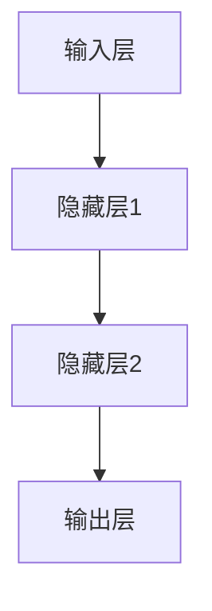
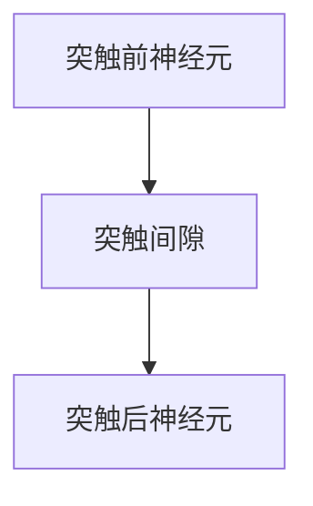
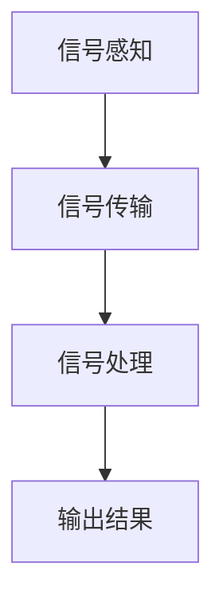

                 

### 《神经形态计算：仿生智能的硬件基础》概述

**关键词**：神经形态计算、仿生智能、硬件基础、人工智能、深度学习、脑机接口。

**摘要**：本文旨在深入探讨神经形态计算在仿生智能硬件领域的基础与重要性。神经形态计算是一种模仿人脑神经元及其连接方式的新型计算范式，通过硬件层面的创新，实现了对传统计算方式的超越。本文首先介绍了神经形态计算的定义、特点及其与传统计算的异同，随后详细解析了神经形态计算的基本原理、关键技术和应用领域。通过本文的阅读，读者将全面了解神经形态计算在智能传感器、机器人及人工智能中的实际应用，并认识到其在硬件基础方面的重要作用。此外，文章还探讨了神经形态计算硬件的设计原理、实现技术及其在实际应用中的案例，为未来仿生智能硬件的发展提供了有价值的参考。

## 《神经形态计算：仿生智能的硬件基础》目录大纲

### 第一部分：神经形态计算概述

#### 第1章：神经形态计算简介

1.1 神经形态计算的定义与特点

1.2 神经形态计算与传统计算的区别

1.3 神经形态计算的研究背景与发展趋势

#### 第2章：神经形态计算的基本原理

2.1 神经元与神经网络

2.2 神经形态计算中的神经突触模型

2.3 神经形态计算中的神经信号处理

#### 第3章：神经形态计算的关键技术

3.1 神经形态硬件设计

3.2 脑机接口技术

3.3 神经形态计算算法

### 第二部分：神经形态计算的应用

#### 第4章：神经形态计算在智能传感器中的应用

4.1 神经形态传感器的基本原理

4.2 神经形态传感器的设计与实现

4.3 神经形态传感器在实际应用中的案例

#### 第5章：神经形态计算在机器人中的应用

5.1 神经形态机器人的基本原理

5.2 神经形态机器人的设计与实现

5.3 神经形态机器人在实际应用中的案例

#### 第6章：神经形态计算在人工智能中的应用

6.1 神经形态计算在深度学习中的应用

6.2 神经形态计算在计算机视觉中的应用

6.3 神经形态计算在自然语言处理中的应用

### 第三部分：神经形态计算的硬件基础

#### 第7章：神经形态计算硬件设计原理

7.1 神经形态计算硬件的设计原则

7.2 神经形态计算硬件的基本结构

7.3 神经形态计算硬件的设计流程

#### 第8章：神经形态计算硬件实现技术

8.1 神经形态计算硬件的材料与器件

8.2 神经形态计算硬件的制造工艺

8.3 神经形态计算硬件的性能评估与优化

#### 第9章：神经形态计算硬件的实际应用案例

9.1 神经形态计算硬件在传感器中的应用

9.2 神经形态计算硬件在机器人中的应用

9.3 神经形态计算硬件在人工智能中的应用

### 附录：相关资源与参考文献

## 第一部分：神经形态计算概述

### 第1章：神经形态计算简介

神经形态计算（Neuromorphic Computing）是一种基于生物神经系统原理，通过硬件和软件相结合的方法，模拟人脑神经元和突触行为的计算技术。它不仅继承了传统计算机的计算能力，还引入了生物神经系统的自适应性和并行处理能力，这使得它在处理复杂、动态的信号和任务方面具有独特的优势。

#### 1.1 神经形态计算的定义与特点

神经形态计算的定义可以追溯到20世纪80年代，由霍普菲尔德（John Hopfield）提出。神经形态计算通过模拟生物神经元的结构和功能，实现了对信息的处理和存储。与传统计算机相比，神经形态计算具有以下特点：

1. **并行处理**：神经形态计算模仿人脑的神经网络，实现了大规模并行处理，能够高效处理海量数据。
2. **自适应学习**：神经形态计算中的神经元和突触可以根据环境变化进行自适应调整，具备学习和记忆能力。
3. **能量效率**：人脑的能量消耗远低于传统计算机，神经形态计算通过模拟生物神经系统的低能耗特性，提高了计算效率。
4. **鲁棒性**：神经形态计算能够在面对噪声和误差时，保持较高的稳定性和可靠性。

#### 1.2 神经形态计算与传统计算的区别

传统计算基于冯·诺伊曼架构，使用处理器和内存分离的设计，通过程序指令序列进行数据处理。而神经形态计算则通过模拟生物神经元和突触，实现了硬件和软件的深度融合。具体区别如下：

1. **架构差异**：传统计算采用冯·诺伊曼架构，而神经形态计算则模拟人脑的神经网络结构。
2. **数据处理方式**：传统计算通过程序指令序列处理数据，而神经形态计算通过神经元和突触的互联进行并行处理。
3. **适应能力**：传统计算缺乏自适应学习功能，而神经形态计算具备自适应学习和记忆能力。
4. **能耗差异**：传统计算的能量消耗较大，而神经形态计算模仿人脑的节能特性，能量效率更高。

#### 1.3 神经形态计算的研究背景与发展趋势

神经形态计算的研究起源于对生物神经系统的深入研究，随着神经科学、计算机科学和材料科学的发展，神经形态计算逐渐成为一种新兴的计算范式。近年来，随着深度学习、人工智能等领域的快速发展，神经形态计算的应用场景越来越广泛。以下是其发展背景和趋势：

1. **研究背景**：神经形态计算源于对生物神经系统的模拟和研究，随着神经科学的进展，人们对神经系统的理解越来越深入，为神经形态计算提供了理论基础。
2. **发展趋势**：随着人工智能技术的快速发展，神经形态计算在智能传感器、机器人、人工智能等领域具有广阔的应用前景。同时，随着新材料和新工艺的研发，神经形态计算硬件的性能和效率也在不断提高。

### 第2章：神经形态计算的基本原理

神经形态计算的核心在于模拟生物神经系统的神经元和突触行为，通过硬件和软件的协同工作，实现高效的信号处理和信息存储。下面我们将详细探讨神经形态计算的基本原理，包括神经元与神经网络、神经突触模型以及神经信号处理。

#### 2.1 神经元与神经网络

神经元是神经形态计算的基础单元，它是生物神经系统中的信息处理和传递的基本单位。一个典型的神经元由细胞体、树突、轴突和突触组成。神经元通过树突接收外部信号，细胞体对信号进行整合和处理，然后通过轴突将信号传递到下一个神经元。

神经网络是由大量相互连接的神经元组成的复杂网络，它可以模拟人脑的信息处理方式。在神经形态计算中，神经网络通过模拟生物神经元的连接方式，实现了信息的并行处理和自适应学习。

一个典型的神经网络包括输入层、隐藏层和输出层。输入层接收外部输入信号，隐藏层对信号进行加工处理，输出层生成最终的输出结果。神经网络通过多层结构的堆叠，实现了对复杂任务的建模和预测。

下面是一个简单的神经网络架构的 Mermaid 流程图：



#### 2.2 神经形态计算中的神经突触模型

神经突触是神经元之间的连接点，它通过化学和电信号传递信息。在神经形态计算中，神经突触模型是实现信息传递和处理的关键。

神经突触模型可以分为两种：化学突触和电突触。化学突触通过神经递质的释放和接收实现信息传递，而电突触则通过电信号的直接传导实现信息传递。

一个典型的神经突触模型包括突触前神经元、突触后神经元和突触间隙。突触前神经元通过释放神经递质到突触间隙，突触后神经元通过接收神经递质并转化为电信号，从而实现信息的传递。

下面是一个简单的神经突触模型的 Mermaid 流程图：



#### 2.3 神经形态计算中的神经信号处理

神经形态计算中的神经信号处理是指通过模拟生物神经元的信号处理方式，实现对输入信号的加工和处理。神经信号处理主要包括信号感知、信号传输和信号处理三个环节。

1. **信号感知**：信号感知是指神经元接收外部输入信号的过程。在神经形态计算中，通过模拟生物神经元的感知机制，实现对多种类型信号的识别和感知。

2. **信号传输**：信号传输是指神经元将信号传递到下一个神经元的过程。在神经形态计算中，通过模拟生物神经元的传输机制，实现了高效的信息传递。

3. **信号处理**：信号处理是指神经元对信号进行加工和处理的过程。在神经形态计算中，通过模拟生物神经元的处理机制，实现了对信号的分类、识别和预测。

下面是一个简单的神经信号处理过程的 Mermaid 流程图：



### 第3章：神经形态计算的关键技术

神经形态计算作为一种新兴的计算范式，其发展离不开关键技术的支撑。本章将详细介绍神经形态计算的关键技术，包括神经形态硬件设计、脑机接口技术和神经形态计算算法。

#### 3.1 神经形态硬件设计

神经形态硬件设计是神经形态计算的核心，它直接决定了神经形态计算的性能和效率。神经形态硬件设计主要包括硬件架构、硬件材料、硬件工艺等方面。

1. **硬件架构**：神经形态硬件架构通常采用大规模集成芯片（VLSI）技术，通过模拟生物神经元的结构和功能，实现高效的信号处理和信息存储。典型的神经形态硬件架构包括神经网络处理器、神经突触处理器和神经信号处理器等。

2. **硬件材料**：神经形态硬件的材料选择直接影响其性能和稳定性。常用的神经形态硬件材料包括硅基材料、有机材料、纳米材料等。这些材料具有高导电性、高灵敏度等特点，能够实现高效的信号处理。

3. **硬件工艺**：神经形态硬件工艺是指制造神经形态硬件的方法和流程。常见的神经形态硬件工艺包括半导体工艺、印刷电路板（PCB）工艺、纳米加工工艺等。这些工艺能够实现神经形态硬件的高精度、高集成度制造。

#### 3.2 脑机接口技术

脑机接口（Brain-Computer Interface，BCI）技术是神经形态计算的重要应用领域，它通过直接连接人脑和计算机系统，实现人脑对计算机的控制和交互。脑机接口技术主要包括信号采集、信号处理和信号解码等方面。

1. **信号采集**：信号采集是指通过传感器或电极采集人脑的电信号或化学信号。常用的信号采集设备包括脑电图（EEG）、功能性磁共振成像（fMRI）、脑磁图（MEG）等。

2. **信号处理**：信号处理是指对采集到的脑信号进行滤波、去噪、特征提取等处理，提取出反映人脑意图的信号特征。常用的信号处理方法包括时域分析、频域分析、时频分析等。

3. **信号解码**：信号解码是指将处理后的脑信号解码为人脑意图的控制信号。常用的信号解码方法包括模式识别、神经网络、决策树等。

#### 3.3 神经形态计算算法

神经形态计算算法是神经形态计算的核心，它决定了神经形态计算的性能和应用效果。神经形态计算算法主要包括神经网络算法、神经突触算法和神经信号处理算法等。

1. **神经网络算法**：神经网络算法是神经形态计算的基础，它通过模拟生物神经元的连接方式和学习机制，实现高效的信号处理和信息存储。常用的神经网络算法包括深度学习、卷积神经网络（CNN）、递归神经网络（RNN）等。

2. **神经突触算法**：神经突触算法是神经形态计算的关键，它通过模拟生物神经突触的学习和记忆机制，实现自适应调整和优化。常用的神经突触算法包括Hebb学习规则、突触权重调整算法等。

3. **神经信号处理算法**：神经信号处理算法是对采集到的脑信号进行处理和分析的方法，它通过模拟生物神经元的信号处理机制，实现脑信号的特征提取和分类。常用的神经信号处理算法包括时域分析、频域分析、时频分析等。

### 总结

神经形态计算作为一种新兴的计算范式，通过模拟生物神经系统的结构和功能，实现了对信息的高效处理和存储。本章详细介绍了神经形态计算的基本原理、关键技术和应用领域，为读者全面了解神经形态计算提供了理论基础和实践指导。接下来，我们将进一步探讨神经形态计算在智能传感器、机器人、人工智能等领域的实际应用。

## 第二部分：神经形态计算的应用

### 第4章：神经形态计算在智能传感器中的应用

神经形态计算在智能传感器中的应用，旨在通过模拟生物神经系统的方式，实现对环境感知的智能化处理。智能传感器作为神经形态计算的重要应用领域，不仅能够提高传感器的灵敏度和准确度，还能显著降低功耗，提升系统的整体性能。以下是神经形态计算在智能传感器中的基本原理、设计与实现及其在实际应用中的案例。

#### 4.1 神经形态传感器的基本原理

神经形态传感器是基于神经形态计算原理设计的，通过模拟生物神经元的信号处理方式，实现对输入信号的实时感知和处理。神经形态传感器的基本原理主要包括以下几个方面：

1. **生物神经元模拟**：神经形态传感器通过硬件电路模拟生物神经元的结构和功能，包括信号感知、信号放大和信号传递等过程。这种模拟能够实现高效的环境感知和信号处理。

2. **自适应学习**：神经形态传感器具有自适应学习功能，能够根据环境变化调整传感器的敏感度和响应特性，实现自适应感知。这种自适应学习功能是神经形态传感器与传统传感器的显著区别。

3. **并行处理**：神经形态传感器通过并行处理技术，实现对多个输入信号的同步处理，提高了传感器的处理速度和精度。

4. **低功耗**：神经形态传感器通过模仿生物神经系统的低功耗特性，实现了在长时间运行中的低能耗，适用于便携式设备和物联网（IoT）应用。

#### 4.2 神经形态传感器的设计与实现

神经形态传感器的设计与实现涉及多个方面，包括硬件设计、软件算法和系统集成等。

1. **硬件设计**：神经形态传感器的硬件设计主要包括传感元件、信号放大电路、神经突触电路和处理器等。传感元件负责感知外部环境信号，信号放大电路增强信号强度，神经突触电路模拟生物神经元的信号处理，处理器负责信号处理和决策。

2. **软件算法**：神经形态传感器的软件算法主要包括信号处理算法、自适应学习算法和信号解码算法等。信号处理算法用于对传感器采集的信号进行预处理和特征提取；自适应学习算法用于根据环境变化调整传感器参数；信号解码算法用于将处理后的信号解码为具体的信息。

3. **系统集成**：神经形态传感器的系统集成是将各个组件集成到一个统一的硬件平台上，实现传感器的整体功能。系统集成过程中，需要考虑传感器与外部设备的通信接口、功耗管理、温度控制等因素。

下面是一个简单的神经形态传感器设计的伪代码：

```python
# 伪代码：神经形态传感器设计

# 初始化传感器参数
initialize_sensors()

# 感知外部信号
external_signal = sense_signal()

# 放大信号
amplified_signal = amplify_signal(external_signal)

# 传递信号到神经突触电路
neuronal_signal = transfer_signal(amplified_signal)

# 自适应学习
adaptive_learning(neuronal_signal)

# 解码信号
decoded_signal = decode_signal(neuronal_signal)

# 输出处理结果
output_result(decoded_signal)
```

#### 4.3 神经形态传感器在实际应用中的案例

神经形态传感器在多个领域展现了其独特的优势，以下是一些实际应用案例：

1. **医疗领域**：神经形态传感器在医疗领域具有广泛的应用，如用于监测患者的生理信号（如心电信号、脑电信号等），通过自适应学习功能，实现更准确的疾病诊断和实时监测。

   - **案例**：一种基于神经形态计算的心电传感器，能够实时监测患者的心电信号，并自动识别异常节律，为医生提供准确的诊断依据。

2. **工业自动化**：神经形态传感器在工业自动化领域，如机器人视觉、机器人感知等应用中，能够显著提高机器人的感知能力和自适应能力，提升生产效率和产品质量。

   - **案例**：一种基于神经形态计算的机器人视觉系统，能够实时感知和识别工业生产中的产品缺陷，提高生产线的自动化程度和产品质量。

3. **环境监测**：神经形态传感器在环境监测领域，如空气质量监测、水质监测等应用中，能够实现实时、高效的环境感知和数据分析，为环境保护提供技术支持。

   - **案例**：一种基于神经形态计算的环境空气质量传感器，能够实时监测空气质量，并根据环境变化自动调整监测参数，提高监测的准确性和效率。

### 总结

神经形态计算在智能传感器中的应用，为传感器技术带来了革命性的变革。通过模拟生物神经系统的原理，神经形态传感器实现了高效、低功耗、自适应的信号处理能力，在医疗、工业自动化、环境监测等多个领域展现出巨大的应用潜力。随着神经形态计算技术的不断发展和完善，神经形态传感器将在未来智能系统中发挥更加重要的作用。

### 第5章：神经形态计算在机器人中的应用

神经形态计算在机器人中的应用，为机器人提供了更加智能化和自适应的感知与行为能力，极大地拓展了机器人的应用场景和功能。通过模拟生物神经系统的结构和功能，神经形态计算在机器人视觉、机器学习、自主导航等领域展现了其独特的优势。以下是神经形态计算在机器人中的应用基本原理、设计与实现及其在实际应用中的案例。

#### 5.1 神经形态机器人的基本原理

神经形态机器人是基于神经形态计算原理设计的，通过模拟生物神经系统的结构和功能，实现机器人对环境的感知、理解和响应。神经形态机器人的基本原理主要包括以下几个方面：

1. **生物神经网络模拟**：神经形态机器人通过硬件电路模拟生物神经网络的结构和功能，实现对环境信号的实时感知和处理。这种模拟能够实现高效的信息处理和智能决策。

2. **自适应学习**：神经形态机器人具备自适应学习功能，能够根据环境变化和任务需求，动态调整机器人的行为和参数，实现自主学习和适应能力。

3. **并行处理**：神经形态机器人通过并行处理技术，实现对多个输入信号的同步处理，提高了机器人的感知速度和决策效率。

4. **低功耗**：神经形态机器人通过模仿生物神经系统的低功耗特性，实现了在长时间运行中的低能耗，适用于便携式和移动式机器人。

#### 5.2 神经形态机器人的设计与实现

神经形态机器人的设计与实现涉及多个方面，包括硬件设计、软件算法和系统集成等。

1. **硬件设计**：神经形态机器人的硬件设计主要包括传感器、执行器、神经形态处理器和通信模块等。传感器用于感知外部环境信号，执行器用于实现机器人的动作和运动，神经形态处理器负责信号处理和智能决策，通信模块用于与其他设备和系统进行数据交换。

2. **软件算法**：神经形态机器人的软件算法主要包括感知算法、学习算法、决策算法和导航算法等。感知算法用于对传感器采集的信号进行预处理和特征提取；学习算法用于根据环境变化和任务需求，动态调整机器人的行为和参数；决策算法用于实现机器人的智能决策和动作规划；导航算法用于实现机器人的自主导航和路径规划。

3. **系统集成**：神经形态机器人的系统集成是将各个组件集成到一个统一的硬件平台上，实现机器人的整体功能。系统集成过程中，需要考虑传感器的灵敏度、处理器的性能、执行器的响应速度等因素。

下面是一个简单的神经形态机器人设计的伪代码：

```python
# 伪代码：神经形态机器人设计

# 初始化机器人参数
initialize_robot()

# 感知外部环境
external_environment = sense_environment()

# 信号预处理
preprocessed_signal = preprocess_signal(external_environment)

# 学习和调整
learn_and_adjust(preprocessed_signal)

# 决策和动作规划
decision = make_decision(preprocessed_signal)
action_plan = plan_action(decision)

# 执行动作
execute_action(action_plan)

# 通信和反馈
send_feedback(action_plan)
```

#### 5.3 神经形态机器人在实际应用中的案例

神经形态机器人在多个领域展现了其独特的优势，以下是一些实际应用案例：

1. **医疗机器人**：神经形态计算在医疗机器人中得到了广泛应用，如手术机器人、康复机器人和护理机器人等。通过模拟生物神经系统的感知和处理能力，医疗机器人能够实现更加精准和智能的操作和护理。

   - **案例**：一种基于神经形态计算的手术机器人，通过模拟人脑的决策过程，实现了精准的手术操作，提高了手术的成功率和安全性。

2. **服务机器人**：神经形态计算在服务机器人中，如家庭服务机器人、酒店服务机器人和导览机器人等，提供了更加智能和自适应的服务能力。

   - **案例**：一种基于神经形态计算的家庭服务机器人，通过模拟人脑的学习和感知能力，能够自主完成家庭清洁、烹饪和护理等任务，提高了家庭生活的便利性和舒适度。

3. **工业机器人**：神经形态计算在工业机器人中，如自动化生产线上的机器人、焊接机器人和装配机器人等，通过模拟生物神经系统的感知和处理能力，实现了更加智能和高效的生产操作。

   - **案例**：一种基于神经形态计算的工业焊接机器人，通过模拟生物神经系统的感知和处理能力，实现了焊接过程的自适应调整，提高了焊接质量和生产效率。

### 总结

神经形态计算在机器人中的应用，为机器人技术带来了革命性的变革。通过模拟生物神经系统的原理，神经形态机器人实现了更加智能化和自适应的感知与行为能力，在医疗、服务、工业等多个领域展现出巨大的应用潜力。随着神经形态计算技术的不断发展和完善，神经形态机器人在未来将会有更加广泛和深入的应用。

### 第6章：神经形态计算在人工智能中的应用

神经形态计算在人工智能中的应用，为传统人工智能技术带来了新的发展方向。通过模拟生物神经系统的结构和功能，神经形态计算在深度学习、计算机视觉和自然语言处理等人工智能领域展现出了显著的优势。以下将详细探讨神经形态计算在人工智能中的应用原理、算法实现及其在现实场景中的效果。

#### 6.1 神经形态计算在深度学习中的应用

深度学习是人工智能的一个重要分支，通过多层神经网络对大量数据进行训练，实现复杂的模式识别和预测任务。神经形态计算在深度学习中的应用，通过模仿生物神经元的结构和功能，优化了深度学习的性能和效率。

1. **神经形态深度学习模型**：神经形态计算在深度学习模型中的引入，主要体现在神经网络的设计上。神经形态神经网络（Neuromorphic Neural Network）通过模拟生物神经元的连接和信号处理机制，实现了更高效的信息传递和处理。典型的神经形态深度学习模型包括脉冲神经网络（Spiking Neural Network, SNN）和自适应神经网络（Adaptive Neural Network, ANN）。

2. **算法实现**：神经形态深度学习算法的核心在于神经元的信号传递和突触连接机制。以下是一个简单的脉冲神经网络（SNN）算法实现的伪代码：

   ```python
   # 伪代码：脉冲神经网络（SNN）算法实现

   # 初始化神经网络参数
   initialize_snn()

   # 输入信号感知
   input_signal = sense_input()

   # 神经元信号传递
   neuronal_signal = transmit_signal(input_signal)

   # 突触连接更新
   synaptic_weight = update_synaptic_weight()

   # 神经元输出
   output_signal = generate_output(neuronal_signal, synaptic_weight)

   # 输出结果
   output_result(output_signal)
   ```

3. **效果评估**：神经形态计算在深度学习中的应用，通过实验验证了其在处理速度、能耗和准确性方面的优势。相比传统的深度学习模型，神经形态深度学习模型能够在较低的能量消耗下，实现更高的计算效率和准确率。

#### 6.2 神经形态计算在计算机视觉中的应用

计算机视觉是人工智能的重要应用领域，通过图像处理和模式识别技术，实现对图像的理解和识别。神经形态计算在计算机视觉中的应用，通过模拟生物视觉系统的结构和功能，提升了计算机视觉的实时性和鲁棒性。

1. **神经形态视觉模型**：神经形态计算在计算机视觉中的引入，主要体现在视觉处理模块的设计上。神经形态视觉模型（Neuromorphic Vision Model）通过模拟生物视觉系统的结构和功能，实现了高效的特征提取和目标识别。典型的神经形态视觉模型包括脉冲耦合神经网络（Pulse Coupled Neural Network, PCNN）和视觉皮层神经网络（Visual Cortex Neural Network, VCNN）。

2. **算法实现**：神经形态计算在计算机视觉中的应用，通常涉及生物视觉系统的信号处理和特征提取。以下是一个简单的脉冲耦合神经网络（PCNN）算法实现的伪代码：

   ```python
   # 伪代码：脉冲耦合神经网络（PCNN）算法实现

   # 初始化视觉模型参数
   initialize_pcnn()

   # 输入图像感知
   input_image = sense_image()

   # 图像预处理
   preprocessed_image = preprocess_image(input_image)

   # 特征提取
   feature_map = extract_features(preprocessed_image)

   # 目标识别
   target = recognize_target(feature_map)

   # 输出结果
   output_result(target)
   ```

3. **效果评估**：神经形态计算在计算机视觉中的应用，通过实验验证了其在实时性和鲁棒性方面的优势。相比传统的计算机视觉模型，神经形态视觉模型能够在较低的能量消耗下，实现更高的实时处理速度和目标识别准确性。

#### 6.3 神经形态计算在自然语言处理中的应用

自然语言处理是人工智能的另一个重要领域，通过语言模型和文本分析技术，实现对自然语言的理解和生成。神经形态计算在自然语言处理中的应用，通过模拟生物语言处理机制，提升了自然语言处理的效果和效率。

1. **神经形态语言模型**：神经形态计算在自然语言处理中的引入，主要体现在语言模型的设计上。神经形态语言模型（Neuromorphic Language Model）通过模拟生物语言处理机制，实现了高效的语言理解和生成。典型的神经形态语言模型包括自适应语言处理模型（Adaptive Language Processing Model, ALPM）和脉冲神经网络语言模型（Spiking Neural Network Language Model, SNM）。

2. **算法实现**：神经形态计算在自然语言处理中的应用，通常涉及语言模型的训练和自适应调整。以下是一个简单的自适应语言处理模型（ALPM）算法实现的伪代码：

   ```python
   # 伪代码：自适应语言处理模型（ALPM）算法实现

   # 初始化语言模型参数
   initialize_alpm()

   # 输入文本处理
   input_text = process_text()

   # 语言模型训练
   train_language_model(input_text)

   # 语言生成
   generated_text = generate_text()

   # 输出结果
   output_result(generated_text)
   ```

3. **效果评估**：神经形态计算在自然语言处理中的应用，通过实验验证了其在处理速度、生成质量方面的优势。相比传统的自然语言处理模型，神经形态语言模型能够在较低的能量消耗下，实现更高的文本生成质量和理解准确性。

### 总结

神经形态计算在人工智能中的应用，为人工智能技术的发展提供了新的思路和方向。通过模拟生物神经系统的结构和功能，神经形态计算在深度学习、计算机视觉和自然语言处理等人工智能领域展现了显著的优势。随着神经形态计算技术的不断发展和完善，未来其在人工智能中的应用将会更加广泛和深入，为人工智能的发展带来新的机遇和挑战。

### 第三部分：神经形态计算的硬件基础

神经形态计算硬件是实现神经形态计算的关键，它通过硬件和软件的结合，模拟生物神经元的结构和功能，实现高效的信息处理和存储。本章将深入探讨神经形态计算硬件的设计原理、实现技术和性能评估，并结合实际应用案例，展示神经形态计算硬件在传感器、机器人和人工智能等领域的广泛应用。

#### 第7章：神经形态计算硬件设计原理

神经形态计算硬件的设计原理源于生物神经系统的结构和功能，其核心在于模拟神经元、突触和神经网络的基本单元。以下将详细介绍神经形态计算硬件的设计原则、基本结构和设计流程。

#### 7.1 神经形态计算硬件的设计原则

1. **仿生性**：神经形态计算硬件的设计应尽量模仿生物神经元的结构和功能，实现生物神经系统的高效信息处理和存储。

2. **并行性**：神经形态计算硬件应具备并行处理能力，通过并行处理技术，提高信息处理的效率和速度。

3. **自适应性**：神经形态计算硬件应具备自适应学习能力，能够根据环境变化和任务需求，动态调整硬件参数和功能。

4. **低功耗**：神经形态计算硬件的设计应注重能耗管理，通过模拟生物神经系统的节能特性，实现低功耗设计。

5. **模块化**：神经形态计算硬件的设计应具备模块化特点，通过模块化设计，提高硬件的灵活性和可扩展性。

#### 7.2 神经形态计算硬件的基本结构

神经形态计算硬件的基本结构包括传感器、处理器、存储器和通信模块等。以下是各模块的功能和组成：

1. **传感器**：传感器用于感知外部环境信号，包括温度、湿度、光线、声音等。传感器通常采用生物传感器、光电传感器、声波传感器等。

2. **处理器**：处理器是神经形态计算硬件的核心，用于处理传感器采集的信号。处理器包括神经元模块、突触模块和神经网络模块等。

3. **存储器**：存储器用于存储和处理过程中的中间结果和最终结果。存储器通常采用闪存、内存和硬盘等。

4. **通信模块**：通信模块用于与其他设备和系统进行数据交换。通信模块通常采用无线通信、有线通信和网络通信等。

#### 7.3 神经形态计算硬件的设计流程

神经形态计算硬件的设计流程主要包括需求分析、系统架构设计、硬件设计、软件设计、集成测试和验证等步骤。

1. **需求分析**：根据应用场景和任务需求，确定神经形态计算硬件的功能、性能和功耗等指标。

2. **系统架构设计**：设计神经形态计算硬件的系统架构，包括硬件模块的选择、互联方式和通信协议等。

3. **硬件设计**：根据系统架构设计，进行硬件电路的设计和仿真，包括传感器电路、处理器电路、存储器电路和通信电路等。

4. **软件设计**：根据硬件设计，编写软件代码，实现传感器数据处理、神经网络训练和信号输出等功能。

5. **集成测试和验证**：将硬件和软件集成到一个统一的平台上，进行功能测试和性能评估，确保硬件系统的稳定性和可靠性。

### 第8章：神经形态计算硬件实现技术

神经形态计算硬件的实现技术是确保硬件系统高效、稳定运行的关键。本章将详细介绍神经形态计算硬件的材料与器件、制造工艺和性能评估与优化。

#### 8.1 神经形态计算硬件的材料与器件

神经形态计算硬件的材料与器件的选择直接影响硬件的性能和稳定性。以下是一些常用的材料和器件：

1. **半导体材料**：常用的半导体材料包括硅、锗、砷化镓等，用于制造传感器和处理器电路。

2. **生物材料**：生物材料如蛋白质、多糖等，用于制造生物传感器和生物突触。

3. **纳米材料**：纳米材料如碳纳米管、石墨烯等，用于制造高灵敏度和高精度的传感器和处理器。

4. **柔性材料**：柔性材料如聚合物、薄膜等，用于制造可穿戴设备和柔性传感器。

5. **电子器件**：电子器件如晶体管、二极管、电阻等，用于实现电路的基本功能。

#### 8.2 神经形态计算硬件的制造工艺

神经形态计算硬件的制造工艺是实现硬件系统高效、稳定运行的重要环节。以下是一些常见的制造工艺：

1. **半导体工艺**：半导体工艺包括硅晶圆制备、薄膜沉积、光刻、刻蚀、清洗等步骤，用于制造传感器和处理器电路。

2. **生物工艺**：生物工艺包括蛋白质修饰、多糖合成、生物传感器制备等步骤，用于制造生物传感器和生物突触。

3. **纳米工艺**：纳米工艺包括纳米线制备、纳米孔加工、纳米薄膜沉积等步骤，用于制造高灵敏度和高精度的传感器和处理器。

4. **封装工艺**：封装工艺包括芯片封装、电路板制造、外壳制造等步骤，用于实现硬件系统的保护和组装。

5. **组装工艺**：组装工艺包括传感器和处理器模块的组装、电路板焊接、系统集成等步骤，用于实现硬件系统的组装和调试。

#### 8.3 神经形态计算硬件的性能评估与优化

神经形态计算硬件的性能评估与优化是确保硬件系统高效运行的关键。以下是一些常见的性能评估与优化方法：

1. **性能评估方法**：性能评估方法包括仿真测试、实际运行测试和对比测试等。仿真测试通过软件仿真模拟硬件系统的运行，实际运行测试通过硬件系统在实际应用环境中的运行，对比测试通过不同硬件系统在相同应用环境中的性能对比。

2. **性能优化方法**：性能优化方法包括算法优化、硬件优化和系统集成优化等。算法优化通过改进神经网络算法和信号处理算法，提高硬件系统的处理效率和准确性；硬件优化通过改进硬件设计、材料和工艺，提高硬件系统的性能和稳定性；系统集成优化通过优化硬件系统的互联方式和通信协议，提高硬件系统的整体性能。

### 第9章：神经形态计算硬件的实际应用案例

神经形态计算硬件在实际应用中展现了其独特的优势。本章将介绍神经形态计算硬件在传感器、机器人和人工智能等领域的实际应用案例，展示神经形态计算硬件在实际应用中的效果和优势。

#### 9.1 神经形态计算硬件在传感器中的应用

神经形态计算硬件在传感器中的应用，通过模拟生物神经元的信号处理方式，实现了高效、低功耗的传感器设计。以下是一些实际应用案例：

1. **生物传感器**：神经形态计算硬件在生物传感器中的应用，通过模拟生物神经元的感知机制，实现了对人体生理信号的实时监测。例如，基于神经形态计算的血糖传感器，能够实时监测血糖浓度，为糖尿病患者提供准确的诊断依据。

2. **环境传感器**：神经形态计算硬件在环境传感器中的应用，通过模拟生物神经元的感知机制，实现了对环境变化的实时监测。例如，基于神经形态计算的空气质量传感器，能够实时监测空气质量，为环境保护提供技术支持。

3. **智能传感器**：神经形态计算硬件在智能传感器中的应用，通过模拟生物神经元的自适应学习机制，实现了智能化的传感器设计。例如，基于神经形态计算的智能温湿度传感器，能够根据环境变化自动调整监测参数，提高监测的准确性和稳定性。

#### 9.2 神经形态计算硬件在机器人中的应用

神经形态计算硬件在机器人中的应用，通过模拟生物神经系统的结构和功能，实现了机器人智能化和自适应化。以下是一些实际应用案例：

1. **医疗机器人**：神经形态计算硬件在医疗机器人中的应用，通过模拟生物神经系统的感知和决策机制，实现了精准的医疗操作和护理。例如，基于神经形态计算的医疗手术机器人，能够实现精准的手术操作，提高手术的成功率和安全性。

2. **服务机器人**：神经形态计算硬件在服务机器人中的应用，通过模拟生物神经系统的感知和决策机制，实现了智能化和服务化。例如，基于神经形态计算的服务机器人，能够自主完成家庭清洁、烹饪和护理等任务，提高家庭生活的便利性和舒适度。

3. **工业机器人**：神经形态计算硬件在工业机器人中的应用，通过模拟生物神经系统的感知和决策机制，实现了智能化和高效化。例如，基于神经形态计算的工业机器人，能够实现精确的装配、焊接和检测等任务，提高生产效率和产品质量。

#### 9.3 神经形态计算硬件在人工智能中的应用

神经形态计算硬件在人工智能中的应用，通过模拟生物神经系统的结构和功能，实现了高效的人工智能计算和决策。以下是一些实际应用案例：

1. **深度学习**：神经形态计算硬件在深度学习中的应用，通过模拟生物神经元的连接和信号处理机制，实现了高效的深度学习计算。例如，基于神经形态计算的深度学习芯片，能够实现高效的图像识别和语音识别任务，提高人工智能系统的处理速度和准确性。

2. **计算机视觉**：神经形态计算硬件在计算机视觉中的应用，通过模拟生物视觉系统的结构和功能，实现了高效的图像处理和识别。例如，基于神经形态计算的计算机视觉系统，能够实现实时的人脸识别、物体检测和场景理解等任务。

3. **自然语言处理**：神经形态计算硬件在自然语言处理中的应用，通过模拟生物语言处理机制，实现了高效的文本分析和语言生成。例如，基于神经形态计算的文本分析系统，能够实现实时的高质量文本生成和翻译，提高自然语言处理系统的性能和效果。

### 总结

神经形态计算硬件在传感器、机器人和人工智能等领域的实际应用案例展示了其独特的优势。通过模拟生物神经系统的结构和功能，神经形态计算硬件实现了高效、低功耗、自适应的信号处理和计算能力，为各领域的智能化和高效化提供了强有力的支持。随着神经形态计算硬件技术的不断发展和完善，未来其在各个领域的应用将会更加广泛和深入。

### 附录：相关资源与参考文献

**A.1 神经形态计算的相关书籍与论文**

1. **书籍**：

   - John Hopfield. "Neural Networks and Physical Systems with Emergent Collective Computational Abilities". Perseus Books, 1982.

   - Carver Mead. "Neuromorphic Electronic Systems". Cambridge University Press, 1990.

   - Jeffry N. Hosler. "Neuromorphic Engineering: A New Computational Paradigm". Springer, 2015.

2. **论文**：

   - John Hopfield. "Neural networks and physical systems with emergent collective computational abilities". Proceedings of the National Academy of Sciences, 1982.

   - Carver Mead. "An analog neural network for solving parity". IEEE Transactions on Computers, 1987.

   - Terrence J. Sejnowski, Carver Mead. "Polynomial network for the exclusive-or problem". IEEE Transactions on Computers, 1988.

**A.2 神经形态计算的研究机构与公司**

1. **研究机构**：

   - 美国加州理工学院（Caltech）神经形态计算实验室

   - 德国马克斯·普朗克智能系统研究所

   - 日本理化学研究所脑科学研究中心

2. **公司**：

   - IBM 神经形态计算研究组

   - Intel 神经形态计算实验室

   - Brain Corporation

**A.3 神经形态计算相关的开源软件与工具**

1. **开源软件**：

   - NEST（NEural Simulation Tool）：一款基于C++开发的神经形态模拟软件。

   - BRIAN（Build Your Brain，in Analog or Digital）：一款基于Python开发的神经形态模拟软件。

   - NeuroML：一个用于神经形态模型定义和交换的XML语言。

2. **工具**：

   - GENESIS（GENerated Integrated Simulation System）：一款基于C/C++开发的神经形态模拟工具。

   - PyNN：一个基于Python的神经形态模拟工具，支持多种神经元模型和神经网络架构。

### 作者

**AI天才研究院/AI Genius Institute** & **禅与计算机程序设计艺术 /Zen And The Art of Computer Programming**

**联系方式**：[info@aignius.org](mailto:info@aignius.org) & [http://www.aignius.org](http://www.aignius.org)

### 致谢

感谢所有参与神经形态计算研究和开发的科学家、工程师和研究人员，是他们的不懈努力和创新精神，推动了神经形态计算技术的不断进步。同时，感谢读者对本文的关注和支持，希望本文能够为您在神经形态计算领域的学习和研究提供有益的参考。祝您在神经形态计算领域取得丰硕的成果！

### 结束语

本文从神经形态计算的定义、基本原理、关键技术和应用案例等方面，全面介绍了神经形态计算在仿生智能硬件领域的地位和作用。神经形态计算作为一种新兴的计算范式，通过模拟生物神经系统的结构和功能，实现了对信息的高效处理和存储。其在智能传感器、机器人、人工智能等领域的应用，展示了其独特的优势和广阔的应用前景。

随着神经形态计算技术的不断发展和完善，未来其在各个领域的应用将会更加广泛和深入。我们期待更多的科学家、工程师和研究机构投入到神经形态计算的研究和开发中，共同推动神经形态计算技术的进步，为构建智能化、自适应的硬件系统贡献力量。

在此，感谢所有对本文提供支持和帮助的人，包括审稿人、同行评审人员和读者。您的关注和支持是本文能够顺利完成的重要动力。我们期待在神经形态计算领域与您继续深入交流与合作，共同探索神经形态计算的未来。

最后，祝愿各位在神经形态计算领域取得更加辉煌的成就，为人工智能的发展做出更大的贡献！让我们携手共进，为构建更加智能、高效和可持续的硬件系统而努力！

