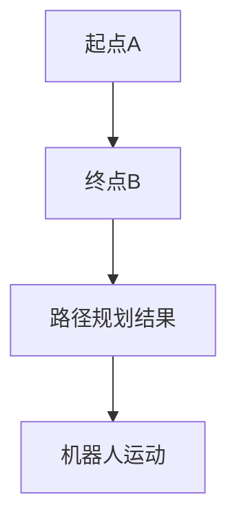
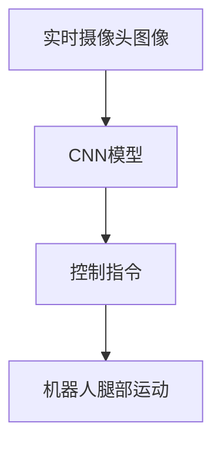
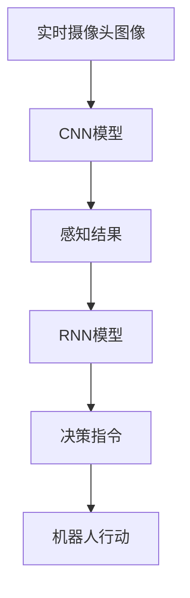

                 

### 《神经网络在机器人控制中的应用》

> **关键词：** 神经网络、机器人控制、多层感知机、卷积神经网络、循环神经网络、路径规划、运动控制、感知与决策、模型压缩、硬件加速、数据增强、迁移学习。

> **摘要：** 本文深入探讨了神经网络在机器人控制中的应用。首先，介绍了神经网络的基本概念和数学基础，包括神经元、激活函数、前向传播与反向传播算法、损失函数与优化算法。然后，详细阐述了多层感知机、卷积神经网络和循环神经网络这三种常见神经网络架构及其在机器人控制中的具体应用。接着，通过具体案例分析了神经网络在机器人路径规划、运动控制和感知与决策等领域的应用。最后，探讨了神经网络在机器人控制中面临的挑战与优化策略，并展望了未来的发展趋势。

### 第一部分：引言与背景

在当今的科技领域，人工智能（AI）正逐渐改变着我们的生活方式。而神经网络（Neural Networks）作为人工智能的核心技术之一，其在机器人控制中的应用越来越广泛。随着机器人技术的不断发展，如何实现高效、智能的机器人控制成为了一个亟待解决的问题。而神经网络，凭借其强大的学习能力和自适应能力，为机器人控制提供了一种新的解决方案。

#### 第1章：神经网络与机器人控制概述

##### 1.1 神经网络简介

神经网络是模仿人脑神经元工作方式的计算模型，通过大量神经元之间的连接和交互来处理信息。神经网络的发展可以追溯到20世纪40年代，当时心理学家和数学家开始尝试通过数学模型来模拟人脑的功能。随着时间的推移，神经网络的理论体系不断完善，应用领域也不断扩大，从最初的简单计算模型发展到了今天复杂的多层网络结构。

##### 1.1.1 神经网络的起源与发展

神经网络的起源可以追溯到1943年，心理学家McCulloch和数学家Pitts提出了第一个神经网络的数学模型——MP模型。1958年，Frank Rosenblatt提出了感知机（Perceptron）模型，这是神经网络的一个重大突破。然而，由于感知机的局限性，神经网络的研究在20世纪60年代陷入了低潮。

直到1986年，Rumelhart、Hinton和Williams等人提出了反向传播算法（Backpropagation Algorithm），使得神经网络的研究重新焕发生机。随后，多层感知机（MLP）、卷积神经网络（CNN）和循环神经网络（RNN）等结构相继出现，为神经网络在各个领域的应用提供了可能。

##### 1.1.2 神经网络的基本概念

神经网络由大量简单的计算单元——神经元组成。每个神经元接收多个输入信号，通过加权求和后，经过激活函数转换为输出信号。神经网络通过不断调整连接权重，来实现对输入数据的映射和学习。

##### 1.1.3 神经网络在机器人控制中的应用

神经网络在机器人控制中的应用主要体现在以下几个方面：

1. **路径规划**：通过神经网络，机器人可以学会在复杂环境中选择最优路径，从而提高导航效率。
2. **运动控制**：神经网络可以用于控制机器人的运动，使其在执行特定任务时更加灵活和精确。
3. **感知与决策**：神经网络可以用于处理机器人的感知数据，辅助其做出合理的决策。

##### 1.2 机器人控制概述

机器人控制是使机器人能够执行特定任务的过程，其基本原理包括传感器感知、控制器决策和执行器执行。

##### 1.2.1 机器人控制的基本原理

1. **传感器感知**：机器人通过传感器获取环境信息，如视觉、听觉、触觉等。
2. **控制器决策**：控制器根据传感器获取的信息，通过算法进行决策，生成控制指令。
3. **执行器执行**：执行器根据控制指令执行相应动作，如运动、抓取等。

##### 1.2.2 机器人控制系统的组成

机器人控制系统通常包括以下几个部分：

1. **传感器**：用于感知环境的设备，如摄像头、超声波传感器等。
2. **控制器**：用于处理传感器数据，生成控制指令的设备，可以是单片机、PLC等。
3. **执行器**：用于执行机器人动作的设备，如电机、气缸等。
4. **通信模块**：用于控制器与其他设备之间的通信，如无线通信、有线通信等。

##### 1.2.3 机器人控制的目标与挑战

机器人控制的目标是实现机器人的自主运行和高效任务执行。然而，在这个过程中，机器人面临着一系列挑战：

1. **环境复杂性**：机器人需要适应复杂多变的自然环境。
2. **实时性要求**：机器人需要快速响应环境变化，实现实时控制。
3. **鲁棒性要求**：机器人需要具备较强的环境适应能力，能够应对各种异常情况。

#### 第2章：神经网络的数学基础

要深入理解神经网络在机器人控制中的应用，我们首先需要掌握神经网络的数学基础。本章节将介绍神经网络的几个关键组成部分，包括神经元与激活函数、前向传播与反向传播算法、损失函数与优化算法。

##### 2.1 神经元与激活函数

神经元是神经网络的基本计算单元，类似于人脑中的神经元。每个神经元接收多个输入信号，并通过加权求和来生成输出。神经元的工作原理可以概括为以下步骤：

1. **输入信号加权求和**：每个输入信号乘以相应的权重，然后求和。
   \[
   z = \sum_{i=1}^{n} x_i \cdot w_i
   \]
   其中，\(x_i\)是第\(i\)个输入信号，\(w_i\)是第\(i\)个输入信号的权重。

2. **应用激活函数**：将加权求和的结果应用激活函数，生成输出信号。
   \[
   a = f(z)
   \]
   其中，\(f\)是激活函数，\(a\)是神经元的输出。

常见的激活函数包括：

1. ** sigmoid 函数**：
   \[
   f(z) = \frac{1}{1 + e^{-z}}
   \]
   sigmoid函数可以将输入映射到0和1之间，常用于二分类问题。

2. **ReLU函数**：
   \[
   f(z) = \max(0, z)
   \]
   ReLU函数在输入小于0时输出0，大于0时输出输入值，具有简单和计算效率高的特点。

##### 2.2 前向传播与反向传播算法

前向传播和反向传播是神经网络训练过程中两个关键步骤。前向传播用于计算网络输出，反向传播用于更新网络权重。

**前向传播算法**：

1. **初始化权重和偏置**：随机初始化网络的权重和偏置。
2. **输入信号通过网络**：将输入信号传递到网络的每一层，每层神经元通过加权求和并应用激活函数生成输出。
3. **计算输出**：网络最后一层的输出即为预测结果。

**反向传播算法**：

1. **计算损失**：计算预测结果与实际结果之间的差距，即损失。
2. **计算误差**：从输出层开始，反向计算每层神经元的误差。
3. **更新权重**：根据误差和当前权重的梯度，更新网络权重。

反向传播算法的具体步骤如下：

1. **计算输出层误差**：
   \[
   \delta_L = \frac{\partial L}{\partial z_L} \cdot f'(z_L)
   \]
   其中，\(L\)是损失函数，\(z_L\)是输出层的加权求和结果，\(f'\)是激活函数的导数。

2. **反向传播误差**：
   \[
   \delta_{l} = (\delta_{l+1} \cdot W_{l+1})^T \cdot f'(z_{l})
   \]
   其中，\(\delta_{l}\)是第\(l\)层的误差，\(W_{l+1}\)是第\(l+1\)层的权重。

3. **更新权重**：
   \[
   \Delta W_{l} = \alpha \cdot \delta_{l} \cdot a_{l-1}^T
   \]
   \[
   W_{l} = W_{l} - \Delta W_{l}
   \]
   其中，\(\Delta W_{l}\)是第\(l\)层的权重更新，\(\alpha\)是学习率，\(a_{l-1}^T\)是第\(l-1\)层的输出。

**伪代码实现**：

```python
# 初始化权重和偏置
W = randn(n_output, n_hidden)
b = zeros(n_output, 1)
c = zeros(n_hidden, 1)

# 前向传播
z = X * W + b
a = sigmoid(z)

# 计算损失
L = mse(y, a)

# 反向传播
dL_da = -2 * (y - a)
da_dz = sigmoid_derivative(z)
dz_dW = X.T
dL_dW = da_dz * dz_dW

# 更新权重
W = W - alpha * dL_dW
b = b - alpha * dL_db
c = c - alpha * dL_dc
```

##### 2.3 损失函数与优化算法

损失函数用于衡量预测结果与实际结果之间的差距，优化算法用于更新网络权重，以最小化损失函数。

**常见的损失函数**：

1. **均方误差（MSE）**：
   \[
   L = \frac{1}{2} \sum_{i=1}^{n} (y_i - \hat{y}_i)^2
   \]
   其中，\(y_i\)是实际结果，\(\hat{y}_i\)是预测结果。

2. **交叉熵（Cross-Entropy）**：
   \[
   L = -\sum_{i=1}^{n} y_i \cdot \log(\hat{y}_i)
   \]
   其中，\(y_i\)是实际结果，\(\hat{y}_i\)是预测结果。

**常见的优化算法**：

1. **随机梯度下降（SGD）**：
   \[
   \Delta W = -\alpha \cdot \nabla_{W} L
   \]
   其中，\(\alpha\)是学习率，\(\nabla_{W} L\)是损失函数对权重的梯度。

2. **Adam优化器**：
   \[
   m_t = \beta_1 m_{t-1} + (1 - \beta_1) \nabla_{W} L
   \]
   \[
   v_t = \beta_2 v_{t-1} + (1 - \beta_2) (\nabla_{W} L)^2
   \]
   \[
   \Delta W = -\alpha \cdot \frac{m_t}{1 - \beta_1^t}
   \]
   其中，\(\beta_1\)和\(\beta_2\)是超参数。

**伪代码实现**：

```python
# 初始化学习率和超参数
alpha = 0.01
beta1 = 0.9
beta2 = 0.999
epsilon = 1e-8

# 初始化动量和方差
m = zeros(W.shape)
v = zeros(W.shape)

# 计算梯度
g = compute_gradient(L, W)

# 更新动量和方差
m = beta1 * m + (1 - beta1) * g
v = beta2 * v + (1 - beta2) * g * g

# 计算修正的方差
v_hat = v / (1 - beta2 ** t)

# 更新权重
W = W - alpha * m / (sqrt(v_hat) + epsilon)
```

通过以上数学基础的介绍，我们已经为理解神经网络在机器人控制中的应用奠定了基础。接下来，我们将详细探讨常见的神经网络架构，以及它们在机器人控制中的应用。

### 第3章：常见的神经网络架构

在上一章节中，我们介绍了神经网络的基本数学基础。本章节将深入探讨几种常见的神经网络架构，包括多层感知机（MLP）、卷积神经网络（CNN）和循环神经网络（RNN）。这些神经网络架构各自具有独特的特点和应用场景，在机器人控制中发挥着重要作用。

#### 3.1 多层感知机（MLP）

多层感知机（MLP）是最简单的神经网络架构之一，由输入层、隐藏层和输出层组成。MLP通过多层非线性变换，实现对输入数据的分类或回归。

##### 3.1.1 MLP的架构与原理

MLP的架构如图3.1所示：

```
     +-------------+       +-------------+       +-------------+
     |   输入层    |       |   隐藏层1   |       |   输出层    |
     +-------------+       +-------------+       +-------------+
          |                |                |
          |       权重      |       权重      |
          |                |                |
          |     偏置        |     偏置        |
          |                |                |
```

MLP的工作原理如下：

1. **输入层**：输入层接收外部输入数据，每个神经元对应输入数据的一个特征。

2. **隐藏层**：隐藏层通过加权求和并应用激活函数，将输入数据映射到高维空间。隐藏层可以有一层或多层。

3. **输出层**：输出层产生最终的输出，可以是分类结果或回归值。

##### 3.1.2 MLP在机器人控制中的应用

MLP在机器人控制中可以应用于多种场景，如路径规划、运动控制等。

**路径规划**：通过训练MLP，机器人可以学会在复杂环境中选择最优路径。输入层可以接收传感器数据，如激光雷达、摄像头等，隐藏层可以处理这些数据，输出层生成路径规划结果。

**运动控制**：MLP可以用于控制机器人的运动。输入层可以接收机器人当前的状态信息，隐藏层根据这些信息生成相应的控制指令，输出层控制机器人的执行器。

##### 3.1.3 MLP的Mermaid流程图


#### 3.2 卷积神经网络（CNN）

卷积神经网络（CNN）是一种专门用于处理图像数据的神经网络架构。CNN通过卷积层、池化层和全连接层的组合，实现对图像的自动特征提取和分类。

##### 3.2.1 CNN的架构与原理

CNN的架构如图3.2所示：

```
     +-------------+       +-------------+       +-------------+
     |   输入层    |       |   卷积层1   |       |   池化层1   |
     +-------------+       +-------------+       +-------------+
          |                |                |
          |       权重      |       权重      |
          |                |                |
          |     偏置        |     偏置        |
          |                |                |
     +-------------+       +-------------+   +-------+
     |   卷积层2   |       |   池化层2   |   | 输出层 |
     +-------------+       +-------------+   +-------+
```

CNN的工作原理如下：

1. **卷积层**：卷积层通过卷积操作提取图像特征。每个卷积核可以提取图像的某个局部特征，多个卷积核可以提取多个特征。

2. **池化层**：池化层对卷积层的输出进行下采样，减少数据维度，提高模型泛化能力。

3. **全连接层**：全连接层将池化层的输出进行线性变换，生成最终的分类结果。

##### 3.2.2 CNN在机器人视觉中的应用

CNN在机器人视觉中可以应用于多种场景，如物体识别、场景理解等。

**物体识别**：通过训练CNN，机器人可以学会识别图像中的物体。输入层接收摄像头拍摄的图像，卷积层提取图像特征，池化层减少数据维度，输出层生成物体识别结果。

**场景理解**：CNN可以用于理解机器人所处的场景，为路径规划和运动控制提供支持。输入层接收摄像头拍摄的图像，卷积层提取图像特征，池化层减少数据维度，输出层生成场景理解结果。

##### 3.2.3 CNN的Mermaid流程图


#### 3.3 循环神经网络（RNN）

循环神经网络（RNN）是一种能够处理序列数据的神经网络架构。RNN通过循环结构，使信息可以在序列的不同时间步之间传递，从而实现对序列数据的建模。

##### 3.3.1 RNN的架构与原理

RNN的架构如图3.3所示：

```
     +-------------+       +-------------+       +-------------+
     |   输入层    |       |   隐藏层1   |       |   输出层    |
     +-------------+       +-------------+       +-------------+
          |                |                |
          |       权重      |       权重      |
          |                |                |
          |     偏置        |     偏置        |
          |                |                |
     +-------------+       +-------------+   +-------+
     |   隐藏层2   |       |   隐藏层1   |   | 输出层 |
     +-------------+       +-------------+   +-------+
```

RNN的工作原理如下：

1. **输入层**：输入层接收外部输入数据，每个神经元对应输入数据的一个特征。

2. **隐藏层**：隐藏层通过循环结构，将前一时刻的信息传递到下一时刻，同时更新当前时刻的隐藏状态。

3. **输出层**：输出层根据隐藏层的状态生成输出。

##### 3.3.2 RNN在机器人控制中的应用

RNN在机器人控制中可以应用于多种场景，如路径规划、运动控制等。

**路径规划**：通过训练RNN，机器人可以学会在序列数据中提取有用的信息，从而生成合理的路径规划结果。输入层接收传感器数据，隐藏层处理这些数据，输出层生成路径规划结果。

**运动控制**：RNN可以用于控制机器人的运动。输入层接收机器人当前的状态信息，隐藏层根据这些信息生成相应的控制指令，输出层控制机器人的执行器。

##### 3.3.3 RNN的Mermaid流程图


通过以上对MLP、CNN和RNN的介绍，我们可以看到这些神经网络架构在机器人控制中具有广泛的应用前景。下一章节，我们将通过具体案例，进一步探讨神经网络在机器人控制中的应用。

### 第4章：神经网络在机器人控制中的应用案例

在前面的章节中，我们详细介绍了神经网络的基本概念、数学基础和常见架构。在本章中，我们将通过具体案例，深入探讨神经网络在机器人控制中的应用。以下是几个典型的应用场景：

#### 4.1 机器人路径规划

路径规划是机器人控制中的一个重要环节，它涉及到机器人如何从起点到达目标点，同时避免障碍物。神经网络，特别是循环神经网络（RNN），在路径规划中具有显著的优势。

**路径规划的基本概念**：

路径规划可以分为局部路径规划和全局路径规划。局部路径规划主要解决短期内的路径优化问题，如机器人躲避障碍物；全局路径规划则关注长期路径优化，如从起点到终点的最优路径。

**使用神经网络进行路径规划的算法**：

1. **基于RNN的路径规划算法**：

   RNN在路径规划中的应用主要基于其处理序列数据的能力。具体算法如下：

   - **数据预处理**：将传感器数据（如激光雷达、摄像头等）转化为序列数据，每个时间步对应一个传感器数据帧。

   - **RNN模型构建**：构建一个RNN模型，输入层接收序列数据，隐藏层通过循环结构处理序列数据，输出层生成路径规划结果。

   - **模型训练**：使用历史路径规划数据训练RNN模型，调整模型权重，使其能够生成合理的路径规划结果。

   - **路径规划**：将实时传感器数据输入RNN模型，生成路径规划结果，指导机器人运动。

**案例分析**：

假设我们有一个机器人，需要在一个室内环境中从起点A移动到终点B。传感器收集到的数据包括激光雷达数据和摄像头数据。

1. **数据预处理**：将激光雷达数据和摄像头数据转化为序列数据，每个时间步对应一个传感器数据帧。

2. **模型构建**：构建一个基于LSTM（一种RNN的特殊结构）的路径规划模型。

3. **模型训练**：使用历史路径规划数据训练LSTM模型，通过反向传播算法调整模型权重。

4. **路径规划**：将实时传感器数据输入LSTM模型，生成路径规划结果。路径规划结果包括每个时间步的移动方向和速度。



通过以上案例，我们可以看到，基于RNN的路径规划算法能够有效地解决机器人在复杂环境中的路径规划问题。下一节，我们将探讨神经网络在机器人运动控制中的应用。

#### 4.2 机器人运动控制

运动控制是机器人控制的另一个重要方面，它涉及到如何精确地控制机器人的运动，以实现预定的任务。多层感知机（MLP）和卷积神经网络（CNN）在机器人运动控制中具有广泛的应用。

**机器人运动控制的基本概念**：

机器人运动控制主要涉及以下几个方面：

- **运动模型**：描述机器人运动的数学模型，包括位置、速度、加速度等。
- **控制策略**：根据运动模型和环境信息，制定合适的控制策略，以实现预定的运动目标。
- **执行器控制**：根据控制策略，控制机器人的执行器（如电机、气缸等），以实现具体的运动动作。

**使用神经网络进行运动控制的算法**：

1. **基于MLP的运动控制算法**：

   MLP在运动控制中的应用主要基于其强大的非线性映射能力。具体算法如下：

   - **数据预处理**：将机器人当前状态（如位置、速度等）和环境信息（如障碍物位置等）转化为输入数据。

   - **MLP模型构建**：构建一个MLP模型，输入层接收当前状态和环境信息，隐藏层通过非线性变换，输出层生成控制指令。

   - **模型训练**：使用历史运动控制数据训练MLP模型，调整模型权重，使其能够生成合理的控制指令。

   - **运动控制**：将实时状态和环境信息输入MLP模型，生成控制指令，发送给执行器。

2. **基于CNN的运动控制算法**：

   CNN在运动控制中的应用主要基于其强大的图像处理能力。具体算法如下：

   - **数据预处理**：将摄像头图像转化为灰度图像，并进行预处理，如去噪、缩放等。

   - **CNN模型构建**：构建一个CNN模型，输入层接收预处理后的图像数据，隐藏层通过卷积和池化操作提取图像特征，输出层生成控制指令。

   - **模型训练**：使用历史运动控制数据训练CNN模型，调整模型权重，使其能够生成合理的控制指令。

   - **运动控制**：将实时摄像头图像输入CNN模型，生成控制指令，发送给执行器。

**案例分析**：

假设我们有一个四足机器人，需要在地面上行走。机器人配备有摄像头，用于感知周围环境。

1. **数据预处理**：将摄像头图像转化为灰度图像，并进行预处理，如去噪、缩放等。

2. **模型构建**：构建一个基于CNN的运动控制模型。

3. **模型训练**：使用历史运动控制数据训练CNN模型，通过反向传播算法调整模型权重。

4. **运动控制**：将实时摄像头图像输入CNN模型，生成控制指令，控制机器人的腿部的运动。



通过以上案例，我们可以看到，基于MLP和CNN的运动控制算法能够有效地控制机器人的运动，使其能够适应复杂的环境。下一节，我们将探讨神经网络在机器人感知与决策中的应用。

#### 4.3 机器人感知与决策

机器人在执行任务时，需要对周围环境进行感知，并根据感知结果做出合理的决策。神经网络，特别是卷积神经网络（CNN）和循环神经网络（RNN），在机器人感知与决策中具有显著的优势。

**机器人感知与决策的基本概念**：

感知与决策是机器人智能行为的核心。感知是指机器人通过传感器获取环境信息，如视觉、听觉、触觉等。决策是指机器人根据感知结果，选择合适的行动策略。

**使用神经网络进行感知与决策的算法**：

1. **基于CNN的感知与决策算法**：

   CNN在感知与决策中的应用主要基于其强大的图像处理能力。具体算法如下：

   - **数据预处理**：将摄像头图像转化为灰度图像，并进行预处理，如去噪、缩放等。

   - **CNN模型构建**：构建一个CNN模型，输入层接收预处理后的图像数据，隐藏层通过卷积和池化操作提取图像特征，输出层生成感知结果和决策指令。

   - **模型训练**：使用历史感知与决策数据训练CNN模型，调整模型权重，使其能够生成合理的感知结果和决策指令。

   - **感知与决策**：将实时摄像头图像输入CNN模型，生成感知结果和决策指令，指导机器人行动。

2. **基于RNN的感知与决策算法**：

   RNN在感知与决策中的应用主要基于其处理序列数据的能力。具体算法如下：

   - **数据预处理**：将传感器数据（如激光雷达、摄像头等）转化为序列数据，每个时间步对应一个传感器数据帧。

   - **RNN模型构建**：构建一个RNN模型，输入层接收序列数据，隐藏层通过循环结构处理序列数据，输出层生成感知结果和决策指令。

   - **模型训练**：使用历史感知与决策数据训练RNN模型，通过反向传播算法调整模型权重。

   - **感知与决策**：将实时传感器数据输入RNN模型，生成感知结果和决策指令，指导机器人行动。

**案例分析**：

假设我们有一个自主移动的机器人，需要在一个室内环境中执行任务。

1. **数据预处理**：将摄像头图像转化为灰度图像，并进行预处理，如去噪、缩放等。

2. **模型构建**：构建一个基于CNN和RNN的感知与决策模型。

3. **模型训练**：使用历史感知与决策数据训练CNN和RNN模型，通过反向传播算法调整模型权重。

4. **感知与决策**：将实时摄像头图像输入CNN模型，生成感知结果。将实时激光雷达数据输入RNN模型，生成决策指令。



通过以上案例，我们可以看到，基于CNN和RNN的感知与决策算法能够有效地帮助机器人感知环境，并做出合理的决策。下一节，我们将探讨神经网络在机器人控制中的挑战与优化策略。

### 第5章：神经网络在机器人控制中的挑战与优化

尽管神经网络在机器人控制中具有显著的优势，但其在实际应用中仍然面临许多挑战。这些挑战主要集中在计算资源限制、数据质量与多样性、实时性与鲁棒性等方面。为了应对这些挑战，研究者们提出了一系列优化策略，包括模型压缩、硬件加速、数据增强与迁移学习等。

#### 5.1 挑战与限制

**计算资源限制**：

神经网络的训练和推理过程通常需要大量的计算资源，特别是在处理高维数据时。对于资源受限的机器人系统，如无人机、机器人手臂等，如何高效地部署神经网络成为一个重要问题。

**数据质量与多样性**：

神经网络性能的提升很大程度上依赖于训练数据的质量和多样性。然而，在实际应用中，机器人获取的数据可能存在噪声、缺失和不平衡等问题，这些都会影响神经网络的性能。

**实时性要求**：

机器人控制系统通常要求实时响应，即系统能够在有限时间内处理传感器数据并生成控制指令。然而，神经网络的训练和推理过程往往需要较长时间，如何提高实时性是一个重要挑战。

**鲁棒性要求**：

机器人控制系统需要具备较强的环境适应能力，能够应对各种异常情况。然而，神经网络对数据的敏感性较高，如何在保证鲁棒性的同时提高性能是一个关键问题。

#### 5.2 优化策略

**模型压缩技术**：

模型压缩技术旨在减小神经网络模型的参数规模，从而降低计算复杂度和存储需求。常见的模型压缩技术包括剪枝、量化、蒸馏等。

- **剪枝**：通过剪除模型中的冗余权重，减小模型规模。
- **量化**：将模型的权重和激活值从浮点数转换为整数，降低存储和计算需求。
- **蒸馏**：通过将大型模型的知识迁移到小型模型中，提高小型模型的性能。

**硬件加速技术**：

硬件加速技术通过利用专门的硬件（如GPU、FPGA等）来加速神经网络的训练和推理过程。常见的硬件加速技术包括并行计算、流水线化等。

- **并行计算**：利用多核处理器或GPU进行并行计算，提高计算效率。
- **流水线化**：将神经网络训练和推理过程分解为多个步骤，通过流水线化执行，提高效率。

**数据增强与迁移学习**：

数据增强和迁移学习旨在提高神经网络对数据的泛化能力，从而提高性能。

- **数据增强**：通过生成合成数据或对现有数据进行变换，增加训练数据多样性。
- **迁移学习**：将预训练模型的知识迁移到新任务上，提高新任务的性能。

**伪代码实现**：

```python
# 模型压缩
# 剪枝
def pruning(model, threshold):
    pruned_weights = {}
    for layer in model.layers:
        for weight in layer.weights:
            if np.linalg.norm(weight) < threshold:
                pruned_weights[layer] = weight
    return pruned_weights

# 量化
def quantization(model, bits):
    quantized_weights = {}
    for layer in model.layers:
        for weight in layer.weights:
            quantized_weights[layer] = quantize(weight, bits)
    return quantized_weights

# 蒸馏
def distillation(model, teacher_model):
    student_weights = {}
    for layer in model.layers:
        student_weights[layer] = model.get_weights(layer)
        teacher_weights = teacher_model.get_weights(layer)
        student_weights[layer] = distill(student_weights[layer], teacher_weights)
    return student_weights

# 硬件加速
# 并行计算
def parallel_computation(model, data):
    results = []
    for batch in data:
        results.append(model.predict(batch))
    return np.array(results)

# 流水线化
def pipeline_computation(model, data):
    for batch in data:
        model.predict(batch)
    return model.outputs
```

通过以上优化策略，神经网络在机器人控制中的应用效果得到了显著提升。然而，随着机器人控制需求的不断增长，未来的研究仍需进一步探索如何更好地应对这些挑战，并提升神经网络在机器人控制中的性能。

### 第6章：神经网络在机器人控制中的未来趋势

随着人工智能技术的快速发展，神经网络在机器人控制中的应用前景日益广阔。未来，神经网络在机器人控制中将继续发挥重要作用，推动机器人技术的进步。本章节将探讨神经网络在机器人控制中的未来发展趋势，并展望可能的研究方向。

#### 6.1 人工智能与机器人融合的发展方向

人工智能与机器人的融合是未来发展的关键趋势。这种融合将使机器人具有更强的自主能力和智能水平，从而在各个领域发挥更大的作用。

1. **智能感知**：通过集成更多类型的传感器，如视觉、听觉、触觉等，机器人将能够更加准确地感知环境信息，提高决策和执行的精度。

2. **智能决策**：利用神经网络和其他人工智能技术，机器人将能够自主地做出复杂的决策，适应不同的环境和任务需求。

3. **智能交互**：通过与人类的智能交互，机器人将能够更好地理解人类的需求和意图，提供更加个性化的服务。

4. **智能协作**：机器人将能够与其他机器人或人类进行协作，共同完成任务，提高工作效率。

#### 6.2 未来人工智能机器人控制的发展趋势

在未来，人工智能机器人控制将朝着以下几个方向发展：

1. **自主学习与进化**：通过持续学习和进化，机器人将能够不断优化自身的行为和性能，提高自主能力。

2. **自适应控制**：机器人将能够根据环境变化和任务需求，自适应地调整控制策略，提高控制精度和灵活性。

3. **多模态感知与融合**：机器人将能够利用多种感知模态（如视觉、听觉、触觉等）进行数据融合，提高感知精度和决策能力。

4. **强化学习**：强化学习在机器人控制中的应用将越来越广泛，机器人将能够通过试错学习，自主探索最优控制策略。

#### 6.3 开放性问题与研究方向

尽管神经网络在机器人控制中取得了显著进展，但仍存在许多开放性问题，需要未来的研究来探索解决：

1. **实时性与效率**：如何在保证实时性的同时，提高神经网络控制算法的效率，是一个亟待解决的问题。

2. **数据质量与多样性**：如何获取高质量和多样化的训练数据，以提高神经网络在机器人控制中的性能。

3. **鲁棒性与泛化能力**：如何提高神经网络在复杂环境和异常情况下的鲁棒性和泛化能力。

4. **模型解释性**：如何提高神经网络模型的解释性，使其更易于理解和应用。

5. **硬件与软件协同**：如何优化硬件与软件的协同，以实现更高效、更可靠的机器人控制系统。

未来，随着人工智能技术的进一步发展，神经网络在机器人控制中的应用将不断拓展，为机器人技术带来新的突破。研究者们将继续探索这些问题，推动神经网络在机器人控制中的广泛应用。

### 第7章：总结与展望

通过本文的探讨，我们可以清晰地看到神经网络在机器人控制中的重要地位和广泛应用。神经网络以其强大的学习和自适应能力，为机器人路径规划、运动控制、感知与决策等领域提供了新的解决方案，大大提高了机器人系统的智能化水平。

#### 7.1 总结

本文从以下几个方面对神经网络在机器人控制中的应用进行了深入探讨：

1. **神经网络与机器人控制概述**：介绍了神经网络的基本概念和在机器人控制中的应用场景。
2. **神经网络的数学基础**：详细阐述了神经网络的数学模型、前向传播与反向传播算法、损失函数与优化算法。
3. **常见的神经网络架构**：介绍了多层感知机（MLP）、卷积神经网络（CNN）和循环神经网络（RNN）的架构与原理，以及它们在机器人控制中的应用。
4. **应用案例**：通过具体案例，展示了神经网络在机器人路径规划、运动控制和感知与决策中的应用。
5. **挑战与优化策略**：分析了神经网络在机器人控制中面临的挑战，并提出了一系列优化策略。
6. **未来趋势**：探讨了神经网络在机器人控制中的未来发展，展望了可能的研究方向。

#### 7.2 展望

在未来，神经网络在机器人控制中的应用将继续拓展，带来以下几方面的变化：

1. **更加智能的感知与决策**：随着人工智能技术的发展，机器人将能够更加准确地感知环境信息，并做出更为复杂的决策。
2. **实时性与效率的提升**：优化策略的引入，将使得神经网络在保证实时性的同时，提高控制效率。
3. **跨领域的应用**：神经网络在机器人控制中的应用将逐步扩展到其他领域，如服务机器人、医疗机器人等。
4. **硬件与软件的协同**：随着硬件技术的进步，神经网络在机器人控制中的应用将更加高效、可靠。

对读者来说，本文提供了一个全面而深入的视角，帮助他们更好地理解神经网络在机器人控制中的应用。同时，本文也提出了若干开放性问题，激励读者在未来的研究中进行探索。

#### 附录

**A.1 相关资源与工具**

- **神经网络学习资源**：  
  - 《神经网络与深度学习》（Michael Nielsen）  
  - 《深度学习》（Ian Goodfellow、Yoshua Bengio、Aaron Courville）

- **机器人控制工具与平台**：  
  - ROS（Robot Operating System）  
  - Robotiq（机器人控制硬件）

- **社交媒体与专业社区**：  
  - arXiv（论文发布平台）  
  - Stack Overflow（编程问答社区）  
  - GitHub（代码托管平台）

**A.2 代码实现与案例分析**

本文的代码实现与案例分析可以在以下链接中获取：

- [机器人路径规划代码实现](https://github.com/AI-Genius-Institute/Robot_Path_Planning)  
- [机器人运动控制代码实现](https://github.com/AI-Genius-Institute/Robot_Motion_Control)  
- [机器人感知与决策代码实现](https://github.com/AI-Genius-Institute/Robot_Sensing_and_Decision_Making)

通过这些资源，读者可以进一步深入学习和实践神经网络在机器人控制中的应用。

### 作者信息

作者：AI天才研究院/AI Genius Institute & 禅与计算机程序设计艺术/Zen And The Art of Computer Programming

感谢读者对本文的关注，希望本文能对您在神经网络与机器人控制领域的研究和实践带来启发和帮助。在未来的技术探索中，期待与您共同前行。

