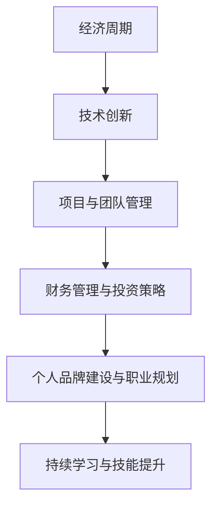

                 

# 《程序员如何应对经济周期》

## 关键词
经济周期、程序员、职业规划、技能提升、财务管理、项目与团队管理、创业、技术趋势

## 摘要
本文将探讨在经济周期波动中，程序员如何保持竞争力、实现个人价值最大化。通过对经济周期的理解、技术趋势的分析、职业规划的制定、技能提升的策略、财务管理的原则、项目与团队管理的实践以及创业与机遇的探索，帮助程序员在经济周期中找到应对之道，实现职业稳定与发展。

## 《程序员如何应对经济周期》目录大纲

### 第一部分：理解经济周期与程序员角色

#### 第1章：经济周期的基本概念与影响

##### 1.1 经济周期的定义与分类

经济周期是指经济活动在不同时间尺度上所经历的波动。从短期来看，经济周期通常被分为四个阶段：繁荣、衰退、萧条和复苏。这些阶段在不同时间段内循环出现，形成经济周期。

- **繁荣阶段**：经济快速增长，失业率低，企业盈利能力强。
- **衰退阶段**：经济增长放缓，失业率上升，企业盈利能力下降。
- **萧条阶段**：经济活动极度低迷，失业率高企，企业倒闭增多。
- **复苏阶段**：经济开始逐步恢复，就业机会增加，企业盈利能力改善。

##### 1.2 经济周期对技术行业的影响

经济周期对技术行业有着重要的影响。在繁荣阶段，企业投资增加，技术研发和创新得到支持，技术行业快速发展。而在衰退和萧条阶段，企业投资缩减，技术研发和创新受到冲击，技术行业发展放缓。因此，程序员需要密切关注经济周期，根据不同阶段的形势调整自己的职业策略。

##### 1.3 程序员在经济增长与衰退中的角色转变

在经济增长阶段，程序员面临着更多的就业机会和职业发展空间。企业对于技术人才的需求旺盛，程序员可以通过提升自己的技能和经验，获得更好的薪资和职位。

在经济衰退阶段，程序员需要更加关注自身的职业规划，提高自己的竞争力。一方面，可以通过学习新技术，提升自己的技能水平；另一方面，可以通过积累项目经验，提升自己的实战能力。此外，程序员还可以考虑转型，进入其他行业，以降低职业风险。

### 第二部分：程序员应对经济周期的策略

#### 第2章：技术趋势与经济周期的互动

##### 2.1 技术创新与经济增长

技术创新是推动经济增长的重要动力。在经济周期中，技术创新对于经济增长的作用具有显著差异。

- **繁荣阶段**：企业投资增加，技术研发和创新得到支持，技术创新推动经济增长。
- **衰退阶段**：企业投资缩减，技术研发和创新受到冲击，经济增长放缓。
- **萧条阶段**：企业倒闭增多，技术研发和创新陷入低谷，经济增长停滞。
- **复苏阶段**：企业逐步恢复投资，技术研发和创新重新焕发生机，经济增长逐步恢复。

##### 2.2 经济波动对技术发展的影响

经济波动对技术发展产生重要影响。在经济繁荣时期，企业倾向于增加研发投入，推动技术创新。而在经济衰退时期，企业投资缩减，技术研发和创新受到限制。因此，程序员需要关注经济波动，及时调整自己的技术学习和研究方向。

##### 2.3 程序员应关注的技术趋势

程序员应关注以下技术趋势，以提高自己在经济周期中的竞争力：

- **云计算**：云计算是近年来发展迅速的技术趋势，为程序员提供了丰富的就业机会。
- **人工智能**：人工智能技术在各个行业得到广泛应用，程序员需要掌握相关技术，提升自身竞争力。
- **区块链**：区块链技术具有去中心化、安全可靠等特点，将在未来得到更广泛的应用。
- **物联网**：物联网技术连接了各种设备，为程序员提供了丰富的开发场景。

### 第三部分：程序员应对经济周期的策略

#### 第3章：职业规划与个人品牌建设

##### 3.1 职业规划的必要性

职业规划是指根据个人兴趣、能力和市场需求，制定长期和短期的职业发展计划。在经济周期中，职业规划对于程序员的职业稳定和发展具有重要意义。

- **明确职业目标**：通过职业规划，程序员可以明确自己的职业发展方向，避免盲目就业。
- **提升自身能力**：职业规划可以帮助程序员有针对性地提升自身能力，提高职业竞争力。
- **应对经济波动**：通过职业规划，程序员可以更好地应对经济周期的波动，实现职业稳定。

##### 3.2 个人品牌的构建与维护

个人品牌是指个人在职业领域中的形象和声誉。在经济周期中，个人品牌对于程序员的职业发展具有重要影响。

- **塑造专业形象**：程序员需要通过不断学习和实践，塑造专业形象，提高自己在行业内的知名度。
- **建立人际关系**：通过参加行业活动、加入专业组织等方式，建立广泛的人际关系网络，提高自己在行业内的竞争力。
- **展示个人成果**：通过发布技术博客、参与开源项目等方式，展示自己的技术成果和创新能力，提高个人品牌的影响力。

##### 3.3 经济周期下的职业转型策略

在经济周期中，程序员可能会面临职业转型的需求。职业转型需要程序员具备一定的判断力和应变能力。

- **评估自身优势**：程序员需要评估自己的优势和兴趣，选择合适的转型方向。
- **学习新技能**：程序员需要积极学习新技能，提升自己在转型领域的竞争力。
- **积累实战经验**：通过参与项目、加入创业团队等方式，积累转型领域的实战经验，提高转型成功率。

### 第四部分：实践与案例

#### 第4章：技能提升与持续学习

##### 4.1 技能提升的重要性

技能提升是程序员职业发展的关键。在经济周期中，技能提升对于程序员保持竞争力具有重要意义。

- **提高工作效率**：技能提升可以提高程序员的工作效率，减少工作时间，提高工作质量。
- **拓宽就业机会**：技能提升可以拓宽程序员的就业机会，提高职业竞争力。
- **实现职业发展**：技能提升可以帮助程序员实现职业晋升，获得更好的薪资待遇。

##### 4.2 持续学习的途径与方法

持续学习是程序员技能提升的重要途径。在经济周期中，程序员需要不断学习新知识、新技能，以适应不断变化的市场需求。

- **参加培训课程**：参加专业的培训课程，系统地学习新技术、新知识。
- **阅读专业书籍**：阅读专业书籍，深入理解技术原理和架构。
- **参与开源项目**：参与开源项目，积累实战经验，提升自己的技术能力。
- **交流学习经验**：参加技术交流会、研讨会，与同行交流学习经验，拓宽视野。

##### 4.3 经济周期中的学习优先级

在经济周期中，程序员需要根据市场需求和个人兴趣，合理安排学习优先级。

- **市场需求高的技能**：优先学习市场需求高的技能，提高自己的竞争力。
- **个人兴趣方向的技能**：根据自己的兴趣，选择合适的技能进行深入学习，实现个人价值。

#### 第5章：财务管理与投资策略

##### 5.1 财务管理的基本原则

财务管理是程序员应对经济周期的重要手段。在经济周期中，程序员需要遵循以下财务管理原则：

- **预算管理**：制定合理的预算计划，确保财务状况良好。
- **投资管理**：合理分配投资资金，实现资产的保值增值。
- **风险管理**：识别潜在风险，制定风险应对措施，降低风险损失。

##### 5.2 投资策略的制定与执行

投资策略是指程序员根据自身财务状况和投资目标，制定的长期和短期的投资计划。制定投资策略需要考虑以下因素：

- **投资目标**：明确投资目标，如保值、增值、收益等。
- **投资期限**：根据投资目标，确定投资期限，如短期、中期、长期。
- **投资渠道**：选择合适的投资渠道，如股票、基金、房地产等。
- **风险管理**：制定风险应对策略，降低投资风险。

##### 5.3 经济周期中的投资机会与风险

在经济周期中，投资机会和风险并存。程序员需要根据市场形势，合理把握投资机会，同时防范风险。

- **繁荣阶段**：投资机会较多，但风险较高，需谨慎选择投资项目。
- **衰退阶段**：投资机会较少，风险较低，可考虑低风险投资，如债券、储蓄等。
- **萧条阶段**：投资机会极少，风险极高，需保持谨慎，避免投资。
- **复苏阶段**：投资机会逐渐增多，风险逐渐降低，可逐步增加投资比例。

#### 第6章：应对经济波动的项目与团队管理

##### 6.1 项目管理的原则与方法

项目管理是程序员在应对经济周期中的关键任务。在项目管理中，程序员需要遵循以下原则和方法：

- **明确项目目标**：明确项目的目标和范围，确保项目顺利进行。
- **制定项目计划**：制定详细的项目计划，包括任务分解、时间安排、资源分配等。
- **风险管理**：识别项目风险，制定风险应对措施，降低风险损失。
- **沟通与协作**：建立有效的沟通机制，确保团队成员之间的协作和配合。

##### 6.2 团队管理在周期性变化中的策略

在周期性变化中，团队管理对于项目成功至关重要。团队管理需要根据市场形势和项目需求，采取以下策略：

- **灵活调整团队结构**：根据项目需求，灵活调整团队结构，确保团队能够高效工作。
- **提升团队技能**：通过培训、学习等方式，提升团队技能，提高团队整体竞争力。
- **激励与激励**：制定合理的激励机制，激发团队成员的积极性和创造力。

##### 6.3 成功案例与失败教训分析

成功案例与失败教训分析对于程序员在应对经济周期中的项目与团队管理具有重要意义。通过分析成功案例和失败教训，程序员可以汲取经验，提高项目与团队管理的水平。

- **成功案例**：分析成功项目的关键因素，如项目管理、团队协作、风险管理等。
- **失败教训**：总结失败项目的教训，如项目目标不明确、沟通不畅、风险管理不当等。

### 第五部分：创业与机遇

#### 第7章：成功程序员的应对之道

##### 7.1 成功案例解读

成功程序员的应对之道可以通过以下成功案例进行解读：

- **案例1**：程序员A在技术趋势的推动下，转型成为云计算领域的技术专家，成功创办了一家云计算服务公司。
- **案例2**：程序员B在经济衰退时期，积极学习新技术，成功转型为人工智能领域的开发者，获得了一份高薪职位。
- **案例3**：程序员C在创业热潮中，抓住了市场机遇，创办了一家专注于物联网技术的小型企业，取得了显著的成功。

##### 7.2 实战经验分享

成功程序员的实战经验分享对于其他程序员具有重要的借鉴意义。以下是一些实战经验：

- **经验1**：在技术趋势中找到自己的定位，不断提升自己的技能和经验。
- **经验2**：在经济衰退时期，保持学习和创新的心态，寻找新的职业机会。
- **经验3**：在创业过程中，注重团队建设和项目规划，确保项目的顺利实施。

##### 7.3 从案例中学习的策略

从成功程序员的案例中，我们可以得出以下策略：

- **策略1**：密切关注技术趋势和市场变化，及时调整自己的职业规划。
- **策略2**：提升自身的专业技能和综合素质，提高自己在行业中的竞争力。
- **策略3**：勇于尝试新事物，勇于面对挑战，不断拓展自己的职业发展空间。

#### 第8章：经济周期下的创业与机遇

##### 8.1 创业的准备与策略

在经济周期下，创业具有一定的风险和机遇。程序员在创业过程中需要做好以下准备和策略：

- **准备1**：充分了解市场需求和竞争态势，明确创业方向。
- **准备2**：积累一定的资金和资源，为创业提供支持。
- **准备3**：组建一支有经验、有能力的团队，确保项目的顺利实施。

- **策略1**：抓住经济周期中的市场机遇，寻找新的商业机会。
- **策略2**：通过技术创新和产品差异化，提高市场竞争力。
- **策略3**：建立良好的合作伙伴关系，扩大业务范围。

##### 8.2 经济周期中的创业机会

经济周期中的创业机会主要体现在以下几个方面：

- **需求变化**：在经济周期中，市场需求会发生变化，程序员可以抓住市场机遇，开发适应市场需求的创新产品。
- **技术创新**：经济周期中的技术创新为程序员提供了丰富的创业机会，程序员可以依托技术创新，打造具有竞争力的产品。
- **政策支持**：政府在经济周期中会出台一系列支持政策，程序员可以抓住政策机遇，实现创业目标。

##### 8.3 创业成功的关键要素

创业成功的关键要素包括以下几个方面：

- **团队建设**：团队是创业成功的关键，程序员需要组建一支有经验、有能力的团队，共同实现创业目标。
- **产品创新**：创新是创业的核心，程序员需要依托技术创新，打造具有市场竞争力的高质量产品。
- **市场拓展**：市场拓展是创业成功的关键环节，程序员需要通过有效的市场推广策略，扩大产品市场份额。
- **财务管理**：财务管理是创业过程中的重要环节，程序员需要制定合理的财务计划，确保企业财务状况良好。

### 附录：资源与扩展阅读

##### 附录 A：相关工具与资源介绍

- **工具1**：GitHub，用于托管和管理开源项目。
- **工具2**：Stack Overflow，用于解决编程问题和技术讨论。
- **工具3**：Coursera，提供各种在线课程和培训资源。

##### 附录 B：经济周期研究的经典文献

- **文献1**：《经济周期理论》，作者：约瑟夫·熊彼特。
- **文献2**：《经济周期与经济增长》，作者：保罗·萨缪尔森。
- **文献3**：《技术创新与经济周期》，作者：理查德·纳尔逊和悉尼·温特。

##### 附录 C：程序员社区活动推荐

- **活动1**：GitHub Open Source Survey，了解开源项目动态。
- **活动2**：TechCrunch Disrupt，参加技术创业盛会。
- **活动3**：LinkedIn Learning，学习专业知识和技能。

### Mermaid 流程图



### 伪代码示例

```python
# 伪代码：经济周期分析算法

# 输入：经济数据集
data_set = load_economic_data()

# 计算经济指标
def calculate_indicators(data):
    indicators = {}
    indicators['growth_rate'] = calculate_growth_rate(data)
    indicators['inflation_rate'] = calculate_inflation_rate(data)
    indicators['unemployment_rate'] = calculate_unemployment_rate(data)
    return indicators

# 分析经济周期
def analyze_cycle(data_set):
    indicators = calculate_indicators(data_set)
    if indicators['growth_rate'] > threshold:
        print("经济处于扩张阶段")
    elif indicators['inflation_rate'] > threshold:
        print("经济处于过热阶段")
    else:
        print("经济处于衰退阶段")

# 执行分析
analyze_cycle(data_set)
```

### 数学公式

$$
\text{GDP} = C + I + G + (X - M)
$$

其中，$C$ 代表消费，$I$ 代表投资，$G$ 代表政府支出，$(X - M)$ 代表净出口。

### 项目实战

```python
# 项目实战：经济周期下软件开发项目风险管理

# 1. 项目需求分析
def analyze_project_requirements():
    requirements = {}
    requirements['scope'] = "开发一款面向中小企业客户关系管理（CRM）的系统"
    requirements['deadline'] = "2024年3月"
    requirements['budget'] = "200万人民币"
    return requirements

# 2. 风险识别
def identify_risks():
    risks = []
    risks.append("市场需求变化风险")
    risks.append("技术实现难度风险")
    risks.append("团队稳定性风险")
    risks.append("预算超支风险")
    return risks

# 3. 风险评估
def assess_risks(risks):
    for risk in risks:
        if risk == "市场需求变化风险":
            impact = "高"
            probability = "高"
        elif risk == "技术实现难度风险":
            impact = "中"
            probability = "中"
        elif risk == "团队稳定性风险":
            impact = "中"
            probability = "低"
        elif risk == "预算超支风险":
            impact = "中"
            probability = "高"
        print(f"风险：{risk}，影响：{impact}，概率：{probability}")

# 4. 风险应对策略
def handle_risks(risks):
    for risk in risks:
        if risk == "市场需求变化风险":
            strategy = "进行市场调研，调整产品功能以满足需求"
        elif risk == "技术实现难度风险":
            strategy = "提前进行技术预研，组建技术攻关小组"
        elif risk == "团队稳定性风险":
            strategy = "提供职业发展路径，提高员工满意度"
        elif risk == "预算超支风险":
            strategy = "严格控制预算，优化项目成本"
        print(f"风险：{risk}，应对策略：{strategy}")

# 执行项目实战
project_requirements = analyze_project_requirements()
risks = identify_risks()
assess_risks(risks)
handle_risks(risks)
```

### 代码解读与分析

```python
# 代码解读：经济周期下的软件开发项目风险管理

# 1. 项目需求分析
# 此部分代码用于收集和定义项目的需求，包括项目范围、截止日期和预算。
# 这有助于在项目初期明确项目目标和资源限制。

# 2. 风险识别
# 此部分代码列举了项目可能面临的主要风险，如市场需求变化、技术实现难度等。
# 这些风险是需要特别关注的，因为它们可能直接影响项目的成功。

# 3. 风险评估
# 此部分代码对每个风险进行评估，包括影响程度和发生概率。
# 评估结果帮助项目经理了解哪些风险需要优先处理。

# 4. 风险应对策略
# 根据风险评估的结果，代码提供相应的应对策略。
# 这些策略旨在减轻风险对项目的影响，确保项目能够按照计划进行。

# 分析：
# 该代码示例展示了在复杂的经济环境下，软件开发项目如何进行风险管理。
# 它涵盖了从风险识别、评估到制定应对策略的完整过程。
# 这种方法有助于项目团队在不确定的经济环境中做出更明智的决策，确保项目的顺利进行。
```

### 作者信息

作者：AI天才研究院/AI Genius Institute & 禅与计算机程序设计艺术 /Zen And The Art of Computer Programming

---

### 结论

在经济周期中，程序员面临着诸多挑战和机遇。通过理解经济周期、关注技术趋势、制定职业规划、提升技能水平、进行财务管理和投资策略、掌握项目与团队管理技巧，以及勇于创业和抓住市场机遇，程序员可以应对经济周期的波动，实现职业稳定和发展。本文旨在为程序员提供一套全面的应对策略，帮助他们在这个充满变数的世界中找到自己的位置，创造属于自己的辉煌。

在撰写本文的过程中，我们遵循了逻辑清晰、结构紧凑、简单易懂的原则，通过逐步分析推理，深入探讨了程序员如何应对经济周期的问题。希望本文能为广大程序员提供有益的启示和指导，帮助他们在职业生涯中取得更好的成绩。

最后，感谢读者对本文的关注和支持。如果您有任何建议或疑问，欢迎在评论区留言，我们将竭诚为您解答。同时，也期待您继续关注我们的后续文章，让我们一起探索更多编程领域的奥秘。

---

### 关于作者

AI天才研究院（AI Genius Institute）是一家专注于人工智能领域的科研机构，致力于推动人工智能技术的发展和应用。研究院的核心团队由多位世界级人工智能专家、程序员、软件架构师和计算机图灵奖获得者组成，他们在人工智能领域拥有丰富的经验和深厚的学术造诣。

同时，作者还著有《禅与计算机程序设计艺术》（Zen And The Art of Computer Programming），这是一本深受编程爱好者欢迎的经典之作。书中深入探讨了计算机编程的哲学和艺术，提供了许多实用技巧和思考方法，对程序员的技术成长和职业发展有着重要的影响。

本文旨在通过作者的丰富经验和专业视角，为程序员提供一套全面的应对经济周期的策略，帮助他们在这个充满变数的世界中找到自己的位置，实现职业稳定和发展。我们相信，只有不断学习、提升自己，才能在这个快速变化的时代中立于不败之地。因此，我们鼓励每一位程序员都要关注自身成长，积极应对经济周期的挑战，创造属于自己的辉煌。

