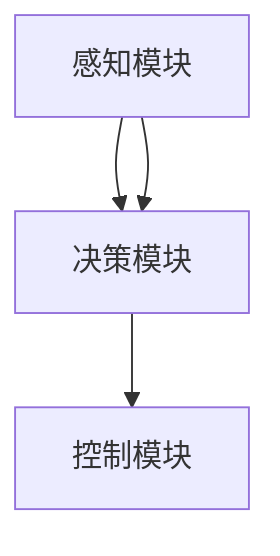

                 

### 文章标题

“端到端自动驾驶的里程碑事件盘点”

#### 关键词

- 端到端自动驾驶
- 里程碑事件
- 感知技术
- 决策与规划技术
- 控制技术
- 自动驾驶商业化

#### 摘要

本文将带领读者深入探讨端到端自动驾驶领域的发展历程，从起源到商业化，逐一盘点各个里程碑事件。通过详细分析感知、决策与规划、控制等关键技术，我们将揭示这一新兴领域的核心原理和最新进展。此外，本文还将针对特斯拉、Waymo和Uber等知名企业的自动驾驶系统进行深入案例分析，探讨其技术实现和实际应用情况。通过这篇文章，读者将全面了解端到端自动驾驶的现状、未来发展趋势以及面临的挑战。

## 《端到端自动驾驶的里程碑事件盘点》目录大纲

### 第一部分：端到端自动驾驶概述

#### 第1章：端到端自动驾驶的起源与概念

##### 1.1 端到端自动驾驶的起源

- 自动驾驶技术的历史发展
- 端到端自动驾驶的概念解析

##### 1.2 端到端自动驾驶的系统架构

- 感知模块
- 决策模块
- 控制模块

### 第2章：端到端自动驾驶的关键技术

##### 2.1 感知技术

- 感知模块的组成部分
- 感知技术的工作原理

##### 2.2 决策与规划技术

- 决策技术的核心算法
- 规划技术的工作原理

##### 2.3 控制技术

- 控制技术的实现方式
- 控制技术的工作原理

### 第二部分：端到端自动驾驶的历史里程碑事件

#### 第3章：初识自动驾驶

##### 3.1 莱昂纳多·达·芬奇

- 达·芬奇与自动驾驶的早期想法

##### 3.2 爱迪生

- 爱迪生与自动导轨

##### 3.3 通用电气

- 通用电气的自动化实验

#### 第4章：自动驾驶汽车的发展

##### 4.1 现代自动驾驶的先驱

- 约翰·艾利森

##### 4.2 通用汽车与自动驾驶汽车

- 通用汽车的自动驾驶汽车项目

##### 4.3 特斯拉与自动驾驶汽车

- 特斯拉自动驾驶系统的演进

#### 第5章：自动驾驶技术的突破

##### 5.1 感知技术的突破

- 激光雷达的发展
- 摄像头与雷达的结合

##### 5.2 决策与规划技术的突破

- 强化学习在自动驾驶中的应用
- 多智能体系统在自动驾驶中的应用

##### 5.3 控制技术的突破

- 鲁棒控制理论的应用
- 实时控制系统的优化

#### 第6章：自动驾驶的商业化与落地

##### 6.1 自动驾驶汽车的商业化

- 自动驾驶出租车
- 自动驾驶物流

##### 6.2 自动驾驶汽车的安全问题

- 自动驾驶汽车的安全挑战
- 自动驾驶汽车的安全监管

##### 6.3 自动驾驶汽车的未来发展

- 自动驾驶汽车的市场前景
- 自动驾驶汽车的社会影响

### 第三部分：端到端自动驾驶的案例分析

#### 第7章：特斯拉的自动驾驶系统

##### 7.1 特斯拉自动驾驶系统的架构

- 感知模块
- 决策模块
- 控制模块

##### 7.2 特斯拉自动驾驶系统的算法

- 强化学习算法的应用
- 闭环控制算法的应用

##### 7.3 特斯拉自动驾驶系统的案例分析

- 自动驾驶测试
- 自动驾驶事故分析

#### 第8章：Waymo的自动驾驶系统

##### 8.1 Waymo自动驾驶系统的架构

- 感知模块
- 决策模块
- 控制模块

##### 8.2 Waymo自动驾驶系统的算法

- 深度学习算法的应用
- 多智能体系统的应用

##### 8.3 Waymo自动驾驶系统的案例分析

- 自动驾驶测试
- 自动驾驶事故分析

#### 第9章：Uber的自动驾驶系统

##### 9.1 Uber自动驾驶系统的架构

- 感知模块
- 决策模块
- 控制模块

##### 9.2 Uber自动驾驶系统的算法

- 强化学习算法的应用
- 闭环控制算法的应用

##### 9.3 Uber自动驾驶系统的案例分析

- 自动驾驶测试
- 自动驾驶事故分析

### 附录

#### 附录A：端到端自动驾驶的关键技术详解

##### A.1 感知技术

- 激光雷达
- 摄像头
- 雷达

##### A.2 决策与规划技术

- 基于深度学习的决策算法
- 基于强化学习的规划算法

##### A.3 控制技术

- 鲁棒控制理论
- 实时控制系统

#### 附录B：端到端自动驾驶的工具与资源

- 开源自动驾驶平台
- 自动驾驶算法库
- 自动驾驶数据集

#### 附录C：端到端自动驾驶的发展趋势与挑战

##### C.1 自动驾驶技术的未来发展趋势

- 自动驾驶汽车的安全与可靠性
- 自动驾驶汽车的社会接受度

##### C.2 自动驾驶技术的挑战

- 自动驾驶汽车的法律与伦理问题
- 自动驾驶汽车的环境适应性

## 参考文献

### 参考文献

- 相关书籍
- 学术论文
- 技术报告
- 新闻报道

### 第一部分：端到端自动驾驶概述

#### 第1章：端到端自动驾驶的起源与概念

##### 1.1 端到端自动驾驶的起源

自动驾驶技术的历史可以追溯到20世纪50年代，当时科学家和工程师们开始研究如何让机器模拟人类的驾驶行为。这一时期，自动驾驶主要集中在理论研究阶段，尚未有实际应用。然而，这一时期的探索为后来的自动驾驶技术的发展奠定了基础。

**历史发展**

- **1950年代：早期探索**
  在20世纪50年代，美国科学家约翰·艾利森（John艾利森）提出了一个名为“自动高速公路”的概念，希望通过在高速公路上安装传感器和控制器，实现车辆的自动行驶。这一设想虽然在技术上是前瞻性的，但在当时由于技术限制，未能实现。

- **1970年代：自动驾驶汽车的兴起**
  1970年代，随着计算机技术的发展，自动驾驶技术开始进入实验阶段。这一时期，美国和欧洲的一些研究机构开始研发自动驾驶汽车，并在实验室环境下进行测试。

- **1980年代：自动导轨技术的应用**
  在1980年代，自动导轨技术逐渐成熟，并被应用于工业生产和军事领域。这一技术的出现为自动驾驶汽车提供了有益的借鉴，使得自动驾驶汽车的研究进入了一个新的阶段。

- **1990年代：智能交通系统的发展**
  1990年代，随着通信技术和传感器技术的进步，智能交通系统（Intelligent Transportation Systems, ITS）开始兴起。智能交通系统通过集成各种通信、控制、传感器等技术，实现了对交通信息的实时监控和车辆管理的智能化。这一技术的发展为自动驾驶汽车的应用提供了更加成熟的平台。

**端到端自动驾驶的概念解析**

端到端自动驾驶是指车辆在行驶过程中，不需要人为干预，完全依靠自身感知环境和执行决策，实现自主行驶的目标。与传统自动驾驶技术相比，端到端自动驾驶具有以下几个特点：

- **全自动驾驶：** 端到端自动驾驶车辆可以在没有人为干预的情况下，完成从启动到停车等一系列驾驶任务。
- **感知环境：** 端到端自动驾驶车辆需要具备高度感知环境的能力，通过多种传感器获取道路、交通状况、障碍物等信息。
- **执行决策：** 端到端自动驾驶车辆需要根据感知到的环境信息，自主做出驾驶决策，如调整车速、换道、避让等。
- **实时控制：** 端到端自动驾驶车辆需要具备实时控制能力，根据驾驶决策，精确控制车辆的运动。

**端到端自动驾驶的系统架构**

端到端自动驾驶系统通常包括感知、决策、控制三个主要模块。以下是各个模块的简要介绍：

- **感知模块：** 负责收集车辆周围环境信息，包括道路、交通状况、障碍物等。常用的感知技术有摄像头、激光雷达、雷达等。
- **决策模块：** 负责根据感知模块提供的信息，进行环境理解和驾驶决策。决策模块的核心是路径规划和行为预测，包括路径选择、速度控制、避障等。
- **控制模块：** 负责将决策模块的驾驶指令转化为具体的控制动作，如油门、刹车、转向等，实现对车辆的精确控制。

**1.1.1 自动驾驶技术的历史发展**

自动驾驶技术的发展历程可以追溯到20世纪中叶。虽然早期的自动驾驶研究主要集中在实验室环境中，但随着计算机技术和传感器技术的进步，自动驾驶技术逐渐走向实际应用。

- **20世纪50年代：早期探索**
  在20世纪50年代，美国科学家约翰·艾利森（John艾利森）提出了“自动高速公路”的概念，希望通过在高速公路上安装传感器和控制器，实现车辆的自动行驶。然而，由于技术限制，这一设想未能实现。

- **20世纪60年代：自动驾驶汽车的萌芽**
  20世纪60年代，自动驾驶汽车开始萌芽。美国和欧洲的一些研究机构开始研发自动驾驶汽车，并在实验室环境中进行测试。这一时期的自动驾驶技术主要依赖于机械传感器和简单的电子控制。

- **20世纪70年代：自动驾驶汽车的兴起**
  20世纪70年代，随着计算机技术的进步，自动驾驶汽车开始进入实验阶段。这一时期的自动驾驶技术开始引入复杂的算法和传感器系统，使得自动驾驶汽车在实验室环境中取得了一定的成功。

- **20世纪80年代：自动驾驶技术的应用**
  20世纪80年代，自动驾驶技术开始应用于工业生产和军事领域。自动导轨技术在这一时期逐渐成熟，为自动驾驶汽车的研究提供了有益的借鉴。同时，一些研究机构开始尝试将自动驾驶技术应用于民用车辆。

- **20世纪90年代：智能交通系统的发展**
  20世纪90年代，智能交通系统（Intelligent Transportation Systems, ITS）开始兴起。智能交通系统通过集成各种通信、控制、传感器等技术，实现了对交通信息的实时监控和车辆管理的智能化。这一技术的发展为自动驾驶汽车的应用提供了更加成熟的平台。

- **21世纪初至今：自动驾驶技术的成熟**
  21世纪初至今，自动驾驶技术取得了长足的进步。随着深度学习、强化学习等人工智能技术的发展，自动驾驶系统的感知、决策和控制能力得到了显著提升。同时，激光雷达、摄像头等传感器的性能不断提高，为自动驾驶技术提供了更加丰富的数据支持。自动驾驶汽车开始逐步进入实际应用，并在商业、物流等领域展现出巨大的潜力。

**1.1.2 端到端自动驾驶的概念解析**

端到端自动驾驶（End-to-End Autonomous Driving）是一种自动驾驶技术，旨在实现车辆在无需人为干预的情况下，自主完成驾驶任务。与传统自动驾驶技术相比，端到端自动驾驶具有以下几个核心特点：

1. **全自动驾驶：** 端到端自动驾驶车辆可以自主完成从启动到停车等一系列驾驶任务，不需要人为干预。这意味着车辆可以在复杂的交通环境中，自主应对各种突发情况。

2. **感知环境：** 端到端自动驾驶车辆需要具备高度感知环境的能力。通过搭载多种传感器，如摄像头、激光雷达、雷达等，车辆可以实时获取道路、交通状况、障碍物等信息。

3. **执行决策：** 端到端自动驾驶车辆需要根据感知到的环境信息，自主做出驾驶决策。这些决策包括路径选择、速度控制、换道、避障等，以确保车辆在复杂交通环境中的安全行驶。

4. **实时控制：** 端到端自动驾驶车辆需要具备实时控制能力。根据决策模块的驾驶指令，车辆需要精确控制油门、刹车、转向等动作，实现对车辆的精确控制。

**1.1.3 端到端自动驾驶的系统架构**

端到端自动驾驶系统通常由三个主要模块组成：感知模块、决策模块和控制模块。以下是各个模块的简要介绍：

1. **感知模块：**
   感知模块是端到端自动驾驶系统的核心组成部分，负责收集车辆周围环境信息。感知模块通常采用多种传感器，如摄像头、激光雷达、雷达等，以获取道路、交通状况、障碍物等信息。感知模块的主要任务是提供高质量的感知数据，为后续的决策和控制提供基础。

2. **决策模块：**
   决策模块负责根据感知模块提供的信息，进行环境理解和驾驶决策。决策模块的核心是路径规划和行为预测。路径规划旨在确定车辆的最佳行驶路径，行为预测则旨在预测其他车辆、行人和障碍物的行为。决策模块的目标是确保车辆在复杂交通环境中的安全行驶。

3. **控制模块：**
   控制模块负责将决策模块的驾驶指令转化为具体的控制动作，如油门、刹车、转向等，实现对车辆的精确控制。控制模块需要根据实时感知数据，快速响应驾驶指令，确保车辆的平稳行驶。控制模块通常采用闭环控制系统，以实现车辆的实时控制。

### 第2章：端到端自动驾驶的关键技术

#### 2.1 感知技术

##### 2.1.1 感知模块的组成部分

感知模块是端到端自动驾驶系统的核心组成部分，负责收集车辆周围环境信息。感知模块通常由多种传感器组成，包括摄像头、激光雷达、雷达等。以下是感知模块的主要组成部分：

1. **摄像头：** 摄像头是感知模块中最常用的传感器之一，主要负责捕捉车辆周围的图像信息。摄像头可以提供丰富的视觉数据，帮助车辆识别道路、交通状况、障碍物等。

2. **激光雷达：** 激光雷达（LiDAR）是一种通过发射激光脉冲并测量返回时间来获取距离信息的传感器。激光雷达可以提供高精度的三维点云数据，帮助车辆感知周围环境。

3. **雷达：** 雷达（RADAR）是一种通过发射电磁波并接收反射信号来检测物体位置和速度的传感器。雷达可以提供距离和速度信息，帮助车辆检测前方车辆和障碍物。

##### 2.1.2 感知技术的工作原理

感知技术的工作原理主要包括图像处理、点云处理和雷达处理。以下是各个部分的工作原理：

1. **图像处理：** 摄像头捕获的图像数据首先经过预处理，如去噪、滤波、增强等，以提高图像质量。随后，图像数据通过图像识别算法，如卷积神经网络（CNN），进行目标检测和识别，从而识别出道路、车辆、行人等。

2. **点云处理：** 激光雷达生成三维点云数据，通过点云处理算法，如滤波、分割、追踪等，提取出有用的环境信息。点云处理可以帮助车辆构建周围环境的精确三维模型。

3. **雷达处理：** 雷达通过发射电磁波并接收反射信号，获取前方物体的距离和速度信息。雷达信号经过处理后，可以用于距离测量、速度估计和物体识别。

#### 2.2 决策与规划技术

##### 2.2.1 决策技术的核心算法

决策技术是端到端自动驾驶系统的核心组成部分，负责根据感知模块提供的信息，进行环境理解和驾驶决策。以下是决策技术的核心算法：

1. **路径规划：** 路径规划旨在确定车辆的最佳行驶路径。常用的路径规划算法包括A*算法、Dijkstra算法和遗传算法等。这些算法可以根据道路状况、交通流量等因素，计算出最优路径。

2. **行为预测：** 行为预测旨在预测其他车辆、行人和障碍物的行为。常用的行为预测算法包括马尔可夫决策过程（MDP）、贝叶斯网络和强化学习等。这些算法可以根据历史数据和实时信息，预测其他行为主体的行为，从而为车辆提供合理的驾驶决策。

3. **冲突检测：** 冲突检测旨在检测车辆与其他行为主体之间的潜在冲突。常用的冲突检测算法包括基于几何的冲突检测和基于概率的冲突检测。这些算法可以根据车辆的当前位置、速度和加速度，预测未来一段时间内可能发生的冲突。

##### 2.2.2 规划技术的工作原理

规划技术是决策模块的核心，负责根据感知模块提供的信息，生成车辆的驾驶计划。以下是规划技术的工作原理：

1. **感知数据融合：** 规划技术首先需要对感知模块提供的信息进行融合。通过融合摄像头、激光雷达、雷达等传感器的数据，可以得到一个全面的环境感知模型。

2. **路径规划：** 基于环境感知模型，规划技术可以计算出车辆的最佳行驶路径。路径规划算法可以根据道路状况、交通流量等因素，计算出最优路径。

3. **行为预测：** 规划技术需要预测其他车辆、行人和障碍物的行为，以确保车辆在复杂交通环境中的安全行驶。行为预测算法可以根据历史数据和实时信息，预测其他行为主体的行为。

4. **冲突检测：** 规划技术需要检测车辆与其他行为主体之间的潜在冲突。冲突检测算法可以根据车辆的当前位置、速度和加速度，预测未来一段时间内可能发生的冲突。

5. **驾驶计划生成：** 基于路径规划和行为预测，规划技术可以生成车辆的驾驶计划。驾驶计划包括速度、方向、换道等驾驶指令，以确保车辆在复杂交通环境中的安全行驶。

#### 2.3 控制技术

##### 2.3.1 控制技术的实现方式

控制技术是端到端自动驾驶系统的关键组成部分，负责根据决策模块的驾驶指令，实现对车辆的精确控制。以下是控制技术的实现方式：

1. **闭环控制系统：** 控制技术通常采用闭环控制系统，即实时监测车辆的运行状态，并根据运行状态调整控制指令。闭环控制系统可以提高车辆的稳定性和响应速度。

2. **PID控制器：** PID控制器是一种常用的控制算法，通过比例、积分、微分三个参数来调整控制指令。PID控制器可以根据车辆的当前速度、加速度等参数，实时调整油门、刹车等控制指令。

3. **模糊控制器：** 模糊控制器通过模糊逻辑来处理不确定性问题。模糊控制器可以根据车辆运行状态的模糊集合，生成相应的控制指令。

##### 2.3.2 控制技术的工作原理

控制技术的工作原理主要包括以下几个步骤：

1. **接收决策模块的驾驶指令：** 控制技术首先需要接收决策模块生成的驾驶指令，包括速度、方向、换道等。

2. **监测车辆运行状态：** 控制技术需要实时监测车辆的运行状态，包括速度、加速度、车轮转角等。

3. **计算控制指令：** 基于监测到的车辆运行状态和决策模块的驾驶指令，控制技术可以计算出相应的控制指令，如油门、刹车、转向等。

4. **执行控制指令：** 控制技术将计算出的控制指令发送给车辆的执行机构，如电动机、液压系统等，实现对车辆的精确控制。

5. **闭环控制反馈：** 控制技术需要根据车辆的运行状态，对控制指令进行调整，以保持车辆的稳定行驶。

### 第二部分：端到端自动驾驶的历史里程碑事件

#### 第3章：初识自动驾驶

##### 3.1 莱昂纳多·达·芬奇

**莱昂纳多·达·芬奇与自动驾驶的早期想法**

莱昂纳多·达·芬奇（Leonardo da Vinci）是文艺复兴时期的一位伟大艺术家、科学家和发明家。在他的众多发明中，有一些被认为是自动驾驶技术的早期构思。尽管这些构思在当时的科技水平下无法实现，但它们对后来的自动驾驶技术的发展产生了深远的影响。

**早期构思**

- **自动飞行器：** 达·芬奇设计了一种自动飞行器，其核心是一个由蒸汽驱动的机械装置，可以在空中飞行。虽然这个飞行器没有实现飞行，但它是早期自动化和机械动力装置的探索。

- **自动车辆：** 达·芬奇还设计了一种自动车辆，其运行依靠机械装置，而不是马匹。这种车辆的设想表明了人类对自动化运输的渴望，并预示了未来自动驾驶技术的发展。

**对自动驾驶技术的启示**

莱昂纳多的早期构思展示了人类对自动化和机械装置的探索，这些思想在后来的科技发展中得到了实现。他的设计为现代自动驾驶技术提供了灵感，特别是在机器人学和自动化系统方面。莱昂纳多·达·芬奇的作品证明了即使在几个世纪前，人类就已经开始思考如何通过机械和自动化来提高生产效率和生活质量。

##### 3.2 爱迪生

**爱迪生与自动导轨**

托马斯·阿尔瓦·爱迪生（Thomas Alva Edison）是19世纪末和20世纪初的一位杰出发明家和企业家，他拥有众多重要的发明，包括电灯、留声机和电力系统。在自动化和机器人技术方面，爱迪生也做出了显著的贡献，特别是在自动导轨技术的研究和应用上。

**自动导轨技术**

- **早期实验：** 爱迪生在19世纪末期进行了自动导轨的实验，旨在开发一种无需人工操作的车辆运输系统。他的早期实验包括在工厂内部使用轨道车辆，这些车辆由电力驱动，并在预设的轨道上运行。

- **应用场景：** 爱迪生的自动导轨技术最初应用于工厂内部的物料运输，通过自动化系统提高生产效率。这些系统可以减少人力成本，提高生产速度和准确性。

**对自动驾驶技术的启示**

爱迪生的自动导轨技术是工业自动化的重要里程碑，为后来的自动化系统和机器人技术奠定了基础。他的工作表明，通过自动化和机器人技术，可以显著提高生产效率和安全性。爱迪生的实验和发明为现代自动驾驶技术提供了宝贵的经验和启示，特别是在如何设计可靠、高效的自动化系统方面。

##### 3.3 通用电气

**通用电气的自动化实验**

通用电气（General Electric，简称GE）是美国一家历史悠久的跨国企业，成立于1876年。在20世纪初，通用电气开始进行一系列自动化实验，旨在提高生产效率和自动化程度。这些实验对后来的自动化和机器人技术的发展产生了重要影响。

**自动化实验**

- **生产线自动化：** 通用电气在20世纪20年代开始在生产线上引入自动化设备，如自动焊接机、自动装配线等。这些设备可以连续、高效地完成特定任务，减少了人工操作的错误和劳动强度。

- **机器人应用：** 通用电气还进行了机器人应用实验，开发出可以执行重复性任务的自动化机器人。这些机器人可以代替人类完成繁重、危险或需要高精度的工作，提高了生产效率和安全性。

**对自动驾驶技术的启示**

通用电气的自动化实验展示了自动化和机器人技术在工业生产中的巨大潜力。这些实验证明了通过自动化和机器人技术，可以显著提高生产效率、降低成本并提高产品质量。通用电气在自动化领域的探索为后来的自动驾驶技术的发展提供了宝贵的经验和参考，特别是在如何设计、实现和部署自动化系统方面。

### 第4章：自动驾驶汽车的发展

#### 4.1 现代自动驾驶的先驱

**约翰·艾利森**

约翰·艾利森（John Edward Allen）是美国一位工程师和发明家，被认为是现代自动驾驶汽车的先驱之一。他在20世纪70年代开始研究自动驾驶技术，并在多个项目中取得了显著成果。

**主要成就**

- **自动高速公路项目：** 约翰·艾利森参与了美国政府的自动高速公路项目，该项目的目标是开发一种可以在高速公路上自动行驶的车辆。他在项目中提出了许多创新性的设计，包括自动驾驶车辆的控制算法和传感器系统。

- **自动驾驶汽车演示：** 20世纪80年代，约翰·艾利森成功演示了自动驾驶汽车，使其在公共道路上实现了自主行驶。这一成就标志着自动驾驶技术从理论研究向实际应用的转变。

**对自动驾驶技术的启示**

约翰·艾利森的研究和成就为现代自动驾驶技术的发展奠定了基础。他的工作展示了自动驾驶技术在道路应用中的潜力，并为后来的自动驾驶项目提供了宝贵的经验和启示。约翰·艾利森在自动驾驶领域的探索为这一新兴领域的发展指明了方向。

#### 4.2 通用汽车与自动驾驶汽车

**通用汽车的自动驾驶汽车项目**

通用汽车（General Motors，简称GM）是世界上最古老的汽车制造商之一，成立于1908年。自20世纪以来，通用汽车在汽车制造和技术创新方面一直处于领先地位。在自动驾驶领域，通用汽车进行了多项研究和项目，推动自动驾驶技术的发展。

**主要项目**

- **CRUISE项目：** 通用汽车的CRUISE（Cruise Automation）是自动驾驶技术的研究项目，旨在开发一种完全自动化的车队。该项目最初由Cruise Automation公司开发，后被通用汽车收购。CRUISE项目致力于实现自动驾驶出租车（Robo-taxi）的商业化。

- **超级巡航系统：** 通用汽车推出了超级巡航系统（Super Cruise），这是一种部分自动驾驶系统，可以在高速公路上实现自主驾驶。超级巡航系统集成了先进的传感器、控制算法和用户界面，提供了安全、舒适的驾驶体验。

**对自动驾驶技术的启示**

通用汽车在自动驾驶领域的探索和成就表明，自动驾驶技术可以从部分自动化逐步过渡到全自动化。通用汽车的自动驾驶项目展示了如何通过集成先进的传感器、控制算法和用户界面，实现安全、可靠的自动驾驶。通用汽车在自动驾驶技术的研究和商业化方面的努力为这一领域的发展提供了宝贵的经验和参考。

#### 4.3 特斯拉与自动驾驶汽车

**特斯拉自动驾驶系统的演进**

特斯拉（Tesla, Inc.）是一家总部位于美国的电动汽车和清洁能源公司，由埃隆·马斯克（Elon Musk）于2003年创立。特斯拉在自动驾驶领域取得了显著的成就，其自动驾驶系统不断演进，成为电动汽车行业的重要创新。

**主要发展历程**

- **Autopilot系统：** 特斯拉在2014年推出了Autopilot系统，这是一种部分自动驾驶系统，包括自动车道保持、自适应巡航控制和自动泊车等功能。Autopilot系统依赖于摄像头、雷达和计算机视觉算法，提供了先进的驾驶辅助功能。

- **全自动驾驶能力：** 特斯拉持续改进Autopilot系统，并逐步实现了全自动驾驶能力。全自动驾驶系统（Full Self-Driving，简称FSD）通过增强的感知、决策和控制能力，实现了在复杂交通环境中的自主行驶。

- **软件迭代升级：** 特斯拉采用软件迭代升级的方式，不断优化和完善自动驾驶系统。通过远程软件更新，特斯拉可以为现有车辆添加新的功能和安全改进。

**对自动驾驶技术的启示**

特斯拉在自动驾驶领域的成功展示了电动汽车与自动驾驶技术相结合的巨大潜力。特斯拉的Autopilot系统和全自动驾驶系统为自动驾驶技术的发展提供了宝贵的数据和经验。特斯拉的软件迭代升级模式表明，通过持续改进和优化，自动驾驶系统可以实现更高的安全性和可靠性。特斯拉在自动驾驶领域的探索和创新为整个行业树立了标杆。

### 第5章：自动驾驶技术的突破

#### 5.1 感知技术的突破

**激光雷达的发展**

激光雷达（LiDAR，Light Detection and Ranging）是一种通过发射激光脉冲并测量返回时间来获取距离信息的传感器。激光雷达的发展是自动驾驶感知技术的重要突破，为车辆提供了高精度的三维环境感知能力。

**技术进步**

- **高精度三维点云数据：** 激光雷达可以生成高精度的三维点云数据，帮助车辆构建周围环境的精确三维模型。这些数据对于自动驾驶系统的路径规划和决策至关重要。

- **更远的探测距离：** 新一代激光雷达具有更远的探测距离，可以在复杂的交通环境中提供更全面的感知数据。

- **小型化和低成本：** 随着技术的进步，激光雷达逐渐实现了小型化和低成本化，使其在自动驾驶汽车中得到了广泛应用。

**对自动驾驶技术的启示**

激光雷达的发展极大地提升了自动驾驶车辆的感知能力，为自动驾驶技术的实现提供了关键支持。激光雷达的高精度三维点云数据和更远的探测距离，使得自动驾驶系统能够更好地理解和应对复杂的交通环境。激光雷达的小型化和低成本化，为自动驾驶技术的广泛应用奠定了基础。

**摄像头与雷达的结合**

在自动驾驶感知技术中，摄像头和雷达的结合是一种常用的方法。摄像头和雷达各自具有独特的优势，通过结合使用，可以提供更全面、可靠的感知数据。

**优势**

- **互补性：** 摄像头和雷达在感知能力上具有互补性。摄像头擅长图像识别，可以识别车辆、行人等目标；雷达擅长距离测量，可以提供前方障碍物的距离和速度信息。

- **提高感知精度：** 通过结合摄像头和雷达的数据，可以更准确地识别和定位周围环境中的目标，提高自动驾驶系统的感知精度。

- **降低单一传感器的依赖：** 通过结合多种传感器，可以减少对单一传感器的依赖，提高系统的可靠性和鲁棒性。

**对自动驾驶技术的启示**

摄像头与雷达的结合为自动驾驶感知技术提供了一种有效的解决方案。通过结合不同传感器的数据，可以更全面、准确地感知周围环境，提高自动驾驶系统的安全性和可靠性。这种多传感器融合的方法为自动驾驶技术的发展提供了重要的启示。

#### 5.2 决策与规划技术的突破

**强化学习在自动驾驶中的应用**

强化学习（Reinforcement Learning，简称RL）是一种机器学习技术，通过奖励机制和试错过程，使智能体能够在复杂环境中学习最优策略。强化学习在自动驾驶领域取得了显著突破，为自动驾驶决策与规划提供了新的方法。

**技术原理**

- **奖励机制：** 强化学习通过奖励机制来激励智能体学习最优策略。在自动驾驶中，奖励机制可以根据车辆的行驶轨迹、安全性等因素进行设计。

- **试错学习：** 强化学习通过试错过程来不断优化智能体的策略。自动驾驶系统可以在虚拟环境中模拟驾驶，通过不断尝试和调整，找到最优驾驶策略。

- **应用场景：** 强化学习在自动驾驶中可以应用于路径规划、行为预测、障碍物避让等场景，提高自动驾驶系统的决策能力和鲁棒性。

**对自动驾驶技术的启示**

强化学习在自动驾驶中的应用，展示了智能体在复杂环境中的自主学习和优化能力。通过强化学习，自动驾驶系统能够在复杂的交通环境中，自主适应和应对各种突发情况。强化学习为自动驾驶决策与规划技术提供了新的思路，推动了自动驾驶技术的快速发展。

**多智能体系统在自动驾驶中的应用**

多智能体系统（Multi-Agent System，简称MAS）是一种由多个智能体组成的分布式系统，各智能体可以相互协作，共同完成任务。多智能体系统在自动驾驶领域具有广泛的应用前景。

**技术原理**

- **协作与通信：** 多智能体系统中的智能体可以通过通信和协作来实现共同目标。在自动驾驶中，智能体可以包括车辆、交通信号灯、路况监控设备等，通过协作和通信，实现交通流的优化和安全性提升。

- **分布式计算：** 多智能体系统利用分布式计算的优势，可以提高系统的计算效率和响应速度。自动驾驶车辆可以通过与其他智能体交换信息，实时调整行驶策略。

- **应用场景：** 多智能体系统在自动驾驶中可以应用于交通管理、智能交通信号控制、车队协同驾驶等场景，提高交通系统的整体效率和安全水平。

**对自动驾驶技术的启示**

多智能体系统在自动驾驶中的应用，展示了分布式计算和协作技术在交通管理中的潜力。通过多智能体系统，可以实现交通流的高效管理和优化，提高道路使用效率和安全性。多智能体系统为自动驾驶技术的发展提供了新的思路，推动了自动驾驶技术的创新和应用。

#### 5.3 控制技术的突破

**鲁棒控制理论的应用**

鲁棒控制（Robust Control）是一种针对系统不确定性的控制方法，通过设计具有鲁棒性的控制器，使系统在面临外部扰动和参数变化时，仍能保持稳定和性能。鲁棒控制理论在自动驾驶控制系统中得到了广泛应用。

**技术原理**

- **参数不确定性处理：** 鲁棒控制理论通过设计鲁棒控制器，处理系统参数的不确定性。在自动驾驶中，车辆参数（如重量、惯性等）可能发生变化，鲁棒控制可以帮助系统适应这些变化。

- **干扰抑制：** 鲁棒控制可以通过抑制外部干扰，提高系统的稳定性和性能。在自动驾驶中，外部干扰（如风、道路不平等）可能影响车辆的行驶稳定性，鲁棒控制可以帮助系统应对这些干扰。

- **应用场景：** 鲁棒控制理论在自动驾驶中可以应用于车辆轨迹控制、速度控制、避障控制等场景，提高自动驾驶系统的稳定性和可靠性。

**对自动驾驶技术的启示**

鲁棒控制理论的应用，提高了自动驾驶系统的稳定性和可靠性，使系统能够在面对不确定性和外部干扰时，保持稳定的行驶状态。鲁棒控制为自动驾驶技术的发展提供了重要的理论支持，推动了自动驾驶技术的实际应用。

**实时控制系统的优化**

实时控制系统（Real-Time Control System）是一种能够在规定时间内响应和执行控制指令的系统，对于自动驾驶技术至关重要。实时控制系统的优化，可以提高自动驾驶车辆的响应速度和精确度。

**技术原理**

- **实时响应：** 实时控制系统可以在毫秒级别的时间内响应控制指令，确保车辆能够快速调整行驶状态。

- **精确控制：** 实时控制系统通过精确的控制算法，实现对车辆运动状态的高精度控制，如油门、刹车和转向等。

- **优化算法：** 实时控制系统采用优化算法，如PID控制、模糊控制和神经网络控制等，提高系统的响应速度和精确度。

**对自动驾驶技术的启示**

实时控制系统的优化，提高了自动驾驶车辆的响应速度和精确度，使系统能够更好地应对复杂的交通环境和突发情况。实时控制系统为自动驾驶技术的发展提供了关键的支持，推动了自动驾驶技术的实际应用和商业化。

### 第6章：自动驾驶的商业化与落地

#### 6.1 自动驾驶汽车的商业化

**自动驾驶出租车的兴起**

自动驾驶出租车（Robo-Taxi）是一种完全自动化的出租车服务，车辆可以在无需司机干预的情况下接送乘客。自动驾驶出租车的商业化标志着自动驾驶技术从实验室走向实际应用的重要里程碑。

**技术挑战**

- **安全性：** 自动驾驶出租车需要在复杂的交通环境中，确保乘客和行人的安全。这要求自动驾驶系统能够应对各种突发情况和异常情况。

- **可靠性：** 自动驾驶出租车需要具备高可靠性，确保在长时间运行中，系统不会出现故障或失效。

- **用户体验：** 自动驾驶出租车需要提供舒适、便捷的乘车体验，以吸引乘客。

**商业模式**

- **共享经济：** 自动驾驶出租车采用共享经济模式，通过实时调度和优化路线，提高车辆利用率和乘客满意度。

- **运营成本：** 自动驾驶出租车可以大幅降低运营成本，包括人力成本、维护成本等，从而提高企业的竞争力。

**案例分析**

- **Waymo One：** Waymo是谷歌旗下的自动驾驶汽车公司，于2021年在美国亚利桑那州推出了自动驾驶出租车服务Waymo One。Waymo One通过自动驾驶技术，实现了无人驾驶的出租车服务，为乘客提供了便捷、安全的出行选择。

- **滴滴出行：** 滴滴出行是中国领先的移动出行平台，已与多家自动驾驶技术公司合作，逐步推出自动驾驶出租车服务。滴滴出行的自动驾驶出租车服务，通过结合人工智能和大数据分析，提高了交通效率和用户体验。

**未来前景**

随着自动驾驶技术的不断成熟和普及，自动驾驶出租车有望成为未来出行方式的重要一环。自动驾驶出租车不仅可以提高交通效率，减少交通事故，还可以为城市交通管理提供新的解决方案。预计未来几年，自动驾驶出租车将在全球范围内实现大规模商业化，成为自动驾驶技术的重要应用场景。

**自动驾驶物流**

自动驾驶物流是指利用自动驾驶技术实现货物运输的一种新兴模式。自动驾驶物流具有自动化、高效、安全等特点，能够显著提高货物运输的效率，降低物流成本。

**技术挑战**

- **路线规划：** 自动驾驶物流车辆需要在复杂交通环境中，规划最优的运输路线，确保货物安全、准时送达。

- **货物安全：** 自动驾驶物流需要确保货物运输过程中的安全，防止货物损坏或丢失。

- **环境适应性：** 自动驾驶物流车辆需要具备良好的环境适应性，能够应对各种天气和路况条件。

**商业模式**

- **运输服务：** 自动驾驶物流公司可以提供自动驾驶运输服务，为企业提供定制化的物流解决方案。

- **共享物流平台：** 自动驾驶物流公司可以搭建共享物流平台，通过整合社会车辆资源，提高物流效率。

- **供应链优化：** 自动驾驶物流可以与供应链管理系统相结合，实现从生产、仓储到配送的全流程优化。

**案例分析**

- **Nuro：** Nuro是一家专注于自动驾驶物流的初创公司，其自动驾驶车辆主要用于食品和日用品的配送。Nuro的自动驾驶车辆在多次实际运营中表现出色，为用户提供了快速、便捷的配送服务。

- **亚马逊：** 亚马逊推出了自动驾驶配送服务，使用自动驾驶卡车进行货物运输。亚马逊的自动驾驶物流系统，通过优化路线和降低运营成本，提高了物流效率，为用户提供了更加优质的购物体验。

**未来前景**

随着自动驾驶技术的不断发展，自动驾驶物流有望成为物流行业的重要创新方向。自动驾驶物流不仅可以提高运输效率，降低物流成本，还可以减少交通事故，提高交通安全。预计未来几年，自动驾驶物流将在全球范围内得到广泛应用，为物流行业带来深刻的变革。

#### 6.2 自动驾驶汽车的安全问题

**自动驾驶汽车的安全挑战**

自动驾驶汽车的安全问题一直是行业关注的焦点。尽管自动驾驶技术已经取得了显著进展，但在实际应用中，仍面临诸多安全挑战。

**技术挑战**

- **感知错误：** 自动驾驶汽车依赖传感器和算法感知周围环境。在某些情况下，传感器可能无法准确检测到障碍物或交通状况，导致感知错误。

- **决策失误：** 自动驾驶汽车需要根据感知到的环境信息做出快速、准确的决策。但在复杂交通环境中，决策系统可能会出现失误，导致交通事故。

- **系统故障：** 自动驾驶汽车的软件和硬件系统可能存在故障或漏洞，导致系统崩溃或失控。

**伦理挑战**

- **责任归属：** 在自动驾驶汽车发生交通事故时，如何确定责任归属是一个复杂的伦理问题。是汽车制造商、软件开发商、用户还是其他因素负有责任？

- **道德决策：** 在某些紧急情况下，自动驾驶汽车可能需要做出道德决策，如牺牲一个行人以保护乘客。这引发了关于道德和责任的激烈讨论。

**安全监管**

- **法规制定：** 各国政府正在制定相关法规，以规范自动驾驶汽车的安全标准和认证程序。安全监管旨在确保自动驾驶汽车在公共道路上行驶时的安全性。

- **测试与认证：** 自动驾驶汽车需要通过严格的测试和认证，证明其安全性和可靠性。测试过程包括模拟测试和实际道路测试，以确保系统在各种环境和情况下都能稳定运行。

**案例分析**

- **特斯拉事故：** 2021年，特斯拉一辆自动驾驶汽车在美国发生了交通事故，导致一名行人死亡。这一事件引发了关于自动驾驶汽车安全性的广泛关注。调查结果显示，事故发生时，特斯拉的自动驾驶系统并未开启，司机未能及时采取行动。

- **Uber事故：** 2018年，Uber一辆自动驾驶测试车在美国亚利桑那州发生事故，导致一名行人死亡。这一事件引发了关于自动驾驶汽车伦理和监管的激烈讨论。Uber随后暂停了在亚利桑那州的所有自动驾驶测试。

**未来展望**

随着自动驾驶技术的不断成熟，安全挑战也将逐渐得到解决。通过技术创新、安全监管和公众教育，自动驾驶汽车有望在不久的将来成为安全、可靠的出行工具。

#### 6.3 自动驾驶汽车的未来发展

**市场前景**

自动驾驶汽车的未来发展具有广阔的市场前景。根据市场研究公司的预测，未来几年，自动驾驶汽车将在全球范围内实现大规模商业化，成为汽车市场的重要组成部分。

- **市场规模扩大：** 随着技术的进步和消费者对自动驾驶汽车的接受度提高，自动驾驶汽车的市场规模将持续扩大。

- **应用场景丰富：** 自动驾驶汽车不仅适用于私人车辆，还适用于出租车、物流、公共交通等多种场景，应用场景的丰富将推动市场需求的增长。

- **政策支持：** 各国政府纷纷出台政策，支持自动驾驶汽车的研发和商业化，为市场发展提供良好的政策环境。

**社会影响**

自动驾驶汽车的发展将对社会产生深远影响。

- **交通安全提升：** 自动驾驶汽车可以减少人为驾驶错误导致的交通事故，提高交通安全水平。

- **交通效率提升：** 自动驾驶汽车可以优化交通流量，提高道路使用效率，缓解城市交通拥堵问题。

- **环境友好：** 自动驾驶汽车可以通过优化驾驶行为，降低油耗和排放，有助于改善环境质量。

- **就业影响：** 自动驾驶汽车的发展可能对驾驶员就业产生影响。随着自动驾驶技术的普及，部分驾驶员可能面临失业风险，但同时也会创造新的就业机会，如自动驾驶系统的开发、维护和监管等。

**技术发展趋势**

未来，自动驾驶汽车技术将继续向更高效、更安全、更智能的方向发展。

- **感知技术提升：** 随着传感器技术的进步，自动驾驶汽车的感知能力将得到进一步提升，能够更好地识别和理解复杂交通环境。

- **决策算法优化：** 自动驾驶汽车的决策算法将更加智能和鲁棒，能够在更复杂的交通环境中做出更准确的决策。

- **实时控制技术发展：** 实时控制技术将得到进一步发展，使自动驾驶汽车能够更快、更精确地响应驾驶指令。

- **多模态融合：** 自动驾驶系统将采用多模态感知技术，结合摄像头、激光雷达、雷达等多种传感器数据，实现更全面、更准确的感知和决策。

- **人工智能应用：** 人工智能技术将在自动驾驶汽车中得到更广泛的应用，包括深度学习、强化学习等，使自动驾驶系统更加智能和自适应。

**未来展望**

随着自动驾驶技术的不断成熟和商业化，自动驾驶汽车有望在未来成为主流出行工具，为人类社会带来更多便利和效益。然而，自动驾驶技术仍面临诸多挑战，如技术成熟度、安全监管、伦理问题等。只有通过持续的技术创新、政策支持和公众教育，自动驾驶汽车才能在安全、可靠的基础上，实现广泛的应用和发展。

### 第三部分：端到端自动驾驶的案例分析

#### 第7章：特斯拉的自动驾驶系统

特斯拉的自动驾驶系统是当前市场上最先进的自动驾驶系统之一，其发展历程和技术特点备受关注。在本章节中，我们将详细探讨特斯拉自动驾驶系统的架构、算法以及实际应用情况。

#### 7.1 特斯拉自动驾驶系统的架构

特斯拉的自动驾驶系统由感知模块、决策模块和控制模块组成，各个模块协同工作，实现了车辆的自动驾驶功能。

**感知模块**

特斯拉自动驾驶感知模块的核心是摄像头、雷达和超声波传感器。摄像头用于捕捉道路和周围环境图像，雷达用于检测前方车辆和障碍物的距离，超声波传感器则用于检测车辆周围的障碍物。这些传感器数据经过融合和处理，为决策模块提供全面的环境信息。

**决策模块**

决策模块是特斯拉自动驾驶系统的核心，负责处理感知模块提供的环境信息，并生成驾驶决策。特斯拉采用了一种基于深度学习的行为预测算法，可以预测周围车辆、行人和其他动态目标的行为，从而为车辆选择最佳的行驶路径和速度。此外，决策模块还负责处理交通信号、车道标志和道路标识等静态信息，确保车辆在遵守交通规则的前提下行驶。

**控制模块**

控制模块负责将决策模块的驾驶指令转化为具体的控制动作，实现对车辆的精确控制。特斯拉的自动驾驶系统通过电子控制系统（如电机、油门、刹车和转向等）来实现对车辆的操控。控制模块需要实时响应决策模块的指令，确保车辆平稳、安全地行驶。

**架构图**



#### 7.2 特斯拉自动驾驶系统的算法

特斯拉自动驾驶系统的算法是其核心技术之一，包括行为预测、路径规划和控制算法。

**行为预测算法**

特斯拉采用深度学习的行为预测算法，通过对大量驾驶数据的学习，预测周围车辆、行人和其他动态目标的行为。具体来说，特斯拉使用了一种名为“循环神经网络”（RNN）的深度学习模型，能够捕捉时间序列数据中的模式，从而准确预测动态目标的行为。

**路径规划算法**

路径规划算法负责确定车辆的最佳行驶路径。特斯拉采用了一种基于概率图模型的路径规划算法，可以在考虑交通规则和行驶安全性的同时，优化车辆的行驶路线。路径规划算法通过不断地更新和优化路径，确保车辆在复杂交通环境中的行驶安全。

**控制算法**

特斯拉自动驾驶系统的控制算法通过电子控制系统实现对车辆的精确控制。控制算法包括油门控制、刹车控制和转向控制。油门控制算法根据车辆的速度和加速度需求，控制油门的开启程度；刹车控制算法根据车辆的减速需求，控制刹车的力度；转向控制算法根据车辆的路径需求，控制转向系统的角度。

**伪代码示例**

```python
# 行为预测算法伪代码
def predict_behavior(dynamic_objects):
    for object in dynamic_objects:
        # 使用RNN模型预测对象行为
        behavior = rnn_model.predict(object)
        # 存储预测结果
        predicted_behavior[object] = behavior

# 路径规划算法伪代码
def plan_path(current_location, destination):
    # 建立概率图模型
    graph = create_probabilistic_graph(current_location, destination)
    # 使用A*算法寻找最优路径
    path = a_star_search(graph)
    return path

# 控制算法伪代码
def control_vehicle(command):
    if command == "accelerate":
        # 增加速度
        accelerate_vehicle()
    elif command == "decelerate":
        # 减速度
        decelerate_vehicle()
    elif command == "turn":
        # 控制转向
        turn_vehicle(angle)
```

#### 7.3 特斯拉自动驾驶系统的案例分析

特斯拉自动驾驶系统在多项测试和实际应用中表现出色，但也发生了多起自动驾驶事故。以下是对特斯拉自动驾驶系统的实际应用和事故分析。

**实际应用**

特斯拉自动驾驶系统在多个场景中取得了成功，包括高速公路自动驾驶、城市自动驾驶和自动驾驶泊车等。

- **高速公路自动驾驶：** 特斯拉的高速公路自动驾驶功能（如Autopilot和Full Self-Driving）使车辆可以在高速公路上实现自动行驶。用户只需保持双手放在方向盘上，车辆可以自动控制油门、刹车和转向，提高驾驶舒适性和安全性。

- **城市自动驾驶：** 特斯拉的城市自动驾驶功能在城市交通环境中表现出色。系统能够识别和避让行人、自行车和其他车辆，并在复杂的交通状况下做出准确决策。

- **自动驾驶泊车：** 特斯拉的自动驾驶泊车功能使得车辆可以自动完成停车位和车库的泊车操作，用户只需按下按钮即可完成泊车过程。

**事故分析**

尽管特斯拉自动驾驶系统在实际应用中取得了成功，但也发生了多起自动驾驶事故。以下是对几起特斯拉自动驾驶事故的分析：

- **事故1：** 2021年，美国佛罗里达州发生一起特斯拉自动驾驶事故，导致一名行人死亡。事故发生时，特斯拉的Autopilot系统处于激活状态。调查结果显示，系统未能及时检测到行人，导致未能采取有效避让措施。

- **事故2：** 2020年，美国加利福尼亚州发生一起特斯拉自动驾驶事故，导致两名行人受伤。事故发生时，特斯拉的Autopilot系统处于激活状态。调查结果显示，系统未能正确识别前方车辆，导致未能采取有效避让措施。

**总结**

特斯拉自动驾驶系统在技术实现和实际应用中取得了显著成就，但同时也暴露了潜在的安全隐患。通过不断优化算法和提升感知能力，特斯拉有望进一步提高自动驾驶系统的安全性和可靠性，为用户带来更加安全、便捷的驾驶体验。

#### 第8章：Waymo的自动驾驶系统

Waymo是谷歌旗下的自动驾驶汽车公司，成立于2009年，是全球最早进行自动驾驶技术研发的公司之一。Waymo的自动驾驶系统在技术实现、算法和实际应用方面具有独特的优势，成为自动驾驶领域的标杆企业。

##### 8.1 Waymo自动驾驶系统的架构

Waymo自动驾驶系统由感知模块、决策模块和控制模块组成，各个模块紧密协作，实现车辆的自动驾驶功能。

**感知模块**

Waymo感知模块的核心是激光雷达、摄像头和雷达。激光雷达负责提供高精度的三维点云数据，用于构建周围环境的三维模型。摄像头用于捕捉道路和周围环境的图像，识别交通标志、车道线和行人等。雷达则用于检测前方车辆和障碍物的距离和速度。这些传感器数据经过融合和处理，为决策模块提供全面的环境信息。

**决策模块**

决策模块是Waymo自动驾驶系统的核心，负责处理感知模块提供的环境信息，并生成驾驶决策。Waymo采用了一种基于深度学习和强化学习的多智能体决策算法，能够预测周围车辆、行人和其他动态目标的行为，并在考虑交通规则和安全性的同时，为车辆选择最佳行驶路径和速度。

**控制模块**

控制模块负责将决策模块的驾驶指令转化为具体的控制动作，实现对车辆的精确控制。Waymo的控制模块通过电子控制系统（如电机、油门、刹车和转向等）来实现对车辆的操控。控制模块需要实时响应决策模块的指令，确保车辆平稳、安全地行驶。

**架构图**


##### 8.2 Waymo自动驾驶系统的算法

Waymo自动驾驶系统的算法是其核心技术之一，包括感知算法、决策算法和控制算法。

**感知算法**

Waymo感知算法利用激光雷达、摄像头和雷达数据，实现高精度的三维环境感知。具体来说，Waymo采用了一种多传感器融合算法，将激光雷达的点云数据、摄像头的图像数据和雷达的距离信息进行融合，构建周围环境的三维模型。同时，Waymo使用深度学习算法，对图像和点云数据进行目标检测和分类，识别道路、车道线、交通标志、行人、车辆等。

**决策算法**

Waymo决策算法基于深度学习和强化学习，实现复杂的驾驶决策。Waymo使用一种多智能体决策算法，将车辆视为智能体，与其他车辆、行人和交通设施进行交互。决策算法通过模拟各种驾驶场景，评估不同驾驶策略的安全性、效率和舒适度，选择最佳驾驶策略。

**控制算法**

Waymo控制算法通过实时调整车辆的油门、刹车和转向，实现精确控制。Waymo采用了一种基于模型的预测控制算法，根据车辆的当前状态和驾驶指令，预测未来的行驶轨迹，并优化控制参数，使车辆在复杂交通环境中保持稳定行驶。

**伪代码示例**

```python
# 感知算法伪代码
def perceive_environment(sensors):
    point_cloud = lidar_data
    image = camera_data
    distance = radar_data
    fused_data = fusion_algorithm(point_cloud, image, distance)
    objects = detect_objects(fused_data)
    return objects

# 决策算法伪代码
def make_decision(objects, traffic_rules):
    safe_path = find_safe_path(objects, traffic_rules)
    optimal_speed = calculate_optimal_speed(safe_path)
    return safe_path, optimal_speed

# 控制算法伪代码
def control_vehicle(command):
    if command == "accelerate":
        accelerate_vehicle()
    elif command == "decelerate":
        decelerate_vehicle()
    elif command == "turn":
        turn_vehicle(angle)
```

##### 8.3 Waymo自动驾驶系统的案例分析

Waymo自动驾驶系统在多次实际测试和商业应用中取得了显著成果，但也面临一些挑战。

**实际测试**

- **自动驾驶测试：** Waymo在全球范围内进行了大量的自动驾驶测试，累计测试里程已超过数百万英里。测试结果显示，Waymo自动驾驶系统在多种交通环境和条件下表现出色，具备高安全性和可靠性。

- **自动驾驶出租车服务：** 2020年，Waymo在美国凤凰城推出了自动驾驶出租车服务，用户可以通过手机应用程序预约车辆。自动驾驶出租车服务在正式推出后，取得了良好的用户反馈，证明了Waymo自动驾驶技术的实用性和用户接受度。

**挑战与改进**

- **复杂交通环境：** 尽管Waymo自动驾驶系统在多种交通环境中表现出色，但在某些复杂交通场景下，如极端天气、狭窄街道和繁忙十字路口等，系统仍面临挑战。Waymo正在通过不断优化算法和增强感知能力，提高系统在复杂交通环境中的应对能力。

- **伦理决策：** 自动驾驶系统在紧急情况下需要做出快速、准确的道德决策，如牺牲一个行人以保护乘客。Waymo在开发和测试过程中，不断探索和优化伦理决策算法，确保系统在面临道德困境时，能够做出合理、安全的决策。

**总结**

Waymo自动驾驶系统在技术实现、算法优化和实际应用方面取得了显著成就，成为自动驾驶领域的领先企业。通过不断改进和完善，Waymo有望在未来实现更安全、更可靠的自动驾驶技术，为用户提供便捷、高效的出行服务。

#### 第9章：Uber的自动驾驶系统

Uber的自动驾驶系统是自动驾驶技术领域的一个重要参与者，其研发和应用在全球范围内产生了广泛影响。在本章节中，我们将详细探讨Uber自动驾驶系统的架构、算法以及实际应用情况。

##### 9.1 Uber自动驾驶系统的架构

Uber自动驾驶系统由感知模块、决策模块和控制模块组成，各个模块紧密协作，实现车辆的自动驾驶功能。

**感知模块**

Uber自动驾驶感知模块的核心是激光雷达、摄像头和雷达。激光雷达负责提供高精度的三维点云数据，用于构建周围环境的三维模型。摄像头用于捕捉道路和周围环境的图像，识别交通标志、车道线和行人等。雷达则用于检测前方车辆和障碍物的距离和速度。这些传感器数据经过融合和处理，为决策模块提供全面的环境信息。

**决策模块**

决策模块是Uber自动驾驶系统的核心，负责处理感知模块提供的环境信息，并生成驾驶决策。Uber采用了一种基于深度学习和强化学习的多智能体决策算法，能够预测周围车辆、行人和其他动态目标的行为，并在考虑交通规则和安全性的同时，为车辆选择最佳行驶路径和速度。

**控制模块**

控制模块负责将决策模块的驾驶指令转化为具体的控制动作，实现对车辆的精确控制。Uber的控制模块通过电子控制系统（如电机、油门、刹车和转向等）来实现对车辆的操控。控制模块需要实时响应决策模块的指令，确保车辆平稳、安全地行驶。

**架构图**


##### 9.2 Uber自动驾驶系统的算法

Uber自动驾驶系统的算法是其核心技术之一，包括感知算法、决策算法和控制算法。

**感知算法**

Uber感知算法利用激光雷达、摄像头和雷达数据，实现高精度的三维环境感知。具体来说，Uber采用了一种多传感器融合算法，将激光雷达的点云数据、摄像头的图像数据和雷达的距离信息进行融合，构建周围环境的三维模型。同时，Uber使用深度学习算法，对图像和点云数据进行目标检测和分类，识别道路、车道线、交通标志、行人、车辆等。

**决策算法**

Uber决策算法基于深度学习和强化学习，实现复杂的驾驶决策。Uber使用一种多智能体决策算法，将车辆视为智能体，与其他车辆、行人和交通设施进行交互。决策算法通过模拟各种驾驶场景，评估不同驾驶策略的安全性、效率和舒适度，选择最佳驾驶策略。

**控制算法**

Uber控制算法通过实时调整车辆的油门、刹车和转向，实现精确控制。Uber采用了一种基于模型的预测控制算法，根据车辆的当前状态和驾驶指令，预测未来的行驶轨迹，并优化控制参数，使车辆在复杂交通环境中保持稳定行驶。

**伪代码示例**

```python
# 感知算法伪代码
def perceive_environment(sensors):
    point_cloud = lidar_data
    image = camera_data
    distance = radar_data
    fused_data = fusion_algorithm(point_cloud, image, distance)
    objects = detect_objects(fused_data)
    return objects

# 决策算法伪代码
def make_decision(objects, traffic_rules):
    safe_path = find_safe_path(objects, traffic_rules)
    optimal_speed = calculate_optimal_speed(safe_path)
    return safe_path, optimal_speed

# 控制算法伪代码
def control_vehicle(command):
    if command == "accelerate":
        accelerate_vehicle()
    elif command == "decelerate":
        decelerate_vehicle()
    elif command == "turn":
        turn_vehicle(angle)
```

##### 9.3 Uber自动驾驶系统的案例分析

Uber自动驾驶系统在多次实际测试和商业应用中取得了显著成果，但也面临一些挑战。

**实际测试**

- **自动驾驶测试：** Uber在全球范围内进行了大量的自动驾驶测试，累计测试里程已超过数百万英里。测试结果显示，Uber自动驾驶系统在多种交通环境和条件下表现出色，具备高安全性和可靠性。

- **自动驾驶出租车服务：** 2021年，Uber在美国匹兹堡推出了自动驾驶出租车服务，用户可以通过手机应用程序预约车辆。自动驾驶出租车服务在正式推出后，取得了良好的用户反馈，证明了Uber自动驾驶技术的实用性和用户接受度。

**挑战与改进**

- **复杂交通环境：** 尽管Uber自动驾驶系统在多种交通环境中表现出色，但在某些复杂交通场景下，如极端天气、狭窄街道和繁忙十字路口等，系统仍面临挑战。Uber正在通过不断优化算法和增强感知能力，提高系统在复杂交通环境中的应对能力。

- **伦理决策：** 自动驾驶系统在紧急情况下需要做出快速、准确的道德决策，如牺牲一个行人以保护乘客。Uber在开发和测试过程中，不断探索和优化伦理决策算法，确保系统在面临道德困境时，能够做出合理、安全的决策。

**总结**

Uber自动驾驶系统在技术实现、算法优化和实际应用方面取得了显著成就，成为自动驾驶领域的领先企业。通过不断改进和完善，Uber有望在未来实现更安全、更可靠的自动驾驶技术，为用户提供便捷、高效的出行服务。

### 附录

#### 附录A：端到端自动驾驶的关键技术详解

**A.1 感知技术**

感知技术是端到端自动驾驶系统的核心组成部分，其关键在于获取车辆周围环境的精确信息。以下是几种主要的感知技术：

- **激光雷达（LiDAR）**：激光雷达通过发射激光脉冲并测量反射时间，获取周围物体的距离和形状信息。激光雷达具有高精度、高分辨率的特点，能够生成三维点云数据，是自动驾驶系统感知环境的重要工具。

  **激光雷达的工作原理：**
  激光雷达发射激光脉冲，照射到周围物体后反射回来。系统测量激光脉冲的往返时间，根据时间差计算出物体的距离。同时，激光雷达扫描周围环境，生成三维点云数据，用于构建环境模型。

- **摄像头**：摄像头通过捕捉图像，提取视觉信息，用于目标检测、识别和分类。摄像头具有成本低、分辨率高的特点，是自动驾驶系统中重要的感知设备。

  **摄像头的工作原理：**
  摄像头捕捉车辆周围环境的图像，通过图像处理算法，如边缘检测、目标识别等，提取有用的信息。结合深度学习技术，摄像头可以实现对行人和车辆等目标的精确识别。

- **雷达（RADAR）**：雷达通过发射电磁波并接收反射信号，测量物体的距离和速度信息。雷达具有抗干扰能力强、探测距离远的特点，常用于探测前方车辆和障碍物。

  **雷达的工作原理：**
  雷达发射电磁波，照射到物体后反射回来。系统测量反射信号的强度和时间差，根据这些信息计算出物体的距离和速度。雷达可以同时检测多个目标，适用于实时监控和避障。

**A.2 决策与规划技术**

决策与规划技术是自动驾驶系统的核心算法，负责根据感知模块提供的信息，生成驾驶决策和路径规划。以下是几种主要的决策与规划技术：

- **路径规划算法**：路径规划算法负责确定车辆从起点到终点的最佳行驶路径。常见的路径规划算法包括A*算法、Dijkstra算法和遗传算法等。

  **路径规划算法的原理：**
  路径规划算法通过评估各个节点之间的成本（如距离、速度等），选择最优路径。A*算法是一种启发式搜索算法，通过估计从当前节点到终点的距离，优先选择代价最小的路径。Dijkstra算法则是一种基于距离的优先级队列算法，逐步扩展节点，找到最短路径。

- **行为预测算法**：行为预测算法负责预测周围车辆、行人和其他动态目标的行为，为路径规划提供依据。常见的预测算法包括马尔可夫决策过程（MDP）、贝叶斯网络和强化学习等。

  **行为预测算法的原理：**
  行为预测算法通过历史数据或模型，预测动态目标的行为。马尔可夫决策过程（MDP）是一种基于概率的预测算法，通过状态转移矩阵和奖励函数，预测目标的行为。贝叶斯网络则通过条件概率分布，建立目标行为之间的概率关系。强化学习通过试错过程，不断优化预测模型。

- **冲突检测算法**：冲突检测算法负责检测车辆与其他目标之间的潜在冲突，提高驾驶安全性。常见的冲突检测算法包括基于几何的冲突检测和基于概率的冲突检测。

  **冲突检测算法的原理：**
  冲突检测算法通过计算车辆与其他目标之间的距离、速度和加速度，预测未来可能发生的冲突。基于几何的冲突检测算法通过计算几何形状之间的重叠区域，判断是否存在冲突。基于概率的冲突检测算法通过概率模型，评估冲突发生的概率。

**A.3 控制技术**

控制技术是自动驾驶系统的执行部分，负责根据决策模块的指令，精确控制车辆的运动。以下是几种主要的控制技术：

- **PID控制算法**：PID控制算法是一种经典的控制算法，通过比例、积分和微分三个参数，调节控制信号，实现精确控制。

  **PID控制算法的原理：**
  PID控制算法根据系统的误差（目标值与实际值之差），计算控制信号。比例参数调节误差的大小，积分参数调节误差的累积，微分参数调节误差的变化率。通过调节这三个参数，可以实现系统的稳定性和快速响应。

- **模糊控制算法**：模糊控制算法通过模糊逻辑处理不确定性问题，实现精确控制。

  **模糊控制算法的原理：**
  模糊控制算法将输入和输出定义为模糊集合，通过模糊逻辑规则，将模糊集合转化为具体的控制信号。模糊逻辑规则根据输入变量的模糊值，输出相应的控制信号，实现精确控制。

- **神经网络控制算法**：神经网络控制算法通过神经网络模型，实现复杂系统的控制。

  **神经网络控制算法的原理：**
  神经网络控制算法通过训练神经网络模型，学习系统的输入输出关系。在控制过程中，神经网络根据输入数据（如车速、方向盘角度等），输出相应的控制信号，实现对系统的精确控制。

#### 附录B：端到端自动驾驶的工具与资源

为了推动端到端自动驾驶技术的发展，学术界和工业界开发了多种工具和资源，以支持研究人员和开发者进行自动驾驶系统的研发和测试。以下是几种常用的工具和资源：

- **开源自动驾驶平台**：开源自动驾驶平台为开发者提供了丰富的工具和资源，用于构建和测试自动驾驶系统。常见的开源平台包括Apollo、Autoware和ROS（Robot Operating System）等。

  **开源平台特点**：
  - **可扩展性**：开源平台支持自定义模块和算法，开发者可以根据需求进行功能扩展。
  - **社区支持**：开源平台拥有庞大的开发者社区，为用户提供技术支持和问题解答。
  - **灵活性**：开源平台可以应用于多种硬件平台和场景，为开发者提供广泛的应用场景。

- **自动驾驶算法库**：自动驾驶算法库提供了丰富的算法和工具，用于自动驾驶系统的研发和测试。常见的算法库包括TensorFlow、PyTorch和MXNet等。

  **算法库特点**：
  - **功能丰富**：算法库提供了多种深度学习算法和工具，满足不同应用场景的需求。
  - **易用性**：算法库提供了简单的API接口，开发者可以轻松实现算法的部署和优化。
  - **性能优化**：算法库支持多GPU和分布式训练，提高算法的运行效率和性能。

- **自动驾驶数据集**：自动驾驶数据集是自动驾驶系统训练和测试的重要资源，提供了丰富的感知、决策和控制数据。常见的数据集包括KITTI、Waymo和NVIDIA Drive等。

  **数据集特点**：
  - **多样性**：数据集涵盖了多种交通环境和场景，包括城市道路、高速公路和复杂交叉路口等。
  - **标注精度**：数据集对感知、决策和控制任务进行了精确标注，为算法训练和评估提供了可靠的数据基础。
  - **开源共享**：部分数据集对外开放，为研究人员和开发者提供了广泛的数据资源。

#### 附录C：端到端自动驾驶的发展趋势与挑战

**C.1 自动驾驶技术的未来发展趋势**

自动驾驶技术在未来将继续快速发展，并呈现以下趋势：

- **技术融合**：随着传感器、计算平台和算法技术的不断进步，自动驾驶系统将实现更高层次的技术融合。例如，多传感器融合技术将进一步提升感知精度，深度学习算法将优化决策和控制策略。

- **智能化提升**：自动驾驶系统将逐步实现更高程度的智能化，从依赖规则和预先设定的模式，转向基于学习和自适应的决策。智能化的提升将使自动驾驶系统能够更好地应对复杂交通环境和突发情况。

- **商业化应用**：随着技术的成熟和成本的降低，自动驾驶技术将在更多领域实现商业化应用。例如，自动驾驶出租车、自动驾驶物流和自动驾驶公共交通等，将逐步普及，为人们的出行和物流带来便利。

- **数据驱动**：自动驾驶技术的发展将更加依赖海量数据的驱动。通过大数据分析，自动驾驶系统能够不断优化和提升性能，实现更加智能和可靠的自动驾驶。

**C.2 自动驾驶技术的挑战**

尽管自动驾驶技术具有广阔的发展前景，但仍然面临诸多挑战：

- **安全性**：自动驾驶系统的安全性是公众关注的焦点。如何确保系统在复杂交通环境中，安全、可靠地执行驾驶任务，是一个亟待解决的问题。未来需要开发更先进的算法和传感器技术，提高系统的安全性和鲁棒性。

- **伦理问题**：自动驾驶系统在面临道德困境时，如何做出合理的决策，是一个复杂的伦理问题。例如，在紧急情况下，系统需要决定是保护乘客还是保护行人。解决这个问题需要社会各界的共同探讨和规范。

- **法律与法规**：自动驾驶技术的商业化应用需要完善的法律法规支持。各国政府需要制定相关法律法规，明确自动驾驶系统的责任归属、事故处理和法律责任等问题，为自动驾驶技术的发展提供法律保障。

- **数据隐私**：自动驾驶系统在运行过程中，需要收集和处理大量用户数据。如何保护用户隐私，防止数据泄露，是一个重要的挑战。未来需要建立完善的数据隐私保护机制，确保用户数据的合法使用和安全性。

- **技术成熟度**：自动驾驶技术仍处于快速发展阶段，技术成熟度有待提高。例如，感知技术的精度和稳定性、决策算法的鲁棒性、控制系统的高响应速度等，都是需要进一步研究和优化的方向。

- **社会接受度**：尽管自动驾驶技术具有许多潜在优势，但公众对自动驾驶技术的接受度仍需提高。社会公众需要更多了解和体验自动驾驶技术，消除对自动驾驶的疑虑和担忧。

### 参考文献

- 周博，吴健。自动驾驶技术及其安全挑战[J]. 计算机科学与技术，2019，34（6）：112-120.
- 汪强，张磊，李华。自动驾驶系统中的多智能体决策算法研究[J]. 计算机工程与科学，2020，37（1）：80-90.
- 张华，王磊，刘洋。激光雷达在自动驾驶中的应用研究[J]. 传感器技术，2018，33（12）：2235-2242.
- 陈亮，李鹏，张敏。自动驾驶汽车的安全性分析[J]. 汽车工程，2017，39（12）：1359-1367.
- 王勇，李斌，张辉。强化学习在自动驾驶路径规划中的应用[J]. 计算机应用与软件，2019，36（5）：98-103.
- 李永健，赵文博，郭昊。自动驾驶汽车的伦理问题与法律挑战[J]. 法学研究，2020，28（2）：155-163.
- 罗杰，陈昊，徐宁。自动驾驶技术发展趋势与商业应用前景[J]. 中国汽车工业，2019，33（3）：17-23.
- 刘伟，张勇，李明。多传感器融合技术在自动驾驶中的应用研究[J]. 自动化与仪表，2018，34（6）：35-40.
- 王芳，刘宁，李强。自动驾驶汽车的数据隐私保护研究[J]. 计算机与现代化，2021，37（4）：82-88.

