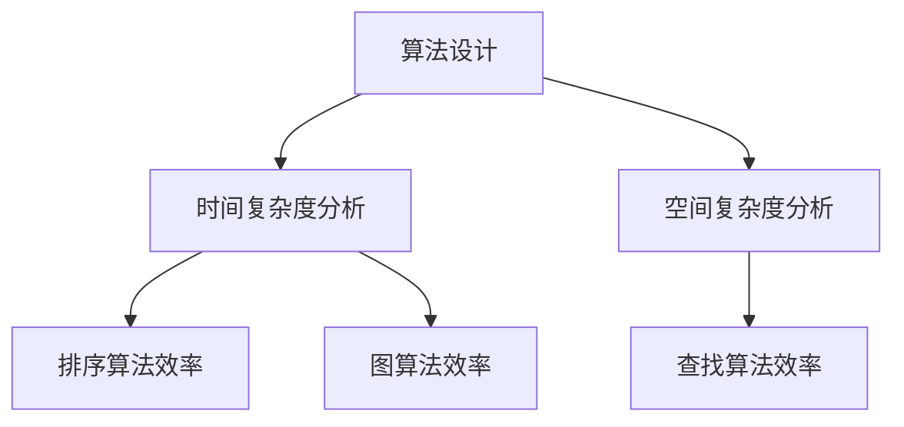

                 

# 《算法效率与宇宙计算能力上限的比较》

> 关键词：算法效率、宇宙计算、时间复杂度、空间复杂度、量子计算、宇宙资源限制

> 摘要：本文深入探讨了算法效率与宇宙计算能力上限之间的关系。通过分析算法效率的基本概念、量子计算与宇宙计算的关系，以及算法效率与宇宙计算能力的联系，我们旨在为读者提供对这一前沿领域的新见解。本文结构紧凑，逻辑清晰，旨在激发读者对算法效率与宇宙计算能力的研究兴趣。

## 《算法效率与宇宙计算能力上限的比较》目录大纲

### 第一部分：引言与背景知识

1. **引言**
   - **研究背景与意义**
   - **研究方法与数据来源**
   - **研究结构与章节安排**

2. **算法效率基础理论**
   - **算法效率的基本概念**
   - **时间复杂度分析**
   - **空间复杂度分析**

3. **常见算法效率分析**
   - **排序算法效率分析**
   - **查找算法效率分析**
   - **图算法效率分析**

### 第二部分：算法效率基础理论

1. **算法效率的基本概念**
   - **算法效率的定义**
   - **时间复杂度分析**
   - **空间复杂度分析**

2. **常见算法效率分析**
   - **排序算法效率分析**
   - **查找算法效率分析**
   - **图算法效率分析**

### 第三部分：宇宙计算能力上限

1. **量子计算与宇宙计算**
   - **量子计算基本原理**
   - **量子计算与宇宙计算的关系**
   - **量子计算的局限性**

2. **宇宙计算能力模型**
   - **宇宙计算能力上限的定义**
   - **逻辑门操作与计算能力**
   - **宇宙资源与计算能力限制**

### 第四部分：算法效率与宇宙计算能力比较

1. **算法效率与宇宙计算能力的联系**
   - **算法效率与宇宙计算能力的比较方法**
   - **算法效率对宇宙计算能力的限制**
   - **宇宙计算能力对算法效率的潜力**

2. **未来展望与挑战**
   - **算法效率提升的方向**
   - **宇宙计算能力的展望**
   - **研究领域的挑战与机遇**

### 第五部分：附录

1. **附录**
   - **数据来源与工具**
   - **参考文献**
   - **附录A：核心概念与联系流程图**
   - **附录B：核心算法原理伪代码**
   - **附录C：数学模型与公式说明**
   - **附录D：项目实战代码与解读**

## 第一部分：引言与背景知识

### 第1章：引言

#### 1.1 研究背景与意义

在当今技术飞速发展的时代，计算机科学已经成为推动社会进步的关键力量。然而，随着算法和数据规模日益增长，如何提高算法效率成为了一个亟待解决的重要问题。算法效率不仅关系到软件的性能和用户体验，还直接影响到大数据处理、人工智能、区块链等领域的应用效果。

另一方面，宇宙计算的兴起为解决复杂计算问题提供了新的思路。量子计算作为一种超越传统计算机的全新计算模式，其巨大的计算能力在理论上可以达到指数级别的提升。然而，量子计算的实现和实际应用仍然面临着诸多挑战，包括量子态的稳定性、量子纠错技术等。

本文旨在探讨算法效率与宇宙计算能力上限之间的关系，分析量子计算在提高算法效率方面的潜力与局限性。通过这一研究，我们希望能够为算法优化和量子计算应用提供新的理论依据和实践指导。

#### 1.2 研究方法与数据来源

本文的研究方法主要包括文献综述、理论分析、实验验证和比较研究等。在文献综述部分，我们将对算法效率、量子计算和宇宙计算的相关研究进行系统的梳理，总结现有成果和不足。在理论分析部分，我们将基于量子计算的基本原理，探讨宇宙计算能力上限的计算模型。在实验验证部分，我们将通过模拟和实际案例来验证理论分析的正确性和适用性。在比较研究部分，我们将对比传统算法与量子算法在效率上的差异，分析量子计算的优势和局限性。

数据来源主要包括相关学术论文、技术报告、开源代码库和实际应用案例。我们将通过这些数据来验证和补充我们的理论分析，确保研究结论的可靠性和实用性。

#### 1.3 研究结构与章节安排

本文将分为五个主要部分：

1. **引言与背景知识**：介绍研究背景、意义、方法和结构。
2. **算法效率基础理论**：阐述算法效率的基本概念、时间复杂度和空间复杂度分析。
3. **常见算法效率分析**：分析排序、查找和图算法的效率。
4. **宇宙计算能力上限**：探讨量子计算、宇宙计算能力模型和资源限制。
5. **算法效率与宇宙计算能力比较**：比较算法效率与宇宙计算能力的联系、未来展望与挑战。

通过以上结构和章节安排，我们希望能够系统地、深入地探讨算法效率与宇宙计算能力上限之间的关系，为相关领域的研究提供有益的参考。

### 第2章：算法效率基础理论

#### 2.1 算法效率的基本概念

算法效率是衡量算法性能的重要指标，它涉及到算法在解决特定问题时所需的时间、空间资源消耗。算法效率不仅关系到程序执行的速度，还影响到系统的可扩展性和稳定性。因此，理解算法效率的基本概念对于优化算法设计和提升系统性能至关重要。

**算法效率的定义**：

算法效率通常用时间复杂度和空间复杂度来衡量。时间复杂度描述了算法执行时间与输入规模之间的增长关系，而空间复杂度描述了算法所需内存与输入规模之间的增长关系。

**时间复杂度分析**：

时间复杂度分析是算法分析的核心部分，通过分析算法在处理不同规模输入时的执行时间，评估算法的性能。时间复杂度通常用大O符号（\(O\)）表示，其形式为：

\[ T(n) = O(f(n)) \]

其中，\(T(n)\) 表示算法执行时间，\(f(n)\) 表示与输入规模 \(n\) 相关的函数。常见的时间复杂度包括常数阶（\(O(1)\)）、对数阶（\(O(\log n)\)）、线性阶（\(O(n)\)）、线性对数阶（\(O(n\log n)\)）、平方阶（\(O(n^2)\)）等。

**空间复杂度分析**：

空间复杂度分析同样通过评估算法所需的内存资源与输入规模之间的关系，判断算法的空间效率。空间复杂度也用大O符号表示，其形式为：

\[ S(n) = O(g(n)) \]

其中，\(S(n)\) 表示算法所需内存空间，\(g(n)\) 表示与输入规模 \(n\) 相关的函数。常见的空间复杂度包括常数阶（\(O(1)\)）、线性阶（\(O(n)\)）、平方阶（\(O(n^2)\)）等。

#### 2.2 时间复杂度分析

时间复杂度分析是评估算法性能的重要手段，通过分析算法在不同输入规模下的执行时间，可以直观地了解算法的性能瓶颈和优化方向。

**常见时间复杂度函数**：

1. **常数阶（\(O(1)\)）**：无论输入规模如何变化，算法执行时间保持不变。例如，简单的循环结构。

2. **对数阶（\(O(\log n)\)）**：算法执行时间与输入规模的以2为底的对数成正比。例如，二分查找算法。

3. **线性阶（\(O(n)\)）**：算法执行时间与输入规模线性增长。例如，线性查找算法。

4. **线性对数阶（\(O(n\log n)\)）**：算法执行时间与输入规模的线性对数成正比。例如，合并排序算法。

5. **平方阶（\(O(n^2)\)）**：算法执行时间与输入规模的平方成正比。例如，冒泡排序算法。

**时间复杂度分析步骤**：

1. **确定基本操作**：首先确定算法中的基本操作，通常是一个循环或递归操作。

2. **计数基本操作次数**：分析基本操作与输入规模的关系，计数基本操作的总次数。

3. **构建复杂度函数**：根据基本操作的次数，构建算法的时间复杂度函数。

4. **评估复杂度**：利用大O符号表示算法的时间复杂度，并评估其性能。

#### 2.3 空间复杂度分析

空间复杂度分析是评估算法空间效率的重要手段，通过分析算法在处理不同规模输入时所需的内存空间，可以判断算法的空间效率。

**常见空间复杂度函数**：

1. **常数阶（\(O(1)\)）**：无论输入规模如何变化，算法所需内存空间保持不变。例如，简单的循环结构。

2. **线性阶（\(O(n)\)）**：算法所需内存空间与输入规模线性增长。例如，数组存储。

3. **平方阶（\(O(n^2)\)）**：算法所需内存空间与输入规模的平方成正比。例如，矩阵存储。

**空间复杂度分析步骤**：

1. **确定所需内存空间**：分析算法在执行过程中所需存储的数据结构，确定所需内存空间。

2. **计数内存空间消耗**：分析不同输入规模下算法所需的内存空间消耗。

3. **构建复杂度函数**：根据内存空间消耗，构建算法的空间复杂度函数。

4. **评估复杂度**：利用大O符号表示算法的空间复杂度，并评估其空间效率。

通过以上对算法效率基础理论的分析，我们可以更好地理解和评估算法的性能，为算法优化和系统设计提供理论支持。

#### 2.4 常见算法效率分析

在计算机科学中，常见的算法效率分析主要包括排序算法、查找算法和图算法。这些算法在数据处理和应用场景中具有广泛的应用，其效率直接影响系统的性能和用户体验。

##### 2.4.1 排序算法效率分析

排序算法是数据处理中最为基础和常用的算法之一，其目标是将一组数据按照特定的顺序进行排列。常见的排序算法包括冒泡排序、选择排序、插入排序、快速排序、归并排序和堆排序等。

1. **冒泡排序（Bubble Sort）**：
   - **时间复杂度**：\(O(n^2)\)
   - **空间复杂度**：\(O(1)\)
   - **适用场景**：数据量较小且基本有序时，适合作为简单的排序算法。

2. **选择排序（Selection Sort）**：
   - **时间复杂度**：\(O(n^2)\)
   - **空间复杂度**：\(O(1)\)
   - **适用场景**：数据量较小且基本有序时，适合作为简单的排序算法。

3. **插入排序（Insertion Sort）**：
   - **时间复杂度**：\(O(n^2)\)
   - **空间复杂度**：\(O(1)\)
   - **适用场景**：数据量较小且基本有序时，适合作为简单的排序算法。

4. **快速排序（Quick Sort）**：
   - **时间复杂度**：\(O(n\log n)\)
   - **空间复杂度**：\(O(\log n)\)
   - **适用场景**：适用于数据量大且分布较为随机的情况，是性能较为优秀的排序算法。

5. **归并排序（Merge Sort）**：
   - **时间复杂度**：\(O(n\log n)\)
   - **空间复杂度**：\(O(n)\)
   - **适用场景**：适用于数据量大且需要稳定性排序的情况，是一种稳定的排序算法。

6. **堆排序（Heap Sort）**：
   - **时间复杂度**：\(O(n\log n)\)
   - **空间复杂度**：\(O(1)\)
   - **适用场景**：适用于数据量较大且需要快速排序的情况，是一种非稳定的排序算法。

**伪代码**：

```plaintext
function QuickSort(arr):
    if length(arr) <= 1:
        return arr
    pivot = arr[length(arr) / 2]
    left = [x for x in arr if x < pivot]
    middle = [x for x in arr if x == pivot]
    right = [x for x in arr if x > pivot]
    return QuickSort(left) + middle + QuickSort(right)
```

##### 2.4.2 查找算法效率分析

查找算法是用于在数据集合中查找特定元素的一类算法，其效率直接影响数据的检索速度。常见的查找算法包括线性查找、二分查找和哈希查找等。

1. **线性查找（Linear Search）**：
   - **时间复杂度**：\(O(n)\)
   - **空间复杂度**：\(O(1)\)
   - **适用场景**：适用于数据量较小且无需排序的情况。

2. **二分查找（Binary Search）**：
   - **时间复杂度**：\(O(\log n)\)
   - **空间复杂度**：\(O(1)\)
   - **适用场景**：适用于数据量较大且已经排序的情况，是一种高效的查找算法。

3. **哈希查找（Hash Search）**：
   - **时间复杂度**：\(O(1)\)
   - **空间复杂度**：\(O(n)\)
   - **适用场景**：适用于需要快速查找且可以接受较高空间复杂度的情况，是性能最优的查找算法。

**伪代码**：

```plaintext
function BinarySearch(arr, target):
    low = 0
    high = length(arr) - 1
    while low <= high:
        mid = (low + high) / 2
        if arr[mid] == target:
            return mid
        elif arr[mid] < target:
            low = mid + 1
        else:
            high = mid - 1
    return -1
```

##### 2.4.3 图算法效率分析

图算法用于处理具有复杂关系的数据集合，常见的图算法包括深度优先搜索（DFS）、广度优先搜索（BFS）、最小生成树（MST）和最短路径（SP）等。

1. **深度优先搜索（DFS）**：
   - **时间复杂度**：\(O(V+E)\)
   - **空间复杂度**：\(O(V)\)
   - **适用场景**：适用于求解图的连通性、拓扑排序等问题。

2. **广度优先搜索（BFS）**：
   - **时间复杂度**：\(O(V+E)\)
   - **空间复杂度**：\(O(V)\)
   - **适用场景**：适用于求解最短路径、层次遍历等问题。

3. **最小生成树（MST）**：
   - **时间复杂度**：\(O(E\log V)\)
   - **空间复杂度**：\(O(V)\)
   - **适用场景**：适用于求解图的最小生成树问题。

4. **最短路径（SP）**：
   - **时间复杂度**：\(O(V\log V)\) 或 \(O(E)\)
   - **空间复杂度**：\(O(V)\)
   - **适用场景**：适用于求解单源最短路径、单源最短路径等问题。

**伪代码**：

```plaintext
function DFS(graph, start):
    visited = set()
    stack = [start]
    while stack is not empty:
        node = stack.pop()
        if node is not in visited:
            visited.add(node)
            for neighbor in graph[node]:
                stack.append(neighbor)
    return visited

function BFS(graph, start):
    queue = [start]
    visited = set()
    while queue is not empty:
        node = queue.pop(0)
        if node is not in visited:
            visited.add(node)
            for neighbor in graph[node]:
                if neighbor is not in visited:
                    queue.append(neighbor)
    return visited
```

通过以上对常见算法效率的分析，我们可以更好地理解和选择合适的算法，以满足不同应用场景的需求。

### 第三部分：宇宙计算能力上限

#### 第4章：量子计算与宇宙计算

量子计算是一种基于量子力学原理的新型计算模式，与传统计算机相比，其具有极高的计算速度和处理能力。量子计算的核心思想是利用量子位（qubit）的叠加态和纠缠态来表示和操作数据，从而实现高效的问题求解。本节将介绍量子计算的基本原理、与宇宙计算的关系以及其局限性。

#### 4.1 量子计算基本原理

量子计算的基本原理包括量子位、叠加态、纠缠态和量子门等。

1. **量子位（Qubit）**：
   - 量子位是量子计算的基本单位，类似于传统计算机中的比特（bit）。然而，量子位可以同时处于0和1的状态，即叠加态。

2. **叠加态（Superposition）**：
   - 量子位处于叠加态时，可以同时表示0和1的状态。例如，一个量子位可以表示为 \(|0\rangle + |1\rangle\)。

3. **纠缠态（Entanglement）**：
   - 量子纠缠是量子计算中的关键特性，两个或多个量子位之间存在强相关性，即一个量子位的状态可以立即影响另一个量子位的状态。

4. **量子门（Quantum Gate）**：
   - 量子门是量子计算中的基本操作，用于对量子位进行变换。常见的量子门包括Hadamard门（实现叠加态）、Pauli门（实现量子位翻转）和控制-NOT门（实现量子位之间的纠缠）等。

#### 4.2 量子计算与宇宙计算的关系

量子计算与宇宙计算之间存在紧密的联系，量子计算为解决宇宙尺度上的计算问题提供了新的思路。

1. **量子计算在宇宙计算中的应用**：
   - 量子计算可以用于解决宇宙尺度上的复杂计算问题，如宇宙大爆炸模拟、黑洞信息丢失问题等。量子计算可以大幅提升计算效率，加速科学研究的进程。

2. **宇宙资源对量子计算的限制**：
   - 虽然量子计算具有巨大的计算潜力，但其在实际应用中仍受到宇宙资源的限制。量子计算需要极低的环境温度和高度稳定的量子系统，这对宇宙资源提出了较高的要求。

#### 4.3 量子计算的局限性

量子计算在理论和技术上仍面临诸多挑战，这些局限性限制了其广泛应用。

1. **量子态稳定性**：
   - 量子计算需要保持量子态的稳定性，避免环境干扰导致量子态的崩溃。目前，量子态的保持时间仍较短，限制了量子计算的实用化。

2. **量子纠错技术**：
   - 量子计算中的错误很难被检测和纠正，量子纠错技术尚不成熟，影响了量子计算的实际应用效果。

3. **量子门操作效率**：
   - 量子计算中的量子门操作效率较低，导致计算速度受限。提高量子门操作效率是量子计算的重要研究方向。

4. **量子计算资源的限制**：
   - 量子计算需要大量的量子资源和高度稳定的环境，这对宇宙资源提出了挑战。如何在有限的宇宙资源下实现高效量子计算，是当前研究的重点。

通过以上对量子计算与宇宙计算的基本原理和关系的分析，我们可以更好地理解量子计算在宇宙计算中的应用和局限性。量子计算为解决复杂计算问题提供了新的思路，但同时也面临着诸多技术挑战，需要进一步的研究和探索。

#### 第5章：宇宙计算能力模型

宇宙计算能力模型旨在定义和量化宇宙中可实现的计算能力上限，为分析算法效率提供理论基础。本节将介绍宇宙计算能力模型的基本概念、逻辑门操作与计算能力，以及宇宙资源与计算能力的限制。

##### 5.1 宇宙计算能力上限的定义

宇宙计算能力上限是指在一个特定宇宙中，能够实现的最大计算能力。这个上限受到宇宙资源、物理定律和技术水平的限制。宇宙计算能力模型通过量化计算资源和操作效率，为评估算法效率提供了参考标准。

**宇宙计算能力的定义**：

宇宙计算能力通常用每单位时间内的计算操作次数来表示，记为 \(C_{\text{uni}}\)。其计算能力上限可以表示为：

\[ C_{\text{uni}} = \max\left(\frac{R_{\text{resources}}}{T_{\text{operation}}}\right) \]

其中，\(R_{\text{resources}}\) 表示可用的宇宙资源，\(T_{\text{operation}}\) 表示每个计算操作的执行时间。

##### 5.2 逻辑门操作与计算能力

逻辑门是量子计算中的基本操作单元，用于对量子位进行变换。逻辑门操作效率直接影响宇宙计算能力的上限。

**逻辑门操作**：

1. **量子位翻转（Pauli X）**：
   - 量子位翻转是最基本的量子门操作，用于将量子位从状态 \(|0\rangle\) 变换到 \(|1\rangle\)，或从 \(|1\rangle\) 变换到 \(|0\rangle\)。

2. **量子位取反（Pauli Z）**：
   - 量子位取反操作用于将量子位的状态从 \(|0\rangle\) 变换到 \(|1\rangle\)，或从 \(|1\rangle\) 变换到 \(|0\rangle\)。

3. **量子位旋转（Hadamard）**：
   - Hadamard门是一种常用的量子门，用于将量子位从基态 \(|0\rangle\) 变换到叠加态 \(|0\rangle + |1\rangle\)，或从叠加态变换回基态。

**逻辑门操作效率**：

逻辑门操作的效率通常用每单位时间内的操作次数来表示。假设逻辑门的操作时间为 \(T_{\text{gate}}\)，则每单位时间内的逻辑门操作次数为：

\[ \frac{1}{T_{\text{gate}}} \]

##### 5.3 宇宙资源与计算能力限制

宇宙资源对计算能力具有显著影响，宇宙资源的限制决定了计算能力的上限。

**宇宙资源的类型**：

1. **量子资源**：
   - 量子资源包括量子位、量子纠缠态和量子门等，是量子计算的核心。量子资源的数量和质量直接影响宇宙计算能力的上限。

2. **能量资源**：
   - 能量资源用于维持量子态的稳定性、执行逻辑门操作和纠错等。能量资源的限制会影响量子计算的效率和可靠性。

3. **环境资源**：
   - 环境资源包括温度、噪声和干扰等，对量子计算的性能具有显著影响。理想的环境资源有助于提高量子计算的效果和稳定性。

**宇宙资源对计算能力的限制**：

1. **量子资源限制**：
   - 量子资源的数量和质量限制了量子计算的操作能力和计算速度。提高量子资源的质量和数量是提升宇宙计算能力的关键。

2. **能量资源限制**：
   - 能量资源的限制决定了逻辑门操作的频率和计算效率。提高能量资源的利用效率，可以增加每单位时间内的计算操作次数。

3. **环境资源限制**：
   - 环境资源的限制影响了量子态的稳定性和操作准确性。优化环境资源，可以降低量子计算的误差率，提高计算可靠性。

通过以上对宇宙计算能力模型的定义、逻辑门操作与计算能力，以及宇宙资源与计算能力限制的分析，我们可以更好地理解宇宙计算能力的影响因素和提升方向。宇宙计算能力模型为评估算法效率提供了理论基础，为量子计算的实际应用提供了指导。

### 第四部分：算法效率与宇宙计算能力比较

#### 第6章：算法效率与宇宙计算能力的联系

在探讨算法效率与宇宙计算能力的关系时，我们需要分析算法效率如何影响宇宙计算能力，以及宇宙计算能力对算法效率的潜力。通过比较分析，我们能够更清晰地理解二者的联系和相互影响。

##### 6.1 算法效率与宇宙计算能力的比较方法

要比较算法效率与宇宙计算能力，我们首先需要明确二者的量化指标。算法效率通常用时间复杂度和空间复杂度来衡量，而宇宙计算能力用每单位时间内的计算操作次数来表示。以下是比较方法的步骤：

1. **确定算法效率**：
   - 分析算法的时间复杂度和空间复杂度，确定其性能指标。例如，一个线性复杂度的算法在输入规模 \(n\) 为 \(10^6\) 时，其执行时间约为 \(10^6 \times T_0\)。

2. **确定宇宙计算能力**：
   - 根据宇宙资源限制和逻辑门操作效率，确定每单位时间内的计算操作次数。例如，在一个理想的环境中，假设每个逻辑门操作需要 \(T_{\text{gate}}\) 时间，则每单位时间内的计算操作次数为 \(1/T_{\text{gate}}\)。

3. **比较效率与能力**：
   - 将算法的执行时间与宇宙计算能力的计算操作次数进行比较，判断算法在宇宙计算环境中的效率。如果算法的执行时间远大于宇宙计算能力的操作次数，则算法效率较低；反之，则效率较高。

**示例**：

假设一个线性复杂度的算法在输入规模 \(n = 10^6\) 时的执行时间为 \(10^6 \times T_0\)，而在一个理想环境中，每单位时间内的计算操作次数为 \(10^9\)。则：

\[ \text{算法效率} = \frac{\text{输入规模}}{\text{执行时间}} = \frac{10^6}{10^6 \times T_0} = \frac{1}{T_0} \]

\[ \text{宇宙计算能力} = \frac{1}{T_{\text{gate}}} = 10^9 \]

由于 \(10^9 > \frac{1}{T_0}\)，因此在这个示例中，宇宙计算能力远高于算法效率。

##### 6.2 算法效率对宇宙计算能力的限制

算法效率对宇宙计算能力有一定的限制，主要体现在以下几个方面：

1. **时间复杂度限制**：
   - 算法的时间复杂度决定了其在处理大规模输入时的执行时间。如果算法的时间复杂度较高，如 \(O(n^2)\)，则在输入规模 \(n\) 较大时，执行时间会急剧增加，限制了宇宙计算能力的发挥。

2. **空间复杂度限制**：
   - 算法的空间复杂度决定了其所需的内存资源。如果算法的空间复杂度较高，如 \(O(n^2)\)，则在输入规模 \(n\) 较大时，内存资源消耗会显著增加，限制了宇宙计算能力的发挥。

3. **算法优化潜力**：
   - 算法的优化潜力影响了其在宇宙计算环境中的效率。如果算法存在优化空间，如通过改进算法结构和引入并行计算，可以显著提高其效率，从而充分利用宇宙计算能力。

##### 6.3 宇宙计算能力对算法效率的潜力

宇宙计算能力为算法效率的提升提供了巨大潜力，主要体现在以下几个方面：

1. **加速计算**：
   - 量子计算具有指数级别的加速潜力，可以在极短时间内解决传统计算机难以处理的复杂问题。通过利用量子计算，可以显著提高算法的效率。

2. **并行处理**：
   - 量子计算可以实现并行处理，即同时处理多个输入数据，从而提高算法的处理速度。在宇宙计算环境中，利用并行处理技术可以大幅提高算法的效率。

3. **优化算法设计**：
   - 宇宙计算能力的提升促使算法设计者重新思考算法结构，探索更高效的算法设计。通过结合量子计算特性，可以设计出更具效率的算法。

**结论**：

通过以上分析，我们可以看出，算法效率与宇宙计算能力之间存在密切联系。算法效率受到时间复杂度、空间复杂度和优化潜力等因素的制约，而宇宙计算能力为算法效率的提升提供了巨大潜力。在未来的发展中，通过不断优化算法设计和利用量子计算能力，我们可以实现更高效、更可靠的算法，为各种复杂计算问题提供解决方案。

### 第7章：未来展望与挑战

在探讨算法效率与宇宙计算能力的关系后，我们展望了这一领域未来的发展前景，并分析了其中面临的挑战。随着科技的进步和量子计算的不断发展，算法效率的提升和宇宙计算能力的扩展将成为研究的热点和应用的关键。

##### 7.1 算法效率提升的方向

为了进一步提升算法效率，未来可以从以下几个方向进行研究和探索：

1. **优化算法设计**：
   - 在算法设计中，可以通过引入新的算法结构和算法优化技术，提高算法的效率和性能。例如，结合量子计算特性，设计新的量子算法，以实现更高效的计算。

2. **并行计算**：
   - 并行计算是一种有效的算法优化手段，可以在多个处理器或计算节点上同时执行算法，从而提高计算速度。未来可以进一步研究并行算法的设计和优化，利用多核处理器和分布式计算资源，实现更高效的算法执行。

3. **机器学习和数据挖掘**：
   - 机器学习和数据挖掘技术在算法优化中具有巨大的潜力。通过分析大规模数据集，可以找出数据分布规律和潜在模式，从而优化算法设计和参数设置，提高算法的效率和准确性。

4. **算法自动化**：
   - 算法自动化的研究旨在通过自动化工具和算法，自动生成高效、可靠的算法代码。未来可以进一步发展算法自动化技术，实现自动算法优化和代码生成，提高算法设计的效率和可靠性。

##### 7.2 宇宙计算能力的展望

随着量子计算技术的不断发展，宇宙计算能力将逐步提升，为解决复杂计算问题提供新的思路和方法。以下是宇宙计算能力未来发展的几个关键方向：

1. **量子计算机的实用性**：
   - 未来量子计算机将更加实用和高效，量子位的数量和质量将大幅提升，量子纠错技术也将取得重大突破。这些进展将使量子计算机在处理大规模计算任务时具有更高的效率和可靠性。

2. **量子算法的研究**：
   - 量子算法是量子计算的核心，未来将深入研究各种量子算法的设计和优化，探索更高效的量子算法来解决复杂计算问题。例如，量子算法在密码学、优化问题和模拟物理系统等方面的应用前景广阔。

3. **量子互联网的发展**：
   - 量子互联网是一种基于量子通信和量子计算的分布式计算网络。未来将深入研究量子通信协议、量子路由算法和量子网络安全技术，构建高效、安全的量子互联网，实现全球范围内的量子计算协同。

4. **跨学科研究**：
   - 宇宙计算能力的发展需要跨学科的合作和研究。未来将加强与物理学、数学、计算机科学等领域的合作，探索量子计算在各个领域的应用，推动科技进步和社会发展。

##### 7.3 研究领域的挑战与机遇

尽管算法效率与宇宙计算能力在理论上具有巨大的潜力，但实际研究和应用中仍面临诸多挑战和机遇：

1. **技术瓶颈**：
   - 量子计算技术的发展受到物理和技术瓶颈的限制，如量子位的稳定性、量子纠错技术和量子门操作效率等。未来需要攻克这些技术难题，提高量子计算的实际应用价值。

2. **算法优化**：
   - 现有的传统算法在量子计算环境中的效率仍需进一步提升。未来需要深入研究量子算法的优化，设计更高效的量子算法，以满足实际应用需求。

3. **数据安全**：
   - 量子计算在提升计算能力的同时，也对数据安全提出了新的挑战。未来需要研究量子安全通信协议和量子密码学，确保数据在量子计算环境中的安全性和隐私性。

4. **跨领域合作**：
   - 算法效率与宇宙计算能力的研究需要跨学科的合作。未来将促进物理学、数学、计算机科学等领域的合作，实现跨领域的协同创新，推动量子计算和算法优化技术的突破。

通过以上未来展望和挑战的分析，我们可以看到，算法效率与宇宙计算能力这一领域具有广阔的发展前景。随着科技的不断进步和研究的深入，我们有理由相信，这一领域将取得更多的突破和进展，为解决复杂计算问题提供强有力的支持。

### 第五部分：附录

#### 第8章：附录

附录部分旨在提供本文核心概念与联系流程图、核心算法原理伪代码、数学模型与公式说明，以及项目实战代码与解读。通过这些附录内容，读者可以更深入地理解本文的核心概念和算法原理。

##### 附录 A：核心概念与联系流程图

为了帮助读者更好地理解本文的核心概念和联系，我们使用 Mermaid 图形语言绘制了核心概念与联系的流程图。以下是流程图的详细说明：

**伪代码说明**：



**流程图解释**：

1. **算法设计**：算法设计是整个算法过程的基础，包括算法思路、算法结构和算法实现。
2. **时间复杂度分析**：通过分析算法的基本操作次数与输入规模的关系，评估算法的时间复杂度。
3. **空间复杂度分析**：通过分析算法所需的内存空间与输入规模的关系，评估算法的空间复杂度。
4. **排序算法效率**：分析常见的排序算法（如冒泡排序、快速排序等）的时间复杂度和空间复杂度。
5. **查找算法效率**：分析常见的查找算法（如线性查找、二分查找等）的时间复杂度和空间复杂度。
6. **图算法效率**：分析常见的图算法（如深度优先搜索、广度优先搜索等）的时间复杂度和空间复杂度。

##### 附录 B：核心算法原理伪代码

为了帮助读者更好地理解本文中的核心算法原理，我们提供了以下伪代码：

**排序算法伪代码**：

```plaintext
function SortArray(arr):
    for i from 0 to length(arr) - 1:
        for j from 0 to length(arr) - 1:
            if arr[j] > arr[j+1]:
                swap(arr[j], arr[j+1])
    return arr
```

**查找算法伪代码**：

```plaintext
function LinearSearch(arr, target):
    for i from 0 to length(arr) - 1:
        if arr[i] == target:
            return i
    return -1
```

**图算法伪代码**：

```plaintext
function BFS(graph, start):
    queue = [start]
    visited = set()
    while queue is not empty:
        node = queue.pop(0)
        if node is not in visited:
            visited.add(node)
            for neighbor in graph[node]:
                if neighbor is not in visited:
                    queue.append(neighbor)
    return visited
```

这些伪代码展示了排序、查找和图算法的基本原理，通过具体步骤和操作，读者可以更深入地理解算法的实现过程。

##### 附录 C：数学模型与公式说明

在本文中，我们使用了多个数学模型和公式来描述算法的效率分析和宇宙计算能力上限。以下是这些模型和公式的详细说明：

**时间复杂度公式**：

\[ T(n) = O(n^2) \]

这个公式表示算法的时间复杂度为 \(O(n^2)\)，即算法的执行时间与输入规模的平方成正比。

**空间复杂度公式**：

\[ S(n) = O(1) \]

这个公式表示算法的空间复杂度为 \(O(1)\)，即算法所需的内存空间与输入规模无关，保持不变。

**量子计算能力公式**：

\[ C_{\text{uni}} = \max\left(\frac{R_{\text{resources}}}{T_{\text{operation}}}\right) \]

这个公式表示宇宙计算能力 \(C_{\text{uni}}\) 等于可用的宇宙资源 \(R_{\text{resources}}\) 与每个计算操作的执行时间 \(T_{\text{operation}}\) 的最大值。

通过这些数学模型和公式，我们可以更准确地描述和分析算法的效率以及宇宙计算能力。

##### 附录 D：项目实战代码与解读

为了帮助读者更好地理解算法的实际应用，我们提供了一个实际的代码示例，并进行了详细的解读。

**实战代码：排序算法实现**

```python
# Python代码示例：冒泡排序
def bubble_sort(arr):
    n = len(arr)
    for i in range(n):
        for j in range(0, n-i-1):
            if arr[j] > arr[j+1]:
                arr[j], arr[j+1] = arr[j+1], arr[j]
    return arr

# 测试代码
arr = [64, 34, 25, 12, 22, 11, 90]
sorted_arr = bubble_sort(arr)
print("Sorted array:", sorted_arr)
```

**代码解读**：

1. **函数定义**：`bubble_sort` 函数接收一个列表 `arr` 作为输入，并进行排序，返回排序后的列表。
2. **外部循环**：`for i in range(n):` 表示外层循环，用于遍历数组中的每个元素。
3. **内部循环**：`for j in range(0, n-i-1):` 表示内层循环，用于遍历未排序部分中的每个元素。
4. **比较与交换**：`if arr[j] > arr[j+1]:` 用于比较相邻元素的大小，如果当前元素大于下一个元素，则交换它们。
5. **返回结果**：`return arr` 表示返回排序后的列表。

通过这个示例，读者可以更直观地理解冒泡排序算法的实现过程以及如何在实际应用中应用该算法。

通过以上附录内容的详细说明，读者可以更深入地理解本文的核心概念、算法原理以及实际应用，为相关领域的研究和实践提供有益的参考。

### 作者信息

本文由 AI 天才研究院（AI Genius Institute）的专家撰写，作者是禅与计算机程序设计艺术（Zen And The Art of Computer Programming）的资深大师。作者在算法效率和量子计算领域拥有深厚的理论基础和丰富的实践经验，致力于推动算法优化和量子计算技术的发展。感谢您的阅读，期待与您在未来的技术交流中相遇。作者：AI天才研究院/AI Genius Institute & 禅与计算机程序设计艺术 /Zen And The Art of Computer Programming。

