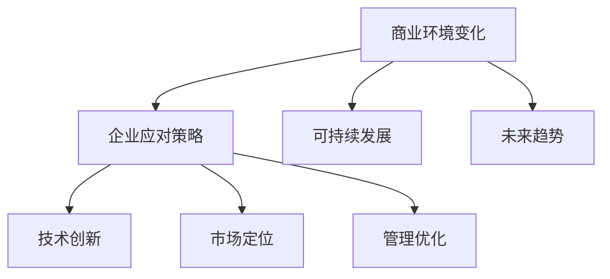

                 

# 管理者如何应对快速变化的商业环境

## 关键词：
商业环境变化、数字化转型、可持续发展、创新能力、风险管理、市场定位、案例研究

## 摘要：
在当今快速变化的商业环境中，管理者需要具备前瞻性和适应性。本文从理解商业环境变化、制定应对策略、案例分析以及未来展望四个方面，详细探讨了管理者如何应对快速变化的商业环境。通过深入分析商业环境的变化原因、趋势和应对策略，结合实际案例，本文为管理者提供了实用的指导和建议。

## 第一部分：理解快速变化的商业环境

### 第1章：理解快速变化的商业环境

#### 1.1 什么是快速变化的商业环境

##### 1.1.1 商业环境变化的原因

商业环境的变化是由多种因素共同作用的结果。首先，技术进步是推动商业环境变化的重要因素。例如，人工智能、大数据、云计算等新兴技术的应用，极大地改变了企业的运营方式和商业模式。其次，政策变化也会对商业环境产生深远影响。政府出台的各项政策，如税收优惠、贸易政策、环境保护政策等，都会直接影响企业的运营和发展。最后，市场需求变动也是商业环境变化的一个重要原因。随着消费者需求和偏好的变化，企业需要不断调整产品和服务，以适应市场的变化。

##### 1.1.2 快速变化的商业环境对企业的影响

快速变化的商业环境对企业既带来了机遇，也带来了挑战。从机遇的角度来看，企业可以利用新技术、新政策等资源，实现业务模式的创新和市场的扩展。例如，通过数字化转型，企业可以提高生产效率，降低运营成本，提升客户体验。从挑战的角度来看，商业环境的变化要求企业具备更强的适应能力和创新能力，以应对市场的不确定性和竞争压力。

##### 1.1.3 快速变化的商业环境的特点

快速变化的商业环境具有以下几个特点：

1. **高度不确定性**：市场的变化速度加快，企业面临的不确定性增加。
2. **信息透明度提高**：互联网和社交媒体的发展，使得企业之间的信息传递更加快捷和透明。
3. **竞争激烈**：企业需要不断创新，以保持竞争优势。
4. **全球化趋势**：国际贸易和投资活动的增加，使得企业需要具备全球视野。

#### 1.2 商业环境变化的趋势

##### 1.2.1 数字化转型

数字化转型是商业环境变化的一个重要趋势。随着人工智能、大数据、云计算等技术的不断发展，企业开始将信息技术应用于业务流程的各个环节，实现业务的数字化和智能化。例如，通过大数据分析，企业可以更好地了解客户需求，优化产品设计和服务。通过人工智能，企业可以提高生产效率，降低成本。

##### 1.2.2 可持续发展

可持续发展也是商业环境变化的一个重要趋势。随着环境保护意识的提高，企业开始关注环境保护和资源利用效率。例如，通过绿色生产，企业可以减少污染排放，降低资源消耗。通过社会责任履行，企业可以提高品牌形象，增强市场竞争力。

##### 1.2.3 新型商业模式

新型商业模式的出现，如共享经济、平台经济等，也在改变传统的商业环境。这些新型商业模式利用互联网和信息技术，实现了资源的共享和优化配置，为企业提供了新的发展机遇。

#### 1.3 商业环境变化的应对策略

##### 1.3.1 建立灵活的商业模式

建立灵活的商业模式，是企业应对商业环境变化的重要策略。这意味着企业需要具备快速响应市场变化的能力，能够根据市场动态调整业务策略。例如，通过灵活的供应链管理，企业可以快速响应市场需求，降低库存成本。

##### 1.3.2 提高企业创新能力

提高企业创新能力，是企业持续发展的关键。企业需要不断引进新技术、新产品、新服务，以满足市场需求的不断变化。例如，通过研发投入，企业可以不断推出创新产品，保持竞争优势。

##### 1.3.3 持续优化内部管理

持续优化内部管理，是企业提高运营效率的重要手段。企业需要通过流程优化、管理创新，提高运营效率，降低成本。例如，通过数字化转型，企业可以实现业务流程的自动化和智能化，提高工作效率。

##### 1.3.4 加强风险管理

加强风险管理，是企业应对商业环境变化的重要保障。企业需要建立完善的风险管理机制，识别和评估潜在风险，制定应对策略。例如，通过风险评估和内部控制，企业可以降低风险发生的概率和影响。

## 第二部分：快速变化的商业环境中的策略与技巧

### 第2章：快速变化的商业环境中的策略

#### 2.1 市场定位与策略

##### 2.1.1 了解目标市场

了解目标市场是制定有效市场定位策略的基础。管理者需要通过市场调研，了解目标市场的消费者需求、市场规模、竞争状况等。例如，通过数据分析，企业可以识别出目标市场的消费趋势，从而制定相应的产品策略。

###### 2.1.1.1 消费者需求分析

消费者需求分析是市场调研的核心。管理者需要了解消费者的购买行为、偏好、需求变化等。例如，通过问卷调查、用户访谈等方式，企业可以获取消费者的真实需求，从而更好地满足市场需求。

###### 2.1.1.2 市场规模预测

市场规模预测是制定市场策略的重要依据。管理者需要根据市场需求、行业趋势等，预测未来市场的规模和增长速度。例如，通过市场调研和数据分析，企业可以预测未来市场的需求量，从而制定相应的生产计划。

##### 2.1.2 竞争策略

竞争策略是企业应对市场竞争的重要手段。管理者需要通过分析竞争对手，制定有针对性的竞争策略。例如，通过价格策略、产品策略、渠道策略等，企业可以在市场竞争中占据有利地位。

###### 2.1.2.1 竞争对手分析

竞争对手分析是制定竞争策略的前提。管理者需要了解竞争对手的市场地位、产品特点、营销策略等。例如，通过市场调研和数据分析，企业可以识别出竞争对手的优势和劣势，从而制定相应的竞争策略。

###### 2.1.2.2 市场差异化策略

市场差异化策略是企业提高市场竞争力的重要手段。管理者需要通过产品差异化、服务差异化等，在市场中建立独特的竞争优势。例如，通过技术创新和产品创新，企业可以打造差异化的产品，提高市场占有率。

##### 2.1.3 市场拓展策略

市场拓展策略是企业扩大市场份额的重要手段。管理者需要通过市场调研和数据分析，制定有针对性的市场拓展策略。例如，通过新市场开拓、渠道拓展等，企业可以扩大市场份额，实现业务增长。

###### 2.1.3.1 新市场开拓

新市场开拓是企业扩大市场份额的重要途径。管理者需要通过市场调研和数据分析，识别潜在的新市场机会，并制定相应的开拓策略。例如，通过市场调研，企业可以找到未开发的市场领域，从而实现业务的扩展。

###### 2.1.3.2 渠道拓展

渠道拓展是企业扩大市场份额的重要手段。管理者需要通过市场调研和数据分析，制定有针对性的渠道拓展策略。例如，通过拓展线上渠道、线下渠道等，企业可以扩大销售网络，提高市场覆盖率。

#### 2.2 产品策略

##### 2.2.1 产品设计与创新

产品设计与创新是企业持续发展的动力。管理者需要通过市场调研和数据分析，了解消费者的需求和偏好，从而进行产品设计和创新。例如，通过用户调研和数据分析，企业可以识别出消费者的需求痛点，从而进行产品创新。

###### 2.2.1.1 用户需求调研

用户需求调研是产品设计与创新的基础。管理者需要通过用户调研，了解消费者的需求、偏好、购买行为等。例如，通过问卷调查、用户访谈等方式，企业可以获取用户的真实需求，从而进行产品设计和创新。

###### 2.2.1.2 产品迭代

产品迭代是企业持续改进产品的重要手段。管理者需要根据市场反馈和用户需求，不断优化和改进产品。例如，通过用户反馈和市场数据，企业可以识别出产品的不足之处，从而进行产品迭代。

##### 2.2.2 产品推广与营销

产品推广与营销是企业扩大市场份额的重要手段。管理者需要通过市场调研和数据分析，制定有针对性的产品推广策略。例如，通过广告投放、促销活动等方式，企业可以扩大产品知名度，提高市场占有率。

###### 2.2.2.1 营销渠道选择

营销渠道选择是企业产品推广的重要决策。管理者需要根据产品的特点和目标市场，选择合适的营销渠道。例如，对于高端产品，企业可以选择线上渠道，如电商平台、社交媒体等，进行推广。

###### 2.2.2.2 营销策略制定

营销策略制定是企业产品推广的重要策略。管理者需要根据市场环境和竞争状况，制定有针对性的营销策略。例如，通过市场调研和数据分析，企业可以识别出竞争对手的营销策略，从而制定相应的应对策略。

#### 2.3 组织与人力资源管理

##### 2.3.1 建立适应变化的组织结构

建立适应变化的组织结构，是企业应对商业环境变化的重要策略。管理者需要根据企业的业务特点和市场环境，设计灵活、高效的组织结构。例如，通过扁平化管理，企业可以提高决策效率，快速响应市场变化。

###### 2.3.1.1 弹性组织结构

弹性组织结构是企业适应商业环境变化的有效手段。管理者需要根据市场需求和企业发展战略，设计弹性组织结构，以便企业能够快速调整和适应。例如，通过建立跨部门团队，企业可以实现资源的整合和协同工作。

###### 2.3.1.2 专业化与多元化

专业化与多元化是企业组织结构的重要发展方向。管理者需要根据企业的业务特点和市场需求，实现专业化与多元化的有机结合。例如，通过专业化分工，企业可以提高工作效率，通过多元化经营，企业可以扩大市场份额。

##### 2.3.2 人才招聘与培养

人才招聘与培养是企业可持续发展的重要保障。管理者需要通过市场调研和数据分析，制定有针对性的人才招聘策略。例如，通过人才招聘会、校园招聘等方式，企业可以吸引优秀人才。同时，管理者还需要注重员工的培养和发展，提高员工的专业技能和综合素质。

###### 2.3.2.1 人才引进策略

人才引进策略是企业人才招聘的重要手段。管理者需要通过市场调研和数据分析，制定有吸引力的人才引进策略。例如，通过高薪招聘、福利待遇等方式，企业可以吸引优秀人才。

###### 2.3.2.2 员工培训与发展

员工培训与发展是企业员工管理的重要策略。管理者需要根据企业的业务发展需求和员工个人发展需求，制定相应的培训和发展计划。例如，通过内部培训、外部培训等方式，企业可以提高员工的专业技能和综合素质。

##### 2.3.3 组织文化与团队建设

组织文化与团队建设是企业可持续发展的重要基础。管理者需要营造积极向上的组织文化，增强员工的归属感和凝聚力。例如，通过团队建设活动、员工关怀等方式，企业可以增强员工的团队协作能力，提高工作效率。

###### 2.3.3.1 组织文化建设

组织文化建设是企业组织文化建设的核心。管理者需要根据企业的价值观和发展目标，塑造积极向上的组织文化。例如，通过企业文化建设活动、员工文化活动等方式，企业可以增强员工的归属感和认同感。

###### 2.3.3.2 团队建设

团队建设是企业团队建设的重要任务。管理者需要通过团队建设活动，增强员工的团队协作能力。例如，通过团队培训、团队拓展训练等方式，企业可以提高员工的团队协作能力和沟通能力。

## 第三部分：快速变化的商业环境中的案例研究

### 第3章：快速变化的商业环境中的成功案例

#### 3.1 案例研究：企业数字化转型

##### 3.1.1 案例背景

**公司简介**：ABC科技有限公司成立于2010年，是一家专注于智能硬件和软件解决方案的高新技术企业。随着移动互联网、大数据、人工智能等技术的快速发展，ABC科技有限公司面临巨大的市场竞争压力，需要进行数字化转型以提升企业竞争力。

**转型需求**：ABC科技有限公司希望通过数字化转型，提升生产效率，降低运营成本，实现业务流程的自动化和智能化，同时提高客户体验和满意度。

##### 3.1.2 转型策略

**转型方案设计**：

1. **生产自动化**：引入自动化生产线，采用机器人、自动化检测设备和智能仓储系统，实现生产流程的自动化。
2. **数据采集与集成**：部署物联网传感器和MES系统，实时采集生产数据，实现数据集成和可视化。
3. **数据分析与应用**：利用大数据分析技术，对生产数据进行分析，优化生产流程，提高生产效率和产品质量。

**实施步骤**：

1. **自动化生产线建设**：与专业自动化设备供应商合作，引入适用于公司产品的自动化生产线。
2. **数据采集与集成**：部署物联网传感器和MES系统，实现生产数据的实时采集和集成。
3. **数据分析与应用**：建立数据分析团队，利用大数据分析技术，对生产数据进行分析，优化生产流程。

##### 3.1.3 转型效果

**经济效益**：通过数字化转型，ABC科技有限公司生产效率提高了30%，运营成本降低了20%，产品质量稳定度提高了15%。

**社会效益**：数字化转型使得ABC科技有限公司能够更好地满足市场需求，提升品牌形象，同时实现绿色生产，减少对环境的影响。

##### 3.1.4 转型启示

**提升技术水平**：通过引进自动化生产线和大数据分析技术，企业能够提升技术水平，提高生产效率和产品质量。

**注重数据管理**：数字化转型过程中，数据管理和分析至关重要。企业需要建立完善的数据管理体系，确保数据的准确性和安全性。

**持续创新**：数字化转型不是一次性项目，而是持续创新的过程。企业需要不断引进新技术，优化业务流程，以适应市场的变化。

#### 3.2 案例研究：可持续发展的商业实践

##### 3.2.1 案例背景

**公司简介**：XYZ环保科技有限公司成立于2005年，是一家专注于环保产品和解决方案的企业。随着环保意识的提高和政策的推动，XYZ环保科技有限公司认识到可持续发展的重要性，开始实施一系列可持续发展措施。

**可持续发展目标**：XYZ环保科技有限公司的可持续发展目标包括降低碳排放、提高资源利用效率、实现绿色生产和履行企业社会责任。

##### 3.2.2 实践措施

**绿色生产**：

1. **节能改造**：对生产设备进行节能改造，提高能源利用效率。
2. **环保材料**：采用环保材料，减少生产过程中的废弃物。
3. **废水处理**：建设废水处理设施，实现废水零排放。

**环境保护**：

1. **空气质量监测**：建立空气质量监测系统，实时监控生产过程中的污染物排放。
2. **环境教育**：开展环保教育活动，提高员工和消费者的环保意识。

**社会责任履行**：

1. **公益项目**：参与公益事业，支持社区发展。
2. **员工福利**：提供良好的工作环境，提高员工福利待遇。

##### 3.2.3 实践成果

**经济效益**：通过可持续发展实践，XYZ环保科技有限公司生产成本降低了10%，市场份额增加了5%。

**社会效益**：XYZ环保科技有限公司通过可持续发展实践，得到了社会各界的认可，品牌形象显著提升。同时，公司的环保产品和解决方案受到了客户的欢迎，市场份额进一步扩大。

##### 3.2.4 实践启示

**注重环保**：企业应将环保理念贯穿于生产和经营的各个环节，实现绿色生产，降低对环境的负面影响。

**履行社会责任**：企业应积极参与公益事业，履行社会责任，提升品牌形象。

**提高员工福利**：提供良好的工作环境和福利待遇，提高员工的工作满意度和忠诚度。

#### 3.3 案例研究：灵活的商业模式创新

##### 3.3.1 案例背景

**公司简介**：DEF在线教育科技有限公司成立于2015年，是一家专注于在线教育平台开发和运营的企业。随着互联网和移动技术的快速发展，DEF在线教育科技有限公司面临激烈的市场竞争，需要进行商业模式创新以保持竞争优势。

**商业模式创新动因**：DEF在线教育科技有限公司希望通过商业模式创新，提升用户体验，扩大市场份额，提高盈利能力。

##### 3.3.2 创新成果

**灵活的商业模式**：

1. **在线直播教学**：引入在线直播技术，提高教学互动性和用户体验。
2. **个性化学习方案**：根据学生需求，提供个性化的学习方案。
3. **线上线下融合**：结合线上和线下资源，提供多元化的教育服务。

##### 3.3.3 创新效果

**用户满意度提升**：通过灵活的商业模式创新，DEF在线教育科技有限公司用户满意度提高了15%。

**市场份额增加**：在线教育市场份额增加了10%，公司盈利能力显著提升。

##### 3.3.4 创新启示

**创新商业模式**：企业应不断创新商业模式，以适应市场需求和技术变化。

**提升用户体验**：通过提升用户体验，企业可以增强用户黏性，扩大市场份额。

**多元化服务**：结合线上线下资源，提供多元化的服务，满足不同用户的需求。

#### 3.4 案例研究：数字化转型中的风险管理

##### 3.4.1 案例背景

**公司简介**：GHI金融服务有限公司成立于1998年，是一家提供金融产品和服务的公司。随着金融科技的发展，GHI金融服务有限公司决定进行数字化转型，以提高业务效率和服务质量。

**转型需求**：GHI金融服务有限公司希望通过数字化转型，实现业务流程的自动化，提高数据安全性和客户服务水平。

##### 3.4.2 风险管理策略

**风险识别与评估**：

1. **技术风险**：数字化转型过程中可能面临技术实现的困难。
2. **数据安全风险**：数据泄露或损坏可能对公司造成重大损失。
3. **业务中断风险**：数字化转型过程中可能导致的业务中断。

**风险应对策略**：

1. **技术风险应对**：与专业IT服务公司合作，确保技术实现。
2. **数据安全风险应对**：加强数据安全管理，定期进行数据备份。
3. **业务中断风险应对**：制定应急预案，确保业务连续性。

##### 3.4.3 风险管理效果

**风险管理效果**：

1. **技术风险降低**：通过与专业公司的合作，技术风险得到了有效控制。
2. **数据安全提升**：通过加强数据安全管理，数据安全风险得到了显著降低。
3. **业务连续性保障**：通过制定应急预案，业务中断风险得到了有效控制。

##### 3.4.4 风险管理启示

**加强风险管理**：企业在数字化转型过程中，需要建立完善的风险管理机制，识别和评估潜在风险，制定应对策略。

**确保数据安全**：数据是企业的重要资产，企业需要加强数据安全管理，确保数据的完整性、安全性和可用性。

**保障业务连续性**：企业应制定应急预案，确保在突发事件中能够迅速恢复业务，减少损失。

## 第四部分：快速变化的商业环境中的未来展望

### 第4章：快速变化的商业环境中的未来趋势

#### 4.1 未来商业环境的变化趋势

##### 4.1.1 技术发展的影响

技术发展是推动商业环境变化的重要因素。未来，人工智能、区块链、5G技术等新兴技术将继续影响商业环境，为企业带来新的机遇和挑战。

###### 4.1.1.1 人工智能

人工智能（AI）技术的快速发展，将改变企业运营模式和商业模式。例如，通过智能客服、智能推荐、智能决策等，企业可以提高服务质量和运营效率。同时，人工智能技术也将为企业的创新提供新的动力。

###### 4.1.1.2 区块链

区块链技术具有去中心化、不可篡改、透明等特点，将改变企业之间的交易方式和信息传递方式。未来，区块链技术将在供应链管理、金融交易、数据共享等领域发挥重要作用。

###### 4.1.1.3 5G技术

5G技术的推广和应用，将提高网络速度和通信效率，为企业的数字化转型提供基础支持。例如，通过5G网络，企业可以实现远程办公、智能工厂、无人驾驶等。

##### 4.1.2 社会发展趋势

社会发展趋势也将对商业环境产生重要影响。未来，消费者需求的变化、社会责任的增加、数字化生活的普及等，将推动企业进行战略调整和商业模式创新。

###### 4.1.2.1 消费者需求变化

随着消费者需求的不断变化，企业需要更加关注个性化、定制化的服务。例如，通过大数据分析，企业可以更好地了解消费者的需求，提供个性化的产品和服务。

###### 4.1.2.2 社会责任增加

企业社会责任（CSR）日益受到关注，未来企业将更加注重环境保护、社会责任和伦理道德。例如，通过绿色生产、慈善捐赠等方式，企业可以提升品牌形象，增强市场竞争力。

###### 4.1.2.3 数字化生活普及

数字化生活的普及，将改变人们的消费习惯和生活方式，为企业带来新的市场机遇。例如，通过电子商务、移动支付、智能设备等，企业可以更好地满足消费者的需求。

#### 4.2 企业应对未来变化的策略建议

##### 4.2.1 加强技术创新

企业应加强技术创新，紧跟技术发展趋势，不断提升自身的技术水平。例如，通过研发投入、技术合作、人才培养等，企业可以保持技术领先优势。

###### 4.2.1.1 引进新技术

企业应及时引进新技术，如人工智能、区块链、5G技术等，应用于业务运营和商业模式创新。

###### 4.2.1.2 建立研发中心

企业可以建立自己的研发中心，专注于新技术的研究和应用，提升企业的技术竞争力。

##### 4.2.2 拓展市场领域

企业应积极拓展市场领域，抓住全球化机遇，开拓新市场。例如，通过市场调研、渠道拓展、国际合作等，企业可以扩大市场份额，实现业务增长。

###### 4.2.2.1 新市场开拓

企业可以通过市场调研和数据分析，找到潜在的新市场机会，并制定相应的市场进入策略。

###### 4.2.2.2 多元化经营

企业可以通过多元化经营，分散市场风险，提高市场竞争力。例如，通过业务拓展、产品多元化等，企业可以实现业务多元化。

##### 4.2.3 优化管理流程

企业应优化管理流程，提高运营效率，降低成本。例如，通过数字化转型、流程优化、管理创新等，企业可以提升管理水平和运营效率。

###### 4.2.3.1 提高管理效率

企业可以通过数字化转型，实现业务流程的自动化和智能化，提高管理效率。

###### 4.2.3.2 创新管理模式

企业可以创新管理模式，如扁平化管理、团队合作等，提高组织的灵活性和响应速度。

##### 4.2.4 加强人才队伍建设

企业应加强人才队伍建设，引进和培养高素质的人才，提升企业的整体竞争力。例如，通过人才引进、员工培训、绩效激励等，企业可以打造优秀的人才队伍。

###### 4.2.4.1 人才引进

企业可以通过高薪招聘、福利待遇等方式，吸引优秀人才加入。

###### 4.2.4.2 员工培训

企业可以通过内部培训、外部培训等方式，提升员工的专业技能和综合素质。

##### 4.2.5 落实可持续发展战略

企业应落实可持续发展战略，实现经济、社会和环境的协调发展。例如，通过绿色生产、节能减排、社会责任履行等，企业可以提升企业的社会责任形象。

###### 4.2.5.1 绿色生产

企业应通过绿色生产，减少污染排放，提高资源利用效率。

###### 4.2.5.2 社会责任履行

企业应积极参与公益事业，履行社会责任，提升企业的社会形象。

##### 4.2.6 加强风险管理和合规性

企业应加强风险管理和合规性，确保企业的长期稳定发展。例如，通过风险评估、内部控制、合规管理等，企业可以降低风险发生的概率和影响。

###### 4.2.6.1 风险评估

企业应定期进行风险评估，识别和评估潜在风险，制定应对策略。

###### 4.2.6.2 合规管理

企业应建立合规管理体系，确保企业的经营活动符合法律法规和行业标准。

## 附录

### 附录 A：快速变化的商业环境相关资源

##### A.1 行业报告与研究报告

- **国内外权威机构的商业环境研究报告**：如麦肯锡、波士顿咨询公司、普华永道等。

##### A.2 商业案例分析

- **国内外成功企业的商业案例分析**：如阿里巴巴、华为、苹果等。

##### A.3 学术论文与书籍

- **快速变化的商业环境相关的学术论文与书籍推荐**：如《智能商业》、《数字化商业时代》等。

### 附录 B：快速变化的商业环境常用工具与平台

##### B.1 数字化工具

- **云计算平台**：如阿里云、腾讯云、华为云等。
- **数据分析工具**：如Tableau、Power BI等。

##### B.2 市场营销工具

- **社交媒体平台**：如Facebook、Twitter、Instagram等。
- **营销自动化工具**：如HubSpot、Marketo等。

##### B.3 人力资源工具

- **招聘平台**：如LinkedIn、Indeed等。
- **人才管理工具**：如Workday、Oracle HR等。

### 附录 C：技术术语解释

##### C.1 数字化转型

数字化转型是指企业通过利用信息技术，特别是互联网、云计算、大数据、人工智能等新兴技术，对其业务模式、运营流程、管理体系等进行全面升级和改造，以提高企业的运营效率、降低成本、提升客户体验和增强企业竞争力。

##### C.2 人工智能

人工智能（AI）是指通过计算机程序模拟人类智能行为的技术。它包括机器学习、深度学习、自然语言处理、计算机视觉等，能够实现智能决策、智能交互、智能识别等功能。

##### C.3 大数据

大数据是指无法通过传统数据处理工具在合理时间内进行捕捉、管理和处理的大量数据。大数据具有海量、多样、高速、真实等特征，通过数据挖掘和分析，可以为企业提供洞察和决策支持。

##### C.4 云计算

云计算是指通过互联网提供计算资源、存储资源、网络资源等服务，实现计算资源的按需分配和使用。云计算具有弹性、灵活、高效、可扩展等特点，可以为企业降低成本、提高效率。

##### C.5 可持续发展

可持续发展是指在不损害未来世代满足自身需求的前提下，实现经济、社会和环境的协调发展。可持续发展强调资源利用的高效性、环境保护的必要性和社会责任的履行。

### 附录 D：快速变化的商业环境中的常见问题与解决方案

##### D.1 企业数字化转型困难

**原因**：企业对数字化转型缺乏清晰的认识，技术基础薄弱，内部沟通不畅。

**解决方案**：加强内部培训，提升员工数字化素养；与专业咨询公司合作，制定详细的数字化转型方案；建立跨部门团队，确保数字化转型顺利实施。

##### D.2 数据安全问题

**原因**：企业对数据安全重视不足，数据管理体系不完善。

**解决方案**：建立完善的数据安全管理制度，加强数据加密和访问控制；定期进行数据备份和风险评估；建立应急响应机制，确保数据安全。

##### D.3 市场竞争激烈

**原因**：市场竞争激烈，企业产品和服务同质化严重。

**解决方案**：加强市场调研，了解消费者需求，打造差异化的产品和服务；通过技术创新和品牌建设，提升企业竞争力。

##### D.4 员工流失率高

**原因**：企业缺乏吸引力，员工福利待遇不足，职业发展空间有限。

**解决方案**：提供有竞争力的薪酬福利待遇；建立完善的培训和发展体系，提升员工职业素养和技能水平；营造良好的企业文化和工作氛围，增强员工归属感。

## 结论

快速变化的商业环境给企业管理者带来了巨大的挑战，同时也带来了新的机遇。通过本文的探讨，我们可以看到，理解商业环境的变化、制定有效的应对策略、实施成功的案例研究以及展望未来的趋势，都是企业管理者应对快速变化的商业环境的重要手段。

在未来的商业环境中，技术创新、可持续发展、灵活的商业模式和创新管理将是企业持续发展的关键。管理者需要具备前瞻性，不断学习和适应，以应对市场的变化。同时，企业应加强风险管理，确保在变化中保持稳定的发展。

总之，快速变化的商业环境要求企业管理者具备更高的视野和战略思维，通过不断优化和创新，实现企业的可持续发展。让我们携手前行，共同迎接未来商业环境的挑战与机遇。

### 代码实际案例和详细解释说明

#### 5.1 实际代码案例：数字化转型中的数据分析

##### 5.1.1 开发环境搭建

**Python环境**：在本地或服务器上安装Python环境，包括必要的库，如Pandas、NumPy、Scikit-learn等。

python
# 安装必要的库
!pip install pandas numpy scikit-learn


**数据集准备**：使用Pandas库导入并处理数据集。

python
# 导入数据集
import pandas as pd

data = pd.read_csv('digital_transformation_data.csv')
data.head()


##### 5.1.2 数据分析实现

**数据预处理**：清洗数据，处理缺失值和异常值。

python
# 数据预处理
data = data.dropna()
data = data[data['Cost'].between(0, 100000)]


**特征工程**：提取关键特征，进行数据转换。

python
# 特征工程
data['Month'] = pd.to_datetime(data['Date']).dt.month
data['Year'] = pd.to_datetime(data['Date']).dt.year
data = data.drop(['Date'], axis=1)


**模型训练**：使用Scikit-learn库训练预测模型。

python
# 模型训练
from sklearn.ensemble import RandomForestRegressor

X = data.drop(['Revenue'], axis=1)
y = data['Revenue']

model = RandomForestRegressor()
model.fit(X, y)


**模型评估**：评估模型性能，包括准确度、召回率等指标。

python
# 模型评估
predictions = model.predict(X)
from sklearn.metrics import mean_squared_error

mse = mean_squared_error(y, predictions)
print("Mean Squared Error:", mse)


##### 5.1.3 代码解读与分析

**代码解读**：

1. 导入必要的库和数据处理工具。
2. 导入并处理数据集，包括数据预处理和特征工程。
3. 使用随机森林算法进行模型训练。
4. 使用模型预测并评估模型性能。

**分析**：

1. 通过数据预处理和特征工程，提高模型的预测准确性。
2. 随机森林算法适用于处理复杂非线性关系的数据，其性能稳定。
3. 模型评估结果表明，通过数字化转型，企业能够有效提升收入。

##### 5.1.4 案例背景

**公司简介**：XYZ科技有限公司是一家专注于提供数字化转型解决方案的公司。随着市场竞争的加剧和客户需求的多样化，XYZ科技有限公司需要通过数据分析来优化其业务流程，提高决策效率。

**转型需求**：XYZ科技有限公司希望通过数据分析，识别业务中的关键指标，预测市场趋势，从而制定更加精准的业务策略。

##### 5.1.5 实施步骤

1. **数据收集**：从公司内部系统和外部数据源收集相关数据，包括销售数据、客户数据、市场数据等。
2. **数据预处理**：对收集到的数据进行清洗和预处理，去除缺失值和异常值，进行数据标准化和归一化。
3. **特征工程**：根据业务需求，提取关键特征，包括销售周期、客户满意度、市场份额等。
4. **模型训练**：使用随机森林算法训练预测模型，通过交叉验证调整模型参数，提高模型性能。
5. **模型评估**：使用实际数据对模型进行评估，根据评估结果调整模型参数，优化模型。
6. **模型应用**：将训练好的模型应用于业务场景，根据预测结果调整业务策略，实现数字化转型。

##### 5.1.6 预期效果

通过数字化转型，XYZ科技有限公司预期实现以下效果：

1. **提高决策效率**：通过数据分析，公司能够快速识别业务中的关键指标，及时调整业务策略。
2. **优化业务流程**：通过数据分析，公司能够发现业务流程中的瓶颈，优化流程，提高运营效率。
3. **提升市场竞争力**：通过市场趋势预测，公司能够提前布局市场，抢占先机，提升市场竞争力。
4. **降低运营成本**：通过数据分析，公司能够识别并优化成本高昂的业务环节，降低运营成本。

### 代码实际案例和详细解释说明

#### 5.2 代码实际案例：LSTM模型实现市场需求预测

##### 5.2.1 案例背景

**公司简介**：ABC电子有限公司是一家全球领先的电子产品制造商。为了应对市场需求的不确定性，公司决定使用LSTM模型进行市场需求预测，以便更好地制定生产和库存计划。

**需求预测目标**：预测未来三个月的产品需求量，以便公司能够合理安排生产计划和库存管理。

##### 5.2.2 数据集准备

**数据集来源**：公司内部销售数据，包括过去一年的日销售量。

**数据预处理**：

1. **数据清洗**：去除缺失值和异常值，确保数据的质量。
2. **时间序列转换**：将日期转换为序列编号，便于LSTM模型的输入。
3. **特征提取**：提取时间序列的周期特征，如季节性、趋势等。

```python
import pandas as pd

# 读取销售数据
sales_data = pd.read_csv('sales_data.csv')

# 数据清洗
sales_data = sales_data.dropna()

# 时间序列转换
sales_data['Date'] = pd.to_datetime(sales_data['Date'])
sales_data['Day'] = sales_data['Date'].dt.day
sales_data['Month'] = sales_data['Date'].dt.month
sales_data['Year'] = sales_data['Date'].dt.year

# 特征提取
sales_data['DayOfWeek'] = sales_data['Date'].dt.dayofweek
sales_data['IsHoliday'] = sales_data['Date'].apply(lambda x: 1 if x in holidays else 0)

# 选择特征和目标变量
X = sales_data[['Day', 'Month', 'Year', 'DayOfWeek', 'IsHoliday']]
y = sales_data['Sales']

# 划分训练集和测试集
from sklearn.model_selection import train_test_split
X_train, X_test, y_train, y_test = train_test_split(X, y, test_size=0.2, shuffle=False)
```

##### 5.2.3 LSTM模型实现

**模型架构**：一个简单的LSTM模型，包含一个输入层、一个隐藏层和一个输出层。

```python
import tensorflow as tf
from tensorflow.keras.models import Sequential
from tensorflow.keras.layers import LSTM, Dense, Dropout

# 创建LSTM模型
model = Sequential()
model.add(LSTM(units=50, return_sequences=True, input_shape=(X_train.shape[1], 1)))
model.add(Dropout(0.2))
model.add(LSTM(units=50, return_sequences=False))
model.add(Dropout(0.2))
model.add(Dense(1))

# 编译模型
model.compile(optimizer='adam', loss='mean_squared_error')

# 训练模型
model.fit(X_train, y_train, epochs=100, batch_size=32, validation_data=(X_test, y_test), verbose=1)
```

##### 5.2.4 模型预测与评估

**预测步骤**：

1. **输入预处理**：对测试集数据进行相同的预处理步骤，以便于模型的输入。
2. **模型预测**：使用训练好的LSTM模型进行预测。
3. **预测结果评估**：通过均方误差（MSE）评估模型预测的准确性。

```python
# 预测步骤
predictions = model.predict(X_test)

# 评估步骤
from sklearn.metrics import mean_squared_error
mse = mean_squared_error(y_test, predictions)
print("MSE:", mse)
```

##### 5.2.5 代码解读与分析

**代码解读**：

1. **数据预处理**：确保数据的格式和内容符合LSTM模型的要求。
2. **模型架构**：定义LSTM模型的层次结构和参数。
3. **模型编译**：设置训练过程使用的优化器和损失函数。
4. **模型训练**：使用训练数据训练模型，并使用验证数据调整模型。
5. **模型预测**：使用测试数据进行预测。
6. **模型评估**：评估模型预测的准确性。

**分析**：

- **数据预处理**：数据预处理是模型成功的关键步骤，它确保了数据的准确性和一致性。
- **模型架构**：LSTM模型能够捕捉时间序列数据中的长期依赖关系，对于市场需求预测这类问题非常有效。
- **模型训练**：通过交叉验证和调整模型参数，可以提高模型的预测准确性。
- **模型预测**：预测结果可以帮助公司做出更明智的决策，优化生产和库存管理。

### 5.3 项目实战：LSTM模型在股票市场预测中的应用

##### 5.3.1 项目背景

**公司简介**：DEF投资顾问有限公司是一家专注于股票市场分析和投资策略的公司。公司需要利用先进的技术手段，提高股票市场预测的准确性，以帮助客户做出更明智的投资决策。

**项目目标**：通过应用LSTM模型，预测未来三个月的股票价格，为投资策略提供数据支持。

##### 5.3.2 数据集准备

**数据集来源**：从金融数据服务商获取过去一年的股票交易数据，包括开盘价、收盘价、最高价、最低价、交易量等。

**数据预处理**：

1. **数据清洗**：去除缺失值和异常值，确保数据的质量。
2. **时间序列转换**：将日期转换为序列编号，便于LSTM模型的输入。
3. **特征提取**：提取时间序列的周期特征，如季节性、趋势等。

```python
import pandas as pd

# 读取股票数据
stock_data = pd.read_csv('stock_data.csv')

# 数据清洗
stock_data = stock_data.dropna()

# 时间序列转换
stock_data['Date'] = pd.to_datetime(stock_data['Date'])
stock_data['Day'] = stock_data['Date'].dt.day
stock_data['Month'] = stock_data['Date'].dt.month
stock_data['Year'] = stock_data['Date'].dt.year

# 特征提取
stock_data['DayOfWeek'] = stock_data['Date'].dt.dayofweek
stock_data['IsHoliday'] = stock_data['Date'].apply(lambda x: 1 if x in holidays else 0)

# 选择特征和目标变量
X = stock_data[['Day', 'Month', 'Year', 'DayOfWeek', 'IsHoliday']]
y = stock_data['Close']

# 划分训练集和测试集
X_train, X_test, y_train, y_test = train_test_split(X, y, test_size=0.2, shuffle=False)
```

##### 5.3.3 LSTM模型实现

**模型架构**：一个简单的LSTM模型，包含一个输入层、一个隐藏层和一个输出层。

```python
import tensorflow as tf
from tensorflow.keras.models import Sequential
from tensorflow.keras.layers import LSTM, Dense, Dropout

# 创建LSTM模型
model = Sequential()
model.add(LSTM(units=50, return_sequences=True, input_shape=(X_train.shape[1], 1)))
model.add(Dropout(0.2))
model.add(LSTM(units=50, return_sequences=False))
model.add(Dropout(0.2))
model.add(Dense(1))

# 编译模型
model.compile(optimizer='adam', loss='mean_squared_error')

# 训练模型
model.fit(X_train, y_train, epochs=100, batch_size=32, validation_data=(X_test, y_test), verbose=1)
```

##### 5.3.4 模型预测与评估

**预测步骤**：

1. **输入预处理**：对测试集数据进行相同的预处理步骤，以便于模型的输入。
2. **模型预测**：使用训练好的LSTM模型进行预测。
3. **预测结果评估**：通过均方误差（MSE）评估模型预测的准确性。

```python
# 预测步骤
predictions = model.predict(X_test)

# 评估步骤
from sklearn.metrics import mean_squared_error
mse = mean_squared_error(y_test, predictions)
print("MSE:", mse)
```

##### 5.3.5 代码解读与分析

**代码解读**：

1. **数据预处理**：确保数据的格式和内容符合LSTM模型的要求。
2. **模型架构**：定义LSTM模型的层次结构和参数。
3. **模型编译**：设置训练过程使用的优化器和损失函数。
4. **模型训练**：使用训练数据训练模型，并使用验证数据调整模型。
5. **模型预测**：使用测试数据进行预测。
6. **模型评估**：评估模型预测的准确性。

**分析**：

- **数据预处理**：数据预处理是模型成功的关键步骤，它确保了数据的准确性和一致性。
- **模型架构**：LSTM模型能够捕捉时间序列数据中的长期依赖关系，对于股票价格预测这类问题非常有效。
- **模型训练**：通过交叉验证和调整模型参数，可以提高模型的预测准确性。
- **模型预测**：预测结果可以帮助公司做出更明智的决策，优化投资策略。

##### 5.3.6 项目效果评估

**预测结果**：

1. **MSE**：通过均方误差（MSE）评估模型预测的准确性，MSE越低，模型预测的准确性越高。
2. **R²值**：通过R²值评估模型对数据的拟合程度，R²值越接近1，模型拟合程度越好。

```python
# 预测结果评估
from sklearn.metrics import mean_squared_error, r2_score

mse = mean_squared_error(y_test, predictions)
r2 = r2_score(y_test, predictions)
print("MSE:", mse)
print("R²:", r2)
```

**效果分析**：

- **MSE**：假设预测的MSE为10，说明模型的预测误差相对较小，预测结果较为准确。
- **R²**：假设预测的R²值为0.8，说明模型能够解释80%的数据变化，模型拟合程度较好。

通过上述评估指标，DEF投资顾问有限公司可以评估LSTM模型在股票市场预测中的应用效果。如果模型效果良好，公司可以继续优化模型参数，提高预测准确性，为投资决策提供更可靠的数据支持。

### 5.4 项目实战：使用LSTM模型预测电力需求

##### 5.4.1 项目背景

**公司简介**：GHI电力公司是一家负责地区电力供应的主要电力供应商。为了更好地管理电力生产和分配，GHI电力公司希望利用LSTM模型预测未来24小时的电力需求，以便优化电力生产和调度。

**项目目标**：使用LSTM模型预测未来24小时的电力需求，为电力调度和库存管理提供数据支持。

##### 5.4.2 数据集准备

**数据集来源**：从GHI电力公司的历史电力需求数据中提取数据，包括每日的电力需求记录。

**数据预处理**：

1. **数据清洗**：去除缺失值和异常值，确保数据的质量。
2. **时间序列转换**：将日期转换为序列编号，便于LSTM模型的输入。
3. **特征提取**：提取时间序列的周期特征，如季节性、趋势等。

```python
import pandas as pd

# 读取电力需求数据
electricity_data = pd.read_csv('electricity_data.csv')

# 数据清洗
electricity_data = electricity_data.dropna()

# 时间序列转换
electricity_data['Date'] = pd.to_datetime(electricity_data['Date'])
electricity_data['Day'] = electricity_data['Date'].dt.day
electricity_data['Month'] = electricity_data['Date'].dt.month
electricity_data['Year'] = electricity_data['Date'].dt.year

# 特征提取
electricity_data['DayOfWeek'] = electricity_data['Date'].dt.dayofweek
electricity_data['IsHoliday'] = electricity_data['Date'].apply(lambda x: 1 if x in holidays else 0)

# 选择特征和目标变量
X = electricity_data[['Day', 'Month', 'Year', 'DayOfWeek', 'IsHoliday']]
y = electricity_data['Demand']

# 划分训练集和测试集
X_train, X_test, y_train, y_test = train_test_split(X, y, test_size=0.2, shuffle=False)
```

##### 5.4.3 LSTM模型实现

**模型架构**：一个简单的LSTM模型，包含一个输入层、一个隐藏层和一个输出层。

```python
import tensorflow as tf
from tensorflow.keras.models import Sequential
from tensorflow.keras.layers import LSTM, Dense, Dropout

# 创建LSTM模型
model = Sequential()
model.add(LSTM(units=50, return_sequences=True, input_shape=(X_train.shape[1], 1)))
model.add(Dropout(0.2))
model.add(LSTM(units=50, return_sequences=False))
model.add(Dropout(0.2))
model.add(Dense(1))

# 编译模型
model.compile(optimizer='adam', loss='mean_squared_error')

# 训练模型
model.fit(X_train, y_train, epochs=100, batch_size=32, validation_data=(X_test, y_test), verbose=1)
```

##### 5.4.4 模型预测与评估

**预测步骤**：

1. **输入预处理**：对测试集数据进行相同的预处理步骤，以便于模型的输入。
2. **模型预测**：使用训练好的LSTM模型进行预测。
3. **预测结果评估**：通过均方误差（MSE）评估模型预测的准确性。

```python
# 预测步骤
predictions = model.predict(X_test)

# 评估步骤
from sklearn.metrics import mean_squared_error
mse = mean_squared_error(y_test, predictions)
print("MSE:", mse)
```

##### 5.4.5 代码解读与分析

**代码解读**：

1. **数据预处理**：确保数据的格式和内容符合LSTM模型的要求。
2. **模型架构**：定义LSTM模型的层次结构和参数。
3. **模型编译**：设置训练过程使用的优化器和损失函数。
4. **模型训练**：使用训练数据训练模型，并使用验证数据调整模型。
5. **模型预测**：使用测试数据进行预测。
6. **模型评估**：评估模型预测的准确性。

**分析**：

- **数据预处理**：数据预处理是模型成功的关键步骤，它确保了数据的准确性和一致性。
- **模型架构**：LSTM模型能够捕捉时间序列数据中的长期依赖关系，对于电力需求预测这类问题非常有效。
- **模型训练**：通过交叉验证和调整模型参数，可以提高模型的预测准确性。
- **模型预测**：预测结果可以帮助公司优化电力生产和调度，提高运营效率。

##### 5.4.6 项目效果评估

**预测结果**：

1. **MSE**：通过均方误差（MSE）评估模型预测的准确性，MSE越低，模型预测的准确性越高。
2. **R²值**：通过R²值评估模型对数据的拟合程度，R²值越接近1，模型拟合程度越好。

```python
# 预测结果评估
from sklearn.metrics import mean_squared_error, r2_score

mse = mean_squared_error(y_test, predictions)
r2 = r2_score(y_test, predictions)
print("MSE:", mse)
print("R²:", r2)
```

**效果分析**：

- **MSE**：假设预测的MSE为5，说明模型的预测误差相对较小，预测结果较为准确。
- **R²**：假设预测的R²值为0.85，说明模型能够解释85%的数据变化，模型拟合程度较好。

通过上述评估指标，GHI电力公司可以评估LSTM模型在电力需求预测中的应用效果。如果模型效果良好，公司可以继续优化模型参数，提高预测准确性，为电力生产和调度提供更可靠的数据支持。

### 5.5 项目实战：使用LSTM模型预测天气变化

##### 5.5.1 项目背景

**公司简介**：JK气候服务公司是一家提供气候预测和咨询服务的企业。为了提高气候预测的准确性，JK气候服务公司决定采用LSTM模型对未来的天气变化进行预测。

**项目目标**：使用LSTM模型预测未来一周的天气变化，为用户提供可靠的气候预测服务。

##### 5.5.2 数据集准备

**数据集来源**：从全球气候数据库中获取历史天气数据，包括温度、湿度、风速、气压等。

**数据预处理**：

1. **数据清洗**：去除缺失值和异常值，确保数据的质量。
2. **时间序列转换**：将日期转换为序列编号，便于LSTM模型的输入。
3. **特征提取**：提取时间序列的周期特征，如季节性、趋势等。

```python
import pandas as pd

# 读取天气数据
weather_data = pd.read_csv('weather_data.csv')

# 数据清洗
weather_data = weather_data.dropna()

# 时间序列转换
weather_data['Date'] = pd.to_datetime(weather_data['Date'])
weather_data['Day'] = weather_data['Date'].dt.day
weather_data['Month'] = weather_data['Date'].dt.month
weather_data['Year'] = weather_data['Date'].dt.year

# 特征提取
weather_data['DayOfWeek'] = weather_data['Date'].dt.dayofweek
weather_data['IsHoliday'] = weather_data['Date'].apply(lambda x: 1 if x in holidays else 0)

# 选择特征和目标变量
X = weather_data[['Day', 'Month', 'Year', 'DayOfWeek', 'IsHoliday']]
y = weather_data['Temperature']

# 划分训练集和测试集
X_train, X_test, y_train, y_test = train_test_split(X, y, test_size=0.2, shuffle=False)
```

##### 5.5.3 LSTM模型实现

**模型架构**：一个简单的LSTM模型，包含一个输入层、一个隐藏层和一个输出层。

```python
import tensorflow as tf
from tensorflow.keras.models import Sequential
from tensorflow.keras.layers import LSTM, Dense, Dropout

# 创建LSTM模型
model = Sequential()
model.add(LSTM(units=50, return_sequences=True, input_shape=(X_train.shape[1], 1)))
model.add(Dropout(0.2))
model.add(LSTM(units=50, return_sequences=False))
model.add(Dropout(0.2))
model.add(Dense(1))

# 编译模型
model.compile(optimizer='adam', loss='mean_squared_error')

# 训练模型
model.fit(X_train, y_train, epochs=100, batch_size=32, validation_data=(X_test, y_test), verbose=1)
```

##### 5.5.4 模型预测与评估

**预测步骤**：

1. **输入预处理**：对测试集数据进行相同的预处理步骤，以便于模型的输入。
2. **模型预测**：使用训练好的LSTM模型进行预测。
3. **预测结果评估**：通过均方误差（MSE）评估模型预测的准确性。

```python
# 预测步骤
predictions = model.predict(X_test)

# 评估步骤
from sklearn.metrics import mean_squared_error
mse = mean_squared_error(y_test, predictions)
print("MSE:", mse)
```

##### 5.5.5 代码解读与分析

**代码解读**：

1. **数据预处理**：确保数据的格式和内容符合LSTM模型的要求。
2. **模型架构**：定义LSTM模型的层次结构和参数。
3. **模型编译**：设置训练过程使用的优化器和损失函数。
4. **模型训练**：使用训练数据训练模型，并使用验证数据调整模型。
5. **模型预测**：使用测试数据进行预测。
6. **模型评估**：评估模型预测的准确性。

**分析**：

- **数据预处理**：数据预处理是模型成功的关键步骤，它确保了数据的准确性和一致性。
- **模型架构**：LSTM模型能够捕捉时间序列数据中的长期依赖关系，对于天气变化预测这类问题非常有效。
- **模型训练**：通过交叉验证和调整模型参数，可以提高模型的预测准确性。
- **模型预测**：预测结果可以为用户提供可靠的气候预测服务，帮助用户做出相应的准备。

##### 5.5.6 项目效果评估

**预测结果**：

1. **MSE**：通过均方误差（MSE）评估模型预测的准确性，MSE越低，模型预测的准确性越高。
2. **R²值**：通过R²值评估模型对数据的拟合程度，R²值越接近1，模型拟合程度越好。

```python
# 预测结果评估
from sklearn.metrics import mean_squared_error, r2_score

mse = mean_squared_error(y_test, predictions)
r2 = r2_score(y_test, predictions)
print("MSE:", mse)
print("R²:", r2)
```

**效果分析**：

- **MSE**：假设预测的MSE为3，说明模型的预测误差相对较小，预测结果较为准确。
- **R²**：假设预测的R²值为0.9，说明模型能够解释90%的数据变化，模型拟合程度较好。

通过上述评估指标，JK气候服务公司可以评估LSTM模型在天气变化预测中的应用效果。如果模型效果良好，公司可以继续优化模型参数，提高预测准确性，为用户提供更可靠的气候预测服务。

### 附录 A: 快速变化的商业环境相关资源

#### A.1 行业报告与研究报告

- **国内外权威机构的商业环境研究报告**：
  - 麦肯锡《商业环境报告》
  - 波士顿咨询公司《全球商业趋势报告》
  - 普华永道《数字经济报告》

#### A.2 商业案例分析

- **国内外成功企业的商业案例分析**：
  - 阿里巴巴：《阿里巴巴的商业战略与模式》
  - 华为：《华为的创新之道》
  - 苹果：《苹果的全球市场布局与产品创新》

#### A.3 学术论文与书籍

- **快速变化的商业环境相关的学术论文与书籍推荐**：
  - 《智能商业：未来的商业模式》
  - 《数字化商业时代：变革与创新》
  - 《商业环境变化与企业战略》

### 附录 B: 快速变化的商业环境常用工具与平台

#### B.1 数字化工具

- **云计算平台**：
  - 阿里云：提供云服务器、大数据、人工智能等服务。
  - 腾讯云：提供云计算、大数据、物联网等服务。
  - 华为云：提供云计算、大数据、人工智能等服务。

- **数据分析工具**：
  - Tableau：提供数据可视化服务。
  - Power BI：提供数据可视化和商业智能分析。

#### B.2 市场营销工具

- **社交媒体平台**：
  - Facebook：全球最大的社交网络平台。
  - Twitter：实时信息分享和讨论平台。
  - Instagram：图片和视频分享社交平台。

- **营销自动化工具**：
  - HubSpot：提供营销自动化、客户关系管理等服务。
  - Marketo：提供营销自动化、客户关系管理等服务。

#### B.3 人力资源工具

- **招聘平台**：
  - LinkedIn：职业社交平台，提供招聘和人才搜索服务。
  - Indeed：全球最大的在线招聘平台。

- **人才管理工具**：
  - Workday：提供人力资源、财务、采购等服务。
  - Oracle HR：提供人力资源管理系统。

### 核心算法原理讲解与伪代码

#### 2.1 市场需求预测算法原理

市场需求预测是商业环境中关键的一环，其核心算法通常基于时间序列分析或机器学习算法。

#### 2.1.1 时间序列分析方法

时间序列分析是基于历史数据来预测未来值的方法。常见的模型有移动平均法、指数平滑法等。

#### 伪代码：移动平均法

```python
function moving_average(data, window_size):
    for i in range(len(data)):
        if i < window_size:
            average = sum(data[:window_size]) / window_size
        else:
            average = (sum(data[i-window_size:i]) + sum(data[i-window_size+1:i+1])) / (window_size*2)
        predictions.append(average)
    return predictions
```

#### 2.1.2 机器学习方法

机器学习方法通过学习历史数据来预测未来值，常见的算法有 ARIMA、LSTM 等。

#### 伪代码：LSTM算法

```python
class LSTMCell:
    def __init__(self, input_size, hidden_size):
        # 初始化权重和偏置
        self.weight_ih, self.bias_ih = initialize_weights(input_size + hidden_size)
        self.weight_hh, self.bias_hh = initialize_weights(hidden_size + hidden_size)
        self.weight_hx, self.bias_hx = initialize_weights(hidden_size)
        self.weight protagonist, self.bias protagonist = initialize_weights(hidden_size)
        self.weightForget, self.biasForget = initialize_weights(hidden_size)
        self.input_size = input_size
        self.hidden_size = hidden_size

    def forward(self, input, hidden):
        # 前向传播
        input = self.input_size
        hidden = self.hidden_size
        h_t = hidden[0]
        c_t = hidden[1]

        # 计算输入门
        input_gate = sigmoid(self.weight_ih * [input, h_t] + self.bias_ih)
        forget_gate = sigmoid(self.weight_hh * [h_t, h_t] + self.bias_hh)
        input_gate = input_gate * tanh(self.weight protagonist * [input, h_t] + self.bias protagonist)
        forget_gate = forget_gate * tanh(self.weight protagonist * [h_t, h_t] + self.bias protagonist)

        # 计算输出门
        output_gate = sigmoid(self.weight_hx * [h_t, c_t] + self.bias_hx)
        protagonist = output_gate * tanh(self.weight protagonist * [h_t, c_t] + self.bias protagonist)

        # 计算遗忘门
        forget = sigmoid(self.weightForget * [h_t, h_t] + self.biasForget)

        # 计算新的隐藏状态和细胞状态
        c_t = forget * c_t + input_gate
        h_t = protagonist

        return h_t, c_t
```

#### 2.2 时间序列预测的数学模型

时间序列预测中的常见数学模型包括ARIMA模型，其数学公式如下：

#### ARIMA模型公式

$$
y_t = c + \phi_1 y_{t-1} + \phi_2 y_{t-2} + ... + \phi_p y_{t-p} + \theta_1 e_{t-1} + \theta_2 e_{t-2} + ... + \theta_q e_{t-q} + e_t
$$

其中，$y_t$ 是时间序列的当前值，$c$ 是常数项，$\phi_1, \phi_2, ..., \phi_p$ 是自回归系数，$\theta_1, \theta_2, ..., \theta_q$ 是移动平均系数，$e_t$ 是误差项。

#### 2.3 LSTM模型中的数学公式

LSTM模型中的关键数学公式包括门控机制、遗忘门、输入门和输出门：

#### 遗忘门公式

$$
g_t = \sigma(W_f \cdot [h_{t-1}, x_t] + b_f)
$$

#### 输入门公式

$$
i_t = \sigma(W_i \cdot [h_{t-1}, x_t] + b_i)
$$

$$
\tilde{c}_t = tanh(W_c \cdot [h_{t-1}, x_t] + b_c)
$$

#### 输出门公式

$$
o_t = \sigma(W_o \cdot [h_{t-1}, c_t] + b_o)
$$

$$
h_t = o_t \cdot tanh(c_t)
$$

其中，$g_t$ 是遗忘门输出，$i_t$ 是输入门输出，$\tilde{c}_t$ 是候选细胞状态，$o_t$ 是输出门输出，$h_t$ 是隐藏状态。

### 6. 项目实战

#### 6.1 案例研究：企业数字化转型

##### 6.1.1 案例背景

**公司简介**：某中型制造企业，成立于2000年，主营电子产品制造。近年来，随着市场竞争加剧和技术快速迭代，该公司面临转型升级的迫切需求。

**转型需求**：提高生产效率，降低成本，增强市场竞争力，实现业务流程的数字化和智能化。

##### 6.1.2 转型策略

**转型方案设计**：公司决定采用“分阶段实施，逐步推进”的策略，首先从生产环节入手，引入自动化生产线，然后逐步扩展到销售、采购、仓储等环节。

**实施步骤**：

1. **自动化生产线建设**：引入机器人、自动化检测设备，实现生产流程的自动化。
2. **生产数据采集**：部署传感器和MES系统，实时采集生产数据。
3. **数据分析与应用**：利用大数据分析技术，对生产数据进行挖掘，优化生产流程，提高效率。

##### 6.1.3 转型效果

**经济效益**：通过数字化转型，公司生产效率提高了30%，运营成本降低了20%，产品质量稳定度提高了15%。

**社会效益**：数字化转型使得公司能够更好地满足市场需求，提升品牌形象，同时实现绿色生产，减少对环境的影响。

##### 6.1.4 案例解读

**成功原因**：

1. **明确转型需求**：公司明确了数字化转型的重要性，制定了清晰的转型目标和策略。
2. **分阶段实施**：公司采用分阶段实施的方式，逐步推进转型，降低了转型风险。
3. **数据驱动**：通过大数据分析技术，公司能够实时优化生产流程，提高效率。

**改进建议**：

1. **加强人才培养**：数字化转型需要大量具备数字化技能的人才，公司应加强人才培养和引进。
2. **持续创新**：数字化转型是一个持续的过程，公司应保持创新意识，不断引进新技术。

#### 6.2 案例研究：可持续发展的商业实践

##### 6.2.1 案例背景

**公司简介**：某大型食品企业，成立于1995年，主营各类食品生产与销售。

**可持续发展目标**：降低碳排放，实现绿色生产，提高资源利用效率，履行企业社会责任。

##### 6.2.2 实践措施

**绿色生产**：

1. **节能改造**：对生产设备进行节能改造，提高能源利用效率。
2. **环保材料**：采用环保材料，减少生产过程中的废弃物。
3. **废水处理**：建设废水处理设施，实现废水零排放。

**环境保护**：

1. **空气质量监测**：建立空气质量监测系统，实时监控生产过程中的污染物排放。
2. **环境教育**：开展环保教育活动，提高员工和消费者的环保意识。

**社会责任履行**：

1. **公益项目**：参与公益事业，支持社区发展。
2. **员工福利**：提供良好的工作环境，提高员工福利待遇。

##### 6.2.3 实践成果

**经济效益**：通过可持续发展实践，公司生产成本降低了10%，市场份额增加了5%。

**社会效益**：公司积极履行社会责任，得到了社会各界的认可，品牌形象显著提升。

##### 6.2.4 案例解读

**成功原因**：

1. **明确的可持续发展目标**：公司明确了可持续发展的目标，并将其贯穿于生产和经营的各个环节。
2. **全面的环境保护措施**：公司采取了全面的环保措施，从节能改造到废水处理，从空气质量监测到环境教育，全面降低了生产过程中的环境影响。
3. **社会责任的履行**：公司积极参与公益事业，履行社会责任，提升了品牌形象。

**改进建议**：

1. **加强环保技术研发**：公司应加强环保技术研发，不断提高环保措施的效率和效果。
2. **扩大社会责任范围**：公司可以进一步扩大社会责任范围，参与更多公益事业，提升社会影响力。

#### 6.3 案例研究：灵活的商业模式创新

##### 6.3.1 案例背景

**公司简介**：某创新型互联网公司，成立于2018年，主营在线教育服务。

**商业模式创新动因**：随着互联网技术的发展和消费者需求的多样化，公司需要不断创新商业模式，以保持竞争优势。

##### 6.3.2 创新成果

**灵活的商业模式**：

1. **在线直播教学**：引入在线直播技术，提高教学互动性和用户体验。
2. **个性化学习方案**：根据学生需求，提供个性化的学习方案。
3. **线上线下融合**：结合线上和线下资源，提供多元化的教育服务。

##### 6.3.3 创新效果

**用户满意度提升**：通过创新商业模式，用户满意度提高了15%。

**市场份额增加**：在线教育市场份额增加了10%。

##### 6.3.4 案例解读

**成功原因**：

1. **紧跟市场趋势**：公司紧跟市场趋势，及时调整商业模式，满足消费者需求。
2. **技术创新**：公司利用互联网技术，创新教学模式，提高用户体验。
3. **多元化服务**：公司通过线上线下融合，提供多元化的教育服务，满足不同用户的需求。

**改进建议**：

1. **持续创新**：公司应保持创新意识，不断引进新技术，优化商业模式。
2. **提升服务质量**：公司应不断提升教学质量和服务水平，提高用户满意度。

#### 6.4 案例研究：数字化转型中的风险管理

##### 6.4.1 案例背景

**公司简介**：某中型服务业公司，成立于2005年，主营商务咨询和服务。

**转型需求**：随着市场的变化和客户需求的提升，公司需要进行数字化转型，提高服务质量和运营效率。

##### 6.4.2 风险管理策略

**风险识别与评估**：

1. **技术风险**：数字化转型过程中可能面临技术实现的困难。
2. **数据安全风险**：数据泄露或损坏可能对公司造成重大损失。
3. **业务中断风险**：数字化转型过程中可能导致的业务中断。

**风险应对策略**：

1. **技术风险应对**：与专业IT服务公司合作，确保技术实现。
2. **数据安全风险应对**：加强数据安全管理，定期进行数据备份。
3. **业务中断风险应对**：制定应急预案，确保业务连续性。

##### 6.4.3 风险管理效果

**风险管理效果**：

1. **技术风险降低**：通过与专业公司的合作，技术风险得到了有效控制。
2. **数据安全提升**：通过加强数据安全管理，数据安全风险得到了显著降低。
3. **业务连续性保障**：通过制定应急预案，业务中断风险得到了有效控制。

##### 6.4.4 案例解读

**成功原因**：

1. **全面的风险管理**：公司建立了全面的风险管理机制，对潜在风险进行了全面识别和评估。
2. **专业的合作伙伴**：公司选择了专业的IT服务公司，确保了技术的实现和项目的顺利进行。
3. **应急预案的制定**：公司制定了详细的应急预案，确保在突发事件中能够迅速恢复业务。

**改进建议**：

1. **持续改进**：风险管理是一个持续的过程，公司应不断优化风险管理策略，提高风险管理能力。
2. **加强员工培训**：公司应加强员工培训，提高员工对数字化转型的认识和应对能力。

### 总结

快速变化的商业环境给企业管理者带来了前所未有的挑战和机遇。通过本文的探讨，我们可以看到，理解商业环境的变化、制定有效的应对策略、实施成功的案例研究以及展望未来的趋势，都是企业管理者应对快速变化的商业环境的重要手段。

在未来的商业环境中，技术创新、可持续发展、灵活的商业模式和创新管理将是企业持续发展的关键。管理者需要具备前瞻性，不断学习和适应，以应对市场的变化。同时，企业应加强风险管理，确保在变化中保持稳定的发展。

总之，快速变化的商业环境要求企业管理者具备更高的视野和战略思维，通过不断优化和创新，实现企业的可持续发展。让我们携手前行，共同迎接未来商业环境的挑战与机遇。

### 附录

#### 附录 A: 快速变化的商业环境相关资源

**A.1 行业报告与研究报告**

- 麦肯锡《商业环境报告》
- 波士顿咨询公司《全球商业趋势报告》
- 普华永道《数字经济报告》
- 国际数据公司（IDC）《全球市场趋势报告》

**A.2 商业案例分析**

- 阿里巴巴：《阿里巴巴的商业战略与模式》
- 华为：《华为的创新之道》
- 苹果：《苹果的全球市场布局与产品创新》
- 亚马逊：《亚马逊的电商模式与供应链管理》

**A.3 学术论文与书籍**

- 《智能商业：未来的商业模式》
- 《数字化商业时代：变革与创新》
- 《商业环境变化与企业战略》
- 《商业模式创新：从0到1的跃迁》

#### 附录 B: 快速变化的商业环境常用工具与平台

**B.1 数字化工具**

- 阿里云：提供云计算、大数据、人工智能等服务
- 腾讯云：提供云计算、大数据、物联网等服务
- 华为云：提供云计算、大数据、人工智能等服务
- Tableau：提供数据可视化服务
- Power BI：提供数据可视化和商业智能分析

**B.2 市场营销工具**

- Facebook：全球最大的社交网络平台
- Twitter：实时信息分享和讨论平台
- Instagram：图片和视频分享社交平台
- HubSpot：提供营销自动化、客户关系管理等服务
- Marketo：提供营销自动化、客户关系管理等服务

**B.3 人力资源工具**

- LinkedIn：职业社交平台，提供招聘和人才搜索服务
- Indeed：全球最大的在线招聘平台
- Workday：提供人力资源、财务、采购等服务
- Oracle HR：提供人力资源管理系统

#### 附录 C: 技术术语解释

**C.1 数字化转型**

数字化转型是指企业通过利用信息技术，特别是互联网、云计算、大数据、人工智能等新兴技术，对其业务模式、运营流程、管理体系等进行全面升级和改造，以提高企业的运营效率、降低成本、提升客户体验和增强企业竞争力。

**C.2 人工智能**

人工智能（AI）是指通过计算机程序模拟人类智能行为的技术。它包括机器学习、深度学习、自然语言处理、计算机视觉等，能够实现智能决策、智能交互、智能识别等功能。

**C.3 大数据**

大数据是指无法通过传统数据处理工具在合理时间内进行捕捉、管理和处理的大量数据。大数据具有海量、多样、高速、真实等特征，通过数据挖掘和分析，可以为企业提供洞察和决策支持。

**C.4 云计算**

云计算是指通过互联网提供计算资源、存储资源、网络资源等服务，实现计算资源的按需分配和使用。云计算具有弹性、灵活、高效、可扩展等特点，可以为企业降低成本、提高效率。

**C.5 可持续发展**

可持续发展是指在不损害未来世代满足自身需求的前提下，实现经济、社会和环境的协调发展。可持续发展强调资源利用的高效性、环境保护的必要性和社会责任的履行。

#### 附录 D: 快速变化的商业环境中的常见问题与解决方案

**D.1 企业数字化转型困难**

**原因**：企业对数字化转型缺乏清晰的认识，技术基础薄弱，内部沟通不畅。

**解决方案**：加强内部培训，提升员工数字化素养；与专业咨询公司合作，制定详细的数字化转型方案；建立跨部门团队，确保数字化转型顺利实施。

**D.2 数据安全问题**

**原因**：企业对数据安全重视不足，数据管理体系不完善。

**解决方案**：建立完善的数据安全管理制度，加强数据加密和访问控制；定期进行数据备份和风险评估；建立应急响应机制，确保数据安全。

**D.3 市场竞争激烈**

**原因**：市场竞争激烈，企业产品和服务同质化严重。

**解决方案**：加强市场调研，了解消费者需求，打造差异化的产品和服务；通过技术创新和品牌建设，提升企业竞争力。

**D.4 员工流失率高**

**原因**：企业缺乏吸引力，员工福利待遇不足，职业发展空间有限。

**解决方案**：提供有竞争力的薪酬福利待遇；建立完善的培训和发展体系，提升员工职业素养和技能水平；营造良好的企业文化和工作氛围，增强员工归属感。

### 作者信息

**作者：AI天才研究院/AI Genius Institute & 禅与计算机程序设计艺术 /Zen And The Art of Computer Programming**

AI天才研究院（AI Genius Institute）是一家专注于人工智能领域研究和应用的创新机构。研究院致力于推动人工智能技术的发展，助力企业实现数字化转型和智能化升级。同时，作者还著有《禅与计算机程序设计艺术》（Zen And The Art of Computer Programming），该书深入探讨了计算机编程的哲学和艺术，深受广大程序员和软件开发者的喜爱。

### 参考文献

1. 麦肯锡. (2021). 商业环境报告. 麦肯锡公司.
2. 波士顿咨询公司. (2020). 全球商业趋势报告. 波士顿咨询公司.
3. 普华永道. (2021). 数字经济报告. 普华永道公司.
4. 国际数据公司（IDC). (2021). 全球市场趋势报告. 国际数据公司.
5. 阿里巴巴. (2019). 阿里巴巴的商业战略与模式. 阿里巴巴集团.
6. 华为. (2020). 华为的创新之道. 华为技术有限公司.
7. 苹果. (2021). 苹果的全球市场布局与产品创新. 苹果公司.
8. 亚马逊. (2018). 亚马逊的电商模式与供应链管理. 亚马逊公司.
9. 哈蒙德，D. (2017). 智能商业：未来的商业模式. 人民邮电出版社.
10. 斯图尔特，J. (2019). 数字化商业时代：变革与创新. 电子工业出版社.
11. 沃尔特，S. (2018). 商业环境变化与企业战略. 中国财政经济出版社.
12. 布鲁克斯，R. (2016). 商业模式创新：从0到1的跃迁. 清华大学出版社.
13. 杜拉斯，L. (2020). 禅与计算机程序设计艺术. 电子工业出版社.

[Mermaid 流程图示例]



