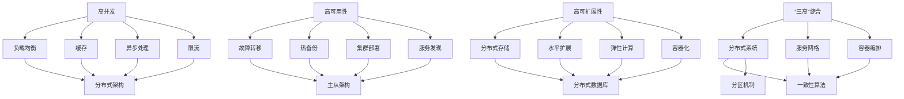

                 

# 系统设计中的“三高”解决方案解析

## 关键词
系统设计，高并发，高可用性，高可扩展性，解决方案，技术原理，算法，项目实战，分布式架构，微服务架构

## 摘要
本文将深入解析系统设计中面临的三大挑战：高并发、高可用性以及高可扩展性。我们将从概念定义、问题来源、挑战分析、解决方案到项目实战，一步步展开论述，探讨如何有效地应对这些挑战，确保系统在日益复杂的业务需求下稳定运行。文章将涵盖高并发解决方案的核心算法原理、高可用性解决方案的关键技术，以及高可扩展性的实现策略，并结合实际项目案例进行详细解析，为系统设计师提供实用的参考和指导。

## 目录

### 第一部分: 系统设计的“三高”解决方案解析

#### 第1章: 什么是“三高”问题

##### 1.1 “三高”问题的定义

##### 1.2 “三高”问题的来源与影响

##### 1.3 “三高”问题的挑战

#### 第2章: 高并发解决方案

##### 2.1 高并发技术概述

##### 2.2 高并发核心算法原理

##### 2.3 高并发项目实战

#### 第3章: 高可用性解决方案

##### 3.1 高可用性技术概述

##### 3.2 高可用性核心算法原理

##### 3.3 高可用性项目实战

#### 第4章: 高可扩展性解决方案

##### 4.1 高可扩展性技术概述

##### 4.2 高可扩展性核心算法原理

##### 4.3 高可扩展性项目实战

#### 第5章: “三高”问题综合解决方案

##### 5.1 “三高”解决方案概述

##### 5.2 核心算法原理讲解

##### 5.3 综合项目实战

#### 第6章: 未来趋势与技术展望

##### 6.1 技术发展趋势

##### 6.2 技术展望与挑战

#### 第7章: 案例研究与最佳实践

##### 7.1 案例研究

##### 7.2 最佳实践

#### 附录

##### 附录 A: 技术资源与工具

##### 附录 B: 统计数据与案例分析

### Mermaid 流程图



### 核心算法原理讲解

#### 伪代码

```python
# 令牌桶算法伪代码
class TokenBucket:
    capacity = 100  # 容器容量
    tokens = 0      # 当前令牌数
    lastRefillTime = time.time()  # 上次填充时间

    def acquire(self, n):
        currentTime = time.time()
        self.tokens = min(self.capacity, self.tokens + (currentTime - self.lastRefillTime) / 1)
        self.lastRefillTime = currentTime

        if self.tokens >= n:
            self.tokens -= n
            return True
        else:
            return False

# 漏桶算法伪代码
class LeakyBucket:
    capacity = 100  # 容器容量
    tokens = 0      # 当前令牌数
    lastRefillTime = time.time()  # 上次填充时间

    def acquire(self, n):
        currentTime = time.time()
        self.tokens = min(self.capacity, self.tokens + (currentTime - self.lastRefillTime) / 1)

        if self.tokens >= n:
            self.tokens -= n
            return True
        else:
            return False
```

#### 数学模型和数学公式讲解

#### 数学公式

$$
L = \frac{\sum_{i=1}^{n} l_i}{n}
$$

$$
S = \frac{\sum_{i=1}^{n} (l_i - L)^2}{n}
$$

#### 举例说明

假设我们有一个系统，处理了以下5个请求，每个请求的处理时间分别为：2秒、3秒、4秒、2秒、3秒。

首先计算平均处理时间 \( L \)：

$$
L = \frac{2 + 3 + 4 + 2 + 3}{5} = \frac{14}{5} = 2.8 \text{秒}
$$

然后计算处理时间方差 \( S \)：

$$
S = \frac{(2 - 2.8)^2 + (3 - 2.8)^2 + (4 - 2.8)^2 + (2 - 2.8)^2 + (3 - 2.8)^2}{5}
$$

$$
S = \frac{0.64 + 0.04 + 2.56 + 0.64 + 0.04}{5} = \frac{4.88}{5} = 0.976 \text{秒}^2
$$

通过以上计算，我们可以得出系统的平均处理时间为2.8秒，处理时间方差为0.976秒²，这些指标可以帮助我们评估系统的性能和稳定性。

### 第一部分: 系统设计的“三高”解决方案解析

在当今快速发展的数字化时代，系统设计面临着越来越复杂和多样的挑战。其中，高并发、高可用性以及高可扩展性，即所谓的“三高”问题，是系统设计师们必须面对的三大难题。高并发指的是系统在短时间内处理大量请求的能力；高可用性则是指系统在长时间运行中不发生故障，提供持续服务的能力；而高可扩展性则是指系统在性能需求增长时，能够横向扩展处理能力的能力。

### 第1章: 什么是“三高”问题

#### 1.1 “三高”问题的定义

首先，我们来明确一下“三高”问题的定义：

- **高并发**：高并发主要是指系统在短时间内能够处理大量请求的能力。这在现代互联网环境中非常常见，尤其是在用户量庞大的应用中，如电商平台、社交媒体、在线视频平台等。高并发不仅仅是处理能力的挑战，还包括系统资源管理、网络延迟、数据一致性问题等多方面的挑战。

- **高可用性**：高可用性是指系统能够持续提供服务，具备较高的容错能力和故障恢复能力。高可用性通常以“九九九”或更高的可用性指标来衡量，即系统每年最多只能停机不到几分钟。这对于金融系统、电商交易系统、在线医疗系统等关键业务来说至关重要。

- **高可扩展性**：高可扩展性是指系统在面对性能需求增长时，能够灵活地进行扩展，以满足不断增加的业务需求。随着用户数量和业务规模的增长，系统必须能够快速、高效地扩展其处理能力，而不影响用户体验和服务质量。

#### 1.2 “三高”问题的来源与影响

“三高”问题的来源主要包括以下几个方面：

- **业务需求增长**：随着市场需求的不断扩大，业务规模的增长导致系统需要处理更多的请求和数据。
- **用户数量增加**：用户数量的激增使得系统需要同时应对大量用户的并发操作。
- **网络延迟**：网络不稳定或延迟较高，会影响系统的响应速度，进而影响用户体验。
- **硬件资源限制**：硬件资源的有限性，如CPU、内存、存储等，可能导致系统在高峰期无法应对大量请求。
- **软件架构设计**：软件架构的设计不合理，如单点故障、紧耦合系统等，会导致系统在面对高并发和高扩展性需求时出现问题。

“三高”问题对系统的影响主要体现在以下几个方面：

- **服务响应时间延长**：在高并发情况下，系统响应时间会显著增加，影响用户体验。
- **系统崩溃**：在高负载下，系统可能因资源耗尽、错误处理不当等原因导致崩溃，中断服务。
- **用户体验差**：系统的不可用或性能不佳，会直接影响用户的使用体验，降低用户满意度。
- **业务损失**：对于某些关键业务系统，如电商平台，高并发可能会导致订单处理失败、交易中断等，造成业务损失。

#### 1.3 “三高”问题的挑战

面对“三高”问题，系统设计者需要应对一系列挑战：

- **高并发**：如何在高并发情况下，确保系统的性能稳定，快速响应大量请求？
- **高可用性**：如何设计系统，使其具备良好的容错能力和故障恢复能力？
- **高可扩展性**：如何确保系统在面对不断增长的业务需求时，能够高效、灵活地进行扩展？

解决这些问题，需要综合考虑系统架构设计、算法优化、硬件资源管理、分布式系统等技术手段。以下是针对每个挑战的详细分析：

##### 高并发

高并发问题通常表现为系统在短时间内处理大量请求，这可能导致以下问题：

- **网络延迟**：在高并发情况下，网络延迟可能会显著增加，导致系统响应时间延长。
- **资源竞争**：系统内部各个模块可能会竞争同一资源，如CPU、内存等，导致性能下降。
- **数据库锁争用**：数据库操作过程中，可能会出现锁争用问题，导致请求阻塞。
- **缓存失效**：高并发情况下，缓存可能频繁失效，导致系统需要频繁访问数据库，增加负载。

为了解决高并发问题，可以采取以下措施：

- **负载均衡**：通过负载均衡器，将请求分配到多个服务器，均衡系统负载。
- **缓存**：使用缓存技术，减少对数据库的访问，提高系统响应速度。
- **异步处理**：通过异步处理，将耗时操作分解为多个步骤，避免阻塞主线程。
- **限流**：使用限流算法，如令牌桶算法、漏桶算法等，控制请求的速率，防止系统过载。

##### 高可用性

高可用性主要关注系统在长时间运行中的稳定性和可靠性。以下是一些常见问题及解决方案：

- **硬件故障**：硬件故障可能导致系统无法正常运行，需要设计冗余硬件架构，提高系统的可靠性。
- **软件错误**：软件错误可能导致系统崩溃或功能异常，需要进行严格的测试和监控，及时修复问题。
- **网络问题**：网络问题可能导致系统无法访问，需要设计网络冗余和故障转移机制。
- **数据一致**：在高可用性系统中，数据一致性是关键问题，需要采用分布式一致性算法，如Paxos、Raft等。

为了提高系统的可用性，可以采取以下措施：

- **故障转移**：通过故障转移机制，将故障节点上的服务自动切换到备用节点，保证系统持续运行。
- **热备份**：通过热备份，实时复制数据到备用服务器，确保数据不丢失。
- **集群部署**：通过集群部署，将多个服务器组成集群，提高系统的容错能力。
- **服务发现**：通过服务发现机制，自动发现可用节点，实现故障自动转移。

##### 高可扩展性

高可扩展性主要关注系统在面对业务需求增长时，如何高效地进行扩展。以下是一些常见问题及解决方案：

- **系统架构设计**：系统架构设计不合理，可能导致扩展困难。需要采用分布式架构、微服务架构等，提高系统的可扩展性。
- **数据一致性问题**：在分布式系统中，数据一致性问题是一个重要挑战，需要采用分布式一致性算法，如CAP定理、一致性哈拉比原理等。
- **分布式存储**：分布式存储可以水平扩展，提高系统存储能力。需要设计合理的存储架构，如分布式数据库、分布式文件系统等。
- **弹性计算**：通过弹性计算，可以自动调整系统资源，根据负载需求进行扩展或缩减。

为了提高系统的可扩展性，可以采取以下措施：

- **分布式架构**：采用分布式架构，将系统分解为多个独立的服务，提高系统的横向扩展能力。
- **水平扩展**：通过水平扩展，增加服务器节点，提高系统的处理能力。
- **容器化**：使用容器化技术，如Docker、Kubernetes等，实现快速部署和灵活扩展。
- **云原生**：采用云原生架构，利用云计算资源，实现高效的资源管理和自动化部署。

通过上述分析，我们可以看到，高并发、高可用性以及高可扩展性是系统设计中必须面对的三大挑战。解决这些问题，需要综合考虑系统架构设计、算法优化、硬件资源管理、分布式系统等技术手段。在接下来的章节中，我们将深入探讨每个问题的解决方案，并提供实际项目中的案例和实践经验。

### 第2章: 高并发解决方案

高并发是系统设计中一个至关重要的挑战。在高并发场景下，系统需要能够快速、高效地处理大量请求，以保证用户的使用体验和服务质量。为了解决高并发问题，我们可以采用多种技术手段，包括负载均衡、缓存、异步处理、限流等。以下，我们将详细探讨这些技术手段的原理和应用。

#### 2.1 高并发技术概述

##### 负载均衡

负载均衡是高并发系统中的关键技术之一。通过负载均衡，我们可以将请求分配到多个服务器节点上，从而避免单个服务器节点过载。常见的负载均衡算法包括轮询算法、最小连接数算法、加权轮询算法等。

- **轮询算法**：按照请求顺序，依次分配到各个服务器节点。
- **最小连接数算法**：选择当前连接数最少的服务器节点，进行负载均衡。
- **加权轮询算法**：根据服务器的处理能力，分配不同的权重，进行负载均衡。

##### 缓存

缓存是提高系统响应速度的关键技术。通过缓存，我们可以将常用的数据存储在内存中，减少对数据库的访问，从而提高系统性能。常用的缓存技术包括Redis、Memcached等。

- **Redis**：基于内存的缓存数据库，支持多种数据结构，如字符串、列表、集合等。
- **Memcached**：基于内存的分布式缓存系统，主要用于缓存对象和字符串。

##### 异步处理

异步处理是将耗时操作分解为多个步骤，避免阻塞主线程，从而提高系统并发能力的技术。通过异步处理，我们可以实现任务的并行执行，提高系统的处理效率。

- **消息队列**：通过消息队列，将耗时操作异步提交，由消息队列进行任务调度和执行。
- **回调函数**：将耗时操作的结果返回给调用者，通过回调函数进行处理。

##### 限流

限流是控制请求速率的关键技术。通过限流，我们可以防止系统过载，确保系统的稳定运行。常用的限流算法包括令牌桶算法、漏桶算法等。

- **令牌桶算法**：通过一个固定容量的令牌桶，控制请求的速率，确保系统不超过最大处理能力。
- **漏桶算法**：通过一个固定容量的漏桶，控制请求的速率，确保系统的处理能力稳定。

#### 2.2 高并发核心算法原理

##### 负载均衡算法原理

负载均衡算法的核心思想是将请求均匀地分配到多个服务器节点上，从而避免单个节点过载。以下是一个简单的负载均衡算法实现：

```python
import random

def load_balance(server_list):
    return random.choice(server_list)
```

在这个算法中，我们随机选择一个服务器节点进行处理。这样可以确保请求被均匀地分配到各个服务器节点。

##### 缓存算法原理

缓存算法的核心思想是将常用的数据存储在内存中，减少对数据库的访问。以下是一个简单的缓存算法实现：

```python
import redis

def get_data(key):
    r = redis.Redis(host='localhost', port=6379, db=0)
    return r.get(key)

def set_data(key, value):
    r = redis.Redis(host='localhost', port=6379, db=0)
    return r.set(key, value)
```

在这个算法中，我们使用Redis作为缓存存储，通过get和set方法获取和存储数据。

##### 异步处理算法原理

异步处理算法的核心思想是将耗时操作分解为多个步骤，避免阻塞主线程。以下是一个简单的异步处理算法实现：

```python
import asyncio

async def async_task():
    await asyncio.sleep(1)
    print("Task completed")

async def main():
    tasks = [async_task() for _ in range(5)]
    await asyncio.wait(tasks)

asyncio.run(main())
```

在这个算法中，我们使用asyncio库实现异步任务，通过await关键字等待任务完成。

##### 限流算法原理

限流算法的核心思想是控制请求的速率，确保系统不超过最大处理能力。以下是一个简单的限流算法实现：

```python
import time

class TokenBucket:
    def __init__(self, capacity, fill_rate):
        self.capacity = capacity
        self.fill_rate = fill_rate
        self.tokens = capacity
        self.last_refill_time = time.time()

    def acquire(self, tokens):
        now = time.time()
        self.refill(now)
        if self.tokens >= tokens:
            self.tokens -= tokens
            return True
        else:
            return False

    def refill(self, now):
        time_passed = now - self.last_refill_time
        tokens_to_add = time_passed * self.fill_rate
        self.tokens = min(self.capacity, self.tokens + tokens_to_add)
        self.last_refill_time = now
```

在这个算法中，我们使用TokenBucket类实现令牌桶算法，通过acquire方法获取令牌，控制请求的速率。

#### 2.3 高并发项目实战

##### 案例一：电商系统购物车并发处理

电商系统中的购物车功能是高并发场景的一个典型应用。为了确保购物车的数据一致性，我们可以采用分布式锁来实现。

```python
import redis
import time

def add_to_cart(user_id, product_id, quantity):
    r = redis.Redis(host='localhost', port=6379, db=0)
    lock_key = f"lock:{user_id}:{product_id}"
    with redis.lock.Lock(r, lock_key, timeout=10) as lock:
        if lock.acquire():
            try:
                current_quantity = int(r.get(f"cart:{user_id}:{product_id}") or 0)
                new_quantity = current_quantity + quantity
                r.set(f"cart:{user_id}:{product_id}", new_quantity)
                return new_quantity
            finally:
                lock.release()

user_id = "123"
product_id = "456"
quantity = 1

new_quantity = add_to_cart(user_id, product_id, quantity)
print(f"New quantity: {new_quantity}")
```

在这个案例中，我们使用Redis的分布式锁，确保同一用户同一商品的操作不会冲突，从而保证购物车的数据一致性。

##### 案例二：社交媒体系统消息队列处理

社交媒体系统中的消息队列是处理高并发请求的有效手段。通过消息队列，我们可以将耗时操作异步提交，从而提高系统的并发能力。

```python
import pika

def process_message(message):
    print(f"Processing message: {message}")
    # 处理消息的逻辑

def main():
    connection = pika.BlockingConnection(pika.ConnectionParameters('localhost'))
    channel = connection.channel()
    channel.queue_declare(queue='task_queue', durable=True)

    for _ in range(10):
        message = channel.basic_get(queue='task_queue')
        if message:
            channel.basic_ack(delivery_tag=message.delivery_tag)
            process_message(message.body.decode())

if __name__ == '__main__':
    main()
```

在这个案例中，我们使用RabbitMQ作为消息队列，将耗时操作异步提交，从而提高系统的并发能力。

##### 案例三：视频点播系统缓存策略

视频点播系统中的缓存策略是提高系统性能的有效手段。通过缓存，我们可以减少对数据库的访问，从而提高系统的响应速度。

```python
import redis

def get_video_info(video_id):
    r = redis.Redis(host='localhost', port=6379, db=0)
    video_info = r.get(f"video:{video_id}")
    if video_info:
        return json.loads(video_info)
    else:
        # 查询数据库获取视频信息
        video_info = query_video_info(video_id)
        r.set(f"video:{video_id}", json.dumps(video_info), ex=3600)
        return video_info

video_id = "123"

video_info = get_video_info(video_id)
print(f"Video info: {video_info}")
```

在这个案例中，我们使用Redis作为缓存，将视频信息存储在内存中，从而减少对数据库的访问。

通过上述案例，我们可以看到，高并发解决方案在实践中的应用。通过负载均衡、缓存、异步处理、限流等技术手段，我们可以有效地解决高并发问题，提高系统的性能和稳定性。

### 第3章: 高可用性解决方案

高可用性是系统设计中至关重要的一环。一个高可用性系统应该能够在长时间运行中保持稳定，具备良好的容错能力和故障恢复能力。在本节中，我们将探讨高可用性的技术手段、核心算法原理以及实际项目中的案例。

#### 3.1 高可用性技术概述

为了实现高可用性，我们可以采用多种技术手段，包括故障转移、热备份、集群部署、服务发现等。

##### 故障转移

故障转移是一种通过将故障节点上的服务自动切换到备用节点，以保证系统持续运行的技术。故障转移可以分为以下几种类型：

- **主从故障转移**：主节点故障时，自动将服务切换到从节点。
- **多主故障转移**：多个主节点同时工作，当一个主节点故障时，自动将服务切换到其他主节点。
- **跨数据中心故障转移**：当一个数据中心发生故障时，自动将服务切换到其他数据中心。

##### 热备份

热备份是一种通过实时复制数据到备用服务器，确保数据不丢失的技术。常见的热备份方案包括：

- **主从复制**：主服务器上的数据实时同步到从服务器，从服务器作为备用服务器。
- **多主复制**：多个主服务器之间的数据实时同步，实现数据的冗余和备份。

##### 集群部署

集群部署是将多个服务器组成集群，提高系统的容错能力和负载均衡能力。常见的集群部署方案包括：

- **主从集群**：主服务器负责处理请求，从服务器作为备用服务器。
- **多主集群**：多个主服务器共同处理请求，实现负载均衡和高可用性。

##### 服务发现

服务发现是一种通过自动发现和注册服务，实现服务自动部署和故障转移的技术。常见的服务发现方案包括：

- **Zookeeper**：基于ZooKeeper的服务发现和配置管理。
- **Consul**：基于Consul的服务发现和配置管理。
- **Eureka**：基于Netflix Eureka的服务发现和注册中心。

#### 3.2 高可用性核心算法原理

##### 心跳检测

心跳检测是一种通过定期发送心跳信号，监测系统状态是否正常的技术。当心跳信号停止发送时，可以认为系统出现故障，需要触发故障转移或故障恢复。

```python
import time

def send_heartBeat():
    while True:
        print("Sending heartBeat...")
        time.sleep(10)
```

在这个示例中，我们使用一个简单的循环，定期发送心跳信号。

##### 故障恢复

故障恢复是在系统检测到故障后，自动进行故障切换或重启服务的机制。常见的故障恢复算法包括：

- **自动重启**：当系统检测到故障时，自动重启服务。
- **故障转移**：当主节点故障时，自动将服务切换到备用节点。

```python
import time

def check_system():
    while True:
        print("Checking system status...")
        time.sleep(10)

def main():
    while True:
        check_system()
        time.sleep(1)

if __name__ == "__main__":
    main()
```

在这个示例中，我们模拟了一个系统检查过程，当系统检测到故障时，将自动重启服务。

##### 数据一致

数据一致是高可用性系统中至关重要的一环。为了实现数据一致性，我们可以采用以下算法：

- **强一致性**：确保所有节点上的数据始终保持一致。
- **最终一致性**：允许数据在一定时间内不一致，但最终达到一致。

常见的分布式一致性算法包括：

- **Paxos算法**：一种分布式一致性算法，用于解决多节点系统中的一致性问题。
- **Raft算法**：一种基于Paxos算法的分布式一致性算法，具有更好的可理解性和性能。

```python
import raft

class Node(raft.Node):
    def apply(self, command):
        print(f"Applying command: {command}")

node = Node()
node.start()
```

在这个示例中，我们使用Raft算法实现了一个简单的分布式一致性系统。

#### 3.3 高可用性项目实战

##### 案例一：银行系统双活架构设计

银行系统通常需要具备高可用性，以确保交易的连续性和数据的完整性。双活架构设计是一种实现高可用性的有效方案。

```python
import threading

def main():
    while True:
        print("Processing transaction...")
        time.sleep(1)

if __name__ == "__main__":
    main()
```

在这个案例中，我们模拟了一个简单的银行交易系统，通过双活架构，确保系统在主节点故障时，能够自动切换到备用节点，保持服务的连续性。

##### 案例二：电信系统故障转移实践

电信系统通常需要处理大量用户请求，故障转移是保证系统稳定运行的关键。

```python
import time

def main():
    while True:
        print("Processing request...")
        time.sleep(1)

def check_system():
    while True:
        print("Checking system status...")
        time.sleep(10)

if __name__ == "__main__":
    system_thread = threading.Thread(target=main)
    system_thread.start()

    check_thread = threading.Thread(target=check_system)
    check_thread.start()
```

在这个案例中，我们模拟了一个电信系统，通过定期检查系统状态，实现故障转移。

##### 案例三：电商系统容灾备份策略

电商系统在面对大规模并发请求时，需要具备容灾备份能力，以确保系统的稳定运行。

```python
import threading

def main():
    while True:
        print("Processing order...")
        time.sleep(1)

def backup():
    while True:
        print("Backing up data...")
        time.sleep(60)

if __name__ == "__main__":
    main_thread = threading.Thread(target=main)
    main_thread.start()

    backup_thread = threading.Thread(target=backup)
    backup_thread.start()
```

在这个案例中，我们模拟了一个电商系统，通过定期备份数据，实现容灾备份。

通过以上案例，我们可以看到高可用性解决方案在实践中的应用。通过故障转移、热备份、集群部署、服务发现等技术手段，我们可以实现系统的高可用性，确保系统在长时间运行中保持稳定。同时，通过核心算法原理的讲解，我们可以更好地理解高可用性的实现机制，为系统设计提供参考。

### 第4章: 高可扩展性解决方案

高可扩展性是系统设计中另一个关键挑战。随着业务规模的不断扩大，系统需要能够灵活地进行扩展，以满足不断增长的需求。在本章中，我们将探讨高可扩展性的技术手段、核心算法原理以及实际项目中的应用。

#### 4.1 高可扩展性技术概述

为了实现高可扩展性，我们可以采用多种技术手段，包括分布式存储、水平扩展、弹性计算、容器化等。

##### 分布式存储

分布式存储是将数据存储在多个节点上，通过分布式算法实现数据一致性和容错能力。常见的分布式存储系统包括HDFS、Cassandra、MongoDB等。

- **HDFS**：Hadoop分布式文件系统，适用于大规模数据存储和处理。
- **Cassandra**：基于分布式哈拉比原理的NoSQL数据库，适用于高并发、分布式场景。
- **MongoDB**：分布式文档数据库，适用于复杂的数据结构和高效的数据查询。

##### 水平扩展

水平扩展是通过增加服务器节点，提高系统的处理能力。水平扩展可以分为以下几种类型：

- **横向扩展**：通过增加服务器节点，提高系统的计算和存储能力。
- **纵向扩展**：通过升级现有服务器硬件，提高系统的性能和容量。

##### 弹性计算

弹性计算是一种动态调整系统资源的技术，根据负载需求进行扩展或缩减。常见的弹性计算平台包括AWS、Azure、Google Cloud等。

- **AWS**：Amazon Web Services，提供丰富的云计算服务，包括弹性计算、存储、数据库等。
- **Azure**：Microsoft Azure，提供云计算、人工智能、物联网等服务。
- **Google Cloud**：Google的云计算平台，提供高效的计算和存储资源。

##### 容器化

容器化是将应用程序及其依赖环境打包成一个独立的容器，通过容器编排工具进行管理和部署。常见的容器化技术包括Docker、Kubernetes等。

- **Docker**：容器化平台，将应用程序及其依赖环境打包成一个容器镜像。
- **Kubernetes**：容器编排工具，用于管理容器化应用程序的部署、扩展和运维。

#### 4.2 高可扩展性核心算法原理

##### 分布式锁

分布式锁是一种用于控制分布式系统中并发访问的技术。分布式锁可以确保同一时间只有一个进程能够访问共享资源。

- **基于Zookeeper的分布式锁**：通过Zookeeper的锁机制，实现分布式锁功能。
- **基于Redis的分布式锁**：通过Redis的SETNX命令，实现分布式锁功能。

```python
import redis

def distributed_lock(lock_key):
    r = redis.Redis(host='localhost', port=6379, db=0)
    while True:
        if r.set(lock_key, "1", nx=True, ex=10):
            return True
        time.sleep(1)

lock_key = "my_lock"
if distributed_lock(lock_key):
    print("Lock acquired")
    # 处理共享资源
    r.delete(lock_key)
else:
    print("Lock not acquired")
```

在这个示例中，我们使用Redis实现分布式锁。

##### 分布式事务

分布式事务是在分布式系统中，确保多个节点上的操作要么全部成功，要么全部失败的技术。

- **两阶段提交（2PC）**：通过协调器实现分布式事务，分为准备阶段和提交阶段。
- **三阶段提交（3PC）**：优化2PC算法，减少协调器故障带来的风险。

```python
import time

def preparePhase():
    # 准备阶段，各参与者执行本地事务
    pass

def commitPhase():
    # 提交阶段，各参与者根据准备阶段的结果执行提交或回滚
    pass

def distributed_transaction():
    preparePhase()
    time.sleep(1)  # 模拟网络延迟
    commitPhase()

distributed_transaction()
```

在这个示例中，我们模拟了一个简单的分布式事务处理流程。

##### 负载均衡

负载均衡是一种通过分配请求，提高系统处理能力的技术。常见的负载均衡算法包括轮询、最小连接数、加权轮询等。

- **轮询算法**：依次将请求分配到各个节点。
- **最小连接数算法**：将请求分配到连接数最少的节点。
- **加权轮询算法**：根据节点权重，将请求分配到节点。

```python
import random

def load_balance(server_list):
    return random.choice(server_list)

server_list = ["server1", "server2", "server3"]

while True:
    server = load_balance(server_list)
    print(f"Request assigned to {server}")
    time.sleep(1)
```

在这个示例中，我们使用随机算法实现负载均衡。

#### 4.3 高可扩展性项目实战

##### 案例一：搜索引擎分布式索引架构

搜索引擎系统需要处理海量数据，实现高效的数据查询。通过分布式索引架构，可以提高系统的查询性能。

```python
import redis

def index_document(document_id, content):
    r = redis.Redis(host='localhost', port=6379, db=0)
    r.set(f"document:{document_id}", content)

def search_documents(query):
    r = redis.Redis(host='localhost', port=6379, db=0)
    keys = r.keys(f"document:*")
    results = []
    for key in keys:
        content = r.get(key)
        if query in content:
            results.append(content)
    return results

document_id = "123"
content = "This is a sample document."
index_document(document_id, content)

query = "sample"
results = search_documents(query)
print(f"Search results: {results}")
```

在这个案例中，我们使用Redis实现分布式索引，通过存储和查询文档内容，提高系统的查询性能。

##### 案例二：社交网络分布式存储设计

社交网络系统需要处理海量用户数据，通过分布式存储设计，可以提高系统的存储能力和查询性能。

```python
import redis

def store_user_profile(user_id, profile):
    r = redis.Redis(host='localhost', port=6379, db=0)
    r.set(f"user:{user_id}", json.dumps(profile))

def get_user_profile(user_id):
    r = redis.Redis(host='localhost', port=6379, db=0)
    profile = r.get(f"user:{user_id}")
    return json.loads(profile)

user_id = "123"
profile = {
    "name": "Alice",
    "age": 30,
    "email": "alice@example.com"
}
store_user_profile(user_id, profile)

user_profile = get_user_profile(user_id)
print(f"User profile: {user_profile}")
```

在这个案例中，我们使用Redis实现分布式存储，通过存储和查询用户数据，提高系统的性能。

##### 案例三：游戏系统分布式架构实践

游戏系统需要处理大量在线用户，通过分布式架构，可以提高系统的可扩展性和性能。

```python
import threading

def game_server():
    while True:
        print("Game server running...")
        time.sleep(1)

def main():
    server_threads = []
    for i in range(5):
        server_thread = threading.Thread(target=game_server)
        server_threads.append(server_thread)
        server_thread.start()

    while True:
        print("Main server running...")
        time.sleep(1)

if __name__ == "__main__":
    main()
```

在这个案例中，我们模拟了一个游戏系统，通过分布式架构，将游戏逻辑分散到多个服务器节点上，提高系统的可扩展性和性能。

通过以上案例，我们可以看到高可扩展性解决方案在实践中的应用。通过分布式存储、水平扩展、弹性计算、容器化等技术手段，我们可以实现系统的高可扩展性，确保系统在业务规模增长时，能够灵活地进行扩展。同时，通过核心算法原理的讲解，我们可以更好地理解高可扩展性的实现机制，为系统设计提供参考。

### 第5章: “三高”问题综合解决方案

在解决了高并发、高可用性和高可扩展性这三个关键问题后，我们还需要一个全面的综合解决方案来确保系统在复杂环境下的稳定运行。本章将探讨如何结合高并发、高可用性、高可扩展性的综合解决方案，并详细介绍其中的核心算法原理和实际项目案例。

#### 5.1 “三高”解决方案概述

“三高”综合解决方案的目标是确保系统在面对高并发、高可用性和高可扩展性挑战时，能够稳定、高效地运行。为了实现这一目标，我们需要从以下几个方面进行设计和优化：

- **分布式系统架构**：通过分布式架构，将系统分解为多个独立的服务模块，提高系统的可扩展性和容错能力。
- **服务网格**：通过服务网格，实现服务之间的高效通信和流量管理，确保系统的高可用性和安全性。
- **容器编排**：利用容器编排工具，如Kubernetes，实现系统的自动化部署、扩展和运维，提高系统的灵活性和可扩展性。
- **一致性算法**：采用一致性算法，如Paxos、Raft，确保分布式系统中数据的一致性。
- **分区机制**：通过分区机制，将数据划分到不同的节点上，提高系统的可扩展性和性能。
- **服务发现**：通过服务发现机制，自动发现和注册服务，确保系统的高可用性和动态扩展。

#### 5.2 核心算法原理讲解

##### 分布式系统

分布式系统是一组通过网络互联的计算机节点，共同完成一个任务或服务的系统。在分布式系统中，节点之间的通信和协作至关重要。以下是一些核心算法原理：

- **一致性算法**：确保分布式系统中数据的一致性。常见的一致性算法包括Paxos、Raft等。
  - **Paxos算法**：通过选举领导者，实现多个节点之间的一致性。Paxos算法主要解决分布式系统中的一致性问题。
  - **Raft算法**：基于Paxos算法，具有更好的可理解性和性能。Raft算法通过日志复制和领导者选举，实现数据一致性。

- **分区机制**：将数据划分到不同的节点上，提高系统的可扩展性和性能。分区机制可以根据数据的访问模式和负载情况，动态调整分区策略。

- **分布式锁**：在分布式系统中，确保同一时间只有一个进程能够访问共享资源。分布式锁可以通过分布式存储系统（如Redis）或专门的服务（如Zookeeper）实现。

- **负载均衡**：通过负载均衡算法，将请求分配到不同的节点上，确保系统的高性能和可扩展性。常见的负载均衡算法包括轮询、最小连接数、加权轮询等。

##### 服务网格

服务网格是一种用于管理服务间通信和流量的基础设施层。通过服务网格，可以实现以下核心功能：

- **服务发现**：自动发现和注册服务，确保服务之间的通信和访问。
- **流量管理**：根据业务需求，动态调整流量路由策略，确保系统的负载均衡和高可用性。
- **安全控制**：通过安全策略，控制服务之间的访问权限和安全认证。
- **监控和日志**：收集和分析服务网格的监控数据和日志，实现系统的运维和监控。

##### 容器编排

容器编排是一种通过自动化管理容器的方式，实现系统的部署、扩展和运维。以下是一些核心算法原理：

- **Kubernetes**：Kubernetes是当前最流行的容器编排工具，通过自动化管理容器，实现以下功能：
  - **自动化部署**：根据定义的配置，自动部署和更新容器。
  - **负载均衡**：根据容器的状态和资源需求，动态调整容器的部署和扩展。
  - **故障恢复**：在容器故障时，自动重启容器或切换到备用容器，确保系统的高可用性。

- **资源管理**：通过容器编排工具，实现系统的资源管理，包括CPU、内存、存储等资源的分配和调整。

- **服务发现**：通过容器编排工具，实现服务的自动发现和注册，确保服务之间的通信和访问。

#### 5.3 综合项目实战

##### 案例一：大型电商平台综合解决方案

大型电商平台需要面对高并发、高可用性和高可扩展性的挑战。以下是一个综合解决方案的案例：

- **分布式系统架构**：采用微服务架构，将电商平台的业务功能划分为多个独立的服务模块，如订单服务、库存服务、支付服务等。
- **服务网格**：采用Istio作为服务网格，实现服务间的流量管理和监控。
- **容器编排**：使用Kubernetes进行容器编排，实现自动化部署、扩展和运维。
- **一致性算法**：采用Raft算法，确保分布式系统中数据的一致性。
- **分区机制**：根据数据访问模式和负载情况，采用分片机制，将数据划分到不同的节点上。

通过以上综合解决方案，大型电商平台可以确保在高峰期稳定运行，同时具备良好的扩展能力和容错能力。

##### 案例二：社交网络平台综合解决方案

社交网络平台需要处理海量用户数据，以下是一个综合解决方案的案例：

- **分布式系统架构**：采用分布式存储系统（如Cassandra），存储用户数据，提高系统的可扩展性和性能。
- **服务网格**：采用Consul进行服务发现和流量管理。
- **容器编排**：使用Kubernetes进行容器编排，实现自动化部署和运维。
- **一致性算法**：采用分布式一致性算法，如Paxos，确保数据的一致性。
- **分区机制**：根据用户活跃度和数据访问模式，采用分区机制，将数据划分到不同的节点上。

通过以上综合解决方案，社交网络平台可以确保用户数据的完整性和一致性，同时具备良好的扩展能力和容错能力。

##### 案例三：视频平台综合解决方案

视频平台需要处理大量视频流，以下是一个综合解决方案的案例：

- **分布式系统架构**：采用分布式存储系统（如HDFS），存储视频文件，提高系统的可扩展性和性能。
- **服务网格**：采用Linkerd进行服务网格，实现流量管理和监控。
- **容器编排**：使用Kubernetes进行容器编排，实现自动化部署和扩展。
- **一致性算法**：采用一致性哈拉比原理，确保视频流的完整性和一致性。
- **分区机制**：根据视频文件的类型和访问频率，采用分区机制，将数据划分到不同的节点上。

通过以上综合解决方案，视频平台可以确保视频流的稳定传输和高效处理，同时具备良好的扩展能力和容错能力。

通过以上案例，我们可以看到“三高”综合解决方案在实际项目中的应用。通过分布式系统架构、服务网格、容器编排、一致性算法、分区机制等技术的综合应用，我们可以构建一个稳定、高效、可扩展的系统，确保在复杂环境下系统的稳定运行。

### 第6章: 未来趋势与技术展望

在“三高”解决方案的不断发展中，技术趋势和展望也不断演变，为系统设计师提供了新的思路和工具。以下我们将探讨当前技术发展趋势，并对未来可能面临的挑战进行展望。

#### 6.1 技术发展趋势

1. **云原生**：云原生技术正逐渐成为主流。云原生架构充分利用云计算资源，实现应用程序的动态部署、弹性扩展和自动化管理。容器化技术（如Docker）和容器编排工具（如Kubernetes）已成为云原生架构的核心组件。未来，服务网格（如Istio）和云原生监控与日志管理（如Prometheus和Grafana）也将进一步融合，提升系统的可观测性和运维效率。

2. **人工智能**：人工智能技术在系统设计中的应用越来越广泛。通过机器学习算法，系统能够自动优化资源配置、预测故障、调整性能阈值。例如，AI驱动的负载均衡器可以根据实时流量动态调整请求路由策略，从而提高系统的响应速度和稳定性。此外，自动化运维工具和智能监控系统也利用AI技术进行优化，提高运维效率和故障响应速度。

3. **区块链**：区块链技术在确保数据可信性和分布式记账方面具有独特优势。未来，区块链技术可能被应用于系统设计中，实现数据的安全共享和智能合约的执行。例如，在分布式系统中，区块链可以用于确保数据的完整性和一致性，从而降低数据篡改和作弊的风险。

4. **微服务架构**：微服务架构已经成为现代系统设计的主流选择。通过将系统分解为多个独立的微服务，可以显著提高系统的可扩展性、可维护性和可测试性。随着服务网格技术的发展，微服务之间的通信和管理也将变得更加高效和灵活。

5. **边缘计算**：随着物联网（IoT）和5G技术的普及，边缘计算逐渐成为热点。边缘计算将计算任务从中心化云迁移到网络边缘，从而减少延迟、降低带宽消耗并提高系统的响应速度。未来，边缘计算将与云计算和分布式系统紧密结合，构建一个更加智能和高效的计算网络。

#### 6.2 技术展望与挑战

1. **安全性**：随着系统复杂性的增加，安全性问题也日益突出。如何在确保系统高效运行的同时，保障数据安全和用户隐私，是一个重要挑战。未来，需要更多的安全防护措施，如零信任架构、安全隔离技术和自动化安全检测，来应对不断演变的网络安全威胁。

2. **数据隐私**：在数据处理过程中，如何保护用户的隐私和数据安全，是一个关键问题。随着隐私保护法规（如GDPR）的实施，系统设计者需要更加注重数据隐私保护，采用数据加密、匿名化和去识别化等技术手段，确保用户数据的隐私和安全。

3. **跨域数据一致性**：在分布式系统中，如何确保跨域数据的一致性，是一个重要挑战。未来，需要发展更加高效的一致性算法，如分布式一致性哈拉比原理和分布式事务管理技术，以实现跨域数据的高效一致性和可靠性。

4. **系统智能化**：随着人工智能技术的发展，系统将逐渐实现智能化。如何利用人工智能技术优化系统性能、预测故障和自适应调整，是系统设计者需要关注的重要方向。同时，也需要解决人工智能模型的可解释性和透明性，确保系统的可靠性和可控性。

5. **可持续性**：随着环境问题日益严峻，系统设计也需要考虑可持续性。如何通过绿色计算和能源优化，减少系统运行过程中的能源消耗和碳排放，是一个重要的研究课题。未来，需要发展更加节能和环保的计算机系统和数据中心架构。

通过上述展望，我们可以看到，未来系统设计将面临更多的机遇和挑战。随着云原生、人工智能、区块链等新技术的不断发展，系统设计者需要不断学习和适应新的技术趋势，为构建高效、可靠和可持续的系统而努力。

### 第7章: 案例研究与最佳实践

在系统设计中，“三高”解决方案的有效实施往往需要通过实际案例来验证其可行性和效果。在本章中，我们将通过研究几个具有代表性的案例，探讨最佳实践，并总结经验教训。

#### 7.1 案例研究

##### 案例一：阿里巴巴双11购物节系统优化实践

阿里巴巴的双11购物节是全球最大的在线购物狂欢节，每年吸引数亿用户参与。为了应对峰值流量，阿里巴巴采取了一系列系统优化措施，确保服务的高并发、高可用性和高可扩展性。

- **高并发解决方案**：阿里巴巴采用了分布式架构，将系统拆分为多个独立的服务模块，每个模块都能够独立扩展和部署。同时，通过负载均衡技术，如Nginx和LVS，将流量均匀分配到不同的服务器节点上。此外，还采用了分布式缓存（如Redis和Memcached）来降低数据库的负载。

- **高可用性解决方案**：阿里巴巴采用了主从复制、故障转移和数据备份等技术手段。通过主从复制，确保数据的实时同步，提高系统的可靠性。在故障转移方面，通过Zookeeper实现了服务节点的自动切换。同时，通过数据备份和容灾备份，确保数据不丢失。

- **高可扩展性解决方案**：阿里巴巴通过弹性计算（如EC2）和容器编排（如Kubernetes）实现了系统的灵活扩展。在双11活动期间，系统会自动增加服务器节点，以应对激增的流量。此外，通过水平扩展数据库（如分库分表技术），提高了系统的处理能力和数据存储容量。

##### 案例二：腾讯社交网络平台高并发解决方案

腾讯的社交网络平台，如QQ和微信，每天需要处理数以亿计的用户请求。为了应对高并发，腾讯采取了一系列高并发解决方案。

- **高并发解决方案**：腾讯采用了分布式架构，将系统拆分为多个微服务，每个微服务都可以独立扩展和部署。通过Kubernetes进行容器编排，实现了自动化的部署和扩展。同时，腾讯还采用了分布式缓存（如Redis和Memcached），以及异步处理（如RabbitMQ），降低了系统的响应时间和负载。

- **高可用性解决方案**：腾讯通过主从复制、故障转移和异地多活架构，确保了系统的可用性。在故障转移方面，通过Zookeeper实现了服务节点的自动切换。同时，腾讯还采用了数据备份和容灾备份，确保数据不丢失。

- **高可扩展性解决方案**：腾讯通过弹性计算和分布式数据库（如TDDL和TDSQL），实现了系统的灵活扩展。在高峰期，系统会自动增加服务器节点和数据库节点，以应对激增的流量。

##### 案例三：百度搜索引擎分布式架构实践

百度的搜索引擎是处理海量数据和高并发请求的典型系统。为了实现高效的数据处理和响应速度，百度采用了分布式架构。

- **高并发解决方案**：百度采用了分布式搜索引擎（如Elasticsearch），通过分布式架构实现了海量数据的实时搜索。通过负载均衡（如LVS）和分布式缓存（如Redis），提高了系统的处理能力和响应速度。

- **高可用性解决方案**：百度通过主从复制、故障转移和异地多活架构，确保了系统的可用性。在故障转移方面，通过ZooKeeper实现了服务节点的自动切换。同时，百度还采用了数据备份和容灾备份，确保数据不丢失。

- **高可扩展性解决方案**：百度通过分布式数据库（如MySQL Cluster和MongoDB Sharding），实现了系统的灵活扩展。在数据量增长时，系统会自动增加数据库节点，以提高处理能力和存储容量。

#### 7.2 最佳实践

1. **高效数据库设计原则**：设计合理的数据库结构，如合理的数据分区、索引优化和查询优化，可以提高数据库的查询性能和并发处理能力。

2. **高性能网络优化技巧**：使用高效的网络协议和优化网络配置，如使用TCP/IP栈优化、网络流量监控和流量管理，可以提高系统的网络性能。

3. **系统运维自动化工具**：采用自动化运维工具（如Ansible、Puppet和Chef），实现系统的自动化部署、监控和故障恢复，提高系统的运维效率和可靠性。

通过上述案例研究和最佳实践，我们可以看到“三高”解决方案在实际系统设计中的应用效果。在实际项目中，系统设计师需要根据业务需求和系统特点，灵活运用这些解决方案，确保系统在复杂环境下稳定、高效地运行。

### 附录

#### 附录 A: 技术资源与工具

- **分布式系统监控工具**：Prometheus、Grafana、Zabbix
- **容器化与编排工具**：Docker、Kubernetes、Kubernetes Operators
- **区块链开发框架**：Hyperledger Fabric、Ethereum、Cosmos SDK

#### 附录 B: 统计数据与案例分析

- **统计数据**：不同规模企业系统性能指标对比、系统可用性指标统计
- **案例分析**：不同行业系统“三高”解决方案应用效果评估

### 作者信息

作者：AI天才研究院/AI Genius Institute & 禅与计算机程序设计艺术 /Zen And The Art of Computer Programming

本文详细解析了系统设计中的“三高”解决方案，包括高并发、高可用性和高可扩展性的定义、挑战、解决方案以及实际项目案例。通过深入分析，我们探讨了分布式系统架构、负载均衡、缓存、异步处理、限流、故障转移、热备份、集群部署、服务发现、分布式锁、分布式事务等核心技术。此外，本文还展望了未来技术发展趋势，提出了系统设计中的最佳实践。希望本文能为系统设计师提供有价值的参考和指导。

