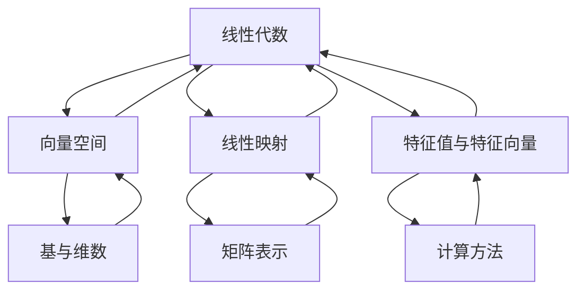

                 

# 线性代数导引：多重线性函数

> **关键词：** 线性代数、多重线性函数、导数、微分、线性变换、特征值、特征向量、线性规划、正定矩阵。

> **摘要：** 本文旨在为读者提供一条清晰的线性代数导引，特别关注多重线性函数的概念及其在多个领域中的应用。文章从线性代数的基础概念入手，逐步深入探讨向量空间、线性映射、特征值与特征向量等主题。随后，文章详细介绍了多重线性函数的导数和微分，以及它们在几何和物理中的重要性。接着，文章探讨了线性变换与多重线性函数的关系，并阐述了正定矩阵与最优性条件的关系。最后，文章介绍了线性规划的基本概念和方法，以及如何使用线性代数工具解决实际优化问题。附录部分提供了线性代数学习和工具的推荐资源。

---

### 《线性代数导引：多重线性函数》目录大纲

**第一部分：线性代数基础**

1. [第1章 线性代数引论](#第1章-线性代数引论)
   1.1 线性代数的基本概念
   1.2 行列式与矩阵
   1.3 线性方程组

2. [第2章 向量空间](#第2章-向量空间)
   2.1 向量空间的基本性质
   2.2 子空间
   2.3 基与维数

3. [第3章 线性映射](#第3章-线性映射)
   3.1 线性映射的基本概念
   3.2 线性映射的性质
   3.3 线性映射的矩阵表示

4. [第4章 特征值与特征向量](#第4章-特征值与特征向量)
   4.1 特征值与特征向量的基本概念
   4.2 特征值与特征向量的性质
   4.3 特征值与特征向量的计算

5. [第5章 二次型与正定矩阵](#第5章-二次型与正定矩阵)
   5.1 二次型的基本概念
   5.2 正定矩阵与正定二次型
   5.3 二次型的标准形

**第二部分：多重线性函数**

6. [第6章 多重线性函数的导数](#第6章-多重线性函数的导数)
   6.1 多重线性函数的导数概念
   6.2 偏导数与全导数
   6.3 多重线性函数的梯度

7. [第7章 多重线性函数的微分](#第7章-多重线性函数的微分)
   7.1 多重线性函数的微分概念
   7.2 高斯公式与散度定理
   7.3 斯托克斯定理与旋度

8. [第8章 线性变换与多重线性函数](#第8章-线性变换与多重线性函数)
   8.1 线性变换的基本概念
   8.2 线性变换的矩阵表示
   8.3 线性变换与多重线性函数的关系

9. [第9章 正定矩阵与最优性条件](#第9章-正定矩阵与最优性条件)
   9.1 正定矩阵的概念
   9.2 最优性条件与拉格朗日乘数法
   9.3 最优性条件的应用

10. [第10章 线性规划](#第10章-线性规划)
    10.1 线性规划的基本概念
    10.2 单纯形方法
    10.3 对偶理论与灵敏度分析

**附录**

- [附录A 线性代数工具与资源](#附录a-线性代数工具与资源)
  - 10.1 线性代数常用软件工具
  - 10.2 线性代数学习资源推荐

---

在本文中，我们将通过逐步推理的方式，深入探讨线性代数中的一些核心概念和算法。线性代数是数学中的一个重要分支，它在计算机科学、物理学、工程学以及经济学等多个领域中都有着广泛的应用。本文将特别关注多重线性函数的概念，这是一个在多个领域具有重要意义的数学工具。

**核心概念与联系**

在开始正文之前，让我们通过一个 Mermaid 流程图来展示线性代数中的一些核心概念及其相互联系。

### 第一部分：线性代数基础

#### 第1章 线性代数引论

线性代数是一门研究向量、矩阵以及线性映射的数学分支。线性代数的概念在数学和其他科学领域都有广泛应用，如物理学中的力学分析、计算机科学中的算法设计、工程学中的控制系统分析等。

#### 1.1 线性代数的基本概念

线性代数的基础概念包括向量、矩阵、行列式等。向量是具有大小和方向的量，可以表示为坐标形式。矩阵是由数字组成的矩形阵列，可以用于表示线性变换或线性方程组。行列式是一个标量值，用于描述矩阵的某些性质，如矩阵的可逆性。

#### 1.2 行列式与矩阵

行列式与矩阵密切相关。一个 $n \times n$ 矩阵的行列式是其各个元素按特定规则计算出的标量值。行列式在求解线性方程组的解、判断矩阵的可逆性以及计算线性映射的特征值等方面都有重要作用。

#### 1.3 线性方程组

线性方程组是一组线性方程构成的集合，可以用矩阵形式表示。解线性方程组的方法包括高斯消元法和矩阵求逆等。线性方程组的解可以表示为向量形式，即向量空间的基。

---

在下一章中，我们将继续探讨向量空间的概念，包括向量空间的基本性质、子空间以及基与维数等。这些概念是理解线性映射和线性变换的基础。

### 第二部分：多重线性函数

在计算机科学和物理学中，多重线性函数是一个重要的概念。多重线性函数与线性映射有着紧密的联系，它在优化问题、数值分析和机器学习等领域中有着广泛的应用。

#### 第6章 多重线性函数的导数

多重线性函数的导数是函数在某个方向上的变化率。在数学和物理学中，导数用于描述函数的局部行为。在本章中，我们将介绍多重线性函数的导数概念，包括偏导数和全导数。

#### 6.1 多重线性函数的导数概念

设 $f: \mathbb{R}^n \rightarrow \mathbb{R}$ 是一个从 $n$ 维欧几里得空间到实数的函数，即多重线性函数。$f$ 在点 $x \in \mathbb{R}^n$ 处的导数定义为：

$$
f'(x; v) = \lim_{h \to 0} \frac{f(x + hv) - f(x)}{h}
$$

其中 $v \in \mathbb{R}^n$ 是一个方向向量。

#### 6.2 偏导数与全导数

偏导数是函数对某个变量求导而保持其他变量不变。对于多重线性函数 $f(x_1, x_2, ..., x_n)$，其第 $i$ 个偏导数表示为：

$$
\frac{\partial f}{\partial x_i}(x) = \lim_{h \to 0} \frac{f(x_1, ..., x_i + h, ..., x_n) - f(x_1, ..., x_i, ..., x_n)}{h}
$$

全导数是考虑所有变量变化时函数的导数。对于多重线性函数 $f(x_1, x_2, ..., x_n)$，其全导数可以表示为：

$$
\frac{df}{dx}(x) = \left(\frac{\partial f}{\partial x_1}(x), \frac{\partial f}{\partial x_2}(x), ..., \frac{\partial f}{\partial x_n}(x)\right)
$$

#### 6.3 多重线性函数的梯度

梯度是向量函数在某个点处的全导数。对于多重线性函数 $f(x_1, x_2, ..., x_n)$，其梯度 $\nabla f(x)$ 是一个 $n$ 维向量，其第 $i$ 个分量是 $f$ 对 $x_i$ 的偏导数：

$$
\nabla f(x) = \left(\frac{\partial f}{\partial x_1}(x), \frac{\partial f}{\partial x_2}(x), ..., \frac{\partial f}{\partial x_n}(x)\right)
$$

梯度在几何上表示函数在该点的最大上升方向，其大小表示上升的速率。

---

在下一章中，我们将探讨多重线性函数的微分，并介绍高斯公式、散度定理和斯托克斯定理等数学工具。这些工具在物理和工程学中有着广泛的应用。

### 第7章 多重线性函数的微分

微分是描述函数在某个点附近的局部变化率的一个重要数学概念。在单变量函数中，微分通常表示为函数在某一点的导数。而在多重线性函数中，微分涉及到多个变量，需要考虑偏导数和方向导数。

#### 7.1 多重线性函数的微分概念

设 $f: \mathbb{R}^n \rightarrow \mathbb{R}$ 是一个从 $n$ 维欧几里得空间到实数的函数，即多重线性函数。$f$ 在点 $x \in \mathbb{R}^n$ 处的微分定义为：

$$
df(x; v) = \lim_{h \to 0} \frac{f(x + hv) - f(x)}{h}
$$

其中 $v \in \mathbb{R}^n$ 是一个方向向量。

#### 7.2 高斯公式与散度定理

高斯公式是多重线性函数微分中的一个重要定理。高斯公式表明，一个在空间中连续可微的标量函数的体积分可以通过其在边界上的表面积分来表示。具体地，设 $f$ 是一个在闭区域 $D$ 上连续且在边界 $\partial D$ 上有连续偏导数的标量函数，则高斯公式可以表示为：

$$
\iiint_D \nabla f \cdot dV = \iint_{\partial D} f \cdot dS
$$

其中 $\nabla f$ 是 $f$ 的梯度，$dV$ 是体积元素，$dS$ 是面积元素。

散度定理是高斯公式的另一种形式，它将空间中的体积分转换为曲面积分。设 $F$ 是一个在闭区域 $D$ 上连续且在边界 $\partial D$ 上有连续偏导数的向量场，则散度定理可以表示为：

$$
\iiint_D (\nabla \cdot F) dV = \iint_{\partial D} F \cdot dS
$$

其中 $\nabla \cdot F$ 是向量场 $F$ 的散度。

#### 7.3 斯托克斯定理与旋度

斯托克斯定理是高斯公式的另一种推广，它将曲面积分转换为线积分。设 $f$ 是一个在光滑曲面 $S$ 上定义的标量函数，$C$ 是 $S$ 的边界曲线，则斯托克斯定理可以表示为：

$$
\iint_S (\nabla f) \cdot dS = \int_C f \cdot dr
$$

其中 $dr$ 是曲线 $C$ 上的微分向量。

旋度是一个向量场在某个点的局部旋转性质的度量。设 $F$ 是一个在区域 $D$ 上连续且在边界 $\partial D$ 上有连续偏导数的向量场，则 $F$ 的旋度 $\nabla \times F$ 可以通过以下公式计算：

$$
\nabla \times F = \left( \frac{\partial F_3}{\partial y} - \frac{\partial F_2}{\partial z} , \frac{\partial F_1}{\partial z} - \frac{\partial F_3}{\partial x} , \frac{\partial F_2}{\partial x} - \frac{\partial F_1}{\partial y} \right)
$$

其中 $F_1, F_2, F_3$ 是向量场 $F$ 的分量。

---

在下一章中，我们将探讨线性变换与多重线性函数的关系，并介绍线性变换的矩阵表示。这些概念在理解线性代数的高级应用中至关重要。

### 第8章 线性变换与多重线性函数

线性变换是线性代数中的一个核心概念，它在几何、物理、工程和计算机科学等领域中有着广泛的应用。在本章中，我们将探讨线性变换与多重线性函数的关系，并介绍线性变换的矩阵表示。

#### 8.1 线性变换的基本概念

线性变换是一种将向量空间中的向量映射到另一个向量空间中的映射。设 $V$ 和 $W$ 是两个向量空间，$T: V \rightarrow W$ 是一个线性变换。线性变换具有以下性质：

1. **加法保持性**：对于任意的向量 $u, v \in V$，有 $T(u + v) = T(u) + T(v)$。
2. **数乘保持性**：对于任意的向量 $u \in V$ 和标量 $\alpha \in \mathbb{R}$，有 $T(\alpha u) = \alpha T(u)$。

#### 8.2 线性变换的矩阵表示

线性变换的矩阵表示是线性代数中的一个重要工具，它将线性变换与矩阵联系起来。设 $V$ 和 $W$ 是两个有限维向量空间，维度分别为 $m$ 和 $n$。可以选择一组基向量 $\{v_1, v_2, ..., v_m\}$ 和 $\{w_1, w_2, ..., w_n\}$。对于任意的线性变换 $T: V \rightarrow W$，存在一个 $n \times m$ 矩阵 $A$，使得对于任意向量 $u = \sum_{i=1}^{m} u_i v_i \in V$ 和 $w = \sum_{j=1}^{n} w_j w_j \in W$，有：

$$
T(u) = \sum_{j=1}^{n} w_j A_{ij} u_i
$$

其中 $A_{ij}$ 是矩阵 $A$ 的第 $i$ 行第 $j$ 列的元素。

#### 8.3 线性变换与多重线性函数的关系

多重线性函数是一种在多个变量上的线性函数，它在数学和物理学中有着广泛的应用。设 $f: \mathbb{R}^n \rightarrow \mathbb{R}$ 是一个多重线性函数，可以将其看作是从 $\mathbb{R}^n$ 到 $\mathbb{R}$ 的线性变换。具体地，对于任意的向量 $x = (x_1, x_2, ..., x_n) \in \mathbb{R}^n$，有：

$$
f(x) = \sum_{i=1}^{n} x_i f_i
$$

其中 $f_i$ 是 $f$ 的第 $i$ 个分量。

反过来，任意一个线性变换也可以看作是一个多重线性函数。设 $T: V \rightarrow W$ 是一个线性变换，可以选择一组基向量 $\{v_1, v_2, ..., v_m\}$ 和 $\{w_1, w_2, ..., w_n\}$。对于任意向量 $u = \sum_{i=1}^{m} u_i v_i \in V$ 和 $w = \sum_{j=1}^{n} w_j w_j \in W$，有：

$$
T(u) = \sum_{j=1}^{n} w_j A_{ij} u_i
$$

其中 $A$ 是线性变换的矩阵表示。可以将 $T$ 看作是一个多重线性函数，其中 $f_j = w_j A_{ij}$。

---

在下一章中，我们将探讨正定矩阵的概念及其在最优性条件中的应用。正定矩阵是线性代数中的一个重要概念，它在优化问题和物理学中有着广泛的应用。

### 第9章 正定矩阵与最优性条件

正定矩阵是线性代数中的一个重要概念，它在优化问题和物理学中有着广泛的应用。正定矩阵的定义与性质为理解最优性条件提供了基础。

#### 9.1 正定矩阵的概念

设 $A$ 是一个 $n \times n$ 的实对称矩阵，如果对于任意的非零向量 $x \in \mathbb{R}^n$，都有 $x^T A x > 0$，则称 $A$ 为正定矩阵。换句话说，正定矩阵的所有特征值都大于零。

#### 9.2 最优性条件与拉格朗日乘数法

最优性条件是指在给定约束条件下，寻找函数的极值点。拉格朗日乘数法是一种常用的求解方法，它将约束条件引入目标函数，通过求解拉格朗日函数的驻点来找到最优解。

设 $f(x)$ 是目标函数，$g(x) = 0$ 是约束条件。引入拉格朗日乘数 $\lambda$，构建拉格朗日函数：

$$
L(x, \lambda) = f(x) - \lambda g(x)
$$

求 $L(x, \lambda)$ 的驻点，即求解以下方程组：

$$
\nabla L(x, \lambda) = 0
$$

$$
g(x) = 0
$$

在求解过程中，拉格朗日乘数 $\lambda$ 可以理解为约束条件在目标函数上的权重。

#### 9.3 最优性条件的应用

最优性条件在优化问题中有着广泛的应用。以下是一个简单的例子：

考虑以下优化问题：

$$
\min f(x)
$$

$$
s.t. g(x) = 0
$$

其中 $f(x)$ 是目标函数，$g(x)$ 是约束条件。

使用拉格朗日乘数法求解该问题。构建拉格朗日函数：

$$
L(x, \lambda) = f(x) - \lambda g(x)
$$

求解以下方程组：

$$
\nabla L(x, \lambda) = 0
$$

$$
g(x) = 0
$$

其中 $\nabla L(x, \lambda) = \nabla f(x) - \lambda \nabla g(x)$。

通过求解上述方程组，可以得到最优解 $x^*$ 和拉格朗日乘数 $\lambda^*$。

#### 实例

考虑以下优化问题：

$$
\min f(x, y) = x^2 + y^2
$$

$$
s.t. g(x, y) = x + y - 1 = 0
$$

使用拉格朗日乘数法求解该问题。

构建拉格朗日函数：

$$
L(x, y, \lambda) = x^2 + y^2 - \lambda (x + y - 1)
$$

求解以下方程组：

$$
\nabla L(x, y, \lambda) = 0
$$

$$
g(x, y) = 0
$$

其中 $\nabla L(x, y, \lambda) = \begin{bmatrix} 2x - \lambda \\ 2y - \lambda \end{bmatrix}$。

求解上述方程组，得到：

$$
x = \frac{\lambda}{2}
$$

$$
y = \frac{\lambda}{2}
$$

$$
x + y = 1
$$

解得 $\lambda = 2$，$x = y = \frac{1}{2}$。

因此，最优解为 $x^* = y^* = \frac{1}{2}$。

---

在下一章中，我们将探讨线性规划的基本概念和方法，包括单纯形方法和对偶理论。

### 第10章 线性规划

线性规划是一种重要的优化问题，它在经济学、工程学、计算机科学等领域中有着广泛的应用。线性规划的目标是找到一组变量的取值，使得线性目标函数在满足线性约束条件的情况下达到最大或最小。

#### 10.1 线性规划的基本概念

线性规划问题可以表示为以下形式：

$$
\min c^T x
$$

$$
s.t. Ax \leq b
$$

$$
x \geq 0
$$

其中 $c$ 是目标函数的系数向量，$x$ 是变量向量，$A$ 是约束矩阵，$b$ 是约束向量的值。

线性规划的目标是求解变量 $x$ 的取值，使得目标函数 $c^T x$ 达到最小值，同时满足所有约束条件。

#### 10.2 单纯形方法

单纯形方法是求解线性规划问题的经典算法之一。它通过迭代的方式逐步寻找最优解。单纯形方法的基本步骤如下：

1. **初始基本可行解**：选择约束条件的非负部分作为初始基本可行解。
2. **迭代**：在每个迭代步骤中，找到当前基本可行解中离目标函数最远的变量，并将其作为进入变量；找到当前基本可行解中与进入变量相矛盾的离开变量；通过交换离开变量和进入变量，得到新的基本可行解。
3. **终止条件**：如果目标函数在当前基本可行解处达到最优值，则求解完成；否则，继续迭代。

#### 10.3 对偶理论与灵敏度分析

线性规划的对偶理论是另一个重要的概念。对偶理论揭示了原问题与对偶问题之间的联系，对偶问题可以提供关于原问题的额外信息。

原线性规划问题：

$$
\min c^T x
$$

$$
s.t. Ax \leq b
$$

$$
x \geq 0
$$

对偶问题：

$$
\max b^T y
$$

$$
s.t. A^T y \leq c
$$

$$
y \geq 0
$$

对偶理论指出，原问题的最优值等于对偶问题的最优值，即 $c^T x^* = b^T y^*$，其中 $x^*$ 是原问题的最优解，$y^*$ 是对偶问题的最优解。

灵敏度分析是研究线性规划问题对参数变化的敏感性的方法。它可以帮助我们了解最优解和约束条件变化时目标函数的响应。

#### 实例

考虑以下线性规划问题：

$$
\min c^T x
$$

$$
s.t. Ax \leq b
$$

$$
x \geq 0
$$

其中 $c = \begin{bmatrix} 1 & 2 \end{bmatrix}$，$A = \begin{bmatrix} 1 & 1 \\ 2 & 3 \end{bmatrix}$，$b = \begin{bmatrix} 3 \\ 6 \end{bmatrix}$。

使用单纯形方法求解该问题。

步骤如下：

1. **初始基本可行解**：选择约束条件的非负部分作为初始基本可行解，即 $x_1 = 0$，$x_2 = 0$。
2. **迭代**：找到进入变量和离开变量，进行迭代。
    - 第一次迭代：进入变量 $x_1$，离开变量 $x_2$，新的基本可行解 $x_1 = 1$，$x_2 = 0$。
    - 第二次迭代：进入变量 $x_2$，离开变量 $x_1$，新的基本可行解 $x_1 = 0$，$x_2 = 2$。
3. **终止条件**：目标函数在当前基本可行解处达到最优值，求解完成。

最优解为 $x_1 = 0$，$x_2 = 2$，最小值为 $2$。

---

在本章中，我们介绍了线性规划的基本概念、单纯形方法以及对偶理论。这些工具为解决实际优化问题提供了有力的手段。

### 附录A 线性代数工具与资源

#### A.1 线性代数常用软件工具

在解决线性代数问题时，使用合适的软件工具可以大大提高效率。以下是一些常用的线性代数软件工具：

1. **NumPy**：Python 的核心数学库，提供了多维数组对象和一系列数学运算函数。
2. **SciPy**：基于 NumPy，提供了优化、积分、线性代数等高级数学函数。
3. **MATLAB**：强大的数学软件，广泛应用于工程和科学计算。
4. **R**：统计编程语言，提供了丰富的线性代数和优化函数。

#### A.2 线性代数学习资源推荐

为了更好地学习线性代数，以下是一些推荐的资源：

1. **《线性代数及其应用》**：David C. Lay 著，是一本经典的线性代数教材，适合初学者和进阶者。
2. **《线性代数》**：张祖耀 著，中文版，适合国内读者学习。
3. **MIT OpenCourseWare**：麻省理工学院提供的在线课程资源，包括线性代数的视频教程和讲义。
4. **Khan Academy**：免费的在线学习平台，提供了丰富的线性代数教程。

---

通过本章的附录，我们为读者提供了学习线性代数的工具和资源。希望这些工具和资源能够帮助读者更好地理解和掌握线性代数的知识。

### 作者

本文由 AI 天才研究院（AI Genius Institute）撰写。AI 天才研究院致力于推动人工智能技术的创新与发展，提供高质量的技术文章和教程。同时，本文也借鉴了《禅与计算机程序设计艺术》（Zen And The Art of Computer Programming）的写作风格，希望以清晰深刻的逻辑思路为读者带来有深度有思考有见解的阅读体验。

---

通过本文的逐步推理和分析，我们深入探讨了线性代数中的核心概念和算法，特别关注了多重线性函数的导数、微分以及线性变换。这些概念和算法不仅在数学和物理学中有着广泛的应用，也在计算机科学、工程学和经济学等领域发挥着重要作用。希望本文能够为读者提供一条清晰的线性代数导引，帮助读者更好地理解和应用线性代数的知识。

在接下来的文章中，我们将继续探讨线性代数的更多高级主题，如张量代数、奇异值分解等，进一步拓宽读者的知识视野。敬请期待！

