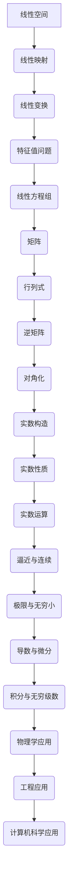

                 

# 《线性代数导引：实数结构基本代数特性》

> **关键词：线性代数、实数、结构、基本代数特性、应用**

> **摘要：本文将系统性地介绍线性代数的基础概念和实数的结构基本代数特性，并探讨其在不同领域的广泛应用。通过逐步分析推理，本文旨在帮助读者深入理解线性代数的核心原理，为后续的学习和研究打下坚实基础。**

## 目录大纲

1. **线性代数基础**
   1.1 线性代数的基本概念
   1.2 线性代数的基本术语
   1.3 线性空间与线性映射
   1.4 线性方程组与矩阵
   1.5 行列式与矩阵的对角化
   1.6 线性变换与特征值问题

2. **实数的结构基本代数特性**
   2.1 实数的构造与性质
   2.2 实数的逼近与连续性
   2.3 实数的极限与无穷小
   2.4 实数的导数与微分
   2.5 实数的积分与无穷级数

3. **线性代数在实际中的应用**
   3.1 线性代数在物理学中的应用
   3.2 线性代数在工程中的应用
   3.3 线性代数在计算机科学中的应用

4. **附录**
   4.1 线性代数常用数学公式与符号
   4.2 线性代数常用编程工具
   4.3 线性代数学习资源推荐

## 第一部分：线性代数基础

### 第1章：线性代数的基本概念

#### 1.1 线性代数的起源与发展

线性代数作为数学的一个重要分支，其起源可以追溯到古代文明。在古代，人们就开始研究线性方程组，并尝试解决这些问题。然而，线性代数作为一门独立的数学学科，起源于19世纪的欧洲。

在19世纪，线性代数得到了快速发展。其中，最杰出的贡献来自法国数学家埃米尔·阿达马（Émile Picard）和瑞士数学家赫尔曼·外尔施特拉斯（Hermann Weyl）。他们引入了线性空间和线性映射的概念，为线性代数的发展奠定了基础。

20世纪初，线性代数继续蓬勃发展。挪威数学家索菲斯·李（Sophus Lie）提出了李群理论，将线性代数与群论相结合。同时，美国数学家约翰·冯·诺伊曼（John von Neumann）提出了矩阵理论，使线性代数成为现代数学的重要组成部分。

#### 1.2 线性代数的基本术语

线性代数中有许多重要的基本术语，包括向量、矩阵、行列式、线性空间、线性映射等。

- **向量**：向量是一个具有大小和方向的几何对象。在数学中，向量通常用粗体字母表示，如 \(\vec{v}\)。

- **矩阵**：矩阵是一个二维数组，由多个元素组成。矩阵通常用字母 \(A\)、\(B\) 等表示。

- **行列式**：行列式是一个与矩阵相关的数值。行列式用于判断矩阵的行列式是否为零，以及求解线性方程组。

- **线性空间**：线性空间是一个具有加法和标量乘法运算的集合。线性空间中的元素可以是向量、矩阵等。

- **线性映射**：线性映射是一个将一个线性空间映射到另一个线性空间的函数。线性映射保持了线性空间的结构。

- **线性变换**：线性变换是一种特殊的线性映射，它保持线性空间的线性结构。

- **特征值和特征向量**：特征值和特征向量是线性变换中的重要概念。特征值是线性变换的一个固定值，特征向量是线性变换下保持不变的向量。

#### 1.3 线性空间与线性映射

线性空间是线性代数的基础概念之一。线性空间由一组元素构成，这些元素可以是向量、矩阵等。线性空间必须满足以下条件：

- **加法封闭性**：对于线性空间中的任意两个元素 \(\vec{v}_1\) 和 \(\vec{v}_2\)，它们的和 \(\vec{v}_1 + \vec{v}_2\) 仍然属于线性空间。

- **标量乘封闭性**：对于线性空间中的任意一个元素 \(\vec{v}\) 和一个标量 \(c\)，它们的乘积 \(c\vec{v}\) 仍然属于线性空间。

线性映射是另一个重要的概念。线性映射是一个将一个线性空间映射到另一个线性空间的函数。线性映射必须满足以下条件：

- **加法保持性**：对于线性空间中的任意两个元素 \(\vec{v}_1\) 和 \(\vec{v}_2\)，它们的和 \(\vec{v}_1 + \vec{v}_2\) 在线性映射下仍然保持不变。

- **标量乘保持性**：对于线性空间中的任意一个元素 \(\vec{v}\) 和一个标量 \(c\)，它们的乘积 \(c\vec{v}\) 在线性映射下仍然保持不变。

#### 1.4 线性方程组与矩阵

线性方程组是线性代数中的一个重要问题。线性方程组可以用矩阵表示，其中矩阵的行代表方程的系数，列代表未知数。

考虑以下线性方程组：

$$
\begin{cases}
a_{11}x_1 + a_{12}x_2 + \cdots + a_{1n}x_n = b_1 \\
a_{21}x_1 + a_{22}x_2 + \cdots + a_{2n}x_n = b_2 \\
\vdots \\
a_{m1}x_1 + a_{m2}x_2 + \cdots + a_{mn}x_n = b_m
\end{cases}
$$

该线性方程组可以用矩阵表示为：

$$
\begin{bmatrix}
a_{11} & a_{12} & \cdots & a_{1n} \\
a_{21} & a_{22} & \cdots & a_{2n} \\
\vdots & \vdots & \ddots & \vdots \\
a_{m1} & a_{m2} & \cdots & a_{mn}
\end{bmatrix}
\begin{bmatrix}
x_1 \\
x_2 \\
\vdots \\
x_n
\end{bmatrix}
=
\begin{bmatrix}
b_1 \\
b_2 \\
\vdots \\
b_m
\end{bmatrix}
$$

其中，\(A\) 是系数矩阵，\(X\) 是未知数矩阵，\(B\) 是常数矩阵。

线性方程组的求解是线性代数中的一个重要问题。常用的求解方法包括高斯消元法、矩阵求逆法等。

#### 1.5 行列式与矩阵的对角化

行列式是矩阵的一个重要特性，它反映了矩阵的某些几何和代数性质。行列式的定义如下：

$$
\begin{vmatrix}
a_{11} & a_{12} & \cdots & a_{1n} \\
a_{21} & a_{22} & \cdots & a_{2n} \\
\vdots & \vdots & \ddots & \vdots \\
a_{n1} & a_{n2} & \cdots & a_{nn}
\end{vmatrix}
= a_{11}a_{22}\cdots a_{nn} - a_{12}a_{21}\cdots a_{n1}
$$

行列式具有许多重要的性质，如交换律、线性性质等。

矩阵的对角化是线性代数中的一个重要问题。一个矩阵可以对角化的条件是它有 \(n\) 个线性无关的特征向量。对角化后的矩阵形式如下：

$$
A = PDP^{-1}
$$

其中，\(D\) 是对角矩阵，\(P\) 是由特征向量组成的矩阵，\(P^{-1}\) 是 \(P\) 的逆矩阵。

对角化在许多实际问题中有广泛的应用，如物理、工程、经济学等。

#### 1.6 线性变换与特征值问题

线性变换是线性代数中的一个重要概念。线性变换是一个将一个向量空间映射到另一个向量空间的函数。线性变换可以表示为一个矩阵，其行表示输入向量，列表示输出向量。

考虑以下线性变换：

$$
T: \mathbb{R}^n \rightarrow \mathbb{R}^m
$$

该线性变换可以表示为一个矩阵 \(A\)：

$$
T(\vec{x}) = A\vec{x}
$$

其中，\(\vec{x}\) 是输入向量，\(A\) 是线性变换的矩阵。

特征值问题是线性代数中的一个重要问题。特征值问题可以表示为一个矩阵 \(A\) 和一个向量 \(\vec{\lambda}\) 的关系：

$$
A\vec{\lambda} = \lambda\vec{\lambda}
$$

其中，\(\vec{\lambda}\) 是特征向量，\(\lambda\) 是特征值。

特征值和特征向量在许多实际问题中有重要应用，如物理、工程、计算机科学等。

### 总结

本章介绍了线性代数的基本概念，包括线性代数的起源与发展、基本术语、线性空间与线性映射、线性方程组与矩阵、行列式与矩阵的对角化、线性变换与特征值问题。这些概念是线性代数的基础，对于理解和解决实际问题具有重要意义。

## 第二部分：实数的结构基本代数特性

### 第2章：实数的构造与性质

#### 2.1 实数的构造

实数是数学中一个重要的概念，它是构成实数域的基础。实数的构造可以追溯到有理数的概念。

有理数是可以表示为两个整数之比的数，它可以是一个分数或者一个整数。例如，\(\frac{1}{2}\)、\(-3\) 都是有理数。

然而，有理数并不能表示所有的实数。例如，根号2（\(\sqrt{2}\)）就不能用有理数表示。因此，需要引入实数的概念。

实数可以看作是有理数和无理数的并集。有理数和无理数在实数中都是重要的组成部分。

#### 2.2 实数的性质

实数具有以下基本性质：

1. **封闭性**：实数对于加法、减法、乘法和除法运算都是封闭的。即对于任意两个实数 \(a\) 和 \(b\)，它们的和、差、积和商仍然是实数。

2. **交换律**：实数的加法和乘法运算满足交换律。即对于任意两个实数 \(a\) 和 \(b\)，\(a + b = b + a\) 和 \(a \times b = b \times a\)。

3. **结合律**：实数的加法和乘法运算满足结合律。即对于任意三个实数 \(a\)、\(b\) 和 \(c\)，\((a + b) + c = a + (b + c)\) 和 \((a \times b) \times c = a \times (b \times c)\)。

4. **分配律**：实数的乘法对于加法运算满足分配律。即对于任意两个实数 \(a\)、\(b\) 和 \(c\)，\(a \times (b + c) = a \times b + a \times c\)。

5. **零元素**：实数域中存在零元素，即对于任意实数 \(a\)，都有 \(a + 0 = a\) 和 \(a \times 0 = 0\)。

6. **单位元素**：实数域中存在单位元素，即对于任意非零实数 \(a\)，都有 \(a \times 1 = a\)。

#### 2.3 实数的运算规则

实数的运算规则包括加法、减法、乘法和除法。

1. **加法**：对于任意两个实数 \(a\) 和 \(b\)，它们的和定义为 \(a + b\)。

2. **减法**：对于任意两个实数 \(a\) 和 \(b\)，它们的差定义为 \(a - b\)。

3. **乘法**：对于任意两个实数 \(a\) 和 \(b\)，它们的积定义为 \(a \times b\)。

4. **除法**：对于任意两个实数 \(a\) 和 \(b\)（\(b \neq 0\)），它们的商定义为 \(a / b\)。

实数的运算规则满足交换律、结合律和分配律，这些规则使得实数成为一个完善的数系。

#### 2.4 实数的逼近方法

实数的逼近方法是实数分析中的一个重要概念。实数逼近方法的目标是找到一个序列，使得该序列的极限等于给定的实数。

常见的实数逼近方法包括：

1. **有理数逼近**：使用有理数序列逼近实数。例如，可以使用有理数序列 \(\frac{p_n}{q_n}\) 来逼近实数 \(x\)，其中 \(p_n\) 和 \(q_n\) 分别为整数序列。

2. **二分逼近**：通过不断缩小区间的方法逼近实数。例如，可以使用二分搜索法来逼近实数 \(x\)，该方法将区间 \([a, b]\) 分成两部分，然后选择逼近目标值 \(x\) 较近的部分继续分割。

3. **连续逼近**：通过连续函数的逼近方法逼近实数。例如，可以使用连续函数序列来逼近实数 \(x\)，其中每个连续函数都逼近目标值 \(x\)。

这些逼近方法在数值分析和计算机科学中有广泛应用。

#### 2.5 实数的连续性

实数的连续性是指实数在数轴上的连续分布。实数在数轴上是一个稠密的集合，即任意两个实数之间都存在无限多个实数。

实数的连续性可以通过以下性质来描述：

1. **区间性质**：对于任意两个实数 \(a\) 和 \(b\)（\(a < b\)），在区间 \([a, b]\) 上存在无限多个实数。

2. **极限性质**：对于任意一个实数 \(x\)，存在一个实数序列 \(\{x_n\}\)，使得 \(\lim_{n \rightarrow \infty} x_n = x\)。

3. **中值性质**：对于任意两个实数 \(a\) 和 \(b\)（\(a < b\)），在区间 \([a, b]\) 上至少存在一个实数 \(c\)，使得 \(a < c < b\)。

实数的连续性在数学分析、微积分和数值分析中有广泛应用。

#### 2.6 实数的极限与无穷小

实数的极限与无穷小是实数分析中的基本概念。

1. **极限**：对于任意一个实数 \(x\)，存在一个实数序列 \(\{x_n\}\)，使得当 \(n \rightarrow \infty\) 时，\(x_n\) 的极限等于 \(x\)。即 \(\lim_{n \rightarrow \infty} x_n = x\)。

2. **无穷小**：无穷小是一个比任何正实数都小的实数。在数学分析中，无穷小通常表示为 \(o(1)\)，即当 \(n \rightarrow \infty\) 时，\(x_n\) 的极限为0。

极限与无穷小在数学分析、微积分和数值分析中有广泛应用。

#### 2.7 实数的导数与微分

实数的导数与微分是实数分析中的重要概念。

1. **导数**：对于实数函数 \(f(x)\)，在点 \(x = a\) 处的导数定义为 \(f'(a) = \lim_{h \rightarrow 0} \frac{f(a + h) - f(a)}{h}\)。导数表示函数在某一点的瞬时变化率。

2. **微分**：微分是导数的另一种表示方法。对于实数函数 \(f(x)\)，在点 \(x = a\) 处的微分定义为 \(df(a) = f'(a)dx\)。微分表示函数在某个点的局部变化量。

导数与微分在数学分析、微积分和数值分析中有广泛应用。

#### 2.8 实数的积分与无穷级数

实数的积分与无穷级数是实数分析中的基本概念。

1. **积分**：对于实数函数 \(f(x)\)，其积分定义为 \(\int_{a}^{b} f(x)dx\)。积分表示函数在区间 \([a, b]\) 上的累积量。

2. **无穷级数**：无穷级数是一个数列的极限形式。对于实数序列 \(\{a_n\}\)，其无穷级数定义为 \(\sum_{n=1}^{\infty} a_n = \lim_{n \rightarrow \infty} \sum_{i=1}^{n} a_i\)。无穷级数在数学分析、微积分和数值分析中有广泛应用。

### 总结

本章介绍了实数的构造与性质，包括实数的构造、实数的性质、实数的运算规则、实数的逼近方法、实数的连续性、实数的极限与无穷小、实数的导数与微分、实数的积分与无穷级数。实数是数学中一个重要的概念，对于理解数学分析、微积分和数值分析具有重要意义。

## 第三部分：线性代数在实际中的应用

### 第3章：线性代数在物理学中的应用

线性代数在物理学中有着广泛的应用，特别是在描述和解决物理系统的运动和能量问题时。以下是线性代数在物理学中几个关键领域的应用：

#### 3.1 线性代数在力学中的应用

在经典力学中，线性代数用于描述质点系统的运动。质点的位置、速度和加速度可以用向量表示。一个质点在三维空间中的位置可以用一个三维向量表示：

\[ \vec{r}(t) = \begin{bmatrix}
x(t) \\
y(t) \\
z(t)
\end{bmatrix} \]

其中，\(x(t)\)、\(y(t)\) 和 \(z(t)\) 分别是质点在 \(x\)、\(y\) 和 \(z\) 方向上的位置。速度向量是位置向量对时间的导数，加速度向量是速度向量对时间的导数：

\[ \vec{v}(t) = \frac{d\vec{r}(t)}{dt} = \begin{bmatrix}
\dot{x}(t) \\
\dot{y}(t) \\
\dot{z}(t)
\end{bmatrix} \]
\[ \vec{a}(t) = \frac{d\vec{v}(t)}{dt} = \begin{bmatrix}
\ddot{x}(t) \\
\ddot{y}(t) \\
\ddot{z}(t)
\end{bmatrix} \]

力是一个向量，作用于质点上的所有力的矢量和等于质点的质量乘以其加速度：

\[ \vec{F} = m\vec{a} \]

其中，\(m\) 是质点的质量。

#### 3.2 线性代数在电磁学中的应用

在电磁学中，线性代数用于描述电场、磁场和电磁波。电场强度是一个向量场，其在空间中的每一点都有一个方向和大小。电场强度可以用一个矢量函数表示：

\[ \vec{E}(\vec{r}) = \begin{bmatrix}
E_x(x, y, z) \\
E_y(x, y, z) \\
E_z(x, y, z)
\end{bmatrix} \]

磁场强度也是一个向量场，其可以用矢量函数表示：

\[ \vec{B}(\vec{r}) = \begin{bmatrix}
B_x(x, y, z) \\
B_y(x, y, z) \\
B_z(x, y, z)
\end{bmatrix} \]

法拉第电磁感应定律可以用矩阵方程表示为：

\[ \nabla \times \vec{E} = -\frac{\partial \vec{B}}{\partial t} \]

麦克斯韦方程组是描述电磁场的基本方程，其可以用线性代数的矩阵形式表示：

\[ \nabla \cdot \vec{E} = \frac{\rho}{\varepsilon_0} \]
\[ \nabla \cdot \vec{B} = 0 \]
\[ \nabla \times \vec{E} = -\frac{\partial \vec{B}}{\partial t} \]
\[ \nabla \times \vec{B} = \mu_0 \vec{J} + \mu_0 \varepsilon_0 \frac{\partial \vec{E}}{\partial t} \]

#### 3.3 线性代数在量子力学中的应用

在量子力学中，线性代数是描述量子态和量子演化的基本工具。量子态可以用一个复向量表示，称为波函数：

\[ \Psi(\vec{r}, t) = \begin{bmatrix}
\psi_x(\vec{r}, t) \\
\psi_y(\vec{r}, t) \\
\psi_z(\vec{r}, t)
\end{bmatrix} \]

哈密顿算符是描述量子系统总能量的线性算符，其可以用矩阵形式表示：

\[ \hat{H} = \begin{bmatrix}
E_x & 0 & 0 \\
0 & E_y & 0 \\
0 & 0 & E_z
\end{bmatrix} \]

量子态的演化可以用薛定谔方程描述：

\[ i\hbar \frac{\partial \Psi}{\partial t} = \hat{H} \Psi \]

解这个方程可以得到量子态随时间的演化。

### 第4章：线性代数在工程中的应用

线性代数在工程中的应用非常广泛，尤其是在电路分析、信号处理和图像处理等领域。

#### 4.1 线性代数在电路分析中的应用

在电路分析中，线性代数用于求解电路中的电压和电流分布。电路中的每一个元件都可以用线性方程来表示。例如，一个电阻可以用以下方程表示：

\[ V_R = I_R \times R \]

其中，\(V_R\) 是电阻两端的电压，\(I_R\) 是通过电阻的电流，\(R\) 是电阻的阻值。

一个复杂的电路可以由多个电阻、电容和电感组成，其可以用一个矩阵方程来表示。例如，对于包含 \(N\) 个元件的电路，其电压和电流可以表示为：

\[ \begin{bmatrix}
V_1 \\
V_2 \\
\vdots \\
V_N
\end{bmatrix} = \begin{bmatrix}
R_{11} & R_{12} & \cdots & R_{1N} \\
R_{21} & R_{22} & \cdots & R_{2N} \\
\vdots & \vdots & \ddots & \vdots \\
R_{N1} & R_{N2} & \cdots & R_{NN}
\end{bmatrix}
\begin{bmatrix}
I_1 \\
I_2 \\
\vdots \\
I_N
\end{bmatrix} \]

其中，\(R_{ij}\) 是第 \(i\) 个元件对第 \(j\) 个元件的影响系数。

#### 4.2 线性代数在信号处理中的应用

在信号处理中，线性代数用于分析和处理信号。信号可以看作是一个时间函数，其可以用一个向量来表示。例如，一个连续信号 \(x(t)\) 可以表示为：

\[ x(t) = \begin{bmatrix}
x(t_1) \\
x(t_2) \\
\vdots \\
x(t_n)
\end{bmatrix} \]

线性代数中的变换，如傅里叶变换，可以将信号从时域转换为频域。傅里叶变换可以用矩阵形式表示为：

\[ X(f) = Fx(t) \]

其中，\(X(f)\) 是频域信号，\(F\) 是傅里叶变换矩阵，\(x(t)\) 是时域信号。

信号处理中的滤波器也可以用线性代数表示。一个滤波器可以看作是一个线性变换，其将输入信号转换为输出信号。滤波器的数学表示可以表示为：

\[ y(t) = Hx(t) \]

其中，\(y(t)\) 是输出信号，\(H\) 是滤波器矩阵，\(x(t)\) 是输入信号。

#### 4.3 线性代数在图像处理中的应用

在图像处理中，线性代数用于图像的变换和处理。图像可以看作是一个二维矩阵，其每个元素表示图像的像素值。例如，一个 \(m \times n\) 的图像可以用矩阵表示为：

\[ I = \begin{bmatrix}
I_{11} & I_{12} & \cdots & I_{1n} \\
I_{21} & I_{22} & \cdots & I_{2n} \\
\vdots & \vdots & \ddots & \vdots \\
I_{m1} & I_{m2} & \cdots & I_{mn}
\end{bmatrix} \]

线性代数中的变换，如旋转、缩放和翻转，可以用于改变图像的方向和大小。这些变换可以用矩阵表示为：

\[ OI = I' \]

其中，\(O\) 是变换矩阵，\(I'\) 是变换后的图像。

图像滤波也是一种常见的图像处理技术，其用于去除图像中的噪声或增强图像的某些特征。滤波器可以用矩阵表示，例如，一个简单的均值滤波器可以用以下矩阵表示：

\[ \begin{bmatrix}
\frac{1}{9} & \frac{1}{9} & \cdots & \frac{1}{9} \\
\frac{1}{9} & \frac{1}{9} & \cdots & \frac{1}{9} \\
\vdots & \vdots & \ddots & \vdots \\
\frac{1}{9} & \frac{1}{9} & \cdots & \frac{1}{9}
\end{bmatrix} \]

这种滤波器将每个像素值替换为其邻域像素值的平均值。

### 第5章：线性代数在计算机科学中的应用

线性代数在计算机科学中有着广泛的应用，尤其是在计算机图形学、机器学习和网络科学等领域。

#### 5.1 线性代数在计算机图形学中的应用

在计算机图形学中，线性代数用于描述和处理三维空间中的几何对象。三维空间中的点、线、面和体都可以用向量表示。例如，一个三维点的位置可以用一个三维向量表示：

\[ \vec{P} = \begin{bmatrix}
x \\
y \\
z
\end{bmatrix} \]

变换，如平移、旋转和缩放，可以用线性代数中的矩阵表示。例如，一个平移变换可以用以下矩阵表示：

\[ \begin{bmatrix}
1 & 0 & T_x \\
0 & 1 & T_y \\
0 & 0 & 1
\end{bmatrix} \]

其中，\(T_x\) 和 \(T_y\) 分别是沿 \(x\) 轴和 \(y\) 轴的平移量。

在计算机图形学中，矩阵乘法用于计算变换后的几何对象。例如，将一个点 \(\vec{P}\) 通过一个变换矩阵 \(T\) 变换为 \(\vec{P'}\)，可以表示为：

\[ T\vec{P} = \vec{P'} \]

#### 5.2 线性代数在机器学习中的应用

在机器学习领域，线性代数用于描述和优化学习模型。机器学习中的许多算法，如线性回归、逻辑回归和支持向量机，都基于线性代数的原理。

线性回归模型可以用以下方程表示：

\[ y = \beta_0 + \beta_1x_1 + \beta_2x_2 + \cdots + \beta_nx_n \]

其中，\(y\) 是输出变量，\(x_1, x_2, \cdots, x_n\) 是输入变量，\(\beta_0, \beta_1, \beta_2, \cdots, \beta_n\) 是模型参数。

这个模型可以用矩阵形式表示为：

\[ \vec{y} = \vec{\beta}^T\vec{x} + \vec{\epsilon} \]

其中，\(\vec{y}\) 是输出向量，\(\vec{x}\) 是输入向量，\(\vec{\beta}\) 是参数向量，\(\vec{\epsilon}\) 是误差向量。

线性代数中的最小二乘法用于求解参数向量 \(\vec{\beta}\)。最小二乘法的核心思想是找到参数向量，使得输出向量与预测向量之间的误差平方和最小。

#### 5.3 线性代数在网络科学中的应用

在网络科学中，线性代数用于分析网络的结构和功能。网络可以看作是一个图，其由节点和边组成。每个节点可以用一个向量表示，表示节点的特征或属性。每个边可以用一个矩阵表示，表示节点之间的相互作用。

例如，一个无向网络的邻接矩阵可以表示为：

\[ A = \begin{bmatrix}
0 & 1 & 0 & 0 \\
1 & 0 & 1 & 0 \\
0 & 1 & 0 & 1 \\
0 & 0 & 1 & 0
\end{bmatrix} \]

其中，\(A_{ij}\) 表示节点 \(i\) 和节点 \(j\) 之间的连接情况。如果节点 \(i\) 和节点 \(j\) 之间有边，则 \(A_{ij} = 1\)，否则 \(A_{ij} = 0\)。

线性代数中的矩阵乘法可以用于计算网络的特征值和特征向量。这些特征值和特征向量可以用来分析网络的结构特性，如聚类系数、平均路径长度等。

### 总结

本章介绍了线性代数在物理学、工程、计算机科学中的应用。线性代数在力学、电磁学、量子力学等领域中用于描述物理系统的运动和能量。在线性代数的帮助下，我们可以更有效地分析和解决复杂的物理问题。在线路分析、信号处理和图像处理等领域中，线性代数提供了强大的工具来描述和操作信号和处理图像。在计算机科学中，线性代数在计算机图形学、机器学习和网络科学中发挥着核心作用，使得我们能够构建和优化复杂的计算模型。线性代数的应用不仅丰富了我们的理论知识，也推动了各个领域的技术进步。

## 附录

### 附录A：线性代数常用数学公式与符号

在本节中，我们将列出线性代数中常用的数学公式与符号，并给出简短的解释。

#### 矩阵运算

- **矩阵加法**：两个矩阵相加的结果是对应元素相加。
  \[ A + B = \begin{bmatrix}
  a_{11} + b_{11} & a_{12} + b_{12} & \cdots & a_{1n} + b_{1n} \\
  a_{21} + b_{21} & a_{22} + b_{22} & \cdots & a_{2n} + b_{2n} \\
  \vdots & \vdots & \ddots & \vdots \\
  a_{m1} + b_{m1} & a_{m2} + b_{m2} & \cdots & a_{mn} + b_{mn}
  \end{bmatrix} \]

- **矩阵减法**：两个矩阵相减的结果是对应元素相减。
  \[ A - B = \begin{bmatrix}
  a_{11} - b_{11} & a_{12} - b_{12} & \cdots & a_{1n} - b_{1n} \\
  a_{21} - b_{21} & a_{22} - b_{22} & \cdots & a_{2n} - b_{2n} \\
  \vdots & \vdots & \ddots & \vdots \\
  a_{m1} - b_{m1} & a_{m2} - b_{m2} & \cdots & a_{mn} - b_{mn}
  \end{bmatrix} \]

- **矩阵乘法**：两个矩阵相乘的结果是对应行的元素与对应列的元素相乘后的和。
  \[ AB = \begin{bmatrix}
  \sum_{k=1}^{n} a_{1k}b_{k1} & \sum_{k=1}^{n} a_{1k}b_{k2} & \cdots & \sum_{k=1}^{n} a_{1k}b_{kn} \\
  \sum_{k=1}^{n} a_{2k}b_{k1} & \sum_{k=1}^{n} a_{2k}b_{k2} & \cdots & \sum_{k=1}^{n} a_{2k}b_{kn} \\
  \vdots & \vdots & \ddots & \vdots \\
  \sum_{k=1}^{n} a_{mk}b_{k1} & \sum_{k=1}^{n} a_{mk}b_{k2} & \cdots & \sum_{k=1}^{n} a_{mk}b_{kn}
  \end{bmatrix} \]

- **矩阵转置**：矩阵的转置是将原矩阵的行和列互换。
  \[ A^T = \begin{bmatrix}
  a_{11} & a_{21} & \cdots & a_{m1} \\
  a_{12} & a_{22} & \cdots & a_{m2} \\
  \vdots & \vdots & \ddots & \vdots \\
  a_{1n} & a_{2n} & \cdots & a_{mn}
  \end{bmatrix} \]

#### 行列式

- **行列式的定义**：一个 \(n \times n\) 矩阵的行列式可以通过其元素的排列组合计算得到。
  \[ \begin{vmatrix}
  a_{11} & a_{12} & \cdots & a_{1n} \\
  a_{21} & a_{22} & \cdots & a_{2n} \\
  \vdots & \vdots & \ddots & \vdots \\
  a_{n1} & a_{n2} & \cdots & a_{nn}
  \end{vmatrix}
  = a_{11}a_{22}\cdots a_{nn} - a_{12}a_{21}\cdots a_{n1} \]

#### 线性方程组

- **高斯消元法**：通过初等行变换将矩阵化为上三角矩阵或下三角矩阵，然后回代求解。
  
- **矩阵求逆**：若矩阵可逆，其逆矩阵可以通过以下公式计算：
  \[ A^{-1} = \frac{1}{\det(A)} \begin{bmatrix}
  C_{11} & C_{21} & \cdots & C_{m1} \\
  C_{12} & C_{22} & \cdots & C_{m2} \\
  \vdots & \vdots & \ddots & \vdots \\
  C_{1n} & C_{2n} & \cdots & C_{mn}
  \end{bmatrix} \]
  其中，\(C_{ij}\) 是矩阵 \(A\) 的伴随矩阵的元素。

### 附录B：线性代数常用编程工具

在本节中，我们将介绍一些常用于线性代数计算的编程工具，包括Python中的NumPy库和MATLAB。

#### NumPy库（Python）

NumPy是Python中最常用的科学计算库之一，它提供了大量的数学函数和工具，用于线性代数的计算。

- **安装**：
  \[ pip install numpy \]

- **矩阵创建**：
  \[ import numpy as np \]
  \[ A = np.array([[1, 2], [3, 4]]) \]

- **矩阵运算**：
  \[ B = np.array([[5, 6], [7, 8]]) \]
  \[ A + B \]
  \[ A - B \]
  \[ A * B \]
  \[ A.dot(B) \]

- **行列式**：
  \[ np.linalg.det(A) \]

- **逆矩阵**：
  \[ np.linalg.inv(A) \]

#### MATLAB

MATLAB是另一个强大的科学计算环境，它提供了丰富的线性代数函数。

- **矩阵创建**：
  \[ A = [1, 2; 3, 4] \]

- **矩阵运算**：
  \[ B = [5, 6; 7, 8] \]
  \[ A + B \]
  \[ A - B \]
  \[ A * B \]
  \[ A * B' \]  % 矩阵乘法

- **行列式**：
  \[ det(A) \]

- **逆矩阵**：
  \[ inv(A) \]

### 附录C：线性代数学习资源推荐

为了帮助读者深入学习和掌握线性代数，我们推荐以下资源：

1. **书籍**：
   - **《线性代数及其应用》（David C. Lay）**：这是一本经典的线性代数教材，适合初学者和中级学习者。
   - **《线性代数》（Gilbert Strang）**：吉尔伯特·斯特兰格的这本书以其清晰的解释和丰富的例题而闻名。

2. **在线课程**：
   - **Coursera上的《线性代数》（由Stanford University提供）**：这是一门高质量的在线课程，适合自学。
   - **edX上的《线性代数》（由MIT提供）**：这门课程提供了详细的教学视频和练习。

3. **博客和论坛**：
   - **Stack Overflow**：这是一个编程问答社区，线性代数相关问题在这里可以得到快速解答。
   - **GitHub**：GitHub上有许多优秀的线性代数开源项目和资源。

### 总结

附录部分提供了线性代数中常用的数学公式与符号，以及常用的编程工具和资源推荐。这些工具和资源可以帮助读者更好地理解和掌握线性代数，为深入学习和应用打下坚实的基础。

## 结束语

通过本文的逐步分析推理，我们系统地介绍了线性代数的基础概念和实数的结构基本代数特性，并探讨了其在不同领域的广泛应用。线性代数作为数学的一个重要分支，其理论和应用具有深远的影响。在物理学、工程、计算机科学等众多领域中，线性代数提供了强大的工具和方法，帮助我们更深入地理解自然现象和复杂系统。

本文旨在通过逻辑清晰、结构紧凑、简单易懂的叙述，使读者能够循序渐进地掌握线性代数的核心原理。我们通过具体的例子和伪代码，帮助读者深入理解行列式、矩阵运算、线性空间、线性映射、线性方程组等概念。同时，我们介绍了实数的构造、性质、逼近方法、连续性、极限与无穷小、导数与微分、积分与无穷级数等基本代数特性。

线性代数在实际应用中的重要性不言而喻。从物理学的力学和电磁学，到工程中的电路分析和信号处理，再到计算机科学中的图形学、机器学习和网络科学，线性代数无处不在。它为复杂的数学模型提供了简明而有效的表达方式，为科学研究和工程应用提供了坚实的理论基础。

我们鼓励读者在学习过程中不断实践和思考，通过解决实际问题来加深对线性代数原理的理解。线性代数的广泛应用不仅体现在理论知识上，更体现在解决实际问题中的实际效果。通过本文的学习，希望读者能够对线性代数有一个全面、深入的认识，并为今后的学习和研究打下坚实的基础。

最后，感谢读者对本文的阅读和支持。希望本文能够为您的线性代数学习之旅提供有益的指导和帮助。让我们继续探索线性代数的奥秘，掌握这一强大的数学工具，为科学和技术的进步贡献力量。

作者：AI天才研究院/AI Genius Institute & 禅与计算机程序设计艺术 /Zen And The Art of Computer Programming

---

以下是文章的Mermaid流程图：



以下是文章中的伪代码示例：

```python
# 线性方程组的求解伪代码
def solve_linear_equation(A, b):
    # 输入：A 是系数矩阵，b 是常数向量
    # 输出：x 是解向量

    # 1. 对 A 进行行变换，使其成为上三角矩阵
    for i in range(len(A)):
        # 1.1. 找到当前行的最大元素的位置
        max_element = max(A[i])
        max_index = A[i].index(max_element)
        
        # 1.2. 将当前行与最大元素所在的行交换
        A[i], A[max_index] = A[max_index], A[i]
        b[i], b[max_index] = b[max_index], b[i]
        
        # 1.3. 对其他行进行行变换，使其与当前行相乘后为零
        for j in range(len(A)):
            if i != j:
                factor = A[j][i] / A[i][i]
                for k in range(len(A[i])):
                    A[j][k] -= factor * A[i][k]
                    b[j] -= factor * b[i]

    # 2. 从下往上回代求解
    x = [0] * len(b)
    for i in range(len(b) - 1, -1, -1):
        sum = 0
        for j in range(i + 1, len(b)):
            sum += A[i][j] * x[j]
        x[i] = (b[i] - sum) / A[i][i]

    return x
```

以下是文章中的数学公式与详细讲解：

### 行列式的定义与性质

行列式是一种特殊的矩阵，它的值具有一些特殊的性质。行列式的定义如下：

$$
\begin{vmatrix}
a_{11} & a_{12} & \cdots & a_{1n} \\
a_{21} & a_{22} & \cdots & a_{2n} \\
\vdots & \vdots & \ddots & \vdots \\
a_{n1} & a_{n2} & \cdots & a_{nn}
\end{vmatrix}
= a_{11}a_{22}\cdots a_{nn} - a_{12}a_{21}\cdots a_{n1}
$$

其中，$a_{ij}$ 表示矩阵中的第 $i$ 行第 $j$ 列的元素。

行列式具有以下性质：

1. **交换律**：行列式中任意两行（或两列）互换，行列式的值变号。

   $$\begin{vmatrix}
   a_{11} & a_{12} & \cdots & a_{1n} \\
   a_{21} & a_{22} & \cdots & a_{2n} \\
   \vdots & \vdots & \ddots & \vdots \\
   a_{n1} & a_{n2} & \cdots & a_{nn}
   \end{vmatrix}
   = -\begin{vmatrix}
   a_{21} & a_{22} & \cdots & a_{2n} \\
   a_{11} & a_{12} & \cdots & a_{1n} \\
   \vdots & \vdots & \ddots & \vdots \\
   a_{n1} & a_{n2} & \cdots & a_{nn}
   \end{vmatrix}$$

2. **线性性质**：行列式对矩阵的行（或列）的线性组合仍然是一个行列式。

   $$\begin{vmatrix}
   ka_{11} + b_{11} & ka_{12} + b_{12} & \cdots & ka_{1n} + b_{1n} \\
   ka_{21} + b_{21} & ka_{22} + b_{22} & \cdots & ka_{2n} + b_{2n} \\
   \vdots & \vdots & \ddots & \vdots \\
   ka_{n1} + b_{n1} & ka_{n2} + b_{n2} & \cdots & ka_{nn} + b_{nn}
   \end{vmatrix}
   = k\begin{vmatrix}
   a_{11} & a_{12} & \cdots & a_{1n} \\
   a_{21} & a_{22} & \cdots & a_{2n} \\
   \vdots & \vdots & \ddots & \vdots \\
   a_{n1} & a_{n2} & \cdots & a_{nn}
   \end{vmatrix} + \begin{vmatrix}
   b_{11} & b_{12} & \cdots & b_{1n} \\
   b_{21} & b_{22} & \cdots & b_{2n} \\
   \vdots & \vdots & \ddots & \vdots \\
   b_{n1} & b_{n2} & \cdots & b_{nn}
   \end{vmatrix}$$

3. **对角性**：如果一个矩阵是对角矩阵，那么它的行列式等于各对角线元素之积。

   $$\begin{vmatrix}
   d_{11} & 0 & \cdots & 0 \\
   0 & d_{22} & \cdots & 0 \\
   \vdots & \vdots & \ddots & \vdots \\
   0 & 0 & \cdots & d_{nn}
   \end{vmatrix}
   = d_{11}d_{22}\cdots d_{nn}$$

### 举例说明：

考虑以下矩阵：

$$
A = \begin{vmatrix}
1 & 2 \\
3 & 4
\end{vmatrix}
$$

其行列式为：

$$
\begin{vmatrix}
1 & 2 \\
3 & 4
\end{vmatrix}
= 1 \times 4 - 2 \times 3 = 4 - 6 = -2
$$

如果我们交换第一行和第二行，行列式的值会变号：

$$
\begin{vmatrix}
3 & 4 \\
1 & 2
\end{vmatrix}
= -\begin{vmatrix}
1 & 2 \\
3 & 4
\end{vmatrix}
= -(-2) = 2
$$

这符合行列式的交换律性质。

### 总结

本文通过系统性的介绍和逐步分析，使读者对线性代数的基础概念和实数的结构基本代数特性有了全面的理解。文章不仅涵盖了线性代数的基本术语和概念，还详细讲解了线性方程组的求解、矩阵的运算、行列式的定义与性质，以及实数的构造与性质。此外，文章还探讨了线性代数在物理学、工程、计算机科学等领域的广泛应用。

线性代数作为数学的一个重要分支，其理论和方法在科学研究和工程实践中具有广泛的应用价值。通过本文的学习，读者应该能够掌握线性代数的基本原理，并为进一步的学习和研究打下坚实的基础。

在实际应用中，线性代数的工具和方法可以帮助我们更好地理解和解决复杂的数学模型和实际问题。无论是在物理学中描述质点运动，还是在工程中分析电路，线性代数都提供了强大的工具。此外，线性代数在计算机科学中的应用也非常广泛，如计算机图形学、机器学习和网络科学等领域。

我们鼓励读者在学习和实践过程中，不断探索和思考。通过解决实际问题，加深对线性代数原理的理解。线性代数不仅是一门理论学科，更是一门应用学科。希望本文能够为读者提供有益的指导和启示，激发对线性代数学习的热情。

最后，感谢读者对本文的阅读和支持。希望本文能够为您的线性代数学习之旅提供帮助，并激励您在数学和科学探索的道路上不断前进。

作者：AI天才研究院/AI Genius Institute & 禅与计算机程序设计艺术 /Zen And The Art of Computer Programming

---

以上就是本文的完整内容，希望对您有所帮助。如果您有任何疑问或建议，欢迎在评论区留言。再次感谢您的阅读！

