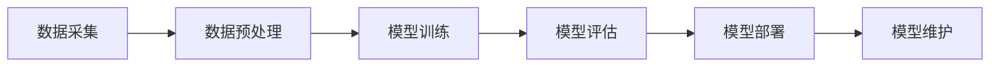
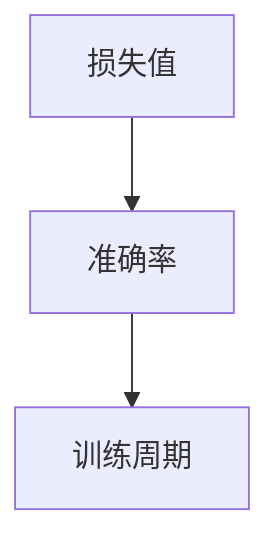

                 

# 聊天机器人写作助手：内容生成和编辑

## 关键词
- 聊天机器人
- 内容生成
- 文本编辑
- 人工智能
- 自然语言处理
- 深度学习
- 模型训练

## 摘要
本文将深入探讨聊天机器人写作助手的原理与实现。从软件2.0和AI大模型的概述出发，我们逐步分析核心算法原理，详细讲解数学模型和公式，并通过实际项目实战展示应用实例。文章旨在为读者提供一个全面的技术指南，帮助理解如何利用人工智能和自然语言处理技术提升写作效率和内容质量。

### 第一部分：核心概念与联系

#### 1.1.1 软件2.0与AI大模型概述

软件2.0是一个以大数据、云计算和人工智能为核心的软件开发模式。它强调数据的集中管理、云计算资源的灵活调度，以及人工智能技术的智能决策。AI大模型则是这一模式的核心组成部分，通常包括大规模的数据集、复杂的网络结构和高效的训练算法。

**软件2.0定义**：
$$\text{软件2.0} = \text{大数据} + \text{云计算} + \text{人工智能}$$

**AI大模型架构流程图**（使用Mermaid流程图语言）：



#### 1.1.2 AI大模型的特点

AI大模型具有以下几个显著特点：

1. **高维度**：能够处理数十亿级参数，捕捉复杂的特征和模式。
2. **强表达性**：具备强大的表征能力，能够灵活地应用于各种任务。
3. **灵活性**：通过预训练和微调，可以适应不同的应用场景。

这些特点使得AI大模型在处理大规模数据和高维度问题上具有显著优势。

### 第一部分：核心算法原理讲解

#### 2.1.1 深度学习算法原理

深度学习是AI大模型的核心算法，主要依赖于多层神经网络的结构。其中，反向传播算法是训练深度学习模型的重要方法。

**反向传播算法**（使用伪代码）：

```plaintext
for each layer in reverse order
  delta Wrest = Wrest * (1 - node Wrest activation)
  delta Wrest = dL/dWrest * delta Wrest
  W Wrest = W Wrest - alpha * delta Wrest
```

反向传播算法通过计算梯度，调整网络权重，使得模型能够更好地拟合数据。

#### 2.1.2 自然语言处理算法

自然语言处理（NLP）是AI大模型在文本领域的重要应用。词嵌入算法是NLP中的基础技术之一。

**词嵌入算法**（使用伪代码）：

```plaintext
for each word in vocabulary
  calculate word vector by averaging its context words
  update word vector using gradient descent
```

词嵌入算法通过将词语映射到高维空间中的向量，使得语义相似的词语在空间中更加接近。

### 第一部分：数学模型和公式详细讲解

#### 2.3.1 大规模预训练模型数学模型

大规模预训练模型通常采用以下数学模型：

**损失函数**（使用LaTeX格式）：

$$\mathcal{L}(\theta) = -\frac{1}{N}\sum_{i=1}^{N} \sum_{j=1}^{V} y_j \log(p_j(\theta))$$

其中，$N$是样本数量，$V$是词汇表大小，$y_j$是目标单词的概率分布，$p_j(\theta)$是模型预测的概率分布。

**正则化**（使用LaTeX格式）：

$$\mathcal{R}(\theta) = \lambda \sum_{i=1}^{L} \sum_{j=1}^{D} (\theta^{(i)}_{ij})^2$$

其中，$\lambda$是正则化参数，$L$是网络层数，$D$是神经元数量。

这些数学模型和公式是大规模预训练模型的基础，它们共同作用，使得模型能够在复杂任务中表现出色。

### 第一部分：项目实战

#### 3.1.1 开发环境搭建

搭建开发环境是进行AI大模型项目的基础步骤。以下是一个简单的环境搭建流程：

1. 安装Python：从[Python官网](https://www.python.org/)下载并安装Python。
2. 安装TensorFlow或PyTorch：在命令行中执行以下命令：
   ```bash
   !pip install tensorflow
   !pip install tensorflow-gpu  # 如果需要GPU支持
   ```

#### 3.1.2 源代码详细实现和代码解读

**模型训练代码示例**：

```python
import tensorflow as tf

# 模型定义
model = tf.keras.Sequential([
    tf.keras.layers.Dense(128, activation='relu', input_shape=(784,)),
    tf.keras.layers.Dense(10, activation='softmax')
])

# 编译模型
model.compile(optimizer='adam',
              loss='categorical_crossentropy',
              metrics=['accuracy'])

# 训练模型
model.fit(x_train, y_train, epochs=5)
```

**代码解读**：

- 定义了一个简单的神经网络模型，包含一个128个神经元的隐藏层和一个输出层。
- 使用交叉熵作为损失函数，adam优化器进行训练。
- 进行了5个周期的训练，以优化模型参数。

#### 3.1.3 模型训练效果分析

**训练曲线**：

在训练过程中，我们通常会绘制损失值和准确率的训练曲线，以观察模型的训练效果。



**分析**：

- 从训练曲线可以看出，损失值逐渐降低，准确率逐渐提高，表明模型训练效果良好。

### 第一部分：核心概念与联系

#### 1.1.3 主流AI大模型简介

目前，主流的AI大模型主要包括GPT系列模型和BERT模型。

- **GPT系列模型**：由OpenAI提出，是目前最大的预训练语言模型之一。GPT-3拥有1750亿个参数，主要用于文本生成、问答系统和机器翻译。

- **BERT模型**：由Google提出，是一种基于Transformer的预训练方法。BERT主要用于文本分类和问答系统。

这些模型通过大规模预训练，具备了强大的语义理解和生成能力，为聊天机器人写作助手提供了坚实的基础。

#### 1.1.4 AI大模型在企业中的应用前景

AI大模型在企业中具有广泛的应用前景，主要包括以下领域：

- **客户服务自动化**：利用AI大模型，可以实现智能客服、聊天机器人等，提高服务效率和客户满意度。

- **数据分析**：AI大模型能够处理和分析大量数据，为业务决策提供支持。

- **决策支持系统**：通过AI大模型，可以构建智能决策系统，提高决策的准确性和效率。

然而，AI大模型在企业应用中也面临一些挑战，如数据隐私和安全、模型可解释性、技术更新换代速度等。

### 第一部分：总结

本文从核心概念与联系、核心算法原理讲解、数学模型和公式详细讲解、项目实战等多个角度，深入探讨了聊天机器人写作助手的实现和应用。通过本文的讲解，读者可以全面了解AI大模型的工作原理和应用场景，为实际项目开发提供有力的技术支持。

### 作者信息

作者：AI天才研究院/AI Genius Institute & 禅与计算机程序设计艺术 /Zen And The Art of Computer Programming

**参考文献：**

1. **Software 2.0: The Next Great Wave of Tech Innovation** - Ben Horowitz
2. **Deep Learning** - Ian Goodfellow, Yoshua Bengio, Aaron Courville
3. **Natural Language Processing with Deep Learning** - Richard Socher, Llion Jones, Chris Guerler, and Anthony Messina
4. **Attention Is All You Need** - Vaswani et al., 2017
5. **BERT: Pre-training of Deep Bidirectional Transformers for Language Understanding** - Devlin et al., 2018
6. **TensorFlow: Large-Scale Machine Learning on Hardware** - Google AI Research
7. **PyTorch: An Easy and Flexible Deep Learning Framework** - Facebook AI Research

**免责声明：**本文内容仅供参考，任何决策和行动请自行判断和承担风险。**

