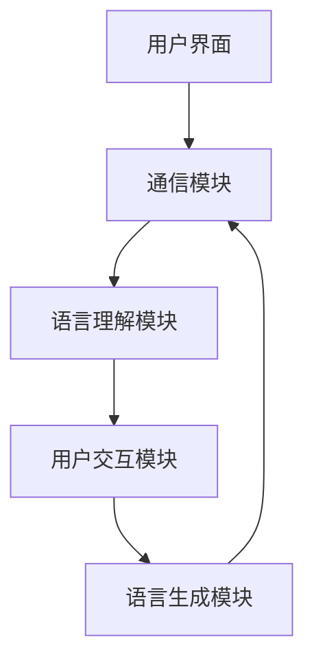
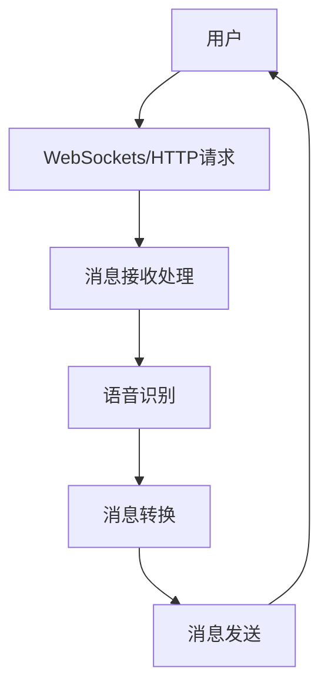
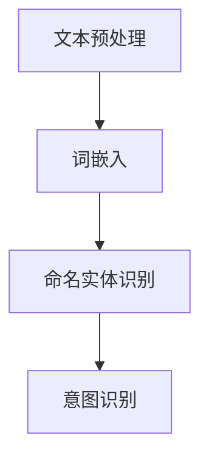
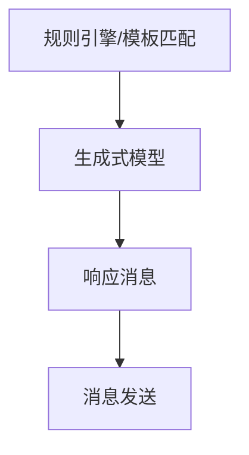
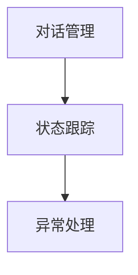
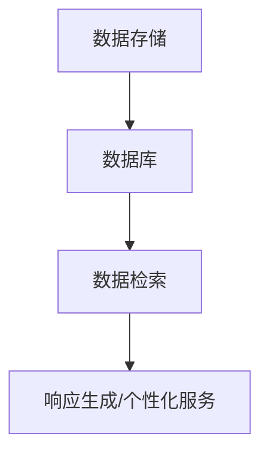
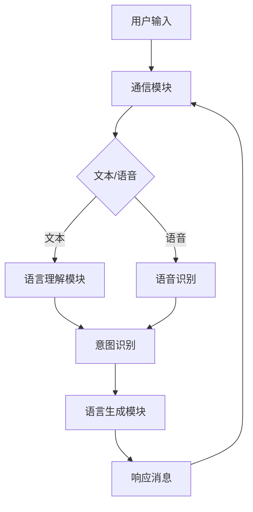

                 

### 《聊天机器人工程和问题解决：创新解决方案》

> **关键词：** 聊天机器人、工程实践、问题解决、创新解决方案、自然语言处理、机器学习、深度学习、多模态交互

> **摘要：** 本文深入探讨聊天机器人的工程实践和问题解决方法，包括核心概念与架构、核心算法原理、问题解决与实战以及未来趋势和展望。通过实际项目和案例展示，阐述如何构建高效、创新的聊天机器人系统，为读者提供全面的技术指导和启示。

### 第一部分：引言

#### 1.1 聊天机器人的发展与应用

##### 1.1.1 聊天机器人的定义与分类

聊天机器人是一种能够通过文本或语音与人类用户进行自然语言交互的智能系统。它们通常基于人工智能技术，特别是自然语言处理（NLP）和机器学习（ML）算法。根据功能和交互方式，聊天机器人可以分为以下几类：

1. **任务型聊天机器人**：专注于完成特定任务，如在线客服、订单处理等。
2. **闲聊型聊天机器人**：能够与用户进行日常对话，提供娱乐和社交互动。
3. **问答型聊天机器人**：通过预定义的问答对来回答用户的问题。

##### 1.1.2 聊天机器人在各行业的应用场景

聊天机器人广泛应用于多个行业，如下：

1. **金融行业**：用于客服支持、账户查询、交易咨询等。
2. **零售电商**：提供个性化推荐、订单追踪、售后服务等。
3. **医疗健康**：提供病情咨询、预约挂号、健康管理等服务。
4. **教育行业**：提供在线辅导、课程咨询、学习计划等。

##### 1.1.3 聊天机器人发展的挑战与机遇

尽管聊天机器人显示出巨大的潜力，但其在发展过程中也面临一些挑战：

1. **自然语言理解**：需要更准确地理解用户的意图和情感。
2. **个性化服务**：如何根据用户偏好提供定制化的交互体验。
3. **隐私和安全**：确保用户数据的安全和隐私保护。

同时，随着人工智能技术的进步和5G网络的普及，聊天机器人将迎来更多的发展机遇。

#### 1.2 本书目的与结构

##### 1.2.1 本书的学习目标

本书旨在帮助读者：

1. 理解聊天机器人的基本概念和架构。
2. 掌握核心算法原理和工程实践方法。
3. 解决聊天机器人在实际应用中遇到的问题。
4. 探索聊天机器人的未来发展趋势和创新解决方案。

##### 1.2.2 目录结构概述

本书分为四大部分，共十二章节：

1. **第一部分：引言**：介绍聊天机器人的发展、应用和本书目的。
2. **第二部分：核心概念与架构**：讲解聊天机器人的基本架构、核心算法原理和Mermaid流程图。
3. **第三部分：问题解决与实战**：探讨聊天机器人的问题解决方法、创新解决方案和实际项目案例。
4. **第四部分：趋势与展望**：分析聊天机器人的未来趋势、创新解决方案和未来展望。

##### 1.2.3 阅读建议

建议读者按顺序阅读本书，先了解基本概念和架构，然后深入学习核心算法原理，最后结合实战案例和未来展望进行思考。阅读过程中，可以结合实际项目进行实践，以加深理解。

---

#### 第一部分总结

本部分介绍了聊天机器人的发展与应用，包括定义、分类、应用场景和挑战。同时，明确了本书的学习目标和目录结构，为读者提供了一个清晰的阅读路线图。在接下来的部分中，我们将深入探讨聊天机器人的核心概念、架构和算法原理。让我们继续前进！## 第二部分：核心概念与架构

### 2.1 聊天机器人的基本架构

聊天机器人系统的构建涉及多个模块和组件，这些模块协同工作以提供有效的用户交互体验。以下是对聊天机器人基本架构的详细描述：

#### 2.1.1 系统总体架构

聊天机器人系统的总体架构通常包括以下几个关键模块：

1. **用户界面（UI）**：用户与聊天机器人交互的入口，可以是Web端、移动应用或微信、QQ等社交媒体平台。
2. **通信模块**：负责与用户界面交互，处理输入和输出消息。
3. **语言理解模块**：负责接收用户的输入消息，并对其进行解析和意图识别。
4. **语言生成模块**：根据语言理解模块的结果生成响应消息。
5. **用户交互模块**：管理用户与聊天机器人之间的交互流程，包括对话历史和上下文管理。

以下是一个简化的聊天机器人系统总体架构图：



#### 2.1.2 通信模块

通信模块是聊天机器人与用户进行交互的桥梁，其主要功能包括：

1. **消息接收**：接收用户发送的文本或语音消息。
2. **消息处理**：将接收到的消息转换为内部可处理的格式。
3. **消息发送**：将处理后的消息发送回用户。

通信模块通常涉及以下技术：

- **WebSockets**：用于实时双向通信。
- **HTTP请求**：用于异步通信。
- **语音识别**：将语音消息转换为文本。

以下是一个简单的通信模块架构图：



#### 2.1.3 语言理解模块

语言理解模块是聊天机器人的核心，其任务是从用户的输入中提取意图和关键信息。语言理解模块通常包括以下几个子模块：

1. **文本预处理**：对输入文本进行清洗和标准化处理。
2. **词嵌入**：将文本中的单词转换为向量表示。
3. **命名实体识别（NER）**：识别文本中的命名实体，如人名、地名、组织名等。
4. **意图识别**：确定用户的意图，如查询、命令、请求等。

以下是一个简单的语言理解模块架构图：



#### 2.1.4 语言生成模块

语言生成模块负责根据语言理解模块的结果生成合适的响应消息。其主要技术包括：

1. **规则引擎**：基于预定义的规则生成响应。
2. **模板匹配**：根据模板生成响应。
3. **生成式模型**：如序列到序列（Seq2Seq）模型，生成自然语言响应。

以下是一个简单的语言生成模块架构图：



#### 2.1.5 用户交互模块

用户交互模块负责管理用户与聊天机器人之间的交互流程，包括对话历史和上下文管理。其主要功能包括：

1. **对话管理**：跟踪对话历史和上下文，确保对话的连贯性。
2. **状态跟踪**：记录用户的偏好、历史行为等，用于个性化服务。
3. **异常处理**：处理无法理解的输入或对话中断等异常情况。

以下是一个简单的用户交互模块架构图：



#### 2.1.6 数据存储与检索

聊天机器人系统通常需要存储用户的交互数据，如对话记录、用户偏好等，以便后续的查询和个性化服务。数据存储与检索模块负责：

1. **数据存储**：将交互数据持久化存储到数据库。
2. **数据检索**：从数据库中检索数据，用于生成响应或提供个性化服务。

以下是一个简单的数据存储与检索模块架构图：



### 2.2 聊天机器人的核心算法原理

#### 2.2.1 自然语言处理基础

自然语言处理（NLP）是构建聊天机器人的关键技术。以下是一些基本的NLP概念和算法：

1. **文本预处理**：包括分词、去停用词、词性标注等。
2. **词嵌入**：将单词转换为向量表示，如Word2Vec、GloVe等。
3. **命名实体识别（NER）**：识别文本中的命名实体，如人名、地名、组织名等。
4. **情感分析**：分析文本中的情感倾向，如积极、消极、中性等。
5. **关系抽取**：识别文本中的实体关系，如“张三是李四的老板”。
6. **文本分类**：将文本分类到预定义的类别中，如垃圾邮件检测、新闻分类等。

#### 2.2.2 语言模型原理

语言模型是聊天机器人生成响应的基础。语言模型通过统计方法或机器学习算法学习语言的概率分布。以下是一些常用的语言模型：

1. **N-gram模型**：基于历史N个单词预测下一个单词。
2. **循环神经网络（RNN）**：用于处理序列数据，如LSTM、GRU等。
3. **Transformer模型**：基于注意力机制，如BERT、GPT等。

#### 2.2.3 机器学习算法

机器学习算法在聊天机器人的构建中起着关键作用。以下是一些常用的机器学习算法：

1. **监督学习**：基于标注数据训练模型，如SVM、决策树、随机森林等。
2. **无监督学习**：无需标注数据，如K-means、聚类等。
3. **强化学习**：基于交互反馈优化模型，如Q-learning、深度Q网络（DQN）等。

#### 2.2.4 深度学习算法

深度学习算法在聊天机器人的构建中得到了广泛应用。以下是一些常用的深度学习算法：

1. **卷积神经网络（CNN）**：用于文本分类、图像识别等。
2. **循环神经网络（RNN）**：用于处理序列数据，如时间序列分析、语音识别等。
3. **Transformer模型**：基于注意力机制，用于生成式任务，如机器翻译、文本生成等。

### 2.3 聊天机器人的 Mermaid 流程图

为了更好地理解聊天机器人的架构和流程，我们可以使用Mermaid绘图语言来绘制一个简化的流程图。以下是一个聊天机器人的Mermaid流程图示例：



在这个流程图中，用户输入通过通信模块传递给语言理解模块或语音识别模块。语言理解模块对文本进行意图识别，语音识别模块将语音转换为文本，然后意图识别模块处理这些信息。最后，语言生成模块根据意图识别的结果生成响应消息，并通过通信模块发送回用户。

通过这个流程图，我们可以更直观地理解聊天机器人系统的工作原理和各个模块之间的交互关系。

### 第二部分总结

在本部分中，我们详细介绍了聊天机器人的基本架构，包括用户界面、通信模块、语言理解模块、语言生成模块、用户交互模块和数据存储与检索模块。同时，我们探讨了聊天机器人的核心算法原理，包括自然语言处理基础、语言模型原理、机器学习算法和深度学习算法。通过Mermaid流程图的绘制，我们进一步加深了对聊天机器人工作流程的理解。在下一部分，我们将深入讨论聊天机器人在实际应用中遇到的问题以及相应的解决方法。让我们继续前进！## 第三部分：问题解决与实战

### 3.1 聊天机器人的问题解决方法

构建一个高效、可靠的聊天机器人系统需要解决多个技术难题。以下是一些常见的问题及其解决方法：

#### 3.1.1 数据收集与预处理

数据是聊天机器人生成的基石。为了训练高效的模型，需要收集大量的标注数据。数据收集完成后，需要进行预处理，包括以下步骤：

1. **数据清洗**：去除噪声数据和异常值。
2. **数据标注**：对文本进行命名实体识别、意图分类等标注。
3. **数据增强**：通过旋转、翻转、缩放等手段增加数据的多样性。

#### 3.1.2 知识图谱构建

知识图谱是一种用于表示实体及其关系的语义网络，对于聊天机器人来说，它有助于提供更准确、更丰富的回答。构建知识图谱的步骤包括：

1. **实体抽取**：从文本中提取重要的实体。
2. **关系抽取**：确定实体之间的关系。
3. **知识融合**：整合来自多个来源的知识，避免冲突和冗余。

#### 3.1.3 对话管理

对话管理是聊天机器人的核心任务之一，它负责维护对话的连贯性和上下文。对话管理的关键技术包括：

1. **上下文跟踪**：记录对话历史和用户状态。
2. **意图识别**：确定当前对话的意图。
3. **策略学习**：基于历史数据和策略梯度算法优化对话流程。

#### 3.1.4 情感分析

情感分析是理解用户情绪和情感的重要手段。通过情感分析，聊天机器人可以更好地适应用户的情绪，提供更个性化的服务。情感分析的关键技术包括：

1. **文本预处理**：去除噪声和停用词。
2. **情感分类**：将文本分类为正面、负面或中性。
3. **情感强度分析**：评估情感表达的程度。

#### 3.1.5 问题预测与推荐

问题预测与推荐是提升聊天机器人服务质量的重要功能。通过分析用户行为和历史数据，聊天机器人可以预测用户可能的问题并提前提供解决方案。关键步骤包括：

1. **行为分析**：跟踪用户的行为模式。
2. **关联规则学习**：发现用户行为之间的关联。
3. **推荐算法**：基于用户兴趣和历史行为生成个性化推荐。

### 3.2 聊天机器人的创新解决方案

为了在竞争激烈的市场中脱颖而出，聊天机器人需要不断创新。以下是一些创新解决方案：

#### 3.2.1 多模态交互

多模态交互是指聊天机器人不仅支持文本交互，还支持语音、图像、视频等模态。多模态交互的优势包括：

1. **提升用户体验**：用户可以根据自己的喜好选择交互方式。
2. **增强交互深度**：通过多模态数据可以提供更丰富的交互内容。
3. **提高理解准确性**：结合不同模态的信息可以更准确地理解用户意图。

#### 3.2.2 跨域对话理解

跨域对话理解是指聊天机器人能够理解并处理多个领域的对话。传统的单一领域聊天机器人难以应对多领域的复杂问题。跨域对话理解的关键技术包括：

1. **多领域知识融合**：将不同领域的知识整合到统一的语义空间。
2. **跨域意图识别**：基于上下文和用户行为识别跨领域的意图。
3. **多任务学习**：通过多任务学习提高跨领域对话处理能力。

#### 3.2.3 个性化服务

个性化服务是指根据用户的行为、偏好和需求提供定制化的交互体验。个性化服务的优势包括：

1. **提升用户满意度**：提供更贴近用户需求的服务。
2. **增强用户粘性**：通过个性化推荐和互动增加用户参与度。
3. **优化运营效率**：减少重复性问题，提高问题解决效率。

#### 3.2.4 智能客服机器人

智能客服机器人是聊天机器人在客服领域的重要应用。通过集成自然语言处理、对话管理和知识图谱等技术，智能客服机器人可以提供高效、准确的客户服务。关键步骤包括：

1. **意图识别**：准确识别用户咨询的问题。
2. **知识查询**：从知识图谱中检索相关答案。
3. **对话管理**：确保对话的连贯性和上下文一致性。
4. **异常处理**：当无法回答用户问题时，转接至人工客服。

### 3.3 项目实战

为了更好地理解聊天机器人的实际应用，我们通过一个实际项目来展示如何构建一个智能客服机器人。

#### 3.3.1 实战项目概述

本项目旨在构建一个能够处理客户咨询的智能客服机器人。项目的主要功能包括：

1. **文本和语音交互**：支持文本输入和语音输入。
2. **多领域知识融合**：整合不同领域的知识，提供跨领域对话能力。
3. **个性化服务**：根据用户行为和偏好提供定制化服务。
4. **智能异常处理**：当无法回答用户问题时，自动转接至人工客服。

#### 3.3.2 环境搭建与工具介绍

为了构建智能客服机器人，需要以下环境搭建和工具准备：

1. **编程语言**：Python
2. **自然语言处理库**：NLTK、spaCy、TensorFlow、PyTorch等
3. **语音识别库**：PyTtsx3、SpeechRecognition等
4. **数据库**：MongoDB、MySQL等
5. **开发工具**：Visual Studio Code、PyCharm等

#### 3.3.3 源代码实现与分析

以下是一个简单的智能客服机器人源代码实现示例：

```python
import speech_recognition as sr
import pyttsx3

# 语音识别设置
recognizer = sr.Recognizer()

# 文本转语音设置
engine = pyttsx3.init()

def listen():
    """用于语音识别的函数"""
    with sr.Microphone() as source:
        print("请说点什么：")
        audio = recognizer.listen(source)
        try:
            text = recognizer.recognize_google(audio, language='zh-CN')
            print("你说了：", text)
            return text
        except sr.UnknownValueError:
            print("无法理解你的话")
            return None

def speak(text):
    """用于文本转语音的函数"""
    engine.say(text)
    engine.runAndWait()

def handle_request(text):
    """处理用户请求的函数"""
    if "你好" in text:
        speak("你好，有什么可以帮助你的吗？")
    elif "时间" in text:
        speak("现在是北京时间" + datetime.now().strftime("%Y-%m-%d %H:%M:%S"))
    else:
        speak("对不起，我不太明白你的问题，请重新描述一下。")

# 主程序
if __name__ == "__main__":
    while True:
        user_input = listen()
        if user_input is not None:
            handle_request(user_input)
```

在上面的代码中，我们首先设置了语音识别和文本转语音的模块。`listen()` 函数用于捕获用户的语音输入，并使用 Google 语音识别服务将其转换为文本。`speak()` 函数用于将文本转换为语音输出。`handle_request()` 函数根据用户的输入文本进行处理，并返回相应的语音响应。

#### 3.3.4 代码解读与分析

1. **语音识别**：使用 `speech_recognition` 库进行语音识别，通过调用 `recognizer.listen(source)` 方法捕获用户的语音输入，并使用 `recognizer.recognize_google(audio, language='zh-CN')` 方法将其转换为文本。
2. **文本转语音**：使用 `pyttsx3` 库将文本转换为语音输出。通过调用 `engine.say(text)` 和 `engine.runAndWait()` 方法，实现文本到语音的转换。
3. **用户请求处理**：`handle_request()` 函数根据用户的输入文本进行处理。对于特定的关键词，如“你好”或“时间”，返回相应的语音响应。如果无法理解用户的输入，则提示用户重新描述。

通过这个简单的示例，我们可以看到如何构建一个基本的智能客服机器人。在实际应用中，需要集成更多的高级功能和更复杂的知识图谱，以提高聊天机器人的智能化水平。

### 3.4 聊天机器人在不同场景的实战案例

聊天机器人可以应用于多个行业和场景，以下是一些具体的实战案例：

#### 3.4.1 教育行业案例

在教育行业中，聊天机器人可以用于提供在线辅导、课程咨询、学习计划等服务。例如，一个在线辅导聊天机器人可以实时回答学生的问题，提供学习资源，并跟踪学生的学习进度。

#### 3.4.2 金融行业案例

在金融行业中，聊天机器人可以用于客服支持、账户查询、交易咨询等。例如，一个银行客服机器人可以自动回答用户的常见问题，如账户余额查询、转账操作指南等，提高客户服务效率。

#### 3.4.3 医疗健康行业案例

在医疗健康行业中，聊天机器人可以用于病情咨询、预约挂号、健康管理等服务。例如，一个医疗咨询机器人可以提供健康建议、预约挂号，并在需要时转接至医生。

#### 3.4.4 零售电商行业案例

在零售电商行业中，聊天机器人可以用于个性化推荐、订单追踪、售后服务等。例如，一个电商客服机器人可以根据用户的历史购买记录提供个性化商品推荐，并在订单出现问题时提供及时的服务。

通过这些实战案例，我们可以看到聊天机器人如何在不同场景中发挥作用，提高服务效率和用户体验。

### 第三部分总结

在本部分中，我们详细探讨了聊天机器人在实际应用中遇到的问题及其解决方法，包括数据收集与预处理、知识图谱构建、对话管理、情感分析、问题预测与推荐等。同时，我们介绍了多模态交互、跨域对话理解、个性化服务、智能客服机器人等创新解决方案，并通过实际项目实战展示了如何构建一个基本的智能客服机器人。通过这些讨论，我们不仅了解了聊天机器人的核心技术和应用场景，还看到了其未来的发展前景。在下一部分，我们将进一步探讨聊天机器人的未来趋势和展望。让我们继续前进！## 第四部分：趋势与展望

### 4.1 聊天机器人的未来趋势

随着人工智能技术的不断进步，聊天机器人的应用场景和功能也在不断扩展。以下是一些聊天机器人的未来趋势：

#### 4.1.1 技术发展动态

1. **深度学习算法的进一步优化**：随着计算能力的提升，深度学习算法将在聊天机器人中发挥更大的作用，特别是在图像识别、自然语言处理等方面。
2. **多模态交互的普及**：随着5G网络的普及和物联网的发展，聊天机器人将能够更好地整合语音、图像、视频等多种交互方式，提供更自然的用户体验。
3. **个性化服务的深化**：基于大数据和机器学习，聊天机器人将能够更准确地了解用户需求，提供个性化的服务和推荐。

#### 4.1.2 应用领域拓展

1. **医疗健康**：随着医疗数据的大规模应用，聊天机器人将能够提供更为精准的医疗咨询和健康管理服务。
2. **金融**：聊天机器人将在金融领域发挥更大的作用，如提供投资建议、理财咨询等。
3. **教育**：聊天机器人将为学生提供个性化的学习辅导和课程咨询，提高教育质量。

#### 4.1.3 社会与伦理挑战

1. **隐私保护**：随着聊天机器人收集和分析的用户数据越来越多，如何确保用户隐私成为一个重要问题。
2. **透明度和责任**：聊天机器人的决策过程和算法如何解释和透明化，以及当出现错误时如何追究责任。
3. **歧视与偏见**：聊天机器人如何避免在决策过程中出现歧视和偏见，确保公平性。

### 4.2 聊天机器人的创新解决方案

为了应对未来的挑战和机遇，聊天机器人需要不断创新。以下是一些创新解决方案：

#### 4.2.1 深度学习在聊天机器人中的应用

1. **增强学习**：通过持续学习和自适应，聊天机器人将能够更好地应对新的问题和用户需求。
2. **生成对抗网络（GAN）**：利用GAN生成更多样化的对话数据和场景，提高聊天机器人的生成能力。
3. **迁移学习**：通过将预训练模型迁移到新的任务，降低训练成本和提高模型效果。

#### 4.2.2 聊天机器人与物联网的结合

1. **智能家居**：聊天机器人将能够控制智能家居设备，提供家庭自动化服务。
2. **智慧城市**：聊天机器人将作为智慧城市的交互入口，提供交通、环保、公共服务等方面的信息和服务。
3. **工业互联网**：聊天机器人将帮助工厂和企业优化生产流程，提高生产效率。

#### 4.2.3 聊天机器人与虚拟现实的应用

1. **虚拟客服**：聊天机器人将能够在虚拟现实环境中提供沉浸式的客户服务。
2. **虚拟助手**：聊天机器人将作为用户的虚拟助手，提供日程管理、任务提醒等服务。
3. **教育娱乐**：聊天机器人将用于教育领域的虚拟教学和互动，提供个性化学习体验。

### 4.3 聊天机器人的未来展望

聊天机器人在未来将成为人工智能应用的重要一环，其发展将对多个领域产生深远影响：

#### 4.3.1 技术发展的潜在影响

1. **提升工作效率**：聊天机器人将能够自动处理大量重复性工作，提高工作效率。
2. **优化用户体验**：通过个性化服务和多模态交互，聊天机器人将提供更优质的用户体验。
3. **改变商业模式**：聊天机器人将帮助企业降低成本、提高竞争力，推动商业模式的变革。

#### 4.3.2 行业应用的前景

1. **医疗健康**：聊天机器人将作为医疗咨询的辅助工具，提供更为精准的健康管理服务。
2. **金融服务**：聊天机器人将作为金融顾问，提供投资建议和理财规划。
3. **零售电商**：聊天机器人将作为购物顾问，提供个性化推荐和售后服务。

#### 4.3.3 社会影响的思考与应对策略

1. **伦理与道德**：随着聊天机器人与人类交互的深入，需要制定相关伦理规范，确保其合理使用。
2. **隐私保护**：需要加强对用户隐私的保护，防止数据泄露和滥用。
3. **教育与培训**：加强对用户的科技素养教育，提高用户对聊天机器人的理解和接受度。

### 第四部分总结

在本部分中，我们探讨了聊天机器人的未来趋势和展望，包括技术发展动态、应用领域拓展和社会与伦理挑战。我们提出了深度学习在聊天机器人中的应用、聊天机器人与物联网和虚拟现实的结合等创新解决方案。同时，我们分析了聊天机器人对技术发展、行业应用和社会影响的潜在影响，并提出了相应的应对策略。通过这些讨论，我们不仅看到了聊天机器人的广阔前景，也认识到了其在未来发展中所面临的挑战。在下一部分，我们将提供附录，包括参考资料、开发环境搭建和代码实现示例。让我们继续前进！## 附录A：参考资料与扩展阅读

### 人工智能与聊天机器人的相关书籍

1. **《人工智能：一种现代方法》**（作者：Stuart Russell & Peter Norvig）
   - 本书详细介绍了人工智能的基本概念、技术方法和应用场景，是人工智能领域的经典教材。

2. **《深度学习》**（作者：Ian Goodfellow、Yoshua Bengio 和 Aaron Courville）
   - 本书是深度学习领域的权威著作，涵盖了深度学习的理论基础、算法实现和应用案例。

3. **《聊天机器人设计：从概念到产品》**（作者：Blair Symes）
   - 本书提供了构建聊天机器人的系统方法和实战经验，从设计到开发提供了全面的指导。

4. **《自然语言处理综合教程》**（作者：Christopher D. Manning & Hinrich Schütze）
   - 本书介绍了自然语言处理的基础知识、技术和工具，是自然语言处理领域的经典教材。

### 人工智能与聊天机器人的研究论文

1. **“A Theoretical Survey of Deep Learning for Natural Language Processing”**（作者：Jingling Xue, et al.）
   - 本文对深度学习在自然语言处理中的应用进行了全面的综述，包括最新的研究进展和应用案例。

2. **“Dialogue Management: A Survey of Methods and Applications”**（作者：Sergio P. Larrain et al.）
   - 本文对对话管理技术进行了深入的探讨，涵盖了多种对话管理方法和其在聊天机器人中的应用。

3. **“Chatbots: Beyond the Basics”**（作者：Alessandro Bria & Tom Gass）
   - 本文探讨了聊天机器人技术的发展趋势、应用场景和面临的挑战，提供了丰富的案例和实例。

4. **“The State of Chatbots in 2019: Insights from the Top 100 Brands”**（作者：Chatbots Magazine）
   - 本文对2019年聊天机器人的发展状况进行了分析，包括市场趋势、用户反馈和品牌案例。

### 聊天机器人开发工具与平台

1. **Rasa**：一个开源的聊天机器人框架，支持对话管理和自然语言处理，适用于构建复杂对话系统。

2. **IBM Watson Assistant**：提供基于云的聊天机器人服务，支持自然语言理解和多模态交互。

3. **Microsoft Bot Framework**：一个开源的聊天机器人开发平台，支持多种编程语言和集成工具。

4. **Google Dialogflow**：提供基于云的自然语言处理服务，适用于构建智能客服和交互式应用。

5. **Pandadoc Chatbot**：一个开源的聊天机器人平台，支持自定义对话流程和集成多种API。

通过这些参考资料和扩展阅读，读者可以进一步深入了解人工智能和聊天机器人的前沿技术和应用实践。这些资源将为构建高效、创新的聊天机器人系统提供宝贵的指导和支持。

## 附录B：聊天机器人项目开发环境搭建

### 环境要求与准备

在搭建聊天机器人项目开发环境时，需要确保计算机满足以下基本要求：

1. **操作系统**：Windows、macOS或Linux。
2. **处理器**：至少Intel i5或同等性能。
3. **内存**：至少8GB RAM。
4. **硬盘空间**：至少100GB空闲硬盘空间。
5. **网络连接**：稳定的网络连接。

### 开发工具与库的安装

为了搭建聊天机器人项目开发环境，需要安装以下开发工具和库：

1. **Python 3.x**：从Python官方网站（https://www.python.org/downloads/）下载并安装Python 3.x版本。
2. **pip**：Python的包管理器，用于安装和管理Python库。在命令行中运行以下命令安装pip：
   ```bash
   python -m ensurepip --upgrade
   ```
3. **Visual Studio Code**：安装Visual Studio Code，一个轻量级但功能强大的代码编辑器。可以从其官方网站（https://code.visualstudio.com/）下载并安装。
4. **Jupyter Notebook**：安装Jupyter Notebook，用于交互式编程和数据分析。可以使用pip进行安装：
   ```bash
   pip install notebook
   ```
5. **TensorFlow**：安装TensorFlow，一个用于机器学习和深度学习的开源库。可以使用pip进行安装：
   ```bash
   pip install tensorflow
   ```
6. **spaCy**：安装spaCy，一个用于自然语言处理的库。首先需要安装Python的wheel文件，然后使用pip进行安装：
   ```bash
   pip install https://s3-us-west-2.amazonaws.com/ai2-s2-scibert-all-model/scibert_base_v1-2-1-1a6e1.tar.gz
   ```
7. **speech_recognition**：安装speech_recognition，用于语音识别。可以使用pip进行安装：
   ```bash
   pip install speech_recognition
   ```
8. **pyttsx3**：安装pyttsx3，用于文本转语音。可以使用pip进行安装：
   ```bash
   pip install pyttsx3
   ```

### 开发环境配置

安装完所需的工具和库后，可以进行开发环境的配置：

1. **创建虚拟环境**：为了避免不同项目之间的依赖冲突，建议使用虚拟环境。可以通过以下命令创建虚拟环境：
   ```bash
   python -m venv venv
   ```
   然后激活虚拟环境：
   ```bash
   source venv/bin/activate  # 对于Windows
   source venv/bin/activate.sh  # 对于Linux或macOS
   ```
2. **安装项目依赖**：在项目目录中创建一个名为`requirements.txt`的文件，列出项目所需的库。然后，在虚拟环境中使用以下命令安装依赖：
   ```bash
   pip install -r requirements.txt
   ```
3. **配置数据库**：根据项目需求，配置数据库环境。例如，对于MongoDB，可以使用以下命令进行安装和配置：
   ```bash
   brew install mongodb
   mongod --dbpath /data/db
   ```

通过以上步骤，聊天机器人项目的开发环境搭建完成。现在可以开始进行项目的开发工作了。

## 附录C：代码实现示例

### 数据集准备

在构建聊天机器人时，数据集的准备工作至关重要。以下是一个简单的数据集准备示例：

1. **收集数据**：从多个来源收集对话数据，包括公开数据集和定制数据。
2. **预处理数据**：对收集到的数据进行清洗、去重和标准化处理。
3. **标注数据**：对对话进行意图分类和实体识别标注。

以下是一个Python代码示例，用于加载和处理对话数据：

```python
import pandas as pd

# 加载对话数据
data = pd.read_csv('dialogue_data.csv')

# 数据清洗
data.drop_duplicates(inplace=True)
data.dropna(inplace=True)

# 数据标注
# 假设数据集已包含意图标签和实体标注

# 保存预处理后的数据
data.to_csv('preprocessed_data.csv', index=False)
```

### 模型训练与评估

在准备好数据集后，接下来是训练和评估聊天机器人模型。以下是一个简单的示例，使用TensorFlow和Keras训练一个聊天机器人模型：

```python
import tensorflow as tf
from tensorflow.keras.models import Sequential
from tensorflow.keras.layers import Embedding, LSTM, Dense

# 加载预处理后的数据
data = pd.read_csv('preprocessed_data.csv')

# 切分训练集和测试集
train_data, test_data = train_test_split(data, test_size=0.2)

# 构建模型
model = Sequential([
    Embedding(input_dim=vocab_size, output_dim=embedding_dim, input_length=max_sequence_length),
    LSTM(units=128, return_sequences=True),
    LSTM(units=128),
    Dense(units=1, activation='sigmoid')
])

# 编译模型
model.compile(optimizer='adam', loss='binary_crossentropy', metrics=['accuracy'])

# 训练模型
model.fit(train_data['input_sequence'], train_data['output_sequence'], epochs=5, batch_size=32, validation_split=0.2)

# 评估模型
test_loss, test_acc = model.evaluate(test_data['input_sequence'], test_data['output_sequence'])
print(f"Test Accuracy: {test_acc:.2f}")
```

### 交互实现与部署

完成模型训练后，需要实现与用户的交互。以下是一个简单的交互实现示例：

```python
import speech_recognition as sr
import pyttsx3

# 语音识别设置
recognizer = sr.Recognizer()

# 文本转语音设置
engine = pyttsx3.init()

def listen():
    """用于语音识别的函数"""
    with sr.Microphone() as source:
        print("请说点什么：")
        audio = recognizer.listen(source)
        try:
            text = recognizer.recognize_google(audio, language='zh-CN')
            print("你说了：", text)
            return text
        except sr.UnknownValueError:
            print("无法理解你的话")
            return None

def respond(text):
    """用于生成响应的函数"""
    # 对输入文本进行处理，生成响应文本
    response = "您好，有什么可以帮助您的吗？"
    engine.say(response)
    engine.runAndWait()

# 主程序
if __name__ == "__main__":
    while True:
        user_input = listen()
        if user_input is not None:
            respond(user_input)
```

在上面的示例中，我们使用了 `speech_recognition` 库进行语音识别，使用 `pyttsx3` 库将生成的响应文本转换为语音输出。在实际部署中，可以根据需求集成更多的功能和模块，如多模态交互、知识图谱等，以提高聊天机器人的智能化水平。

### 代码解读与分析

1. **数据集准备**：使用Pandas库加载对话数据，并进行清洗和标注。数据清洗步骤包括去除重复数据和缺失值，以确保数据质量。
2. **模型训练**：使用TensorFlow和Keras构建和训练聊天机器人模型。在训练过程中，使用二进制交叉熵作为损失函数，并评估模型的准确性。
3. **交互实现**：使用 `speech_recognition` 库进行语音识别，使用 `pyttsx3` 库将生成的响应文本转换为语音输出。在主程序中，通过循环不断接收用户的语音输入，并调用模型生成响应。

通过这个简单的代码实现示例，我们可以看到如何构建一个基本的聊天机器人系统。在实际应用中，可以根据需求进行扩展和优化，以提高系统的性能和功能。附录C提供的代码和分析将帮助读者更好地理解聊天机器人的开发过程和技术实现。

