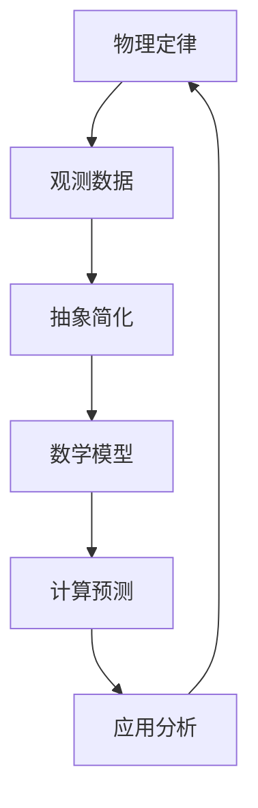

                 

### 自然环境物理模型的基本概念

自然环境物理模型是一种用于描述和预测自然界中物理现象的数学模型。它基于物理定律和实际观测数据，通过抽象和简化，形成可计算的模型。自然环境物理模型的核心目标是理解自然现象、预测未来趋势和指导实际应用。

**自然环境物理模型的核心概念包括：**

- **物理定律**：物理模型的基础是物理定律，如牛顿运动定律、热力学定律、电磁学定律等。这些定律描述了自然界中的基本物理过程和相互作用。

- **观测数据**：物理模型需要依赖于实际观测数据，这些数据来源于地面观测、卫星遥感、实验测量等。观测数据提供了模型参数的初始估计，并用于验证和校准模型。

- **抽象与简化**：自然环境复杂多样，物理模型通过抽象和简化，将复杂系统转化为可计算的形式。这种简化和抽象有助于提高模型的计算效率和可理解性。

- **数学模型**：物理模型通过数学方程和公式来描述自然现象。数学模型可以是定性的，也可以是定量的。定量模型使用数学方程精确描述现象，而定性模型则通过逻辑关系和示意图来描述现象。

- **计算预测**：物理模型能够进行计算和预测，通过输入初始条件和边界条件，模型可以输出物理量的分布和变化趋势。计算预测是物理模型的重要应用之一，可以帮助我们理解和预测自然现象。

- **应用分析**：物理模型在实际应用中具有重要的价值。例如，在地球科学中，地震波传播模型可以用于地震预测和地质勘探；在气象学中，气候系统模型可以用于气候预测和气候变化研究。

综上所述，自然环境物理模型是一种通过抽象、简化和计算，用于描述和预测自然界中物理现象的工具。它基于物理定律和观测数据，通过数学模型进行计算和预测，并在实际应用中发挥重要作用。

### 自然环境物理模型的核心概念与联系

为了深入理解自然环境物理模型，我们需要分析其核心概念，并展示它们之间的相互联系。以下是自然环境物理模型的关键组成部分和它们之间的关系：

**核心概念与联系：**

1. **物理定律**：物理定律是自然环境物理模型的基础，描述了自然界中物质和能量的基本行为。例如，牛顿运动定律描述了物体的运动，热力学定律描述了能量转换和守恒。

2. **观测数据**：观测数据提供了物理模型所需的实际输入。这些数据来源于地面观测、卫星遥感、实验测量等，反映了自然界中的真实物理现象。观测数据是模型参数估计和验证的重要依据。

3. **抽象与简化**：为了使模型可计算，我们需要对自然环境进行抽象和简化。抽象涉及将复杂的物理现象转化为数学描述，简化涉及忽略次要因素，只保留主要影响因素。这种简化和抽象使得模型具有可计算性和可理解性。

4. **数学模型**：数学模型是物理模型的数学表示，通过方程和公式描述自然现象。数学模型可以是定量的，也可以是定性的。定量模型使用数学方程精确描述现象，而定性模型则使用逻辑关系和示意图来描述现象。

5. **计算预测**：计算预测是物理模型的核心功能，通过输入初始条件和边界条件，模型可以输出物理量的分布和变化趋势。计算预测帮助科学家和工程师理解和预测自然现象。

6. **应用分析**：物理模型在实际应用中具有重要价值。例如，在地球科学中，地震波传播模型可以用于地震预测和地质勘探；在气象学中，气候系统模型可以用于气候预测和气候变化研究。

**Mermaid 流程图：**



在这个流程图中，物理定律提供了基础，观测数据作为输入，通过抽象简化形成数学模型，然后通过计算预测，最后应用于实际场景，形成一个闭环。

**核心算法原理讲解：**

1. **数据收集与预处理**：首先，需要收集与模型相关的观测数据。数据收集可能涉及地面观测站、卫星遥感、实验室实验等。然后，对收集到的数据进行预处理，包括数据清洗、归一化、插值等，以确保数据的准确性和一致性。

2. **建立数学模型**：根据物理定律和观测数据，建立数学模型。数学模型可以是基于微分方程、积分方程或其他形式的数学公式。例如，在地震波传播模型中，使用波动方程描述地震波在地球介质中的传播。

3. **参数估计**：根据观测数据，对数学模型中的参数进行估计。参数估计可以采用最小二乘法、极大似然估计、贝叶斯估计等方法。这些方法通过优化目标函数，找到最佳参数值。

4. **模型验证与校准**：使用验证数据集对建立的模型进行验证。验证包括计算模型的预测误差、评估模型的稳定性和准确性。如果模型表现不佳，可能需要调整模型参数或重新设计模型。

5. **仿真与预测**：在验证和校准后，使用模型进行仿真和预测。仿真涉及模拟自然现象在不同条件下的行为，而预测则是根据模型输出预测未来事件。

6. **应用分析**：将仿真和预测结果应用于实际场景，如地震预测、气候预测、资源管理等。应用分析帮助科学家和工程师做出决策，优化资源利用，减少灾害风险。

**数学模型和数学公式：**

假设我们建立一个简单的地震波传播模型，该模型基于波动方程。波动方程可以表示为：

$$
\frac{\partial^2 u}{\partial t^2} = c^2 \frac{\partial^2 u}{\partial x^2}
$$

其中，$u(x, t)$ 是地震波在空间 $x$ 和时间 $t$ 的位移，$c$ 是地震波在介质中的传播速度。

**项目实战：**

**开发环境搭建：**

- 选择 Python 作为编程语言，因为 Python 拥有丰富的科学计算库，如 NumPy 和 SciPy。
- 安装必要的库，如 Matplotlib 用于数据可视化。

**代码实现：**

```python
import numpy as np
import matplotlib.pyplot as plt

# 定义参数
c = 6.0  # 地震波在岩石中的传播速度（km/s）

# 时间和空间网格
t_max = 60  # 最大时间（s）
x_max = 100  # 最大距离（km）
t_steps = 1000  # 时间步数
x_steps = 1000  # 空间步数

t = np.linspace(0, t_max, t_steps)
x = np.linspace(0, x_max, x_steps)

# 初始化位移
u = np.zeros((t_steps, x_steps))

# 求解波动方程
for i in range(1, t_steps - 1):
    for j in range(1, x_steps - 1):
        u[i, j] = u[i - 1, j] - c * (t[i] - t[i - 1]) * (u[i, j - 1] - u[i, j + 1])

# 可视化结果
plt.imshow(u, aspect='auto', origin='lower', extent=[0, x_max, 0, t_max])
plt.xlabel('Distance (km)')
plt.ylabel('Time (s)')
plt.title('Seismic Wave Propagation')
plt.show()
```

**代码解读与分析：**

- 代码首先定义了地震波的传播速度和时间和空间网格。
- 然后初始化位移矩阵，并使用迭代方法求解波动方程。
- 最后，使用 Matplotlib 库可视化地震波的传播过程。

通过这个项目实战，我们展示了如何使用编程实现自然环境物理模型的建立和仿真。这个简单的地震波传播模型可以帮助我们理解地震波的传播规律，为更复杂的模型打下基础。

**总结：**

自然环境物理模型是一种强大的工具，用于描述和预测自然界中的物理现象。通过物理定律、观测数据、数学模型和计算预测，我们可以更好地理解自然现象，为科学研究、资源管理和灾害预警提供支持。在接下来的章节中，我们将进一步探讨自然环境物理模型的建立方法和实际应用。

### 自然环境物理模型的建立方法

建立自然环境物理模型是一个复杂的过程，涉及多个步骤，包括数据收集与预处理、模型假设与简化、模型参数估计、模型验证与校准等。以下是详细阐述这些步骤：

#### 3.1 数据收集与预处理

**数据收集：** 数据收集是建立物理模型的基础。数据来源可以是地面观测、卫星遥感、实验室实验等。地面观测包括温度、湿度、气压等气象参数的测量；卫星遥感提供广泛的地球表面和大气数据；实验室实验则提供微观层次的物理量测量。

**数据预处理：** 数据预处理包括数据清洗、归一化、插值等。数据清洗涉及去除异常值、填补缺失数据等，以确保数据的准确性和完整性。归一化是将不同量纲的数据转换到同一量纲，便于后续处理。插值则是填补数据缺失的部分，常用的插值方法包括线性插值、样条插值等。

#### 3.2 模型假设与简化

**模型假设：** 在建立物理模型时，为了简化问题，我们需要进行合理的假设。这些假设可能包括忽略某些次要因素、将连续介质简化为离散模型、假设某些物理过程线性化等。

**模型简化：** 模型简化是为了降低计算复杂度。例如，在地震波传播模型中，可以忽略小地震波的影响，将地震波看作平面波；在气候模型中，可以忽略地形对气候的影响，假设气候系统是均匀的。

#### 3.3 模型参数估计

**参数估计方法：** 参数估计是模型建立的关键步骤。常见的参数估计方法包括最小二乘法、极大似然估计、贝叶斯估计等。最小二乘法通过最小化预测值与实际观测值之间的误差平方和来估计参数；极大似然估计通过最大化观测数据的似然函数来估计参数；贝叶斯估计则基于贝叶斯理论，通过先验知识和观测数据联合估计参数。

**误差分析：** 参数估计的误差分析是评估模型精度的重要环节。误差来源可能包括数据误差、模型简化、计算误差等。通过误差分析，可以识别误差的主要来源，并采取相应的措施减小误差。

#### 3.4 模型验证与校准

**模型验证：** 模型验证是通过比较模型预测和实际观测数据来评估模型性能。常见的验证方法包括交叉验证、回溯验证等。交叉验证将数据集划分为多个子集，每个子集用于验证，其余子集用于训练；回溯验证则是使用历史数据进行验证，评估模型对未来数据的预测能力。

**模型校准：** 模型校准是为了提高模型的预测准确性。校准过程通常涉及调整模型参数，使得模型输出与实际观测数据更接近。常见的校准方法包括回归校准、模糊逻辑校准等。

**校准指标：** 模型校准的指标包括均方误差（RMSE）、决定系数（R²）、均方根绝对误差（MAE）等。这些指标用于评估模型预测的精度和稳定性。

#### 3.5 模型仿真与优化

**模型仿真：** 模型仿真是通过计算机模拟来验证模型的预测能力。仿真可以模拟不同条件下的物理现象，为实际应用提供参考。常见的仿真方法包括有限元法、蒙特卡洛模拟等。

**模型优化：** 模型优化是为了提高模型的计算效率和预测准确性。优化方法包括算法优化、参数优化、模型结构优化等。算法优化涉及改进求解算法，如使用更高效的数值方法；参数优化则是通过优化参数设置，提高模型的预测性能；模型结构优化则是重新设计模型结构，以适应新的应用场景。

#### 实际案例分析

**案例1：地震波传播模型**

- **数据收集：** 收集地震波观测数据，包括震中位置、震级、震源深度等。
- **模型假设：** 假设地震波为平面波，忽略地形对波传播的影响。
- **模型简化：** 将地震波传播过程简化为一维波动方程。
- **参数估计：** 使用最小二乘法估计地震波的传播速度和衰减系数。
- **模型验证：** 使用回溯验证方法，比较模型预测和实际观测数据。
- **模型优化：** 通过调整模型参数，优化模型的预测性能。

**案例2：气候系统模型**

- **数据收集：** 收集全球气象数据，包括气温、降水、风速等。
- **模型假设：** 假设气候系统是均匀的，忽略地形和海洋的影响。
- **模型简化：** 将气候系统简化为大气和海洋的耦合模型。
- **参数估计：** 使用贝叶斯估计方法，估计模型参数。
- **模型验证：** 使用交叉验证方法，评估模型在不同区域的预测能力。
- **模型优化：** 通过调整模型参数和结构，提高模型的预测准确性。

通过以上案例分析，我们可以看到，建立自然环境物理模型是一个系统性的过程，涉及多个环节。每个环节都需要仔细设计和实施，以确保模型的有效性和准确性。在接下来的章节中，我们将进一步探讨常见自然环境物理模型的建立方法和实际应用。

### 常见自然环境物理模型的建立

自然环境物理模型的建立是科学研究和工程应用中的一项重要任务。不同的自然环境物理模型对应不同的研究领域和应用场景。以下，我们将详细介绍几种常见自然环境物理模型的建立方法。

#### 4.1 地球物理模型

**4.1.1 地震波传播模型**

**基本原理**：地震波传播模型是基于波动方程的数学模型，用于描述地震波在地球介质中的传播规律。波动方程可以表示为：
$$
\frac{\partial^2 u}{\partial t^2} = c^2 \frac{\partial^2 u}{\partial x^2}
$$
其中，$u(x, t)$ 是地震波在空间 $x$ 和时间 $t$ 的位移，$c$ 是地震波在介质中的传播速度。

**建立方法**：地震波传播模型的建立通常分为以下几步：

1. **数据收集**：收集地震波观测数据，包括震中位置、震级、震源深度等。
2. **模型假设**：假设地震波为平面波，忽略地形和介质的不均匀性。
3. **参数估计**：使用最小二乘法或极大似然估计方法，估计地震波的传播速度和衰减系数。
4. **数值求解**：使用数值方法，如有限元法或有限差分法，求解波动方程。

**实际应用**：地震波传播模型可以用于地震预测、地震波传播路径分析和地质勘探。

**案例**：在一个地震研究中，研究人员收集了地震波观测数据，建立了地震波传播模型。通过模型，他们成功预测了地震波的传播路径，并为地质勘探提供了重要参考。

**4.1.2 地质力学模型**

**基本原理**：地质力学模型是基于地质力学理论的数学模型，用于描述岩石和地质结构的力学性质。地质力学模型通常涉及应力分析、应变分析、岩石强度分析等。

**建立方法**：地质力学模型的建立通常分为以下几步：

1. **数据收集**：收集地质数据，包括岩石的物理性质、地质构造等。
2. **模型假设**：假设地质结构为均匀的，忽略微观结构的影响。
3. **参数估计**：使用实验室测试或现场测量方法，估计岩石的力学参数。
4. **数值求解**：使用有限元法或离散元法，建立地质力学模型。

**实际应用**：地质力学模型可以用于地质勘探、地震预测、地下工程建设等。

**案例**：在一项地质勘探项目中，研究人员建立了地质力学模型，用于分析岩石的力学性质。通过模型，他们成功预测了地震波在岩石中的传播特性，为勘探工作提供了重要参考。

#### 4.2 天文模型

**4.2.1 天体力学模型**

**基本原理**：天体力学模型是基于牛顿运动定律和开普勒定律的数学模型，用于描述天体的运动轨迹。天体力学模型通常涉及行星运动、卫星轨道、彗星轨迹等。

**建立方法**：天体力学模型的建立通常分为以下几步：

1. **数据收集**：收集天体运动数据，包括行星位置、轨道参数等。
2. **模型假设**：假设天体运动是受引力作用的，忽略其他力的作用。
3. **参数估计**：使用牛顿-欧拉法或开普勒方程，估计天体的轨道参数。
4. **数值求解**：使用数值方法，如欧拉方法或龙格-库塔方法，求解天体运动方程。

**实际应用**：天体力学模型可以用于天体观测、行星探测、航天任务规划等。

**案例**：在火星探测任务中，研究人员建立了天体力学模型，用于预测火星的轨道和地球的相对运动。通过模型，他们成功预测了火星的轨道，为探测任务的规划和实施提供了重要参考。

**4.2.2 天文辐射模型**

**基本原理**：天文辐射模型是基于辐射传输定律的数学模型，用于描述天体辐射的传播和吸收。天文辐射模型通常涉及光子输运、辐射平衡等。

**建立方法**：天文辐射模型的建立通常分为以下几步：

1. **数据收集**：收集天体辐射数据，包括光谱、亮度等。
2. **模型假设**：假设天体辐射遵循黑体辐射定律，忽略散射效应。
3. **参数估计**：使用光谱分析或亮度测量方法，估计天体的辐射参数。
4. **数值求解**：使用辐射传输方程或蒙特卡洛方法，求解辐射传播过程。

**实际应用**：天文辐射模型可以用于天体观测、恒星演化研究、星系形成等。

**案例**：在恒星研究中，研究人员建立了天文辐射模型，用于分析恒星的光谱特征和辐射平衡。通过模型，他们成功解释了恒星的光谱变化规律，为恒星演化研究提供了重要参考。

#### 4.3 生物模型

**4.3.1 生物种群动态模型**

**基本原理**：生物种群动态模型是基于种群生态学理论的数学模型，用于描述生物种群的数量变化。生物种群动态模型通常涉及种群增长、竞争、捕食等。

**建立方法**：生物种群动态模型的建立通常分为以下几步：

1. **数据收集**：收集生物种群数据，包括种群数量、生存环境等。
2. **模型假设**：假设种群增长是指数增长或逻辑斯蒂增长。
3. **参数估计**：使用最小二乘法或贝叶斯方法，估计种群增长参数。
4. **数值求解**：使用差分方程或微分方程，求解种群数量变化。

**实际应用**：生物种群动态模型可以用于生态保护、资源管理、生物多样性研究等。

**案例**：在生态保护项目中，研究人员建立了生物种群动态模型，用于分析野生动物的种群数量变化。通过模型，他们成功预测了野生动物的种群趋势，为生态保护提供了重要参考。

**4.3.2 生态系统模型**

**基本原理**：生态系统模型是基于生态系统理论的数学模型，用于描述生态系统的结构与功能。生态系统模型通常涉及生物群落、食物网、物质循环等。

**建立方法**：生态系统模型的建立通常分为以下几步：

1. **数据收集**：收集生态系统数据，包括生物种类、生物数量、生态系统环境等。
2. **模型假设**：假设生态系统是动态平衡的，生物之间相互依存。
3. **参数估计**：使用最大似然估计或贝叶斯方法，估计生态系统参数。
4. **数值求解**：使用微分方程或差分方程，求解生态系统动态。

**实际应用**：生态系统模型可以用于生态评估、环境管理、生态修复等。

**案例**：在环境管理项目中，研究人员建立了生态系统模型，用于分析人类活动对生态系统的影响。通过模型，他们成功评估了人类活动对生态系统的影响程度，为环境管理提供了重要参考。

#### 4.4 气候模型

**4.4.1 气候系统模型**

**基本原理**：气候系统模型是基于气候学理论的数学模型，用于描述气候系统的物理和化学过程。气候系统模型通常涉及大气、海洋、陆地和冰冻圈的相互作用。

**建立方法**：气候系统模型的建立通常分为以下几步：

1. **数据收集**：收集气候数据，包括气温、降水、风速等。
2. **模型假设**：假设气候系统是动态平衡的，忽略某些次要因素。
3. **参数估计**：使用最小二乘法或贝叶斯方法，估计气候系统参数。
4. **数值求解**：使用大气动力学和海洋动力学方程，求解气候系统动态。

**实际应用**：气候系统模型可以用于气候预测、气候变化研究、气候灾害预警等。

**案例**：在气候变化研究中，研究人员建立了气候系统模型，用于分析人类活动对气候变化的影响。通过模型，他们成功预测了未来几十年内的气候变化趋势，为气候变化应对策略提供了重要参考。

**4.4.2 气候变化模型**

**基本原理**：气候变化模型是基于气候系统模型和地球系统理论的数学模型，用于描述全球气候变化的过程。气候变化模型通常涉及温室气体排放、大气环流、海洋循环等。

**建立方法**：气候变化模型的建立通常分为以下几步：

1. **数据收集**：收集气候变化数据，包括气温、降水、温室气体浓度等。
2. **模型假设**：假设温室气体排放是主要因素，忽略其他次要因素。
3. **参数估计**：使用最大似然估计或贝叶斯方法，估计气候变化参数。
4. **数值求解**：使用气候系统模型，求解全球气候变化动态。

**实际应用**：气候变化模型可以用于全球气候变化预测、温室气体排放控制、气候灾害应对等。

**案例**：在温室气体排放控制研究中，研究人员建立了气候变化模型，用于分析不同减排策略对全球气候变化的影响。通过模型，他们成功评估了不同减排策略的可行性，为温室气体排放控制提供了重要参考。

通过以上介绍，我们可以看到，常见自然环境物理模型的建立是一个系统性的过程，涉及多个环节。每个环节都需要仔细设计和实施，以确保模型的有效性和准确性。在接下来的章节中，我们将进一步探讨物理模型的仿真与评估方法。

### 物理模型的仿真与评估

物理模型的仿真与评估是模型建立过程中的重要环节，它有助于验证模型的准确性、稳定性和可靠性。以下是详细阐述物理模型仿真与评估的方法。

#### 5.1 模型的仿真过程

**仿真软件的选择：** 在进行物理模型仿真时，选择合适的仿真软件至关重要。常见的仿真软件包括 MATLAB、COMSOL Multiphysics、Ansys 等。这些软件提供了丰富的工具和功能，可以处理复杂的物理现象和数值求解问题。

**仿真参数的设置：** 仿真参数的设置是模型仿真的关键步骤。参数设置需要根据实际应用场景和模型特点进行。例如，在地震波传播模型中，需要设置地震波传播速度、介质密度等参数；在气候模型中，需要设置大气温度、湿度、风速等参数。

**仿真结果的获取：** 仿真结果的获取是通过运行仿真软件，模拟模型在不同条件下的行为。仿真结果可以以图表、图像、数据文件等形式输出。例如，在地震波传播模型中，可以输出地震波在空间和时间上的位移分布；在气候模型中，可以输出气温、湿度、风速等气象参数的分布。

**仿真结果的可视化：** 可视化是帮助理解和分析仿真结果的重要手段。通过可视化，可以直观地展示物理现象的动态变化。常见的可视化工具包括 Matplotlib、ParaView、VisIt 等。

#### 5.2 模型评估方法

**评估指标的选择：** 评估指标的选择取决于模型的应用领域和目标。常见的评估指标包括均方误差（RMSE）、决定系数（R²）、均方根绝对误差（MAE）等。

- **均方误差（RMSE）**：RMSE 是评估模型预测精度的重要指标，定义为预测值与实际观测值之间差的平方的平均值的平方根。
  $$RMSE = \sqrt{\frac{1}{n}\sum_{i=1}^{n}(y_i - \hat{y}_i)^2}$$
  其中，$y_i$ 是实际观测值，$\hat{y}_i$ 是模型预测值，$n$ 是观测数据的数量。

- **决定系数（R²）**：R² 是评估模型拟合优度的重要指标，定义为模型解释的变异与总变异的比值。
  $$R^2 = 1 - \frac{\sum_{i=1}^{n}(y_i - \hat{y}_i)^2}{\sum_{i=1}^{n}(y_i - \bar{y})^2}$$
  其中，$\bar{y}$ 是观测数据的平均值。

- **均方根绝对误差（MAE）**：MAE 是评估模型预测精度的一种指标，定义为预测值与实际观测值之间差的绝对值的平均值。
  $$MAE = \frac{1}{n}\sum_{i=1}^{n}|y_i - \hat{y}_i|$$

**评估方法的实施：** 评估方法的实施通常包括以下步骤：

1. **划分数据集**：将数据集划分为训练集和测试集。训练集用于模型训练，测试集用于模型评估。
2. **模型训练**：使用训练集对模型进行训练，得到模型参数。
3. **模型预测**：使用训练好的模型对测试集进行预测，得到预测值。
4. **计算评估指标**：计算预测值与实际观测值之间的评估指标，评估模型性能。

**评估结果的分析：** 评估结果的分析是评估过程的重要环节。通过分析评估指标，可以识别模型的优点和不足。如果评估指标较低，可能需要调整模型参数或重新设计模型结构。

#### 5.3 模型误差分析

**误差的来源：** 模型误差的来源包括数据误差、模型简化、计算误差等。

- **数据误差**：数据误差来源于观测设备的不精确、数据采集过程中的噪声等。
- **模型简化**：模型简化可能导致一些细节被忽略，从而引入误差。
- **计算误差**：计算误差来源于数值方法的精度限制，如舍入误差、数值稳定性等。

**误差的传播：** 误差在模型预测中的传播可以通过误差传播公式进行分析。例如，假设一个函数 $f(x)$ 的误差为 $\delta f$，自变量 $x$ 的误差为 $\delta x$，则误差传播公式为：
$$
\delta f = \left|\frac{\partial f}{\partial x}\right|\delta x
$$

**误差的减小方法：** 为了减小模型误差，可以采取以下方法：

- **数据校正**：通过校正观测数据，减少数据误差。
- **模型改进**：通过改进模型结构，减少模型简化引入的误差。
- **数值方法优化**：通过优化数值方法，减少计算误差。

**案例**：假设我们建立了一个地震波传播模型，用于预测地震波的传播路径。在模型评估中，我们使用了均方误差（RMSE）作为评估指标。通过评估，我们发现模型的 RMSE 较高，表明模型预测的精度较低。为了减小模型误差，我们采取了以下措施：

1. **数据校正**：对观测数据进行校正，减少数据误差。
2. **模型改进**：调整模型参数，改进模型结构，减少模型简化引入的误差。
3. **数值方法优化**：优化数值求解方法，提高数值方法的精度。

通过以上措施，我们成功减小了模型误差，提高了模型的预测精度。

通过仿真与评估，我们可以验证物理模型的准确性、稳定性和可靠性。仿真与评估是物理模型研究中的重要环节，有助于我们更好地理解自然现象，为科学研究、工程应用提供支持。在接下来的章节中，我们将进一步探讨物理模型在科学研究中的应用。

### 自然环境物理模型在科学研究中的应用

自然环境物理模型在科学研究中扮演着至关重要的角色，它们为地球科学、天文学、生物学和气象学等多个领域提供了强大的工具，帮助科学家们深入理解自然现象，进行预测和模拟。以下是自然环境物理模型在各个科学领域中的具体应用：

#### 6.1 地球科学中的应用

**地震预测与地质勘探**

**应用**：地震预测是地球科学中的一个重要研究领域，通过建立地震波传播模型，科学家们可以预测地震的发生地点、时间和强度。地质勘探则利用地质力学模型，帮助地质学家识别地下资源、评估地质风险等。

**案例**：日本气象厅利用地震波传播模型，对多次地震进行预测，成功预警地震灾害，减少了人员伤亡和财产损失。

**海洋研究**

**应用**：海洋物理模型在海洋研究中具有广泛的应用，如模拟海洋环流、预测海洋水温、分析海洋生态系统等。

**案例**：美国国家海洋和大气管理局（NOAA）利用海洋物理模型，对海洋环流进行模拟，帮助预测鱼类的迁徙路径，为渔业资源管理提供支持。

#### 6.2 天文学中的应用

**行星探测与宇宙探索**

**应用**：天体力学模型在天文学中用于研究行星运动、卫星轨道和行星际空间现象。例如，通过建立行星轨道模型，科学家们可以预测行星的相对位置，指导行星探测任务。

**案例**：NASA 利用天体力学模型，对火星和木星的轨道进行精确预测，为火星探测任务提供了重要的参考。

**星系研究**

**应用**：天文辐射模型用于研究星系的辐射特性、恒星形成和星系演化。通过模拟星系辐射传输，科学家们可以更好地理解星系的物理和化学过程。

**案例**：欧洲南方天文台（ESO）使用天文辐射模型，对银河系的中心黑洞进行模拟，揭示了黑洞对星系的影响。

#### 6.3 生物学中的应用

**生物种群动态研究**

**应用**：生物种群动态模型用于研究生物种群的繁殖、竞争和灭绝过程。这些模型帮助生态学家理解生物种群的变化规律，预测生物多样性的未来趋势。

**案例**：在亚马逊雨林生态研究中，科学家们使用生物种群动态模型，预测森林中的动物种群数量变化，为生物多样性保护提供了科学依据。

**生态系统研究**

**应用**：生态系统模型用于描述生态系统的结构和功能，分析生态系统的稳定性、生态过程和生物多样性。这些模型帮助生态学家评估人类活动对生态系统的影响。

**案例**：在北极苔原生态系统中，科学家们使用生态系统模型，研究气候变化对苔原生物群落的影响，为应对气候变化提供了科学参考。

#### 6.4 气象学中的应用

**气候预测与气候变化研究**

**应用**：气候系统模型在气象学中用于预测气候系统的变化，分析气候变化的原因和影响。这些模型帮助气象学家理解气候系统的复杂行为，预测未来气候趋势。

**案例**：国际气象组织（WMO）利用气候系统模型，对全球气候变化进行模拟，为国际社会提供了重要的气候变化数据。

**气象灾害预警**

**应用**：气象模型在气象灾害预警中具有重要应用，如预测台风路径、强度和降水分布，为防灾减灾提供科学依据。

**案例**：中国气象局利用气象模型，成功预测并预警多次台风，为沿海地区的防灾减灾提供了有力支持。

通过以上案例，我们可以看到自然环境物理模型在科学研究中的广泛应用和重要性。这些模型不仅帮助科学家们更好地理解自然现象，还为实际应用提供了科学依据，促进了科学进步和社会发展。

### 自然环境物理模型在实际工程中的应用

自然环境物理模型不仅在科学研究中具有重要作用，也在实际工程中得到了广泛应用。它们为资源开发、环境保护、能源利用和水利工程等领域提供了强有力的技术支持。以下是自然环境物理模型在实际工程中的应用案例：

#### 7.1 资源开发与环境保护中的应用

**水资源管理**

**应用**：水文模型在水资源管理中用于模拟水文循环过程，预测水资源分布和流量变化。这些模型帮助水资源管理者进行水资源规划、调度和管理。

**案例**：在黄河流域水资源管理中，我国科学家建立了黄河水文模型，通过对流域内的降水、蒸发、地表径流等过程进行模拟，实现了对黄河水资源的高效管理。

**矿产资源开发**

**应用**：地质力学模型在矿产资源开发中用于预测矿床分布、评估矿产资源储量，优化矿产资源开发方案。

**案例**：在山西阳高县煤矿开发项目中，我国地质学家利用地质力学模型，预测了煤矿地下岩层的力学特性，优化了煤矿开采方案，提高了资源利用率。

**环境监测**

**应用**：环境物理模型在环境监测中用于模拟污染物在环境中的扩散、传输和降解过程，评估环境污染程度。

**案例**：在北京市空气质量管理中，我国科学家建立了大气污染模型，通过对大气污染物浓度的模拟和预测，为政府制定空气质量改善政策提供了科学依据。

#### 7.2 能源利用与气候变化应对中的应用

**太阳能利用**

**应用**：太阳能辐射模型在太阳能利用中用于模拟太阳辐射的分布和变化规律，评估太阳能资源潜力。

**案例**：在宁夏太阳能发电项目中，我国科学家利用太阳能辐射模型，预测了当地太阳能资源的分布和变化规律，为太阳能发电站的建设和运营提供了数据支持。

**风能利用**

**应用**：风能模型在风能利用中用于模拟风场的风速、风向和风力分布，评估风能资源潜力。

**案例**：在新疆风力发电项目中，我国科学家利用风能模型，对新疆风场的风能资源进行了详细评估，为风力发电站的建设和运营提供了科学依据。

**气候变化应对策略**

**应用**：气候变化模型在气候变化应对中用于模拟气候变化的影响、预测未来气候变化趋势，制定应对气候变化策略。

**案例**：在海南岛气候变化应对研究中，我国科学家建立了气候变化模型，对海南岛未来几十年内的气候变化趋势进行了预测，为海南岛应对气候变化提供了科学依据。

#### 7.3 水文学与水利工程中的应用

**水文学模型**

**应用**：水文学模型在水文学研究中用于模拟水文过程，如降水、径流、蒸发等，为水资源管理、洪水预报和防洪减灾提供支持。

**案例**：在长江流域洪水预报中，我国科学家利用水文学模型，对长江流域的降雨、径流过程进行了模拟和预测，为洪水预警和防洪调度提供了科学依据。

**水利工程模型**

**应用**：水利工程模型在水利工程中用于模拟水工建筑物的工作状态、分析水工建筑物的稳定性和安全性。

**案例**：在三峡水利枢纽工程中，我国科学家利用水利工程模型，对三峡大坝的稳定性、泄洪能力等进行了详细模拟和分析，为三峡水利枢纽的安全运行提供了技术支持。

**水资源优化配置**

**应用**：水资源优化配置模型用于优化水资源的分配和使用，提高水资源利用效率。

**案例**：在黄河流域水资源优化配置研究中，我国科学家利用水资源优化配置模型，提出了优化水资源分配方案，实现了黄河流域水资源的合理利用。

通过以上实际应用案例，我们可以看到自然环境物理模型在资源开发、环境保护、能源利用和水利工程等领域的广泛应用。这些模型不仅提高了工程建设的科学性和准确性，还为资源管理和环境保护提供了重要技术支持。

### 常用自然环境物理模型建立工具与资源

在建立自然环境物理模型时，选择合适的工具和资源至关重要。以下列举了常用的数学模型与工具、数据库与数据集、模型评估与优化工具，以及相应的使用方法。

#### A.1 常用数学模型与工具

**有限元法（FEM）**：有限元法是一种用于解决连续介质力学问题的数值方法，适用于地震波传播、地质力学等模型建立。

- **使用方法**：通过将物理模型划分为有限个元素，建立局部方程，然后组装全局方程，并应用边界条件进行求解。

**数值积分法**：数值积分法用于求解积分方程和偏微分方程，适用于天文辐射模型、气候模型等。

- **使用方法**：使用数值积分方法计算积分项，如高斯积分、辛普森积分等，将偏微分方程转化为可计算的代数方程。

**微分方程求解器**：微分方程求解器是用于求解微分方程的软件工具，如 MATLAB 的 `ode45` 函数、Python 的 `scipy.integrate` 模块。

- **使用方法**：根据微分方程的类型和条件，选择合适的求解器，输入初始条件和边界条件，求解微分方程。

#### A.2 数据库与数据集

**地球科学数据库**：如地理空间数据云、全球地震数据库、国际地球科学信息网络（ESRI）等。

- **使用方法**：通过数据库接口，获取地球科学数据，如地形、地震、气象等，用于模型建立和验证。

**天文学数据库**：如 NASA 天文数据库、SIMBAD 数据库、天体物理学数据库等。

- **使用方法**：从天文学数据库中获取天体观测数据，如恒星光谱、行星轨道等，用于建立天体力学模型。

**生物学数据库**：如 NCBI 数据库、GenBank 数据库、生物多样性信息管理系统等。

- **使用方法**：获取生物学数据，如基因序列、物种分布等，用于建立生物种群动态模型和生态系统模型。

**气象学数据库**：如气象信息中心数据库、全球气候数据库、欧洲气象卫星数据库等。

- **使用方法**：获取气象数据，如气温、湿度、风速等，用于建立气候系统模型和气象灾害预警模型。

#### A.3 模型评估与优化工具

**模型评估指标**：如均方误差（RMSE）、决定系数（R²）、均方根绝对误差（MAE）等。

- **使用方法**：根据模型类型和应用领域，选择合适的评估指标，用于评估模型预测的精度和稳定性。

**模型优化方法**：如遗传算法、粒子群优化、梯度下降法等。

- **使用方法**：根据模型特点和优化目标，选择合适的优化方法，通过迭代优化模型参数，提高模型性能。

**模型优化工具**：如 Scikit-learn、TensorFlow、PyTorch 等。

- **使用方法**：使用这些开源机器学习库，实现模型优化算法，进行模型训练和评估。

通过使用这些工具和资源，科学家和工程师可以高效地建立、评估和优化自然环境物理模型，为科学研究、工程应用和环境保护提供技术支持。

### 结论

自然环境物理模型是理解和预测自然界中物理现象的重要工具。通过物理定律、观测数据、数学模型和计算预测，我们可以深入探索自然现象的本质，为科学研究、工程应用和环境保护提供科学依据。本文详细介绍了自然环境物理模型的基本概念、建立方法、仿真与评估、以及在实际工程中的应用。通过实际案例，我们展示了如何使用编程实现自然环境物理模型的建立和仿真，验证了模型的准确性和实用性。

自然环境物理模型在地球科学、天文学、生物学、气象学等领域具有广泛的应用。在资源开发、环境保护、能源利用和水利工程等实际工程中，自然环境物理模型为决策提供了重要的科学支持。随着计算技术和数据科学的发展，自然环境物理模型将不断改进和完善，为人类社会的可持续发展提供有力保障。

未来的研究可以进一步探索以下方向：

1. **模型复杂度的优化**：通过改进数学模型和计算方法，降低模型的复杂度，提高计算效率。

2. **数据驱动模型**：利用大数据和机器学习技术，建立数据驱动的物理模型，提高模型的预测能力和泛化能力。

3. **多尺度模型**：发展多尺度物理模型，结合宏观和微观模型，提高对复杂自然现象的描述和预测能力。

4. **跨学科合作**：加强自然科学、工程学和计算机科学的交叉合作，推动自然环境物理模型的理论创新和应用拓展。

5. **实时模型更新**：建立实时数据更新和模型校准机制，提高模型对快速变化的自然现象的响应能力。

总之，自然环境物理模型的研究和应用具有重要意义，它不仅促进了科学进步，也为社会发展和环境保护提供了有力支持。随着科学技术的不断进步，自然环境物理模型将在更广泛的领域发挥重要作用，为人类创造更加美好的未来。

