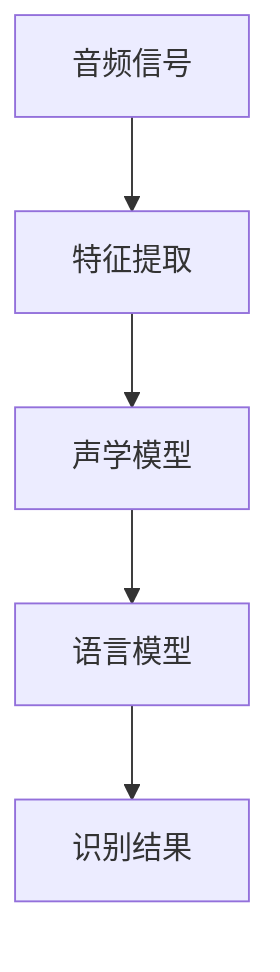
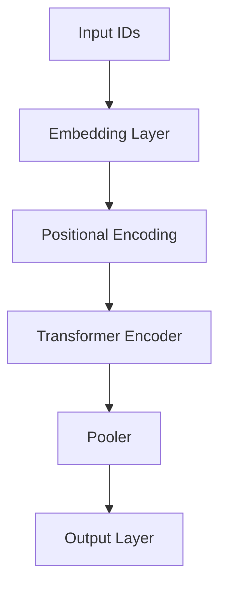
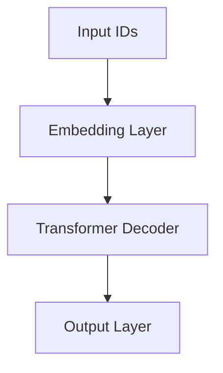
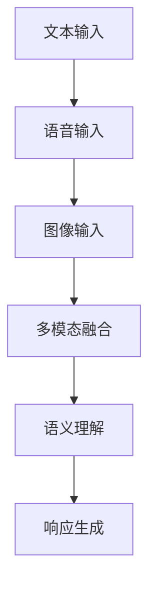
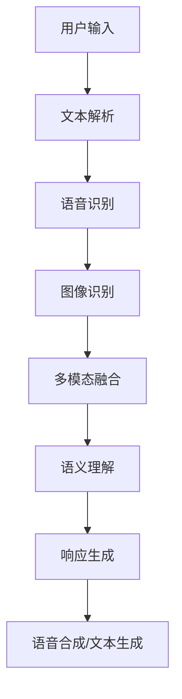
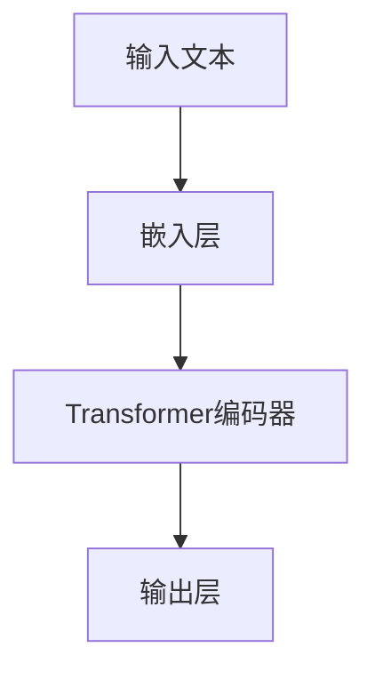
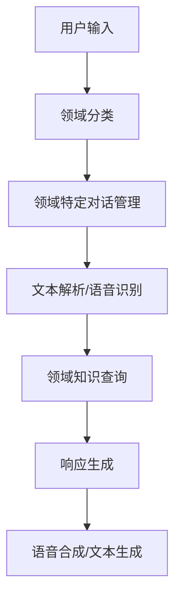
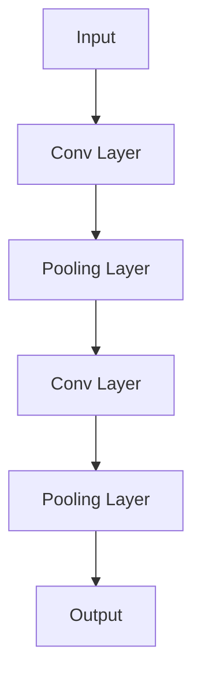

                 

# 自然语言处理在对话系统中的最新进展

## 关键词
自然语言处理（NLP）、对话系统、预训练语言模型、多模态对话系统、深度学习算法、对话系统评估与优化、伦理与隐私问题

## 摘要
本文深入探讨了自然语言处理（NLP）在对话系统中的应用，从基础概念到前沿技术进行了系统的梳理。首先，介绍了NLP和对话系统的基本原理，并分析了它们的发展历程和应用场景。随后，详细讨论了预训练语言模型（如BERT和GPT）在对话系统中的应用，以及多模态对话系统的优势和技术实现。本文还探讨了深度学习算法（如RNN和LSTM）和强化学习在对话系统中的应用，以及如何评估和优化对话系统。最后，重点讨论了对话系统的伦理与隐私问题，并展望了未来的发展方向。通过本文，读者可以全面了解NLP在对话系统中扮演的重要角色，以及如何应对当前和未来的挑战。

---

### 目录大纲：自然语言处理在对话系统中的最新进展

#### 第一部分：自然语言处理与对话系统概述

##### 第1章：自然语言处理（NLP）基础

- **1.1 自然语言处理简介**
  - **1.1.1 NLP的定义与应用**
  - **1.1.2 NLP的发展历程**

- **1.2 常用NLP技术**
  - **1.2.1 词嵌入技术**
  - **1.2.2 语言模型与文本生成**

- **1.3 语音识别与语音合成**
  - **1.3.1 语音识别原理**
  - **1.3.2 语音合成技术**

- **1.4 文本分类与情感分析**
  - **1.4.1 文本分类算法**
  - **1.4.2 情感分析模型**

##### 第2章：对话系统概述

- **2.1 对话系统的发展**
  - **2.1.1 对话系统的定义**
  - **2.1.2 对话系统的分类**

- **2.2 对话系统架构**
  - **2.2.1 对话管理模块**
  - **2.2.2 语音识别与文本生成模块**

- **2.3 交互设计与用户体验**
  - **2.3.1 交互设计原则**
  - **2.3.2 用户体验评估**

#### 第二部分：最新NLP技术在对话系统中的应用

##### 第3章：预训练语言模型在对话中的应用

- **3.1 预训练语言模型**
  - **3.1.1 BERT模型介绍**
  - **3.1.2 GPT模型介绍**

- **3.2 预训练语言模型在对话中的应用**
  - **3.2.1 对话生成**
  - **3.2.2 对话理解**

- **3.3 预训练语言模型的改进与优化**
  - **3.3.1 优化策略**
  - **3.3.2 模型压缩与加速**

##### 第4章：多模态对话系统

- **4.1 多模态对话系统概述**
  - **4.1.1 多模态对话系统的优势**
  - **4.1.2 多模态对话系统框架**

- **4.2 语音与文本融合**
  - **4.2.1 语音识别与文本生成技术**
  - **4.2.2 多模态数据融合方法**

- **4.3 多模态对话系统的实际应用**
  - **4.3.1 虚拟助手**
  - **4.3.2 跨领域对话**

##### 第5章：对话系统中的深度学习算法

- **5.1 深度学习算法基础**
  - **5.1.1 深度神经网络**
  - **5.1.2 卷积神经网络（CNN）**

- **5.2 循环神经网络（RNN）与长短期记忆（LSTM）**
  - **5.2.1 RNN原理**
  - **5.2.2 LSTM模型**

- **5.3 对话系统中的强化学习**
  - **5.3.1 强化学习基础**
  - **5.3.2 对话系统中的应用**

##### 第6章：对话系统的评估与优化

- **6.1 对话系统评估指标**
  - **6.1.1 评估方法**
  - **6.1.2 常见评估工具**

- **6.2 对话系统优化策略**
  - **6.2.1 数据增强**
  - **6.2.2 模型调优**

- **6.3 对话系统的实际案例**
  - **6.3.1 聊天机器人**
  - **6.3.2 客户服务平台**

#### 第三部分：自然语言处理在对话系统中的前沿研究

##### 第7章：对话系统的伦理与隐私问题

- **7.1 对话系统的伦理问题**
  - **7.1.1 对话系统的道德责任**
  - **7.1.2 对话系统中的隐私保护**

- **7.2 隐私保护技术**
  - **7.2.1 数据匿名化**
  - **7.2.2 加密技术**

- **7.3 伦理与隐私问题的解决方案**
  - **7.3.1 技术方案**
  - **7.3.2 法规与政策建议**

##### 第8章：未来的对话系统与NLP技术

- **8.1 对话系统的未来发展趋势**
  - **8.1.1 智能化的提升**
  - **8.1.2 多领域的融合**

- **8.2 NLP技术的未来展望**
  - **8.2.1 语言理解的深化**
  - **8.2.2 语言生成的创新**

- **8.3 对话系统与NLP技术的社会影响**
  - **8.3.1 社会价值**
  - **8.3.2 潜在风险**

### 附录

- **附录A：自然语言处理工具与资源**
  - **A.1 常用NLP库与框架**
  - **A.2 NLP数据集**
  - **A.3 在线资源和文献**

---

#### 第1章 自然语言处理（NLP）基础

自然语言处理（NLP）是计算机科学、人工智能和语言学领域的一个重要分支，旨在使计算机能够理解、生成和处理人类语言。本章将介绍NLP的基本概念、发展历程、常用技术以及它们在语音识别和文本分类中的应用。

##### 第1.1节 自然语言处理简介

###### 1.1.1 NLP的定义与应用

自然语言处理（NLP）是一门研究如何使计算机理解、解释和生成人类语言的技术。它包括以下几个关键方面：

1. **文本预处理**：包括分词、词性标注、句法分析和实体识别等，以便计算机更好地理解文本。
2. **语言模型**：用于预测下一个单词或句子，是文本生成和对话系统的重要组成部分。
3. **语义理解**：涉及情感分析、实体识别、关系抽取等，旨在提取文本中的深层含义。
4. **文本生成**：通过语言模型生成文本，用于自动写作、机器翻译和对话系统等。

NLP在多个领域有广泛的应用：

- **信息检索**：帮助用户从大量文本数据中快速找到相关信息。
- **机器翻译**：将一种语言翻译成另一种语言，如Google翻译。
- **对话系统**：与人类进行自然语言交互，如虚拟助手和聊天机器人。
- **文本分析**：用于情感分析、舆情监测和内容审核等。

###### 1.1.2 NLP的发展历程

NLP的发展可以分为几个阶段：

1. **规则驱动阶段（1960-1980）**：通过编写规则和模式匹配进行文本处理。
2. **基于统计的方法阶段（1980-2000）**：引入概率模型和隐马尔可夫模型（HMM）。
3. **基于数据的方法阶段（2000至今）**：以深度学习和大规模语料库为基础，实现突破性的进展。

近年来，深度学习技术在NLP领域取得了显著的成果，例如神经网络机器翻译（NMT）和预训练语言模型（如BERT和GPT）。

##### 第1.2节 常用NLP技术

###### 1.2.1 词嵌入技术

词嵌入（word embeddings）是将单词映射到高维空间中的向量表示，使计算机能够基于向量间的距离和角度来理解词义。常用的词嵌入技术包括：

1. **Word2Vec**：通过训练神经网络来生成词向量，使用的是连续袋模型（CBOW）和Skip-gram模型。
2. **GloVe**：基于全局上下文信息的词向量生成方法，通过矩阵分解优化词向量。

以下是一个简单的Word2Vec的伪代码示例：

```python
def generate_word_embedding(word_list, embedding_size):
    embedding = []
    for word in word_list:
        embedding.append([random.uniform(-0.05, 0.05) for _ in range(embedding_size)])
    return embedding
```

###### 1.2.2 语言模型与文本生成

语言模型（language model）是用于预测下一个单词或句子的概率分布的模型。它们在文本生成、对话系统和机器翻译中非常重要。常用的语言模型包括：

1. **N-gram模型**：基于过去N个单词预测下一个单词的概率。
2. **递归神经网络（RNN）**：能够处理序列数据，常用于文本生成。
3. **变换器（Transformer）**：基于自注意力机制，是当前最先进的语言模型架构，例如BERT和GPT。

以下是一个简单的RNN文本生成模型伪代码：

```python
def generate_text(model, start_word, max_length):
    current_word = start_word
    sentence = [current_word]
    for _ in range(max_length - 1):
        probabilities = model.predict(current_word)
        next_word = sample_word(probabilities)
        sentence.append(next_word)
        current_word = next_word
    return ' '.join(sentence)
```

##### 第1.3节 语音识别与语音合成

###### 1.3.1 语音识别原理

语音识别（speech recognition）是将语音信号转换为文本的技术。其主要组成部分包括：

1. **特征提取**：从音频信号中提取可用的特征，如梅尔频率倒谱系数（MFCC）。
2. **声学模型**：用于将特征映射到声学空间，常使用高斯混合模型（GMM）或深度神经网络。
3. **语言模型**：用于将声学结果映射到文本，常使用N-gram模型或神经网络。

以下是一个简单的语音识别流程的Mermaid流程图：



###### 1.3.2 语音合成技术

语音合成（text-to-speech, TTS）是将文本转换为语音的技术。其主要组成部分包括：

1. **文本预处理**：将文本转换为语音合成所需的格式。
2. **语音合成模型**：如隐马尔可夫模型（HMM）或深度神经网络。
3. **音频生成**：将语音合成模型生成的语音信号转换为可听的音频。

以下是一个简单的语音合成模型伪代码：

```python
def synthesize_speech(text, model):
    phonemes = convert_text_to_phonemes(text)
    audio_signal = []
    for phoneme in phonemes:
        audio_signal.extend(model(phoneme))
    return combine_signals(audio_signal)
```

##### 第1.4节 文本分类与情感分析

###### 1.4.1 文本分类算法

文本分类（text classification）是将文本分配到预定义的类别中的技术。常用的文本分类算法包括：

1. **朴素贝叶斯（Naive Bayes）**：基于贝叶斯定理，适用于文本数据。
2. **支持向量机（SVM）**：通过最大化分类边界来进行分类。
3. **深度神经网络（DNN）**：能够处理更复杂的文本数据。

以下是一个简单的朴素贝叶斯文本分类模型伪代码：

```python
def classify_text(model, text):
    features = extract_features(text)
    probabilities = model.predict_proba(features)
    return model.predict(features)
```

###### 1.4.2 情感分析模型

情感分析（sentiment analysis）是文本分类的一种特殊形式，旨在确定文本表达的情感是积极、消极还是中性。常用的情感分析模型包括：

1. **朴素贝叶斯（Naive Bayes）**：基于文本中词汇的频率和词性。
2. **支持向量机（SVM）**：通过最大化分类边界来进行情感分类。
3. **深度神经网络（DNN）**：能够处理更复杂的文本数据。

以下是一个简单的情感分析模型伪代码：

```python
def analyze_sentiment(model, text):
    features = extract_features(text)
    sentiment = model.predict(features)
    return 'Positive' if sentiment == 1 else 'Negative'
```

##### 小结

本章介绍了自然语言处理（NLP）的基础知识，包括NLP的定义、发展历程、常用技术（词嵌入、语言模型、语音识别、语音合成、文本分类和情感分析）以及在对话系统中的应用。在下一章中，我们将进一步探讨对话系统的基本概念和发展历程。

### 第2章 对话系统概述

对话系统（dialogue systems），也常被称为聊天机器人或虚拟助手，是一种能够与人类用户进行自然语言交互的计算机系统。这些系统能够理解用户的输入，生成适当的响应，并维持一个流畅的对话流程。随着人工智能技术的不断发展，对话系统已经广泛应用于客户服务、虚拟助手、在线教育、医疗咨询等多个领域。

##### 2.1 对话系统的发展

###### 2.1.1 对话系统的定义

对话系统是指一种能够与人类用户进行自然语言交互的计算机系统，通常包括以下几个基本组成部分：

1. **对话管理模块**：负责处理用户的输入，理解用户的意图，并根据对话状态生成合适的响应。
2. **语音识别模块**：将用户的语音输入转换为文本，用于文本解析和理解。
3. **文本生成模块**：根据对话管理模块的输出，生成自然的语言响应，并可能包括语音合成模块，将文本转换为语音输出。
4. **语义理解模块**：用于深入理解用户的意图和上下文，以便生成更准确和自然的响应。

###### 2.1.2 对话系统的分类

根据功能和特点，对话系统可以分为以下几个主要类别：

1. **问答系统（Question Answering Systems）**：这类系统主要用于回答用户的具体问题。例如，用户可以询问天气信息、航班信息等，系统会根据预定义的知识库或数据库提供答案。

2. **聊天机器人（Chatbots）**：与用户进行更加自由和自然对话的系统。聊天机器人通常用于提供客户服务、预订机票、酒店等服务。它们能够处理多种类型的输入，包括文本、语音和图像。

3. **虚拟助手（Virtual Assistants）**：这类系统通常用于执行更复杂的任务，如日程管理、提醒、任务分配等。它们能够与多个应用程序和设备进行集成，提供个性化的服务。

4. **客户服务系统（Customer Service Systems）**：专门用于处理客户咨询和投诉的对话系统。这些系统旨在提供24/7的服务，帮助客户解决问题，提高客户满意度。

##### 2.2 对话系统架构

对话系统的架构通常包括以下几个关键模块：

###### 2.2.1 对话管理模块

对话管理模块是对话系统的核心，负责处理用户的输入，理解用户的意图，并根据对话状态生成合适的响应。其主要功能包括：

1. **意图识别（Intent Recognition）**：从用户的输入中识别出用户想要完成的任务。例如，用户可能想要查询天气、预订机票等。
2. **实体识别（Entity Recognition）**：从用户的输入中提取出关键信息，如日期、地点、金额等。
3. **对话状态跟踪（Dialogue State Tracking）**：记录对话中的关键信息，如用户的需求、当前任务状态等。
4. **响应生成（Response Generation）**：根据用户的意图和对话状态，生成合适的响应。

以下是一个简单的对话管理模块的伪代码示例：

```python
def manage_dialogue(context, user_input):
    if is_first_input(user_input):
        start_new_dialogue(context, user_input)
    else:
        continue_dialogue(context, user_input)
```

###### 2.2.2 语音识别与文本生成模块

语音识别（Speech Recognition）模块负责将用户的语音输入转换为文本。这一模块通常依赖于先进的语音识别算法和语音数据库。文本生成（Text Generation）模块则负责将对话管理模块生成的文本转换为自然语言响应，并可能包括语音合成模块，将文本转换为语音输出。

以下是一个简单的语音识别与文本生成模块的伪代码示例：

```python
def recognize_speech(audio_signal, acoustic_model, language_model):
    phonemes = []
    for frame in audio_signal:
        phonemes.append(recognize_frame(frame, acoustic_model, language_model))
    return convert_phonemes_to_text(phonemes)

def synthesize_speech(voice_model, text):
    phonemes = convert_text_to_phonemes(text)
    audio_signal = []
    for phoneme in phonemes:
        audio_signal.extend(voice_model(phoneme))
    return combine_signals(audio_signal)
```

##### 2.3 交互设计与用户体验

对话系统的交互设计至关重要，直接影响用户的体验和满意度。以下是一些关键的交互设计原则和用户体验评估方法：

###### 2.3.1 交互设计原则

1. **清晰性**：对话系统的响应应清晰明了，避免模糊或混淆的信息。
2. **简洁性**：对话系统的响应应简洁明了，避免冗长和复杂的回答。
3. **贴合用户习惯**：对话系统应考虑用户的使用习惯和语言风格，提供自然流畅的对话体验。
4. **可访问性**：对话系统应易于所有人使用，包括残障人士。

###### 2.3.2 用户体验评估

用户体验评估是确保对话系统能够提供优质服务的重要步骤。以下是一些常用的评估方法和工具：

1. **演示评估**：通过实际演示对话系统在实际场景中的表现来进行评估。
2. **用户调查**：通过问卷调查用户对对话系统的满意度，收集用户反馈。
3. **自动评估**：使用算法和指标对对话系统的性能进行自动评估，如响应时间、准确性、流畅性等。

以下是一个简单的用户体验评估的伪代码示例：

```python
def evaluate_user_experience(response_time, user_satisfaction):
    if response_time < acceptable_threshold and user_satisfaction > minimum_satisfaction:
        return 'Good'
    else:
        return 'Poor'
```

##### 小结

本章对对话系统的基本概念、发展历程、架构以及交互设计进行了概述。在下一章中，我们将深入探讨最新NLP技术在对话系统中的应用，包括预训练语言模型、多模态对话系统和深度学习算法等。

### 第3章 预训练语言模型在对话中的应用

预训练语言模型（Pre-trained Language Models）是自然语言处理（NLP）领域的一项重要突破。通过在大规模语料库上进行预训练，这些模型获得了丰富的语言知识和强大的表征能力，从而在各种NLP任务中取得了显著的性能提升。本章将介绍两种最著名的预训练语言模型——BERT和GPT，并探讨它们在对话系统中的应用。

##### 3.1 预训练语言模型

###### 3.1.1 BERT模型介绍

BERT（Bidirectional Encoder Representations from Transformers）是由Google提出的一种双向Transformer模型，旨在预训练语言表示。BERT的关键特点是双向注意力机制，这意味着它能够同时考虑上下文中的前文和后文信息，从而生成更准确的文本表征。

BERT模型的基本结构包括：

1. **嵌入层**：将单词转换为固定长度的向量。
2. **Transformer编码器**：由多个自注意力层和前馈网络组成，对输入文本进行编码。
3. **输出层**：用于分类、序列标注等下游任务。

以下是一个简单的BERT模型结构的Mermaid流程图：



BERT模型的预训练过程通常包括两个任务：

1. **Masked Language Modeling（MLM）**：随机遮蔽输入文本中的部分单词，模型需要预测这些遮蔽的单词。
2. **Next Sentence Prediction（NSP）**：预测输入文本对是否为连续句子。

以下是一个简单的BERT模型预训练的伪代码：

```python
def pretrain_bert(model, corpus, mlm_rate, nsp_rate):
    for epoch in range(num_epochs):
        for batch in get_batches(corpus, batch_size):
            inputs, masks, labels = prepare_bert_inputs(batch)
            model.zero_grad()
            outputs = model(inputs, masks)
            mlm_loss = compute_mlm_loss(outputs, labels)
            nsp_loss = compute_nsp_loss(outputs, batch)
            total_loss = mlm_loss + nsp_loss
            total_loss.backward()
            optimize(model)
    return model
```

###### 3.1.2 GPT模型介绍

GPT（Generative Pre-trained Transformer）是由OpenAI提出的一种生成式预训练模型，它基于Transformer架构，通过自回归语言模型进行预训练。GPT模型的核心特点是能够生成连贯的文本，因此在对话系统中具有广泛的应用。

GPT模型的基本结构包括：

1. **嵌入层**：将单词转换为固定长度的向量。
2. **Transformer解码器**：由多个解码层和前馈网络组成，用于生成文本。
3. **输出层**：用于分类、序列标注等下游任务。

以下是一个简单的GPT模型结构的Mermaid流程图：



GPT模型的预训练过程通常包括以下步骤：

1. **自回归语言建模（Autoregressive Language Modeling）**：模型需要预测输入序列中的下一个单词。
2. **微调（Fine-tuning）**：在特定任务上进行微调，以适应不同的下游任务。

以下是一个简单的GPT模型预训练的伪代码：

```python
def pretrain_gpt(model, corpus, max_length):
    for epoch in range(num_epochs):
        for batch in get_batches(corpus, batch_size, max_length):
            inputs, labels = prepare_gpt_inputs(batch)
            model.zero_grad()
            outputs = model(inputs, labels)
            loss = compute_loss(outputs, labels)
            loss.backward()
            optimize(model)
    return model
```

##### 3.2 预训练语言模型在对话中的应用

###### 3.2.1 对话生成

对话生成是预训练语言模型在对话系统中的一项重要应用。通过训练，这些模型能够生成自然、连贯的对话响应。以下是一个简单的对话生成示例：

```python
def generate_response(model, tokenizer, input_text, max_length):
    inputs = tokenizer.encode(input_text, return_tensors='pt', max_length=max_length)
    outputs = model.generate(inputs, max_length=max_length, num_return_sequences=1)
    response = tokenizer.decode(outputs[0], skip_special_tokens=True)
    return response
```

###### 3.2.2 对话理解

对话理解是另一个关键应用，它涉及模型对用户输入的理解和意图识别。以下是一个简单的对话理解示例：

```python
def understand_input(model, tokenizer, input_text, max_length):
    inputs = tokenizer.encode(input_text, return_tensors='pt', max_length=max_length)
    outputs = model(inputs, output_hidden_states=True)
    hidden_states = outputs.hidden_states[-1]
    context_representation = hidden_states.mean(dim=1)
    return context_representation
```

##### 3.3 预训练语言模型的改进与优化

为了提高预训练语言模型在对话系统中的应用效果，研究人员提出了多种改进和优化策略，包括：

###### 3.3.1 优化策略

1. **上下文窗口扩展**：通过增加输入文本的上下文窗口，模型能够更好地理解复杂的对话背景。
2. **多任务学习**：通过在同一模型中同时训练多个任务，提高模型的泛化能力和任务适应性。
3. **知识蒸馏**：将预训练的大型模型的知识传递给较小的模型，以减少计算成本和提高性能。

以下是一个简单的优化策略示例：

```python
def optimize_model(model, teacher_model, student_model, corpus, num_epochs):
    for epoch in range(num_epochs):
        for batch in get_batches(corpus, batch_size):
            inputs, labels = prepare_inputs(batch)
            teacher_outputs = teacher_model(inputs, labels)
            student_outputs = student_model(inputs, labels)
            loss = compute_kl_loss(teacher_outputs, student_outputs)
            loss.backward()
            optimize(student_model)
    return student_model
```

###### 3.3.2 模型压缩与加速

为了提高预训练语言模型在对话系统中的部署效率，模型压缩和加速是重要的研究方向。以下是一些常见的模型压缩和加速策略：

1. **模型剪枝**：通过剪除不重要的神经元和连接，减少模型的大小和计算量。
2. **量化**：将模型的权重和激活值从浮点数转换为低精度的整数表示，以减少存储和计算需求。
3. **并行计算**：通过在多核处理器或GPU上并行计算，提高模型的计算效率。

以下是一个简单的模型压缩和加速示例：

```python
def compress_and_accelerate(model, compression_ratio):
    model = apply_compression(model, compression_ratio)
    model = apply_quantization(model)
    model = deploy_on_accelerator(model)
    return model
```

##### 小结

本章介绍了预训练语言模型（BERT和GPT）的基本原理和应用。通过预训练，这些模型获得了强大的语言表征能力和理解能力，使其在对话系统中具有广泛的应用前景。在下一章中，我们将探讨多模态对话系统的优势和实现技术。

### 第4章 多模态对话系统

多模态对话系统是一种能够同时处理和整合多种类型输入（如文本、语音、图像等）的对话系统。与传统的单模态对话系统相比，多模态对话系统能够提供更丰富的交互体验和更准确的语义理解。本章将介绍多模态对话系统的优势、架构以及实现方法。

##### 4.1 多模态对话系统概述

###### 4.1.1 多模态对话系统的优势

多模态对话系统具有以下优势：

1. **灵活性**：能够处理多种输入类型，如文本、语音、图像等，提供更灵活的交互方式。
2. **用户体验**：通过多种模态的交互，可以提高用户满意度，提供更自然和直观的交互体验。
3. **表达丰富性**：多模态输入可以捕捉和表达更复杂的信息和情感，提高对话的深度和丰富性。
4. **上下文感知**：结合不同模态的信息，可以更好地理解和预测用户的意图，提高对话系统的智能水平。

以下是一个简单的多模态对话系统优势的Mermaid流程图：



###### 4.1.2 多模态对话系统框架

多模态对话系统的框架通常包括以下几个关键组件：

1. **文本解析模块**：用于处理文本输入，进行分词、词性标注、句法分析和实体识别等。
2. **语音识别模块**：将语音输入转换为文本，以便后续处理。
3. **图像识别模块**：对图像输入进行分类、物体识别和场景理解等。
4. **多模态融合模块**：将不同模态的信息进行整合，提取关键特征，生成统一的多模态表征。
5. **语义理解模块**：基于融合后的多模态表征，进行语义理解、意图识别和上下文推理等。
6. **响应生成模块**：根据语义理解和用户意图，生成合适的文本或语音响应。

以下是一个简单的多模态对话系统框架的Mermaid流程图：



##### 4.2 语音与文本融合

在多模态对话系统中，语音与文本的融合是一个重要的技术挑战。通过融合语音和文本信息，可以进一步提高对话系统的理解和生成能力。以下是一些常见的语音与文本融合方法：

###### 4.2.1 语音识别与文本生成技术

语音识别（Speech Recognition）是将语音信号转换为文本的技术，常用的方法包括：

1. **隐马尔可夫模型（HMM）**：基于状态转移和观察概率的语音识别模型。
2. **高斯混合模型（GMM）**：用于建模语音信号的概率分布。
3. **深度神经网络（DNN）**：通过训练大规模神经网络来识别语音。

以下是一个简单的语音识别流程的Mermaid流程图：


文本生成（Text Generation）是将预训练的语言模型生成文本的技术，常用的方法包括：

1. **递归神经网络（RNN）**：用于处理序列数据，生成文本。
2. **变换器（Transformer）**：通过自注意力机制生成文本，具有更高的生成能力。
3. **预训练语言模型（如GPT和BERT）**：通过大规模语料库预训练，生成自然、连贯的文本。

以下是一个简单的文本生成模型的Mermaid流程图：



###### 4.2.2 多模态数据融合方法

多模态数据融合（Multimodal Data Fusion）是将不同模态的信息进行整合，生成统一表征的方法。以下是一些常见的数据融合方法：

1. **加法融合**：将不同模态的特征向量直接相加，生成新的特征向量。
2. **平均融合**：将不同模态的特征向量取平均值，生成新的特征向量。
3. **对抗融合**：通过对抗网络学习不同模态的特征表示，生成统一的多模态表征。
4. **注意力机制**：利用注意力机制，动态权重不同模态的特征，生成新的特征向量。

以下是一个简单的多模态数据融合方法的伪代码：

```python
def fuse_modalities(text_embedding, speech_embedding):
    combined_embedding = text_embedding + speech_embedding
    return combined_embedding
```

##### 4.3 多模态对话系统的实际应用

多模态对话系统在实际应用中具有广泛的应用前景，以下是一些典型的应用场景：

###### 4.3.1 虚拟助手

虚拟助手（Virtual Assistant）是一种能够提供多模态交互的服务系统，常见于智能音箱、智能手机等设备。通过结合语音、文本和图像等多模态输入，虚拟助手可以更好地理解用户的意图，提供个性化的服务。

以下是一个简单的虚拟助手响应生成的伪代码：

```python
def generate_response虚拟助手(inputs):
    text_embedding = extract_text_embedding(inputs)
    speech_embedding = extract_speech_embedding(inputs)
    combined_embedding = fuse_modalities(text_embedding, speech_embedding)
    response = generate_response_from_embedding(combined_embedding)
    return response
```

###### 4.3.2 跨领域对话

跨领域对话（Cross-domain Dialogue）是指对话系统在不同领域之间进行交互的能力。例如，一个对话系统可以同时处理医疗咨询、客户服务和教育辅导等多个领域的请求。通过多模态输入和融合，对话系统可以更好地适应不同领域的需求。

以下是一个简单的跨领域对话系统流程的Mermaid流程图：



##### 小结

本章介绍了多模态对话系统的优势和实现方法。通过结合文本、语音、图像等多种模态，多模态对话系统能够提供更丰富的交互体验和更准确的语义理解。在下一章中，我们将探讨对话系统中的深度学习算法，包括深度神经网络、循环神经网络和强化学习等。

### 第5章 对话系统中的深度学习算法

深度学习算法在对话系统中的应用极大地提升了系统的智能水平和性能。本章将介绍深度学习算法的基础知识，包括深度神经网络（DNN）、卷积神经网络（CNN）和循环神经网络（RNN），以及长短期记忆网络（LSTM）在对话系统中的具体应用。

##### 5.1 深度学习算法基础

深度学习算法的核心是多层神经网络，通过多个隐藏层对输入数据进行复杂特征提取和学习。以下是几种常见的深度学习算法：

###### 5.1.1 深度神经网络（DNN）

深度神经网络（DNN）是一种具有多个隐藏层的神经网络，它通过逐层学习复杂特征来提高模型的性能。DNN的基本结构包括输入层、隐藏层和输出层。

1. **输入层**：接收外部输入数据，如文本、图像等。
2. **隐藏层**：通过前一层输出进行加权求和并应用激活函数，提取输入数据的特征。
3. **输出层**：生成最终预测结果或分类标签。

以下是一个简单的DNN前向传播的伪代码：

```python
def forward_pass(inputs, weights):
    hidden_states = [inputs]
    for layer in layers:
        hidden_state = layer(hidden_states[-1], weights)
        hidden_states.append(hidden_state)
    return hidden_states[-1]
```

###### 5.1.2 卷积神经网络（CNN）

卷积神经网络（CNN）是一种专门用于处理图像数据的深度学习算法，它通过卷积层、池化层和全连接层提取图像特征。CNN的基本结构包括：

1. **卷积层**：通过卷积操作提取图像的特征。
2. **池化层**：通过下采样操作减少特征图的维度。
3. **全连接层**：对提取的特征进行分类或回归。

以下是一个简单的CNN结构的Mermaid流程图：



###### 5.1.3 循环神经网络（RNN）

循环神经网络（RNN）是一种能够处理序列数据的深度学习算法，它通过循环结构将当前输入与历史信息相结合，实现序列的学习和建模。RNN的基本结构包括：

1. **输入门**：用于控制当前输入信息的流动。
2. **遗忘门**：用于控制历史信息的遗忘。
3. **输出门**：用于控制输出信息的流动。

以下是一个简单的RNN单元的伪代码：

```python
def rnn_step(input, hidden_state, weight):
    new_hidden_state = activation_function((weight * input) + (1 - weight) * hidden_state)
    return new_hidden_state
```

##### 5.2 循环神经网络（RNN）与长短期记忆（LSTM）

RNN是处理序列数据的一种有效方法，但它存在梯度消失和梯度爆炸的问题，导致难以学习长距离依赖关系。为了解决这一问题，长短期记忆网络（LSTM）被提出。

###### 5.2.1 RNN原理

RNN通过递归结构将当前输入与历史信息结合，形成新的隐藏状态。RNN的基本原理可以描述如下：

1. **输入门（Input Gate）**：决定当前输入信息的重要程度。
2. **遗忘门（Forget Gate）**：决定哪些历史信息需要遗忘。
3. **输出门（Output Gate）**：决定当前隐藏状态的重要程度。

以下是一个简单的RNN计算的伪代码：

```python
def rnn_step(input, hidden_state, weight):
    input_gate = activation_function((weight['input_gate'] * input) + (weight['hidden_gate'] * hidden_state))
    forget_gate = activation_function((weight['forget_gate'] * input) + (weight['hidden_gate'] * hidden_state))
    output_gate = activation_function((weight['output_gate'] * input) + (weight['hidden_gate'] * hidden_state))
    
    new_hidden_state = forget_gate * hidden_state + input_gate * activation_function(input)
    return new_hidden_state
```

###### 5.2.2 LSTM模型

LSTM（Long Short-Term Memory）是RNN的一种改进版本，通过引入记忆单元和三个门（输入门、遗忘门、输出门）来控制信息的流动，从而有效解决了梯度消失问题，能够学习长距离依赖关系。

LSTM单元的基本结构包括：

1. **输入门（Input Gate）**：决定哪些信息将被更新到细胞状态。
2. **遗忘门（Forget Gate）**：决定哪些信息将被遗忘。
3. **输出门（Output Gate）**：决定细胞状态的重要程度。

以下是一个简单的LSTM单元的伪代码：

```python
def lstm_step(input, hidden_state, cell_state, weights):
    input_gate = activation_function((weights['input_gate'] * input) + (weights['hidden_gate'] * hidden_state))
    forget_gate = activation_function((weights['forget_gate'] * input) + (weights['hidden_gate'] * hidden_state))
    output_gate = activation_function((weights['output_gate'] * input) + (weights['hidden_gate'] * hidden_state))
    
    new_cell_state = forget_gate * cell_state + input_gate * activation_function(input)
    new_hidden_state = output_gate * activation_function(new_cell_state)
    
    return new_hidden_state, new_cell_state
```

##### 5.3 对话系统中的强化学习

强化学习（Reinforcement Learning，RL）是一种通过试错来学习如何在特定环境中做出最优决策的机器学习方法。在对话系统中，强化学习可以用于优化对话策略，使系统能够更好地适应用户的反馈。

###### 5.3.1 强化学习基础

强化学习的基本概念包括：

1. **状态（State）**：描述对话系统的当前状态，如用户输入、对话历史等。
2. **动作（Action）**：对话系统可以采取的行为，如生成特定响应。
3. **奖励（Reward）**：用户对系统响应的反馈，用于评估动作的效果。

强化学习的主要算法包括：

1. **Q-Learning**：通过迭代更新Q值，找到最优策略。
2. **SARSA**：基于当前状态和动作进行更新，同时考虑未来奖励。
3. **Deep Q-Network（DQN）**：使用深度神经网络来近似Q值函数。

以下是一个简单的Q-Learning算法的伪代码：

```python
def update_q_value(q_values, state, action, reward, next_state, alpha, gamma):
    target_q = reward + gamma * max(q_values[next_state])
    expected_q = q_values[state, action]
    q_values[state, action] = q_values[state, action] + alpha * (target_q - expected_q)
    return q_values
```

###### 5.3.2 对话系统中的应用

在对话系统中，强化学习可以用于：

1. **策略优化**：通过学习用户的反馈，优化系统的对话策略，提高用户满意度。
2. **行为克隆**：使用人类专家的对话数据进行行为克隆，使系统在模拟环境中进行训练。
3. **多任务学习**：同时学习多个对话任务，提高系统的适应性和泛化能力。

以下是一个简单的对话策略优化的伪代码：

```python
def optimize_dialogue_policy(model, dialogue_history, reward, gamma, alpha):
    for state, action, next_state in dialogue_history:
        model.update_q_value(state, action, reward, next_state, gamma, alpha)
    return model
```

##### 小结

本章介绍了深度学习算法在对话系统中的应用，包括DNN、CNN、RNN、LSTM以及强化学习。通过这些算法，对话系统能够更好地理解用户的意图，生成自然的对话响应，并优化对话策略。在下一章中，我们将探讨如何评估和优化对话系统的性能。

### 第6章 对话系统的评估与优化

对话系统的评估与优化是确保其性能和用户体验的关键步骤。本章将介绍对话系统评估的常见指标、优化策略以及实际案例，包括聊天机器人和客户服务平台。

##### 6.1 对话系统评估指标

对话系统的评估主要关注以下指标：

###### 6.1.1 评估方法

1. **演示评估**：通过实际演示对话系统与用户的交互过程，评估其表现和用户体验。
2. **用户调查**：通过问卷调查用户对对话系统的满意度，收集定量和定性反馈。
3. **自动评估**：使用算法和指标对对话系统的性能进行自动评估，如响应时间、准确性、流畅性等。

以下是一个简单的用户体验评估的伪代码：

```python
def evaluate_user_experience(response_time, user_satisfaction):
    if response_time < acceptable_threshold and user_satisfaction > minimum_satisfaction:
        return 'Good'
    else:
        return 'Poor'
```

###### 6.1.2 常见评估工具

1. **BLEU评分**：用于评估文本生成系统的质量，通过比较生成文本与参考文本的相似度进行评分。
2. **F1分数**：用于评估分类系统的性能，通过精确率和召回率的调和平均来衡量。
3. **DialoGPT评估套件**：用于评估对话系统的对话质量和流畅性，包括多个评估指标和基准数据集。

以下是一个简单的评估工具示例：

```python
def evaluate_model(model, dataset):
    scores = []
    for data in dataset:
        response = model.generate_response(data.input_text)
        score = evaluate(response,

