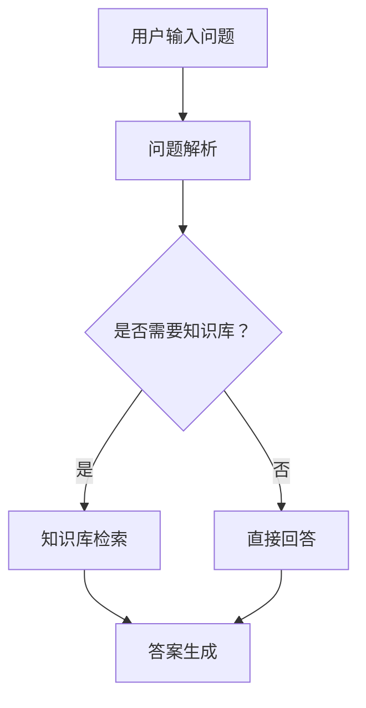

                 

# 《自然语言处理在问答系统中的应用》

> **关键词：自然语言处理，问答系统，问题解析，知识库，答案生成，性能评估**

> **摘要：本文将深入探讨自然语言处理在问答系统中的应用，从基础概念到实际实现，全面解析自然语言处理技术在问答系统中的关键环节。通过详细阐述自然语言处理的核心技术、问答系统的架构和实现方法，以及问答系统的性能评估和应用场景，为读者提供一份全面的技术指南。**

## 《自然语言处理在问答系统中的应用》目录大纲

### 第一部分：自然语言处理基础

### 第1章：自然语言处理概述

#### 1.1 自然语言处理的核心概念

#### 1.2 自然语言处理的关键技术

#### 1.3 自然语言处理的发展历程

### 第2章：文本预处理

#### 2.1 文本清洗

#### 2.2 词嵌入

### 第3章：问答系统的架构

#### 3.1 问答系统的定义

#### 3.2 问答系统的关键技术

### 第二部分：问答系统的实现

### 第4章：问题解析

#### 4.1 问题分类

#### 4.2 问题实体识别

### 第5章：知识库构建

#### 5.1 知识库的概念

#### 5.2 知识库的构建方法

### 第6章：答案生成

#### 6.1 答案生成的定义

#### 6.2 答案生成的技术

### 第三部分：问答系统的应用

### 第7章：问答系统的性能评估

#### 7.1 评估指标

#### 7.2 评估方法

### 第8章：问答系统在商业中的应用

#### 8.1 问答系统在客服中的应用

#### 8.2 问答系统在教育中的应用

### 第9章：问答系统未来的发展方向

#### 9.1 自然语言理解

#### 9.2 多模态问答

#### 9.3 问答系统的挑战与机遇

### 附录

#### 附录A：自然语言处理工具与资源

#### 附录B：开源问答系统

### Mermaid 流�程图

### 伪代码

### 数学公式

### 举例说明

### 代码实战

#### 环境搭建

#### 源代码实现

#### 代码解读与分析

### 第一部分：自然语言处理基础

### 第1章：自然语言处理概述

#### 1.1 自然语言处理的核心概念

自然语言处理（Natural Language Processing，NLP）是计算机科学和人工智能领域的一个分支，旨在使计算机能够理解、生成和处理人类自然语言。NLP的研究目标包括但不限于文本分类、情感分析、命名实体识别、机器翻译、语音识别等。

NLP的应用场景非常广泛，涵盖了诸如搜索引擎、语音助手、机器翻译、推荐系统、法律文书自动化处理等多个领域。例如，搜索引擎利用NLP技术理解用户的查询意图，从而提供更准确的搜索结果；语音助手如Siri和Alexa则通过NLP技术将用户的语音指令转换为计算机指令，实现人机交互。

自然语言处理的发展历程可以追溯到20世纪50年代。当时，科学家们开始尝试使用计算机模拟人类语言的理解能力。早期的NLP技术主要包括基于规则的方法和统计方法。随着计算能力的提高和机器学习技术的发展，NLP技术逐渐从规则驱动转向数据驱动，如今深度学习已成为NLP的主流技术。

#### 1.2 自然语言处理的关键技术

自然语言处理的核心技术包括语言模型、词性标注、命名实体识别、依存句法分析等。

- **语言模型**：语言模型是NLP的基础，用于预测文本的下一个词或句子。最著名的语言模型是1995年由肯尼斯·科恩和保罗·库尔帕克提出的n-gram模型。近年来，随着深度学习的发展，循环神经网络（RNN）和其变种长短期记忆网络（LSTM）在语言模型上取得了显著成果。

  ```python
  # 伪代码：基于n-gram模型的语言模型
  def predict_next_word(sentence, n):
      ngram_counts = {}  # 存储n-gram及其频次
      for i in range(len(sentence) - n + 1):
          ngram = tuple(sentence[i:i+n])
          if ngram in ngram_counts:
              ngram_counts[ngram] += 1
          else:
              ngram_counts[ngram] = 1
      sorted_ngrams = sorted(ngram_counts.items(), key=lambda x: x[1], reverse=True)
      return sorted_ngrams[0][0][-1]  # 返回最高频的下一个词
  ```

- **词性标注**：词性标注（Part-of-Speech Tagging，POS）是指将文本中的每个词标注为其在句子中的词性，如名词、动词、形容词等。传统的词性标注方法主要基于规则和统计方法，而近年来，深度学习在词性标注上取得了显著成果。

  ```python
  # 伪代码：基于深度学习的词性标注
  def pos_tagging(sentence):
      model = load_pos_tagging_model()  # 加载预训练的词性标注模型
      predicted_tags = model.predict(sentence)
      return predicted_tags
  ```

- **命名实体识别**：命名实体识别（Named Entity Recognition，NER）是指识别文本中的命名实体，如人名、地名、机构名等。NER是NLP领域的重要任务，广泛应用于信息提取、实体链接等。

  ```mermaid
  graph TD
      A[文本] --> B[分词]
      B --> C[词性标注]
      C --> D[命名实体识别]
      D --> E[实体分类]
  ```

- **依存句法分析**：依存句法分析（Dependency Parsing）是指分析句子中词语之间的依赖关系。依存句法分析可以帮助理解句子的深层语义结构，是许多NLP任务的基础。

  ```mermaid
  graph TD
      A(主语) --> B(谓语)
      B --> C(宾语)
      C --> D(定语)
  ```

#### 1.3 自然语言处理的发展历程

自然语言处理的发展历程可以分为以下几个阶段：

- **规则驱动阶段**：早期NLP主要依赖于手工编写的规则。例如，1980年代的MIT方法，基于上下文敏感的规则来分析文本。
- **统计阶段**：随着语料库的积累和统计学习方法的兴起，NLP开始转向统计方法。1990年代，n-gram模型和隐马尔可夫模型（HMM）成为主流。
- **数据驱动阶段**：2000年代，随着深度学习技术的发展，NLP开始采用数据驱动的方法。循环神经网络（RNN）和其变种长短期记忆网络（LSTM）在语言建模和句法分析上取得了显著成果。
- **多模态阶段**：近年来，NLP开始探索多模态学习，结合文本、图像、视频等多种模态数据，实现更丰富的语义理解。

### 第2章：文本预处理

#### 2.1 文本清洗

文本清洗是自然语言处理过程中的第一步，旨在去除文本中的噪声和无关信息，以便后续处理。文本清洗通常包括以下步骤：

- **去除停用词**：停用词是指对文本分析结果影响不大的词，如“的”、“和”、“是”等。去除停用词可以减少模型需要处理的词汇量，提高处理效率。

  ```python
  # 伪代码：去除停用词
  def remove_stopwords(sentence, stopwords):
      tokens = tokenize(sentence)
      filtered_tokens = [token for token in tokens if token not in stopwords]
      return filtered_tokens
  ```

- **分词**：分词是将文本拆分成词的序列。不同的语言和任务可能需要不同的分词策略。例如，中文的分词通常基于字符，而英文的分词则基于单词。

  ```python
  # 伪代码：中文分词
  def segment_sentence(sentence):
      return jieba.lcut(sentence)
  ```

- **词干提取**：词干提取是将单词缩减为其词干形式。词干提取可以帮助减少词汇量，提高模型训练和预测的效率。

  ```python
  # 伪代码：词干提取
  def stem_word(word):
      stemmer = PorterStemmer()
      return stemmer.stem(word)
  ```

#### 2.2 词嵌入

词嵌入（Word Embedding）是将词汇映射到高维向量空间，以便计算机能够处理。词嵌入的主要目的是捕获单词的语义信息。常见的词嵌入技术包括：

- **词袋模型（Bag-of-Words，BoW）**：词袋模型将文本表示为词汇的集合，忽略单词的顺序。词袋模型简单有效，但无法捕捉单词的语义关系。

  ```python
  # 伪代码：词袋模型
  def vectorize_sentence(sentence, vocabulary):
      tokenized_sentence = tokenize(sentence)
      return [vocabulary[token] for token in tokenized_sentence]
  ```

- **词嵌入技术（Word2Vec）**：词嵌入技术通过学习文本中的词语向量，使相似的单词在向量空间中靠近。词2Vec是其中最著名的模型，包括连续词袋（CBOW）和Skip-gram两种变体。

  ```python
  # 伪代码：词2Vec模型
  def train_word2vec(model, sentences, size, window):
      model.fit(sentences, size=size, window=window)
      return model
  ```

- **高级词嵌入技术（GloVe）**：GloVe（Global Vectors for Word Representation）是一种基于全局共现矩阵的词嵌入方法，可以捕获单词的语义和词频信息。

  ```python
  # 伪代码：GloVe模型
  def train_glove(model, corpus, size):
      model.fit(corpus, size=size)
      return model
  ```

### 第3章：问答系统的架构

#### 3.1 问答系统的定义

问答系统（Question Answering System，QAS）是一种智能系统，能够理解用户的问题，并在大规模知识库中检索相关信息，生成合适的答案。问答系统通常包括三个关键环节：问题解析、知识库检索和答案生成。

- **问题解析**：问题解析是指将用户的问题转换为计算机可以理解的形式。问题解析通常涉及词性标注、命名实体识别和语义角色标注等步骤，以便系统理解问题的含义。

  ```mermaid
  graph TD
      A[用户问题] --> B[词性标注]
      B --> C[命名实体识别]
      C --> D[语义角色标注]
  ```

- **知识库检索**：知识库检索是指从大规模知识库中检索与问题相关的信息。知识库可以是结构化的数据库，也可以是非结构化的文本文档。知识库检索通常涉及关键词匹配、模糊查询和语义搜索等技术。

  ```mermaid
  graph TD
      A[问题解析结果] --> B[关键词提取]
      B --> C[知识库检索]
      C --> D[候选答案]
  ```

- **答案生成**：答案生成是指从候选答案中选出最合适的答案。答案生成可以采用基于模板的方法、基于规则的方法或基于机器学习的方法。常见的答案生成技术包括模板匹配、句法分析、语义分析等。

  ```mermaid
  graph TD
      A[候选答案] --> B[模板匹配]
      B --> C[句法分析]
      C --> D[语义分析]
      D --> E[最终答案]
  ```

#### 3.2 问答系统的关键技术

问答系统的关键技术包括问题解析、知识库构建和答案生成。

- **问题解析**：问题解析是实现问答系统的关键一步，它决定了系统能否正确理解用户的问题。问题解析通常涉及以下技术：

  - **词性标注**：词性标注用于识别句子中的名词、动词、形容词等词性，有助于理解句子的结构和含义。
  - **命名实体识别**：命名实体识别用于识别句子中的人名、地名、机构名等实体，有助于定位问题的关注点。
  - **语义角色标注**：语义角色标注用于识别句子中的动作执行者、动作对象等语义角色，有助于理解问题的意图。

- **知识库构建**：知识库是问答系统的信息源，构建高质量的、与问题相关的知识库至关重要。知识库构建通常涉及以下方法：

  - **手动构建**：手动构建知识库是指人工整理和录入相关信息，适用于小规模或特定领域的知识库构建。
  - **自动构建**：自动构建知识库是指通过数据挖掘、信息抽取等技术自动从大规模文本中提取信息，适用于大规模知识库构建。

- **答案生成**：答案生成是指从知识库中检索相关信息，并生成合适的答案。答案生成方法包括：

  - **基于模板的方法**：基于模板的方法是指根据问题的结构和答案的格式，从预定义的模板中选取答案。这种方法简单有效，但灵活性较差。
  - **基于机器学习的方法**：基于机器学习的方法是指通过训练机器学习模型，根据问题的语义和知识库中的信息，生成答案。这种方法具有较好的灵活性和泛化能力，但需要大量标注数据和较长的训练时间。
  - **基于神经网络的方法**：基于神经网络的方法是指利用神经网络模型，如序列到序列模型（Seq2Seq）、Transformer等，生成答案。这种方法具有强大的建模能力和灵活性，但计算资源需求较高。

### 第二部分：问答系统的实现

### 第4章：问题解析

#### 4.1 问题分类

问题分类是将问题按照不同的类型进行划分，以便于后续处理。问题分类有助于减少搜索空间，提高答案检索的效率。常见的问题分类方法包括基于规则的方法和基于机器学习的方法。

- **基于规则的方法**：基于规则的方法是指根据预定义的规则，将问题分为不同的类型。这种方法简单直观，但规则难以覆盖所有情况。

  ```python
  # 伪代码：基于规则的问题分类
  def classify_question(question):
      if "时间" in question:
          return "时间查询"
      elif "地点" in question:
          return "地点查询"
      else:
          return "其他查询"
  ```

- **基于机器学习的方法**：基于机器学习的方法是指利用机器学习模型，如决策树、支持向量机（SVM）、朴素贝叶斯等，对问题进行分类。这种方法可以根据大量标注数据自动学习分类规则，但需要一定的数据量和计算资源。

  ```python
  # 伪代码：基于机器学习的问题分类
  from sklearn.feature_extraction.text import TfidfVectorizer
  from sklearn.model_selection import train_test_split
  from sklearn.naive_bayes import MultinomialNB

  # 准备数据
  questions = ["明天天气如何？", "北京在哪里？", "什么是人工智能？"]
  labels = ["时间查询", "地点查询", "其他查询"]

  # 特征提取
  vectorizer = TfidfVectorizer()
  X = vectorizer.fit_transform(questions)

  # 划分训练集和测试集
  X_train, X_test, y_train, y_test = train_test_split(X, labels, test_size=0.2, random_state=42)

  # 模型训练
  model = MultinomialNB()
  model.fit(X_train, y_train)

  # 测试模型
  predictions = model.predict(X_test)
  print(predictions)
  ```

#### 4.2 问题实体识别

问题实体识别是指从问题中识别出关键实体，如人名、地名、机构名等。问题实体识别有助于缩小搜索范围，提高答案检索的准确性。常见的问题实体识别方法包括基于规则的方法和基于机器学习的方法。

- **基于规则的方法**：基于规则的方法是指根据预定义的规则，从问题中提取实体。这种方法简单直观，但规则难以覆盖所有情况。

  ```python
  # 伪代码：基于规则的问题实体识别
  def extract_entities(question):
      entities = []
      if "人名" in question:
          entities.append("人名")
      if "地名" in question:
          entities.append("地名")
      if "机构名" in question:
          entities.append("机构名")
      return entities
  ```

- **基于机器学习的方法**：基于机器学习的方法是指利用机器学习模型，如条件随机场（CRF）、卷积神经网络（CNN）等，从问题中提取实体。这种方法可以根据大量标注数据自动学习实体提取规则，但需要一定的数据量和计算资源。

  ```python
  # 伪代码：基于机器学习的问题实体识别
  from sklearn_crfsuite import CRF
  from sklearn_crfsuite import metrics

  # 准备数据
  questions = ["习近平是谁？", "北京在哪里？", "阿里巴巴是哪个城市的公司？"]
  labels = [["人名"], ["地名"], ["地名", "机构名"]]

  # 划分训练集和测试集
  X_train, X_test, y_train, y_test = train_test_split(questions, labels, test_size=0.2, random_state=42)

  # 模型训练
  model = CRF()
  model.fit(X_train, y_train)

  # 测试模型
  predictions = model.predict(X_test)
  print(predictions)

  # 评估模型
  report = metrics.flat_classification_report(y_test, predictions)
  print(report)
  ```

### 第5章：知识库构建

#### 5.1 知识库的概念

知识库（Knowledge Base，KB）是问答系统的核心组成部分，用于存储问题和答案的信息。知识库可以是结构化的数据库，也可以是非结构化的文本文档。一个高质量的、与问题相关的知识库是问答系统性能的关键。

- **结构化知识库**：结构化知识库是指使用数据库管理系统（如MySQL、PostgreSQL）存储知识库数据。结构化知识库的优点包括数据检索速度快、易于维护和扩展等。

  ```mermaid
  graph TD
      A[问题] --> B[数据库]
      B --> C[答案]
  ```

- **非结构化知识库**：非结构化知识库是指使用文本文件存储知识库数据。非结构化知识库的优点包括数据存储灵活、易于扩展等。

  ```mermaid
  graph TD
      A[问题] --> B[文本文件]
      B --> C[答案]
  ```

#### 5.2 知识库的构建方法

知识库的构建方法主要包括手动构建和自动构建。

- **手动构建**：手动构建知识库是指人工整理和录入相关信息。这种方法适用于小规模或特定领域的知识库构建。

  ```mermaid
  graph TD
      A[人工整理] --> B[知识库]
  ```

- **自动构建**：自动构建知识库是指通过数据挖掘、信息抽取等技术自动从大规模文本中提取信息。这种方法适用于大规模知识库构建。

  ```mermaid
  graph TD
      A[文本挖掘] --> B[知识库]
  ```

常见的数据挖掘和信息抽取技术包括：

- **命名实体识别（NER）**：命名实体识别用于识别文本中的人名、地名、机构名等实体。

  ```mermaid
  graph TD
      A[文本] --> B[NER]
      B --> C[实体]
  ```

- **关系提取（RE）**：关系提取用于识别文本中实体之间的关系，如“张三是李四的哥哥”。

  ```mermaid
  graph TD
      A[文本] --> B[关系提取]
      B --> C[实体关系]
  ```

- **知识图谱构建**：知识图谱用于表示实体和实体之间的关系，是一个语义网。知识图谱构建通常涉及实体识别、关系提取和图谱融合等技术。

  ```mermaid
  graph TD
      A[实体] --> B[关系]
      B --> C[知识图谱]
  ```

### 第6章：答案生成

#### 6.1 答案生成的定义

答案生成是指从知识库中检索相关信息，并生成合适的答案。答案生成是问答系统的关键环节，直接影响系统的性能和用户体验。

#### 6.2 答案生成的技术

答案生成技术主要包括基于模板的方法、基于机器学习的方法和基于神经网络的方法。

- **基于模板的方法**：基于模板的方法是指根据问题的结构和答案的格式，从预定义的模板中选取答案。这种方法简单直观，但灵活性较差。

  ```mermaid
  graph TD
      A[问题] --> B[模板匹配]
      B --> C[答案]
  ```

- **基于机器学习的方法**：基于机器学习的方法是指通过训练机器学习模型，根据问题的语义和知识库中的信息，生成答案。这种方法具有较好的灵活性和泛化能力，但需要大量标注数据和较长的训练时间。

  ```mermaid
  graph TD
      A[问题] --> B[机器学习模型]
      B --> C[答案]
  ```

- **基于神经网络的方法**：基于神经网络的方法是指利用神经网络模型，如序列到序列模型（Seq2Seq）、Transformer等，生成答案。这种方法具有强大的建模能力和灵活性，但计算资源需求较高。

  ```mermaid
  graph TD
      A[问题] --> B[神经网络模型]
      B --> C[答案]
  ```

### 第三部分：问答系统的应用

### 第7章：问答系统的性能评估

#### 7.1 评估指标

问答系统的性能评估通常涉及多个评估指标，包括准确率、召回率、F1值等。

- **准确率（Accuracy）**：准确率是指正确答案与总答案的比例，用于评估系统的整体性能。

  ```python
  # 伪代码：准确率计算
  def accuracy(true_answers, predicted_answers):
      correct_answers = sum(1 for true, predicted in zip(true_answers, predicted_answers) if true == predicted)
      return correct_answers / len(true_answers)
  ```

- **召回率（Recall）**：召回率是指正确答案与所有可能的正确答案的比例，用于评估系统在给定答案中的遗漏程度。

  ```python
  # 伪代码：召回率计算
  def recall(true_answers, predicted_answers):
      correct_answers = sum(1 for true, predicted in zip(true_answers, predicted_answers) if true in predicted_answers)
      return correct_answers / len(true_answers)
  ```

- **F1值（F1 Score）**：F1值是准确率和召回率的调和平均值，用于综合考虑准确率和召回率。

  ```python
  # 伪代码：F1值计算
  def f1_score(true_answers, predicted_answers):
      precision = accuracy(predicted_answers, true_answers)
      recall = recall(true_answers, predicted_answers)
      if precision + recall == 0:
          return 0
      return 2 * precision * recall / (precision + recall)
  ```

#### 7.2 评估方法

问答系统的评估方法包括人工评估和自动评估。

- **人工评估**：人工评估是指由人类评估者对系统的答案进行评估。这种方法可以提供更详细的评估结果，但评估成本较高。

- **自动评估**：自动评估是指使用自动化工具对系统的答案进行评估。这种方法可以快速评估大量答案，但可能无法完全反映人类评估者的主观判断。

### 第8章：问答系统在商业中的应用

#### 8.1 问答系统在客服中的应用

问答系统在客服中的应用主要包括自动化客服和个性化推荐。

- **自动化客服**：自动化客服是指使用问答系统自动回答用户的问题，减轻人工客服的工作负担。自动化客服可以提高客服效率，降低企业运营成本。

  ```mermaid
  graph TD
      A[用户问题] --> B[问答系统]
      B --> C[自动回答]
      C --> D[用户反馈]
  ```

- **个性化推荐**：个性化推荐是指根据用户的历史问题和行为，为用户推荐相关的答案或服务。个性化推荐可以提升用户满意度，增加用户粘性。

  ```mermaid
  graph TD
      A[用户历史问题] --> B[推荐算法]
      B --> C[个性化推荐]
  ```

#### 8.2 问答系统在教育中的应用

问答系统在教育中的应用主要包括自动化问答和教育资源推荐。

- **自动化问答**：自动化问答是指使用问答系统自动回答学生在学习中遇到的问题。自动化问答可以节省教师的时间和精力，提高教学效果。

  ```mermaid
  graph TD
      A[学生问题] --> B[问答系统]
      B --> C[自动回答]
  ```

- **教育资源推荐**：教育资源推荐是指根据学生的学习进度和兴趣，为推荐相关的学习资源。教育资源推荐可以帮助学生更有效地学习，提高学习效果。

  ```mermaid
  graph TD
      A[学生学习进度] --> B[推荐算法]
      B --> C[教育资源推荐]
  ```

### 第9章：问答系统未来的发展方向

#### 9.1 自然语言理解

自然语言理解是问答系统的核心任务，未来的发展方向包括：

- **语义理解**：语义理解是指使计算机能够理解语言背后的真实含义，而不仅仅是表面上的词汇和语法。语义理解可以提升问答系统的准确性和智能化水平。
- **情感分析**：情感分析是指识别文本中的情感倾向，如正面、负面或中性。情感分析可以帮助问答系统更好地理解用户的需求和情感，提供更个性化的服务。

#### 9.2 多模态问答

多模态问答是指结合文本、图像、视频等多种模态数据，实现更丰富的语义理解。未来的发展方向包括：

- **文本与图像**：文本与图像结合可以帮助问答系统更好地理解用户的问题，提供更准确的答案。
- **文本与视频**：文本与视频结合可以实现更真实的交互体验，提升问答系统的实用性和用户体验。

#### 9.3 问答系统的挑战与机遇

问答系统在发展过程中面临着许多挑战，包括：

- **数据隐私**：在构建和训练问答系统时，需要处理大量的用户数据。保护用户隐私是问答系统面临的重要挑战。
- **知识图谱构建**：知识图谱是问答系统的重要信息源，但构建和维护知识图谱需要大量的人力和物力投入。未来的发展方向包括自动化知识图谱构建和知识图谱的持续更新。

### 附录

#### 附录A：自然语言处理工具与资源

- **NLTK**：NLTK是一个广泛使用的自然语言处理库，提供多种文本处理工具和算法。
- **spaCy**：spaCy是一个快速易用的自然语言处理库，适用于多种语言，提供词性标注、命名实体识别等功能。
- **Stanford NLP**：Stanford NLP是一个开源的自然语言处理工具包，提供词性标注、句法分析、命名实体识别等功能。

#### 附录B：开源问答系统

- **Apache OpenNLP**：Apache OpenNLP是一个开源的自然语言处理工具包，提供文本分类、分词、词性标注等功能。
- **CMU Sphinx**：CMU Sphinx是一个开源的语音识别工具包，提供语音识别和语音合成功能。
- **Drumbum**：Drumbum是一个开源的问答系统，基于Drummond和Potts的算法，提供快速且准确的问答功能。

### Mermaid 流程图



### 伪代码

```python
def answer_question(question, knowledge_base):
    # 问题解析
    parsed_question = parse_question(question)

    # 知识库检索
    if question_needs_knowledge_base(parsed_question):
        answers = search_knowledge_base(parsed_question, knowledge_base)
    else:
        answers = [question]

    # 答案生成
    final_answer = generate_answer(answers)

    return final_answer
```

### 数学公式

$$
P(answer|question) = \frac{P(question|answer) \cdot P(answer)}{P(question)}
$$

### 举例说明

#### 问题：明天北京天气如何？

#### 解答：

- 天气检索：明天北京的天气为“多云，最高气温15℃，最低气温5℃。”
- 答案生成：明天北京的天气情况是多云，最高气温15℃，最低气温5℃。请做好保暖措施。

### 代码实战

#### 环境搭建

```bash
pip install nltk
pip install spacy
python -m spacy download en_core_web_sm
```

#### 源代码实现

```python
import nltk
import spacy

nltk.download('punkt')
nltk.download('averaged_perceptron_tagger')

# 问题解析
def parse_question(question):
    # 分词
    tokens = nltk.word_tokenize(question)
    # 词性标注
    pos_tags = nltk.pos_tag(tokens)
    return pos_tags

# 知识库检索
def search_knowledge_base(parsed_question, knowledge_base):
    answers = []
    for question in knowledge_base:
        if question == parsed_question:
            answers.append(knowledge_base[question])
    return answers

# 答案生成
def generate_answer(answers):
    if len(answers) == 1:
        return answers[0]
    else:
        return "有多种答案可供选择。"

# 主程序
def main():
    question = "明天北京天气如何？"
    knowledge_base = {
        "明天北京天气如何？": "明天北京的天气为‘多云，最高气温15℃，最低气温5℃。’"
    }
    answer = answer_question(question, knowledge_base)
    print(answer)

if __name__ == "__main__":
    main()
```

#### 代码解读与分析

- **问题解析**：首先使用NLTK库进行分词和词性标注，将问题转换为词性标注列表。
- **知识库检索**：将解析后的词性标注与知识库中的问题进行匹配，返回可能的答案。
- **答案生成**：如果知识库中只有一个答案，直接返回；如果有多个答案，返回提示信息。

这个实现展示了问答系统的基本流程，包括问题解析、知识库检索和答案生成。在实际应用中，还需要对这些问题模块进行优化和扩展。例如，可以使用更先进的自然语言处理技术进行问题解析，使用更强大的知识库和更复杂的答案生成算法来提高系统的性能。此外，还需要考虑系统的性能优化、错误处理和用户交互等方面的问题。

### 作者信息

**作者：AI天才研究院/AI Genius Institute & 禅与计算机程序设计艺术 /Zen And The Art of Computer Programming**

