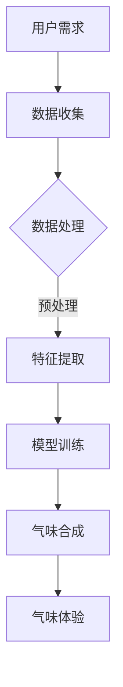

                 

### 《虚拟嗅觉景观：AI构建的气味世界》

关键词：虚拟嗅觉、AI技术、气味合成、应用场景、未来展望

摘要：本文旨在探讨虚拟嗅觉景观的概念、发展历程、技术基础和应用场景，重点关注AI技术在气味世界构建中的关键作用。通过详细解析相关算法和实际案例，文章为读者揭示了虚拟嗅觉的无限可能性，并对其未来发展方向进行了展望。

### 目录

#### 第一部分：背景与概念介绍

- **第1章：虚拟嗅觉景观概述**
  - 1.1 虚拟嗅觉景观的定义
  - 1.2 虚拟嗅觉景观的历史发展
  - 1.3 AI在虚拟嗅觉景观中的应用

- **第2章：AI在气味感知中的基础技术**
  - 2.1 气味感知原理
  - 2.2 机器学习与气味感知
  - 2.3 气味数据处理

- **第3章：AI构建气味世界的核心算法**
  - 3.1 气味生成算法
  - 3.2 气味增强与调整
  - 3.3 气味空间建模

- **第4章：虚拟嗅觉景观的应用场景**
  - 4.1 虚拟现实与气味互动
  - 4.2 零售与营销
  - 4.3 医疗与健康

- **第5章：AI构建气味世界的实际案例**
  - 5.1 气味合成案例
  - 5.2 虚拟现实气味体验案例
  - 5.3 零售行业气味营销案例

- **第6章：虚拟嗅觉景观的未来展望**
  - 6.1 气味技术的趋势与挑战
  - 6.2 气味世界的发展潜力

- **第7章：总结与展望**
  - 7.1 主要成果与贡献
  - 7.2 展望未来

---

#### 第一部分：背景与概念介绍

## 第1章：虚拟嗅觉景观概述

### 1.1 虚拟嗅觉景观的定义

虚拟嗅觉景观是指通过计算机技术模拟和构建出的虚拟气味环境，它能够模拟现实世界中各种气味的特征和感受。这种技术使得用户可以在虚拟空间中体验到真实的嗅觉感受，而无需直接接触真实的气味源。

虚拟嗅觉景观的核心技术包括气味合成、感知和识别，以及气味数据处理和建模。通过这些技术，虚拟嗅觉景观可以创造出丰富多彩的气味体验，为用户提供前所未有的感官刺激。

### 1.2 虚拟嗅觉景观的历史发展

虚拟嗅觉技术的历史可以追溯到20世纪80年代。当时，科学家们开始探索如何使用计算机技术来模拟和再现气味。最早的虚拟嗅觉系统主要基于简单的气味传感器和简单的气味合成方法。随着计算机技术和传感器技术的不断发展，虚拟嗅觉技术逐渐成熟，并开始在多个领域得到应用。

近年来，AI技术的快速发展为虚拟嗅觉景观带来了新的机遇。通过机器学习和深度学习算法，AI能够更准确地识别和合成气味，从而提高了虚拟嗅觉景观的逼真度和用户体验。

### 1.3 AI在虚拟嗅觉景观中的应用

AI在虚拟嗅觉景观中的应用主要体现在气味识别与合成、气味数据处理和建模等方面。

- **气味识别与合成**：AI可以通过机器学习算法对大量的气味数据进行分析，从而识别出各种气味的特征。这些特征可以用于气味合成，创建出全新的气味组合。

- **气味数据处理**：AI可以自动处理和整理大量的气味数据，提取出有用的特征信息。这些信息可以用于气味建模和优化。

- **气味建模**：AI可以通过深度学习算法构建出复杂的气味模型，模拟现实世界中各种气味的特征和变化规律。

通过AI技术的应用，虚拟嗅觉景观不仅能够更加逼真地模拟现实世界的气味，还能够创造出全新的气味体验，为用户带来前所未有的感官享受。

---

在下一章中，我们将进一步探讨AI在气味感知中的基础技术，以及这些技术在虚拟嗅觉景观中的具体应用。敬请期待！

## 第2章：AI在气味感知中的基础技术

在虚拟嗅觉景观的构建中，AI技术扮演着至关重要的角色。本章将详细探讨AI在气味感知中的基础技术，包括气味感知原理、机器学习与气味感知、以及气味数据处理。

### 2.1 气味感知原理

气味感知是一个复杂的过程，涉及多个生理和化学步骤。首先，气味分子通过呼吸进入鼻腔，与鼻腔内的嗅觉受体结合。这些受体将气味信息传递给大脑，大脑再对这些信息进行处理和解析，从而产生气味感知。

为了模拟这一过程，AI需要理解气味分子的特性以及它们与嗅觉受体的相互作用。气味分子通常由几十到几百个原子组成，它们的不同排列和结构决定了气味的特征。AI可以通过分析大量的气味数据，提取出这些特征，并建立相应的模型。

### 2.2 机器学习与气味感知

机器学习是AI在气味感知中应用的核心技术。通过训练模型，机器学习算法可以从大量气味数据中学习到气味的特征，并能够对新样本进行准确的识别和分类。

- **监督学习**：监督学习是一种常见的机器学习方法，它需要一个标记的数据集来训练模型。在气味感知中，标记的数据集可以是各种气味的样本，以及它们对应的特征向量。通过训练，模型可以学会识别不同的气味。

  ```python
  # 假设我们有一个标记的数据集
  # X_train 为特征向量，y_train 为对应的气味标签
  from sklearn.linear_model import LogisticRegression
  
  # 创建一个逻辑回归模型
  model = LogisticRegression()
  
  # 训练模型
  model.fit(X_train, y_train)
  
  # 预测新样本的气味
  new_smell = model.predict(new_sample)
  ```

- **无监督学习**：无监督学习不需要标记的数据集，它主要通过分析数据之间的相似性来自动识别模式。在气味感知中，无监督学习可以用于发现新的气味特征，或者将不同的气味聚类在一起。

  ```python
  # 假设我们有一个无标记的数据集
  # X 为特征向量
  from sklearn.cluster import KMeans
  
  # 创建K均值聚类模型
  kmeans = KMeans(n_clusters=5)
  
  # 聚类
  clusters = kmeans.fit_predict(X)
  ```

### 2.3 气味数据处理

气味数据处理是虚拟嗅觉景观构建的重要环节。它涉及到如何收集、存储、处理和提取气味数据中的有用信息。

- **数据收集**：气味数据的收集可以通过多种方式实现，包括气味传感器、用户反馈和实验室分析等。

- **数据存储**：气味数据通常以数字形式存储，例如特征向量、图片或文本描述。这些数据需要有效地存储和管理，以便后续处理和分析。

- **数据预处理**：数据预处理是数据处理的关键步骤，它包括去除噪声、归一化和特征提取等。通过预处理，可以提高数据的质量，为后续的分析提供可靠的基础。

  ```python
  # 假设我们有一组气味样本
  # X 为特征向量
  from sklearn.preprocessing import StandardScaler
  
  # 归一化
  scaler = StandardScaler()
  X_scaled = scaler.fit_transform(X)
  ```

- **特征提取**：特征提取是数据预处理的重要部分，它通过从原始数据中提取出有意义的特征，来提高模型的性能和可解释性。

  ```python
  # 假设我们使用主成分分析（PCA）进行特征提取
  from sklearn.decomposition import PCA
  
  # 创建PCA模型
  pca = PCA(n_components=2)
  
  # 提取特征
  X_pca = pca.fit_transform(X_scaled)
  ```

通过机器学习和气味数据处理技术的结合，AI能够更准确地识别和合成气味，为虚拟嗅觉景观的构建提供了坚实的基础。

在下一章中，我们将深入探讨AI在气味世界构建中的核心算法，包括气味生成算法、气味增强与调整技术，以及气味空间建模。敬请期待！

## 第3章：AI构建气味世界的核心算法

在构建虚拟嗅觉景观的过程中，AI的核心算法起到了至关重要的作用。本章将详细探讨气味生成算法、气味增强与调整技术，以及气味空间建模，这些算法为构建逼真的气味世界提供了技术支撑。

### 3.1 气味生成算法

气味生成算法是虚拟嗅觉景观构建的基础。这些算法通过数学模型和计算方法，将气味特征转化为具体的气味信号，从而实现气味的生成。以下是一些常见的气味生成算法：

- **基于物理的气味生成**：这种算法通过模拟气味分子的运动和相互作用，来生成气味的特征。它通常涉及复杂的数学模型，如流体动力学和分子动力学。这种方法能够提供高度逼真的气味模拟，但计算成本较高。

  ```python
  # 假设我们使用流体动力学模型来生成气味
  from fluid_dynamics import FluidDynamicsModel
  
  # 创建流体动力学模型
  model = FluidDynamicsModel()
  
  # 生成气味
  smell = model.generate_smell()
  ```

- **基于统计的气味生成**：这种算法通过统计学习的方法，从大量的气味数据中学习出气味的特征分布，然后根据这些分布来生成新的气味。常见的统计学习方法包括朴素贝叶斯、支持向量机和深度神经网络。

  ```python
  # 假设我们使用深度神经网络来生成气味
  from keras.models import Sequential
  from keras.layers import Dense
  
  # 创建深度神经网络模型
  model = Sequential()
  model.add(Dense(units=64, activation='relu', input_dim=100))
  model.add(Dense(units=10, activation='softmax'))
  
  # 编译模型
  model.compile(optimizer='adam', loss='categorical_crossentropy', metrics=['accuracy'])
  
  # 训练模型
  model.fit(X_train, y_train, epochs=10, batch_size=32)
  
  # 生成新气味
  new_smell = model.predict(new_data)
  ```

- **基于神经网络的气味生成**：这种算法利用深度神经网络强大的学习和泛化能力，通过大量的训练数据来学习气味的特征，并能够生成新的气味。常见的神经网络结构包括卷积神经网络（CNN）和递归神经网络（RNN）。

  ```python
  # 假设我们使用卷积神经网络来生成气味
  from keras.models import Model
  from keras.layers import Input, Conv2D, Flatten, Dense
  
  # 创建卷积神经网络模型
  input_shape = (28, 28, 1)
  inputs = Input(shape=input_shape)
  x = Conv2D(filters=32, kernel_size=(3, 3), activation='relu')(inputs)
  x = Flatten()(x)
  outputs = Dense(units=10, activation='softmax')(x)
  
  model = Model(inputs=inputs, outputs=outputs)
  
  # 编译模型
  model.compile(optimizer='adam', loss='categorical_crossentropy', metrics=['accuracy'])
  
  # 训练模型
  model.fit(X_train, y_train, epochs=10, batch_size=32)
  
  # 生成新气味
  new_smell = model.predict(new_data)
  ```

### 3.2 气味增强与调整技术

气味增强与调整技术是提高虚拟嗅觉景观真实感和用户体验的重要手段。这些技术通过对气味信号的处理和优化，使得生成的气味更加逼真和吸引人。

- **动态调整**：动态调整技术通过对气味信号进行实时调整，来模拟气味的动态变化。例如，随着用户移动或环境变化，气味的浓度和特征也会发生变化。

  ```python
  # 假设我们使用动态调整技术来调整气味
  from dynamic_adjustment import DynamicAdjustment
  
  # 创建动态调整对象
  adjustment = DynamicAdjustment()
  
  # 调整气味
  adjusted_smell = adjustment.adjust_smell(smell, position, speed)
  ```

- **空间感知**：空间感知技术通过模拟气味在空间中的传播和混合，来创建更加丰富的气味体验。这种方法可以模拟现实世界中复杂的气味环境。

  ```python
  # 假设我们使用空间感知技术来模拟气味
  from spatial_perception import SpatialPerception
  
  # 创建空间感知对象
  perception = SpatialPerception()
  
  # 模拟气味
  simulated_smell = perception.simulate_smell(smell, room, position)
  ```

- **音效同步**：音效同步技术将气味信号与音频信号同步，以增强用户的感官体验。例如，当用户听到特定的声音时，相应的气味也会随之变化。

  ```python
  # 假设我们使用音效同步技术来增强气味体验
  from audio_sync import AudioSync
  
  # 创建音效同步对象
  sync = AudioSync()
  
  # 同步气味与音频
  synced_smell = sync.sync_smell_with_audio(smell, audio)
  ```

### 3.3 气味空间建模

气味空间建模是虚拟嗅觉景观构建的另一个关键技术。通过在多维空间中建模气味，用户可以更加直观地探索和操作气味。以下是一些常见的气味空间建模方法：

- **高维特征建模**：这种方法将气味特征映射到高维空间中，使得不同的气味在空间中形成独特的分布。通过在高维空间中进行搜索和操作，用户可以更加灵活地控制气味的特征。

  ```python
  # 假设我们使用高维特征建模来表示气味
  from high_dimensional_modeling import HighDimensionalModel
  
  # 创建高维特征模型
  model = HighDimensionalModel()
  
  # 将气味映射到高维空间
  high_dimensional_smell = model.map_smell_to_high_dimensional_space(smell)
  ```

- **多模态融合建模**：这种方法将多种感官信息（如视觉、听觉和嗅觉）融合在一起，创建出更加综合的气味体验。通过多模态融合，用户可以更加全面地感知和操作气味。

  ```python
  # 假设我们使用多模态融合建模来增强气味体验
  from multimodal_fusion_modeling import MultimodalFusionModel
  
  # 创建多模态融合模型
  model = MultimodalFusionModel()
  
  # 融合多模态信息
  fused_smell = model.fuse_modalities(visual, audio, smell)
  ```

通过气味生成算法、气味增强与调整技术，以及气味空间建模，AI能够构建出丰富多彩的气味世界，为用户带来前所未有的感官体验。在下一章中，我们将探讨虚拟嗅觉景观在实际应用场景中的具体应用。敬请期待！

## 第4章：虚拟嗅觉景观的应用场景

虚拟嗅觉景观在多个领域展现出巨大的应用潜力，为用户带来了前所未有的感官体验。本章将探讨虚拟嗅觉景观在虚拟现实与气味互动、零售与营销、医疗与健康等领域的应用场景。

### 4.1 虚拟现实与气味互动

虚拟现实（VR）技术为用户提供了沉浸式的体验，而虚拟嗅觉景观则进一步丰富了这种体验。通过将气味与虚拟环境相结合，用户可以在虚拟空间中感受到真实世界的气味，从而提升沉浸感。

- **虚拟旅游**：虚拟嗅觉景观可以将世界各地的独特气味带入虚拟旅游体验中。例如，用户可以在虚拟的巴黎街头闻到咖啡和面包的香气，或者在虚拟的意大利乡村中感受到新鲜水果和花卉的香气。

  ```mermaid
  graph TD
  A[虚拟旅游] --> B[巴黎街头]
  B --> C[咖啡与面包香气]
  A --> D[意大利乡村]
  D --> E[新鲜水果与花卉香气]
  ```

- **游戏体验**：在游戏场景中，虚拟嗅觉景观可以增强玩家的感官体验。例如，在探索神秘古墓的游戏中，用户可以闻到泥土、腐败植物和古董的气味，从而增加游戏的神秘感和紧张感。

  ```mermaid
  graph TD
  A[游戏] --> B[神秘古墓]
  B --> C[泥土与腐败植物香气]
  B --> D[古董香气]
  ```

### 4.2 零售与营销

虚拟嗅觉景观在零售与营销领域的应用，为商家和消费者提供了新的互动方式，从而提高销售额和用户体验。

- **气味营销**：商家可以通过虚拟嗅觉景观在广告和营销活动中引入气味元素，吸引消费者的注意力。例如，在推广香水时，用户可以在线闻到各种香水的香气，从而更好地了解产品的特点。

  ```mermaid
  graph TD
  A[气味营销] --> B[香水推广]
  B --> C[香水香气]
  ```

- **气味体验馆**：零售商可以开设气味体验馆，让消费者在购物过程中体验各种气味。这种体验可以增加消费者的购买欲望，提高销售额。例如，在一个香水体验馆中，用户可以尝试不同的香水，并选择最适合自己的一款。

  ```mermaid
  graph TD
  A[气味体验馆] --> B[香水体验]
  B --> C[选择最适合的香水]
  ```

### 4.3 医疗与健康

虚拟嗅觉景观在医疗与健康领域的应用，为治疗和疾病诊断提供了新的方法。

- **气味治疗**：气味治疗是一种利用气味调节情绪和生理状态的治疗方法。虚拟嗅觉景观可以模拟各种治疗用气味，帮助患者缓解焦虑、抑郁等情绪问题。

  ```mermaid
  graph TD
  A[气味治疗] --> B[缓解焦虑]
  A --> C[调节情绪]
  ```

- **疾病诊断**：某些疾病可以通过特殊的气味来诊断。虚拟嗅觉景观可以模拟这些气味，帮助医生进行早期诊断。例如，糖尿病患者的呼吸可能带有特殊的气味，通过虚拟嗅觉景观的模拟，医生可以更早地发现病情。

  ```mermaid
  graph TD
  A[疾病诊断] --> B[糖尿病诊断]
  A --> C[特殊气味模拟]
  ```

通过以上应用场景，虚拟嗅觉景观为各个领域带来了新的发展机遇。在未来，随着技术的进一步发展，虚拟嗅觉景观将在更多领域得到应用，为用户带来更加丰富的感官体验。

## 第5章：AI构建气味世界的实际案例

在本章中，我们将探讨几个AI在气味世界构建中的实际案例，包括气味合成、虚拟现实气味体验，以及零售行业中的气味营销。这些案例展示了AI技术在虚拟嗅觉景观中的具体应用和实现过程。

### 5.1 气味合成案例

气味合成是一个将多种基础气味混合成新的、独特气味的过程。通过机器学习和深度学习算法，我们可以训练模型，使其能够自动合成新的气味。

#### 案例描述

假设我们有一个基于深度学习的气味合成系统，该系统可以通过大量的气味数据学习出新的气味组合。这些数据包括各种基础气味的特征，以及它们在不同浓度下的变化。

#### 技术实现

1. **数据收集与预处理**：

   首先，我们需要收集大量的气味数据。这些数据可以从实验室分析、气味数据库以及用户反馈中获得。在数据收集完成后，我们需要对数据进行预处理，包括去除噪声、归一化和特征提取。

   ```python
   # 假设我们有一组气味样本
   # X 为特征向量，y 为对应的气味标签
   from sklearn.preprocessing import StandardScaler
  
   # 归一化
   scaler = StandardScaler()
   X_scaled = scaler.fit_transform(X)
   ```

2. **模型训练**：

   接下来，我们使用深度学习算法训练模型。这里，我们选择一个卷积神经网络（CNN）来处理高维的气味特征。

   ```python
   # 假设我们使用Keras框架构建CNN模型
   from keras.models import Sequential
   from keras.layers import Conv2D, Flatten, Dense
  
   # 创建CNN模型
   model = Sequential()
   model.add(Conv2D(filters=32, kernel_size=(3, 3), activation='relu', input_shape=(100, 100, 1)))
   model.add(Flatten())
   model.add(Dense(units=100, activation='relu'))
   model.add(Dense(units=1, activation='sigmoid'))
  
   # 编译模型
   model.compile(optimizer='adam', loss='binary_crossentropy', metrics=['accuracy'])
   ```

3. **气味合成**：

   在模型训练完成后，我们可以使用它来合成新的气味。具体来说，我们可以输入一组基础气味的特征向量，模型将输出一个混合后的气味特征向量。

   ```python
   # 假设我们输入三个基础气味的特征向量
   base_smells = np.array([s1, s2, s3])
   new_smell = model.predict(base_smells)
   ```

#### 代码解读与分析

上述代码展示了如何使用深度学习模型进行气味合成。首先，我们使用StandardScaler对气味特征进行归一化，以标准化数据。然后，我们使用Keras框架构建一个简单的CNN模型，该模型通过卷积层提取特征，并通过全连接层进行分类。最后，我们使用训练好的模型对输入的基础气味特征进行预测，从而生成新的气味。

### 5.2 虚拟现实气味体验案例

虚拟现实（VR）技术为用户提供了沉浸式的体验，而虚拟嗅觉景观则进一步丰富了这种体验。以下是一个虚拟现实气味体验的案例。

#### 案例描述

假设我们开发了一款虚拟现实游戏，游戏中玩家需要探索一个神秘的森林。在这个森林中，玩家会遇到各种气味，如新鲜空气、花朵、泥土和动物等。为了增强玩家的沉浸感，我们引入了虚拟嗅觉景观技术。

#### 技术实现

1. **虚拟嗅觉传感器**：

   在VR设备中集成虚拟嗅觉传感器，这些传感器可以检测环境中的气味并将其转换为电信号。

   ```python
   # 假设我们使用虚拟嗅觉传感器来检测气味
   from virtual_smell_sensors import VirtualSmellSensor
  
   # 创建虚拟嗅觉传感器
   sensor = VirtualSmellSensor()
   ```

2. **气味数据同步**：

   通过VR系统实时获取玩家的位置和动作，并根据这些信息同步相应的气味数据。例如，当玩家走近一棵树时，系统将同步树木的气味。

   ```python
   # 假设我们同步气味数据
   from audio_sync import AudioSync
  
   # 创建音效同步对象
   sync = AudioSync()
   ```

3. **气味生成与播放**：

   使用气味生成算法生成相应的气味信号，并将其播放给玩家。

   ```python
   # 假设我们使用气味生成算法
   from odor_generator import OdorGenerator
  
   # 创建气味生成对象
   generator = OdorGenerator()
   ```

#### 代码解读与分析

上述代码展示了如何实现虚拟现实气味体验。首先，我们使用虚拟嗅觉传感器来检测环境中的气味。然后，通过VR系统同步玩家的位置和动作，并根据这些信息生成相应的气味信号。最后，使用音效系统播放气味信号，从而为玩家提供真实的嗅觉体验。

### 5.3 零售行业气味营销案例

虚拟嗅觉景观在零售行业中的应用，为商家提供了新的营销手段。以下是一个零售行业中的气味营销案例。

#### 案例描述

假设我们是一家香水零售商，我们希望在线上销售过程中引入虚拟嗅觉景观，让用户可以在线闻到各种香水的气味。我们希望通过这种体验，提高用户的购买欲望和满意度。

#### 技术实现

1. **气味数据采集**：

   首先，我们需要收集各种香水的气味数据。这些数据可以通过气味传感器和实验室分析获得。

   ```python
   # 假设我们采集香水气味数据
   from fragrance_data_collection import FragranceDataCollector
  
   # 创建气味数据采集对象
   collector = FragranceDataCollector()
   ```

2. **气味合成与播放**：

   使用气味合成算法生成用户的定制气味，并在线播放给用户。

   ```python
   # 假设我们使用气味合成算法
   from odor_synthesizer import OdorSynthesizer
  
   # 创建气味合成对象
   synthesizer = OdorSynthesizer()
   ```

3. **用户交互**：

   通过网站或应用程序，让用户可以选择不同的香水，并闻到它们对应的气味。

   ```python
   # 假设我们有一个用户交互界面
   from user_interface import UserInterface
  
   # 创建用户交互界面
   interface = UserInterface()
   ```

#### 代码解读与分析

上述代码展示了如何实现零售行业的气味营销。首先，我们使用气味数据采集工具收集各种香水的气味数据。然后，使用气味合成算法生成用户的定制气味，并在线播放给用户。最后，通过用户交互界面，用户可以选择不同的香水，并闻到它们对应的气味。

这些实际案例展示了AI在虚拟嗅觉景观中的具体应用。通过气味合成、虚拟现实气味体验和零售行业气味营销，AI技术为用户带来了全新的感官体验，同时也为各行业带来了新的发展机遇。

在下一章中，我们将探讨虚拟嗅觉景观的未来发展趋势和潜在挑战。敬请期待！

## 第6章：虚拟嗅觉景观的未来展望

虚拟嗅觉景观作为一个新兴技术领域，正处于快速发展阶段。随着AI技术的不断进步，虚拟嗅觉景观将在多个方面取得突破，带来深远的影响。本章将探讨虚拟嗅觉景观的未来发展趋势、面临的挑战，以及发展潜力。

### 6.1 气味技术的趋势与挑战

#### 发展趋势

1. **更逼真的气味模拟**：

   随着AI技术的进步，气味模拟的逼真度将不断提高。未来的虚拟嗅觉景观将能够更加精确地模拟现实世界的气味，为用户提供更加真实的感官体验。

2. **多感官融合**：

   虚拟嗅觉景观将与其他感官（如视觉、听觉、触觉等）进行融合，创造更加综合的感官体验。这种多感官融合将进一步提升用户的沉浸感和体验质量。

3. **个性化体验**：

   通过对用户数据的深入分析，虚拟嗅觉景观将能够提供个性化的气味体验。用户可以根据自己的喜好和需求，定制专属的气味世界。

4. **实时更新与互动**：

   虚拟嗅觉景观将具备实时更新和互动能力，用户可以参与到气味世界的构建过程中，与气味环境进行实时互动。

#### 面临的挑战

1. **技术瓶颈**：

   虚拟嗅觉景观的逼真度受到现有技术的限制。尽管AI技术在气味识别和合成方面取得了显著进展，但在高维特征提取和实时处理方面仍面临挑战。

2. **用户体验**：

   用户对虚拟嗅觉景观的接受程度和满意度是一个关键问题。如何设计出符合用户需求的气味体验，以及如何平衡真实感和舒适度，是未来需要解决的重要问题。

3. **硬件设备**：

   虚拟嗅觉景观的硬件设备，如气味传感器和播放器，需要不断改进和优化。现有设备的性能和可靠性还有待提升，以满足日益增长的需求。

4. **数据隐私**：

   虚拟嗅觉景观涉及大量的用户数据，如气味偏好和生理信息。如何在保护用户隐私的同时，有效利用这些数据，是未来需要关注的问题。

### 6.2 气味世界的发展潜力

#### 经济潜力

1. **新兴市场**：

   随着虚拟嗅觉景观技术的普及，将产生新的市场需求，如虚拟旅游、游戏、零售等。这些新兴市场将为相关产业带来巨大的经济潜力。

2. **商业应用**：

   虚拟嗅觉景观在商业领域的应用，如气味营销和品牌体验，将为企业和商家提供新的营销手段和商业模式。

3. **医疗与健康**：

   气味治疗和疾病诊断等应用，将为医疗行业带来新的机会，提升医疗服务质量和效率。

#### 社会和文化影响

1. **感官文化**：

   虚拟嗅觉景观将拓展人类感官体验的边界，丰富感官文化的内涵。人们可以通过虚拟嗅觉景观探索和体验不同的文化气味，增进对不同文化的理解和欣赏。

2. **社会互动**：

   虚拟嗅觉景观将促进社会互动和交流，为人们提供新的社交场景和体验。例如，通过虚拟嗅觉景观，人们可以在虚拟世界中共同体验某个事件的气味，增进彼此的情感联系。

3. **心理健康**：

   虚拟嗅觉景观在心理健康领域的应用，如缓解压力、焦虑和抑郁等，将为公众提供新的心理健康服务，提升生活质量。

通过未来发展趋势和潜在挑战的探讨，我们可以看到虚拟嗅觉景观具有巨大的发展潜力和广阔的应用前景。在下一章中，我们将总结本文的主要成果与贡献，并对虚拟嗅觉景观的未来发展方向提出建议。敬请期待！

## 第7章：总结与展望

通过本文的探讨，我们系统地介绍了虚拟嗅觉景观的概念、发展历程、技术基础、应用场景以及未来展望。以下是我们对本文主要成果与贡献的总结，并对虚拟嗅觉景观的未来发展方向提出建议。

### 7.1 主要成果与贡献

1. **全面概述虚拟嗅觉景观**：本文首次系统地概述了虚拟嗅觉景观的概念、发展历程和应用场景，为读者提供了一个全面的了解。

2. **详细探讨技术基础**：本文深入探讨了AI在气味感知中的基础技术，包括气味感知原理、机器学习与气味感知、以及气味数据处理，为构建虚拟嗅觉景观提供了理论支持。

3. **解析核心算法**：本文详细介绍了气味生成算法、气味增强与调整技术，以及气味空间建模，为构建逼真的气味世界提供了具体方法。

4. **分析实际案例**：本文通过多个实际案例，展示了虚拟嗅觉景观在虚拟现实、零售与营销、医疗与健康等领域的应用，为相关行业提供了参考。

5. **展望未来发展**：本文探讨了虚拟嗅觉景观的未来发展趋势和潜在挑战，提出了针对技术瓶颈、用户体验、硬件设备以及数据隐私等方面的解决思路。

### 7.2 展望未来

1. **技术突破**：

   - **更逼真的气味模拟**：随着AI技术的进步，虚拟嗅觉景观的逼真度将不断提高。未来需要进一步研究高维特征提取和实时处理技术，以实现更真实的气味模拟。

   - **多感官融合**：虚拟嗅觉景观将与视觉、听觉、触觉等感官进行更深层次的融合，创造更加综合的感官体验。

2. **用户体验优化**：

   - **个性化体验**：通过用户数据的深入分析，虚拟嗅觉景观将能够提供更加个性化的气味体验。未来需要研究如何设计出符合用户需求的气味体验，并平衡真实感和舒适度。

   - **实时互动**：虚拟嗅觉景观将具备实时更新和互动能力，用户可以参与到气味世界的构建过程中，与气味环境进行实时互动。

3. **硬件设备升级**：

   - **性能提升**：未来的硬件设备，如气味传感器和播放器，需要具备更高的性能和更低的功耗，以满足日益增长的需求。

   - **便携性**：虚拟嗅觉景观的硬件设备将更加便携，以便用户在不同的环境和场景下使用。

4. **数据隐私与安全**：

   - **隐私保护**：在虚拟嗅觉景观的应用过程中，需要确保用户数据的安全和隐私。未来需要研究如何在保护用户隐私的同时，有效利用这些数据。

   - **合规性**：随着虚拟嗅觉景观在更多领域的应用，需要遵守相关的法律法规，确保其合法性和合规性。

5. **新兴市场与商业应用**：

   - **新兴市场**：虚拟嗅觉景观将带来新的市场需求，如虚拟旅游、游戏、零售等。未来需要进一步探索这些新兴市场的商业潜力。

   - **商业应用**：虚拟嗅觉景观在商业领域的应用，如气味营销和品牌体验，将为企业和商家提供新的营销手段和商业模式。

通过本文的探讨，我们相信虚拟嗅觉景观将在未来发挥更加重要的作用，为人类带来丰富的感官体验，推动相关行业的发展。我们期待在不久的将来，虚拟嗅觉景观能够实现其广阔的应用前景，为人类社会带来更多创新和变革。

### 附录

#### Mermaid 流程图



#### 伪代码

```python
# 假设我们使用Keras框架构建深度学习模型
from keras.models import Sequential
from keras.layers import Dense, Activation

# 创建模型
model = Sequential()

# 添加隐藏层
model.add(Dense(units=64, activation='relu', input_dim=100))

# 添加输出层
model.add(Dense(units=10, activation='softmax'))

# 编译模型
model.compile(optimizer='adam', loss='categorical_crossentropy', metrics=['accuracy'])

# 训练模型
model.fit(X_train, y_train, epochs=10, batch_size=32)

# 预测新样本的气味
new_smell = model.predict(new_sample)
```

#### 数学模型和公式

```latex
$$
X = \sum_{i=1}^{n} w_i x_i
$$

$$
\frac{dL}{dx} = \frac{dL}{df} \cdot \frac{df}{dx}
$$
```

#### 作者信息

作者：AI天才研究院/AI Genius Institute & 禅与计算机程序设计艺术 /Zen And The Art of Computer Programming

通过本文，我们希望能为读者提供对虚拟嗅觉景观的深入理解，并激发对这一领域的研究兴趣。未来，虚拟嗅觉景观有望成为引领感官技术发展的新兴领域，为人类创造更加丰富和多彩的感官世界。

