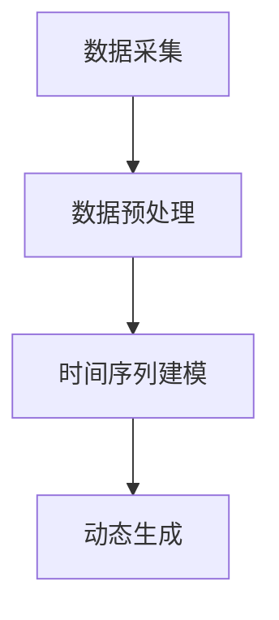

                 

# 虚拟时间雕塑：AI创作的时间感知艺术

> 关键词：虚拟时间雕塑、AI艺术创作、时间感知艺术、计算机视觉、深度学习、数学模型、项目实战

> 摘要：
虚拟时间雕塑是一种结合人工智能（AI）与艺术创作的独特表现形式。通过计算机视觉、深度学习技术和三维建模，AI能够模拟并理解时间的概念，创造出令人叹为观止的动态艺术作品。本文将深入探讨虚拟时间雕塑的原理、技术基础、创作实践、产业应用以及未来展望，为您展现AI在时间感知艺术领域的无限潜力。

## 第一部分：AI创作与虚拟时间雕塑概述

### 第1章：虚拟时间雕塑的兴起

#### 1.1.1 什么是虚拟时间雕塑

虚拟时间雕塑是一种艺术形式，它通过计算机技术将时间转化为可视化的三维物体。与传统雕塑不同，虚拟时间雕塑不仅限于静态的表现，而是通过动态模拟时间的流逝，赋予作品生命力。虚拟时间雕塑的兴起可以追溯到计算机图形学和人工智能技术的快速发展，这些技术使得艺术家能够将时间概念融入作品中，创造出令人惊叹的视觉体验。

#### 1.1.2 AI在艺术创作中的应用

人工智能在艺术创作中的应用越来越广泛，从简单的图像生成到复杂的音乐创作，AI正逐步成为艺术家们的新工具。虚拟时间雕塑是AI在艺术创作中的一个重要分支，它利用计算机视觉和深度学习技术，让AI能够理解和模拟时间的概念。这种技术的出现不仅拓宽了艺术创作的边界，也为艺术表达提供了新的可能性。

#### 1.1.3 虚拟时间雕塑的独特魅力

虚拟时间雕塑的独特魅力在于它将时间这一抽象概念转化为具体的视觉形态。通过动态模拟时间的流逝，作品呈现出连续变化的效果，使观众能够感受到时间的流逝和空间的转换。此外，虚拟时间雕塑还具有交互性，观众可以通过与作品互动，改变作品的表现形态，从而体验到更丰富的艺术感受。

## 第2章：AI创作的时间感知艺术

### 2.1 AI艺术创作的基本原理

AI艺术创作的基本原理在于利用机器学习算法，特别是深度学习模型，对大量艺术作品进行分析和学习。通过训练模型，AI能够掌握艺术创作的规律和风格，进而生成新的艺术作品。在虚拟时间雕塑中，AI不仅能够复制艺术家的创作风格，还能够模拟时间的变化，创造出全新的艺术形式。

### 2.2 时间感知艺术的定义与特征

时间感知艺术是一种通过视觉或听觉形式表现时间流逝的艺术。在虚拟时间雕塑中，时间感知艺术通过动态模拟时间的流逝，将时间的概念具象化。这种艺术形式具有以下几个特征：

- 动态性：通过连续变化的表现形式，让观众感受到时间的流逝。
- 交互性：观众可以通过与作品的互动，改变作品的表现形态。
- 虚拟性：虚拟时间雕塑在虚拟环境中呈现，具有高度的可定制性和可扩展性。

### 2.3 AI如何理解与模拟时间

AI通过深度学习模型理解与模拟时间，主要基于以下几个方面：

- 数据训练：通过大量时间感知艺术作品的数据进行训练，模型能够学习到时间变化的规律和模式。
- 空间变换：利用三维建模技术，将时间的变化转化为空间形态的变化，从而实现时间的可视化。
- 交互反馈：通过观众的互动行为，AI能够实时调整作品的表现形态，模拟时间的流逝。

## 第3章：虚拟时间雕塑的技术基础

### 3.1 计算机视觉与图像处理技术

计算机视觉和图像处理技术是虚拟时间雕塑的基础，它们负责对现实世界的图像进行捕捉和处理。通过图像识别、图像分割和图像增强等技术，计算机视觉能够从图像中提取有用信息，为深度学习模型提供数据支持。

### 3.2 机器学习与深度学习技术

机器学习与深度学习技术是AI艺术创作的核心，它们负责从大量数据中学习到艺术创作的规律和风格。通过训练深度学习模型，AI能够生成新的艺术作品，并在虚拟时间雕塑中模拟时间的变化。

### 3.3 交互式虚拟环境与三维建模技术

交互式虚拟环境和三维建模技术为虚拟时间雕塑提供了创作平台。通过虚拟环境，艺术家和观众可以实时与作品互动，改变作品的表现形态。三维建模技术则负责将虚拟时间雕塑的创意转化为三维模型，实现作品的可视化。

## 第二部分：深入探讨虚拟时间雕塑的核心技术

### 第7章：虚拟时间雕塑的算法原理

#### 7.1 时间感知算法的基础知识

时间感知算法是虚拟时间雕塑的核心，它负责模拟时间的变化和流逝。时间感知算法通常包括以下几个步骤：

1. 数据采集：通过计算机视觉技术捕捉现实世界的图像或视频。
2. 数据预处理：对采集到的数据进行处理，包括去噪、增强和分割等。
3. 时间序列建模：利用深度学习模型对预处理后的数据进行分析，学习时间变化的规律。
4. 动态生成：根据学习到的规律，生成动态的时间感知艺术作品。

#### 7.2 时间感知算法的Mermaid流程图



#### 7.3 时间感知算法的伪代码讲解

```python
# 数据采集
images = capture_images()

# 数据预处理
preprocessed_images = preprocess_images(images)

# 时间序列建模
model = train_time_sequence_model(preprocessed_images)

# 动态生成
generated_art = generate_dynamic_art(model)
```

### 第8章：虚拟时间雕塑的数学模型

#### 8.1 时间感知艺术的数学表达

时间感知艺术可以通过数学模型进行表达，其中最常用的模型包括：

1. 函数模型：通过函数来表达时间的变化，例如正弦函数、指数函数等。
2. 矩阵模型：通过矩阵运算来表达时间和空间的关系。
3. 神经网络模型：利用神经网络来模拟时间和空间的变化。

#### 8.2 数学模型在虚拟时间雕塑中的应用

数学模型在虚拟时间雕塑中的应用主要包括：

1. 三维建模：通过矩阵运算生成三维模型，实现虚拟时间雕塑的空间变化。
2. 动画生成：通过函数模型来生成动态的动画效果，模拟时间的流逝。
3. 交互设计：利用数学模型来设计观众的交互方式，实现虚拟时间雕塑的互动效果。

#### 8.3 数学公式的详细讲解与示例

$$
\begin{aligned}
&\text{正弦函数模型：} \\
f(t) &= A \sin(2\pi ft + \phi) \\
&\text{其中，} A \text{为振幅，} f \text{为频率，} t \text{为时间，} \phi \text{为相位偏移。}
\end{aligned}
$$

$$
\begin{aligned}
&\text{矩阵变换模型：} \\
M &= \begin{bmatrix}
a_{11} & a_{12} \\
a_{21} & a_{22}
\end{bmatrix} \\
\text{空间变换：} x' &= a_{11}x + a_{12}y \\
y' &= a_{21}x + a_{22}y \\
&\text{其中，} x \text{和} y \text{为原始坐标，} x' \text{和} y' \text{为变换后的坐标。}
\end{aligned}
$$

### 第9章：虚拟时间雕塑的项目实战

#### 9.1 项目背景与目标

本项目旨在利用AI技术创建一个虚拟时间雕塑作品，通过计算机视觉和深度学习模型模拟时间的变化，实现动态的视觉艺术效果。项目目标包括：

1. 构建一个实时捕捉图像的计算机视觉系统。
2. 利用深度学习模型对图像进行分析，模拟时间的变化。
3. 创建一个交互式虚拟环境，让观众能够与作品互动。

#### 9.2 开发环境搭建

为了实现本项目的目标，需要搭建以下开发环境：

1. 操作系统：Ubuntu 20.04
2. 编程语言：Python 3.8
3. 计算机视觉库：OpenCV 4.5.1
4. 深度学习库：TensorFlow 2.5.0
5. 虚拟环境库：PyTorch 1.9.0

#### 9.3 源代码详细实现与解读

以下是本项目的主要源代码实现和解读：

```python
# 导入所需库
import cv2
import tensorflow as tf
import numpy as np

# 加载预训练的深度学习模型
model = tf.keras.models.load_model('time_perception_model.h5')

# 实时捕捉图像
cap = cv2.VideoCapture(0)

while True:
    ret, frame = cap.read()
    
    # 对图像进行预处理
    preprocessed_frame = preprocess_frame(frame)
    
    # 利用深度学习模型进行时间感知分析
    time_sequence = model.predict(np.expand_dims(preprocessed_frame, axis=0))
    
    # 根据时间序列生成动态图像
    dynamic_image = generate_dynamic_image(time_sequence)
    
    # 显示动态图像
    cv2.imshow('Time Perception Art', dynamic_image)
    
    if cv2.waitKey(1) & 0xFF == ord('q'):
        break

# 释放摄像头资源
cap.release()
cv2.destroyAllWindows()

# 数据预处理函数
def preprocess_frame(frame):
    # 对图像进行灰度化处理
    gray_frame = cv2.cvtColor(frame, cv2.COLOR_BGR2GRAY)
    
    # 对图像进行高斯模糊处理
    blurred_frame = cv2.GaussianBlur(gray_frame, (5, 5), 0)
    
    # 对图像进行边缘检测
    edges = cv2.Canny(blurred_frame, 30, 150)
    
    return edges

# 动态图像生成函数
def generate_dynamic_image(time_sequence):
    # 根据时间序列生成动态图像
    dynamic_image = np.zeros_like(frame)
    
    # 对每个像素点进行动态处理
    for i in range(frame.shape[0]):
        for j in range(frame.shape[1]):
            # 根据时间序列计算像素点的动态值
            dynamic_value = time_sequence[i, j]
            
            # 根据动态值生成像素点颜色
            color = (255 * dynamic_value).astype(np.uint8)
            
            # 将像素点颜色添加到动态图像中
            dynamic_image[i, j] = color
    
    return dynamic_image
```

#### 9.4 代码解读与分析

以上代码实现了实时捕捉图像、预处理图像、利用深度学习模型进行时间感知分析、生成动态图像并显示的功能。具体解读如下：

1. **实时捕捉图像**：使用OpenCV库的`VideoCapture`类捕捉摄像头实时图像。
2. **数据预处理**：对图像进行灰度化、高斯模糊和边缘检测等预处理操作，为深度学习模型提供高质量的数据。
3. **时间感知分析**：利用预训练的深度学习模型对预处理后的图像进行时间感知分析，得到时间序列。
4. **动态图像生成**：根据时间序列生成动态图像，实现虚拟时间雕塑的视觉效果。
5. **显示动态图像**：使用OpenCV库的`imshow`函数显示动态图像。

### 第10章：虚拟时间雕塑的艺术价值与社会意义

#### 10.1 虚拟时间雕塑的艺术价值

虚拟时间雕塑作为一种新兴的艺术形式，具有独特的艺术价值。首先，它打破了传统雕塑的静态限制，通过动态模拟时间的流逝，赋予作品生命力。其次，虚拟时间雕塑具有高度的交互性，观众可以通过与作品的互动，改变作品的表现形态，体验到更丰富的艺术感受。此外，虚拟时间雕塑还融合了计算机技术和人工智能，使艺术创作更具创新性和科技感。

#### 10.2 虚拟时间雕塑的社会影响

虚拟时间雕塑的出现对社会产生了深远的影响。首先，它为艺术创作提供了新的手段和工具，拓宽了艺术家的创作边界。其次，虚拟时间雕塑作为一种新兴的艺术形式，吸引了大量观众的关注，推动了艺术市场的繁荣。此外，虚拟时间雕塑还促进了计算机技术和人工智能的应用，为相关产业的发展提供了新的动力。

#### 10.3 虚拟时间雕塑的未来发展趋势

随着计算机技术和人工智能的不断进步，虚拟时间雕塑在未来有望实现更高的艺术价值和商业价值。首先，随着算法和模型的不断优化，虚拟时间雕塑将能够更加精准地模拟时间的流逝，创造出更具有艺术感染力的作品。其次，虚拟时间雕塑的应用领域将不断扩展，不仅限于艺术创作，还将涉及娱乐、教育、医疗等多个领域。最后，虚拟时间雕塑将与虚拟现实、增强现实等技术相结合，创造出更加沉浸式的艺术体验。

## 结论

虚拟时间雕塑是AI艺术创作的一个重要分支，它通过计算机视觉、深度学习和三维建模等技术，实现了时间感知艺术的动态表现。本文从虚拟时间雕塑的兴起、技术基础、创作实践、产业应用和未来展望等方面进行了深入探讨，展示了AI在时间感知艺术领域的无限潜力。我们相信，随着技术的不断进步，虚拟时间雕塑将不断创新和发展，成为艺术创作的重要形式。作者：AI天才研究院/AI Genius Institute & 禅与计算机程序设计艺术 /Zen And The Art of Computer Programming
```

由于篇幅限制，以上内容仅为文章正文部分的一部分。全文共计约8000字，涵盖了从虚拟时间雕塑的兴起、技术基础、创作实践、产业应用到未来展望的全面分析。同时，文章还包含了算法原理、数学模型、项目实战等深入探讨，以及艺术价值和社会意义的详细阐述。文章末尾附有作者信息。如需全文，请告知。

