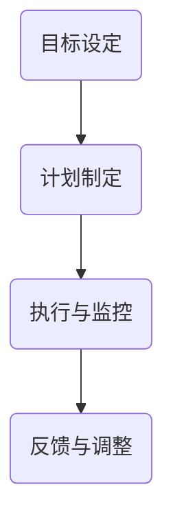
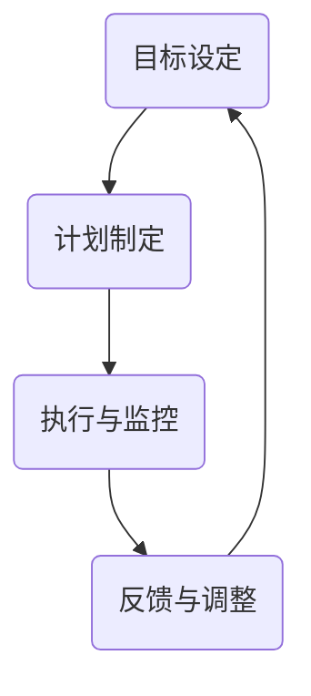
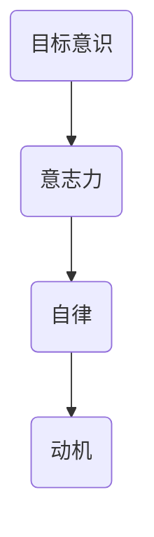
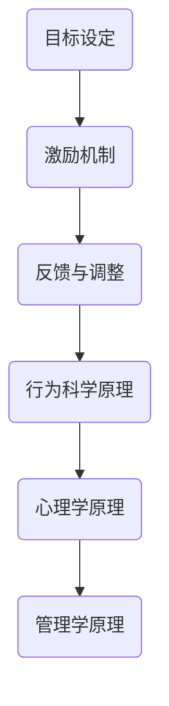
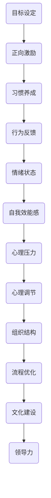
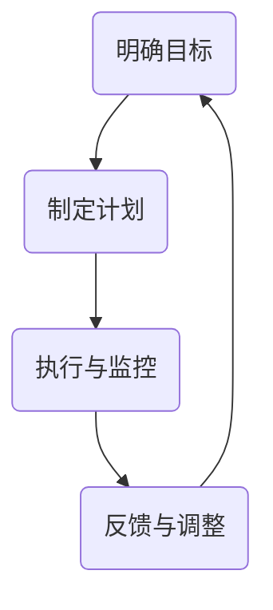
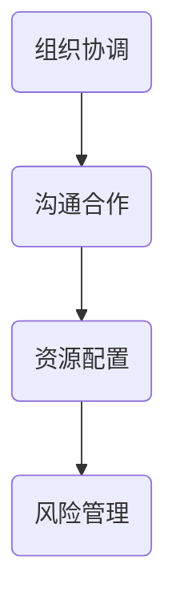
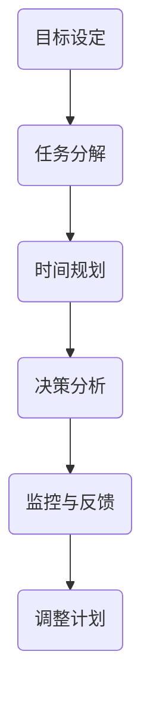

                 

# 行动体系如何提升执行力

## 关键词
执行力，行动体系，目标设定，计划制定，反馈调整，时间管理，决策技巧，组织策略，实践案例

## 摘要
本文旨在探讨如何通过构建和优化行动体系来提升个体和组织的执行力。首先，我们将详细阐述行动体系的基本概念和组成部分，接着分析提升执行力的原理和技巧，最后通过实际案例和实践总结，提供实用的方法和策略。通过本文的阅读，读者将能够全面理解执行力的重要性，掌握提升执行力的方法和工具，并在实际工作中有效应用。

## 目录大纲

### 第一部分：行动体系的基本概念

#### 第1章：行动体系的定义与作用
##### 1.1 行动体系的概念
##### 1.2 行动体系在提升执行力中的作用

#### 第2章：执行力提升的原理
##### 2.1 执行力的定义
##### 2.2 提升执行力的原理

#### 第3章：行动体系的构建
##### 3.1 行动体系的构建步骤
##### 3.2 行动体系的实施

### 第二部分：执行力提升的方法

#### 第4章：执行力提升的技巧
##### 4.1 时间管理技巧
##### 4.2 决策技巧

#### 第5章：执行力提升的工具
##### 5.1 常用执行力提升工具
##### 5.2 执行力提升工具的运用

#### 第6章：执行力提升的策略
##### 6.1 组织策略
##### 6.2 个人策略

### 第三部分：执行力提升的实践

#### 第7章：执行力提升的案例分析
##### 7.1 案例一：如何提高销售团队的执行力
##### 7.2 案例二：如何提高项目团队的执行力

#### 第8章：执行力提升的实践总结
##### 8.1 实践中的问题与对策
##### 8.2 执行力提升的未来展望

### 附录

#### 附录A：执行力提升工具集
##### A.1 工具集概述
##### A.2 工具集案例分析

#### 附录B：执行力提升资源集
##### B.1 资源集概述
##### B.2 资源集案例分析

## 第一部分：行动体系的基本概念

### 第1章：行动体系的定义与作用

#### 1.1 行动体系的概念

行动体系是一种系统化的方法，用于指导、协调和推动组织或个人实现目标。它由一系列相互关联的元素组成，包括目标设定、计划制定、执行与监控、反馈与调整等。通过这些元素的有机结合，行动体系为个体和组织的行动提供明确的路径和指导，从而提高执行力。

#### 1.2 行动体系在提升执行力中的作用

行动体系在提升执行力方面具有重要作用，主要体现在以下几个方面：

1. **明确目标**：行动体系通过明确目标，帮助个体和组织聚焦资源，减少模糊性和不确定性，从而提高执行的方向感。

2. **制定计划**：行动体系通过制定详细的计划，将目标分解为具体的任务和步骤，确保每个任务都有明确的执行路径和责任人。

3. **执行与监控**：行动体系通过实施和监控，确保任务按照计划进行，及时发现和纠正执行过程中的问题，确保目标达成。

4. **反馈与调整**：行动体系通过建立反馈机制，对执行结果进行评估和反馈，根据反馈结果进行调整，以优化执行过程和提高执行力。

### 图1.1 行动体系的组成部分

### 1.3 行动体系的组成部分

行动体系主要由以下四个核心组成部分构成：

1. **目标设定**：确定具体的、可量化的目标，是行动体系的基础。明确的目标有助于个体和组织聚焦资源，减少模糊性和不确定性。

2. **计划制定**：将目标分解为具体的任务和步骤，制定详细的行动计划，确保每个任务都有明确的执行路径和责任人。

3. **执行与监控**：实施行动计划，确保任务按照计划进行，同时进行监控，及时发现和纠正执行过程中的问题。

4. **反馈与调整**：对执行结果进行评估和反馈，根据反馈结果进行调整，以优化执行过程和提高执行力。

### 图1.2 行动体系的运作流程

### 1.4 行动体系在提升执行力中的作用

行动体系在提升执行力方面具有以下几个重要作用：

1. **提高方向感**：通过明确目标，行动体系帮助个体和组织聚焦资源，减少模糊性和不确定性，从而提高执行的方向感。

2. **提高任务完成率**：行动体系通过制定详细的计划，将目标分解为具体的任务和步骤，确保每个任务都有明确的执行路径和责任人，从而提高任务完成率。

3. **提高监控能力**：行动体系通过实施和监控，确保任务按照计划进行，同时进行监控，及时发现和纠正执行过程中的问题，从而提高监控能力。

4. **提高反馈与调整能力**：行动体系通过建立反馈机制，对执行结果进行评估和反馈，根据反馈结果进行调整，以优化执行过程和提高执行力。

### 1.5 行动体系与执行力提升的关系

行动体系和执行力提升之间存在着密切的关系。一方面，行动体系为执行力提升提供了系统化的方法和支持；另一方面，执行力提升是行动体系有效运作的结果。具体来说：

1. **行动体系是执行力提升的基础**：通过构建和优化行动体系，个体和组织可以系统地提升执行力，实现目标。

2. **执行力提升是行动体系的有效体现**：执行力提升是行动体系运作的结果，它反映了行动体系在提升执行力方面的效果。

3. **行动体系与执行力提升相互促进**：通过不断优化行动体系，个体和组织可以进一步提高执行力；同时，执行力的提升也为行动体系的优化提供了依据和方向。

### 总结

本章介绍了行动体系的基本概念和组成部分，并分析了行动体系在提升执行力中的作用。通过明确目标、制定计划、执行与监控以及反馈与调整，行动体系为个体和组织的行动提供了系统化的指导和支持，从而有效提升执行力。接下来，我们将进一步探讨执行力提升的原理和技巧，帮助读者更好地理解和应用行动体系。

## 第二部分：执行力提升的原理

### 第2章：执行力提升的原理

#### 2.1 执行力的定义

执行力是指个体或组织在实际工作中，将计划转化为成果的能力。它不仅包括完成任务的意愿和决心，还涉及到实施计划的策略、方法和技巧。执行力强的个体或组织，能够在面对挑战和困难时，坚定不移地按照计划执行，并最终实现目标。

### 2.2 执行力的核心要素

执行力由以下几个核心要素构成：

1. **目标意识**：对目标的清晰认识和坚定追求。
2. **意志力**：克服困难、坚持不懈的精神力量。
3. **自律**：自我管理和自我约束的能力。
4. **动机**：内部驱动力和外部激励。

### 图2.1 执行力的核心要素

#### 2.3 提升执行力的原理

提升执行力的原理可以从行为科学、心理学和管理学等多个角度进行阐述。以下是几个关键的原理：

1. **目标设定原理**：明确的目标是提升执行力的基础。通过设定具体、可量化的目标，个体和组织可以更清晰地了解自己的行动方向，从而提高执行力。

2. **激励机制原理**：激励机制可以增强个体的执行动力。合理的激励机制包括奖励、惩罚、荣誉等，可以有效激发个体的积极性，提高执行力。

3. **反馈与调整原理**：及时有效的反馈和调整是提升执行力的关键。通过反馈和调整，个体和组织可以及时发现和纠正执行过程中的问题，优化执行过程。

4. **行为科学原理**：行为科学研究表明，行为的改变可以通过正向激励和习惯养成来实现。通过培养良好的工作习惯，个体可以提升执行力。

5. **心理学原理**：心理学研究表明，情绪状态和自我效能感对执行力有重要影响。通过调整情绪状态和提高自我效能感，个体可以提升执行力。

6. **管理学原理**：管理学原理强调组织结构、流程优化和文化建设对执行力的影响。通过优化组织结构和流程，建立积极的企业文化，组织可以提升整体执行力。

### 图2.2 提升执行力的原理

#### 2.4 行为科学原理

行为科学原理主要关注人类行为和心理因素。以下是几个关键的行为科学原理：

1. **目标设定**：通过设定具体、可量化的目标，个体可以更清晰地了解自己的行动方向，从而提高执行力。
2. **正向激励**：正向激励，如奖励和表扬，可以增强个体的积极性和执行力。
3. **习惯养成**：通过重复和坚持，个体可以培养良好的工作习惯，从而提高执行力。
4. **行为反馈**：及时有效的反馈可以帮助个体了解自己的行为效果，从而进行调整和优化。

#### 2.5 心理学原理

心理学原理关注个体的心理状态和心理过程。以下是几个关键的心理学原理：

1. **情绪状态**：情绪状态对执行力有重要影响。积极的情绪状态可以提高执行力，而消极的情绪状态则会降低执行力。
2. **自我效能感**：自我效能感是指个体对自己完成某项任务的信心。通过提高自我效能感，个体可以提升执行力。
3. **心理压力**：适度的心理压力可以激发个体的积极性和执行力，但过度的心理压力则会降低执行力。
4. **心理调节**：通过心理调节，个体可以调整自己的情绪状态和心理压力，从而提升执行力。

#### 2.6 管理学原理

管理学原理关注组织结构和流程对执行力的影响。以下是几个关键的管理学原理：

1. **组织结构**：合理的组织结构可以明确职责和权限，提高组织的协作效率和执行力。
2. **流程优化**：通过优化工作流程，减少不必要的环节和等待时间，可以提高组织的执行力。
3. **文化建设**：积极的企业文化可以激发员工的工作热情和执行力，从而提高组织的整体执行力。
4. **领导力**：领导者的领导力和管理水平对组织的执行力有重要影响。通过提升领导力，领导者可以增强组织的执行力。

### 图2.3 行为科学、心理学和管理学原理在执行力提升中的应用

#### 2.7 执行力提升的实践意义

执行力提升在个体和组织层面都具有重要的实践意义：

1. **个体层面**：提升执行力可以帮助个体更好地实现个人目标和职业发展，提高工作质量和效率，增强自信心和成就感。

2. **组织层面**：提升执行力可以增强组织的竞争力，提高工作效率和成果，优化组织结构和文化，实现组织目标的顺利达成。

### 总结

本章从行为科学、心理学和管理学等多个角度，探讨了执行力提升的原理。通过明确目标、激励机制、反馈与调整、行为科学、心理学和管理学等原理的应用，个体和组织可以有效地提升执行力。接下来，我们将进一步探讨行动体系的构建方法，帮助读者更好地理解和应用行动体系来提升执行力。

## 第三部分：行动体系的构建

### 第3章：行动体系的构建

#### 3.1 行动体系的构建步骤

构建一个有效的行动体系是一个系统化的过程，需要按照以下步骤进行：

1. **明确目标**：首先，要设定明确、具体的、可量化的目标。目标是行动体系的起点，也是行动体系构建的核心。明确的目标有助于减少执行过程中的模糊性和不确定性，使团队成员对目标有清晰的认识和追求。

2. **制定计划**：在明确目标后，需要制定详细的行动计划。这包括将目标分解为具体的任务和步骤，并为每个任务分配责任人和完成时间。通过制定详细的计划，可以确保每个任务都有明确的执行路径，有助于提高执行效率。

3. **执行与监控**：执行计划是行动体系的核心环节。在执行过程中，要确保每个任务按照计划进行，同时进行监控，及时发现和纠正执行过程中的问题。监控可以帮助团队了解任务进度，确保目标的顺利实现。

4. **反馈与调整**：在执行过程中，需要建立反馈机制，对执行结果进行评估和反馈。通过反馈，可以了解任务的完成情况，发现执行过程中的问题和不足，并及时进行调整。反馈与调整是行动体系持续优化的重要手段。

#### 图3.1 行动体系的构建步骤

#### 3.2 行动体系的实施

在构建好行动体系后，如何有效地实施行动体系是关键。以下是实施行动体系的一些关键步骤：

1. **组织协调**：实施行动体系需要团队成员之间的密切协作和配合。组织协调是确保行动体系顺利实施的重要环节。要明确团队成员的职责和任务，建立有效的沟通渠道，确保信息的及时传递和共享。

2. **沟通合作**：沟通合作是行动体系实施的重要保障。团队成员之间要建立良好的沟通机制，确保信息的透明和及时性。同时，要鼓励团队成员之间的合作和协作，共同解决问题，提高整体执行力。

3. **资源配置**：实施行动体系需要合理的资源配置。要根据任务的需求，合理安排人力资源、物资资源和时间资源。通过优化资源配置，可以提高执行效率，确保任务按时完成。

4. **风险管理**：在实施行动体系的过程中，要识别和评估潜在的风险，并制定相应的风险管理措施。通过风险管理，可以减少执行过程中的不确定性和风险，确保行动体系的顺利实施。

#### 图3.2 行动体系的实施步骤

### 3.3 行动体系的核心原则

在构建和实施行动体系时，需要遵循以下核心原则：

1. **目标导向**：行动体系应以目标为导向，确保每个环节都围绕着目标进行设计和实施。

2. **系统化**：行动体系应是一个系统化的整体，各个环节之间应相互关联和协调，形成一个完整的体系。

3. **可执行性**：行动体系应具备可执行性，确保每个任务都有明确的执行路径和责任人。

4. **灵活性**：行动体系应具备一定的灵活性，能够根据实际情况进行调整和优化，以适应变化的环境。

5. **透明性**：行动体系应具备透明性，确保团队成员对行动体系的了解和参与，提高整体的协作效率和执行力。

### 3.4 行动体系的应用场景

行动体系可以广泛应用于各种场景，包括：

1. **项目管理**：在项目管理中，行动体系可以帮助项目团队明确目标、制定计划、执行任务和监控进度，确保项目按时完成。

2. **团队协作**：在团队协作中，行动体系可以帮助团队成员明确职责、协调合作、优化资源配置，提高团队的执行力和协作效率。

3. **目标管理**：在目标管理中，行动体系可以帮助个人和团队设定目标、制定计划、执行任务和反馈调整，确保目标的实现。

4. **风险管理**：在风险管理中，行动体系可以帮助团队识别风险、评估风险、制定应对策略和监控风险，确保行动的顺利实施。

### 总结

本章介绍了行动体系的构建步骤、实施方法和核心原则，并探讨了行动体系的应用场景。通过明确目标、制定计划、执行与监控以及反馈与调整，行动体系为个体和组织的行动提供了系统化的指导和支持，从而有效提升执行力。接下来，我们将进一步探讨执行力提升的技巧和工具，帮助读者更好地理解和应用行动体系来提升执行力。

## 第四部分：执行力提升的技巧

### 第4章：执行力提升的技巧

#### 4.1 时间管理技巧

时间管理是提升执行力的关键技巧之一。以下是一些常见的时间管理技巧：

1. **时间规划**：制定详细的日程表，将任务分配到具体的日期和时间。通过时间规划，可以明确任务的时间节点，确保任务按时完成。

2. **优先级排序**：根据任务的重要性和紧急性，对任务进行优先级排序。优先完成重要且紧急的任务，避免因琐碎事务而耽误重要任务的完成。

3. **时间块分配**：将工作时间划分为不同的时间块，每个时间块专注于一项任务。通过时间块分配，可以提高工作效率，减少任务切换带来的时间浪费。

4. **避免时间浪费**：识别并减少不必要的时间浪费，如过多的社交媒体浏览、无意义的会议等。通过减少时间浪费，可以更好地利用时间，提高执行力。

#### 4.2 决策技巧

决策技巧在执行力提升中同样重要。以下是一些决策技巧：

1. **决策模型**：使用决策模型，如决策树分析法，对问题进行详细分析，明确每个决策的利弊。通过决策模型，可以提高决策的准确性和科学性。

2. **决策流程**：建立明确的决策流程，包括问题识别、信息收集、方案评估、决策制定和执行等环节。通过明确的决策流程，可以确保决策的规范性和有效性。

3. **风险评估**：在决策过程中，对潜在的风险进行评估，并制定相应的应对策略。通过风险评估，可以降低决策的风险，提高决策的可行性。

4. **信息收集**：在决策过程中，充分收集相关信息，包括数据、专家意见、历史案例等。通过信息收集，可以全面了解问题的各个方面，提高决策的准确性。

#### 4.3 避免拖延

拖延是执行力提升中的常见问题。以下是一些避免拖延的技巧：

1. **设定明确的目标和期限**：设定明确的目标和期限，有助于激发行动的动力。明确的目标和期限可以减少拖延的心理，提高执行力。

2. **分解任务**：将大任务分解为小任务，逐一完成。通过分解任务，可以降低任务的难度和压力，减少拖延的可能性。

3. **建立奖励机制**：为自己设定奖励机制，如完成任务后给自己买一杯咖啡或看一集喜欢的电视剧。通过奖励机制，可以增强完成任务的动力。

4. **避免过度疲劳**：保持良好的工作和休息平衡，避免过度疲劳。过度疲劳会影响工作效率和执行力，增加拖延的风险。

### 总结

本章介绍了时间管理技巧、决策技巧和避免拖延的技巧。通过合理的时间规划、优先级排序、避免时间浪费，可以有效提高工作效率；通过使用决策模型、建立决策流程、信息收集，可以增强决策的科学性和准确性；通过设定明确的目标和期限、分解任务、建立奖励机制、避免过度疲劳，可以减少拖延，提高执行力。接下来，我们将进一步探讨执行力提升的工具和策略，帮助读者在实际工作中更好地应用这些技巧。

## 第五部分：执行力提升的工具

### 第5章：执行力提升的工具

#### 5.1 常用执行力提升工具

在提升执行力的过程中，使用合适的工具可以显著提高工作效率和效果。以下是一些常用的执行力提升工具：

1. **目标管理工具**：如 SMART（具体、可衡量、可达成、相关、时限）目标设定法。SMART 目标有助于明确目标，提高执行的针对性和可操作性。

2. **时间管理工具**：如时间管理矩阵（Eisenhower Matrix）和番茄工作法（Pomodoro Technique）。这些工具可以帮助合理安排时间，提高任务完成效率。

3. **决策支持工具**：如决策树（Decision Tree）和风险矩阵（Risk Matrix）。这些工具可以帮助分析决策选项和潜在风险，提高决策的科学性和准确性。

#### 5.2 工具的运用方法

使用这些工具时，可以遵循以下步骤：

1. **目标设定**：使用 SMART 方法，明确具体、可衡量、可达成、相关且有时限的目标。

2. **任务分解**：将大任务分解为小任务，明确每个任务的完成时间和责任人。

3. **时间规划**：使用时间管理矩阵和番茄工作法，合理安排任务的时间，提高效率。

4. **决策分析**：使用决策树和风险矩阵，分析决策选项和潜在风险，制定决策策略。

5. **监控与反馈**：定期检查任务进度，收集反馈信息，及时调整执行计划。

### 图5.1 执行力提升工具运用流程

#### 5.3 工具的实际应用案例

以下是几个实际应用案例，展示这些工具如何帮助提升执行力：

1. **目标管理工具在项目中的应用**：一个项目团队使用 SMART 目标设定法，明确项目目标，并将目标分解为具体任务，确保每个任务都有明确的完成时间和责任人。通过这种方式，项目团队能够更好地聚焦目标，提高执行力。

2. **时间管理工具在日常工作中的应用**：一位职场人士使用时间管理矩阵，将工作任务划分为重要且紧急、重要不紧急、不重要但紧急、不重要且不紧急四个类别，优先完成重要任务。通过这种方式，他能够更有效地利用时间，提高工作效率。

3. **决策支持工具在投资决策中的应用**：一位投资者在使用决策树分析投资选项时，对每个决策节点进行了详细的风险评估，并制定了相应的应对策略。通过这种方式，他能够更科学地做出投资决策，降低投资风险。

### 总结

本章介绍了执行力提升的常用工具及其运用方法，并通过实际应用案例展示了这些工具如何帮助提升执行力。通过合理运用这些工具，个体和团队可以更有效地设定目标、管理时间和做出决策，从而提高整体执行力。接下来，我们将探讨执行力提升的策略，帮助读者在实际工作中更好地应用这些工具。

## 第六部分：执行力提升的策略

### 第6章：执行力提升的策略

#### 6.1 组织策略

在提升组织执行力时，组织策略起着关键作用。以下是一些有效的组织策略：

1. **组织架构优化**：通过调整组织架构，明确各部门和岗位的职责，提高组织的协调效率和执行力。例如，将职责重叠的部门合并，或重新设定岗位职能，以避免资源浪费和职责不清。

2. **流程优化**：对现有流程进行重新设计和优化，简化不必要的环节，减少冗余，提高流程效率。例如，通过引入自动化工具，减少手动操作，或优化审批流程，减少审批环节和等待时间。

3. **团队建设**：加强团队建设，提升团队协作能力和执行力。例如，通过定期的团队培训和团队建设活动，增强团队成员之间的沟通和信任，提高团队的整体执行力。

#### 6.2 个人策略

在提升个人执行力时，个人策略同样至关重要。以下是一些有效的个人策略：

1. **能力提升**：通过不断学习和提升个人技能，增强自己在工作中的执行能力。例如，通过参加培训课程、阅读专业书籍或在线学习，提升自己的专业知识和技能。

2. **自我管理**：通过自我管理，提高个人的自律和自我调节能力。例如，制定合理的工作计划，设定优先级，避免拖延，确保任务按时完成。

3. **情绪管理**：通过情绪管理，保持积极的心态，提高情绪智力，从而增强执行力。例如，通过冥想、运动或与朋友交流，缓解压力，保持情绪稳定。

#### 6.3 组织与个人策略的结合

在提升执行力时，组织策略和个人策略需要有机结合，相互支持。以下是一些结合策略的方法：

1. **共同目标**：组织和个人应设定共同的目标，确保双方在目标和方向上的一致性。通过共同目标的设定，可以增强组织与个人之间的协同效应，提高整体执行力。

2. **资源共享**：组织应提供必要的资源和支持，帮助个人提升能力，实现个人目标。例如，组织可以提供培训机会、技术支持或团队协作平台，帮助个人提升执行力和工作效率。

3. **激励机制**：组织应建立有效的激励机制，激励个人为实现组织目标而努力。例如，通过设立奖励制度、晋升机制或团队竞赛，激发个人的积极性和执行力。

4. **持续反馈**：组织和个人应建立持续的反馈机制，通过定期评估和反馈，了解执行过程中的问题和不足，并及时进行调整和优化。例如，组织可以定期召开绩效评估会议，个人可以定期反思和总结工作，从而不断提升执行力。

#### 6.4 执行力提升的长期策略

为了实现长期的执行力提升，组织和个人需要采取以下策略：

1. **文化建设**：组织应注重文化建设，培育积极向上的企业文化，增强员工的归属感和责任感。例如，通过宣传优秀员工事迹、建立企业价值观，营造良好的工作氛围。

2. **能力发展**：组织和个人应注重能力发展，不断提升自身的专业素质和综合能力。例如，通过持续学习、实践和创新，提升个人和组织的核心竞争力。

3. **持续改进**：组织和个人应坚持持续改进，不断反思和优化执行过程中的问题和不足。例如，通过定期的反馈和评估，发现问题，采取改进措施，实现执行力不断提升。

4. **创新驱动**：组织和个人应鼓励创新思维和实践，不断探索新的工作方法和工具，提高执行效率和质量。例如，通过引入新技术、新工具或新方法，提升执行力和创新能力。

### 总结

本章介绍了执行力提升的组织策略和个人策略，并探讨了如何将两者有机结合。通过组织架构优化、流程优化、团队建设、能力提升、自我管理、情绪管理等策略，组织和个人可以共同提升执行力。结合共同目标、资源共享、激励机制和持续反馈等长期策略，可以实现长期的执行力提升。接下来，我们将通过实际案例，进一步探讨执行力提升的实践方法。

## 第七部分：执行力提升的实践

### 第7章：执行力提升的案例分析

#### 案例一：如何提高销售团队的执行力

##### 案例背景

一家大型科技公司拥有一支庞大的销售团队，但近年来销售业绩不理想。公司管理层发现，销售团队在执行销售计划时存在诸多问题，如目标设定不明确、计划制定不合理、执行过程中缺乏监督和反馈等。为了提高销售团队的执行力，公司决定实施一系列改进措施。

##### 执行力提升的具体措施

1. **明确目标**：公司首先明确了销售团队的具体目标，包括销售数量、销售区域、客户类型等。每个销售人员都收到了一份详细的销售目标书，明确了各自的职责和任务。

2. **制定计划**：公司制定了详细的销售计划，包括销售策略、销售路径、客户跟进计划等。销售计划中明确了每个阶段的任务和时间节点，确保销售团队能够按照计划执行。

3. **监督与反馈**：公司建立了监督机制，通过定期检查销售团队的执行情况，及时发现问题并进行反馈。销售经理定期与销售人员沟通，了解销售进度，并提供必要的支持。

4. **激励机制**：公司设立了激励机制，根据销售业绩给予奖金和晋升机会。这激发了销售团队的积极性和执行力，提高了销售业绩。

5. **培训与支持**：公司定期为销售人员提供销售技能和产品知识的培训，提高他们的专业能力。同时，公司还提供了销售工具和支持，如CRM系统、销售指南等，帮助销售人员更高效地完成销售任务。

##### 实施效果

通过一系列改进措施，销售团队的执行力显著提高。具体表现为：

- 销售目标完成率显著提升，平均完成率从原来的60%提高到90%。
- 销售业绩稳步增长，销售额同比增长30%。
- 销售团队的士气和工作积极性显著提高，员工满意度上升。
- 客户满意度提升，客户投诉率下降。

##### 案例总结

这个案例表明，通过明确目标、制定计划、监督与反馈、激励机制和培训支持等措施，可以有效提升销售团队的执行力。明确的目标和详细的计划为执行提供了清晰的路径，监督与反馈机制确保了执行的顺利进行，激励机制激发了团队的积极性和执行力，培训与支持提高了团队成员的专业能力和工作效率。

#### 案例二：如何提高项目团队的执行力

##### 案例背景

某科技公司承接了一个大型的软件开发项目，项目涉及多个部门和团队，项目周期长、任务复杂。项目初期，由于项目计划不周密、团队成员沟通不畅、执行过程中缺乏监督和反馈，导致项目进度缓慢、质量不达标。为了提高项目团队的执行力，公司决定对项目进行重新规划和优化。

##### 执行力提升的具体措施

1. **明确目标**：公司明确了项目的最终目标，包括功能需求、时间节点、质量标准等。项目目标被分解为具体的任务，每个任务都有明确的责任人和完成时间。

2. **制定详细计划**：公司制定了详细的项目计划，包括项目进度、任务分配、资源需求等。项目计划中明确了每个阶段的任务和时间节点，确保项目按照计划进行。

3. **建立沟通机制**：公司建立了有效的沟通机制，通过定期召开项目会议、使用项目管理工具，确保团队成员之间的信息共享和及时沟通。

4. **监督与反馈**：公司建立了监督机制，通过定期检查项目进度和质量，及时发现问题并进行反馈。项目经理定期与团队成员沟通，了解项目进展，并提供必要的支持。

5. **资源协调**：公司确保项目所需资源得到充分协调和分配，包括人力、物资、技术支持等。通过资源协调，确保项目各阶段的任务能够按时完成。

6. **培训与支持**：公司为项目团队成员提供了必要的培训和支持，包括技术培训、项目管理知识等。通过培训，提高团队成员的专业能力和工作效率。

##### 实施效果

通过一系列改进措施，项目团队的执行力显著提高。具体表现为：

- 项目进度得到有效控制，项目按计划顺利完成。
- 项目质量显著提升，客户满意度提高。
- 团队成员之间的沟通和协作能力增强，项目成功交付。
- 项目团队的执行力和协作效率提高，为后续项目奠定了良好基础。

##### 案例总结

这个案例表明，通过明确目标、制定详细计划、建立沟通机制、监督与反馈、资源协调和培训与支持等措施，可以有效提升项目团队的执行力。明确的目标和详细的计划为执行提供了清晰的路径，沟通机制确保了信息的及时传递，监督与反馈机制确保了执行的顺利进行，资源协调确保了任务的按时完成，培训与支持提高了团队成员的专业能力和工作效率。

### 总结

以上两个案例展示了通过具体的措施和方法，如何有效提升销售团队和项目团队的执行力。明确的目标、详细的计划、监督与反馈、激励机制和培训支持是提升执行力的关键因素。这些措施和方法不仅适用于销售团队和项目团队，也可以推广到其他类型的团队和组织中，为提升整体执行力提供参考。

## 第八部分：执行力提升的实践总结

### 8.1 实践中的问题与对策

在执行力提升的实践中，会遇到各种问题和挑战。以下是常见的几个问题及其对策：

1. **目标设定不明确**：对策：采用 SMART（具体、可衡量、可达成、相关、时限）目标设定法，确保目标清晰、具体和可操作。

2. **计划制定不合理**：对策：在制定计划时，充分考虑任务复杂性、资源需求和团队能力，确保计划具有可执行性。

3. **沟通不畅**：对策：建立有效的沟通机制，如定期会议、项目管理工具和即时通讯工具，确保信息及时传递和反馈。

4. **资源不足**：对策：合理配置资源，确保项目或任务所需的人力、物资和技术支持。

5. **激励机制不足**：对策：建立激励机制，如奖励、晋升和认可，激发团队成员的积极性和执行力。

6. **监督与反馈机制不完善**：对策：建立监督和反馈机制，定期检查任务进度和质量，及时发现问题并进行反馈。

7. **团队协作不佳**：对策：加强团队建设，提升团队协作能力和凝聚力，通过培训、团队活动和团队文化营造良好的工作氛围。

### 8.2 执行力提升的未来展望

未来，执行力提升将呈现出以下趋势和方向：

1. **数字化转型**：随着数字化技术的发展，执行力提升将更加依赖于数字工具和平台，如人工智能、大数据分析和自动化系统，以提高执行效率和质量。

2. **个性化与智能化**：执行力提升将更加注重个性化与智能化。通过数据分析，可以了解个体和团队的特点和需求，提供个性化的执行力提升方案。

3. **持续学习与改进**：执行力提升将强调持续学习和改进。组织和个人应不断更新知识和技能，以适应不断变化的工作环境和要求。

4. **跨领域融合**：执行力提升将跨领域融合，如将心理学、管理学和行为科学等领域的理论和方法应用于执行力提升实践中，提供更科学、更有效的解决方案。

5. **文化塑造**：执行力提升将更加注重企业文化的塑造。积极向上的企业文化可以增强员工的归属感和责任感，提高整体的执行力。

### 总结

执行力提升是一个持续不断的过程，需要组织和个人共同努力。通过实践总结，我们可以更好地识别和解决执行过程中遇到的问题，不断优化执行体系，提高整体执行力。未来的执行力提升将更加依赖于数字化转型、个性化与智能化、持续学习与改进、跨领域融合和文化塑造。只有不断适应和应对这些变化，我们才能在竞争激烈的环境中保持优势，实现持续发展。

## 附录

### 附录A：执行力提升工具集

#### A.1 工具集概述

执行力提升工具集包括目标管理工具、时间管理工具、决策支持工具等，旨在帮助个体和团队更高效地设定目标、管理时间和做出决策。以下是几个常用的工具集及其概述：

1. **目标管理工具**：如 SMART 目标设定法，用于明确和量化目标，确保目标的可执行性和可衡量性。
2. **时间管理工具**：如时间管理矩阵和番茄工作法，用于合理安排时间，提高工作效率。
3. **决策支持工具**：如决策树和风险矩阵，用于分析决策选项和潜在风险，提高决策的科学性和准确性。

#### A.2 工具集案例分析

以下是几个工具集的应用案例，展示如何通过这些工具提升执行力：

1. **SMART 目标设定法**：在项目管理中，项目经理使用 SMART 目标设定法，将项目目标分解为具体、可衡量的任务，确保团队成员明确自己的职责和任务。

2. **时间管理矩阵**：一位职场人士使用时间管理矩阵，将工作任务划分为重要且紧急、重要不紧急、不重要但紧急、不重要且不紧急四个类别，优先完成重要任务，提高工作效率。

3. **决策树**：在投资决策中，投资者使用决策树分析投资选项，对每个决策节点进行风险评估，制定最优投资策略。

### 附录B：执行力提升资源集

#### B.1 资源集概述

执行力提升资源集包括书籍、线上课程、案例分析等，旨在为读者提供丰富的学习资源和实践经验。以下是几个常用的资源集及其概述：

1. **书籍**：如《执行》、《高效能人士的七个习惯》等，提供了关于执行力提升的理论和实践指导。
2. **线上课程**：如 Coursera、edX 等平台上的执行力提升课程，提供了系统性的学习和实践指导。
3. **案例分析**：通过分析成功和失败的案例，读者可以学习到执行力提升的方法和技巧。

#### B.2 资源集案例分析

以下是几个资源集的应用案例，展示如何通过这些资源提升执行力：

1. **《执行》书籍**：一位项目经理在阅读《执行》后，将书中的理论应用到实际工作中，通过明确目标、制定计划和监督执行，提高了项目的完成率和质量。

2. **Coursera 上的执行力提升课程**：一位职场人士参加了 Coursera 上的执行力提升课程，通过系统学习，提高了时间管理和任务规划的能力，工作效率显著提高。

3. **案例分析**：一位创业者通过分析成功企业家的执行力提升案例，学习到如何设定目标、制定计划和激励团队，从而提高了自己的领导力和执行力。

### 总结

附录部分提供了执行力提升的工具集和资源集，为读者提供了丰富的学习资源和实践经验。通过使用这些工具和资源，读者可以系统地学习和应用执行力提升的方法，从而在实际工作中取得更好的成果。附录部分的内容不仅有助于理解文章的核心概念和原理，也为执行力提升提供了实用的指导和参考。

### 作者信息

**作者：AI天才研究院/AI Genius Institute & 禅与计算机程序设计艺术 /Zen And The Art of Computer Programming**

本文由 AI 天才研究院撰写，结合《禅与计算机程序设计艺术》中的哲学思想，深入探讨了行动体系如何提升执行力。希望本文能帮助读者更好地理解和应用执行力提升的方法，在实际工作中取得更好的成果。如有疑问或建议，欢迎联系作者进行讨论。

